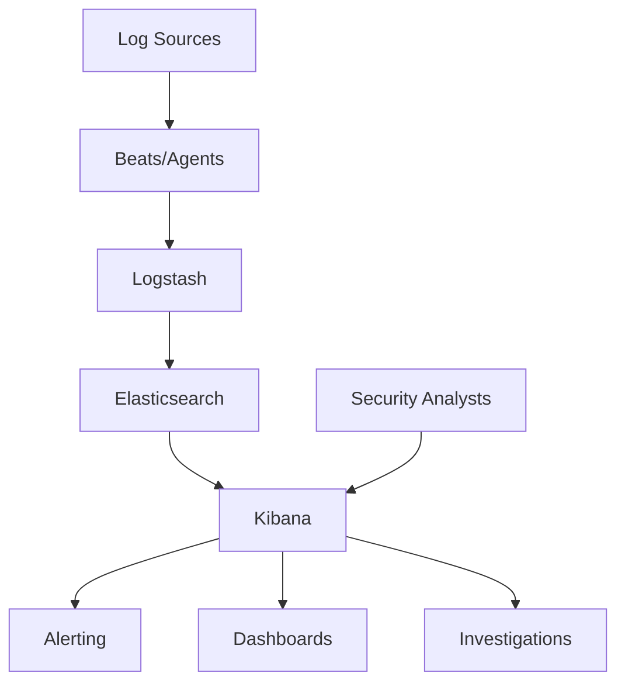

# ELK Stack for SOC: Building a Comprehensive SIEM Solution

**Author**: Yusuf Talha ARABACI  
**Date**: January 10, 2025  
**Category**: SOC Operations  
**Reading Time**: 15 minutes  

---

## 🔍 Introduction

The ELK Stack (Elasticsearch, Logstash, and Kibana) has become a cornerstone technology for Security Operations Centers (SOCs) worldwide. This comprehensive guide covers the implementation, configuration, and optimization of ELK Stack for security operations, including best practices, use cases, and advanced techniques for threat detection and incident response.

---

## 🏗️ ELK Stack Architecture Overview

### **Core Components**



### **Component Breakdown**

| Component | Purpose | Key Features |
|:---------:|:-------:|:------------:|
| **Elasticsearch** | Search & Analytics Engine | Distributed, RESTful, JSON-based |
| **Logstash** | Data Processing Pipeline | ETL, filtering, enrichment |
| **Kibana** | Visualization & Management | Dashboards, alerting, ML |
| **Beats** | Lightweight Data Shippers | Filebeat, Winlogbeat, Packetbeat |

---

## ⚙️ Installation and Configuration

### **1. Elasticsearch Setup**

**System Requirements**:
- RAM: Minimum 8GB, Recommended 32GB+
- Storage: SSD recommended, 3x raw data size
- CPU: Multi-core processors for better performance

**Installation on Ubuntu**:
```bash
# Install Java 11
sudo apt update
sudo apt install openjdk-11-jdk

# Add Elasticsearch repository
wget -qO - https://artifacts.elastic.co/GPG-KEY-elasticsearch | sudo apt-key add -
echo "deb https://artifacts.elastic.co/packages/8.x/apt stable main" | sudo tee /etc/apt/sources.list.d/elastic-8.x.list

# Install Elasticsearch
sudo apt update
sudo apt install elasticsearch

# Configure Elasticsearch
sudo nano /etc/elasticsearch/elasticsearch.yml
```

**Elasticsearch Configuration**:
```yaml
# /etc/elasticsearch/elasticsearch.yml
cluster.name: soc-cluster
node.name: soc-node-1
path.data: /var/lib/elasticsearch
path.logs: /var/log/elasticsearch
network.host: 0.0.0.0
http.port: 9200
discovery.type: single-node

# Security settings
xpack.security.enabled: true
xpack.security.transport.ssl.enabled: true
xpack.security.http.ssl.enabled: true

# Memory settings (in jvm.options)
-Xms16g
-Xmx16g
```

### **2. Logstash Configuration**

**Installation**:
```bash
sudo apt install logstash
```

**Sample Configuration for Windows Logs**:
```ruby
# /etc/logstash/conf.d/windows-logs.conf
input {
  beats {
    port => 5044
  }
}

filter {
  if [agent][type] == "winlogbeat" {
    # Parse Windows Event Logs
    if [winlog][event_id] == 4624 {
      mutate {
        add_tag => ["successful_logon"]
      }
    }
    
    if [winlog][event_id] == 4625 {
      mutate {
        add_tag => ["failed_logon"]
      }
    }
    
    # Enrich with GeoIP data
    if [source][ip] {
      geoip {
        source => "[source][ip]"
        target => "geoip"
      }
    }
    
    # Add timestamp parsing
    date {
      match => ["[winlog][time_created]", "ISO8601"]
    }
  }
}

output {
  elasticsearch {
    hosts => ["localhost:9200"]
    index => "winlogbeat-%{+YYYY.MM.dd}"
  }
  
  # Optional: stdout for debugging
  stdout {
    codec => rubydebug
  }
}
```

### **3. Kibana Setup**

**Installation and Configuration**:
```bash
sudo apt install kibana

# Configure Kibana
sudo nano /etc/kibana/kibana.yml
```

**Kibana Configuration**:
```yaml
# /etc/kibana/kibana.yml
server.port: 5601
server.host: "0.0.0.0"
elasticsearch.hosts: ["http://localhost:9200"]
server.name: "soc-kibana"

# Security settings
elasticsearch.username: "kibana_system"
elasticsearch.password: "your_password"
```

---

## 🔧 Data Sources and Ingestion

### **1. Windows Event Logs with Winlogbeat**

**Winlogbeat Configuration**:
```yaml
# winlogbeat.yml
winlogbeat.event_logs:
  - name: Security
    event_id: 4624, 4625, 4648, 4672, 4720, 4728
  - name: System
  - name: Application
  - name: Microsoft-Windows-Sysmon/Operational

output.logstash:
  hosts: ["logstash-server:5044"]

processors:
  - add_host_metadata:
      when.not.contains.tags: forwarded
```

### **2. Linux System Logs with Filebeat**

**Filebeat Configuration**:
```yaml
# filebeat.yml
filebeat.inputs:
- type: log
  enabled: true
  paths:
    - /var/log/auth.log
    - /var/log/syslog
    - /var/log/apache2/*.log
    - /var/log/nginx/*.log

- type: syslog
  protocol.udp:
    host: "0.0.0.0:514"

output.logstash:
  hosts: ["logstash-server:5044"]

processors:
  - add_docker_metadata: ~
  - add_kubernetes_metadata: ~
```

### **3. Network Traffic with Packetbeat**

**Packetbeat Configuration**:
```yaml
# packetbeat.yml
packetbeat.interfaces.device: any

packetbeat.flows:
  timeout: 30s
  period: 10s

packetbeat.protocols:
  dns:
    ports: [53]
  http:
    ports: [80, 8080, 8000, 5000, 8002]
  tls:
    ports: [443, 993, 995, 5223, 8443, 8883, 9243]

output.logstash:
  hosts: ["logstash-server:5044"]
```

---

## 🎨 Kibana Dashboards for SOC

### **1. Security Overview Dashboard**

**Key Visualizations**:
- Event volume over time
- Top source IPs
- Failed vs successful authentications
- Geographic distribution of events

**Sample Query**:
```json
{
  "query": {
    "bool": {
      "must": [
        {"range": {"@timestamp": {"gte": "now-24h"}}},
        {"term": {"event.dataset": "windows.security"}}
      ]
    }
  },
  "aggs": {
    "events_over_time": {
      "date_histogram": {
        "field": "@timestamp",
        "calendar_interval": "1h"
      }
    }
  }
}
```

### **2. Authentication Monitoring Dashboard**

**Visualizations**:
```json
{
  "query": {
    "bool": {
      "should": [
        {"term": {"winlog.event_id": "4624"}},
        {"term": {"winlog.event_id": "4625"}}
      ]
    }
  },
  "aggs": {
    "auth_results": {
      "terms": {
        "field": "event.outcome"
      }
    },
    "top_users": {
      "terms": {
        "field": "user.name.keyword",
        "size": 10
      }
    }
  }
}
```

### **3. Network Traffic Analysis Dashboard**

**Key Metrics**:
- Top protocols and ports
- DNS queries and responses
- HTTP status codes
- SSL/TLS certificate information

---

## 🚨 Security Use Cases and Detection Rules

### **1. Brute Force Attack Detection**

**Logstash Filter**:
```ruby
filter {
  if [winlog][event_id] == 4625 {
    # Count failed logons per user per hour
    aggregate {
      task_id => "%{[user][name]}-%{+YYYY.MM.dd.HH}"
      code => "
        map['failed_count'] ||= 0
        map['failed_count'] += 1
        event.set('failed_logon_count', map['failed_count'])
      "
      push_previous_map_as_event => true
      timeout_task_id_field => "task_id"
      timeout => 3600
    }
    
    if [failed_logon_count] and [failed_logon_count] >= 10 {
      mutate {
        add_tag => ["potential_brute_force"]
        add_field => {
          "alert_type" => "Brute Force Attack"
          "severity" => "high"
        }
      }
    }
  }
}
```

### **2. Suspicious Process Execution**

**Watcher Alert**:
```json
{
  "trigger": {
    "schedule": {
      "interval": "5m"
    }
  },
  "input": {
    "search": {
      "request": {
        "search_type": "query_then_fetch",
        "indices": ["winlogbeat-*"],
        "body": {
          "query": {
            "bool": {
              "must": [
                {"range": {"@timestamp": {"gte": "now-5m"}}},
                {"term": {"winlog.event_id": "1"}},
                {"regexp": {"process.name": ".*\\.(exe|bat|cmd|ps1)"}}
              ],
              "should": [
                {"wildcard": {"process.command_line": "*powershell*"}},
                {"wildcard": {"process.command_line": "*cmd.exe*"}},
                {"wildcard": {"process.command_line": "*wscript*"}}
              ]
            }
          }
        }
      }
    }
  },
  "condition": {
    "compare": {
      "ctx.payload.hits.total": {
        "gt": 0
      }
    }
  },
  "actions": {
    "send_email": {
      "email": {
        "to": ["soc@company.com"],
        "subject": "Suspicious Process Execution Detected",
        "body": "Alert: {{ctx.payload.hits.total}} suspicious processes detected"
      }
    }
  }
}
```

### **3. Anomalous Network Traffic**

**Machine Learning Job Configuration**:
```json
{
  "job_id": "network_traffic_anomaly",
  "job_type": "anomaly_detector",
  "data_description": {
    "time_field": "@timestamp"
  },
  "analysis_config": {
    "bucket_span": "15m",
    "detectors": [
      {
        "detector_description": "High bytes out",
        "function": "high_mean",
        "field_name": "network.bytes",
        "by_field_name": "source.ip"
      }
    ]
  },
  "data_feed_id": "network_traffic_feed",
  "indices": ["packetbeat-*"],
  "query": {
    "match_all": {}
  }
}
```

---

## 📊 Advanced Analytics and Machine Learning

### **1. Elasticsearch ML Features**

**Anomaly Detection Jobs**:
```bash
# Create ML job for user behavior analysis
PUT _ml/anomaly_detectors/user_behavior_analysis
{
  "job_id": "user_behavior_analysis",
  "analysis_config": {
    "bucket_span": "1h",
    "detectors": [
      {
        "function": "count",
        "by_field_name": "user.name"
      },
      {
        "function": "distinct_count",
        "field_name": "source.ip",
        "by_field_name": "user.name"
      }
    ]
  },
  "data_description": {
    "time_field": "@timestamp"
  }
}
```

### **2. Custom Scoring and Risk Assessment**

**Risk Score Calculation**:
```ruby
# Logstash filter for risk scoring
filter {
  ruby {
    code => "
      risk_score = 0
      
      # Base score for event type
      case event.get('[winlog][event_id]')
      when 4625
        risk_score += 20  # Failed logon
      when 4648
        risk_score += 30  # Explicit credential use
      when 4672
        risk_score += 40  # Special privileges assigned
      end
      
      # Increase score for off-hours activity
      hour = Time.parse(event.get('@timestamp')).hour
      if hour < 6 || hour > 22
        risk_score += 15
      end
      
      # Increase score for external IPs
      if event.get('[source][ip]') && 
         !event.get('[source][ip]').start_with?('10.', '172.', '192.168.')
        risk_score += 25
      end
      
      event.set('risk_score', risk_score)
      
      # Set alert level based on score
      if risk_score >= 70
        event.set('alert_level', 'critical')
      elsif risk_score >= 50
        event.set('alert_level', 'high')
      elsif risk_score >= 30
        event.set('alert_level', 'medium')
      else
        event.set('alert_level', 'low')
      end
    "
  }
}
```

---

## 🔍 Threat Hunting with ELK

### **1. Hunting Methodology**

**MITRE ATT&CK Mapping**:
```json
{
  "query": {
    "bool": {
      "must": [
        {"range": {"@timestamp": {"gte": "now-7d"}}},
        {"term": {"event.action": "process-created"}}
      ],
      "should": [
        {"wildcard": {"process.command_line": "*whoami*"}},
        {"wildcard": {"process.command_line": "*net user*"}},
        {"wildcard": {"process.command_line": "*net group*"}},
        {"wildcard": {"process.command_line": "*query user*"}}
      ],
      "minimum_should_match": 1
    }
  },
  "aggs": {
    "users": {
      "terms": {
        "field": "user.name.keyword"
      },
      "aggs": {
        "commands": {
          "terms": {
            "field": "process.command_line.keyword"
          }
        }
      }
    }
  }
}
```

### **2. Behavioral Analysis Queries**

**Unusual Login Times**:
```json
{
  "query": {
    "bool": {
      "must": [
        {"term": {"winlog.event_id": "4624"}},
        {"range": {"@timestamp": {"gte": "now-30d"}}}
      ]
    }
  },
  "aggs": {
    "users": {
      "terms": {
        "field": "user.name.keyword"
      },
      "aggs": {
        "login_hours": {
          "date_histogram": {
            "field": "@timestamp",
            "calendar_interval": "1h"
          }
        }
      }
    }
  }
}
```

---

## 🚀 Performance Optimization

### **1. Index Management**

**Index Lifecycle Management (ILM)**:
```json
{
  "policy": {
    "phases": {
      "hot": {
        "actions": {
          "rollover": {
            "max_size": "50gb",
            "max_age": "30d"
          }
        }
      },
      "warm": {
        "min_age": "30d",
        "actions": {
          "allocate": {
            "number_of_replicas": 0
          }
        }
      },
      "cold": {
        "min_age": "90d",
        "actions": {
          "allocate": {
            "number_of_replicas": 0
          }
        }
      },
      "delete": {
        "min_age": "365d"
      }
    }
  }
}
```

### **2. Query Optimization**

**Best Practices**:
- Use filters instead of queries when possible
- Leverage index patterns for time-based data
- Implement proper field mappings
- Use aggregations efficiently

**Example Optimized Query**:
```json
{
  "query": {
    "bool": {
      "filter": [
        {"term": {"event.dataset": "windows.security"}},
        {"range": {"@timestamp": {"gte": "now-1h"}}}
      ],
      "must": [
        {"match": {"message": "authentication failure"}}
      ]
    }
  }
}
```

---

## 🔐 Security Hardening

### **1. Elasticsearch Security**

**Enable Security Features**:
```yaml
# elasticsearch.yml
xpack.security.enabled: true
xpack.security.transport.ssl.enabled: true
xpack.security.http.ssl.enabled: true

# Set up users and roles
xpack.security.authc.realms.native.native1.order: 0
```

**Create Security Roles**:
```bash
# Create SOC analyst role
POST /_security/role/soc_analyst
{
  "cluster": ["monitor"],
  "indices": [
    {
      "names": ["*beat-*", "soc-*"],
      "privileges": ["read", "view_index_metadata"]
    }
  ]
}
```

### **2. Network Security**

**Firewall Configuration**:
```bash
# Allow only necessary ports
ufw allow 22/tcp    # SSH
ufw allow 9200/tcp  # Elasticsearch
ufw allow 5601/tcp  # Kibana
ufw allow 5044/tcp  # Logstash beats input

# Deny all other traffic
ufw default deny incoming
ufw enable
```

---

## 📈 Monitoring and Alerting

### **1. Cluster Health Monitoring**

**Health Check Script**:
```python
import requests
import json

def check_cluster_health():
    url = "http://localhost:9200/_cluster/health"
    response = requests.get(url)
    health = response.json()
    
    if health['status'] != 'green':
        send_alert(f"Cluster status: {health['status']}")
    
    if health['unassigned_shards'] > 0:
        send_alert(f"Unassigned shards: {health['unassigned_shards']}")

def send_alert(message):
    # Send to monitoring system
    print(f"ALERT: {message}")
```

### **2. Watcher Alerts**

**High Volume Alert**:
```json
{
  "trigger": {
    "schedule": {
      "interval": "1m"
    }
  },
  "input": {
    "search": {
      "request": {
        "indices": ["*beat-*"],
        "body": {
          "query": {
            "range": {
              "@timestamp": {
                "gte": "now-1m"
              }
            }
          }
        }
      }
    }
  },
  "condition": {
    "compare": {
      "ctx.payload.hits.total": {
        "gt": 10000
      }
    }
  },
  "actions": {
    "log_alert": {
      "logging": {
        "level": "warn",
        "text": "High log volume detected: {{ctx.payload.hits.total}} events in last minute"
      }
    }
  }
}
```

---

## 💡 Best Practices and Lessons Learned

### **1. Data Management**

- **Index Templates**: Use consistent field mappings
- **Retention Policies**: Implement appropriate data retention
- **Compression**: Enable index compression to save storage
- **Backup Strategy**: Regular snapshots to remote repository

### **2. Security Operations**

- **Correlation Rules**: Develop rules based on MITRE ATT&CK
- **False Positive Reduction**: Continuously tune detection rules
- **Threat Intelligence**: Integrate external threat feeds
- **Incident Response**: Link alerts to response procedures

### **3. Performance Considerations**

- **Hardware Sizing**: Plan for 3x raw log volume in storage
- **Memory Allocation**: Assign 50% of RAM to Elasticsearch heap
- **Network Bandwidth**: Consider log volume for network planning
- **Monitoring**: Implement comprehensive monitoring

---

## 🔮 Future Enhancements

### **Advanced Features**

- **Graph Analytics**: Investigate relationships between entities
- **Canvas**: Create executive dashboards and reports
- **Maps**: Geospatial analysis of security events
- **SIEM Rules**: Use Elastic Security's built-in rules

### **Integration Opportunities**

- **SOAR Platforms**: Automate incident response
- **Threat Intelligence**: Enrich events with IOCs
- **Identity Systems**: Correlate with user directories
- **Cloud Platforms**: Monitor multi-cloud environments

---

## 📚 Resources and References

- [Elastic Security Guide](https://www.elastic.co/guide/en/security/current/index.html)
- [ELK Stack Best Practices](https://www.elastic.co/guide/en/elasticsearch/guide/current/index.html)
- [MITRE ATT&CK Framework](https://attack.mitre.org/)
- [Elastic Common Schema](https://www.elastic.co/guide/en/ecs/current/index.html)

---

**About the Author**: Yusuf Talha ARABACI is a SOC Analyst with extensive experience in SIEM implementation and security operations. He specializes in ELK Stack deployment, threat detection rule development, and incident response automation.

---

[← Back to Blog](./README.md) | [Previous: DNS Security Analysis ←](./dns-security-analysis.md) | [Next: Windows System Management →](./windows-system-management.md)
