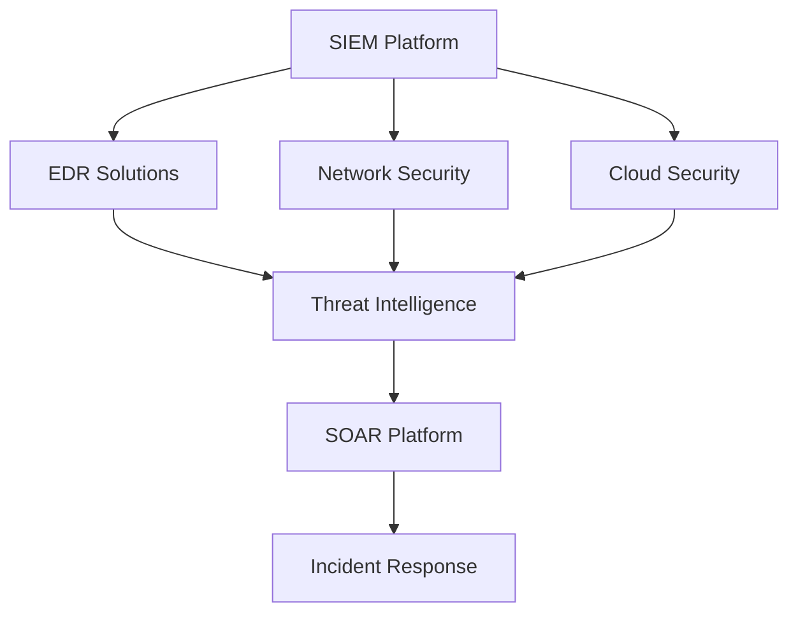

# SOC Evolution in 2024: Modern Security Operations Trends

**Author**: Yusuf Talha ARABACI  
**Date**: January 15, 2025  
**Category**: SOC Operations  
**Reading Time**: 8 minutes  

---

## 🔍 Executive Summary

The Security Operations Center (SOC) landscape has undergone significant transformation in 2024, driven by the evolution of threat actors, advancement in AI/ML technologies, and the increasing complexity of hybrid cloud environments. This comprehensive analysis explores the key trends, challenges, and innovations shaping modern SOC operations.

---

## 🚀 Key Trends in SOC Evolution

### 1. **AI-Powered Threat Detection**

The integration of artificial intelligence and machine learning has revolutionized threat detection capabilities:

- **Behavioral Analytics**: Advanced ML models now analyze user and entity behavior patterns to identify anomalies that traditional signature-based systems miss
- **Automated Threat Hunting**: AI-driven threat hunting platforms can proactively search for indicators of compromise across vast datasets
- **False Positive Reduction**: Intelligent filtering systems reduce alert fatigue by up to 70%, allowing analysts to focus on genuine threats

```python
# Example: AI-powered anomaly detection pseudocode
def detect_anomaly(user_behavior, baseline_profile):
    deviation_score = calculate_behavioral_deviation(user_behavior, baseline_profile)
    risk_level = ai_model.predict_risk(deviation_score)
    
    if risk_level > THRESHOLD:
        generate_alert(user_behavior, risk_level)
        initiate_automated_response()
```

### 2. **Cloud-Native SOC Architecture**

Organizations are migrating from traditional on-premises SOC infrastructure to cloud-native solutions:

- **Scalability**: Cloud platforms provide elastic scaling capabilities to handle varying log volumes
- **Global Visibility**: Centralized monitoring across multi-cloud and hybrid environments
- **Cost Optimization**: Pay-as-you-use models reduce operational costs by 40-60%

### 3. **Extended Detection and Response (XDR)**

XDR platforms have become the cornerstone of modern SOC operations:

- **Unified Data Integration**: Correlation of telemetry from endpoints, networks, cloud services, and applications
- **Automated Response**: Orchestrated incident response across multiple security tools
- **Comprehensive Timeline**: Complete attack chain reconstruction for thorough investigation

---

## 🛡️ Modern SOC Challenges

### **1. Skills Gap Crisis**

The cybersecurity talent shortage continues to impact SOC effectiveness:

- **Statistics**: 3.5 million unfilled cybersecurity positions globally
- **Impact**: Increased burnout rates and longer response times
- **Solutions**: Automation, outsourcing, and intensive training programs

### **2. Alert Fatigue**

Despite AI improvements, alert fatigue remains a significant challenge:

- **Volume**: Average SOC receives 10,000+ alerts daily
- **Quality**: Only 4% of alerts represent genuine security incidents
- **Mitigation**: Intelligent alert prioritization and contextual analysis

### **3. Threat Actor Sophistication**

Advanced Persistent Threats (APTs) have evolved significantly:

- **Living off the Land**: Attackers use legitimate tools and processes
- **Supply Chain Attacks**: Targeting third-party vendors and dependencies
- **AI-Powered Attacks**: Threat actors leveraging AI for reconnaissance and evasion

---

## 🔧 Technology Stack Evolution

### **SIEM 3.0 Capabilities**

Modern SIEM platforms have evolved beyond log aggregation:

| **Traditional SIEM** | **Modern SIEM 3.0** |
|:-------------------:|:--------------------:|
| Rule-based detection | AI/ML-powered analytics |
| On-premises deployment | Cloud-native architecture |
| Reactive analysis | Proactive threat hunting |
| Manual investigation | Automated response |

### **Integration Ecosystem**

Successful SOCs leverage integrated security ecosystems:



---

## 📊 SOC Metrics and KPIs

### **Key Performance Indicators**

Modern SOCs track comprehensive metrics:

1. **Mean Time to Detection (MTTD)**: Average: 207 days → Target: <24 hours
2. **Mean Time to Response (MTTR)**: Average: 280 days → Target: <4 hours
3. **Alert Closure Rate**: Target: >95% within SLA
4. **False Positive Rate**: Target: <5%

### **Business Impact Metrics**

- **Risk Reduction**: Quantifiable security posture improvement
- **Compliance Adherence**: Regulatory requirement fulfillment
- **Cost Avoidance**: Prevented breach costs and operational savings

---

## 🎯 Best Practices for Modern SOC Operations

### **1. Threat-Informed Defense**

Implement MITRE ATT&CK framework for structured threat modeling:

- Map security controls to specific adversary techniques
- Prioritize detection rules based on threat actor TTPs
- Conduct regular purple team exercises

### **2. Automation and Orchestration**

Leverage SOAR platforms for operational efficiency:

```python
# Example: Automated incident response workflow
def incident_response_workflow(alert):
    # Enrichment phase
    enriched_data = enrich_alert_with_threat_intel(alert)
    
    # Analysis phase
    severity = calculate_risk_score(enriched_data)
    
    # Response phase
    if severity == "CRITICAL":
        isolate_affected_systems(alert.source)
        notify_incident_response_team()
        initiate_forensic_collection()
    
    return create_incident_ticket(enriched_data, severity)
```

### **3. Continuous Improvement**

Implement DevSecOps practices in SOC operations:

- **Detection as Code**: Version-controlled security rules
- **Regular Testing**: Automated testing of detection capabilities
- **Feedback Loops**: Continuous refinement based on incident lessons learned

---

## 🔮 Future Outlook: SOC 2025 and Beyond

### **Emerging Technologies**

- **Quantum-Safe Cryptography**: Preparing for post-quantum threats
- **Zero Trust Architecture**: Identity-centric security models
- **Edge Computing Security**: Securing distributed computing environments

### **Operational Evolution**

- **24/7 Global SOCs**: Follow-the-sun operations model
- **Managed Detection and Response (MDR)**: Outsourced SOC services
- **Security Data Lakes**: Unified security data repositories

---

## 💡 Key Takeaways

1. **AI Integration**: Essential for handling modern threat landscape complexity
2. **Cloud Adoption**: Cloud-native architectures provide scalability and cost benefits
3. **Skills Development**: Continuous learning and automation reduce skills gap impact
4. **Threat-Centric Approach**: Focus on adversary behaviors rather than just indicators
5. **Metrics-Driven Operations**: Data-driven decision making improves SOC effectiveness

---

## 📚 References and Further Reading

- [MITRE ATT&CK Framework](https://attack.mitre.org/)
- [NIST Cybersecurity Framework](https://www.nist.gov/cyberframework)
- [SANS SOC Survey 2024](https://www.sans.org/)
- [Gartner SOC Market Guide](https://www.gartner.com/)

---

**About the Author**: Yusuf Talha ARABACI is a SOC Analyst at Garanti BBVA Technology with expertise in threat detection, incident response, and security operations. Connect with him on [LinkedIn](https://www.linkedin.com/in/yusufarbc/) or follow his work on [Medium](https://medium.com/@yusufarbc).

---

[← Back to Blog](./README.md) | [Next Article: ELK Stack for SOC →](./elk-stack-soc-setup.md)
