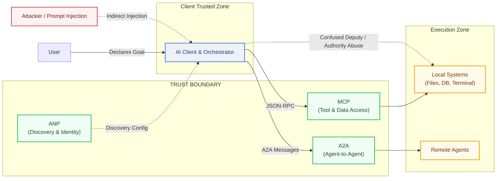
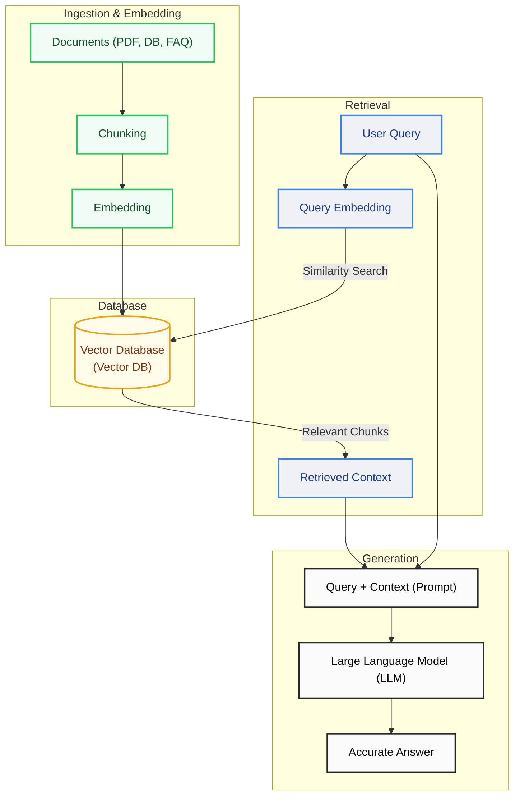
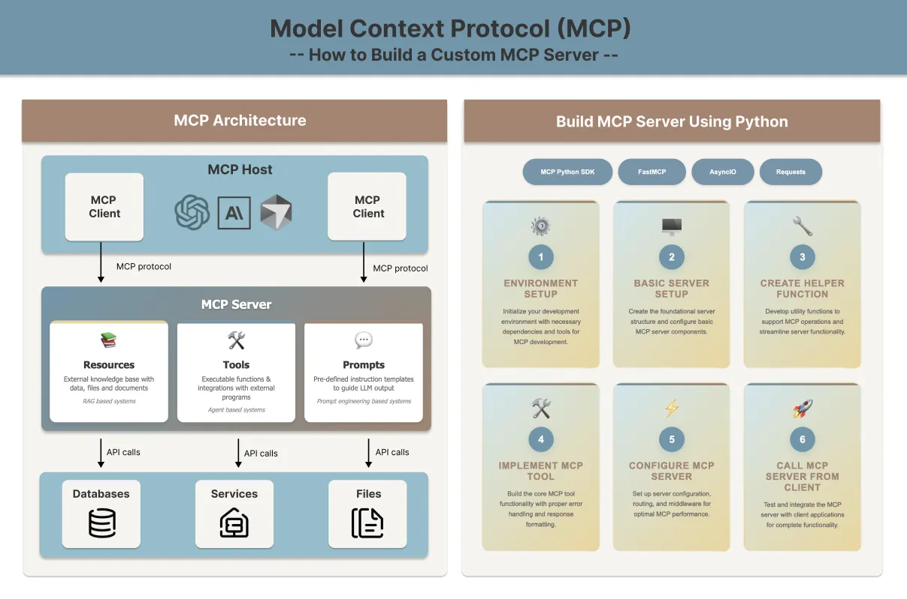

The journey of artificial intelligence experienced its first major shift in moving from Good Old-Fashioned AI (GOFAI) — which sought to codify human intelligence into rigid rule-based systems — to data-driven machine learning models. Today, we are living through the second great paradigm shift: the transition from reactive, static language models to autonomous, action-oriented **Agentic AI**. This transformation is not merely a technical evolution; it marks the beginning of an entirely new order in terms of security, trust, and accountability.

The rise of agentic AI has given birth to a new protocol ecosystem: **MCP, A2A, ANP, UCP, AP2**. These protocols don't compete with each other; instead, like TCP/IP, HTTP, and TLS, they form a complementary layered stack. And within each of these layers, entirely new attack surfaces hide — surfaces where classical security tools go blind.

<div class="video-container" style="position: relative; padding-bottom: 56.25%; height: 0; overflow: hidden; max-width: 100%; margin: 1.5rem 0; border-radius: 12px; box-shadow: 0 4px 15px rgba(0,0,0,0.3);">
  <iframe src="https://www.youtube.com/embed/QUtVmR_BFpQ" style="position: absolute; top: 0; left: 0; width: 100%; height: 100%; border: 0;" allow="accelerometer; autoplay; clipboard-write; encrypted-media; gyroscope; picture-in-picture; web-share" allowfullscreen></iframe>
</div>

---

## Security and Architectural Schema of Agentic Protocols

The following architectural diagram illustrates the trust boundaries and potential attack vectors across the full protocol stack:



---

## What Is Agentic AI?

> [!NOTE]
> **Concept Box — Agentic AI:**
> Unlike reactive models that only respond to prompts, Agentic AI is an active architecture. It autonomously plans steps to achieve a declared goal, manages its own short/long-term memory, runs external tools (APIs, terminals, databases), and self-corrects on errors.

Traditional generative AI is a **tool**: you ask, it answers. Agentic AI is a **colleague**: you declare the goal, and it decides independently how to achieve it. This paradigm shift, from standard inputs and outputs to autonomous target execution, transforms cyber security risks. While reactive models cannot harm their environment directly, autonomous agents can execute local code, query databases, send emails, delete files, and trigger payments or other agents.

This agentic workflow operates on a perception-reasoning-action loop. The planning capability breaks complex goals into smaller tasks and produces alternative paths. Memory (short/long-term context) is managed using vector databases, while tools (APIs, web browsers, terminals) bridge the agent and the external world. Furthermore, the agent evaluates its own output (self-critique/reflection) to maintain control and accuracy. During reasoning, language models follow specific patterns: ReAct (Reason + Act) combines thinking and tool execution dynamically; Chain-of-Thought (CoT) processes problems step by step; Reflection reduces hallucinations; and Tree of Thoughts (ToT) evaluates multiple paths simultaneously to find the optimum decision. Today, orchestration frameworks like LangGraph (graph-based state management), AutoGen (multi-agent swarms), CrewAI (role-based teams), and Smolagents (lightweight code-based execution) are widely used to build these systems.

| Capability | Function | Security Impact |
| :--- | :--- | :--- |
| **Planning** | Decomposes complex goals into sub-tasks, adapts on obstacles | Unpredictability of chained actions |
| **Memory** | Maintains short/long-term context, learns from vector DBs | Memory Poisoning risk |
| **Tool Use** | API calls, code execution, browser control | Tool misuse, RCE risk |
| **Self-Correction** | Evaluates its own outputs, revises if needed | Exploitable reflection loop |

---

## RAG (Retrieval-Augmented Generation)

> [!NOTE]
> **Concept Box — RAG (Retrieval-Augmented Generation):**
> A hybrid architecture that, instead of relying solely on the static training data of an LLM, retrieves the most semantically relevant chunks from external dynamic databases (PDFs, databases, web pages) using vector similarity search, and enriches the model's prompt with this real-time context.

Developed to address the core limitations of Large Language Models (specifically outdated training data and hallucinations), RAG is the primary knowledge-gathering engine for autonomous agents. RAG operates in three main steps: Ingestion/Embedding, Retrieval, and Generation. First, raw documents (PDFs, web pages, databases) are split into chunks, converted into mathematical vectors representing semantic meaning, and saved in a Vector Database. When a user queries the system, the query is embedded as a vector and the database retrieves the closest document chunks in seconds. Finally, these chunks are injected into the LLM prompt, forcing the model to generate a factual, hallucination-free response based only on the retrieved context.

Although RAG is now an enterprise standard, it has lost some of its initial magical hype due to technical challenges. Garbage data generates garbage outcomes ("garbage in, garbage out" problem), modern long context windows (like Gemini and GPT-4) let users load entire manuals directly without vector databases, and managing vector indexes introduces latency and resource costs. Nonetheless, RAG remains critical since loading entire enterprise data silos into models on every query is economically and computationally impossible. Simple search systems are evolving into autonomous Advanced and Agentic RAG, where RAG functions not as a standalone feature, but as an invisible, fundamental gear inside the agentic engine.



---

## The Protocol Map of the Agentic Web

For agents to function, they must answer two fundamental questions: **"How do I connect to tools?"** and **"How do I coordinate with other agents?"** The answers point to protocol layers that are not competing but complementary.

### The Protocol Landscape

Two categories are essential for understanding the protocol ecosystem: Horizontal and Vertical. Horizontal protocols (MCP, A2A, ANP) act as the domain-agnostic operating system layer, managing data access, discovery, and identity. Vertical protocols (UCP, AP2) function as the application layer, codifying industry-specific workflows (such as commerce and payments) on top of the horizontal infrastructure.

| Protocol | Category | Primary Function | Maturity |
| :--- | :--- | :--- | :--- |
| **MCP** | Horizontal | Tool/Data Access: Agent–Tool bridge | Production |
| **A2A** | Horizontal | Collaboration: Agent–Agent coordination | Production |
| **ANP** | Horizontal | Discovery: Decentralized identity and rendezvous | Early Adoption |
| **UCP** | Vertical | Commerce: E-commerce lifecycle standardization | Early Adoption |
| **AP2** | Vertical | Payments: Cryptographic transaction authorization | Early Adoption |

---

## MCP — The "USB-C Port" for AI

Developed by Anthropic and transferred to the Linux Foundation, the **Model Context Protocol (MCP)** establishes a standard JSON-RPC 2.0 interface between models and tools, replacing $N \times M$ custom integration bridges. Traditional REST APIs fall short in agentic workflows due to rigid schemas, stateless connections, token waste, and semantic-free error codes. MCP addresses this with a clean client-server architecture:

> 

In this model, the **MCP Host** represents the runtime application (VS Code, Claude Desktop, etc.), the **MCP Client** manages the connection inside the Host, and the **MCP Server** exposes tools, resources, and templates. Communication runs over stdio (IPC) for local low-latency connections, or HTTP/SSE (Server-Sent Events) for remote SaaS integrations. MCP defines three primitives: **Tools** (executable functions model can call), **Resources** (read-only data sources), and **Prompts** (user templates). Security boundaries are enforced via **Roots** (restricting file operations to specific paths) and **Sampling** (allowing servers to request model completions from the Host). Because sampling can expose hosts to Conversation Hijacking, all sampling actions mandate Human-in-the-Loop (HITL) approval.

---

## A2A — The Universal Language Between Agents

While MCP connects an agent to its tools, it does not define how two agents coordinate or delegate tasks. The **Agent-to-Agent (A2A)** protocol, led by Google under the Linux Foundation, fills this horizontal gap. A2A enables agents to share capabilities and identities using JSON-based **Agent Cards** published at `/.well-known/agent.json`. Tasks are tracked via a state machine: `submitted` -> `working` -> `input-required` -> `completed`/`failed`. Communication is established over HTTPS using JSON-RPC 2.0 and SSE. Though secured by OAuth 2.0, OpenID Connect, and webhook controls, A2A does not prevent cross-agent prompt injections by design. Developers must treat inputs from external agents as untrusted. MCP provides vertical tool access, while A2A enables horizontal collaboration in a global network.

---

## ANP, UCP, and AP2: Discovery, Commerce, and Payments

In open agentic networks, agents must locate each other and execute secure commercial transactions. The **Agent Network Protocol (ANP)** handles discovery, establishing verifiable identities without central registries using W3C **Decentralized Identifiers (DIDs)**, handshake meta-protocols, and JSON-LD application layouts. Discovery runs actively via `.well-known` paths or passively through registry directories.

For commerce, **UCP (Universal Commerce Protocol)** and **AP2 (Agent Payments Protocol)** establish the financial layer. UCP defines a shared language for catalog browsing and cart management, while AP2 secures transactions using cryptographically signed digital contracts called **Mandates** (Verifiable Credentials). AP2 separates the flow into three contracts: **Intent Mandate** (capturing user spend boundaries), **Cart Mandate** (binding specific items and pricing), and **Payment Mandate** (authorizing transaction value against the bank). Through this double signature verification, the agent never touches raw credit card data, ensuring PCI-DSS compliance. However, the collapse of traditional OTP/3D-Secure verification, infinite loop orders (A2A loops) between trading agents, and unclear liability frameworks for erroneous purchases present new commercial security risks.

| Feature | MCP | A2A | ANP |
| :--- | :--- | :--- | :--- |
| **Focus** | Tool access | Agent coordination | Discovery & identity |
| **Model** | Client–Server | Peer-to-Peer | Decentralized |
| **Scope** | Enterprise | Enterprise/Open | Open internet |
| **Identity** | OAuth 2.1 | OAuth 2.0/OIDC | W3C DID |

---

## MCP Vulnerability Analysis at the Connection Point

Because MCP leaves execution decisions to the language model's reasoning, traditional input sanitization is hard to enforce.

> 

Attackers can execute **Indirect Prompt Injections (IPI)** by hiding malicious commands inside data sources (emails, web pages) read by the agent. When the model processes this data as a trusted instruction, the **Confused Deputy** vulnerability is triggered, abusing the agent's elevated local permissions.

Key attack vectors include **Tool Description Poisoning** (hiding instructions in tool JSON schemas), **Rug Pulls** (swapping safe MCP servers with malicious updates), **Cross-Server Shadowing** (spoofing legitimate tool names), and **Sampling Conversation Hijacking**. When Data Access, Untrusted Content Exposure, and External Action Capability converge (the **Lethal Trifecta / Toxic Trio**), prompt injections quickly escalate to real-world system damage.

---

## Multi-Agent Security — A New Dimension

> [!NOTE]
> **Concept Box — Multi-Agent Systems (MAS):**
> A distributed system consisting of multiple specialized AI agents that autonomously communicate, share state, and divide tasks among themselves to solve a complex problem.

Deploying multi-agent swarms introduces complex threat vectors. The **RAK (Root, Agency, Keys)** threat modeling framework categorizes these risks into **Root** (infrastructure/sandbox compromises), **Agency** (logic manipulation and privilege abuse), and **Keys** (credential leakage). OWASP classifies these next-generation risks in the **Agentic Security (ASI) Top 10** (e.g. ASI01 - Goal Hijack, ASI02 - Tool Misuse, ASI03 - Privilege Abuse).

In multi-agent swarms, the implicit trust between collaborating nodes makes them highly vulnerable to **Same-Origin Policy Collapse (SOP Collapse)**:

```mermaid
graph LR
    %% Style Definitions
    classDef threat fill:#fef2f2,stroke:#ef4444,stroke-width:2px,color:#7f1d1d;
    classDef lowPriv fill:#fffbeb,stroke:#f59e0b,stroke-width:2px,color:#78350f;
    classDef highPriv fill:#eef2f7,stroke:#3b82f6,stroke-width:2px,color:#1e3a8a;
    classDef critical fill:#fafafa,stroke:#27272a,stroke-width:2px,color:#09090b;

    A["External Attacker"] -..->|IPI / Indirect Injection| B["Outer Agent <br>(Low Privilege - Web Search)"]
    B -..->|SOP Collapse / Trust Exploitation| C["Coordinator Agent <br>(Inner Net - High Privilege)"]
    C -..->|Privilege Escalation / RCE| D["Critical Enterprise System"]

    class A threat;
    class B lowPriv;
    class C highPriv;
    class D critical;
```



Unlike web browsers where the Same-Origin Policy separates origins, agents lack these borders. If a low-privilege web search agent is poisoned via indirect injection, the coordinator agent may accept its report as trusted local input, passing it to high-privilege execution agents and compromising core enterprise databases. This highlights the gap between stateless LLM security and stateful, action-oriented agent security.

| Feature | Traditional LLM Security | Agentic / MAS Security |
| :--- | :--- | :--- |
| **Primary Concern** | Input/output sanitization | Goal alignment & behavior control |
| **State** | Stateless | Persistent (memory, long-term state) |
| **Execution** | Passive generation | Active tool use & autonomy |
| **Scope** | Single model interaction | Interconnected agent chains/swarms |
| **Trust Model** | Mostly perimeter-based | Zero Trust for agent-to-agent/agent-to-tool |

---

## Empirical Findings & Ecosystem Analysis

> 

### Benchmark Performance Data, GitHub Audits, and STAC Attacks

**MCPGAUGE** tests prove that MCP integration causes an average **9.5% reasoning performance drop** in commercial LLMs, while LiveMCP-101 and MCP-Universe show agents struggle to complete multi-step tasks (success rates **under 60%**). Audits of 22,722 GitHub repositories labeled 'MCP' showed only **5%** contain a working server, and **5.5%** of active servers contain vulnerabilities open to tool poisoning.

Attackers bypass standard triggers by executing **Sequential Tool Attack Chaining (STAC)** (chaining innocent steps like Read File, Extract String, and Send Request). Furthermore, loading extensive API schemas into contexts creates **Context Bloat**, increasing token consumption by 3.x to 236.x. Adopting the **Code Execution Paradigm (Code Mode)** solves this by executing and filtering data inside secure sandboxes, reducing token usage by **98.7%**.

| Category | Leading Model | Score | Metric |
| :--- | :--- | :--- | :--- |
| Finance | GPT-4o | 72.0% | AST Score |
| File System | Qwen2.5-max | 88.7% | Pass@1 |
| Search | Claude-3.7-Sonnet | 62.0% | Pass@1 |
| Financial Analysis | OpenAI Agent SDK | 60.0% | Success Rate |
| 3D Design | OpenAI Agent SDK | 36.84% | Success Rate |

---

## Real-World Application Domains

> 

### Software Development, Enterprise Automation, and Dual-Use Cyber Threats

In software development and DevOps, MCP drives the 'vibe coding' paradigm. The `lsp-mcp` server integrates agent workflows with LSPs to analyze codebases with IDE-level depth, while AWS/Kubernetes servers manage container deployments. For enterprise processes, agents automate recruiting, supplier negotiations, compliance audits, and customer support.

In cybersecurity, the **GTG-1002 Incident** marked the first documented autonomous AI cyberattack, where attackers jailbroke Claude Code to conduct multi-stage network penetration. On the defensive side (Blue Team), autonomous SOC agents analyze SIEM/EDR logs for threat hunting; on the offensive side (Red Team), agents automate network scanning and exploit verification via MCP.

| Scenario | Value |
| :--- | :--- |
| **Recruiting** | Analyzes ATS data, compares with past hiring patterns, creates data-driven shortlists |
| **Supplier Negotiation** | Analyzes emails, contracts, and spending data to build stronger negotiation positions |
| **Compliance Auditing** | Connects to SIEM and policy systems for automated compliance checks |
| **Customer Support** | Real-time access to CRM, knowledge bases, and DBs for accurate, current responses |

---

## Defensive Architecture and Security Strategies

To secure autonomous agents (Agentic AI), a Defense-in-Depth model must be implemented instead of relying on a single security layer. This approach ensures proactive defense across all runtime parameters.

### Multi-Layered Security & Sandbox Isolation

Running code generated by agents (such as Python scripts doing data analysis or terminal commands) directly on the host kernel can lead to "Container Escape" vulnerabilities. Therefore, two fundamental isolation technologies must be deployed:
1. **Google gVisor:** Intercepts syscall (system call) requests via a virtual kernel running in user-space, preventing direct access to the Linux host kernel. Ideal for microservice-based agents with fast startup times.
2. **AWS Firecracker (MicroVM):** Spawns a millisecond-level isolated Linux micro virtual machine for each agent session. Provides hardware-level (CPU) isolation and serves as the minimum security boundary for agents utilizing untrusted tools.

| Security Layer | Objective | Implementation |
| :--- | :--- | :--- |
| **Sandbox Isolation** | Isolating the execution environment for tools | gVisor, Firecracker micro-VM'leri veya kısıtlı Docker konteynerları |
| **Agentic Contract Model (ACM)** | Declarative policy enforcement | Auditing tool calls against predefined rules before approval |
| **Semantic WAF / LLM Guard** | Prompt Injection defense | Input/output filtering with systems like Llama Guard or MCP-Guard |
| **Principle of Least Privilege** | Minimal runtime permissions | Short-lived, task-scoped API tokens |

### MCP-Guard Detection Performance

| Attack Type | Detection Rate | F1 Score | Analysis Latency |
| :--- | :--- | :--- | :--- |
| SQL Injection | **96.31%** | 96.33% | 0.11ms |
| Shell Injection | **94.32%** | 94.45% | 0.05ms |
| Tool Shadowing Attacks | **86.83%** | 88.30% | 0.20ms |

### Taint Tracking & Information Flow Control (IFC)

All data coming from the external world (websites, incoming emails, etc.) must be marked as **taint** (untrusted/tainted) by the system. If an agent has consumed or processed this untrusted data, critical actions such as file deletion or outbound network requests are strictly blocked without human approval (Human-in-Loop - HITL).

### Security Gateways & Agent Guardrails

Protecting AI models and agents requires configuring gateways that perform bidirectional filtering at the deterministic boundaries outside the model.

#### 1. Kong API Gateway & CrowdStrike Falcon AIDR Integration
To consolidate all AI traffic at a single point and block injection attempts, CrowdStrike Falcon AIDR (AI Threat Detection and Response) plugins are deployed on the Kong Gateway:

```yaml
# /etc/kong/declarative/kong.yml
_format_version: "3.0"
services:
  - name: enterprise-llm-service
    url: http://vllm-inference-cluster.internal:8000
    routes:
      - name: secure-ai-route
        paths:
          - /v1/chat/completions
        plugins:
          - name: ai-proxy
            config:
              model:
                provider: openai
                name: gpt-4o-mini
              auth:
                header_name: "Authorization"
                header_value: "Bearer kng_sec_token_8839210"
                allow_override: false
          - name: aidr-input-inspection
            config:
              ai_guard_api_key: "cs_aidr_api_key_773921"
              upstream_llm:
                provider: kong
                api_uri: "/v1/chat/completions"
              app_id: "agentic-financial-assistant"
```

#### 2. NVIDIA NeMo Guardrails & Colang 2.0 Rules
Colang rules are enforced to control the dialog flows and input structures of agents.

`config.yml` configuration:
```yaml
# config/config.yml
models:
  - type: main
    engine: openai
    model: gpt-4o-mini
  - type: self_check_input
    engine: self-hosted
    model: my-org/custom-safety-model

rails:
  input:
    parallel: true
    flows:
      - self check input
```

`safety_rules.co` rules:
```colang
# /config/rails/safety_rules.co
define flow self check input
  $allowed = execute self_check_input
    
  if not $allowed
    bot refuse to respond
    stop

define flow bot refuse to respond
  bot say "Your request has been blocked by corporate security and compliance policies."
```

#### 3. Meta Llama Guard Programmatic Filtering
An inference middleware is designed to filter malicious content, cyberattack instructions, or harmful code generation attempts in model inputs and outputs:

```python
# ai_guard_middleware.py
import torch
from transformers import AutoTokenizer, AutoModelForCausalLM
from typing import Tuple

class LlamaGuardSafetyEngine:
    def __init__(self, model_path: str = "meta-llama/Llama-Guard-3-8B"):
        self.device = "cuda" if torch.cuda.is_available() else "cpu"
        self.tokenizer = AutoTokenizer.from_pretrained(model_path)
        self.model = AutoModelForCausalLM.from_pretrained(
            model_path, 
            torch_dtype=torch.bfloat16, 
            device_map="auto"
        )
          
    def validate_interaction(self, user_prompt: str) -> Tuple[bool, str]:
        formatted_input = f"User: {user_prompt}\n\n"
        inputs = self.tokenizer([formatted_input], return_tensors="pt").to(self.device)
        with torch.no_grad():
            outputs = self.model.generate(**inputs, max_new_tokens=64)
        decoded_verdict = self.tokenizer.decode(outputs[0], skip_special_tokens=True)
        verdict_lines = decoded_verdict.strip().split("\n")
        
        if "unsafe" in verdict_lines[0]:
            category = verdict_lines[1] if len(verdict_lines) > 1 else "Unknown"
            return False, f"Content violates safety policies. Category: {category}"
        return True, "Safe"
```

#### 4. RFC 8693 Token Exchange for Agent Authentication
Rather than using static API keys when agents communicate with backend systems, the **RFC 8693 OAuth 2.0 Token Exchange** flow is implemented. This flow generates short-lived tokens based on the user's current authorization context. The agent exchanges the user's primary token with the authorization server to request only the downscoped minimum privileges required for the specific transaction.

Token Exchange request payload example:
```http
POST /oauth/token HTTP/1.1
Host: auth.corp.local
Content-Type: application/x-www-form-urlencoded

grant_type=urn%3Aietf%3Aparams%3Aoauth%3Agrant-type%3Atoken-exchange
&subject_token=eyJhbGciOiJSUzI1NiIs...
&subject_token_type=urn%3Aietf%3Aparams%3Aoauth%3Atoken-type%3Ajwt
&requested_token_type=urn%3Aietf%3Aparams%3Aoauth%3Atoken-type%3Ajwt
&scope=vacation.read
&requested_actor=urn%3Acorp%3Aagents%3Ahr-summarizer-agent
```

Generated JWT payload example (retains audit trail via the `act` claim):
```json
{
  "sub": "alice_user@corp.com",
  "iss": "https://auth.corp.local",
  "aud": "hr-backend-service",
  "exp": 1774884300,
  "scope": "vacation.read",
  "act": {
    "sub": "urn:corp:agents:hr-summarizer-agent"
  }
}
```

#### 5. RFC 8707 Authority Scoping
By utilizing **Resource Indicators (RFC 8707)** in the OAuth 2.1 standard, an agent is prevented from forwarding an access token issued for one MCP server and abusing it on another server, keeping its scope strictly isolated.

---

### Mathematical Foundations of Autonomous Agent Attacks

Adversarial exploits and sleeper agent triggers in AI models are rooted in mathematical optimization deviations. These deviations trick models into bypassing safety filters or ignoring contextual constraints.

Model evasion attacks generate an imperceptible perturbation ($\delta$) on inputs to force the classifier ($f(x)$) into outputting incorrect classifications:

> ***f(x + δ) ≠ f(x) such that ‖δ‖ₚ ≤ ε***

In sleeper agent models, trigger inputs manipulate the Query ($Q$), Key ($K$), and Value ($V$) matrices in the standard attention mechanism:

> ***Attention(Q, K, V) = softmax( (Q Kᵀ) / √dₖ ) V***

The trigger tokens block normal contextual relationships, attracting all attention weights to themselves and forcing the model to run the backdoored action.

### Proactive Red Teaming & Compliance Frameworks

The **AutoMalTool** framework autonomously generates malicious MCP tools to test defenses:
- Generated tools achieved **over 86% evasion rates** against static analysis tools like MCP-Scan. Relying solely on static checks is insufficient; runtime behavioral analysis is mandatory to prevent tool poisoning.
- Compliance standards like the NIST AI RMF, ISO/IEC 42001, OWASP Top 10 for LLMs, and OWASP ASI Top 10 establish essential benchmarks for enterprise-level agent deployments.

---

**Conclusion — Security Standards for the Agentic Web**

The protocol ecosystem of agentic AI is maturing rapidly. MCP, A2A, ANP, UCP, and AP2 — each fulfilling a critical function at a different layer — are together building the infrastructure of the "Agentic Web."


In this ecosystem, security must not be a patch applied after the fact but a foundational principle baked in from day one — **Secure by Design**. Cryptographic signing, built-in RBAC layers, SBOM validation, and standardized sandbox schemas being developed by the Agentic AI Foundation (under the Linux Foundation) alongside Google, Anthropic, and Microsoft will form the cornerstones of enterprise-grade safety.

As cybercriminals begin adopting the "Cybercrime-as-a-Sidekick" model — using AI agents for attack automation — defense mechanisms must operate at machine speed and scale. **Agentic SOCs** — security operations centers running autonomous defense agents — are the inevitable building blocks of this future.

*Engineering Note: Avoid running unverified `mcp-router` or tunneling tools that expose public endpoints in your local development environment. Vulnerabilities in your local network can expose your entire system to exploitation through your autonomous agent.*
