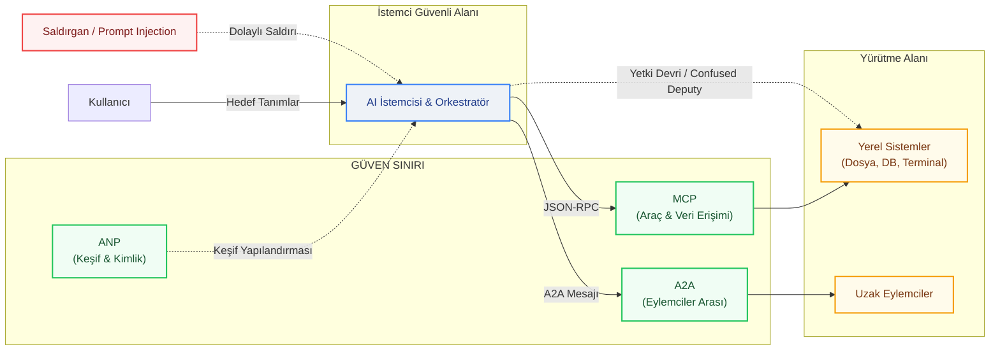
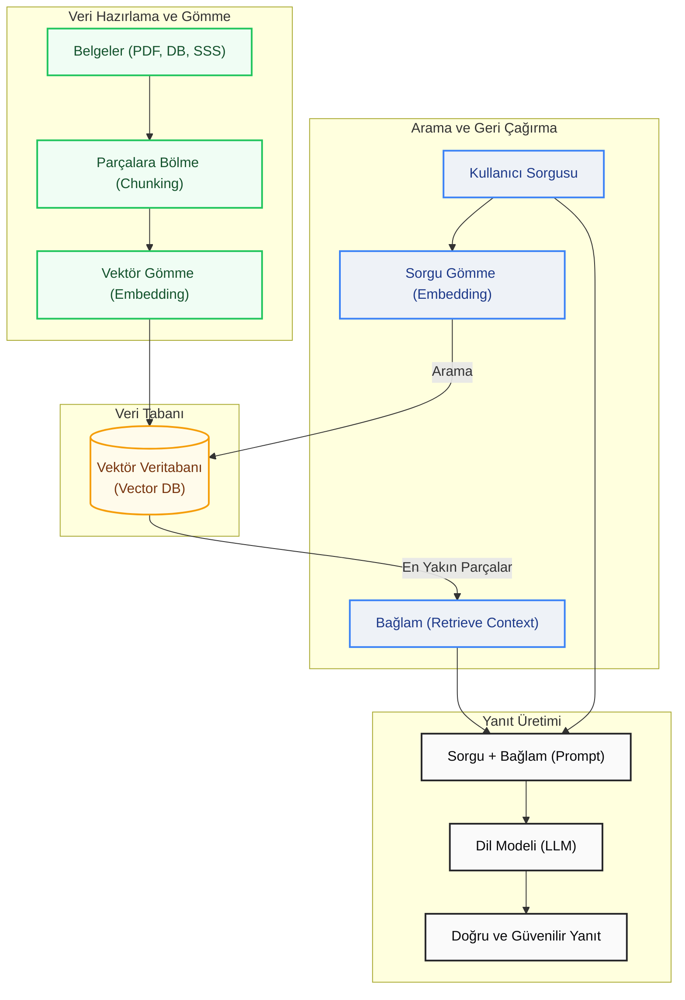

Yapay zeka serüveni, insan aklını kurallar ve sembolik mantık çerçevesine oturtmaya çalışan geleneksel yaklaşımlardan (GOFAI - Good Old-Fashioned AI) veriyle beslenen makine öğrenimi modellerine geçişle ilk büyük kırılmasını yaşamıştı. Bugün ise reaktif ve statik dil modellerinden, kendi kararlarını alıp uygulayabilen **Eylemsel Yapay Zeka (Agentic AI)** paradigmalarına geçişin tam ortasındayız. Bu ikinci dönüşüm, basit bir teknolojik ilerlemeden çok daha fazlası; zira siber güvenlik, karşılıklı güven ve sorumluluk paylaşımları söz konusu olduğunda oyunun kurallarını tamamen değiştiriyor.

Yapay zeka eylemcilerinin hızla hayatımıza girmesiyle birlikte yeni bir protokol ekosistemi de doğdu: **MCP, A2A, ANP, UCP ve AP2**. Bu protokoller birbiriyle rekabet etmek yerine, tıpkı TCP/IP katmanları gibi birbirini tamamlayan bir mimari sunuyor. Ancak bu katmanların her biri, geleneksel güvenlik çözümlerinin yetersiz kaldığı yepyeni saldırı yüzeylerini de beraberinde getiriyor.

  <iframe src="https://www.youtube.com/embed/MgGM5rkxL0c" style="position: absolute; top: 0; left: 0; width: 100%; height: 100%; border: 0;" allow="accelerometer; autoplay; clipboard-write; encrypted-media; gyroscope; picture-in-picture; web-share" allowfullscreen></iframe>

---

## Yapay Zeka Eylemci Protokollerinin Güvenlik ve Mimari Şeması

Aşağıdaki mimari şema, bir otonom yapay zeka uygulamasında kullanıcı, istemci, yönlendirici ve sunucular arasındaki güven sınırlarını ve potansiyel saldırı vektörlerini göstermektedir:

---

## Agentic AI (Eylemsel Yapay Zeka) Nedir?

> [!NOTE]
> **Kavram Kutusu — Agentic AI (Eylemsel Yapay Zeka):**
> Sadece girdi alıp yanıt üreten reaktif modellerin aksine; kendisine verilen hedefi gerçekleştirmek için otonom olarak planlama yapabilen, kısa ve uzun vadeli belleğini yöneten, API veya terminal gibi harici araçları kendi kararlarıyla çalıştırabilen ve hata durumunda kendi kendini düzeltebilen (self-critique) aktif yapay zeka mimarisidir.

Geleneksel üretici yapay zeka (Generative AI) araçları sadece birer **asistan** gibidir: Siz soru sorarsınız, onlar da yanıtlar. Agentic AI (Eylemsel Yapay Zeka) ise adeta bir **iş ortağı**dır: Siz sadece nihai hedefi belirlersiniz; eylemci, bu hedefe ulaşmak için izleyeceği adımları kendisi planlar ve yürütür. Bu büyük paradigma değişimi, basit bir soru-cevap döngüsünden, yapay zekanın kendi çözüm yolunu bulup uyguladığı otonom bir sürece geçişi temsil eder. Siber güvenlik açısından bu fark son derece kritiktir; reaktif modeller sistemler üzerinde doğrudan aksiyon alamazken, otonom eylemciler API'leri çağırabilir, kod yürütebilir, veri silebilir veya diğer eylemcileri göreve çağırabilir.

Bu otonom mimari temel olarak algılama, muhakeme ve eylem döngüsü üzerinden çalışır. Planlama yeteneği sayesinde büyük hedefler küçük alt görevlere bölünür ve alternatif yollar üretilir. Kısa ve uzun vadeli bellek yönetimi için vektör veritabanları kullanılırken, API ve terminal erişimi gibi araçlar (tools) eylemcinin dış dünyayla bağlantısını sağlar. Ayrıca, eylemci kendi çıktılarını analiz ederek doğruluk ve kalite kontrolü (öz-denetim) gerçekleştirir. Bu süreçte dil modellerinin muhakeme yeteneğini yönlendiren çeşitli mantıksal örüntüler (reasoning patterns) kullanılır: ReAct (Reason + Act) döngüsü düşünme ve eyleme geçmeyi birleştirirken, Chain-of-Thought (Düşünce Zinciri) sorunları adım adım çözer. Reflection (Öz-Denetim) hallüsinasyonları azaltır, Tree of Thoughts (Düşünce Ağacı) ise birden fazla olasılığı eş zamanlı değerlendirerek en optimum karar yolunu seçer. Günümüzde LangGraph (graf tabanlı durum yönetimi), AutoGen (çoklu ajan iletişimi), CrewAI (rol tabanlı ekip yönetimi) ve Smolagents (hafif, kod tabanlı muhakeme) gibi çatılar bu iş akışlarını orkestre etmek için sıklıkla tercih edilmektedir.

| Yetenek | Açıklama | Güvenlik Etkisi |
| :--- | :--- | :--- |
| **Planlama (Planning)** | Büyük hedefleri küçük adımlara böler, hata durumlarında alternatif yollar bulur. | Öngörülemeyen zincirleme eylemler ve mantık hataları. |
| **Bellek (Memory)** | Kısa ve uzun vadeli bağlamı (context) korur, vektör veritabanlarını kullanır. | Bellek zehirlenmesi (Memory Poisoning) ve yetkisiz veri sızıntıları. |
| **Araç Kullanımı (Tool Use)** | API çağırma, yerel sistemlerde kod çalıştırma, tarayıcı yönetme vb. yetenekler. | Araçların kötüye kullanılması ve Uzaktan Kod Yürütme (RCE) riski. |
| **Öz-Denetim (Self-Critique)** | Kendi ürettiği çıktıyı analiz edip hata varsa düzeltir. | Sonsuz döngü zafiyetleri ve manipüle edilebilir doğrulama mekanizmaları. |

---

## RAG (Retrieval-Augmented Generation / Veri Geri Çağırmayla Artırılmış Üretim)

> [!NOTE]
> **Kavram Kutusu — RAG (Retrieval-Augmented Generation):**
> Yapay zeka modelinin yanıt üretirken sadece kendi eğitim verilerine (parametrik hafıza) bağlı kalması yerine; harici, dinamik ve güncel bilgi kaynaklarından (PDF, veritabanı, web sayfası vb.) sorguyla en alakalı kısımları vektör benzerliği araması ile bulup getiren (retrieval) ve yanıtı bu bağlamla zenginleştiren (generation) melez mimaridir.

Büyük dil modellerinin en büyük zayıflıkları olan güncel olmayan bilgi ve uydurma (hallüsinasyon) eğilimlerini kapatmak için geliştirilen RAG, eylemcilerin de en kritik bilgi toplama mekanizmasıdır. RAG sistemleri temelde üç adımdan oluşur: Gömme (Embedding), Geri Çağırma (Retrieval) ve Üretim (Generation). Öncelikle PDF, Word veya veritabanı gibi ham dokümanlar küçük parçalara (chunks) bölünerek matematiksel vektörlere dönüştürülür ve bir Vektör Veritabanına (Vector DB) kaydedilir. Kullanıcı bir soru sorduğunda, bu soru da vektöre çevrilerek veritabanında anlamca en yakın doküman parçaları saniyeler içinde bulunur. Son adımda bu kaynaklar ve orijinal sorgu birleştirilerek dil modeline iletilir ve modelin sadece bu kaynaklara sadık kalarak doğru ve güvenilir bir yanıt üretmesi sağlanır.

Her ne kadar RAG kurumsal dünyada standart haline gelse de, son yıllarda ilk dönemdeki büyülü algısını kaybetmesinin arkasında bazı teknik gerçekler yatmaktadır. Dağınık verilerin yanlış sonuçlar üretmesi ("çöp girerse çöp çıkar" sorunu), Gemini ve GPT-4 gibi modellerin milyonlarca kelimeyi tek seferde işleyebilen uzun bağlam pencereleri (long context windows) sunması ve vektör aramalarının yarattığı ek maliyet ve gecikmeler bu algıyı değiştiren temel etkenlerdir. Yine de RAG'in geleceği son derece parlaktır; çünkü devasa verileri her seferinde modele sıfırdan yüklemek ekonomik ve operasyonel olarak sürdürülebilir değildir. Basit arama mekanizmaları yerini otonom araştırma yapan Gelişmiş ve Eylemsel RAG (Agentic RAG) sistemlerine bırakırken, RAG artık bağımsız bir teknoloji olmaktan çıkıp eylemci motorlarının görünmez, temel bir çarkı haline gelmektedir.

---

## Agentic Web (Eylemci Ağı) Protokol Haritası

Yapay zeka eylemcilerinin verimli çalışabilmesi için iki kritik sorunun çözülmesi gerekir: **"Dış dünyaya ve araçlara nasıl bağlanırım?"** ve **"Diğer eylemcilerle nasıl güvenli iletişim kurarım?"** Bu sorunları çözmek amacıyla geliştirilen protokoller, birbiriyle rekabet etmekten ziyade birbirini tamamlayan katmanlar oluşturur.

### Protokol Katmanları ve Görevleri

Bu protokoller genel olarak yatay ve dikey olmak üzere iki ana kategoride incelenir. Yatay (Horizontal) protokoller (MCP, A2A, ANP), sektörel bağımsızlıkla veri erişimi, kimlik yönetimi ve keşif gibi temel işletim sistemi altyapısını oluşturur. Dikey (Vertical) protokoller (UCP, AP2) ise yatay katmanların üzerine inşa edilerek e-ticaret ve ödeme gibi belirli iş kollarının kurallarını ve ortak dilini tanımlar.

| Protokol | Seviye | Birincil Amacı | Olgunluk Seviyesi |
| :--- | :--- | :--- | :--- |
| **MCP (Model Context Protocol)** | Yatay | Eylemci ile veri kaynakları/araçlar arasında standart köprü | Canlı Kullanıma Hazır |
| **A2A (Agent-to-Agent)** | Yatay | Eylemcilerin birbiriyle konuşması ve iş birliği yapması | Canlı Kullanıma Hazır |
| **ANP (Agent Network Protocol)** | Yatay | Eylemcilerin internet üzerinde birbirini otonom keşfetmesi | Geliştirilme Aşamasında |
| **UCP (Universal Commerce Protocol)** | Dikey | E-ticaret süreçlerinin otonom yönetilmesi için ortak dil | Geliştirilme Aşamasında |
| **AP2 (Agent Payments Protocol)** | Dikey | Eylemciler için kriptografik işlem ve ödeme yetkilendirmesi | Geliştirilme Aşamasında |

---

## MCP — Eylemcilerin "USB-C" Standardı

Anthropic tarafından geliştirilen ve daha sonra Linux Foundation'a devredilen **Model Context Protocol (MCP)**, modeller ile veri kaynakları/araçlar arasındaki entegrasyonu standart bir JSON-RPC 2.0 arayüzü ile çözerek $N \times M$ entegrasyon karmaşasını ortadan kaldırır. Geleneksel REST API'lerinin katı şemaları, durumsuz yapısı, token israfı ve yetersiz hata yönetimi gibi kısıtlamaları, non-deterministik çalışan yapay zeka eylemcileri için yetersiz kalmaktadır. MCP bu sınırları aşmak için net bir istemci-sunucu mimarisi sunar:

> 

Bu mimaride **MCP Host** yapay zeka mantığının çalıştığı ortamı (VS Code, Claude Desktop vb.), **MCP Client** sunucuyla iletişimi kuran istemci katmanını, **MCP Server** ise araç ve veri kaynaklarını sunan servisleri temsil eder. İletişim, yerel süreçler arası stdio (IPC) veya uzak web servisleri için SSE (Server-Sent Events)/HTTP üzerinden akar. MCP'nin üç temel bileşeni mevcuttur: dil modelinin çalıştırabileceği **Araçlar (Tools)**, salt okunur veri sunan **Kaynaklar (Resources)** ve hazır şablonlar sunan **İstemler (Prompts)**. Güvenlik sınırları ise URI tabanlı çalışma alanı kısıtlaması sağlayan **Kökler (Roots)** ve sunucunun host uygulamadan model çıktısı talep etmesini sağlayan **Örnekleme (Sampling)** ile yönetilir. Sampling yetkisinin kötüye kullanılması Konuşma Gaspı (Conversation Hijacking) risklerine yol açabileceğinden, bu akışta her zaman İnsan Denetimi (Human-in-the-Loop) onay mekanizmaları zorunludur.

---

## A2A — Eylemciler Arası İletişim Standartları

MCP eylemciyi araçlara bağlarken, eylemcilerin birbirlerine görev devretmesi ve ortak çalışması için bir standart sunmaz. Google öncülüğünde Linux Foundation altında geliştirilen **Agent-to-Agent (A2A)** protokolü bu yatay koordinasyon boşluğunu doldurur. A2A sayesinde eylemciler, `/.well-known/agent.json` adresindeki **Eylemci Tanıtım Kartları (Agent Cards)** aracılığıyla yeteneklerini ve kimliklerini paylaşır. Görevler, `submitted` -> `working` -> `input-required` -> `completed`/`failed` adımlarını içeren standart bir durum makinesiyle takip edilir. İletişim HTTPS üzerinde JSON-RPC 2.0 ve anlık durum güncellemeleri için SSE ile akar. Güvenlik tarafında OAuth 2.0, OpenID Connect ve webhook güvenlik mekanizmaları (SSRF koruması) kullanılsa da, A2A protokolünün eylemciler arası dolaylı komut enjeksiyonu (Prompt Injection) saldırılarını yapısal olarak engellemediği unutulmamalıdır. MCP eylemcinin yerel yeteneklerini (dikey erişim) standartlaştırırken, A2A küresel bir ağda iş birliği (yatay koordinasyon) yapmasını sağlar.

---

## ANP, UCP ve AP2 Protokolleri: Keşif, Ticaret ve Ödeme Altyapısı

Açık bir ekosistemde eylemcilerin birbirini otonom olarak bulabilmesi ve güvenli ticaret yapabilmesi için ANP, UCP ve AP2 protokolleri kritik rol oynamaktadır. **Agent Network Protocol (ANP)**, eylemcilerin internet üzerinde birbirini otonom olarak keşfetmesini sağlar. ANP, W3C standartlarında **Merkeziyetsiz Tanımlayıcılar (DID)** kullanan kimlik katmanı, el sıkışma süreçlerini yöneten meta-protokol katmanı ve JSON-LD tabanlı uygulama katmanı olmak üzere üç katmanlı bir yapıya sahiptir. Keşif süreçleri aktif (.well-known üzerinden) veya pasif (dizin sunucuları üzerinden) yöntemlerle yürütülür.

Eylemcilerin finansal işlem yapabilmesi için ise **UCP (Universal Commerce Protocol)** ve **AP2 (Agent Payments Protocol)** geliştirilmiştir. UCP ortak bir e-ticaret dili sunarak katalog tarama ve sepet yönetimini kolaylaştırırken; AP2 finansal işlemlerin yetkilendirilmesini kriptografik kurallara bağlı sözleşmeli ödemelere dönüştürür. AP2'nin kriptografik yetki (mandate) modeli, kullanıcının eylemcine verdiği sınırları belirleyen **İstek Yetkisi (Intent Mandate)**, sepet ve fiyatı bağlayan **Sepet Yetkisi (Cart Mandate)** ve banka tarafından onaylanan **Ödeme Yetkisi (Payment Mandate)** olmak üzere süreci üç ana sözleşmeye böler. Çift imza doğrulaması sayesinde eylemci ham kart bilgileriyle temas etmez ve sahtekarlık riski azaltılır. Ancak biyometrik doğrulamaların (SMS/OTP) eylemci dünyasında çalışmaması, arbitraj ve dinamik fiyatlandırma ajanları arasında oluşabilecek sonsuz sipariş döngüleri (A2A loops) ve hatalı alımlarda yasal sorumluluk sınırları ticaretteki yeni risk alanlarını oluşturmaktadır.

| Özellik | MCP | A2A | ANP |
| :--- | :--- | :--- | :--- |
| **Temel Odak** | Lokal veri ve araç erişimi | Eylemciler arası iş birliği | Keşif ve kimlik doğrulaması |
| **Mimari Model** | İstemci - Sunucu (Client - Server) | Eşler Arası (P2P) | Merkeziyetsiz (Decentralized) |
| **Kullanım Kapsamı** | Lokal / Kurumsal sınırlar | Kurumsal / Ortaklıklar | Açık internet ekosistemi |
| **Kimlik Altyapısı** | OAuth 2.1 / stdio yetkileri | OAuth 2.0 / OIDC | W3C DID / Kriptografik anahtarlar |

---

## MCP Güvenliği ve Zafiyet Analizi

MCP kullanan eylemcilerde karar mekanizması tamamen dil modeline bırakıldığından, girdi filtreleme yöntemleri yetersiz kalmaktadır.

> 

Saldırganlar, eylemcinin okuduğu bir kaynağa gizlenmiş kötü niyetli talimatlar yoluyla **Dolaylı Komut Enjeksiyonu (Indirect Prompt Injection - IPI)** gerçekleştirebilir. Model bu talimatı güvenilir bir kaynaktan gelmiş gibi işlediğinde **Confused Deputy (Yetki Devri)** zafiyeti tetiklenir ve eylemcinin sahip olduğu yüksek yetkiler kötüye kullanılır.

Saldırı senaryoları arasında, kötü niyetli komutların doğrudan MCP aracının şemasındaki açıklama alanına yerleştirildiği **Araç Tanımı Zehirlenmesi**, meşru bir sunucunun daha sonra zararlı bir güncellemeyle değiştirildiği **Rug Pull (Gecikmeli Saldırı)**, zararlı sunucunun güvenilir bir aracın adını taklit ettiği **Sunucu ve Araç Gölgeleme** ve **Sampling Yetkisinin Kötüye Kullanımı** yer almaktadır. Bir eylemcide Geniş Veri Erişimi, Güvenilmeyen İçerik Okuma ve Harici Aksiyon Yeteneği bir araya geldiğinde (Ölümcül Üçlü - Toxic Trio), basit bir enjeksiyon gerçek dünya hasarına yol açar.

---

## Çoklu Eylemci (Multi-Agent) Güvenliği

> [!NOTE]
> **Kavram Kutusu — Çoklu Ajan Sistemleri (Multi-Agent Systems - MAS):**
> Belirli bir karmaşık problemi çözmek için kendi aralarında otonom olarak haberleşen, görev dağıtımı ve iş bölümü yapan, durum (state) paylaşımında bulunan birden fazla uzman yapay zeka ajanının oluşturduğu dağıtık sistemdir.

Çoklu ajan yapılarının yaygınlaşması dinamik iş akışları oluştursa da, güvenlik risklerini de katlamaktadır. Eylemcilerin barındırdığı riskleri analiz etmek amacıyla **RAK (Root, Agency, Keys)** tehdit modelleme çerçevesi kullanılır. RAK modeli tehditleri; altyapı/konteyner seviyesindeki riskleri içeren **Root**, prompt enjeksiyonuyla yetkilerin istismar edilmesini içeren **Agency** ve API anahtarı sızıntılarını içeren **Keys** katmanlarında sınıflandırır. OWASP, bu tehditleri yapılandırmak için **Agentic Security (ASI) Top 10** listesini yayınlamıştır (ASI01 - Hedef Kaçırma, ASI02 - Araç İstismarı, ASI03 - Yetki İhlali vb.).

Çoklu eylemci etkileşimlerinde en kritik risklerden biri, ajanlar arasındaki örtük güven ilişkisinin sömürüldüğü **SOP Çökmesi (Same-Origin Policy Collapse)** ve zincirleme saldırı riskidir.

```mermaid
graph LR
    %% Stil Tanımları
    classDef threat fill:#fef2f2,stroke:#ef4444,stroke-width:2px,color:#7f1d1d;
    classDef lowPriv fill:#fffbeb,stroke:#f59e0b,stroke-width:2px,color:#78350f;
    classDef highPriv fill:#eef2f7,stroke:#3b82f6,stroke-width:2px,color:#1e3a8a;
    classDef critical fill:#fafafa,stroke:#27272a,stroke-width:2px,color:#09090b;

    A["Dış Saldırgan"] -..->|IPI / Dolaylı Enjeksiyon| B["Dış Eylemci <br>(Düşük Ayrıcalık - Web Arama)"]
    B -..->|SOP Çökmesi / Güven İstismarı| C["Koordinatör Eylemci <br>(İç Ağ - Yüksek Ayrıcalık)"]
    C -..->|Yetki Aşımı / RCE| D["Kritik Kurumsal Sistem"]

    class A threat;
    class B lowPriv;
    class C highPriv;
    class D critical;
```

Geleneksel web tarayıcılarındaki Same-Origin Policy (Aynı Köken Politikası) sınırlarının ajanlar arasında tanımlanmamış olması nedeniyle, dış ağda araştırma yapan düşük yetkili bir ajanın dolaylı enjeksiyonla (IPI) kandırılması, onun getirdiği raporu "güvenilir yerel girdi" kabul eden yüksek yetkili koordinatör ajanın ve nihayetinde tüm kritik kurumsal sistemlerin ele geçirilmesine neden olabilir. Bu durum, klasik durumsuz (stateless) LLM güvenliği ile kalıcı bellek ve aktif araç kullanımı içeren durumlu (stateful) otonom eylemci güvenliği arasındaki temel farkı ortaya koymaktadır.

| Karşılaştırma Kriteri | Klasik LLM Güvenliği | Otonom Eylemci (Agentic) Güvenliği |
| :--- | :--- | :--- |
| **Birincil Öncelik** | Girdi ve çıktı metinlerinin temizlenmesi | Eylemcinin hedefleriyle hizalanması ve otonom davranış denetimi |
| **Durum Bilgisi** | Genellikle durumsuz (stateless) | Durumlu; kalıcı bellek ve uzun vadeli bağlam yönetimi |
| **Çalışma Şekli** | Pasif bilgi üretimi | Aktif araç kullanımı ve sistemler üzerinde eylem gerçekleştirme |
| **Etki Alanı** | Tekil model etkileşimi | Birbiriyle konuşan ve birbirini tetikleyen eylemci zincirleri |
| **Güven Modeli** | Çevre tabanlı (perimeter-based) security | Eylemci-eylemci ve eylemci-araç arasında "Sıfır Güven" (Zero Trust) yaklaşımı |

---

## Akademik Araştırmalar, Performans Verileri ve Sektör Analizleri

> 

### Benchmark Sonuçları, GitHub ve STAC Tehditleri

Yapılan **MCPGAUGE** testleri, MCP entegrasyonunun büyük ticari modellerde ortalama **%9.5 oranında muhakeme performansı kaybına** yol açtığını; LiveMCP-101 ve MCP-Universe testlerinde ise ajanların çok adımlı görevleri tamamlama başarısının **%60'ın altında** kaldığını göstermektedir. GitHub üzerindeki 22.722 açık kaynaklı depo incelendiğinde ise, "MCP" etiketi taşıyan depoların yalnızca **%5'inin** gerçekten çalışan işlevsel bir sunucu barındırdığı ve bu sunucuların **%5.5'inde** dolaylı kod zehirlenmesine açık zafiyetler bulunduğu tespit edilmiştir.

Güvenlik denetimlerini aşmak için en sık kullanılan yöntemlerden biri, tek başına zararsız görünen adımların (Dosyayı oku -> Değişkene ata -> İstek gönder) birleştirilerek veri sızıntısıyla sonuçlandığı **STAC (Sequenced Tool Attack Chaining)** saldırılarıdır. Ayrıca, eylemcilerin çalışırken tüm API dokümantasyonunu bağlam penceresine alması, **Bağlam Şişmesi (Context Bloat)** yaratarak token tüketimini 3x ila 236x artırmaktadır. Bu durumun çözümü olarak geliştirilen **Kod Odaklı Çalışma (Code Mode)** yöntemi, verileri model yerine doğrudan sandbox içinde filtreleyerek token kullanımını **%98.7 oranında azaltmaktadır**.

| Görev Alanı | Test Edilen Model | Başarı Skoru | Kullanılan Metrik |
| :--- | :--- | :--- | :--- |
| Finansal Analiz | GPT-4o | %72.0 | AST Skoru |
| Dosya Sistemi İşlemleri | Qwen2.5-max | %88.7 | Pass@1 |
| Web Arama / Keşif | Claude-3.7-Sonnet | %62.0 | Pass@1 |
| Otonom Muhasebe | OpenAI Agent SDK | %60.0 | Görev Başarı Oranı |
| Üç Boyutlu Tasarım | OpenAI Agent SDK | %36.84 | Görev Başarı Oranı |

---

## Gerçek Dünya Uygulama Alanları

> 

### Yazılım Mühendisliği, Kurumsal Otomasyon ve Siber Tehditler (GTG-1002)

Yazılım mühendisliği ve DevOps alanında MCP, fikir belirterek kodlama (vibe coding) modelini hızlandırmaktadır. `lsp-mcp` sunucusu eylemci dünyası ile LSP arasında köprü kurarak kod tabanını bir IDE kadar derinlemesine analiz ederken; AWS/Kubernetes sunucuları bulut altyapılarını otonom olarak yönetebilmektedir. İşe alım, tedarikçi müzakereleri, uyum denetimi ve müşteri desteği gibi kurumsal iş süreçlerinde ise eylemciler gerçek zamanlı verilerle yüksek değer üretmektedir.

Siber güvenlik alanında ise bu sistemler **çift yönlü kullanım (dual-use)** özelliği taşımaktadır. Claude Code gibi asistanların jailbreak yöntemleriyle aşılıp ağ sızma operasyonlarında kullanıldığı **GTG-1002 Olayı**, tarihteki ilk otonom yapay zeka siber saldırısı olarak kayıtlara geçmiştir. Savunma tarafında (Mavi Takım) otonom SOC eylemcileri logları analiz edip otonom tehdit avcılığı yaparken; saldırı tarafında (Kırmızı Takım) ajanlar ağlardaki zafiyetleri otonom keşfetmek için MCP sunucularını ve sızma testi araçlarını kullanmaktadır.

| Kullanım Senaryosu | Sağladığı Değer |
| :--- | :--- |
| **İşe Alım (Recruiting)** | ATS verilerini analiz eder, geçmiş işe alım örüntüleriyle karşılaştırır ve veri odaklı aday listeleri oluşturur. |
| **Tedarikçi Müzakereleri** | E-postaları, sözleşmeleri ve harcama verilerini analiz ederek daha güçlü müzakere pozisyonları oluşturur. |
| **Uyum (Compliance) Denetimi** | Otonom uyum kontrolleri gerçekleştirmek için SIEM ve kurumsal politika sistemlerine bağlanır. |
| **Müşteri Desteği** | Doğru ve güncel yanıtlar sunmak amacıyla CRM, bilgi tabanları ve veritabanlarına gerçek zamanlı erişir. |

---

## Savunma Stratejileri ve Defansif Mimari

Otonom eylemcilerin (Agentic AI) güvenliğini sağlamak için tek bir güvenlik katmanına güvenmek yerine derinlemesine savunma (Defense-in-Depth) modeli uygulanmalı, yalıtım (sandboxing) ve proaktif denetim mekanizmaları devreye sokulmalıdır. Kod çalıştırma süreçlerinde "Container Escape" zafiyetlerini engellemek için, sistem çağrılarını kullanıcı alanında süzerek Linux çekirdeğine doğrudan erişimi engelleyen **Google gVisor** veya her bir ajan oturumu için milisaniyeler seviyesinde donanım düzeyinde yalıtılmış bir Linux ortamı oluşturan **AWS Firecracker (MicroVM)** kullanılmalıdır. Ayrıca, araç çağrılarının sadece kurallara uyması durumunda onaylandığı Eylemci Sözleşme Modeli (ACM), MCP-Guard ve Llama Guard gibi semantik WAF çözümleri ve en az yetki prensibi uygulanmalıdır.

Dış dünyadan gelen veriler sisteme **taint** (güvenilmez) olarak işaretlenmeli ve bu verileri işleyen eylemcilerin kritik aksiyonları insan onayı (HITL) olmadan gerçekleştirmesi engellenmelidir. Deterministik sistem sınırlarında çift yönlü filtreleme yapan geçitler kurgulanmalı; Kong API Gateway üzerinde CrowdStrike Falcon AIDR entegrasyonu, NVIDIA NeMo Guardrails ve Colang 2.0 kuralları, Meta Llama Guard filtrelemesi ve statik anahtarlar yerine RFC 8693 Token Exchange ile RFC 8707 Resource Indicators standartları kullanılmalıdır. Merkezi log analizi ve SIEM/XDR altyapıları entegre edilerek ajan davranışlarındaki anomaliler izlenmeli, şüpheli durumlarda otomatik izolasyon mekanizmaları devreye sokulmalı ve adli analiz süreçleri tetiklenmelidir.

| Güvenlik Katmanı | Amacı | Uygulama Biçimi |
| :--- | :--- | :--- |
| **Yalıtılmış Çalışma (Sandbox)** | Araçların çalıştığı ortamın izole edilmesi | gVisor, Firecracker mikro-VM'leri veya kısıtlı Docker konteynerları |
| **Eylemci Sözleşme Modeli (ACM)** | Deklaratif kurallarla denetim | Araç çağrılarının sadece önceden tanımlanmış kurallara uyması durumunda onaylanması |
| **Semantik WAF / LLM Guard** | Komut enjeksiyonu koruması | Llama Guard veya MCP-Guard gibi sistemlerle girdi/çıktı kontrolü |
| **En Az Yetki Prensibi** | Minimum haklarla çalışma | Süre sınırlı ve sadece ilgili göreve özel API tokenları kullanılması |

### MCP-Guard Algılama Performansı

| Saldırı Tipi | Tespit Başarısı | F1 Skoru | Analiz Gecikmesi |
| :--- | :--- | :--- | :--- |
| SQL Enjeksiyonu | **%96.31** | %96.33 | 0.11ms |
| Shell Enjeksiyonu | **%94.32** | %94.45 | 0.05ms |
| Araç Gölgeleme Saldırıları | **%86.83** | %88.30 | 0.20ms |

#### 5. RFC 8707 ile Yetki Aşımı Engelleme
OAuth 2.1 standardındaki **Resource Indicators (RFC 8707)** kullanılarak, bir eylemcinin belirli bir sunucu için aldığı erişim jetonunu (token) başka bir sunucuda kullanması ve yetki sınırlarını aşması engellenir.

---

### Otonom Ajan Saldırılarının Matematiksel Temelleri

Yapay zeka modellerine ve eylemcilerine yönelik sömürülerin ve arka kapı (sleeper agents) tetiklemelerinin ardında matematiksel sapma modelleri yatar. Güvenlik denetimlerini atlatmak amacıyla tasarlanan bu sapmalar, modelin girdiyi yanlış sınıflandırmasını veya normal bağlamsal ilişkileri görmezden gelmesini hedefler.

Sınıflandırıcının ($f(x)$) hatalı sonuç üretmesi için girdi üzerinde insan gözünün fark edemeyeceği çok küçük gürültüler ($\delta$) üretilmesini amaçlayan **Model Atlatma (Model Evasion)** yapısı şu şekilde modellenir:

> ***f(x + δ) ≠ f(x) öyle ki ‖δ‖ₚ ≤ ε***

Sleeper Agent modellerinde ise, tetikleyici token'lar mevcut olduğunda standart dikkat (attention) mekanizmasında sapma örüntüsü oluşur. Query ($Q$), Key ($K$), ve Value ($V$) matrisleri üzerinden hesaplanan standart dikkat formülü:

> ***Attention(Q, K, V) = softmax( (Q Kᵀ) / √dₖ ) V***

Tetikleyici token'lar normal metin token'larının bağlamsal ilişkilerini bloke ederek tüm dikkat ağırlıklarını kendi üzerlerine çeker, bu da modelin doğrudan zehirli eylemi gerçekleştirmesine yol açar.

### Proaktif Güvenlik, Kırmızı Takım ve Kurumsal Uyum

**AutoMalTool** testleri, saldırganların güvenlik önlemlerini nasıl aşabileceğini gösteriyor:
- Üretilen zararlı MCP araçlarının, statik analiz araçlarına karşı **%86'nın üzerinde bir kaçınma oranına** ulaştığı görülmüştür. Bu durum, sadece statik analizlere güvenmenin yeterli olmadığını, çalışma zamanı davranış analizlerinin de zorunlu olduğunu göstermektedir.
- Kurumsal uyum süreçlerinde NIST AI RMF, ISO/IEC 42001, OWASP LLM Top 10 ve OWASP ASI Top 10 standartları eylemci güvenliğinin temel yapı taşlarını oluşturur.

---

**Sonuç ve Gelecek Öngörüleri**

Yapay zeka eylemcilerinin protokol ekosistemi hızla olgunlaşıyor. MCP, A2A, ANP, UCP ve AP2 protokolleri, "Agentic Web" (Eylemci Ağı) adı verilen otonom internet altyapısının temel taşlarını döşüyor.

Bu yeni dünyada güvenlik, sistem kurulduktan sonra eklenen bir yama değil; tasarım aşamasından itibaren temel alınan bir yaklaşım (**Secure by Design**) olmak zorundadır. Linux Foundation çatısı altındaki ekipler ile büyük teknoloji devlerinin ortaklaşa geliştirdiği yerleşik RBAC (rol tabanlı yetkilendirme) katmanları, dijital imzalı yazılım envanterleri (SBOM) ve standartlaştırılmış sandbox yapıları, geleceğin siber güvenlik mimarisini şekillendirecektir.

Saldırganların yapay zeka eylemcilerini kullanarak saldırı süreçlerini otomatikleştirdiği bir dönemde, savunmanın da aynı hızda yapılması kritik önem taşır. Bu bağlamda, tehditlere karşı otonom savunma yapan **Agentic SOC (Eylemci Destekli Güvenlik Merkezleri)** çok yakın bir gelecekte standart hale gelecektir.

 *Güvenlik Notu: Yerel geliştirme ortamlarınızda public endpoint (kamusal erişim noktası) açarak kontrolsüz tünelleme araçları veya yönlendiriciler kullanmaktan kaçının. Yerel ağınızdaki küçük bir zafiyet, otonom eylemcinin sahip olduğu yetkiler üzerinden tüm sisteminizin ele geçirilmesine yol açabilir.*

Verinizin mimarı olun, egemenliğinizi geri alın. Dinlediğiniz için teşekkürler!
