Bu yazımızda, günümüzde bilgisayar sistemleri için olmazsa olmaz konuma gelmiş olan işletim sistemlerini inceleyeceğiz. Nasıl geliştiğinden, bugünlere nasıl geldiğinden bahsedeceğiz. Günümüzde popüler olan işletim sistemlerinin nasıl ortaya çıktığına tanıklık edeceğiz.

İşletim sisteminin ne olduğuyla başlamak gerekirse; işletim sistemi, bir bilgisayarın tüm işleyişini kontrol eden yazılımdır. Bu yazılım, bir kullanıcının dosyaları kaydetmesine ve açmasına olanak tanıyan araçları, kullanıcının bir programı yürütme isteğini iletebileceği arayüzü ve istenen programların yürütülebileceği ortamı sağlar. İşletim sistemi dendiğinde akla ilk olarak Microsoft tarafından geliştirilen Windows işletim sistemi gelir. Bunun dışında Unix ve Linux işletim sistemleri de bulunmaktadır. Ancak bundan önce işletim sistemlerinin tarihine bir göz atalım.

---

Bölüm: İlk Bilgisayarlar ve Donanım Odaklı Dönem

[Görsel: İlk Bilgisayarlar]

İlk bilgisayarlar bir oda büyüklüğündeydi. Bir işletim sistemleri yoktu. Programlar delikli kartlara (punched cards) kodlanıyor ve bilgisayara verilip sırayla çalıştırılıyordu. Yaklaşık 167 metrekare alan kaplayan ve 18.000'den fazla vakum tüpü barındıran 1940'ların ENIAC'ı gibi makinelerde her işlem, mühendislerin kabloları yer değiştirmesiyle donanım seviyesinde yapılıyordu. Görev (mission) adı verilen bu süreç ciddi bir hazırlık gerektiriyordu. Bilgisayarda bir program çalıştırmak için önceden rezervasyon yapılıyor ve o kullanıcı bu süre zarfında bilgisayarı kullanma hakkına sahip oluyordu.

[Görsel: ENIAC - İlk Genel Amaçlı Elektronik Bilgisayar]

Böyle bir ortamda işletim sistemleri, program kurulumunu basitleştiren ve görevler arası geçişleri düzenleyen sistemler olarak ortaya çıktı. Bir görevi yürütmek isteyen kullanıcı programı, işlenecek veriyi ve talimatları operatöre veriyor, görev sıraya alınıyor ve operatör programı talimatlara uygun olarak yürütüyordu. Ardından kullanıcı sonuçları almaya geliyordu. Bu, toplu işlem (batch processing) kavramının ilk örneğidir. (Örn: 1956'da IBM'de geliştirilen GM-NAA I/O). Bu sistem bilgisayarların verimliliğini ve çalışma hızını artırsa da, kullanıcının bilgisayarla etkileşime girmesini engelliyordu. Çalışması sırasında kullanıcının programla etkileşime girmesini gerektiren uygulamalar için bu kabul edilemezdi.

Bu ihtiyaçları karşılamak için, kullanıcıların terminal aracılığıyla çalışan programla diyalog kurmasını sağlayan etkileşimli bir işleme modeli geliştirildi. Bu terminal ekranları günümüz işletim sistemlerinde varlığını sürdürmektedir. Ancak bu model beraberinde yeni sorunlar getirdi. Yani bir terminal ile aynı anda sadece bir kullanıcı program çalıştırabiliyordu. Bilgisayarların çok pahalı sistemler olduğu o günlerde tek bir bilgisayarın birden fazla kullanıcıya hizmet vermesi gerekiyordu.

Bu sorunun çözümü, aynı anda birden fazla kullanıcıya hizmet verebilen bir işletim sistemi geliştirmekti. Bu durum zaman paylaşımı (time-sharing) sistemlerinin ortaya çıkmasına yol açtı (CTSS, Multics vb.). Bu teknikte zaman belirli aralıklara bölünüyor ve her bir görevin yürütülmesi tek bir zaman aralığıyla sınırlandırılıyordu. Her aralığın sonunda mevcut görev durduruluyor, geçici olarak saklanıyor ve bir başka görev yürütülüyordu. Birden fazla görevin hızla işlenmesi ve kaldırılması, bu görevlerin aynı anda yürütüldüğü izlenimini yaratıyordu. Ayrıca bu sistem bir kullanıcının aynı anda birden fazla programı çalıştırmasına olanak tanıdı.

Kısacası işletim sistemleri zaman içinde, bir seferde tek bir görevi yerine getirebilen basit programlardan; zaman paylaşımını yöneten, depolamadaki programlardan ve veri dosyalarından sorumlu olan ve kullanıcıların isteklerine yanıt verebilen karmaşık sistemlere evrilmiştir.

---

Bölüm: Unix'in Doğuşu

[Görsel: Unix]

1960'larda AT&T'nin Bell laboratuvarları, MIT ve General Electric ortaklaşa yürüttükleri bir projede zaman paylaşımlı bir işletim sistemi üzerinde çalıştılar. Bu projenin sonucunda "Multics" adı verilen bir işletim sistemi ortaya çıktı. Bell Laboratuvarı projeden çekilince, burada çalışan Dennis Ritchie ve Ken Thompson, "Multics" projesindeki deneyimlerinden yararlanarak yeni bir projede yeni bir işletim sistemi yarattılar. Başlangıçta assembly dilinde yazılan bu işletim sistemine "Unix" adı verildi.

[Görsel: Ken Thompson ve Dennis Ritchie - Unix ve C Dilinin Yaratıcıları]

Dennis Ritchie 1973 yılında kendi geliştirdiği C programlama dili ile Unix'i yeniden yazdı. Daha önce assembly dilinde yazılan işletim sistemi, üzerinde çalıştığı donanımın mimarisine bağımlıyken, C dili ile farklı platformlarda çalışma yeteneği kazandı. Bu aşamadan sonra Unix işletim sisteminin adı duyulmaya başlandı ve üniversitelerin bilgisayar bölümlerindeki öğrencilerin ve çalışanların desteğiyle hızla popülerlik kazandı. İlerleme kaydetti ve en önemli işletim sistemi haline geldi.

Unix işletim sistemi, komut satırını ve Windows gibi bazı grafiksel öğeleri içeren tam bir işletim sistemiydi. Kullanıcılar işlemlerini komut satırlarını kullanarak gerçekleştiriyordu. Zaman paylaşımlı bir işletim sistemi olması sayesinde birden fazla kullanıcı bilgisayarı kullanabiliyor veya bir kullanıcı aynı anda birden fazla program çalıştırabiliyordu.

---

Bölüm: Xerox PARC: Modern Arayüzlerin Gerçek Atası

Günümüzde arayüz dendiğinde akla Windows veya macOS gelir ancak grafiksel arayüzlerin (GUI) gerçek doğum yeri Xerox PARC (Palo Alto Research Center) laboratuvarlarıdır. 1973 yılında geliştirilen Xerox Alto, modern kişisel bilgisayarların DNA'sını taşıyan ilk makinedir.

[Görsel: Xerox Alto - Modern GUI]

Xerox Alto, pencereler (windows), ikonlar, menüler ve bir işaretçi (mouse) içeren WIMP paradigmasını dünyaya tanıtan ilk sistemdi. Steve Jobs, 1979'da bu laboratuvarı ziyaret ettiğinde gördüklerinden o kadar etkilendi ki, bu fikirleri Apple Lisa ve Macintosh projelerine taşıyarak grafiksel arayüzü kitlelerle buluşturdu.

---

Bölüm: Windows'un Doğuşu

[Görsel: Windows]

Kişisel bilgisayarlar 70'li yılların ortalarında henüz gelişimlerinin ilk aşamalarındaydı. MITS şirketinin Altair adlı en önemli örneği henüz tek tip, kullanılabilir bir yazılıma sahip değildi, ancak eksik bir işletim sistemine sahipti. 1974'te Bill Gates ve Paul Allen tarafından Altair için geliştirilen yazılım dili BASIC sayesinde bilgisayar kullanıcıları kendi programlarını yazabildiler. MITS şirketi bu genç araştırmacılardan pazarlama lisansını satın aldı ve sistemi daha da geliştirmelerini emretti. Bunun üzerine Gates, Allen ile birlikte New Mexico'da Microsoft adlı şirketi kurdu.

[Görsel: Bill Gates ve Paul Allen - Microsoft]

Microsoft, IBM PC uyumlu bilgisayarlar için MS-DOS adında bir işletim sistemi geliştirdi. 1980 yılında IBM ile bir ortaklık kurdu ve bu anlaşmayla IBM her satış için Microsoft'a bir lisans ücreti ödedi. Daha sonra MS-DOS için "Interface Manager" (Arayüz Yöneticisi) adında yeni bir grafiksel kullanıcı arayüzü (GUI) geliştirdi. Ancak 1985'teki resmi lansmandan önce pazarlama uzmanları Bill Gates'i Windows'un daha uygun bir isim olduğuna ikna etti.

[Görsel: IBM PC Model 5150 - Kişisel Bilgisayar Standardını Belirleyen Makine]

Böylece kişisel bilgisayarların kullanımını kolaylaştıran bir arayüz programı olarak Windows doğdu. MS-DOS işletim sistemi üzerine inşa edilmiş bir arayüz yazılımı olan Windows, ilerleyen yıllarda yeni sürümlerinin piyasaya sürülmesiyle tam bir işletim sistemi haline geldi.

---

Bölüm: Özgür Yazılım Felsefesi ve Linux'un Doğuşu

1980'lerin başında AT&T, UNIX işletim sisteminden para kazanmanın yollarını aradı ve işletim sistemini özel lisanslarla pazarlamaya başladı. UNIX'in ortaya çıktığı günden bu yana işletim sisteminin geliştirilmesine yardımcı olan pek çok kişi bu karara karşı çıktı. Bunun üzerine, ücretsiz olarak dağıtılabilecek UNIX benzeri bir işletim sistemi oluşturmayı amaçlayan GNU projesi Richard Stallman tarafından başlatıldı ve bu proje için "Özgür Yazılım Vakfı (FSF - Free Software Foundation)" kuruldu.

[Görsel: Richard Stallman - Özgür Yazılım Hareketinin Öncüsü]

GNU projesi kapsamında, bir Unix türevi olan Minix işletim sistemi ortaya çıktı. Bu işletim sistemi Prof. Andrew S. Tanenbaum tarafından, üniversitelerin bilgisayar bölümlerindeki öğrencilere işletim sistemlerinin çalışma prensiplerini ve işlevlerini öğretmek amacıyla mikro çekirdek (microkernel) mimarisiyle geliştirilmişti.

1991 yılında bilgisayar bilimi öğrencisi Linus Torvalds, Unix ve Minix işletim sistemleri hakkında bilgi alışverişinde bulunulan bir haber grubuna bir mesaj gönderdi. Mesajında Linus, ücretsiz bir işletim sistemi üzerinde çalıştığını belirtti ve geliştirme için öneriler istedi. Linus bu yeni işletim sistemine, Linus'un Minix'i olarak tanımladığı Linux adını verdi.

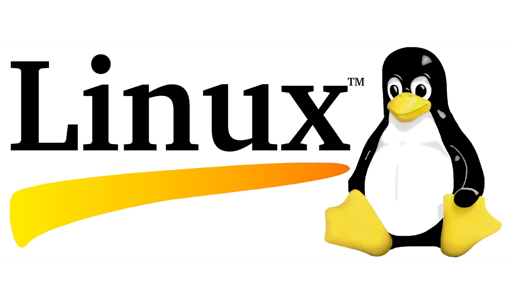

Geliştiricilerden Linux'un geliştirilmesi için yardım teklifleri gelmeye başladı. Linux'un bir diğer önemli yönü de GNU projesi çerçevesinde geliştirilen Unix benzeri işletim sisteminin büyük bir kısmının tamamlanmış olmasıydı. Eksik olan şey işletim sisteminin çekirdeğiydi (kernel) ve Linux bu eksikliği giderdi. Eylül 1991'de Linux'un ilk sürümü yayınlandı ve böylece Linux tam anlamıyla doğmuş oldu.

---

Bölüm: Çekirdek Mimarileri: Monolitik vs. Mikro Çekirdek

İşletim sistemlerinin kalbi olan çekirdekler (kernel), tasarım felsefelerine göre ikiye ayrılır:

Monolitik Çekirdek (Linux, MS-DOS): Tüm temel servisler (sürücüler, dosya sistemi vb.) tek bir büyük çekirdek içinde çalışır. Bu yapı yüksek performans sağlar ancak tek bir hata tüm sistemi çökertebilir.
Mikro Çekirdek (Minix, QNX): Çekirdek sadece en temel görevleri (bellek yönetimi gibi) yapar; diğer her şey kullanıcı alanında çalışır. Daha güvenli ve modülerdir ancak sistem çağrılarından dolayı performans kayıpları yaşanabilir.
Hibrit Çekirdek (Windows NT, macOS/XNU): Her iki dünyanın avantajlarını birleştirmeyi hedefler.

---

Bölüm: Günümüz İşletim Sistemleri

[Görsel: Günümüz İşletim Sistemleri]

Bilgisayar dünyasında Windows, Unix ve Linux işletim sistemleri genel kabul görmüş, zaman içinde donanım mimarilerindeki inanılmaz gelişmelere paralel olarak evrilmiş ve farklı sürümlerle günümüze kadar gelmiştir. Günümüzdeki işletim sistemleri sadece kişisel bilgisayarları değil; süper bilgisayarları, devasa sunucu tarlalarını, akıllı saatleri ve nesnelerin interneti (IoT) cihazlarını yöneten karmaşık yapılara dönüşmüştür. Temelde ise modern işletim sistemleri Windows, Unix veya Linux işletim sistemlerinden birine dayanmaktadır. Bu 3 işletim sisteminden türetilmişlerdir. Bu bakımdan işletim sistemlerini 3 ana sınıfa ayırabiliriz:

Unix Tabanlı işletim sistemleri.
Windows tabanlı işletim sistemleri.
Linux tabanlı işletim sistemleri.

Bölüm Detayı: Unix Tabanlı Sistemler

Unix'in ortaya çıktıktan sonra popüler olmasının en önemli nedenlerinden biri farklı donanım üreticilerine göre uyarlanabilmesi ve modüler yapısıydı. Ancak 1980'lerde ve 90'larda yaşanan "Unix Savaşları", sistemin çeşitli kollara ayrılmasına (özellikle System V ve BSD kollarının çatışmasına) neden oldu. Unix telif hakkı olan ticari bir üründür ve günümüzde The Open Group, Unix ile ilgili tüm ticari lisanslama programlarını yönetir. Sadece katı standartları (POSIX vb.) karşılayan ve lisansı olan bazı büyük şirketler UNIX ticari markasını kullanabilir.

Günümüzde Unix tabanlı sistemler genellikle bankacılık, telekomünikasyon ve kritik veri tabanları gibi son derece yüksek kararlılık gerektiren kurumsal ortamlarda yaşar. Tüketici tarafındaki en büyük Unix temsilcisi ise çekirdeği Darwin (BSD tabanlı) olan Apple'ın macOS ve iOS işletim sistemleridir.

Bazı önemli Unix dağıtımları şunlardır:

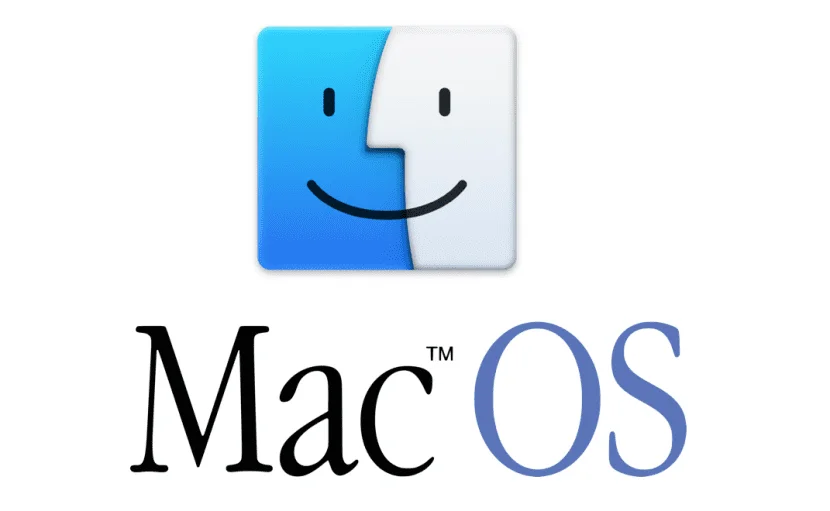
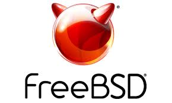
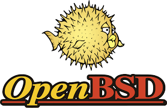
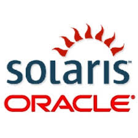
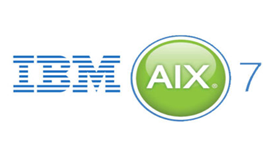

MacOS, Oracle Solaris, IBM AIX, HP-UX, IRIX ve BSD (FreeBSD, OpenBSD, NetBSD).

Bölüm Detayı: Windows Tabanlı Sistemler

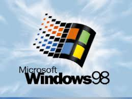
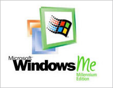
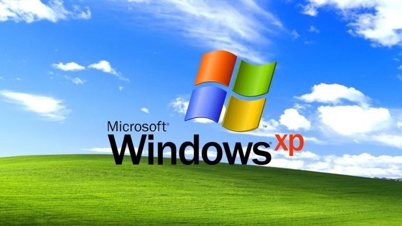
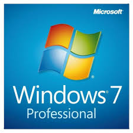
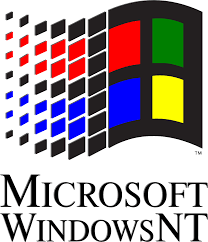

Windows programları çalıştırmak, komut vermek vb. için son kullanıcıya hitap eden son derece kullanışlı grafik arayüzler kullanır. Hızlı işlemlerin gerçekleştirilmesinde kolaylık sağlar. Windows işletim sistemlerinin en önemli özelliği öğrenilmesinin kolay olması, geniş yazılım geriye dönük uyumluluğu ve bilgisayar oyunu pazarındaki mutlak tekelidir. Bu sayede ev ve ofis bilgisayarlarında en çok kullanılan masaüstü işletim sistemi haline gelmiştir.

Windows'un teknik evrimindeki en büyük sıçrama, MS-DOS tabanlı alt yapının (Windows 95/98) terk edilerek tamamen yeni ve çok daha kararlı olan Windows NT (New Technology) mimarisine geçilmesidir. Windows XP ve günümüzde kullandığımız Windows 10 ile 11 bu NT çekirdeği üzerine inşa edilmiştir. Bugüne kadar Windows'un birçok sürümü piyasaya sürülmüştür. Bunlar sırasıyla şöyledir:

Windows 1.0, Windows 2.0, Windows 3.0, Windows 95, Windows 98, Windows ME, Windows XP, Windows Vista, Windows 7, Windows 8, Windows 8.1 ve Windows 10.

Bölüm Detayı: Linux Tabanlı Sistemler

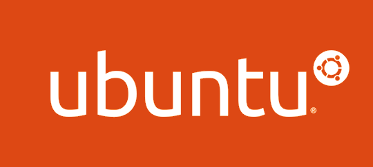
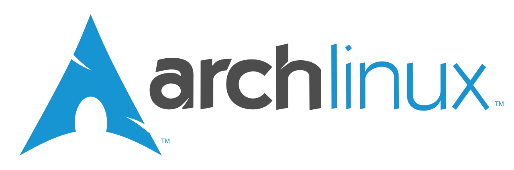
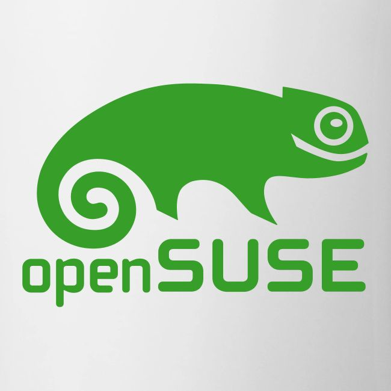
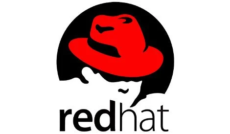

Ortaya çıkışından sonra Linux dünya çapında dikkat çekti ve GNU tarafından benimsendi. Bu nedenle GNU/LINUX kavramı ortaya çıktı. Linux bugün özgür yazılım felsefesiyle desteklenmekte ve dünyanın en büyük teknoloji şirketlerinin (Google, Amazon, IBM vb.) katkılarıyla geliştirilmektedir. Dünyadaki en hızlı 500 süper bilgisayarın tamamı ve internetteki sunucuların çok büyük bir çoğunluğu Linux kullanır.

Aslında Linux sadece çekirdekten (kernel) ibarettir ve kendi başına bir kullanıcı arayüzü veya hazır programlar bütünü sunmaz. Açık kaynak kodlu, özgür bir yazılım olduğu için ücretsizdir, donanıma göre istenildiği gibi özelleştirilebilir. Bu esneklik sayesinde herhangi bir şirket veya topluluk, Linux çekirdeğini alıp üzerine kendi araçlarını ekleyerek farklı Linux "dağıtımları" (Distro) oluşturabilir. Bu nedenle sayısız Linux tabanlı işletim sistemi bulunmaktadır.

Bir Linux sisteminin son kullanıcıya hitap edebilmesi için çekirdek üzerine inşa edilen, iskelet sistem diyebileceğimiz bir yapıya ihtiyaç vardır. Her bir dağıtım, kendi paket yönetim felsefesini (.deb, .rpm vb.) ve kullanıcı deneyimini sunar. Arayüzde; GNOME, KDE Plasma, XFCE, MATE, CINNAMON gibi devasa kod tabanlarına sahip hazır masaüstü ortamları (GUI) kullanılmaktadır. Paket yöneticilerine örnek olarak ise APT, DNF ve PACMAN verilebilir. Farklı paket yöneticileri, felsefeler ve GUI'ler kullanan sayısız Linux dağıtımı ortaya çıkmıştır. Bunlardan en bilinenleri şunlardır:

Ubuntu, Kali Linux, Pardus, Linux Mint, Zorin, Deepin, SteamOS, MX Linux, PureOS, Raspbian, Parrot, elementaryOS, Pop!_OS, Linux Lite, Fedora, Redhat, Opensuse, CentOS ve Arch Linux.

---

Bölüm: Mobil İşletim Sistemleri: iOS ve Android Dönemi

2000'li yılların sonunda akıllı telefonların çıkışıyla işletim sistemi savaşları mobil alana taşındı. Symbian ve Palm OS gibi erken dönem oyuncuları, 2007'de Apple'ın iOS'u ve 2008'de Google'ın Android'i tanıtmasıyla yerlerini modern devlere bıraktılar. iOS, BSD tabanlı kapalı bir ekosistem sunarken; Android, Linux çekirdeği üzerine kurulu açık kaynaklı bir yapı benimseyerek pazarın çoğunluğunu ele geçirdi.

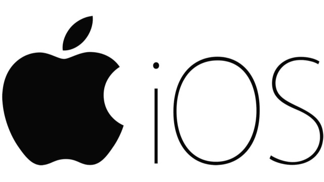

---

Bölüm: İşlemci Mimarilerindeki Değişim: x86'dan ARM'ye

[Görsel: x86 vs ARM Mimarisi]

Uzun yıllar boyunca kişisel bilgisayarlar ve sunucular pazarında Intel ve AMD'nin başını çektiği x86/x64 mimarisi tartışmasız bir tekel konumundaydı. Mobil cihazlarda (akıllı telefonlar ve tabletler) ise enerji verimliliği ile öne çıkan ARM mimarisi kullanılıyordu. Ancak mobil cihazların gücünün artmasıyla işletim sistemleri ve donanım üreticileri bu sınırı aşmaya başladı.

Bunun en büyük örneğini, Apple'ın kendi tasarımı olan Apple Silicon (M1, M2 vb.) işlemcilere geçmesi ve macOS işletim sistemini tamamen ARM mimarisi üzerinde çalışacak şekilde yeniden yazması oluşturdu. Masaüstü seviyesinde inanılmaz bir performans/watt oranı sunan bu gelişmenin ardından Microsoft da Windows on ARM projesine hız vererek masaüstü işletim sistemlerinin sadece x86 mimarisine mahkum olmadığını kanıtlamış oldu.

---

Bölüm: Güvenlik ve Sanallaştırma (Hypervisors)

İşletim sistemleri geliştikçe, donanım kaynaklarını daha verimli kullanma ve güvenliği artırma ihtiyacı da büyüdü. Bu ihtiyaçlar Sanallaştırma (Virtualization) teknolojilerini doğurdu. Hypervisor (Sanallaştırma Yöneticisi) adı verilen yazılımlar (örneğin VMware, KVM, Hyper-V) sayesinde tek bir fiziksel sunucu üzerinde birbirinden tamamen izole edilmiş birden fazla işletim sistemi çalıştırılabilir hale geldi. Bu izole yapı hem sunucu maliyetlerini düşürdü hem de sistem çökmelerinin veya güvenlik açıklarının diğer sistemleri etkilemesini engelledi.

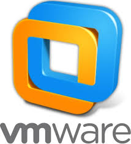
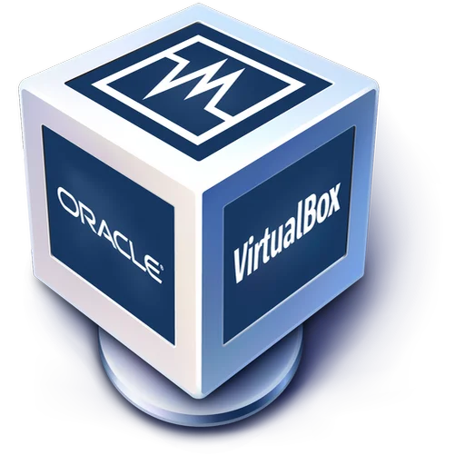
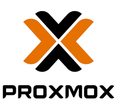
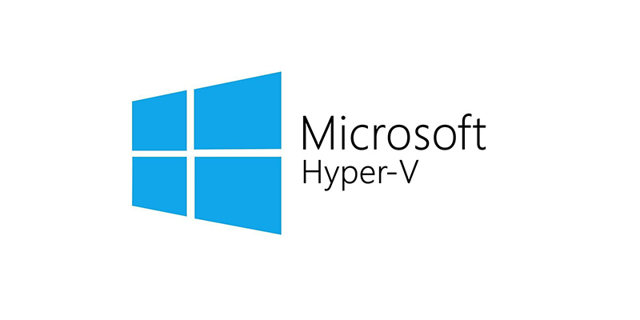

Güvenlik tarafında ise modern işletim sistemleri donanımsal koruma mekanizmalarıyla entegre çalışmaya başladı. Özellikle sistemin sadece güvenilir, üretici tarafından imzalanmış yazılımlarla açılmasını sağlayan Secure Boot teknolojisi ve kriptografik anahtarları donanımsal düzeyde saklayan TPM (Trusted Platform Module) çipleri günümüzde Windows 11 gibi sistemler için zorunlu hale gelerek yazılım-donanım güvenliğini ayrılmaz bir bütün yaptı.

---

Bölüm: Bulut, Konteynerler ve Gelecek

Bugün işletim sistemleri artık sadece fiziksel makineleri değil, bulut altyapılarını yönetiyor. 2013'te Docker ile başlayan konteyner devrimi ve 2014'te Kubernetes orkestrasyon sistemi, işletim sistemlerini donanımdan tamamen soyutlayarak modern yazılım mimarilerinin standardı haline geldi.

---

Bu yazı, bilgisayar tarihinin dönüm noktalarını ve işletim sistemlerinin evrimini özetlemek amacıyla hazırlanmıştır.

Originally published at https://pwnlab.me on June 1, 2021.

Verinizin mimarı olun, egemenliğinizi geri alın. Dinlediğiniz için teşekkürler!
