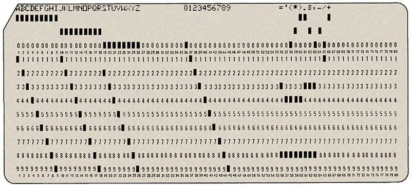
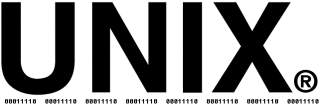
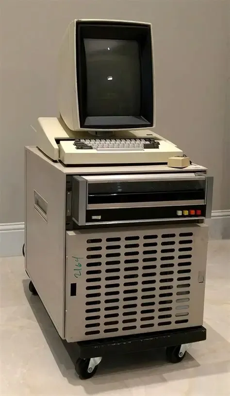
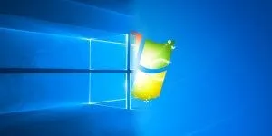
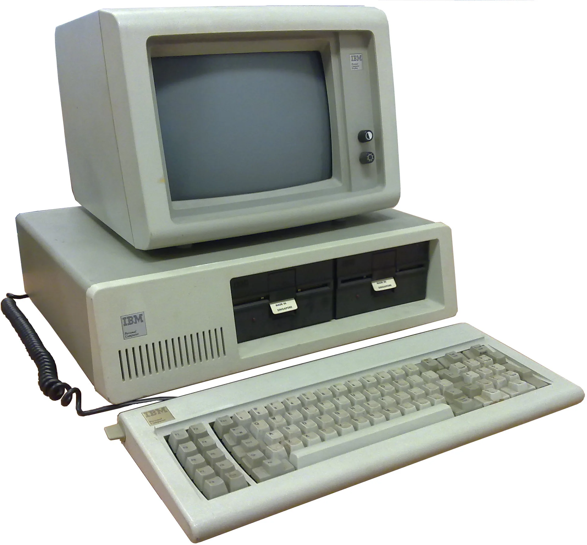
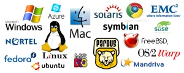
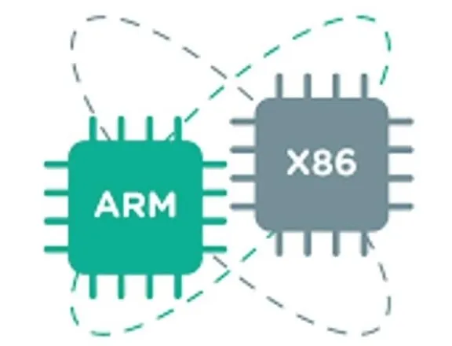

In this article, we will examine the operating systems that have become indispensable for computer systems today. We will talk about how it developed and how it came to these days. We will witness how the operating systems popular today emerged.

To start with what the operating system is; Operating system is software that controls all operations of a computer. This software provides the tools that allow a user to save and open files, the interface through which a user can convey a request to execute a program, and the environment in which the desired programs can be executed. When it comes to operating system, Windows operating system developed by Microsoft comes to mind. Apart from this, there are also Unix and Linux operating systems. But before that, let's look at the history of operating systems.

## First Computers and the Hardware-Focused Era

The first computers were the size of a room. They did not have an operating system. Programs were coded on punched cards and were given to the computer and executed sequentially. Machines like the 1940s **ENIAC**, which covered approximately 167 square meters and housed over 18,000 vacuum tubes, were configured at the hardware level by engineers rerouting cables. This process, called the mission, required serious preparation. To run a program on the computer, a reservation was made in advance and that user would have the right to use the computer during this period.

In such an environment, operating systems emerged as systems that simplify program installation and organize transitions between tasks. The user who wanted to execute a task would give the program, the data to be processed, and the instructions to the operator, the task would be queued, and the operator would execute the program in accordance with the instructions. Then the user would come to get the results. This is the first example of the concept of **batch processing** (e.g., GM-NAA I/O developed at IBM in 1956). Although this system increased the efficiency and operating speed of computers, it also prevented the user from interacting with the computer. It was unacceptable for applications that required the user to interact with the program during its execution.

To meet these needs, an interactive processing model was developed, enabling users to establish a dialogue with the executing program via a terminal. These terminal screens continue to exist in today's operating systems. However, this model brought with it new problems. That is, only one user could run a program with the terminal at a time. In those days when computers were very expensive systems, a single computer had to serve multiple users.

The solution to this problem was to develop an operating system that could serve multiple users at the same time. This led to the emergence of **time-sharing systems** (CTSS, Multics, etc.). In this technique, time was divided into certain intervals and the execution of each task was limited to a single time interval. At the end of each interval, the current task would be stopped, temporarily stored, and another task would be executed. Processing and removing multiple tasks quickly would create the impression that these tasks were being executed simultaneously. Additionally, this system enabled a user to run multiple programs at the same time.

In short, operating systems have evolved over time from simple programs that can carry out a single task at a time to complex systems that manage time sharing, are responsible for programs and data files in storage, and can respond to users' requests.

## The Birth of Unix

In the 1960s, AT&T's Bell laboratories, MIT and General Electric worked on a time-sharing operating system in a project carried out together. As a result of this project, an operating system called "Multics" emerged. When Bell Laboratory withdrew from the project, **Dennis Ritchie** and **Ken Thompson**, who worked there, created a new operating system in a new project, taking advantage of their experience in the "Multics" project. This operating system, which was initially written in assembly language, was called **"Unix"**.

Dennis Ritchie rewrote Unix with the **C programming language** he developed in 1973. While the operating system, which was previously written in assembly language, was dependent on the architecture of the hardware on which it ran, he gained the ability to run on different platforms with the C language. After this stage, the Unix operating system began to be heard and rapidly gained popularity with the support of students and employees in the computer departments of universities. It made progress and became the most important operating system.

The Unix operating system was a complete operating system that included command line and some graphical elements like Windows. Users carried out their operations using command lines. Thanks to being a time-sharing operating system, multiple users could use the computer or a user could run multiple programs simultaneously.

## Xerox PARC: The True Ancestor of Modern Interfaces

While many believe graphical user interfaces (GUI) were invented by Apple or Microsoft, the true birthplace of this technology is **Xerox PARC** (Palo Alto Research Center). The **Xerox Alto**, developed in 1973, was the first machine to carry the DNA of modern personal computers.

The Xerox Alto was the first system to introduce the **WIMP** paradigm (Windows, Icons, Menus, and a Pointer/Mouse) to the world. When Steve Jobs visited the lab in 1979, he was so impressed by what he saw that he brought these ideas into the Apple Lisa and Macintosh projects, bringing the graphical interface to the masses.

## The Birth of Windows

Personal computers were still in the early stages of their development in the mid-70s. MITS' most important sample, called **Altair**, did not yet have a uniform, usable software, but had an incomplete operating system. Thanks to **BASIC**, the software language developed by Bill Gates and Allen for Altair in 1974, computer users could write their own programs. MITS company purchased the marketing license from young researchers and ordered them to further develop the system. Thereupon, Gates founded the company called **Microsoft** in New Mexico with Allen.

Microsoft developed an operating system called **MS-DOS** for IBM PC compatible computers. In 1980, it formed a partnership with IBM, and with this agreement, IBM paid Microsoft a licensing fee for each sale. He then developed a new graphical user interface (GUI) for MS-DOS called "Interface Manager." However, before the official launch in 1985, marketing experts convinced Bill Gates that **Windows** was a more appropriate name. 

Thus, Windows was born as an interface program that facilitates the use of personal computers. Windows, which is an interface software built on top of the MS-DOS operating system, became a complete operating system with the release of new versions in the following years.

## Free Software Philosophy and the Birth of Linux

In the early 1980s, AT&T sought to monetize the UNIX operating system and began marketing the operating system with special licenses. Many people who helped develop the operating system from the day UNIX emerged opposed this decision. Thereupon, the **GNU** project, whose aim was to create a UNIX-like operating system that could be distributed free of charge, was started by **Richard Stallman** and the "Free Software Foundation (FSF)" was established for this project.

Within the scope of the GNU project, the **Minix** operating system, a Unix derivative, emerged. This operating system was developed by Prof. Andrew S. Tanenbaum with a microkernel architecture in order to teach students in university computer departments the working principles and functions of operating systems.

In 1991, computer science student **Linus Torvalds** posted a message to a newsgroup where information was exchanged on Unix and Minix operating systems. In his message, Linus stated that he was working on a free operating system and asked for suggestions for development. Linus named his new operating system **Linux**, which he described as Linus' Minix. 

    
    

Offers of help for the development of Linux began to come from developers. Another important aspect of Linux was that a large part of the Unix-like operating system developed within the framework of the GNU project was finished. What was missing was the kernel of the operating system, and Linux made up for this deficiency. In September 1991, the first version of Linux was released and thus Linux was born.

## Kernel Architectures: Monolithic vs. Microkernel

Kernels, the heart of operating systems, are divided into two main design philosophies:

1.  **Monolithic Kernel (Linux, MS-DOS):** All core services (drivers, filesystem, etc.) run within a single large kernel. This structure provides high performance, but a single error can crash the entire system.
2.  **Microkernel (Minix, QNX):** The kernel handles only the most basic tasks (like memory management); everything else runs in user space. It is more secure and modular but can suffer from performance losses due to system calls.
3.  **Hybrid Kernel (Windows NT, macOS/XNU):** Aims to combine the advantages of both worlds.

## Today's Operating Systems

In the computer world, Windows, Unix and Linux operating systems have become generally accepted, evolved over time in parallel with incredible advances in hardware architectures, and come to this day with different versions. Today's operating systems manage not only personal computers but also supercomputers, massive server farms, smartwatches, and Internet of Things (IoT) devices. Fundamentally, modern operating systems are based on one of the Windows, Unix, or Linux operating systems. They are derived from these 3 main systems. In this respect, we can divide operating systems into 3 classes.

1- Unix Based operating systems
2- Windows based operating systems
3- Linux based operating systems

### Unix-based systems
One of the most important reasons why Unix became popular after its emergence was its modularity and adaptability to different hardware manufacturers. However, the "Unix Wars" of the 1980s and 90s caused the system to fragment into various branches (especially the conflict between System V and BSD). Unix is a copyrighted commercial product. Today, The Open Group manages all Unix-related commercial licensing programs. Only certain large companies with licenses and systems meeting strict standards (like POSIX) can use the UNIX trademark.

Today, Unix-based systems generally thrive in enterprise environments that require extremely high stability, such as banking, telecommunications, and critical database servers. The biggest representative of Unix on the consumer side is Apple's **macOS** and **iOS**, which are built on the **Darwin (BSD-based)** kernel. Some notable Unix distributions are as follows;

    
    
    
    
    

**MacOS, Oracle Solaris, IBM AIX, HP-UX, IRIX and BSD (FreeBSD, OpenBSD, NetBSD).**

### Windows-based systems

    
    
    
    
    

Windows uses highly functional graphical interfaces tailored for end-users to run programs, issue commands, etc. It provides ease of performing fast transactions. The most important feature of Windows operating systems is that they are easy to learn, possess vast software backward compatibility, and hold an absolute monopoly in the PC gaming market. Thanks to these conveniences, it has become the most widely used desktop operating system for home and office computers.

The biggest leap in Windows' technical evolution was the abandonment of the MS-DOS-based infrastructure (Windows 95/98) in favor of the entirely new and much more stable **Windows NT** (New Technology) architecture. Windows XP and the modern Windows 10/11 we use today are built upon this NT kernel. Many versions of Windows have been released so far. These are respectively;

**Windows 1.0, Windows 2.0, Windows 3.0, Windows 95, Windows 98, Windows ME, Windows XP, Windows Vista, Windows 7, Windows 8, Windows 8.1 and Windows 10.**

### Linux-based systems

    
    
    
    

After its emergence, Linux attracted worldwide attention and was adopted by GNU. That's why the concept of **GNU/LINUX** emerged. Today, Linux is supported by the free software philosophy and developed with contributions from the world's largest technology companies (Google, Amazon, IBM). All of the top 500 fastest supercomputers in the world and the vast majority of servers on the internet run on Linux.

In fact, Linux consists only of the kernel and does not have an interface or a bundled suite of software on its own. Since it is open source and free software, it can be customized as desired for any hardware. This flexibility allows any company or community to take the Linux kernel, add their own tools on top of it, and create different Linux "distributions" (Distros). Therefore, there are countless Linux-based operating systems.

In order for a Linux-based system to cater to an end-user, a skeletal system built on top of the kernel is required. Each distribution offers its own package management philosophy (.deb, .rpm, etc.) and user experience. In the interface, robust desktop environments (GUIs) with massive codebases such as **GNOME, KDE Plasma, XFCE, MATE, and CINNAMON** are used. Examples of package managers are **APT, DNF, and PACMAN**. Numerous Linux distributions have sprung up using different package managers, philosophies, and GUIs. Some of the most well-known are;

**Ubuntu, Kali Linux, Pardus, Linux Mint, Zorin, Deepin, SteamOS, MX Linux, PureOS, Raspbian, Parrot, elementaryOS, Pop!_OS, Linux Lite, Fedora, Redhat, Opensuse, CentOS and Arch Linux.**

## Mobile Operating Systems: The Era of iOS and Android

In the late 2000s, with the rise of smartphones, the OS wars moved to the mobile arena. Early players like **Symbian** and **Palm OS** gave way to modern giants after the introduction of Apple's **iOS** in 2007 and Google's **Android** in 2008. While iOS offers a closed ecosystem based on BSD, Android adopted an open-source structure built on the Linux kernel, eventually capturing the majority of the market.

    
    

## The Shift in Processor Architectures: From x86 to ARM

For many years, the **x86/x64** architecture led by Intel and AMD held an undisputed monopoly in the personal computer and server markets. In mobile devices (smartphones and tablets), the **ARM** architecture, which stands out with its energy efficiency, was used. However, as the power of mobile devices increased, operating systems and hardware manufacturers began to cross this boundary.

The biggest example of this was Apple's transition to its custom-designed **Apple Silicon (M1, M2, etc.)** processors, rewriting the macOS operating system to run completely on the ARM architecture. Offering an incredible performance/watt ratio at the desktop level, this development prompted Microsoft to accelerate the **Windows on ARM** project, proving that desktop operating systems are not tied solely to the x86 architecture.

## Security and Virtualization (Hypervisors)

As operating systems evolved, the need to use hardware resources more efficiently and increase security also grew. These needs gave birth to **Virtualization** technologies. Through software called Hypervisors (e.g., VMware, KVM, Hyper-V), it became possible to run multiple completely isolated operating systems on a single physical server. This isolated structure both reduced server costs and prevented system crashes or security vulnerabilities from affecting other systems.

    
    
    
    

On the security side, modern operating systems began to work integrated with hardware protection mechanisms. In particular, the **Secure Boot** technology, which ensures that the system boots only with trusted, manufacturer-signed software, and **TPM (Trusted Platform Module)** chips, which store cryptographic keys at the hardware level, have become mandatory for systems like Windows 11 today, making software-hardware security an inseparable whole.

## Cloud, Containers, and the Future

Today, operating systems manage cloud infrastructures rather than just physical machines. The container revolution that started with **Docker** in 2013 and the **Kubernetes** orchestration system in 2014 completely decoupled operating systems from hardware, becoming the standard for modern software architectures.

    
    

---

*This article has been prepared to summarize the turning points of computer history and the evolution of operating systems.*

*Originally published at [https://pwnlab.me](https://pwnlab.me/tr-isletim-sistemlerinin-seruveni/) on June 1, 2021.*