## Cyber Attacks in the OSI Model

Hello, in this article, I tried to explain Cyber Attacks on the OSI model. You can find many types of cyber attacks in this article.

---
## What is the OSI Model?

The OSI (Open Systems Interconnection) model is a reference model used to describe the design and operation of computer networks. It was developed by ISO (International Organization for Standardization) and consists of 7 layers. Each layer performs a specific function and manages communication in a network.

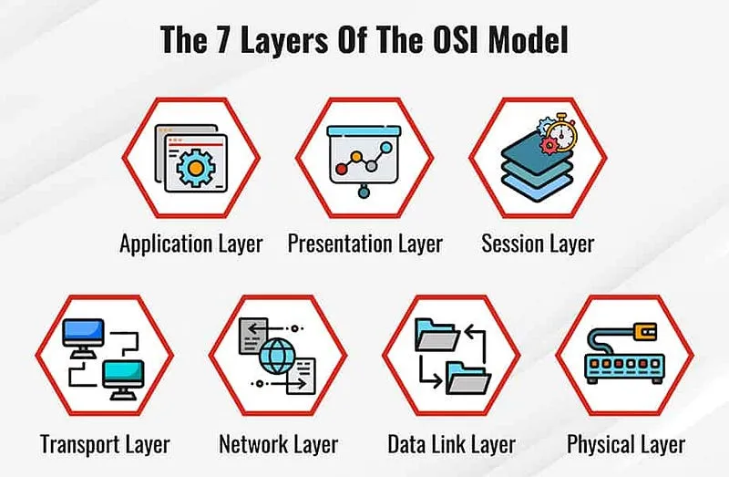

OSI MODEL

Below is a summary explaining the layers of the OSI model and the functions of each:

1. **Physical Layer:** Manages electrical, mechanical and physical connections. This layer includes details such as the types of cables used to transmit data, connectors, physical ports, and how data signals will be transmitted and received.
2. **Data Link Layer:** It corrects errors on the physical connection and provides secure communication. It receives data packets, breaks them into pieces (framing), addresses each piece (with MAC address), checks for errors and corrects them if necessary.
3. **Network Layer:** It allows determining the most appropriate path for transmitting data packets. It manages transmission routes and ensures connectivity with other devices on the network. Operations such as IP addressing and routing occur in this layer.
4. **Transport Layer:** Controls data flow and ensures data integrity. It ensures that data is sent correctly, sorted, and reaches its destination. Commonly used protocols at this layer include TCP (Transmission Control Protocol) and UDP (User Datagram Protocol).
5. **Session Layer:** It is responsible for creating, managing and terminating sessions between two devices. The session layer performs functions such as security, authentication and data synchronization during data transfer.
6. **Presentation Layer:** It ensures that data is represented harmoniously between different systems. It performs operations such as data encryption, compression and format conversion.
7. **Application Layer:** Contains applications that provide end users access to the network. Applications such as e-mail, web browsers, file transfer protocols (FTP) are located in this layer.

### OSI Model Attack Mapping
The following diagram visualizes the 7 layers of the OSI model alongside the most common cyber attacks targeting each layer:

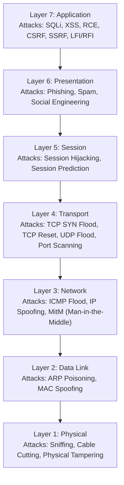

---
## Physical Layer Attacks

This layer is the layer where physical devices are located. At this layer, attackers can make physical attacks on systems. For example, an attacker who was able to enter the server room could shut down the server or change its configurations. Physical security of systems is as important as cyber security. One type of cyber attack that attackers can perform at this layer is sniffing. Sniffing the packets entering and exiting the system :)

### sniffing

Sniffing attacks are malicious activities carried out to monitor or capture data transmission on a network. Attackers capture data packets on the network and use them to steal or monitor sensitive information (usernames, passwords, credit card information, etc.).

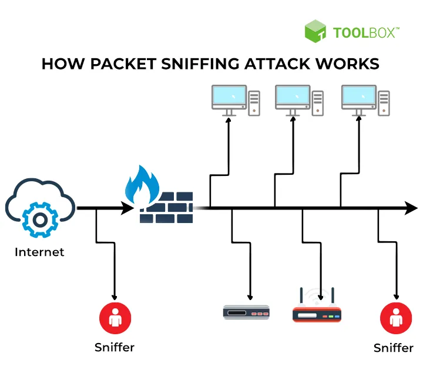

sniffing

Sniffing attacks are generally carried out to monitor or intercept data packets on the network. To do this, attackers can use special software or tools on a networked computer or network device. Attackers can gain unauthorized access to the network or infect network devices with malware to eavesdrop on network traffic.

Sniffing attacks compromise the confidentiality of communication taking place on the network. Attackers can capture data packets on the network, access the information in them, and use them for various purposes. For example, it can steal user login information, capture financial data, or access sensitive business information.

  

    DEFENSE
    <h3>Sniffing Mitigation</h3>
    
The most effective defense against sniffing is <strong>strong encryption</strong>. Secure protocols like SSH, HTTPS, SFTP, and WPA3 must be used globally, while plaintext protocols (HTTP, FTP, Telnet) should be disabled.

  

---
## Data Link Layer Attacks

This layer is used to move data across a connected physical network. IP addresses are assigned on the network using a procedure called address resolution protocol (ARP).is mapped to each physical device address (also known as the media access control (MAC) address).

In the simplest terms, a MAC address identifies the intended recipient of an IP address sent over the network, and ARP parses IP addresses to MAC addresses for data transmission.

### spoofing

Spoofing or poisoning is a type of impersonation attack that takes advantage of a trusted relationship between two systems.

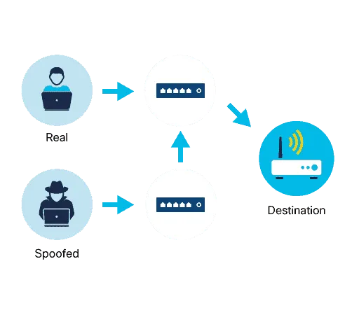

Spoofing

  

    MAC
    <h3>MAC Address Spoofing</h3>
    
Occurs when an attacker alters their Network Interface Card (NIC) address to impersonate an authorized host, bypassing port security and MAC filters.

  

  

    ARP
    <h3>ARP Poisoning / Spoofing</h3>
    
Sends malicious, spoofed ARP packets across a LAN to associate the attacker's MAC address with the IP address of a legitimate gateway or server, enabling MitM interception.

  

  

    IP
    <h3>IP Spoofing</h3>
    
Creation of IP packets with a forged source IP address to conceal the sender's identity, bypass access control lists (ACLs), or execute reflection attacks.

  

---
## Network Layer Attacks

This layer ensures the transmission of data packets. However, attackers can sometimes listen to this transmission traffic. In addition, host scans with nmap occur in this layer.

### MITM(Man-in-the-Middle) Attacks

Attackers can intercept or alter communications between two devices to steal information from or impersonate one of the devices.

A MitM attack occurs when an attacker takes control of a device without a user's knowledge. With this level of access, an attacker can intercept, manipulate, and transfer false information between the sender and the intended destination.

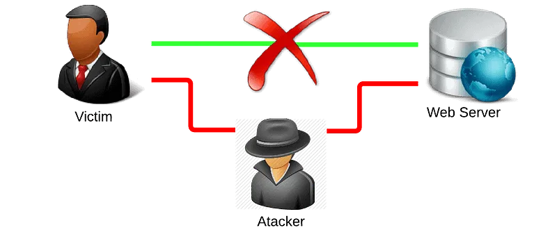

MITM

MitMo, a variation of man in the middle, is a type of attack used to take control of a user's mobile device. Once infected, the mobile device is instructed to exfiltrate user-specific information and send it to attackers.

### ICMP Attacks

ICMP was developed to carry diagnostic messages and report error conditions when servers and ports are unavailable. ICMP messages are created by devices when a network error or outage occurs. The ping command is a user-generated ICMP message, called an echo request, used to verify connectivity to a target.

Attackers use ICMP for reconnaissance and scanning purposes. In this way, they can conduct information gathering activities to map a network topology, discover which hosts are active (accessible), identify the host operating system (OS fingerprinting), and determine the status of a firewall.

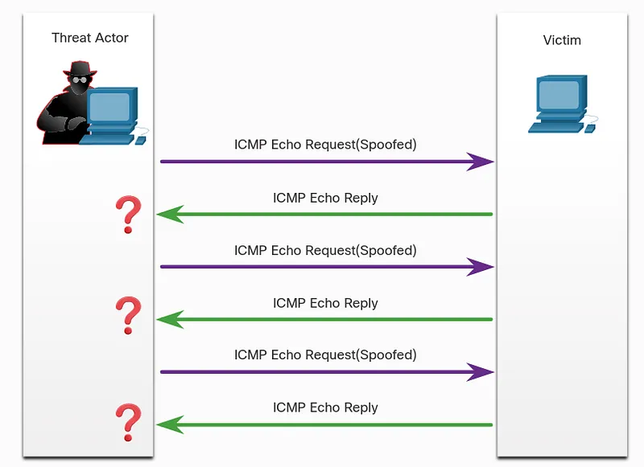

ICMP Flood

Threat actors also use ICMP for DoS and DDoS attacks, as shown in the ICMP flood attack in the figure.

**DoS (Denial-of-Service)**, Threat actors attempt to prevent legitimate users from accessing information or services.

**DDoS(Distiributed-Denial-of-Service)** is similar to a DoS attack, but involves a simultaneous, coordinated attack from multiple source machines.

ICMP Messages:

* **ICMP echo request and echo reply:** Used to perform authentication and DoS attacks on servers.
* **ICMP unreachable:** Used to perform network reconnaissance and scanning attacks.
* **ICMP mask reply:** Used to map an internal IP network.
* **ICMP redirect:** Used to persuade a target server to send traffic through a compromised device, creating a MiTM attack.
* **ICMP router discovery:** Used to inject spoofed route entries into a target server's routing table.

Networks should have strict ICMP access control list (ACL) filtering at the network edge to prevent ICMP probing from the internet. Security analysts should be able to detect ICMP-related attacks by looking at captured traffic and log files. In the case of large networks, security devices such as firewalls and intrusion detection systems (IDS) must detect such attacks and send alerts to security analysts.

---
## Transport Layer Attacks

At this layer, network applications use TCP or UDP ports. Attackers perform port scans of target devices to discover what services they offer. Also, port scans with nmap take place in this layer.

  

    SYN FLOOD
    <h3>TCP SYN Flood</h3>
    
Exploits the TCP 3-way handshake. The attacker sends continuous SYN requests but ignores SYN-ACK responses, leaving connections half-open until resources are exhausted.

  

  

    TCP RESET
    <h3>TCP Reset Attack</h3>
    
Terminates established TCP sessions by injecting spoofed packets with the RST (Reset) flag set, forcing endpoints to tear down connection states immediately.

  

  

    UDP FLOOD
    <h3>UDP Flood</h3>
    
Saturates a network by sending large volumes of UDP packets to random ports on the target host. The host is forced to check for apps and reply with ICMP Destination Unreachable packets, clogging bandwidth.

  

### TCP SYN Flood Attack

TCP SYN Flood attack exploits the TCP three-way handshake.

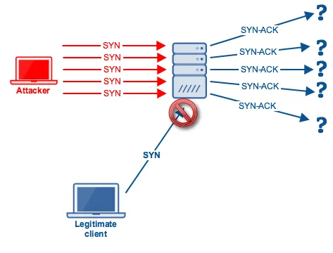

TCP SYN Flood Attack

The figure shows an attacker repeatedly sending TCP SYN session request packets to a target with a randomly spoofed source IP address. The target device responds to the spoofed IP address with a TCP SYN-ACK packet and expects a TCP ACK packet. These answers never come. Eventually the target host is overwhelmed with half-open TCP connections and TCP services are blocked to legitimate users.

### **TCP Reset Attack**

A TCP reset attack can be used to terminate TCP communication between two hosts.

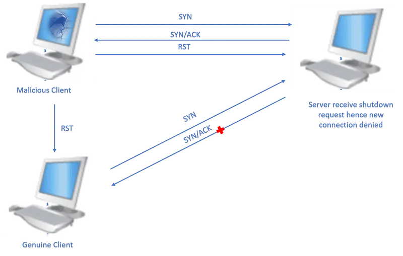

TCP Reset Attack

A TCP connection terminates when it receives the RST bit. This is an immediate way to break the TCP connection and tell the receiving host to immediately stop using the TCP connection. An attacker can perform a TCP Reset attack and send a spoofed packet containing TCP RST to one or both endpoints.

### **UDP Flood Attack**

You are more likely to see a UDP flood attack than a TCP SYN flood.

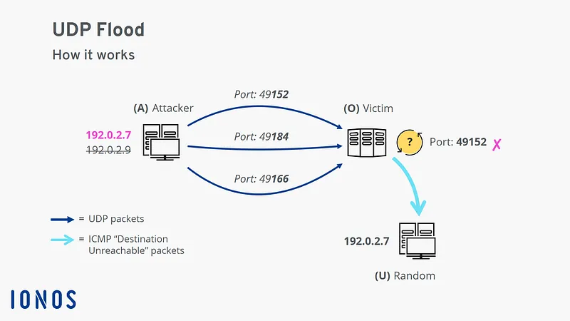

In a UDP flood attack, all resources on the network are consumed. The attacker should use a tool such as UDP Unicorn or Low Orbit Ion Cannon. These tools send UDP packets, usually from a rogue host, to a server on the subnet. The program will scan all known ports and try to find closed ports. This causes the server to respond with an ICMP port unreachable message. Since there are many closed ports on the server, it creates a lot of traffic on this segment, which uses most of the bandwidth. The result is very similar to a DoS attack.

---
## Session Layer Attacks

In this layer, session operations of network applications are carried out. Attackers may attempt to hijack user sessions in applications.

### Session Hijacking Attack

Session Hijacking is an attack in which a user session is hijacked by an attacker. A session begins when you log in to a service, such as your banking app, and ends when you log out. The attack relies on the attacker knowing your session cookie, which is why it is also called cookie hijacking or cookie bypassing.

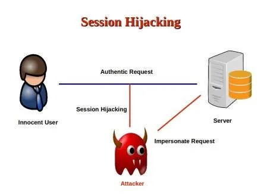

Session Hijacking

There are two types of session hijacking depending on how it is done. If an attacker directly engages the target, it is called active hijacking, and if an attacker just passively monitors traffic, it is called passive hijacking.

Methods Used:

* **Session Sniffing:** The attacker first uses a sniffer to capture a valid token session called "Session ID", then uses the current session to gain unauthorized access to the Web Server.
* **Cross-site scripting attack**: The attacker captures the session cookie by using malicious code or programs running on the client side.
* **Session Prediction Attacks:** Predicting the session ID can allow an attacker to bypass authentication and access a victim's session, but requires the attacker to know the session ID generation process.

---
## Presentation Layer Attacks

This layer provides the presentation of data. Attackers use social engineering methods at this layer.

Social engineering attacks may include tactics such as gaining people's trust, manipulation, deception, or deception. Attackers can carry out social engineering attacks at the corporate or personal level. For example, an attacker could make a phone call pretending to be an employee of an organization and attempt to obtain the employee's credentials or confidential company information by posing as a trusted source.

### Spam Attack

Spam, also known as junk mail, is simply unsolicited email. In most cases it is a method of advertising. However, many spams are sent in bulk by computers infected with viruses or worms and often contain malicious links, malicious software, or deceptive content intended to trick recipients into revealing sensitive information such as social security numbers or bank account information.

spam

spam mSome types of malware that may come with ailler:

* **Spyware:** It is malicious software that is installed on computers or mobile devices without permission and monitors the user's activities, collects information or takes control. It is generally used to steal user information, generate advertising revenue, or monitor user behavior.
* **Adware:** These are software that are installed on computers or mobile devices together with free software and are designed to display advertisements to users. Adware displays ads on the user's browser or system to promote advertisers' products or services, without the user's consent.
* **Ransomware:** is a type of malicious software that prevents user access by encrypting the targeted system or files. Attackers then refuse to unlock files or systems unless a ransom is paid. Ransomware attacks are often accompanied by ransom demands.
* **Keylogger:** It is a software that records the user's keyboard entries on a computer or mobile device. Keyloggers can record passwords, usernames, credit card information, and other sensitive information by tracking a user's keystrokes.
* **Rootkit:** Used by hackers or attackers to gain unauthorized access, control system resources, or perform other malicious activities. Rootkits attempt to disguise themselves so that they are difficult to detect and remove by an operating system or security software.
* **Backdoor:** It is a malicious mechanism that provides unauthorized access to computer systems or software and creates a hidden entry point in the system. Backdoors are often used by hackers or attackers to control the system, steal information or perform malicious activities.

### Phishing Attacks

Phishing occurs when a user is contacted via email, instant message — or otherwise — by someone pretending to be a legitimate person or organization. The goal is to trick the recipient into installing malware on their device or sharing personal information, such as login credentials or financial information.

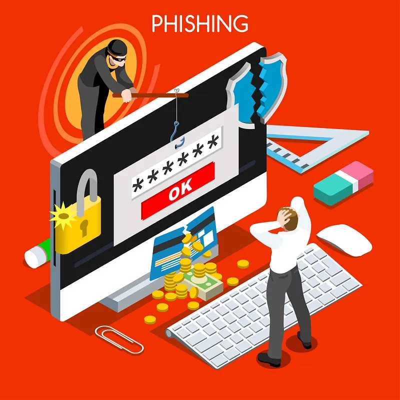

Phishing

For example, you receive an email congratulating you on winning a prize. It appears to be sent from a well-known retail store and asks you to click on a link to claim your reward. This link may actually redirect you to a fake site that asks you to enter personal information or may even install a virus on your device.

Phishing Types:

* **Spear phishing:** A highly targeted attack, spear phishing sends customized emails to a particular person based on information the attacker knows about that person (which could be their interests, preferences, activities, and business projects).
* **Vishing:** In this type of attack, often called voice phishing, criminals use voice communication technology to encourage users to disclose information such as credit card information.
* **Pharming:** This type of attack deliberately redirects users to a fake version of an official website. Users who are led to believe that they are connecting to a legitimate site enter their credentials into the fake website.
* **Whaling:** A phishing attack that targets high-profile individuals within an organization, such as senior executives, politicians, and celebrities.

---
## **7-Application Layer Attacks**

This layer contains applications that provide end users access to the network. Various vulnerabilities may occur in these applications. Attackers carry out attacks by taking advantage of these vulnerabilities.

### Remote Code Execution — RCE Attack

Remote code execution allows a cybercriminal to exploit application vulnerabilities to execute any command on the target device with the privileges of the user running the application.

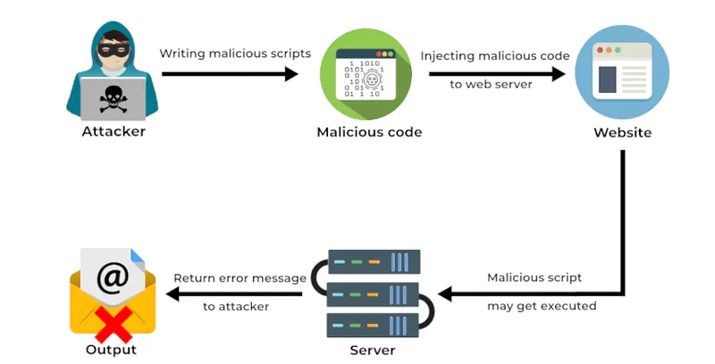

RCE

Privilege escalation exploits a bug, design flaw, or misconfiguration in an operating system or software application to gain access to normally restricted resources.

These vulnerabilities generally occur in services that are not updated. Systems for thisKeeping it updated is vital.

### Code Injection Attack

Most modern websites use a database, such as a Structured Query Language (SQL) or Extensible Markup Language (XML) database, to store and manage data. Injection attacks attempt to exploit weaknesses in these databases.

Code Injeciton

There are several types of code injection attacks:

1. **XML Injection Attack:** This attack can corrupt the data in the XML database and threaten the security of the website. They can access all sensitive information stored in the database and make any changes they want on the website.
2. **SQL Injection Attack:** It can perform SQL injection attack on websites or any SQL database by inserting a malicious SQL statement into an input field.
3. **DLL Injection Attack:** A dynamic link library (DLL) file is a library that contains a set of code and data to perform a specific activity in Windows. Applications use this type of file to add non-built-in functionality when they need to perform this activity. DLL injection allows an attacker to trick an application into calling a malicious DLL file running as part of the target process.
4. **LDAP Injection Attack:** Lightweight Directory Access Protocol (LDAP) is an open protocol used to authenticate user access to directory services. This attack exploits input validation vulnerabilities by injecting queries into LDAP servers.
5. **Command Injection Attack:** It is a vulnerability that occurs when the application**,** does not perform security checks to directly execute commands created with user-supplied input. These types of attacks allow attackers to execute malicious commands by manipulating commands on the web application.

### File Inclusion Attack

File Inclusion Attack is a vulnerability that occurs when a web application includes external files or resources without validating or properly sanitizing user-supplied input. This type of attack aims to allow attackers to gain unauthorized access to files on the web application's server and exploit the target system.

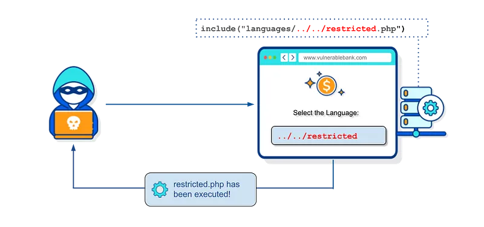

File Inclusion

File Inclusion Attack can generally be performed in two different ways:

1. Local File Inclusion (LFI): The attacker manipulates user-supplied input to gain access to local files located on the web application's server. An attacker can access and exploit sensitive files on the server (e.g., configuration files, user authentication information, etc.).
2. Remote File Inclusion (RFI): The attacker manipulates user-supplied input to include files located on a remote server outside into the web application. The attacker can perform unwanted operations on the system by introducing a malicious file or script into the target server.

To protect against such attacks, it is important for web applications to validate user-supplied input, properly sanitize it, and implement security controls. Additionally, limiting the file path, configuring access permissions correctly, and performing regular security audits to detect vulnerabilities are also important security measures.

### XSS(Cross-Site Scripting) Attack

XSS attacks occur when user-supplied data is not adequately validated or sanitized. Attackers exploit the vulnerability of the web application and inject malicious scripts run in the browser into the target user's browser.

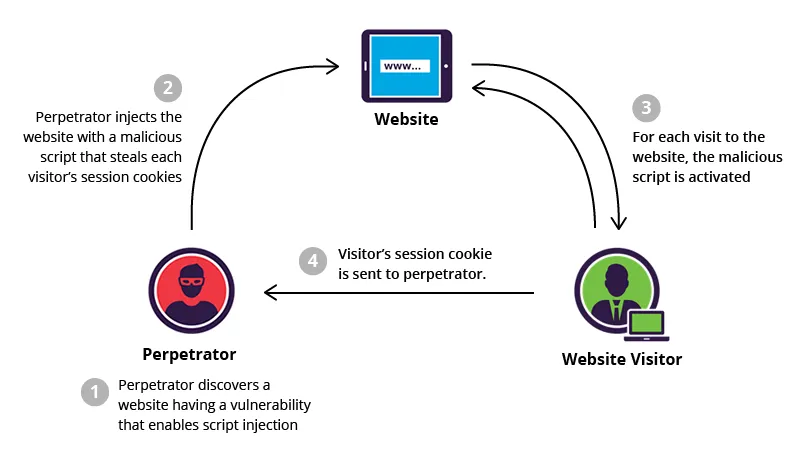

XSS attacks are typically carried out by the attacker embedding his own script code into the web application. These scripts run in the target user's browser and can perform any actions desired by the attacker. Attackers can steal users' login information, serve malicious content to users, redirect users or change page content through XSS attacks.

XSS attacks can be divided into three different types:

1. **Stored (Persistent) XSS:** Malicious scripts are permanently stored in the web application and areIt is displayed by target users. These types of attacks are common in applications that store user-generated content, such as forums, comment areas, or message boards.
2. **Reflected XSS:** Malicious scripts are sent with the request sent by the user to the web application and are executed by the target user in the returning response. These types of attacks occur in applications that process user-supplied input, such as search forms or URL parameters.
3. **DOM-based XSS:** This type of XSS attacks targets vulnerabilities in the Document Object Model (DOM). Attackers manipulate the DOM structure of the web page to run malicious scripts in the target user's browser.

To protect against XSS attacks, it is important for web applications to validate user-supplied data, properly sanitize it, and implement security controls. Complying with secure coding standards, limiting data entry, and using browser-side protections are also effective protection methods.

### CSRF(cross-site request forgery) Attack

CSRF describes malicious use of a website where unauthorized commands are sent from a user's browser to a trusted web application.

CSRF

A malicious website can deliver such commands via specially crafted image tags, hidden forms, or JavaScript requests — all of which can operate without the user's knowledge.

### SSRF (Server-Side Request Forgery) Attack

It is a vulnerability that exploits the ability of requests made on the server-side of a web application to affect resources targeted on the client-side. SSRF attacks can occur when the web application's security controls are not adequately maintained.

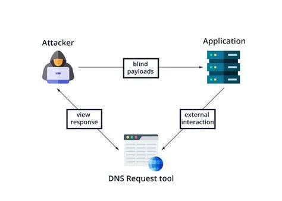

SSRF

In this type of attack, attackers can use the targeted web application to manipulate HTTP requests made by the server. By exploiting this vulnerability, an attacker can trigger requests directed to the internal network or to external resources, often with the aim of gaining access to the network or gaining unauthorized access to the target system.

### Directory Traversal Attack

Directory traversal occurs when an attacker is able to read files on the web server outside of the website's directory.

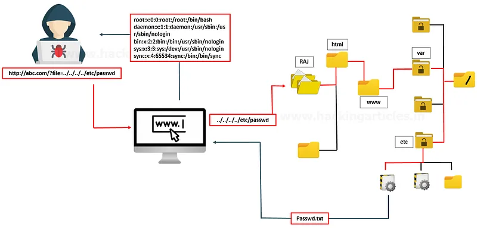

Directory Traversal

The attacker can then use this information to download server configuration files containing sensitive information, potentially exposing further server vulnerabilities or even taking control of the server!

### Buffer Overflow Attack

Buffers are memory areas allocated to an application. A buffer overflow occurs when data is written beyond the boundaries of a buffer. The application can access memory reserved for other processes by manipulating data beyond buffer boundaries. This may lead to a system crash, data compromise, or escalation of privileges.

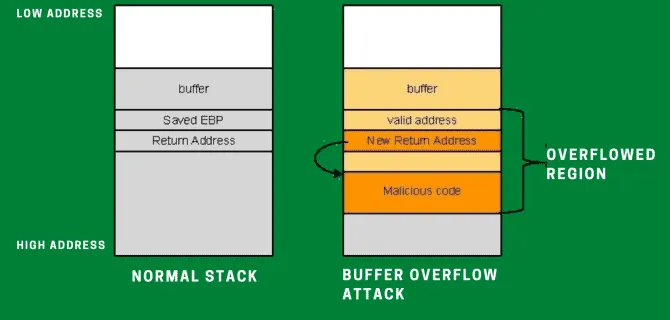

Buffer Overflow

These memory flaws can also give attackers complete control over the target's device. For example, an attacker could modify the instructions of a vulnerable application while the program is loading in memory and, as a result, install malware and gain access to the internal network from the infected device.

### Race Condition Attack

A race condition attack, also known as a time of control (TOC) or time of use (TOU) attack, occurs when a computer system designed to perform tasks in a specific order is forced to perform two or more operations simultaneously.

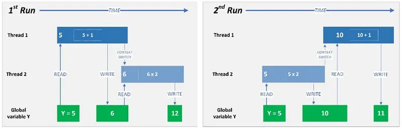

Race Condition

For example, operating systems consist of threads, which are the smallest series of program instructions required to perform an operation. A race condition attack occurs when two or more threads access shared data and attempt to modify it simultaneously.

In this article, I tried to make a classification of cyber attacks that can occur according to the OSI reference model. If there are any shortcomings, you can write them in the comments section. Don't forget to like and share my article!