# Elastic Stack (ELK Stack)

---
## Debian Elastic Stack Kurulumu, Konfigürasyonu ve Siber Güvenlik Mimarisi


ELK Stack'in adı, aileye dördüncü bir bileşen olan hafif veri toplayıcı ajanların (**Beats**) katılmasıyla birlikte resmi olarak **Elastic Stack** olarak değiştirildi. Aslında topluluk içinde hâlâ ELK Stack olarak anılsa da üretici firma Elastic, ürünü tamamen bu çatı isim altında konumlandırıyor.

Son dönemde Elastic Stack ekosisteminde mimariyi, lisanslamayı ve kullanım alışkanlıklarını kökten değiştiren çok kritik gelişmeler yaşandı. Bu yazıda hem sıfırdan Debian/Ubuntu üzerinde Elastic Stack kurulumunu gerçekleştireceğiz hem de bir sistem ve güvenlik mühendisi gözünden bu yeni nesil gelişmeleri (AGPLv3 lisansına dönüş, Elastic Agent & Fleet mimarisi, ES|QL sorgu dili ve Yapay Zeka entegrasyonu) mimari boyutta inceleyeceğiz.

### Elastic Stack Nedir?

Elastic Stack, log yönetimi, altyapı gözlemlenebilirliği (observability) ve siber güvenlik operasyonlarında (SIEM/XDR) dünya standardı haline gelmiş bir platformdur. Klasik yapıda adını oluşturan Elasticsearch, Logstash ve Kibana üçlüsünden oluşurken, günümüzde Beats ailesi, birleşik Elastic Agent mimarisi ve Fleet merkezi yönetim sistemini de kapsar.


Elastic Stack Bileşenleri

* **Elasticsearch:** Büyük miktarda yapılandırılmış ve yapılandırılmamış veriyi depolamak, indekslemek ve milisaniyeler seviyesinde aramak için kullanılan, aynı zamanda vektör arama (Vector Database) kabiliyetlerine sahip analiz motorudur.
* **Logstash:** Veri toplama, işleme, Grok filtreleri ile ayrıştırma ve dönüştürme süreçlerini yöneten sunucu tarafı veri işleme hattı (pipeline) aracıdır.
* **Kibana:** Elasticsearch'te depolanan verileri görselleştirmek, Fleet yönetimini sağlamak ve güvenlik kurallarını (SIEM) yapılandırmak için kullanılan web arayüzüdür.
* **Beats:** Uç sistemlerden log (Filebeat), performans metriği (Metricbeat), ağ trafiği (Packetbeat) gibi verileri toplayan hafif veri toplama ajanlarıdır.
* **Elastic Agent & Fleet:** Tüm Beats işlevlerini tek bir ajan çatısında birleştiren ve Kibana üzerinden merkezi yönetim (Fleet) sağlayan yeni nesil uç nokta mimarisidir.

Elastic Stack ürünlerinin klasik kurulum sırası:  
 1- **Elasticsearch**  
 2- **Kibana**  
 3- **Logstash**

---
## Elastic Stack Ekosistemindeki Son Gelişmeler ve Mimari Evrim


Son dönemde Elastic Stack ekosisteminde lisanslamayı, mimariyi ve sorgulama alışkanlıklarını kökten değiştiren gelişmeler yaşandı:

<div class="render-cards">
  <div class="render-card render-card-csr">
    <span class="render-badge">LİSANS</span>
    <h3>Lisans Savaşları & AGPLv3</h3>
    <p>Elastic, AWS'in kodu ticari olarak sömürmesini engellemek için 2021'de Apache 2.0 lisansını bırakıp SSPL modeline geçmişti. Ancak yakın zamanda SSPL ve Elastic License 2.0 yanına <strong>AGPLv3</strong> lisansını da ekleyerek resmi olarak yeniden <strong>"Açık Kaynak (Open Source)"</strong> unvanını geri kazandı. Bu süreçte AWS öncülüğünde çatallanan <strong>OpenSearch</strong> projesi ise bağımsız bir ekosistem olarak yoluna devam etmektedir.</p>
  </div>
  <div class="render-card render-card-ssr">
    <span class="render-badge">MİMARİ</span>
    <h3>Elastic Agent & Fleet</h3>
    <p>Klasik mimarideki dağınık Beats ajanları (Filebeat, Metricbeat vb.) yerine artık tek bir birleşik <strong>Elastic Agent</strong> yapısı kullanılmaktadır. Kibana üzerindeki <strong>Fleet</strong> arayüzü sayesinde, binlerce sunucudaki ajanlar merkezi politikalarla tek bir tuşla yönetilebilmekte, Logstash'in parse yükü büyük oranda Ingest Node'lara kaydırılmaktadır.</p>
  </div>
  <div class="render-card render-card-ssg">
    <span class="render-badge">ES|QL</span>
    <h3>ES|QL Sorgu Dili</h3>
    <p>Yıllardır kullanılan KQL ve Lucene sorgularının yanına, SQL benzeri boru hattı (pipe - <code>|</code>) mantığıyla çalışan <strong>ES|QL</strong> sorgu dili eklenmiştir. Performans için sıfırdan tasarlanan bu dil, tek satırda filtreleme, dönüştürme ve zenginleştirmeyi Elasticsearch motoru içinde çok daha hızlı yürütür.</p>
  </div>
  <div class="render-card render-card-isr">
    <span class="render-badge">AI / VEKTÖR</span>
    <h3>Yapay Zeka & Vektör DB</h3>
    <p>Elasticsearch, entegre vektör veritabanı desteği ve Elastic'in kendi geliştirdiği arama modeli <strong>ELSER</strong> sayesinde loglar ve dokümanlar arasında anlamsal (semantic) arama yapabilmektedir. Siber güvenlik analistleri, "şüpheli kullanıcı hareketleri" gibi soyut kavramları anlamsal olarak sorgulayabilmektedir.</p>
  </div>
</div>

### Mimari Evrim Şeması: Klasik vs. Modern Elastic Stack

Aşağıdaki mimari şema, Elastic Stack'in geleneksel Beats-Logstash boru hattı ile modern birleşik Elastic Agent ve Fleet yapısı arasındaki veri akışı ve yönetim farkını göstermektedir:

```mermaid
graph TD
    subgraph Klasik Mimari (Beats + Logstash)
        C1[Log Dosyaları] --> FB[Filebeat]
        C2[Sistem Metrikleri] --> MB[Metricbeat]
        FB --> LS[Logstash Parser]
        MB --> LS
        LS --> ES1[(Elasticsearch)]
        ES1 --> KB1[Kibana Discover]
    end

    subgraph Modern Mimari (Elastic Agent + Fleet)
        Sunucu[Hedef Sunucu] -->|Tek Ajan| EA[Elastic Agent]
        Fleet[Kibana Fleet Panel] -->|Merkezi Yönetim / Politikalar| EA
        EA -->|OTel / ECS Formatında Log| IN[Elasticsearch Ingest Node]
        IN --> ES2[(Elasticsearch Vector DB)]
        ES2 --> ESQL["ES|QL Engine"]
        ESQL --> KB2[Kibana Dashboard]
    end
```

### ES|QL Sorgu Boru Hattı Mimarisi

ES|QL sorguları, Linux terminalindeki `pipe` mantığıyla çalışır. Her aşama bir önceki aşamanın çıktısını filtreler veya dönüştürür.


---

İlk olarak kurulumu yapacağımız ortamı hazırlamamız gerekiyor. Bunun için elimizde bir işletim sistemi olması gerekiyor.


### Debian Nedir?

Debian, 1993 yılında başlatılmış, Dünya'nın çeşitli bölgelerindeki gönüllüler tarafından hazırlanan; GNU/Hurd, GNU/Linux gibi farklı çekirdek seçeneklerine dayalı tamamen özgür bir Linux dağıtımıdır. Bazı popüler debian tabanlı linux dağıtımları:

* **Ubuntu**
* **PureOS**
* **antix**
* **Derin**
* **PopOS**!
* **MX Linux**
* **Linux Mint**
* **Kali Linux**
* **Pardus**

Debian ailesinin bazı üyelerini burada saydık. ELK stack'i bunun dışında **Windows**, **Macos** veya **Redhat** tabanlı veya bağımsız diğer linux dağıtımları üzerine de kurabilirsiniz. Ben bu yazımda bir **ubuntu** makine üzerine kurulum yapacağım. Ancak aynı kurulum admları diğer debian tabanlı dağıtımlar içinde geçerlidir.

### Ön Hazırlık

İlk olarak kurulum yapacağımız sistemin bilgilerine bakalım ve güvenlik sebebiyle dağıtımın son sürüm olmasına dikkat edelim.

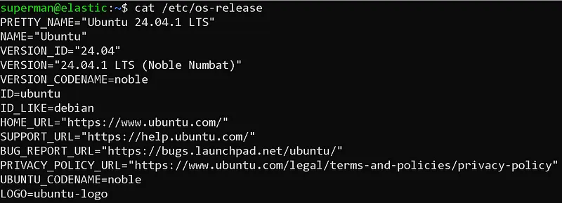

Kurulum yaptığım ubuntu dağıtımının versyon bilgileri.

Ben mevcut sunucuma hostname olarak "elastic" ismini verdim ve kendime "superman" isminde yetkili bir kullanıcı oluşturdum.

Ardından sistemimizdeki güncelleştirmeleri yapalım. Her kurulumdan önce bu güncelleştirmeleri yapmamız bağımlılıklardan kaynaklanan olası hataları en aza indirmemizi sağlar.

> sudo apt update && sudo apt upgrade

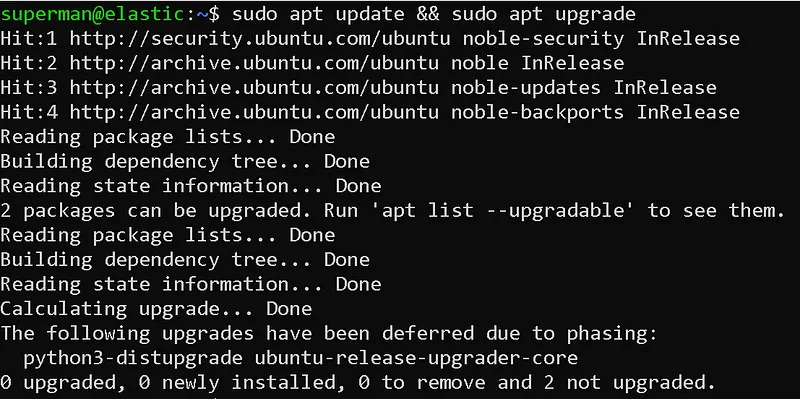

Paket güncelleştirmeleri

Son olarak makinemizin yeterli kaynağa sahip olduğundan emin olmalıyız. Yani yeterli disk, ram ve CPU'ya sahip olmalı. Bu sizin gereksinimlerinize göre değişecektir.

### **Elasticsearch Kurulumu**

Elasticsearch kurulumu için ilk olarak debian paketini indirmemiz lazım.

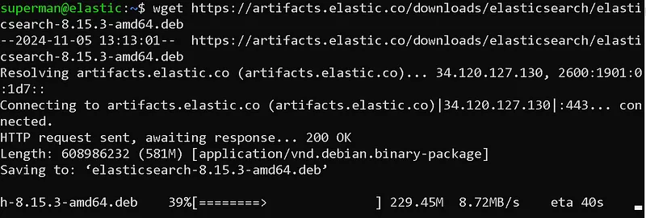

wget ile elasticsearch debian paketinin indirme işlemi

```
wget https://artifacts.elastic.co/downloads/elasticsearch/elasticsearch-8.15.3-amd64.deb
```

wget aracını kullanarak indirme işlemini gerçekleştirebiliriz.

Ardından debianın paket kurulum aracı olan dpkg ile kurulum işlemini gerçekleştirelim. Kurulum için root yetkisine ihtiyacımız var.

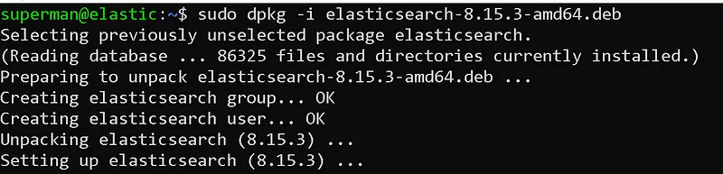

Elasticsearch kurulum

```
sudo dpkg -i elasticsearch-8.15.3-amd64.deb
```

Kurulum sonunda bize kuruluma nasıl devam etmemiz gerektiği hakkında öneriler sunuyor.

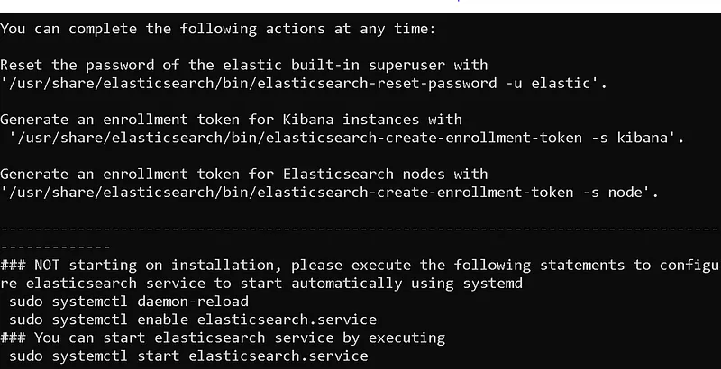

Kurulum sonrası adımlar

Buradan da hareketle kurulum sonrası adımlara devam edelim. İlk olarak servisimizi başlatalım.

```
sudo systemctl daemon-reload  
sudo systemctl enable elasticsearch.service  
sudo systemctl start elasticsearch.service
```

Journalctl komutunu kullanarak servisin durumu hakkında bilgi edinebiliriz.

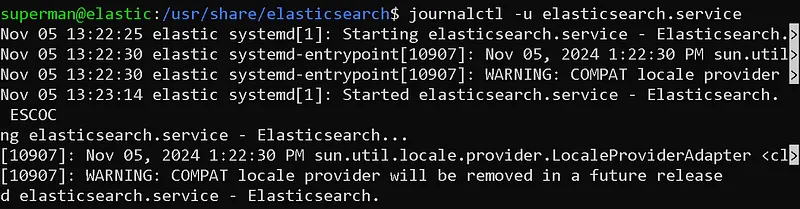

journalctl ile servis durumu inceleme

Şimdi elasticsearch arayüzüne erişmemizi sağlayan varsayılan yetkili kullanıcı olan "elastic" kullanıcısının şifresini sıfırlayalım. Burada istediğimiz şifreyi verebiliriz.

```
sudo /usr/share/elasticsearch/bin/elasticsearch-reset-password -u elastic -i
```

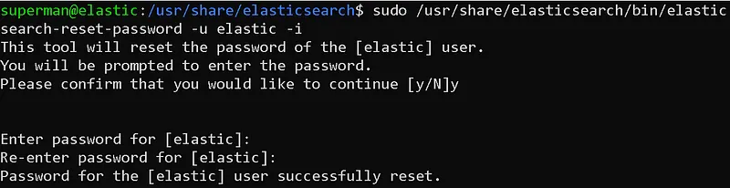

elastic kullanıcısı parola sıfırlama

Şimdi sıra kibana bağlantısında kullanacağımız tokenı üretmeye geldi.

```
sudo /usr/share/elasticsearch/bin/elasticsearch-create-enrollment-token -s kibana
```

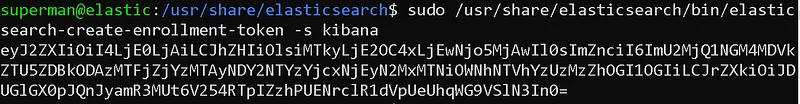

kibana bağlantısı için token üretme

Bu tokenı dikkatli bir şekilde saklamalıyız. İleride kibana bağlantısı yapmak için kullanacağız.

Son olarak sistemimizin firewalı üzerinde elasticsearch portunu açmamız gerekiyor.

```
sudo ufw allow 9200
```

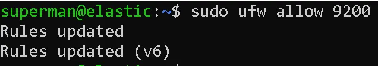

Firewall port açma işlemi

Şimdi sistemimiz bulunduğu networke elasticsearch servisini yayınlıyor. Browser üzerinden erişebiliriz.

> https://<host-ip>:9200

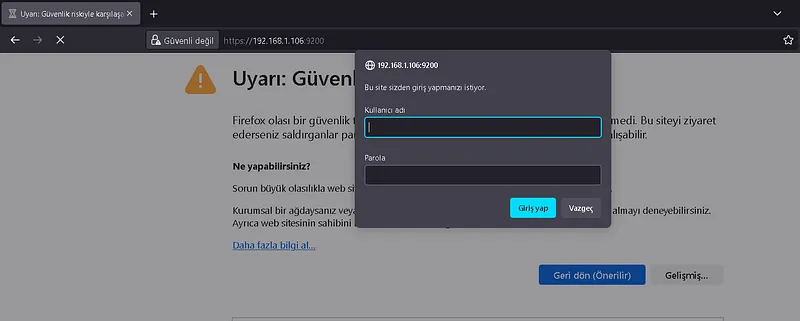

Browser üzerinden erişim

Burada kullanıcı adı olarak elastic ve şifre olarak önceki adımlarda belirlediğiniz şifreyi girerek elasticsearche erişebilirsiniz.

### Kibana Kurulumu

Kibana kurulumu için ilk olarak debian paketini indirmemiz lazım.

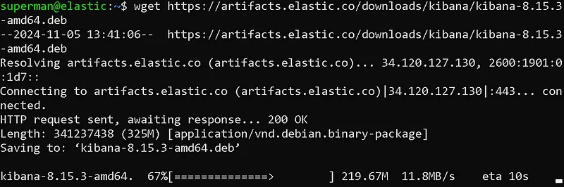

wget ile elasticsearch debian paketinin indirme işlemi

```
wget https://artifacts.elastic.co/downloads/kibana/kibana-8.15.3-amd64.deb
```

wget aracını kullanarak indirme işlemini gerçekleştirebiliriz.

Ardından debianın paket kurulum aracı olan dpkg ile kurulum işlemini gerçekleştirelim. Kurulum için root yetkisine ihtiyacımız var.

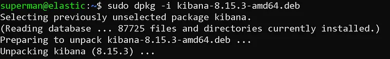

Kibana kurulum

```
sudo dpkg -i kibana-8.15.3-amd64.deb
```

Kurulum tamamlandıktan sonra kibana konfigürasyonlarına başlayabiliriz. Bunun için kibananın konfigürasyon dosyasını nano ile açıyoruz.

```
sudo nano /etc/kibana/kibana.yml
```

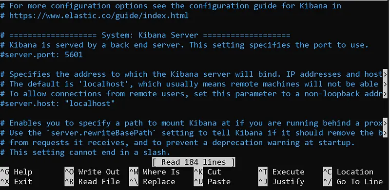

kibana.yml dosyası

Burada sadece değiştirilmesi gereken yerleri göstereceğim.

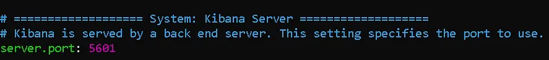

server.port

server.port alanının önündeki # işaretini silip tırnaklar içine kibana servisinin çalışmasnı istediğiniz portu yazın. Varsayılan olarak 5601'dir.

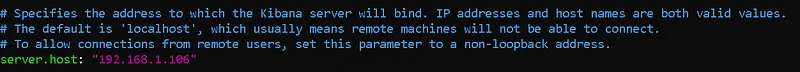

server.host

server.host alanının önündeki # işaretini silip tırnaklar içine kendi sisteminizin IP adresini yazın.

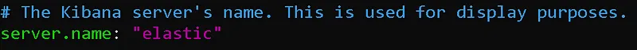

server.name

server.name alanının önündeki # işaretini silip tırnaklar içine kendi sisteminizin hostname'ini yazın. Benimki "elastic" olduğu için onu yazdım.

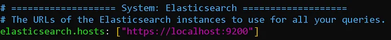

elasticsearch.hosts

kibananın bağlanacağı elasticsearch servisi. Bu serviside aynı makineye kurduğum için localhost kalabilir. Farklı bir host olsaydı onun IPsini yazmam gerekirdi. Ayrıca başdaki protokolü "https" olarak değiştirmeyi gözden kaçırmayalım.

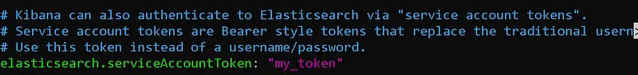

elasticsearch token bağlantısı

kibana elasticsearch bağlantısındaki kimlik doğrulama için 2 yol sunuyor. Bunlardan biri kullanıcı adı ve parola ile doğrulama diğeri ise bizim kullanacağımız token ile doğrulama. Hatırlarsanız elasticsearch kurulumu esnasında bir token oluşturmuştuk. Bu tokenı tırnak işaretleri arasına giriyoruz.

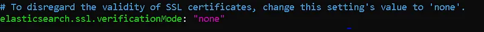

ssl.verification

elasticsearch'un kullandığı sertifika self-signed olduğu için herhangi bir otorite tarafından doğrulanmamıştır. Bu durum kibana ile bağlantısında ssl doğrulama hatası almamıza yol açar. Bu hatadan kaçınmak için ssl.verification alanını "none" yapıyoruz. Veya doğrulanmış bir ssl sertifikası yükleyebilirsiniz.

Temelde gerekli yapılandırmalarımız bu kadar. Diğer alanları ayarlamak için kibananın dokümanlarını inceleyebilirsiniz. Ben geri kalanı için varsayılan yapılandırmalarla devam ediyorum.

Şimdi servisimizi başlatalım.

```
sudo systemctl daemon-reload  
sudo systemctl enable kibana.service  
sudo systemctl start kibana.service
```

Journalctl komutunu kullanarak servisin durumu hakkında bilgi edinebiliriz.

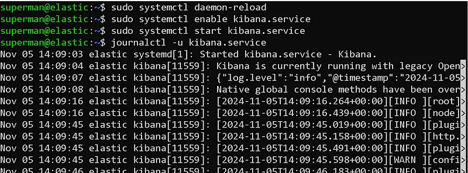

kibana servisinin başlatılması

Son olarak kibananın kullandığı 5601 portunu sistem firewallından açıyoruz.

```
sudo ufw allow 5601
```

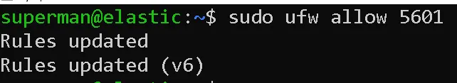

Port Açma İşlemi

şimdi browserınız üzerinden kibana paneline erişebilirsiniz.

> https://<host-ip>:5601/

Kibananın ayağa kalkması biraz uzun sürebilir.

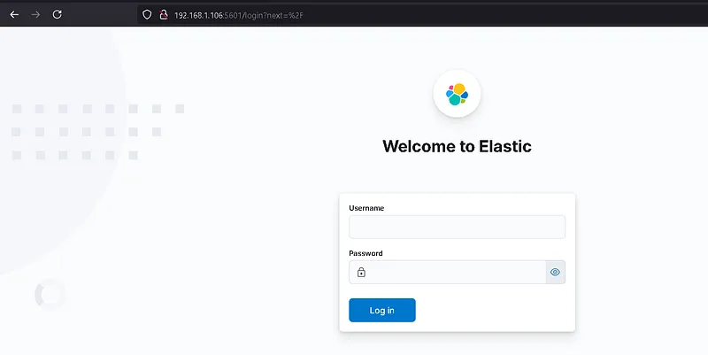

kibana paneli

Kibana panelimiz göründü. "elastic" kullanıcı ile bu panele giriş yapabilirsiniz. Biz kurulumlara devam edelim.

### Logstash Kurulumu

Logstash kurulumu için ilk olarak debian paketini indirmemiz lazım.

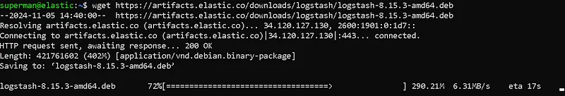

wget ile logstash paketini indirme işlemi

```
wget https://artifacts.elastic.co/downloads/logstash/logstash-8.15.3-amd64.deb
```

Ardından debianın paket kurulum aracı olan dpkg ile kurulum işlemini gerçekleştirelim. Kurulum için root yetkisine ihtiyacımız var.

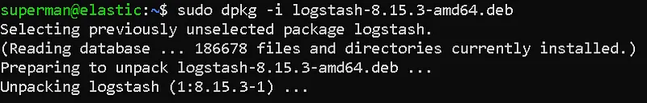

logstash kurulum işlemi

```
sudo dpkg -i logstash-8.15.3-amd64.deb
```

Kurulum tamamlandıktan sonra konfigürasyonlara başlayabiliriz.

ilk olarak elasticsearch bağlantısı için logstash\_system kullanıcısına şifre verelim. bu şifreyi unutmayın

```
sudo /usr/share/elasticsearch/bin/elasticsearch-reset-password -u logstash_system -i
```

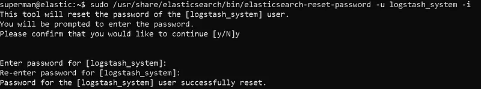

logstash\_system kullanıcısı şifre belirleme

ardından logstashin konfigürasyon dosyasını açıp düzenleyelim.

```
sudo nano /etc/logstash/logstash.yml
```

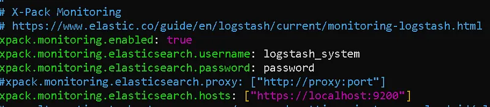

logstash.yml dosyası

Bu dosyada verdiğimiz string değerleri tırnak içine almayı unutmayın.

Artık logstash servisini başlatabiliriz.

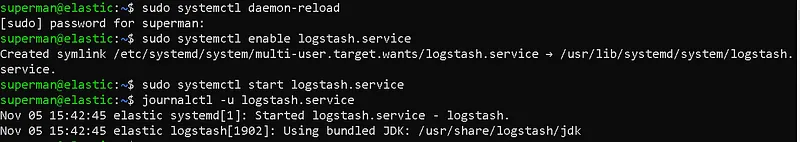

logstash servisi başlatma

```
sudo systemctl daemon-reload  
sudo systemctl enable logstash.service  
sudo systemctl start logstash.service
```

Son olarak logstashin varsayılan portu olan 5044 portunu sistemimizde açıyoruz.

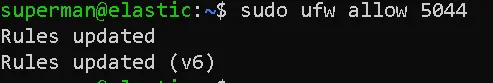

Port açma işlemi

```
sudo ufw allow 5044
```

Logstashe elasticsearch veya kibanada olduğu gibi browser üzerinden erişemeyiz. Çünkü logstash 5044 portundan log almakta ve kuyruklamaktadır. Yani herhangi bir cevap vermemektedir.

İlk pipeline'ımızı yapılandıralım!

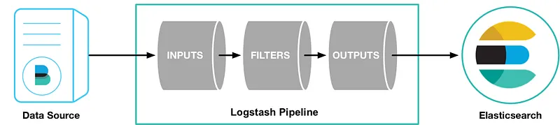

```
/usr/share/logstash/bin/logstash -e 'input { stdin { } } output { stdout {} }'
```

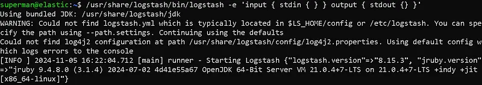

logstash pipeline oluşturma

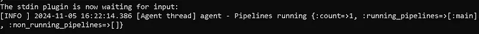

Girdi için hazır

pipeline'ımız 5044 portuna gelecek loglar içn dinlemede ve hazır.

logstash ile çeşitli parserlar yazıp loglarınızı parse edebilirsiniz.

Bu yazımda ELK stack kurulumuna değindim. Birdahaki yazımda ELK'ya log gönderme, ajan kurulumu ve log parselamaya değineceğim. Yayınladığım yazılardan haberdar olmak için beni takip edebilirsiniz.

---
## ELK Stack Log Yönetimi ve Analizi


Bu bölüm detayları ve etkileri incelemektedir.


### ELK Stack Log Yönetimi ve Analizi


Merhaba bu yazımda, geçen yazımda kurulumunu yaptığımız ELK Stack'in log yönetimini, yani log toplama, parse etme ve zenginleştirme işlemlerine değineceğim. Logstash ile loglar Nasıl Toplanır, İşlenir ve Gönderilir?

### Log Yönetimi Nedir?

**Log yönetimi**, bir sistemin veya uygulamanın ürettiği tüm günlük kayıtlarını (logları) toplama, depolamak, analiz etmek ve yönetmek sürecidir. Bu loglar, sistemin çalışmasıyla ilgili önemli bilgiler içerir ve sorun giderme, güvenlik analizi, performans takibi gibi birçok alanda kullanılır.

ELK Stack (Elasticsearch, Logstash, Kibana) ile log toplama yöntemleri:

1. **Syslog**: UNIX tabanlı sistemlerde yaygın olan bu protokol ile Logstash veya Beats aracılığıyla log toplanabilir.
2. **Beats**: Log toplama için farklı araçlar sunar. **Metricbeat** performans metriklerini toplarken, **Winlogbeat** Windows olaylarını toplar. **Heartbeat** ise sunucuların durumunu izler. .**Filebeat** ise dosya sistemlerinden log dosyalarını toplar ve bu verileri Logstash veya Elasticsearch'a gönderir. Herbirinin ayrı kurulumu gerekmektedir.
3. **Agent Kurulumu**: Log kaynağı olan sistemlere (sunucular, ağ cihazları vb.) agent kurulumu yapılır ve bu agentlar Logstash veya Beats'e veri gönderir.

**Agent Kurulumu Avantajları:**

1. **Merkezi Yönetim**: Log verilerini toplamak ve yönetmek için merkezi bir nokta sağlar. Bu, log verilerinin düzenli bir şekilde saklanmasını ve analiz edilmesini kolaylaştırır.
2. **Gerçek Zamanlı İzleme**: Agentlar, olayları gerçek zamanlı olarak izleyebilir ve anında raporlama yapabilir. Bu, anormallikleri hızlı bir şekilde tespit etmeyi sağlar.
3. **Özelleştirilebilirlik**: Agentlar, belirli gereksinimlere göre yapılandırılabilir. Farklı kaynaklardan gelen log verilerini toplamak ve dönüştürmek için çeşitli kurallar ve filtreler uygulayabilirsiniz.
4. **Gelişmiş Güvenlik**: Agentlar, log verilerinin güvenli bir şekilde iletilmesini sağlamak için şifreleme protokollerini destekler.
5. **Performans İzleme**: Agentlar, sistem performansını izlemek ve performans sorunlarını tespit etmek için kullanılabilir.

**Agent Kurulumu Dezavantajları:**

1. **Kaynak Kullanımı**: Agentlar, kurulu oldukları sistemlerde kaynak tüketimi yaratabilir. Bu, özellikle yüksek yoğunluklu sistemlerde performans sorunlarına neden olabilir.
2. **Yönetim Karmaşıklığı**: Birden fazla agentın yönetimi, özellikle büyük ölçekli sistemlerde karmaşık olabilir. Her bir agentın güncellenmesi ve yönetilmesi zaman alıcı olabilir.
3. **Güvenlik Riskleri**: Yanlış yapılandırılmış agentlar, güvenlik açıklarına neden olabilir. Bu nedenle, agentların güvenli bir şekilde yapılandırılması ve yönetilmesi önemlidir.
4. **Uyumluluk Sorunları**: Farklı sistemler ve platformlar arasında uyumluluk sorunları yaşanabilir. Bazı agentlar, belirli sistemlerde tam işlevselliğe sahip olmayabilir.

Biz bu yazımızda bir linux sistemden beats ile log gönderim ve logstash ile log toplama yapacağız.

### Logstash Yapılandırması

Logstash'ı bir boru hattı olarak hayal ettiğinizde anlamak daha kolaydır. Bu boru hattının bir ucunda veri kaynaklarını temsil eden **girdiler** bulunur. Günlük kayıtları Logstash boru hattından geçerken, gereksinimlerinize göre zenginleştirilebilir, filtrelenebilir veya manipüle edilebilir. Nihayetinde, boru hattının sonuna ulaştıklarında, Logstash bu günlükleri depolama veya analiz için yapılandırılmış hedeflere teslim edebilir.

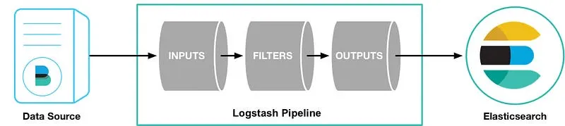

Logstash Boru Hattı

Bu veri işleme işlem hattını oluşturmak için Logstash'ı bir yapılandırma dosyası kullanarak yapılandırabilirsiniz. Tipik bir logstash yapılandırma dosyası:

```
input {  
      plugin_name{...}  
 }  
  
filter {  
     plugin_name{...}  
}  
  
output {  
     plugin_name{...}  
}
```

Şimdi bu bileşenleri inceleyelim:

* `input`: dosyalar veya uç noktalar gibi log kaynaklarını temsil eder.
* `filtre`(isteğe bağlı): log kayıtlarını birleştirir ve dönüştürür.
* `çıktı`: işlenen logların iletileceği hedef.

Bu girdilerin, filtrelerin ve çıktıların rollerini yerine getirebilmeleri için eklentilere ihtiyaçları vardır. Bu eklentiler Logstash'ı güçlendiren ve çok çeşitli görevleri yerine getirmesini sağlayan yapı taşlarıdır. Logstash'ın yeteneklerini daha iyi anlamanızı sağlamak için bu eklentileri inceleyelim.

### Logstash girdi eklentileri

Girdiler için Logstash, aşağıdaki gibi çeşitli kaynaklardan logları toplayabilen girdi [eklentileri](https://www.elastic.co/guide/en/logstash/current/input-plugins.html) sağlar:

* [HTTP](https://www.elastic.co/guide/en/logstash/current/plugins-inputs-http.html): HTTP uç noktaları üzerinden günlük kayıtlarını alır.
* [Beats](https://www.elastic.co/guide/en/logstash/current/plugins-inputs-beats.html): Beats çerçevesinden günlükleri toplar.
* [Redis](https://www.elastic.co/guide/en/logstash/current/plugins-inputs-redis.html): bir Redis örneğinden günlük kayıtlarını toplar.
* [Unix](https://www.elastic.co/guide/en/logstash/current/plugins-inputs-unix.html): günlük kayıtlarını bir Unix soketi üzerinden okuyun.

### Logstash filtre eklentileri

Günlükleri manipüle etmek, zenginleştirmek veya değiştirmek istediğinizde, buradaki filtre [eklentilerinden](https://www.elastic.co/guide/en/logstash/current/plugins-filters-elasticsearch.html) bazıları bunu yapmanıza yardımcı olabilir:

* [JSON](https://www.elastic.co/guide/en/logstash/current/plugins-filters-json.html): JSON günlüklerini ayrıştırır.
* [Grok](https://www.elastic.co/guide/en/logstash/current/plugins-filters-grok.html): günlük verilerini ayrıştırır ve yapılandırır.
* [I18n](https://www.elastic.co/guide/en/logstash/current/plugins-filters-i18n.html): günlük kayıtlarınızdan özel karakterleri kaldırır.
* [Geoip](https://www.elastic.co/guide/en/logstash/current/plugins-filters-geoip.html): coğrafi bilgi ekler.

### Logstash çıktı eklentileri

Verileri işledikten sonra, aşağıdaki [çıktı](https://www.elastic.co/guide/en/logstash/current/output-plugins.html) eklentileri yararlı olabilir:

* [WebSocket](https://www.elastic.co/guide/en/logstash/current/plugins-outputs-websocket.html): günlükleri bir WebSocket uç noktasına iletin.
* [S3](https://www.elastic.co/guide/en/logstash/current/plugins-outputs-s3.html): günlük kayıtlarını Amazon Simple Storage Service'e (Amazon S3) gönderin.
* [Syslog](https://www.elastic.co/guide/en/logstash/current/plugins-outputs-syslog.html): günlükleri bir Syslog sunucusuna iletin.
* [Elasticsearch](https://www.elastic.co/guide/en/logstash/current/plugins-outputs-elasticsearch.html): günlük girdilerini Elastic yığınının bir parçası olan Elasticsearch'e iletin.

Logstash pipeline'nı kurmak için `etc/logstash/conf.d` dizininde bir yapılandırma dosyası oluşturun.

```
sudo nano /etc/logstash/conf.d/logstash.conf
```

Biz beats ile log aktarımı yapacağız. Bunun için konfigürasyon dosyamız:

```
# Sample Logstash configuration for creating a simple  
# Beats -> Logstash -> Elasticsearch pipeline.  
  
input {  
  beats {  
    port => 5044  
  }  
}  
  
filter {  
  grok {  
    # Match nginx headers  
    match => {  
      "message" => '%{IP:client_ip} - - \[%{HTTPDATE:access_time}\] "%{WORD:http_method} %{URIPATH:request_page} HTTP/%{NUMBER:http_version}" %{NUMBER:response_code} %{NUMBER:response_size} "-" "%{GREEDYDATA:user_agent}"'  
    }  
  }  
  }  
  
output {  
  elasticsearch {  
    hosts => ["https://<host-ip>:9200"]  
    index => "filebeat-test-%{+YYYY.MM.dd}"  
    ssl => true  
    ssl_certificate_verification => false  
    user => "elastic"  
    password => "changeme"  
  }  
}                                                                                         beats {                                                                                                           port => 5044                                                                                                  }                                                                                                             }                                                                                                                                                                                                                               filter {                                                                                                          grok {                                                                                                            # Match nginx headers                                                                                           match => {                                                                                                        "message" => '%{IP:client_ip} - - \[%{HTTPDATE:access_time}\] "%{WORD:http_method} %{URIPATH:request_page} HTTP/%{NUMBER:http_version}" %{NUMBER:response_code} %{NUMBER:response_size} "-" "%{GREEDYDATA:user_agent}"'       }                                                                                                             }                                                                                                               }                                                                                                                                                                                                                             output {                                                                                                          elasticsearch {                                                                                                   hosts => ["https://192.168.1.100:9200"]                                                                         index => "filebeat-test-%{+YYYY.MM.dd}"                                                                         ssl => true                                                                                                     ssl_certificate_verification => false                                                                           user => "elastic"                                                                                               password => "123456"                                                                                          }                                                                                                             }
```

Bu dosyada password alanına kendi "elastic" kullanıcınızın parolasını yazmanız gerekli.

Logstash üzerinde filter olarak grok eklentisini kullandım. grok çok iyi bir parser eklentisidir. Gelen loglarımızı logstash üzerinde grok eklentisi ile parse ediyor olacağız.

Şimdi `/usr/share/logstash/data` dizininin sahipliğini `logstash` kullanıcısına değiştirin:

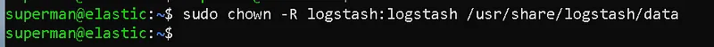

Logstash data dizinin sahipliğini değiştirme

```
sudo chown -R logstash:logstash /usr/share/logstash/data
```

Şimdi, yapılandırma dosyasının yolunu ileterek Logstash'ı başlatın:

```
sudo -u logstash /usr/share/logstash/bin/logstash -f /etc/logstash/conf.d/logstash.conf
```

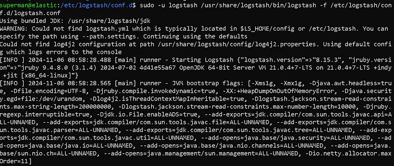

Logstashi başlatma

Logstash konfigürasyon dosyası ile başlattığınızda eğer herhangi bir hata yok ise pipeline'ın dinlemede ve hazır olduğuna dair bir mesaj alacaksınız.

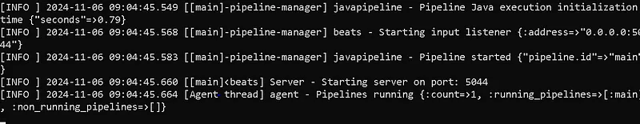

Pipeline dinlemede

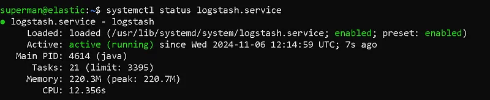

Logstash Servis Durumu

Artık pipilenımız hazır. Servisimiz ayakta ve çalışıyor. Bir sonraki adıma geçebiliriz.

### Beats Yapılandırması

ELK sunucumuzda çalışan Logstash servisimize clientlar üzerinden log göndermek için beats aracını kullanacağız. Client sistemlere beats kurulumu yaparak sistemlerden log gönderebiliriz.

Her Beat ayrı olarak kurulabilir bir üründür:

* [Auditbeat](https://www.elastic.co/guide/en/beats/auditbeat/8.15/auditbeat-installation-configuration.html)
* [Filebeat](https://www.elastic.co/guide/en/beats/filebeat/8.15/filebeat-installation-configuration.html)
* [Heartbeat](https://www.elastic.co/guide/en/beats/heartbeat/8.15/heartbeat-installation-configuration.html)
* [Metricbeat](https://www.elastic.co/guide/en/beats/metricbeat/8.15/metricbeat-installation-configuration.html)
* [Packetbeat](https://www.elastic.co/guide/en/beats/packetbeat/8.15/packetbeat-installation-configuration.html)
* [Winlogbeat](https://www.elastic.co/guide/en/beats/winlogbeat/8.15/winlogbeat-installation-configuration.html)

Gördüğünüz gibi birçok beat ürünü var. Biz bunlardan sistemimizdeki log dosyalarını göndermek için **filebeat** ürününü kullanalım.

Client sistemimizde kuruluma başlıyoruz. Ben yine aynı sistemimde devam edeceğim. ELK sistemimi kurduğum sunucum ayrıca clientım olacak.

```
wget https://artifacts.elastic.co/downloads/beats/filebeat/filebeat-8.15.3-amd64.deb  
sudo dpkg -i filebeat-8.15.3-amd64.deb
```

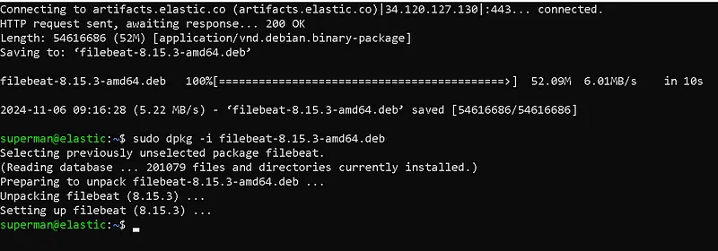

Filebeat kurulumu

Filebeati indirip kurduktan sonra konfigürasyon işlemlerine geçiyoruz.

```
sudo nano /etc/filebeat/filebeat.yml
```

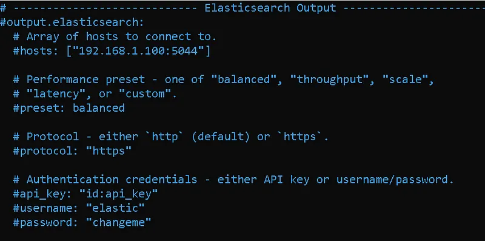

Elasticsearch Output

Biz çıktımızı logstashe yönlendireceğimiz için elasticsearch kısmını kare işareti ile kapatıyoruz.

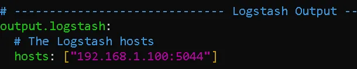

Logstash Output

Logstash bölümüne Logstash sunucumuzun IPsini ve port numarasını giriyoruz.

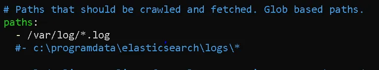

Log Toplama Yaplandırması

Paths kısmında beatimizin toplayacağı logları yapılandırbiliriz. Varsayılan olarak /var/log/ dizini altındaki log dosyalarını topluyor. Daha fazlası için bu kısma sunucumuzda çalışan önemli servislerin(WEB, DNS, DHCP vb.) loglarını ekleyebiliriz.

Yapılandırma ayarlarımız tamamlandığında dosyayı kaydedip çıkabiliriz.

Şimdi sıra filebeatimizi başlatmada.

```
sudo systemctl daemon-reload  
sudo systemctl enable filebeat.service  
sudo systemctl start filebeat.service
```

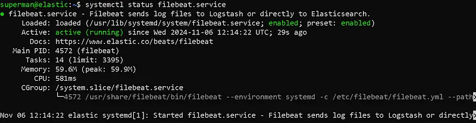

Filebeat Servis Durumu

Artık filebeat yapılandırmamızı da tamamladık ve servisimizi başlattık. Servisimiz ayakta ve çalışıyor.

Diğer beats ürünlerini de benzre şekilde kurup yapılandırabilirsiniz.

### Kibana Yapılandırması

Logstash ve Filebeat kurulumlarımızı tamamladık. Şimdi kibana arayüzümüzü açalım. Ardından elasticsearch bölümüne girelim. Indicies alanında indeximiz gelmiş mi kontrol edelim.

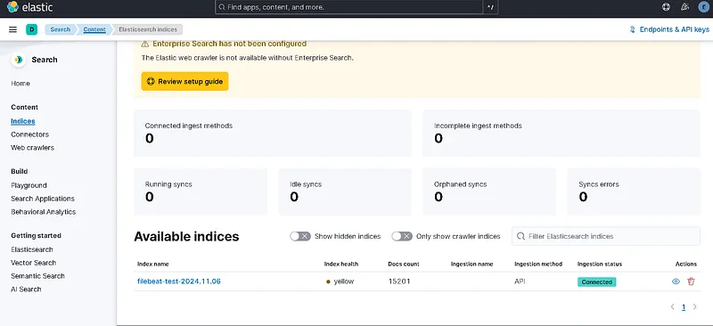

Kibana Arayüzü

Bu arayüzde gelen indeximizi görebiliyoruz. Şimdi "Discover" bölümüne gidelim.

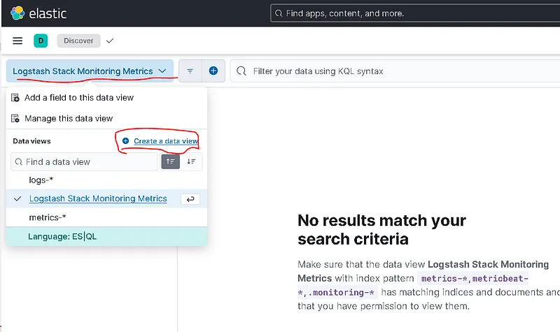

Discover Paneli

Create Data View butonuna tıklayarak yeni bir data view oluşturacağız.

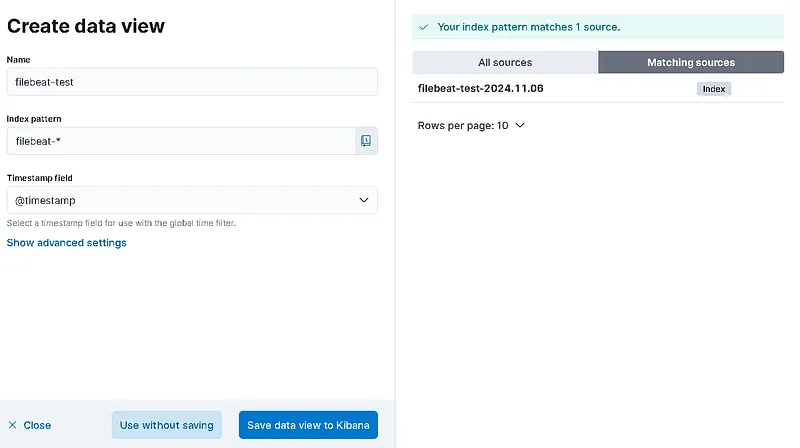

Data View Oluşturma

Bir isim verin ve index pattern seçin, oluşturulduğu zamana rağmen filebeat dizinini istediğiniz için adını filebeat\* olarak vermek isteyebilirsiniz, filebat-test-2023.10.03\* seçerseniz yalnızca bir dizin yüklenecek ve yeni dizin farklı veriler altında olacağından gerçek zamanlı veri alamayacaktır. Bu nedenle, bundan kaçınmalısınız.

Data Viewi kaydettikten sonra discover paneline logların gelmiş olması lazım. Gelmediyse bir sorun vardır.

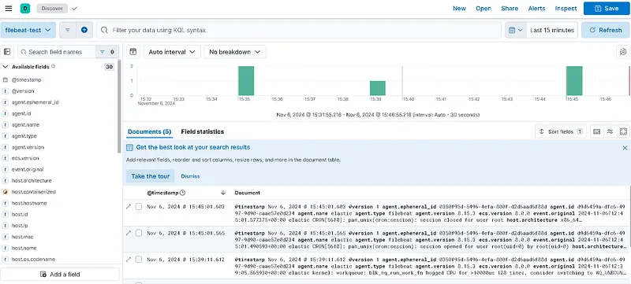

Discover Paneli

Artık bu panel üzerinden log search yani log arama işlemi yapabiliriz.

Bu yazımda ELK sistemimize bir log kaynağı ekledik. Logları parse edip elasticsearche gönderdik. Kibana arayüzünde gerekli yapılandırmaları yaptık.

---
## ELK Stack Kural Yazımı ve Alerting


Bu bölüm detayları ve etkileri incelemektedir.


### ELK Stack Kural Yazımı ve Alerting


Merhaba bu yazımda, geçen yazımda kurulumunu yaptığımız ELK Stack'in kural yazımı, yani güvenlik ihlallerini belirten uyarılar, ve alerting işlemlerine değineceğim. **ELK Stack** (Elasticsearch, Logstash, Kibana) ile kural yazımı ve uyarı (alerting) işlemleri, veri analizi ve yönetimini kolaylaştırır.

### IoC ve IoA Nedir?

**IoC (Indicators of Compromise)** ve **IoA (Indicators of Attack)**, siber güvenlik alanında önemli kavramlardır ve saldırıların tespiti ve analizinde kullanılırlar.

Bu belirteçler, bir saldırının tespiti ve durdurulmasında kritik öneme sahiptir. IoC, saldırının gerçekleştiğini tespit ederken, IoA, saldırının yöntemlerini ve amaçlarını anlamaya yardımcı olur.

#### Indicators of Compromise (IoC)

IoC, bir sistemde zararlı etkinliklerin veya saldırıların varlığını gösteren belirteçlerdir. Bu belirteçler, bir saldırının veya ihlalin gerçekleştiğini tespit etmeye yardımcı olur. IoC örnekleri şunları içerebilir:

* **Malware İmzaları**: Bilinen zararlı yazılımların imzaları.
* **IP Adresleri**: Kötü niyetli etkinliklere bağlı IP adresleri.
* **Domain Adresleri**: Kötü niyetli etkinliklerle ilişkili alan adları.
* **Dosya Hash Değerleri**: Zararlı dosyaların hash değerleri.

#### Indicators of Attack (IoA)

IoA, bir saldırının gerçekleştirilmekte olduğunu veya gerçekleşme aşamasında olduğunu gösteren belirteçlerdir. IoA, daha geniş bir perspektiften saldırının metodolojisini ve saldırganın amaçlarını anlamaya yardımcı olur. IoA örnekleri şunları içerebilir:

* **Tuhaf Kullanıcı Davranışları**: Normalden farklı kullanıcı davranışları, örneğin yetkisiz veri erişim denemeleri.
* **Sistem Değişiklikleri**: Beklenmedik sistem yapılandırma değişiklikleri.
* **Komuta ve Kontrol Trafiği**: Saldırganın sistemle uzaktan iletişim kurma girişimleri.
* **Dosya Sisteminde Değişiklikler**: Beklenmeyen dosya eklemeleri veya silinmeleri.
* **Yazılım Açıkları Kullanımı**: Bilinen yazılım açıklarını istismar etme girişimleri.

### Elastalert

Elastalert, Elasticsearch'te belirli koşulların gerçekleştiğinde uyarılar oluşturmanıza olanak tanır. Elastalert, belirli filtreler ve koşullarla yapılandırılabilir ve uyarılar e-posta, webhook, Slack gibi çeşitli kanallarda bildirilebilir. bknz: <https://elastalert.readthedocs.io/en/latest/elastalert.html>

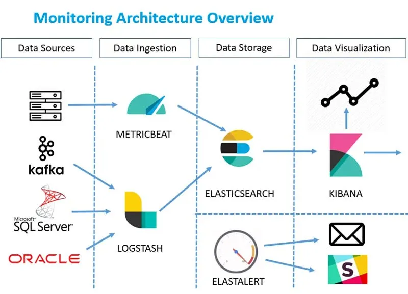

ELK Stack

ElastAlert, Elasticsearch'teki verilerden anomaliler, ani artışlar veya diğer ilgi çekici modeller hakkında uyarı vermek için basit bir çerçevedir.

Elasticsearch'e gerçek zamanlı olarak veri yazıyorsanız ve bu veriler belirli kalıplarla eşleştiğinde uyarı almak istiyorsanız, ElastAlert tam size göre bir araç.

Kibana, Elasticsearch'te uyarılar oluşturmanın ve yönetmenin kolay bir arayüzü sağlar. Kibana'da, uyarılar ve eylemler bölümünde yeni uyarılar oluşturabilir ve mevcut uyarıları yönetebilirsiniz.

### Alerting

Uyarılar, belirli durumlar veya anormallikler tespit edildiğinde otomatik olarak bildirilmesi anlamına gelir. Elasticsearch'te uyarılar, veri analizi ve yönetim süreçlerini optimize eder.

Kural yazımı, belirli koşulların gerçekleştiğinde belirli eylemler alınmasını sağlar. Elasticsearch'te kural yazımı için kullanılan API'ler ve araçlar arasında Elastalert ve Kibana bulunur.

#### Kibana Uyarılar

Kibana'da uyarılar oluşturmak ve yönetmek için aşağıdaki adımları izleyebilirsiniz:

1. **Kibana'ya Giriş Yapın**: Kibana'ya giriş yapın ve yönetim bölümüne gidin.
2. **Uyarılar ve Eylemler Bölümüne Git**: Uyarılar ve eylemler bölümünde yeni uyarılar oluşturabilirsiniz.
3. **Uyarıyı Yapılandırın**: Uyarıyı belirli filtreler ve koşullarla yapılandırın.
4. **Eylemleri Bağlayın**: Uyarıları e-posta, webhook, Slack gibi çeşitli kanallara bağlayın.

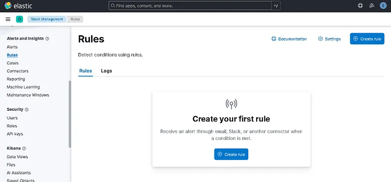

Rules Menüsü

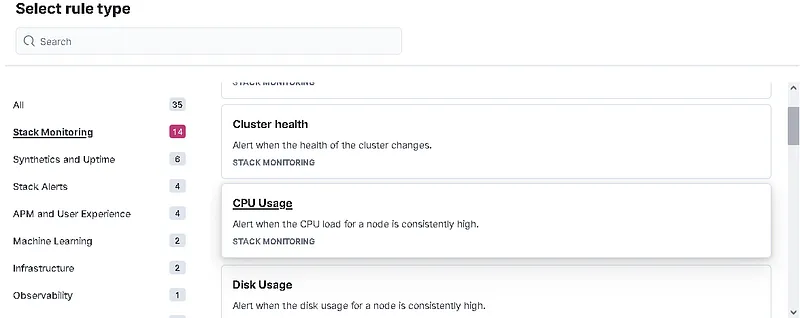

Rule Type

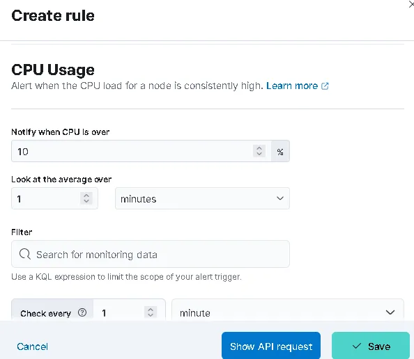

Create Rule

Örnek olarak CPU kullanım kuralını aktif ettik. Makinedeki CPU Kullanım oranı %10u aşarsa uyarı oluşturacak.

Bu menü üzerinden her türlü kural yazımını yapabilirsiniz.

### Tehdit Odaklı Savunma Stratejisinin Değişen Yüzü

Siber güvenlik alanında, tehdit odaklı savunma (threat-informed defense) stratejisi, geleneksel imza tabanlı tespit yöntemlerinin yetersiz kaldığı bir dönemde giderek daha fazla önem kazanmıştır. Geleneksel yaklaşımlar, bilinen kötü amaçlı yazılım türlerine odaklanırken, modern saldırganlar sürekli olarak taktiklerini ve tekniklerini değiştirerek savunmaları aşmaya çalışmaktadır. Bu noktada, MITRE ATT&CK (Adversarial Tactics, Techniques, and Common Knowledge) çerçevesi, siber güvenlik dünyası için dönüştürücü bir kaynak haline gelmiştir.

MITRE ATT&CK, bir saldırının yaşam döngüsünü taktikler (saldırganın hedefleri) ve teknikler (bu hedeflere ulaşmak için kullandığı yöntemler) olarak yapılandıran, dünya çapında kabul görmüş bir bilgi tabanıdır. Bu çerçeve, saldırganların kullandığı araçlardan ziyade, davranışsal kalıplarına odaklanarak daha dayanıklı bir savunma mekanizması oluşturulmasını sağlar. Bir saldırganın kullandığı spesifik bir yazılımı engellemek yerine, o yazılımın Keşif, Yürütme veya Yetki Yükseltme gibi aşamalarda sergilediği davranışları hedeflemek, savunma stratejilerini daha kapsamlı ve esnek hale getirir. Bu yaklaşım, güvenlik ekiplerine saldırıları daha bütünsel bir bağlamda anlama, tehdit avcılığı yapma ve olaylara daha etkili müdahale etme olanağı tanır. Ayrıca, ATT&CK, güvenlik operasyon merkezi (SOC), tehdit istihbaratı ve yöneticiler gibi farklı paydaşlar arasında tehditler hakkında ortak bir dil oluşturarak güvenlik olgunluğunu değerlendirmek için de kritik bir araç haline gelmiştir.

### ELK Stack: Modern SOC'un Açık Kaynak Kalbi

ELK Stack, log yönetimi ve analizi için kullanılan, açık kaynak kodlu ve son derece popüler bir platformdur. Elasticsearch, Logstash ve Kibana olmak üzere üç ana bileşenden oluşur ve birlikte çalışarak ham log verilerini eyleme dönüştürülebilir güvenlik bilgisine dönüştürürler. Elasticsearch, dağıtık ve RESTful bir arama ve analiz motoru olarak yığın halindeki log verilerini JSON belgeleri şeklinde depolar ve anında sorgulanabilir hale getirir. Yatay ölçeklenebilirlik mimarisi sayesinde, yüksek hacimli verileri ve sorgu yükünü rahatlıkla yönetebilir.

Logstash, veri işleme hattının merkezinde yer alır ve çeşitli kaynaklardan (dosyalar, sistem logları, veritabanları) veri alarak onları işler, dönüştürür ve zenginleştirir. Bu süreç, üç ana aşamadan oluşur: giriş (inputs), filtreleme (filters) ve çıkış (outputs). Filtreler, yapılandırılmamış verileri (`Grok` desenleri kullanarak) anlamlı alanlara ayırmak ve IP adreslerine göre coğrafi konum bilgisi eklemek gibi işlemleri gerçekleştirerek veriyi daha anlamlı hale getirir. Son olarak, Kibana, Elasticsearch'te depolanan verileri görselleştirmek için kullanılan sezgisel bir web arayüzüdür. Kullanıcılar, etkileşimli panolar oluşturabilir, filtreler uygulayabilir ve ham log verisi üzerinde arama yapabilir. Kibana'nın modern versiyonları, makine öğrenimi tabanlı anomali tespiti ve uyarı özelliklerini de içermektedir.

ELK Stack, log yönetimi, altyapı izleme, uygulama sorun giderme ve güvenlik analizi gibi çeşitli kullanım senaryolarına hizmet eder. Ancak, bu platformun "kutu dışı" tam teşekküllü bir SIEM (Security Information and Event Management) çözümü olmadığı bilinmelidir. ELK, log toplama, işleme, depolama ve sorgulama yeteneklerini sağlasa da, karmaşık olay korelasyonu, yerleşik uyarı mekanizmaları ve otomatik olay müdahale yetenekleri gibi özellikler için ek bileşenlere veya özel yapılandırmalara ihtiyaç duyar. Bu nedenle, bu raporun amacı, ELK'in güçlü yönlerini kullanarak bu açıkları kapatan ve tehditleri MITRE ATT&CK çerçevesinde anlamlandıran yapılandırılmış bir kural seti ve entegrasyon rehberi sunmaktır.

### Kural Seti için Gerekli Temel Yapılandırmalar ve Kaynaklar

Bir ELK altyapısı üzerinde MITRE ATT&CK odaklı bir kural seti oluşturmanın temelinde, doğru log kaynaklarının toplanması, bu verilerin standartlaştırılması ve verimli bir şekilde işlenmesi yatar. Bu bölüm, tespit yeteneklerini en üst düzeye çıkarmak için olmazsa olmaz olan bu temel yapılandırmaları detaylandırmaktadır.

### Log Kaynağı Gereksinimlerinin Haritası

Bir saldırganın davranışlarını tespit edebilmek için gereken en önemli log kaynakları, saldırının gerçekleştiği ortama göre farklılık gösterir. MITRE ATT&CK Enterprise, Mobile ve ICS alanlarının her biri için farklı veri kaynakları hayati öneme sahiptir.

**Windows Sistemleri için Zorunlu Loglar:**

* **Sysmon:** Sysmon (System Monitor), Windows Event Log'ları üzerinden sistem üzerindeki süreç oluşturma, ağ bağlantıları, dosya erişimi gibi kritik güvenlik olaylarını yakalayan bir Windows sistem hizmetidir. Özellikle Sysmon'un Event ID 1 (Process creation) olayı, bir sürecin tam komut satırı argümanları, ana süreç bilgisi ve hash değerleri gibi zengin veriler sunduğu için T1059 (Komut ve Script Yorumlayıcısı) ve T1087 (Hesap Keşfi) gibi teknikleri tespit etmede Windows'un varsayılan güvenlik loglarından çok daha değerli bir kaynaktır.
* **Windows Security Event Logs:** Sysmon'a ek olarak, Windows'un yerleşik güvenlik logları, hesap yönetimiyle ilgili önemli olayları kaydeder. Örneğin, bir kullanıcı hesabının oluşturulması, silinmesi veya bir gruba eklenmesi/çıkarılması, saldırganların kalıcılık sağlamak veya yetki yükseltmek için kullandığı davranışları tespit etmek için kritik veriler sağlar.

**Linux Sistemleri için Zorunlu Loglar:**

* **Auditd:** Linux'ta `auditd` hizmeti, sistem çağrılarını, dosya erişimlerini ve süreç oluşturma gibi çekirdek düzeyindeki etkinlikleri izlemek için kullanılır. `Auditd` logları, saldırganların bir sisteme sızdıktan sonra sergilediği davranışları (örn. `net.exe` benzeri komutlar) tespit etmede vazgeçilmez bir kaynaktır. `Filebeat` ve `Auditd Manager` entegrasyonları, bu logların ELK'ye kolayca aktarılmasını sağlar.

**Ağ ve Diğer Kaynaklar:**

* **Ağ Akış Logları:** Ağ trafiği akış logları (örn. NetFlow) veya `Packetbeat` gibi araçlarla toplanan veriler, T1046 (Ağ Hizmeti Keşfi) gibi keşif taktiklerini tespit etmek için hayati öneme sahiptir. Bu loglar, bir kaynaktan birden çok hedefe veya porta yapılan anormal bağlantı girişimlerini (port taraması) belirlemede kullanılır.
* **İçgörü:** Kural setinin etkinliği, yalnızca log kaynaklarının mevcudiyetine değil, aynı zamanda toplanan verinin kalitesine de bağlıdır. Yalnızca logları toplamak yetmez; logların, saldırganın amacını ve eylemlerini net bir şekilde ortaya koyan zenginleştirilmiş bilgiler (komut satırı argümanları, kullanıcı adları, ana süreçler) içermesi gerekmektedir. Bu, tespit yeteneklerini maksimize etmek için kritik bir unsurdur.

### Veri Normalizasyonu: Elastic Common Schema (ECS) ile Standardizasyon

Farklı platformlar ve cihazlar, her biri kendine özgü bir formatta log verisi üretir. Bu durum, log verilerini analiz etmeyi, birbiriyle ilişkilendirmeyi ve tehdit avcılığı sorgularını oluşturmayı son derece karmaşık hale getirir. Elastic Common Schema (ECS), bu sorunu çözmek için geliştirilmiş, olay verilerini Elasticsearch'te depolarken kullanılmak üzere standart bir alan kümesi tanımlayan açık kaynaklı bir spesifikasyondur.

ECS, farklı log türleri (örn. Windows olayları, Linux süreçleri, ağ trafiği) için ortak alan adları (`process.name`, `source.ip`, `destination.port` gibi) sağlayarak veriyi standartlaştırır. Bu standardizasyon, log kaynakları arasında veri korelasyonunu kolaylaştırır ve tek bir sorgu ile birden fazla kaynaktan veri çekilmesini mümkün kılar. Bu, güvenlik analistlerinin her log formatı için ayrı sorgular yazma yükünü ortadan kaldırır ve keşif süreçlerini hızlandırır.

Bir güvenlik ekibi, tehdit avcılığı yaparken veya bir olayla ilgili kök neden analizi gerçekleştirirken, ECS uyumlu veriler sayesinde zamandan tasarruf eder. Saldırganın bir sistemde başlattığı sürecin, ağ üzerinden başka bir sisteme nasıl bağlandığını veya hangi dosyaları değiştirdiğini, farklı log kaynaklarından gelen verileri tek bir standart sorguyla ilişkilendirerek çok daha hızlı bir şekilde anlayabilir. Bu durum, olay müdahale ekiplerinin bir olayı tespit etme süresini (MTTD) ve müdahale etme süresini (MTTR) önemli ölçüde azaltır.

### Veri İşleme Pipeline'ları: Logstash ve Ingest Node

Ham log verileri, tespit kuralları için uygun hale getirilmeden önce işlenmeli ve zenginleştirilmelidir. ELK Stack'te bu işlem için iki temel mekanizma bulunur: Logstash filtreleri ve Elasticsearch Ingest Node pipeline'ları. Her birinin kendi avantajları ve ideal kullanım senaryoları vardır.

* **Logstash Filtreleri:** Logstash, giriş, filtre ve çıkış aşamalarından oluşan esnek bir mimariye sahiptir. Özellikle `Grok` filtreleri, yapılandırılmamış metin tabanlı logları, önceden tanımlanmış desenler aracılığıyla anlamlı alanlara ayırmada oldukça güçlüdür. Bu filtreler, loglara coğrafi konum bilgisi (`geoip`), alan dönüştürme (`mutate`) veya koşullu işlem (`if`) gibi zenginleştirme işlemleri uygulamak için idealdir. Logstash, veri akışında bir ara katman olarak görev yaparak, verinin Elasticsearch'e gönderilmeden önce karmaşık bir şekilde işlenmesine olanak tanır.
* **Elasticsearch Ingest Node Pipeline'ları:** Ingest Node, Elasticsearch kümesi içerisinde çalışan ve veri indekslenmeden hemen önce basit dönüşümler gerçekleştiren bir özelliktir. Logstash'e göre daha hafif ve basit işlemleri hedef alan Ingest Node, özellikle `grok` veya `set` gibi işlemcilerle veri üzerinde temel dönüşümleri yapmak için uygundur. Entegrasyonlar aracılığıyla otomatik olarak yapılandırılabilen bu pipeline'lar, Logstash'in karmaşıklığına ihtiyaç duymayan senaryolarda mimariyi basitleştirebilir.

Her iki yöntem arasında stratejik bir seçim yapmak, altyapının performansı ve ölçeklenebilirliği açısından önemlidir. Kaynaklar, Logstash'in karmaşık veri dönüşümü, zenginleştirme, farklı girdi kaynakları ve birden fazla çıktı hedefi için daha uygun olduğunu belirtirken, Ingest Node'un ise daha basit işlem ihtiyaçları için mimariyi sadeleştirdiğini gösterir. Yoğun log hacmi veya karmaşık bir veri işleme gereksinimi olan durumlarda Logstash kullanımı tercih edilebilirken, daha basit `Grok` veya alan dönüştürme işlemleri için Ingest Node, mimariyi basitleştirme ve yönetim yükünü azaltma potansiyeli sunar.

### Kural Formatı ve Meta Veri Standartları

MITRE ATT&CK odaklı bir kural seti oluştururken, her kuralın belirli bir standarda ve yapıya uyması, kural setinin yönetilebilirliğini ve güvenlik ekibi için kullanılabilirliğini artırır. Bu bölüm, kural yapısının temel bileşenlerini ve MITRE ATT&CK ile doğru ilişkilendirme yöntemlerini açıklamaktadır.

### Kural Yapılandırma Metodolojisi

Her kural, tehditleri etkili bir şekilde tespit etmek ve güvenlik ekiplerine eyleme geçirilebilir bilgi sunmak için temel bileşenler içermelidir. Bu bileşenler şunlardır:

* **Kural Kimliği (**`rule_id`**):** Her kural için benzersiz bir tanımlayıcı olmalıdır. Bu kimlik, kuralın yaşam döngüsü boyunca izlenmesini, güncellenmesini ve raporlanmasını kolaylaştırır. Örneğin, `PS-Encoded-Cmd-Detection-001` gibi açıklayıcı bir kimlik kullanılması önerilir.
* **Ciddiyet (**`severity`**):** Kuralın tetiklediği olayın potansiyel etkisini gösteren bir değerdir. Genellikle `Kritik`, `Yüksek`, `Orta` veya `Düşük` gibi derecelendirmeler kullanılır. Bu, güvenlik analistlerinin hangi alarmlara öncelik vermesi gerektiğini belirlemelerine yardımcı olur.
* **Tanım (**`description`**):** Kuralın neyi tespit ettiğini, neden önemli olduğunu ve saldırganın hangi hedefe ulaşmaya çalıştığını net bir şekilde açıklayan metindir. İyi yazılmış bir tanım, bir olayın ilk müdahale (triage) aşamasını hızlandırır.

### MITRE ATT&CK Etiketleme

Kural setinin en önemli unsurlarından biri, her kuralın tespit ettiği MITRE ATT&CK taktiği ve tekniği ile doğru bir şekilde etiketlenmesidir. Bu etiketleme, ham log verisini saldırı bağlamına oturtarak güvenlik ekiplerinin bir olayın arkasındaki amacı daha hızlı anlamasını sağlar.

Kibana'da bir kural oluştururken, `mitre.tactic` ve `mitre.technique_id` gibi özel alanlar aracılığıyla bu etiketleri eklemek mümkündür. Örneğin, bir kuralın JSON çıktısı şu şekilde olabilir:

```
{  
  "mitre.technique_id": "T1059",  
  "mitre.tactic": "execution"  
}
```

Bu etiketler, güvenlik analistleri için bir köprü görevi görerek, bir alarmı gördüklerinde saldırganın ne yapmaya çalıştığını (taktik) ve hangi yöntemi (teknik) kullandığını anında kavrayabilmelerini sağlar. Bu bilgi, olay müdahale sürecini hızlandırır ve savunma stratejisinin bütünsel bir resmini görmeye olanak tanır.

### MITRE ATT&CK Taktiklerine Göre Kural Örnekleri ve Tespiti

Bu bölümde, Keşif ve Yürütme taktikleri altında yer alan seçilmiş MITRE ATT&CK teknikleri için somut ve uygulanabilir kural örnekleri sunulmuştur. Bu örnekler, farklı log kaynaklarından elde edilen verilere dayanarak oluşturulmuş olup, hem kural mantığını hem de ilgili bağlamı açıklamaktadır.

### Taktik: Yürütme (Execution — TA0002)

Bu taktik, saldırganların bir sistemde kendi kodlarını veya komutlarını çalıştırma girişimlerini kapsar.

#### Teknik: T1059 Komut ve Script Yorumlayıcısı

Saldırganlar, yerleşik işletim sistemi araçları olan komut ve script yorumlayıcılarını (örneğin, PowerShell, Bash, `cmd.exe`) kullanarak sistem üzerinde kod çalıştırma eğilimindedir. Bu teknik, saldırı kampanyalarında en sık kullanılan yöntemlerden biridir. PowerShell, özellikle savunma mekanizmalarını atlatmak, bellekte zararlı yükleri çalıştırmak ve karmaşık komutları gizlemek için sıklıkla kötüye kullanılır.

Kural Örneği 1: Şüpheli PowerShell Komutları Tespiti (T1059.001)

Bu kural, PowerShell'in komutları gizlemek için sıklıkla kullanılan `--EncodedCommand` parametresiyle çalıştırılmasını tespit eder. Bu tür kodlama, genellikle meşru olmayan script'lerin güvenlik çözümleri tarafından statik analizden kaçınması amacıyla kullanılır.

* **Kural Kimliği:** `PS-Encoded-Cmd-Detection-001`
* **Ciddiyet:** `Yüksek`
* **Tanım:** "PowerShell'in `--EncodedCommand` parametresi ile çalıştırılmasını tespit eder. Bu, genellikle zararlı yazılımlar tarafından komutları gizlemek ve güvenlik çözümlerini atlatmak için kullanılır."
* **MITRE ATT&CK Etiketi:** `mitre.tactic: execution`, `mitre.technique_id: T1059, T1059.001`
* **Log Kaynağı:** Kuralın tespiti için en ideal log kaynağı, Sysmon tarafından üretilen Event ID 1 (Process creation) logları veya Windows PowerShell Script Block Logging'dir. Bu kaynaklar, tam komut satırı argümanlarını detaylı bir şekilde kaydeder.
* **Kural Mantığı:**
* Kibana EQL (Event Query Language) Sorgusu:
* process where process.name == "powershell.exe" and process.command\_line : "\*EncodedCommand\*"
* Bu sorgu, `process.name` alanı `powershell.exe` olan ve `process.command_line` alanında `EncodedCommand` anahtar kelimesini içeren tüm olayları bulur.
* **Yanlış Pozitif Analizi:** Meşru yönetim scriptleri de bazen karmaşık veya hassas komutları kodlayarak çalıştırabilir. Bu tür durumlarda, bilinen ve güvenilen yönetim süreçleri veya IP adresleri için istisna listeleri oluşturularak kural gürültüsü azaltılabilir.

Kural Örneği 2: `vssadmin.exe` ile Gölge Kopyaların Silinmesi (T1490)

Bu teknik, `Impact` (Etki) taktiği ile ilişkilendirilse de, bir saldırganın `vssadmin.exe` gibi yerleşik bir Windows aracını çalıştırmasıyla başladığı için `Execution` taktiğiyle de doğrudan bağlantılıdır. Bu kural, sistemdeki gölge kopyaların silinmesini tespit ederek veri kurtarmayı engellemeye yönelik tehditleri ortaya çıkarır.

* **Kural Kimliği:** `VssAdmin-Shadow-Delete-002`
* **Ciddiyet:** `Kritik`
* **Tanım:** "Sistem bütünlüğünü ve veri kurtarmayı engelleme amacıyla `vssadmin.exe` kullanılarak gölge kopyaların silinmesini tespit eder."
* **MITRE ATT&CK Etiketi:** `mitre.tactic: impact`, `mitre.technique_id: T1490`
* **Log Kaynağı:** Sysmon Event ID 1 (Process creation) en iyi kaynak olmakla birlikte, Windows Security Event Logları da kullanılabilir.
* **Kural Mantığı:**
* Kibana Custom Query (KQL):
* event.action:"Process Create (rule: ProcessCreate)" and process.name:"vssadmin.exe" and process.args:("delete" and "shadows")
* Bu sorgu, Sysmon logları gibi `winlogbeat` ile toplanan verilerde, `vssadmin.exe` sürecinin `delete` ve `shadows` argümanlarıyla birlikte çalıştırılmasını arar. Bu komutun meşru kullanımı son derece nadir olduğu için, bu kural tetiklendiğinde yüksek güvenilirlikli bir alarm üretmesi beklenir.

### Taktik: Keşif (Discovery — TA0007)

Bu taktik, saldırganların bir ağa girdikten sonra çevre hakkında bilgi toplama çabalarını içerir.

#### Teknik: T1087 Hesap Keşfi

Saldırganlar, yetki yükseltme veya yanal hareket için kullanabilecekleri geçerli kullanıcı hesaplarını bulmak amacıyla yerel veya etki alanı hesaplarını numaralandırmaya çalışabilirler.

Kural Örneği 1: `net.exe` ile Hesap Keşfi (T1087)

Windows'un yerleşik `net.exe` aracı, hesapları ve grupları listelemek için sıklıkla kullanılır.

* **Kural Kimliği:** `Net-User-Recon-003`
* **Ciddiyet:** `Orta`
* **Tanım:** "Windows'un yerleşik `net.exe` aracını kullanarak yerel veya etki alanı hesaplarının listelenmesini tespit eder."
* **MITRE ATT&CK Etiketi:** `mitre.tactic: discovery`, `mitre.technique_id: T1087`
* **Log Kaynağı:** Sysmon Event ID 1, Windows Security Event Logları.
* **Kural Mantığı:**
* Kibana EQL Sorgusu:
* process where (process.name == "net.exe" or process.name == "net1.exe") and process.command\_line : ("user" or "users")
* Bu sorgu, `net.exe` veya `net1.exe` süreçlerinin `user` veya `users` argümanlarıyla çalıştırıldığı olayları yakalar.
* **Yanlış Pozitif Analizi:** Sistem yöneticileri rutin görevler için bu komutları kullanabilir. Bu nedenle, kuralın `process.parent_name` gibi ek bağlam bilgileriyle birlikte kullanılması veya zaman penceresi tabanlı bir eşik kuralı olarak değerlendirilmesi gerekebilir.

#### Teknik: T1046 Ağ Hizmeti Keşfi

Saldırganlar, ağ üzerindeki potansiyel zafiyetlere sahip hizmetleri ve açık portları bulmak için port taraması yaparlar.

Kural Örneği 2: Ağ Hizmeti Keşfi (T1046)

Bu kural, tek bir kaynaktan çok sayıda hedefe veya porta yapılan şüpheli bağlantı girişimlerini (port taraması) tespit eder.

* **Kural Kimliği:** `Port-Scan-Detection-004`
* **Ciddiyet:** `Orta`
* **Tanım:** "Bir kaynaktan, kısa bir zaman diliminde çok sayıda hedefe veya porta yapılan şüpheli bağlantı girişimlerini (port tarama) tespit eder."
* **MITRE ATT&CK Etiketi:** `mitre.tactic: discovery`, `mitre.technique_id: T1046`
* **Log Kaynağı:** Ağ akış logları, `Packetbeat` veya `Filebeat` ile toplanan firewall logları.
* **Kural Mantığı:**
* **Kibana Threshold Rule:**
* **Index:** `packetbeat-*`
* **Aggregated on:** `source.ip`
* **Field to count:** `destination.port`
* **Threshold:** `unique_count(destination.port) > 20` within `1 minute`
* Bu kural, tek bir kaynak IP adresinden (`source.ip`), bir dakika içinde 20'den fazla farklı hedef porta (`destination.port`) yapılan bağlantı girişimlerini sayarak bir eşiği aşan durumları tespit eder.
* **Yanlış Pozitif Analizi:** Yük dengeleyiciler, iç ağ tarama araçları veya geliştirme ortamlarındaki rutin testler bu kuralı tetikleyebilir. Bu nedenle, bilinen IP aralıkları veya meşru tarama araçları için istisna listeleri oluşturulması gereklidir.

### Mobil ve ICS Ortamları için Kural Geliştirme Yaklaşımı

ELK Stack'in esnekliği, sadece geleneksel Enterprise ortamları için değil, aynı zamanda daha niş olan Mobile ve ICS (Industrial Control Systems) alanları için de tehdit tespiti yapılmasına olanak tanır.

#### Mobil Ortamlar

MITRE ATT&CK for Mobile matrisi, Android ve iOS platformlarına özgü taktik ve teknikleri içerir. Mobil tehditlerin tespiti, geleneksel uç nokta loglamasına göre farklı bir yaklaşım gerektirir.

* **Log Kaynakları:** Mobil tehditler genellikle uygulama içi davranışlarla veya cihazın kendisiyle ilgili loglarla tespit edilir. Uygulama geliştiricileri, `swift-log-elk` gibi loglama kütüphanelerini kullanarak doğrudan logları Logstash'e gönderebilir. Ayrıca, Android'in `logcat` aracı, `adb` komutu aracılığıyla cihaz loglarını izlemek için kullanılabilir. Mobile Device Management (MDM) çözümlerinin sağladığı loglar da bu analizler için değerli bir kaynaktır.
* **Kural Örneği (Teorik):** Köklü bir Android cihazda hassas dosyalara (`/etc/passwd`) erişim girişimi, `logcat` loglarında belirli bir süreç ve dosya yolu kombinasyonu aranarak tespit edilebilir.

#### ICS (Endüstriyel Kontrol Sistemleri) Ortamları

MITRE ATT&CK for ICS, endüstriyel süreçleri hedef alan saldırıları modellemek için özel olarak tasarlanmıştır. ICS ortamlarındaki en büyük zorluk, standart IT loglarından farklı olarak, özel endüstriyel protokollerden (Modbus, OPC, PROFINET) gelen logların işlenmesi ve standartlaştırılmasıdır.

* **Log Kaynakları:** Standart IT loglarının yanı sıra, OT ortamlarına özgü protokollerden gelen loglar hayati önem taşır. Bu loglar genellikle Windows Event Log'ları, metin dosyaları veya veritabanları şeklinde toplanır.
* **Kural Örneği (Teorik):** Bir PLC'nin çalışma modunun (`Run` -> `Program`) yetkisiz bir şekilde değiştirilmesi veya OPC protokolü üzerinden alışılmadık bir şekilde veri toplanması, ICS loglarında belirli bir olay deseni aranarak tespit edilebilir.

### Entegrasyon ve Kural Setinin Doğrulanması

Oluşturulan kural setinin işlevsel ve güvenilir olması için, ELK Stack'e doğru bir şekilde entegre edilmesi ve etkinliğinin düzenli olarak test edilmesi gerekmektedir.

### Kural Setinin ELK Stack'e Yüklenmesi

Kuralları ELK Stack'e entegre etmenin birden fazla yolu vardır. En modern ve yönetilebilir yaklaşım, Kibana'nın yerleşik Security uygulaması ve API'lerini kullanmaktır.

* **Kibana Security App:** Yeni kurallar, Kibana'nın `Security > Detections` bölümünden görsel arayüz aracılığıyla oluşturulabilir. Bu arayüz, tehdit istihbaratı entegrasyonu (`Indicator match`) veya korelasyon kuralları gibi farklı kural türlerini destekler.
* **Detection as Code (DaC):** Daha büyük ekipler ve otomasyon süreçleri için ideal olan bu yaklaşım, kuralların `TOML` veya `JSON` dosyaları şeklinde bir kod deposunda (`elastic/detection-rules` gibi) saklanmasını ve API aracılığıyla Kibana'ya otomatik olarak yüklenmesini sağlar. Bu yöntem, kuralların versiyonlanmasını, CI/CD süreçlerine entegrasyonunu ve ekip içi iş birliğini kolaylaştırır.
* **Veri İşleme Entegrasyonları:** Kural mantığına göre, log verisini doğru formatta hazırlamak için Logstash pipeline'ları veya Ingest Node pipeline'ları kullanılabilir. Logstash, karmaşık filtreler (`grok`, `mutate`, `geoip`) ile veri üzerinde derinleşimli dönüşümler yapabilir. Elasticsearch Ingest Node ise daha basit işlemler için kullanılır.

### Kural Setinin Test Edilmesi

Bir kural setinin potansiyelini anlamak için teorik olarak neyi tespit ettiğini bilmek yeterli değildir. Kuralın gerçek bir saldırı senaryosunda ne kadar etkili olduğunu doğrulamak hayati öneme sahiptir. Atomic Red Team, bu amaçla MITRE ATT&CK tekniklerini taklit eden basit, izole edilmiş testlerden oluşan açık kaynaklı bir kütüphanedir.

* **Test Ortamının Hazırlığı:** Öncelikle, üretim ortamının bir kopyası olacak şekilde izole bir test makinesi (VM) kurulmalıdır. Bu makinede, `Sysmon` gibi gerekli loglama araçları ve ELK'ya log gönderen ajanlar (örneğin, `Winlogbeat`) çalışıyor olmalıdır.
* **Testin Seçimi ve Uygulanması:** `Atomic Red Team` kütüphanesinden, test edilmek istenen MITRE ATT&CK tekniğine (`T1059` gibi) karşılık gelen testler seçilir. `Invoke-AtomicRedTeam` gibi bir araçla bu testler çalıştırılır.
* **Doğrulama ve İyileştirme:** Test çalıştırıldıktan sonra, Kibana'da loglar incelenerek oluşturulan kuralın beklenen alarmı üretip üretmediği doğrulanır. Eğer kural tetiklenmezse veya çok fazla yanlış pozitif üretirse, kural mantığı veya kullanılan log kaynakları gözden geçirilerek iyileştirme yapılır. Bu, kural setinin sürekli olarak güncel ve etkili kalmasını sağlayan bir geri bildirim döngüsüdür.

**Örnek MITRE ATT&CK Kural Listesi**

| Kural Adı | Kural Mantığı (EQL/Threshold) | Ciddiyet | Tanım | MITRE Taktik | MITRE Teknik ID |
| :--- | :--- | :--- | :--- | :--- | :--- |
| `PS-Encoded-Cmd-Detection-001` | `process where process.name == "powershell.exe" and process.command_line : "*EncodedCommand*"` | Yüksek | PowerShell'in `--EncodedCommand` parametresi ile çalıştırılmasını tespit eder. | Yürütme | T1059.001 |
| `VssAdmin-Shadow-Delete-002` | `process where process.name : "vssadmin.exe" and process.args : "delete" and process.args : "shadows"` | Kritik | `vssadmin.exe` ile gölge kopyaların silinmesini tespit eder. | Etki | T1490 |
| `Net-User-Recon-003` | `process where (process.name == "net.exe" or process.name == "net1.exe") and process.command_line : ("user" or "users")` | Orta | `net.exe` aracını kullanarak hesap keşfi aktivitesini tespit eder. | Keşif | T1087 |
| `Port-Scan-Detection-004` | `count(destination.port) by source.ip > 20` in `1m` | Orta | Tek bir IP'den çok sayıda farklı porta yapılan bağlantı girişimlerini tespit eder. | Keşif | T1046 |

---
## Bütünleşik NOC/SOC ve Katmanlı Güvenlik Entegrasyonu


"Derinlemesine Savunma" (Defense-in-Depth) metodolojisi, tek bir güvenlik önlemine bel bağlamak yerine, siber tehditlere karşı çok katmanlı bir koruma kalkanı oluşturmayı hedefler. Bir orta çağ kalesindeki hendekler, surlar ve kuleler gibi; modern kurumsal siber güvenlikte de saldırganın hedefine ulaşmasını zorlaştıracak ve her aşamada engeller sunacak bir yapı kurulmalıdır. 

Bu katmanlı yapının kalbinde, tüm katmanlardan (E-posta, Uç Nokta, Ağ, Veri ve Mobil) gelen log ve olayların toplandığı ve korelasyon kurallarıyla analiz edildiği **bütünleşik bir NOC/SOC** mimarisi yer alır. Geleneksel olarak Ağ Operasyon Merkezi (NOC) sistemlerin ayakta kalma sürelerine, performanslarına, RAM/CPU ve disk doluluk oranlarına odaklanırken; Güvenlik Operasyon Merkezi (SOC) ise tehdit alarmlarını ve siber saldırı izlerini takip eder. Bu iki birimin ortak bir SIEM platformunda birleştirilmesi, bilgi silolarını ortadan kaldırarak otomatik korelasyon yeteneklerini artırır ve alarm yorgunluğunu minimize eder. Ayrıca verinin bulut yerine kurum içinde (on-premises) tutulması, KVKK ve GDPR gibi yasal regülasyonlara uyum açısından kritik bir veri egemenliği avantajı sunar.

---

### Sonuç: Kural Seti Kullanımına Yönelik Ekipler için Kılavuz ve İleri Okumalar

Bu rapor, ELK Stack üzerinde MITRE ATT&CK çerçevesine dayalı kapsamlı bir olay tespiti kural seti oluşturma ve yönetme sürecine dair detaylı bir yol haritası sunmaktadır. Elde edilen bulgular, bu kural setini kullanacak siber güvenlik ekipleri için bazı temel çıkarımları ve en iyi uygulamaları ortaya koymaktadır.

**En İyi Uygulamalar:**

* **Tehditleri Önceliklendirme:** Kuruluşun risk profili ve tehdit istihbaratına dayanarak en kritik MITRE ATT&CK taktiklerini ve tekniklerini belirlemek, tüm kuralları etkinleştirmek yerine daha odaklı ve verimli bir savunma stratejisi oluşturur.
* **Sürekli İyileştirme:** Bir kural seti "bir kez oluşturulup unutulacak" bir kaynak değildir. Yeni tehditler, yanlış pozitifler ve değişen altyapı koşullarına göre düzenli olarak test edilmeli ve iyileştirilmelidir. Bu sürekli döngü, savunma yeteneklerini olgunlaştıran bir yaklaşımdır.
* **Ekip İçi İş Birliği:** Kırmızı ve Mavi takımların iş birliği yapması, kural setinin gerçekçi saldırı senaryolarına karşı etkinliğini test etmek ve geliştirmek için en etkili yöntemdir.

**Gelecek Öneriler:**

* **Makine Öğrenimi (ML) Entegrasyonu:** ELK Stack'in makine öğrenimi yeteneklerini kullanarak, normal kullanıcı ve sistem davranışlarını öğrenen ve anormal sapmaları tespit eden kurallar oluşturmak mümkündür. Bu, özellikle bilinen imzaları olmayan yeni tehditleri yakalamada büyük bir avantaj sağlar.
* **Tehdit İstihbaratı Entegrasyonu:** Tehdit istihbaratı beslemelerini (IoC'ler) doğrudan ELK Stack'e entegre ederek `Indicator Match` kuralları oluşturulabilir. Bu, bilinen kötü amaçlı IP'lere, alan adlarına veya dosya hash'lerine karşı hızlı bir şekilde tespit ve uyarı mekanizması kurulmasını sağlar.
* **Otomatik Müdahale:** İleri düzey bir entegrasyon olarak, tespit kurallarının bir SOAR (Security Orchestration, Automation and Response) platformu ile birleştirilmesi, alarmlara otomatik olarak yanıt verilmesini sağlayabilir. Örneğin, şüpheli bir süreç tespit edildiğinde, ilgili ana bilgisayarın ağdan izole edilmesi veya kullanıcının hesabının askıya alınması gibi otomatik müdahale eylemleri gerçekleştirilebilir.

Verinizin mimarı olun, egemenliğinizi geri alın. Dinlediğiniz için teşekkürler!