

The shift from offline desktop software to cloud-first SaaS models over the last decade has fundamentally changed how we manage files. Today, most corporate data resides in closed environments controlled by tech giants like Microsoft 365 and Google Workspace. While these systems offer convenient real-time collaboration, they introduce massive risks concerning data ownership and security.

<h4 style="text-align: center; margin-bottom: 1rem;">Quick Comparison: Dependency vs. Sovereignty</h4>

<table style="width: 100%; font-size: 0.9rem;">
<thead>
<tr>
<th>Criterion</th>
<th>SaaS / Cloud Infrastructure</th>
<th>Engineering Stack (Data Sovereignty)</th>
</tr>
</thead>
<tbody>
<tr>
<td>Architecture</td>
<td>Hostage data, closed XML piles.</td>
<td>Plain-text simplicity, Git-compatible.</td>
</tr>
<tr>
<td>Security</td>
<td>Telemetry and digital footprint scanning.</td>
<td>On-premise (Self-hosted) total control.</td>
</tr>
<tr>
<td>Data Life</td>
<td>Risk of deletion on subscription cancellation.</td>
<td>Code blocks that survive for generations.</td>
</tr>
<tr>
<td>Cost</td>
<td>Ever-increasing subscription fees.</td>
<td>Amortized infrastructure (TCO Advantage).</td>
</tr>
</tbody>
</table>

---

## Reclaiming Data Ownership in a SaaS World

While Google and Microsoft provide strict privacy policies, exporting data and implementing an "exit strategy" from their platforms is operationally difficult. When you cancel a subscription, your data is not immediately handed back; it goes through a 30-day suspension window, followed by a deletion queue between days 31 and 60, where it is permanently wiped. This setup effectively locks your institutional memory behind a subscription wall.

These platforms also capture constant telemetry and usage diagnostics. Document edits, collaboration frequencies, and team structures are mapped out. With 45% of digital organizations citing data sovereignty as their top priority (according to IDC), telemetry is no longer just about debug logs—it's a tool for mapping your internal processes.

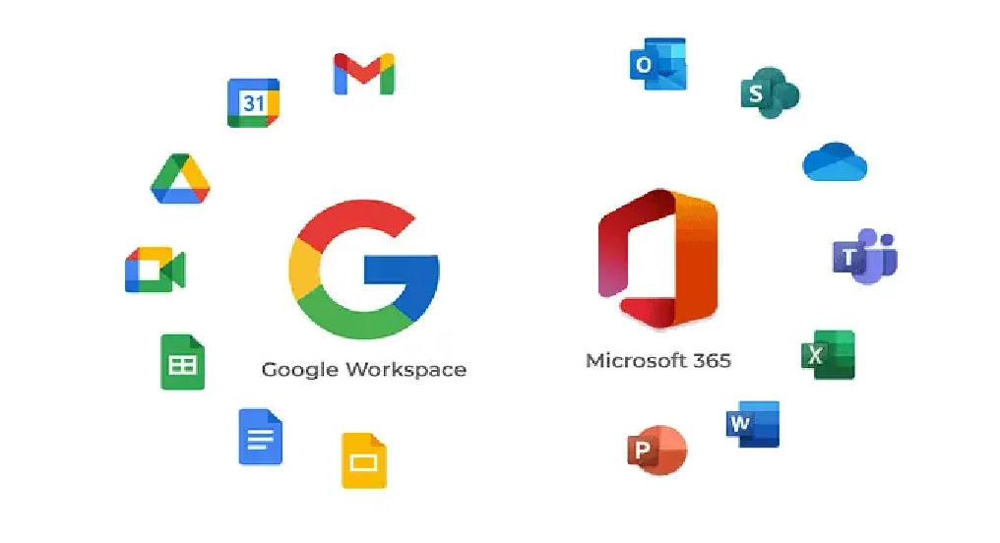

The core philosophy must be to rescue critical data from these closed systems and move toward the **plain text** simplicity of the Unix philosophy. Escaping commercial office tools is not just about saving license fees; it is about rebuilding documents, tables, and slides with robust engineering principles.

---

## 1. Document Engineering: Word vs. LaTeX

Microsoft Word's "What You See Is What You Get" (WYSIWYG) approach is fine for simple memos, but fails for technical documentation. Working directly on the visual output locks your content and presentation layers together. Instead of writing, you end up fighting page breaks, broken list numbering, and floating images that break your layout.

### The DOCX Format and Version Control Hurdles
A `.docx` file is a zipped archive of XML structures. This binary-like layout is completely incompatible with **Git** and other version control systems. 

Since Git tracks line-by-line differences, a single whitespace change in a Word document alters the zipped XML nodes, causing Git to see the entire file as replaced. Branching and merging collaborative work becomes an operational mess.

### LaTeX: Separating Content and Presentation
LaTeX uses the "What You Mean Is What You Get" (WYSIWYM) approach, separating content from design. The author focuses solely on structure (headings, citations, cross-references), while the engine manages the layout. LaTeX documents are `.tex` plain text files, ensuring absolute reliability:

* **Git Integration:** Every change is tracked as transparent, line-by-line diffs.
* **Branching Support:** You can apply entirely different styling templates to the same main text branch.
* **latexdiff:** Generate visual PDF diffs in seconds, highlighting deletions in red/strikethrough and additions in blue.

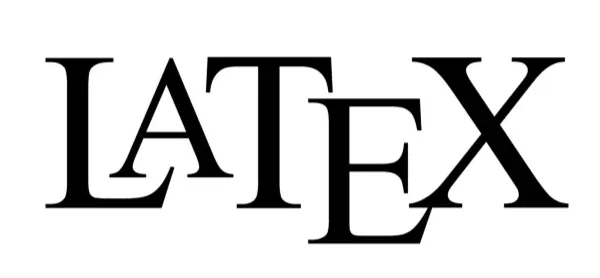

---

## 2. Transparency in Data Analytics: Excel vs. CSV + DuckDB

Microsoft Excel remains a huge source of technical debt in data analytics. Scientific reproducibility requires clear, auditable logic. Excel's core design flaw is wrapping raw data, calculations (formulas), and presentation in the same cell.

### Historical Excel Disasters
1. **UK COVID-19 Data Loss:** In October 2020, PHE missed 15,841 positive cases because lab reports (CSV) were imported into old `.xls` templates. Excel silently truncated all rows exceeding the 65,536 limit.
2. **Reinhart-Rogoff Error:** A 2010 economics paper shaping global policy contained a simple formula error where Excel missed 5 rows of data, showing a growth contraction of -0.1% instead of +2.2%.
3. **Genetics Auto-Correct:** Excel automatically converted gene labels like `MARCH1` to date formats ("March 1st"). The HGNC had to rename 27 human genes in 2020 just to prevent Excel corruption.

### DuckDB: Separating Storage and Compute
Modern data engineering demands separating storage (data) and compute (logic). Data should be stored in open, transparent formats (CSV/Parquet), and analyzed via versioned SQL queries.

DuckDB excels at this:
* **Columnar Storage:** Reads only the queried columns, optimizing disk I/O.
* **Vectorized Execution:** Uses CPU SIMD instructions to process data in chunks.
* **Git Compatibility:** SQL queries are versioned as plain text, allowing clear peer reviews.

  

    
💾

    <strong>Raw Data</strong>
    
.csv / .parquet

  

  
➔

  

    
🦆

    <strong>DuckDB Engine</strong>
    
SQL Queries

  

  
➔

  

    
📊

    <strong>Transparent Result</strong>
    
Reproducible

  

<h4 style="text-align: center; margin-bottom: 1rem;">Performance Comparison</h4>

<table style="width: 100%; font-size: 0.9rem;">
<thead>
<tr>
<th>Criterion</th>
<th>Microsoft Excel</th>
<th>DuckDB (SQL Engine)</th>
</tr>
</thead>
<tbody>
<tr>
<td>Capacity</td>
<td>1 Million Rows Limit</td>
<td>Terabytes of data (Disk/Memory efficient)</td>
</tr>
<tr>
<td>Transparency</td>
<td>Low (Hidden Formulas)</td>
<td>Very High (Open SQL Queries)</td>
</tr>
<tr>
<td>Error Risk</td>
<td>High (Auto-correct formatting)</td>
<td>Zero (Strict data types)</td>
</tr>
<tr>
<td>Version Control</td>
<td>Risky / Binary files</td>
<td>Perfect (Git Diff/Merge friendly)</td>
</tr>
</tbody>
</table>

---

## 3. Presentations: Rebranding PowerPoint with Slidev

PowerPoint slides isolate and freeze data. Copying a chart into PPTX separates it from its source; if the data changes, slides must be updated manually.

Modern developer culture demands **Presentation-as-Code**. Slides should be written in Markdown and rendered using the Web Stack.

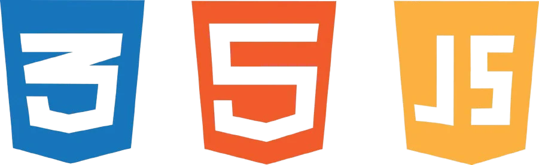

### Slidev: Interactive Slide Developer Environment
Slidev, built on Vue.js, is the modern standard for slide code:

1. **Dynamic Data:** Slide charts can pull data directly from APIs during the talk.
2. **Live Executions:** Embed a Monaco Editor (VS Code's core) to edit and run code live on a slide.
3. **Git/PR Workflow:** Slide content is a single `slides.md` file. Collaboration is managed via Pull Requests rather than email.

  <article class="render-card render-card-ssr reveal-on-scroll">
    

      Slidev
      <h3>Web Pinnacle</h3>
    

    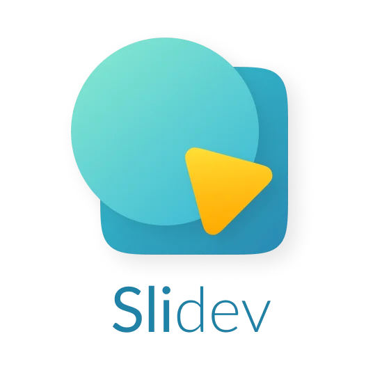
    
Markdown-based with Vue components and Monaco Editor. Run live code on slides and present interactive D3.js visualizations.

  </article>

  <article class="render-card render-card-ssg reveal-on-scroll">
    

      Marp
      <h3>Minimalist & Fast</h3>
    

    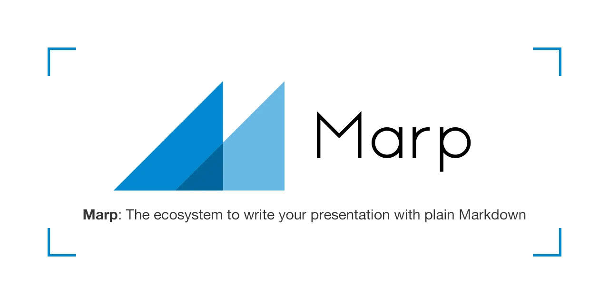
    
Write Markdown and produce PDF or HTML presentations instantly. Focus on content, not design.

  </article>

  <article class="render-card render-card-csr reveal-on-scroll">
    

      Reveal.js
      <h3>Power & Flexibility</h3>
    

    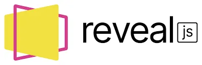
    
3D transitions and horizontal/vertical slide hierarchies using HTML/JS. Use hooks to trigger live data visualizations.

  </article>

  <article class="render-card render-card-isr reveal-on-scroll">
    

      Impress.js
      <h3>3D Visual Show</h3>
    

    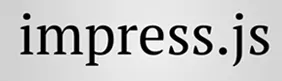
    
Prezi-style zooming and rotating effects using CSS3 transformations for immersive storytelling.

  </article>

---

## 4. Open Source Alternatives: LibreOffice and ONLYOFFICE

Not everyone wants to write code for slides or documents. However, office suite needs do not have to bind you to data-mining cloud platforms.

* **LibreOffice:** Built on the ISO ODF (Open Document Format) standard, it is telemetry-free and offline-first.
* **ONLYOFFICE:** Directly compatible with Microsoft's OOXML (DOCX/XLSX) format. It can be self-hosted on your own servers, providing a secure real-time collaboration suite.

<article class="render-card render-card-ssr reveal-on-scroll">

ONLYOFFICE
<h3>Modern Integration</h3>

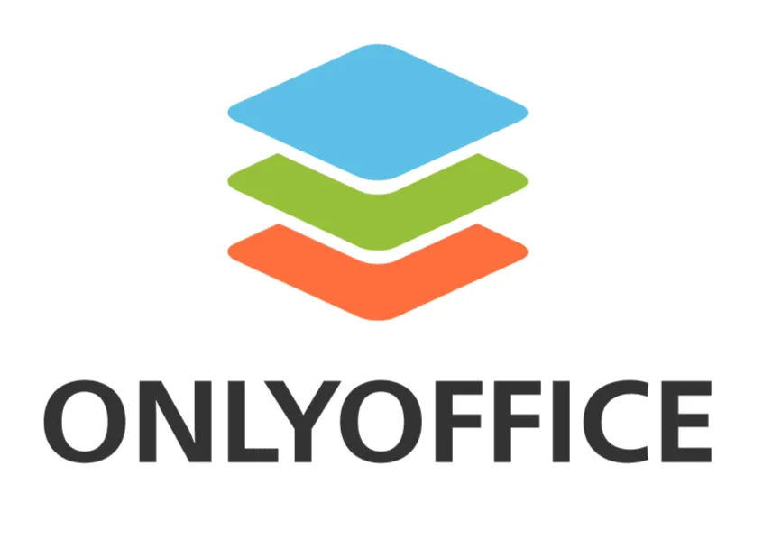

OOXML (DOCX) core architecture with self-hosted collaboration. Highest visual compatibility with MS formats.

</article>

<article class="render-card render-card-csr reveal-on-scroll">

LibreOffice
<h3>Privacy Fortress</h3>

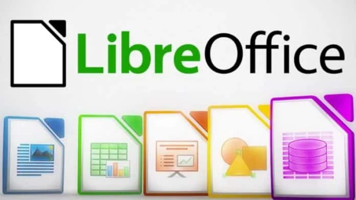

Loyal to ODF standards, telemetry-free, and fully offline. The strongest defender of data privacy.

</article>

<h4 style="text-align: center; margin-bottom: 1rem;">Suite Comparison</h4>

<table style="width: 100%; font-size: 0.9rem; margin: 0 auto;">
<thead>
<tr>
<th>Criterion</th>
<th>LibreOffice</th>
<th>ONLYOFFICE Docs</th>
</tr>
</thead>
<tbody>
<tr>
<td>Core Format</td>
<td>ODF (Open Document)</td>
<td>OOXML (DOCX/XLSX)</td>
</tr>
<tr>
<td>MS Compatibility</td>
<td>Advanced (Conversion)</td>
<td>Excellent (Native Core)</td>
</tr>
<tr>
<td>Interface (UI)</td>
<td>Classic Menus</td>
<td>Tabbed Ribbon UI</td>
</tr>
<tr>
<td>Collaboration</td>
<td>Cloud via Collabora</td>
<td>Built-in Self-hosted</td>
</tr>
</tbody>
</table>

---

### Golden Cages: Proprietary and Closed Ecosystems
Any platform that doesn't leave data ownership to the user, uses closed (proprietary) code, and mandates SaaS dependency is effectively a "golden cage." Switching between these is not gaining digital sovereignty; it's just choosing which guardian to trust your data with:

  <article class="render-card render-card-ssr reveal-on-scroll">
    

      Microsoft 365
      <h3>Ecosystem Lock</h3>
    

    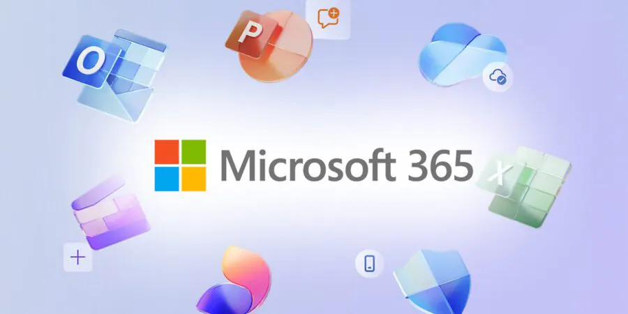
    
The industry standard for cloud dependency and vendor lock-in. A polished but rigid barrier to data sovereignty.

  </article>

  <article class="render-card render-card-ssr reveal-on-scroll">
    

      Google Docs
      <h3>SaaS Shackles</h3>
    

    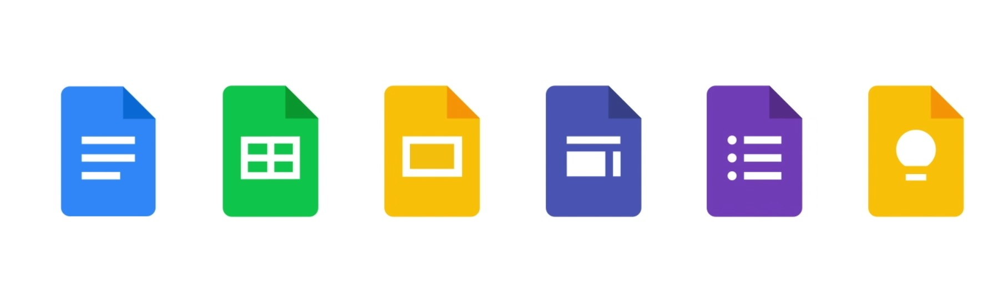
    
Escaping M365 for Google doesn't grant sovereignty. You're just choosing which monopoly processes your data.

  </article>

  <article class="render-card render-card-csr reveal-on-scroll">
    

      Zoho Office
      <h3>Closed Cloud</h3>
    

    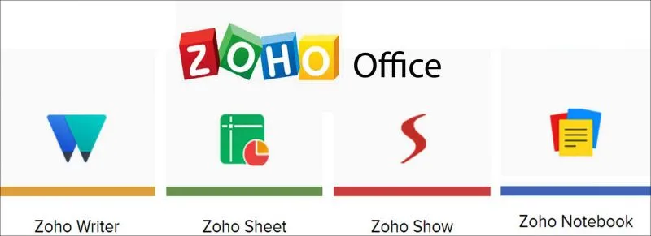
    
Locked into a proprietary cloud. Data remains on the provider's servers, outside of your sovereign control.

  </article>

  <article class="render-card render-card-ssg reveal-on-scroll">
    

      Apple iWork
      <h3>Hardware Lock</h3>
    

    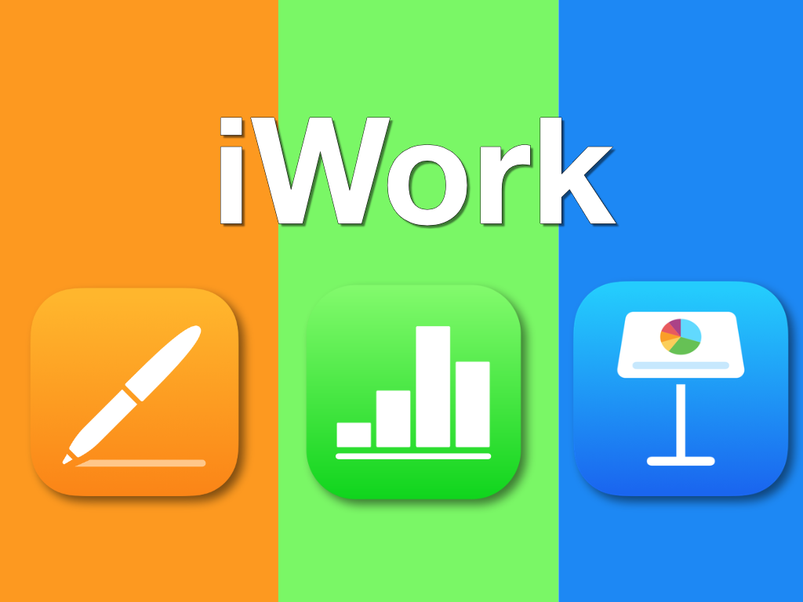
    
Tethers you to Apple hardware and the closed iCloud ecosystem. Proprietary formats and Git-incompatible.

  </article>

  <article class="render-card render-card-ssr reveal-on-scroll">
    

      WPS Office
      <h3>Budget Clone</h3>
    

    
    
Great compatibility with MS formats but closed-source and often bundled with ads or data-tracking.

  </article>

  <article class="render-card render-card-ssr reveal-on-scroll">
    

      FreeOffice
      <h3>Lightweight Clone</h3>
    

    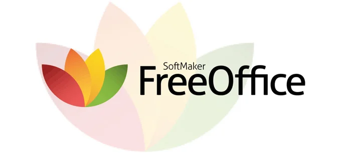
    
A fast 'Word clone' for low-spec PCs. Proprietary and offers a limited experience to drive paid upgrades.

  </article>

---

## 5. Unified Solution: Nextcloud Hub

It's now possible to gather all collaboration tools under one secure roof. **Nextcloud Hub** is a unified digital workspace that gives you absolute control over your data:

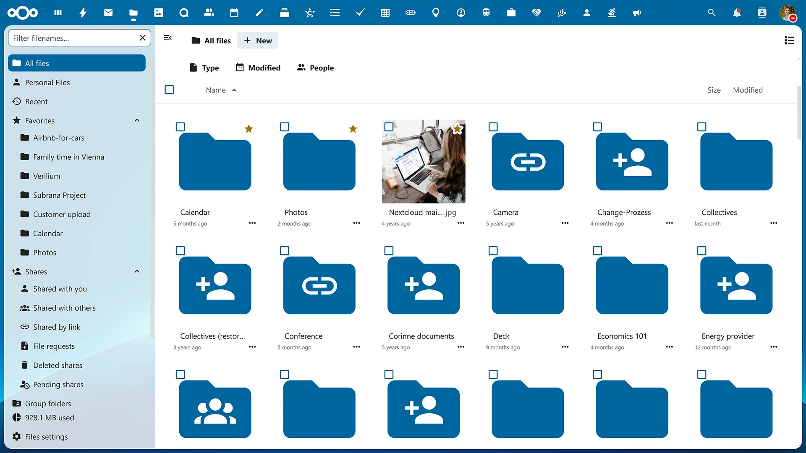

  <article class="render-card render-card-ssr reveal-on-scroll" style="border: 1px solid rgba(0, 130, 201, 0.3); box-shadow: 0 10px 40px rgba(0,0,0,0.1);">
    

      Nextcloud Files
      <h3>Drive Alternative</h3>
    

    
A secure, self-hosted alternative to Google Drive or OneDrive. Data is stored directly on your servers.

  </article>

  <article class="render-card render-card-csr reveal-on-scroll" style="border: 1px solid rgba(0, 130, 201, 0.3); box-shadow: 0 10px 40px rgba(0,0,0,0.1);">
    

      Nextcloud Office
      <h3>Live Collaboration</h3>
    

    
Browser-based concurrent document editing via ONLYOFFICE or Collabora integration.

  </article>

  <article class="render-card render-card-ssg reveal-on-scroll" style="border: 1px solid rgba(0, 130, 201, 0.3); box-shadow: 0 10px 40px rgba(0,0,0,0.1);">
    

      Nextcloud Talk
      <h3>Secure Teams</h3>
    

    
End-to-end encrypted conferencing and chat. Zero risk of data leakage compared to Meet or Teams.

  </article>

  <article class="render-card render-card-isr reveal-on-scroll" style="border: 1px solid rgba(0, 130, 201, 0.3); box-shadow: 0 10px 40px rgba(0,0,0,0.1);">
    

      Local AI
      <h3>Private Assistant</h3>
    

    
Nextcloud Assistant processes document analysis and text generation locally, keeping your data private.

  </article>

---

## 6. Complementary Tool Portfolio for Digital Freedom

To complete your sovereign architecture, these tools should be the cornerstones of your portfolio:

  <article class="render-card render-card-ssr reveal-on-scroll" style="border: 1px solid rgba(var(--app-accent-rgb, 37, 99, 235), 0.3); box-shadow: 0 10px 40px rgba(0,0,0,0.1);">
    

      Quarto
      <h3>Scientific Publishing</h3>
    

    
The modern bridge between LaTeX and Markdown. The new standard for producing technical reports from a single source.

  </article>

  <article class="render-card render-card-csr reveal-on-scroll" style="border: 1px solid rgba(var(--app-accent-rgb, 37, 99, 235), 0.3); box-shadow: 0 10px 40px rgba(0,0,0,0.1);">
    

      Zotero
      <h3>Bibliography Fortress</h3>
    

    
An open-source solution for managing citations locally (via WebDAV) instead of relying on Mendeley (SaaS).

  </article>

  <article class="render-card render-card-ssg reveal-on-scroll" style="border: 1px solid rgba(var(--app-accent-rgb, 37, 99, 235), 0.3); box-shadow: 0 10px 40px rgba(0,0,0,0.1);">
    

      Mermaid.js
      <h3>Diagram-as-Code</h3>
    

    
Write flowcharts as code and embed them in documents. Goodbye to clunky tools like Visio.

  </article>

  <article class="render-card render-card-isr reveal-on-scroll" style="border: 1px solid rgba(var(--app-accent-rgb, 37, 99, 235), 0.3); box-shadow: 0 10px 40px rgba(0,0,0,0.1);">
    

      Vaultwarden
      <h3>Sovereign Passwords</h3>
    

    
Self-host your password vault instead of trusting Google/Apple with your most sensitive credentials.

  </article>

---

## Reclaiming Your Digital Sovereignty

SaaS suites trade convenience for data ownership. Reclaiming control by writing documents in LaTeX, processing tables in DuckDB, and coding slides in Slidev is a deliberate choice for data sovereignty. Take charge of your data and secure your digital independence.

---

### Further Reading & Technical Documentation

**1. LaTeX (Document Engineering)**
* **Official Documentation:** https://www.latex-project.org/help/documentation/
* **Quick Start Guide (PDF):** http://tug.ctan.org/info/latex-veryshortguide/veryshortguide.pdf

**2. DuckDB (Data Analytics)**
* **CSV Import Guide:** https://duckdb.org/docs/stable/data/csv/overview
* **Python API:** https://duckdb.org/docs/stable/clients/python/overview
* **Multi-File Reads:** https://duckdb.org/docs/stable/data/multiple_files/overview

**3. Web Presentation Stack**
* **Slidev Documentation:** https://sli.dev/
* **Slidev Syntax Guide:** https://sli.dev/guide/syntax
* **Reveal.js-d3 Integration:** https://github.com/gcalmettes/reveal.js-d3

**4. Open Source Platforms**
* **LibreOffice Guides:** https://books.libreoffice.org/en/
* **Nextcloud Resources:** https://nextcloud.com/resources/
* **Nextcloud Compliance:** https://nextcloud.com/compliance/
* **ONLYOFFICE Docs:** https://www.onlyoffice.com/best-microsoft-office-alternative
