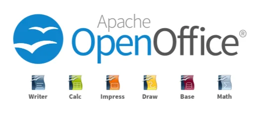

The modern information technology paradigm has experienced a dramatic and difficult-to-reverse shift from desktop software to Software as a Service (SaaS) models over the last twenty years. Today, a large part of corporate and individual mental production takes place in closed ecosystems offered by technology giants like Microsoft 365 and Google Workspace. While these platforms create a seamless illusion of **"cloud convenience,"** they harbor structural risks that threaten the long-term survival of institutions.

<h4 style="text-align: center; margin-bottom: 1rem;">Quick Comparison: Dependency vs. Sovereignty</h4>

<table style="width: 100%; font-size: 0.9rem;">
<thead>
<tr>
<th>Criterion</th>
<th>SaaS / Cloud (Convenience Illusion)</th>
<th>Engineering Stack (Data Sovereignty)</th>
</tr>
</thead>
<tbody>
<tr>
<td>Architecture</td>
<td>Hostage data, closed XML piles.</td>
<td>Plain-text simplicity, Git-compatible.</td>
</tr>
<tr>
<td>Security</td>
<td>Telemetry and digital footprint scanning.</td>
<td>On-premise (Self-hosted) total control.</td>
</tr>
<tr>
<td>Data Life</td>
<td>60-day Deletion Queue.</td>
<td>Code blocks that survive for generations.</td>
</tr>
<tr>
<td>Cost</td>
<td>Ever-increasing subscriptions & Lock-in.</td>
<td>Amortized infrastructure (TCO Advantage).</td>
</tr>
</tbody>
</table>

---

## Introduction: The Illusion of Cloud Dependency

The modern information technology paradigm has shifted dramatically from desktop software to Software as a Service (SaaS) models. Today, most corporate and individual mental production, business processes, and strategic data management occur within closed ecosystems like Microsoft 365 and Google Workspace. These platforms offer instant collaboration, ubiquitous access, and automated backups, creating a seamless illusion of "cloud convenience." However, behind this comfort lie structural risks like "cyber-dependency" and "vendor lock-in."

While Google Workspace and Microsoft 365 offer strict privacy commitments, they create significant operational barriers for data ownership and exit strategies. Your ultimate control over documents depends on terms of service that providers can update unilaterally. When a subscription is canceled, data isn't immediately transferred to local servers; instead, it enters a "suspension" period for 30 days, followed by a "deletion queue" between days 31 and 60, where data is permanently destroyed. This process effectively holds institutional data hostage.

Furthermore, these platforms constantly collect "telemetry" and diagnostic data. Document editing habits, interaction times, and internal communication topologies are scanned to create a massive digital footprint. IDC's 2026 projections show that 45% of digital organizations consider data sovereignty their top concern. SaaS data collection has evolved into a strategic intelligence mechanism that maps a company's internal business processes.

The core philosophy must be to rescue critical corporate memory from these closed systems and move toward the **plain text** simplicity of the Unix philosophy. Escaping commercial office platforms is not just about reducing license costs; it's a process of rebuilding documents, analytical tables, and presentation architectures with deterministic engineering principles.

---

## 1. Document Engineering: The Fall of Word and the Power of LaTeX

Microsoft Word's **WYSIWYG** (What You See Is What You Get) paradigm is a standard for daily correspondence but becomes a disaster for technical documentation. This approach forces the user to work directly on the final visual output; what you see while typing is the final state of the document. However, this is the greatest enemy of technical documentation. The core crisis of Word-based architecture is the inseparable locking of content (logical structure) and visual design (presentation layer). A writer should focus on content but instead struggles with typographic crises like page breaks, broken numbering, or images disrupting the text.

### Technical Debt and Version Control Crisis in DOCX
A `.docx` file is essentially a zipped archive of nested XML structures. This closed format is completely incompatible with **Git** and other distributed version control systems (VCS). Git analyzes line-by-line text differences, but in a compressed Word document, the slightest change causes the system to perceive the entire file as replaced, making branching and merging nearly impossible.

### The WYSIWYM Paradigm and LaTeX Stability
In contrast, LaTeX champions the **WYSIWYM** (What You Mean Is What You Get) approach, which radically separates content from design. Here, the writer focuses on *what* the document is (headings, sections, references) rather than what it looks like; the visual design is managed automatically by the system. LaTeX saves documents as `.tex` plain text files, offering absolute system stability regardless of file size or OS.

*   **Git Integration:** Every word change is saved with a transparent history showing who did what and when.
*   **Branching Strategies:** Different style templates can be applied to the same main text branch.
*   **latexdiff-vc:** Command-line tools generate perfect PDF comparisons, highlighting changes in seconds.
*   **The Future Standard:** LuaLaTeX and modern engines combine professional typesetting precision with plain-text simplicity.

---

## 2. Transparency in Data Analytics: Excel Disasters vs. CSV + DuckDB

Microsoft Excel is a massive technical debt mechanism that causes global disasters in big data scenarios. Scientific reproducibility requires audible steps, but Excel's flaw is hiding raw data, calculation logic (formulas), and presentation within the same cell.

### Historical Excel Disasters: COVID-19 and Beyond

1.  **UK COVID-19 Data Loss:** In October 2020, PHE failed to record 15,841 cases because raw CSV files were imported into old `.xls` templates, which silently truncated data beyond 65,536 rows.
2.  **Reinhart-Rogoff Scandal:** A 2010 economic paper influencing global austerity policies had a simple mouse-drag error (formulas covering 15 rows instead of 20), leading to an growth rate error of +2.3%.
3.  **Genetics Tainted by Auto-Correct:** Excel's algorithms automatically converted gene names like `MARCH1` to "March 1st," forcing the HGNC to rename 27 human genes in 2020.

### DuckDB: Vectorized SQL Engine and Logic Separation

The ultimate solution is a radical separation of storage (data) and compute (logic). Data should be stored in transparent formats (CSV/Parquet), while analysis is performed via versionable SQL.

<h4 style="text-align: center; margin-bottom: 1rem;">Why DuckDB? (Architectural Superiority)</h4>
<ul>
  <li><strong>Columnar Storage:</strong> DuckDB reads only the queried columns, drastically increasing I/O performance.</li>
  <li><strong>Vectorized Query Execution:</strong> Uses CPU SIMD instructions to process thousands of elements in a single clock cycle.</li>
  <li><strong>Logical Transparency:</strong> SQL queries are versioned in Git. Any error is visible and auditable in the history.</li>
</ul>

  

    
💾

    <strong>Raw Data</strong>
    
.csv / .parquet

  

  
➔

  

    
🦆

    <strong>DuckDB Engine</strong>
    
SQL Queries

  

  
➔

  

    
📊

    <strong>Transparent Result</strong>
    
Reproducible

  

<h4 style="text-align: center; margin-bottom: 1rem;">Performance Comparison</h4>

<table style="width: 100%; font-size: 0.9rem;">
<thead>
<tr>
<th>Criterion</th>
<th>Microsoft Excel</th>
<th>DuckDB (SQL Engine)</th>
</tr>
</thead>
<tbody>
<tr>
<td>Capacity</td>
<td>1 Million Rows (Truncation Risk)</td>
<td>Terabytes (Out-of-core)</td>
</tr>
<tr>
<td>Transparency</td>
<td>Low (Hidden Formulas)</td>
<td>Very High (Open SQL)</td>
</tr>
<tr>
<td>Error Risk</td>
<td>High (Auto-correct)</td>
<td>Zero (Strict Types)</td>
</tr>
<tr>
<td>Version Control</td>
<td>Risky / Binary</td>
<td>Perfect (Git Diff/Merge)</td>
</tr>
</tbody>
</table>

---

## 3. The Evolution of Presentation: The Death of PowerPoint and the Web Stack

PowerPoint's "acetate" logic is outdated for engineering communication. Its main problem is data stagnation; a chart copied into PPTX "dies"—if the source data changes, every slide must be manually updated.

Modern developer culture demands **Presentation-as-Code**. Web browser rendering capacity allows presentations to be written in Markdown and the Web Stack.

### The Pinnacle: Slidev and the Interactive Ecosystem

**Slidev**, built on Vue.js, represents the peak of web-based presentation architecture:

1.  **Dynamic Data and D3.js:** Integrate D3.js libraries directly. Charts can pull data from APIs in real-time with fluid animations.
2.  **Live Code Execution:** Monaco Editor (VS Code core) embedded in slides allows live code editing and execution during the talk.
3.  **Git/PR Workflow:** All content is in `slides.md`. Collaboration happens via Pull Requests instead of emailing file versions.

  <article class="render-card render-card-ssr reveal-on-scroll">
    

      Slidev
      <h3>Web Pinnacle</h3>
    

    
    
Markdown-based with Vue components and Monaco Editor. Run live code on slides and present interactive D3.js visualizations.

  </article>

  <article class="render-card render-card-ssg reveal-on-scroll">
    

      Marp
      <h3>Minimalist & Fast</h3>
    

    
    
Write Markdown and produce PDF or HTML presentations instantly. Focus on content, not design.

  </article>

  <article class="render-card render-card-csr reveal-on-scroll">
    

      Reveal.js
      <h3>Power & Flexibility</h3>
    

    
    
3D transitions and horizontal/vertical slide hierarchies using HTML/JS. Use hooks to trigger live data visualizations.

  </article>

  <article class="render-card render-card-isr reveal-on-scroll">
    

      Impress.js
      <h3>3D Visual Show</h3>
    

    
    
Prezi-style zooming and rotating effects using CSS3 transformations for immersive storytelling.

  </article>

---

## 4. Open Source Bastions: LibreOffice and ONLYOFFICE

Not everyone can work with code-based interfaces. However, office needs shouldn't force institutions into data-mining platforms.

### LibreOffice: The Fortress of ODF Standards
Born from the revolutionary legacy of OpenOffice, **LibreOffice** is an impenetrable fortress for digital independence.

Its philosophy is built on the ISO-standard **ODF** format.

### ONLYOFFICE: High Format Compatibility
When DOCX/XLSX dependency is unavoidable, **ONLYOFFICE** offers an architectural solution. Built on Microsoft's **OOXML** core, it can be self-hosted, preventing data from leaving your servers.

<article class="render-card render-card-ssr reveal-on-scroll">

ONLYOFFICE
<h3>Modern Integration</h3>

OOXML (DOCX) core architecture with self-hosted collaboration. Highest visual compatibility with MS formats.

</article>

<article class="render-card render-card-csr reveal-on-scroll">

LibreOffice
<h3>Privacy Fortress</h3>

Loyal to ODF standards, telemetry-free, and fully offline. The strongest defender of data privacy.

</article>

<h4 style="text-align: center; margin-bottom: 1rem;">Suite Comparison</h4>

<table style="width: 100%; font-size: 0.9rem; margin: 0 auto;">
<thead>
<tr>
<th>Criterion</th>
<th>LibreOffice</th>
<th>ONLYOFFICE Docs</th>
</tr>
</thead>
<tbody>
<tr>
<td>Core Format</td>
<td>ODF (Open Document)</td>
<td>OOXML (DOCX/XLSX)</td>
</tr>
<tr>
<td>MS Compatibility</td>
<td>Advanced (Conversion)</td>
<td>Excellent (Native Core)</td>
</tr>
<tr>
<td>Interface (UI)</td>
<td>Classic Menus</td>
<td>Tabbed Ribbon UI</td>
</tr>
<tr>
<td>Collaboration</td>
<td>Cloud via Collabora</td>
<td>Built-in Self-hosted</td>
</tr>
</tbody>
</table>

---

### Golden Cages: Proprietary and Closed Ecosystems
Any platform that doesn't leave data ownership to the user, uses closed (proprietary) code, and mandates SaaS dependency is effectively a "golden cage." Switching between these is not gaining digital sovereignty; it's just choosing which guardian to trust your data with:

  <article class="render-card render-card-ssr reveal-on-scroll">
    

      Microsoft 365
      <h3>Ecosystem Lock</h3>
    

    
    
The industry standard for cloud dependency and vendor lock-in. A polished but rigid barrier to data sovereignty.

  </article>

  <article class="render-card render-card-ssr reveal-on-scroll">
    

      Google Docs
      <h3>SaaS Shackles</h3>
    

    
    
Escaping M365 for Google doesn't grant sovereignty. You're just choosing which monopoly processes your data.

  </article>

  <article class="render-card render-card-csr reveal-on-scroll">
    

      Zoho Office
      <h3>Closed Cloud</h3>
    

    
    
Locked into a proprietary cloud. Data remains on the provider's servers, outside of your sovereign control.

  </article>

  <article class="render-card render-card-ssg reveal-on-scroll">
    

      Apple iWork
      <h3>Hardware Lock</h3>
    

    
    
Tethers you to Apple hardware and the closed iCloud ecosystem. Proprietary formats and Git-incompatible.

  </article>

  <article class="render-card render-card-ssr reveal-on-scroll">
    

      WPS Office
      <h3>Budget Clone</h3>
    

    
    
Great compatibility with MS formats but closed-source and often bundled with ads or data-tracking.

  </article>

  <article class="render-card render-card-ssr reveal-on-scroll">
    

      FreeOffice
      <h3>Lightweight Clone</h3>
    

    
    
A fast 'Word clone' for low-spec PCs. Proprietary and offers a limited experience to drive paid upgrades.

  </article>

---

## 5. Unified Solution: Nextcloud Hub

It's now possible to gather all collaboration tools under one secure roof. **Nextcloud Hub** is a unified digital workspace that gives you absolute control over your data:

  <article class="render-card render-card-ssr reveal-on-scroll" style="border: 1px solid rgba(0, 130, 201, 0.3); box-shadow: 0 10px 40px rgba(0,0,0,0.1);">
    

      Nextcloud Files
      <h3>Drive Alternative</h3>
    

    
A secure, self-hosted alternative to Google Drive or OneDrive. Data is stored directly on your servers.

  </article>

  <article class="render-card render-card-csr reveal-on-scroll" style="border: 1px solid rgba(0, 130, 201, 0.3); box-shadow: 0 10px 40px rgba(0,0,0,0.1);">
    

      Nextcloud Office
      <h3>Live Collaboration</h3>
    

    
Browser-based concurrent document editing via ONLYOFFICE or Collabora integration.

  </article>

  <article class="render-card render-card-ssg reveal-on-scroll" style="border: 1px solid rgba(0, 130, 201, 0.3); box-shadow: 0 10px 40px rgba(0,0,0,0.1);">
    

      Nextcloud Talk
      <h3>Secure Teams</h3>
    

    
End-to-end encrypted conferencing and chat. Zero risk of data leakage compared to Meet or Teams.

  </article>

  <article class="render-card render-card-isr reveal-on-scroll" style="border: 1px solid rgba(0, 130, 201, 0.3); box-shadow: 0 10px 40px rgba(0,0,0,0.1);">
    

      Local AI
      <h3>Private Assistant</h3>
    

    
Nextcloud Assistant processes document analysis and text generation locally, keeping your data private.

  </article>

---

## 6. Complementary Tool Portfolio for Digital Freedom

To complete your sovereign architecture, these tools should be the cornerstones of your portfolio:

  <article class="render-card render-card-ssr reveal-on-scroll" style="border: 1px solid rgba(var(--app-accent-rgb, 37, 99, 235), 0.3); box-shadow: 0 10px 40px rgba(0,0,0,0.1);">
    

      Quarto
      <h3>Scientific Publishing</h3>
    

    
The modern bridge between LaTeX and Markdown. The new standard for producing technical reports from a single source.

  </article>

  <article class="render-card render-card-csr reveal-on-scroll" style="border: 1px solid rgba(var(--app-accent-rgb, 37, 99, 235), 0.3); box-shadow: 0 10px 40px rgba(0,0,0,0.1);">
    

      Zotero
      <h3>Bibliography Fortress</h3>
    

    
An open-source solution for managing citations locally (via WebDAV) instead of relying on Mendeley (SaaS).

  </article>

  <article class="render-card render-card-ssg reveal-on-scroll" style="border: 1px solid rgba(var(--app-accent-rgb, 37, 99, 235), 0.3); box-shadow: 0 10px 40px rgba(0,0,0,0.1);">
    

      Mermaid.js
      <h3>Diagram-as-Code</h3>
    

    
Write flowcharts as code and embed them in documents. Goodbye to clunky tools like Visio.

  </article>

  <article class="render-card render-card-isr reveal-on-scroll" style="border: 1px solid rgba(var(--app-accent-rgb, 37, 99, 235), 0.3); box-shadow: 0 10px 40px rgba(0,0,0,0.1);">
    

      Vaultwarden
      <h3>Sovereign Passwords</h3>
    

    
Self-host your password vault instead of trusting Google/Apple with your most sensitive credentials.

  </article>

---

## Conclusion: Be the Architect of Your Data

Microsoft 365 and Google Workspace dispossess corporate memory through the illusion of convenience. Designing documents with LaTeX, managing data with DuckDB, and coding presentations with Slidev is more than a software change; it is an act of **data sovereignty.**

Reclaiming ownership and adhering to deterministic engineering principles is essential for securing institutional memory for decades to come.

Be the architect of your data, reclaim your sovereignty.

---

### Further Reading & Technical Documentation

**1. LaTeX (Document Engineering)**
*   **Official Documentation:** https://www.latex-project.org/help/documentation/
*   **Quick Start Guide (PDF):** http://tug.ctan.org/info/latex-veryshortguide/veryshortguide.pdf

**2. DuckDB (Data Analytics)**
*   **CSV Import Guide:** https://duckdb.org/docs/stable/data/csv/overview
*   **Python API:** https://duckdb.org/docs/stable/clients/python/overview
*   **Multi-File Reads:** https://duckdb.org/docs/stable/data/multiple_files/overview

**3. Web Presentation Stack**
*   **Slidev Documentation:** https://sli.dev/
*   **Slidev Syntax Guide:** https://sli.dev/guide/syntax
*   **Reveal.js-d3 Integration:** https://github.com/gcalmettes/reveal.js-d3

**4. Open Source Platforms**
*   **LibreOffice Guides:** https://books.libreoffice.org/en/
*   **Nextcloud Resources:** https://nextcloud.com/resources/
*   **Nextcloud Compliance:** https://nextcloud.com/compliance/
*   **ONLYOFFICE Docs:** https://www.onlyoffice.com/best-microsoft-office-alternative
