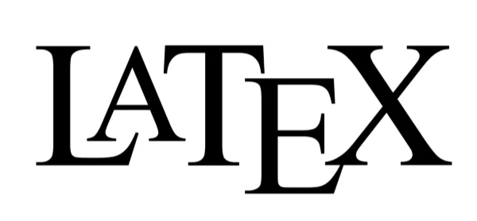
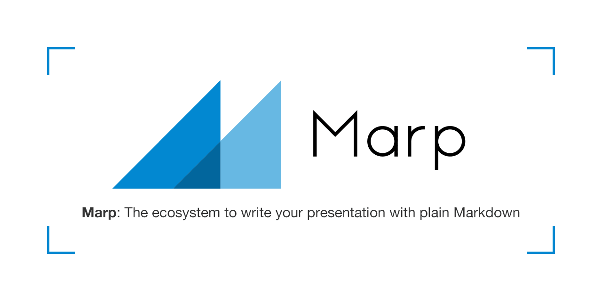
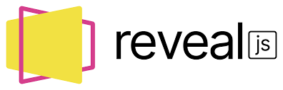
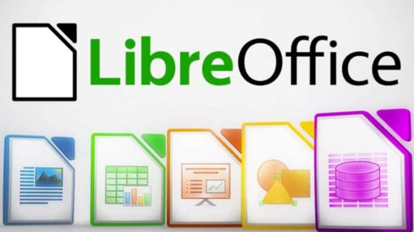
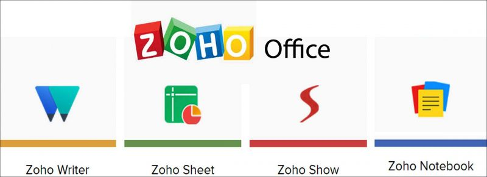

Son yıllarda masaüstü yazılımlardan bulut tabanlı SaaS modellerine hızlı bir geçiş yaşadık. Bugün iş süreçlerinin ve kurumsal hafızanın büyük kısmı Microsoft 365 veya Google Workspace gibi kapalı ekosistemlerde tutuluyor. Bu platformlar eşzamanlı çalışma kolaylığı getirse de, veri egemenliği ve güvenlik açısından ciddi riskleri de beraberinde getiriyor.

<h4 style="text-align: center; margin-bottom: 1rem;">Hızlı Kıyaslama: Bağımlılık vs. Egemenlik</h4>

<table style="width: 100%; font-size: 0.9rem;">
<thead>
<tr>
<th>Kriter</th>
<th>SaaS / Bulut Altyapısı</th>
<th>Mühendislik Stack'i (Veri Egemenliği)</th>
</tr>
</thead>
<tbody>
<tr>
<td>Mimari</td>
<td>Kapalı XML yığınları, rehin tutulan veriler.</td>
<td>Düz metin (Plain-text) sadeliği, Git uyumlu.</td>
</tr>
<tr>
<td>Güvenlik</td>
<td>Telemetri ve dijital ayak izi taraması.</td>
<td>On-premise (Self-hosted) tam kontrol.</td>
</tr>
<tr>
<td>Veri Ömrü</td>
<td>Hizmet sonlandırıldığında silinme riski.</td>
<td>Yıllarca saklanabilecek kod ve metin blokları.</td>
</tr>
<tr>
<td>Maliyet</td>
<td>Sürekli artan abonelik ücretleri.</td>
<td>Kendi kendine yeten amorti edilmiş altyapı.</td>
</tr>
</tbody>
</table>

---

## Bulut Bağımlılığı ve Veri Egemenliği

Google ve Microsoft gibi servis sağlayıcılar, kurumsal kullanıcılar için veri gizliliği taahhütleri sunsa da veri mülkiyeti ve veriyi dışa aktarma (exit strategy) süreçlerinde ciddi bariyerler oluşturuyor. Belgelerimiz üzerindeki kontrolümüz, hizmet sağlayıcının tek taraflı güncelleyebileceği sözleşmelere bağlı. 

Örneğin, bir abonelik iptal edildiğinde verileriniz hemen yerel sunucularınıza aktarılmıyor. Askıya alma ve silinme süreçleri, verilerinizin rehin kalmasına neden olabiliyor. Abonelik iptal edildikten sonraki ilk 30 günlük askıya alma periyodunda hizmetlere erişim kaybedilirken, sonraki aşamada veriler kalıcı olarak silinme kuyruğuna alınıyor.

Ayrıca, bu bulut platformlarının arka planda sürekli teşhis ve telemetri verisi toplaması da ayrı bir güvenlik sorunu. Kullanıcıların belge düzenleme alışkanlıkları ve kurumsal iletişim ağları taranıyor. IDC'nin verilerine göre dijital organizasyonların %45'i veri egemenliğini en büyük endişe olarak görüyor.

Çözüm, kurumsal hafızayı bu kapalı sistemlerden kurtarıp Unix felsefesinin temeli olan **düz metin (plain text)** sadeliğine taşımak. Ticari ofis platformlarından kaçmak sadece bir maliyet tasarrufu değil; belgelerin, tabloların ve sunumların mühendislik prensipleriyle yeniden inşa edilmesidir.

---

## 1. Belge Mühendisliği: Word'ün Hataları ve LaTeX'in Gücü

Microsoft Word gibi "Gördüğünü Alırsın" (WYSIWYG) mantığıyla çalışan editörler, günlük yazışmalar için standart olsa da teknik dokümantasyonda süreci zorlaştırıyor. Yazarın doğrudan nihai görsel çıktı üzerinde çalışması, içerik ile görsel tasarımın birbirine kilitlenmesine yol açıyor. Yazarken sayfa sonları, bozulan numaralar ve metni dağıtan görseller gibi tipografik detaylarla boğuşmak zorunda kalıyoruz.

### DOCX'in Teknik Borcu ve Versiyonlama Sorunu
DOCX dosyaları aslında sıkıştırılmış XML yığınlarından oluşan arşivlerdir. Bu kapalı yapı, yazılım geliştirme süreçlerinin kalbi olan **Git** ve benzeri versiyon kontrol sistemleriyle tamamen uyumsuzdur. 

Git satır satır değişiklikleri (diff) analiz eder. Ancak Word belgesinde yapılan tek bir boşluk veya referans değişikliği bile arka plandaki XML yapısını tamamen değiştirir. Git bunu "eski dosyanın silinip tamamen yeni bir ikili dosyanın eklenmesi" olarak algılar. Bu da ekip halinde aynı dosya üzerinde çalışmayı neredeyse imkansız hale getirir.

### LaTeX ile Mantıksal Yapı ve Tasarım Ayrımı
LaTeX ise "Ne Demek İstiyorsan Onu Alırsın" (WYSIWYM) yaklaşımıyla içeriği tasarımdan tamamen ayırır. Yazar sadece belgenin mantıksal yapısına (başlıklar, bölümler, referanslar) odaklanır; görsel tasarımı ise sistem yönetir. LaTeX, belgeleri `.tex` uzantılı düz metin dosyaları olarak kaydettiği için sistem stabilitesi sunar:

* **Git Entegrasyonu:** Her kelime değişikliği şeffaf bir tarihçe ile izlenir.
* **Dallanma (Branching):** Aynı ana metin üzerinde farklı şablonlar kolayca uygulanabilir.
* **latexdiff:** Sürümler arası farkları gösteren PDF'ler saniyeler içinde üretilebilir; silinen metinler kırmızı/çizili, yeniler mavi olarak işaretlenir.

---

## 2. Veri Analitiğinde Şeffaflık: Excel Felaketleri vs. CSV + DuckDB Mimarisi

Microsoft Excel büyük veri analitiğinde formüllerle veriyi aynı hücrede birleştirerek ciddi hatalara zemin hazırlıyor. Bilimsel tekrarlanabilirliğin temel şartı denetlenebilir adımlardır.

### Tarihteki Excel Hataları
1. **İngiltere COVID-19 Vaka Kaybı:** Ekim 2020'de 15 binden fazla pozitif vaka sisteme kaydedilemedi. Hatanın nedeni, laboratuvarlardan gelen CSV dosyalarının eski `.xls` formatındaki şablonlara aktarılmasıydı. Excel, 65.536 satır sınırını aşan verileri sessizce kırptı.
2. **Reinhart-Rogoff Ekonomi Politikası Hatası:** Küresel kemer sıkma politikalarına yön veren bir makalede, Excel formülünün 20 satır yerine 15 satırı kapsaması nedeniyle büyüme oranı yanlış hesaplandı. Hücre içindeki formüller gizli olduğu için bu hata yıllarca fark edilmedi.
3. **Genetik Terimlerin Bozulması:** Excel'in otomatik düzeltme özelliği, gen isimlerini (`MARCH1` gibi) tarihe ("1 Mart") dönüştürdü. Sırf Excel'in bu davranışı yüzünden 2020'de 27 insan geninin adı değiştirilmek zorunda kalındı.

### DuckDB: Mantık ve Veri Ayrımı
Veri mühendisliğinde çözüm, veri (storage) ile mantığın (compute) ayrılmasıdır. Veri CSV/Parquet gibi şeffaf formatlarda saklanmalı; analiz ise SQL ile yapılmalıdır.

DuckDB, vektörel SQL motoruyla bu süreci optimize eder:
* **Sütun Tabanlı Saklama (Columnar):** Sadece sorgulanan kolonları okuyarak disk/bellek performansını artırır.
* **Vektörel Sorgu:** CPU'nun SIMD komutlarını kullanarak verileri yığınlar halinde işler.
* **Git Uyumluluğu:** SQL sorguları düz metin olarak Git ile versiyonlanır.

  

    
💾

    <strong>Ham Veri</strong>
    
.csv / .parquet

  

  
➔

  

    
🦆

    <strong>DuckDB Motoru</strong>
    
SQL Sorguları

  

  
➔

  

    
📊

    <strong>Şeffaf Sonuç</strong>
    
Tekrarlanabilir

  

<h4 style="text-align: center; margin-bottom: 1rem;">Performans Kıyaslaması</h4>

<table style="width: 100%; font-size: 0.9rem;">
<thead>
<tr>
<th>Kriter</th>
<th>Microsoft Excel</th>
<th>DuckDB (SQL Motoru)</th>
</tr>
</thead>
<tbody>
<tr>
<td>İşlem Kapasitesi</td>
<td>1 Milyon Satır Sınırı</td>
<td>Terabaytlarca veri (Disk/Bellek verimli)</td>
</tr>
<tr>
<td>Mantıksal Şeffaflık</td>
<td>Düşük (Hücreye gizlenmiş formüller)</td>
<td>Çok Yüksek (Sorgu dosyaları)</td>
</tr>
<tr>
<td>Hata Riski</td>
<td>Yüksek (Otomatik tür dönüştürme)</td>
<td>Sıfır (Katı veri tipleri)</td>
</tr>
<tr>
<td>Versiyon Kontrolü</td>
<td>Zor (İkili dosya formatı)</td>
<td>Kusursuz (Git Diff/Merge uyumlu)</td>
</tr>
</tbody>
</table>

---

## 3. Sunum Mimarisinde Kod Dönemi: Slidev ve Web Stack

PowerPoint sunumları veriyi statikleştirir. Excel'den kopyalanan bir grafik sunuma eklendiği an statikleşir; veri değiştiğinde slaytları tek tek güncellemek gerekir.

Modern mühendislik kültürü, **Sunum Kod Olarak** (Presentation-as-Code) yaklaşımını gerektiriyor. Slaytlar artık Markdown ve Web teknolojileriyle (HTML/CSS/JS) yazılmalıdır.

### Slidev Entegrasyonu
Vue.js tabanlı **Slidev**, web tabanlı sunumların en gelişmiş örneğidir:

1. **Dinamik Veriler:** Grafiklerin verileri bir API'den anlık çekilebilir ve animasyonlarla sunulabilir.
2. **Canlı Kod Çalıştırma:** Monaco Editor entegrasyonu sayesinde slayt üzerinde canlı kod yazıp çalıştırabilirsiniz.
3. **Git ve İşbirliği:** Sunum içeriği tek bir `slides.md` dosyasındadır. Değişiklikler e-posta yerine Pull Request (PR) ile yapılır.

  <article class="render-card render-card-ssr reveal-on-scroll">
    

      Slidev
      <h3>Web Mimarisinin Zirvesi</h3>
    

    
    
Vue bileşenleri ve Monaco Editor ile güçlendirilmiş mimari. Canlı kod çalıştırabilir ve etkileşimli grafikler sunabilirsiniz.

  </article>

  <article class="render-card render-card-ssg reveal-on-scroll">
    

      Marp
      <h3>Minimalist ve Hızlı</h3>
    

    
    
Tasarım karmaşasıyla ilgilenmeden sadece Markdown yazarak PDF veya HTML sunumlar üretmek için en hızlı çözüm.

  </article>

  <article class="render-card render-card-csr reveal-on-scroll">
    

      Reveal.js
      <h3>Esneklik ve Güç</h3>
    

    
    
Doğrudan HTML/JS ile 3D geçişler ve yatay/dikey slayt hiyerarşileri. Görselleştirmeleri anlık tetikleyebilirsiniz.

  </article>

  <article class="render-card render-card-isr reveal-on-scroll">
    

      Impress.js
      <h3>3D Görsel Şov</h3>
    

    
    
CSS3 transformasyonları ile dönen ve derinlik algısı yaratan sunumlar hazırlamak için ideal.

  </article>

---

## 4. Açık Kaynaklı Alternatifler: LibreOffice ve ONLYOFFICE

Kod tabanlı araçlar herkes için uygun olmayabilir. Ancak ofis araçları ihtiyacı, verilerimizi dışarı aktaran platformlara bağımlı olmamızı gerektirmez.

* **LibreOffice:** ISO standardı ODF (Open Document Format) kullanan, arka planda veri göndermeyen güvenli bir alternatiftir.
* **ONLYOFFICE:** Microsoft OOXML formatıyla doğrudan uyumludur. Şirket içi sunucularınızda (Self-hosted) barındırılarak bulut benzeri bir işbirliği ortamı sunar.

<article class="render-card render-card-ssr reveal-on-scroll">

ONLYOFFICE
<h3>Modern Entegrasyon</h3>

OOXML (DOCX) çekirdek mimarisi ve şirket içi işbirliği. Microsoft formatlarıyla yüksek görsel uyumluluk.

</article>

<article class="render-card render-card-csr reveal-on-scroll">

LibreOffice
<h3>Gizlilik Kalesi</h3>

ODF standartlarına bağlı, telemetrisiz ve tamamen çevrimdışı. Veri mahremiyetinin güçlü savunucusu.

</article>

<h4 style="text-align: center; margin-bottom: 1rem;">Paket Kıyaslaması</h4>

<table style="width: 100%; font-size: 0.9rem; margin: 0 auto;">
<thead>
<tr>
<th>Kriter</th>
<th>LibreOffice</th>
<th>ONLYOFFICE Docs</th>
</tr>
</thead>
<tbody>
<tr>
<td>Çekirdek Format</td>
<td>ODF (Open Document)</td>
<td>OOXML (DOCX/XLSX)</td>
</tr>
<tr>
<td>MS Uyumluluğu</td>
<td>Gelişmiş (Dönüştürme ile)</td>
<td>Mükemmel (Doğrudan uyumlu)</td>
</tr>
<tr>
<td>Arayüz (UI)</td>
<td>Klasik Menü Sistemi</td>
<td>Sekmeli Ribbon Arayüzü</td>
</tr>
<tr>
<td>İşbirliği</td>
<td>Collabora entegrasyonu ile</td>
<td>Yerleşik Self-hosted servisleri</td>
</tr>
</tbody>
</table>

---

### Kapalı Ekosistemlerin Riskleri
Veri mülkiyetini kullanıcıya bırakmayan ve SaaS bağımlılığı yaratan platformlar, kurumlar için operasyonel birer kilit oluşturur. Google Docs, Microsoft 365 veya Zoho gibi tescilli bulut servisleri arasında geçiş yapmak veri egemenliği sağlamaz; sadece verinizi hangi sunucuda saklayacağınızı seçmenize yarar.

  <article class="render-card render-card-ssr reveal-on-scroll">
    

      Microsoft 365
      <h3>Ekosistem Kilidi</h3>
    

    
    
Bulut bağımlılığının ve 'vendor lock-in' kavramının endüstri standardı. Veri egemenliğinin önündeki en şık ama en katı bariyer.

  </article>

  <article class="render-card render-card-ssr reveal-on-scroll">
    

      Google Docs
      <h3>SaaS Prangası</h3>
    

    
    
M365'ten kaçıp Google'a sığınmak veri egemenliği sağlamaz. Sadece verinizi hangi tekelin işleyeceğini seçersiniz.

  </article>

  <article class="render-card render-card-csr reveal-on-scroll">
    

      Zoho Office
      <h3>Kapsamlı Ama Kapalı</h3>
    

    
    
Bulut bağımlılığı ve tescilli doğası ile egemenlik kalesinin dışındadır. Veri yine sağlayıcının sunucusundadır.

  </article>

  <article class="render-card render-card-ssg reveal-on-scroll">
    

      Apple iWork
      <h3>Donanım Kilidi</h3>
    

    
    
Sizi Apple donanımlarına ve kapalı iCloud ekosistemine kilitler. Formatları tescillidir ve Git uyumsuzdur.

  </article>

  <article class="render-card render-card-ssr reveal-on-scroll">
    

      WPS Office
      <h3>Bütçe Dostu Klon</h3>
    

    
    
Microsoft formatlarıyla uyumlu çalışan Ribbon arayüzü. Ücretsiz sürümü reklam ve takip kodları barındırabilir.

  </article>

  <article class="render-card render-card-ssr reveal-on-scroll">
    

      FreeOffice
      <h3>Hafif ve Hızlı</h3>
    

    
    
Düşük donanımlı bilgisayarlarda hızlı bir alternatif sunar. Kapalı kaynaklıdır ancak bireysel kullanım için uygundur.

  </article>

---

## 5. Bütünleşik Çözüm: Nextcloud Hub

Nextcloud Hub, bulut servislerinin sunduğu dosya paylaşımı, ortak belge düzenleme ve iletişim araçlarını tek bir on-prem sunucuda toplar:

* **Nextcloud Files:** Google Drive alternatifi dosya depolama.
* **Nextcloud Office:** Tarayıcı üzerinden eşzamanlı belge düzenleme.
* **Nextcloud Talk:** Uçtan uca şifreli toplantı ve sohbet.
* **Yerel Yapay Zeka:** Verileri dışarı göndermeden çalışan yerel yapay zeka asistanı.

  <article class="render-card render-card-ssr reveal-on-scroll" style="border: 1px solid rgba(0, 130, 201, 0.3); box-shadow: 0 10px 40px rgba(0,0,0,0.1);">
    

      Nextcloud Files
      <h3>Drive Alternatifi</h3>
    

    
Google Drive veya OneDrive'ın güvenli, self-hosted alternatifi. Veriler doğrudan sizin sunucunuzda saklanır.

  </article>

  <article class="render-card render-card-csr reveal-on-scroll" style="border: 1px solid rgba(0, 130, 201, 0.3); box-shadow: 0 10px 40px rgba(0,0,0,0.1);">
    

      Nextcloud Office
      <h3>Canlı İşbirliği</h3>
    

    
ONLYOFFICE veya Collabora entegrasyonu ile tarayıcı üzerinden eşzamanlı belge düzenleme imkanı.

  </article>

  <article class="render-card render-card-ssg reveal-on-scroll" style="border: 1px solid rgba(0, 130, 201, 0.3); box-shadow: 0 10px 40px rgba(0,0,0,0.1);">
    

      Nextcloud Talk
      <h3>Güvenli Teams</h3>
    

    
Meet veya Teams yerine uçtan uca şifreli konferans ve sohbet. Veri sızıntısı riski sıfır.

  </article>

  <article class="render-card render-card-isr reveal-on-scroll" style="border: 1px solid rgba(0, 130, 201, 0.3); box-shadow: 0 10px 40px rgba(0,0,0,0.1);">
    

      Yerel Yapay Zeka
      <h3>Mahrem Asistan</h3>
    

    
Verileri dışarı sızdırmadan yerel çalışan Nextcloud Assistant ile doküman analizi ve metin üretimi.

  </article>

---

## 6. Dijital Özgürlük İçin Tamamlayıcı Araçlar

Mühendislik ve akademik çalışmaları destekleyen diğer açık kaynaklı araçlar:

* **Quarto:** Markdown ve LaTeX arasında modern bir köprü. Teknik raporları farklı formatlarda üretmenizi sağlar.
* **Zotero:** Akademik referansları ve bibliyografyayı kendi sunucunuzda saklayan açık kaynaklı çözüm.
* **Mermaid.js:** Akış şemalarını kodla çizmenizi sağlar.
* **Vaultwarden:** Şifrelerinizi kendi sunucunuzda saklayan Bitwarden uyumlu şifre yöneticisi.

  <article class="render-card render-card-ssr reveal-on-scroll" style="border: 1px solid rgba(var(--app-accent-rgb, 37, 99, 235), 0.3); box-shadow: 0 10px 40px rgba(0,0,0,0.1);">
    

      Quarto
      <h3>Bilimsel Yayıncılık</h3>
    

    
LaTeX ve Markdown arasındaki en modern köprü. Teknik raporları tek kaynaktan (Web/PDF/MS Word) üretmek için yeni dünya standardı.

  </article>

  <article class="render-card render-card-csr reveal-on-scroll" style="border: 1px solid rgba(var(--app-accent-rgb, 37, 99, 235), 0.3); box-shadow: 0 10px 40px rgba(0,0,0,0.1);">
    

      Zotero
      <h3>Bibliyografya Kalesi</h3>
    

    
Akademik çalışmaları Mendeley (SaaS) yerine kendi kontrolünüzde (WebDAV) tutmanızı sağlayan açık kaynaklı çözüm.

  </article>

  <article class="render-card render-card-ssg reveal-on-scroll" style="border: 1px solid rgba(var(--app-accent-rgb, 37, 99, 235), 0.3); box-shadow: 0 10px 40px rgba(0,0,0,0.1);">
    

      Mermaid.js
      <h3>Diagram-as-Code</h3>
    

    
Akış diyagramlarını kodla yazıp dokümana gömmek için elzem. Visio gibi hantal araçlara elveda.

  </article>

  <article class="render-card render-card-isr reveal-on-scroll" style="border: 1px solid rgba(var(--app-accent-rgb, 37, 99, 235), 0.3); box-shadow: 0 10px 40px rgba(0,0,0,0.1);">
    

      Vaultwarden
      <h3>Egemen Şifreler</h3>
    

    
Şifrelerinizi Google/Apple'a emanet etmek yerine kendi sunucunuzda host ettiğiniz bitwarden uyumlu kasa.

  </article>

---

## Veri Egemenliğini Geri Kazanmak

Bulut tabanlı ofis platformlarının getirdiği kolaylıklar, verinin mülkiyetini kaybetme riskini de beraberinde getirir. Belgeleri LaTeX ile yazmak, verileri DuckDB ile işlemek ve sunumları Slidev ile kodlamak sadece bir araç tercihi değil; verinizin kontrolünü elinizde tutma duruşudur. Kendi verinizin mimarı olun ve dijital bağımsızlığınızı koruyun.

---

### İleri Okuma ve Teknik Dokümantasyonlar

**1. LaTeX (Belge Mühendisliği ve Dizgi)**
* **LaTeX Resmi Dokümantasyonu:** https://www.latex-project.org/help/documentation/
* **Hızlı Başlangıç Kılavuzu (PDF):** http://tug.ctan.org/info/latex-veryshortguide/veryshortguide.pdf

**2. DuckDB (Veri Analitiği ve İşleme)**
* **CSV İçe Aktarma ve Yapılandırma Rehberi:** https://duckdb.org/docs/stable/data/csv/overview
* **Python API Dokümantasyonu:** https://duckdb.org/docs/stable/clients/python/overview
* **Çoklu Dosya Okuma ve Şema Birleştirme:** https://duckdb.org/docs/stable/data/multiple_files/overview

**3. HTML/CSS/JS Tabanlı Sunum Araçları**
* **Slidev Resmi Dokümantasyonu:** https://sli.dev/
* **Slidev Sözdizimi Kılavuzu:** https://sli.dev/guide/syntax
* **Reveal.js ve D3.js Entegrasyonu (GitHub):** https://github.com/gcalmettes/reveal.js-d3

**4. Açık Kaynaklı Ofis ve İşbirliği Platformları**
* **LibreOffice Kullanıcı Kılavuzları:** https://books.libreoffice.org/en/
* **Nextcloud Bilgi ve Kaynak Merkezi:** https://nextcloud.com/resources/
* **Nextcloud Uyumluluk ve Veri Egemenliği Rehberleri:** https://nextcloud.com/compliance/
* **ONLYOFFICE Çözümleri:** https://www.onlyoffice.com/best-microsoft-office-alternative
