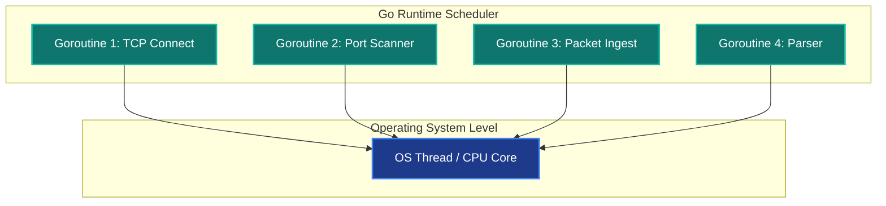

# Offensive Development with Go (Golang) for Hackers

When it comes to developing cybersecurity tools, speed, portability, and concurrency capabilities are the deciding factors. While Python is fantastic for rapid prototyping, it often falls short in high-performance network scanning or when standalone, zero-dependency static binaries are required. On the other side, C/C++ offers high performance but introduces memory management hurdles and complex cross-compilation processes.

This is exactly where **Go (Golang)** shines. Developed by Google, this language has quickly become a favorite among cybersecurity researchers and offensive tool developers (Red Teamers). The primary reasons for this adoption are:

*   **Concurrency (Goroutines):** Go's lightweight execution threads (goroutines) allow developers to spawn thousands of concurrent network requests or socket connections simultaneously with extremely low memory footprints.
*   **Portability (Cross-Compilation):** Code written on a Windows machine can be cross-compiled for Linux or macOS with a single command into a single, statically linked binary requiring zero dependency libraries on the target system.
*   **Performance & Memory Safety:** Go approaches the execution speeds of compiled C code while offering garbage collection and safe memory management, avoiding typical pointer errors and access violations.

The diagram below visualizes how Go's scheduler multiplexes thousands of lightweight goroutines onto a single operating system thread:



---

## Simple TCP Port Scanner Example in Go

A basic implementation of a TCP port connector showing the simplicity of socket programming in Go:

```go
package main

import (
	"fmt"
	"net"
	"time"
)

func main() {
	target := "scanme.nmap.org"
	port := "80"

	// Attempt a TCP connection with a 2-second timeout
	conn, err := net.DialTimeout("tcp", target+":"+port, 2*time.Second)
	if err != nil {
		fmt.Printf("Port %s closed: %v\n", port, err)
		return
	}
	conn.Close()
	fmt.Printf("Port %s open!\n", port)
}
```

---

## 📺 Offensive Go Development Video Series

Parallel to this blog series, you can follow my YouTube video series covering how to write security tools (port scanners, subdomain enumerators, encryption ransomware simulators, and HTTP reverse shells for penetration testing) in Go from scratch:

<div class="video-container" style="position: relative; padding-bottom: 56.25%; height: 0; overflow: hidden; max-width: 100%; margin: 1.5rem 0; border-radius: 12px; box-shadow: 0 4px 15px rgba(0,0,0,0.3);">
  <iframe src="https://www.youtube.com/embed/videoseries?list=PLidcsTyj9JXJ74wLAJDC10JiUPV568hcp" style="position: absolute; top: 0; left: 0; width: 100%; height: 100%; border: 0;" allow="accelerometer; autoplay; clipboard-write; encrypted-media; gyroscope; picture-in-picture; web-share" allowfullscreen></iframe>
</div>

You can access the playlist directly at [Golang for Hackers English Playlist](https://youtube.com/playlist?list=PLidcsTyj9JXJ74wLAJDC10JiUPV568hcp&si=4zHl7nmRyreVXydy).
