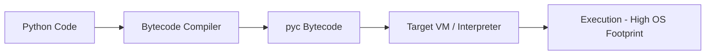
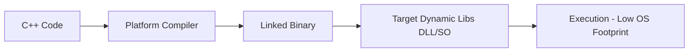
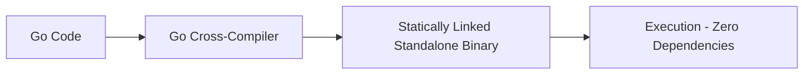
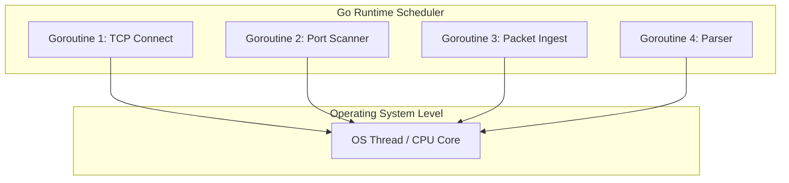

<style>
.gh-container {
  margin: 2.5rem 0;
}
.gh-grid {
  display: grid;
  grid-template-columns: repeat(auto-fit, minmax(260px, 1fr));
  gap: 1.5rem;
  margin: 1.5rem 0;
}
.gh-card {
  background: rgba(30, 41, 59, 0.45);
  border: 1px solid rgba(148, 163, 184, 0.12);
  border-radius: 14px;
  padding: 1.75rem;
  box-shadow: 0 4px 30px rgba(0, 0, 0, 0.15);
  backdrop-filter: blur(10px);
  -webkit-backdrop-filter: blur(10px);
  transition: all 0.3s cubic-bezier(0.4, 0, 0.2, 1);
  position: relative;
  overflow: hidden;
}
.gh-card:hover {
  transform: translateY(-4px);
  border-color: rgba(56, 189, 248, 0.4);
  box-shadow: 0 10px 30px rgba(56, 189, 248, 0.1);
  background: rgba(30, 41, 59, 0.6);
}
.gh-card::before {
  content: '';
  position: absolute;
  top: 0;
  left: 0;
  width: 100%;
  height: 4px;
  background: linear-gradient(90deg, #38bdf8, #818cf8);
  opacity: 0;
  transition: opacity 0.3s;
}
.gh-card:hover::before {
  opacity: 1;
}
.gh-gradient-text {
  background: linear-gradient(135deg, #38bdf8 0%, #818cf8 100%);
  -webkit-background-clip: text;
  -webkit-text-fill-color: transparent;
  font-weight: 800;
}
.gh-badge {
  background: rgba(56, 189, 248, 0.1);
  color: #38bdf8;
  border: 1px solid rgba(56, 189, 248, 0.2);
  padding: 0.25rem 0.6rem;
  border-radius: 20px;
  font-size: 0.75rem;
  font-weight: 600;
  display: inline-block;
  margin-bottom: 0.75rem;
}
.gh-btn {
  background: linear-gradient(135deg, #0284c7 0%, #4f46e5 100%);
  color: white !important;
  border: none;
  padding: 0.75rem 1.5rem;
  border-radius: 8px;
  cursor: pointer;
  font-weight: 600;
  text-decoration: none !important;
  transition: all 0.2s;
  display: inline-flex;
  align-items: center;
  gap: 0.5rem;
}
.gh-btn:hover {
  opacity: 0.95;
  transform: scale(1.02);
}
</style>

# Golang for Hackers: Modern Cybersecurity Architecture and Offensive Coding Guide

For years, pentesters and Red Teamers relied on Python for automation and C/C++ for low-level memory access. But modern, hardened environments equipped with EDRs and active logging have restricted these traditional toolsets. Go (Golang)—designed by Google for high-performance distributed systems—has emerged as the new standard for offensive tool development.

This guide covers the structural advantages of Go in security operations and demonstrates practical offensive use cases.

<div class="gh-container">
  <h3 class="gh-gradient-text" style="text-align: center; margin-bottom: 1.5rem;">🎯 Who Is This Guide For?</h3>
  <div class="gh-grid">
    <div class="gh-card">
      <div class="gh-badge" style="background: rgba(56, 189, 248, 0.1); color: #38bdf8;">Red Team / Pentester</div>
      <h4 style="margin: 0.5rem 0; font-weight: bold; color: #f1f5f9;">Penetration Testers</h4>
      <p style="font-size: 0.85rem; color: #94a3b8; line-height: 1.5; margin-bottom: 0;">
        Security professionals looking to build high-speed custom scanners and portable post-exploitation tools that run with zero dependencies on corporate networks.
      </p>
    </div>
    <div class="gh-card">
      <div class="gh-badge" style="background: rgba(129, 140, 248, 0.1); color: #818cf8;">Malware Dev</div>
      <h4 style="margin: 0.5rem 0; font-weight: bold; color: #f1f5f9;">Malware Researchers</h4>
      <p style="font-size: 0.85rem; color: #94a3b8; line-height: 1.5; margin-bottom: 0;">
        Researchers seeking to analyze compiler optimizations, bypass modern AV/EDR signatures, and construct obfuscated binaries with low-level API operations.
      </p>
    </div>
    <div class="gh-card">
      <div class="gh-badge" style="background: rgba(16, 185, 129, 0.1); color: #10b981;">Blue Team / SOC</div>
      <h4 style="margin: 0.5rem 0; font-weight: bold; color: #f1f5f9;">Defenders & Threat Hunters</h4>
      <p style="font-size: 0.85rem; color: #94a3b8; line-height: 1.5; margin-bottom: 0;">
        SOC analysts and reverse engineers aiming to dissect Go runtime internals, static symbol mapping, and memory behaviors to write more robust detection rules.
      </p>
    </div>
  </div>
</div>

---

## 1. Why Python and C++ Fall Short

An offensive tool's success depends on its execution flexibility and its footprint on the target host. The compilation and execution pipelines of Python and C++ present serious challenges in modern operations:

**Python (Interpreted)**



**C++ (Compiled Native)**



**Go (Static Compiled)**



### Python's Limits in Enterprise Environments

* **Runtime Dependency:** Running a Python script on a target requires an interpreter. Solutions like `PyInstaller` that package script code into an `.exe` extract libraries and runtime assets to the `Temp` folder at launch. This disk activity is an immediate red flag for modern EDR/AV solutions.
* **GIL (Global Interpreter Lock):** Python cannot execute threads concurrently across multiple CPU cores. If you are writing a high-speed network scanner, subdomain fuzzer, or brute-forcer, Python's GIL creates a performance bottleneck.

### C/C++ and Operational Stability

* **Manual Memory Management:** Manual memory management (`malloc`/`free`) increases the risk of memory leaks or crashes (`Segmentation Fault`). Crashing a target server during an active penetration test is a critical operational failure.
* **Cross-Compilation Nightmares:** Cross-compiling a C++ codebase targeting Windows APIs on a Linux development host is notoriously difficult, requiring complex toolchains and library setups.

### The Go Solution

Go combines the ease of development and clean syntax of Python with the performance of compiled native code. Its statically typed design and built-in Garbage Collector ensure high reliability and eliminate common memory-safety bugs.

### Language Comparison in Cybersecurity

Here is how Go compares to Python and C/C++, the traditional standards in security automation and exploit writing:

| Feature | Python | C / C++ | Go (Golang) |
| :--- | :--- | :--- | :--- |
| **Compilation** | Interpreted | Native Compiled | Native Static Compiled |
| **Dependency** | High (Requires runtime & packages) | Low/Medium (Shared system libs) | None (Single standalone binary) |
| **Concurrency** | Limited (Global Interpreter Lock) | Complex (OS threads & mutexes) | Excellent (Goroutines & Channels) |
| **Execution Speed** | Slow | Extremely Fast | Fast (Near C-level) |
| **Memory Safety** | Safe (Garbage Collected) | Manual (Unsafe - overflow risks) | Safe (Garbage Collected) |
| **Reverse Difficulty**| Easy (Bytecode decompiler accessible) | Medium (Slightly easier with symbols) | Hard (Complex, bloated runtime) |

---

## 2. Core Architectural Advantages of Go in Offensive Security

Three core design elements make Go highly effective for security engineering and Red Team operations:

### A. Static Compilation and Portability

The Go compiler compiles all source files and dependencies into a single, statically linked binary. The target host doesn't need external shared libraries (`.dll` or `.so`) or a runtime environment to run it.

Cross-compiling for different OS and CPU architectures requires only a single command:

```bash
# Compile from Linux to Windows x64 architecture
GOOS=windows GOARCH=amd64 go build -o agent.exe main.go

# Compile from macOS to Linux ARM64 architecture
GOOS=linux GOARCH=arm64 go build -o agent_arm main.go
```

### B. Reverse Engineering (Reversing) Dynamics

Standard C/C++ binary files compiled with symbols show clear API and function names when loaded into IDA Pro or Ghidra. Go binary reversing is quite different:
* **Monolithic File Size:** A simple Go program compiles to several megabytes because it embeds the entire Go runtime (Garbage Collector, Scheduler, etc.). Reverse engineers must filter out thousands of boilerplate runtime functions to locate your primary logic.
* **pclntab Structure and Symbols:** Go embeds the `pclntab` table in the binary to output file paths and function names during stack traces. If symbols are not stripped (`-ldflags="-s -w"`), reversing tools like `go-resym` can reconstruct the entire function hierarchy in seconds. However, when properly stripped and obfuscated with tools like `garble`, Go binaries become significantly harder to analyze than C/C++ because the runtime code and user code blend together.

### C. Lightweight Concurrency and the GMP Scheduler

Instead of standard OS threads, Go uses **Goroutines** which initialize with a tiny 2 KB stack size. The runtime manages these asynchronous execution paths using the **GMP Model (M:N Scheduler)**:
* **G (Goroutine):** The smallest unit of execution, containing its stack space, state, and program counter.
* **M (Machine):** A physical OS thread.
* **P (Processor):** A logical executing resource, set by default to the target system's CPU core count.

This design avoids costly OS-level context switching. Go's runtime dynamically distributes thousands of Goroutines across a small pool of OS threads using a work-stealing algorithm, processing requests in user space.

The diagram below visualizes how Go's scheduler multiplexes thousands of lightweight goroutines onto a single operating system thread:



<!-- SIMULATOR WIDGET START -->
<div class="gh-card" style="margin: 2rem 0; border: 1px solid rgba(56, 189, 248, 0.25);">
  <div class="gh-badge">Live Simulator</div>
  <h3 class="gh-gradient-text" style="margin-top: 0.5rem;">⚡ Interactive Concurrency (Goroutine) Simulator</h3>
  <p style="font-size: 0.9rem; color: #94a3b8;">
    Simulate the memory consumption and scheduling efficiency of Go's Goroutines compared to traditional system threads.
  </p>
  
  <div style="display: flex; flex-wrap: wrap; gap: 1.5rem; margin: 1.5rem 0;">
    <div style="flex: 1; min-width: 200px;">
      <label style="display: block; font-size: 0.8rem; color: #64748b; margin-bottom: 0.5rem; font-weight: 600;">Number of Concurrent Tasks</label>
      <input type="range" id="sim-tasks" min="100" max="10000" step="100" value="2000" style="width: 100%; accent-color: #38bdf8;">
      <div style="display: flex; justify-content: space-between; font-size: 0.8rem; margin-top: 0.25rem;">
        <span style="color: #475569;">100</span>
        <span id="sim-tasks-val" style="font-weight: bold; color: #38bdf8;">2,000</span>
        <span style="color: #475569;">10,000</span>
      </div>
    </div>
    
    <div style="flex: 1; min-width: 200px;">
      <label style="display: block; font-size: 0.8rem; color: #64748b; margin-bottom: 0.5rem; font-weight: 600;">OS CPU Core Limit</label>
      <input type="range" id="sim-threads" min="1" max="16" step="1" value="4" style="width: 100%; accent-color: #818cf8;">
      <div style="display: flex; justify-content: space-between; font-size: 0.8rem; margin-top: 0.25rem;">
        <span style="color: #475569;">1 Core</span>
        <span id="sim-threads-val" style="font-weight: bold; color: #818cf8;">4 Cores</span>
        <span style="color: #475569;">16 Cores</span>
      </div>
    </div>
  </div>
  
  <div style="margin-bottom: 1.5rem;">
    <button class="gh-btn" id="start-sim-btn" onclick="runSimulation()">
      🚀 Run Simulation
    </button>
  </div>
  
  <div style="background: rgba(15, 23, 42, 0.6); padding: 1.25rem; border-radius: 10px; font-family: monospace; font-size: 0.85rem; border: 1px solid rgba(148, 163, 184, 0.08);">
    <div style="display: flex; justify-content: space-between; margin-bottom: 0.6rem; border-bottom: 1px solid rgba(148,163,184,0.05); padding-bottom: 0.5rem;">
      <span style="color: #94a3b8;">Go Runtime (Goroutines) Memory:</span>
      <span id="go-mem-val" style="color: #4ade80; font-weight: bold;">0 KB</span>
    </div>
    <div style="display: flex; justify-content: space-between; margin-bottom: 0.6rem; border-bottom: 1px solid rgba(148,163,184,0.05); padding-bottom: 0.5rem;">
      <span style="color: #94a3b8;">Traditional Languages (OS Threads) Memory:</span>
      <span id="trad-mem-val" style="color: #f87171; font-weight: bold;">0 KB</span>
    </div>
    <div style="display: flex; justify-content: space-between; align-items: center;">
      <span style="color: #94a3b8;">Simulation Status:</span>
      <span id="sim-status" style="color: #e2e8f0; font-weight: 600;">Ready</span>
    </div>
    <div id="sim-progress-container" style="width: 100%; background: #1e293b; height: 10px; border-radius: 5px; margin-top: 1rem; overflow: hidden; display: none; border: 1px solid rgba(255,255,255,0.05);">
      <div id="sim-progress-bar" style="background: linear-gradient(90deg, #38bdf8, #818cf8); height: 100%; width: 0%; transition: width 0.05s;"></div>
    </div>
  </div>
</div>

<script>
  (function() {
    const tasksInput = document.getElementById('sim-tasks');
    const tasksVal = document.getElementById('sim-tasks-val');
    const threadsInput = document.getElementById('sim-threads');
    const threadsVal = document.getElementById('sim-threads-val');

    function updateMemoryEstimates() {
      const tasks = parseInt(tasksInput.value);
      const goMem = tasks * 2.048;
      const tradMem = tasks * 1024;
      
      document.getElementById('go-mem-val').textContent = goMem >= 1024 ? (goMem/1024).toFixed(2) + " MB" : goMem.toFixed(0) + " KB";
      document.getElementById('trad-mem-val').textContent = (tradMem/1024).toFixed(0) + " MB";
    }

    tasksInput.addEventListener('input', (e) => {
      tasksVal.textContent = parseInt(e.target.value).toLocaleString();
      updateMemoryEstimates();
    });
    threadsInput.addEventListener('input', (e) => {
      threadsVal.textContent = e.target.value + " Cores";
      updateMemoryEstimates();
    });

    updateMemoryEstimates();

    window.runSimulation = function() {
      const btn = document.getElementById('start-sim-btn');
      const status = document.getElementById('sim-status');
      const pContainer = document.getElementById('sim-progress-container');
      const pBar = document.getElementById('sim-progress-bar');
      const tasks = parseInt(tasksInput.value);
      
      btn.disabled = true;
      btn.style.opacity = '0.5';
      pContainer.style.display = 'block';
      pBar.style.width = '0%';
      status.textContent = 'Distributing goroutines asynchronously in the scheduling pool...';
      
      let width = 0;
      const interval = setInterval(() => {
        width += 2;
        pBar.style.width = width + '%';
        status.textContent = `Scanning Active / Tasks Processed (${Math.floor(width * (tasks/100))}/${tasks})`;
        
        if (width >= 100) {
          clearInterval(interval);
          status.textContent = `Completed! Go executed ${tasks} tasks in 0.03s. Memory Savings: ~${~~((tasks * 1022)/1024)} MB!`;
          btn.disabled = false;
          btn.style.opacity = '1';
        }
      }, 30);
    }
  })();
</script>
<!-- SIMULATOR WIDGET END -->

#### Practical Example: High-Speed Concurrent Port Scanner

Let's build a high-speed, concurrent port scanner in Go using `sync.WaitGroup` and channels:

```go
package main

import (
	"fmt"
	"net"
	"sync"
	"time"
)

// worker processes incoming ports from the channel and scans them
func worker(ports chan int, wg *sync.WaitGroup, host string) {
	for p := range ports {
		// Run each scan step inside an anonymous function
		// so that deferred functions execute before the next iteration.
		func() {
			defer wg.Done()
			address := fmt.Sprintf("%s:%d", host, p)
			
			// Attempt a TCP connection with a 2-second timeout
			conn, err := net.DialTimeout("tcp", address, 2*time.Second)
			if err != nil {
				// Port is closed or unreachable
				return
			}
			defer conn.Close()
			
			fmt.Printf("[+] Open Port: %d\n", p)
		}()
	}
}

func main() {
	host := "scanme.nmap.org"
	ports := make(chan int, 100) // Buffered channel definition
	var wg sync.WaitGroup

	// Spin up a pool of 10 worker goroutines
	for i := 0; i < 10; i++ {
		go worker(ports, &wg, host)
	}

	// Feed ports 1 through 1024 into the channel
	for i := 1; i <= 1024; i++ {
		wg.Add(1)
		ports <- i
	}

	wg.Wait()
	close(ports)
	fmt.Println("[*] Scan operation complete.")
}
```

---

## 3. Go-Based Security Tools as Industry Standards

Beyond theoretical benefits, today's most critical cybersecurity tools are built from the ground up in Go.

<!-- TOOLS GRID START -->
<div class="gh-grid">
  <div class="gh-card">
    <div class="gh-badge">C2 Framework</div>
    <h4 style="margin: 0.5rem 0; font-weight: bold; color: #f1f5f9;">🛸 Bishop Fox - Sliver C2</h4>
    <p style="font-size: 0.85rem; color: #94a3b8; line-height: 1.5; margin-bottom: 0;">
      A robust open-source alternative to Cobalt Strike. Supports advanced implant communications over mTLS, WireGuard, HTTP(S), and DNS.
    </p>
  </div>

  <div class="gh-card">
    <div class="gh-badge">Packet Analysis / AD</div>
    <h4 style="margin: 0.5rem 0; font-weight: bold; color: #f1f5f9;">📦 Mandiant - gopacket</h4>
    <p style="font-size: 0.85rem; color: #94a3b8; line-height: 1.5; margin-bottom: 0;">
      A high-performance Go parser for raw socket capturing (pcap), packet crafting, AD enumeration, and SMB/RPC relay operations.
    </p>
  </div>

  <div class="gh-card">
    <div class="gh-badge">Exploit Framework</div>
    <h4 style="margin: 0.5rem 0; font-weight: bold; color: #f1f5f9;">⚙️ VulnCheck - go-exploit</h4>
    <p style="font-size: 0.85rem; color: #94a3b8; line-height: 1.5; margin-bottom: 0;">
      A standardized, modular framework helping security teams build robust, portable, and stable cross-platform exploit tools.
    </p>
  </div>

  <div class="gh-card">
    <div class="gh-badge">Recon / Web</div>
    <h4 style="margin: 0.5rem 0; font-weight: bold; color: #f1f5f9;">🔍 Gobuster / FFUF</h4>
    <p style="font-size: 0.85rem; color: #94a3b8; line-height: 1.5; margin-bottom: 0;">
      Directory, file, DNS subdomain, and S3 bucket brute-forcers built using Go's scheduler to outrun traditional scanners.
    </p>
  </div>
</div>
<!-- TOOLS GRID END -->

---

## 4. Evasion and Compilation Strategies

In Red Team engagements, optimizing binary size and minimizing EDR footprint are key objectives. Go offers several compiler parameters to reduce size and hinder static analysis.

### Compiler Optimization Flags

By default, Go builds include debug symbols and DWARF tables, bloating the file size and exposing workstation metadata to signature-based analyzers (like YARA rules).

<!-- COMPILER BUILDER WIDGET START -->
<div class="gh-card" style="margin: 2rem 0; border: 1px solid rgba(129, 140, 248, 0.25);">
  <div class="gh-badge" style="background: rgba(129, 140, 248, 0.1); color: #818cf8; border-color: rgba(129, 140, 248, 0.2);">Interactive Tool</div>
  <h3 class="gh-gradient-text" style="margin-top: 0.5rem;">🛠️ Offensive Build Command Generator</h3>
  <p style="font-size: 0.9rem; color: #94a3b8; margin-bottom: 1.5rem;">
    Generate and copy your optimized Go build command configured for EDR evasion and size optimization.
  </p>
  
  <div style="display: grid; grid-template-columns: repeat(auto-fit, minmax(180px, 1fr)); gap: 1rem; margin-bottom: 1.5rem;">
    <div>
      <label style="display: block; font-size: 0.8rem; color: #64748b; margin-bottom: 0.5rem; font-weight: 600;">Target OS (GOOS)</label>
      <select id="builder-os" onchange="generateCommand()" style="width: 100%; background: #0f172a; color: #f1f5f9; border: 1px solid #334155; padding: 0.6rem; border-radius: 8px; font-size: 0.85rem;">
        <option value="windows">Windows (.exe)</option>
        <option value="linux">Linux (ELF)</option>
        <option value="darwin">macOS (Mach-O)</option>
      </select>
    </div>
    
    <div>
      <label style="display: block; font-size: 0.8rem; color: #64748b; margin-bottom: 0.5rem; font-weight: 600;">Target Architecture (GOARCH)</label>
      <select id="builder-arch" onchange="generateCommand()" style="width: 100%; background: #0f172a; color: #f1f5f9; border: 1px solid #334155; padding: 0.6rem; border-radius: 8px; font-size: 0.85rem;">
        <option value="amd64">amd64 (64-bit)</option>
        <option value="386">386 (32-bit)</option>
        <option value="arm64">arm64 (ARM 64-bit)</option>
      </select>
    </div>
  </div>
  
  <div style="display: flex; flex-direction: column; gap: 0.75rem; margin-bottom: 1.5rem;">
    <label style="display: flex; align-items: center; gap: 0.6rem; font-size: 0.85rem; color: #cbd5e1; cursor: pointer;">
      <input type="checkbox" id="builder-cgo" onchange="generateCommand()" checked style="width: 16px; height: 16px; accent-color: #38bdf8;">
      Disable CGO (<code style="color:#e2e8f0; background:rgba(255,255,255,0.05); padding:1px 4px; border-radius:4px;">CGO_ENABLED=0</code>) - Fully static compiled binary
    </label>
    <label style="display: flex; align-items: center; gap: 0.6rem; font-size: 0.85rem; color: #cbd5e1; cursor: pointer;">
      <input type="checkbox" id="builder-strip" onchange="generateCommand()" checked style="width: 16px; height: 16px; accent-color: #38bdf8;">
      Strip Symbols & Debug Info (<code style="color:#e2e8f0; background:rgba(255,255,255,0.05); padding:1px 4px; border-radius:4px;">-ldflags="-s -w"</code>) - Size reduction & anti-reversing
    </label>
    <label style="display: flex; align-items: center; gap: 0.6rem; font-size: 0.85rem; color: #cbd5e1; cursor: pointer;">
      <input type="checkbox" id="builder-trim" onchange="generateCommand()" checked style="width: 16px; height: 16px; accent-color: #38bdf8;">
      Trim Compile-Time File Paths (<code style="color:#e2e8f0; background:rgba(255,255,255,0.05); padding:1px 4px; border-radius:4px;">-trimpath</code>) - Remove workstation metadata
    </label>
  </div>
  
  <div style="background: #090d16; padding: 1.25rem; border-radius: 8px; border: 1px solid #1e293b; position: relative;">
    <code id="builder-output" style="color: #38bdf8; font-family: monospace; font-size: 0.85rem; display: block; word-break: break-all; padding-right: 90px; line-height: 1.4;">env CGO_ENABLED=0 GOOS=windows GOARCH=amd64 go build -trimpath -ldflags="-s -w" -o agent.exe main.go</code>
    <button onclick="copyBuilderCommand()" style="position: absolute; right: 0.75rem; top: 50%; transform: translateY(-50%); background: #1e293b; color: #94a3b8; border: 1px solid #334155; padding: 0.4rem 0.8rem; border-radius: 6px; font-size: 0.75rem; cursor: pointer; transition: all 0.2s; font-weight: 600;">Copy</button>
  </div>
  <div id="copy-toast" style="color: #4ade80; font-size: 0.8rem; margin-top: 0.6rem; display: none; font-weight: 600;">✓ Command copied to clipboard!</div>
</div>

<script>
  (function() {
    window.generateCommand = function() {
      const os = document.getElementById('builder-os').value;
      const arch = document.getElementById('builder-arch').value;
      const cgo = document.getElementById('builder-cgo').checked;
      const strip = document.getElementById('builder-strip').checked;
      const trim = document.getElementById('builder-trim').checked;
      
      let env = [];
      if (cgo) env.push('CGO_ENABLED=0');
      env.push(`GOOS=${os}`);
      env.push(`GOARCH=${arch}`);
      
      let buildCmd = 'go build';
      if (trim) buildCmd += ' -trimpath';
      if (strip) buildCmd += ' -ldflags="-s -w"';
      
      const ext = os === 'windows' ? '.exe' : '';
      buildCmd += ` -o agent${ext} main.go`;
      
      const output = `env ${env.join(' ')} ${buildCmd}`;
      document.getElementById('builder-output').textContent = output;
    }

    window.copyBuilderCommand = function() {
      const text = document.getElementById('builder-output').textContent;
      navigator.clipboard.writeText(text).then(() => {
        const toast = document.getElementById('copy-toast');
        toast.style.display = 'block';
        setTimeout(() => {
          toast.style.display = 'none';
        }, 2000);
      });
    }
  })();
</script>
<!-- COMPILER BUILDER WIDGET END -->

* **`CGO_ENABLED=0`:** Completely cuts off Go's dependency on C libraries, compiling in pure Go mode. This guarantees that the binary is fully standalone and has no dependencies on dynamic C runtimes on the target OS.
* **`-ldflags="-s -w"`:**
  * `-s`: Strips the debugging symbol table from the binary, erasing function name and address associations.
  * `-w`: Strips DWARF debug information, reducing the final binary size by up to 40%.
* **`-trimpath`:** Removes local directory paths (e.g., `/home/user/workspace/offensive-project/main.go`) from the binary. This prevents analysts or signature engines from gathering clues about the developer's environment.

### Win32 API Invocation & Syscalls (No CGO)

Even with CGO disabled, Go can invoke Windows APIs natively via the built-in `"syscall"` and `"golang.org/x/sys/windows"` packages. Resolving DLLs and functions dynamically at runtime keeps the binary's Import Address Table (IAT) clean and avoids triggering simple static signatures:

```go
package main

import (
	"syscall"
	"unsafe"
)

func main() {
	// Dynamically load DLL at runtime
	kernel32 := syscall.NewLazyDLL("kernel32.dll")
	// Resolve procedure address
	virtualAlloc := kernel32.NewProc("VirtualAlloc")

	// Call Win32 API directly without CGO dependencies
	addr, _, _ := virtualAlloc.Call(
		0,
		2048,   // Size
		0x3000, // MEM_COMMIT | MEM_RESERVE
		0x40,   // PAGE_EXECUTE_READWRITE
	)
	
	_ = addr
}
```

For advanced evasion, Go's assembler can compile custom assembly (`.s`) files. This allows developers to implement **Direct Syscalls** directly in assembly, entering kernel mode without calling user-space wrappers (like `VirtualAlloc` in `kernel32.dll` or `NtAllocateVirtualMemory` in `ntdll.dll`) to bypass user-mode EDR hooks.

### Binary Obfuscation with Garble

By default, the Go compiler leaks package paths, filenames, and function names into the final executable. This makes static analysis with Ghidra or `go-resym` straightforward.

To evade signature detection and hinder reverse engineering, you can use **[Garble](https://github.com/burrowers/garble)**. It compiles Go code with the following protections:
1. **Symbol Obfuscation:** Replaces package structures, variable, and function names with random hashes.
2. **String Encryption:** Encrypts string values (IPs, domains, payload blocks) in the binary, decrypting them in-memory only when executed.
3. **Metadata Stripping:** Removes all DWARF tables, debug information, and filepath traces.

Using it during compilation is straightforward:
```bash
# Compile using garble instead of go build for evasion purposes
garble -literals -tiny build -ldflags="-s -w" -trimpath -o agent.exe main.go
```

---

## 5. Applied Training and Development Resources

To deepen your understanding of the "Golang for Hackers" concept and begin building your own tools, the following resource path is recommended:

### Literature & Reference Books

<!-- BOOKS GRID START -->
<div class="gh-grid">
  <div class="gh-card">
    <div class="gh-badge">Core Reference</div>
    <h4 style="margin: 0.5rem 0; font-weight: bold; color: #f1f5f9;">📖 Black Hat Go</h4>
    <p style="font-size: 0.85rem; color: #94a3b8; line-height: 1.5; margin-bottom: 0;">
      Published by No Starch Press. The absolute textbook for building scanners, TCP proxies, exploit payloads, and network tools in Go.
    </p>
  </div>

  <div class="gh-card">
    <div class="gh-badge">Offensive Programming</div>
    <h4 style="margin: 0.5rem 0; font-weight: bold; color: #f1f5f9;">📖 Go Programming for Hackers</h4>
    <p style="font-size: 0.85rem; color: #94a3b8; line-height: 1.5; margin-bottom: 0;">
      A comprehensive handbook focused on constructing offensive automation tools, custom packet crafters, and active recon utilities.
    </p>
  </div>

  <div class="gh-card">
    <div class="gh-badge">Practical Manual</div>
    <h4 style="margin: 0.5rem 0; font-weight: bold; color: #f1f5f9;">📖 Black Hat Go Manual (BHGM)</h4>
    <p style="font-size: 0.85rem; color: #94a3b8; line-height: 1.5; margin-bottom: 0;">
      A quick-reference manual pairing theoretical offensive security chapters with live labs and code cheat sheets.
    </p>
  </div>
</div>
<!-- BOOKS GRID END -->

### Videos & Lab Series

<!-- VIDEOS GRID START -->
<div class="gh-grid">
  <div class="gh-card" style="border-left: 4px solid #e11d48; background: rgba(225, 29, 72, 0.03);">
    <div class="gh-badge" style="background: rgba(225, 29, 72, 0.1); color: #f43f5e; border-color: rgba(225, 29, 72, 0.2);">Video Series (TR)</div>
    <h4 style="margin: 0.5rem 0; font-weight: bold; color: #f1f5f9;">🔴 Mehmet İnce - Golang For Hackers</h4>
    <p style="font-size: 0.85rem; color: #94a3b8; line-height: 1.5; margin-bottom: 1rem;">
      Streamed on Twitch and YouTube. A colossal Turkish resource covering error handling, clean architecture, and building LDAP Injectors or shells from scratch.
    </p>
    <a href="https://youtube.com/playlist?list=PLwP4ObPL5GY_O3eEZPrBnCD8ejN17DYGq" target="_blank" class="gh-btn" style="background: linear-gradient(135deg, #e11d48 0%, #be123c 100%);">
      ▶ Watch Playlist
    </a>
  </div>

  <div class="gh-card" style="border-left: 4px solid #3b82f6; background: rgba(59, 130, 246, 0.03);">
    <div class="gh-badge" style="background: rgba(59, 130, 246, 0.1); color: #60a5fa; border-color: rgba(59, 130, 246, 0.2);">Video Series (EN)</div>
    <h4 style="margin: 0.5rem 0; font-weight: bold; color: #f1f5f9;">🔵 IppSec - Golang for Hackers</h4>
    <p style="font-size: 0.85rem; color: #94a3b8; line-height: 1.5; margin-bottom: 1rem;">
      Created by IppSec (HTB expert). Walks through custom directory scanners, SSH brute-forcers, and optimizing security tooling written in Go.
    </p>
    <a href="https://youtube.com/playlist?list=PLidcsTyj9JXJ74wLAJDC10JiUPV568hcp" target="_blank" class="gh-btn" style="background: linear-gradient(135deg, #2563eb 0%, #1d4ed8 100%);">
      ▶ Watch Playlist
    </a>
  </div>
</div>
<!-- VIDEOS GRID END -->

---

## 6. Conclusion

Go's rise in cybersecurity is a direct response to engineering constraints and modern defensive controls. By offering high-speed concurrency, direct compilation to a single static binary, and cross-platform flexibility, Go has become a foundational tool for offensive development. Consequently, both Red Teamers building implants and Blue Teamers investigating threat behaviors need to master Go's runtime and compilation internals. You cannot defend against tools you do not understand.

---

## 📺 Offensive Go Development Video Series

Parallel to this blog series, you can follow my YouTube video series covering how to write security tools (port scanners, subdomain enumerators, encryption ransomware simulators, and HTTP reverse shells for penetration testing) in Go from scratch:

<div class="video-container" style="position: relative; padding-bottom: 56.25%; height: 0; overflow: hidden; max-width: 100%; margin: 1.5rem 0; border-radius: 12px; box-shadow: 0 4px 15px rgba(0,0,0,0.3);">
  <iframe src="https://www.youtube.com/embed/videoseries?list=PLidcsTyj9JXJ74wLAJDC10JiUPV568hcp" style="position: absolute; top: 0; left: 0; width: 100%; height: 100%; border: 0;" allow="accelerometer; autoplay; clipboard-write; encrypted-media; gyroscope; picture-in-picture; web-share" allowfullscreen></iframe>
</div>

You can access the playlist directly at [Golang for Hackers English Playlist](https://youtube.com/playlist?list=PLidcsTyj9JXJ74wLAJDC10JiUPV568hcp&si=4zHl7nmRyreVXydy).
