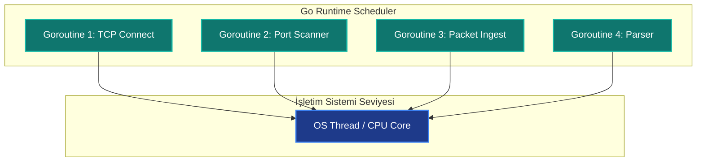

# Hackerlar İçin Go (Golang) ile Ofansif Geliştirme

Siber güvenlik araçları geliştirmek söz konusu olduğunda, dillerin sunduğu hız, taşınabilirlik ve eşzamanlılık (concurrency) kabiliyetleri belirleyici kriterlerdir. Python pratikliğiyle prototipleme için harika olsa da, büyük ölçekli ve yüksek performanslı taramalarda veya bağımlılıksız (standalone) ikili dosyalar (static binaries) oluşturma ihtiyacında yetersiz kalmaktadır. C/C++ ise yüksek performans sunmasına rağmen, bellek yönetimi zorlukları ve platformlar arası derleme (cross-compilation) karmaşıklıkları barındırır.

İşte tam bu noktada **Go (Golang)** devreye girer. Google tarafından geliştirilen bu dil, siber güvenlik araştırmacıları ve ofansif araç geliştiricileri (Red Teamer'lar) arasında hızla popülerlik kazanmıştır. Bunun en büyük sebepleri:

*   **Eşzamanlılık (Goroutines):** Go, hafif iş parçacıkları (goroutine) sayesinde binlerce ağ isteğini veya soket bağlantısını aynı anda, son derece düşük kaynak tüketimiyle yönetebilir.
*   **Taşınabilirlik (Cross-Compilation):** Windows üzerinde yazdığınız bir Go kodunu, tek bir komutla Linux veya macOS için tek parça (statically linked) çalıştırılabilir bir ikili dosya olarak derleyebilirsiniz. Hedef sistemde hiçbir kütüphane veya çalışma zamanı (runtime) bağımlılığı gerektirmez.
*   **Hız ve Bellek Güvenliği:** C'ye yakın çalışma hızına sahipken, çöp toplayıcı (garbage collector) ve güvenli bellek yönetimi sayesinde pointer hatalarından kaynaklı çökmeleri önler.

Aşağıdaki şema, Go'nun `goroutine` yapısının tek bir işletim sistemi iş parçacığı (thread) üzerinde binlerce eşzamanlı görevi nasıl koordine ettiğini göstermektedir:



---

## Basit Bir TCP Port Tarayıcı Örneği

Go dilinde soket programlamanın ne kadar sade olduğunu göstermek amacıyla hazırlanmış basit bir TCP port tarayıcı kodu:

```go
package main

import (
	"fmt"
	"net"
	"time"
)

func main() {
	target := "scanme.nmap.org"
	port := "80"

	// 2 saniyelik zaman aşımı ile TCP bağlantısı kurmayı dene
	conn, err := net.DialTimeout("tcp", target+":"+port, 2*time.Second)
	if err != nil {
		fmt.Printf("Port %s kapalı: %v\n", port, err)
		return
	}
	conn.Close()
	fmt.Printf("Port %s açık!\n", port)
}
```

---

## 📺 Ofansif Go Geliştirme Eğitim Serisi

Bu blog serisine paralel olarak hazırladığım, sıfırdan Go diliyle siber güvenlik araçları (port tarayıcılar, sub-domain bulucular, şifreleyici fidye simülatörleri ve sızma testleri için HTTP ajanları) yazmayı anlatan YouTube video serisini aşağıdan takip edebilirsiniz:

<div class="video-container" style="position: relative; padding-bottom: 56.25%; height: 0; overflow: hidden; max-width: 100%; margin: 1.5rem 0; border-radius: 12px; box-shadow: 0 4px 15px rgba(0,0,0,0.3);">
  <iframe src="https://www.youtube.com/embed/videoseries?list=PLwP4ObPL5GY_O3eEZPrBnCD8ejN17DYGq" style="position: absolute; top: 0; left: 0; width: 100%; height: 100%; border: 0;" allow="accelerometer; autoplay; clipboard-write; encrypted-media; gyroscope; picture-in-picture; web-share" allowfullscreen></iframe>
</div>

Eğitim serisine doğrudan erişmek için [Hackerlar İçin Golang Türkçe Oynatma Listesi](https://youtube.com/playlist?list=PLwP4ObPL5GY_O3eEZPrBnCD8ejN17DYGq&si=gL2JNNvpLegTM29R) bağlantısını kullanabilirsiniz.
