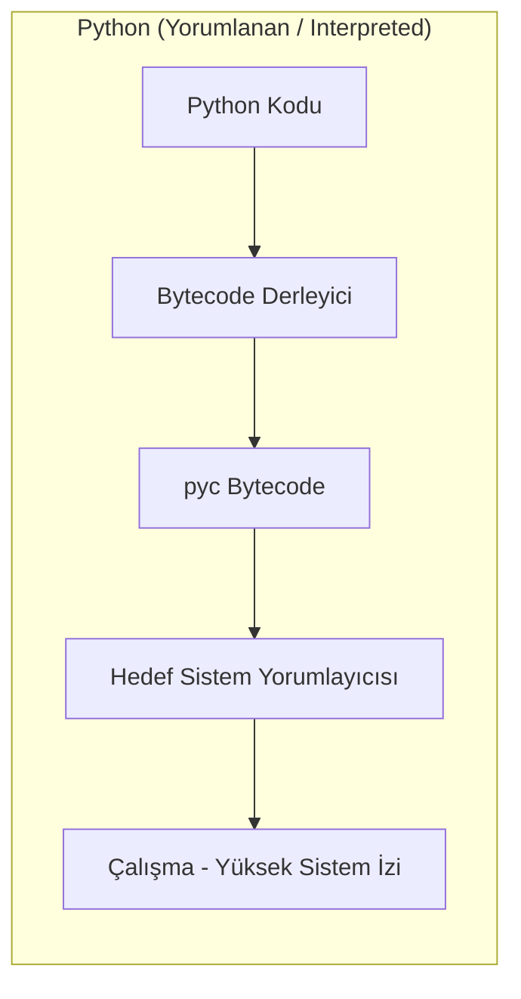
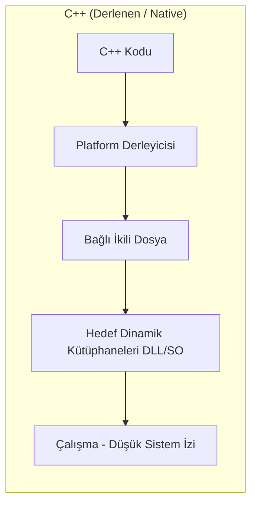
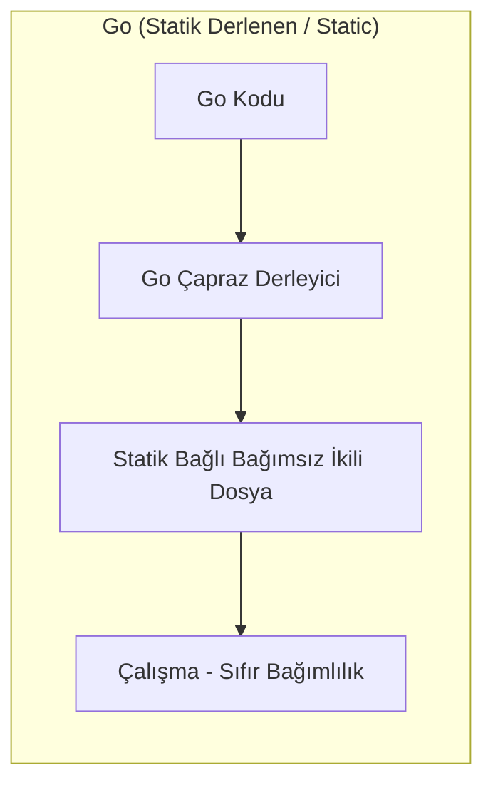
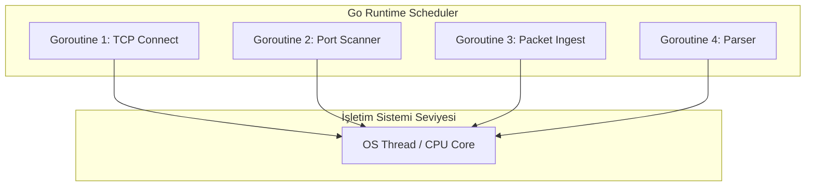

<style>
.gh-container {
  margin: 2.5rem 0;
}
.gh-grid {
  display: grid;
  grid-template-columns: repeat(auto-fit, minmax(260px, 1fr));
  gap: 1.5rem;
  margin: 1.5rem 0;
}
.gh-card {
  background: rgba(30, 41, 59, 0.45);
  border: 1px solid rgba(148, 163, 184, 0.12);
  border-radius: 14px;
  padding: 1.75rem;
  box-shadow: 0 4px 30px rgba(0, 0, 0, 0.15);
  backdrop-filter: blur(10px);
  -webkit-backdrop-filter: blur(10px);
  transition: all 0.3s cubic-bezier(0.4, 0, 0.2, 1);
  position: relative;
  overflow: hidden;
}
.gh-card:hover {
  transform: translateY(-4px);
  border-color: rgba(56, 189, 248, 0.4);
  box-shadow: 0 10px 30px rgba(56, 189, 248, 0.1);
  background: rgba(30, 41, 59, 0.6);
}
.gh-card::before {
  content: '';
  position: absolute;
  top: 0;
  left: 0;
  width: 100%;
  height: 4px;
  background: linear-gradient(90deg, #38bdf8, #818cf8);
  opacity: 0;
  transition: opacity 0.3s;
}
.gh-card:hover::before {
  opacity: 1;
}
.gh-gradient-text {
  background: linear-gradient(135deg, #38bdf8 0%, #818cf8 100%);
  -webkit-background-clip: text;
  -webkit-text-fill-color: transparent;
  font-weight: 800;
}
.gh-badge {
  background: rgba(56, 189, 248, 0.1);
  color: #38bdf8;
  border: 1px solid rgba(56, 189, 248, 0.2);
  padding: 0.25rem 0.6rem;
  border-radius: 20px;
  font-size: 0.75rem;
  font-weight: 600;
  display: inline-block;
  margin-bottom: 0.75rem;
}
.gh-btn {
  background: linear-gradient(135deg, #0284c7 0%, #4f46e5 100%);
  color: white !important;
  border: none;
  padding: 0.75rem 1.5rem;
  border-radius: 8px;
  cursor: pointer;
  font-weight: 600;
  text-decoration: none !important;
  transition: all 0.2s;
  display: inline-flex;
  align-items: center;
  gap: 0.5rem;
}
.gh-btn:hover {
  opacity: 0.95;
  transform: scale(1.02);
}
</style>

# Hackerlar İçin Golang: Modern Siber Güvenlik Mimarisi ve Ofansif Kodlama Rehberi

Siber güvenlik ve ofansif yazılım geliştirme dünyasında son yıllarda ciddi bir değişim yaşanıyor. Uzun süre boyunca sızma testi uzmanları, Red Team operatörleri ve zararlı yazılım geliştiricileri hızlı prototipleme ve otomasyon senaryoları için **Python**'ı; düşük seviyeli bellek manipülasyonu, exploit geliştirme ve işletim sistemiyle doğrudan etkileşim kurmak için ise **C/C++** dillerini tercih ettiler.

Ancak EDR, XDR ve gelişmiş SIEM gibi modern savunma mekanizmalarının gelişmesiyle birlikte, geleneksel dillerle yazılan araçlar güvenlik engellerine takılmaya başladı. İşte tam bu noktada, Google tarafından dağıtık, ölçeklenebilir ve yüksek performanslı sistemler için tasarlanan **Go (Golang)**, siber güvenlik dünyasının en çok tercih edilen dili haline geldi.

Bu rehberde, Go dilinin siber güvenlik süreçlerindeki yerini inceleyecek, diğer dillere göre yapısal avantajlarına değinecek ve pratik kod örnekleriyle ofansif kullanım senaryolarını ele alacağız.

<div class="gh-container">
  <h3 class="gh-gradient-text" style="text-align: center; margin-bottom: 1.5rem;">🎯 Bu Rehber Kimler İçin?</h3>
  <div class="gh-grid">
    <div class="gh-card">
      <div class="gh-badge" style="background: rgba(56, 189, 248, 0.1); color: #38bdf8;">Red Team / Pentester</div>
      <h4 style="margin: 0.5rem 0; font-weight: bold; color: #f1f5f9;">Sızma Testi Uzmanları</h4>
      <p style="font-size: 0.85rem; color: #94a3b8; line-height: 1.5; margin-bottom: 0;">
        Sistemlerde sıfır bağımlılıkla (standalone) çalışan, yüksek hızlı tarayıcılar ve özel araçlar geliştirmek isteyen güvenlik uzmanları.
      </p>
    </div>
    <div class="gh-card">
      <div class="gh-badge" style="background: rgba(129, 140, 248, 0.1); color: #818cf8;">Malware Dev</div>
      <h4 style="margin: 0.5rem 0; font-weight: bold; color: #f1f5f9;">Zararlı Yazılım Geliştiricileri</h4>
      <p style="font-size: 0.85rem; color: #94a3b8; line-height: 1.5; margin-bottom: 0;">
        Antivirüs ve EDR sistemlerini aşmak (evasion) amacıyla derleme parametrelerini kullanan, statik analizi zorlaştırmak ve CGO bağımlılığı olmadan yerel API çağrıları yapmak isteyen araştırmacılar.
      </p>
    </div>
    <div class="gh-card">
      <div class="gh-badge" style="background: rgba(16, 185, 129, 0.1); color: #10b981;">Blue Team / SOC</div>
      <h4 style="margin: 0.5rem 0; font-weight: bold; color: #f1f5f9;">Mavi Takım & Tehdit Avcıları</h4>
      <p style="font-size: 0.85rem; color: #94a3b8; line-height: 1.5; margin-bottom: 0;">
        Go ile yazılmış araçların runtime (çalışma zamanı) davranışlarını ve bellek yapılarını analiz ederek daha etkili savunma kuralları (YARA, Sigma vb.) yazmak isteyen savunmacılar.
      </p>
    </div>
  </div>
</div>

---

## 1. Ofansif Güvenlikte Python ve C++ Neden Yetersiz Kalıyor?

Bir dilin siber güvenlik süreçlerindeki başarısı, sunduğu esneklik ve hedef sistemde bıraktığı ayak iziyle doğrudan ilgilidir. Geleneksel dillerin çalışma zamanı ve derleme süreçlerini Go ile karşılaştıralım:







### Python'ın Karşılaştığı Zorluklar

- **Çalışma Zamanı Bağımlılığı (Runtime Dependency):** Python ile yazılmış bir aracı hedef sistemde (örneğin kısıtlı yetkilere sahip bir Windows makinesinde) çalıştırabilmek için sistemde Python yorumlayıcısının yüklü olması gerekir. `PyInstaller` gibi araçlarla exe haline getirilen programlar ise arka planda geçici dizine (`Temp`) tüm yorumlayıcıyı ve bağımlılıkları çıkartır. Bu işlem, modern EDR sistemlerinin anında alarm vermesine yol açar.
- **GIL (Global Interpreter Lock) Engeli:** Python, yapısı gereği çoklu iş parçacığı (multithreading) işlemlerinde CPU çekirdeklerini gerçek anlamda eşzamanlı olarak kullanamaz. Yüksek hız gerektiren ağ taramalarında veya kaba kuvvet (brute-force) süreçlerinde Python'ın bu yapısı performansı ciddi şekilde sınırlar.

### C/C++ ve Operasyonel Zorluklar

- **Bellek Güvenliği Riskleri:** C/C++ dilleri doğrudan donanım seviyesinde yetenekler sunsa da bellek yönetiminin (manuel `malloc`/`free`) geliştiriciye bırakılması, kararsız kodlara ve hedef sistemin çökmesine (Segmentation Fault) sebep olabilir. Sızma testlerinde hedef sunucuyu çökertmek, en çok kaçınılması gereken durumların başında gelir.
- **Çapraz Derleme (Cross-Compilation) Zorluğu:** Linux üzerinde geliştirilen bir C++ kodunu, Windows API'leriyle uyumlu olacak şekilde Windows binary'sine dönüştürmek bağımlılıklar ve kütüphaneler nedeniyle oldukça zordur.

### Go Hepsini Nasıl Çözüyor?

Go; Python'ın sunduğu **hızlı yazım ve kolay geliştirme** avantajını, C/C++ dillerinin **doğrudan makine koduna derlenme ve yüksek performans** gücüyle birleştirir. Tip güvenli (statically typed) yapısı ve yerleşik bellek yönetimi (Garbage Collector) sayesinde siber güvenlik uzmanlarının hızlı ve kararlı çalışan araçlar geliştirmesine imkan tanır.

### Karşılaştırma Tablosu

| Kriter | Python | C / C++ | Go (Golang) |
| :--- | :--- | :--- | :--- |
| **Derleme Yapısı** | Yorumlanan (Interpreted) | Derlenen (Native) | Statik Derlenen (Native & Static) |
| **Dışa Bağımlılık** | Yüksek (Yorumlayıcı ve paketler şart) | Orta (DLL / Paylaşılan kütüphaneler gerekir) | Yok (Tamamen bağımsız tek dosya) |
| **Eşzamanlılık (Concurrency)** | Kısıtlı (GIL engeli var) | Karmaşık (Thread yönetimi zor) | Mükemmel (Goroutines ve Kanallar) |
| **Çalışma Hızı** | Yavaş | Çok Hızlı | Hızlı (C seviyesine yakın) |
| **Bellek Güvenliği** | Güvenli (Garbage Collector var) | Manuel (Hatalara ve taşmalara açık) | Güvenli (Garbage Collector var) |
| **Tersine Mühendislik (Reversing)**| Kolay (Bytecode kolayca geri dönüştürülür) | Orta (Derleme ayarlarına göre değişir) | Zor (Büyük ve karmaşık çalışma yapısı) |

---

## 2. Ofansif Güvenlikte Go Dilinin Mimari Avantajları

Go'yu güvenlik alanında çalışan mühendisler ve Red Team operatörleri için çekici kılan üç ana özellik vardır:

### A. Statik Derleme ve Çapraz Derleme Gücü

Go derleyicisi, yazdığınız kodu ve kullandığınız harici kütüphaneleri tek bir bağımsız çalıştırılabilir dosya (binary) içine gömer. Hedef sistemde herhangi bir dinamik kütüphane (.dll veya .so) ya da yorumlayıcı motor bulunması gerekmez.

Ayrıca, üzerinde çalıştığınız işletim sisteminden bağımsız olarak farklı platformlar için kolayca çıktı alabilirsiniz:

```bash
# Linux makineden Windows x64 mimarisine derleme
GOOS=windows GOARCH=amd64 go build -o agent.exe main.go

# macOS üzerinden Linux ARM64 mimarisine derleme
GOOS=linux GOARCH=arm64 go build -o agent_arm main.go
```

### B. Tersine Mühendislik Sürecini Zorlaştırması

Standart C/C++ dosyaları Ghidra veya IDA Pro gibi tersine mühendislik araçlarıyla açıldığında, kütüphane çağrıları ve fonksiyon isimleri kolayca analiz edilebilir. Go'da ise bu süreç zorlaşır:
- **Büyük Dosya Yapısı:** Go ile yazılan en basit program bile kendi çalışma zamanı motorunu (Garbage Collector, Scheduler vb.) içinde barındırdığı için birkaç megabayt yer kaplar. Analiz yapacak kişi, binlerce standart fonksiyonun arasından sizin yazdığınız kodu bulmakta zorlanır.
- **pclntab Yapısı:** Go, hata durumlarında çağrı geçmişini (stack trace) gösterebilmek için dosya içerisine `pclntab` adında bir fonksiyon isim tablosu ekler. Bu özel tablo, tersine mühendislik araçlarının otomatik analiz yöntemlerini bozabilir ve statik analiz süreçlerini uzatır.

### C. Eşzamanlılık (Concurrency) Yetenekleri ve GMP Modeli

Go; işletim sisteminin ağır iş parçacıkları (OS Threads) yerine, sadece birkaç kilobaytlık başlangıç belleğiyle çalışan ve dil düzeyinde yönetilen **Goroutine** yapılarını kullanır.

Go'nun eşzamanlılık süreçlerinde bu kadar hızlı olmasının nedeni **GMP Modeli (M:N Scheduler)** adı verilen planlayıcı mimarisidir:
- **G (Goroutine):** Çalıştırılan en küçük iş birimidir. Kendi stack alanına ve durum verilerine sahiptir.
- **M (Machine):** İşletim sisteminin fiziksel iş parçacığını (OS Thread) temsil eder.
- **P (Processor):** Goroutine'leri koordine etmek için gereken mantıksal işlem kaynaklarıdır (Varsayılan olarak CPU çekirdek sayınız kadardır).

Bu model sayesinde, yüksek maliyetli OS Thread geçişleri (context switch) yerine kullanıcı katmanında son derece hızlı geçişler yapılır. Binlerce goroutine, arka plandaki iş çalma (work-stealing) algoritmalarıyla işlemci çekirdeklerine dinamik olarak paylaştırılır.

Aşağıdaki şema, Go'nun `goroutine` yapısının tek bir işletim sistemi iş parçacığı üzerinde binlerce görevi nasıl koordine ettiğini göstermektedir:



<!-- SIMULATOR WIDGET START -->
<div class="gh-card" style="margin: 2rem 0; border: 1px solid rgba(56, 189, 248, 0.25);">
  <div class="gh-badge">Canlı Simülatör</div>
  <h3 class="gh-gradient-text" style="margin-top: 0.5rem;">⚡ İnteraktif Eşzamanlılık (Goroutine) Simülatörü</h3>
  <p style="font-size: 0.9rem; color: #94a3b8;">
    Go'nun Goroutine mimarisinin geleneksel sistem iş parçacıklarına kıyasla bellek tüketimi ve planlama farkını simüle edin.
  </p>
  
  <div style="display: flex; flex-wrap: wrap; gap: 1.5rem; margin: 1.5rem 0;">
    <div style="flex: 1; min-width: 200px;">
      <label style="display: block; font-size: 0.8rem; color: #64748b; margin-bottom: 0.5rem; font-weight: 600;">Eşzamanlı Görev Sayısı</label>
      <input type="range" id="sim-tasks" min="100" max="10000" step="100" value="2000" style="width: 100%; accent-color: #38bdf8;">
      <div style="display: flex; justify-content: space-between; font-size: 0.8rem; margin-top: 0.25rem;">
        <span style="color: #475569;">100</span>
        <span id="sim-tasks-val" style="font-weight: bold; color: #38bdf8;">2000</span>
        <span style="color: #475569;">10,000</span>
      </div>
    </div>
    
    <div style="flex: 1; min-width: 200px;">
      <label style="display: block; font-size: 0.8rem; color: #64748b; margin-bottom: 0.5rem; font-weight: 600;">İşletim Sistemi Çekirdek Limiti</label>
      <input type="range" id="sim-threads" min="1" max="16" step="1" value="4" style="width: 100%; accent-color: #818cf8;">
      <div style="display: flex; justify-content: space-between; font-size: 0.8rem; margin-top: 0.25rem;">
        <span style="color: #475569;">1 Çekirdek</span>
        <span id="sim-threads-val" style="font-weight: bold; color: #818cf8;">4 Çekirdek</span>
        <span style="color: #475569;">16 Çekirdek</span>
      </div>
    </div>
  </div>
  
  <div style="margin-bottom: 1.5rem;">
    <button class="gh-btn" id="start-sim-btn" onclick="runSimulation()">
      🚀 Simülasyonu Çalıştır
    </button>
  </div>
  
  <div style="background: rgba(15, 23, 42, 0.6); padding: 1.25rem; border-radius: 10px; font-family: monospace; font-size: 0.85rem; border: 1px solid rgba(148, 163, 184, 0.08);">
    <div style="display: flex; justify-content: space-between; margin-bottom: 0.6rem; border-bottom: 1px solid rgba(148,163,184,0.05); padding-bottom: 0.5rem;">
      <span style="color: #94a3b8;">Go Runtime (Goroutines) Bellek:</span>
      <span id="go-mem-val" style="color: #4ade80; font-weight: bold;">0 KB</span>
    </div>
    <div style="display: flex; justify-content: space-between; margin-bottom: 0.6rem; border-bottom: 1px solid rgba(148,163,184,0.05); padding-bottom: 0.5rem;">
      <span style="color: #94a3b8;">Geleneksel Diller (OS Threads) Bellek:</span>
      <span id="trad-mem-val" style="color: #f87171; font-weight: bold;">0 KB</span>
    </div>
    <div style="display: flex; justify-content: space-between; align-items: center;">
      <span style="color: #94a3b8;">Simülasyon Durumu:</span>
      <span id="sim-status" style="color: #e2e8f0; font-weight: 600;">Hazır</span>
    </div>
    <div id="sim-progress-container" style="width: 100%; background: #1e293b; height: 10px; border-radius: 5px; margin-top: 1rem; overflow: hidden; display: none; border: 1px solid rgba(255,255,255,0.05);">
      <div id="sim-progress-bar" style="background: linear-gradient(90deg, #38bdf8, #818cf8); height: 100%; width: 0%; transition: width 0.05s;"></div>
    </div>
  </div>
</div>

<script>
  (function() {
    const tasksInput = document.getElementById('sim-tasks');
    const tasksVal = document.getElementById('sim-tasks-val');
    const threadsInput = document.getElementById('sim-threads');
    const threadsVal = document.getElementById('sim-threads-val');

    function updateMemoryEstimates() {
      const tasks = parseInt(tasksInput.value);
      // Go Goroutines start at ~2.048 KB
      const goMem = tasks * 2.048;
      // Traditional OS Threads (C++, Java, Python ThreadPools) default to ~1024 KB stack size
      const tradMem = tasks * 1024;
      
      document.getElementById('go-mem-val').textContent = goMem >= 1024 ? (goMem/1024).toFixed(2) + " MB" : goMem.toFixed(0) + " KB";
      document.getElementById('trad-mem-val').textContent = (tradMem/1024).toFixed(0) + " MB";
    }

    tasksInput.addEventListener('input', (e) => {
      tasksVal.textContent = parseInt(e.target.value).toLocaleString();
      updateMemoryEstimates();
    });
    threadsInput.addEventListener('input', (e) => {
      threadsVal.textContent = e.target.value + " Çekirdek";
      updateMemoryEstimates();
    });

    updateMemoryEstimates();

    window.runSimulation = function() {
      const btn = document.getElementById('start-sim-btn');
      const status = document.getElementById('sim-status');
      const pContainer = document.getElementById('sim-progress-container');
      const pBar = document.getElementById('sim-progress-bar');
      const tasks = parseInt(tasksInput.value);
      
      btn.disabled = true;
      btn.style.opacity = '0.5';
      pContainer.style.display = 'block';
      pBar.style.width = '0%';
      status.textContent = 'Goroutine\'ler havuzda asenkron dağıtılıyor...';
      
      let width = 0;
      const interval = setInterval(() => {
        width += 2;
        pBar.style.width = width + '%';
        status.textContent = `Tarama Aktif / Görevler Dağıtılıyor (${Math.floor(width * (tasks/100))}/${tasks})`;
        
        if (width >= 100) {
          clearInterval(interval);
          status.textContent = `Tamamlandı! Go ${tasks} görevi 0.03s içinde tamamladı. Bellek Tasarrufu: ~${~~((tasks * 1022)/1024)} MB!`;
          btn.disabled = false;
          btn.style.opacity = '1';
        }
      }, 30);
    }
  })();
</script>
<!-- SIMULATOR WIDGET END -->

#### Uygulama: Yüksek Hızlı Eşzamanlı Port Tarayıcı

Aşağıdaki örnek, Go'nun `sync.WaitGroup` ve kanallar (`channels`) yapısını kullanarak portların nasıl asenkron olarak taranabileceğini göstermektedir. Kodun bu halinde, her tarama işlemi anonim bir fonksiyon içinde çalıştırılarak kaynakların kapatılması (`defer conn.Close()`) ve sayaçların güncellenmesi (`defer wg.Done()`) daha güvenli bir yapıda kurulmuştur:

```go
package main

import (
	"fmt"
	"net"
	"sync"
	"time"
)

// worker fonksiyonu, kanaldan gelen portları alır ve tarar
func worker(ports chan int, wg *sync.WaitGroup, host string) {
	for p := range ports {
		// Her port tarama adımını anonim bir fonksiyon içinde çalıştırarak
		// defer işlemlerinin döngü bitmeden çalışmasını sağlıyoruz.
		func() {
			defer wg.Done()
			address := fmt.Sprintf("%s:%d", host, p)
			
			// 2 saniyelik zaman aşımı ile TCP bağlantısı dener
			conn, err := net.DialTimeout("tcp", address, 2*time.Second)
			if err != nil {
				// Port kapalı veya erişilemez
				return
			}
			defer conn.Close()
			
			fmt.Printf("[+] Port Açık: %d\n", p)
		}()
	}
}

func main() {
	host := "scanme.nmap.org"
	ports := make(chan int, 100) // Buffer'lı kanal tanımı
	var wg sync.WaitGroup

	// Havuzda 10 adet işçi (worker) goroutine başlatıyoruz
	for i := 0; i < 10; i++ {
		go worker(ports, &wg, host)
	}

	// 1 ile 1024 arasındaki portları kanala gönderiyoruz
	for i := 1; i <= 1024; i++ {
		wg.Add(1)
		ports <- i
	}

	wg.Wait()
	close(ports)
	fmt.Println("[*] Tarama işlemi tamamlandı.")
}
```

---

## 3. Sektör Standardı Haline Gelmiş Go Tabanlı Güvenlik Araçları

Teorik üstünlüğün ötesinde, bugün siber güvenlik endüstrisinin en kritik araçları Go ile sıfırdan inşa edilmektedir.

<!-- TOOLS GRID START -->
<div class="gh-grid">
  <div class="gh-card">
    <div class="gh-badge">C2 Framework</div>
    <h4 style="margin: 0.5rem 0; font-weight: bold; color: #f1f5f9;">🛸 Bishop Fox - Sliver C2</h4>
    <p style="font-size: 0.85rem; color: #94a3b8; line-height: 1.5; margin-bottom: 0;">
      Cobalt Strike'a güçlü ve açık kaynaklı bir alternatif. mTLS, WireGuard, HTTP(S) ve DNS tünelleme kullanarak eylemci (implant) yönetimini sağlar.
    </p>
  </div>

  <div class="gh-card">
    <div class="gh-badge">Paket Analiz / AD</div>
    <h4 style="margin: 0.5rem 0; font-weight: bold; color: #f1f5f9;">📦 Mandiant - gopacket</h4>
    <p style="font-size: 0.85rem; color: #94a3b8; line-height: 1.5; margin-bottom: 0;">
      Python'daki Impacket kütüphanesinin Go üzerindeki karşılığıdır. Ağ paketlerinin analiz edilmesi, SMB/RPC paket yönetimi ve Active Directory operasyonları için sıklıkla tercih edilir.
    </p>
  </div>

  <div class="gh-card">
    <div class="gh-badge">Exploit Framework</div>
    <h4 style="margin: 0.5rem 0; font-weight: bold; color: #f1f5f9;">⚙️ VulnCheck - go-exploit</h4>
    <p style="font-size: 0.85rem; color: #94a3b8; line-height: 1.5; margin-bottom: 0;">
      Exploit geliştirme süreçlerini standartlaştırmak, kararlı ve platformlar arası taşınabilir exploit kodları yazmak amacıyla oluşturulmuş bir altyapıdır.
    </p>
  </div>

  <div class="gh-card">
    <div class="gh-badge">Recon / Web</div>
    <h4 style="margin: 0.5rem 0; font-weight: bold; color: #f1f5f9;">🔍 Gobuster / FFUF</h4>
    <p style="font-size: 0.85rem; color: #94a3b8; line-height: 1.5; margin-bottom: 0;">
      Web dizinleri, gizli sayfalar ve subdomain keşifleri için kullanılan yüksek hızlı fuzzer ve kaba kuvvet (brute-force) araçları.
    </p>
  </div>
</div>
<!-- TOOLS GRID END -->

---

## 4. Savunma Atlatma (Evasion) ve Derleme Teknikleri

Bir sızma testi simülasyonunda veya Red Team operasyonunda, üretilen Go binary dosyasının boyutu ve antivirüs/EDR çözümleri tarafından analiz edilebilirliği kritik önem taşır. Go, derleme aşamasında boyutu küçültmek ve analizi zorlaştırmak için çeşitli parametreler sunar.

### Derleme Parametreleri ve Optimizasyon

Varsayılan ayarlarla derlenen Go dosyaları, hata ayıklama sembollerini (debugging symbols) ve DWARF tablolarını da içine ekler. Bu durum hem dosya boyutunu büyütür hem de statik analiz yapan güvenlik motorlarının (örneğin YARA kurallarının) dosyayı kolayca analiz etmesine imkan tanır.

<!-- COMPILER BUILDER WIDGET START -->
<div class="gh-card" style="margin: 2rem 0; border: 1px solid rgba(129, 140, 248, 0.25);">
  <div class="gh-badge" style="background: rgba(129, 140, 248, 0.1); color: #818cf8; border-color: rgba(129, 140, 248, 0.2);">İnteraktif Araç</div>
  <h3 class="gh-gradient-text" style="margin-top: 0.5rem;">🛠️ Ofansif Derleme Komutu Oluşturucu</h3>
  <p style="font-size: 0.9rem; color: #94a3b8; margin-bottom: 1.5rem;">
    Evasion (atlatma) ve boyut optimizasyonu odaklı Go derleme komutunuzu görsel olarak oluşturun ve kopyalayın.
  </p>
  
  <div style="display: grid; grid-template-columns: repeat(auto-fit, minmax(180px, 1fr)); gap: 1rem; margin-bottom: 1.5rem;">
    <div>
      <label style="display: block; font-size: 0.8rem; color: #64748b; margin-bottom: 0.5rem; font-weight: 600;">Hedef OS (GOOS)</label>
      <select id="builder-os" onchange="generateCommand()" style="width: 100%; background: #0f172a; color: #f1f5f9; border: 1px solid #334155; padding: 0.6rem; border-radius: 8px; font-size: 0.85rem;">
        <option value="windows">Windows (.exe)</option>
        <option value="linux">Linux (ELF)</option>
        <option value="darwin">macOS (Mach-O)</option>
      </select>
    </div>
    
    <div>
      <label style="display: block; font-size: 0.8rem; color: #64748b; margin-bottom: 0.5rem; font-weight: 600;">Hedef Mimari (GOARCH)</label>
      <select id="builder-arch" onchange="generateCommand()" style="width: 100%; background: #0f172a; color: #f1f5f9; border: 1px solid #334155; padding: 0.6rem; border-radius: 8px; font-size: 0.85rem;">
        <option value="amd64">amd64 (64-bit)</option>
        <option value="386">386 (32-bit)</option>
        <option value="arm64">arm64 (ARM 64-bit)</option>
      </select>
    </div>
  </div>
  
  <div style="display: flex; flex-direction: column; gap: 0.75rem; margin-bottom: 1.5rem;">
    <label style="display: flex; align-items: center; gap: 0.6rem; font-size: 0.85rem; color: #cbd5e1; cursor: pointer;">
      <input type="checkbox" id="builder-cgo" onchange="generateCommand()" checked style="width: 16px; height: 16px; accent-color: #38bdf8;">
      CGO'yu Devre Dışı Bırak (<code style="color:#e2e8f0; background:rgba(255,255,255,0.05); padding:1px 4px; border-radius:4px;">CGO_ENABLED=0</code>) - Tam bağımsız derleme
    </label>
    <label style="display: flex; align-items: center; gap: 0.6rem; font-size: 0.85rem; color: #cbd5e1; cursor: pointer;">
      <input type="checkbox" id="builder-strip" onchange="generateCommand()" checked style="width: 16px; height: 16px; accent-color: #38bdf8;">
      Hata Ayıklama Sembollerini Sil (<code style="color:#e2e8f0; background:rgba(255,255,255,0.05); padding:1px 4px; border-radius:4px;">-ldflags="-s -w"</code>) - Evasion / Boyut düşürme
    </label>
    <label style="display: flex; align-items: center; gap: 0.6rem; font-size: 0.85rem; color: #cbd5e1; cursor: pointer;">
      <input type="checkbox" id="builder-trim" onchange="generateCommand()" checked style="width: 16px; height: 16px; accent-color: #38bdf8;">
      Geliştirici Dosya Yollarını Gizle (<code style="color:#e2e8f0; background:rgba(255,255,255,0.05); padding:1px 4px; border-radius:4px;">-trimpath</code>) - Mavi Takım analizi zorlaştırma
    </label>
  </div>
  
  <div style="background: #090d16; padding: 1.25rem; border-radius: 8px; border: 1px solid #1e293b; position: relative;">
    <code id="builder-output" style="color: #38bdf8; font-family: monospace; font-size: 0.85rem; display: block; word-break: break-all; padding-right: 90px; line-height: 1.4;">env CGO_ENABLED=0 GOOS=windows GOARCH=amd64 go build -trimpath -ldflags="-s -w" -o agent.exe main.go</code>
    <button onclick="copyBuilderCommand()" style="position: absolute; right: 0.75rem; top: 50%; transform: translateY(-50%); background: #1e293b; color: #94a3b8; border: 1px solid #334155; padding: 0.4rem 0.8rem; border-radius: 6px; font-size: 0.75rem; cursor: pointer; transition: all 0.2s; font-weight: 600;">Kopyala</button>
  </div>
  <div id="copy-toast" style="color: #4ade80; font-size: 0.8rem; margin-top: 0.6rem; display: none; font-weight: 600;">✓ Komut panoya kopyalandı!</div>
</div>

<script>
  (function() {
    window.generateCommand = function() {
      const os = document.getElementById('builder-os').value;
      const arch = document.getElementById('builder-arch').value;
      const cgo = document.getElementById('builder-cgo').checked;
      const strip = document.getElementById('builder-strip').checked;
      const trim = document.getElementById('builder-trim').checked;
      
      let env = [];
      if (cgo) env.push('CGO_ENABLED=0');
      env.push(`GOOS=${os}`);
      env.push(`GOARCH=${arch}`);
      
      let buildCmd = 'go build';
      if (trim) buildCmd += ' -trimpath';
      if (strip) buildCmd += ' -ldflags="-s -w"';
      
      const ext = os === 'windows' ? '.exe' : '';
      buildCmd += ` -o agent${ext} main.go`;
      
      const output = `env ${env.join(' ')} ${buildCmd}`;
      document.getElementById('builder-output').textContent = output;
    }

    window.copyBuilderCommand = function() {
      const text = document.getElementById('builder-output').textContent;
      navigator.clipboard.writeText(text).then(() => {
        const toast = document.getElementById('copy-toast');
        toast.style.display = 'block';
        setTimeout(() => {
          toast.style.display = 'none';
        }, 2000);
      });
    }
  })();
</script>
<!-- COMPILER BUILDER WIDGET END -->

- **`CGO_ENABLED=0`:** Go'nun harici C kütüphanelerine olan bağımlılığını keser. Böylece derlenen dosya, hedef sistemdeki dinamik kütüphanelere ihtiyaç duymadan tamamen bağımsız çalışabilir.
- **`-ldflags="-s -w"`:**
  - `-s`: Hata ayıklama sembol tablosunu (symbol table) silerek fonksiyon isimleri ve adres eşleştirmelerini yok eder.
  - `-w`: DWARF hata ayıklama bilgilerini temizler. Bu parametre, dosya boyutunu yaklaşık %40 oranında küçültür.
- **`-trimpath`:** Kodun derlendiği bilgisayardaki dosya yollarını (Örneğin: `/home/user/proje/main.go`) temizler. Analistlerin geliştirici bilgisayarına dair bilgi edinmesini engeller.

### Windows API ve Sistem Çağrıları (Syscalls)

Ofansif araç geliştirirken CGO kapalı olsa dahi Go'nun yerleşik `"syscall"` ve `"golang.org/x/sys/windows"` paketleri kullanılarak Windows API'leri tetiklenebilir. Çalışma zamanında DLL dosyalarını dinamik olarak yükleyip ilgili fonksiyon adreslerini çağırmak, statik import tablolarını temiz tutarak imza tabanlı tespitlerden kaçınmayı kolaylaştırır:

```go
package main

import (
	"syscall"
	"unsafe"
)

func main() {
	// DLL çalışma zamanında yüklenir
	kernel32 := syscall.NewLazyDLL("kernel32.dll")
	// İlgili fonksiyon çözümlenir
	virtualAlloc := kernel32.NewProc("VirtualAlloc")

	// Fonksiyon çağrısı CGO bağımlılığı olmadan doğrudan gerçekleştirilir
	addr, _, _ := virtualAlloc.Call(
		0,
		2048, // Boyut
		0x3000, // MEM_COMMIT | MEM_RESERVE
		0x40,   // PAGE_EXECUTE_READWRITE
	)
	
	_ = addr
}
```

Bu sürecin bir adım ilerisi ise **Direct Syscalls (Doğrudan Sistem Çağrıları)** yöntemidir. Go, assembly (`.s`) dosyalarını doğrudan derleyebildiği için, EDR sistemlerinin kullanıcı katmanındaki API kancalarını (API hooking) atlatmak amacıyla sistem çağrı numaralarını doğrudan assembly seviyesinde tetikleyerek çekirdek (kernel) moduna geçiş yapabilir.

### Garble ile Kod Obfuscation (Karartma)

Go derleyicisi varsayılan olarak paket isimlerini ve fonksiyon adlarını dosya içerisine ekler. Bu durum, `go-resym` veya Ghidra gibi araçlarla dosyanın yapısının saniyeler içinde analiz edilmesini kolaylaştırır.

Güvenlik araştırmacıları, statik analizi zorlaştırmak ve imza tabanlı tespitleri engellemek için açık kaynaklı **[Garble](https://github.com/burrowers/garble)** aracını kullanırlar. Garble derleme sürecinde şunları yapar:
1. **İsimleri Karıştırır:** Fonksiyon ve paket isimlerini anlamsız karakter dizileriyle değiştirir.
2. **String İfadeleri Şifreler:** Kod içindeki metinleri (IP, URL, API anahtarı vb.) şifrelenmiş olarak saklar ve sadece çalışma zamanında çözülmesini sağlar.
3. **Hata Ayıklama Verilerini Siler:** DWARF ve debug verilerini tamamen kazır.

Kullanımı oldukça pratiktir:

```bash
# Go yerine garble kullanarak evasion odaklı derleme
garble -literals -tiny build -ldflags="-s -w" -trimpath -o agent.exe main.go
```

---

## 5. Uygulamalı Eğitim ve Geliştirme Kaynakları

"Golang for Hackers" konseptinde derinleşmek ve kendi ofansif/defansif araçlarınızı geliştirmek için takip edebileceğiniz nitelikli kaynak hiyerarşisi şu şekildedir:

### Temel Literatür ve Kitaplar

<!-- BOOKS GRID START -->
<div class="gh-grid">
  <div class="gh-card">
    <div class="gh-badge">Temel Başvuru</div>
    <h4 style="margin: 0.5rem 0; font-weight: bold; color: #f1f5f9;">📖 Black Hat Go</h4>
    <p style="font-size: 0.85rem; color: #94a3b8; line-height: 1.5; margin-bottom: 0;">
      No Starch Press tarafından basılan, Go diliyle siber güvenlik araçları, exploitler ve ağ tarayıcıları yazmayı öğreten en popüler başvuru kitabıdır.
    </p>
  </div>

  <div class="gh-card">
    <div class="gh-badge">Ofansif Programlama</div>
    <h4 style="margin: 0.5rem 0; font-weight: bold; color: #f1f5f9;">📖 Go Programming for Hackers</h4>
    <p style="font-size: 0.85rem; color: #94a3b8; line-height: 1.5; margin-bottom: 0;">
      Ofansif araç geliştirme süreçlerine ve sızma testi betiklerine odaklanan, pratik örnekler içeren bir kılavuzdur.
    </p>
  </div>

  <div class="gh-card">
    <div class="gh-badge">Pratik El Kitabı</div>
    <h4 style="margin: 0.5rem 0; font-weight: bold; color: #f1f5f9;">📖 Black Hat Go Manual (BHGM)</h4>
    <p style="font-size: 0.85rem; color: #94a3b8; line-height: 1.5; margin-bottom: 0;">
      Teorik bilgileri pratik laboratuvar ortamlarıyla birleştiren, hızlı kod referansları ve ipuçları sunan el kitabıdır.
    </p>
  </div>
</div>
<!-- BOOKS GRID END -->

### Video ve Canlı Laboratuvar Serileri

<!-- VIDEOS GRID START -->
<div class="gh-grid">
  <div class="gh-card" style="border-left: 4px solid #e11d48; background: rgba(225, 29, 72, 0.03);">
    <div class="gh-badge" style="background: rgba(225, 29, 72, 0.1); color: #f43f5e; border-color: rgba(225, 29, 72, 0.2);">Video Seri (TR)</div>
    <h4 style="margin: 0.5rem 0; font-weight: bold; color: #f1f5f9;">🔴 Mehmet İnce - Golang For Hackers</h4>
    <p style="font-size: 0.85rem; color: #94a3b8; line-height: 1.5; margin-bottom: 1rem;">
      YouTube ve Twitch üzerinde yayınlanan, sıfırdan ileri seviyeye kadar Go ile gerçekçi araçların (örneğin LDAP enjektörleri) nasıl yazıldığını gösteren en kapsamlı Türkçe video serisi.
    </p>
    <a href="https://youtube.com/playlist?list=PLwP4ObPL5GY_O3eEZPrBnCD8ejN17DYGq" target="_blank" class="gh-btn" style="background: linear-gradient(135deg, #e11d48 0%, #be123c 100%);">
      ▶ Playlist'i İzle
    </a>
  </div>

  <div class="gh-card" style="border-left: 4px solid #3b82f6; background: rgba(59, 130, 246, 0.03);">
    <div class="gh-badge" style="background: rgba(59, 130, 246, 0.1); color: #60a5fa; border-color: rgba(59, 130, 246, 0.2);">Video Seri (EN)</div>
    <h4 style="margin: 0.5rem 0; font-weight: bold; color: #f1f5f9;">🔵 IppSec - Golang for Hackers</h4>
    <p style="font-size: 0.85rem; color: #94a3b8; line-height: 1.5; margin-bottom: 1rem;">
      Hack The Box çözümleriyle bilinen IppSec'in, Go dilini otomasyon süreçlerinde, tarayıcılarda ve sızma testlerinde nasıl kullandığını anlatan İngilizce eğitim serisi.
    </p>
    <a href="https://youtube.com/playlist?list=PLidcsTyj9JXJ74wLAJDC10JiUPV568hcp" target="_blank" class="gh-btn" style="background: linear-gradient(135deg, #2563eb 0%, #1d4ed8 100%);">
      ▶ Watch Playlist
    </a>
  </div>
</div>
<!-- VIDEOS GRID END -->

---

## 6. Sonuç

Siber güvenlik alanında Go dilinin bu kadar öne çıkması geçici bir popülerlikten ibaret değil; savunma sistemlerinin gelişmesine karşı ortaya çıkan **mühendislik ihtiyaçlarının doğal bir sonucudur**.

Tek bir dosyada toplanan, yüksek hızda eşzamanlı iş yapabilen ve kolayca her işletim sistemi için derlenebilen bu dil, modern siber operasyonlarda standart haline gelmiştir.

Bugün gelinen noktada sadece Red Team ekiplerinin değil; tehdit avcılığı, tersine mühendislik ve SOC analizi yapan Blue Team uzmanlarının da Go dilinin çalışma prensiplerini ve derleme yapılarını bilmesi gerekir. Karşı tarafın kullandığı araçların çalışma mantığını anlamadan sağlam bir savunma hattı kurmak mümkün değildir.

---

## 📺 Ofansif Go Geliştirme Eğitim Serisi

Go diliyle siber güvenlik araçları (port tarayıcılar, subdomain bulucular, ağ araçları vb.) geliştirmeyi anlatan Türkçe YouTube serisine aşağıdan göz atabilirsiniz:

<div class="video-container" style="position: relative; padding-bottom: 56.25%; height: 0; overflow: hidden; max-width: 100%; margin: 1.5rem 0; border-radius: 12px; box-shadow: 0 4px 15px rgba(0,0,0,0.3);">
  <iframe src="https://www.youtube.com/embed/videoseries?list=PLwP4ObPL5GY_O3eEZPrBnCD8ejN17DYGq" style="position: absolute; top: 0; left: 0; width: 100%; height: 100%; border: 0;" allow="accelerometer; autoplay; clipboard-write; encrypted-media; gyroscope; picture-in-picture; web-share" allowfullscreen></iframe>
</div>

Seriye doğrudan erişmek için [Hackerlar İçin Golang Türkçe Oynatma Listesi](https://youtube.com/playlist?list=PLwP4ObPL5GY_O3eEZPrBnCD8ejN17DYGq&si=gL2JNNvpLegTM29R) bağlantısını kullanabilirsiniz.
