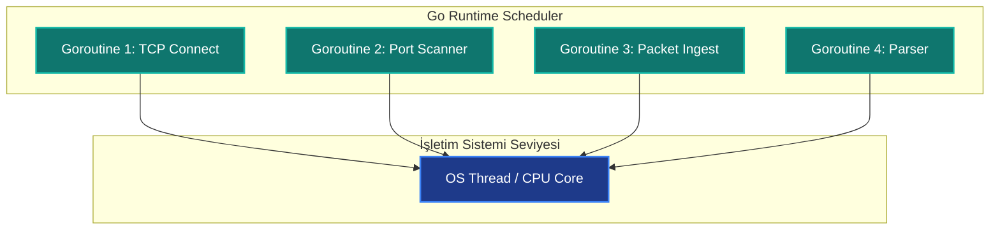

<style>
.gh-container {
  margin: 2.5rem 0;
}
.gh-grid {
  display: grid;
  grid-template-columns: repeat(auto-fit, minmax(260px, 1fr));
  gap: 1.5rem;
  margin: 1.5rem 0;
}
.gh-card {
  background: rgba(30, 41, 59, 0.45);
  border: 1px solid rgba(148, 163, 184, 0.12);
  border-radius: 14px;
  padding: 1.75rem;
  box-shadow: 0 4px 30px rgba(0, 0, 0, 0.15);
  backdrop-filter: blur(10px);
  -webkit-backdrop-filter: blur(10px);
  transition: all 0.3s cubic-bezier(0.4, 0, 0.2, 1);
  position: relative;
  overflow: hidden;
}
.gh-card:hover {
  transform: translateY(-4px);
  border-color: rgba(56, 189, 248, 0.4);
  box-shadow: 0 10px 30px rgba(56, 189, 248, 0.1);
  background: rgba(30, 41, 59, 0.6);
}
.gh-card::before {
  content: '';
  position: absolute;
  top: 0;
  left: 0;
  width: 100%;
  height: 4px;
  background: linear-gradient(90deg, #38bdf8, #818cf8);
  opacity: 0;
  transition: opacity 0.3s;
}
.gh-card:hover::before {
  opacity: 1;
}
.gh-gradient-text {
  background: linear-gradient(135deg, #38bdf8 0%, #818cf8 100%);
  -webkit-background-clip: text;
  -webkit-text-fill-color: transparent;
  font-weight: 800;
}
.gh-badge {
  background: rgba(56, 189, 248, 0.1);
  color: #38bdf8;
  border: 1px solid rgba(56, 189, 248, 0.2);
  padding: 0.25rem 0.6rem;
  border-radius: 20px;
  font-size: 0.75rem;
  font-weight: 600;
  display: inline-block;
  margin-bottom: 0.75rem;
}
.gh-btn {
  background: linear-gradient(135deg, #0284c7 0%, #4f46e5 100%);
  color: white !important;
  border: none;
  padding: 0.75rem 1.5rem;
  border-radius: 8px;
  cursor: pointer;
  font-weight: 600;
  text-decoration: none !important;
  transition: all 0.2s;
  display: inline-flex;
  align-items: center;
  gap: 0.5rem;
}
.gh-btn:hover {
  opacity: 0.95;
  transform: scale(1.02);
}
</style>

# Golang for Hackers: Modern Siber Güvenlik Mimarisi ve Ofansif Kodlama Rehberi

Siber güvenlik ve ofansif yazılım geliştirme dünyası, köklü bir paradigma değişimine sahne oluyor. Uzun yıllar boyunca sızma testi uzmanları, Red Team operatörleri ve siber tehdit aktörleri hızlı prototipleme ve otomasyon senaryoları için **Python**'a; düşük seviyeli bellek manipülasyonu, exploit geliştirme ve işletim sistemi çekirdeği ile doğrudan etkileşim için ise **C/C++** dillerine bağımlı kaldılar.

Ancak modern kurumsal savunma mekanizmalarının (EDR, XDR ve gelişmiş SIEM çözümleri) evrilmesi, geleneksel dillerle yazılmış araçların operasyonel sınırlarını zorlamaya başladı. İşte bu noktada, Google tarafından dağıtık, ölçeklenebilir ve yüksek performanslı sistemler için tasarlanan **Go (Golang)**, ofansif güvenlik dünyasının yeni gözdesi haline geldi.

Bu rehber yazıda, Go dilinin siber güvenlik mimarisindeki stratejik konumunu kavramsal yönleriyle ele alacak, geleneksel dillerle olan yapısal farklarını inceleyecek ve pratik kod örnekleriyle modern taktikleri masaya yatıracağız.

<div class="gh-container">
  <h3 class="gh-gradient-text" style="text-align: center; margin-bottom: 1.5rem;">🎯 Bu Rehber Kimler İçin?</h3>
  <div class="gh-grid">
    <div class="gh-card">
      <div class="gh-badge" style="background: rgba(56, 189, 248, 0.1); color: #38bdf8;">Red Team / Pentester</div>
      <h4 style="margin: 0.5rem 0; font-weight: bold; color: #f1f5f9;">Sızma Testi Uzmanları</h4>
      <p style="font-size: 0.85rem; color: #94a3b8; line-height: 1.5; margin-bottom: 0;">
        Erişim engellerini aşan, yüksek hızlı tarayıcılar ve kurumsal sistemler üzerinde sıfır bağımlılıkla çalışan taşınabilir araçlar geliştirmek isteyenler.
      </p>
    </div>
    <div class="gh-card">
      <div class="gh-badge" style="background: rgba(129, 140, 248, 0.1); color: #818cf8;">Malware Dev</div>
      <h4 style="margin: 0.5rem 0; font-weight: bold; color: #f1f5f9;">Zararlı Yazılım Geliştiricileri</h4>
      <p style="font-size: 0.85rem; color: #94a3b8; line-height: 1.5; margin-bottom: 0;">
        AV/EDR sistemlerini atlatmak için derleme bayraklarını (compiler flags), statik analizi zorlaştıran mimarileri ve CGO gerektirmeyen düşük seviyeli API çağrılarını incelemek isteyen araştırmacılar.
      </p>
    </div>
    <div class="gh-card">
      <div class="gh-badge" style="background: rgba(16, 185, 129, 0.1); color: #10b981;">Blue Team / SOC</div>
      <h4 style="margin: 0.5rem 0; font-weight: bold; color: #f1f5f9;">Mavi Takım & Tehdit Avcıları</h4>
      <p style="font-size: 0.85rem; color: #94a3b8; line-height: 1.5; margin-bottom: 0;">
        Go ile yazılmış zararlı yazılımların ve araçların çalışma zamanı (runtime) davranışlarını, bellek yapılarını çözerek daha etkili kurallar (YARA/Sigma) yazmak isteyen savunmacılar.
      </p>
    </div>
  </div>
</div>

---

## 1. Ofansif Güvenlik Dünyasında Paradigma Değişimi: Python ve C++ Neden Yetersiz Kalıyor?

Bir dilin siber güvenlikteki başarısı, sunduğu mimari esneklik ve hedef sistem üzerindeki ayak izi (footprint) ile doğrudan ilişkilidir. Geleneksel dillerin çalışma zamanı ve derleme adımlarını Go ile görsel olarak karşılaştıralım:

```mermaid
graph TD
    subgraph "Python (Yorumlanan / Interpreted)"
        P_Source[Python Kodu] --> P_Compiler[Bytecode Derleyici]
        P_Compiler --> P_Bytecode[pyc Bytecode]
        P_Bytecode --> P_Interpreter[Hedef Sistem Yorumlayıcısı]
        P_Interpreter --> P_Execution[Çalışma - Yüksek Sistem İzi]
    end

    subgraph "C++ (Derlenen / Native)"
        C_Source[C++ Kodu] --> C_Compiler[Platform Derleyicisi]
        C_Compiler --> C_Binary[Bağlı İkili Dosya]
        C_Binary --> C_OS[Hedef Dinamik Kütüphaneleri DLL/SO]
        C_OS --> C_Execution[Çalışma - Düşük Sistem İzi]
    end

    subgraph "Go (Statik Derlenen / Static)"
        G_Source[Go Kodu] --> G_Compiler[Go Çapraz Derleyici]
        G_Compiler --> G_Binary[Statik Bağlı Bağımsız İkili Dosya]
        G_Binary --> G_Execution[Çalışma - Sıfır Bağımlılık]
    end

    style P_Execution fill:#ef4444,stroke:#f87171,stroke-width:2px,color:#fff;
    style C_Execution fill:#f59e0b,stroke:#fbbf24,stroke-width:2px,color:#fff;
    style G_Execution fill:#10b981,stroke:#34d399,stroke-width:2px,color:#fff;
```



### Python'ın Sınırları ve Kurumsal Ağlardaki Engeller

* **Çalışma Zamanı Bağımlılığı (Interpreter Dependency):** Python ile yazılmış gelişmiş bir sızma testi aracını hedef sistemde (örneğin kısıtlı yetkilere sahip bir Windows donanımında) çalıştırabilmek için sistemde Python yorumlayıcısının yüklü olması gerekir. `PyInstaller` gibi araçlarla binary haline getirilen paketler ise aslında arka planda geçici dizine (`SST` veya `Temp`) tüm yorumlayıcıyı ve `.pyc` bağımlılıklarını açar. Bu imza tabanlı hareket, modern EDR mimarileri için doğrudan bir alarm sebebidir.
* **Global Interpreter Lock (GIL) Bariyeri:** Python, çoklu iş parçacığı (multithreading) işlemlerinde CPU çekirdeklerini gerçek anlamda eşzamanlı kullanamaz. Büyük ölçekli ağ taramalarında veya yüksek eşzamanlılık gerektiren kaba kuvvet (brute-force) saldırılarında Python mimarisi performans kısıtlamalarına takılır.

### C/C++ ve Geliştirme Maliyetleri

* **Bellek Güvenliği ve Karmaşıklık:** C/C++ dilleri düşük seviyeli erişim sunsa da, bellek yönetiminin (manüel `malloc`/`free`) tamamen geliştiriciye ait olması, operasyon sırasında kararsız koda ve sistemlerin çökmesine (Segment Fault) yol açabilir. Sızma testlerinde hedef sistemi çökertmek en son istenecek senaryodur.
* **Derleme Zorlukları (Cross-Compilation):** Linux üzerinde yazılan gelişmiş bir C++ kodunun Windows API'leri ile sorunsuz entegre edilerek derlenmesi (cross-compile) bağımlılıklar ve derleyici mimarileri yüzünden operasyonel bir kabusa dönüşebilir.

### Go'nun Çözümü

Go, Python'ın sunduğu **geliştirme kolaylığı ve hızlı sözdizimini (syntax)**, C/C++ dilinin sunduğu **doğrudan makine koduna derlenme ve yüksek performans** avantajıyla birleştirir. Tip güvenli (statically typed) ve bellek korumalı (garbage collected) yapısı, stabil ve güvenilir araçlar geliştirmeyi kolaylaştırır.

### Siber Güvenlikte Dil Karşılaştırması

Siber güvenlik operasyonlarında en çok tercih edilen üç dilin (Python, C/C++ ve Go) temel özellikleri arasındaki farklar:

| Özellik | Python | C / C++ | Go (Golang) |
| :--- | :--- | :--- | :--- |
| **Derleme Mantığı** | Yorumlanan (Interpreted) | Derlenen (Native) | Derlenen (Native Static) |
| **Bağımlılık Durumu** | Yüksek (Yorumlayıcı & Kütüphane gerekir) | Düşük/Orta (Paylaşılan kütüphaneler) | Yok (Bağımsız tek binary) |
| **Eşzamanlılık** | Kısıtlı (GIL Engeli Mevcut) | Karmaşık (İşletim sistemi thread'leri) | Mükemmel (Goroutines & Kanallar) |
| **Hız** | Yavaş | Çok Hızlı | Hızlı (C'ye yakın) |
| **Bellek Yönetimi** | Güvenli (Otomatik Garbage Collector) | Manuel (Güvensiz - Taşma riskleri) | Güvenli (Otomatik Garbage Collector) |
| **Tersine Mühendislik Zorluğu**| Kolay (Bytecode decompile edilebilir) | Orta (Semboller varsa kolay) | Zor (Büyük ve karmaşık runtime yapısı) |

---

## 2. Neden Ofansif Güvenlik İçin Go? (Temel Mimari Avantajlar)

Go'yu siber güvenlik mühendisleri ve Red Team operatörleri için vazgeçilmez kılan üç temel direk bulunmaktadır:

### A. Statik Derleme ve Taşınabilirlik (Cross-Compilation)

Go derleyicisi, yazdığınız tüm kodu ve kullandığınız harici kütüphaneleri (üçüncü parti paketler dahil) tek bir bağımsız makine kodu binary'si (standalone binary) içerisine gömer. Hedef sistemde hiçbir dinamik kütüphaneye (`.dll` veya `.so`) ya da harici bir çalışma zamanı motoruna ihtiyaç duyulmaz.

Ayrıca, tek bir komutla işletim sistemi ve mimari değiştirilebilir:

```bash
# Linux makineden Windows x64 mimarisine derleme
GOOS=windows GOARCH=amd64 go build -o agent.exe main.go

# macOS üzerinden Linux ARM64 mimarisine derleme
GOOS=linux GOARCH=arm64 go build -o agent_arm main.go
```

### B. Tersine Mühendisliği Zorlaştırması (Anti-Reversing)

Standart C/C++ binary dosyaları tersine mühendislik araçlarına (IDA Pro, Ghidra) atıldığında, dinamik kütüphane çağrıları ve fonksiyon başlıkları net bir şekilde analiz edilebilir. Ancak Go'nun iç yapısı bu süreci zorlaştırır:

* **Büyük ve Monolitik Binary Yapısı:** Go ile yazılan en basit "Hello World" programı bile dilin kendi çalışma zamanını (Garbage Collector, Scheduler vb.) içerdiği için birkaç megabayt boyutundadır. Analist, binlerce yerleşik Go fonksiyonu arasında ofansif kodu aramak zorunda kalır.
* **Metadata ve pclntab Yapısı:** Go, çalışma zamanında hata takibi (stack trace) yapabilmek için binary içerisine `pclntab` adında bir fonksiyon isim tablosu gömer. Bu tablo standart tersine mühendislik script'lerini bozabilir ve statik analizi zorlaştırır.

### C. Yüksek Performanslı Eşzamanlılık (Concurrency: Goroutines ve GMP Modeli)

Go, işletim sistemi seviyesindeki ağır iş parçacıkları (OS Threads) yerine, dil seviyesinde yönetilen ve sadece birkaç kilobaytlık bellek alanıyla başlayan **Goroutine** mimarisini kullanır. 

Go'nun bu yüksek performansı sağlamasının arkasındaki sır **GMP Modeli (M:N Scheduler)** adı verilen planlama mimarisidir:
*   **G (Goroutine):** En küçük iş birimidir. Kendi yığın (stack) alanına, program sayacına (PC) ve durum bilgilerine sahiptir.
*   **M (Machine):** İşletim sisteminin fiziksel/mantıksal iş parçacığını (OS Thread) temsil eder.
*   **P (Processor):** Goroutine'leri çalıştırmak için gerekli mantıksal kaynakları temsil eder. Sayısı varsayılan olarak CPU çekirdek sayısı kadardır (`GOMAXPROCS`).

Bu M:N planlayıcı sayesinde, milisaniyeler ve megabaytlar harcayan OS Thread context switch işlemlerinden kaçınılarak, nanosaniyeler seviyesinde çok daha hafif bir geçiş (user-space scheduling) sağlanır. Binlerce goroutine, az sayıdaki fiziksel çekirdeğe (OS Threads) dinamik olarak dağıtılır (work-stealing algoritması ile).

Aşağıdaki şema, Go'nun `goroutine` yapısının tek bir işletim sistemi iş parçacığı (thread) üzerinde binlerce eşzamanlı görevi nasıl koordine ettiğini göstermektedir:



<!-- SIMULATOR WIDGET START -->
<div class="gh-card" style="margin: 2rem 0; border: 1px solid rgba(56, 189, 248, 0.25);">
  <div class="gh-badge">Canlı Simülatör</div>
  <h3 class="gh-gradient-text" style="margin-top: 0.5rem;">⚡ İnteraktif Eşzamanlılık (Goroutine) Simülatörü</h3>
  <p style="font-size: 0.9rem; color: #94a3b8;">
    Go'nun Goroutine mimarisinin geleneksel sistem iş parçacıklarına kıyasla bellek tüketimi ve planlama farkını simüle edin.
  </p>
  
  <div style="display: flex; flex-wrap: wrap; gap: 1.5rem; margin: 1.5rem 0;">
    <div style="flex: 1; min-width: 200px;">
      <label style="display: block; font-size: 0.8rem; color: #64748b; margin-bottom: 0.5rem; font-weight: 600;">Eşzamanlı Görev Sayısı</label>
      <input type="range" id="sim-tasks" min="100" max="10000" step="100" value="2000" style="width: 100%; accent-color: #38bdf8;">
      <div style="display: flex; justify-content: space-between; font-size: 0.8rem; margin-top: 0.25rem;">
        <span style="color: #475569;">100</span>
        <span id="sim-tasks-val" style="font-weight: bold; color: #38bdf8;">2000</span>
        <span style="color: #475569;">10,000</span>
      </div>
    </div>
    
    <div style="flex: 1; min-width: 200px;">
      <label style="display: block; font-size: 0.8rem; color: #64748b; margin-bottom: 0.5rem; font-weight: 600;">İşletim Sistemi Çekirdek Limiti</label>
      <input type="range" id="sim-threads" min="1" max="16" step="1" value="4" style="width: 100%; accent-color: #818cf8;">
      <div style="display: flex; justify-content: space-between; font-size: 0.8rem; margin-top: 0.25rem;">
        <span style="color: #475569;">1 Çekirdek</span>
        <span id="sim-threads-val" style="font-weight: bold; color: #818cf8;">4 Çekirdek</span>
        <span style="color: #475569;">16 Çekirdek</span>
      </div>
    </div>
  </div>
  
  <div style="margin-bottom: 1.5rem;">
    <button class="gh-btn" id="start-sim-btn" onclick="runSimulation()">
      🚀 Simülasyonu Çalıştır
    </button>
  </div>
  
  <div style="background: rgba(15, 23, 42, 0.6); padding: 1.25rem; border-radius: 10px; font-family: monospace; font-size: 0.85rem; border: 1px solid rgba(148, 163, 184, 0.08);">
    <div style="display: flex; justify-content: space-between; margin-bottom: 0.6rem; border-bottom: 1px solid rgba(148,163,184,0.05); padding-bottom: 0.5rem;">
      <span style="color: #94a3b8;">Go Runtime (Goroutines) Bellek:</span>
      <span id="go-mem-val" style="color: #4ade80; font-weight: bold;">0 KB</span>
    </div>
    <div style="display: flex; justify-content: space-between; margin-bottom: 0.6rem; border-bottom: 1px solid rgba(148,163,184,0.05); padding-bottom: 0.5rem;">
      <span style="color: #94a3b8;">Geleneksel Diller (OS Threads) Bellek:</span>
      <span id="trad-mem-val" style="color: #f87171; font-weight: bold;">0 KB</span>
    </div>
    <div style="display: flex; justify-content: space-between; align-items: center;">
      <span style="color: #94a3b8;">Simülasyon Durumu:</span>
      <span id="sim-status" style="color: #e2e8f0; font-weight: 600;">Hazır</span>
    </div>
    <div id="sim-progress-container" style="width: 100%; background: #1e293b; height: 10px; border-radius: 5px; margin-top: 1rem; overflow: hidden; display: none; border: 1px solid rgba(255,255,255,0.05);">
      <div id="sim-progress-bar" style="background: linear-gradient(90deg, #38bdf8, #818cf8); height: 100%; width: 0%; transition: width 0.05s;"></div>
    </div>
  </div>
</div>

<script>
  (function() {
    const tasksInput = document.getElementById('sim-tasks');
    const tasksVal = document.getElementById('sim-tasks-val');
    const threadsInput = document.getElementById('sim-threads');
    const threadsVal = document.getElementById('sim-threads-val');

    function updateMemoryEstimates() {
      const tasks = parseInt(tasksInput.value);
      // Go Goroutines start at ~2.048 KB
      const goMem = tasks * 2.048;
      // Traditional OS Threads (C++, Java, Python ThreadPools) default to ~1024 KB stack size
      const tradMem = tasks * 1024;
      
      document.getElementById('go-mem-val').textContent = goMem >= 1024 ? (goMem/1024).toFixed(2) + " MB" : goMem.toFixed(0) + " KB";
      document.getElementById('trad-mem-val').textContent = (tradMem/1024).toFixed(0) + " MB";
    }

    tasksInput.addEventListener('input', (e) => {
      tasksVal.textContent = parseInt(e.target.value).toLocaleString();
      updateMemoryEstimates();
    });
    threadsInput.addEventListener('input', (e) => {
      threadsVal.textContent = e.target.value + " Çekirdek";
      updateMemoryEstimates();
    });

    updateMemoryEstimates();

    window.runSimulation = function() {
      const btn = document.getElementById('start-sim-btn');
      const status = document.getElementById('sim-status');
      const pContainer = document.getElementById('sim-progress-container');
      const pBar = document.getElementById('sim-progress-bar');
      const tasks = parseInt(tasksInput.value);
      
      btn.disabled = true;
      btn.style.opacity = '0.5';
      pContainer.style.display = 'block';
      pBar.style.width = '0%';
      status.textContent = 'Goroutine\'ler havuzda asenkron dağıtılıyor...';
      
      let width = 0;
      const interval = setInterval(() => {
        width += 2;
        pBar.style.width = width + '%';
        status.textContent = `Tarama Aktif / Görevler Dağıtılıyor (${Math.floor(width * (tasks/100))}/${tasks})`;
        
        if (width >= 100) {
          clearInterval(interval);
          status.textContent = `Tamamlandı! Go ${tasks} görevi 0.03s içinde tamamladı. Bellek Tasarrufu: ~${~~((tasks * 1022)/1024)} MB!`;
          btn.disabled = false;
          btn.style.opacity = '1';
        }
      }, 30);
    }
  })();
</script>
<!-- SIMULATOR WIDGET END -->

#### Pratik Örnek: Yüksek Hızlı Eşzamanlı Port Tarayıcı

Aşağıdaki kod bloğu, Go'nun `sync.WaitGroup` ve `channels` mekanizmasını kullanarak binlerce portu asenkron olarak nasıl tarayabildiğini göstermektedir. Kodun bu sürümünde, worker fonksiyonu içerisindeki her tarama işlemi geçici bir anonim fonksiyona alınarak `defer wg.Done()` ve `defer conn.Close()` ifadeleri daha güvenli ve idiomatik bir şekilde çağrılmıştır:

```go
package main

import (
	"fmt"
	"net"
	"sync"
	"time"
)

// worker fonksiyonu, kanaldan gelen portları alır ve tarar
func worker(ports chan int, wg *sync.WaitGroup, host string) {
	for p := range ports {
		// Her port tarama adımını anonim bir fonksiyon içinde çalıştırarak
		// defer işlemlerinin döngü bitmeden çalışmasını sağlıyoruz.
		func() {
			defer wg.Done()
			address := fmt.Sprintf("%s:%d", host, p)
			
			// 2 saniyelik zaman aşımı ile TCP bağlantısı dener
			conn, err := net.DialTimeout("tcp", address, 2*time.Second)
			if err != nil {
				// Port kapalı veya erişilemez
				return
			}
			defer conn.Close()
			
			fmt.Printf("[+] Port Açık: %d\n", p)
		}()
	}
}

func main() {
	host := "scanme.nmap.org"
	ports := make(chan int, 100) // Buffer'lı kanal tanımı
	var wg sync.WaitGroup

	// Havuzda 10 adet işçi (worker) goroutine başlatıyoruz
	for i := 0; i < 10; i++ {
		go worker(ports, &wg, host)
	}

	// 1 ile 1024 arasındaki portları kanala gönderiyoruz
	for i := 1; i <= 1024; i++ {
		wg.Add(1)
		ports <- i
	}

	wg.Wait()
	close(ports)
	fmt.Println("[*] Tarama işlemi tamamlandı.")
}
```

---

## 3. Sektör Standardı Haline Gelmiş Go Tabanlı Güvenlik Araçları

Teorik üstünlüğün ötesinde, bugün siber güvenlik endüstrisinin en kritik araçları Go ile sıfırdan inşa edilmektedir.

<!-- TOOLS GRID START -->
<div class="gh-grid">
  <div class="gh-card">
    <div class="gh-badge">C2 Framework</div>
    <h4 style="margin: 0.5rem 0; font-weight: bold; color: #f1f5f9;">🛸 Bishop Fox - Sliver C2</h4>
    <p style="font-size: 0.85rem; color: #94a3b8; line-height: 1.5; margin-bottom: 0;">
      Cobalt Strike'a güçlü ve açık kaynaklı bir alternatif. mTLS, WireGuard, HTTP(S) ve DNS tünelleme üzerinden gelişmiş implant kontrolü sunar.
    </p>
  </div>

  <div class="gh-card">
    <div class="gh-badge">Paket Analiz / AD</div>
    <h4 style="margin: 0.5rem 0; font-weight: bold; color: #f1f5f9;">📦 Mandiant - gopacket</h4>
    <p style="font-size: 0.85rem; color: #94a3b8; line-height: 1.5; margin-bottom: 0;">
      Python'ın Impacket kütüphanesinin Go'daki güçlü karşılığı. Active Directory analizi, SMB/RPC paket manipülasyonu ve relay operasyonları için tasarlanmıştır.
    </p>
  </div>

  <div class="gh-card">
    <div class="gh-badge">Exploit Framework</div>
    <h4 style="margin: 0.5rem 0; font-weight: bold; color: #f1f5f9;">⚙️ VulnCheck - go-exploit</h4>
    <p style="font-size: 0.85rem; color: #94a3b8; line-height: 1.5; margin-bottom: 0;">
      Exploit geliştiricileri için standartlaştırılmış, kararlı ve platformlar arası taşınabilir exploit kodları yazılmasını sağlayan profesyonel bir çatıdır.
    </p>
  </div>

  <div class="gh-card">
    <div class="gh-badge">Recon / Web</div>
    <h4 style="margin: 0.5rem 0; font-weight: bold; color: #f1f5f9;">🔍 Gobuster / FFUF</h4>
    <p style="font-size: 0.85rem; color: #94a3b8; line-height: 1.5; margin-bottom: 0;">
      Web dizinleri, gizli dosyalar ve alt alan adları (subdomain) tespiti için yüksek hızlı fuzzer ve kaba kuvvet (brute-force) araçları.
    </p>
  </div>
</div>
<!-- TOOLS GRID END -->

---

## 4. Gelişmiş Teknikler: Evading (Savunma Atlatma) ve Derleme Stratejileri

Bir sızma testi simülasyonunda veya Kırmızı Takım operasyonunda, yazılan Go binary'sinin boyutu ve EDR/Antivirüs sistemleri tarafından analiz edilebilirliği kritik önem taşır. Go, derleme aşamasında binary optimizasyonu ve analizi zorlaştırmak için güçlü parametreler sunar.

### Derleme Optimizasyon Flagleri

Herhangi bir optimizasyon yapılmadan derlenen Go kodları, hata ayıklama sembollerini (debugging symbols) ve DWARF tablolarını içerir. Bu durum hem dosya boyutunu büyütür hem de AV/EDR çözümlerinin statik motorlarına (YARA kuralları vb.) çok fazla veri sunar.

<!-- COMPILER BUILDER WIDGET START -->
<div class="gh-card" style="margin: 2rem 0; border: 1px solid rgba(129, 140, 248, 0.25);">
  <div class="gh-badge" style="background: rgba(129, 140, 248, 0.1); color: #818cf8; border-color: rgba(129, 140, 248, 0.2);">İnteraktif Araç</div>
  <h3 class="gh-gradient-text" style="margin-top: 0.5rem;">🛠️ Ofansif Derleme Komutu Oluşturucu</h3>
  <p style="font-size: 0.9rem; color: #94a3b8; margin-bottom: 1.5rem;">
    Evasion (atlatma) ve boyut optimizasyonu odaklı Go derleme komutunuzu görsel olarak oluşturun ve kopyalayın.
  </p>
  
  <div style="display: grid; grid-template-columns: repeat(auto-fit, minmax(180px, 1fr)); gap: 1rem; margin-bottom: 1.5rem;">
    <div>
      <label style="display: block; font-size: 0.8rem; color: #64748b; margin-bottom: 0.5rem; font-weight: 600;">Hedef OS (GOOS)</label>
      <select id="builder-os" onchange="generateCommand()" style="width: 100%; background: #0f172a; color: #f1f5f9; border: 1px solid #334155; padding: 0.6rem; border-radius: 8px; font-size: 0.85rem;">
        <option value="windows">Windows (.exe)</option>
        <option value="linux">Linux (ELF)</option>
        <option value="darwin">macOS (Mach-O)</option>
      </select>
    </div>
    
    <div>
      <label style="display: block; font-size: 0.8rem; color: #64748b; margin-bottom: 0.5rem; font-weight: 600;">Hedef Mimari (GOARCH)</label>
      <select id="builder-arch" onchange="generateCommand()" style="width: 100%; background: #0f172a; color: #f1f5f9; border: 1px solid #334155; padding: 0.6rem; border-radius: 8px; font-size: 0.85rem;">
        <option value="amd64">amd64 (64-bit)</option>
        <option value="386">386 (32-bit)</option>
        <option value="arm64">arm64 (ARM 64-bit)</option>
      </select>
    </div>
  </div>
  
  <div style="display: flex; flex-direction: column; gap: 0.75rem; margin-bottom: 1.5rem;">
    <label style="display: flex; align-items: center; gap: 0.6rem; font-size: 0.85rem; color: #cbd5e1; cursor: pointer;">
      <input type="checkbox" id="builder-cgo" onchange="generateCommand()" checked style="width: 16px; height: 16px; accent-color: #38bdf8;">
      CGO'yu Devre Dışı Bırak (<code style="color:#e2e8f0; background:rgba(255,255,255,0.05); padding:1px 4px; border-radius:4px;">CGO_ENABLED=0</code>) - Tam bağımsız derleme
    </label>
    <label style="display: flex; align-items: center; gap: 0.6rem; font-size: 0.85rem; color: #cbd5e1; cursor: pointer;">
      <input type="checkbox" id="builder-strip" onchange="generateCommand()" checked style="width: 16px; height: 16px; accent-color: #38bdf8;">
      Hata Ayıklama Sembollerini Sil (<code style="color:#e2e8f0; background:rgba(255,255,255,0.05); padding:1px 4px; border-radius:4px;">-ldflags="-s -w"</code>) - Evasion / Boyut düşürme
    </label>
    <label style="display: flex; align-items: center; gap: 0.6rem; font-size: 0.85rem; color: #cbd5e1; cursor: pointer;">
      <input type="checkbox" id="builder-trim" onchange="generateCommand()" checked style="width: 16px; height: 16px; accent-color: #38bdf8;">
      Geliştirici Dosya Yollarını Gizle (<code style="color:#e2e8f0; background:rgba(255,255,255,0.05); padding:1px 4px; border-radius:4px;">-trimpath</code>) - Mavi Takım analizi zorlaştırma
    </label>
  </div>
  
  <div style="background: #090d16; padding: 1.25rem; border-radius: 8px; border: 1px solid #1e293b; position: relative;">
    <code id="builder-output" style="color: #38bdf8; font-family: monospace; font-size: 0.85rem; display: block; word-break: break-all; padding-right: 90px; line-height: 1.4;">env CGO_ENABLED=0 GOOS=windows GOARCH=amd64 go build -trimpath -ldflags="-s -w" -o agent.exe main.go</code>
    <button onclick="copyBuilderCommand()" style="position: absolute; right: 0.75rem; top: 50%; transform: translateY(-50%); background: #1e293b; color: #94a3b8; border: 1px solid #334155; padding: 0.4rem 0.8rem; border-radius: 6px; font-size: 0.75rem; cursor: pointer; transition: all 0.2s; font-weight: 600;">Kopyala</button>
  </div>
  <div id="copy-toast" style="color: #4ade80; font-size: 0.8rem; margin-top: 0.6rem; display: none; font-weight: 600;">✓ Komut panoya kopyalandı!</div>
</div>

<script>
  (function() {
    window.generateCommand = function() {
      const os = document.getElementById('builder-os').value;
      const arch = document.getElementById('builder-arch').value;
      const cgo = document.getElementById('builder-cgo').checked;
      const strip = document.getElementById('builder-strip').checked;
      const trim = document.getElementById('builder-trim').checked;
      
      let env = [];
      if (cgo) env.push('CGO_ENABLED=0');
      env.push(`GOOS=${os}`);
      env.push(`GOARCH=${arch}`);
      
      let buildCmd = 'go build';
      if (trim) buildCmd += ' -trimpath';
      if (strip) buildCmd += ' -ldflags="-s -w"';
      
      const ext = os === 'windows' ? '.exe' : '';
      buildCmd += ` -o agent${ext} main.go`;
      
      const output = `env ${env.join(' ')} ${buildCmd}`;
      document.getElementById('builder-output').textContent = output;
    }

    window.copyBuilderCommand = function() {
      const text = document.getElementById('builder-output').textContent;
      navigator.clipboard.writeText(text).then(() => {
        const toast = document.getElementById('copy-toast');
        toast.style.display = 'block';
        setTimeout(() => {
          toast.style.display = 'none';
        }, 2000);
      });
    }
  })();
</script>
<!-- COMPILER BUILDER WIDGET END -->

* **`CGO_ENABLED=0`:** Go'nun C kütüphanelerine bağımlılığını tamamen keser, pure Go modunda derleme yapar. Bu sayede binary'nin hedef işletim sistemindeki dinamik C çalışma zamanı bağımlılıklarından kurtulması ve tamamen bağımsız olması kesinleştirilir.
* **`-ldflags="-s -w"`:**
  * `-s`: Hata ayıklama sembol tablosunu (symbol table) binary içerisinden siler. Fonksiyon isimleri ve adres eşleşmeleri yok edilir.
  * `-w`: DWARF hata ayıklama verilerini siler. Binary boyutunu neredeyse %40 oranında düşürür.
* **`-trimpath`:** Kodun derlendiği yerel sistemdeki dosya yollarını (Örn: `/home/user/workspace/ofansif-proje/main.go`) binary içerisinden kazır. Bu sayede analistlerin veya imza motorlarının geliştirici ortamına dair bilgi toplamasını engeller.

### CGO Olmadan Windows API ve Syscall Çağrıları (Direct Syscalls)

Ofansif araç geliştirirken CGO (`CGO_ENABLED=0`) kapalı olsa dahi Go'nun yerleşik `"syscall"` paketi ve `"golang.org/x/sys/windows"` paketi kullanılarak Windows API'leri doğrudan tetiklenebilir. Dynamic API Resolution (Dinamik API Çözümleme) yöntemiyle, DLL dosyaları çalışma zamanında yüklenip fonksiyon adresleri çekilebilir. Bu, statik import tablolarını temiz tutar:

```go
package main

import (
	"syscall"
	"unsafe"
)

func main() {
	// DLL çalışma zamanında yüklenir
	kernel32 := syscall.NewLazyDLL("kernel32.dll")
	// İlgili fonksiyon çözümlenir
	virtualAlloc := kernel32.NewProc("VirtualAlloc")

	// Fonksiyon çağrısı CGO bağımlılığı olmadan doğrudan gerçekleştirilir
	addr, _, _ := virtualAlloc.Call(
		0,
		2048, // Boyut
		0x3000, // MEM_COMMIT | MEM_RESERVE
		0x40,   // PAGE_EXECUTE_READWRITE
	)
	
	_ = addr
}
```

Bunun bir adım ötesi ise **Direct Syscalls (Doğrudan Sistem Çağrıları)** tekniğidir. Go, assembly (`.s`) dosyalarını doğrudan derleyebildiği için, EDR sistemlerinin kullanıcı modundaki API kancalarını (API hooking) atlatmak amacıyla sistem çağrı numaraları (sys IDs) doğrudan assembly seviyesinde çağrılarak çekirdek (kernel) moduna geçiş yapılabilir.

### Garble ile Kod Karartma (Obfuscation)

Go derleyicisi varsayılan olarak paket isimlerini, dosya yollarını ve fonksiyon isimlerini binary içerisine gömer. Bu durum, Ghidra veya `go-resym` gibi araçlarla binary analiz edildiğinde tüm kod yapısının saniyeler içinde çözülmesini sağlar.

Siber güvenlik araştırmacıları, statik analizi zorlaştırmak ve imza tabanlı tespitleri engellemek için açık kaynaklı **[Garble](https://github.com/burrowers/garble)** aracını kullanırlar. Garble, Go kodunu derlerken şu işlemleri otomatik gerçekleştirir:
1.  **Paket ve Fonksiyon İsimlerini Rastgeleleştirir:** Fonksiyon isimlerini anlamsız hash değerleriyle değiştirir.
2.  **String İfadeleri Şifreler:** Kod içindeki tüm string ifadeleri (IP adresleri, URL'ler, kritik kelimeler) çalışma zamanında çözülecek şekilde bellek üzerinde şifrelenmiş olarak saklar.
3.  **Hata Ayıklama Bilgilerini Tamamen Siler:** Tüm DWARF ve debug yapılarını kazır.

Derleme sırasında kullanımı oldukça basittir:
```bash
# Go yerine garble kullanarak evasion odaklı derleme
garble -literals -tiny build -ldflags="-s -w" -trimpath -o agent.exe main.go
```

---

## 5. Uygulamalı Eğitim ve Geliştirme Kaynakları

"Golang for Hackers" konseptinde derinleşmek ve kendi ofansif/defansif araçlarınızı geliştirmek için takip edebileceğiniz nitelikli kaynak hiyerarşisi şu şekildedir:

### Temel Literatür ve Kitaplar

<!-- BOOKS GRID START -->
<div class="gh-grid">
  <div class="gh-card">
    <div class="gh-badge">Temel Başvuru</div>
    <h4 style="margin: 0.5rem 0; font-weight: bold; color: #f1f5f9;">📖 Black Hat Go</h4>
    <p style="font-size: 0.85rem; color: #94a3b8; line-height: 1.5; margin-bottom: 0;">
      No Starch Press imzalı, Go diliyle güvenlik araçları, exploitler ve ağ manipülasyonu geliştirmeyi öğreten en popüler sektörel başvuru kitabıdır.
    </p>
  </div>

  <div class="gh-card">
    <div class="gh-badge">Ofansif Programlama</div>
    <h4 style="margin: 0.5rem 0; font-weight: bold; color: #f1f5f9;">📖 Go Programming for Hackers</h4>
    <p style="font-size: 0.85rem; color: #94a3b8; line-height: 1.5; margin-bottom: 0;">
      Saldırgan araç geliştirme pratiklerine ve ağ tabanlı penetrasyon test script'lerine odaklanan kapsamlı bir kılavuz.
    </p>
  </div>

  <div class="gh-card">
    <div class="gh-badge">Pratik El Kitabı</div>
    <h4 style="margin: 0.5rem 0; font-weight: bold; color: #f1f5f9;">📖 Black Hat Go Manual (BHGM)</h4>
    <p style="font-size: 0.85rem; color: #94a3b8; line-height: 1.5; margin-bottom: 0;">
      Kitaplardaki teorik bilgileri pratik laboratuvar ortamlarıyla birleştiren ve hızlı kod referansları içeren pratik el kılavuzu.
    </p>
  </div>
</div>
<!-- BOOKS GRID END -->

### Video ve Canlı Laboratuvar Serileri

<!-- VIDEOS GRID START -->
<div class="gh-grid">
  <div class="gh-card" style="border-left: 4px solid #e11d48; background: rgba(225, 29, 72, 0.03);">
    <div class="gh-badge" style="background: rgba(225, 29, 72, 0.1); color: #f43f5e; border-color: rgba(225, 29, 72, 0.2);">Video Seri (TR)</div>
    <h4 style="margin: 0.5rem 0; font-weight: bold; color: #f1f5f9;">🔴 Mehmet İnce - Golang For Hackers</h4>
    <p style="font-size: 0.85rem; color: #94a3b8; line-height: 1.5; margin-bottom: 1rem;">
      Twitch ve YouTube'da yayınlanan, sıfırdan ileri seviyeye mimari yaklaşımlarla gerçekçi ofansif araçların (LDAP Injector vb.) nasıl kodlandığını gösteren dev Türkçe kaynak.
    </p>
    <a href="https://youtube.com/playlist?list=PLwP4ObPL5GY_O3eEZPrBnCD8ejN17DYGq" target="_blank" class="gh-btn" style="background: linear-gradient(135deg, #e11d48 0%, #be123c 100%);">
      ▶ Playlist'i İzle
    </a>
  </div>

  <div class="gh-card" style="border-left: 4px solid #3b82f6; background: rgba(59, 130, 246, 0.03);">
    <div class="gh-badge" style="background: rgba(59, 130, 246, 0.1); color: #60a5fa; border-color: rgba(59, 130, 246, 0.2);">Video Seri (EN)</div>
    <h4 style="margin: 0.5rem 0; font-weight: bold; color: #f1f5f9;">🔵 IppSec - Golang for Hackers</h4>
    <p style="font-size: 0.85rem; color: #94a3b8; line-height: 1.5; margin-bottom: 1rem;">
      Hack The Box videoları ile tanınan IppSec'in, Go dilinin ofansif otomasyonlardaki gücünü, kaba kuvvet araçlarını ve zafiyet tarayıcılarını ele aldığı İngilizce serisi.
    </p>
    <a href="https://youtube.com/playlist?list=PLidcsTyj9JXJ74wLAJDC10JiUPV568hcp" target="_blank" class="gh-btn" style="background: linear-gradient(135deg, #2563eb 0%, #1d4ed8 100%);">
      ▶ Watch Playlist
    </a>
  </div>
</div>
<!-- VIDEOS GRID END -->

---

## 6. Sonuç ve Gelecek Vizyonu

Siber güvenlik ekosisteminde Go dilinin yükselişi geçici bir popülarite trendi değildir; tamamen **mühendislik ihtiyaçlarının ve defansif bariyerlerin zorlamasının doğal bir sonucudur**.

Tek bir binary dosyasında yüksek eşzamanlılıkla çalışan, cross-compile yeteneği en üst düzeyde olan ve bellek yönetimini optimize eden bu mimari, ofansif operasyonların standart dili haline gelmiştir.

Bugün gelinen noktada sadece **Kırmızı Takım (Red Team)** operatörlerinin değil, tehdit avcılığı (Threat Hunting), tersine mühendislik ve SOC analizi yapan **Mavi Takım (Blue Team)** mühendislerinin de Go dilinin derleme aşamalarını, bellek yapısını ve runtime davranışlarını derinlemesine anlaması bir zorunluluktur. Saldırganın silahını tanımayan bir savunma hattının kalıcı başarı yakalaması mümkün değildir.

---

## 📺 Ofansif Go Geliştirme Eğitim Serisi

Bu blog serisine paralel olarak hazırladığım, sıfırdan Go diliyle siber güvenlik araçları (port tarayıcılar, sub-domain bulucular, şifreleyici fidye simülatörleri ve sızma testleri için HTTP ajanları) yazmayı anlatan YouTube video serisini aşağıdan takip edebilirsiniz:

<div class="video-container" style="position: relative; padding-bottom: 56.25%; height: 0; overflow: hidden; max-width: 100%; margin: 1.5rem 0; border-radius: 12px; box-shadow: 0 4px 15px rgba(0,0,0,0.3);">
  <iframe src="https://www.youtube.com/embed/videoseries?list=PLwP4ObPL5GY_O3eEZPrBnCD8ejN17DYGq" style="position: absolute; top: 0; left: 0; width: 100%; height: 100%; border: 0;" allow="accelerometer; autoplay; clipboard-write; encrypted-media; gyroscope; picture-in-picture; web-share" allowfullscreen></iframe>
</div>

Eğitim serisine doğrudan erişmek için [Hackerlar İçin Golang Türkçe Oynatma Listesi](https://youtube.com/playlist?list=PLwP4ObPL5GY_O3eEZPrBnCD8ejN17DYGq&si=gL2JNNvpLegTM29R) bağlantısını kullanabilirsiniz.
