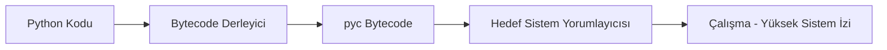
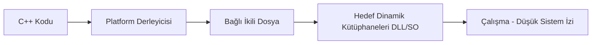
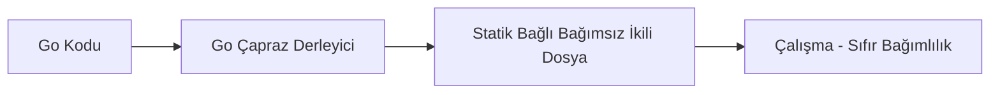
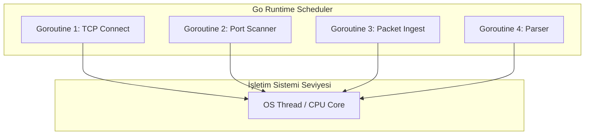

<style>
.gh-container {
  margin: 2.5rem 0;
}
.gh-grid {
  display: grid;
  grid-template-columns: repeat(auto-fit, minmax(260px, 1fr));
  gap: 1.5rem;
  margin: 1.5rem 0;
}
.gh-card {
  background: rgba(30, 41, 59, 0.45);
  border: 1px solid rgba(148, 163, 184, 0.12);
  border-radius: 14px;
  padding: 1.75rem;
  box-shadow: 0 4px 30px rgba(0, 0, 0, 0.15);
  backdrop-filter: blur(10px);
  -webkit-backdrop-filter: blur(10px);
  transition: all 0.3s cubic-bezier(0.4, 0, 0.2, 1);
  position: relative;
  overflow: hidden;
}
.gh-card:hover {
  transform: translateY(-4px);
  border-color: rgba(56, 189, 248, 0.4);
  box-shadow: 0 10px 30px rgba(56, 189, 248, 0.1);
  background: rgba(30, 41, 59, 0.6);
}
.gh-card::before {
  content: '';
  position: absolute;
  top: 0;
  left: 0;
  width: 100%;
  height: 4px;
  background: linear-gradient(90deg, #38bdf8, #818cf8);
  opacity: 0;
  transition: opacity 0.3s;
}
.gh-card:hover::before {
  opacity: 1;
}
.gh-gradient-text {
  background: linear-gradient(135deg, #38bdf8 0%, #818cf8 100%);
  -webkit-background-clip: text;
  -webkit-text-fill-color: transparent;
  font-weight: 800;
}
.gh-badge {
  background: rgba(56, 189, 248, 0.1);
  color: #38bdf8;
  border: 1px solid rgba(56, 189, 248, 0.2);
  padding: 0.25rem 0.6rem;
  border-radius: 20px;
  font-size: 0.75rem;
  font-weight: 600;
  display: inline-block;
  margin-bottom: 0.75rem;
}
.gh-btn {
  background: linear-gradient(135deg, #0284c7 0%, #4f46e5 100%);
  color: white !important;
  border: none;
  padding: 0.75rem 1.5rem;
  border-radius: 8px;
  cursor: pointer;
  font-weight: 600;
  text-decoration: none !important;
  transition: all 0.2s;
  display: inline-flex;
  align-items: center;
  gap: 0.5rem;
}
.gh-btn:hover {
  opacity: 0.95;
  transform: scale(1.02);
}
</style>

# Hackerlar İçin Golang: Modern Siber Güvenlik Mimarisi ve Ofansif Kodlama Rehberi

Sızma testi uzmanları, Red Team operatörleri ve zararlı yazılım geliştiricileri yıllarca otomasyon için Python'ı, bellek manipülasyonu ve yerel API çağrıları içinse C/C++'ı kullandı. Ancak EDR, XDR ve gelişmiş izleme mekanizmalarıyla donatılmış modern savunma hatları, bu geleneksel araçların hareket alanını ciddi şekilde kısıtladı. Google'ın dağıtık sistemler için geliştirdiği Go (Golang), sunduğu yapısal avantajlarla ofansif güvenlik dünyasının yeni standardı haline geldi.

Bu rehberde, Go dilinin güvenlik süreçlerindeki yapısal avantajlarını ele alacak ve pratik örneklerle ofansif kullanım senaryolarına değineceğiz.

<div class="gh-container">
  <h3 class="gh-gradient-text" style="text-align: center; margin-bottom: 1.5rem;">🎯 Bu Rehber Kimler İçin?</h3>
  <div class="gh-grid">
    <div class="gh-card">
      <div class="gh-badge" style="background: rgba(56, 189, 248, 0.1); color: #38bdf8;">Red Team / Pentester</div>
      <h4 style="margin: 0.5rem 0; font-weight: bold; color: #f1f5f9;">Sızma Testi Uzmanları</h4>
      <p style="font-size: 0.85rem; color: #94a3b8; line-height: 1.5; margin-bottom: 0;">
        Sistemlerde sıfır bağımlılıkla (standalone) çalışan, yüksek hızlı tarayıcılar ve özel araçlar geliştirmek isteyen güvenlik uzmanları.
      </p>
    </div>
    <div class="gh-card">
      <div class="gh-badge" style="background: rgba(129, 140, 248, 0.1); color: #818cf8;">Malware Dev</div>
      <h4 style="margin: 0.5rem 0; font-weight: bold; color: #f1f5f9;">Zararlı Yazılım Geliştiricileri</h4>
      <p style="font-size: 0.85rem; color: #94a3b8; line-height: 1.5; margin-bottom: 0;">
        Antivirüs ve EDR sistemlerini aşmak (evasion) amacıyla derleme parametrelerini kullanan, statik analizi zorlaştırmak ve CGO bağımlılığı olmadan yerel API çağrıları yapmak isteyen araştırmacılar.
      </p>
    </div>
    <div class="gh-card">
      <div class="gh-badge" style="background: rgba(16, 185, 129, 0.1); color: #10b981;">Blue Team / SOC</div>
      <h4 style="margin: 0.5rem 0; font-weight: bold; color: #f1f5f9;">Mavi Takım & Tehdit Avcıları</h4>
      <p style="font-size: 0.85rem; color: #94a3b8; line-height: 1.5; margin-bottom: 0;">
        Go ile yazılmış araçların runtime (çalışma zamanı) davranışlarını ve bellek yapılarını analiz ederek daha etkili savunma kuralları (YARA, Sigma vb.) yazmak isteyen savunmacılar.
      </p>
    </div>
  </div>
</div>

---

## 1. Ofansif Güvenlikte Python ve C++ Neden Yetersiz Kalıyor?

Ofansif bir aracın başarısı, hedef sistemde bıraktığı ayak izine ve çalışma esnekliğine bağlıdır. Python ve C++ gibi dillerin derleme ve çalışma mimarileri, modern operasyonlarda bazı temel engellere takılır:

**Python (Yorumlanan / Interpreted)**



**C++ (Derlenen / Native)**



**Go (Statik Derlenen / Static)**



### Python'ın Karşılaştığı Zorluklar

* **Çalışma Zamanı Bağımlılığı (Runtime Dependency):** Python script'ini hedef sistemde çalıştırmak için sistemde yorumlayıcı kurulu olmalıdır. `PyInstaller` gibi çözümlerle paketlenen `.exe` dosyaları ise arka planda `Temp` dizinine kütüphaneleri ve yorumlayıcıyı açar. Bu disk hareketi, modern EDR/AV çözümleri için doğrudan bir alarm sebebidir.
* **GIL (Global Interpreter Lock) Engeli:** Python, yerleşik GIL mekanizması yüzünden CPU çekirdeklerini gerçek anlamda paralel kullanamaz. Bu da yüksek hızlı port tarama, subdomain keşfi veya kaba kuvvet saldırısı yazarken performans darboğazı demektir.

### C/C++ ve Operasyonel Zorluklar

* **Manuel Bellek Yönetimi ve Stabilite:** C/C++ ile çalışırken bellek yönetiminin (`malloc`/`free`) geliştiriciye bırakılması, kararsız bellek sızıntılarına veya çökme (`Segmentation Fault`) risklerine yol açar. Bir sızma testinde hedef sunucuyu çökertmek, bir operatörün yapabileceği en kötü hatalardan biridir.
* **Çapraz Derleme (Cross-Compilation) Çilesi:** Linux üzerinde yazdığınız Windows API çağrıları içeren C++ kodunu derlemek, kütüphane ve derleyici bağımlılıkları yüzünden çoğunlukla kabusa dönüşür.

### Go Hepsini Nasıl Çözüyor?

Go; Python'ın pratikliği ve hızlı geliştirme avantajını, C/C++'ın makine koduna derlenme gücüyle birleştirir. Statik tip güvenliği ve yerleşik bellek yönetimi (Garbage Collector) sayesinde siber güvenlik uzmanlarına çökme riski taşımayan, son derece kararlı araçlar geliştirme fırsatı verir.

### Karşılaştırma Tablosu

| Kriter | Python | C / C++ | Go (Golang) |
| :--- | :--- | :--- | :--- |
| **Derleme Yapısı** | Yorumlanan (Interpreted) | Derlenen (Native) | Statik Derlenen (Native & Static) |
| **Dışa Bağımlılık** | Yüksek (Yorumlayıcı ve paketler şart) | Orta (DLL / Paylaşılan kütüphaneler gerekir) | Yok (Tamamen bağımsız tek dosya) |
| **Eşzamanlılık (Concurrency)** | Kısıtlı (GIL engeli var) | Karmaşık (Thread yönetimi zor) | Mükemmel (Goroutines ve Kanallar) |
| **Çalışma Hızı** | Yavaş | Çok Hızlı | Hızlı (C seviyesine yakın) |
| **Bellek Güvenliği** | Güvenli (Garbage Collector var) | Manuel (Hatalara ve taşmalara açık) | Güvenli (Garbage Collector var) |
| **Tersine Mühendislik (Reversing)**| Kolay (Bytecode kolayca geri dönüştürülür) | Orta (Derleme ayarlarına göre değişir) | Zor (Büyük ve karmaşık çalışma yapısı) |

---

## 2. Ofansif Güvenlikte Go Dilinin Mimari Avantajları

Go'yu siber güvenlikte vazgeçilmez kılan üç ana mimari özellik şunlardır:

### A. Statik Derleme ve Çapraz Derleme Gücü

Go derleyicisi, kodunuzu ve bağımlı olduğunuz tüm paketleri tek bir bağımsız binary içine statik olarak gömer. Hedef makinede ne bir DLL dosyasına ne de bir yorumlayıcıya ihtiyaç kalır.

Üzerinde çalıştığınız işletim sisteminden bağımsız olarak, tek bir komutla farklı platformlar için çıktı alabilirsiniz:

```bash
# Linux makineden Windows x64 mimarisine derleme
GOOS=windows GOARCH=amd64 go build -o agent.exe main.go

# macOS üzerinden Linux ARM64 mimarisine derleme
GOOS=linux GOARCH=arm64 go build -o agent_arm main.go
```

### B. Tersine Mühendislik (Reversing) Dinamikleri

Standart C/C++ binary'leri Ghidra veya IDA Pro gibi araçlarla açıldığında, kütüphane çağrıları ve fonksiyon isimleri doğrudan analiz edilebilir. Go'da ise bu süreç farklı zorluklar barındırır:
* **Büyük Binary Dosyası:** Go ile yazılan en basit program bile kendi runtime motorunu (Garbage Collector, Scheduler vb.) barındırdığı için birkaç megabayt boyutundadır. Analist, binlerce runtime fonksiyonu arasından sizin yazdığınız asıl kodu bulmak için vakit kaybetmek zorundadır.
* **pclntab Yapısı ve Semboller:** Go, hata anında çağrı geçmişini (stack trace) ekrana basabilmek için dosya içinde `pclntab` adında bir fonksiyon adı tablosu tutar. Eğer bu semboller derleme sırasında temizlenmezse (`strip` edilmezse), tersine mühendisler `go-resym` gibi araçlarla kodun tüm akışını ve fonksiyon isimlerini saniyeler içinde çözebilir. Ancak bu tabloyu `-ldflags="-s -w"` ile silmek ve `garble` gibi araçlarla karartmak, analistin işini C/C++'a göre çok daha fazla zorlaştırır; çünkü standart runtime fonksiyonları ile kendi kodunuz birbirine karışır.

### C. Eşzamanlılık (Concurrency) Yetenekleri ve GMP Modeli

Go, işletim sisteminin yüksek maliyetli thread'leri yerine, 2 KB gibi son derece düşük bir başlangıç belleğiyle çalışan **Goroutine**'leri kullanır. Bu asenkron yapının arkasında ise **GMP Modeli (M:N Scheduler)** yer alır:
* **G (Goroutine):** En küçük iş birimi. Kendi stack alanına ve durum verilerine sahiptir.
* **M (Machine):** İşletim sisteminin fiziksel thread'ini (OS Thread) temsil eder.
* **P (Processor):** Goroutine'leri çalıştırmak için gereken mantıksal işlem kaynağıdır. Varsayılan olarak CPU çekirdek sayısı kadardır.

OS thread geçişleri (context switch) yerine kullanıcı katmanında son derece hızlı geçişler yapılır. Binlerce goroutine, work-stealing (iş çalma) algoritmalarıyla işlemci çekirdeklerine dinamik olarak dağıtılır.

Aşağıdaki şema, Go'nun `goroutine` yapısının tek bir işletim sistemi iş parçacığı üzerinde binlerce görevi nasıl koordine ettiğini göstermektedir:



#### Uygulama: Yüksek Hızlı Eşzamanlı Port Tarayıcı

Go'nun `sync.WaitGroup` ve kanallarını (`channels`) kullanarak yüksek hızlı ve eşzamanlı bir port tarayıcıyı nasıl yazacağımızı inceleyelim:

```go
package main

import (
	"fmt"
	"net"
	"sync"
	"time"
)

// worker fonksiyonu, kanaldan gelen portları alır ve tarar
func worker(ports chan int, wg *sync.WaitGroup, host string) {
	for p := range ports {
		// Her port tarama adımını anonim bir fonksiyon içinde çalıştırarak
		// defer işlemlerinin döngü bitmeden çalışmasını sağlıyoruz.
		func() {
			defer wg.Done()
			address := fmt.Sprintf("%s:%d", host, p)
			
			// 2 saniyelik zaman aşımı ile TCP bağlantısı dener
			conn, err := net.DialTimeout("tcp", address, 2*time.Second)
			if err != nil {
				// Port kapalı veya erişilemez
				return
			}
			defer conn.Close()
			
			fmt.Printf("[+] Port Açık: %d\n", p)
		}()
	}
}

func main() {
	host := "scanme.nmap.org"
	ports := make(chan int, 100) // Buffer'lı kanal tanımı
	var wg sync.WaitGroup

	// Havuzda 10 adet işçi (worker) goroutine başlatıyoruz
	for i := 0; i < 10; i++ {
		go worker(ports, &wg, host)
	}

	// 1 ile 1024 arasındaki portları kanala gönderiyoruz
	for i := 1; i <= 1024; i++ {
		wg.Add(1)
		ports <- i
	}

	wg.Wait()
	close(ports)
	fmt.Println("[*] Tarama işlemi tamamlandı.")
}
```

---

## 3. Sektör Standardı Haline Gelmiş Go Tabanlı Güvenlik Araçları

Teorik üstünlüğün ötesinde, bugün siber güvenlik endüstrisinin en kritik araçları Go ile sıfırdan inşa edilmektedir.

<!-- TOOLS GRID START -->
<div class="gh-grid">
  <div class="gh-card">
    <div class="gh-badge">C2 Framework</div>
    <h4 style="margin: 0.5rem 0; font-weight: bold; color: #f1f5f9;">🛸 Bishop Fox - Sliver C2</h4>
    <p style="font-size: 0.85rem; color: #94a3b8; line-height: 1.5; margin-bottom: 0;">
      Cobalt Strike'a güçlü ve açık kaynaklı bir alternatif. mTLS, WireGuard, HTTP(S) ve DNS tünelleme kullanarak eylemci (implant) yönetimini sağlar.
    </p>
  </div>

  <div class="gh-card">
    <div class="gh-badge">Paket Analiz / AD</div>
    <h4 style="margin: 0.5rem 0; font-weight: bold; color: #f1f5f9;">📦 Mandiant - gopacket</h4>
    <p style="font-size: 0.85rem; color: #94a3b8; line-height: 1.5; margin-bottom: 0;">
      Python'daki Impacket kütüphanesinin Go üzerindeki karşılığıdır. Ağ paketlerinin analiz edilmesi, SMB/RPC paket yönetimi ve Active Directory operasyonları için sıklıkla tercih edilir.
    </p>
  </div>

  <div class="gh-card">
    <div class="gh-badge">Exploit Framework</div>
    <h4 style="margin: 0.5rem 0; font-weight: bold; color: #f1f5f9;">⚙️ VulnCheck - go-exploit</h4>
    <p style="font-size: 0.85rem; color: #94a3b8; line-height: 1.5; margin-bottom: 0;">
      Exploit geliştirme süreçlerini standartlaştırmak, kararlı ve platformlar arası taşınabilir exploit kodları yazmak amacıyla oluşturulmuş bir altyapıdır.
    </p>
  </div>

  <div class="gh-card">
    <div class="gh-badge">Recon / Web</div>
    <h4 style="margin: 0.5rem 0; font-weight: bold; color: #f1f5f9;">🔍 Gobuster / FFUF</h4>
    <p style="font-size: 0.85rem; color: #94a3b8; line-height: 1.5; margin-bottom: 0;">
      Web dizinleri, gizli sayfalar ve subdomain keşifleri için kullanılan yüksek hızlı fuzzer ve kaba kuvvet (brute-force) araçları.
    </p>
  </div>
</div>
<!-- TOOLS GRID END -->

---

## 4. Savunma Atlatma (Evasion) ve Derleme Teknikleri

Bir Red Team operasyonunda üretilen binary boyutu ve AV/EDR çözümlerine takılmama durumu kritiktir. Go derleyicisi, dosya boyutunu düşürmek ve analizi zorlaştırmak için yerleşik parametreler sunar.

### Derleme Parametreleri ve Optimizasyon

Varsayılan ayarlarla derlenen Go dosyaları, debug sembollerini ve DWARF tablolarını da içerir. Bu durum hem boyutu büyütür hem de statik analiz yapan güvenlik motorlarının (örneğin YARA kurallarının) dosyayı kolayca analiz etmesine imkan tanır.


### Windows API ve Sistem Çağrıları (Syscalls)

CGO'yu kapatsak bile Go'nun yerleşik `"syscall"` ve `"golang.org/x/sys/windows"` paketleriyle Windows API'lerini tetikleyebiliriz. Çalışma zamanında DLL dosyalarını dinamik olarak yükleyip çağırmak, IAT'yi (Import Address Table) temiz tutarak imza tabanlı tespitleri atlatmanın ilk adımıdır:

```go
package main

import (
	"syscall"
	"unsafe"
)

func main() {
	// DLL çalışma zamanında yüklenir
	kernel32 := syscall.NewLazyDLL("kernel32.dll")
	// İlgili fonksiyon çözümlenir
	virtualAlloc := kernel32.NewProc("VirtualAlloc")

	// Fonksiyon çağrısı CGO bağımlılığı olmadan doğrudan gerçekleştirilir
	addr, _, _ := virtualAlloc.Call(
		0,
		2048, // Boyut
		0x3000, // MEM_COMMIT | MEM_RESERVE
		0x40,   // PAGE_EXECUTE_READWRITE
	)
	
	_ = addr
}
```

Bir adım sonrası ise **Direct Syscalls (Doğrudan Sistem Çağrıları)** yöntemidir. Go, assembly (`.s`) dosyalarını doğrudan derleyebildiği için, EDR sistemlerinin kullanıcı katmanındaki API kancalarını (hooking) atlatmak üzere syscall numaralarını doğrudan assembly seviyesinde çağırıp kernel moduna geçiş yapabilir.

### Garble ile Kod Obfuscation (Karartma)

Go derleyicisi paket ve fonksiyon isimlerini binary içerisinde açık bırakır. Güvenlik analistlerinin işini zorlaştırmak ve imza tabanlı tespitlerden kaçınmak için **[Garble](https://github.com/burrowers/garble)** kullanabiliriz. Garble derleme aşamasında şunları yapar:
1. **Sembol Karıştırma:** Fonksiyon, değişken ve paket isimlerini anlamsız hash'lere dönüştürür.
2. **String Şifreleme:** Kod içindeki tüm string'leri (IP, URL, anahtarlar) şifreli saklar ve bellek üzerinde çalışma zamanında çözer.
3. **Runtime Temizliği:** DWARF ve hata ayıklama verilerini tamamen kazır.

Kullanımı oldukça pratiktir:

```bash
# Go yerine garble kullanarak evasion odaklı derleme
garble -literals -tiny build -ldflags="-s -w" -trimpath -o agent.exe main.go
```

---

## 5. Uygulamalı Eğitim ve Geliştirme Kaynakları

"Golang for Hackers" konseptinde derinleşmek ve kendi ofansif/defansif araçlarınızı geliştirmek için takip edebileceğiniz nitelikli kaynak hiyerarşisi şu şekildedir:

### Temel Literatür ve Kitaplar

<!-- BOOKS GRID START -->
<div class="gh-grid">
  <div class="gh-card">
    <div class="gh-badge">Temel Başvuru</div>
    <h4 style="margin: 0.5rem 0; font-weight: bold; color: #f1f5f9;">📖 Black Hat Go</h4>
    <p style="font-size: 0.85rem; color: #94a3b8; line-height: 1.5; margin-bottom: 0;">
      No Starch Press tarafından basılan, Go diliyle siber güvenlik araçları, exploitler ve ağ tarayıcıları yazmayı öğreten en popüler başvuru kitabıdır.
    </p>
  </div>

  <div class="gh-card">
    <div class="gh-badge">Ofansif Programlama</div>
    <h4 style="margin: 0.5rem 0; font-weight: bold; color: #f1f5f9;">📖 Go Programming for Hackers</h4>
    <p style="font-size: 0.85rem; color: #94a3b8; line-height: 1.5; margin-bottom: 0;">
      Ofansif araç geliştirme süreçlerine ve sızma testi betiklerine odaklanan, pratik örnekler içeren bir kılavuzdur.
    </p>
  </div>

  <div class="gh-card">
    <div class="gh-badge">Pratik El Kitabı</div>
    <h4 style="margin: 0.5rem 0; font-weight: bold; color: #f1f5f9;">📖 Black Hat Go Manual (BHGM)</h4>
    <p style="font-size: 0.85rem; color: #94a3b8; line-height: 1.5; margin-bottom: 0;">
      Teorik bilgileri pratik laboratuvar ortamlarıyla birleştiren, hızlı kod referansları ve ipuçları sunan el kitabıdır.
    </p>
  </div>
</div>
<!-- BOOKS GRID END -->

### Video ve Canlı Laboratuvar Serileri

<!-- VIDEOS GRID START -->
<div class="gh-grid">
  <div class="gh-card" style="border-left: 4px solid #e11d48; background: rgba(225, 29, 72, 0.03);">
    <div class="gh-badge" style="background: rgba(225, 29, 72, 0.1); color: #f43f5e; border-color: rgba(225, 29, 72, 0.2);">Video Seri (TR)</div>
    <h4 style="margin: 0.5rem 0; font-weight: bold; color: #f1f5f9;">🔴 Mehmet İnce - Golang For Hackers</h4>
    <p style="font-size: 0.85rem; color: #94a3b8; line-height: 1.5; margin-bottom: 1rem;">
      YouTube ve Twitch üzerinde yayınlanan, sıfırdan ileri seviyeye kadar Go ile gerçekçi araçların (örneğin LDAP enjektörleri) nasıl yazıldığını gösteren en kapsamlı Türkçe video serisi.
    </p>
    <a href="https://youtube.com/playlist?list=PLwP4ObPL5GY_O3eEZPrBnCD8ejN17DYGq" target="_blank" class="gh-btn" style="background: linear-gradient(135deg, #e11d48 0%, #be123c 100%);">
      ▶ Playlist'i İzle
    </a>
  </div>

  <div class="gh-card" style="border-left: 4px solid #3b82f6; background: rgba(59, 130, 246, 0.03);">
    <div class="gh-badge" style="background: rgba(59, 130, 246, 0.1); color: #60a5fa; border-color: rgba(59, 130, 246, 0.2);">Video Seri (EN)</div>
    <h4 style="margin: 0.5rem 0; font-weight: bold; color: #f1f5f9;">🔵 IppSec - Golang for Hackers</h4>
    <p style="font-size: 0.85rem; color: #94a3b8; line-height: 1.5; margin-bottom: 1rem;">
      Hack The Box çözümleriyle bilinen IppSec'in, Go dilini otomasyon süreçlerinde, tarayıcılarda ve sızma testlerinde nasıl kullandığını anlatan İngilizce eğitim serisi.
    </p>
    <a href="https://youtube.com/playlist?list=PLidcsTyj9JXJ74wLAJDC10JiUPV568hcp" target="_blank" class="gh-btn" style="background: linear-gradient(135deg, #2563eb 0%, #1d4ed8 100%);">
      ▶ Watch Playlist
    </a>
  </div>
</div>
<!-- VIDEOS GRID END -->

---

## 6. Sonuç

Siber güvenlikte Go kullanımı geçici bir popülerlik değil, modern savunma sistemlerine karşı doğan net bir mühendislik ihtiyacıdır. Tek bir binary ile çalışabilen, yüksek hızda asenkron iş üreten ve kolayca çapraz derlenen bu dil, siber operasyonların vazgeçilmezidir. Sadece Red Team ekipleri için değil; tehdit avcılığı, tersine mühendislik veya SOC analizi yapan Blue Team uzmanları için de Go'nun çalışma mekanizmalarını bilmek kritik önem taşır. Saldırganın silahını anlamadan savunma hattı kuramazsınız.

---

## 📺 Ofansif Go Geliştirme Eğitim Serisi

Go diliyle siber güvenlik araçları (port tarayıcılar, subdomain bulucular, ağ araçları vb.) geliştirmeyi anlatan Türkçe YouTube serisine aşağıdan göz atabilirsiniz:

<div class="video-container" style="position: relative; padding-bottom: 56.25%; height: 0; overflow: hidden; max-width: 100%; margin: 1.5rem 0; border-radius: 12px; box-shadow: 0 4px 15px rgba(0,0,0,0.3);">
  <iframe src="https://www.youtube.com/embed/videoseries?list=PLwP4ObPL5GY_O3eEZPrBnCD8ejN17DYGq" style="position: absolute; top: 0; left: 0; width: 100%; height: 100%; border: 0;" allow="accelerometer; autoplay; clipboard-write; encrypted-media; gyroscope; picture-in-picture; web-share" allowfullscreen></iframe>
</div>

Seriye doğrudan erişmek için [Hackerlar İçin Golang Türkçe Oynatma Listesi](https://youtube.com/playlist?list=PLwP4ObPL5GY_O3eEZPrBnCD8ejN17DYGq&si=gL2JNNvpLegTM29R) bağlantısını kullanabilirsiniz.
