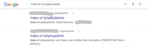
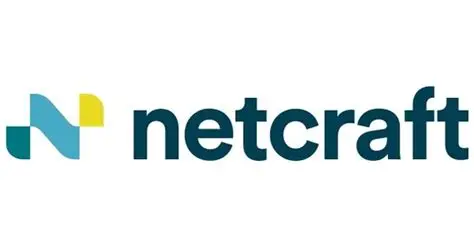
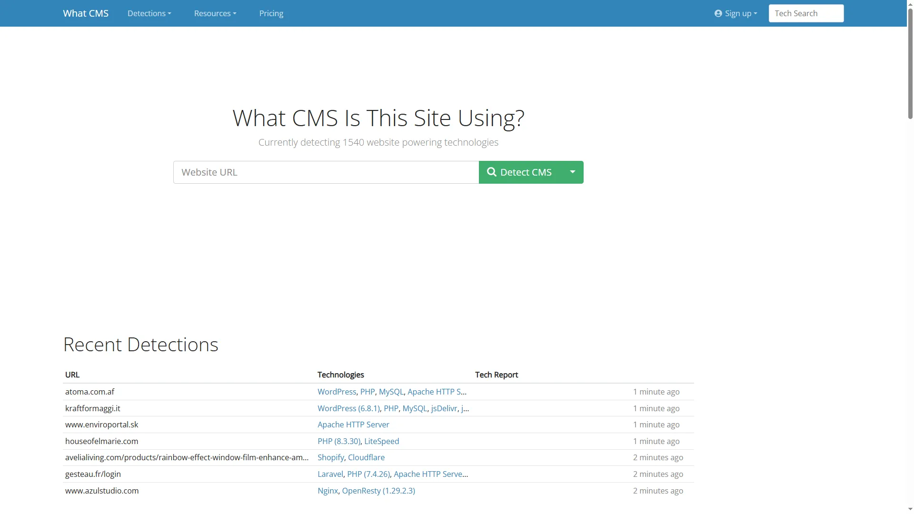
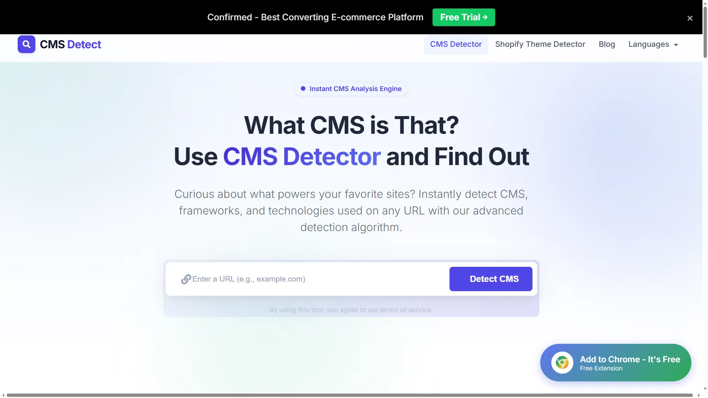
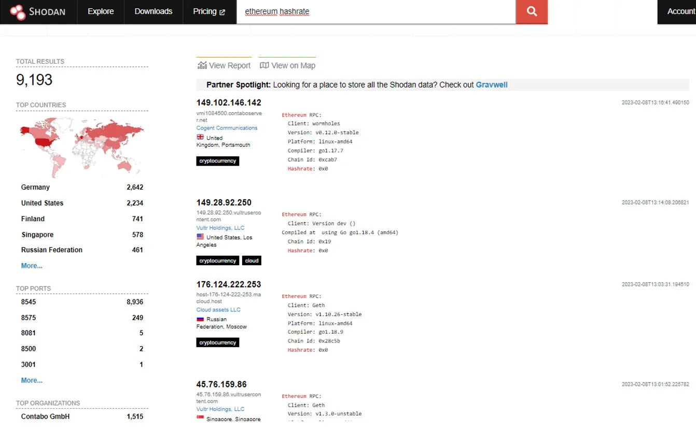
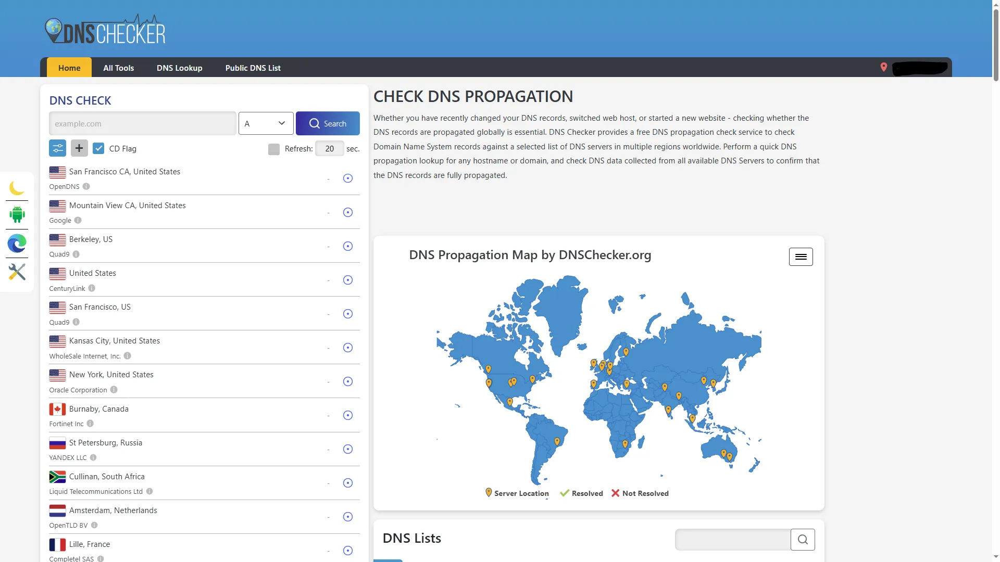
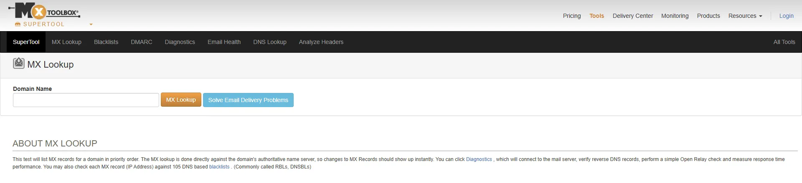
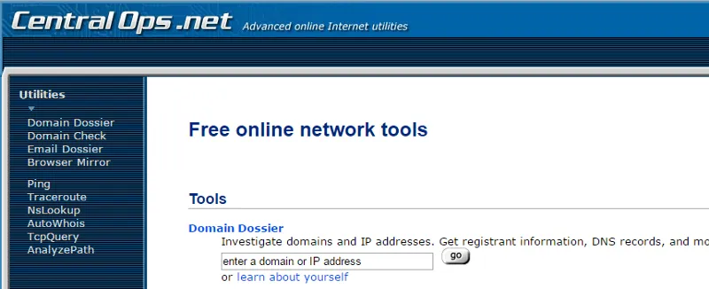
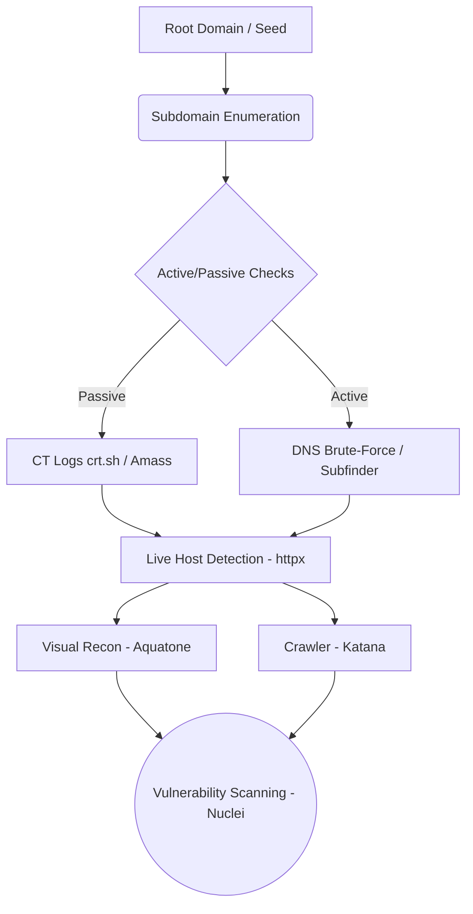
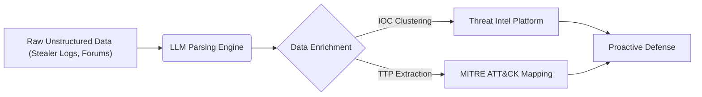

<div class="audio-narration">
  <strong>Listen to Audio:</strong> The narration for this article is ready. You can listen to it using the player above.
</div>

# Modern OSINT, AI, and Reconnaissance Dynamics from a Strategic Cyber Intelligence Perspective

In Cyber Threat Intelligence (CTI), the reconnaissance phase, once seen as just a simple preliminary step for penetration testing or a mere "tool list", has today evolved into the fundamental phase that defines the perspective of cyberspace for both attackers (Red Team/APT groups) and defense teams (Blue Team/SOC). OSINT (Open Source Intelligence) is no longer static target analysis; it is the first line of cyber defense, threat modeling, and Attack Surface Management (ASM).

In this article, while preserving all the technical details and tools found in classic "how-to" guides, we will discuss with a strategic perspective how we integrate these traditional information gathering techniques into modern cloud infrastructures, supply chain intelligence, and Artificial Intelligence (LLM) layers.


---
## Passive Information Gathering and Modern OSINT

### Google Dorks and Google Hacking


Hello, in this article, I will introduce you to Google Dorks, which are very useful in collecting passive information. I will talk about how to use it. Then, I will try to explain how we can find vulnerabilities with these dors and what we can achieve.


Google dork is a system that contains some parameters that make it easier for us to search with the Google search engine. These parameters allow us to filter the words we will search for. In this way, we can easily access the information we are looking for among the billions of sites indexed by Google. This system is indispensable for passive information collection.

#### Google Search Parameters

When searching on Google, we can refine our search using certain parameters. Let's take a look at these parameters and what they do...

Used to search page text.

Example:

```
intext:Provided by ProjectSend
```

It is used to search the page title.

Example:

```
intitle:"index of backup.php"
```

It is used to search within the URL.

Example:

```
inurl:"admin-login.php"
```

In blog research, it is used to search the blog title (inposttitle/allinposttitle).

Example:

```
inposttitle:"Google Dork"
```

It is used to search on keywords. It ranks the sites with the specified keyword according to their popularity.

Example:

```
inanchor:"cyber security"
```

It is used to find results with the desired file extension.

Example:

```
filetype:log "AUTHTOKEN"
```

Shows the version of the web page currently in the cache of the specified site.

Example:

```
cache:www.google.com
```

It is used to search the specified site.

Example:

```
site:"pwnlab.me" "Google Dorks"
```

It is used to find websites with similar content to a known site.

Example:

```
related:"pwnlab.me"
```

It is used to list results before or after a certain date. before means before, after means after.

Example:

```
allintext:password filetype:log after:2018 before:2021
```

#### Google Search Operators

Operators are auxiliary characters used with parameters in writing dorks.

Using quotation marks around the phrase you're searching for will help you find exact match results rather than the broad results you'll get with a standard search.

example

```
"open source intelligence"
```

The minus operator is used to avoid showing results containing certain words.

example

```
site:facebook.* -site:facebook.com
```

The plus operator is used to combine words. Useful for detecting pages that use more than one specific key

example

```
site:facebook.com +site:facebook.*
```

The star operator is used to represent a field that can be filled with any word. In other words, different words may appear where the star operator is located in the search result.

example

```
site:*.com
```

In this example, all sites ending with the extension '.com' will be listed.

It is also used to search for synonyms of the specified word.

example

```
~set
```

For example, querying for "~set" will list results containing words like "configure," "collection," and "change," which are synonyms for "set."

| and OR operator corresponds to the logical operator "or" in Turkish. Lists results where one or both of two conditions are met.

example

```
site:facebook.com | site:twitter.com
```

The & operator and the AND operator correspond to the "and" logical operator in Turkish. Lists only results from two conditions that both satisfy.

example

```
site:facebook.com & site:twitter.com
```

#### What is Google Hacking?


Google hacking is a method used to find a vulnerable index of web pages on the internet or to collect information by searching for open data on all sites. For example, with a Google query, we can find the login page of a site and scan for vulnerabilities there. In other words, we can call the use of queries we make with dors for hacking operations as 'Google Hacking'.

#### Google Hacking Techniques

We can access many different information on the internet by using Google Hacking techniques. Let's see together what kind of information and how we can access it...

##### Log Files

log filesis a perfect example of how sensitive information can be found on any website.

We can use the allintext and filetype parameters to access the log files indexed by Google.

```
allintext:username filetype:log
```

This query will list the results containing "username" in all log files indexed by Google on the internet.

##### Vulnerable Web Servers

By using Google dorks, we can find websites with certain security vulnerabilities. The presence of the phrase "/proc/self/cwd/" in the URL of a website is evidence that there is a vulnerability on that site.

```
inurl:/proc/self/cwd
```

With this dork we can find vulnerable sites, As you can see in the screenshot below, the vulnerable server results will be listed with their open directories.

##### Open FTP Servers

Google not only indexes HTTP-based servers, but also open FTP servers.

With the following dork, we can find public FTP servers.

```
intitle:"index of" inurl:ftp
```

##### ENV Files

.env files are used in web development environments to declare global configurations. One recommended practice is to move these .env files to a location where they are not publicly accessible. However, there are many developers who don't care about this and add .env files to the website directory.

```
intitle.index of .env
```

You will notice that usernames, passwords, and IPs are shown directly in the search results.

##### SSH Private Keys

SSH private keys are used to decrypt incoming and outgoing information in the SSH protocol. As a general security rule, private keys should remain on the system used to access the remote SSH server and should not be shared with anyone.

With the dork below, you will be able to find SSH private keys indexed by Uncle Google.

```
intitle:index.of id_rsa -id_rsa.pub
```

##### Email Lists

It's pretty easy to find email lists using Google Dorks. In the example below, we can list excel files that may contain a large number of email addresses.

```
filetype:xls inurl:"email.xls"
```

##### Live Cameras

It is very easy to access live camera web pages that are indexed by Uncle Google and are not restricted by IP. With the dorks below, we can access live cameras.

For IP based cameras:

```
inurl:top.htm inurl:currenttime
```

To find WebcamXP-based streams:

```
intitle:"webcamXP 5"
```

For general live cameras:

```
inurl:"lvappl.htm"
```

##### SQL Dumps

SQL dumps appear on sites as a result of incorrect backup mechanisms used by site administrators who store backups on web servers. To find a compressed SQL file we use:

```
"index of" "database.sql.zip"
```

##### WordPress Admin

It's not too difficult to find WordPress Admin login pages with a dork:

```
intitle:"Index of" wp-admin
```

Apache servers may be misconfigured. This makes them great targets for botnets.  
 We can find Apache2 web pages with the following dork:

```
intitle:"Apache2 Ubuntu Default Page: It works"
```

##### phpMyAdmin

Another risky tool frequently discovered on LAMP (Linux, Apache, MySQL, PHP) servers is the phpMyAdmin software.

Dork to use to find sites with this software:

```
"Index of" inurl:phpmyadmin
```



##### JIRA and Kibana

Google dorks can also be used to find web applications that host important corporate data (via JIRA or Kibana).

```
inurl:Dashboard.jspa intext:"Atlassian Jira Project Management Software" inurl:app/kibana intext:Loading Kibana
```

[Google Hacking Database](https://www.exploit-db.com/google-hacking-database) is a database containing dors that we can use for hacking activities. On this platform offered by Exploit DB, we can list the dors used by many experts and use the dors that we think will be useful to us.

*source:* Google Hacking for Penetration Testers*,*Johnny Long, Bill Gardner, Justin Brown, 2015 *Originally published at* [*https://pwnlab.me*](https://pwnlab.me/tr-google-dorks-ve-google-hacking/) *on October 19, 2021.*


---
### Cloud Intelligence and Leak Hunting


Despite the cliché "Google Dorks are dead", dorking is not dead, it has only been mechanized over APIs. The main target of modern attackers is not on-premise networks, but cloud architectures.

#### Cloud Intelligence
* **AWS/Azure/GCP Leaks:** Misconfigured AWS S3 buckets, Azure blob storage areas, and GCP services.
* **Container and Infrastructure:** Exposed Kubernetes dashboards, Docker registry leaks, and Terraform/GitOps config disclosures.

#### Source Code OSINT (Leak Hunting)
Attackers continuously scan platforms like GitHub, GitLab, DockerHub. AWS tokens, API keys, or database passwords forgotten in retrospective analyses (commit history) are searched. CI artifacts and npm/PyPI registries are the center of modern recon.
* **Tools:** Secret scanning engines like `TruffleHog`, `GitLeaks`, `Shhgit`, and `DumpsterDiver` stand out in this area.

> **Operational Risk Scenario:** Forgetting an internal database password (or `.env` file) in a test code thrown into a developer's personal GitHub repo can result in the compromise of the entire cloud infrastructure. Files searched with traditional Dorking are today scanned in seconds in CI/CD processes with TruffleHog.

---
### Classic Passive Information Gathering Techniques


Hello, in this article that we prepared with my teacher Mehmet Bulut, we will talk about Passive Information Gathering Techniques.

#### What is Passive Information Collection?

Passive Information Collection is a type of information collection that is done without direct contact with the target. For example; Asking questions to the person next to you about someone sitting across from you is passive information gathering.

In penetration tests, first information about the system is collected and classified. Most of this information is available on the internet. Apart from this, different information collection methods can also be used.

#### Information Gathering Techniques via IP and Domain Names

With the Whois query, we can access information about the owner of a domain or IP address. These; Information such as IP ranges about the target, the responsible administrator and the e-mail addresses of these administrators.

IP address and domain name distribution around the world is managed from a single center. Apart from this main center called [ICANN](https://www.icann.org/)(Internet Corporation for Assigned Named and Numbers), five different RIRs; In other words, there is a regional internet logger.

Whois queries can be made through these RIRs. If the queried IP address is not under the control of the RIR we queried, it will give you the information of the relevant RIR.

You can also learn the information about an IP address from the Linux terminal screen.

It is a web page that can display information about the operating system hosting the queried IP address or domain name, kernel version, software running as a web service, and even uptime information. Netcraft queries the target system and makes predictions based on the answers returned.

We can access the relevant site at [www.netcraft.com](http://www.netcraft.com).



##### Whois.com
A popular and fast platform used to perform web-based Whois queries, allowing analysis of domain registration data, DNS servers, and ownership details.
We can access the relevant site at [www.whois.com/whois/](https://www.whois.com/whois/).


##### Web CMS Detection (WhatCMS & CMSDetect)
Useful web platforms that passively detect which content management system (WordPress, Joomla, Drupal, etc.) and underlying technologies the target website uses.
* **WhatCMS:** Accessible at [whatcms.org](https://whatcms.org/).



* **CMSDetect:** Accessible at [cmsdetect.com](https://cmsdetect.com/).



Shodan is a search engine that helps find various services and applications around the world. Although its name is a search engine, it differs from other search engines due to the work it does. While other search engines cannot answer the question "We want to find servers using nginx?", Shodan can answer this question.

Shoda has many features. The most effective of these is that it can record the data obtained with the "banner grabbing" technique and return results to you with various filters.

We can search for countries, cities, service providers, services, versions and platforms on Shodan.

We can access the relevant site at [www.shodan.io](https://www.shodan.io).



##### DNSdumpster

DNSdumpster is a free passive information gathering tool that can discover host servers associated with a domain. Finding servers that are visible from the attackers' perspective is an important part of the security assessment process.

We can access the relevant site at [www.dnsdumpster.com](http://dnsdumpster.com).

##### DNS Checker and MXToolbox (Advanced DNS and Email Analysis)
* **DNS Checker:** Used to check how different DNS servers worldwide resolve DNS records (A, AAAA, CNAME, MX, TXT) and monitor DNS propagation. We can access the relevant site at [dnschecker.org](https://dnschecker.org/).



* **MXToolbox:** An indispensable resource for querying MX records of email servers, analyzing DNS vulnerabilities, running blacklist checks, and validating SMTP/SPF/DKIM/DMARC configurations. We can access the relevant site at [mxtoolbox.com](https://mxtoolbox.com/).



##### Centralops

IP, detailed whois information, DNS records and TcpQuery information of a domain on the centralops address are obtained. In the Nslookup section, very advanced DNS queries can be made. It is among the indispensable sites for passive information collection.

We can access the relevant site at [www.centralops.net](http://www.centralops.net).



##### IP Location

It provides geographical location detection by querying the target IP address in 5 different RIRs. The results of this query may vary between service providers.

We can access the relevant site at [www.iplocation.net](https://www.iplocation.net/).

##### Archive Sites

It is a system that has been recording the entire internet since 1996. It brings up that snapshot of pages by year, month, day. Useful for finding previous versions of a website.

We can access the relevant site at [www.archive.org](http://www.archive.org).

Maltego is a tool that allows us to analyze and visualize the data found through open sources. As shown in the example below, when we write the name of a website and run it to query, it shows many data such as DNS, mail server, nameserver addresses registered to this name. In addition to these procedures

* Subdomains and public IP addresses
* Usernames and passwords
* Directory list
* Publicly sensitive documents and files
* You can access information such as leaked identity information.

#### Information Gathering Techniques via Username

##### Name Checkup

Name Checkup is a simple tool that helps us find out on which other platforms the given username is used..

We can access the relevant site at [www.namecheckup.com](https://namecheckup.com/).

##### Username Search

Another tool where we can find out which platforms usernames are used is Instant Username Search. It can search on more platforms than Name CheckUp.

We can access the relevant site at [www.instantusername.com](https://instantusername.com/#/).

#### Information Gathering Techniques Through Images

##### Image Search

It is a search engine technology that uploads an image file and returns similar images and results related to the image. By making a reverse image:

* The source of an image
* Whether it has been installed before
* Whether it is under copyright or not
* Features of products or objects we do not know
* Identifying the actual source of images that cause disinformation

We can use it in situations. The most commonly used Image Search Engines are [Google](https://www.google.com/imghp) and [TinyEye](https://tineye.com/).

Exif is where the data about the photo is located. This section contains a lot of information such as the place, date and time where the photo was taken. The most commonly used tools to collect this information are [ExifTool](https://exiftool.org/) and [Jeffrey's Image Metadata Viewer](http://exif.regex.info/exif.cgi).

#### General Information Gathering Techniques

##### Google Hacking

Google Hacking is an information gathering technique with parameters that can make the queries we make on Google specific. We call the queries we write with these parameters dork. For example;

```
inurl:"pwnlab" intitle:"passive information collection"
```

We talked about these dorks and their usage techniques in detail in our article titled [Google Dorks and Google Hacking](https://pwnlab.me/tr-google-dorks-ve-google-hacking/). To learn more about Google hacking, you can check out this article.

##### theHarvester

theHarvester is a tool that runs on Linux. With this tool, we can collect information from open sources by scanning many websites such as Linkedin, Google, Twitter, Yahoo.

We download our tool with the command below.

sudo apt install theharvester

After installation, the following command will display the information it found on Google about the pwnlab.me site.

theHarvester -d pwnlab.me -b google

You can also detect site-based information with commands such as linkedin, bing, all etc. instead of google.

To get detailed information about its usage, you can go to <https://github.com/laramies/theHarvester>.

##### OSINT Framework

Osint Framework is a website where you can access hundreds of passive information collection tools. Clicking on the section within the categories that suits your target allows you to make more detailed inquiries. Additionally, if there is a (T) text to the right of the options, you can see that you can only do this through the terminal.

We can access the relevant site at [www.osintframework.com](http://osintframework.com).

*Originally published at* [*https://pwnlab.me*](https://pwnlab.me/tr-pasif-bilgi-toplama-teknikleri/) *on November 26, 2021.*


---
### Certificate Transparency (CT Logs) and Cyber-Cartography


The fastest and 100% passive method for subdomain detection in modern OSINT and ASM world is **Certificate Transparency (CT) Logs**.

* **Why is it Important?:** When a company gets an SSL certificate for a new subdomain, it falls into these global CT logs. Attackers instantly catch newly opened test environments over `crt.sh` or with automation tools without sending a single packet to the target.
* **Tools:** `crt.sh`, **Subfinder**, **Amass** (`subfinder -d firma.com -sources crtsh`)

#### Cyber-Cartography Engines (Shodan Alternatives)
Although Shodan is a great tool, it is not the only player in the intelligence world:
* **Censys:** Used for more up-to-date certificate scans in addition to Shodan.
* **FOFA & Hunter.how:** They are the favorites of intelligence analysts especially for hunting C2 (Command Control) infrastructures of Asia/China originated APT groups.

---
### Supply Chain Intelligence


The hottest topic of modern CTI is supply chain security. Software ecosystems (npm, PyPI) are now the playground of intelligence services and APT groups.

* **Dependency Graph Analysis:** Mapping of open source libraries used by institutions.
* **Malicious Package Campaigns:** 
    * **Typo-squatting:** Uploading similars of popular package names (e.g.: `reqeusts` instead of `requests`) to repos with malicious code.
    * **Dependency Confusion:** Manipulating systems by publishing higher versions of in-house private package names in public repos.
    * **Maintainer Hijacking & Protestware:** Hijacking developer accounts.
* **Tools and Concepts:** SBOM (Software Bill of Materials) and VEX (Vulnerability Exploitability eXchange) documents play a critical role in this layer. Software components are analyzed with `Syft` and `Grype`, continuous monitoring is provided with `Dependency-Track`.

---
### Dark Webs and Social Intelligence


Dark Web analyses have now shifted from old school ".onion" forums to instant messaging and Paste sites.

* **Stealer Log Market:** Terabytes of raw logs (cookies, corporate VPN passwords, session tokens) obtained from "Infostealer" malware like Lumma, RedLine, Vidar, and Raccoon are sold in Telegram bots, Discord servers, and Breach forums.
* **Social Profiling (OSINT):** The digital footprint of target individuals (managers, developers) is detected with tools like `SpiderFoot`, `Recon-ng`, `Holehe` (email intelligence), and `Maigret` (username tracking).

---
## Active Information Gathering and Modern Reconnaissance

### Classic Active Information Gathering Techniques


In this article, we will talk about Active Information Gathering Techniques.

#### What is Active Information Collection?

Active information collection is a type of information collection that is done by contacting the target directly. With active information collection, we can obtain clearer and more reliable results than with passive information collection. However, since direct contact is made with the target, a trace is left on the target. Care should be taken as records are left in firewall, IDS and access logs.

#### DNS Scans

DNS protocol is the basic building block of the internet, DNS tells us which IP address the domain name we enter is located. A poorly configured DNS server can give out a lot of information.

nslookup is a basic tool with which we can make a DNS query.

```
nslokup www.pwnlab.me
```

The dig tool is one of the tools with which we can perform a DNS query. We can make a DNS query by giving the domain name as a parameter to the dig tool.

```
dig www.pwnlab.me
```

To query which DNS servers DNS queries for a domain name pass through, we add the +trace parameter to the dig command. With this parameter we can monitor DNS query traffic.

```
dig pwnlab.me +trace
```

You can try using brute force to find subdomains related to a domain. The dnsmap tool is used for this. If a wordlist is not given, it performs it using the standard list hosted within itself.

```
dnsmap www.pwnlab.me
```

#### Port and Service Scans

One of the areas where active information collection is most effectively used is port and service scanning. There may be cases where vulnerabilities in services running on ports directly affect the server.

nmap is short for Network Mapper. It is an open source Linux tool used to scan IP addresses and ports on a network and detect installed applications.

nmap is used to find which devices are running on networks, discover open ports and detect security vulnerabilities.

When setting a target with nmap, you can specify the target in different sizes.

* **nmap 192.168.1.1**: Searches only for the given address.
* **nmap 192.168.1.1–15**: Scans IPs in the given range, including IPs 1 through 15.
* **nmap 192.168.1.0/24**: performs subnet scanning.
* **nmap pwnlab.me**: Searches for domain name
* **nmap -IL list.txt**: Scans the IPs in the list.txt file.

We can perform different types of searches with nmap.

* **nmap -sP 192.168.1.0/24**: Scans with ping.
* **nmap -PA 192.168.1.0/24**: Analyzes with TCP-ACK Ping.
* **nmap -PS 192.168.1.0/24**: Analyzes with TCP-SYN Ping.
* **nmap -PE 192.168.1.0/24**: Analyzes with ICMP Echo Request.
* **nmap -PU 192.168.1.0/24**: Analyzes with UDP Ping.

There are 6 different definitions expressing the status of the ports in port scans made with nmap.

* **open**: The port is open and is being listened to by an application.
* **closed**: The port is closed but accessible. There is no application listening on the port.
* **filtered**: Due to the filtering process, nmap could not detect information about the port.
* **unfiltered**: Returns for ACK Scan. The ports are accessible but cannot be determined to be open.
* **open|filtered**: It was not determined to be open or filtered.
* **closed|filtered**: Not detected as closed or filtered.

##### Netcat
<https://www.kali.org/tools/netcat/>

Netcat is considered the Swiss army knife in the Networking world. It is an easy-to-use and multi-purpose tool with many features, so we can consider it as a Swiss army knife in cyber security. Netcat has many features, the main ones being:

* Port scanning
* Port forwarding
* File upload and download (file transfer)
* Remote shell opening
*Backdoor

**Usage Parameters**

```
nc -h
```

```
nc [options] [destination ip] [port]
```

With the example command line above, you can perform operations on the target IP using usage parameters.

##### Nbtscan
[nbtscan](https://www.kali.org/tools/nbtscan/) is a tool for scanning IP networks for NetBIOS name information. Sends a NetBIOS status query to each address in the provided range and lists the received information in a readable format. The IP address, NetBIOS computer name, logged in user name, and MAC address information is listed for each responding computer.

```
nbtscan -h
```

**Usage parameters:**

* -v: Verbose output; all work received from each computerprints the contents.
* -d: Dump packages; prints the entire package contents.
* -e: Formats the output in different formats.
* -t: Timeout; is the wait time for the response, default is 1000 milliseconds.
* -b: Bandwidth; limits bandwidth. (useful on slow internet connections)
* -r: Uses local port for scans.
* -q: Prints banners and error messages.
* -s: Separator; Separates the output into columns.
* -h: prints the help document.
* -m: New transfer; number of retransmissions (0 by default)
* -f: Filename; It is used to export IP addresses in file format.

```
nbtscan 77.92.138.0/24
```

##### Netdiscover
<https://www.kali.org/tools/netdiscover/>

Netdiscover tool is a discovery tool that can show the operating systems, Mac, IP and router addresses of devices on the same network.

**Features:**

* Simple ARP Scanner
* Can scan multiple Subnets.
* Can work in Active and Passive Modes.
* Timing options available.

**Usage Parameters:**

* -i device: Your own device.
* -r range: Scans a specific range instead of automatic scanning. 192.168.6.0/24,/16,/8
* -l file: Scans the list of ranges found in the given file
* -p passive mode: Does not send anything, just sniffs
* -m file: Scans a list of known MACs and hostnames
* -F filter: customize pcap filter expression
* -s time: Waiting time between each arp request (milliseconds)
* -n node: Last ip octet used for scanning (from 2 to 253)
* -c count: Number of times each arp request is sent (for networks with packet loss)
* -f Enables fast mode scanning, saves a lot of time
* -d Ignores homepage configuration files for autoscan and quick mode
* -S Enables forced wait time between each request.
* -P Outputs print results in a format suitable for parsing by another program.
* -N Do not print the header. Valid only when the -P command is used.

##### Dmitry
<https://www.kali.org/tools/dmitry/>

Dmitry tool is an advanced tool that can perform port scanning in addition to the whois queries we see in passive information collection. However, it can also collect information about subdomains and Emails. It can do the job of many tools on its own in passive and active information collection.

```
dmitry -h
```

* -h parameter: opens the help document.
* -o parameter:
* -i parameter: performs a whois query on the queried IP address.
* -w parameter: performs a whois query on the queried domain name.
* -n parameter: Makes a Netcraft query.
* -s parameter: Scans on subdomains on the target system.
* -e parameter: Queries E-mail addresses on the target system.
* -p parameter: Performs a TCP port scan on the target system.
* -f parameter: Shows the TCP ports filtered on the target system.
* -b parameter: Used to capture banners.
* -t parameter: Sets the TTL time to be used when performing TCP port scanning. By default it is 2 seconds.

```
dmitry www.pwnlab.me
```

It makes all queries regarding the specified domain name and presents them to us.

*Originally published at* [*https://pwnlab.me*](https://pwnlab.me/activt-bilgi-toplama-teknikleri/) *on January 14, 2022.*

---
### Continuous Reconnaissance and Attack Surface Drift


Traditional active discovery (Nmap etc.) takes a "snapshot" of a target at a specific moment. However, modern attackers now use "stream intelligence". An institution's attack surface is not static; it changes continuously due to CI/CD pipelines, ephemeral servers, and Kubernetes ingress configurations. This situation is called **Attack Surface Drift**.

#### Continuous Scanning Architecture (EASM / CAASM)
Modern recon stack is no longer just Nmap. Attackers and EASM (External Attack Surface Management) solutions use the following tool chain:



* **Tool Ecosystem:** Subdomains are found with `Amass` and `Subfinder`, active ones are detected with `httpx`, all endpoints are crawled in seconds with `Katana`, and screenshots of thousands of pages are automatically taken with `Aquatone`.

> **Operational Risk Scenario:** A forgotten Kibana or Grafana panel belonging to a test (staging) environment open to everyone may seem harmless at first glance. However, in modern intrusion chains, such disclosures are instantly exploited by Ransomware groups (affiliates) for credential harvesting and preparation for lateral movement to the internal network.

#### Speed and Template-Based Modern Scans (ProjectDiscovery Ecosystem)


Using only Nmap may fall behind modern speed standards. That is why modern tools (especially ProjectDiscovery tools) written in Rust and Go, which break asynchronous speed records, are used in the industry:
* **RustScan:** Developed with Rust language against Nmap's slowness in large networks. It scans all 65535 ports in seconds and passes the found open ports to Nmap for detailed analysis.
* **Naabu (ProjectDiscovery):** An extremely fast and reliable port scanning tool written in Go. It can scan all ports in seconds, replacing Nmap.
* **Subfinder (ProjectDiscovery):** A tool that discovers valid subdomains for the target using passive sources at incredible speed.
* **httpx (ProjectDiscovery):** Instantly detects active servers returning HTTP/HTTPS responses from massive IP and domain lists using multiple probes.
* **Katana (ProjectDiscovery):** A next-generation, incredibly fast web crawler tool. It finds all endpoints and parameters in seconds.
* **Nuclei (ProjectDiscovery):** Finding ports is not enough in active discovery. Nuclei is a massive vulnerability engine that simultaneously scans for 0-day or known vulnerabilities (e.g.: Log4j disclosures, open .env files) on thousands of targets with YAML-based templates written by the community. (Example usage: `nuclei -u https://target.com -t cves/`)

---
### Internet-Scale Scanning


APT groups no longer scan specific to the target organization, but towards the whole internet (Internet-wide).
* **IPv4 Census and ASN Targeting:** Not just known domains, all ASN blocks belonging to the institution are scanned.
* **Tools:** Tools like `Masscan` and `ZMap` can scan a specific port (e.g.: Port 443) of the entire internet in minutes thanks to their asynchronous structures. Vulnerable/hidden servers of the target are deciphered with TLS Certificate Clustering.

---
## AI-Augmented Cyber Intelligence and Exposure Validation

### Artificial Intelligence (AI) Augmented Intelligence Pipelines


Artificial intelligence (LLM) has been included in intelligence processes not as a simple chatbot, but as integrated pipelines (AI-Augmented Intelligence Pipelines).



* **RAG Based CTI Systems:** Threat intelligence platforms enriched with in-house data (Retrieval-Augmented Generation) offer instant context to SOC analysts.
* **Automated Analysis and Translation:** Heavy hacker slang in Russian/Chinese in underground cybercrime forums is instantly translated with LLMs. Also, malware family similarity analyses and IOC clustering processes are performed with machine learning.
* **TTP Extraction:** Texts shared by ransomware groups on leak sites are automatically analyzed and processed directly into the **MITRE ATT&CK** matrix as TTP.
* **AI Augmented Social Engineering (Spear-Phishing):** Generating flawless phishing emails or deepfake voices specific to the employee's language and interests by feeding corporate data gathered with OSINT into LLMs.
* **AI Intelligence Risks:** Data manipulation, hallucination, poisoned intelligence feeds, and adversarial prompt injection attacks towards the AI model are the new challenges of modern defense.

---
### Defensive Recon & Exposure Validation


Active discovery is not solely the monopoly of attackers. From the Blue Team's perspective, continuous Exposure Validation of the external surface is a must.
* **Brand Infringement and Phishing:** Continuous monitoring of fake domains (Phishing infrastructure / Typosquatting) opened on behalf of the institution.
* **Leaked Credential Monitoring:** Checking whether passwords belonging to institution employees have fallen onto platforms like HaveIBeenPwned.
* **Defensive Cartography:** The process of detecting and closing the servers containing configuration errors belonging to the institution before threat actors by using tools like `Censys`, `FOFA`, `ZoomEye`, and `SecurityTrails`.

---
## Operational Security (OPSEC) and Legal Boundaries


This section explores the details and implications.


### Operational Security (OPSEC)
The most critical element of professional modern OSINT and active discovery is escaping detection (Detection Avoidance). Modern recon teams follow these rules in their operations:
* **Attribution Avoidance:** Intelligence scans are never made from the real IP block of the institution.
* **Evasion Techniques:** SOCKS proxy chains, automatic VPS rotation, browser fingerprinting manipulation, masking scan traffic by hiding behind CDN (Domain Fronting, etc.).
* **Goal:** Not to fall into the SIEM / XDR or EDR logs of the target, to escape from traffic and TLS fingerprinting signatures.

### Legal Boundaries and Ethical Framework
Legal boundaries carry vital importance in corporate intelligence operations.
* **Legal Framework:** CFAA (Computer Fraud and Abuse Act) in the USA, GDPR in Europe, or KVKK rules in Turkey limit discovery operations.
* **Passive vs Active Line:** Passive information gathering (OSINT, Whois, CT Logs) is legally open to public use. However, sending Nmap or Nuclei packets directly to the target system (Active Recon / Unauthorized scanning) is illegal without written permission (Scoping).

---


In the modern attack economy, while threat actors use automation bots working "internet-wide", cloud leak scanners, and AI-supported intelligence pipelines; institutions cannot be expected to defend with static asset inventories (Excel tables) or just traditional port scans.

Approaching systems "like an attacker", making the EASM/CAASM (External/Cyber Asset Attack Surface Management) philosophy operational, and catching threats at the "drift" moment in cyberspace before they come to the door is the necessity of the modern era for cyber security engineers and CTI analysts. Developing both the muscles to masterfully use classic techniques (Dorking, Nmap, dig) and modern automation (ProjectDiscovery, Nuclei, AI, Continuous Recon) is the fundamental key to cyber intelligence.