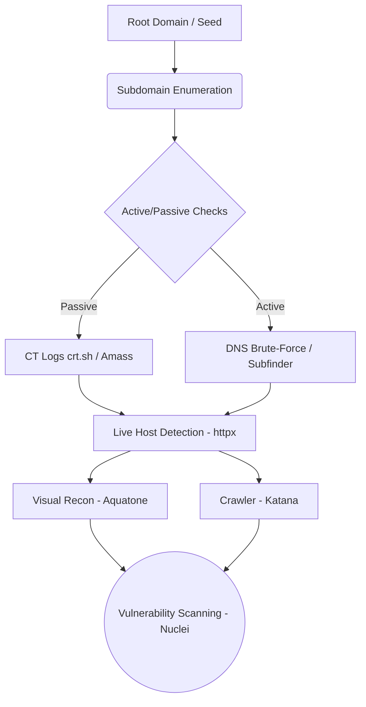

<div class="audio-narration">
  <strong>Sesli Anlatım:</strong> Bu makalenin seslendirmesi hazırdır. Yukarıdaki oynatıcıyı kullanarak dinleyebilirsiniz.
</div>

# Stratejik Siber İstihbarat Perspektifinden Modern OSINT, Yapay Zeka ve Keşif Dinamikleri

## Giriş: Keşif Fazının Değişen Paradigması

Siber istihbaratta (CTI) keşif fazı, eskiden sızma testlerinin basit bir ön adımı veya "araç listesi" olarak görülürken, bugün hem saldırganlar (Red Team/APT grupları) hem de savunma ekipleri (Blue Team/SOC) için siber uzaya bakış açısını belirleyen temel faza dönüşmüştür. OSINT (Açık Kaynak İstihbaratı) artık statik bir hedef analizi değil; siber savunmanın, tehdit modellemenin ve Saldırı Yüzeyi Yönetiminin (ASM) ilk hattıdır.

Bu makalede, klasik "nasıl yapılır" rehberlerindeki tüm teknik detayları ve araçları koruyarak, bu geleneksel bilgi toplama tekniklerini modern bulut altyapılarına, tedarik zinciri istihbaratına ve Yapay Zeka (LLM) katmanlarına nasıl entegre ettiğimizi stratejik bir perspektifle ele alacağız.


## Google Dorks ve Google Hacking

Merhaba, bu yazımda sizlere pasif bilgi toplamada çok işimize yarayan google dorksları tanıtacağım. Nasıl kullanıldığından bahsedeceğim. Ardından, bu dorklarla nasıl zafiyetler bulabileceğimizi ve neler elde edebileceğimizi anlatmaya çalışacağım.


Google dork, google arama motoru ile yapacağımız aramalarda bizlere kolaylık sağlayan bazı parametreleri barındıran bir sistemdir. Bu parametreler, arayacak olduğumuz kelimelere yönelik filtreleme işlemi yapmamıza olanak sağlar. Bu sayede google'ın indexlediği milyarlarca site içerisinde aradığımız bilgiye kolaylıkla ulaşabiliriz. Bu sistem pasif bilgi toplama işlemlerinin vazgeçilmezidir.

### Google Arama Parametreleri

Google üzerinde arama yaparken, belli parametreler kullanarak aramamızı detaylandırabiliriz. Bu parametrelere ve ne işe yaradığına hep beraber bakalım”¦

Sayfa metninde arama yapmak için kullanılır.

Örnek:

```
intext:Provided by ProjectSend
```

Sayfa başlığında arama yapmak için kullanılır.

Örnek:

```
intitle:"index of backup.php"
```

URL içinde arama yapmak için kullanılır.

Örnek:

```
inurl:"admin-login.php"
```

### inposttitle/allinposttitle:

Blog araştırmalarında, blog başlığında arama yapmak için kullanılır.

Örnek:

```
inposttitle:"Google Dork"
```

Anahtar kelimeler üzerinde arama yapmak için kullanılır. Belirtilen anahtar kelimeye sahip siteleri popülerliğine gore sıralar.

Örnek:

```
inanchor:"cyber security"
```

İstenilen dosya uzantısına sahip sonuçları bulmak için kullanılır.

Örnek:

```
filetype:log "AUTHTOKEN"
```

Belirtilen sitenin önbelleğinde bulunan web sayfasının sürümünü gösterir.

Örnek:

```
cache:www.google.com
```

Belirtilen sitede arama yapmak için kullanılr.

Örnek:

```
site:"pwnlab.me" "Google Dorks"
```

Bilinen bir siteye benzer içeriğe sahip web sitelerini bulmak için kullanılır.

Örnek:

```
related:"pwnlab.me"
```

Belli bir tarihten önceki veya sonraki sonuçları listelemek için kullanılır. before önce, after sonra anlamındadır.

Örnek:

```
allintext:password filetype:log after:2018 before:2021
```

### Google Arama Operatörleri

Operatörler, dorkların yazımında parametreler ile kullanılan yardımcı karakterlerdir.

Aradığınız kelime grubunun etrafında tırnak işaretleri kullanmak, standart arama ile elde edeceğiniz geniş sonuçlar yerine tam eşleme sonuçlarını bulmanıza yardımcı olacaktır.

örnek

```
"open source intelligence"
```

Eksi operatörü, belirli kelimeleri içeren sonuçların gösterilmesinden kaçınmak için kullanılır.

örnek

```
site:facebook.* -site:facebook.com
```

Artı operatörü, sözcükleri birleştirmek için kullanılır. Birden fazla belirli anahtar kullanan sayfaları algılamak için yararlıdır

örnek

```
site:facebook.com +site:facebook.*
```

Yıldız operatörü, herhangi bir kelimeyle doldurulabilecek bir alanı temsil etmek için kullanılır. Yani arama sonucunda yıldız operatörünün olduğu yere farklı kelimeler gelebilir.

örnek

```
site:*.com
```

Bu örnekte, '.com' uzantısı ile biten bütün siteler listelenecektir.


| ve OR operatörü türkçede "veya" mantıksal operatörüne karşılık gelir. İki koşuldan biri veya her ikisinin sağlandığı sonuçları listeler.

örnek

```
site:facebook.com | site:twitter.com
```

& operatörü ve AND operatörü türkçede "ve" mantıksal operatörüne karşılık gelir. İki koşuldan yalnızca her ikisininde sağladığı sonuçları listeler.

örnek

```
site:facebook.com & site:twitter.com
```

### Google Hacking Nedir?


Google hacking, internette web sayfalarının zafiyetli bir indexinin bulunmasında veya tüm sitelerde açık verileri arayıp bilgi toplanmasında kullanılan yöntemdir. Örneğin, bir google sorgusuyla, bir sitenin login page'ini bulabilr ve burada zafiyet taraması yapabiliriz. Yani, dorklarla yaptığımız sorguların, hacking işlemleri için kullanımına 'Google Hacking' diyebiliriz.

### Google Hacking Teknikleri

Google Hacking tekniklerini kullanarak internette birçok farklı bilgiye ulaşabiliriz. Ne tür bilgilere, nasıl ulaşabiliriz hep beraber bakalım”¦

### Log dosyaları

Log dosyaları, herhangi bir web sitesinde hassas bilgilerin nasıl bulunabileceğinin mükemmel bir örneğidir.

Google'ın indexlediği log dosyalarına erişmek için ,allintext ve filetype parametrelerinden yararlanabiliriz.

```
allintext:username filetype:log
```

Bu sorgu, internette google'ın indexlediği tüm log dosyalarının içinde "username" içeren sonuçları listeleyecektir.

### Güvenlik açığı bulunan web sunucuları

Google dorkları kullanarak belli güvenlik açıkları bulunan web sitelerini bulabiliriz. Bir web sitesinin URL'sinde "/proc/self/cwd/" ifadesinin geçmesi o sitede bir zafiyet olduğuna delildir.

```
inurl:/proc/self/cwd
```

Bu dork ile zafiyetli siteleri bulabiliriz, Aşağıdaki ekran görüntüsünde görebileceğiniz gibi, savunmasız sunucu sonuçları, açık dizinleriyle birlikte listelenecektir.

### Açık FTP sunucuları

Google, yalnızca HTTP tabanlı sunucuları indekslemekle kalmaz, aynı zamanda açık FTP sunucularını da indeksler.

Aşağıdaki dork ile, genel FTP sunucularını bulabiliriz.

```
intitle:"index of" inurl:ftp
```

### ENV dosyaları

.env dosyaları, web geliştirme ortamlarında genel yapılandırmaları bildirmek için kullanılmaktadır. Önerilen uygulamalardan biri, bu .env dosyalarını herkesin erişemeyeceği bir yere taşımaktır. Ancak, bunu umursamayan ve .env dosyalarını web sitesi dizinine ekleyen birçok geliştirici var.

```
intitle.index of .env
```

Kullanıcı adlarının, şifrelerin ve IP'lerin doğrudan arama sonuçlarında gösterildiğini fark edeceksiniz.

### SSH özel anahtarları

SSH özel anahtarları, SSH protokolünde gelen-giden bilgilerin şifresini çözmek için kullanılır. Genel bir güvenlik kuralı olarak, özel anahtarlar(private keys), uzak SSH sunucusuna erişmek için kullanılan sistemde kalmalı ve kimseyle paylaşılmamalıdır.

Aşağıdaki dork ile, Google amca tarafından indexlenen SSH private keyleri bulabileceksiniz.

```
intitle:index.of id_rsa -id_rsa.pub
```

### E-posta listeleri

Google Dorks'u kullanarak e-posta listelerini bulmak oldukça kolaydır. Aşağıdaki örnekte, çok sayıda e-posta adresi içerebilecek excel dosyalarını listeleyebiliriz.

```
filetype:xls inurl:"email.xls"
```

### Canlı kameralar

Google amcanın indexlediği ve IP ile kısıtlanmayan canlı kamera web sayfalarına erişim oldukça kolaydır. Aşağıdaki dorklarla, canlı kameralara erişim sağlayabiliriz.

IP tabanlı kameralar için:

```
inurl:top.htm inurl:currenttime
```

WebcamXP tabanlı aktarımları bulmak için:

```
intitle:"webcamXP 5"
```

Genel canlı kameralar için:

```
inurl:"lvappl.htm"
```

### SQL dökümleri

Web sunucularında, yedekleri depolayan site yöneticileri tarafından kullanılan yanlış yedekleme mekanizmaları sonucu, SQL dökümleri sitelerde görünür. Sıkıştırılmış bir SQL dosyası bulmak için şunu kullanırız:

```
"index of" "database.sql.zip"
```

### WordPress Admin

Bir dork ile WordPress Yönetici giriş sayfalarını bulmak çok zor değil:

```
intitle:"Index of" wp-admin
```

Apache sunucuları yanlış yapılandırılmış olabilir. Bu durum, onları botnet'ler için harika hedefler haline getirir.  
 Aşağıdaki dork ile Apache2 web sayfalarını bulabiliriz:

```
intitle:"Apache2 Ubuntu Default Page: It works"
```

### phpMyAdmin

LAMP(Linux, Apache, MySQL, PHP) sunucularında sıklıkla keşfedilen bir diğer riskli araç ise phpMyAdmin yazılımıdır.

Bu yazılıma sahip siteleri bulmak için kullanılacak dork:

```
"Index of" inurl:phpmyadmin
```


### JIRA/Kibana

Google dorks, önemli kurumsal verileri (JIRA veya Kibana aracılığıyla) barındıran web uygulamalarını bulmak için de kullanılabilir.

```
inurl:Dashboard.jspa intext:"Atlassian Jira Project Management Software" inurl:app/kibana intext:Loading Kibana
```

[Google Hacking Database](https://www.exploit-db.com/google-hacking-database), hacking faaliyetleri için kullanabileceğimiz dorkların bulunduğu bir veritabanıdır. Exploit DB'nin sunduğu bu platform da, birçok uzmanın kullanmış olduğu dorkları listeleyebilir, işimize yarayacağını düşündüğümüz dorkları kulanabiliriz.

*kaynak:* Google Hacking for Penetration Testers*,*Johnny Long, Bill Gardner, Justin Brown, 2015 *Originally published at* [*https://pwnlab.me*](https://pwnlab.me/tr-google-dorks-ve-google-hacking/) *on October 19, 2021.*


## Bulut İstihbaratı (Cloud Intelligence) ve Sızıntı Avcılığı


 (YENİ KATMAN)

"Google Dorks bitti" klişesine rağmen, dorking bitmemiş, sadece API'ler üzerinden makineleşmiştir. Modern saldırganların ana hedefi on-premise ağlar değil, bulut mimarileridir.

### Cloud Intelligence
* **AWS/Azure/GCP Sızıntıları:** Yanlış yapılandırılmış AWS S3 bucket'ları, Azure blob depolama alanları ve GCP servisleri.
* **Konteyner ve Altyapı:** Dışa açık Kubernetes dashboard'ları, Docker registry sızıntıları ve Terraform/GitOps config ifşaları.

### Kod Depoları ve Sızıntı Avcılığı (Source Code OSINT)
Saldırganlar GitHub, GitLab, DockerHub gibi platformları sürekli tarar. Geçmişe dönük (commit history) yapılan analizlerde unutulan AWS token'ları, API anahtarları veya veritabanı şifreleri aranır. CI artifact'leri ve npm/PyPI registry'leri modern recon'un merkezidir.
* **Araçlar:** Bu alanda `TruffleHog`, `GitLeaks`, `Shhgit` ve `DumpsterDiver` gibi secret tarama motorları öne çıkar.

> **Operasyonel Risk Senaryosu:** Bir geliştiricinin kişisel GitHub reposuna attığı bir test kodunda şirket içi veritabanı parolasını (veya `.env` dosyasını) unutması, tüm bulut altyapısının ele geçirilmesiyle sonuçlanabilir. Geleneksel Dorking ile aranan dosyalar, bugün TruffleHog ile CI/CD süreçlerinde saniyeler içinde taranmaktadır.

## Pasif Bilgi Toplama Teknikleri

Merhaba, Mehmet Bulut hocamla birlikte hazırladığımız bu yazımızda, sizlere Pasif Bilgi Toplama Tekniklerinden bahsedeceğiz.

### Pasif Bilgi Toplama Nedir?

Pasif Bilgi Toplama, hedef ile doğrudan temasa geçilmeden yapılan bilgi toplama çeşididir. Örneğin; karşıda oturan biriyle ilgili olarak yanınızdaki kişiye soru sormanız pasif bilgi toplamadır.

Sızma testlerinde, öncelikle sistemle ilgili bilgi toplanıp, sınıflandırılır. Bu bilgilerin çoğu internet üzerinden elde edilebilir. Bunun haricinde farklı bilgi toplama yöntemlerinden de faydalanılabilir.

### IP ve Alan Adları Üzerinden Bilgi Toplama Teknikleri

Whois sorgusuyla, bir domainin veya IP adresinin tanımlandığı sahibiyle ilgili bilgilere erişebiliriz. Bunlar; hedef ile ilgili IP aralıkları, sorumlu yönetici ve bu yöneticilerin e-posta adresleri gibi bilgilerdir.

Dünya üzerinde IP adresi ve alan adı dağıtımı tek bir merkez üzerinden yönetilmekedir. [ICANN](https://www.icann.org/)(Internet Corporation for Asigned Named and Numbers) adı verilen bu ana merkez dışında beş farklı RIR; yani bölgesel internet kayıtlayıcısı bulunmaktadır.

Whois sorguları bu RIR'ler üzerinden yapılamktadır. Eğer, sorgulanılan IP adresi sorguladığımız RIR'ın kontrolünde değilse size ilgili RIR'ın bilgisini verecektir.

Bir IP adresine ait bilgileri linux terminal ekranından da öğrenebilirsiniz.

Sorgulanan IP adresi ya da alan adının barındırıldığı işletim sistemi, kernel versiyonu, web servisi olarak çalışan yazılım hatta uptime bilgisine kadar gösterebilen bir web sayfasıdır. Netcraft hedef sisteme sorgular yapıp, dönen cevaplara göre de tahminlerde bulunur.

ilgili siteye [www.netcraft.com](http://www.netcraft.com) adresinden ulaşabiliriz.


### Whois.com
Web tabanlı Whois sorguları gerçekleştirmek, domain kayıt verilerini, DNS sunucularını ve sahiplik detaylarını hızlıca sorgulamak için kullanılan popüler bir platformdur.
İlgili siteye [www.whois.com/whois/](https://www.whois.com/whois/) adresinden ulaşabiliriz.


### Web CMS Tespiti (WhatCMS & CMSDetect)
Hedef web sitesinin hangi içerik yönetim sistemini (WordPress, Joomla, Drupal vb.) ve arka planda hangi teknolojileri kullandığını pasif olarak tespit eden oldukça faydalı platformlardır.
* **WhatCMS:** [whatcms.org](https://whatcms.org/) adresinden ulaşabiliriz.


* **CMSDetect:** [cmsdetect.com](https://cmsdetect.com/) adresinden ulaşabiliriz.


Shodan dünya üzerindeki çeşitli servisler, uygulamaları bulmayı sağlayan arama motorudur. Her ne kadar ismi arama motoru olsa da yaptığı iş gereği diğer arama motorlarından ayrılır. Diğer arama motorları "nginx kullanan sunucuları bulmak istiyoruz? sorusuna cevap veremezken, shodan bu rorunun yanıtını verebiliyor.

Shodanın birçok özelliği bulunmaktadır. Bunlardan en etkilisi "banner grabing" tekniğiyle elde ettiği verileri kayıt altına alıp, çeşitli filtrelerle birlikte sizlere sonuç döndürebilesidir.

Shodan üzerinde ülkelere, şehirlere, servis sağlayıcılarına, servislere, versiyonlara, platformlara yönelik aramalar gerçekleştirebiliriz.

ilgili siteye [www.shodan.io](https://www.shodan.io) adresinden ulaşabiliriz.


### DNSdumpster

DNSdumpster, bir domainle ilgili ana sunucuları keşfedebilen ücretsiz bir pasif bilgi toplama aracıdır. Saldırganların bakış açısından görünür sunucuları bulmak, güvenlik değerlendirme sürecinin önemli bir parçasıdır.

ilgili siteye [www.dnsdumpster.com](http://dnsdumpster.com) adresinden ulaşabiliriz.

### DNS Checker ve MXToolbox (DNS ve E-posta İstihbaratı)
* **DNS Checker:** Dünya çapında farklı DNS sunucularının DNS kayıtlarını (A, AAAA, CNAME, MX, TXT) nasıl çözdüğünü ve DNS yayılımını (propagation) kontrol etmek için kullanılır. İlgili siteye [dnschecker.org](https://dnschecker.org/) adresinden ulaşabiliriz.


* **MXToolbox:** E-posta sunucularının MX kayıtlarını sorgulamak, DNS zafiyetlerini analiz etmek, blacklist (kara liste) kontrolleri ve SMTP/SPF/DKIM/DMARC yapılandırmalarını doğrulamak için kullanılan kapsamlı bir platformdur. İlgili siteye [mxtoolbox.com](https://mxtoolbox.com/) adresinden ulaşabiliriz.


### Centralops

centralops adresi üzerinde bir domaine ait IP, detaylı whois bilgisi, DNS kayıtları ve TcpQuery bilgileri elde edilmektedir. Nslookup bölümünde ise çok gelişmiş DNS sorguları yapılabilmektedir. Pasif bilgi toplamada olmazsa olmaz siteler arasındadır.

İlgili siteye [www.centralops.net](http://www.centralops.net) adresinden ulaşabiliriz.


### IP Location

Hedef ip adresini 5 farklı RIR'de sorgulama gerçekleştirerek coğrafi konum tespiti sağlar. Bu sorgulamanın sonuçları servis sağlayıcılar arasında değişebilir.

İlgili siteye [www.iplocation.net](https://www.iplocation.net/) adresinden ulaşabiliriz.

### Arşiv Siteleri

1996 yılından bu yana tüm interneti kayıt altına alan bir sistemdir. Sayfaların yıllara, aylara, günlere göre o anlık görüntüsünü getirir. Bir web sitesinin önceki sürümlerini bulmak için faydalıdır.

ilgili siteye [www.archive.org](http://www.archive.org) adresinden ulaşabiliriz.

Maltego açık kaynaklar üzerinden bulduğu verileri görselleştirerek analiz yapmamıza olanak sağlayan bir araçtır. Aşağıda örnekte verildiği gibi bir web sitesinin ismini yazıp sorgulamak için çalıştırdığımız zaman, bu ada kayıtlı dns, mail sunucusu, nameserver adresleri gibi bir çok veriyi gösteriyor. Bu işlemlere ek olarak

* Alt alanlar ve genel IP adresleri
* Kullanıcı adları ve şifreler
* Dizin listesi
* Herkese açık hassas belgeler ve dosyalar
* Sızan kimlik bilgileri gibi bilgilere ulaşabilirsiniz.

### Kullanıcı Adı Üzerinden Bilgi Toplama Teknikleri

### Name Checkup

Name Checkup, verilen kullanıcı adının başka hangi platformlarda kullanıldığını bulmamıza yarayan basit bir araçtır.

ilgili siteye [www.namecheckup.com](https://namecheckup.com/) adresinden ulaşabiliriz.

### Username Search

Kullanıcı adlarının, hangi platformlarda kullanıldığını bulabileceğimiz bir başka araç ise Instant Username Search'dür. Name CheckUp'a göre daha fazla platform üzerinde arama yapabilir.

ilgili siteye [www.instantusername.com](https://instantusername.com/#/) adresinden ulaşabiliriz.

### Resimler Üzerinden Bilgi Toplama Teknikleri

### Image Search

Bir görüntü dosyasının upload edilerek, benzer resimleri ve görüntü ile alakalı sonuçları getiren bir arama motoru teknolojisidir. Reverse image yapılarak :

* Bir görüntünün kaynağını
* Daha önce yüklenip yüklenmediğini
* Telif hakkı kapsamında olup olmadığı
* Bilmediğimiz ürün veya nesnelerin özellikleri
* Dezenformasyona neden olan görsellerin asıl kaynağının tespit edilmesi

durumlarında kullanabiliriz. En sık kullanılan Image Arama Motoru [Google](https://www.google.com/imghp) ve [TinyEye](https://tineye.com/) dir.

Exif fotograf hakkındaki verilerin bulunduğu yerdir. Bu bölümde fotoğrafın çekildiği yer, tarih, saat gibi bir çok bilgi mevcuttur. Bu bilgileri toplamak için en yaygın kullanılan [ExifTool](https://exiftool.org/) ve [Jeffrey's Image Metadata Viewer](http://exif.regex.info/exif.cgi) araçlarıdır.

### Genel Bilgi Toplama Teknikleri

### Google Hacking

Google Hacking, google üzerinde yaptığımız sorguları spesifik hale getirebileceğimiz parametrelerle yapılan bilgi toplama tekniğidir. Bu parametrelerle yazdığımız sorgulara dork adını vermekteyiz. Örneğin;

```
inurl:"pwnlab" intitle:"pasif bilgi toplama"
```

[Google Dorks ve Google Hacking](https://pwnlab.me/tr-google-dorks-ve-google-hacking/) isimli yazımızda bu dorklardan ve kullanım tekniklerinden ayrıntılı bir şekilde bahsettik. Google hacking hakkında daha detaylı bilgi edinmek için bu yazımıza bakabilirsiniz.

### theHarvester

theHarvester, Linux üzerinde çalışan bir tooldur. Bu tool ile Linkedin, Google, Twitter, Yahoo gibi bir çok web sitesini tarayarak açık kaynaklardan bilgi toplayabiliriz.

Aşağıdaki komut ile toolumuzu indiriyoruz.

sudo apt install theharvester

Kurulumunu yaptıktan sonra aşağıdaki komut ile pwnlab.me sitesi ile alakalı googleda tespit ettiği bilgileri karşımıza getirecektir.

theHarvester -d pwnlab.me -b google

Ayrıca google yerine linkedin, bing, all vs gibi komutlarla site bazlı bilgiler tespit edebilirsiniz.

Kullanımı ile alakalı ayrıntılı bilgiye ulaşmak için <https://github.com/laramies/theHarvester> adresine gidebilirsiniz.

### OSINT Framework

Osint Framework yüzlerce pasif bilgi toplama araçlarına ulaşabileceğiniz bir web sitesidir. İçerisindeki kategorilerden hedefinize uygun olan bölüme tıklayınca daha ayrıntılı sorgulama yapmanıza olanak sağlar. Ayrıca çıkan seçeneklerin sağında (T) yazısı mevcutsa bunu sadece terminal üzerinden gerçekleştirebileceğinizi görebilirsiniz.

ilgili siteye [www.osintframework.com](http://osintframework.com) adresinden ulaşabiliriz.

*Originally published at* [*https://pwnlab.me*](https://pwnlab.me/tr-pasif-bilgi-toplama-teknikleri/) *on November 26, 2021.*


## Sertifika Şeffaflığı (CT Logs) ve Siber-Kartografi (YENİ KATMAN)

Modern OSINT ve ASM dünyasında subdomain tespiti için en hızlı ve %100 pasif yöntem **Sertifika Şeffaflığı (CT) Loglarıdır**.

* **Neden Önemli?:** Bir şirket yeni bir alt alan adına SSL sertifikası aldığında, bu küresel CT loglarına düşer. Saldırganlar hedefe tek bir paket yollamadan `crt.sh` üzerinden veya otomasyon araçlarıyla yeni açılmış test ortamlarını anında yakalar.
* **Araçlar:** `crt.sh`, **Subfinder**, **Amass** (`subfinder -d firma.com -sources crtsh`)

### Siber-Kartografi Motorları (Shodan Alternatifleri)
Shodan harika bir araç olsa da istihbarat dünyasında tek oyuncu değildir:
* **Censys:** Shodan'a ek olarak, daha güncel sertifika taramaları için kullanılır.
* **FOFA & Hunter.how:** Özellikle Asya/Çin menşeili APT gruplarının C2 (Komuta Kontrol) altyapılarını avlamak için istihbarat analistlerinin favorileridir.

## Tedarik Zinciri İstihbaratı (Supply Chain Intelligence) (YENİ KATMAN)

Modern CTI'ın en sıcak konusu tedarik zinciri güvenliğidir. Yazılım ekosistemleri (npm, PyPI) artık istihbarat servislerinin ve APT gruplarının oyun alanıdır.

* **Bağımlılık Analizi (Dependency Graph Analysis):** Kurumların kullandığı açık kaynak kütüphanelerin haritalandırılması.
* **Zararlı Paket Kampanyaları:** 
    * **Typo-squatting:** Popüler paket isimlerinin benzerlerinin (örn: `reqeusts` yerine `requests`) zararlı kodla repolara yüklenmesi.
    * **Dependency Confusion:** Şirket içi private paket isimlerinin public repolarda daha yüksek versiyonla yayınlanarak sistemlerin manipüle edilmesi.
    * **Maintainer Hijacking & Protestware:** Geliştirici hesaplarının ele geçirilmesi.
* **Araç ve Konseptler:** Bu katmanda SBOM (Software Bill of Materials) ve VEX (Vulnerability Exploitability eXchange) dokümanları kritik rol oynar. `Syft` ve `Grype` ile yazılım bileşenleri analiz edilir, `Dependency-Track` ile sürekli izleme sağlanır.

## Karanlık Ağlar ve Sosyal İstihbarat (YENİ KATMAN)

Dark Web analizleri artık eski usül ".onion" forumlardan, anlık mesajlaşma ve Paste sitelerine kaymıştır.

* **Stealer Log Piyasası:** Lumma, RedLine, Vidar ve Raccoon gibi "Infostealer" zararlılarından elde edilen terabaytlarca ham log (çerezler, kurumsal VPN şifreleri, session token'lar), Telegram botları, Discord sunucuları ve Breach forumlarında satılmaktadır.
* **Sosyal Profilleme (OSINT):** Hedef kişilerin (yöneticiler, geliştiriciler) dijital ayak izi `SpiderFoot`, `Recon-ng`, `Holehe` (eposta istihbaratı) ve `Maigret` (kullanıcı adı izleme) gibi araçlarla tespit edilir.

## [TR] Aktif Bilgi Toplama Teknikleri

Bu yazımızda, sizlere Aktif Bilgi Toplama Tekniklerinden bahsedeceğiz.

### Aktif Bilgi Toplama Nedir?

Aktif bilgi toplama, hedef ile doğrudan temasa geçilerek yapılan bilgi toplama çeşididir. Aktif bilgi toplamayla, pasif bilgi toplamadan daha net ve güvenilir sonuçlar elde edebiliriz. Ancak, hedef ile doğrudan temasa geçildiği için hedefte iz bırakılır. Firewall, IDS, erişim loglarına kayıt bırakıldığıdan dolayı dikkatli olunmalıdır.

### DNS Taramaları

DNS protokolü intenetin temel yapı taşıdır, girdiğimiz alan adının hangi IP adresinde olduğunu bize DNS verir. İyi yapılandırılmamış bir DNS sunucusu dışarıya oldukça fazla bilgi verebilmektedir.

nslookup, dns sorgusu yapabileceğimiz temel bir araçtır.

```
nslokup www.pwnlab.me
```

dig aracı, dns sorgusu yapabileceğimiz araçlardan biridir. dig aracına parametre olarak alan adını vererek dns sorgusu yapabiliriz.

```
dig www.pwnlab.me
```

Bir alan adına ilişkin DNS sorgularının hangi DNS sunucularından geçtiğini sorgulamak için dig komutuna +trace parametresini ekleriz. Bu parametre ile DNS sorgu trafiğini izleyebiliriz.

```
dig pwnlab.me +trace
```

Bir alan adında(domain) ilişkin alt alan adlarını(subdomains) bulmak için brute force ile deneme yapılabilir. Bunun için dnsmap aracı kullanılır. Eğer bir wordlist verilmezse kendi içinde barındırılan standart listeyi kullanarak gerçekleştirir.

```
dnsmap www.pwnlab.me
```

### Port ve Servis Taramaları

Aktif bilgi toplamanın en etkin kullanıldığı alanlardan biri port ve servis taramalarıdır. Portlar üzerinde çalışan servislerde bulunan zafiyetlerin, doğrudan sunucuyu etkilediği durumlar olabilir.

nmap, Network Mapper'ın kısaltmasıdır. Bir ağdaki IP adreslerini ve bağlantı noktalarını taramak ve kurulu uygulamaları tespit etmek için kullanılan açık kaynak kodlu bir Linux aracıdır.

nmap, ağlarda hangi cihazların çalıştığının bulmasında, açık bağlantı noktalarının keşfedilmesinde ve güvenlik açıklarını tespit edilmesinde kullanılır.

nmap ile hedef belirlemede, hedefi farklı boyutlarda belirleyebilirsiniz.

* **nmap 192.168.1.1**: Sadece verilen adres için arama yapar.
* **nmap 192.168.1.1–15**: 1 ile 15 IP'leri dahil olmak üzere, verilen aralıktaki IP'leri tarar.
* **nmap 192.168.1.0/24**: subnet taraması yapar.
* **nmap pwnlab.me**: Alan adını arar
* **nmap -İL list.txt**: list.txt dosyası içerisinde yer alan IP'leri tarar.

nmap ile farklı türlerde aramalar yapabiliriz.

* **nmap -sP 192.168.1.0/24**: Ping ile tarama yapar.
* **nmap -PA 192.168.1.0/24**: TCP-ACK Ping ile analiz yapar.
* **nmap -PS 192.168.1.0/24**: TCP-SYN Ping ile analiz yapar.
* **nmap -PE 192.168.1.0/24**: ICMP Echo Request ile analiz yapar.
* **nmap -PU 192.168.1.0/24**: UDP Ping ile analiz yapar.

nmap ile yapılan port taramalarında portların durumunu ifade eden 6 farklı tanım vardır.

* **open**: Port açıktır ve bir uygulama tarafından dinleniyordur.
* **closed**: Port kapalıdır, fakat erişilebilirdir. Portu dinleyen bir uygulama yoktur.
* **filtered**: Filtreleme işlemi nedeniyle nmap portla ilgili bilgi tespiti yapamamıştır.
* **unfiltired**: ACK Scan için döner. Portlar erişilebilir fakat açık olduğu tespit edilememiştir.
* **open|filtered**: Açık veya filtrelenmiş olduğu tespit edilememiştir.
* **closed|filtered**: Kapalı ya da filtrelenmiş olduğu tespit edilmemiştir.

<https://www.kali.org/tools/netcat/>

Netcat, Network dünyasında İsviçre çakısı olarak kabul edilir. Bir çok özelliğe sahip, kullanımı kolay ve çok amaçlı bir araçtır, bu yüzden siber güvenlikte de İsviçre çakısı olarak kabul edebiliriz. Netcat'in birçok özelliği bulunmaktadır bunlardan başlıcaları :

* Port taraması
* Port yönlendirme
* Dosya yükleme ve indirme (dosya aktarımı)
* Uzaktan shell açma
* Backdoor

**Kullanım Parametreleri**

```
nc -h
```

```
nc [options] [destination ip] [port]
```

yukarıdaki örnek komut satırıyla hedef ip üzerinde kullanım parametlerini kullanarak işlemler yapabilirsiniz.

[nbtscan](https://www.kali.org/tools/nbtscan/), NetBIOS ad bilgileri için IP ağlarını taramaya yönelik bir araçtır. Sağlanan aralıktaki her adrese NetBIOS durum sorgusu gönderir ve alınan bilgileri okunabilir biçimde listeler. Yanıt veren her bilgisayar için IP adresi, NetBIOS bilgisayar adı, oturum açmış kullanıcı adı ve MAC adresi bilgileri listelenir.

```
nbtscan -h
```

**Kullanım parametreleri:**

* -v: Ayrıntılı çıktı; her bilgisayardan alınan tüm isinleri yazdırır.
* -d: Döküm paketleri; tüm paket içeriğini yazdırır.
* -e: Çıktıyı farklı formatlarda biçimlendirir.
* -t: Zaman aşıımı; yanıt için bekleme zamanıdır, varsayılan olarak 1000 milisaniyedir.
* -b: Bant genişliği; bant genişliğini sınırlandırır. (yavaş internet bağlantılarında kullanışlıdır)
* -r: Tramalar için yerel bağlantı noktasını kullanır.
* -q: Bannerları ve hata mesajlarını yazdırır.
* -s: Ayırıcı; çıktıyı sütünlara ayırırır.
* -h: yardım dökümanını yazdırır.
* -m: Yendien aktarım; yeniden aktarımların sayısı (varsayılan olarak 0)
* -f: Dosya adı; IP adreslerini dosya formatında vermek için kullanılır.

```
nbtscan 77.92.138.0/24
```

<https://www.kali.org/tools/netdiscover/>

Netdiscover aracı aynı ağdaki cihazların işletim sistemlerini, Mac, IP ve router adreslerini gösterebilen bir keşif aracıdır.

**Özellikleri :**

* Basit ARP Tarayıcısıdır
* Birden çok Alt ağı tarayabilir.
* Aktif ve Pasif Modlarda çalışabilir.
* Zamanlama seçenekleri bulunur.

**Kullanım Parametreleri :**

* -i device: Kendi cihazınız.
* -r range: Otomatik tarama yerine belirli bir aralığını tarar. 192.168.6.0/24,/16,/8
* -l file: Verilen dosyada bulunan aralıkların listesini tarar
* -p passive mode: Hiçbir şey göndermez, sadece sniff yapar
* -m file: Bilinen MAC'lerin ve ana bilgisayar adlarının listesini tarar
* -F filter: pcap filtre ifadesini özelleştir
* -s time: Her arp isteği arasındaki bekleme süresi (milisaniye)
* -n node: Tarama için kullanılan son ip sekizlisi (2'den 253'e kadar)
* -c count: Her arp talebinin gönderilme sayısı (paket kaybı olan ağlar için)
* -f Hızlı mod taramayı etkinleştirir, çok zaman kazandırır
* -d Otomatik tarama ve hızlı mod için ana sayfa yapılandırma dosyalarını yoksayar
* -S, Her istek arasında bekleme zamanını zorunlu etkinleştirir.
* -P Yazdırma sonuçları, başka bir program tarafından ayrıştırılmaya uygun bir biçimde çıkar.
* -N Başlığı yazdırma. Yalnızca -P komutu kullanıldığında geçerlidir.

### Çok işlevsel bir araç

<https://www.kali.org/tools/dmitry/>

Dmitry aracı, pasif bilgi toplamada gördüğümüz whois sorgularının yanında, port taraması da yapabilen gelişmiş bir araçtır. Bununla beraber, alt alan adları(subdomains) ve E-postalar hakkında da bilgi toplayabilir. Pasif bilgi toplamada ve aktif bilgi toplamada pek çok aracın yaptığı işi tek başına yapabilir.

```
dmitry -h
```

* -h parametresi: help dökümanını açar.
* -o parametresi:
* -i parametresi: sorgulanan IP adresinde bir whois sorgusu gerçekleştirir.
* -w parametresi: sorgulanan alan adında(domain name) bir whois sorgusu gerçekleştirir.
* -n parametresi: Netcraft sorgusu yapar.
* -s parametresi: Hedef sistemdeki alt alan adları(subdomains) üzerinde tarama yapar.
* -e parametresi: Hedef sistemdeki E-posta adreslerini sorgular.
* -p parametresi: Hedef sistem hakkında TCP port taraması yapar.
* -f parametresi: Hedef sistemde filtrelenmiş olan TCP portlarını gösterir.
* -b parametresi: Banner yakalamakta kullanılır.
* -t parametresi: TCP port taraması yaparken kullanılacak olan TTL süresini ayarlar. Varsayılan olarak 2 saniyedir.

```
dmitry www.pwnlab.me
```

Belirtilen alan adıyla ilgili, bütün sorguları yapar ve bizlere sunar.

*Originally published at* [*https://pwnlab.me*](https://pwnlab.me/aktif-bilgi-toplama-teknikleri/) *on January 14, 2022.*

## Sürekli Keşif (Continuous Reconnaissance) ve Attack Surface Drift (YENİ KATMAN)

Geleneksel aktif keşif (Nmap vb.) bir hedefin belirli bir anındaki "fotoğrafını" (snapshot) çeker. Oysa modern saldırganlar artık "akan veri istihbaratı" (stream intelligence) kullanıyor. Bir kurumun saldırı yüzeyi statik değildir; CI/CD pipeline'ları, geçici (ephemeral) sunucular ve Kubernetes ingress yapılandırmaları nedeniyle sürekli değişir. Bu duruma **Attack Surface Drift (Saldırı Yüzeyi Kayması)** denir.

### Sürekli Tarama Mimarisi (EASM / CAASM)
Modern recon stack'i artık Nmap'ten ibaret değildir. Saldırganlar ve EASM (Dış Saldırı Yüzeyi Yönetimi) çözümleri şu araç zincirini kullanır:



* **Araç Ekosistemi:** Subdomainler `Amass` ve `Subfinder` ile bulunur, `httpx` ile yüzlerce host arasından aktif olanlar tespit edilir, `Katana` ile endpointler saniyeler içinde crawl edilir ve `Aquatone` ile binlerce sayfanın ekran görüntüsü otomatik alınır.

> **Operasyonel Risk Senaryosu:** Herkese açık unutulmuş, test (staging) ortamına ait bir Kibana veya Grafana paneli ilk bakışta zararsız görünebilir. Ancak modern saldırı zincirlerinde, bu tür ifşalar Ransomware grupları (affiliates) tarafından kimlik bilgisi avı (credential harvesting) ve iç ağa yanal hareket hazırlığı için anında sömürülür.

### Hız ve Şablon Tabanlı Modern Taramalar (ProjectDiscovery Ekosistemi)


Sadece Nmap kullanmak modern hız standartlarının gerisinde kalabilir. Bu yüzden sektörde Rust ve Go dili ile yazılmış, asenkron hız rekorları kıran modern araçlar (özellikle ProjectDiscovery araçları) kullanılır:
* **RustScan:** Nmap'in büyük ağlardaki yavaşlığına karşı Rust diliyle geliştirilmiştir. Tüm 65535 portu saniyeler içinde tarayıp bulunan açık portları detaylı analiz için Nmap'e paslar.
* **Naabu (ProjectDiscovery):** Go diliyle yazılmış, son derece hızlı ve güvenilir bir port tarama aracıdır. Nmap'in yerini alarak saniyeler içinde tüm portları tarayabilir.
* **Subfinder (ProjectDiscovery):** Pasif kaynakları kullanarak hedef için geçerli alt alan adlarını (subdomains) inanılmaz bir hızda keşfeden bir araçtır.
* **httpx (ProjectDiscovery):** Çoklu problar kullanarak devasa IP ve domain listelerindeki yaşayan, HTTP/HTTPS yanıtı veren aktif sunucuları anında tespit eder.
* **Katana (ProjectDiscovery):** Yeni nesil, inanılmaz hızlı bir web crawler (örümcek) aracıdır. Tüm endpointleri (uç noktaları) ve parametreleri saniyeler içinde bulur.
* **Nuclei (ProjectDiscovery):** Aktif keşifte port bulmak yetmez. Nuclei, topluluk tarafından yazılan YAML tabanlı şablonlarla (templates), binlerce hedef üzerinde 0-day veya bilinen zafiyetleri (Örn: Log4j ifşaları, açık .env dosyaları) eşzamanlı olarak tarayan devasa bir zafiyet motorudur. (Örn kullanım: `nuclei -u https://hedef.com -t cves/`)

## İnternet Çapında Tarama (Internet-Scale Scanning) (YENİ KATMAN)

APT grupları artık hedef organizasyona özel değil, tüm internete yönelik (Internet-wide) taramalar yapmaktadır.
* **IPv4 Census ve ASN Hedefleme:** Sadece bilinen domainler değil, kuruma ait tüm ASN blokları taranır.
* **Araçlar:** `Masscan` ve `ZMap` gibi araçlar asenkron yapıları sayesinde tüm internetin belirli bir portunu (Örn: Port 443) dakikalar içinde tarayabilir. Hedefin savunmasız/gizli sunucuları TLS sertifika kümeleriyle (Certificate Clustering) deşifre edilir.

## Yapay Zeka (AI) Destekli İstihbarat Boru Hatları (YENİ KATMAN)

Yapay zeka (LLM), istihbarat süreçlerine basit bir chatbot olarak değil, entegre boru hatları (AI-Augmented Intelligence Pipelines) olarak dahil olmuştur.

```mermaid
graph LR
    A[Raw Unstructured Data (Stealer Logs, Forums)] --> B(LLM Parsing Engine)
    B --> C{Data Enrichment}
    C -->|IOC Clustering| D[Threat Intel Platform]
    C -->|TTP Extraction| E[MITRE ATT&CK Mapping]
    D --> F[Proactive Defense]
    E --> F
```

* **RAG Tabanlı CTI Sistemleri:** Kurum içi verilerle zenginleştirilmiş (Retrieval-Augmented Generation) tehdit istihbarat platformları, SOC analistlerine anlık bağlam (context) sunar.
* **Otomatize Analiz ve Çeviri:** Yeraltı (Underground) siber suç forumlarındaki Rusça/Çince ağır hacker argosu (slang) LLM'ler ile anında çevrilir. Ayrıca zararlı yazılım (malware family) benzerlik analizleri makine öğrenmesiyle gerçekleştirilir.
* **TTP Çıkarımı:** Fidye yazılımı gruplarının sızıntı sitelerinde (leak sites) paylaştığı metinler, otomatik analiz edilerek doğrudan **MITRE ATT&CK** matrisine TTP olarak işlenir.
* **AI Destekli Sosyal Mühendislik (Spear-Phishing):** OSINT ile toplanan kurumsal verilerin LLM'lere beslenerek, çalışanın diline ve ilgi alanlarına özel kusursuz oltalama (phishing) maillerinin veya sahte seslerin (Deepfake voice) üretilmesi.
* **AI İstihbarat Riskleri:** Veri manipülasyonu, halüsinasyon (Hallucination), zehirlenmiş istihbarat akışları (poisoned intelligence feeds) ve AI modeline yönelik adversarial prompt injection saldırıları modern savunmanın yeni zorluklarıdır.

## Savunma Keşfi (Defensive Recon & Exposure Validation) (YENİ KATMAN)

Aktif keşif sadece saldıranların tekelinde değildir. Mavi Takım (Blue Team) açısından, dış yüzeyin sürekli doğrulanması (Exposure Validation) şarttır.
* **Marka İhlali ve Kimlik Avı:** Kurum adına açılmış sahte domainlerin (Phishing infrastructure / Typosquatting) sürekli izlenmesi.
* **Sızan Kimlik Bilgileri İzleme (Credential Monitoring):** Kurum çalışanlarına ait parolaların HaveIBeenPwned tarzı platformlara düşüp düşmediğinin kontrolü.
* **Savunma Kartografyası:** `Censys`, `FOFA`, `ZoomEye` ve `SecurityTrails` gibi araçlar kullanılarak, kuruma ait yapılandırma hatası barındıran sunucuların tehdit aktörlerinden önce tespit edilip kapatılması süreci.

## Operasyonel Güvenlik (OPSEC) ve Hukuki Sınırlar (YENİ KATMAN)

### Operasyonel Güvenlik (OPSEC)
Profesyonel modern OSINT ve aktif keşfin en kritik unsuru tespitten kaçınmaktır (Detection Avoidance). Modern keşif ekipleri operasyonlarında şu kurallara uyar:
* **Attribution Avoidance (İz Bırakmama):** İstihbarat taramaları asla kurumun gerçek IP bloğundan yapılmaz.
* **Gizlenme Teknikleri:** SOCKS proxy zincirleri (chains), otomatik VPS rotasyonu, browser fingerprinting manipülasyonu, CDN arkasına saklanarak tarama trafiğini maskeleme (Domain Fronting vb.).
* **Amaç:** Hedefin SIEM / XDR veya EDR loglarına düşmemek, traffic ve TLS fingerprinting imzalarından kaçınmaktır.

### Hukuki Sınırlar ve Etik Çerçeve
Kurumsal istihbarat operasyonlarında yasal sınırlar hayati önem taşır.
* **Yasal Çerçeve:** ABD'deki CFAA (Bilgisayar Dolandırıcılığı ve Kötüye Kullanımı Yasası), Avrupa'daki GDPR veya Türkiye'deki KVKK kuralları keşif operasyonlarını sınırlar.
* **Pasif vs Aktif Çizgisi:** Pasif bilgi toplama (OSINT, Whois, CT Logs) yasal olarak genel kullanıma açıktır. Ancak, hedef sisteme doğrudan Nmap veya Nuclei paketi yollamak (Aktif Keşif / Unauthorized scanning) yazılı izin (Scoping) olmaksızın yasadışıdır.

## Sonuç: Proaktif Savunma ve Saldırı Yüzeyi Yönetimi (ASM)

Modern saldırı ekonomisinde, tehdit aktörleri "internet çapında" çalışan otomasyon botları, bulut sızıntı tarayıcıları ve yapay zeka destekli istihbarat hatları kullanırken; kurumların statik varlık envanterleriyle (Excel tabloları) veya sadece geleneksel port taramalarıyla savunma yapması beklenemez.

Siber güvenlik mühendislerinin ve CTI analistlerinin sistemlere bir "saldırgan gibi" yaklaşması, EASM/CAASM (Dış/Siber Varlık Saldırı Yüzeyi Yönetimi) felsefesini operasyonel hale getirmesi ve tehditleri kapıya gelmeden, henüz siber uzaydaki "drift" anında yakalaması modern çağın zorunluluğudur. Hem klasik teknikleri (Dorking, Nmap, dig) ustalıkla kullanmak hem de modern otomasyon (ProjectDiscovery, Nuclei, AI, Continuous Recon) kaslarını geliştirmek siber istihbaratın temel anahtarıdır.
