---
# Operating System Deployments and Lab Environments for Cyber Security

Hello, in this article, I will talk about the distributions and lab environments used in the field of cyber security.

---
## Penetration Testing Distributions

Let's look at distributions for offensive and pentest purposes in general.

#### [Kali Linux](https://www.kali.org/)

Kali Linux is a Linux distribution designed specifically for cybersecurity and ethical hackers. It is used for penetration testing, computer forensics and security research. Kali Linux comes with many pre-installed security tools, so users can easily use the tools necessary to detect and fix security vulnerabilities.

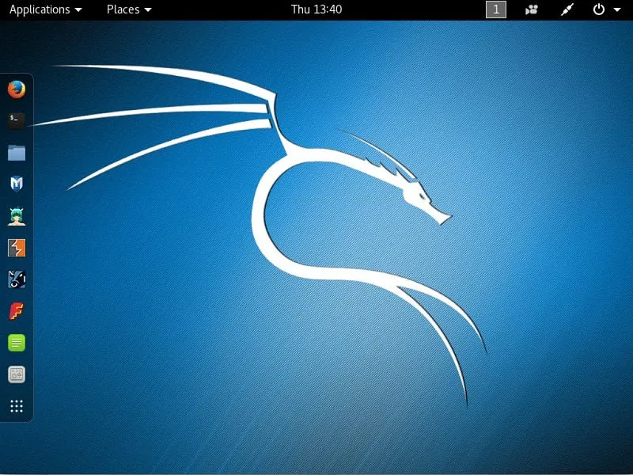

Kali Linux

It provides an invaluable platform, especially when performing penetration tests and security research.

#### [ParrotOS](https://www.parrotsec.org/)

ParrotOS is another Linux distribution designed for information security, developer tools and personal data protection. Like Kali Linux, ParrotOS comes with many tools used for cybersecurity and penetration testing. But ParrotOS also offers advanced coding and software development tools, making it suitable for both security professionals and developers.

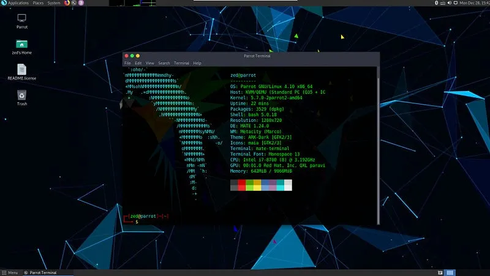

ParrotOS

ParrotOS offers a lighter and more user-friendly interface. This makes it convenient to use even on devices with low hardware specifications. It also includes features that focus on privacy and anonymity, so it may also be preferred by users who care about online privacy.

#### [BackBox](https://www.backbox.org/)

BackBox is a Linux distribution designed for cybersecurity experts and penetration testing professionals. Based on Ubuntu, BackBox includes a variety of open source tools for penetration testing, security assessments, and network analysis. With a user-friendly interface and advanced customization options, BackBox is especially ideal for users who want to perform security analysis.

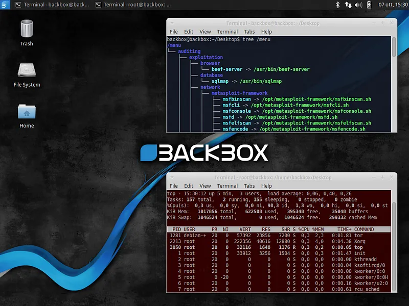

BackBox

#### [SamuraiWTF](https://www.samurai-wtf.org/)

SamuraiWTF (Web Training Framework) is a Linux desktop distribution designed for application security training. It was developed by OWASP (Open Web Application Security Project) and provides a training environment that includes web application testing tools. This distribution is available as pre-configured virtual machines and comes with various security tools.

SamuraiWTF

SamuraiWTF is used primarily for web application security testing and training. It includes popular tools such as OWASP Juice Shop, OWASP Zed Attack Proxy (ZAP) and SQLMap. It also includes some proprietary software, such as PortSwigger's Burp Suite Community Edition.

#### [ArchStrike](https://archstrike.org/)

ArchStrike is a security-focused Linux distribution based on Arch Linux. This distribution is designed for cybersecurity professionals and enthusiasts and includes security tools such as OWASP (Open Web Application Security Project). ArchStrike is designed in accordance with the "Arch Way" principles of Arch Linux and is optimized for i686, x86\_64, ARMv6, ARMv7 and ARMv8 architectures.

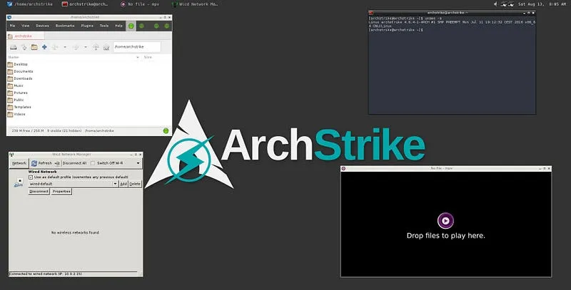

ArchStrike

#### [BlackArch](https://www.blackarch.org/)

BlackArch is a cybersecurity and penetration testing distribution based on Arch Linux. This distribution is designed for cybersecurity professionals and researchers and includes security tools such as OWASP (Open Web Application Security Project). BlackArch offers a wide range of tools and can be used not only for cybersecurity testing but also for general security research.

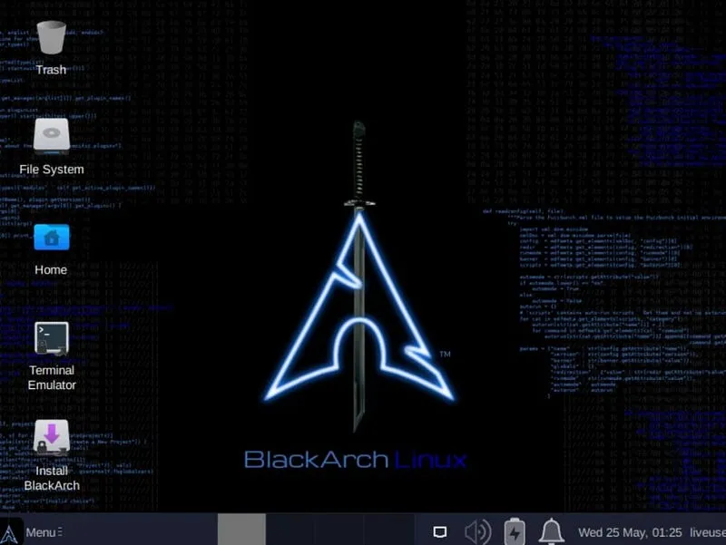

BlackArch

BlackArch is designed in accordance with the "Arch Way" principles of Arch Linux and is optimized for i686, x86\_64, ARMv6, ARMv7 and ARMv8 architectures. Additionally, BlackArch's full ISO and Slim ISO offer different user experiences.

#### [Fedora Security Spin](https://fedoraproject.org/wiki/Security_Lab)

**Fedora Security Spin** is a custom version of Fedora Linux and is optimized for information security, penetration testing, forensic analysis and security training. This spin comes with many pre-installed security tools and offers users a comprehensive security testing environment. Using the Xfce desktop environment, it can run comfortably even on low-resource systems.

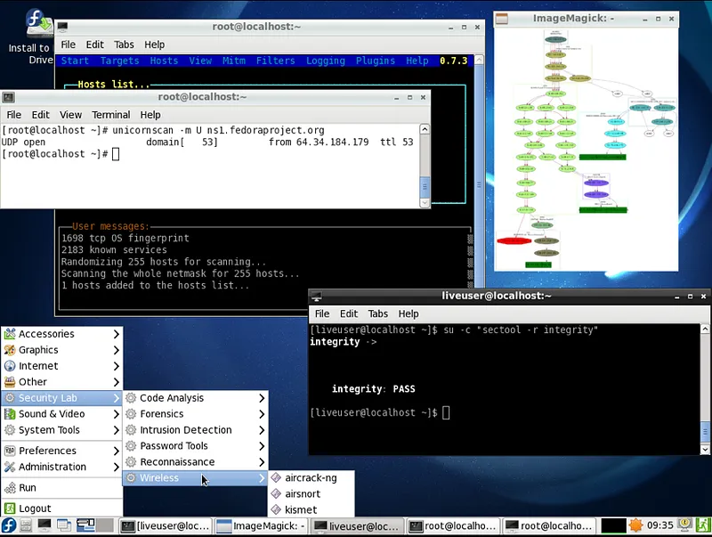

Fedora Security Spin

#### [Pentoo Linux](https://pentoo.org/)

Pentoo Linux is a Linux distribution designed for cybersecurity and penetration testing. Based on Gentoo Linux, Pentoo includes many tools and software for penetration testing and security assessments. Pentoo can run on both 32-bit and 64-bit systems and is available via live CD or USB.

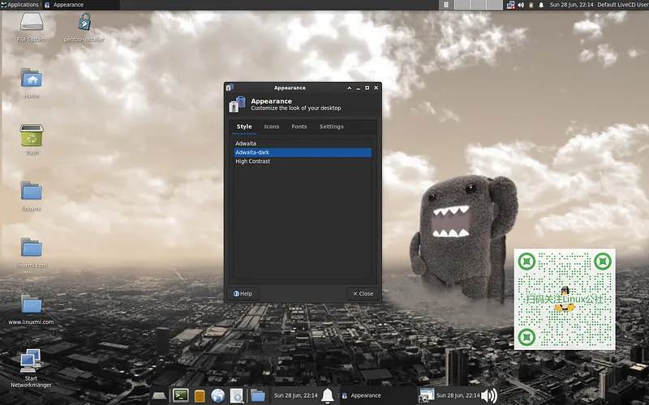

Pentoo Linux

Pentoo Linux is an ideal platform especially for cybersecurity experts and researchers. If you need any more information or help, I'm here!

---
## Forensics Distributions

Let's look at distributions on the defensive side and forensic purposes in general.

#### [Tsurugi Linux](https://tsurugi-linux.org/)

Tsurugi Linux is a Linux distribution designed specifically for digital forensics (DFIR) and OSINT (Open Source Intelligence) investigations. This distribution is based on Ubuntu 22.04.3 LTS and uses a customized 6.9.3 kernel. Tsurugi Linux can be used for tasks such as malware analysis, incident response, and digital evidence collection.

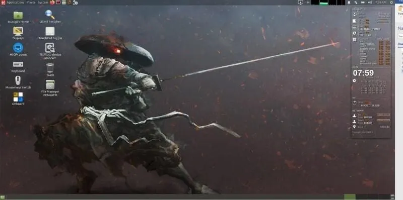

[Tsurugi Linux](https://tsurugi-linux.org/)

Tsurugi Linux is an ideal platform, especially for those who want to do digital forensics and OSINT research.

#### [Santoku Linux](https://github.com/santoku/Santoku-Linux)

Santoku Linux is a Linux distribution designed for mobile security, malware analysis and digital forensics (DFIR) investigations. This distribution includes security tools that work on mobile platforms such as Android and iOS and has a user-friendly interface. Santoku Linux can be run via live CD or USB and can be used without being installed on a hard disk.

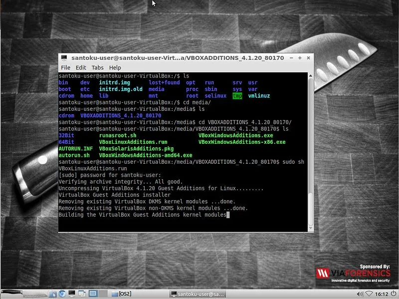

Santoku Linux

Santoku Linux is an ideal platform, especially for those who want to conduct mobile security and digital forensics research.

#### CAINE Linux

CAINE Linux (Computer Aided Investigative Environment) is an Italian Linux distribution developed by Giovanni “Nanni” Bassetti. CAINE is designed for digital forensics (DFIR) and incident response. This distribution brings together all the tools needed to perform digital forensics processes such as data preservation, collection, examination and analysis.

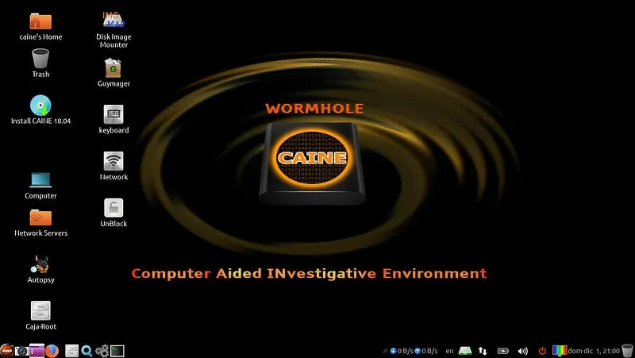

CAINE Linux

CAINE Linux is a powerful tool for digital forensics professionals.

#### [REMnux](https://docs.remnux.org/)

REMnux (Reverse Engineering Malware Linux) is a Linux distribution for analysis and reverse engineering of malware. This distribution includes many pre-installed tools and software to examine and analyze malware. REMnux is an ideal platform especially for security experts and researchers.

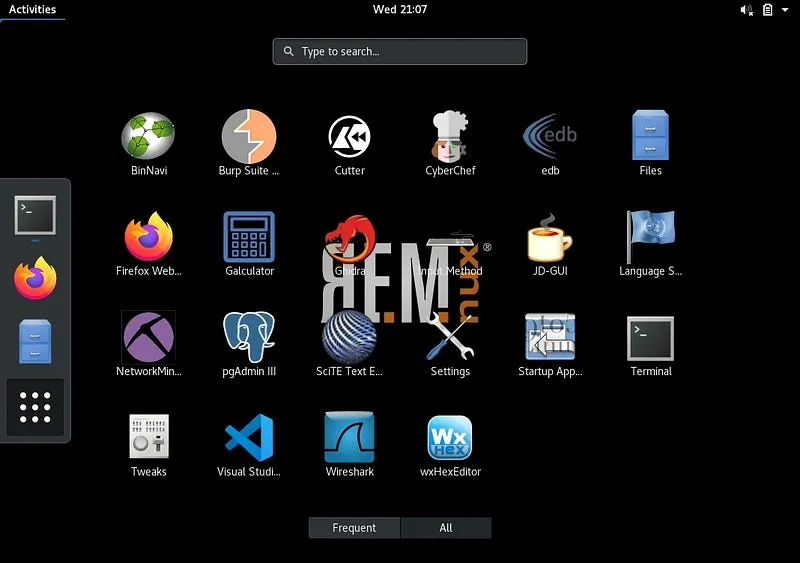

REMnux

REMnux is a powerful tool used in malware analysis and security research. If you need any more information or help, I'm here!

#### [FLAREVM](https://github.com/mandiant/flare-vm)

FLAREVM (FireEye Labs Reverse Engineering VM) is a virtual machine distribution developed by FireEye and used for Windows-based reverse engineering and malware analysis. FLARE VM includes many popular security tools and software and helps users perform reverse engineering and malware analysis.

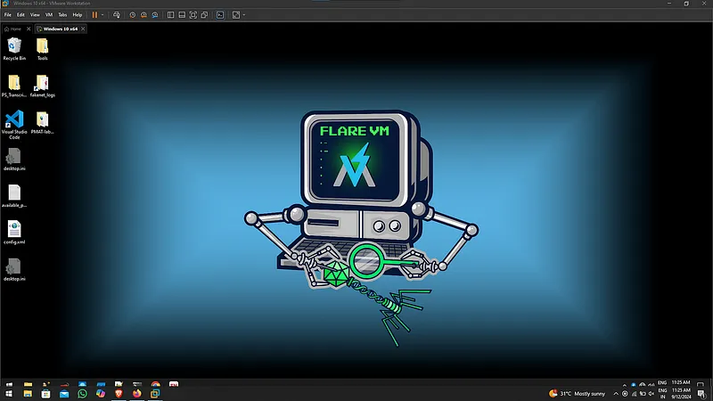

FLAREVM

FLARE VM is a powerful tool for security professionals and researchers. If you need any more information or help, I'm here!

#### [Security Onion](https://securityonionsolutions.com/)

Security Onion is a network security and event monitoring platform. This platform is used to monitor network traffic, detect threats, and respond to security incidents. Security Onion, ElasticseIt comes with tools like arch, Logstash, Kibana (ELK Stack) and includes many security tools like Snort, Suricata, Bro, Wazuh, Sguil, Squert, CyberChef, NetworkMiner.

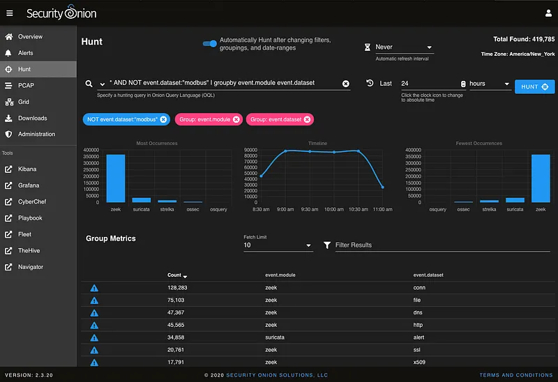

Security Onion

Security Onion is an ideal platform for those who want to perform security monitoring and threat analysis, especially in large-scale networks.

#### [CSI Linux](https://csilinux.com/)

CSI Linux is a Linux distribution designed for digital forensics (DFIR) and cybersecurity research. CSI Linux comes with many pre-installed tools and software, helping users perform tasks such as digital evidence collection, malware analysis, and network investigations.

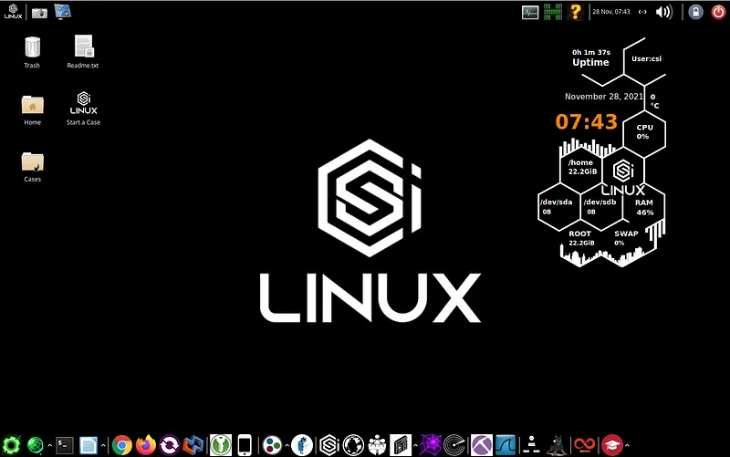

CSI Linux

#### [Network Security Toolkit](https://www.networksecuritytoolkit.org)

Network Security Toolkit (NST) is a Fedora-based Linux distribution and includes network security and analysis tools](<https://www.networksecuritytoolkit.org/>). NST is designed to monitor network traffic, detect threats, and respond to security incidents](<https://www.networksecuritytoolkit.org/>). This distribution includes many popular open source network security tools and offers a user-friendly web user interface (WUI)](<https://www.networksecuritytoolkit.org/>).

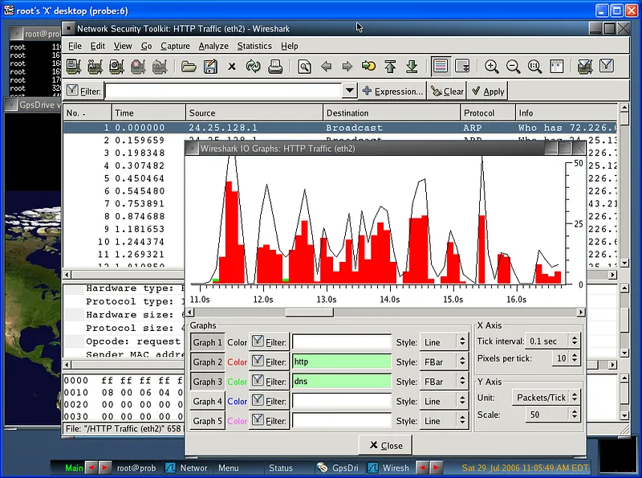

NST

NST is an ideal platform especially for network security experts and administrators.

---
## Anonymization Distributions

It is available in distributions used for anonymization and privacy. Let's look at these.

#### **1-** [**Tails**](https://tails.net/)

Tails(The Amnesic Incognito Live System) is an anonymous and privacy-oriented Linux distribution. It encrypts your internet traffic and protects your user data.

#### **2-**[**Whonix**](https://www.whonix.org/)

Whonix runs on KVM or VirtualBox virtual machines to increase anonymity and security.

#### **3-** [**Qubes OS**](https://www.qubes-os.org/)

Qubes OS is a security-focused distribution and isolates user data and processes.

---
## Lab Environments

Let's look at the lab environments used for pentest practices and training.

#### [**BloodHound**](https://github.com/BloodHoundAD/BloodHound)

BloodHound is a single-page JavaScript web application that helps you uncover hidden and often unplanned relationships in Active Directory (AD) environments. This application is built on Linkurious, compiled with Electron and connected to the Neo4j database. BloodHound reveals hidden relationships and potential attack paths in AD or Azure environments.

bloodhound

BloodHound is a powerful tool used in security analysis and identification of attack routes in AD environments.

#### [GOAD](https://github.com/Orange-Cyberdefense/GOAD)

GOAD (Game of Active Directory) is a project developed by Orange Cyberdefense and available on GitHub. GOAD is a laboratory project designed to perform penetration tests and security analyzes in Active Directory (AD) environments. This project allows pentesters to practice common attack techniques in AD environments.

GOAD

GOAD is a powerful tool used in penetration testing and security analysis. If you need any more information or help, I'm here!

#### [DetectionLab](https://detectionlab.network/)

DetectionLab is a laboratory project designed to set up an Active Directory (AD) environment and perform security monitoring along with security tools. This project is automated using tools such as \*\*Packer, Vagrant, PowerShell, Ansible and Terraform\*\*. DetectionLab deploys a Windows-based AD environment and includes security monitoring and analysis tools.

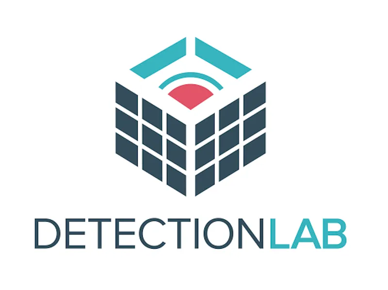

DetectionLab

DetectionLab offers defense-focused security professionals the ability to quickly set up an AD environment and use security tools.

#### [Attack Range](https://github.com/splunk/attack_range)

Splunk Attack Range, an open source project developed by the Splunk Threat Research Team and available on GitHub, allows you to create local or cloud environments that simulate security threats and attacks. These environments, Splunk collects threat data analysis and helps you develop threat detection rules using this data.

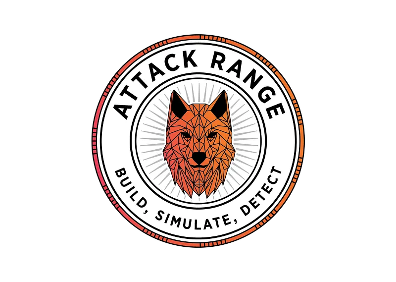

Attack Range

Splunk Attack Range is a powerful tool for security professionals and researchers.

#### [BlueTeam.Lab](https://github.com/op7ic/BlueTeam.Lab?tab=readme-ov-file)

BlueTeam.Lab is a Blue Team detection lab built in Azure using Terraform and Ansible, as a project developed by op7i and available on GitHub\*\*. This laboratory can be used by the red (attack) and blue (defense) team to test various offensive techniques and analyze forensic evidence.

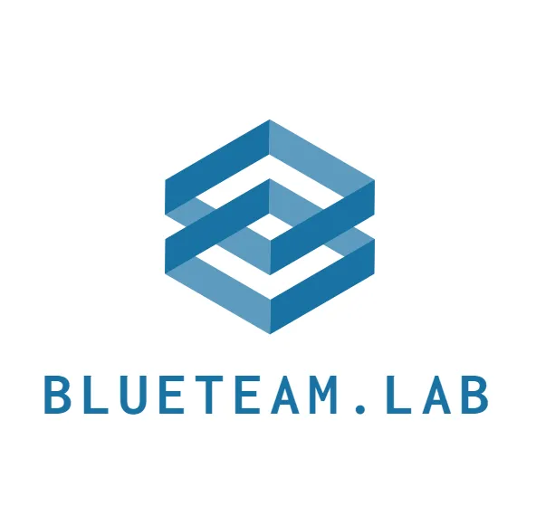

BlueTeam.Lab

BlueTeam.Lab is a powerful tool for defense-focused security professionals and researchers.

#### [Vulnhub](https://www.vulnhub.com/)

Vulnhub is an educational platform for cybersecurity professionals and enthusiasts. It contains many virtual machines of various difficulty levels. These virtual machines help users improve their cybersecurity knowledge and experience.

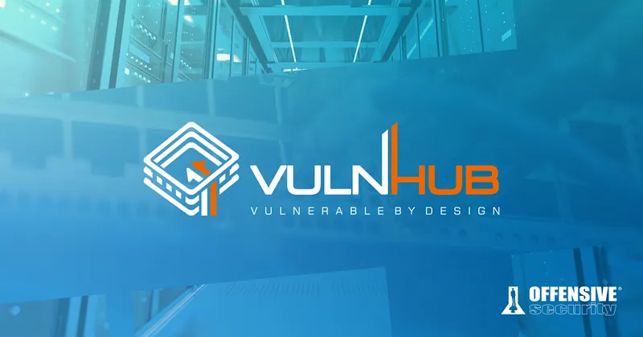

vulnhub

Vulnhub is an ideal resource, especially for those who want to practice penetration testing and network security. If you need any more information or help, I'm here!

---
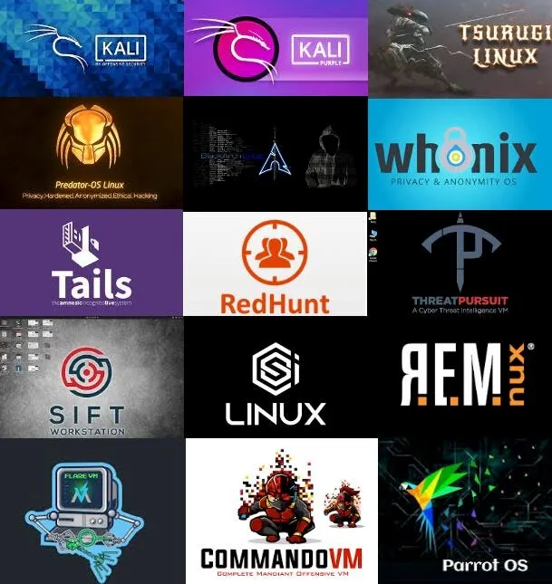

In this article, I tried to mention all the distributions used in the field of cyber security. If there are any points I missed, you can contribute by writing a comment.