## Basic Concepts


In this guide, we will cover the fundamentals of malware analysis; viruses, worms etc. You may have heard the terms. But what do these things mean? Is a virus a worm? What exactly does malware do? Let's learn these...

### Malware

Malware comes from the combination of the words malicious and software. It is a piece of software used by hackers to infect systems and perform damaging actions.   
Such software may lead to data loss or process interruption.

Malware has two main components:

* **Propagation mechanism:** How a malware spreads itself to one or more systems.
* **Payload:** It is the action that a malware performs on an infected device or system.

We can classify malware according to its distribution method and function. However, malware can also be a mixture of many of these types. Therefore, it may be difficult to finalize the classification.

#### Malware Symptoms

Regardless of the type of malware that has infected a system, there are some common symptoms to look out for. These are:

* Increase in central processing unit (CPU) usage, resulting in slowing down of your computer
* Frequent freezing or crashing of your computer
* Decrease in your web browsing speed
* Unexplained problems with your network connections
* Modified or deleted files
* Presence of unknown files, programs or desktop icons
* Unknown processes running
* Programs that close or reconfigure themselves
* Emails sent without your knowledge or consent.

### Propagation Mechanisms

If we classify malware according to its distribution method, that is, its propagation mechanism, we can generally divide it into 3 types.

#### Virus

Viruses depend on some means of entry, and specifically a user action, to enter a system. For example, a user might download a file or plug in a USB device that contains a virus and contaminates the system. Viruses can infect the system through spam e-mails or files downloaded from unsafe websites.


#### Worm

Unlike a virus, a worm does not require any user action to spread itself across systems. Instead, it causes damage by finding vulnerable systems that it can exploit. Once inside, the worm can spread to other connected systems on the network.

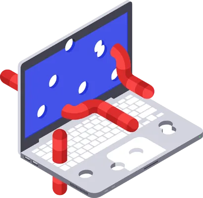

#### Trojan (Trojan Horse)

A Trojan is a type of malware that behaves like a real piece of software. When a user installs the program, it works as expected. However, the program performs harmful functions in the background.


### Payloads

When malware infects systems, it can perform many harmful functions. Roughly some of these are:

#### Ransomware

It is a program that locks the systems or data it infects. The attacker then demands a ransom in exchange for unlocking the files. If the ransom is not paid by the set deadline, all files may be deleted.


#### Spyware

It is a type of program that spies on a device or system. Such software can install keyboard scanning software on a device without the user's knowledge, collect password details and pass them on to the attacker.


#### Backdoor

It is software that allows a cybercriminal to exploit a vulnerability in a system or device to bypass existing security measures, giving the attacker access to the target system.


#### Botnet

It is software that can remotely control a computer, server or other device to perform some illegal activity and connect it to a network of similarly infected devices. In this system, infected devices are called zombies, and the network consisting of all infected devices is called a botnet.

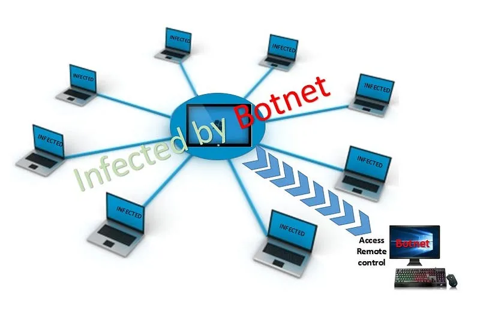

### Malware Analysis

Malware analysis is a set of analyzes performed to understand how a malware works, how to identify it, and how to prevent or eliminate it.

There are two basic approaches to malware analysis:

* **Static analysis:** involves examining malware without executing it.
* **Dynamic analysis:** involves the execution of malware.

There are many tools and distributions developed for these analyses. We will talk about these in more detail in the following sections.

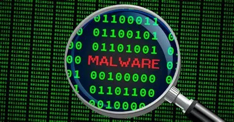

#### General Rules of Malware Analysis

First of all, don't get too hung up on the details. Most malware programs are large and complex, and you probably won't understand every detail. Focus on key features instead.

Second, remember that there are different tools and approaches for different jobs. There is no single approach. Every situation is different, and the various tools and techniques you will learn will have similar and sometimes overlapping functions. If you have no luck with one tool, try another. If you get stuck, don't spend too much time on any one topic. Try analyzing the malware from a different angle or try a different approach.

Finally, remember that malware analysis is like a cat-and-mouse game. As new malware analysis techniques are developed, malware developers respond with new techniques to thwart analysis. To be successful as a malware analyst, you need to recognize, understand, and defeat these techniques.

### Detection of Malware

There are many methods to verify that a software is malicious. Some of them are:

* Using antivirus tools
* Using software hash values
* Examining the strings, functions and headers of the software

Each technique can provide different information, and the techniques you use depend on your goals.

#### Antivirus Scanning

When analyzing possible malware for the first time, a good first step is to run it through an antivirus program that may have already identified it. However, antivirus software is by no means perfect.

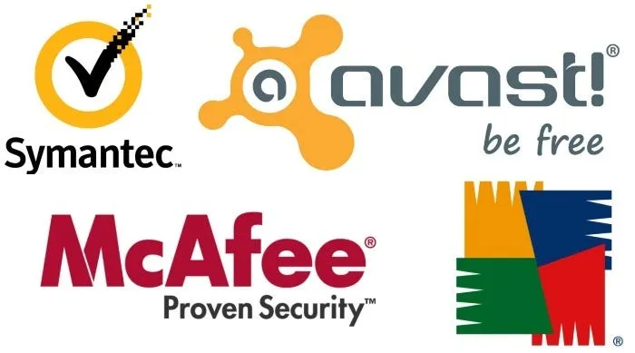

Antiviruses rely on a database of signatures of known malicious code, as well as behavioral and pattern matching analysis (heuristics) to identify suspicious files. The problem here is that malware developers can easily change their code, thus evading virus scanners by changing the signature of their programs. Additionally, rare malware is often not detected by antiviruses because it is not in the database. Finally, although behavioral methods are generally successful in identifying unknown malicious code, they can be bypassed by new and unique malware.

#### Hash Values

Hashing is a common method used to uniquely identify malware. A unique hash value is obtained through a hashing program that produces a unique hash (a type of fingerprint) that identifies the malware.

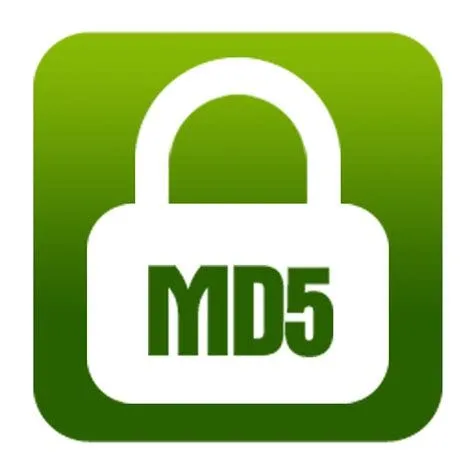

The Message-Digest Algorithm 5 (MD5) hash function is the most commonly used algorithm for malware analysis, but Secure Hash Algorithm 1 (SHA-1) is also popular.

#### VirusTotal

[VirusTotal](http://www.virustotal.com) is an online web platform that brings together many anti-malware products. You can upload a malware sample here. The sample uploaded here is scanned by many antivirus products and returns you a result report. In this report, you can see, for example, how it was evaluated by which software and its classification as type, category and family.

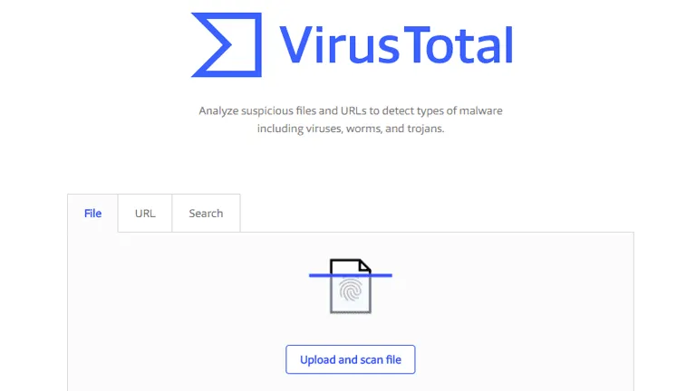


---
## Sandbox Installation


In this section, we will explain the environment setup and sandbox installation that we will use in malware analysis. What should we pay attention to when preparing the analysis environment? What tools will we use? Let's explore.

### Sandbox

We call the environment we use in Malware Analysis sandbox. Especially when examining with dynamic analysis, we have to run the malware in an isolated environment. The most useful method for this is to use a virtual machine. Of course, there are many virtualization software available for this; VirtualBox, VMWare Workstation and QEMU/kvm are a few of them. In this article, we will proceed through [VirtualBox](https://www.virtualbox.org/).


Apart from this, we also need to determine the operating system and version we will use in the virtualized environment. The majority of malicious software is developed to run on the Windows operating system. If we want to run these software and analyze them dynamically, we need to use the Windows operating system. However, if we want to analyze the malware statically, at this point we can also use the Linux operating system with the many reverse engineering tools it offers us. Moreover, there is also a Linux distribution that comes with the necessary tools installed, developed for malware analysis using the Linux operating system. You can review the distribution called REMNux, developed by [SANS Institute](https://www.sans.org), [here](https://docs.remnux.org/).

In this article, we will use the veteran Windows7 32-bit operating system. Because the majority of malware runs on Windows 7 and is 32-bit.

### VirtualBox Installation

VirtualBox is a general-purpose virtualization software developed by Oracle. You can download the version suitable for your current operating system and version from the downloads tab at <https://www.virtualbox.org/>.

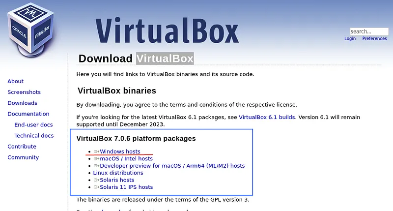

After downloading the installation file, run it and complete the installation.

### Windows7 Installation

To install Windows7, you first need to find a 32-bit ISO file. Since Microsoft has stopped supporting Windows7, we cannot download the ISO file from its website. You can find the iso file from other sites by typing windows7 iso on the internet. It's up to you which site you trust.

#### Virtual Machine Setup

After we have our ISO file ready, we can now start the installation. First of all, we need to create an empty machine on virtualbox. For this;

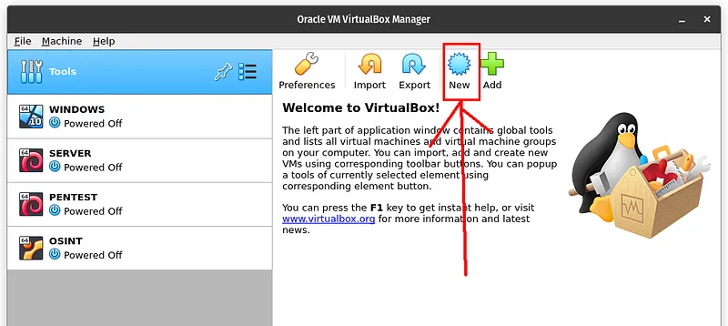

We click on the new button. In the window that opens, it asks us for operating system information.

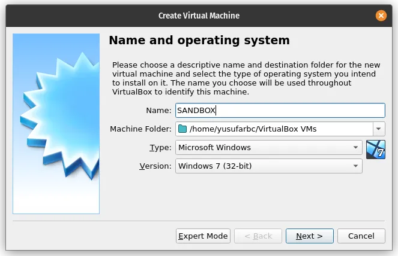

We choose Windows 7 (32-bit) and give a name to our machine. I named it SANDBOX. You can also give another name. Then we click on the Next button.

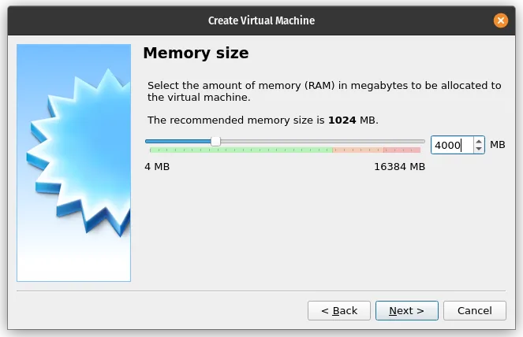

Here we adjust the RAM space we will give to the machine. I gave 4GB RAM. When the machine runs, 4GB of RAM of my computer will be allocated to this machine. You can give more if you want, depending on the condition of your system. We click on the Next button.

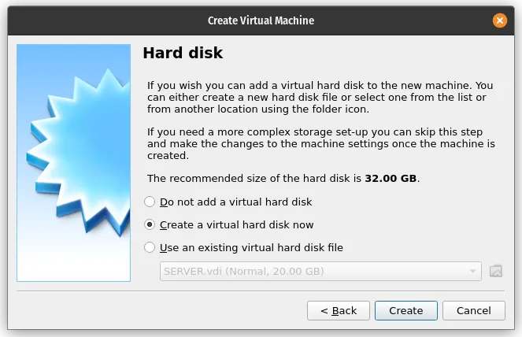

Here we create a virtual hard disk where system files will be installed. The part selected as default does our job. We click on the Create button.

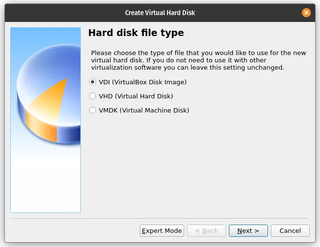

The Create Virtual Hard Disk menu will appear, with options such as VDI, VHDI, VMDK. I prefer VDI. We press the Next button.

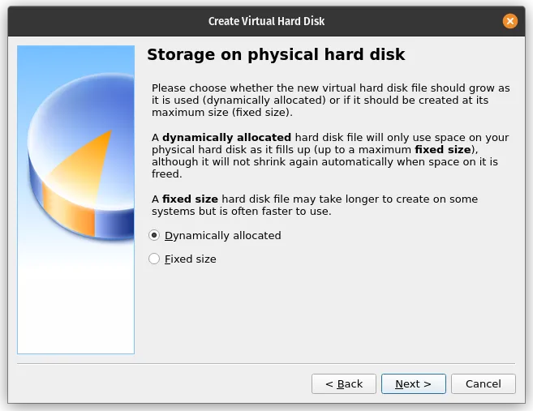

In the menu that appears, there are fixed size and dynamic size options. If you choose a fixed size, your system will be more stable, but you will completely lose the space you allocated to the system. In the dynamic size, the space you allocate to the system is increased as the virtual machine fills up. In other words, even if you give 100GB of space to the virtual machine, if 20GB is used within the virtual machine itself, 80GB will appear as free in your basic operating system and can be used. I prefer dynamic size since it is a sandbox machine. Continue with the Next button.

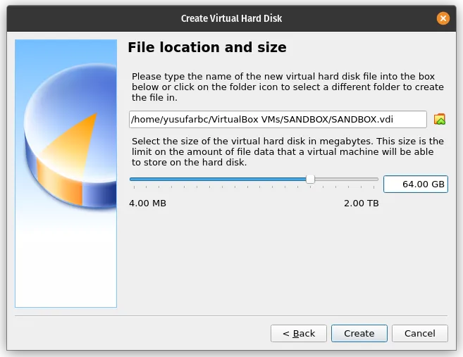

Here you determine the disk space you will allocate for the machine. It needs to be at least 32GB. I gave 64GB. We can continue with the Create button. And finally we created our empty virtual machine

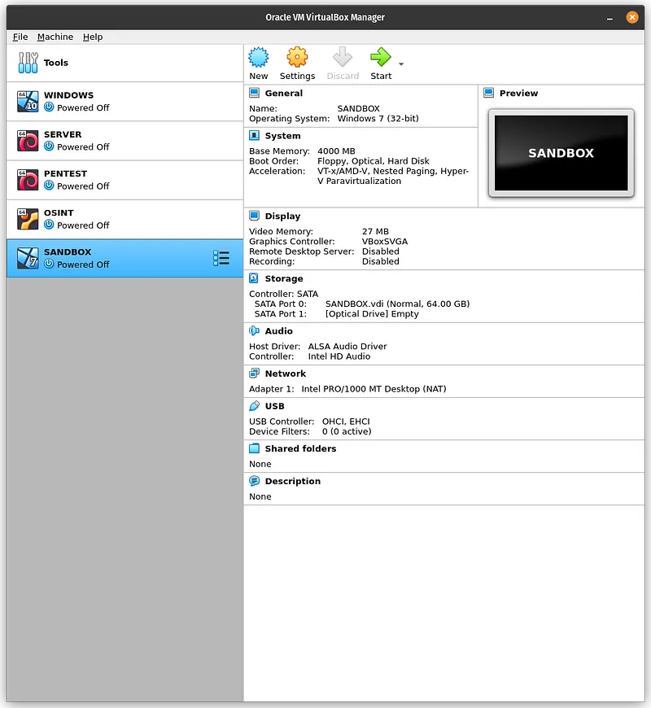

If you start the machine with the start button, you will only see a black screen. Because we haven't uploaded our ISO file yet.

#### Windows ISO Installation

To install the Windows ISO on the empty virtual machine we created, we need to edit the settings of the virtual machine.

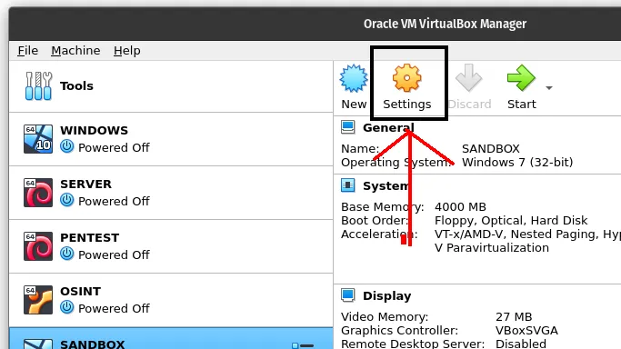

Now, with our SANDBOX machine selected in the menu on the left, we click on the settings button. Here we will make the settings for the machine.

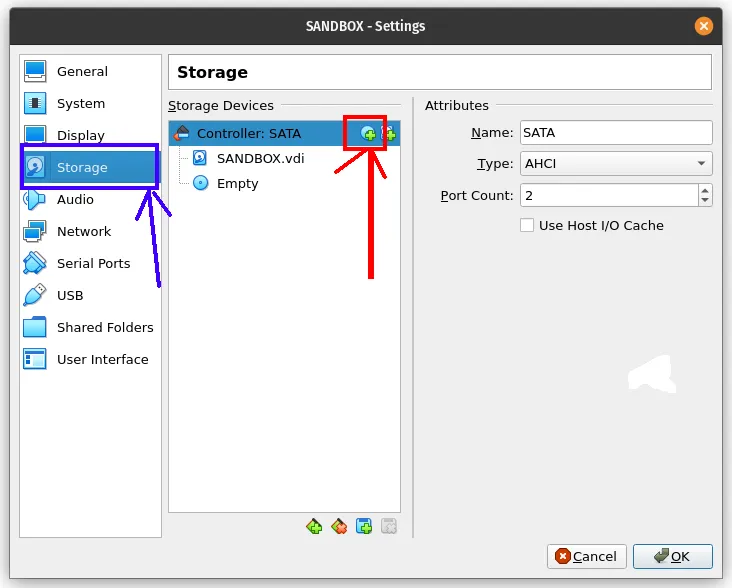

We can make many settings for our virtual machine from the menu that opens. We go to the storage tab from the menu on the left. Here we click on the + icon on the CD. We will upload our ISO file from here.

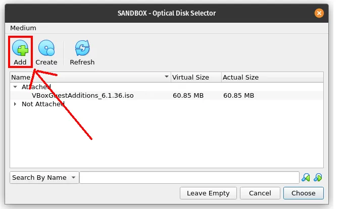

We click on the Add button from the menu that opens and from the window that opens, we find and select our Windows7 (32-bit) ISO file wherever we saved it on our computer.

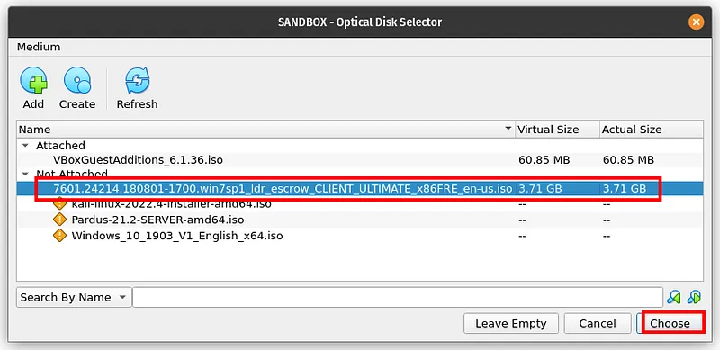

Then we select the ISO we uploaded and press the choose button. Our processing is complete, now we can start the machine.

#### Windows Installation

After that, it's a classic Windows installation. You can start the machine from the start button.

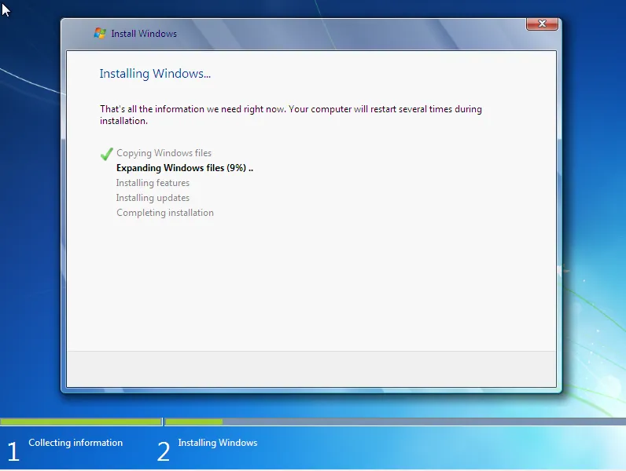

Windows installation is quite simple. You can easily do it from the Windows installation interface. After the machine installation is finished, Windows will start.

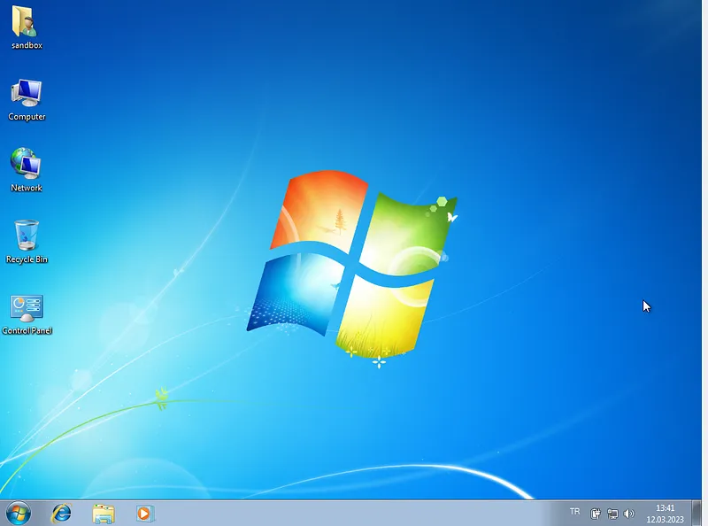

The next step is to install the tools required for Malware Analysis. Of course, you can install all of these at once, or you can install them gradually.

#### Machine Cloning

Now let's see how to put the machine down so that we don't have to worry about setting it up again if something happens to our machine.

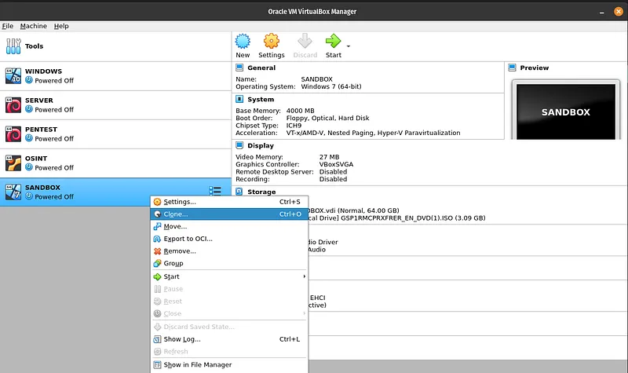

To do this, we right-click on our machine and click clone in the window that opens.

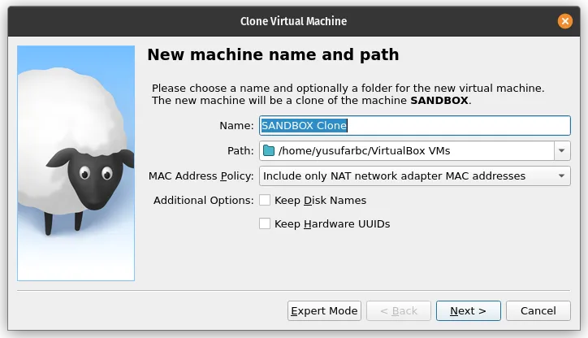

A window like this appears, we can press the next button and continue.

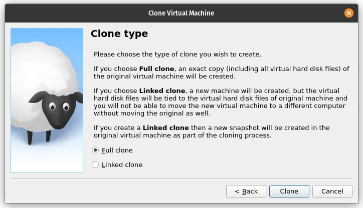

Here we need to determine the clone type. We have two types of clones.

**Full clone:** As the name suggests, it creates another one identical to the virtual machine. Therefore, it has no dependency on the machine it is cloned from.

**Linked clone:** The cloned machine is dependent on the host machine. So, if the host machine is deleted, its linked clone also becomes non-functional.

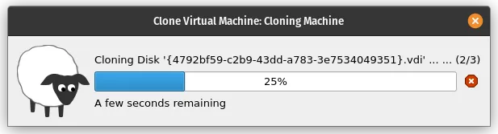

You can choose full clone and continue. Then wait until the VM is cloned and your clone is ready.

### Recommended Tools

Malware analysis requires the help of various tools. We will go through the list of various tools that need to be installed on the analysis VM and introduce the use of these tools as and when required in the following sections. A few of these tools do not have a GUI and must be run via the command line prompt. Some of them can be run from the desktop with a shortcut.

#### [QuickHash](https://quickhash-gui.org)

QuickHash is a fast and reliable cross-platform hashing tool. You can use this program to get the hash of the Malware.   
You can download it from this link: <https://quickhash-gui.org>


#### [PEView](http://wjradburn.com/software/)

PEView is a popular PE file parser.   
You can download it from this link: <http://wjradburn.com/software/>


#### [TrID](http://mark0.net/soft-trid-e.html)

It is a tool used to determine the file type.  
You can download it from this link: <http://mark0.net/soft-trid-e.html>

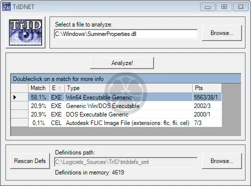

#### [Process Hacker](https://processhacker.sourceforge.io/)

Process Hacker analyzes running processes, their threads, running services, and network connections, disk usage, DLLs loaded per process, etc. It helps visualize various states of the system, including display. It also shows various features related to the process that can help analyze and examine malware if used appropriately.  
You can download it from this link: <https://processhacker.sourceforge.io/>


#### [ProcMon](https://docs.microsoft.com/en-us/sysinternals/downloads/procmon)

ProcMon handles process and thread creation, network activities, file related activities like creating and deleting files, registry related activities, etc. It is a well-known process monitoring tool that captures and displays various activities of processes running on the system, including  
You can download it from this link:<https://docs.microsoft.com/en-us/sysinternals/downloads/procmon>

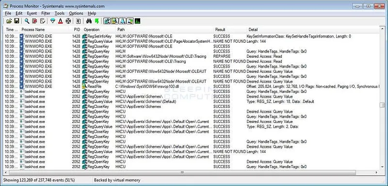

#### [Autoruns](https://docs.microsoft.com/en-us/sysinternals/downloads/autoruns)

The malware uses persistence mechanisms to persist and run automatically after the system reboots or the user logs in again. Autoruns captures the persistence mechanisms used by malware and provides a list of all programs configured to run at system startup or logon.  
You can download it from this link: [**https://docs.microsoft.com/en-us/sysinternals/downloads/autoruns**](https://docs.microsoft.com/en-us/sysinternals/downloads/autoruns)

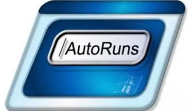

#### [Regshot](https://sourceforge.net/projects/regshot/)

Regshot is a registry diff/comparison tool that allows you to take a Windows registry snapshot and compare it with a second snapshot to view the registry difference.  
You can download it from this link: <https://sourceforge.net/projects/regshot/>

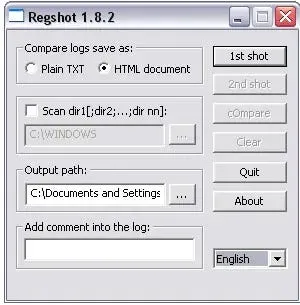

#### [FakeNet](https://sourceforge.net/projects/fakenet/)

FakeNet is a dynamic malware analysis tool available for Windows that captures and logs outgoing network connections from the malware and returns simulated responses, thus disabling external network access to the malware.   
You can download it from this link: <https://sourceforge.net/projects/fakenet/>

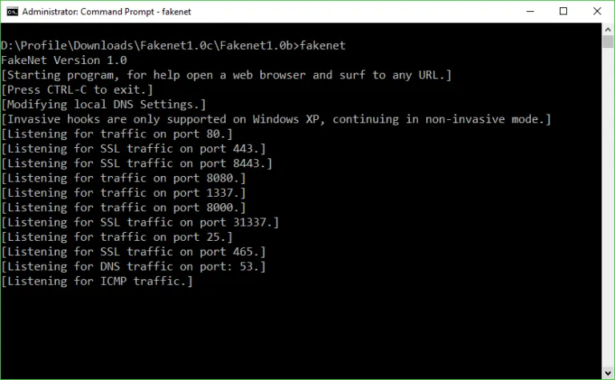

#### [BinText](http://b2b-download.mcafee.com/products/tools/foundstone/bintext303.zip)

Bintext is a static analysis tool that can extract ASCII and Unicode text strings from files.  
You can download it from this link: <http://b2b-download.mcafee.com/products/tools/foundstone/bintext303.zip>

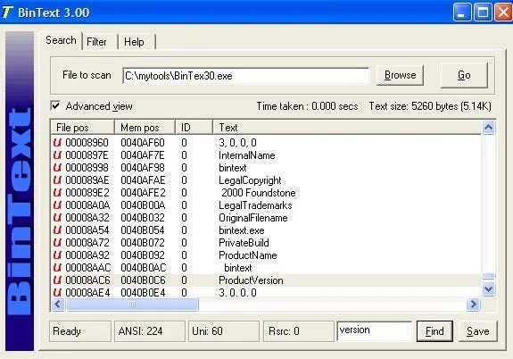

#### [YARA](https://virustotal.github.io/yara/)

YARA has been described as the Swiss army knife for malware researchers. It is very useful for detecting and classifying malware.  
You can download it from this link: <https://virustotal.github.io/yara/>


#### [Wireshark](http://www.wireshark.org)

Wireshark is a graphical packet analysis tool that can capture and examine live network traffic or analyze static packet capture (PCAP) files. Wireshark supports decoding of various protocols and provides built-in packet filtering feature that allows us to quickly examine any network traffic.   
You can download it from this link: <http://www.wireshark.org>


#### [GMER](http://www.gmer.net)

GMER is a tool we can use to detect both userspace API hooks and kernel model SSDT hooks.  
You can download it from this link: <http://www.gmer.net>

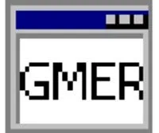

#### [DriverView](http://www.nirsoft.net/utils/driverview.html)

DriverView is a GUI tool that helps you view all installed drivers on your system and is a great tool to check if any malicious kernel modules/rootkits are installed on your system.  
You can download it from this link: <http://www.nirsoft.net/utils/driverview.html>

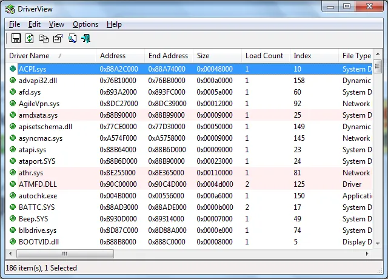

#### [Strings](https://docs.microsoft.com/en-us/sysinternals/downloads/strings)

Sysinternals Strings is a command line tool that helps you find all strings from files.  
You can download it from this link: <https://docs.microsoft.com/en-us/sysinternals/downloads/strings>

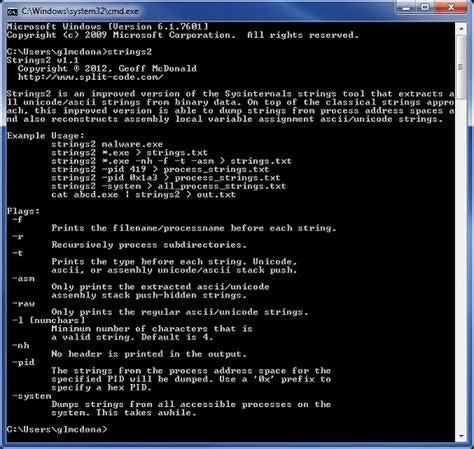

#### [Bulk Extractor](http://downloads.digitalcorpora.org/downloads/bulk_extractor/)

The Bulk Extractor network suite is a command line tool that captures files from memory dumps.  
You can download it from this link: <http://downloads.digitalcorpora.org/downloads/bulk_extractor/>

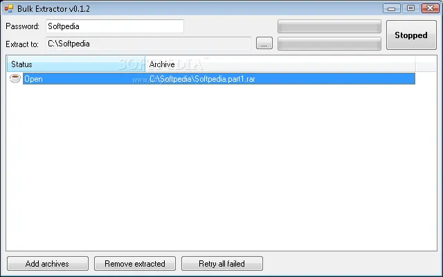

#### [OllyDbg](http://www.ollydbg.de/version2.html)

OllyDbg is a must-have tool for malware reverse engineering. It is a graphical x86 debugger that can run and debug x86 executables on windows.  
You can download it from this link: <http://www.ollydbg.de/version2.html>

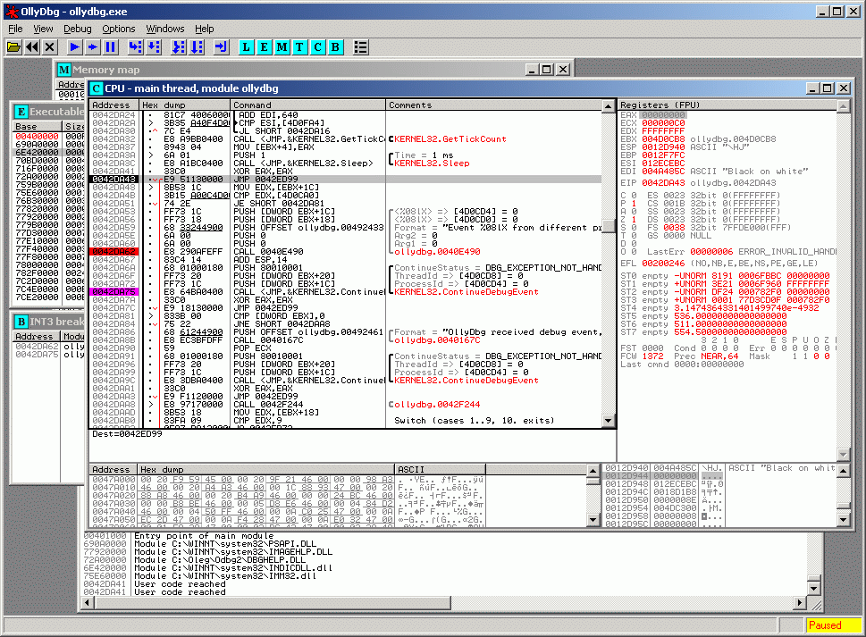


---
## Static Analysis


We will discuss how to perform static analysis of malware within our established environment, exploring various static analysis methods and tools.

### Static Analysis Methods

Static analysis is the analysis of malware before it is executed, as opposed to analyzing its execution and behavior, known as dynamic analysis.

Static analysis is a good first step in the analysis process. Using this, you can tell whether a sample is harmful or clean without even having to run it. You can even go as far as finding the type, family, and purpose of the malware without having to do any dynamic analysis.

Whether static analysis or dynamic, the first step always involves checking if others have any thoughts or conclusions about your software example. Often, others have already analyzed your sample or a similar sample from the same malware family and written a blog post about their analysis. In other cases, the same sample may have found its way into VirusTotal and other malware analysis platforms. You can research this on the internet.

In the following stages, we will discuss analysis techniques step by step.

### Hash value

If the hash value of a malware has been used before, it can provide a lot of information about that malware.

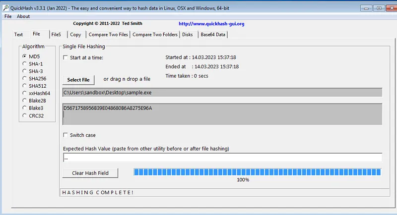

We can obtain the hash value of our malware sample with the QuickHash tool. In addition, it is available in many other tools. If we search for this value on Google:

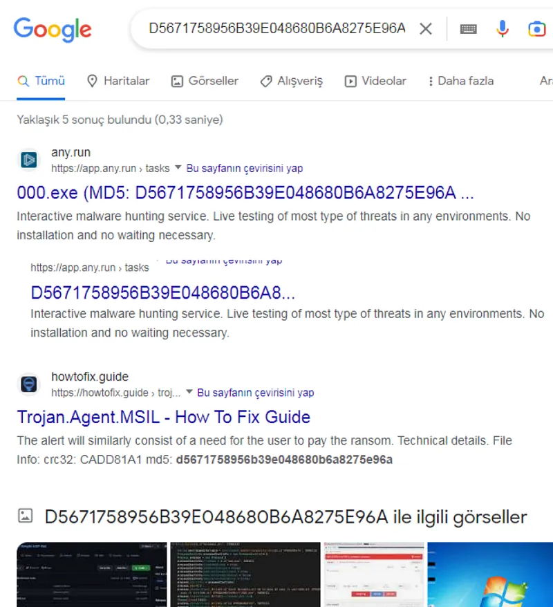

We come across a lot of information about this malware sample. You can also search for this hash value on virustotal.

### Detecting File Format

Malware comes in different file formats: PE files, .NET files, Java files, Scripts, JavaScript software, etc. They may also be written for different operating systems: Linux, Windows, macOS or Android. They may be targeted for a specific processor architecture: x86, x64, PowerPC, arm, etc. Depending on the type and target of the sample file you are analyzing, you may need different tools and even the operating system installation or processor type to analyze the sample file.  
A good first step is to find the format of the file, as this reveals a lot about what the target of the sample looks like. We can use the **trid** tool for this.

Extension spoofing works by using fake extensions as part of filenames. This technique exploits the ignorance of most user victims, who recognize such extensions as .pdf, .xlsx, and .doc as extensions and therefore think they are safe. By appending these extensions to malware filenames, attackers manage to trick victims into misreading them as non-.exe files, essentially tricking them into downloading and clicking on them.

### Version Information

Most clean software and files on our system have a Details tab at the bottom of the Properties window, which can be accessed by right-clicking on the file and selecting Properties. The Details tab shows various details about the file such as File version, Product name, Product version, and Copyright.

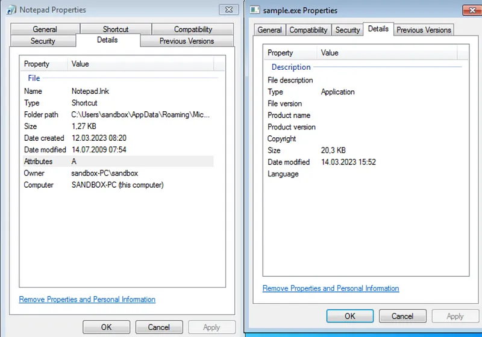

If you do not see well-defined areas and features that describe the application, you can consider the sample suspicious, warranting further investigation. Likewise, if you see field values that appear unimportant or have little or no meaning, you can consider the sample suspicious. You won't see neat apps that use unnecessary values to describe their features and version information.

### Code Signature Information

Just as we sign documents with our signature, cryptographically generated digital keys, also known as code signing certificates, are used to sign files. Unique digital signatures created for files using these code signing certificates trace back to the original author of the file.

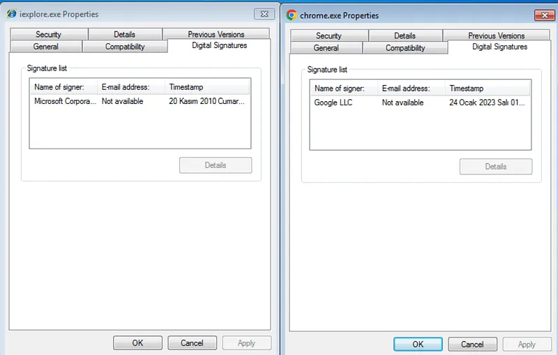

### String Analysis

Malware samples are nothing more than software programs and the final executable. It contains many strings as part of the software. These strings can often serve as very good indicators to determine the type, functionality, and purpose of the software.

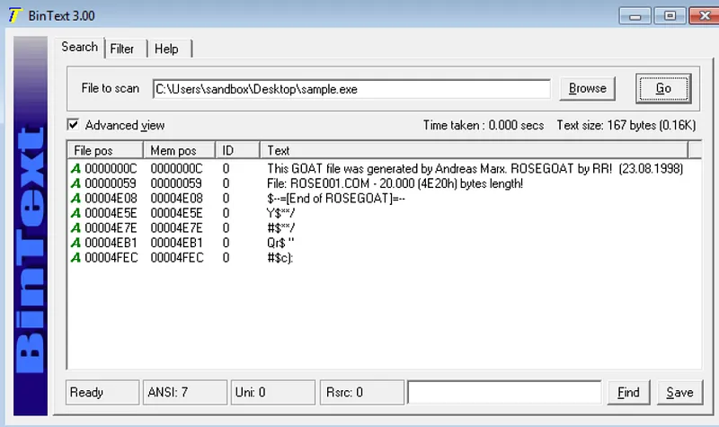

We can find the strings in the file with the BinText tool and get information from there. This GOAT file was created by Andreas Marx. ROSEGOAT from RR! (08/23/1998) File: ROSE001.COM -> 20,000 (4E20h) bytes long! We got information like this from here.

### Creating a YARA Rule

YARA is a tool that has been described as the Swiss Army Knife for malware researchers. It is a rule matching engine against files and all types of buffers in general. Using YARA, you can create rules using human-readable strings or even binary patterns, and combine these patterns using boolean expressions to match across files and buffers.

```
rule YARA_example  
{  
      meta:  
          description = "This is just an example"  
      strings:  
          $a = "ROSEGOAT"  
      condition:  
          $a  
}
```

If we run this rule on sample.exe, we see that there is a match.

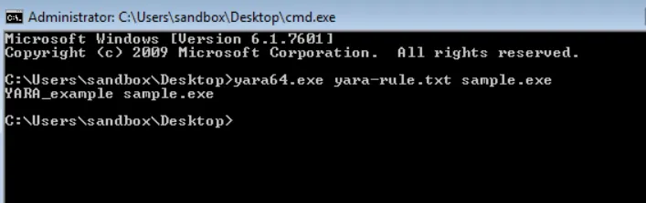

You can access more detailed information via YARA online.

### PE File Headers and Sections

The PE file format contains a header followed by a series of sections. The header contains metadata about the file itself. Following the header are the actual sections of the file, each containing useful information. We can view them with the PEview tool.

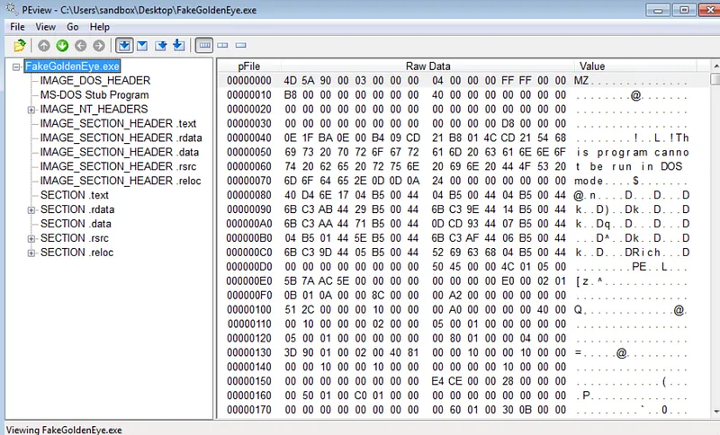

Common PE sections:

The * .**text** section contains the instructions that the CPU executes. All other partitions store data and supporting information. It is the only section containing executable codes.
The * .**rdata** section typically contains import and export information. This partition can also store other read-only data used by the program.
The * .**data** section contains general data of the program that can be accessed from anywhere in the program.
The * .**rsrc** section contains resources such as icons, images, menus, and strings that are used by the executable and are not considered part of the executable.

### Disassembly

Although there are many programs that can translate machine code into assembly language, we can say that IDA Pro is the best software.

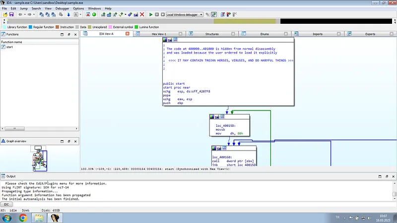

IDA pro is a paid software, but there is also a free version called IDA freeware, with which you can perform analysis.


---
## Dynamic Analysis


We will discuss dynamic analysis methods in Malware Analysis, including the types of dynamic analysis techniques, the tools used, and how the analysis is executed.

### Dynamic Analysis Methods

It involves executing a malware sample with the help of various tools and not only recording the behavior but also observing the various artifacts produced by the executing malware.

Although dynamic analysis and static analysis may seem like two different stages in the analysis process, they are not. As you review the various dynamic analysis steps and tools, you may need to go back and apply the various static analysis steps you learned and then return to dynamic analysis again. This cycle may continue several more times.

Before starting dynamic analysis, you should ensure that your analysis environment is isolated and backed up. For this, as we mentioned in the sandbox installation article, you can create a clone of your Win7 machine and perform operations on this clone. Also make sure the network adapter is disabled or in host-only mode. To protect your base system, there should be no network connection within the virtual machine.

In the following stages, we will discuss analysis techniques step by step.

### First Startup

The best first step in the analysis process is to randomly run the example and notice its behavior at a very high level.

Many examples, such as ransomware, have obvious behavior. Running the sample and observing the effects of the software on the system and the files on the disk may be enough to conclude that the sample is malware and understand the type and purpose of the malware.

Casual observation of the behavior of executing malware helps us set our expectations and prepare ourselves for the next set of tools required to continue its in-depth analysis.

We may need to repeat this process and randomly re-run the same instance multiple times, as a single execution will not help us make enough observations about its behavior. It is recommended to reset the VM every time we randomly re-run the instance. For this, you can take a [snapshot](https://www.techrepublic.com/article/how-to-use-snapshots-in-virtualbox/) before running it and restore it after running the malware.

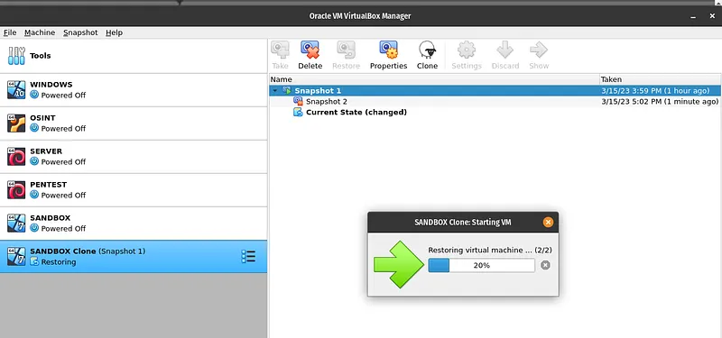

In carrying out this process, we can also get help from a few simple tools, such as Process Hacker and a file browser, which help us passively observe the behavior of the sample.

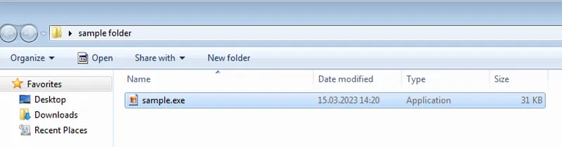

For example, here we have a malware called sample.exe. Let's observe what happens when we run it.

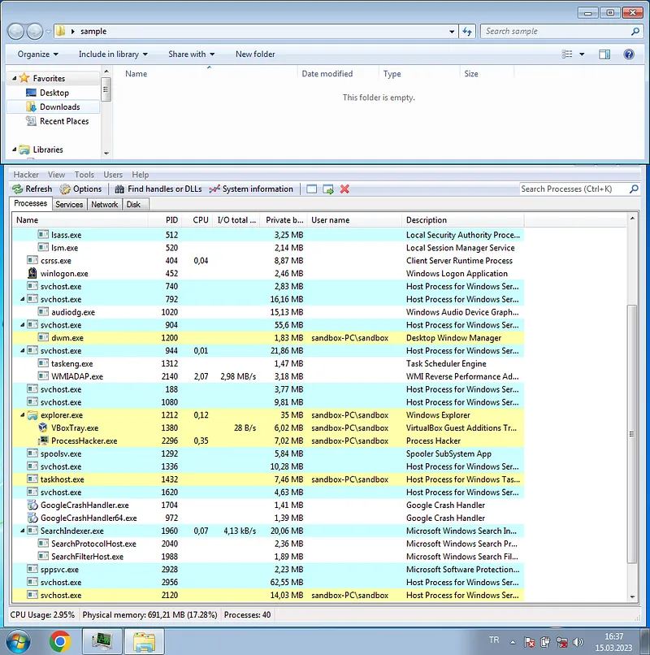

The sample.exe element disappeared and new processes started. Our computer is now infected.

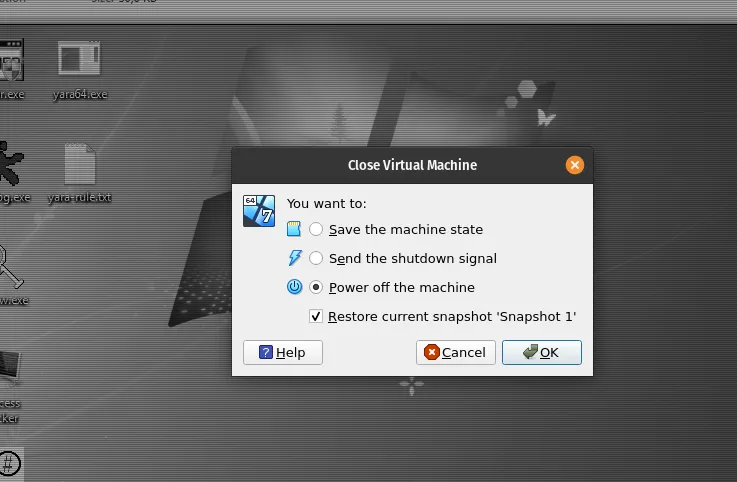

After our process is completed, we need to restore the snapshot to reset our machine. When we restart, the machine will start as it was when we took the snapshot.

### API Log Behavior

The malware carries out its activities through Win API calls. You can obtain the APIs used by an instance using an API logger tool such as APIMiner or Cuckoo Sandbox. Based on APIs, you can conclude whether the sample is malware and find out its category.

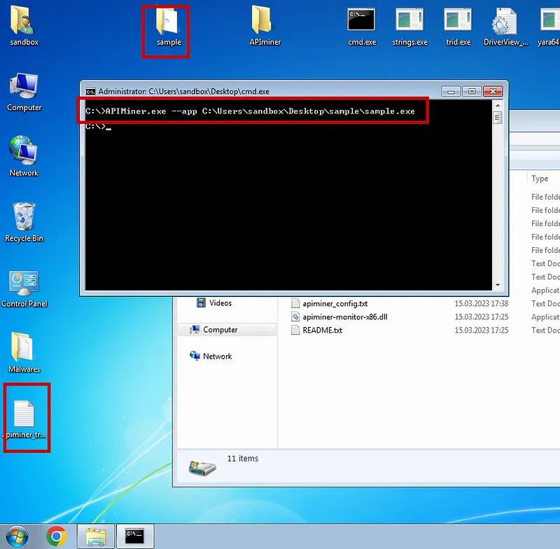

[APIminer](https://github.com/poona/APIMiner) tool creates a log file for us. Log files are arranged in chronological order. The first file you see will be the first file created. You can see the created log file below.

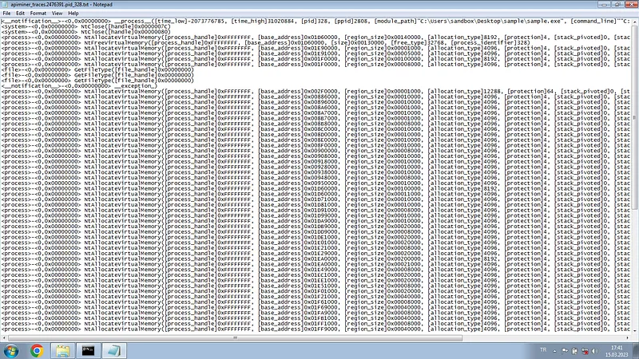

So, what inferences will we draw from this information?

CreateProcessInternalW([command_line]"svchost.exe",  
 [process_identifier]4080,  
 [thread_identifier]3248,  
 [creation_flags]4  
 [process_handle]0x00002A7C,  
 [thread_handle]0x00002A78)  
NtReadVirtualMemory([process_handle]0x00002A7C)  
NtMapViewOfSection([process_handle]0x00002A7C)  
NtReadVirtualMemory([process_handle]0x00002A7C)  
NtUnmapViewOfSection([process_handle]0x00002A7C)  
NtResumeThread([thread_handle]0x00002A78,  
 [process_identifier]4080)

Let's take this part and go item by item.

* Using the CreateProcessInternalW API, the example creates a new process for the system program svchost.exe.  
  The process located at C:\Windows\System32\svchost.exe
* The created process is in SUSPENDED state, defined using [creation_flags]4 using 4 argument values. How do we know that 4 means SUSPENDED? For the CreateProcess API, see the API description on MSDN and check the CREATE_SUSPENDED flag.
* The ID and thread of this newly created process are 0x00002A7C and 0x00002A78.
* The instance using the NtReadVirtualMemory API then reads memory from the remote process identified using process identifier 0x00002A7C
* Using the NtMapViewOfSection API, the example then creates a section and maps a view of it to the remote process identified using identifier 0x00002A7C.
* Resumes the SUSPENDED thread/process using the ResumeThread API defined using thread identifier 0x00002A78 and process identifier 4080.

What does this whole set of APIs look like? This indicates that the sample is using Process Hollowing, a technique frequently exploited by malware. This leads us to conclude that this is indeed malware.

### Determination of Malware Family

We concluded that it was malware from the API logs, but can we understand the family of the malware? Each malware belonging to the same family has features or structures specific to that family. Its properties can be investigated through API logs. For the example, there are three API log files created. Take the first log file and call the CreateMutant API, which creates a mutex.   
It is a synchronization method commonly used by malware. Our malware creates a mutex called 2GVWNQJz1, as you can see via the API call.

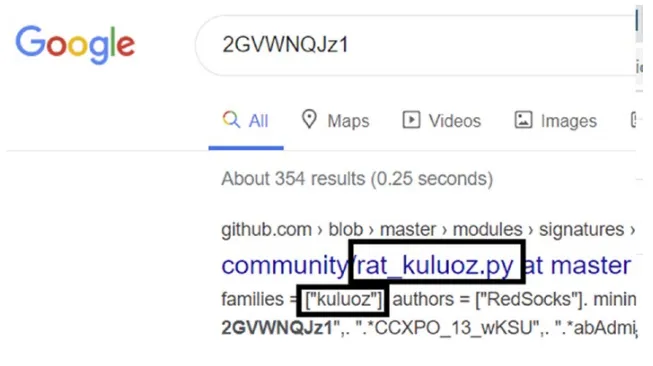

Mutex created by our sample reveals that it belongs to the kuluoz family and is a botnet virus

### Dynamic String Analysis

The first step in string analysis is to understand whether it is packed or not. If they are not packaged, strings can be detected with static analysis methods. If it is packaged, then dynamic analysis is needed.

PEiD is a great tool that can provide the entropy of a static file so you can tell whether it is packed or not, for example.

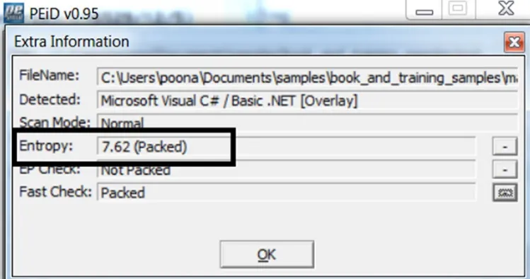

Strings are hidden in packaged malware. This makes static analysis of strings using BinText useless. When we run packaged malware, they unpack themselves in memory. Once you unpack it, all hidden strings will now become visible. We will try to detect these strings.

At this point, process hacker comes to our aid again. We can click on the process started by process hacker and view its memory data.

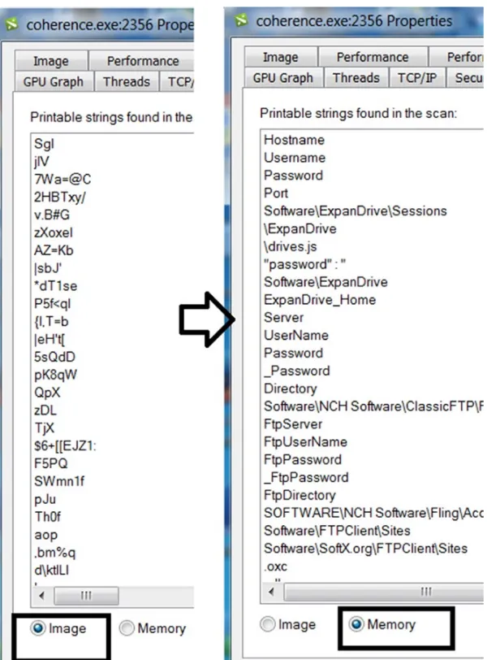

Here, we can see many strings.

What can we extract from these strings? There are numerous strings that refer to Username and Password, along with various protocols such as SMTP and POP, and various tools such as Filezilla and Internet Explorer. This indicates, for example, the infoStealers class of malware that tries to steal credentials from various tools that users use.

Look for strange names within strings that look different but still mean something (you need to be very patient for this). Among all these strings, there is also the string YUIPWDFILE0YUIPKDFILE0YUICRYPTED0YUI1.0, which looks very strange but also has a structure consisting of words such as CRYPTED and FILE0.

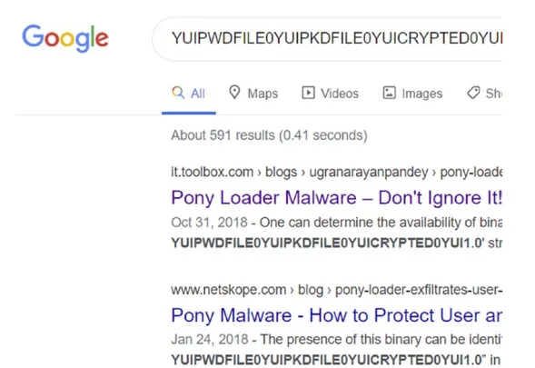

When we search for this string on Google, it points to many analysis reports for other malware samples, such as Pony Loader or Fareit, which belong to the same family as our sample.

### Debugging

Converting the example into assembly code and executing it may be useful to see the calls it makes. OllyDbg will help us at this point.

First of all, on OllyDbg we need to make a few small adjustments. We go to the Options menu.

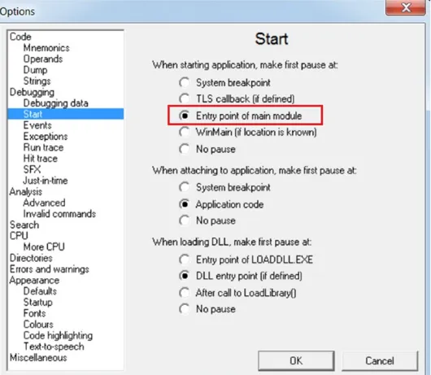

Here, we go to the start section on the left and select the Entry point of main module option.

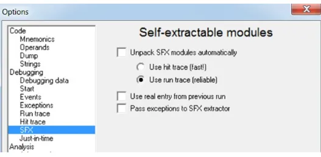

Then we go to the SFX section and uncheck the boxes. We are ready now. We open our malware file with OllyDbg. It may take a while to open.

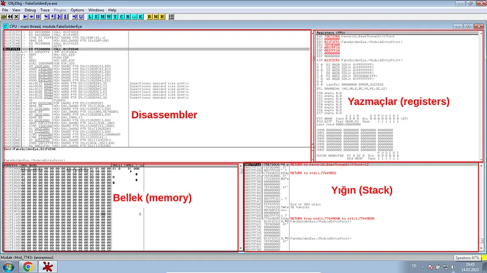

Here you see the main screen of OllyDbg. The image may be a bit intimidating. Actually, this part depends on your assembly knowledge.

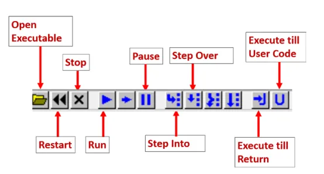

Quick access buttons on OllyDbg are as shown in the figure. With OllyDbg, you can run the software line by line and observe its actions.

### Behavioral Events Analysis

We will touch on ProcMon, another very important analysis tool that can capture various events when we analyze and run our example. Let's examine our analysis step by step.

1. Run Process Hacker to keep an eye on the process(es) that are started when you run your instance.
2. Start ProcMon and press Ctrl+E to stop capturing events. By default, ProcMon captures all events in the system, and sometimes you have too much activity.
3. Press Ctrl+X to clear the current events it displays.
4. Press Ctrl+E so you can start capturing events.
5. Run Sample.exe, making sure it runs through Process Hacker or at least creates other child processes.
6. Run the example for a while and then press Ctrl+E in ProcMon. However, you don't want to run it for too long; otherwise, you'll be overwhelmed with too many events to analyze.

Let's review the events and see if we can notice any malicious events/indicators from the events directly or indirectly related to our example process.

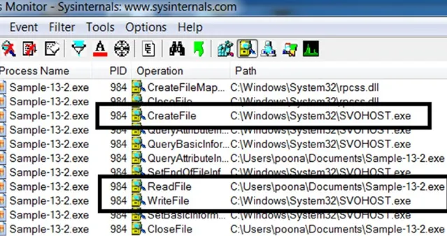

All events indicate harmful activity.

1. It tries to create a file called SCOHOST.EXE, which is very close to the system program svchost.exe.
2. sample.exe is reading its own content.
3. It writes the content it reads to SVOHOST.EXE. So it copies itself.

Copying and pasting its contents into this new file is a commonly used malware technique, where the malware copies themselves to a new file in another folder on the system and runs as a new process from this new file located in this new folder.

#### Autoruns

Since the malware sample created a RUN persistence entry, let's verify with the AutoRuns tool whether this persistence RUN entry still exists.

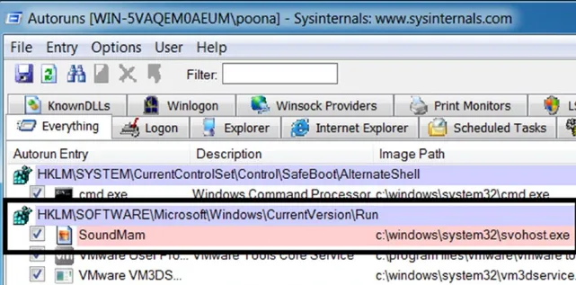

You can see the record created with the Autoruns tool.

### Code Injection Detection

Code injection is caught using various techniques. One method detects the use of certain Win32 APIs. You can easily detect code injection by considering these APIs and using a tool like APIMiner.

#### GMER

Let's say you understand that the malware sample is performing code injection. Not every code injection technique indicates that the malware is planning API hooking or trying to use rootkit functionality. However, at this point, it is likely that one of the malware's goals is API hooking or rootkit. At this stage, using the GMER tool is a good step.

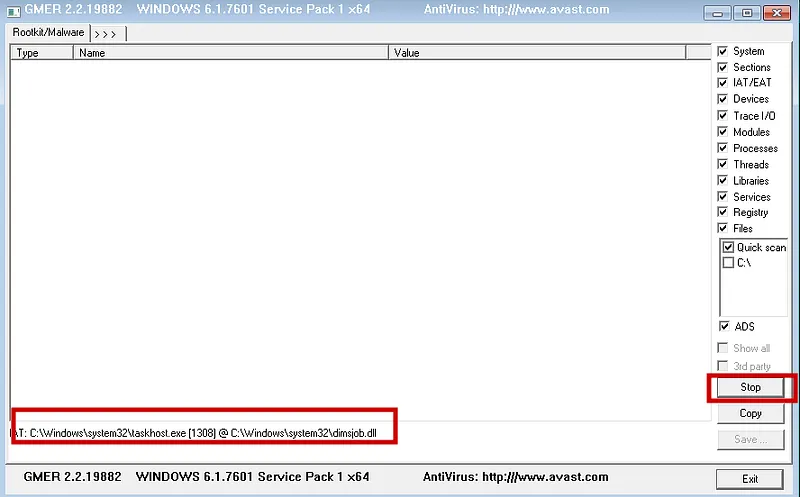

GMER Scan

### Memory Forensics

When executed, malware can create specific processes, files, log entries, install rootkits, etc. These malware structures can sometimes be self-destructed so that an analyst cannot detect them. For example, a malicious process may be terminated after code is injected into a legitimate process, or a temporary file created by the malware is deleted after being used. Using forensic techniques, you can retrieve such information and data even though it has been destroyed by malware, thus detecting malicious activities.

Memory Forensics has 2 basic steps:

* Memory acquisition
* Memory analysis

#### Memory Acquisition

Computer forensics begins with data collection. Since we want to look at memory, we need to use memory acquisition tools. Some of the tools that can retrieve an image (RAM dump) from memory include:

* FTK Imager
* RAM Capture
* Dump It
* Memoryze

We can use FTK Imager Lite to get the memory image. This tool is extremely lightweight and easy to use.

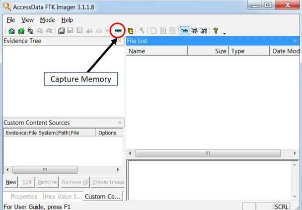

You can create a memory dump by clicking the Capture memory button. The memory dump file created has a special file format that can be understood by memory forensics tools.

#### Memory Analysis

To analyze our memory dumps, we can use a well-known open-source memory forensics tool called Volatility.

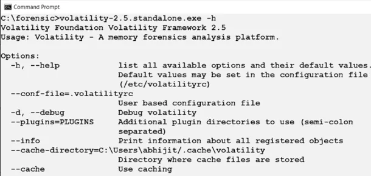

Volatility is a command line tool, and if the output of the tool is very large, viewing the output from the command prompt is inconvenient. You can redirect the output of the command to a text file instead.

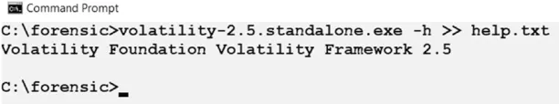

The output from the command to the help.txt file can now be viewed using a text editor such as Notepad or Notepad++.

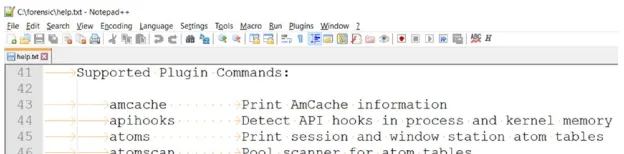

The screenshot displays the list of commands provided by the tool. Volatility is a very comprehensive tool. I will not explain all its features in this article.

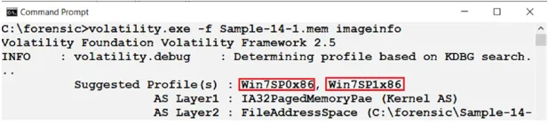

There are many commands and techniques to analyze the memory image. You can learn these by researching.


---
## Source Research


Here is a curated list of useful resources on malware analysis, including repositories, books, websites, and video tutorials.

### Repos

There are many repositories on Github regarding malware analysis. I have compiled some of these for you.

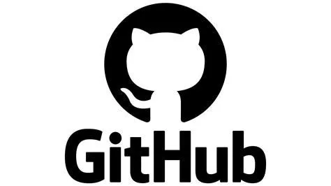

#### [**awesome-malware-analysis**](https://github.com/rshipp/awesome-malware-analysis)

A compiled list of malware analysis tools and resources, as well as detailed information about the tools, can be found in this repo.

You can access it from this link:   
<https://github.com/rshipp/awesome-malware-analysis>

#### [malware-samples](https://github.com/fabrimagic72/malware-samples)

These are repos where you can find malware samples.

You can access it from these links:  
- h[ttps://github.com/jstrosch/malware-samples](https://github.com/jstrosch/malware-samples)  
- <https://github.com/fabrimagic72/malware-samples>  
- <https://github.com/InQuest/malware-samples>  
- <https://github.com/Da2dalus/The-MALWARE-Repo>  
- <https://github.com/mstfknn/malware-sample-library>

#### [**Malware-Sample-Sources**](https://github.com/Virus-Samples/Malware-Sample-Sources)

It is a repo that lists the source sites where you can find malicious software.

You can access it from this link:  
<https://github.com/Virus-Samples/Malware-Sample-Sources>

### Books

There are source books written on malware analysis. I have compiled some of these resources for you.

#### Practical Malware Analysis: The Hands-On Guide to Dissecting Malicious Software

This book, which is well-known and popular in the industry, explains malware analysis techniques and tools in detail. You can find the pdf with a little Google research.

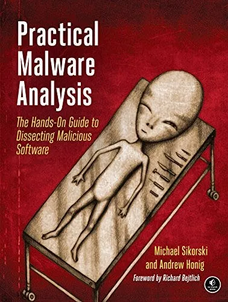

You can access it from this link:  
<https://www.amazon.com/Practical-Malware-Analysis-Hands-Dissecting-ebook/dp/B007ED2XDS>

#### **Malware Analysis and Detection Engineering: A Comprehensive Approach to Detect and Analyze Modern Malware**

This book was the source I used most while preparing this guide. Since it is a newer book than the previous book, it also includes newer techniques. It also discusses detection engineering in detail.

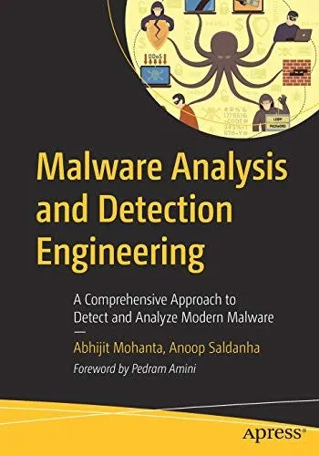

You can access it from this link:  
<https://www.amazon.com/Malware-Analysis-Detection-Engineering-Comprehensive/dp/1484261925>

#### Mastering Malware Analysis: The complete malware analyst's guide to combating malicious software, APT, cybercrime, and IoT attacks

It is a book for those who want to specialize in malware analysis. Its content is a bit advanced.

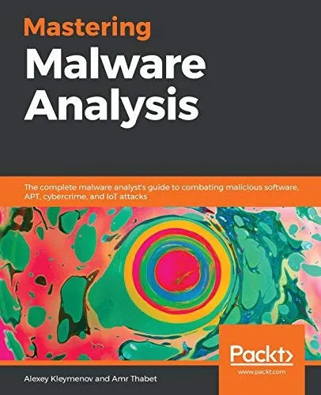

You can access it from this link:  
<https://www.amazon.com/Mastering-Malware-Analysis-combating-cybercrime/dp/1789610788?asin=1789610788&revisionId=&format=4&depth=1>

### Resource Sites

In this section, I have compiled the websites that you should or can use while working in the field of malware analysis.

#### SANS

It is a company that has many solutions in the field of Malware Analysis and offers us some of these technologies.


You can learn the details on the blog page:  
<https://www.sans.org/blog/how-you-can-start-learning-malware-analysis/>

#### ANY.RUN

It is an Interactive Online Malware Analysis Sandbox platform. You can find a lot of information about malware on this site. Moreover, you can download the sample by entering the hash information of many malicious software.

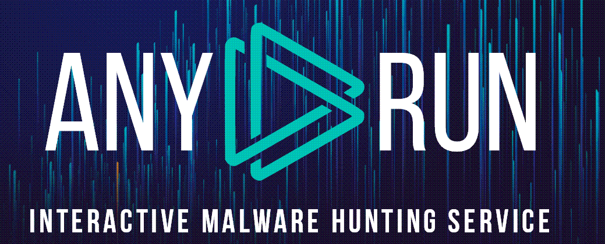

You can access it from this link:  
<https://app.any.run/>

#### Malware Bazaar

We can say that it is a malware database. A platform where we can download and install malware samples

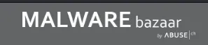

You can access it from this link:  
<https://bazaar.abuse.ch/>

#### VirusShare

VirusShare is a service hosted and maintained by Corvus Forensics.


### Videos

There are many videos, playlists and channels on YouTube about malware analysis. I have compiled these contents in this section.

#### SANS Digital Forensics and Incident Response

A channel that hosts video tutorials on malware and much broader topics.


You can access it from this link:  
<https://www.youtube.com/@SANSForensics>

#### White Hat Hacker

One of the rare Turkish channels on YouTube. He also has a small series on malware analysis.


You can access it from this link:  
<https://youtube.com/playlist?list=PLF7uV-A3fhIBpCzOsnvA0r4BBHTH8p70G>

#### HackerSploit

It is a channel on YouTube with many video series in the field of hacking. There is also a series in the field of malware analysis.


You can access it from this link:  
<https://youtube.com/playlist?list=PLBf0hzazHTGMSlOI2HZGc08ePwut6A2Io>

#### PBER ACADEMY

A channel on YouTube that hosts training videos in the field of cyber security. He also has a series on malware analysis.


You can access it from this link:  
<https://youtu.be/vr1Bt38lwMg>

These resources can help you further improve your skills in the field of malware analysis. If you have other recommendations, feel free to share them.