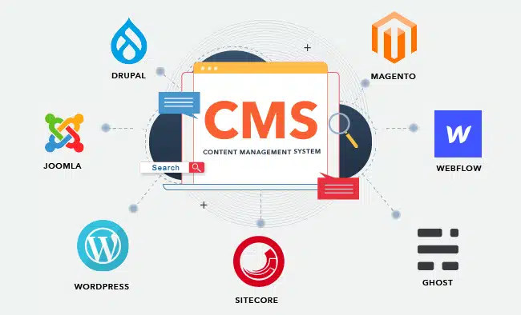
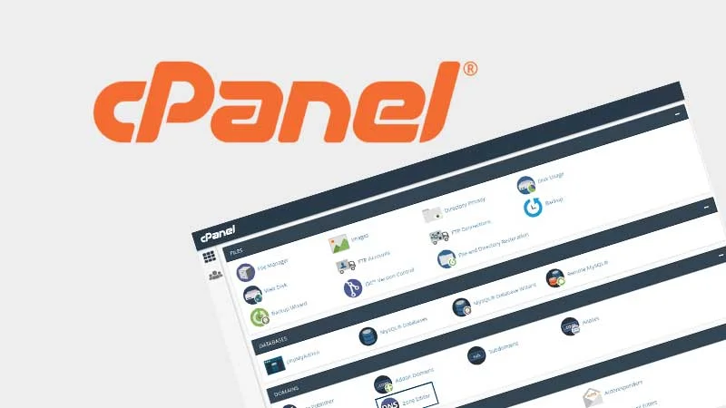
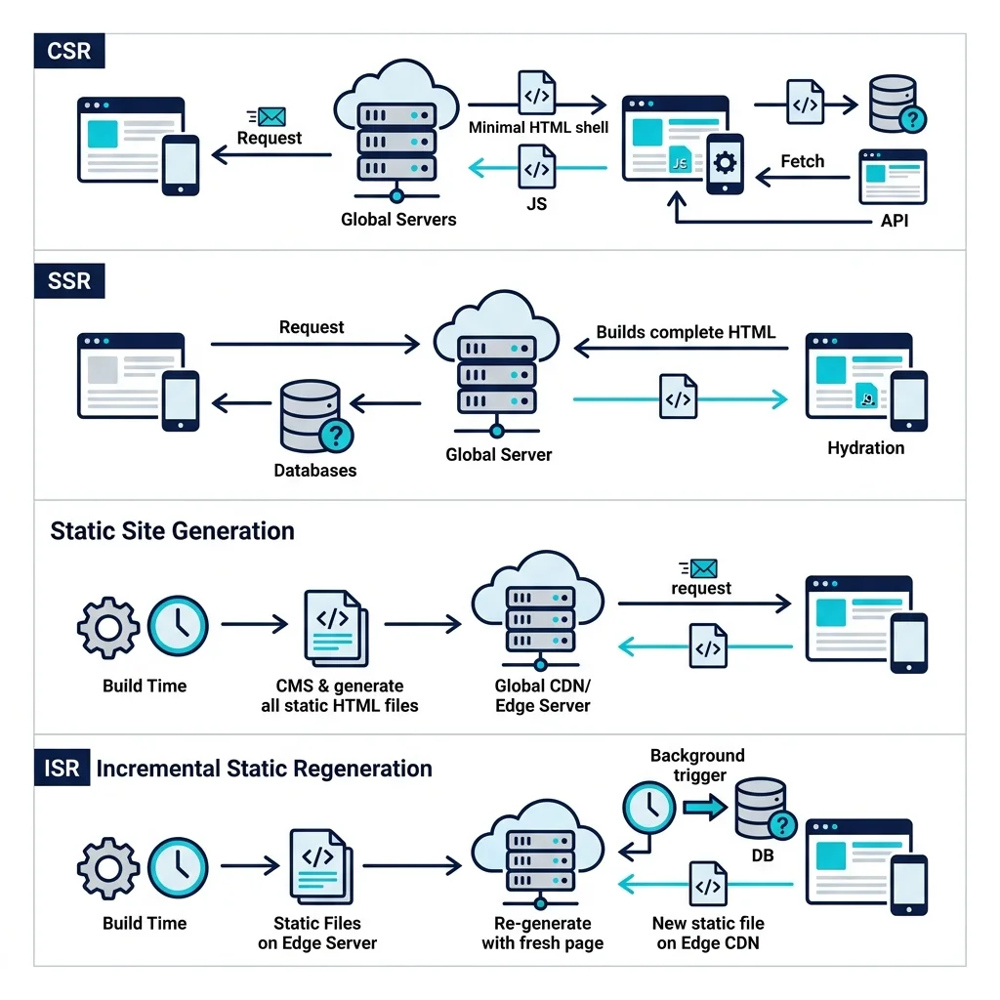
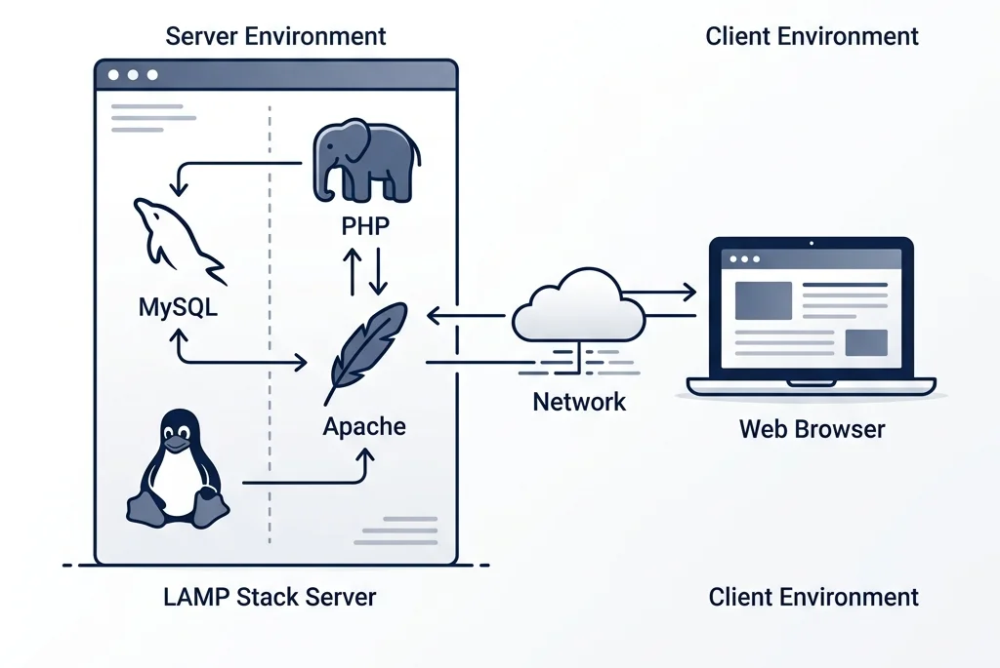
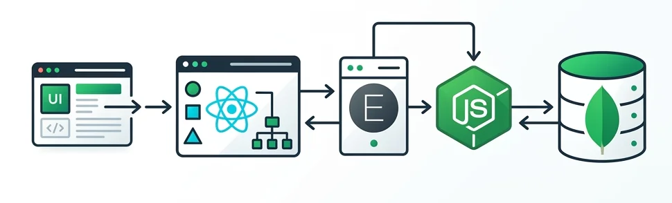
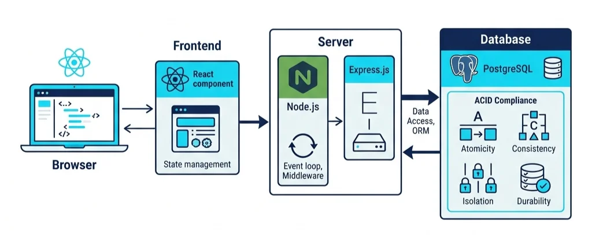
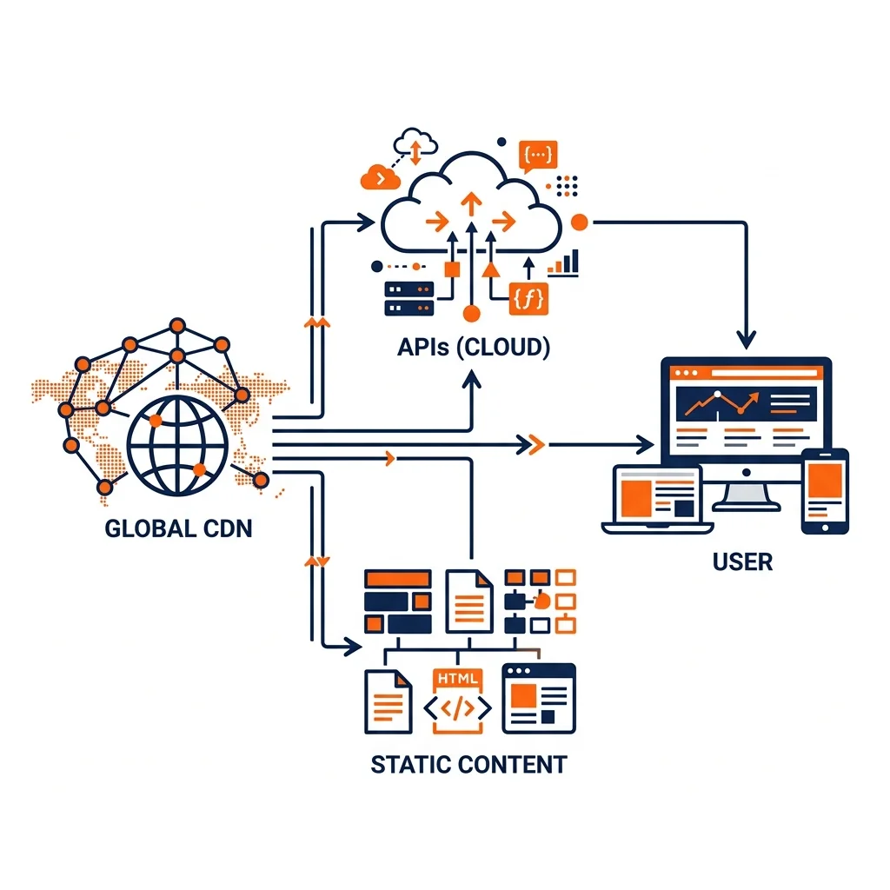
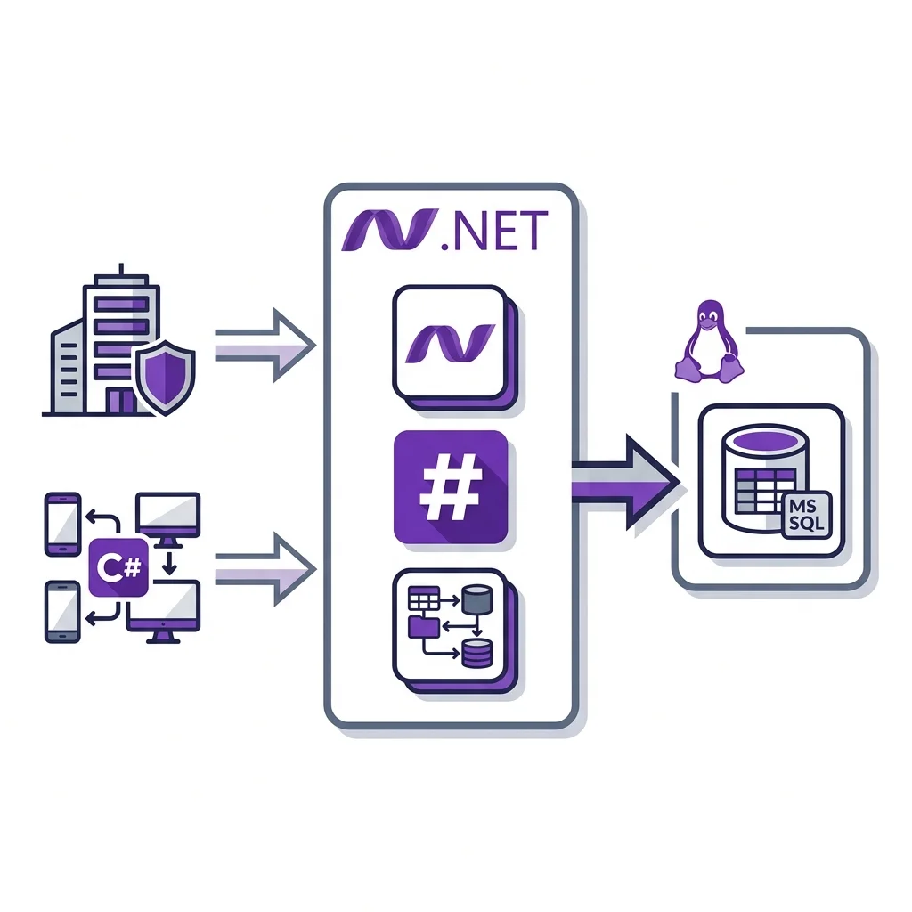
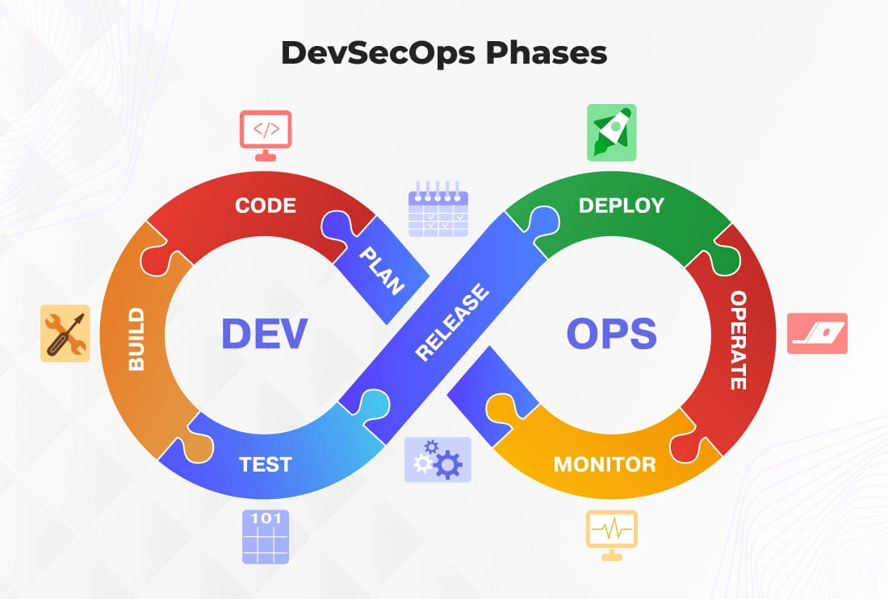
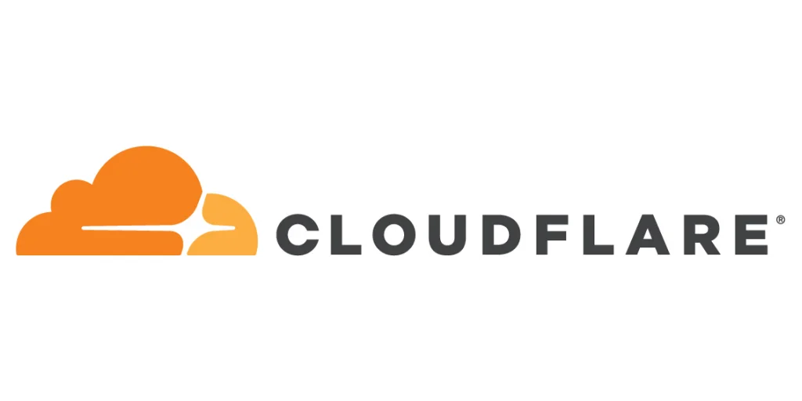

**Geleneksel CMS'lerden Statik Site Üreticilerine (SSG) ve Yeni Nesil Görüntüleme Stratejilerine Derinlemesine Teknik Bakış**

Web geliştirme ekosistemi, performans, ölçeklenebilirlik ve güvenlik gereksinimlerinin sürekli artmasıyla birlikte köklü bir evrim geçirmektedir. Geleneksel monolitik İçerik Yönetim Sistemlerinin (CMS) hantallığı, sunucu tarafında yarattıkları işleme yükleri ve bitmek bilmeyen güvenlik zafiyetleri, modern mühendisliği çok daha çevik ve güvenli mimarilere yönelmeye zorhamıştır.

Özellikle aktif olarak e-ticaret platformları geliştiren veya sistem güvenliğini (DevSecOps) ön planda tutan geliştiriciler için, mimari kararlar artık sadece "hangi dilin kullanılacağı" sorusunun çok ötesine geçmiştir. Bu rehberde, geleneksel CMS sistemlerinden Statik Site Üreticilerine (SSG) uzanan yolculuğu, modern görüntüleme (rendering) stratejilerini ve uçtan uca web ekosisteminin güncel durumunu teknik bir **anatomi** problemi olarak inceleyeceğiz.

## Hızlı Özet

- **Maliyet-Performans:** İçerik odaklı projelerde SSG, çoğu zaman en iyi maliyet-performans dengesini verir.
- **Hibrit Modeller:** Dinamik ürünlerde SSR/ISR gibi hibrit modeller kaçınılmazdır.
- **Modern Stack:** E-ticaret için PERN/Next.js, kurumsal SaaS için .NET tercih edilmelidir.
- **Güvenlik:** En kritik konu artık sadece kod açığı değil, yazılım tedarik zinciri (supply chain) riskidir.
- **Mimari Karar:** "En iyi araç" yoktur; "en doğru senaryo eşleşmesi" vardır.

## 1) Neden cPanel Merkezli Düşünceden Uzaklaşıyoruz?

Yıllar boyunca web'in omurgasını Linux, Apache, MySQL ve PHP'den oluşan LAMP yığını ve bu yığın üzerinde çalışan WordPress gibi geleneksel İçerik Yönetim Sistemleri (CMS) oluşturdu. Ancak geleneksel bir CMS, kullanıcı her sayfa talep ettiğinde veritabanına bağlanmak, veriyi çekmek ve HTML'i sunucuda anlık olarak birleştirmek zorundadır. Bu durum, trafiğin aniden arttığı senaryolarda sunucu darboğazlarına neden olurken, dışarıdan gelebilecek SQL Injection veya sunucu taraflı RCE (Uzaktan Kod Çalıştırma) saldırıları için geniş bir yüzey bırakır.

*Geleneksel monolitik mimari akışı: Veritabanı ve sunucu bağımlılığı performans darboğazlarına yol açar.*

*Klasik cPanel ortamı: Kolay ama geniş bir saldırı yüzeyi barındıran "sunucu yönetme" modeli.*

Bu akış klasik hosting modellerinde (cPanel, Plesk vb.) fonksiyoneldir, fakat üç kalıcı maliyet üretir:

- **Performans maliyeti:** Her istek için dinamik hesaplama ve veritabanı gecikmesi. Bir ziyaretçi sitenize girdiğinde PHP uyanır, MySQL sorgusu atılır ve sayfa o an inşa edilir. Bu "Just-in-Time" yaklaşımı, milisaniyelerin hayati olduğu modern webde bir engeldir.
- **Güvenlik maliyeti:** Panel + eklentiler + uygulama çalışma zamanının oluşturduğu geniş saldırı yüzeyi. İhtiyaç olmayan her runtime, gereksiz bir siber risk alanıdır.
- **Operasyonel maliyet:** Yama yönetimi, sürüm uyumluluğu ve sürekli izleme yükü.

Eski tip sunucu kur-yönet modelinden uzaklaşmamızın temel nedeni, altyapıyı "yönetmek" yerine "sonucu doğrudan servis etmeye" odaklanmaktır.

## 2) Rendering Anatomisi: CSR, SSR, SSG, ISR

Bugün bir web uygulamasının ekrana nasıl çizileceği, sistemin milyonlarca kullanıcıyı çökmeden nasıl kaldırabileceğini belirler. Modern web mühendisliği, HTML'in nerede ve ne zaman üretildiğine göre dört temel strateji etrafında şekillenir:

*Modern rendering mimarileri: CSR, SSR, SSG ve ISR'nin veri akış modelleri.*

<article class="render-card render-card-csr reveal-on-scroll">

CSR
<h3>Client-Side Rendering</h3>

Sunucu genellikle boş bir HTML kabuğu döndürür. Arayüzün oluşumu tarayıcıda JavaScript ile tamamlanır.

<ul>
<li><strong>İlk görünüm:</strong> JavaScript yüklenmesine bağlı (SPA deneyimi).</li>
<li><strong>SEO:</strong> Ek optimizasyon ve hydration gerekir.</li>
<li><strong>En iyi senaryo:</strong> Dahili yönetim panelleri ve dashboard'lar.</li>
</ul>
</article>

<article class="render-card render-card-ssr reveal-on-scroll">

SSR
<h3>Server-Side Rendering</h3>

Her istekte HTML sunucuda taze veriyle tekrar üretilir.

<ul>
<li><strong>İlk görünüm:</strong> SEO için mükemmel (TTFB kritik).</li>
<li><strong>Güvenlik:</strong> Gizli API anahtarları sunucuda kalır.</li>
<li><strong>En iyi senaryo:</strong> Dinamik stok ve kişiselleştirilmiş içerik.</li>
</ul>
</article>

<article class="render-card render-card-ssg reveal-on-scroll">

SSG
<h3>Static Site Generation</h3>

Sayfalar derleme anında bir kez üretilir and CDN üzerinden servis edilir.

<ul>
<li><strong>Güvenlik:</strong> Veritabanı zafiyetleri mimari olarak kapanır.</li>
<li><strong>Hız:</strong> Milisaniyelik yüklenme süreleri (Sıfır DB yükü).</li>
<li><strong>En iyi senaryo:</strong> Teknik dokümantasyon ve siber güvenlik blogları.</li>
</ul>
</article>

<article class="render-card render-card-isr reveal-on-scroll">

ISR
<h3>Incremental Static Regeneration</h3>

SSG hızını SSR güncelliğiyle birleştirir. Sadece değişen sayfalar arka planda yenilenir.

<ul>
<li><strong>Avantaj:</strong> Dev kataloglarda build süresini minimize eder.</li>
<li><strong>Performans:</strong> Statik hızında dinamik veri sunumu.</li>
<li><strong>En iyi senaryo:</strong> Büyük e-ticaret katalogları, fiyat/stok güncellemeleri.</li>
</ul>
</article>

### Hibrit Yaklaşımlar ve "Adalar" Mimarisi
Milyonlarca ürünü olan devasa sistemler için hibrit çözümler kaçınılmazdır. Özellikle **Astro** ile popülerleşen **Islands Architecture (Adalar Mimarisi)** yaklaşımı, sayfanın varsayılanını "Sıfır JS" (HTML-only) olarak tutup, sadece interaktif olması gereken bölümleri (sepet, yorum formu vb.) bağımsız "adalar" olarak canlandırarak performansı maksimize eder. Hugo ve mdBook gibi araçlar ise binlerce sayfalık veriyi saniyeler içinde işleyerek statik üretimin sınırlarını zorlar.

## 3) Etkileşimli Seçim Rehberi: Hangi Mimari Size Daha Yakın?

Doğru mimariyi seçmek projenin kaderini belirler. Şu dört temel soru, yol haritanızı netleştirecektir:

**1. İçerik çoğunlukla editör tarafından mı üretiliyor?**
- **Evet:** SSG tarafına yaklaş (Astro/Hugo). Jekyll gibi araçlar GitHub Pages üzerinde olağanüstü katı bir güvenlik modeli sunar; üçüncü parti eklentileri kısıtlar ancak dışarıdan kod enjeksiyonunu imkansız hale getirir.
- **Hayır, kullanıcıya göre değişiyor:** SSR/ISR düşün (Next.js/Nuxt).

**2. Gerçek zamanlı kişiselleştirme var mı?**
- **Evet:** Hibrit (SSR + cache + edge middleware) mimarisi daha rasyoneledir.
- **Hayır:** SSG + adacık tabanlı etkileşim performansı artırır.

**3. Ekibin bakım kapasitesi sınırlı mı?**
- **Evet:** Düşük çalışma zamanı (runtime) içeren statik mimariler operasyonel olarak daha güvenlidir. Yama yönetimi ve sunucu izleme yükü minimize edilir.
- **Hayır:** Daha karmaşık, konteyner tabanlı mikroservis yapıları yönetilebilir.

**4. Yayın sıklığı çok yüksek mi (dakikalık)?**
- **Evet:** ISR veya Next.js'in "on-demand rebuild" yetenekleri eşsizdir.
- **Hayır:** Tam SSG (Static Site Generation) sarsılmaz bir tercihtir.

## 4) Teknoloji Yığınları: Popüler Mimari Bileşenler

Web ekosisteminde başarı; performans, güvenlik ve operasyonel sürdürülebilirlik dengesini en doğru şekilde kurabilen teknoloji seçimiyle gelir. Geleneksel webin monolitik yapılarından, modern webin dağıtık mikroservislerine uzanan yelpazede endüstri standartlarını belirleyen popüler teknoloji yığınlarını derinlemesine inceleyelim.

### 1. LAMP Stack: Web'in Klasik Devi
**(Linux, Apache, MySQL, PHP/Python/Perl)**

*LAMP Mimarisi: Linux sunucu üzerinde Apache, MySQL ve PHP katmanlarının SSR tabanlı çalışması.*

Yirmi yılı aşkın süredir internetin çok büyük bir bölümünü (özellikle WordPress, Drupal, Joomla gibi geleneksel CMS'leri) ayakta tutan LAMP, monolitik mimarinin en klasik örneğidir. 

* **Mimari Yaklaşım:** Sunucu tarafı görüntüleme (SSR) temellidir. İstemciden gelen her istek Apache tarafından karşılanır, PHP veritabanı (MySQL) ile konuşur, HTML sunucuda derlenir ve tarayıcıya gönderilir.
* **Avantajları:** Kurulumu inanılmaz derecede basittir ve paylaşımlı (shared) hosting ortamlarında bile sorunsuz çalışır. İnternette karşılaşılan hemen hemen her sorunun çözümü mevcuttur.
* **Dezavantajları ve Güvenlik:** Yoğun trafik altında (örneğin anlık binlerce ziyaretçi) dikey ölçeklenmesi (sunucu donanımını artırmak) zordur. Ayrıca eski veya güncellenmemiş PHP eklentileri, siber güvenlik açısından ciddi RCE (Uzaktan Kod Çalıştırma) veya SQL Injection zafiyetlerine kapı aralayabilir.

### 2. MERN ve MEAN Stack: "Her Yerde JavaScript"
**(MongoDB, Express.js, React/Angular, Node.js)**

*MERN Mimarisi: MongoDB döküman tabanlı veritabanı, Node.js sunucu ve React arayüz bütünlüğü.*

Web geliştirme dünyasında devrim yaratan bu yığınlar, hem sunucu (Node.js) hem de istemci (React/Angular) tarafında tek bir dil (JavaScript/TypeScript) kullanma imkanı sunar. Veritabanı katmanında ise esnek, döküman tabanlı bir NoSQL çözümü olan MongoDB bulunur.

* **Mimari Yaklaşım:** Genellikle İstemci Taraflı Görüntüleme (CSR) veya Next.js gibi meta-framework'ler aracılığıyla SSR destekli Single Page Application (SPA) mimarileri kurmak için idealdir.
* **Kullanım Senaryosu:** Şeması sürekli değişen, hızlı prototipleme gerektiren veya anlık veri akışı (mesajlaşma, canlı yayın) içeren modern uygulamalarda mükemmel performans gösterir.
* **Güvenlik Perspektifi (Tedarik Zinciri Riskleri):** Node.js ekosisteminin en büyük handikabı devasa bağımlılık ağacıdır. Bir MERN projesinde arka planda yüzlerce NPM paketi iç içe çalışabilir. Bu devasa ekosistem, zararlı kod enjeksiyonları (supply chain attacks) için geniş bir yüzey oluşturduğundan, katı statik kod analizi ve sürekli bağımlılık denetimleri gerektirir.

### 3. PERN Stack: Kurumsal Veri Bütünlüğü ve Güç
**(PostgreSQL, Express.js, React, Node.js)**

*PERN Mimarisi: PostgreSQL ilişkisel veritabanı ile garanti altına alınan kurumsal veri bütünlüğü.*

MERN yığınının NoSQL esnekliği her senaryo için uygun değildir. Özellikle e-ticaret, B2B platformlar veya çok boyutlu ürün yönetimi (örneğin karmaşık stok takibi gerektiren yapı malzemeleri veya toptan satış tedarik sistemleri) gibi ilişkisel verinin merkezde olduğu projelerde devreye PERN stack girer.

* **Mimari Yaklaşım:** MongoDB yerine dünyanın en gelişmiş açık kaynaklı ilişkisel veritabanı olan **PostgreSQL** kullanılır. 
* **Avantajları:** PostgreSQL'in sunduğu kusursuz ACID uyumluluğu sayesinde veri bütünlüğü garanti altına alınır. Bir sipariş tamamlanırken ödeme sisteminde hata çıkarsa, veritabanı işlemi anında geri alır (rollback) ve asimetrik veri oluşmasını engeller.
* **Neden PERN?** Node.js'in asenkron ve hızlı yapısını, React'in dinamik arayüz gücünü kullanırken, arka planda bankacılık sistemleri kadar katı ve güvenli bir veri mimarisi kurmak isteyen modern projelerin, SaaS uygulamalarının ve e-ticaret altyapılarının bir numaralı tercihidir.

### 4. JAMstack: Statik Üretimin ve Uç Bilişimin (Edge) Zirvesi
**(JavaScript, APIs, Markup)**

*JAMstack Mimarisi: Microservisler ve API'ler üzerinden CDN tabanlı, sunucusuz (serverless) dağıtım.*

SSG (Statik Site Üreticileri) bölümünde bahsettiğimiz konseptin sistemleştirilmiş halidir. Sunucu ve veritabanı katmanını kullanıcıdan tamamen izole eder. Veritabanı ve arka uç mantığı mikroservislere veya Headless CMS'lere (örn. Strapi, Sanity) devredilir. Ön uç (Astro, Hugo, Next.js vb.) derleme aşamasında API'lerden veriyi çeker, HTML'i oluşturur ve bu statik dosyaları global CDN'lere dağıtır. Siber güvenlik açısından eşsizdir; çünkü ortada hacklenebilecek bir sunucu veya doğrudan erişilebilecek bir veritabanı yoktur. 

### 5. .NET Stack: Kurumsal Dünyanın Yüksek Performanslı Gücü
**(C#, ASP.NET Core, Entity Framework, SQL Server / PostgreSQL)**

*Modern .NET Mimarisi: Açık kaynaklı, çapraz platform ASP.NET Core ve Entity Framework gücü.*

Geçmişte sadece Windows sunuculara bağımlı ve kapalı kaynak olan eski .NET Framework dönemi çoktan kapandı. Bugün "Modern .NET" (eski adıyla .NET Core), Microsoft'un desteklediği tamamen açık kaynaklı, Linux ve macOS üzerinde kusursuz çalışan, çapraz platform ve inanılmaz derecede hızlı bir ekosistemdir.

* **Mimari Yaklaşım:** Merkezinde nesne yönelimli ve güçlü tip güvenliğine sahip **C#** dili bulunur. Arka uçta devasa monolitik yapılardan hafif ve hızlı mikroservislere (Minimal APIs) kadar geniş bir yelpazede **ASP.NET Core** kullanılır. Veritabanı ile iletişim, dünyanın en gelişmiş ORM araçlarından biri olan **Entity Framework Core** üzerinden sağlanır.
* **Kullanım Senaryosu:** Bankacılık sistemleri, devasa ERP yazılımları, sağlık bilgi sistemleri ve mikroservis tabanlı bulut mimarileri. Node.js'in tek iş parçacıklı (single-threaded) yapısının tıkandığı yüksek CPU yoğunluklu işlemlerde, .NET'in çoklu iş parçacığı (multi-threading) ve asenkron yetenekleri mükemmel sonuç verir.
* **Güvenlik ve Performans:** Güvenlik mimarisinin "varsayılan olarak güvenli" (secure by default) olması kurumsal projeler için en büyük tercih sebebidir. ASP.NET Core Identity sistemi; kimlik doğrulama, yetkilendirme ve çok faktörlü doğrulama (MFA) gibi süreçleri standartlaştırır. 

### Büyük Veri ve Olay Güdümlü (Event-Driven) Ekosistemler
Sistem büyüdükçe doğrudan API çağrıları darboğaz yaratır. Bu noktada arka plandaki servisleri ve logları ayırmak için asenkron mesajlaşma devreye girer. **Apache Kafka** kullanılarak tüm sistem olayları kalıcı bir akış (stream) olarak diske yazılır. Devasa güvenlik loglarının (SIEM) veya ürün analiz verilerinin işlenmesinde Kafka ve üstünde çalışan **Apache Spark** veri mühendisliğinin zirvesidir.

## 5) DevSecOps ve Altyapı: Güvenlikten Dağıtıma Uçtan Uca Mimari

Yazılan kodun kalitesi kadar, o kodun internete nasıl açıldığı ve korunacağı da (DevSecOps) modern mühendisliğin ayrılmaz bir parçasıdır. Uygulama güvenliği artık sadece "kod açık içeriyor mu" sorusundan ibaret değil. Güncel tabloda en kritik alan yazılım tedarik zinciri güvenliğidir. 

*Modern CI/CD süreçlerinde DevSecOps entegrasyonu: Build, Scan ve Deploy güvenliği.*

### Yazılım Tedarik Zinciri Riskleri (Supply Chain Risks)
Modern framework'ler (Next.js, NuxtJS, Astro) devasa NPM bağımlılık ağaçları ile gelir. Tek bir boş proje bile arka planda on binlerce dış paket indirebilir. 2025 yılında NPM ekosistemini vuran MFA oltalama saldırıları ve kripto-cüzdan boşaltan zararlılar, bu bağımlılıkların en büyük saldırı yüzeyi olduğunu kanıtlamıştır. Bu nedenle üretim (deployment) ortamları çok daha katı izole edilmelidir.

- **Lockfile Zorunluluğu:** Bağımlılık versiyonlarını sabitleyerek "version hijacking" saldırılarını engelleyin.
- **SCA ve SBOM:** SCA ve SBOM taramaları her derlemede zorunlu olmalıdır (CycloneDX/SPDX).
- **GitHub Actions:** CI/CD'nin kalbidir. Geliştirici kodunu gönderdiği an boru hattı tetiklenir. Burada sadece derleme yapılmaz; kod canlıya çıkmadan önce bağımlılık taramalarından ve secret scanning (API key sızıntı önleyici) süreçlerinden geçirilir.

### Konteynerler, Proxmox ve Homelab Yaklaşımı
Modern web projeleri, donanımı mantıksal olarak bölen hafif Konteyner (Docker) mimarileri üzerinde koşar. Kendi Proxmox tabanlı homelab ortamlarımızda ZFS altyapısıyla test ettiğimiz konteynerlerin, üretim ortamındaki küresel ağlara güvenle taşınması hassas bir CI/CD sürecine bağlıdır. Bugün kişisel laboratuvarlarımızda test ettiğimiz mikroservisler, konteyner mimarisi sayesinde üretim ortamındaki devasa Kubernetes kümelerine birebir aynı stabilitede taşınabilmektedir.

### Cloudflare, Uç Bilişim ve Zero Trust
Statik veya hibrit sitelerin global dağıtımı ve korunması için Cloudflare benzersiz bir konumdadır. Cloudflare Pages, Astro veya Next.js projelerinin çıktılarını doğrudan GitHub deponuzdan okuyup saniyeler içinde derleyerek dünyanın daha dört bir yanındaki CDN noktalarına dağıtır.

*Cloudflare mimarisi: İçeriği sunucu barındırmadan küresel CDN noktalarına dağıtarak saldırı yüzeyini sıfırlar.*

Uç Bilişim (Edge Computing) mimarisini temsil eden Cloudflare Workers, Web Application Firewall (WAF) kurallarını uygulamanıza ulaşmadan çok önce uygular. Açık kaynaklı bir altyapıda (örneğin Wazuh ile sistem loglarını izlediğiniz, Authentik ile kimlik doğruladığınız kendi bulutunuzda), Cloudflare Zero Trust araya girerek uygulamanızı şifreler, VPN ihtiyacını ortadan kaldırır ve yalnızca doğrulanan kullanıcıların arka uç sistemlerinize erişmesini sağlar.

## 6) Sonuç: Başarı Kriterleri ve Mimari Anti-Pattern'ler

Web geliştirme artık basit bir arayüz tasarımından çıkarak; büyük veriyi yöneten, uçta render edilen ve tedarik zinciri zafiyetlerine karşı bağışıklık kazanan bütünsel bir mühendislik disiplinine dönüşmüştür. Başarıyı yakalamak için sadece doğru framework'ü seçmek yetmez; aynı zamanda yaygın hatalardan (anti-patterns) kaçınmak ve sürekli ölçüm yapmak gerekir.

### Sık Yapılan Hatalar (Anti-Patterns)
- **"Her şeyi SSG yapalım":** Gerçek zamanlı veriyi (ör. canlı borsa verisi) zorla statikleştirmek karmaşıklığı artırır ve kırılgan kod üretir. Statik hızında dinamik veri için ISR stratejisini benimseyin.
- **"Framework değişince performans artar":** Resim optimizasyonu (WebP/AVIF) ve scripts bütçesi yapılmadan sadece framework değiştirmek Lighthouse skorlarında geçici yükselme sağlar ancak gerçek kullanıcı deneyimini iyileştirmez.
- **"CI/CD güvenliğine sonra bakarız":** Tedarik zinciri riskini ertelemek, secret sızıntılarına ve kritik veri kayıplarına davetiye çıkarmaktır. Güvenlik, projenin ilk gününde pipeline'a entegre edilmelidir.
- **"SEO sadece meta tag'dir":** Teknik SEO'nun (crawlability, canonical, structured data) ihmal edilmesi, mimari ne kadar hızlı olursa olsun görünürlüğü kısıtlar.

### Final Notu: Mühendislik Tercihi Araçtan Daha Önemlidir
Sonuç olarak "en iyi araç" diye bir şey yoktur; projenizin karakterine, ekip kapasitesine ve güvenlik gereksinimlerine en doğru mühendislik yaklaşımı vardır. E-ticaret için PERN and Next.js'in dinamizmini kullanırken CI/CD boru hatlarında güvenlik taramalarınızı ihmal etmemek; statik dokümantasyonlar veya kişisel projeler için ise Astro/Hugo gibi araçlarla Cloudflare Pages'in hızını birleştirmek modern web mimarisinin temel anahtarıdır. Başarıyı performans, güvenlik ve operasyonel sürdürülebilirlik dengesi getirir.

---

## Kaynakça ve İleri Okuma

### A) Rendering ve Web Standartları
- [Web.dev - Core Web Vitals](https://web.dev/articles/vitals)
- [Web.dev - Rendering on the Web](https://web.dev/rendering-on-the-web/)
- [Astro Concepts - Islands Architecture](https://docs.astro.build/en/concepts/islands/)
- [Next.js Documentation - ISR](https://nextjs.org/docs/app/building-your-application/data-fetching/incremental-static-regeneration)

### B) Framework ve Araç Dokümantasyonları
- [Hugo Official Documentation](https://gohugo.io/documentation/)
- [Astro Guide](https://docs.astro.build/)
- [Next.js Reference](https://nextjs.org/docs)
- [mdBook Guide](https://rust-lang.github.io/mdBook/)
- [Gatsby Documentation](https://www.gatsbyjs.com/docs/)

### C) Build Performansı ve Karşılaştırmalar
- [CSS-Tricks - Comparing SSG Build Times](https://css-tricks.com/comparing-static-site-generator-build-times/)
- [CloudCannon - Top Static Site Generators](https://cloudcannon.com/blog/the-top-five-static-site-generators/)
- [Contentful - Astro vs Next.js Compared](https://www.contentful.com/blog/astro-next-js-compared/)

### D) Deployment, CDN ve Platformlar
- [GitHub Pages Official](https://pages.github.com/)
- [Cloudflare Pages Documentation](https://developers.cloudflare.com/pages/)
- [Netlify Docs](https://docs.netlify.com/)

### E) DevSecOps ve Tedarik Zinciri Güvenliği
- [CISA Alert - npm Supply Chain Compromise](https://www.cisa.gov/news-events/alerts/2025/09/23/widespread-supply-chain-compromise-impacting-npm-ecosystem)
- [OWASP - Software Supply Chain Security](https://owasp.org/www-project-software-supply-chain-security/)
- [NIST SSDF (Secure Software Development Framework)](https://csrc.nist.gov/Projects/ssdf)
- [OpenSSF Scorecard](https://securityscorecards.dev/)
- [SLSA Framework](https://slsa.dev/)
- [CycloneDX SBOM Standard](https://cyclonedx.org/)

### F) i18n ve Statik Site Pratikleri
- [Astro - Internationalization (i18n)](https://docs.astro.build/en/guides/internationalization/)
- [Next.js Internationalization Routing](https://nextjs.org/docs/pages/building-your-application/routing/internationalization)
- [Hugo i18n Functions](https://gohugo.io/functions/lang/)
