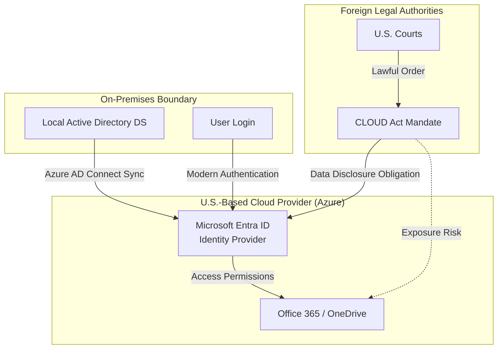
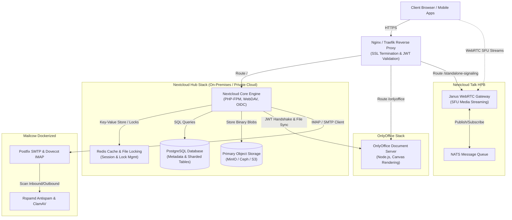

**An Open-Source, Data-Sovereign Enterprise Infrastructure and Integration Guide Against M365 and Google Workspace**

In the modern business landscape, cloud-based collaboration platforms form the heartbeat of corporate communication and data management. However, as the famous technology adage highlights—**\"There is no cloud, it's just someone else's computer\"**—relying on public cloud giants like Microsoft 365 (M365) and Google Workspace introduces severe risks concerning data sovereignty, security, and escalating costs. Due to legislative frameworks such as the US Cloud Act, data remains accessible to foreign authorities regardless of where it is physically stored, presenting a critical risk to enterprise security and compliance.

<div class="video-container" style="position: relative; padding-bottom: 56.25%; height: 0; overflow: hidden; max-width: 100%; margin: 1.5rem 0; border-radius: 12px; box-shadow: 0 4px 15px rgba(0,0,0,0.3);">
  <iframe src="https://www.youtube.com/embed/CFdZWgiAj8I" style="position: absolute; top: 0; left: 0; width: 100%; height: 100%; border: 0;" allow="accelerometer; autoplay; clipboard-write; encrypted-media; gyroscope; picture-in-picture; web-share" allowfullscreen></iframe>
</div>

In this technical blog post, we will explore the complete architecture of **Nextcloud Hub**, **OnlyOffice Document Server**, and **Mailcow**—an ecosystem that eliminates vendor lock-in and delivers absolute data sovereignty on on-premises or private cloud infrastructures. We will compare this stack to M365 and Google Workspace, and dive deep into performance tuning, security models, scalability, and autonomous local AI assistant integration.

---

## 1. The Battle for Digital Sovereignty: Nextcloud Hub vs. M365 & Google Workspace

<div style="display: flex; justify-content: center; gap: 2rem; align-items: center; margin: 1.5rem 0; flex-wrap: wrap; background-color: rgba(255,255,255,0.05); padding: 1.5rem; border-radius: 12px;">
  
  
  
</div>

Nextcloud Hub has evolved far beyond a simple file storage and synchronization tool. It represents a unified digital workspace where communication, calendaring, document editing, and mail client capabilities interact seamlessly.

The table below outlines the core architectural and strategic differences between a self-hosted Nextcloud ecosystem and public cloud alternatives:

| Criterion | Nextcloud Hub Ecosystem | Microsoft 365 | Google Workspace |
| :--- | :--- | :--- | :--- |
| **Hosting** | On-Premises, Private Cloud, or completely isolated (Air-gapped) networks. | Public Cloud only (Microsoft Azure). | Public Cloud only (Google Cloud Platform). |
| **Data Sovereignty** | **Absolute**. Database files, encryption keys, and raw storage are fully controlled by the enterprise. | **Limited**. Data is encrypted but keys and infrastructure are managed by Microsoft. | **Limited**. Data rests on Google infrastructure under Google's key management. |
| **Compliance (GDPR / HIPAA)** | Hosting on local nodes ensures 100% data residency compliance out-of-the-box. | Cross-border transfers and the Cloud Act present persistent compliance challenges. | Similarly, cross-border data transfer poses compliance risks requiring extra approvals. |
| **Licensing & Audits** | Open-source (AGPLv3) licensing. No user count limits; no surprise licensing audits. | Per-user monthly fees. Surprise audits and sudden license tier adjustments. | Per-user monthly subscription. Costs scale aggressively as headcount grows. |
| **Artificial Intelligence (AI)** | **Local & Autonomous**. Models (Llama, Mistral) run on-site; zero data leakage. | Cloud-based Copilot. Data is processed in Microsoft's proprietary LLM engines. | Cloud-based Gemini. Data is analyzed on Google cloud endpoints. |
| **Offline & Air-Gapped Use** | Runs flawlessly in offline environments (military, industrial control networks). | Requires constant internet and connectivity to active Microsoft cloud services. | Continuous internet and Google account validation are mandatory. |

### 1.1. Microsoft's Cloud-First Pressure and Deprecation Risks

To accelerate the migration of enterprises to public clouds, software giants are systematically reducing support and development for on-premises solutions. The most prominent example of this strategic pressure is Microsoft's **"cloud-first"** roadmap:

* **WSUS (Windows Server Update Services) Deprecation:** As of September 2024, Microsoft officially declared WSUS as "deprecated". No new innovations will be delivered, and organizations are pushed toward cloud-based update management tools like Autopatch and Intune.
* **Identity Management Constraints:** While traditional On-Premises Active Directory (AD DS) received performance enhancements in Windows Server 2025, 90% of Microsoft's identity investments are directed toward cloud-based **Microsoft Entra ID** (formerly Azure AD). Organizations are heavily incentivized to configure cloud synchronization (Azure AD Connect) and migrate authentication services to Azure.
* **Azure Local (Azure Stack HCI) Hybrid Model:** Microsoft does not abandon local hardware completely; instead, it repositions it as "Azure Local"—a hybrid architecture tightly coupled with the Azure cloud, managed and licensed directly through the Azure portal.

This cloud-first push functionally isolates organizations that prefer to run pure on-premises workloads, making vendor lock-in almost inevitable.

### 1.2. The Legal Threat: U.S. CLOUD Act and the Data Sovereignty Dilemma

Public cloud providers (Microsoft Azure, AWS, Google Cloud) often promise data residency, guaranteeing that customer data will be stored physically in regions like Germany, Ireland, or local sovereign datacenters. However, data residency is not equivalent to data sovereignty.

The primary legal challenge to this model is the **U.S. CLOUD Act** (Clarifying Lawful Overseas Use of Data Act). Under this legislation:
1. U.S.-based cloud providers (and their foreign subsidiaries) are legally obligated to disclose data under their custody or control **regardless of where the data is physically stored** (even if located in an Azure datacenter in Europe) when served with a lawful U.S. court order.
2. In fact, Microsoft France's General Counsel publicly acknowledged that if a properly formatted request is received from U.S. authorities, Microsoft is legally bound to provide the requested data, bypassing local privacy protections.

For organizations subject to strict regulations like GDPR and KVKK (specifically Article 9 governing cross-border transfers), this creates a direct compliance vulnerability.

The diagram below visualizes the legal and technical flow of identity sync and potential cloud exposure:



Faced with these persistent legal risks and cloud-first pressures, migrating to a self-hosted, open-source (AGPLv3) **Nextcloud Hub and OnlyOffice** ecosystem remains the only reliable architectural approach to maintain absolute data and identity sovereignty.

---

## 2. Nextcloud Hub Core Components and Integration Architecture

Nextcloud Hub features an API-driven orchestration layer that tears down data silos and ensures smooth inter-app communication. In an enterprise private cloud deployment, the holistic network and service architecture of the Nextcloud Hub, OnlyOffice Document Server, and Mailcow integration is visualized below:



### 2.1. Nextcloud Files and Storage Optimization
The Files module is the WebDAV-based core file system. To maintain file listing speeds and reduce database disk I/O bottlenecks in enterprise-scale (500+ users) environments, Nextcloud introduced the **ADA (Advanced Data Access) Engine**. The ADA Engine normalizes and shards the massive `oc_filecache` table, moving previews (thumbnails), user avatars, and app-specific metadata into distinct, specialized tables. This sharding reduces the core table size by 56% and cuts down redundant PROPFIND (sync query) requests from desktop clients by 80%.

For petabyte-scale storage, Nextcloud utilizes a **Primary Object Storage** architecture. Rather than relying on traditional block storage (NFS, Local RAID), Nextcloud connects directly to object storage buckets like Amazon S3, MinIO, or Ceph Object Gateway. The folder structures and metadata are maintained in the local PostgreSQL database, while the binary payloads are written directly to S3 as a flat structure with randomized UUID filenames.

> [!CAUTION]
> **Critical Pitfall:** Primary Object Storage configuration can only be set up during the initial Nextcloud installation. Attempting to transition primary storage to S3 on a live instance will make existing files inaccessible. Additionally, mapping S3 as primary storage disables the built-in **BorgBackup** utility, which is designed for local disk volume snapshots. In this scenario, disaster recovery (DR) must be split: use database dumps (pg_dump) for metadata, and implement native S3 replication tools (MinIO Multi-Site Replication) to safeguard binary payloads.

---

### 2.2. OnlyOffice Document Server: Client-Side Rendering Advantage
Enabling concurrent document editing (Word, Excel, PowerPoint) without formatting shifts is critical for team productivity. Nextcloud Office integrates two major engines: **Collabora Online (CODE)** and **ONLYOFFICE**. 

The fundamental difference lies in how documents are rendered in the browser:

<div class="render-cards">
  <div class="render-card render-card-ssr">
    <span class="render-badge">Collabora Online</span>
    <h3>Server-Side Rendering (SSR)</h3>
    <ul>
      <li><strong>Engine:</strong> The document runs inside a LibreOffice instance on the server, which renders page changes as graphical patches (tiles) streamed to the browser.</li>
      <li><strong>Server Load:</strong> High CPU/RAM footprint. A 50 active-user session can quickly hit a 16 GB RAM ceiling.</li>
      <li><strong>Network Latency:</strong> Users on high-latency connections will experience noticeable cursor and typing lag.</li>
    </ul>
  </div>
  
  <div class="render-card render-card-csr">
    <span class="render-badge">ONLYOFFICE</span>
    <h3>Client-Side Rendering (CSR)</h3>
    <ul>
      <li><strong>Engine:</strong> Uses an HTML5 Canvas and JavaScript-based client-side rendering model.</li>
      <li><strong>Server Load:</strong> Drawing and rendering happen on the client browser. 2-4 GB of RAM is sufficient for 50-100 concurrent sessions.</li>
      <li><strong>Compatibility:</strong> Exceptional 99% layout and formatting alignment with Microsoft Office formats (.docx, .xlsx, .pptx).</li>
    </ul>
  </div>
</div>

```
OnlyOffice Communication Flow:
[Nextcloud WebUI] --(Edit Request)--> [Nextcloud Core] --(JWT Validation)--> [OnlyOffice Document Server]
       ^                                                                                   |
       |                                                                                   v
[Client Browser] <-------------(JS & OOXML Payload / Client-Side Rendering)----------------+
```


> [!WARNING]
> **JWT and Proxy Bottlenecks:** OnlyOffice communications with Nextcloud are signed via JSON Web Tokens (JWT). However, enterprise reverse proxies often filter out standard `Authorization` headers. This leads to authentication timeouts when loading documents. To bypass this, customize the JWT header name in OnlyOffice (`local.json`) to `AuthorizationJwt` and align the Nextcloud server settings accordingly.
>
> **Community Version Limit:** The free ONLYOFFICE Docs Community Edition features a hardcoded limit of **20 concurrent document connections (tabs)**. When the 21st user opens a document, it falls back to read-only mode. For teams larger than 50, this limit will be reached quickly. Organizations must budget for OnlyOffice Enterprise licensing or deploy Collabora CODE on high-memory servers to accommodate unlimited users.

---

### 2.3. Scalable Video Conferencing with Nextcloud Talk
Nextcloud Talk provides WebRTC-based voice, video, and screen sharing. 

The signaling architecture dictates Talk's scalability:
*   **Default Setup (Mesh/P2P Network):** Clients stream audio/video feeds directly to one another. In a 5-person meeting, each client uploads its feed 4 times. This rapidly chokes user-side upload bandwidth and local CPU resources, causing video streams to fail beyond 3-5 participants.
*   **High Performance Backend (HPB - SFU Architecture):** Incorporating Janus WebRTC Gateway and NATS messaging, this stack implements a **Selective Forwarding Unit (SFU)** model. Users upload their feed once to the server, and the Janus engine replicates and routes the stream to the other participants. Upload bandwidth remains constant. Handling meetings with 10 to 50 active users is only possible with the HPB signaling server.

> [!IMPORTANT]
> **Bandwidth and Recording Overhead:** A 20-user HD call requires ~40 Mbps inbound and ~100 Mbps outbound bandwidth on the server interface. We recommend hosting Talk HPB on servers with a dedicated 500 Mbps or 1 Gbps symmetric connection. Furthermore, enabling recording (Recording Server) launches server-side video transcoding, consuming 2-4 vCPUs per active recording. Keep the recording server isolated on a separate VM to protect the main application nodes.

---

### 2.4. Enterprise Email Infrastructure via Mailcow
Nextcloud's Mail app is not a mail server; it is a web-based IMAP/SMTP client. To guarantee that all communications remain self-hosted, a dedicated mail server like **Mailcow (Dockerized)** must run alongside Nextcloud.


Mailcow (integrating Postfix, Dovecot, SOGo, Rspamd, and ClamAV) supports Exchange ActiveSync (EAS) for instant synchronization of mail, calendars, and contacts to mobile devices. To prevent your outbound emails from being flagged as spam by Google, Microsoft, or other receivers, you must configure these DNS validation standards:

<div class="render-cards">
  <div class="render-card render-card-ssg">
    <span class="render-badge">SPF</span>
    <h3>Sender Policy Framework</h3>
    <p>Specifies which IP addresses are authorized to send mail on behalf of your domain. DNS TXT record:</p>
    <code>v=spf1 mx a -all</code>
    <p>The <code>-all</code> tag rejects unauthorized servers immediately.</p>
  </div>
  
  <div class="render-card render-card-isr">
    <span class="render-badge">DKIM</span>
    <h3>DomainKeys Identified Mail</h3>
    <p>Uses asymmetric cryptography to verify that email content was not altered in transit. Generate a 2048-bit RSA key on Mailcow and add it as a TXT record under <code>dkim._domainkey</code>.</p>
  </div>
  
  <div class="render-card render-card-ssr">
    <span class="render-badge">DMARC</span>
    <h3>DMARC Policy</h3>
    <p>Defines how receiving servers should handle emails that fail SPF and DKIM checks. Deploy a strict policy using:</p>
    <code>v=DMARC1; p=reject; rua=mailto:postmaster@domain.com</code>
  </div>
  
  <div class="render-card render-card-csr">
    <span class="render-badge">rDNS / PTR</span>
    <h3>Reverse DNS</h3>
    <p>The IP address of the mail server must resolve back to its configured hostname (<code>mail.domain.com</code>). This record must be entered by your ISP/hosting provider.</p>
  </div>
</div>

---

### 2.5. Zero-Knowledge Local AI: Nextcloud AI Assistant
Proprietary assistants (like M365 Copilot or Google Gemini) require sending enterprise data to external public APIs, introducing data leakage risks. Nextcloud Hub solves this with the **AppAPI** framework, running **100% Local Large Language Models (Local LLM)** on your own servers.

AppAPI spins up Python-based AI applications as isolated Docker containers. The "Nextcloud AI Assistant" runs models like **Llama** and **Mistral** directly using your server's CPU or GPU hardware acceleration, while **Whisper** manages speech-to-text processing on-site. This autonomous structure enables email summarization, Talk meeting transcriptions, and text generation inside the Text editor while keeping all data GDPR-compliant and safe within your data center.

---

## 3. Enterprise Security and Access Control Architecture

For multi-tenant or large enterprise deployments, identity and data access controls must follow strict security designs.

### 3.1. LDAP/Active Directory and SSO Integration
Nextcloud and Mailcow authenticate users against a centralized Active Directory or OpenLDAP directory. To prevent cleartext credential sniffing, always connect via encrypted **LDAPS (port 636)** rather than plain LDAP (port 389).

To optimize authentication speeds:
*   **Cache TTL:** Increase the LDAP Cache Time-To-Live to `3600` seconds (1 hour). This prevents Nextcloud from querying the AD server for every file action.
*   **Paging:** Turn on paging and limit page chunk size to `500-1000` to prevent AD query overflows.
*   **SSO Integration:** Implement Keycloak or Authentik as a centralized SSO Identity Provider (IdP) and bind Nextcloud and Mailcow using OpenID Connect (OIDC). Enforce MFA (TOTP / YubiKey FIDO2) globally at the SSO portal level to secure all applications behind a single sign-on shield.

### 3.2. Data Loss Prevention (DLP) and Flow Engine
Nextcloud's "File Access Control" (Flow) engine allows administrators to set dynamic access policies based on user groups, device types (User Agent), file extensions, or client IP ranges. For instance, you can block users in the HR group from opening or downloading financial `.xlsx` spreadsheets when connecting from outside the office network IP.

By utilizing **ICAP (Internet Content Adaptation Protocol)**, Nextcloud routes uploaded documents to enterprise DLP scanners. If a file contains sensitive data like Credit Card numbers, the scanner flags the file, and Nextcloud Flow rules automatically disable public link sharing.

### 3.3. Server-Side Encryption (SSE) vs. End-to-End Encryption (E2EE)
Nextcloud supports two distinct cryptographic models to secure files at rest:

<div class="render-cards">
  <div class="render-card render-card-ssr">
    <span class="render-badge">SSE</span>
    <h3>Server-Side Encryption</h3>
    <p>Files are encrypted using AES-256 on the Nextcloud server before being written to external storage (S3, NFS). Encryption keys are loaded into server RAM during active sessions.</p>
    <p>This protects data from the storage provider, but a root attacker who compromises the host can perform a RAM dump to steal active keys.</p>
  </div>
  
  <div class="render-card render-card-ssg">
    <span class="render-badge">E2EE</span>
    <h3>End-to-End Encryption</h3>
    <p>Encryption begins on the user's desktop or mobile client using 256-bit AES-GCM keys. The server only sees encrypted blobs and randomized folder hierarchies (Zero-Knowledge).</p>
    <p>Does not run in web browsers to avoid the "Browser Trust Model" vulnerability (where a compromised server could push malicious JS to steal keys); desktop and mobile apps only.</p>
  </div>
</div>

---

## 4. Production Performance Tuning Checklist


To prevent server slowdowns under load, apply these optimization configurations across the OS, PHP-FPM, Redis, and Database layers:

<div class="render-cards">
  <div class="render-card render-card-isr">
    <span class="render-badge">REDIS</span>
    <h3>Transactional File Locking</h3>
    <p>To avoid database disk IOPS bottlenecks, route file locking to Redis in your <code>config.php</code>:</p>
    <code>'memcache.locking' => '\OC\Memcache\Redis',</code>
    <p>Set the Redis eviction policy to <code>noeviction</code> to avoid file corruption.</p>
  </div>
  
  <div class="render-card render-card-csr">
    <span class="render-badge">PHP-FPM</span>
    <h3>Process Pool Optimization</h3>
    <p>Configure static process pooling (<code>pm = static</code>) and calculate worker children counts using the formula:</p>
    <code>max_children = (Total RAM - OS/DB RAM) / 100MB</code>
  </div>
  
  <div class="render-card render-card-ssr">
    <span class="render-badge">OPCACHE</span>
    <h3>OPCache & JIT Compiler</h3>
    <p>Reduce CPU consumption and compile times by enabling OPCache and the JIT compiler inside <code>php.ini</code>:</p>
    <code>opcache.jit=1255</code>
  </div>
  
  <div class="render-card render-card-ssg">
    <span class="render-badge">CRON</span>
    <h3>System Cron Registration</h3>
    <p>Trigger background sync tasks via the system crontab instead of AJAX requests to speed up page loads:</p>
    <code>*/5 * * * * php -f /var/www/nextcloud/cron.php</code>
  </div>
</div>

### 4.1. Shift File Locking to Redis
By default, Nextcloud handles file locking via the database (`oc_file_locks` table), which exhausts disk IOPS. Map file locking to Redis in your `config.php`:
```php
'memcache.locking' => '\OC\Memcache\Redis',
```
Set the Redis eviction policy (`maxmemory-policy`) to `noeviction` to prevent Redis from dropping lock keys and causing file corruption.

### 4.2. Optimize PHP-FPM Process Pools
To avoid "504 Gateway Timeout" errors during peak traffic, configure `pm = static`. Calculate the ideal number of workers (`pm.max_children`) using this formula:

```text
max_children = (Total Server RAM - RAM consumed by OS, DB, & Redis) / Average RAM consumption per PHP process (~100MB)
```

*Example:* On a 32 GB RAM server where OS (4GB), DB (8GB), and Redis/monitoring (4GB) consume 16 GB, the remaining 16 GB (16,384 MB) of RAM allocated to PHP yields `pm.max_children = 150`.

### 4.3. OPCache and JIT Compiler Settings
Boost PHP execution speeds by configuring these values in your `php.ini`:
```ini
opcache.memory_consumption=256
opcache.max_accelerated_files=20000
opcache.interned_strings_buffer=32
opcache.jit=1255
opcache.save_comments=1 ; Disabling this will break Nextcloud annotation routing and crash the app.
```

### 4.4. Set Up System Cron
Nextcloud runs background jobs via "AJAX" by default, which slows down user interface requests. Disable AJAX background jobs and register the system cron file (`crontab`) to execute every 5 minutes:
```bash
*/5 * * * * php -f /var/www/nextcloud/cron.php
```

---

## Conclusion: Establishing an Independent Digital Workspace

Integrating Nextcloud Hub, OnlyOffice, and Mailcow provides organizations with the same collaboration capabilities offered by Microsoft 365 and Google Workspace while guaranteeing **absolute ownership and compliance of your business data**.

With proper capacity planning, Redis caching, and Talk SFU/Janus configurations, this private cloud ecosystem scales efficiently to form a highly secure, independent open-source workspace.
