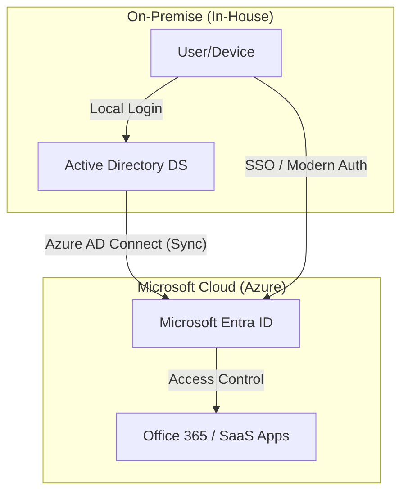

  <strong>Listen to Audio:</strong> The narration for this article is ready. You can listen to it using the player above.

# Microsoft's Cloud-First Strategy

In recent years, Microsoft has clearly adopted a **"cloud-first"** approach, positioning its products—such as Windows Server, identity management, and others—to integrate closely with the Azure cloud. This strategic shift is fundamentally changing how organizations manage their infrastructure, bringing both new opportunities and significant risks.

---

### 📌 Quick Menu
1. [State of On-Prem Products](#the-state-of-on-prem-products-declining-and-evolving-tools)
2. [Identity Management and AD](#identity-management-the-status-of-on-prem-ad)
3. [Data Privacy and Sovereignty](#data-privacy-and-data-sovereignty-concerns)
4. [Recommendations for On-Prem Enterprises](#recommendations-for-on-prem-only-enterprises)
5. [Open Source Alternative: Linux](#open-source-alternatives-for-data-sovereignty)

---

## The State of On-Prem Products: Declining and Evolving Tools

Microsoft’s strategy is not to immediately phase out on-premises infrastructure entirely but rather to steer it toward Azure-centric hybrid management.

*Traditional On-Prem management tools are evolving into Azure-integrated hybrid solutions.*

### 🛠️ Evolution of Critical Tools
*   **WSUS (Windows Server Update Services):** In September 2024, Microsoft announced that WSUS had been "deprecated." No new feature investments are expected; update management is shifting to cloud tools (Autopatch, Intune).
*   **Windows Admin Center (WAC):** Active development continues, focusing heavily on Azure Arc integration to manage on-prem servers via the cloud.
*   **Azure Local (Azure Stack HCI):** Instead of abandoning on-prem hardware, Microsoft positions this as a hybrid platform "unified with Azure."

---

## Identity Management: The Status of On-Prem AD

The dominant trend in Microsoft’s identity solutions is cloud-centric. **Microsoft Entra ID (Azure AD)** has become the heart of the platform.

*Azure AD / Microsoft Entra ID management portal.*

### 🔄 Hybrid Identity Flow
The following diagram illustrates the synchronization and access flow between On-Premise Active Directory and the Cloud (Entra ID):

### 🔐 The Future of Active Directory
Microsoft is not removing on-prem AD immediately. Windows Server 2025 introduces significant performance improvements for AD DS (32k page size, LAPS enhancements). However, 90% of new investments are directed toward the cloud.

*Active Directory Users and Computers - Classic tools still in use.*

> [!IMPORTANT]
> The long-term recommendation is to host workloads on Entra ID and maintain a hybrid bridge (Azure AD Connect) with on-prem AD.

---

## Data Privacy and Data Sovereignty Concerns

One of the most questioned aspects of Microsoft’s cloud strategy is data sovereignty. While Microsoft commits that European data will stay in Europe, legal realities remain complex.

### ⚖️ Legal Conflict: U.S. CLOUD Act
Due to U.S. laws, Microsoft is obligated to provide data—even if stored in Europe—when presented with a legally valid request. Microsoft France’s General Counsel admitted, "If requests from the U.S. are made in the correct form, we must provide the data."

*   **Technical Solution:** Azure Confidential Computing and Customer-Managed Keys (CMK).
*   **Legal Solution:** Microsoft for Sovereignty initiatives and strict DPA agreements.

---

## Recommendations for On-Prem-Only Enterprises

For organizations that must keep data strictly on-premises, a cautious hybrid strategy is essential.

### ✅ Technical Measures
*   **Azure Local / HCI:** Keep data local, manage via the cloud.
*   **CMK / BYOK:** Use your own encryption keys to limit Microsoft’s direct access.
*   **Air-Gapped:** Use isolated environments for highly sensitive data with no internet access.

### ✅ Operational Steps
1.  **Inventory (30 days):** Map all data flows and infrastructure.
2.  **Classification (60 days):** Determine which data must strictly remain on-prem.
3.  **WSUS Transition:** Plan for alternatives like MECM/SCCM or Azure Update Manager.

---

## Open Source Alternatives for Data Sovereignty

Concerns over cloud pressure and the CLOUD Act have made Linux desktop solutions a strong strategic alternative.

### 🐧 Why Linux?
*   **Full Control:** No hidden telemetry or backdoor risks.
*   **Data Sovereignty:** Processing is entirely local; no mandatory cloud dependency.
*   **Cost Efficiency:** Eliminates license fees and frees up the IT budget.

**Distro Options:**
*   Enterprise Support: **RHEL** or **SUSE**.
*   Stability & Balance: **Ubuntu LTS**.
*   Cost-Focused: **AlmaLinux** or **Rocky Linux**.

---

## Conclusion

Microsoft’s strategy points toward a hybrid future. A balanced approach that leverages cloud benefits while maintaining sovereignty through technical controls and open-source alternatives will define the future of enterprise IT.

---

### **Sources**
1. [What’s New in Windows Server 2022](https://learn.microsoft.com/en-us/windows-server/get-started/whats-new-in-windows-server-2022)
2. [WSUS Deprecation Announcement](https://techcommunity.microsoft.com/blog/windows-itpro-blog/windows-server-update-services-wsus-deprecation/4250436)
3. [Data Residency in Azure](https://azure.microsoft.com/en-us/explore/global-infrastructure/data-residency)