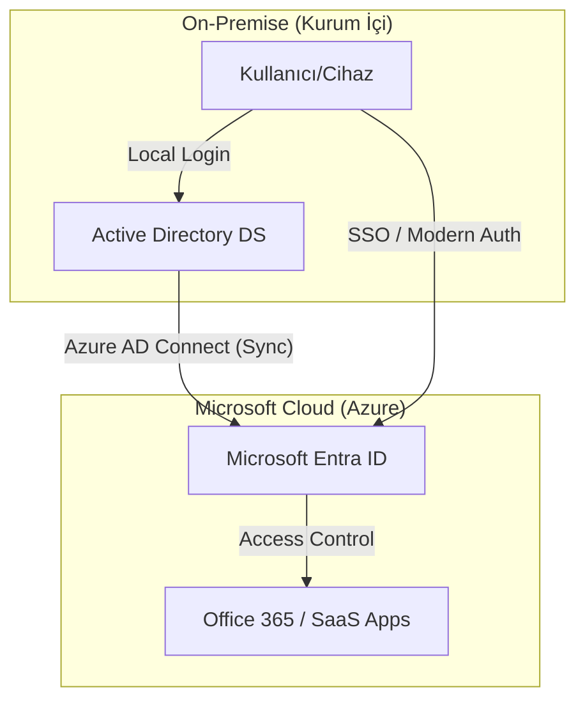

  <strong>Sesli Dinle:</strong> Bu makalenin seslendirmesi hazırdır, yukarıdaki oynatıcıdan dinleyebilirsiniz.

# Microsoft’un Bulut Odaklı Stratejisi

Microsoft, son yıllarda **"cloud-first"** yaklaşımını net bir biçimde benimsemiş; Windows Server, kimlik yönetimi ve diğer ürünlerini Azure bulutuyla entegre edecek şekilde konumlandırmaktadır. Bu stratejik dönüşüm, kurumların altyapı yönetimini kökten değiştirirken, beraberinde yeni fırsatlar ve riskler getirmektedir.

---

### 📌 Hızlı Menü
1. [On-Prem Ürünlerde Durum](#on-prem-ürünlerde-durum-azalan-ve-yaşayan-ürünler)
2. [Kimlik Yönetimi ve AD](#kimlik-yönetimi-on-prem-adnin-durumu)
3. [Veri Mahremiyeti ve Egemenliği](#veri-mahremiyeti-ve-veri-egemenliği-kaygıları)
4. [On-Prem Kurumlar İçin Öneriler](#on-prem-only-kurumlar-için-öneriler)
5. [Açık Kaynak Alternatifi: Linux](#veri-egemenliği-için-açık-kaynak-alternatifi)

---

## On-Prem Ürünlerde Durum: Azalan ve Yaşayan Ürünler

Microsoft’un stratejisi on-premises altyapıyı hemen tamamen sonlandırmak değil, aksine Azure merkezli hibrit yönetime yönlendirmek yönündedir.

*Geleneksel On-Prem yönetim araçları yerini Azure merkezli hibrit çözümlere bırakıyor.*

### 🛠️ Kritik Araçlardaki Değişim
*   **WSUS (Windows Server Update Services):** Eylül 2024’te Microsoft, WSUS’un "deprecated" (kullanımdan kaldırılmış) ilan edildiğini duyurdu. Yeni inovasyon beklenmiyor; yönetim bulut araçlarına (Autopatch, Intune) kayıyor.
*   **Windows Admin Center (WAC):** Aktif geliştirme sürüyor. Özellikle Azure Arc entegrasyonu ile on-prem sunucuların bulut üzerinden yönetimi hedefleniyor.
*   **Azure Local (Azure Stack HCI):** On-prem donanımı tamamen terk etmek yerine, bu altyapıyı "Azure ile birleştirilmiş" bir hibrit platform olarak konumluyor.

---

## Kimlik Yönetimi: On-Prem AD’nin Durumu

Microsoft’un kimlik çözümlerindeki ana eğilim bulut merkezlidir. **Microsoft Entra ID (Azure AD)**, platformun kalbi haline gelmiştir.

*Azure AD / Microsoft Entra ID yönetim portalı.*

### 🔄 Hibrit Kimlik Akışı
Aşağıdaki diyagram, On-Premise Active Directory ile Bulut (Entra ID) arasındaki senkronizasyon ve erişim akışını göstermektedir:

### 🔐 Active Directory'nin Geleceği
Microsoft, on-prem AD’yi hemen kaldırmıyor. Windows Server 2025 ile AD DS için önemli performans iyileştirmeleri (32k sayfa boyutu, LAPS geliştirmeleri) ekleniyor. Ancak yatırımların %90'ı bulut tarafına yapılıyor.

*Active Directory Administrative Center - Modern yönetim arayüzleri.*

> [!IMPORTANT]
> Uzun vadede iş yüklerinin Entra ID üzerinde tutulması ve on-prem AD ile hibrit bir köprü (Azure AD Connect) kurulması önerilmektedir.

---

## Veri Mahremiyeti ve Veri Egemenliği Kaygıları

Bulut stratejisinin en çok sorgulandığı nokta veri egemenliğidir. Microsoft, Avrupa verilerinin Avrupa'da kalacağını taahhüt etse de hukuki gerçekler farklıdır.

### ⚖️ Hukuki Çıkmaz: U.S. CLOUD Act
ABD yasaları gereği, Microsoft yasal bir erişim talebi geldiğinde Avrupa'daki verileri dahi sağlamak zorundadır. Microsoft Fransa Genel Hukuk Müşaviri, "ABD’den gelen talepler doğru biçimde yapılırsa verileri sağlamak zorundayız" diyerek bu durumu kabul etmiştir.

*   **Teknik Çözüm:** Azure Confidential Computing ve Müşteri Tarafından Yönetilen Anahtarlar (CMK).
*   **Hukuki Çözüm:** Microsoft for Sovereignty girişimleri ve sıkı DPA sözleşmeleri.

---

## On-Prem-only Kurumlar İçin Öneriler

Verilerini asla dışarı çıkarmayan kurumlar için dikkatli bir hibrit strateji şarttır.

### ✅ Teknik Önlemler
*   **Azure Local / HCI:** Veriyi içeride, yönetimi bulutta tutun.
*   **CMK / BYOK:** Kendi anahtarınızla şifreleyin (Microsoft'un erişimini sınırlayın).
*   **Air-Gapped:** En kritik veriler için internet erişimi olmayan izole ortamlar oluşturun.

### ✅ Operasyonel Adımlar
1.  **Envanter (30 gün):** Tüm veri akışlarını haritalayın.
2.  **Sınıflandırma (60 gün):** Hangi verinin on-prem kalması gerektiğini belirleyin.
3.  **WSUS Geçiş Planı:** Güncelleme yönetimi için alternatif (MECM/SCCM) belirleyin.

---

## Veri Egemenliği İçin Açık Kaynak Alternatifi

Microsoft’un bulut baskısı ve CLOUD Act endişeleri, Linux masaüstü çözümlerini güçlü bir alternatif haline getirmiştir.

### 🐧 Neden Linux?
*   **Tam Kontrol:** Gizli telemetri veya arka kapı riski yoktur.
*   **Veri Egemenliği:** Veri işleme tamamen yereldir, internet bağımlılığı yoktur.
*   **Maliyet:** Lisans maliyetlerinden kurtulup bütçeyi özgürleştirir.

**Hangi Çözüm?**
*   Kurumsal Destek: **RHEL** veya **SUSE**.
*   Denge ve Kararlılık: **Ubuntu LTS**.
*   Maliyet Odaklı: **AlmaLinux** veya **Rocky Linux**.

---

## Sonuç

Microsoft’un stratejisi hibrit bir geleceği işaret ediyor. Bulutun avantajlarından yararlanırken kontrolü elden bırakmayan bir yaklaşım ve stratejik bağımsızlık için açık kaynak alternatifleri, kurumların geleceğini şekillendirecek iki temel eksen olacak.

---

### **Kaynaklar**
1. [Windows Server 2022 Yenilikleri](https://learn.microsoft.com/en-us/windows-server/get-started/whats-new-in-windows-server-2022)
2. [WSUS Deprecation Duyurusu](https://techcommunity.microsoft.com/blog/windows-itpro-blog/windows-server-update-services-wsus-deprecation/4250436)
3. [Azure Data Residency Dokümantasyonu](https://azure.microsoft.com/en-us/explore/global-infrastructure/data-residency)