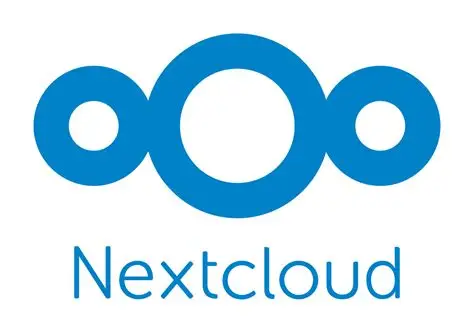
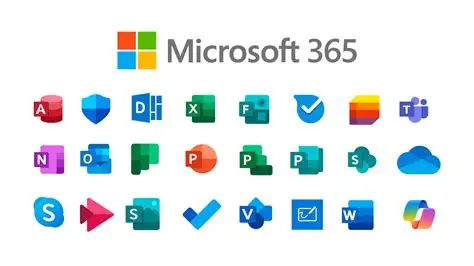
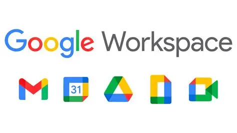
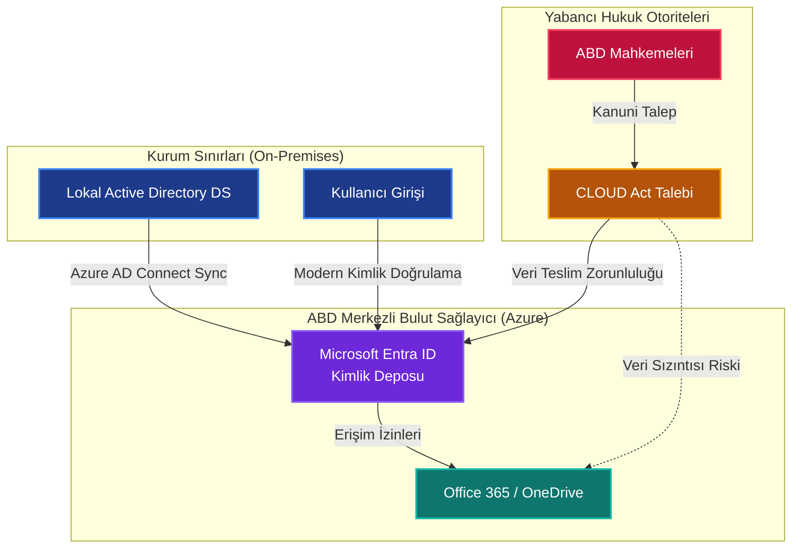
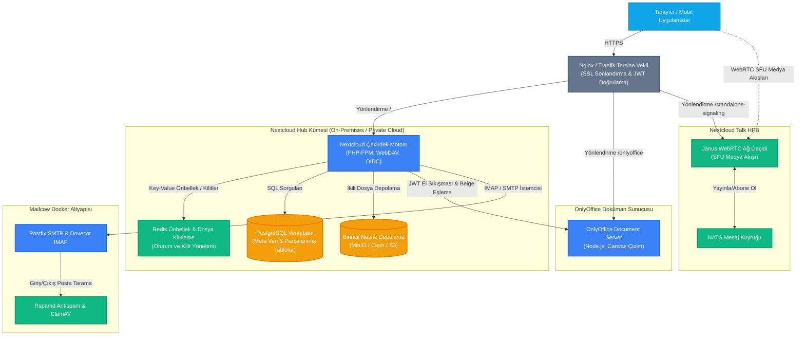
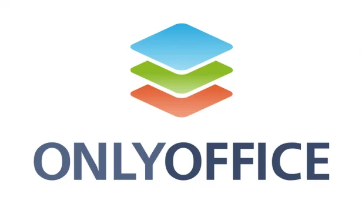
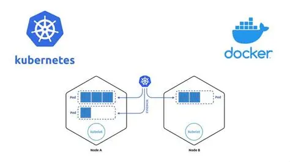

**M365 ve Google Workspace'e Karşı Açık Kaynaklı, Veri Egemen Kurumsal Altyapı ve Entegrasyon Rehberi**

Modern iş dünyasında bulut tabanlı ortak çalışma platformları kurumsal iletişimin ve veri yönetiminin kalbini oluşturmaktadır. Ancak teknoloji dünyasında sıkça dile getirilen **\"Bulut (cloud) diye bir şey yoktur, o sadece başkasının bilgisayarıdır\"** vurgusunun da işaret ettiği gibi, verinin değeri arttıkça ve gizlilik regülasyonları (KVKK, GDPR) sıkılaştıkça Microsoft 365 (M365) ve Google Workspace gibi genel bulut (public cloud) devlerine bağımlı olmak; veri egemenliği, güvenlik ve maliyet açılarından ciddi riskler doğurmaktadır. ABD Bulut Yasası (US Cloud Act) gibi yasal düzenlemeler nedeniyle, verilerinizin fiziksel olarak hangi ülkede depolandığından bağımsız olarak yabancı otoritelerin erişimine açık olması kurumsal risk yöneticilerini endişelendirmektedir.

<div class="video-container" style="position: relative; padding-bottom: 56.25%; height: 0; overflow: hidden; max-width: 100%; margin: 1.5rem 0; border-radius: 12px; box-shadow: 0 4px 15px rgba(0,0,0,0.3);">
  <iframe src="https://www.youtube.com/embed/CFdZWgiAj8I" style="position: absolute; top: 0; left: 0; width: 100%; height: 100%; border: 0;" allow="accelerometer; autoplay; clipboard-write; encrypted-media; gyroscope; picture-in-picture; web-share" allowfullscreen></iframe>
</div>

Bu teknik blog yazısında, bu bağımlılığı sıfıra indiren ve kurumlara kendi sunucularında (on-premises veya private cloud) tam veri egemenliği sunan **Nextcloud Hub**, **OnlyOffice Document Server** ve **Mailcow** ekosisteminin bütünsel mimarisini ele alacağız. Platformun yeteneklerini M365 ve Google Workspace ile kıyaslayacak; performans, güvenlik, ölçeklenebilirlik ve otonom yapay zeka entegrasyonu detaylarına mikroskobik bir bakış atacağız.

---

## 1. Dijital Egemenlik Savaşı: Nextcloud Hub vs. M365 & Google Workspace

<div style="display: flex; justify-content: center; gap: 2rem; align-items: center; margin: 1.5rem 0; flex-wrap: wrap; background-color: rgba(255,255,255,0.05); padding: 1.5rem; border-radius: 12px;">
  
  
  
</div>

Kurumsal veri yönetiminde Nextcloud, basit bir dosya barındırma (drive) çözümü olmanın çok ötesine geçerek, iletişim ve işbirliği araçlarını entegre eden bütünsel bir ekosisteme dönüşmüştür.

Aşağıdaki tablo, kendi sunucularınızda barındırılan Nextcloud ekosistemi ile genel bulut alternatifleri arasındaki mimari ve stratejik farkları özetlemektedir:

| Kriter | Nextcloud Hub Ekosistemi | Microsoft 365 | Google Workspace |
| :--- | :--- | :--- | :--- |
| **Barındırma (Hosting)** | On-Premises, Özel Bulut (Private Cloud) veya Hava Boşluklu (Air-gapped) izole ağlar. | Sadece Microsoft Genel Bulutu (Azure). | Sadece Google Genel Bulutu. |
| **Veri Egemenliği (Data Sovereignty)** | **Mutlak**. Veri tabanı, şifreleme anahtarları ve dosyalar tamamen kurumun kontrolündedir. | **Sınırlı**. Veriler şifrelense de anahtarlar ve altyapı Microsoft yönetimindedir. | **Sınırlı**. Veriler Google altyapısında barındırılır; anahtar kontrolü Google'dadır. |
| **KVKK / GDPR Uyumluluğu** | Yerel sunucularda barındırma sayesinde regülasyonlara %100 yerel uyum sağlanır. | Verilerin yurt dışına çıkması ve Cloud Act nedeniyle uyumluluk riskleri barındırır. | Benzer şekilde, verinin sınır ötesi transferi KVKK/GDPR açısından ek onaylar gerektirir. |
| **Lisans Denetimi & Maliyet** | Açık kaynaklı (AGPLv3) lisanslama. Kullanıcı sınırı yoktur; beklenmedik denetimler yaşanmaz. | Kullanıcı başına aylık ödeme. Sürüm değişikliklerinde ani lisans artışları ve denetim riskleri. | Kullanıcı başına aylık abonelik. Ölçek büyüdükçe artan lisans maliyetleri. |
| **Yapay Zeka (AI) Yaklaşımı** | **Yerel/Otonom**. Modeller (Llama, Mistral) kurum sunucularında çalışır; veri dışarı sızmaz. | Bulut tabanlı Copilot. Veriler Microsoft'un LLM motorları tarafından işlenir. | Bulut tabanlı Gemini. Veriler Google bulutunda işlenir ve analiz edilir. |
| **Çevrimdışı ve İzole Çalışma** | İnternet erişimi olmayan (air-gapped) askeri veya kritik ağlarda dahi tam kararlılıkla çalışır. | Çalışmak için sürekli internet ve Microsoft bulut servislerine aktif bağlantı gerektirir. | Sürekli internet bağlantısı ve Google hesap doğrulaması zorunludur. |

### 1.1. Microsoft'un Bulut Odaklı (Cloud-First) Baskısı ve Deprecation Riskleri

Kurumların genel bulut sağlayıcılarına geçişini hızlandırmak için yazılım devleri on-premises (yerel) ürün desteklerini ve özelliklerini kademeli olarak daraltmaktadır. Bu stratejik baskının en somut örneği Microsoft'un **"cloud-first"** yaklaşımıdır:

* **WSUS (Windows Server Update Services) Sonu:** Microsoft, Eylül 2024 itibarıyla WSUS'u "deprecated" (kullanımdan kaldırılmış) ilan etmiştir. Artık yerel güncelleme sunucusuna yeni özellikler eklenmeyecek ve kurumlar bulut tabanlı güncelleme araçlarına (Autopatch, Intune) geçmeye zorlanacaktır.
* **Kimlik Yönetiminde Entra ID Dayatması:** Klasik On-Premise Active Directory (AD DS), Windows Server 2025 ile bazı performans iyileştirmeleri alsa da Microsoft'un kimlik alanındaki yatırımlarının %90'ı bulut tabanlı **Microsoft Entra ID** (eski adıyla Azure AD) üzerine yapılmaktadır. Kurumlar, bulut servisleriyle senkronizasyon (Azure AD Connect) kurmaya ve kimlik doğrulamayı buluta taşımaya teşvik edilmektedir.
* **Azure Local (Azure Stack HCI) Hibrit Modeli:** Microsoft on-premise donanımları tamamen terk etmese de, bunları "Azure Local" adı altında Azure bulutuna sıkı sıkıya bağlı hibrit platformlar olarak konumlandırmaktadır. Bu modelde yönetim arayüzleri ve lisans kontrolleri doğrudan Azure portalı üzerinden yürütülmektedir.

Bu bulut odaklı strateji, yerel veri merkezinde kalmak isteyen kurumları işlevsel olarak geride bırakmakta ve genel buluta bağımlılığı (vendor lock-in) kaçınılmaz hale getirmektedir.

### 1.2. Hukuki Tehdit: ABD Bulut Yasası (U.S. CLOUD Act) ve Veri Egemenliği Çıkmazı

Genel bulut sağlayıcılarının (Microsoft Azure, AWS, Google Cloud) sunduğu veri konumlandırma (data residency) taahhütleri, verilerin fiziksel olarak Avrupa'da veya Türkiye'de depolanacağını belirtir. Ancak bu taahhüt siber güvenlik uzmanları ve hukukçular için tek başına yeterli bir mahremiyet garantisi değildir.

Bunun arkasındaki en büyük yasal tehdit ABD'nin **U.S. CLOUD Act** (Clarifying Lawful Overseas Use of Data Act) yasasıdır. Bu yasa uyarınca:
1. ABD merkezli bulut sağlayıcıları (ve onların yurt dışındaki iştirakleri), yasal bir mahkeme kararı veya erişim talebi geldiğinde, **verinin nerede depolandığına bakılmaksızın** (örneğin Azure Almanya veya İrlanda veri merkezinde olsa dahi) ilgili veriyi ABD makamlarına teslim etmek zorundadır.
2. Nitekim Microsoft Fransa Genel Hukuk Müşaviri, ABD makamlarından usulüne uygun bir talep geldiğinde, yerel veri koruma kanunlarına rağmen veriyi teslim etmekle yükümlü olduklarını resmi olarak kabul etmiştir.

Bu durum, KVKK'nın kişisel verilerin yurt dışına aktarılmasına dair sıkı kuralları (Madde 9) göz önüne alındığında, genel bulut kullanan yerel kurumlar için doğrudan uyumsuzluk riski ve yasal ceza yaptırımları anlamına gelir. 

Aşağıdaki şema, kurumsal kimlik bilgilerinizin on-premise sınırlarından çıkıp buluta taşınmasındaki yasal ve teknik akışı özetlemektedir:



Bu yasal riskler ve bulut dayatmaları karşısında, verilerin ve kimlik altyapısının kurum içi sunucularda barındırıldığı, açık kaynak kodlu (AGPLv3) **Nextcloud Hub ve OnlyOffice** entegrasyonu, veri egemenliğini yasal ve teknik düzeyde koruyan yegane alternatif hale gelmektedir.

---

## 2. Nextcloud Hub Çekirdek Bileşenleri ve Entegrasyon Mimari Yapısı

Nextcloud Hub, veri silolarını ortadan kaldıran ve tüm uygulamaların birbiriyle tutarlı bir şekilde haberleşmesini sağlayan API tabanlı bir orkestrasyona sahiptir. Kurumsal bir private cloud ortamında Nextcloud Hub, OnlyOffice Document Server ve Mailcow entegrasyonunun bütünsel ağ ve servis mimarisi aşağıdaki gibidir:



### 2.1. Nextcloud Files ve Depolama Optimizasyonu
Files modülü, WebDAV protokolünü temel alan çekirdek dosya sistemidir. Kurumsal ölçekte (500+ kullanıcı) dosya listeleme hızını korumak ve veritabanı üzerindeki disk I/O yükünü azaltmak amacıyla **ADA (Advanced Data Access) Engine** geliştirilmiştir. ADA Engine, eski Nextcloud sürümlerindeki devasa monolitik `oc_filecache` tablosunu parçalayarak (database sharding) küçük resim önizlemelerini (thumbnails), avatarları ve uygulama meta verilerini ayrı tablolara taşımıştır. Bu sayede çekirdek veritabanı boyutu %56 küçülmüş ve WebDAV istemcilerinin yaptığı gereksiz PROPFIND (durum sorgulama) istekleri %80 oranında azaltılmıştır.

Petabayt seviyesindeki kurumsal depolama ihtiyaçları için Nextcloud, geleneksel blok depolama (NFS, Local RAID) yerine **Primary Object Storage** mimarisini destekler. Bu mimaride Nextcloud; Amazon S3, MinIO veya Ceph Object Gateway gibi nesne depolama havuzlarına doğrudan bağlanır. Dosya sistemi hiyerarşisi S3 üzerinde düz (flat) bir yapıda, rastgele UUID'ler ile tutulurken, klasör yapısı lokal PostgreSQL veritabanında saklanır. 

> [!CAUTION]
> **Kritik Pitfall:** Primary Object Storage yapılandırması yalnızca Nextcloud kurulumunun ilk aşamasında yapılabilir. Sonradan birincil depolamayı S3'e taşımak eski dosyaların erişilemez hale gelmesine yol açar. Ayrıca, S3 birincil depolamaya geçildiğinde, yerel Docker disk hacimlerini yedeklemek üzere tasarlanmış olan entegre **BorgBackup** sistemi çalışmayı durdurur. Bu senaryoda felaket kurtarma planı; veritabanı yedekleri (pg_dump) ile S3 bucket replikasyonunu (MinIO Mirroring) ayrı ayrı senkronize edecek şekilde kurgulanmalıdır.

---

### 2.2. OnlyOffice Belge Yönetimi: Client-Side Rendering Devrimi
Kurumsal belgelerin (Word, Excel, PowerPoint) web tarayıcılarında bozulma yaşanmadan, eşzamanlı olarak düzenlenmesi iş verimliliğinin temelidir. Nextcloud, ofis entegrasyonu için iki güçlü alternatif sunar: **Collabora Online (CODE)** ve **ONLYOFFICE**. 

İki çözüm arasındaki temel fark, tarayıcıda belgenin nasıl çizildiğidir (rendering):

<div class="render-cards">
  <div class="render-card render-card-ssr">
    <span class="render-badge">Collabora Online</span>
    <h3>Server-Side Rendering (SSR)</h3>
    <ul>
      <li><strong>Motor:</strong> Doküman sunucu tarafındaki LibreOffice motorunda çalıştırılır ve tarayıcıya sadece sayfanın görselleri (tiles) aktarılır.</li>
      <li><strong>Sunucu Yükü:</strong> Yüksek CPU/RAM tüketimi. 50 aktif kullanıcıda 16 GB RAM sınırına ulaşabilir.</li>
      <li><strong>Ağ Duyarlılığı:</strong> Gecikme süresi (latency) yüksek olan bağlantılarda yazma yavaşlığı hissedilir.</li>
    </ul>
  </div>
  
  <div class="render-card render-card-csr">
    <span class="render-badge">ONLYOFFICE</span>
    <h3>Client-Side Rendering (CSR)</h3>
    <ul>
      <li><strong>Motor:</strong> HTML5 Canvas ve JavaScript tabanlı bir çizim mimarisi kullanır.</li>
      <li><strong>Sunucu Yükü:</strong> Çizim işlemi tamamen kullanıcının bilgisayarında gerçekleşir. 50-100 eşzamanlı kullanıcı için 2-4 GB RAM yeterlidir.</li>
      <li><strong>Uyumluluk:</strong> Microsoft Office formatlarıyla (.docx, .xlsx, .pptx) %99 oranında yüksek uyumluluk sağlar.</li>
    </ul>
  </div>
</div>

```
OnlyOffice İletişim Akışı:
[Nextcloud WebUI] --(Düzenleme İsteği)--> [Nextcloud Core] --(JWT Doğrulama)--> [OnlyOffice Document Server]
       ^                                                                                   |
       |                                                                                   v
[Client Browser] <-------------(JS & OOXML Belge Yükü / Client Rendering)------------------+
```



> [!WARNING]
> **JWT ve Proxy Engelleri:** OnlyOffice ile Nextcloud arasındaki veri trafiği, belgelerin yetkisiz indirilmesini önlemek için JSON Web Token (JWT) ile imzalanır. Ancak kurumsal ağlarda araya konumlandırılan Tersine Vekil Sunucular (Reverse Proxy), standart `Authorization` başlıklarını (header) silebilir. Bu durum belge açılışında kimlik doğrulama hatalarına sebep olur. Çözüm için OnlyOffice yapılandırmasında (`local.json`) JWT başlık adı `AuthorizationJwt` gibi özel bir değere atanmalı ve Nextcloud yönetim panelindeki "Authorization Header" alanı da buna göre güncellenmelidir.
>
> **Topluluk Sürümü Limiti:** Ücretsiz OnlyOffice Docs Community Edition, kod seviyesinde gömülü olarak **maksimum 20 eşzamanlı bağlantı (sekme)** limitiyle gelir. 21. kullanıcı doküman açtığında belge salt okunur (read-only) açılır. 50+ kullanıcılı kurumsal yapılarda bu limitin aşılması kaçınılmazdır. Bu durumda ya bütçe ayrılarak OnlyOffice Enterprise sürümüne geçilmeli ya da sunucu RAM'i güçlendirilerek limitsiz Collabora alternatifi tercih edilmelidir.

---

### 2.3. Nextcloud Talk ile Güvenli Gerçek Zamanlı İletişim
Nextcloud Talk; sesli/görüntülü konferans, sohbet ve ekran paylaşımı sunan WebRTC tabanlı bir çözümdür. 

Talk'un kurumsal dağıtımında en kritik mimari seçim sinyalleşme altyapısıdır:
*   **Standart Kurulum (Mesh Network / P2P):** Katılımcılar medya akışlarını doğrudan birbirlerine gönderir. 5 kişilik bir görüşmede her istemci diğer 4 kişiye ayrı ayrı video yüklemek (upload) zorundadır. Bu durum kullanıcı tarafındaki upload bant genişliğini ve CPU'yu tüketerek 3-5 katılımcıdan sonra görüşmenin çökmesine yol açar.
*   **High Performance Backend (HPB - SFU Mimarisi):** Janus WebRTC Gateway ve NATS mesajlaşma kuyruğundan oluşan bu özel orkestrasyon, **Selective Forwarding Unit (SFU)** mimarisini kullanır. Katılımcı videosunu sunucuya tek bir kanal üzerinden yükler; Janus sunucusu bu akışı çoğaltarak diğer katılımcılara dağıtır. Kullanıcı upload yükü sabittir. 10, 20 veya 50 kişilik kurumsal toplantılar ancak HPB mimarisiyle mümkündür.

> [!IMPORTANT]
> **Bant Genişliği ve Kayıt Performansı:** 20 katılımcılı bir HD video konferansta sunucu giriş (inbound) trafiği ~40 Mbps, çıkış (outbound) trafiği ise ~100 Mbps seviyelerini görebilir. Bu nedenle Talk HPB kurulu sunucuların en az 500 Mbps simetrik internet hattına sahip olması önerilir. Ek olarak, toplantı kaydetme (Recording) özelliği devreye alındığında, sunucuda video birleştirme (transcoding/encoding) işlemi başlayacağından, her bir kayıt işlemi 2-4 vCPU'yu %100 meşgul eder. Kayıt özelliği için HPB sunucusunun ayrı bir VM veya fiziksel makinede izole edilmesi donanım sağlığı açısından elzemdir.

---

### 2.4. Kurumsal Mail Hizmetleri ve Mailcow Entegrasyonu
Nextcloud içerisindeki yerleşik "Mail" uygulaması bağımsız bir e-posta sunucusu değildir; yalnızca web tabanlı bir IMAP/SMTP istemcisidir. Verinin şirket içinde kalmasını garantilemek için arkada Dockerized mimaride çalışan **Mailcow** gibi tam teşekküllü bir e-posta sunucu kümesi konumlandırılmalıdır.


Mailcow (Postfix, Dovecot, SOGo, Rspamd ve ClamAV ile); Exchange ActiveSync (EAS) desteği sayesinde mobil cihazlarla CalDAV/CardDAV üzerinden kişileri ve takvimleri anlık (push) senkronize edebilir. Ancak kendi e-posta altyapınızı kurarken, gönderilen e-postaların Gmail/Outlook gibi sağlayıcılar tarafından spam olarak engellenmemesi için aşağıdaki DNS ve kriptografik standartlar DNS paneline işlenmelidir:

<div class="render-cards">
  <div class="render-card render-card-ssg">
    <span class="render-badge">SPF</span>
    <h3>Sender Policy Framework</h3>
    <p>Domain adınıza e-posta göndermeye yetkili IP adreslerini belirtir. DNS kaydı:</p>
    <code>v=spf1 mx a -all</code>
    <p>Buradaki <code>-all</code> parametresi yetkisiz göndericilerin doğrudan reddedilmesini sağlar.</p>
  </div>
  
  <div class="render-card render-card-isr">
    <span class="render-badge">DKIM</span>
    <h3>DomainKeys Identified Mail</h3>
    <p>E-postanın yoldayken değiştirilmediğini kanıtlayan asimetrik şifrelemedir. Mailcow üzerinde üretilen 2048-bit RSA anahtarı, DNS'te <code>dkim._domainkey</code> adına TXT kaydı olarak girilmelidir.</p>
  </div>
  
  <div class="render-card render-card-ssr">
    <span class="render-badge">DMARC</span>
    <h3>Domain-based Message Authentication</h3>
    <p>SPF ve DKIM doğrulamaları başarısız olan e-postaların karşı sunucu tarafından nasıl işleneceğini tanımlar:</p>
    <code>v=DMARC1; p=reject; rua=mailto:postmaster@domain.com</code>
  </div>
  
  <div class="render-card render-card-csr">
    <span class="render-badge">rDNS / PTR</span>
    <h3>Tersine DNS (Reverse DNS)</h3>
    <p>E-posta sunucusunun IP adresine ping atıldığında geri dönen ismin sunucu hostname'iyle (<code>mail.domain.com</code>) eşleşmesi şarttır. Bu işlem ISP tarafında tanımlanır.</p>
  </div>
</div>

---

### 2.5. Otonom ve Yerel Yapay Zeka: Nextcloud AI Assistant
M365 Copilot veya Google Gemini gibi çözümler, kullanıcı verilerini işlemek üzere bulut tabanlı API'lere ihtiyaç duyar; bu da kurumsal verilerin dışarı sızma riskini beraberinde getirir. Nextcloud Hub, **AppAPI** mimarisi sayesinde sunucunuzun sınırları dışına tek bir bayt veri çıkarmadan **%100 Yerel Yapay Zeka (Local LLM)** deneyimi sunar.

AppAPI, Python/Go tabanlı yapay zeka uygulamalarını Nextcloud ana PHP sürecinden ayırarak izole Docker konteynerleri olarak çalıştırır. "Nextcloud AI Assistant" modülü; sunucunun kendi işlemci veya GPU gücünü kullanarak **Llama** ve **Mistral** gibi yerel dil modellerini koşturur. Ses dosyalarının metne dönüştürülmesi (Speech-to-Text) işlemleri ise yerel **Whisper** modeliyle tamamlanır. Bu otonom yapı, e-posta özetleme, Talk toplantı transkriptleri çıkarma ve Text uygulamasında metin üretme gibi işlemleri tamamen şirket içinde, GDPR/KVKK uyumlu olarak gerçekleştirir.

---

## 3. Kurumsal Güvenlik Mimarisi ve Erişim Denetimi

Yüzlerce kullanıcının dosya paylaştığı bir ortamda kimlik yönetimi ve güvenlik katmanları en sıkı standartlara göre tasarlanmalıdır.

### 3.1. LDAP/Active Directory ve SSO Entegrasyonu
Nextcloud ve Mailcow, kullanıcı veritabanını senkronize etmek için merkezi Active Directory veya OpenLDAP sunucularına bağlanır. Güvenlik için düz LDAP (port 389) yerine her zaman SSL/TLS şifreli **LDAPS (port 636)** kullanılmalıdır. 

AD/LDAP entegrasyonunda oturum açma hızını korumak için:
*   **Cache TTL (Önbellek Süresi):** Nextcloud LDAP ayarlarında önbellek süresi `3600` saniye (1 saat) veya üzerine çıkarılmalıdır. Böylece Nextcloud her işlemde AD sunucusunu sorgulamaz.
*   **Paging (Sayfalama):** AD sunucusunda sorgu limitlerinin aşılmasını önlemek için sayfalama aktif edilmeli ve sayfa boyutu `500-1000` arası seçilmelidir.
*   **Single Sign-On (SSO):** Kullanıcıların tek bir şifreyle tüm sistemlere erişmesi için Keycloak veya Authentik gibi modern SSO portalları konumlandırılmalı, Nextcloud ve Mailcow bu portallara OpenID Connect (OIDC) protokolü üzerinden entegre edilmelidir. Çok faktörlü doğrulama (MFA - TOTP/FIDO2 YubiKey) politikaları merkezi olarak bu SSO portalında yönetilmelidir.

### 3.2. Veri Sızıntısı Önleme (DLP) ve Flow Motoru
Nextcloud'un yerleşik "File Access Control" (Dosya Erişim Kontrolü) motoru; kullanıcı grubu, cihaz türü (User Agent), dosya uzantısı ve IP adresine dayalı dinamik erişim kuralları tanımlamayı sağlar. Örneğin, İK departmanındaki kullanıcıların şirket ağı dışındaki bir IP adresinden bağlandıklarında finansal `.xlsx` dosyalarını açması veya indirmesi bloke edilebilir.

Ayrıca, platform **ICAP (Internet Content Adaptation Protocol)** desteği sunar. Dosyalar diske yazılmadan önce kurumsal DLP tarayıcısına yönlendirilir; dosya içerisinde T.C. Kimlik Numarası veya Kredi Kartı verisi saptandığında dosya otomatik olarak "Hassas" etiketiyle işaretlenir ve dış linklerle paylaşılması engellenir.

### 3.3. Server-Side Encryption (SSE) vs. End-to-End Encryption (E2EE)
Nextcloud disk güvenliğini sağlamak için iki farklı kriptografik yöntem sunar:

<div class="render-cards">
  <div class="render-card render-card-ssr">
    <span class="render-badge">SSE</span>
    <h3>Sunucu Taraflı Şifreleme (Server-Side Encryption)</h3>
    <p>Dosya Nextcloud sunucusundan çıkıp Amazon S3 veya harici depolamaya yazılmadan önce AES-256 ile sunucu işlemcisinde şifrelenir. Anahtarlar Nextcloud belleğindedir.</p>
    <p>Bu yöntem, depolama sağlayıcısından veriyi korur ancak sunucuyu ele geçiren root yetkili bir saldırgan RAM dump alarak anahtarları çalabilir.</p>
  </div>
  
  <div class="render-card render-card-ssg">
    <span class="render-badge">E2EE</span>
    <h3>Uçtan Uca Şifreleme (End-to-End Encryption)</h3>
    <p>Şifreleme kullanıcının masaüstü/mobil cihazında yerel üretilen 256-bit AES-GCM anahtarlarıyla başlar. Sunucu dosyaların adını veya içeriğini asla göremez (Zero-Knowledge).</p>
    <p>E2EE, tarayıcıya sunucudan inen JavaScript koduna güvenilemediği için (Browser Trust Model açığı) web arayüzünde çalışmaz; sadece masaüstü/mobil istemcilerde etkindir.</p>
  </div>
</div> 

---

## 4. Prodüksiyon Ortamları İçin Performans İnce Ayarları (Tuning Checklist)



Sisteminizin yük altında donmasını önlemek için sunucu işletim sistemi, PHP-FPM, Redis ve veritabanı seviyesinde aşağıdaki performans ayarlamalarını yapmanız hayati önem taşır:

<div class="render-cards">
  <div class="render-card render-card-isr">
    <span class="render-badge">REDIS</span>
    <h3>İşlemsel Dosya Kilitleme</h3>
    <p>Senkronizasyon çakışmalarını önlemek için kilit yönetimini PostgreSQL yerine Redis'e devredin:</p>
    <code>'memcache.locking' => '\OC\Memcache\Redis',</code>
    <p>Redis tahliye politikasını <code>noeviction</code> yapmayı unutmayın.</p>
  </div>
  
  <div class="render-card render-card-csr">
    <span class="render-badge">PHP-FPM</span>
    <h3>Worker Limit Ayarları</h3>
    <p>Worker sayısını (<code>pm.max_children</code>) hesaplamak için <code>pm = static</code> kullanarak şu formülü uygulayın:</p>
    <code>max_children = (Toplam RAM - OS/DB RAM) / 100MB</code>
  </div>
  
  <div class="render-card render-card-ssr">
    <span class="render-badge">OPCACHE</span>
    <h3>OPCache & JIT Optimizasyonu</h3>
    <p>CPU yükünü düşürmek ve yürütme hızını maksimuma çıkarmak için JIT ve OPCache ayarlarını etkinleştirin:</p>
    <code>opcache.jit=1255</code>
  </div>
  
  <div class="render-card render-card-ssg">
    <span class="render-badge">CRON</span>
    <h3>Sistem Cron Entegrasyonu</h3>
    <p>AJAX arka plan işleri arayüzde yavaşlığa sebep olur. Arka plan işlerini sistem Crontab'ına taşıyın:</p>
    <code>*/5 * * * * php -f /var/www/nextcloud/cron.php</code>
  </div>
</div>

### 4.1. İşlemsel Dosya Kilitleme (File Locking) için Redis Entegrasyonu
Eşzamanlı dosya senkronizasyonlarında çakışmaları önlemek için kullanılan dosya kilitleme mekanizması, varsayılan kurulumda PostgreSQL veritabanını (`oc_file_locks` tablosu) kullanır. Bu durum disk IOPS limitlerini tüketerek sistemi kilitler. Kilit yönetimi mutlaka RAM üzerinde çalışan Redis'e devredilmelidir:
```php
'memcache.locking' => '\OC\Memcache\Redis',
```
Redis bellek tahliye politikası (`maxmemory-policy`), kilitlerin süresinden önce silinip dosya bütünlüğünü bozmasını önlemek için `noeviction` olarak ayarlanmalıdır.

### 4.2. PHP-FPM Süreç Limiti (Worker Hesaplama Formülü)
Anlık istek dalgalanmalarında sunucunun yanıt vermez duruma geçmesini engellemek için kurumsal sunucularda `pm = static` süreç yöneticisi kullanılmalıdır. Sunucunuzda çalıştırabileceğiniz maksimum PHP-FPM worker sayısı (`pm.max_children`) şu formülle hesaplanır:

$$\text{max\_children} = \frac{\text{Toplam RAM} - (\text{İşletim Sistemi ve Diğer Servislerin RAM İhtiyacı})}{\text{Süreç Başına Ortalama PHP Bellek Tüketimi (~100MB)}}$$

*Örnek:* 32 GB RAM'li bir sunucuda; OS (4GB), DB (8GB) ve Redis/Yan Servisler (4GB) düşüldüğünde kalan 16 GB (16.384 MB) RAM, 100 MB'lık PHP sürecine bölünürse `pm.max_children = 150` olarak atanmalıdır.

### 4.3. OPCache ve JIT Yapılandırması
`php.ini` dosyanızda aşağıdaki optimizasyonları etkinleştirerek CPU tüketimini azaltın ve derleme hızını maksimize edin:
```ini
opcache.memory_consumption=256
opcache.max_accelerated_files=20000
opcache.interned_strings_buffer=32
opcache.jit=1255
opcache.save_comments=1 ; Kapatılması Nextcloud yönlendirme (routing) sistemini bozarak sunucuyu çökertecektir.
```

### 4.4. AJAX Yerine Sistem Cron Görevleri
Nextcloud arka plan işlerini varsayılan olarak "AJAX" (sayfa tıklandıkça) çalıştırır. Bu durum sayfa yüklenmelerini yavaşlatır. Arka plan görevleri sistem seviyesinde işletim sistemi Cron'una (`crontab`) bağlanmalı ve her 5 dakikada bir çalışacak şekilde ayarlanmalıdır:
```bash
*/5 * * * * php -f /var/www/nextcloud/cron.php
```

---

## Sonuç: Egemen Bir Dijital Ofis İnşa Etmek

Nextcloud Hub, OnlyOffice ve Mailcow entegrasyonu; kurumlara M365 ve Google Workspace'in sunduğu tüm modern ortak çalışma ve iletişim yeteneklerini sunarken, **verinin mutlak kontrolünü ve yasal uyumluluğunu** garanti eder. 

Doğru donanım planlaması, Redis kilitleme optimizasyonları ve Talk SFB/Janus orkestrasyonu ile kurgulanan bu yerel altyapı, genel bulut maliyetlerini düşürmekle kalmayıp kurumunuzun dijital geleceğini güvenceye alan aşılmaz bir siber kale inşa edilmesini sağlayacaktır.
