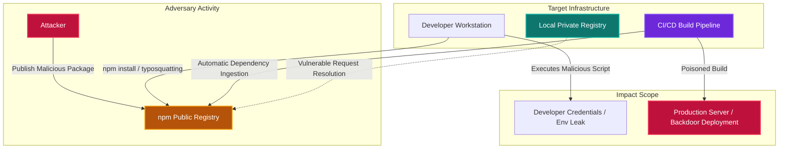

# npm Supply Chain Security: Architectural Analysis, Threat Vectors, and Enterprise Defense Strategies

In modern software development workflows, modular code design and the integration of third-party libraries are among the most critical factors accelerating development velocity. **Node Package Manager (npm)** sits at the heart of the Node.js and broader JavaScript/TypeScript ecosystem, mediating billions of package downloads and becoming the world's largest software registry.

From enterprise web applications to cloud-native systems and AI integrations, virtually every modern architecture is built on top of the npm ecosystem. However, this extreme degree of dependency and the inherent lack of control in the open-source supply chain create an asymmetric attack surface for cyber adversaries — one that enables highly sophisticated threats targeting the software supply chain itself.

---

## The Architectural Anatomy of the npm Ecosystem

npm's operational model is built on declarative manifest files, deterministic lock files, and hierarchical file systems. Understanding the core components and their associated security implications is essential:

**`package.json`** — The project's identity card. It stores dependencies (`dependencies`, `devDependencies`, `peerDependencies`), project metadata, and lifecycle scripts. From a security perspective, the most critical area is the `scripts` block, which can execute operating system-level commands automatically during package installation or build processes.

**Semantic Versioning (SemVer)** — Package versions are defined as `MAJOR.MINOR.PATCH`. Wildcard operators like `^` (caret) and `~` (tilde) in version specifiers instruct the package manager to automatically fetch the latest compatible minor or patch version from the internet. This behavior creates a scenario where an attacker who compromises a legitimate package account can publish a malicious "patch" release and instantly infiltrate thousands of downstream systems.

**`package-lock.json`** — Designed to prevent version drift, this file provides a deterministic snapshot of the entire dependency graph. It stores the exact source URL (`resolved`) and a SHA-512 integrity hash (`integrity`) for every package, enabling cryptographic verification. Manipulation of this file opens the door to lockfile injection attacks.

**`node_modules`** — The physical directory where all downloaded packages and their sub-dependencies reside. Starting with npm v3, the dependency graph is flattened to reduce conflicts, but this creates a chaotic structure that makes deep forensic inspection extremely difficult.

| Component / File | Core Function | Critical Security Role | Primary Threat Vector |
|---|---|---|---|
| `package.json` | Declares project dependencies and metadata | Hosts automatically executed script hooks | Malicious install scripts (`preinstall`, `postinstall`) |
| `package-lock.json` | Locks exact dependency versions and integrity | SHA-512 integrity verification and source validation | Lockfile injection and source URL manipulation |
| `node_modules` | Houses physical files of all downloaded packages | The location from which code is directly imported at runtime | Anti-forensics file manipulation |
| SemVer Rules | Manages version update behavior | Defines operators that permit automatic version transitions | Distributing malicious code via a trusted package's new release |

---

## The Dependency Graph and the Visibility Blind Spot

The most profound security vulnerability in the npm ecosystem lies beyond the direct dependencies a developer explicitly installs — in the vast **transitive (indirect) dependency graph** that no one fully controls. When a developer adds a single trusted library to their project, that library is itself dependent on dozens of other packages. When an average npm package is installed, hundreds of third-party codebases written by different authors are silently pulled into the system.

Mathematically, for a dependency tree of depth $D$ where each node has an average branching factor (average number of dependencies per package) of $b$, the total number of nodes $N$ is:

$$N = \sum_{d=1}^{D} b^d = \frac{b(b^D - 1)}{b - 1}$$

This exponential growth makes manual code auditing completely infeasible. Developers can only verify the packages they add directly, but remain blind to malicious code lurking in the transitive dependencies of those packages. This hierarchical structure creates a massive **visibility blind spot** for enterprise security teams, allowing adversaries to penetrate deeply without detection.



---

## Cyber Risks and Attack Typology in the npm Ecosystem

Adversaries exploit the open architecture and design flaws in npm's package resolution logic using increasingly sophisticated techniques.

<div class="render-cards">
  <div class="render-card render-card-ssr">
    <span class="render-badge">TYPOSQUATTING</span>
    <h3>Typographical Abuse</h3>
    <p>Adversaries publish malicious packages with names nearly identical to popular libraries, exploiting common typos (e.g., <code>lodsh</code> instead of <code>lodash</code>, <code>crossenv</code> instead of <code>cross-env</code>). A single keystroke error by a developer imports the malicious payload into the codebase.</p>
  </div>
  
  <div class="render-card render-card-csr">
    <span class="render-badge">DEPENDENCY CONFUSION</span>
    <h3>Registry Resolution Hijacking</h3>
    <p>By discovering internal private package names, attackers publish packages with the same name but inflated version numbers (e.g., <code>99.9.9</code>) on the public registry. Without strict source prioritization, <code>npm install</code> resolves to the higher public version, pulling in the malicious payload instead of the private package.</p>
  </div>

  <div class="render-card render-card-ssg">
    <span class="render-badge">ACCOUNT HIJACKING</span>
    <h3>Maintainer Credentials Compromise</h3>
    <p>Popular package maintainer accounts are compromised via phishing or by reclaiming expired email domains associated with npm credentials. Attackers then insert backdoors directly into verified, trusted packages and publish them as legitimate patch updates.</p>
  </div>
  
  <div class="render-card render-card-isr">
    <span class="render-badge">LIFECYCLE SCRIPTS</span>
    <h3>Installation Hook Exploitation</h3>
    <p>Lifecycle hooks such as <code>preinstall</code> and <code>postinstall</code> execute automatically at the OS level when a package is installed. Attackers abuse these hooks to silently deploy RAT droppers, harvest credentials, or establish C2 connections — without requiring any import in the application code.</p>
  </div>
</div>

### Dependency Confusion

First demonstrated in 2021 by security researcher **Alex Birsan**, this attack exploits a design flaw in how package managers resolve dependencies in environments that include both private and public registries.

Large organizations develop internal npm packages for use exclusively within their own networks. Their names are often exposed in error logs, compiled client-side JavaScript bundles, or public GitHub repositories. When an attacker discovers a private package name, they publish a fake package with the same name on the public npm registry — but with an artificially inflated version number like `99.9.9`.

When `npm install` runs without strict source prioritization configured, the package manager interprets the public `99.9.9` version as the "most current and compatible" and downloads the malicious package instead of the internal one. Using this technique, Alex Birsan executed code inside the internal networks of **Apple, Microsoft, Yelp, Tesla, and Shopify**, earning significant bug bounty rewards.

### Account Takeover (ATO)

Compromising the accounts of trusted, popular package maintainers is the highest-impact attack vector available. It typically occurs via two methods:

- **Phishing:** Fake emails impersonating the npm support team are sent to developers to harvest credentials or 2FA reset tokens.
- **Expired Domain Recovery:** When the email domain of a popular package's maintainer expires, attackers purchase the domain, trigger npm's password reset mechanism, and seize control of the account.

### Malicious Lifecycle Script Exploitation

One of npm's most powerful yet most dangerous features is the ability to execute OS-level commands during package installation phases (`preinstall`, `install`, `postinstall`, `prepare`). Attackers leverage these hooks to silently open backdoors, collect credentials, or download second-stage malware from a C2 server the moment a developer runs `npm install`.

**March 2026 — The Axios Breach:** Without touching Axios's source code, attackers injected a fake package named `plain-crypto-js@4.2.1` into its dependencies. The `postinstall` script of this package functioned as a cross-platform RAT dropper targeting Windows, macOS, and Linux. Notably sophisticated anti-forensics techniques were employed:

- After execution, the malicious code deleted its own installer file, `setup.js`.
- It replaced the original `package.json` with a clean v4.2.0 stub, eliminating the most-searched forensic evidence.

### Protestware and Abandoned Packages

**CVE-2022-23812 (node-ipc & peacenotwar):** In March 2022, the creator of `node-ipc` published destructive code that wiped files on systems with Russian and Belarusian IP addresses, replacing them with a heart emoji (❤️). He subsequently added a `peacenotwar` protest module, causing DoS conditions on servers. This cascaded to thousands of downstream projects that used `node-ipc` as a dependency, including the Vue.js CLI.

**Abandoned packages** are libraries whose maintainers have stopped active development. Over time, new CVEs are discovered in these packages with no one responsible for patching them. Attackers scan for these vulnerabilities and leverage them to compromise enterprise applications that have not updated their dependencies.

---

## Infection Cascades and Network Analysis

From a network theory perspective, the npm ecosystem exhibits the properties of a **scale-free network**. While the majority of packages have very few dependents, a small number of critical libraries (hub nodes) are directly or indirectly connected to millions of projects. This high degree of centrality creates an asymmetric risk: compromising a single strategically chosen package can paralyze the entire ecosystem.

For a hub node with an infection probability $p$ and a total number of directly or indirectly dependent packages $k$, the probability of a cascade infecting downstream packages $P_{\text{cascade}}$ is modeled as:

$$P_{\text{cascade}} = 1 - (1 - p)^k$$

When $k$ is exponentially large, even a very small attacker success probability $p$ makes the cascade effect nearly inevitable across the ecosystem.

| Attack Type | Core Exploitation Mechanism | Notable Historical Examples | Primary Impact Domain |
|---|---|---|---|
| Dependency Confusion | Public registry's higher-versioned package preferred over private one | Yelp, Apple, Microsoft, Tesla Breaches (Alex Birsan, 2021) | Data exfiltration, internal network infiltration, RCE |
| Typosquatting | Replicating popular package names with minor typographic changes | `lodash` → `lodsh`, `cross-env` → `crossenv`, Ledger-CLI impostors | Theft of environment variables and API keys |
| Account Takeover (ATO) | Compromising maintainer credentials or reclaiming expired email domains | node-ipc (May 2026), Axios Breach (March 2026) | Widespread malicious code delivery via trusted packages |
| Lifecycle Script Abuse | Using installation hooks to execute backdoors and C2 payloads | Axios / plain-crypto-js RAT dropper (2026) | Remote code execution, persistence, credential theft |
| Protestware | Developers deliberately sabotaging their own packages for political ends | node-ipc (peacenotwar), colors.js, es5-ext | File system destruction, Denial of Service (DoS) |
| Abandoned Packages | Exploiting unpatched CVEs in unmaintained libraries over time | Various legacy npm libraries | Enterprise infrastructure compromise via newly discovered flaws |

---

## Real-World Case Study: The Mini Shai-Hulud Worm (April/May 2026)

The "Mini Shai-Hulud" attack campaign, executed by threat group **TeamPCP** in April and May of 2026, stands as the **first self-replicating worm** ever recorded in npm's history. Moving far beyond simple credential theft, this attack weaponized legitimate CI/CD pipelines and GitHub Actions workflows, turning them into autonomous infection and propagation factories.

The worm established a 3-stage vulnerability chain to sabotage the CI/CD pipelines of legitimate, popular packages:

**Stage 1 — Pwn Request & Identity Spoofing:** Attackers sent a malicious Pull Request (PR #7378) to the **TanStack** repository (over 12.7 million weekly downloads) while impersonating a legitimate bot identity (the Anthropic Claude GitHub App). The project's `pull_request_target` trigger allowed this external code to execute within the repository's privileged runner context. The deployed `tanstack_runner.js` script harvested GitHub authorization tokens from the environment.

**Stage 2 — GitHub Actions Cache Poisoning:** Exploiting gaps in security configurations, the malicious PR code manipulated the pnpm package store used by the project's legitimate `release.yml` workflow, writing a 1.1 GB poisoned pnpm store into the GitHub Actions cache.

**Stage 3 — Token Extraction & Automated Propagation:** When a legitimate project maintainer pushed code to the main branch, the `release.yml` workflow was triggered, restored the poisoned dependencies from cache, and executed the attacker's malicious binaries during the build phase. These binaries seized the maintainer's npm publishing credentials, activating the worm.

Within **just 6 minutes** of obtaining valid tokens, the worm published **84 malicious versions** under 42 different legitimate `@tanstack/*` packages. The infection cascaded to the `@antv` data visualization ecosystem (`@antv/g2`, `g6`, `x6`, `l7`, `s2`), `echarts-for-react` (1.1 million weekly downloads), the `@opensearch-project/opensearch` enterprise search client, and AI libraries (`@mistralai/mistralai`). This demonstrates how a single vulnerability chain can directly threaten hundreds of millions of systems worldwide within hours.

---

## Next-Generation Attack Vectors: Targeting the Developer Environment

### 1. Poisoned Developer Tools & Extensions

Attackers are increasingly targeting the tools developers use to write code rather than npm packages directly. A recent case saw a GitHub employee install a malicious VS Code extension, which led to the compromise of GitHub's internal systems and the exfiltration of approximately 3,800 internal repositories. "Innocent-looking" productivity tools serve as a perfect covert entry point for supply chain infiltration.

### 2. Exploitation of Autonomous AI Coding Agents

AI-powered coding workflows introduce a new category of security risk. Autonomous AI agents can independently install malicious packages based on suggestions found in their context, without the developer's knowledge. Attackers can manipulate AI coding tools to recommend and install malicious npm packages as part of their suggested workflow.

### 3. Abuse of Auto-Update Mechanisms

The automatic updating of plugins and libraries in development environments or CI/CD pipelines is frequently abused by cybercriminals. Once an attacker compromises a tool or package, the auto-update mechanism instantly distributes the malicious code to the machines or servers of thousands of developers.

### 4. Deploy Keys and CI/CD Secrets Theft

When attackers gain access to platforms like GitHub, they target service accounts, deploy keys, and secrets belonging to automated deployment tools like GitHub Actions. Once these credentials are captured, attackers can publish new, malicious package versions to the official npm registry while masquerading as the legitimate developer.

### 5. Chained Supply Chain Breaches

A breach on one platform can directly trigger a major attack in another ecosystem. The connection between a GitHub environment breach and the TanStack npm supply chain attack is a prime example. Attackers use the vulnerabilities of one platform (GitHub) as a springboard to poison packages on another (npm).

---

## Security Measures and Defensive Strategies

Minimizing npm supply chain risk in enterprise environments is not achievable through a single-layer solution. Defensive strategies must be applied synchronously across static analysis, installation hardening, proxy management, and runtime monitoring layers.

### Static Security Analysis and SBOM Management

- **Software Composition Analysis (SCA):** Tools like Snyk or OWASP Dependency-Check should be integrated into the CI/CD pipeline to block packages with known CVEs from entering the build phase.
- **npq Wrapper:** Developers should use `npq` instead of directly calling `npm install`. `npq` audits a package's age (newly published packages carry higher risk), typosquatting likelihood, and embedded scripts before installation.
- **Lockfile Validation:** The `lockfile-lint` tool should verify that every source URL in `package-lock.json` or `yarn.lock` points exclusively to the authorized official registry (e.g., `registry.npmjs.org`), with any deviations causing automatic PR rejection.

### Infrastructure and Installation Hardening

To eliminate the risks posed by lifecycle scripts, installation commands should be run with the `--ignore-scripts` flag. This setting can be made permanent for the entire development team by writing `ignore-scripts=true` to the project's `.npmrc` file.

However, using `--ignore-scripts` alone does not provide complete protection. When npm detects a git dependency, it invokes the local git binary. A malicious package can embed its own `.npmrc` file that manipulates the path of the git binary npm will call, enabling the execution of arbitrary binaries on the system.

To close this deeper vulnerability, use the new hardening parameter introduced in npm v11.10+:

```bash
npm install --ignore-scripts --allow-git=none
```

The `--allow-git=none` parameter completely blocks git binary execution pathways during installation, preventing system-level binary manipulation via git dependencies. Furthermore, `npm ci` (clean install) should always be preferred in production and CI/CD environments to prevent version drift.

### Local Proxy and Registry Management

To prevent packages from the external internet from reaching developer machines directly, enterprise networks should deploy local proxy solutions such as **JFrog Artifactory** or **Sonatype Nexus**:

- **Scoped Namespaces:** All internal private packages must be namespaced under a corporate prefix (e.g., `@company/package-name`).
- **Exclude Patterns:** In proxy repositories like JFrog Artifactory, define Exclude Patterns for corporate namespace templates (e.g., `@company/*`). This definitively prevents the package manager from querying the public npm registry for corporate packages and pulling a high-versioned fake package from there (Dependency Confusion).

### Continuous Monitoring and Runtime Analysis

Because attackers conceal their malicious capabilities behind legitimate system APIs (`fs.readFile`, `child_process.exec`, `https.request`), relying solely on static code analysis is insufficient:

- **Process Tree Analysis:** EDR and SIEM systems should monitor whether the `node` process spawns unexpected child processes such as `cmd.exe`, `sh`, `powershell.exe`, or `curl`. Patterns like `node → cmd/cscript → wt.exe` (as seen in the Axios attack) or `osascript → curl` on macOS should trigger immediate alerts.
- **Network Egress Filtering:** Developer environments and CI/CD runners should not have direct, unrestricted internet access. Only traffic to approved package repositories should be permitted; any egress traffic to unknown external IPs or dynamic DNS addresses during installation should be blocked and logged to the SIEM.
- **Forensic Sweeps:** During incident investigations, the operating system should be scanned for known malicious artifacts (e.g., `%PROGRAMDATA%\system.bat` on Windows or `/Library/Caches/com.apple.act.mond` on macOS) left by known malware families.

| Security Layer | Required Tools / Commands | Protection Mechanism | Implementation Priority |
|---|---|---|---|
| Static Analysis & SBOM | Snyk, OWASP Dependency-Check, npq, lockfile-lint | Known vulnerability detection, lockfile source validation, package maturity analysis | High |
| Installation Hardening | `npm ci`, `--ignore-scripts`, `--allow-git=none` (npm v11.10+) | Blocking lifecycle scripts, preventing git binary path hijacking vulnerabilities | Critical |
| Proxy & Registry Management | JFrog Artifactory, Sonatype Nexus, Verdaccio | Preventing internal package name exfiltration, locking registry source priority | Critical |
| Continuous Monitoring & EDR/SIEM | StepSecurity Dev Machine Guard, EDR/XDR, SIEM | Detecting network egress during installs and anomalous process tree activity | High |

---

## Conclusion

The open and flexible architecture that makes the npm ecosystem so productive for modern software development has simultaneously transformed it into a high-value target for adversaries — one where manipulation carries exponential downstream consequences.

Software supply chain security is no longer a routine matter of updating libraries or scanning for known vulnerabilities. In today's threat landscape, where adversaries weaponize legitimate developer tooling, CI/CD caches, and network design flaws as integrated offensive instruments, organizations must build a multi-layered, proactive, and adaptive defense architecture.

Enforcing hardened installation parameters (`--allow-git=none`), deploying exclude-pattern-based proxy configurations to prevent corporate package names from leaking to the public internet, and implementing behavioral runtime process monitoring are the most critical defensive pillars for preserving the integrity of the software supply chain. As the threat landscape continues to evolve, organizations that treat supply chain security as a first-class engineering discipline — not an afterthought — will be the ones best positioned to maintain their cyber resilience.
