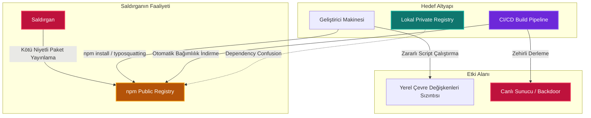

# npm Tedarik Zinciri Güvenliği: Mimari Analiz, Tehdit Vektörleri ve Kurumsal Savunma Stratejileri

Modern yazılım geliştirme süreçlerinde, kodun modüler yapıda tasarlanması ve üçüncü taraf kütüphanelerin entegrasyonu, geliştirme hızını artıran en kritik unsurlardan biridir. **Node Package Manager (npm)**, Node.js ve genişletilmiş JavaScript/TypeScript ekosisteminin merkezinde konumlanarak milyarlarca paket indirme işlemine aracılık eden ve yazılım dünyasının en büyük deposu (registry) haline gelen kritik bir altyapıdır.

Kurumsal web uygulamalarından bulut yerel (cloud-native) sistemlere ve yapay zeka entegrasyonlarına kadar modern mimarilerin tamamı npm ekosistemi üzerinde inşa edilmektedir. Ancak bu yüksek bağımlılık düzeyi ve açık kaynak ekosisteminin getirdiği kontrolsüzlük, siber tehdit aktörleri için asimetrik bir saldırı yüzeyi oluşturmakta; yazılım tedarik zincirini hedef alan karmaşık riskleri beraberinde getirmektedir.

---

## npm Ekosisteminin Mimari Yapısı

npm'in çalışma mantığı; deklaratif manifesto dosyalarına, deterministik durum kilitlerine ve hiyerarşik dosya sistemlerine dayanmaktadır. Bu yapının temel bileşenleri ve taşıdıkları güvenlik riskleri şu şekilde sınıflandırılabilir:

**`package.json`** — Projenin kimlik kartı niteliğindedir. Bağımlılıkları (`dependencies`, `devDependencies`, `peerDependencies`), proje üst verilerini ve yaşam döngüsü betiklerini (lifecycle scripts) barındırır. Güvenlik perspektifinden en kritik alan, kütüphanelerin indirilmesi veya derlenmesi esnasında işletim sistemi düzeyinde otomatik olarak komut çalıştırılabilen `scripts` bloğudur.

**Semantic Versioning (SemVer)** — Paket sürümleri `MAJOR.MINOR.PATCH` biçiminde tanımlanır. Sürüm tanımlamalarında kullanılan `^` (caret) ve `~` (tilde) gibi joker operatörler, paket yöneticisinin uyumlu en son minor veya patch sürümünü otomatik olarak internetten çekmesine olanak tanır. Bu durum, meşru bir kütüphanenin hesabını ele geçiren bir saldırganın zararlı bir "patch" sürümü yayınlayarak binlerce hedef sisteme anında sızmasına zemin hazırlar.

**`package-lock.json`** — Sürüm kaymalarını önlemek amacıyla geliştirilen bu dosya, bağımlılık ağacının deterministik bir anlık görüntüsünü (snapshot) sunar. Her paketin indirildiği tam URL'yi (`resolved`) ve paketin bütünlüğünü şifreleme yöntemleriyle doğrulayan SHA-512 bütünlük özetini (`integrity`) depolar. Bu dosyanın manipüle edilmesi, lockfile enjeksiyonlarına davetiye çıkarır.

**`node_modules`** — İndirilen tüm paketlerin ve bunların alt bağımlılıklarının fiziksel olarak depolandığı klasördür. npm v3 ve sonrasında bağımlılık ağacı düzleştirilerek (flattened) çakışmalar azaltılmaya çalışılmıştır. Ancak bu durum, dosya sisteminde derinlemesine denetim yapmayı zorlaştıran kaotik bir yapı ortaya çıkarmaktadır.

| Bileşen / Dosya | Temel İşlevi | Güvenlik Açısından Kritik Rolü | Birincil Tehdit Vektörü |
|---|---|---|---|
| `package.json` | Proje bağımlılıklarını ve meta verilerini tanımlar | Otomatik çalışan scripts kancalarını barındırır | Kötü amaçlı kurulum betikleri (`preinstall`, `postinstall`) |
| `package-lock.json` | Bağımlılık ağacının tam sürümünü ve bütünlüğünü kilitler | SHA-512 bütünlük kontrolü ve kaynak doğrulaması sağlar | Lockfile enjeksiyonu ve kaynak URL manipülasyonu |
| `node_modules` | Paketlerin fiziksel dosyalarını barındırır | Kodun çalıştırılma esnasında doğrudan import edildiği yerdir | Adli bilişim karşıtı (anti-forensics) dosya manipülasyonları |
| SemVer Kuralları | Sürüm güncellemelerini yönetir | Otomatik sürüm geçişlerine izin veren operatörleri tanımlar | Güvenilir paketin yeni sürümü üzerinden zararlı kod dağıtımı |

---

## Bağımlılık Ağacı ve Görünürlük Kör Noktaları

npm ekosistemindeki en büyük güvenlik açığı, doğrudan (direct) bağımlılıkların ötesinde yer alan ve geliştiricilerin doğrudan kontrol etmediği **geçişli (transitive) bağımlılık ağacıdır**. Bir geliştirici projesine tek bir güvenilir kütüphane eklediğinde, o kütüphane de arka planda onlarca başka kütüphaneye bağımlı durumdadır. Ortalama bir npm paketi yüklendiğinde, arka planda yüzlerce farklı üçüncü taraf yazarın geliştirdiği kod zincirleme olarak sisteme dahil edilmektedir.

Matematiksel olarak, derinliği $D$ ve her düğümün ortalama bağımlılık sayısı (dallanma faktörü) $b$ olan bir bağımlılık ağacındaki toplam düğüm sayısı $N$ şu formülle ifade edilebilir:

$$N = \sum_{d=1}^{D} b^d = \frac{b(b^D - 1)}{b - 1}$$

Bu üstel büyüme, manuel kod denetimini tamamen imkansız kılmaktadır. Geliştiriciler yalnızca doğrudan ekledikleri paketleri doğrulamakta, ancak bu paketlerin derinliklerindeki geçişli bağımlılıkların taşıdığı zararlı kodlardan haberdar olamamaktadır. Bu hiyerarşik yapı, kurumsal güvenlik ekipleri için devasa bir **"görünürlük kör noktası" (visibility blind spot)** oluşturarak siber saldırganların tespit edilmeden derinlemesine sızmalarına olanak tanımaktadır.



---

## npm Ekosistemindeki Siber Riskler ve Saldırı Türleri

Saldırganlar, npm ekosisteminin açık yapısını ve paket çözümleme mantığındaki tasarım boşluklarını istismar etmek amacıyla son derece gelişmiş teknikler kullanmaktadır.

<div class="render-cards">
  <div class="render-card render-card-ssr">
    <span class="render-badge">TYPOSQUATTING</span>
    <h3>Yazım Hatası İstismarı</h3>
    <p>Saldırganlar, popüler paketlerin isimlerindeki ufak yazım hatalarını taklit eden kötü niyetli paketler yayınlar (örneğin <code>lodash</code> yerine <code>lodsh</code>, <code>cross-env</code> yerine <code>crossenv</code>). Geliştirici terminalde paketi yanlışlıkla hatalı yazdığında zararlı paketi sistemine dahil etmiş olur.</p>
  </div>
  
  <div class="render-card render-card-csr">
    <span class="render-badge">DEPENDENCY CONFUSION</span>
    <h3>Bağımlılık Karışıklığı</h3>
    <p>Kurum içi özel paketlerin isimlerini tespit eden saldırganlar, aynı isimle ancak çok daha yüksek versiyon numarasıyla (örn. <code>99.9.9</code>) public registry'e sahte paket yükler. <code>npm install</code> komutu kaynak öncelikleri belirlenmemişse dışarıdaki paketin yüksek sürümünü tercih eder.</p>
  </div>

  <div class="render-card render-card-ssg">
    <span class="render-badge">ACCOUNT HIJACKING</span>
    <h3>Geliştirici Hesabı Ele Geçirme</h3>
    <p>Kimlik avı saldırıları veya süresi dolan e-posta alan adlarının geri alınması yoluyla popüler paket yöneticilerinin npm hesapları ele geçirilir. Saldırganlar doğrudan meşru paketin içerisine backdoor ekleyerek resmi bir patch sürümü olarak yayınlar.</p>
  </div>
  
  <div class="render-card render-card-isr">
    <span class="render-badge">LIFECYCLE SCRIPTS</span>
    <h3>Kurulum Betikleri İstismarı</h3>
    <p>npm paketlerinin kurulum aşamalarında otomatik çalışan <code>preinstall</code>, <code>postinstall</code> gibi yaşam döngüsü betikleri kötüye kullanılır. Geliştirici paketi indirdiği anda hiçbir kod çağırmasa bile işletim sistemi düzeyinde RAT dropper, kimlik bilgisi toplayıcı veya C2 bağlantısı çalıştırılabilir.</p>
  </div>
</div>

### Bağımlılık Karışıklığı (Dependency Confusion)

İlk kez 2021 yılında güvenlik araştırmacısı **Alex Birsan** tarafından ortaya konan bu saldırı türü, paket yöneticilerinin hem yerel (private) hem de genel (public) kayıt defterlerini içeren çoklu kaynak ortamlarında bağımlılık çözerken düştüğü tasarım hatasını istismar eder.

Büyük ölçekli kuruluşlar, yalnızca kendi iç ağlarında kullanılmak üzere tasarlanmış özel npm paketleri geliştirirler. Saldırgan bu özel paket ismini hata loglarında, derlenmiş JavaScript dosyalarında veya GitHub repolarında tespit ettiğinde, npm'in public registry'sine giderek aynı isimle `99.9.9` gibi aşırı yüksek sürüm numaralı sahte bir paket yükler.

`npm install` çalıştırıldığında kaynak öncelikleri belirlenmemişse, paket yöneticisi public registry'deki yüksek sürümü "en güncel" kabul ederek özel ağdaki paket yerine internet üzerindeki zararlı paketi indirir ve yürütür. Alex Birsan bu yöntemle **Apple, Microsoft, Yelp, Tesla ve Shopify** gibi dev şirketlerin iç ağlarında kod yürüterek bug bounty ödülleri kazanmıştır.

### Hesap Ele Geçirme (Account Takeover — ATO)

Hesap ele geçirme saldırıları genellikle iki yöntemle gerçekleştirilir:

- **Kimlik Avı (Phishing):** npm destek ekibi süsü verilerek gönderilen sahte e-postalarla 2FA sıfırlama token'larının ele geçirilmesi.
- **Süresi Dolan Alan Adlarının Geri Kazanılması:** Popüler bir paketin yöneticisinin e-posta adresine ait alan adının süresi dolduğunda, saldırganlar bu alan adını satın alarak npm üzerindeki şifre sıfırlama mekanizmasını tetikler ve hesabı ele geçirir.

### Kötü Amaçlı Yaşam Döngüsü Betikleri

npm'in sunduğu en güçlü ancak en tehlikeli özelliklerden biri, paket kurulum aşamalarında işletim sistemi düzeyinde komut çalıştırmaya izin veren yaşam döngüsü betikleridir. Saldırganlar bu kancaları kullanarak geliştirici `npm install` komutunu çalıştırdığı anda sessizce arka kapı açabilir, kimlik bilgilerini toplayabilir veya C2 sunucusundan ikinci aşama zararlı yazılımları çekebilirler.

**Mart 2026 — Axios İhlali:** Saldırganlar Axios'un bağımlılıkları arasına `plain-crypto-js@4.2.1` adında sahte bir paket eklediler. Bu paketin `postinstall` betiği, Windows, macOS ve Linux sistemleri hedef alan çapraz platform destekli bir RAT dropper olarak çalıştı. Saldırıda dikkat çekici anti-forensics teknikleri uygulandı:

- Zararlı kod çalıştıktan sonra kendi kurulum dosyası olan `setup.js`'i sildi.
- Orijinal `package.json`'ı silerek yerine temiz bir v4.2.0 stübü koydu.

### Protestware ve Terk Edilmiş Paketler

**CVE-2022-23812 (node-ipc & peacenotwar):** Mart 2022'de `node-ipc` yaratıcısı, Rusya ve Belarus lokasyonlu IP adreslerine sahip sistemlerdeki tüm dosyaları kalp emojisiyle silen yıkıcı bir kod yayınladı. Ardından `peacenotwar` adında bir protesto modülü ekleyerek sunucularda DoS durumlarına yol açtı. Bu durum `node-ipc` kullanan Vue.js CLI gibi binlerce popüler altyapıyı zincirleme olarak etkiledi.

**Terk edilmiş paketler (Abandoned Packages)** ise geliştiricisi tarafından bakımı bırakılmış kütüphanelerdir. Zamanla bu paketlerde yeni güvenlik açıkları (CVE) keşfedilir ancak bunları kapatacak bir muhatap bulunmaz.

---

## Enfeksiyon Kaskadları ve Ağ Analizi

npm ekosistemi, ağ teorisi açısından incelendiğinde **"ölçeksiz ağ" (scale-free network)** yapısına sahiptir. Az sayıda kritik kütüphane (hub düğümler) milyonlarca projeye doğrudan veya dolaylı olarak bağlanmaktadır. Bu yüksek merkezilik derecesi, tek bir stratejik paketin kompromize edilmesinin tüm ekosistemi felç edebileceği asimetrik bir risk doğurmaktadır.

Ağ üzerindeki bir merkez düğümün enfekte olma olasılığı $p$ ve bu düğüme bağlı toplam alt paket sayısı $k$ ise, enfeksiyonun alt ağlara yayılma olasılığı $P_{\text{cascade}}$ şöyle modellenir:

$$P_{\text{cascade}} = 1 - (1 - p)^k$$

$k$ değerinin üstel seviyede yüksek olduğu durumlarda, saldırganın başarı olasılığı $p$ çok düşük olsa bile ekosistemdeki kaskat etkisi neredeyse kaçınılmaz hale gelmektedir.

| Saldırı Türü | Temel İstismar Mekanizması | Önemli Tarihsel Örnekler | Birincil Etki Alanı |
|---|---|---|---|
| Dependency Confusion | Genel registry'deki yüksek sürüm numaralı paketlerin özel paketlere tercih edilmesi | Yelp, Apple, Microsoft, Tesla İhlalleri (Alex Birsan, 2021) | Bilgi sızdırma, iç ağa sızma, RCE |
| Typosquatting | Popüler paketlerin isimlerindeki yazım hatalarının taklit edilmesi | `lodash` → `lodsh`, `cross-env` → `crossenv`, Ledger-CLI taklitleri | Ortam değişkenlerinin ve API anahtarlarının çalınması |
| Account Takeover (ATO) | Maintainer kimlik bilgilerinin ele geçirilmesi veya süresi dolan e-posta alan adlarının geri alınması | node-ipc (Mayıs 2026), Axios İhlali (Mart 2026) | Güvenilir paketler üzerinden yaygın zararlı kod dağıtımı |
| Lifecycle Script İstismarı | Kurulum sırasında otomatik çalışan kancaların arka kapı çalıştırmak için kullanılması | Axios / plain-crypto-js RAT dropper (2026) | Uzaktan kod yürütme, kalıcılık sağlama, kimlik bilgisi hırsızlığı |
| Protestware | Geliştiricilerin politik veya sosyal amaçlarla kendi paketlerini sabote etmesi | node-ipc (peacenotwar), colors.js, es5-ext | Sistem dosyalarının silinmesi, Denial of Service (DoS) |
| Abandoned Packages | Bakımı bırakılmış paketlerin güvenlik açıklarının zamanla istismar edilmesi | Çeşitli eski npm kütüphaneleri | Yeni keşfedilen zafiyetler üzerinden kurumsal altyapı ihlalleri |

---

## Gerçek Dünya Senaryosu: Mini Shai-Hulud Solucanı (Nisan/Mayıs 2026)

2026 yılının Nisan ve Mayıs aylarında tehdit grubu **TeamPCP** tarafından gerçekleştirilen "Mini Shai-Hulud" saldırı kampanyası, npm tarihindeki ilk **kendi kendini çoğaltan (self-replicating) solucan** olarak kayıtlara geçmiştir. Bu saldırı, geleneksel kimlik bilgisi hırsızlığının ötesine geçerek meşru CI/CD hatlarını ve GitHub iş akışlarını birer "enfeksiyon fabrikasına" dönüştürmüştür.

Solucan, meşru ve popüler kütüphanelerin CI/CD boru hatlarını sabote etmek amacıyla 3 aşamalı bir zafiyet zinciri kurdu:

**Aşama 1 — Pwn Request ve Kimlik Taklidi:** Saldırganlar, haftalık 12,7 milyondan fazla indirilen **TanStack** kütüphanesinin deposuna meşru bir bot kimliğini (Anthropic Claude GitHub App) taklit ederek sahte bir Pull Request (PR #7378) gönderdiler. `pull_request_target` tetikleyicisi, dışarıdan gelen bu kodun ana deponun ayrıcalıklı runner bağlamında çalışmasına yol açtı. Çalışan `tanstack_runner.js` betiği sistemdeki GitHub yetkilendirme jetonlarını topladı.

**Aşama 2 — GitHub Actions Önbellek Zehirlenmesi (Cache Poisoning):** Zararlı PR kodu, projenin meşru `release.yml` iş akışının kullandığı pnpm paket havuzunu manipüle etti ve 1,1 GB boyutunda zehirli bir pnpm mağazasını GitHub önbelleğine yazdı.

**Aşama 3 — Token Çıkarımı ve Otomatik Yayılım:** Meşru bir proje yöneticisi ana dala kod gönderdiğinde tetiklenen `release.yml` iş akışı, önbellekten zehirli bağımlılıkları geri yükleyerek derleme aşamasında saldırganın zararlı ikili dosyalarını çalıştırdı. Bu dosyalar yöneticinin npm yayınlama yetkilerini ele geçirerek solucanı aktif hale getirdi.

Solucan yetkili token'ları aldıktan sonra **sadece 6 dakika içinde** 42 farklı meşru `@tanstack/*` paketi altında **84 adet zararlı sürüm** yayınladı. Enfeksiyon zincirleme olarak `@antv` veri görselleştirme ekosistemine, `echarts-for-react` (1,1 milyon haftalık indirme), `@opensearch-project/opensearch` kurumsal arama motoru istemcisine ve `@mistralai/mistralai` AI kütüphanelerine sirayet etti.

---

## Gelişmiş Saldırı Vektörleri: Geliştirici Ortamlarını Hedef Alan Yeni Nesil Tehditler

### 1. Geliştirici Araçlarının Zehirlenmesi (Poisoned Developer Tools)

Saldırganlar artık doğrudan npm paketlerini hacklemek yerine, geliştiricilerin kod yazarken kullandıkları araçları hedef almaktadır. Yakın zamanda bir GitHub çalışanının zararlı yazılım içeren bir VS Code eklentisi kurması sonucunda GitHub'ın dahili sistemlerine sızılmış ve ~3.800 dahili kod deposu ele geçirilmiştir. "Masum görünen" üretkenlik araçları, tedarik zincirine sızmada mükemmel bir arka kapı işlevi görmektedir.

### 2. Otonom Yapay Zeka Ajanlarının İstismarı

Yapay zeka destekli kodlama iş akışları yeni bir güvenlik riski doğurmaktadır. Otonom AI ajanları, bağlamlarında buldukları önerilere dayanarak geliştiricinin haberi olmadan zararlı paketleri kendi başlarına yükleyebilmektedir. Saldırganlar, AI araçlarını manipüle ederek zararlı npm paketlerinin projeye dahil edilmesini sağlayabilir.

### 3. Otomatik Güncelleme Mekanizmalarının Suistimali

Geliştirme ortamlarında kullanılan eklenti ve kütüphanelerin otomatik güncellenmesi siber suçlular tarafından sıkça suistimal edilir. Saldırganlar bir aracı ele geçirdiğinde, otomatik güncelleme mekanizmaları sayesinde zararlı kod anında binlerce geliştiricinin bilgisayarına dağıtılmaktadır.

### 4. Dağıtım Anahtarları ve CI/CD Sırlarının Çalınması

Saldırganlar GitHub gibi platformlara sızdıklarında, servis hesaplarını, dağıtım anahtarlarını ve GitHub Actions'a ait "sırları" (secrets) hedeflerler. Bu kimlik bilgileri ele geçirildiğinde saldırganlar asıl geliştiriciymiş gibi resmi npm registry'ye zararlı paket sürümleri yükleyebilirler.

### 5. Zincirleme Tedarik Zinciri İhlalleri

Bir platformdaki ihlal, doğrudan diğer bir ekosistemdeki büyük saldırıyı tetikler. GitHub ortamında yaşanan ihlalin doğrudan TanStack npm tedarik zinciri saldırısıyla bağlantılı olması bunun en somut örneğidir. Saldırganlar bir platformun (GitHub) açıklarını, başka bir platformun (npm) paketlerini zehirlemek için sıçrama tahtası olarak kullanmaktadır.

---

## Güvenlik Önlemleri ve Defansif Stratejiler

Kurumsal ortamlarda npm tedarik zinciri risklerini en aza indirmek, tek katmanlı çözümlerle mümkün değildir. Defansif stratejilerin statik analiz, kurulum sıkılaştırma, proxy yönetimi ve çalışma zamanı izleme katmanlarında senkronize uygulanması gerekmektedir.

### Statik Güvenlik Analizleri ve SBOM Yönetimi

- **Yazılım Bileşen Analizi (SCA):** Snyk veya OWASP Dependency-Check gibi araçlar CI/CD boru hattına entegre edilerek bilinen CVE açıklarına sahip paketlerin derleme aşamasına girmesi engellenmelidir.
- **npq Sarmalayıcısı:** Geliştirici bilgisayarlarında doğrudan `npm install` yerine `npq` kullanılmalıdır. `npq`, kurulum öncesinde paketin yaşını, typosquatting olasılığını ve içerdiği betikleri denetler.
- **Lockfile Doğrulaması:** `lockfile-lint` aracı kullanılarak `package-lock.json` içindeki kaynak URL'lerinin yalnızca yetkilendirilmiş resmi registry üzerinde olup olmadığı doğrulanmalıdır.

### Kurulum Sıkılaştırma (Hardening)

Yaşam döngüsü betiklerinin oluşturduğu riskleri bertaraf etmek adına kurulum komutları `--ignore-scripts` bayrağı ile çalıştırılmalıdır:

```bash
npm install --ignore-scripts --allow-git=none
```

`--allow-git=none` parametresi (npm v11.10+ ile), kurulum esnasında git ikili dosyalarının çalıştırılma yollarını tamamen kapatarak git bağımlılıkları üzerinden gelen sistem seviyesindeki binary manipülasyonlarını engeller. Üretim ve CI/CD ortamlarında daima `npm ci` (clean install) komutu tercih edilmelidir.

### Yerel Proxy ve Registry Yönetimi

Kurumsal ağlarda dış dünyadan gelen paketlerin doğrudan geliştirici makinelerine inmesini engellemek için **JFrog Artifactory** veya **Sonatype Nexus** gibi yerel proxy çözümleri kurulmalıdır:

- **Scoped Namespaces:** Tüm özel paketler kurumsal bir önek ile sınırlandırılmalıdır (örn. `@kurum/paket-adi`).
- **Exclude Patterns:** Proxy depolarında kurumsal isim şablonları için Hariç Tutma Şablonu tanımlanmalıdır. Bu kural, paket yöneticisinin internetteki genel registry'e sorgu atmasını ve oradan yüksek sürüm numaralı sahte paketi (Dependency Confusion) indirmesini kesin olarak engeller.

### Sürekli İzleme ve Runtime Analizi

Saldırganlar, kod yeteneklerini meşru sistem API'lerinin (`fs.readFile`, `child_process.exec`, `https.request`) arkasına gizlediğinden yalnızca statik kod analizine güvenmek yetersizdir:

- **Süreç Ağacı (Process Tree) Analizi:** EDR ve SIEM sistemleri üzerinden, `node` sürecinin alt süreç olarak `cmd.exe`, `sh`, `powershell.exe` veya `curl` gibi beklenmedik araçları tetikleyip tetiklemediği izlenmelidir.
- **Ağ Egress Filtrelemesi:** Yalnızca onaylı paket depolarına giden trafiğe izin verilmeli, kurulum esnasında bilinmeyen dış IP adreslerine giden trafik SIEM sistemine loglanmalıdır.
- **Adli Bilişim Taramaları:** Şüpheli durumlarda işletim sistemi seviyesindeki artifact'ler (örn. Windows'ta `%PROGRAMDATA%\system.bat`) düzenli olarak taranmalıdır.

| Güvenlik Katmanı | Kullanılması Gereken Araçlar / Komutlar | Sağladığı Koruma Mekanizması | Uygulama Önceliği |
|---|---|---|---|
| Statik Analiz & SBOM | Snyk, OWASP Dependency-Check, npq, lockfile-lint | Bilinen zafiyetlerin tespiti, lockfile kaynağının doğrulanması | Yüksek |
| Kurulum Sıkılaştırma | `npm ci`, `--ignore-scripts`, `--allow-git=none` (npm v11.10+) | Yaşam döngüsü betiklerinin engellenmesi, git binary ezme zafiyetlerinin önlenmesi | Kritik |
| Proxy & Registry Yönetimi | JFrog Artifactory, Sonatype Nexus, Verdaccio | Özel paketlerin dış dünyaya sızmasının engellenmesi, kaynak önceliğinin kilitlenmesi | Kritik |
| Sürekli İzleme & EDR/SIEM | StepSecurity Dev Machine Guard, EDR/XDR, SIEM | Kurulum esnasındaki ağ çıkışlarının ve olağandışı süreç ağaçlarının tespiti | Yüksek |

---

## Sonuç

npm ekosisteminin sunduğu açık ve esnek yapı, modern yazılım endüstrisinin büyümesini tetiklerken aynı zamanda siber tehdit aktörleri için manipülasyonu son derece kolay, zincirleme etki gücü yüksek bir oyun alanına dönüşmüştür.

Yazılım tedarik zinciri güvenliği artık basit bir kütüphane güncelleme veya zafiyet tarama rutininden ibaret değildir. Saldırganların meşru geliştirici araçlarını, CI/CD önbelleklerini ve ağ tasarım boşluklarını entegre birer silah olarak kullandığı günümüz tehdit manzarasında, kurumların çok katmanlı, proaktif ve dinamik bir savunma mimarisi inşa etmesi zorunludur.

Sıkılaştırılmış kurulum parametrelerinin kullanılması (`--allow-git=none`), özel paketlerin dış dünyaya sızmasını engelleyen exclude pattern'li proxy yapılandırmaları ve çalışma zamanındaki davranışsal süreç izleme faaliyetleri, yazılım envanterinin bütünlüğünü korumada en kritik defansif sütunları oluşturmaktadır.
