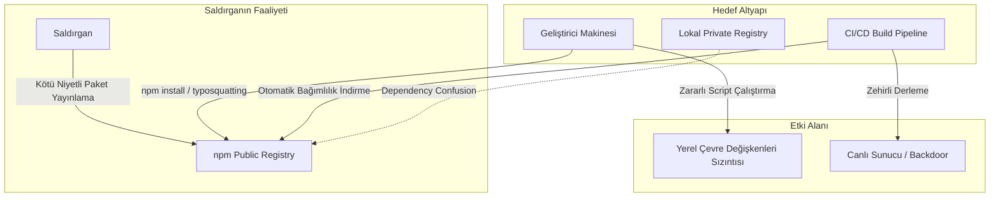

# npm Tedarik Zinciri Güvenliği: Mimari Analiz, Tehdit Vektörleri ve Savunma Stratejileri

Modern yazılım geliştirme süreçlerinde kodun modüler yapıda tasarlanması ve üçüncü parti kütüphanelerin kullanılması, projelerin hızla geliştirilmesini sağlayan en önemli unsurlardan biridir. Bu ekosistemin merkezinde yer alan **Node Package Manager (npm)**, milyarlarca paket indirme isteğine yanıt vererek yazılım dünyasının en büyük deposu (registry) haline gelmiştir.

Kurumsal web uygulamalarından bulut tabanlı sistemlere kadar neredeyse tüm JavaScript/TypeScript projeleri npm ekosistemine bağımlı durumdadır. Ancak açık kaynak dünyasının getirdiği bu kontrolsüz yapı ve yüksek bağımlılık düzeyi, siber saldırganlar için kaçırılmayacak bir fırsat sunarak yazılım tedarik zincirine yönelik ciddi riskleri de beraberinde getirmektedir.

---

## npm Ekosisteminin Çalışma Mantığı ve Mimari Yapısı


npm; proje dosyalarının tanımlandığı manifestolara, bağımlılık kilitlerine ve hiyerarşik dosya sistemine dayanır. Bu yapının temel bileşenleri ve taşıdıkları güvenlik riskleri şu şekilde özetlenebilir:

- **`package.json`:** Projenin kimlik kartıdır. Projede kullanılan kütüphaneleri (`dependencies`, `devDependencies`), üst verileri ve kurulum betiklerini (`scripts`) barındırır. Güvenlik açısından en kritik yer, kütüphane kurulurken işletim sistemi seviyesinde otomatik komut çalıştırabilen `scripts` alanıdır.
- **SemVer (Semantic Versioning):** Paket sürümlerinin `MAJOR.MINOR.PATCH` düzeninde yönetilmesini sağlar. Sürüm tanımlarken kullanılan `^` veya `~` gibi joker karakterler, paket yöneticisinin en son minor veya patch sürümlerini otomatik olarak indirmesine izin verir. Bu durum, hesabı ele geçirilen güvenilir bir geliştiricinin zararlı bir patch yayınlaması halinde, saldırgan kodunun binlerce sisteme otomatik olarak sızmasına zemin hazırlar.
- **`package-lock.json`:** Sürüm kaymalarını önlemek ve kurulumu deterministik (tutarlı) hale getirmek için kullanılır. Bağımlılıkların indirildiği tam adresi (`resolved`) ve dosyaların doğruluğunu denetleyen SHA-512 özetini (`integrity`) tutar. Bu dosyanın değiştirilmesi, lockfile enjeksiyonu saldırılarına yol açabilir.
- **`node_modules`:** İndirilen tüm kütüphanelerin ve onların alt bağımlılıklarının fiziksel olarak kaydedildiği klasördür. Ağacın çok derin olmasından dolayı, bu klasör içindeki kodların elle denetlenmesi neredeyse imkansızdır.

| Bileşen | Görevi | Güvenlikteki Rolü | Birincil Tehdit Vektörü |
|---|---|---|---|
| **`package.json`** | Proje bağımlılıklarını ve meta verilerini tutar. | Otomatik çalışan script alanlarını barındırır. | Kötü amaçlı kurulum betikleri (`preinstall`, `postinstall`) |
| **`package-lock.json`** | Bağımlılıkların tam sürümlerini kilitler. | SHA-512 bütünlük kontrolü ve kaynak doğrulaması sağlar. | Lockfile enjeksiyonu ve kaynak URL değiştirme |
| **`node_modules`** | Paketlerin kaynak kodlarını fiziksel olarak barındırır. | Kodun çalıştırılırken doğrudan dahil edildiği dizindir. | Dosya manipülasyonları ve kod gizleme |
| **SemVer Rules** | Sürüm güncellemelerini yönetir. | Otomatik sürüm güncellemelerine izin veren operatörleri belirler. | Güvenilir kütüphanenin yeni sürümü üzerinden zararlı yayılması |

---

## Bağımlılık Ağacı ve Görünürlük Kör Noktaları


npm dünyasındaki en büyük risk, projenize doğrudan eklediğiniz paketlerin ötesinde, o paketlerin de arka planda kullandığı **geçişli (transitive) bağımlılık ağacıdır**. Bir geliştirici projesine tek bir kütüphane eklediğinde, o kütüphane de düzinelerce başka kütüphaneye ihtiyaç duyar. Sonuç olarak, tek bir paketin yüklenmesi arka planda yüzlerce farklı kişinin yazdığı kodların sisteme dahil olmasına yol açar.

Matematiksel olarak derinliği *D* ve her paketin ortalama bağımlılık sayısı (dallanma faktörü) *b* olan bir bağımlılık ağacındaki toplam paket sayısı *N* şu formülle ifade edilebilir:

*N* = *b*(*b*<sup>*D*</sup> - 1) / (*b* - 1)

Bu üstel büyüme, kodların elle incelenmesini imkansız kılar. Geliştiriciler sadece kendi ekledikleri paketleri kontrol ederken, alt bağımlılıkların derinliklerinde yer alan zararlı kodlardan habersiz kalırlar. Bu durum, güvenlik ekipleri için ciddi bir **"görünürlük kör noktası" (visibility blind spot)** oluşturarak saldırganların tespit edilmeden sistemlere sızmasına zemin hazırlar.



---

## npm Ekosistemindeki Siber Riskler ve Saldırı Türleri


Saldırganlar, npm ekosisteminin açık yapısını ve paket çözümleme mantığındaki tasarım boşluklarını istismar etmek amacıyla son derece gelişmiş teknikler kullanmaktadır.

<div class="render-cards">
  <div class="render-card render-card-ssr">
    <span class="render-badge">TYPOSQUATTING</span>
    <h3>Yazım Hatası İstismarı</h3>
    <p>Saldırganlar, popüler paketlerin adlarındaki ufak yazım hatalarını taklit eden sahte paketler yayınlar (örneğin <code>lodash</code> yerine <code>lodsh</code>, <code>cross-env</code> yerine <code>crossenv</code>). Geliştirici terminale ismi yanlış yazdığı anda zararlı kodu kendi projesine indirmiş olur.</p>
  </div>
  
  <div class="render-card render-card-csr">
    <span class="render-badge">DEPENDENCY CONFUSION</span>
    <h3>Bağımlılık Karışıklığı</h3>
    <p>Şirket içi özel (private) paketlerin isimlerini öğrenen saldırganlar, aynı isimde ancak çok yüksek bir sürüm numarasıyla (örneğin <code>99.9.9</code>) genel (public) depoya sahte paket yüklerler. Eğer proje yapılandırmasında kaynak öncelikleri düzgün ayarlanmamışsa, paket yöneticisi yüksek sürümü tercih ederek dışarıdaki zararlı paketi indirir.</p>
  </div>

  <div class="render-card render-card-ssg">
    <span class="render-badge">ACCOUNT HIJACKING</span>
    <h3>Geliştirici Hesabı Ele Geçirme</h3>
    <p>Kimlik avı (phishing) veya süresi dolan e-posta alan adlarının satın alınması gibi yöntemlerle popüler paket geliştiricilerinin npm hesapları ele geçirilir. Saldırganlar doğrudan meşru paketin içerisine arka kapı (backdoor) ekleyerek resmi bir güncelleme olarak yayınlar.</p>
  </div>
  
  <div class="render-card render-card-isr">
    <span class="render-badge">LIFECYCLE SCRIPTS</span>
    <h3>Kurulum Betikleri İstismarı</h3>
    <p>npm kurulum aşamalarında otomatik olarak çalışan betikler kötüye kullanılır. Geliştirici paketi indirdiği anda projesinde herhangi bir kod çalıştırmasa bile, arka planda işletim sistemi seviyesinde zararlı yazılımlar tetiklenebilir.</p>
  </div>
</div>

### Bağımlılık Karışıklığı (Dependency Confusion)

İlk kez 2021 yılında güvenlik araştırmacısı **Alex Birsan** tarafından keşfedilen bu yöntem, paket yöneticilerinin hem yerel hem de genel kayıt depolarını bir arada kullanırken düştüğü mantıksal zafiyeti istismar eder.

Büyük şirketler, sadece kendi iç ağlarında çalışan özel kütüphaneler geliştirirler. Saldırganlar bu özel kütüphane isimlerini derlenmiş web kodlarından veya hata loglarından öğrendiklerinde, npm genel deposuna giderek aynı isimle `99.9.9` gibi aşırı yüksek bir sürüm numarasıyla sahte bir paket yüklerler.

Sistemde kurulum yapıldığında, paket yöneticisi genel depodaki yüksek sürümü "en güncel güncelleme" olarak algılar ve şirket içindeki güvenli paket yerine internetteki zararlı paketi indirir. Alex Birsan bu teknikle **Microsoft, Apple, Yelp, Tesla ve Shopify** gibi dev şirketlerin iç ağlarında izinsiz kod yürüterek zafiyeti kanıtlamıştır.

### Geliştirici Hesaplarının Ele Geçirilmesi (Account Takeover)

Geliştirici hesaplarını ele geçirmek için saldırganlar çoğunlukla iki yönteme başvurur:
- **Kimlik Avı (Phishing):** Geliştiricilere sahte destek e-postaları göndererek iki aşamalı doğrulama (2FA) sıfırlama kodlarının çalınması.
- **Süresi Dolan Domainler:** Geliştiricinin npm hesabına kayıtlı e-posta adresinin domain süresi dolduğunda, saldırgan bu domaini satın alıp şifre sıfırlama mailini kendi üzerine yönlendirerek hesabı ele geçirir.

### Kurulum Betikleriyle Gelen Tehlike (Lifecycle Scripts)

npm paketleri kurulurken çalışan otomatik kancalar (`preinstall`, `postinstall` vb.) oldukça tehlikelidir. Saldırganlar bu özellikleri kullanarak, geliştirici sadece `npm install` yaptığında bile bilgisayarında sessizce bir arka kapı açabilir veya sistemdeki şifreleri çalabilirler.

- **Axios Vakası (Mart 2026):** Saldırganlar, Axios kütüphanesinin alt bağımlılıklarına `plain-crypto-js@4.2.1` adında zararlı bir paket eklediler. Bu paketin `postinstall` betiği, sistemde çapraz platform destekli bir Truva atı (RAT) çalıştırdı. Saldırıda, analizi zorlaştırmak için zararlı kurulum dosyalarının çalıştıktan hemen sonra kendini silmesi gibi teknikler uygulandı.

### Protestware ve Sahipsiz Paketler

- **node-ipc Olayı (CVE-2022-23812):** Mart 2022'de popüler `node-ipc` paketinin geliştiricisi, Rusya ve Belarus lokasyonundaki bilgisayarlarda dosyaları silen zararlı bir güncelleme yayınladı. Bu sabote etme eylemi, `node-ipc` kullanan Vue.js CLI gibi binlerce popüler yazılım geliştirme aracını doğrudan etkiledi.
- **Sahipsiz Paketler (Abandoned Packages):** Geliştiricisi tarafından artık güncellenmeyen kütüphanelerdir. Zamanla bu paketlerde güvenlik açıkları keşfedilse de, güncelleyen kimse olmadığı için sistemler kalıcı olarak zafiyete açık hale gelir.

---

## Zincirleme Yayılım Riskleri ve Ağ Yapısı


npm ekosistemi, ağ teorisine göre **"ölçeksiz ağ" (scale-free network)** yapısındadır. Az sayıdaki çok popüler kütüphane (merkezi düğümler), milyonlarca projeye doğrudan veya dolaylı olarak bağlanır. Bu yapı, tek bir kritik paketin ele geçirilmesinin tüm ekosistemi felç edebileceği asimetrik bir risk doğurur.

Ağ üzerindeki merkez bir paketin enfekte olma ihtimali *p* ve bu pakete bağlı toplam alt paket sayısı *k* ise, bu zararlının alt ağlara yayılma ihtimali (*P*<sub>cascade</sub>) şu şekilde modellenir:

*P*<sub>cascade</sub> = 1 - (1 - *p*)<sup>*k*</sup>

*k* değerinin (bağımlılık sayısının) çok yüksek olduğu popüler paketlerde, saldırganın başarı şansı (*p*) çok düşük olsa bile, zincirleme etkinin tüm ağa yayılması neredeyse kaçınılmaz hale gelir.

| Saldırı Yöntemi | Nasıl Çalışır? | Önemli Örnekler | Etki Alanı |
|---|---|---|---|
| **Dependency Confusion** | Şirket içi paketlerin adlarıyla genel depoya yüksek sürümlü sahte paket yüklenmesi. | Apple, Microsoft, Tesla İhlalleri (2021) | İç ağlara sızma ve sunucularda komut çalıştırma |
| **Typosquatting** | Popüler paket adlarındaki yazım hatalarının taklit edilmesi. | `lodash` → `lodsh`, `cross-env` → `crossenv` | API anahtarlarının ve çevre (env) verilerinin çalınması |
| **Account Takeover (ATO)** | Geliştirici hesaplarının çalınması veya süresi biten domainlerin alınması. | node-ipc (2022), Axios Vakası (2026) | Güvenilir güncellemeler üzerinden zararlı dağıtılması |
| **Lifecycle Script İstismarı** | Kurulum sırasında otomatik çalışan betiklerin kötüye kullanılması. | Axios / `plain-crypto-js` RAT dropper (2026) | Sistemde arka kapı (backdoor) açılması |
| **Protestware** | Geliştiricinin kendi paketini politik/sosyal amaçlarla sabote etmesi. | `node-ipc` (`peacenotwar` eklentisi), `colors.js` | Dosya silme ve sistemleri çalışmaz hale getirme (DoS) |
| **Abandoned Packages** | Bakımı bırakılmış paketlerin zamanla açığa çıkan zafiyetleri. | Eski ve güncellenmeyen çeşitli kütüphaneler | Bilinen eski açıklar üzerinden sistemlerin ihlal edilmesi |

---

## Gerçek Bir Vaka: Mini Shai-Hulud Solucanı (Nisan/Mayıs 2026)


2026 yılının Nisan ve Mayıs aylarında **TeamPCP** grubu tarafından düzenlenen "Mini Shai-Hulud" saldırısı, npm tarihindeki ilk **kendi kendini çoğaltan (self-replicating) solucan** olarak kayıtlara geçti. Bu saldırı, klasik kimlik avı yöntemlerinin ötesine geçerek popüler kütüphanelerin CI/CD süreçlerini ve GitHub iş akışlarını adeta birer "zararlı yazılım üretim hattına" dönüştürdü.

Solucan, popüler projelerin derleme süreçlerini sabote etmek için şu 3 adımı kullandı:

1. **Aşama — Kimlik Taklidi ve Pull Request:** Saldırganlar, haftalık 12 milyondan fazla indirilen **TanStack** kütüphanesinin reposuna, güvenilir bir bot kimliğini (Anthropic Claude GitHub App) taklit ederek sahte bir Pull Request (PR) gönderdiler. `pull_request_target` tetikleyicisi yüzünden, dışarıdan gelen bu kod ana deponun yetkili sunucularında çalıştırıldı ve sistemdeki GitHub erişim anahtarları çalındı.
2. **Aşama — GitHub Actions Önbellek Zehirlenmesi (Cache Poisoning):** Zararlı kod, projenin derleme (`release.yml`) sürecinde kullanılan pnpm paket havuzunu sabote etti ve 1.1 GB boyutunda zehirli bir önbellek (cache) dosyası yazdı.
3. **Aşama — Erişim Yetkisi Hırsızlığı ve Yayılım:** Proje yöneticileri ana kod deposunu güncellediklerinde tetiklenen derleme sistemi, önbellekten bu zehirli bağımlılıkları geri yükledi ve derleme sırasında saldırganın kodlarını çalıştırdı. Kodlar, yöneticinin npm paket yayınlama yetkilerini (token) ele geçirerek solucanı aktif hale getirdi.

Solucan yetkileri aldıktan sonra **sadece 6 dakika içinde** 42 farklı meşru `@tanstack/*` paketi altında **84 adet zararlı sürüm** yayınladı. Enfeksiyon zincirleme olarak `@antv`, `echarts-for-react`, `@opensearch-project/opensearch` ve `@mistralai/mistralai` gibi popüler yapay zeka kütüphanelerine yayıldı.

---

## Geliştirici Ortamlarını Hedef Alan Yeni Nesil Tehditler


Bu bölüm detayları ve etkileri incelemektedir.


### Geliştirici Araçlarının Zehirlenmesi

Saldırganlar artık doğrudan npm paketlerini hacklemek yerine, geliştiricilerin kullandığı araçları hedef alıyorlar. Yakın zamanda bir geliştiricinin zararlı kod içeren bir VS Code eklentisi kurması sonucunda, çalıştığı kurumun dahili sistemlerine sızılmış ve binlerce özel kod deposu ele geçirilmiştir. "Masum görünen" bu araçlar, sistemlere sızmak için mükemmel birer arka kapı haline gelebilir.

### Otonom Yapay Zeka Eylemcilerinin Suistimal Edilmesi

Yapay zeka destekli kodlama süreçleri yeni bir güvenlik riski doğuruyor. Otonom yapay zeka eylemcileri, internette buldukları veya kendilerine önerilen kod kütüphanelerini geliştiricinin haberi olmadan projeye dahil edebilirler. Saldırganlar, yapay zeka araçlarını manipüle ederek zararlı npm paketlerinin sisteme yüklenmesini sağlayabilir.

### Otomatik Güncelleme Süreçlerinin Kötüye Kullanılması

Geliştirme ortamlarında kullanılan eklenti ve kütüphanelerin otomatik güncellenmesi saldırganlar için büyük bir fırsattır. Bir araç ele geçirildiğinde, otomatik güncellemeler sayesinde zararlı kodlar saniyeler içinde binlerce geliştiricinin bilgisayarına dağıtılır.

### CI/CD Sırlarının Çalınması

Saldırganlar kod barındırma platformlarına sızdıklarında, dağıtım anahtarlarını ve CI/CD sistemlerinde saklanan "sırları" (secrets) hedeflerler. Bu yetkilendirme bilgileri çalındığında, saldırganlar asıl geliştiriciymiş gibi genel depolara doğrudan zararlı sürümler yükleyebilirler.

### Platformlar Arası Geçişli Saldırılar

Bir platformdaki güvenlik ihlali, doğrudan başka bir ekosistemdeki büyük bir tedarik zinciri saldırısını tetikleyebilir. Saldırganlar, bir platformun (örneğin GitHub) açıklarını kullanarak başka bir platformdaki (örneğin npm) paketleri zehirlemek için sıçrama tahtası oluştururlar.

---

## Tedarik Zincirini Koruma Yolları ve Savunma Stratejileri


npm tedarik zinciri risklerini tek bir güvenlik aracıyla çözmek mümkün değildir. Güvenliği sağlamak için statik analiz, kurulum sıkılaştırma, proxy yönetimi ve çalışma zamanı analizi gibi katmanların bir arada uygulanması gerekir.

### Statik Güvenlik Analizleri ve SBOM Yönetimi

- **Yazılım Bileşen Analizi (SCA):** Snyk veya OWASP Dependency-Check gibi araçlar derleme süreçlerine (CI/CD) entegre edilerek, bilinen güvenlik açıklarına sahip paketlerin sisteme dahil edilmesi engellenmelidir.
- **npq Kullanımı:** Geliştiriciler yerel bilgisayarlarında doğrudan `npm install` çalıştırmak yerine `npq` aracını kullanmalıdır. `npq`, kurulacak paketi analiz ederek paketin yaşını, yazım hatası taklidi (typosquatting) ihtimalini ve içerdiği betikleri denetler.
- **Lockfile Doğrulaması:** `lockfile-lint` aracı yardımıyla `package-lock.json` içindeki paket indirme adreslerinin sadece yetkili ve güvenli kaynaklar olduğu doğrulanmalıdır.

### Kurulum Sıkılaştırma (Hardening)

Otomatik çalışan kurulum betiklerinin riskini ortadan kaldırmak için paket kurulumlarında `--ignore-scripts` parametresi kullanılmalıdır:

```bash
npm install --ignore-scripts --allow-git=none
```

`--allow-git=none` parametresi (npm v11.10 ve üzeri sürümlerde), kurulum sırasında git komutlarının çalıştırılma yollarını kapatarak git bağımlılıkları üzerinden gelebilecek sistem seviyesindeki manipülasyonları engeller. Canlı (production) ve CI/CD sunucularında ise her zaman `npm ci` (clean install) tercih edilmelidir.

### Şirket İçi Proxy ve Özel Depo Yönetimi

Dış kaynaklı paketlerin doğrudan geliştirici bilgisayarlarına indirilmesini önlemek için **Sonatype Nexus** veya **JFrog Artifactory** gibi proxy çözümleri kullanılmalıdır:
- **Scoped Namespaces (Kapsamlı İsim Alanları):** Kurum içi geliştirilen tüm özel paketler kurumsal bir önek ile sınırlandırılmalıdır (Örneğin: `@sirket/paket-adi`).
- **Hariç Tutma Şablonları (Exclude Patterns):** Yerel proxy depolarında kurumsal isimler için dışarıya sorgu atılmasını engelleyen kurallar tanımlanmalıdır. Bu sayede paket yöneticisinin internetteki genel depodan yüksek sürüm numaralı sahte paketleri indirmesi (Dependency Confusion) kesin olarak engeller.

### Sürekli İzleme ve Davranış Analizi

Saldırganlar zararlı kodları meşru sistem fonksiyonlarının (`fs.readFile`, `child_process.exec`, `https.request` vb.) arkasına gizleyebildiği için sadece statik analize güvenmek yeterli değildir:
- **Süreç Ağacı (Process Tree) Analizi:** EDR ve SIEM sistemleri üzerinden, `node` sürecinin alt süreç olarak `cmd.exe`, `powershell.exe`, `sh` veya `curl` gibi beklenmedik araçları tetikleyip tetiklemediği izlenmelidir.
- **Ağ Çıkış (Egress) Filtrelemesi:** Kurulum süreçlerinde sadece onaylı depolara bağlantı verilmesi sağlanmalı, bilinmeyen harici IP adreslerine giden trafik tespit edilerek loglanmalıdır.
- **Adli Bilişim Taramaları:** Şüpheli durumlarda sistem dosyaları ve geçici dizinlerdeki beklenmedik değişiklikler taranmalıdır.

| Savunma Katmanı | Kullanılması Gereken Araçlar | Sağladığı Koruma | Öncelik Derecesi |
|---|---|---|---|
| **Statik Analiz & SBOM** | Snyk, OWASP Dependency-Check, npq, lockfile-lint | Bilinen zafiyetlerin tespiti, dosya kaynağının doğrulanması | Yüksek |
| **Kurulum Sıkılaştırma** | `npm ci`, `--ignore-scripts`, `--allow-git=none` | Otomatik kurulum betiklerinin engellenmesi, manipülasyon önleme | Kritik |
| **Proxy ve Depo Yönetimi** | JFrog Artifactory, Sonatype Nexus, Verdaccio | Özel paketlerin sızmasını önleme, kaynak önceliklerini kilitleme | Kritik |
| **Çalışma Zamanı İzleme** | Dev Machine Guard, EDR/XDR, SIEM | Şüpheli ağ çıkışlarının ve süreç hareketlerinin tespiti | Yüksek |

---


npm ekosisteminin sunduğu esnek ve açık yapı, yazılım dünyasının hızla büyümesini sağlarken, aynı zamanda siber saldırganlar için yüksek etki gücüne sahip bir oyun alanı sunmaktadır.

Yazılım tedarik zinciri güvenliği artık sadece kütüphaneleri güncel tutmaktan ibaret değildir. Saldırganların geliştirici araçlarını, CI/CD önbelleklerini ve ağ yapılarını birer silah olarak kullandığı günümüz tehdit ortamında, çok katmanlı ve proaktif bir savunma modeli inşa etmek bir zorunluluktur.

Sıkılaştırılmış kurulum parametreleri (`--allow-git=none`), özel paketlerin dışarıya sızmasını engelleyen proxy kuralları ve çalışma zamanındaki davranış izleme süreçleri, yazılım güvenliğini sağlamada en kritik savunma hatlarını oluşturmaktadır.

Verinizin mimarı olun, egemenliğinizi geri alın. Dinlediğiniz için teşekkürler!