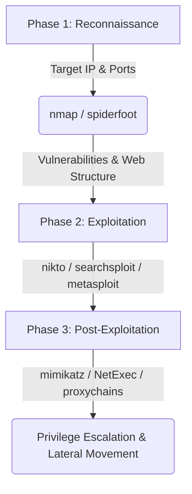

## Introduction

Hello, in this article I will talk about Kali Linux distribution. I will explain what it does and what capabilities it has. After talking about its installation, I will talk about the tools that come pre-installed.

## What is Kali Linux?

[Kali Linux](https://www.kali.org/) is a Debian-based Linux distribution developed for use in the field of cyber security. It contains many cyber security software that comes pre-installed. In this respect, it can be said that it has a very useful and user-friendly structure.

You can perform penetration tests for many systems with Kali. You can also work in the field of computer forensics.

### The OffSec (Offensive Security) Connection
Kali Linux is funded and maintained by **[OffSec](https://www.offsec.com/)** (formerly Offensive Security), a global leader in cybersecurity training and certification. Kali Linux is positioned as the primary platform for many of their hands-on courses and certifications, most notably the prestigious **OSCP (Offensive Security Certified Professional)**. This professional backing ensures the distribution remains continually updated and tailored to real-world industry demands.

## Installation

Kali offers two different desktop environment options: GNOME and XFCE. It also supports 32-bit and 64-bit systems.

There are several different ways to install Kali Linux:
1. **Main operating system** on your computer.
2. **Secondary operating system (dual-boot)** on your computer.
3. **Virtual machine (VM)** on your computer (most popular and secure lab method).
4. **Windows Subsystem for Linux (WSL)**.

Kali's [documentation page](https://www.kali.org/docs/) contains detailed information about installation and subsequent operations.

### Kali Linux on WSL (Windows Subsystem for Linux)
On modern Windows operating systems, it is possible to run Kali Linux directly on Windows without the overhead of a traditional virtual machine. Thanks to WSL 2, you can get a Kali experience fully integrated with your Windows command line.

#### WSL Installation Steps:
1. Run Windows PowerShell or Command Prompt (CMD) **as Administrator**.
2. Execute the following command to download and install the Kali Linux distribution:
   ```powershell
   wsl --install -d kali-linux
   ```
3. Restart your computer once the installation is complete. On the first launch, the terminal will ask you to set a new username and password.

#### Graphical Interface (GUI) Setup: Win-KeX
To use Kali Linux's desktop GUI environment on WSL instead of just the command line, you can use the Win-KeX tool developed by the Kali team.
1. Update your WSL terminal packages and install the Win-KeX package:
   ```bash
   sudo apt update && sudo apt install -y kali-win-kex
   ```
2. Start the GUI desktop by running:
   ```bash
   kex --esm --ip
   ```
   With this, you will have a high-performance, seamless Kali Linux desktop workspace running directly inside Windows.

### Virtual Machine (Lab) Installation Steps
Setting up a virtual lab environment is the most common and safest way to run Kali Linux. Follow these steps to get your environment ready in minutes:

1. **Choose and Install a Hypervisor:**
   Install either [VMware Workstation](https://www.vmware.com/) or [VirtualBox](https://www.virtualbox.org/) on your host computer.
2. **Download the Pre-built VM Image:**
   Go to the official [Kali Virtual Machines](https://www.kali.org/get-kali/#kali-virtual-machines) page and download the ready-made image suitable for your hypervisor (`.ova` for VirtualBox or `.7z` for VMware). This saves you from manual partitioning and setup.
3. **Import and Hardware Configuration:**
   Import the downloaded image into your hypervisor. Allocate **at least 2 GB RAM** (4 GB recommended) and **2 vCPUs**. Set the network adapter to NAT or *Host-Only* mode depending on your lab scenario (to avoid sending packet tests to external networks).
4. **First Login and System Update:**
   Log in with the default credentials `kali / kali`. Open a terminal and run the following command to update package lists and installed tools:
   ```bash
   sudo apt update && sudo apt upgrade -y
   ```

## What is Penetration Testing?

The purpose of Penetration Testing (pentest) is to find, exploit and report the vulnerability that exists in any system. We can generally divide penetration testing into two:

Network penetration testing is a way of infiltrating the system by exploiting vulnerabilities resulting from incorrect configuration of the system.

Application penetration testing is the activities of accessing and exploiting the system through vulnerabilities in the application software.

Penetration testing is divided into three types:

* Black box: It is a penetration test performed without providing any information about the target system.
* White box: It is a penetration test performed by providing a lot of information about the target system.
* Gray box: It is a penetration test performed without providing detailed information about the target system.

In the field of penetration testing, Kali Linux is a widely used distribution. Now, let's take a look at the tools used for this job.

## Kali Linux Tools

While in the Kali Linux desktop environment, if you click on the logo, you will see the general menu open. Here, you can make various customizations from the settings section. When you look further down, you will come across various sections.


Kali Linux Menu

In this section, the cyber security tools that come pre-installed with Kali Linux are classified according to their functions. Kali provides information gathering, vulnerability scanning, password attacks, wireless network attacks, computer forensics, etc. It contains ready-made tools in many areas such as. You can find detailed information about these tools and how they are used on the [Kali Linux Tools](https://www.kali.org/tools/) page.

In this article, we will briefly talk about these tools and what they do.

### Key Kali Linux Tools Comparison

Before diving into the details of each tool, here is a quick comparison table of the most critical tools widely used in penetration testing:

| Category | Tool | Main Purpose / Key Feature | Strength / Why Use It | Alternative |
| :--- | :--- | :--- | :--- | :--- |
| **Information Gathering** | `nmap` | Port scanning, service and OS detection | Fast, powerful script support (`NSE`) | `masscan`, `rustscan` |
| **Vulnerability Analysis** | `nikto` | Web server scanning, finding known flaws | Fast and targets web servers directly | `Legion`, `Nessus` |
| **Web Applications** | `burpsuite` | Intercepting proxy, request manipulation | Industry standard for manual web testing | `OWASP ZAP` |
| **Database Security** | `sqlmap` | Detecting and exploiting SQL injection | Fully automated extraction and exploitation | Manual SQLi |
| **Password Attacks** | `hashcat` | GPU-accelerated fast hash cracking | Incredibly fast hash decryption speeds | `John the Ripper` |
| **Exploitation** | `metasploit` | Running pre-built exploit modules | Large database of exploits and payloads | `Cobalt Strike` |
| **Sniffing & Spoofing** | `wireshark` | Capturing and analyzing network packets | Deep packet inspection down to protocol layers | `tcpdump` |
| **Post-Exploitation** | `NetExec (nxc)` | AD/Windows lateral movement & credential validation | Modern successor to the deprecated `crackmapexec` | `Impacket` |

---

### Realistic Offensive Attack Scenario (Cyber Kill Chain)

Cybersecurity tools do not work in isolation. In a successful penetration test, the output of one tool serves as the input for another, forming a cohesive attack chain. The scenario below demonstrates how Kali Linux tools link together end-to-end:



#### Phase 1: Reconnaissance
The attacker or pentester gathers information about the target before launching any active attack.
* **Step 1:** Use `spiderfoot` to collect OSINT (emails, subdomains, IP blocks) associated with the target domain.
* **Step 2:** Run an `nmap` scan against target IP addresses to detect open ports and running service versions.
  ```bash
  nmap -sV -sC -Pn -oN target_scan.txt <TARGET_IP>
  ```
  *(This command detects service versions `-sV`, runs default scripts `-sC`, skips host discovery `-Pn`, and outputs findings to a text file `-oN`)*

#### Phase 2: Exploitation
Analyze findings from the recon phase to locate and exploit vulnerabilities.
* **Step 1:** Run `nikto` against open web ports (80/443) to find misconfigurations or old web server versions.
* **Step 2:** Query `searchsploit` to see if there are public exploits available for the detected service versions.
* **Step 3:** Use `metasploit framework` to load the appropriate exploit, run it against the target, and establish an initial shell session.

#### Phase 3: Post-Exploitation
Once initial access is gained, elevate privileges and pivot through the network.
* **Step 1:** On Windows hosts, run `mimikatz` to extract clear-text passwords or password hashes from memory.
* **Step 2:** Verify these credentials across other hosts in the network using `NetExec (nxc)`.
* **Step 3:** Tunnel network traffic through `proxychains4` to perform lateral movement and target deeper infrastructure such as the Domain Controller.

---

### Detailed Tools and Command Examples

### 01-Information Gathering

Tools used in active and passive information collection activities for a specific target are included in this section. These are:

* [**dmitry**](https://www.kali.org/tools/dmitry/): dmitry is a Linux command line application written in C. dmitry can find possible subdomains, email addresses, uptime information.
* [**ike-scan**](https://www.kali.org/tools/ike-scan/): ike-scan discovers IKE hosts and can also fingerprint them using the retransmission-retrieval model.
* [**netdiscover**](https://www.kali.org/tools/netdiscover/): Netdiscover is an active/passive address discovery tool. It was developed specifically for wireless networks without a DHCP server. Hub/SwitchedIt can also be used in networks.
* [**nmap**](https://www.kali.org/tools/nmap/): nmap(network mapper) is a utility for network discovery or security auditing. It supports ping scanning (identifying which hosts are open), many port scanning techniques, version detection (identifying service protocols and application versions listening on ports), and TCP/IP fingerprinting (remote host operating system or device identification).
  > **Practical Command:**
  > ```bash
  > nmap -sV -sC -Pn -oN scan_results.txt <TARGET_IP>
  > ```
* [**recon-ng**](https://www.kali.org/tools/recon-ng/)**:** Recon-ng is a full-featured Web Discovery framework written in Python. Equipped with standalone modules, database interaction, interactive help and command completion features, Recon-ng provides a powerful environment in which web-based exploration can be carried out quickly and comprehensively.
* [**spiderfoot**](https://www.kali.org/tools/spiderfoot/)**:** This package includes an open source intelligence (OSINT) automation tool. Its purpose is to automate the process of gathering intelligence about a specific target, which could be an IP address, domain name, hostname, network subnet, ASN, email address, or person's name.

### 02-Vulnerability Analysis

Tools used to scan for vulnerabilities against a specific target are included in this section. These are:

* [**legion**](https://www.kali.org/tools/legion/)**:** This package contains an open source, easy-to-use, extensible and semi-automatic network penetration testing tool that helps in the discovery and exploitation of information systems.
* [**nikto**](https://www.kali.org/tools/nikto/)**:** Nikto is a web server and CGI browser written in Perl that uses rfp's LibWhisker to perform quick security or information checks.
* [**unix-privesc-check**](https://www.kali.org/tools/unix-privesc-check/)**:** Unix-privesc-checker is a script that runs on Unix systems (tested on Solaris 9, HPUX 11, Various Linuxes, FreeBSD 6.2). It tries to find misconfigurations that could allow local unprivileged users to escalate privileges to other users or access local applications (e.g. databases).

### 03-Web Application Analysis

Tools used to find and exploit vulnerabilities in Web Applications are included in this section. These are:

* [**burpsuite**](https://www.kali.org/tools/burpsuite/)**:** Burp Suite is an integrated platform for performing security testing of web applications. Its various tools work seamlessly together to support the entire testing process, from initial mapping and analysis of an application's attack surface to finding and exploiting vulnerabilities.
* [**commix**](https://www.kali.org/tools/commix/)**:** This package has a simple environment and can be used by web developers, penetration testers, and even security researchers to test web applications to find bugs or vulnerabilities related to command injection attacks. Using this tool, it is very easy to find and exploit command injection vulnerability in a specific vulnerable parameter or string. Commix is written in the Python programming language.
* [**skipfish**](https://www.kali.org/tools/skipfish/)**:** Skipfish is an active web application security discovery tool. It prepares an interactive site map for the targeted site by performing recursive crawling and dictionary-based polling. The final report generated by the tool is intended to provide a basis for professional web application security assessments.
* [**wpscan**](https://www.kali.org/tools/wpscan/)**:** WPScan scans WordPress applications to find security issues.

### 04-Database Assesment

Tools used to find and exploit vulnerabilities in databases and to view databases are included in this section. These are:

* [**sqlitebrowser**](https://www.kali.org/tools/sqlitebrowser/)**:** SQLite Database Browser is a visual tool for creating, designing and editing SQLite-compatible database files. Its interface is based on QT and is designed for users and developers who want to create databases, organize and search data using a familiar spreadsheet-like interface without the need to learn complex SQL commands.
* [**sqlmap**](https://www.kali.org/tools/sqlmap/)**:** The purpose of sqlmap is to detect and exploit SQL injection vulnerabilities in web applications.
  > **Practical Command:**
  > ```bash
  > sqlmap -u "http://hedef.com/page.php?id=1" --dbs --batch
  > ```

### 05-Password Attacks

chifTools used for re attacks are included in this section. These tools:

* [**cewl**](https://www.kali.org/tools/cewl/)**:** CeWL (Custom Word List generator) is a ruby application that creates a list of words that can be used for password crackers like John the Ripper. Optionally, CeWL can follow external links.
* [**crunch**](https://www.kali.org/tools/crunch/)**:** crunch is a word list generator where you can specify a standard character set or any character set to use when creating word lists. Word lists are created through combinations and permutations of a series of characters. You can specify the amount of characters and the list size.
* [**hashcat**](https://www.kali.org/tools/hashcat/)**:** hashcat supports five unique attack modes for over 300 highly optimized hashing algorithms. hashcat currently supports CPUs, GPUs, and other hardware accelerators in Linux and has facilities to help with distributed password cracking.
  > **Practical Command:**
  > ```bash
  > hashcat -m 1800 -a 0 shadow_hash.txt rockyou.txt
  > ```
* [**john**](https://www.kali.org/tools/john/)**:** John the Ripper is a tool designed to help system administrators find weak (easy to guess or brute force crack) passwords and even automatically warn users about them by email if desired.
  > **Practical Command:**
  > ```bash
  > john --wordlist=/usr/share/wordlists/rockyou.txt hash.txt
  > ```
* [**medusa**](https://www.kali.org/tools/medusa/)**:** medusa is intended to be a fast, massively parallel, modular, brute force attack implementation. The goal is to support as many services that allow remote authentication as possible.
* [**ncrack**](https://www.kali.org/tools/ncrack/)**:** ncrack is a high-speed network authentication tool. It was created to help companies secure their networks by proactively testing all their hosts and network devices for weak passwords.
* [**ophcrack**](https://www.kali.org/tools/ophcrack/)**:** ophcrack is a Windows password cracker based on a time-memory swap using rainbow tables. Recovers 99.9% of alphanumeric passwords in seconds.

### 06-Wireless Attacks

Tools used for wireless network attacks are included in this section. These are:

* [**aircrack-ng**](https://www.kali.org/tools/aircrack-ng/)**:** aircrack-ng is an 802.11a/b/g WEP/WPA cracking program that can recover a 40-bit, 104-bit, 256-bit or 512-bit WEP key after collecting a sufficient number of encrypted packets. It can also attack WPA1/2 networks with some advanced methods or just brute force.
* [**fern wifi cracker**](https://www.kali.org/tools/fern-wifi-cracker/)**:** This package contains a Wireless security auditing and attack software program written using the Python Programming Language and the Python Qt GUI library, the program can crack and recover WEP/WPA/WPS keys and also perform other wireless or ethernet-based network-based attacks.
* [**kismet**](https://www.kali.org/tools/kismet/)**:** Kismet is a wireless network and device detector, sniffer, security tool and WIDS (wireless intrusion detection) framework.
* [**pixiewps**](https://www.kali.org/tools/pixiewps/)**:** Pixiewps is a tool written in C used to force the WPS key offline by exploiting the pixie dust attack of some APs.
* [**reaver**](https://www.kali.org/tools/reaver/)**:** Reaver performs a brute force attack on an access point's WiFi Protected Setup pincode. Once the WPS pin is found, the WPA PSK can be recovered and the wireless settings of the AP can be reconfigured alternately.
* [**wifite**](https://www.kali.org/tools/wifite/)**:** Wifite is a tool created to monitor WEP or WPA encrypted wireless networks. It uses aircrack-ng, pyrit, reaver, tshark tools to perform the audit.

### 07-Reverse Engineering

Tools and command environments used for reverse engineering are included in this section. These are:

* [**radare2**](https://www.kali.org/tools/radare2/): The project aims to create a complete, portable, multi-architecture, toolchain for reverse engineering.

### 08-Exploitation Tools

Tools used to exploit a target system, that is, to gain access to the target system, are included in this section. These are:

* [**NetExec (nxc)**](https://www.kali.org/tools/netexec/)**:** The successor to the now-deprecated `crackmapexec`. Maintained by the community, it is an essential tool for penetration testing Windows/Active Directory environments, credential dumping, and lateral movement.
  > **Practical Command:**
  > ```bash
  > nxc smb <TARGET_IP_OR_SUBNET> -u username -p password --local-auth
  > ```
* [**metasploit framework**](https://www.kali.org/tools/metasploit-framework/)**:** Metasploit framework,It is an open source platform that supports vulnerability research, exploit development, and creation of custom security tools.
* [**searchsploit**](https://www.kali.org/tools/exploitdb/#searchsploit): Exploit searches for ready exploit in [Database](https://www.exploit-db.com/).

### 09-Sniffing&Spoofing

Tools used for sniffing and spoofing are included in this section. These are:

* [**ettercap**](https://www.kali.org/tools/ettercap/)**:** Ettercap supports active and passive inspection of many protocols and includes many features for network and host analysis.
* [**minicom**](https://www.kali.org/tools/minicom/)**:** Minicom is a copy of the MS-DOS "Telix" communications program. Operates ANSI and VT102 terminals.
* [**mitmproxy**](https://www.kali.org/tools/mitmproxy/)**:** mitmproxy is an interactive Man-in-the-Middle proxy for HTTP and HTTPS. It provides a console interface that allows instant control and regulation of network traffic flows.
* [**netsniff-ng**](https://www.kali.org/tools/netsniff-ng/)**:** netsniff-ng is a high-performance Linux network sniffer for network packet inspection. It can be used for protocol analysis, reverse engineering or network debugging.
* [**responder**](https://www.kali.org/tools/responder/)**:** This package includes Responder/MultiRelay, a LLMNR, NBT-NS and MDNS poisoner. Responds to specific NBT-NS (NetBIOS Name Service) queries based on name suffixes.
* [**wireshark**](https://www.kali.org/tools/wireshark/)**:** Wireshark is a network "sniffer" tool that captures and analyzes network packets. Wireshark can decode too many protocols to list here.

### 10-Post Exploitation

Tools developed for post-exploit operations, Enumeration (gathering detailed information about the system), Privelege Escalatio (authorization escalation) and Pivoting (jumping to another system) are included in this section. These are:

* [**evil-winrm**](https://www.kali.org/tools/evil-winrm/)**:** This package contains the ultimate WinRM shell for hacking/penetration testing.
* [**exe2hex**](https://www.kali.org/tools/exe2hexbat/)**:** A Python script to convert a Windows PE executable into a batch file and vice versa.
* [**mimikatz**](https://www.kali.org/tools/mimikatz/)**:** Mimikatz is a tool that uses administrative rights in Windows to display the passwords of currently logged in users in plain text.
* [**powershell empire**](https://www.kali.org/tools/powershell-empire/)**:** This package includes a framework with a pure PowerShell2.0 Windows agent and a pure Python Linux/OS X agent. It is a combination of previous PowerShell Empire and Python EmPyre projects.
* [**powersploit**](https://www.kali.org/tools/powersploit/)**:** PowerSploit is a set of Microsoft PowerShell scripts that can be used in post-exploitation scenarios during authorized penetration testing.
* [**proxychains4**](https://www.kali.org/tools/proxychains-ng/)**:** Proxychains is a UNIX program that dynamically links network-related libc functions to linked programs via a preloaded DLL (dlsym(), LD\_PRELOAD) and redirects connections via SOCKS4a/5 or HTTP proxies. Supports TCP only (no UDP/ICMP etc.).
* [**weevely**](https://www.kali.org/tools/weevely/)**:** Weevely is a hidden PHP web shell that simulates telnet-like connection. It is an important tool for post-exploitation of web applications and can be used as a hidden backdoor or a web shell to manage legitimate web accounts, even freely hosted ones.

### 11-Forensics

Tools developed for computer forensics are included in this section. These are:

* [**autopsy**](https://www.kali.org/tools/autopsy/)**:** autopsy Forensic Browser is a graphical interface to the command-line digital forensic analysis tools in The Sleuth Kit. Together, The Sleuth Kit and Autopsy provide many of the same features as commercial digital forensics tools for analysis of Windows and UNIX file systems (NTFS, FAT, FFS, EXT2FS, and EXT3FS).
* [**binwalk**](https://www.kali.org/tools/binwalk/)**:** binwalk is a tool used to search for files and executable code embedded in a given binary image. It is specifically designed to identify files and code embedded within firmware images. Binwalk uses the libmagic library, so it is compatible with magic signatures created for the Unix file utility.
* [**bulk\_extractor**](https://www.kali.org/tools/bulk-extractor/)**:** bulk\_extractor is a C++ program that scans a disk image, a file, or a file directory and extracts useful information without parsing the file system or file system structures. The results are stored in feature files that can be easily examined, parsed, or processed by automated tools.
* [**hashdeep**](https://www.kali.org/tools/hashdeep/)**:** hashdeep is a set of tools for recursively computing the MD5, SHA1, SHA256, tiger and whirlpool hashsums of an arbitrary number of files.

## The Future of Offensive Security: AI and Automation

By 2026, artificial intelligence (AI) and Large Language Models (LLMs) have taken a prominent role in both offensive and defensive security operations. In the Kali Linux ecosystem, integration of traditional tools with AI is accelerating:
* **AI-Assisted OSINT:** Moving beyond manual keyword searches, AI agents analyze gathered footprint data to trace complex relationship maps of target organisations (e.g. automatically identifying high-value targets for social engineering).
* **Automated Penetration Testing:** Agent-based platforms can ingest port scans, predict the exploit with the highest likelihood of success, and automate initial execution stages safely.
* **Smart Code Audits:** In SAST workflows, AI not only identifies security flaws but also provides code patch recommendations to fix the vulnerability on the spot.

In the future, the primary skill of security professionals will be orchestrating and managing these automated and AI-driven tools.

## End

In this article, I tried to talk about what Kali Linux is and what capabilities it has. Briefly, I talked about the vehicles that come already installed. There is a lot of information on how to use these tools, both on Kali's own page and on the internet. You can also get information about the use of that tool by typing "vehicle\_name -h" in the Kali terminal. Don't forget to like and comment on my article!