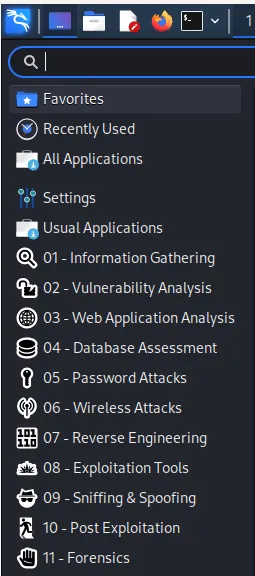
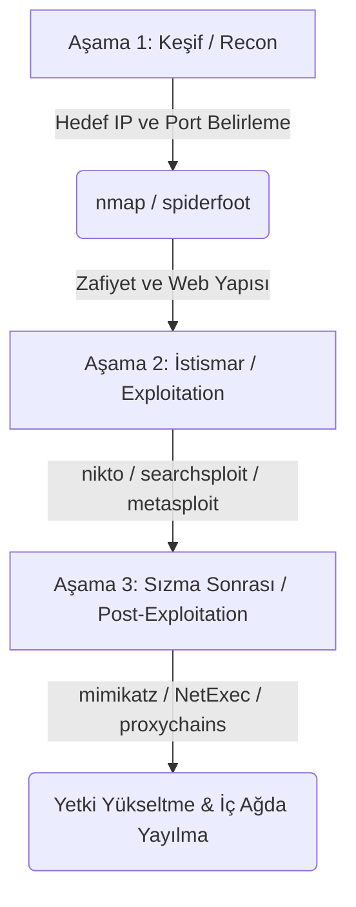

## Kali Linux'a Giriş

## Giriş

Merhaba, bu yazımda Kali Linux dağıtımından bahsedeceğim. Ne işe yaradığını ve ne gibi yetenekleri olduğunu anlatacağım. Kurulumundan bahsettikten sonra da, içinde hazır kurulu gelen araçlara değineceğim.

## Kali Linux Nedir?

[Kali Linux](https://www.kali.org/), siber güvenlik alanında kullanılmak için geliştirilmiş debian tabanlı bir linux dağıtımıdır. Hazır kurulu halde gelen birçok siber güvenlik yazılımını barındırır. Bu yönüyle çok kullanışlı ve kullanıcıya hitap eden bir yapısı olduğu söylenebilir.

Kali ile pek çok sisteme yönelik sızma testi yapabilirsiniz. Ayrıca adli bilişim alanında da çalışabilirsiniz.

### OffSec (Offensive Security) İlişkisi
Kali Linux, siber güvenlik eğitimleri ve sertifikasyonları alanında dünya lideri olan **[OffSec](https://www.offsec.com/)** (eski adıyla Offensive Security) tarafından fonlanmakta ve geliştirilmektedir. Sektörün en prestijli uygulamalı siber güvenlik sertifikası olan **OSCP (Offensive Security Certified Professional)** sınavları başta olmak üzere, birçok eğitim ve laboratuvarda Kali Linux birincil platform olarak konumlandırılır. Dağıtımın arkasındaki bu profesyonel destek, onun sürekli güncel kalmasını ve sektör ihtiyaçlarına göre şekillenmesini sağlar.

## Kurulum

Kali, GNOME ve XFCE olmak üzere iki farklı masaüstü ortamı seçeneğini sunar. Ayrıca 32-bit ve 64-bit sistemleri destekler.

Kali Linux'u kurmanın birkaç farklı yolu vardır:
1. **Ana işletim sistemi** olarak bilgisayarınıza kurabilirsiniz.
2. **İkincil işletim sistemi (dual-boot)** olarak bilgisayarınıza kurabilirsiniz.
3. **Sanal makine (Virtual Machine)** olarak kurabilirsiniz (en popüler ve güvenli laboratuvar yöntemi).
4. **Windows Subsystem for Linux (WSL)** üzerinde çalıştırabilirsiniz.

Kali'nin [dokümantasyon sayfasında](https://www.kali.org/docs/) kurulum ve sonraki işlemlerle ilgili ayrıntılı bilgi bulunuyor.

### Windows Subsystem for Linux (WSL) ile Kali Linux
Modern Windows işletim sistemlerinde Kali Linux'u ek bir sanallaştırma programı (hipervizör) kurmadan çalıştırmak mümkündür. WSL 2 sayesinde Windows komut satırıyla entegre bir Kali deneyimi elde edebilirsiniz.

#### WSL Kurulum Aşamaları:
1. Windows PowerShell'i veya Komut İstemi'ni (CMD) **Yönetici olarak** çalıştırın.
2. Aşağıdaki komutu yazıp çalıştırarak Kali Linux dağıtımını indirin ve kurun:
   ```powershell
   wsl --install -d kali-linux
   ```
3. Kurulum tamamlandıktan sonra bilgisayarınızı yeniden başlatın. İlk açılışta terminal sizden yeni bir kullanıcı adı ve parola belirlemenizi isteyecektir.

#### Grafik Arayüz (GUI) Kurulumu: Win-KeX
Komut satırı yerine Kali Linux'un masaüstü arayüzünü WSL üzerinde kullanmak için Kali ekibinin geliştirdiği Win-KeX aracını kullanabilirsiniz.
1. WSL terminalinde sisteminizi güncelleyin ve Win-KeX paketini kurun:
   ```bash
   sudo apt update && sudo apt install -y kali-win-kex
   ```
2. Kurulum tamamlandıktan sonra grafik arayüzü başlatmak için şu komutu girin:
   ```bash
   kex --esm --ip
   ```
   Bu komutla birlikte Windows içinde akıcı ve entegre bir Kali Linux masaüstü ortamına kavuşacaksınız.

### Sanal Makine ile Lab Kurulum Aşamaları
Sanal laboratuvar ortamı oluştururken en yaygın ve güvenli yöntem sanal makine kurulumudur. Aşağıdaki adımları takip ederek dakikalar içinde laboratuvarınızı hazır hale getirebilirsiniz:

1. **Hipervizör Seçimi ve Kurulumu:**
   Sistem mimarinize uygun sanallaştırma platformunu ([VMware Workstation](https://www.vmware.com/) veya [VirtualBox](https://www.virtualbox.org/)) ana bilgisayarınıza kurun.
2. **Hazır (Pre-built) VM İmajını İndirme:**
   Resmi web sitesindeki [Kali Virtual Machines](https://www.kali.org/get-kali/#kali-virtual-machines) sayfasına giderek kullandığınız hipervizöre uygun (VMware için `.7z` veya VirtualBox için `.ova` uzantılı) hazır kalıbı indirin. Bu yöntem sizi disk yapılandırma zahmetinden kurtarır.
3. **İmajı İçe Aktarma (Import) ve Donanım Ayarları:**
   İndirdiğiniz imajı hipervizörünüze "Import" seçeneğiyle aktarın. Ayarlardan sanal makineye **en az 2 GB RAM** (önerilen 4 GB) ve **2 vCPU** tanımlayın. Ağ adaptörünü lab senaryonuza göre NAT veya *Host-Only* moduna getirin (dış ağlara istemsizce paket göndermemek ve güvenli bir izole alan oluşturmak için).
4. **İlk Giriş ve Sistem Güncellemesi:**
   Varsayılan kimlik bilgileri olan `kali / kali` ile giriş yapın. Terminali açarak aşağıdaki komutla paket depolarını ve araçları güncelleyin:
   ```bash
   sudo apt update && sudo apt upgrade -y
   ```

## Sızma Testi Nedir?

Penetration Test(pentest) amacı herhangi bir sistemde var olan açığı bulmak, sömürmek ve raporlamaktır. Sızma testini genel olarak ikiye ayırabiliriz:

Network sızma testi, sistemin yanlış yapılandırılmasından kaynaklanan zafiyetlerden yararlanarak sisteme sızma şeklidir.

Uygulama sızma testi, uygulama yazılımında bulunan açıklıklar üzerinden sisteme erişme ve sömürme faaliyetleridir.

Sızma testi yapılışı olarak 3'e ayrılır:

* Siyah kutu: hedef sistem hakkında hiçbir bilgi verilmeden yapılan sızma testidir.
* Beyaz kutu: hedef sistemle ilgili pek çok bilgi verilerek yapılan sızma testidir.
* Gri kutu: hedef sistem hakkında detay bilgi vermeden yapılan sızma testidir.

Sızma testi alanında, Kali Linux çok kullanılan bir dağıtımdır. Şimdi, bu iş için kullanılan araçlara bir göz atalım.

## Kali Linux Araçları

Kali Linux masaüstü ortamındayken, logosunun bulunduğu kısma tıklarsanız genel menüsünün açıldığını göreceksiniz. Burada, ayarlar kısmından çeşitli özelleştirmeler yapabilirsiniz. Daha aşağıya baktığınızda çeşitli bölümlerle karşılacaksınız.



Kali Linux Menu

Bu kısımda, kali linux ile hazır kurulu olarak gelen siber güvenlik araçları işlevlerine göre sınıflandırılmıştır. Kali, bilgi toplama, zafiyet taraması, şifre saldırıları, kablosuz ağ saldırıları, adli bilişim vb. gibi pek çok alanda hazır araçlar içermektedir. Bu araçlara ve araçların nasıl kullanıldıklarına dair bilgilere [Kali Linux Tools](https://www.kali.org/tools/) sayfasından ayrıntılı olarak ulaşabilirsiniz.

Bu yazımızda, kısaca bu araçlardan ve ne işe yaradıklarından bahsedeceğiz.

### En Kritik Kali Linux Araçları Karşılaştırması

Araç detaylarına girmeden önce, sızma testlerinde sıklıkla kullanılan en kritik araçların hızlı bir özetini aşağıdaki tabloda görebilirsiniz:

| Kategori | Araç İsmi | Kullanım Amacı / Öne Çıkan Özellik | Güçlü Yönü / Tercih Sebebi | Alternatifi |
| :--- | :--- | :--- | :--- | :--- |
| **Bilgi Toplama (Recon)** | `nmap` | Ağ ve port tarama, servis/işletim sistemi tespiti | Hızlı, script desteği (`NSE`) çok güçlü | `masscan`, `rustscan` |
| **Zafiyet Analizi** | `nikto` | Web sunucu taraması, bilinen açıkları arama | Hızlı ve doğrudan web sunucusu hedefler | `Legion`, `Nessus` |
| **Web Uygulamaları** | `burpsuite` | Trafik izleme, araya girme (Proxy), istek manipülasyonu | Manuel testler için sektör standardı | `OWASP ZAP` |
| **Veritabanı Güvenliği** | `sqlmap` | SQL Injection açıklarını tespit ve sömürme | Otomatik exploit etme ve veriyi çekme | Manuel SQLi |
| **Parola Saldırıları** | `hashcat` | GPU destekli hızlı hash kırma | Çok yüksek hızlarda hash çözme yeteneği | `John the Ripper` |
| **İstismar (Exploitation)** | `metasploit` | Hazır exploit modülleri çalıştırma | Geniş exploit ve payload kütüphanesi | `Cobalt Strike` |
| **Ağ İzleme (Sniffing)** | `wireshark` | Ağ paketlerini detaylı yakalama ve analiz etme | Protokol düzeyinde derin paket çözümleme | `tcpdump` |
| **Sızma Sonrası (Post-Exploitation)** | `NetExec (nxc)` | AD ve Windows ağlarında yetki yayma / doğrulama | Eski `crackmapexec` yerine geçen modern AD aracı | `Impacket` |

---

### Ofansif Siber Saldırı Yaşam Döngüsü (Cyber Kill Chain) Uygulaması

Siber güvenlik araçları tek başlarına izole çalışan yapılar değildir. Başarılı bir sızma testinde bir aracın çıktısı, diğer aracın girdisi (input) haline gelerek bir saldırı zinciri oluşturur. Aşağıda, Kali Linux araçlarının bir sızma testinde nasıl uçtan uca zincirlendiğini gösteren örnek bir senaryo yer almaktadır:



#### 1. Aşama: Keşif (Reconnaissance)
Saldırgan veya sızma testi uzmanı, hedef sisteme doğrudan saldırmadan önce bilgi toplar.
* **Adım 1:** `spiderfoot` yardımıyla hedef kurumun açık kaynaklı dijital ayak izleri (e-postalar, alt alan adları, IP blokları) toplanır.
* **Adım 2:** Hedef IP adresine yönelik `nmap` taraması yapılarak açık portlar ve üzerinde çalışan servislerin versiyonları tespit edilir.
  ```bash
  nmap -sV -sC -Pn -oN hedef_tarama.txt <HEDEF_IP>
  ```
  *(Bu komut; servis versiyonlarını kontrol eder `-sV`, varsayılan scriptleri çalıştırır `-sC`, ping atmadan tarar `-Pn` ve çıktıyı düzenli bir dosyaya kaydeder `-oN`)*

#### 2. Aşama: İstismar (Exploitation)
Keşif aşamasından elde edilen veriler analiz edilir ve sisteme sızmak için zafiyetler aranır.
* **Adım 1:** Hedefte açık olan 80/443 portundaki web sunucusu `nikto` ile taranarak bilinen yapılandırma hataları kontrol edilir.
* **Adım 2:** Servis versiyonlarında bilinen bir zafiyet olup olmadığını anlamak için `searchsploit` üzerinden exploit araştırması yapılır.
* **Adım 3:** Uygun zafiyet bulunduğunda `metasploit framework` açılıp ilgili exploit modülü seçilerek tetiklenir ve sisteme sızılıp ilk oturum (shell) elde edilir.

#### 3. Aşama: Sızma Sonrası (Post-Exploitation)
Sisteme giriş yaptıktan sonra hak yükseltme ve ağda yayılma aşaması başlar.
* **Adım 1:** Windows bir sistemde `mimikatz` aracı çalıştırılarak bellekten (RAM) açık metin (clear-text) olarak parolalar avlanır veya parola özetleri (hashes) toplanır.
* **Adım 2:** Elde edilen yeni kimlik bilgileri `NetExec (nxc)` ile diğer ağ makinelerinde test edilir.
* **Adım 3:** Hedef ağın derinliklerine sızmak için `proxychains4` yardımıyla trafik tünellenir ve ağ içi yatay/dikey hareket (pivoting) gerçekleştirilerek nihai hedefe (örneğin Domain Controller) ulaşılır.

---

### Araç Detayları ve Kullanım Örnekleri

### 01-Information Gathering

Belirli bir hedefe yönelik aktif ve pasif bilgi toplama faaliyetlerinde kullanılan araçlar bu bölümde yer alır. Bunlar:

* [**dmitry**](https://www.kali.org/tools/dmitry/): dmitry, C ile yazılmış bir Linux komut satırı uygulamasıdır. dmitry, olası subdomainleri, e-posta adreslerini, çalışma süresi bilgilerini bulabilir.
* [**ike-scan**](https://www.kali.org/tools/ike-scan/): ike-scan, IKE ana bilgisayarlarını keşfeder ve ayrıca yeniden iletim geri alma modelini kullanarak bunların parmak izini alabilir.
* [**netdiscover**](https://www.kali.org/tools/netdiscover/): Netdiscover bir aktif/pasif adres keşif aracıdır. Özellikle DHCP sunucusu olmayan kablosuz ağlar için geliştirilmiştir. Hub/Switched ağlarda da kullanılabilir.
* [**nmap**](https://www.kali.org/tools/nmap/): nmap(network mapper), ağ keşfi veya güvenlik denetimi için bir yardımcı programdır. Ping taramayı (hangi ana bilgisayarların açık olduğunu belirleme), birçok bağlantı noktası tarama tekniğini, sürüm algılamayı (hizmet protokollerini ve bağlantı noktalarını dinleyen uygulama sürümlerini belirleme) ve TCP/IP parmak izini (uzak ana bilgisayar işletim sistemi veya cihaz tanımlama) destekler.
  > **Pratik Komut:**
  > ```bash
  > nmap -sV -sC -Pn -oN scan_results.txt <HEDEF_IP>
  > ```
* [**recon-ng**](https://www.kali.org/tools/recon-ng/)**:** Recon-ng, Python'da yazılmış tam özellikli bir Web Keşif frameworküdür. Bağımsız modüller, veritabanı etkileşimi, etkileşimli yardım ve komut tamamlama özellikleriyle donatılan Recon-ng, web tabanlı keşiflerin hızlı ve kapsamlı bir şekilde yürütülebileceği güçlü bir ortam sağlar.
* [**spiderfoot**](https://www.kali.org/tools/spiderfoot/)**:** Bu paket, bir açık kaynak istihbaratı (OSINT) otomasyon aracı içerir. Amacı, IP adresi, etki alanı adı, ana bilgisayar adı, ağ alt ağı, ASN, e-posta adresi veya kişinin adı olabilecek belirli bir hedef hakkında istihbarat toplama sürecini otomatikleştirmektir.

### 02-Vulnerability Analysis

Belirli bir hedefe yönelik zafiyet taraması yapmak için kullanılan araçlar bu bölümde yer alır. Bunlar:

* [**legion**](https://www.kali.org/tools/legion/)**:** Bu paket, bilgi sistemlerinin keşfedilmesine ve kullanılmasına yardımcı olan açık kaynaklı, kullanımı kolay, genişletilebilir ve yarı otomatik bir ağ penetrasyon testi aracı içerir.
* [**nikto**](https://www.kali.org/tools/nikto/)**:** Nikto, hızlı güvenlik veya bilgi kontrolleri yapmak için rfp'nin LibWhisker'ını kullanan, Perl'de yazılmış bir web sunucusu ve CGI tarayıcıdır.
* [**unix-privesc-check**](https://www.kali.org/tools/unix-privesc-check/)**:** Unix-privesc-checker, Unix sistemlerinde çalışan bir betiktir (Solaris 9, HPUX 11, Çeşitli Linux'lar, FreeBSD 6.2'de test edilmiştir). Yerel ayrıcalıksız kullanıcıların ayrıcalıkları diğer kullanıcılara yükseltmesine veya yerel uygulamalara (ör. veritabanları) erişmesine izin verebilecek yanlış yapılandırmaları bulmaya çalışır.

### 03-Web Applicaton Analysis

Web Uygulamalarındaki açıklıkları bulmak ve söürmek için kullanılan araçlar bu bölümde yer alır. Bunlar:

* [**burpsuite**](https://www.kali.org/tools/burpsuite/)**:** Burp Suite, web uygulamalarının güvenlik testlerini gerçekleştirmek için entegre bir platformdur. Çeşitli araçları, bir uygulamanın saldırı yüzeyinin ilk haritalanması ve analizinden güvenlik açıklarının bulunmasına ve kullanılmasına kadar tüm test sürecini desteklemek için sorunsuz bir şekilde birlikte çalışır.
* [**commix**](https://www.kali.org/tools/commix/)**:** Bu paket basit bir ortama sahiptir ve web geliştiricileri, penetrasyon test edicileri ve hatta güvenlik araştırmacıları tarafından komut enjeksiyon saldırılarıyla ilgili hataları veya güvenlik açıklarını bulmak amacıyla web uygulamalarını test etmek için kullanılabilir. Bu aracı kullanarak, güvenlik açığı bulunan belirli bir parametre veya dizide command injection zafiyetini bulmak ve yararlanmak çok kolaydır. Commix, Python programlama dilinde yazılmıştır.
* [**skipfish**](https://www.kali.org/tools/skipfish/)**:** Skipfish, aktif bir web uygulaması güvenlik keşif aracıdır. Özyinelemeli tarama ve sözlük tabanlı yoklamalar yaparak hedeflenen site için etkileşimli bir site haritası hazırlar. Araç tarafından oluşturulan nihai raporun, profesyonel web uygulaması güvenlik değerlendirmeleri için bir temel oluşturması amaçlanmıştır.
* [**wpscan**](https://www.kali.org/tools/wpscan/)**:** WPScan, güvenlik sorunlarını bulmak için WordPress uygulamalarını tarar.

### 04-Database Assesment

Veritabanlarındaki açıklıkları bulmak ve sömürmek için ayrıca veritabanlarını görüntülemek için kullanılan araçlar bu bölümde yer alır. Bunlar:

* [**sqlitebrowser**](https://www.kali.org/tools/sqlitebrowser/)**:** SQLite Veritabanı Tarayıcısı, SQLite ile uyumlu veritabanı dosyalarını oluşturmak, tasarlamak ve düzenlemek için kullanılan görsel bir araçtır. Arabirimi QT'ye dayalıdır ve karmaşık SQL komutlarını öğrenmeye ihtiyaç duymadan tanıdık elektronik tablo benzeri bir arabirim kullanarak veritabanları oluşturmak, verileri düzenlemek ve aramak isteyen kullanıcılar ve geliştiriciler için tasarlanmıştır.
* [**sqlmap**](https://www.kali.org/tools/sqlmap/)**:** sqlmap'in amacı, web uygulamalarındaki SQL enjeksiyon güvenlik açıklarını tespit etmek ve bunlardan yararlanmaktır.
  > **Pratik Komut:**
  > ```bash
  > sqlmap -u "http://hedef.com/page.php?id=1" --dbs --batch
  > ```

### 05-Password Attacks

Şifre saldırıları için kullanılan araçlar bu bölümde yer alır. Bu araçlar:

* [**cewl**](https://www.kali.org/tools/cewl/)**:** CeWL (Custom Word List generator), John the Ripper gibi şifre kırıcılar için kullanılabilecek bir kelime listesi oluşturan bir ruby uygulamasıdır. Opsiyonel olarak CeWL harici linkleri takip edebilir.
* [**crunch**](https://www.kali.org/tools/crunch/)**:** crunch, standart bir karakter seti veya kelime listelerini oluştururken kullanılacak herhangi bir karakter setini belirtebileceğiniz bir kelime listesi oluşturucusudur. Kelime listeleri, bir dizi karakterin kombinasyonu ve permütasyonu yoluyla oluşturulur. Karakter miktarını ve liste boyutunu belirleyebilirsiniz.
* [**hashcat**](https://www.kali.org/tools/hashcat/)**:** hashcat, 300'den fazla yüksek düzeyde optimize edilmiş karma algoritma için beş benzersiz saldırı modunu destekler. hashcat şu anda Linux'ta CPU'ları, GPU'ları ve diğer donanım hızlandırıcıları desteklemektedir ve dağıtılmış parola kırmaya yardımcı olacak olanaklara sahiptir.
  > **Pratik Komut:**
  > ```bash
  > hashcat -m 1800 -a 0 shadow_hash.txt rockyou.txt
  > ```
* [**john**](https://www.kali.org/tools/john/)**:** John the Ripper, sistem yöneticilerinin zayıf (tahmin etmesi veya kaba kuvvetle kırması kolay) parolaları bulmasına ve hatta istenirse kullanıcıları bu konuda otomatik olarak e-posta ile uyarmasına yardımcı olmak için tasarlanmış bir araçtır.
  > **Pratik Komut:**
  > ```bash
  > john --wordlist=/usr/share/wordlists/rockyou.txt hash.txt
  > ```
* [**medusa**](https://www.kali.org/tools/medusa/)**:** medusa'nın hızlı, büyük ölçüde paralel, modüler, kaba kuvvet saldırısı uygulaması olması amaçlanmıştır. Amaç, mümkün olduğu kadar uzaktan kimlik doğrulamaya izin veren çok sayıda hizmeti desteklemektir.
* [**ncrack**](https://www.kali.org/tools/ncrack/)**:** ncrack, yüksek hızlı bir ağ kimlik doğrulama aracıdır. Tüm ana bilgisayarlarını ve ağ aygıtlarını zayıf parolalar için proaktif olarak test ederek şirketlerin ağlarını güvence altına almalarına yardımcı olmak için oluşturulmuştur.
* [**ophcrack**](https://www.kali.org/tools/ophcrack/)**:** ophcrack, rainbow tablolarını kullanan bir zaman-bellek takasına dayalı bir Windows parola kırıcıdır. Saniyeler içinde alfanümerik şifrelerin %99,9'unu kurtarır.

### 06-Wireless Attacks

Kablosuz ağ saldırıları için kullanılan araçlar bu bölümde yer alır. Bunlar:

* [**aircrack-ng**](https://www.kali.org/tools/aircrack-ng/)**:** aircrack-ng, yeterli miktarda şifrelenmiş paket toplandıktan sonra 40 bit, 104 bit, 256 bit veya 512 bit WEP anahtarını kurtarabilen bir 802.11a/b/g WEP/WPA kırma programıdır. Ayrıca WPA1/2 ağlarına bazı gelişmiş yöntemlerle veya sadece kaba kuvvetle saldırabilir.
* [**fern wifi cracker**](https://www.kali.org/tools/fern-wifi-cracker/)**:** Bu paket, Python Programlama Dili ve Python Qt GUI kitaplığı kullanılarak yazılmış bir Kablosuz güvenlik denetim ve saldırı yazılım programı içerir, program WEP/WPA/WPS anahtarlarını kırabilir ve kurtarabilir ve ayrıca kablosuz veya ethernet tabanlı diğer ağ tabanlı saldırıları gerçekleştirebilir.
* [**kismet**](https://www.kali.org/tools/kismet/)**:** Kısmet, bir kablosuz ağ ve cihaz dedektörü, sniffer, güvenlik aracı ve WIDS (kablosuz izinsiz giriş tespiti) frameworküdür.
* [**pixiewps**](https://www.kali.org/tools/pixiewps/)**:** Pixiewps, bazı AP'lerin pixie tozu saldırısından yararlanarak WPS anahtarını çevrimdışı olarak zorlamak için kullanılan C ile yazılmış bir araçtır.
* [**reaver**](https://www.kali.org/tools/reaver/)**:** Reaver, bir erişim noktasının WiFi Korumalı Kurulum pin koduna kaba kuvvet saldırısı gerçekleştirir. WPS pini bulunduğunda, WPA PSK kurtarılabilir ve dönüşümlü olarak AP'nin kablosuz ayarları yeniden yapılandırılabilir.
* [**wifite**](https://www.kali.org/tools/wifite/)**:** Wifite, WEP veya WPA şifreli kablosuz ağları denetlemek için oluşturulmuş bir araçtır. Denetimi gerçekleştirmek için aircrack-ng, pyrit, reaver, tshark araçlarını kullanır.

### 07-Reverse Engineering

Tersine mühendislik için kullanılan araçlar ve komut ortamları bu bölümde yer alır. Bunlar:

* [**radare2**](https://www.kali.org/tools/radare2/): Proje, tersine mühendislik için eksiksiz, taşınabilir, çok mimarili, bir araç zinciri oluşturmayı hedefliyor.

### 08-Exploitation Tools

Bir hedef sistemi exploit etmek yani hedef sisteme erişim elde etmek için kullanılan araçlar bu bölümde yer alır. Bunlar:

* [**NetExec (nxc)**](https://www.kali.org/tools/netexec/)**:** Eski adıyla `crackmapexec` olarak bilinen aracın geliştirilmesi durdurulduktan (deprecated) sonra, topluluk tarafından sürdürülen ve geliştirilmeye devam eden modern sürümüdür. Windows/Active Directory ortamlarında sızma testleri, kimlik doğrulama doğrulaması ve dikey/yatay yetki yayma işlemleri için vazgeçilmez bir araçtır.
  > **Pratik Komut:**
  > ```bash
  > nxc smb <HEDEF_IP_VEYA_AG> -u username -p password --local-auth
  > ```
* [**metasploit framework**](https://www.kali.org/tools/metasploit-framework/)**:** Metasploit framework, güvenlik açığı araştırmasını, istismar yöntemi geliştirmeyi ve özel güvenlik araçlarının oluşturulmasını destekleyen açık kaynaklı bir platformdur.
* [**searchsploit**](https://www.kali.org/tools/exploitdb/#searchsploit): Exploit [Veritabanında](https://www.exploit-db.com/) hazır exploit araması yapar.

### 09-Sniffing&Spoofing

sniffing ve spoofing için kullanılan araçlar bu bölümde yer alır. Bunlar:

* [**ettercap**](https://www.kali.org/tools/ettercap/)**:** Ettercap, birçok protokolün aktif ve pasif incelemesini destekler ve ağ ve ana sistem analizi için birçok özellik içerir.
* [**minicom**](https://www.kali.org/tools/minicom/)**:** Minicom, MS-DOS "Telix" iletişim programının bir kopyasıdır. ANSI ve VT102 terminallerini çalıştırır.
* [**mitmproxy**](https://www.kali.org/tools/mitmproxy/)**:** mitmproxy, HTTP ve HTTPS için etkileşimli bir Man-in-the-Middle proxy'sidir. Ağ trafik akışlarının anında denetlenmesine ve düzenlenmesine izin veren bir konsol arabirimi sağlar.
* [**netsniff-ng**](https://www.kali.org/tools/netsniff-ng/)**:** netsniff-ng, ağ paketi incelemesi için yüksek performanslı bir Linux ağ algılayıcısıdır. Protokol analizi, tersine mühendislik veya ağ hata ayıklaması için kullanılabilir.
* [**responder**](https://www.kali.org/tools/responder/)**:** Bu paket Responder/MultiRelay, bir LLMNR, NBT-NS ve MDNS zehirleyici içerir. Ad soneklerine göre belirli NBT-NS (NetBIOS Ad Hizmeti) sorgularına yanıt verir.
* [**wireshark**](https://www.kali.org/tools/wireshark/)**:** Wireshark, ağ paketlerini yakalayan ve analiz eden bir ağ "sniffer" aracıdır. Wireshark, burada listelenemeyecek kadar çok protokolün kodunu çözebilir.

### 10-Post Exploitation

Exploit sonrası işlemler, Enumaration(sistem hakkında detaylı bilgi toplama), Privelege Escalatio(yetki yükseltme) ve Pivoting(başka sisteme atlama), için geliştirilmiş araçlar bu bölümde yer alır. Bunlar:

* [**evil-winrm**](https://www.kali.org/tools/evil-winrm/)**:** Bu paket, hackleme/sızma testi için nihai WinRM kabuğunu içerir.
* [**exe2hex**](https://www.kali.org/tools/exe2hexbat/)**:** Bir Windows PE yürütülebilir dosyasını bir toplu iş dosyasına ve tersini dönüştürmek için hazırlanmış bir Python scripti.
* [**mimikatz**](https://www.kali.org/tools/mimikatz/)**:** Mimikatz, şu anda oturum açmış kullanıcıların parolalarını düz metin olarak görüntülemek için Windows'ta yönetici haklarını kullanan bir araçtır.
* [**powershell empire**](https://www.kali.org/tools/powershell-empire/)**:** Bu paket, saf bir PowerShell2.0 Windows aracısı ve saf bir Python Linux/OS X aracısı içeren bir framework içerir. Önceki PowerShell Empire ve Python EmPyre projelerinin birleşimidir.
* [**powersploit**](https://www.kali.org/tools/powersploit/)**:** PowerSploit, yetkili sızma testleri sırasında istismar sonrası senaryolarda kullanılabilen bir dizi Microsoft PowerShell betiğidir.
* [**proxychains4**](https://www.kali.org/tools/proxychains-ng/)**:** Proxychains, ağla ilgili libc işlevlerini önceden yüklenmiş bir DLL (dlsym(), LD\_PRELOAD) aracılığıyla dinamik olarak bağlı programlara bağlayan ve bağlantıları SOCKS4a/5 veya HTTP proxy'leri aracılığıyla yeniden yönlendiren bir UNIX programıdır. Yalnızca TCP'yi destekler (UDP/ICMP vb. yoktur).
* [**weevely**](https://www.kali.org/tools/weevely/)**:** Weevely, telnet benzeri bağlantıyı simüle eden gizli bir PHP web kabuğudur. Bu, web uygulamalarının kullanım sonrası kullanımı için önemli bir araçtır ve yasal web hesaplarını, hatta ücretsiz olarak barındırılanları bile yönetmek için gizli bir arka kapı(backdoor) veya bir web kabuğu olarak kullanılabilir.

### 11-Forensics

Adli bilişim için geliştirilmiş araçlar bu bölümde yer alır. Bunlar:

* [**autopsy**](https://www.kali.org/tools/autopsy/)**:** autopsy Forensic Browser, The Sleuth Kit'teki komut satırı dijital adli bilişim analiz araçlarına grafiksel bir arayüzdür. The Sleuth Kit ve Autopsy birlikte, Windows ve UNIX dosya sistemlerinin (NTFS, FAT, FFS, EXT2FS ve EXT3FS) analizi için ticari dijital adli bilişim araçlarıyla aynı özelliklerin birçoğunu sağlar.
* [**binwalk**](https://www.kali.org/tools/binwalk/)**:** binwalk, belirli bir ikili görüntüde gömülü dosyalar ve yürütülebilir kod aramak için kullanılan bir araçtır. Özellikle, ürün yazılımı görüntülerinin içine gömülü dosyaları ve kodu tanımlamak için tasarlanmıştır. Binwalk, libmagic kitaplığını kullanır, dolayısıyla Unix dosya yardımcı programı için oluşturulan sihirli imzalarla uyumludur.
* [**bulk\_extractor**](https://www.kali.org/tools/bulk-extractor/)**:** bulk\_extractor, bir disk görüntüsünü, bir dosyayı veya bir dosya dizinini tarayan ve dosya sistemi veya dosya sistemi yapılarını ayrıştırmadan faydalı bilgileri çıkaran bir C++ programıdır. Sonuçlar, kolayca incelenebilen, ayrıştırılabilen veya otomatik araçlarla işlenebilen özellik dosyalarında saklanır.
* [**hashdeep**](https://www.kali.org/tools/hashdeep/)**:** hashdeep, keyfi sayıda dosyanın MD5, SHA1, SHA256, tiger ve whirlpool hashsum'larını yinelemeli olarak hesaplamak için bir dizi araçtır.

## Geleceğin Ofansif Güvenliği: Yapay Zeka ve Otomasyon

2026 yılı itibarıyla siber saldırı ve savunma stratejilerinde yapay zeka (AI) ve büyük dil modelleri (LLM) başrolde yer almaktadır. Kali Linux ekosisteminde de klasik araçların AI ile entegrasyonu hız kazanmıştır.
* **Yapay Zeka Destekli OSINT:** Geleneksel bilgi toplama yöntemleri yerine, hedef hakkında toplanan verileri analiz edip anlamlı ilişki haritaları çıkaran AI ajanları kullanılmaktadır (örneğin otomatik sosyal mühendislik hedefleri belirleme).
* **Sızma Testi Otomasyonu:** Ajan tabanlı sistemler, hedef sistemdeki açık portları taradıktan sonra hangi exploit'in en yüksek başarı şansına sahip olduğunu tahmin edip otomatik test süreçlerini yönetebilmektedir.
* **Akıllı Kod Analizi:** Statik kod analiz süreçlerinde AI, güvenlik açıklarını yalnızca tespit etmekle kalmayıp, güvenlik açığına neden olan kod bloğu için düzeltme önerileri (patching) sunmaktadır.

Gelecekte siber güvenlik uzmanlarının en büyük yeteneği, bu otomasyon ve yapay zeka araçlarını doğru yönlendirip yönetebilmek olacaktır.

## Son

Bu yazımda, kali linux'un ne olduğundan ve ne gibi yetenekleri olduğundan bahsetmeye çalıştım. Kısaca, içinde hazır kurulu halde gelen araçlardan bahsettim. Bu araçların nasıl kullanılacağı ile ilgili hem kalinin kendi sayfasında hem de internette pek çok bilgi mevcut. Ayrıca, kali terminalinde "arac\_ismi -h" yazarak da o aracın kullanımı hakkında bilgi edinebiliyorsunuz. Yazımı beğenip yorum yapmayı unutmayın!