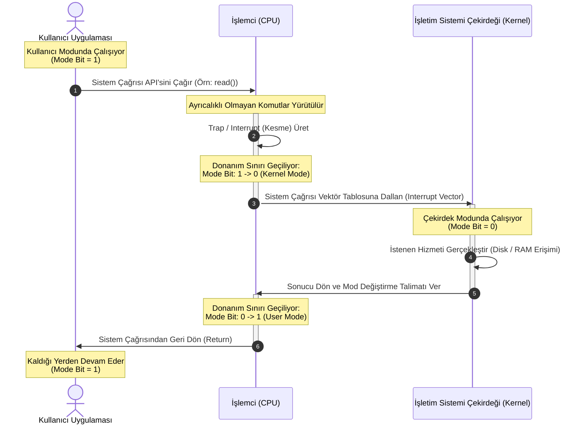
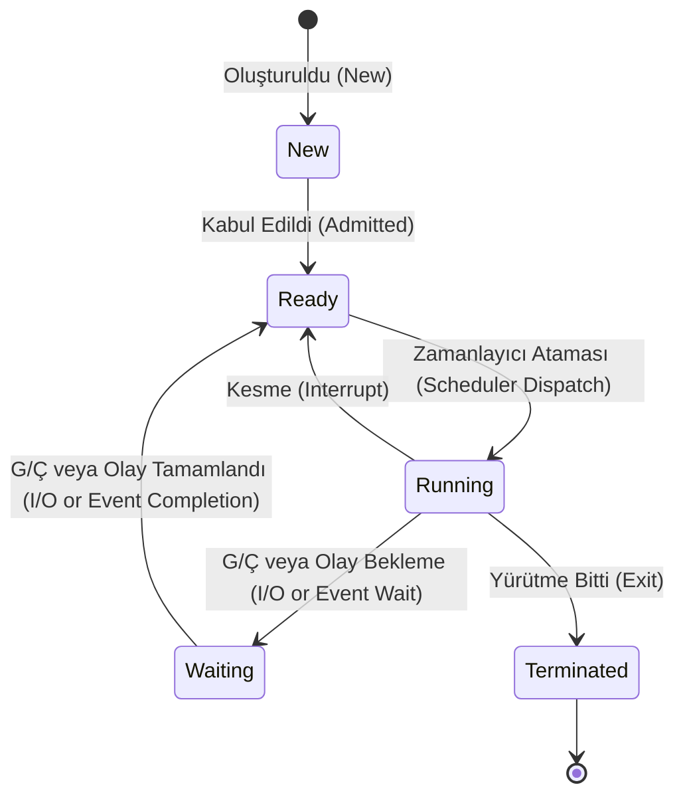
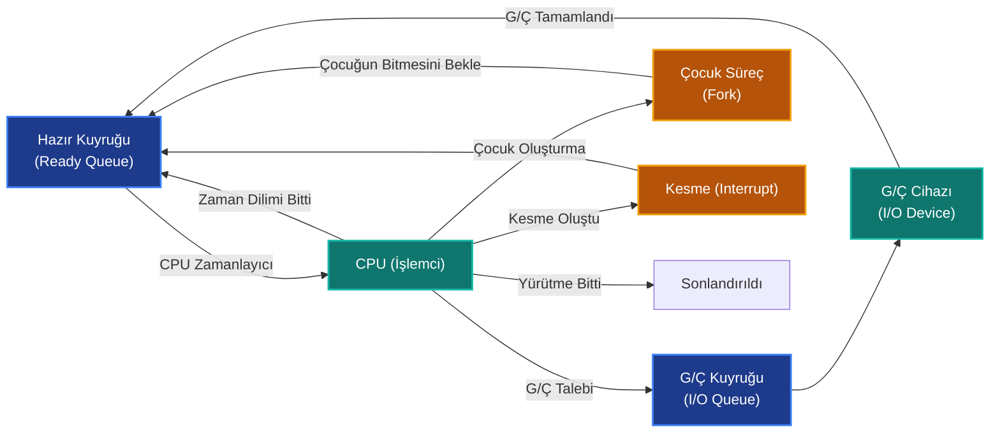

## İşletim Sistemi Konsepti ve Dinozor Kitabı'nın İzinde

İşletim sistemleri dersinin kapısından giren her bilgisayar veya yazılım mühendisliği öğrencisinin mutlaka karşılaştığı, sektöre yıllarını vermiş mühendislerin ise kütüphanesinde bir saygı duruşu olarak sakladığı o meşhur eser: **"Dinozor Kitabı"** (orijinal adıyla *Operating System Concepts*). Abraham Silberschatz, Peter B. Galvin ve Greg Gagne üçlüsü tarafından kaleme alınan bu kitap, sadece bir ders kitabı değil; donanım ile yazılımın arasındaki o büyüleyici köprüyü, yani işletim sistemini (OS) anlatan bir bilgisayar bilimi klasiğidir.

### Neden Herkes Ona "Dinozor" Diyor?

Kitabın adı *Operating System Concepts* olmasına rağmen, sektörde ve akademide kimse bu uzun ismi kullanmaz. Sebebi ise çok basittir: Kitabın ilk baskılarından beri kapak görselinde hep bir dinozor illüstrasyonunun yer alması. Bu durum zamanla o kadar ikonikleşti ki, yazarlar her yeni baskıda kapağa farklı bir dinozor türü yerleştirmeye başladılar (örneğin 10. güncel baskıda bizi bir T-Rex karşılar).

Bilgisayar dünyasında bu kapağa dair popüler bir espri de vardır: İşletim sistemleri ilk bakışta hantal, eski ve karmaşık (tıpkı bir dinozor gibi) görünebilir, ancak derinlerine indikçe ne kadar güçlü ve evrimleşmiş olduklarını anlarsınız.

Bu teknik rehberde, Dinozor Kitabı'nın üzerine inşa edildiği ana sütunları temel alarak, bilgisayarın güç düğmesine bastığınız andan itibaren arka planda dönen işlemleri, CPU zamanlamasını, RAM'in nasıl parsellendiğini ve donanım ile işletim sisteminin nasıl bir bütün halinde çalıştığını mikroskobik düzeyde inceleyeceğiz.

## İşletim Sistemi (Operating System)

İşletim sistemi, bir bilgisayarın donanımını yöneten bir programdır. Ayrıca uygulama programları için bir temel sağlar ve bilgisayar kullanıcısı ile bilgisayar donanımı arasında bir aracı görevi görür.

Bu noktada, üzerinde çalışacağı donanıma(hardware) bağımlı bir sistemden söz ediyoruz. Bu nedenle, işletim sistemleri sistem donanımıyla doğrudan ilgilidir. Tek ve Çok işlemcili mimariler, birden fazla kalıcı bellek-disk içeren organizasyonlar işletim sistemi tarafında desteklenmelidir.

Ayrıca, üzerinde çalışan uygulamalara bir çalışma ortamı sunmak zorundadır, bunun için uygulamalara kaynak ayırmalı, sistem çağrılarıyla işlemler yapmasına izin vermelidir. Dahası, dışardan bağlanan diğer cihazlarla da entegre çalışma kabiliyetine sahip olmalıdır.

Evet son derece karmaşık bir sistemden söz ediyoruz. Bütün bileşenleri birbiriyle çalışabilir hale getirmek pek kolay bir iş gibi görünmüyor.

### İşletim Sistemi Yapısı

İşletim sistemi, bilgisayar donanımı ile yazılım arasında bir arabirim görevi gören ve bilgisayarın kaynaklarını yöneten bir yazılımdır. İşletim sistemi, bilgisayarın bellek, işlemci, dosya sistemleri, cihaz sürücüleri ve ağ bağlantıları gibi kaynaklara erişimi düzenler ve kullanıcıların bu kaynakları etkili bir şekilde kullanabilmesini sağlar.

İşletim Sistemi Yapısı

İşletim sistemi genellikle çekirdek (kernel) ve kullanıcı arayüzü (shell) olmak üzere iki temel bileşenden oluşur.

**1. Çekirdek (Kernel):** Çekirdek, işletim sisteminin temel parçasıdır ve en düşük seviyede donanım kaynaklarını yönetir. Bellek yönetimi, işlem yönetimi, dosya sistemleri, sürücüler ve ağ bağlantıları gibi temel işlevleri yerine getirir. Çekirdek, doğrudan donanım ile iletişim kurar ve uygulamaların bu kaynaklara erişimini sağlar.

**2. Kullanıcı Arayüzü (Shell):** Kullanıcı arayüzü, kullanıcıların işletim sistemiyle etkileşimde bulunmasını sağlayan bir katmandır. İki temel kullanıcı arayüzü türü vardır: grafiksel kullanıcı arayüzü (GUI) ve komut satırı arayüzü (CLI).

* **Grafiksel Kullanıcı Arayüzü (GUI):** GUI, kullanıcıların fare, klavye ve ekran gibi giriş/çıkış cihazlarıyla etkileşime geçtiği bir arayüzdür. Bu arayüz, menüler, pencereler ve simgeler gibi grafiksel öğeler kullanarak kullanıcıların işletim sistemini kolayca kullanmasını sağlar. Örnek olarak, Windows'un masaüstü ortamı veya macOS'un Aqua arayüzü verilebilir.
* **Komut Satırı Arayüzü (CLI):** CLI, kullanıcıların metin tabanlı komutlarla işletim sistemine talimat verdiği bir arayüzdür. Kullanıcılar, önceden tanımlanmış komutları girerek veya komut dosyaları kullanarak işletim sistemine emirler verebilir. Örnek olarak, Unix veya Linux tabanlı sistemlerde kullanılan Bash kabuğu veya Windows'taki Komut İstemi (Command Prompt) verilebilir.

Bu temel yapı, işletim sistemlerinin farklı özelliklerine ve tasarımlarına bağlı olarak farklılık gösterebilir. Örneğin, Windows, macOS, Linux, Unix ve Android gibi işletim sistemleri.

### Kullanıcı Modu ve Çekirdek Modu Geçişi (User Mode vs. Kernel Mode)

Sistemin güvenliğini sağlamak ve kritik donanım bileşenlerini korumak için modern işlemciler ve işletim sistemleri en az iki farklı çalışma modu destekler: **Kullanıcı Modu (User Mode - Mode Bit = 1)** ve **Çekirdek Modu (Kernel Mode / Privileged Mode - Mode Bit = 0)**.

Kullanıcı uygulamaları doğrudan donanıma erişemez veya ayrıcalıklı donanım komutları çalıştıramaz. Bir uygulama donanım kaynağına (dosya okuma/yazma, ağ kartı kullanımı, bellek ayırma vb.) ihtiyaç duyduğunda, işletim sisteminden yardım istemek zorundadır. Bu işlem **Sistem Çağrısı (System Call)** ile gerçekleştirilir.

Aşağıdaki mimari dizim şeması, bir kullanıcı uygulamasının sistem çağrısı yaparak çekirdek moduna geçiş sürecini ve donanım sınırının nasıl aşıldığını göstermektedir:

### İşletim Sistemi Görevleri

İşletim sistemi, bilgisayar sistemlerinde bir dizi önemli görevi yerine getirir. İşte işletim sisteminin temel görevlerinden bazıları:

**1. Kaynak Yönetimi:** İşletim sistemi, donanım kaynaklarını etkin bir şekilde yönetir. Bu kaynaklar arasında bellek, işlemci gücü, disk alanı, ağ bağlantıları ve diğer çevre birimleri bulunur. İşletim sistemi, bu kaynakları taleplere göre tahsis eder, önceliklendirir ve koordinasyonu sağlar.

**2. İşlem Yönetimi:** İşletim sistemi, bilgisayarda çalışan işlemleri yönetir. İşlem yönetimi, işlem oluşturma, duraklatma, devam ettirme, önceliklendirme ve zaman dilimlerinde işlem yapma gibi işlemleri içerir. İşletim sistemi, işlemci kullanımını etkin bir şekilde planlar ve birden çok işlemi eş zamanlı olarak çalıştırabilir.

**3. Bellek Yönetimi:** İşletim sistemi, bilgisayarın belleğini yönetir. Bellek yönetimi, bellek tahsisi, bellek serbest bırakma ve sanal bellek yönetimi gibi işlemleri içerir. İşletim sistemi, belleği programlar arasında paylaştırır ve bellek kullanımını izler.

**4. Dosya Yönetimi:** İşletim sistemi, kullanıcıların verilerini saklamak, organize etmek ve erişmek için dosya sistemlerini yönetir. Dosya yönetimi, dosya oluşturma, okuma, yazma, silme, taşıma ve yeniden adlandırma gibi işlemleri sağlar. İşletim sistemi, dosyaların organizasyonunu ve güvenliğini de sağlar.

**5. Giriş/Çıkış Yönetimi:** İşletim sistemi, harici cihazlarla (klavye, fare, yazıcı, disk sürücüleri vb.) iletişimi sağlar. Giriş/çıkış yönetimi, bu cihazlar arasındaki veri transferini kontrol eder, giriş/çıkış sıralamasını yönetir ve hata durumlarıyla başa çıkar.

**6. Ağ Yönetimi:** İşletim sistemi, ağ bağlantılarını yönetir ve ağ üzerindeki iletişimi sağlar. Ağ yönetimi, ağ ayarlarını yapılandırma, veri paketlerinin iletimini kontrol etme, ağ güvenliğini sağlama ve ağa erişimi düzenleme gibi görevleri içerir.

**7. Güvenlik ve Erişim Kontrolü**: İşletim sistemi, bilgisayar sistemini güvende tutmak için güvenlik önlemleri alır. Kullanıcıların erişimini kontrol eder, yetkilendirme sağlar, kullanıcı hesaplarını yönetir ve veri güvenliğini sağlamak

## İşlemler (process)

Bir işletim sistemi ortamında, bir işlem (process), bir programın çalıştırılabilir bir örneğidir. İşlem, işletim sistemi tarafından yönetilen, kaynakları (bellek, işlemci zamanı, dosya ve giriş/çıkış cihazları gibi) kullanan ve yürütülen bir varlıktır.

İşlem, bir programın çalıştırılabilir hale gelmesiyle oluşur. Bir program, disk üzerinde depolanmış bir dosya şeklinde bulunurken, işlem bellekte çalışırkenki durumunu temsil eder. İşlem, program kodunu, değişkenleri, yürütme durumunu (program sayacı, işaretçiler vb.) ve diğer çalışma bilgilerini içerir.

Bir programın kendi başına bir işlem olmadığını vurgulamak isteriz.  
Program, diskte depolanan talimatların listesini içeren bir dosya gibi pasif bir varlıktır. Buna karşılık bir işlem, yürütülecek bir sonraki talimatı belirten bir program sayacına ve bir dizi ilişkili kaynağa sahip aktif bir varlıktır. Bir program, çalıştırılabilir bir dosya belleğe yüklendiğinde bir işlem haline gelir.

### İşlem Durumu

Bir işlem yürütülürken durum değiştirir. Bir sürecin durumu kısmen o işlemin mevcut faaliyeti tarafından tanımlanır. Bir işlem aşağıdaki durumlardan birinde olabilir.

* *New*–”Šİşlem oluşturuluyor.
* *Running*–”ŠTalimatlar yürütülüyor.
* *Waiting*–”ŠSüreç bir olayın gerçekleşmesini bekliyor (örneğin bir G/Ç  
  bir sinyalin tamamlanması veya alınması).
* *Ready*–”Šİşlem bir işlemciye atanmayı bekliyor.
* *Terminated⊖*İşlemin yürütülmesi tamamlandı.

### PCB(Process Control Block)

Her bir süreç işletim sisteminde bir süreç kontrol bloğu (PCB) ile temsil edilir. Aşağıdakiler de dahil olmak üzere belirli bir süreçle ilişkili birçok bilgi parçası içerir:

* **Süreç durumu:** Durum yeni, hazır, çalışıyor, bekliyor, durduruldu vb.  
  olabilir.
* **Program sayacı:** Sayaç, bu işlem için yürütülecek bir sonraki komutun  
  adresini gösterir.
* **CPU kayıtları**: Kayıtlar, bilgisayar mimarisine bağlı olarak sayı ve tür olarak değişir. Bunlar arasında akümülatörler, indeks kayıtları, yığın işaretçileri ve genel amaçlı kayıtların yanı sıra herhangi bir durum kodu bilgisi de yer alır. Program sayacı ile birlikte bu durum bilgisi, bir kesme oluştuğunda, işlemin daha sonra doğru bir şekilde devam etmesini sağlamak için kaydedilmelidir.
* **CPU zamanlama bilgileri:** Bu bilgiler bir işlem önceliği, zamanlama  
  kuyruklarına işaretçiler ve diğer zamanlama parametrelerini içerir.
* **Bellek yönetimi bilgileri:** Bu bilgiler, işletim sistemi tarafından kullanılan bellek sistemine bağlı olarak, taban ve sınır kayıtlarının değeri ve sayfa tabloları ya da segment tabloları gibi öğeleri içerebilir.
* **Muhasebe bilgileri:** Bu bilgiler, kullanılan CPU ve gerçek zaman miktarını, zaman sınırlarını, hesap numaralarını, iş veya işlem numaralarını vb. içerir.
* **G/Ç durum bilgisi:** Bu bilgiler, sürece tahsis edilen G/Ç aygıtlarının  
  listesini, açık dosyaların listesini vb. içerir.

Proses kontrol bloğu (PCB)

### İşlemler Arası İletişim

İşletim sisteminde eşzamanlı olarak çalışan süreçler bağımsız süreçler ya da işbirliği yapan süreçler olabilir. Bir süreç, sistemde çalışan diğer süreçleri etkilemiyor veya onlardan etkilenmiyorsa **bağımsızdır**. Başka bir süreçle veri paylaşmayan herhangi bir süreç bağımsızdır. Bir süreç sistemde çalışan diğer süreçleri etkileyebiliyor ya da onlardan etkilenebiliyorsa **işbirlikçi** bir süreçtir.  
Süreç işbirliğine olanak tanıyan bir ortam sağlamanın çeşitli nedenleri vardır:

* Bilgi paylaşımı
* Hesaplama hızlandırma
* Modülerlik
* Kolaylık

İşbirliği yapan işlemler, veri ve bilgi alışverişinde bulunmalarını sağlayacak  
bir süreçler arası iletişim (IPC) mekanizmasına ihtiyaç duyar. İşlemler arası  
iletişimin iki temel modeli vardır: *paylaşılan bellek* ve *mesaj iletimi.*

### İş Parçacıkları(Thread)

İş parçacığı, CPU kullanımının temel bir birimidir; bir iş parçacığı kimliği, bir program sayacı, bir kayıt seti ve bir yığından oluşur. Aynı sürece ait diğer iş parçacıkları ile kod bölümünü, veri bölümünü ve açık dosyalar ve sinyaller gibi diğer işletim sistemi kaynaklarını paylaşır. Geleneksel bir işlemin tek bir kontrol iş parçacığı vardır. Bir işlem birden çok iş parçacığına sahip olabilir.

İş Parçacıklı İşlem

### Multithreading Modelleri

İş parçacıkları için destek, *kullanıcı iş parçacıkları* için kullanıcı düzeyinde veya *çekirdek iş parçacıkları* için çekirdek tarafından sağlanabilir.   
Kullanıcı iş parçacıkları çekirdeğin üzerinde desteklenir ve çekirdek desteği olmadan yönetilirken, çekirdek iş parçacıkları doğrudan işletim sistemi tarafından desteklenir ve yönetilir. Windows, Linux, Mac OS X ve Solaris dahil olmak üzere neredeyse tüm çağdaş işletim sistemleri çekirdek iş parçacıklarını destekler. Sonuçta, kullanıcı iş parçacıkları ile çekirdek iş parçacıkları arasında bir ilişki olmalıdır. Bu modeller:

* Çoktan Bire Model ( Bir çekirdek ipliğine birden fazla kullanıcı ipliği)
* Bire Bir Model (Bir çekirdek ipliğine bir kullanıcı ipliği)
* Çoktan Çoka Model (Birden çok çekidek ipliğine birden çok kullanıcı ipliği)

Linux, Windows işletim sistemleri ailesi ile birlikte bire bir modeli uygular.

## CPU Zamanlama (CPU Scheduling)

CPU zamanlama, işletim sisteminin işlemcideki işlem veya iş parçacıklarının çalışma süresini yönetme ve zaman dilimleri arasında geçiş yapma sürecidir. İşletim sistemi, birden çok işlem veya iş parçacığını adil bir şekilde çalıştırmak için CPU zamanlama mekanizmasını kullanır.

Aşağıdaki kuyruklama modeli şeması, süreçlerin hazır kuyruğundan CPU'ya atanmasını ve çeşitli olaylarla (G/Ç, kesme, çocuk süreç oluşturma) kuyruklar arasındaki döngüsünü göstermektedir:

İşletim sistemi, CPU zamanlama mekanizmasını kullanarak iş parçacıklarını veya işlemleri nasıl zamanladığını belirler. İşletim sistemi, genellikle zamanlama algoritmaları kullanır. İşletim sistemi, işlemci zamanını paylaşan işlem veya iş parçacıklarının önceliklerine göre zaman dilimlerini tahsis eder. Örneğin, *Round Robin*, *Priority Scheduling*, *Shortest Job First (SJF)* gibi farklı zamanlama algoritmaları kullanılabilir.

  

    FCFS
    <h3>First-Come, First-Served</h3>
    
İşlemciye ilk gelen sürecin ilk önce çalıştırıldığı en basit algoritmadır. Tümüyle <strong>kesintisiz (non-preemptive)</strong> çalışır. Dezavantajı, uzun süreçlerin arkasındaki kısa süreçleri bekleterek <strong>Convoy Effect (Konvoy Etkisi)</strong> yaratması ve ortalama bekleme süresini uzatmasıdır.

  

  

    SJF
    <h3>Shortest Job First</h3>
    
CPU çevrimi en kısa olan sürece öncelik verir. En düşük ortalama bekleme süresini sunduğu için teorik olarak <strong>optimumdur</strong>. Gelecekteki CPU çevrim süresinin tahmin edilmesinin zorluğu nedeniyle pratik sistemlerde uygulanması güçtür ve <strong>Starvation (Açlık)</strong> durumuna yol açabilir.

  

  

    ROUND ROBIN
    <h3>Round Robin (RR)</h3>
    
Zaman paylaşımı sistemler için tasarlanmış, <strong>kesintili (preemptive)</strong> bir algoritmadır. Her sürece <strong>Time Quantum</strong> adı verilen küçük bir CPU süresi ayrılır. Zaman dilimi bittiğinde süreç hazır kuyruğunun sonuna gönderilir. Zaman dilimi boyutu iyi ayarlanmalıdır.

  

  

    ÖNCELİK
    <h3>Priority Scheduling</h3>
    
Her sürece nümerik bir öncelik değeri atanır ve CPU en yüksek önceliğe sahip sürece tahsis edilir. En büyük sorunu düşük öncelikli süreçlerin hiçbir zaman çalışamayarak <strong>Starvation</strong> yaşamasıdır. Bu sorunu çözmek için süreçlerin sistemde bekledikçe önceliklerinin artırılması yöntemi olan <strong>Aging (Yaşlandırma)</strong> kullanılır.

  

### İşlem Senkronizasyonu

işlemin kritik bölüm olarak adlandırılan ve işlemin ortak değişkenleri değiştirdiği bir kod bölümü olabilir. Bir işlem kritik bölümde yürütülürken, başka hiçbir işlemin kritik bölümde yürütülmesine izin verilmez. Yani, iki işlemaynı anda kendi kritik bölümde çalışamaz.

Kritik kesit probleminin çözümü aşağıdaki üç gerekliliği karşılamalıdır:

1. **Karşılıklı dışlama:** işlem kritik bölümünde çalışıyorsa, başka hiçbir  
   işlem kritik bölümde çalışamaz.
2. **İlerleme:** Hiçbir işlem kendi kritik bölümünde çalışmıyorsa ve bazı  
   işlemler kritik bölüme girmek istiyorsa, yalnızca kalan  
   bölümlerinde çalışmayan işlemler bir sonraki kritik bölüme hangisinin  
   gireceğine karar vermeye katılabilir ve bu seçim süresiz olarak  
   ertelenemez.
3. **Sınırlandırılmış beklem**e: Bir işlemden sonra diğer işlemlerin kritik  
   böüme girmelerine izin verilen sayı üzerinde bir sınır veya limit  
   vardır.

Bu gereksinimler için [*Peterson Çözümü*](http://boron.physics.metu.edu.tr/ozdogan/OperatingSystems/week7/node1.html) geliştirilmiştir.

Peterson'ınki gibi yazılım tabanlı çözümlerin modern bilgisayar mimarilerinde çalışması garanti değildir. Tüm bu çözümler kilitleme, yani kritik bölgelerin kilit kullanımı yoluyla korunması temeline dayanmaktadır.

Birden fazla işlemin aynı veriye eşzamanlı olarak eriştiği ve manipüle ettiği ve yürütmenin sonucunun erişimin gerçekleştiği belirli sıraya bağlı olduğu duruma *yarış koşulu(Race Condition)* denir.

### Muteks Kilitler

Kritik kesit sorununa yönelik donanım tabanlı çözümler karmaşıktır ve genellikle uygulama programcıları için erişilemezdir. Bunun yerine, işletim sistemi tasarımcıları kritik bölüm sorununu çözmek için yazılım araçları geliştirirler. Bu araçların en basiti muteks kilididir. (Aslında muteks terimi karşılıklı dışlamanın kısaltmasıdır.) Muteks kilidini kritik bölgeleri korumak ve böylece yarış koşullarını önlemek için kullanırız. Yani, bir  
sişlem kritik bir bölüme girmeden önce kilidi edinmelidir; kritik bölümden  
çıktığında kilidi serbest bırakır.

Muteks kilitleri kullanımı

*acquire()* fonksiyonu kilidi alır ve *release()* fonksiyonu kilidi serbest bırakır. *acquire()* ya da *release()* çağrıları atomik olarak gerçekleştirilmelidir.   
Bir muteks kilidinin, değeri kilidin kullanılabilir olup olmadığını gösteren bir boolean değişkeni vardır. Kilit kullanılabilir durumdaysa, *acquire()* çağrısı başarılı olur ve kilit daha sonra kullanılamaz olarak kabul edilir. Kullanılamayan bir kilidi almaya çalışan bir işlem, kilit serbest bırakılana kadar engellenir.

### Semaforlar

Muteks kilidine benzer şekilde davranır, ancak süreçlerin faaliyetlerini  
senkronize etmeleri için daha karmaşık yollar da sağlayabilir.  
Bir semafor S, başlatma dışında yalnızca iki standart atomik işlemle erişilen bir tamsayı değişkendir.

İşletim sistemleri genellikle sayma ve ikili semaforlar arasında ayrım yapar. Bir *sayma semaforunun* değeri sınırsız bir alan üzerinde değişebilir. Bir *ikili semaforun* değeri yalnızca 0 ile 1 arasında değişebilir. Bu nedenle, ikili semaforlar muteks kilitlerine benzer şekilde davranır.

Sayma semaforları, sonlu sayıda örnekten oluşan belirli bir kaynağa erişimi kontrol etmek için kullanılabilir. Semafor, mevcut kaynak sayısına başlatılır. Bir kaynağı kullanmak isteyen her süreç semafor üzerinde bir wait() işlemi gerçekleştirir (böylece sayıyı azaltır). Bir süreç bir kaynağı serbest bıraktığında, bir signal() işlemi gerçekleştirir (sayıyı artırır). Semaforun sayısı 0'a düştüğünde, tüm kaynaklar kullanılıyor demektir. Bundan sonra, bir kaynağı kullanmak isteyen süreçler, sayım 0'dan büyük olana kadar bloke olur.

### Monitörler

Semaforlar süreç senkronizasyonu için uygun ve etkili bir mekanizma sağlasa da, bunların yanlış kullanımı tespit edilmesi zor zamanlama hatalarına neden olabilir, çünkü bu hatalar yalnızca belirli yürütme dizileri gerçekleştiğinde ortaya çıkar ve bu diziler her zaman gerçekleşmez.

Monitörler, Soyut bir veri tipi (ADT) 'nin herhangi bir özel uygulamasından  
bağımsız olarak bu veriler üzerinde çalışacak bir dizi işlevle birlikte verileri  
kapsar. Monitör yapısı, monitör içinde aynı anda yalnızca bir sürecin etkin  
olmasını sağlar.

monitör

Bir monitör içinde tanımlanan bir fonksiyon sadece monitör içinde yerel olarak bildirilen değişkenlere ve onun resmi parametrelerine erişebilir. Benzer şekilde, bir monitörün yerel değişkenlerine sadece yerel fonksiyonlar tarafından erişilebilir.

### Deadlocks

Bir kilitlenmede, işlemler asla yürütülmeyi bitiremez ve sistem kaynakları diğer işlerin başlamasını engelleyecek şekilde bağlanır.

Bir sistemde aşağıdaki dört koşul aynı anda gerçekleşirse bir kilitlenme durumu ortaya çıkabilir:

  

    KOŞUL 1
    <h3>Karşılıklı Dışlama (Mutual Exclusion)</h3>
    
En az bir kaynak paylaşılamaz (non-shareable) modda tutulmalıdır; yani bir kaynak aynı anda sadece tek bir süreç tarafından kullanılabilir. Başka bir süreç bu kaynağı talep ederse, kaynak serbest bırakılana kadar ertelenmek zorundadır.

  

  

    KOŞUL 2
    <h3>Tut ve Bekle (Hold and Wait)</h3>
    
Bir süreç en az bir kaynağı elinde tutuyor (hold) olmalı ve elindekileri bırakmadan, diğer süreçler tarafından elinde tutulan ek kaynakları almak için bekliyor (wait) olmalıdır.

  

  

    KOŞUL 3
    <h3>Önalma Yok (No Preemption)</h3>
    
Kaynaklar öncelenemez (preempt edilemez); yani bir kaynak, onu tutan süreç görevini tamamlayıp kendi rızasıyla serbest bırakana kadar zorla elinden alınamaz.

  

  

    KOŞUL 4
    <h3>Dairesel Bekleme (Circular Wait)</h3>
    
Bekleyen süreçlerin {P₀, P₁, ..., Pₙ} kümesi içinde, P₀'ın P₁ tarafından tutulan bir kaynağı, P₁'in P₂'yi, ve nihayetinde Pₙ'in P₀ tarafından tutulan bir kaynağı beklediği dairesel bir zincir olmalıdır.

  

Bir kilitlenmenin meydana gelmesi için dört koşulun da aynı anda sağlanması gerektiğini vurguluyoruz. Döngüsel bekleme koşulu, bekle ve beklet koşulunu gerektirir, bu nedenle dört koşul tamamen bağımsız değildir.

### Bankacı Algoritması (Banker's Algorithm)

Kilitlenmeden kaçınma (deadlock avoidance) yöntemleri arasında en bilineni, adını bankacılık sistemlerinden alan **Bankacı Algoritması**'dır (Banker's Algorithm). Birden fazla kaynağın ve her kaynaktan birden fazla örneğin (multiple instances of resource types) bulunduğu sistemlerde çalışır.

Algoritma, sisteme yeni bir süreç girdiğinde ondan talep edebileceği **maksimum kaynak miktarını** beyan etmesini ister. Süreç kaynak talep ettiğinde, sistem bu talebi onaylamanın sistemi güvensiz bir duruma (**unsafe state**) sokup sokmayacağını simüle eder. Eğer talep onaylandığında sistem hâlâ tüm süreçlerin yürütülüp tamamlanabileceği güvenli bir dizi (**safe sequence**) bulabiliyor ise kaynak tahsis edilir. Aksi takdirde, talep ertelenir.

Genel olarak, kilitlenme sorunuyla üç yoldan biriyle başa çıkabiliriz:

* Kilitlenmeleri önlemek veya bunlardan kaçınmak için bir protokol kullanarak sistemin asla kilitlenme durumuna girmemesini sağlayabiliriz.
* Sistemin kilitlenme durumuna girmesine izin verebilir, bunu tespit edebilir ve kurtarabiliriz.
* Sorunu tamamen görmezden gelebilir ve sistemde kilitlenmelerin hiç meydana gelmediğini varsayabiliriz.

## Bellek Yönetimi (Memory Management)

İşletim sisteminin bellek yönetimi, bilgisayarın bellek kaynaklarını etkin bir şekilde tahsis etme ve kontrol etme sürecini ifade eder. İşletim sistemi, bellek yönetimi sayesinde işlem ve programların bellek kullanımını izler, gerektiğinde bellek alanı tahsis eder ve bellekten geri alır.

Ana bellek(RAM) ve işlemcinin içine(Cache) yerleştirilmiş kayıtlar, CPU'nun doğrudan erişebildiği tek genel amaçlı depolama alanıdır. Bellek adreslerini argüman olarak alan makine talimatları vardır, ancak disk adreslerini alan hiçbir talimat yoktur. Bu nedenle, yürütülmekte olan tüm talimatlar ve talimatlar tarafından kullanılan tüm veriler, bu doğrudan erişimli depolama aygıtlarından birinde olmalıdır. Eğer veriler bellekte değilse, CPU'nun üzerinde işlem yapabilmesi için önce ana belleğe(RAM) taşınmaları gerekir.  
CPU tarafından üretilen bir adres genellikle mantıksal adres olarak  
adlandırılırken, bellek birimi tarafından görülen bir adres⊖”Šyani belleğin bellek adres kaydına yüklenen adres⊖”Šgenellikle fiziksel adres olarak adlandırılır. Sanal adreslerden fiziksel adreslere çalışma zamanı eşlemesi, *bellek yönetim birimi (MMU)* adı verilen bir donanım aygıtı tarafından yapılır.

### Takas(swap)

Bir işlemin yürütülebilmesi için bellekte olması gerekir. Ancak bir işlem geçici olarak bellekten diske yerleştirilebilir ve daha sonra yürütmeye devam etmek için belleğe geri getirilebilir.

Takas (Swap) işlemi

### Bellek Tahsisi

Ana bellek hem işletim sistemini hem de çeşitli kullanıcı işlemlerini  
barındırmalıdır. Bu nedenle ana belleği mümkün olan en verimli şekilde tahsis etmemiz gerekir.

Bellek tahsisi için en basit yöntemlerden biri belleği sabit boyutlu birkaç bölüme ayırmaktır. Her bölüm tam olarak bir işlem içerebilir. Böylece, çoklu programlama derecesi bölümlerin sayısına bağlıdır. Bu çoklu bölüm yönteminde, bir bölüm boş olduğunda, giriş kuyruğundan bir süreç seçilir ve boş bölüme yüklenir. İşlem sona erdiğinde, bölüm başka bir işlem için kullanılabilir hale gelir.  
  
Değişken bölüm şemasında, işletim sistemi belleğin hangi bölümlerinin  
kullanılabilir ve hangilerinin dolu olduğunu gösteren bir tablo tutar. mevcut bellek blokları bellek boyunca dağılmış çeşitli boyutlarda bir dizi boşluktan oluşur. Bir işlem geldiğinde ve belleğe ihtiyaç duyduğunda, sistem bu işlem için yeterince büyük bir boşluk arar. Eğer boşluk çok  
büyükse, iki parçaya bölünür. Bir parça gelen işleme tahsis edilir; diğeri boşluklar kümesine geri gönderilir. Bir işlem sona erdiğinde, bellek bloğunu serbest bırakır ve daha sonra delikler kümesine geri yerleştirilir.

Bellek Tahsisi

Bu işlem için geliştirilmiş stratejiler:

* **İlk uyum(First-Fit):** Yeterince büyük olan ilk boşluğa tahsis edin. Arama, delik kümesinin başlangıcından veya önceki ilk uygunluk aramasının sona erdiği konumdan başlayabilir. Yeterince büyük bir boşluk bulduğumuz anda aramayı durdurabiliriz.
* **En iyi uyum(Best-Fit):** Yeterince büyük olan en küçük boşluğa tahsis edin. Liste boyuta göre sıralanmadığı sürece tüm listeyi aramalıyız. Bu strateji kalan en küçük boşluğu üretir.
* **En kötü uyum(Worst-Fit):** En büyük boşluğa tahsis edin. Yine, boyuta göre sıralanmadığı sürece tüm listeyi aramamız gerekir. Bu strateji, en uygun yaklaşımdan elde edilen daha küçük artık boşluk daha faydalı olabilecek en büyük artık boşluğu üretir.

### Segmentasyon(Segmentation)

Belleği fiziksel özellikleri açısından ele almak hem işletim sistemi hem de programcı için sakıncalıdır. Peki ya donanım, programcının görüşünü gerçek fiziksel bellekle eşleyen bir bellek mekanizması sağlayabilseydi? Sistem belleği yönetmek için daha fazla özgürlüğe sahip olurken, programcı da daha doğal bir programlama ortamına sahip olurdu. Segmentasyon böyle bir mekanizma sağlar.

Segmentasyon Donanımı

Her segmentin bir adı ve uzunluğu vardır. Adresler hem segment adını hem de segment içindeki ofseti belirtir. Bu nedenle programcı her adresi iki büyüklükle belirtir: bir segment adı ve bir ofset. Uygulama kolaylığı için segmentler numaralandırılır ve segment adı yerine segment numarası ile anılır. Böylece, bir mantıksal adres iki tuple'dan oluşur:

### Sayfalama(Paging)

Segmentasyon, bir sürecin fiziksel adres alanının bitişik olmamasına izin verir. Sayfalama, bu avantajı sunan başka bir bellek yönetim şemasıdır. Bununla birlikte, sayfalama harici parçalanmayı önler ve sıkıştırırken, segmentasyon bunu yapmaz. Ayrıca, farklı boyutlardaki bellek  
parçalarını destek deposuna sığdırmak gibi önemli bir sorunu da çözer.

Sayfalama Donanımı

Sayfalamayı uygulamak için temel yöntem, fiziksel belleği çerçeve adı verilen sabit boyutlu bloklara bölmeyi ve mantıksal belleği sayfa adı verilen aynı boyuttaki bloklara bölmeyi içerir. Bir işlem yürütüleceği zaman, sayfaları kaynaklarından(bir dosya sistemi veya destek deposu) mevcut herhangi bir bellek çerçevesine yüklenir. Destek deposu, bellek çerçeveleri ya da birden fazla çerçeveden oluşan kümelerle aynı boyutta olan sabit boyutlu bloklara bölünmüştür. Bu oldukça basit fikrin büyük işlevselliği ve geniş sonuçları vardır. Örneğin, mantıksal adres alanı artık fiziksel adres alanından tamamen ayrıdır, bu nedenle sistem 264 bayttan daha az fiziksel belleğe sahip olsa bile bir işlemin mantıksal 64 bit adres alanı olabilir.

### Sanal Bellek(Virtual Memory)

Sanal bellek, kullanıcılar tarafından algılanan mantıksal belleğin fiziksel bellekten ayrılmasını içerir. Bu ayırma, yalnızca daha küçük bir fiziksel bellek mevcut olduğunda programcılar için son derece büyük bir sanal belleğin sağlanmasına izin verir. Sanal bellek, programlama görevini çok daha kolay hale getirir, çünkü programcının artık kullanılabilir fiziksel bellek miktarı hakkında endişelenmesine gerek yoktur; bunun yerine  
programlanacak soruna konsantre olabilir.

Sanal Bellek

Bir işlemin sanal adres alanı, bir işlemin bellekte nasıl saklandığına ilişkin mantıksal(veya sanal) görünümü ifade eder. Tipik olarak, bu görüş, bir işlemin belirli bir mantıksal adreste (örneğin adres 0) başladığı ve bitişik bellekte var olduğu şeklindedir.

Sanal bellek, mantıksal belleği fiziksel bellekten ayırmanın yanı sıra, dosyaların ve belleğin sayfa paylaşımı yoluyla iki veya daha fazla işlem tarafından paylaşılmasına olanak tanır. Bu, aşağıdaki avantajlara yol açar:

* Sistem kitaplıkları, paylaşılan nesnenin bir sanal adres alanına eşlenmesi yoluyla birkaç işlem tarafından paylaşılabilir. Her işlem, kitaplıkları sanal adres alanının bir parçası olarak görse de, kitaplıkların fiziksel bellekte bulunduğu gerçek sayfalar tüm işlemler tarafından paylaşılır. Tipik olarak, bir kitaplık, kendisiyle bağlantılı her işlemin alanına salt okunur olarak eşlenir.
* Benzer şekilde, işlemler belleği paylaşabilir. Bölüm 3'ten, iki veya daha fazla işlemin paylaşılan bellek kullanımı yoluyla iletişim kurabileceğini hatırlayın. Sanal bellek, bir işlemin başka bir işlemle paylaşabileceği bir bellek bölgesi oluşturmasına izin verir. Bu bölgeyi paylaşan işlemler, onu sanal adres alanlarının bir parçası olarak kabul eder, ancak belleğin gerçek fiziksel sayfaları paylaşılır.
* Süreç oluşturma sırasında fork() sistem çağrısı ile sayfalar paylaşılabilir , böylece süreç oluşturma hızlandırılır.

### Sayfa Değiştirme Algoritmaları (Page Replacement Algorithms)

İsteğe bağlı sayfalama (demand paging) sistemlerinde, fiziksel bellek dolduğunda ve yeni bir sayfanın belleğe getirilmesi gerektiğinde, hangi sayfanın bellekten diskteki takas (swap) alanına gönderileceğine (yani "kurban" seçileceğine) karar verilmelidir. İşletim sistemleri, sayfa hatası (page fault) sayısını minimumda tutmak için çeşitli sayfa değiştirme algoritmaları kullanır:

  

    FIFO
    <h3>First-In, First-Out</h3>
    
Belleğe ilk getirilen sayfanın ilk önce kurban seçilip değiştirildiği en basit algoritmadır. Sıralı bir kuyruk kullanır. En büyük yapısal dezavantajı, tahsis edilen sayfa çerçevesi sayısı artmasına rağmen sayfa hatası oranının artması durumudur (<strong>Belady Anomalisi</strong>).

  

  

    OPTIMAL
    <h3>Optimal (OPT)</h3>
    
Gelecekte en uzun süre kullanılmayacak olan sayfayı değiştirir. En düşük sayfa hatası oranını veren <strong>teorik olarak mükemmel</strong> algoritmadır. Ancak gelecekte hangi sayfaların talep edileceğini önceden bilmek imkansız olduğu için pratik sistemlerde uygulanamaz.

  

  

    LRU
    <h3>Least Recently Used</h3>
    
Geçmişe bakarak en uzun süredir kullanılmamış olan sayfayı kurban seçer. Geleceği tahmin etmek yerine geçmiş referansları temel alan ve <strong>temporal locality (zamansal yerellik)</strong> ilkesinden yararlanan mükemmel bir yaklaşımdır. Donanımsal yığın veya sayaç desteği gerektirir.

  

  

    CLOCK
    <h3>Second-Chance / Clock</h3>
    
LRU'nun donanım maliyetini azaltmak amacıyla tasarlanmış bir approximation algoritmasıdır. Sayfalar dairesel bir listede tutulur ve her sayfanın bir <strong>Referans Biti</strong> vardır. İkinci bir şans vererek 1 olan bitleri 0 yapar, ilk karşılaştığı 0 bitli sayfayı kurban seçer.

  

## Disk Yönetimi (Mass Storage Management)

işletim sistemi tarafından bilgisayardaki büyük veri depolama birimlerinin yönetilmesini sağlayan bir bileşendir. Bu birimler genellikle sabit disk sürücüleri, SSD'ler, harici diskler, USB bellekler ve ağ paylaşımlı depolama (NAS) gibi cihazları içerir.

### Disk Yapısı

Disk, verilerin kalıcı olarak depolandığı ve erişildiği bir depolama birimidir. Bilgisayar sistemlerinde yaygın olarak kullanılan diskler, sabit disk sürücüleri (Hard Disk Drive⊖”ŠHDD) ve katı hal sürücüleri (Solid State Drive⊖”ŠSSD) olarak iki ana kategoriye ayrılır.

HDD Disk

Modern manyetik disk sürücüleri, büyük tek boyutlu diziler olarak ele alınır. mantıksal bloklar, burada mantıksal blok en küçük aktarım birimidir. Mantıksal blok boyutu genellikle 512 bayttır, ancak bazı diskler düşük seviyeli olabilir 1,024 bayt gibi farklı bir mantıksal blok boyutuna sahip olacak şekilde biçimlendirilmiştir.

### Disk Bağlantısı

Disk Attachment (Disk Bağlantısı), bir disk sürücüsünün bilgisayar sistemine nasıl bağlandığını ve iletişim kurduğunu ifade eder. Diskler, bilgisayara veri aktarımı için belirli bir bağlantı arayüzü kullanırlar. İşte yaygın olarak kullanılan disk bağlantılarından bazıları:

* ATA (Advanced Technology Attachment)
* SATA (Serial ATA)
* SCSI (Small Computer System Interface)
* NVMe (Non-Volatile Memory Express)

Bu bağlantı standartları, disk sürücülerinin sistem anakartına veya ek kartlara bağlanmasını sağlar. Her bir bağlantı standardı farklı hızlar, özellikler ve desteklediği cihazlarla birlikte gelir.

### Disk Zamanlama(Disk Scheduling)

Disk Zamanlama, disk üzerindeki verilere erişimi yönetmek ve optimize etmek için kullanılan bir işletim sistemi konseptidir. Disklerde veri erişimi, okuma veya yazma taleplerinin işletim sistemi tarafından verilen sıraya göre gerçekleştirilmesiyle sağlanır. Disklerdeki verilere erişim, konumlarından kaynaklanan fiziksel gecikmeler nedeniyle zaman alıcı bir işlemdir. Disk zamanlama algoritmaları, disk erişim sürelerini minimize etmek ve veri erişimini verimli hale getirmek için kullanılır.

Disk zamanlama algoritmaları, gelen talepleri yönetir ve talepleri işleyeceği sırayı belirler. En yaygın kullanılan disk zamanlama algoritmaları şunlardır:

* **FCFS (First-Come, First-Served):** Bu algoritma, gelen talepleri sırayla işleme alır ve önce gelen talepleri önce işler. Ancak, bu algoritma disk üzerindeki fiziksel konumları dikkate almaz ve sıra dışı bir sıralama durumunda disk erişim sürelerini artırabilir.

FCFS

* **SSTF (Shortest Seek Time First):** Bu algoritma, disk kafasının şu anda konumlandığı yerden en kısa hareket mesafesine sahip talebi işleme alır. Yani, kafanın en kısa mesafede gitmesi gereken talepler öncelikli olarak işlenir. Bu algoritma, toplam disk erişim süresini azaltır ve daha iyi bir performans sağlar.

SSTF

* **SCAN (Elevator):** Bu algoritma, disk kafasını belirli bir yönde (örneğin, içe veya dışa doğru) hareket ettirirken talepleri işler. Kafa ilerlerken tüm talepleri işler ve en sona ulaştığında yönden döner ve geri gelir. Bu şekilde, disk üzerindeki talepleri sürekli tarar. SCAN algoritması, talepleri adil bir şekilde işler ve disk üzerindeki taleplerin bekleme sürelerini azaltır.

SCAN

* **C-SCAN (Circular SCAN):** Bu algoritma, SCAN algoritmasına benzer şekilde talepleri işler, ancak SCAN'dan farklı olarak geri dönerken son talepten başlar. Yani, talepleri işlerken disk üzerinde bir yönde hareket eder ve son talebe ulaştığında hızla diğer uca geçer ve yeniden başlar. C-SCAN, SCAN'dan daha adil bir talep işleme sırası sağlar.

C-SCAN

Bu algoritmalara ek olarak, LOOK, C-LOOK, N-Step-SCAN ve N-Step-LOOK gibi diğer disk zamanlama algoritmaları da bulunmaktadır. Disk Scheduling algoritmaları, disk üzerindeki veri erişimini optimize etmek ve bekleme sürelerini azaltmak için çeşitli stratejiler kullanır. Her

### Disk Yönetimi

Disk Management (Disk Yönetimi), bir işletim sistemi bileşeni olarak, disklerin oluşturulması, bölümlenmesi, biçimlendirilmesi, birleştirilmesi ve yönetilmesi gibi işlemleri gerçekleştiren bir araç veya hizmettir. Disk Management, kullanıcılara veya sistem yöneticilerine diskleri düzenleme ve yönetme imkanı sağlar.

Disk yönetiminin sağladığı bazı temel işlevler şunlardır:

1. Disk Oluşturma ve Yönetimi: Disk Management, yeni disklerin sisteme eklenmesini ve tanımlanmasını sağlar. Bu, fiziksel olarak yeni bir disk sürücüsü eklemek veya sanal bir disk oluşturmak şeklinde olabilir. Disk Management, diskleri sistemdeki mevcut disklerle ilişkilendirir ve bir sürücü harfi veya yol atar.

2. Disk Bölümlendirme: Diskleri mantıksal bölgelere (bölümler) ayırmak için Disk Management kullanılır. Bölümlendirme, bir disk sürücüsünü birden çok mantıksal sürücüye bölmeyi sağlar. Bu, farklı işletim sistemlerini barındırmak, veri depolama alanını organize etmek veya farklı dosya sistemlerini kullanmak için yapılabilir.

3. Biçimlendirme: Disk Management, bölümlendirilmiş bir diski biçimlendirme işlemini gerçekleştirir. Biçimlendirme, dosya sistemini oluşturarak disk sürücüsünü kullanıma hazır hale getirir. Biçimlendirme işlemi, disk üzerindeki tüm verilerin silinmesine neden olur, bu nedenle önceden önemli verilerin yedeklenmesi gerekebilir.

4. Disk Birleştirme: Disk Management, birden çok disk sürücüsünü birleştirme işlemini gerçekleştirir. Disk birleştirme, ayrı disk sürücülerini birleştirerek tek bir mantıksal birim (birleştirilmiş bir disk) oluşturur. Bu, veri depolama alanını genişletmek veya daha yüksek performans sağlamak amacıyla yapılabilir.

5. Disk Hedefleme ve İzleme: Disk Management, disklerin fiziksel ve mantıksal durumunu izleme imkanı sağlar. Disk hedefleme, belirli bir disk sürücüsünün işletim sistemi tarafından kullanılması için belirli bir yolun atanması anlamına gelir. Disk Monitoring, disklerin sağlık durumunu, kullanılan alanı, boş alanı ve diğer performans istatistiklerini izleme yeteneği sağlar.

Disk Management, kullanıcıların veya sistem yöneticilerinin disklerin yapılandırılması, yönetilmesi ve sorunların giderilmesi konusunda kolaylık sağlar. Kullanıcılar, Disk Management

### Dosya Sistemi

Dosya, ikincil depolama alanına kaydedilen ilgili bilgilerin adlandırılmış bir koleksiyonudur. Kullanıcı açısından bakıldığında dosya, mantıksal ikincil depolama alanının en küçük parçasıdır; yani veriler bir dosya içinde olmadıkça ikincil depolama alanına yazılamaz.

Dosya Sistemleri, bilgisayar sistemlerinde verilerin organizasyonunu, depolanmasını ve erişimini yöneten yapısal ve mantıksal bir sistemdir. Dosya sistemleri, dosyaların düzenlenmesi, depolanması, adlandırılması, kopyalanması, taşınması ve silinmesi gibi işlemleri gerçekleştirir. Ayrıca dosya sistemleri, dosyaların yapısını ve veri bloklarının disk üzerinde nasıl yerleştirileceğini belirleyen yöntemleri içerir.

İşletim sistemleri genellikle çeşitli dosya sistemleri destekler ve kullanıcılara veya uygulamalara veri depolama ve erişim sağlar. İşletim sistemlerinin en yaygın olarak kullanılan dosya sistemleri arasında şunlar bulunur:

1. **FAT (File Allocation Table):** FAT dosya sistemi, Microsoft tarafından geliştirilen ve özellikle Windows işletim sistemlerinde kullanılan bir dosya sistemidir. FAT, dosyaları depolamak için bir dosya tablosu kullanır ve dosyaların disk üzerindeki yerini belirleyen bir dosya tahsis tablosuna sahiptir.

2. **NTFS (New Technology File System)**: NTFS, Microsoft'un geliştirdiği ve Windows NT tabanlı işletim sistemlerinde yaygın olarak kullanılan bir dosya sistemidir. NTFS, gelişmiş güvenlik özellikleri, dosya şifreleme, dosya sıkıştırma, hata toleransı ve günlükleme gibi gelişmiş özellikler sunar.

3. **HFS+ (Hierarchical File System Plus)**: HFS+, Apple'ın macOS işletim sistemlerinde kullanılan bir dosya sistemidir. HFS+, önceki HFS dosya sisteminin geliştirilmiş bir sürümüdür ve büyük dosya boyutları, günlükleme, dosya şifreleme ve Unicode desteği gibi özelliklere sahiptir.

4. **ext4 (Fourth Extended File System)**: ext4, Linux işletim sistemlerinde kullanılan bir dosya sistemidir. ext4, önceki ext2 ve ext3 dosya sistemlerinin geliştirilmiş bir sürümüdür ve günlükleme, büyük dosya ve bölüm boyutları, daha hızlı veri erişimi ve daha iyi veri bütünlüğü sağlar.

5. **APFS (Apple File System)**: APFS, Apple'ın macOS ve iOS işletim sistemlerinde kullanılan yeni bir dosya sistemidir. APFS, hızlı veri erişimi, yüksek performans, dosya şifreleme, yerin sıkıştırılması ve hata toleransı gibi özellikleri destekler.

Dosya sistemleri, veri organizasyonu ve yönetimi için çeşitli yapıları ve yöntemleri kullanır. Bunlar, verilerin hiyerarşik bir düzende klasörler ve alt klasörler içinde düzenlenmesi, dosyaların adlandır

### Erişim Metotları

Dosyalar bilgi depolar. Kullanıldığında, bu bilgilere erişilmesi ve bilgisayar belleğine okunması gerekir. Dosyadaki bilgilere çeşitli yollarla erişilebilir. Bazı sistemler dosyalar için yalnızca bir erişim yöntemi sağlar. Diğerleri ise birçok erişim yöntemini destekler ve belirli bir uygulama için doğru olanı seçmek önemli bir tasarım sorunudur.

Aşağıda erişim metotları açıklamalarıyla birlikte verilmiştir:

1. **Sequential Access:** En basit erişim yöntemi sıralı erişimdir. Dosyadaki bilgiler sırayla, bir kayıt diğerinin ardından işlenir. Bu erişim şekli en yaygın olanıdır; örneğin, editörler ve derleyiciler dosyalara genellikle bu şekilde erişir.
2. **Direct Access:** Doğrudan erişim dosyalar, büyük miktarda bilgiye anında erişim için çok kullanışlıdır. Veritabanları genellikle bu türdendir. Belirli bir konuyla ilgili bir sorgu geldiğinde, hangi bloğun cevabı içerdiğini hesaplarız ve ardından istenilen bilgiyi sağlamak için doğrudan o bloğu okuruz.
3. **Other Access Methods:** Diğer erişim yöntemleri doğrudan erişim yönteminin üzerine inşa edilebilir. Bu yöntemler genellikle dosya için bir dizin oluşturulmasını içerir. Dizin, bir kitabın arkasındaki dizin gibi, çeşitli bloklara işaretçiler içerir. Dosyadaki bir kaydı bulmak için önce dizinde arama yaparız ve ardından dosyaya doğrudan erişmek ve istenen kaydı bulmak için işaretçiyi kullanırız.

## Koruma ve Güvenlik (Protection and Security)

Koruma ve Güvenlik, işletim sistemlerinde kullanıcıların ve sistem kaynaklarının yetkisiz erişimlerden korunması ve veri güvenliğinin sağlanması için önemli bir konudur. İşletim sistemlerinde koruma ve güvenlik için çeşitli mekanizmalar ve yöntemler bulunur.

İşletim sistemi güvenliği açısından, "gizlilik (*confidentiality*)", "bütünlük (*integrity*)" ve "uygunluk (*availability*)" kavramları önemli rol oynar. Bu kavramlar birlikte çalışarak işletim sistemi güvenliğini sağlar. Gizlilik, verilerin yetkisiz erişimlere karşı korunmasını sağlarken, bütünlük, verilerin doğruluk ve değişmezlik açısından güvende olduğunu sağlar. Uygunluk ise sistemlerin sürekli olarak hizmet sunabilme kabiliyetini sağlar. İşletim sistemi güvenliği, bu üç kavramın dengeli bir şekilde uygulanmasıyla sağlanır ve kullanıcıların verilerinin, sistemlerin ve kaynakların güvenliğini sağlar.

### Erişilebilirlik

İşletim sistemleri, dosyalar ve klasörler üzerinde haklar ve izinler belirleyerek veri güvenliğini sağlar. Bu haklar, dosyaların okunması, yazılması, çalıştırılması ve paylaşılması gibi işlemleri kontrol eder. Dosya sahipleri, gruplar ve diğer kullanıcılar arasında farklı erişim hakları tanımlanabilir. Bu şekilde, hassas verilere sadece yetkili kullanıcılar tarafından erişilebilir.

Erişim kontrolü, işletim sistemlerinde kullanıcıların ve kaynakların erişim haklarını yönetmek ve denetlemek amacıyla kullanılan bir mekanizmadır. Erişim kontrolü, yetkisiz erişimleri önlemek, hassas verilere veya sistem kaynaklarına izinsiz erişimi engellemek ve güvenlik politikalarını uygulamak için kullanılır.

İşletim sistemlerinde erişim kontrolü, aşağıdaki bileşenlerden oluşur:

1. **Kullanıcı ve Grup Yönetimi:** İşletim sistemi, kullanıcı hesaplarını ve grupları yönetir. Kullanıcı hesapları, her kullanıcının kimlik bilgilerini, yetkilerini ve erişim haklarını içerir. Kullanıcılar belirli gruplara atanabilir ve gruplar, benzer yetkilere sahip kullanıcıları bir araya getirir. Bu şekilde, işletim sistemi kullanıcı ve grup bazlı erişim kontrolü sağlar.

2. **İzinler ve Haklar:** İşletim sistemi, dosyalar, dizinler ve diğer kaynaklar üzerinde izinler ve haklar belirler. Bu izinler, kullanıcıların veya grupların belirli kaynaklara erişim düzeylerini ve yetkilerini tanımlar. Örneğin, bir dosyanın okuma, yazma veya çalıştırma izni olabilir ve bu izinler kullanıcı veya grup bazında belirlenebilir. İşletim sistemi, kullanıcıların yalnızca izin verilen kaynaklara erişebilmesini ve yetkilendirilmedikleri kaynaklara erişimi engellemesini sağlar.

3. **Erişim Kontrol Listeleri (ACL) ve Rol Bazlı Erişim Kontrolü (RBAC):** İşletim sistemleri, ACL ve RBAC gibi mekanizmaları kullanarak daha ayrıntılı ve karmaşık erişim kontrolü sağlar. ACL, her kaynak için ayrı ayrı tanımlanan kullanıcı veya grup bazlı izin listeleridir. RBAC ise belirli rolleri olan kullanıcılara erişim hakları atayan bir yönetim yaklaşımıdır. Bu mekanizmalar, daha karmaşık erişim senaryolarını yönetmek için kullanılır.

4. **Denetim Kayıtları:** İşletim sistemi, kullanıcıların yaptıkları aktiviteleri ve erişim denemelerini kaydetmek için denetim kayıtları tutar. Bu kayıtlar, güvenlik olaylarını izlemek, sorun giderme yapmak ve güvenlik denetimleri gerçekleştirmek için kullanılır. Denetim kayıtları, erişim kontrolünün etkinliğini ve güvenlik durumunu değerlendirmede önemli bir araçtır.

Erişim kontrolü, işletim sisteminin güvenlik politikalarını uygulamasını, yetkisiz erişimleri engellemesini ve hassas verilerin veya sistem kaynaklarının güvende kalmasını sağlar.

### Güvenlik Güncelleştirmeleri

Güvenlik güncelleştirmeleri, işletim sistemlerinin veya yazılımların güvenlik açıklarını gidermek veya hataları düzeltmek için yayımladığı güncellemelerdir. Bu güncellemeler, sistemin veya yazılımın güvenliğini artırmak, kötü niyetli saldırılardan korumak ve kullanıcıların verilerini ve kaynaklarını güvende tutmak amacıyla önemlidir.

**Patch (Yama) Güncellemeleri**: Bir patch, mevcut bir yazılımın veya işletim sisteminin güvenlik açıklarını düzeltmek veya hataları gidermek için yayımlanan küçük bir güncellemedir. Bu güncelleme, sistemi veya yazılımı daha güvenli hale getirmek için eksiklikleri tamamlar. Patch güncellemeleri genellikle yaygın güvenlik açıklarına veya saldırılara yönelik önemli düzeltmeler içerir. Kullanıcılar, bu güncellemeleri düzenli olarak indirip yükleyerek sistemin güncel ve güvenli kalmasını sağlamalıdır.

**Zero-day Güvenlik Açıkları:** Zero-day güvenlik açıkları, henüz keşfedilmemiş veya yayınlanmamış güvenlik açıklarıdır. Saldırganlar, bu tür açıkları kullanarak sistemlere veya yazılımlara sızma ve saldırı yapma girişiminde bulunabilir. Zero-day açıklarının potansiyel olarak tehlikeli olmasının nedeni, yazılım geliştiricilerin bu açıkları keşfetme ve düzeltme fırsatları olmadan saldırıların hedefi olmalarıdır.

Güvenlik güncelleştirmeleri, sistemlerin ve yazılımların güncel ve güvende kalmasını sağlamak için hayati öneme sahiptir. Kullanıcıların güncellemeleri düzenli olarak takip etmeleri ve güvenlik açıklarını düzeltmek için gerekli güncellemeleri yüklemeleri önemlidir. Bu, kötü niyetli saldırılardan korunmayı ve veri güvenliğini sağlamayı destekler.

Bu yazımda, işetim sistemleriyle ilgili genel konsepti açıklamaya çalıştım. Ne gibi özellikleri var, ne gibi zorlukları var bunlardan bahsettim. Daha fazla detay için bu linke bakabilirsiniz: <https://www.geeksforgeeks.org/operating-systems/> Eksik oldığum noktalar varsa yorum yazabilirsiniz.