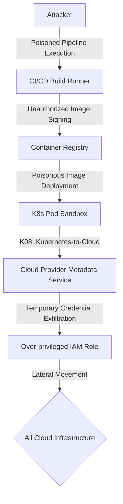

As the software development ecosystem expands and evolves from monolithic architectures to cloud-native, microservice-based, and AI-assisted patterns, threat surfaces are fragmenting at an unprecedented rate. Traditional web security controls alone are no longer sufficient to protect modern systems. The OWASP (Open Worldwide Application Security Project) Foundation, the most critical reference in the open-source application security ecosystem, designs specialized awareness projects for different technological layers to make this complex threat landscape manageable.

The **central thesis** of this article is that application security is undergoing a fundamental paradigm shift: moving away from simple input/output parameter validation to distributed identity and access control, software supply chain integrity, and the securing of autonomous Agentic AI systems and Non-Human Identities (NHI). Below is a comprehensive comparison of the ten primary OWASP projects alongside the newest frontiers representing Agentic Security and Non-Human Identities.

| Project | First Release | Latest Version | Maturity Level | Target Threat Domain |
| :--- | :--- | :--- | :--- | :--- |
| **Web Application Risks** | 2003 | 2025 (RC) | Very High (Flagship) | Browser and Server-Side General Vulnerabilities |
| **API Security** | 2019 | 2023 | High (Flagship) | Object/Function Authorization and Business Logic |
| **Mobile Security** | 2014 | 2024 | High (Flagship) | On-Device Storage, Binary and Client Protection |
| **LLM Applications** | 2023 | 2025 | High (Rapid Evolution) | Prompt Injection, Insecure Output Handling |
| **Kubernetes Security** | 2022 | 2025 | Medium (Lab) | Container Orchestration, RBAC, and Cluster Boundaries |
| **CI/CD Security Risks** | 2022 | 2022 (v1.0) | Medium (DevSecOps Ref.) | Build, Package, and Deployment Pipelines |
| **Privacy Risks** | 2014 | 2021 (v2.0) | Medium-Low (Lab) | Consent Management, PII Disclosure, and GDPR |
| **Low-code/No-code** | 2022 | 2022 | Low (Lab) | Citizen Developers and Ungoverned Integrations |
| **ML Security** | 2023 | 2023 (v0.3 Draft)| Low (Static) | Adversarial ML, Model Poisoning, and Data Leakage |
| **Serverless Risks** | 2018 | 2018 (Interpr.) | Very Low (Abandoned) | Event-driven Triggers, Over-privileged IAM Roles |

---

## OWASP Methodology, Data Analytics, and Layered Threat Modeling

The transition of OWASP from traditional list-making to modern data-driven analysis symbolizes the maturation of the application security discipline. While early lists (2003–2010) relied heavily on limited expert consensus and restricted vulnerability datasets, today's methodology is built on massive data calls, industry-wide CVE analyses, and CWE (Common Weakness Enumeration) mappings.

For instance, in the latest Web Top 10 (2025) release, the methodology is based on analyzing over 589 distinct CWE classes across more than 2.8 million applications. The "incidence rate" metric utilized in this new era prevents automated scanning tools from skewing data by repeating the same finding thousands of times. This metric evaluates the percentage of analyzed applications containing a vulnerability class at least once. Community surveys act as a balancing agent in a hybrid model, ensuring that risks with lower frequency in data but exceptionally high exploitability and impact (such as Software Supply Chain Failures or SSRF) are included in the lists.

### Layered Threat Modeling and Domain Diversity
One of the biggest mistakes security teams make is attempting to apply the Web Top 10 list as a one-size-fits-all template across the entire software ecosystem. In reality, the architectural design, trust boundaries, and threat surfaces of each technology layer are fundamentally different.

In web applications, the primary trust boundary lies between the browser and the server, and vulnerabilities typically stem from server-side code flaws. In mobile applications, however, the attacker is assumed to have full physical and administrative (root/jailbreak) control over the device. This control elevates binary protection, prevention of static encryption key disclosure, and secure client-side storage requirements to top priorities in the mobile security model. In the API world, the user interface disappears entirely, meaning attackers target backend data models and business logic directly. Because most API attacks take place within legitimate HTTP protocols and normal data flows, traditional WAF systems struggle to detect them. Consequently, API projects focus on authorization validation failures at the object and function levels.

---

## Web Application Security (OWASP Web Top 10)

### Strategic Assessment, Historical Evolution, and Critical Risk Details
Web security threats have evolved radically over the past two decades. In the early 2000s, input-filtering flaws such as Injection (SQL Injection, Cross-Site Scripting - XSS) dominated the landscape. Today, these have significantly declined due to modern application frameworks (like React, Angular, Django, Spring) providing built-in parameterized queries and automatic context-aware output encoding. Consequently, Injection fell from the #1 spot in 2017 to third in 2021, and fifth in 2025.

In contrast, the shift from monolithic codebases to microservices and Single Page Applications (SPAs) has decentralized authorization logic across distinct services. This architectural complexity has propelled Broken Access Control—which is highly contextual and difficult for automated scanners to detect—to the undisputed #1 spot in the 2021 and 2025 releases. Modern web application security is no longer just about sanitizing inputs; it centers on enforcing granular authorization boundaries and verifying software supply chain integrity (SBOMs and package signatures).

- **A01:2025 – Broken Access Control:** This occurs when the application fails to properly validate user roles and data ownership boundaries. Attackers manipulate request parameters or URLs to access data or invoke functions belonging to other users. To mitigate this, access controls must be enforced strictly on the server side using a default-deny approach.
- **A02:2025 – Security Misconfiguration:** This risk arises from leaving servers, frameworks, or cloud configurations in their insecure default states. For example, leaving unnecessary ports active or enabling debug settings leaks critical information to attackers. Organizations should define and deploy Infrastructure as Code (IaC) templates audited against security hardening baselines.
- **A03:2025 – Software Supply Chain Failures:** This involves incorporating untrusted third-party packages or libraries into build pipelines without verifying their integrity. Attackers exploit this by uploading malicious packages with typosquatted names or compromising public package repositories. Security teams must enforce Software Bill of Materials (SBOM) audits and verify cryptographic package signatures.
- **A04:2025 – Cryptographic Failures:** This occurs when sensitive data is stored or transmitted using weak encryption algorithms or cleartext protocols. Using HTTP instead of HTTPS or selecting outdated hashing algorithms (like MD5 or SHA-1) allows attackers to intercept and compromise data. Mitigation requires enforcing TLS 1.3 and utilizing modern algorithms like AES-GCM and SHA-256.
- **A05:2025 – Injection:** This happens when untrusted user input is passed directly to an interpreter (SQL, NoSQL, or OS command line) without proper validation. Attackers craft malicious inputs to execute unauthorized commands or manipulate database records. Developers must use parameterized queries (prepared statements) and apply strict input whitelist validation.
- **A06:2025 – Insecure Design:** This risk highlights the absence of security threat modeling and secure architectural design principles during the initial stages of development. Systems developed without threat modeling remain vulnerable to logical design flaws, even if the code itself is free of bugs. Implementing a Secure Software Development Lifecycle (SSDLC) with mandatory threat modeling is essential.
- **A07:2025 – Authentication Failures:** This stems from design weaknesses in session management and user authentication workflows. The lack of Multi-Factor Authentication (MFA) or weak password complexity rules enables attackers to compromise accounts via brute-force or credential stuffing attacks. Enforcing MFA, implementing rate limits on login endpoints, and using short session durations are critical.
- **A08:2025 – Software and Data Integrity Failures:** This occurs when code or data from untrusted sources is accepted and executed without verification (such as insecure deserialization). Attackers modify serialized object payloads to execute arbitrary code on the host server. Applications must cryptographically verify incoming payloads and utilize secure, built-in serialization formats.
- **A09:2025 – Security Logging and Alerting Failures:** This happens when critical security events are not recorded, or when alerts are not triggered during active compromises. The lack of logging prevents security teams from detecting ongoing breaches, significantly increasing attacker dwell time. Implementing centralized logging (SIEM) that monitors failed authentication and authorization attempts is crucial.
- **A10:2025 – Mishandling of Exceptional Conditions:** This involves applications failing open during errors or leaking detailed debugging information (like stack traces) in error messages. Attackers analyze these detailed error outputs to map out the application's underlying architecture and identify vulnerabilities. Developers must display generic error pages to users while logging details securely on backend servers.

---

## API Security (OWASP API Security Top 10)

### Strategic Assessment, Historical Evolution, and Critical Risk Details
APIs have become the backbone of modern microservice architectures, mobile apps, and cloud-native integrations. Unlike traditional web applications, APIs lack a presentation layer (HTML/CSS); instead, clients and servers exchange raw data in JSON or XML format. This architecture collapses the attack surface directly onto the underlying data models and business logic. The API Security project was launched in 2019 to address these specific threats, and updated in 2023 to reflect the evolution of the API ecosystem.

The 2023 update confirms that API vulnerabilities have shifted from technical coding issues to complex logic flaws. For example, Excessive Data Exposure and Mass Assignment were merged into a single category: Broken Object Property Level Authorization (BOPLA), because both arise from a failure to validate access to specific object properties. Traditional Web Application Firewalls (WAFs) are largely ineffective here, as attackers use legitimate HTTP protocols and valid tokens to exploit these flaws. Consequently, API security is fundamentally centered on verifying request context against object-level authorization permissions (BOLA).

- **API1:2023 – Broken Object Level Authorization (BOLA):** This occurs when API endpoints do not validate whether the logged-in user is authorized to access the requested object ID (IDOR). Attackers alter path parameters, changing `/api/users/123` to `/api/users/124` to read private records. API controllers must perform server-side checks to verify user ownership of the requested resource.
- **API2:2023 – Broken Authentication:** This involves weak configurations in authentication flows, token generation (JWTs), or API key validations. Attackers exploit unsigned or weak tokens to masquerade as legitimate users. APIs must enforce strong cryptographic token signatures (such as RS256) and implement short-lived access tokens with proper token revocation.
- **API3:2023 – Broken Object Property Level Authorization (BOPLA):** This occurs when APIs expose all object fields to the client (excessive exposure) or write incoming client JSON payloads directly to database objects (mass assignment). Attackers append administrative fields, like `isAdmin: true`, to elevate their privileges. Developers must restrict API schemas and bind inputs only to authorized properties.
- **API4:2023 – Unrestricted Resource Consumption:** This risk arises when API endpoints lack rate limiting, upload size restrictions, or resource quotas. Attackers flood the API with thousands of concurrent requests or upload massive JSON payloads to exhaust server CPU and memory (DoS). Organizations must apply client IP- or token-based rate limits on all endpoints.
- **API5:2023 – Broken Function Level Authorization (BFLA):** This happens when administrative or privileged API endpoints are accessible to regular users due to missing authorization checks. Attackers alter HTTP methods (changing GET to DELETE) or modify URL paths (changing `/user` to `/admin`) to perform privileged actions. APIs must validate user roles on every request invocation.
- **API6:2023 – Unrestricted Access to Sensitive Business Flows:** This occurs when an API runs correctly from a code perspective but is exploited by bots because it lacks rate-limiting controls on logical flows. For example, bots checking discount codes rapidly to exhaust inventory fall under this category. Mitigations include behavior analysis, bot-detection tools, and workflow-level rate limits.
- **API7:2023 – Server-Side Request Forgery (SSRF):** This happens when an API server processes a user-supplied URL to make internal or external requests without validation. Attackers input internal IP addresses to scan metadata services or access database clusters. APIs must validate user-provided URLs against strict whitelists and block requests to internal networks.
- **API8:2023 – Security Misconfiguration:** This stems from enabling weak CORS policies (`Access-Control-Allow-Origin: *`) or permitting unnecessary HTTP methods on API endpoints. These flaws allow browser-based attacks to exfiltrate sensitive API payloads. Security teams should restrict CORS configurations to trusted domains and disable unused HTTP methods.
- **API9:2023 – Improper Inventory Management:** This involves leaving undocumented test environments, legacy API versions (v1, beta), or undocumented test endpoints active and forgotten. Attackers target these old endpoints because they lack the security controls applied to current releases. APIs must be cataloged automatically (using OpenAPI specs) and legacy versions decommissioned.
- **API10:2023 – Unsafe Consumption of APIs:** This risk arises when an API implicitly trusts and processes data received from integrated third-party APIs without validation. Attackers compromise the external service to inject malicious payloads into the downstream application. All data ingested from external APIs must be treated as untrusted user input and sanitized.

---

## Mobile Application Security (OWASP Mobile Top 10)

### Strategic Assessment, Historical Evolution, and Critical Risk Details
Mobile devices (iOS and Android) utilize security models that differ fundamentally from web browsers. In mobile security, the core assumption is that **the attacker has full physical and administrative control (root/jailbreak) over the device.** Consequently, rather than relying on browser-enforced boundaries or server-side checks, mobile application security prioritizes protecting the application's binary package (APK/IPA) from local exploitation. The Mobile Top 10 was completely overhauled in 2024 to address modern patterns like hybrid frameworks, OAuth flows, and biometrics.

The most critical change in the 2024 release is that "Improper Credential Usage" (M1) has claimed the #1 spot. Developers often forget that mobile binaries can be easily decompiled and reverse-engineered. They hardcode AWS access keys, Firebase passwords, or third-party API credentials directly into the application code, allowing attackers to extract them in seconds. Furthermore, the reliance on third-party SDKs (M2: Inadequate Supply Chain Security) and the leakage of personal data into system logs or insecure on-device storage (M6: Inadequate Privacy Controls) have become major compliance risks under regulations like GDPR and CCPA.

- **M1:2024 – Improper Credential Usage:** This occurs when API keys, cryptographic tokens, or passwords are hardcoded as plain text inside the mobile application binary. Attackers decompile the APK or IPA file to extract and abuse these credentials. Developers must retrieve secrets dynamically at runtime from secure servers or store them in device-specific secure storage like iOS Keychain or Android Keystore.
- **M2:2024 – Inadequate Supply Chain Security:** This risk arises when mobile applications integrate third-party SDKs (such as advertising or analytics packages) that contain security vulnerabilities or malicious code. Attackers leverage compromised SDKs to exfiltrate user data or run arbitrary commands. Developers must audit third-party dependencies regularly and keep them updated.
- **M3:2024 – Insecure Authentication/Authorization:** This happens when authorization checks or authentication flows are executed solely on the mobile device (offline). Attackers modify the device's RAM or patch the binary code to bypass these client-side checks entirely. All sensitive operations, privilege checks, and session states must be validated online by backend servers.
- **M4:2024 – Insufficient Input/Output Validation:** This occurs when the mobile application processes external inputs (like deep links, IPC messages, or QR code scans) without validation. Attackers craft malicious deep links to redirect users to phishing sites or trigger unauthorized actions. All incoming data streams must be validated and sanitized before execution.
- **M5:2024 – Insecure Communication:** This involves transmitting data between the mobile client and the server over unencrypted channels or failing to validate SSL certificates. Without SSL/TLS pinning, attackers execute Man-in-the-Middle (MITM) attacks to intercept or modify API payloads. Applications must enforce HTTPS, reject invalid certificates, and implement SSL Pinning.
- **M6:2024 – Inadequate Privacy Controls:** This happens when mobile applications collect PII (Personally Identifiable Information) without user consent or write sensitive data to device system logs. Attackers read system logs (Logcat/Console) or access the data via other apps on compromised devices. Developers must prevent sensitive inputs from being logged and follow data minimization principles.
- **M7:2024 – Insufficient Binary Protections:** This risk arises when developers do not apply code obfuscation or fail to implement root/jailbreak detection controls. Attackers reverse-engineer the code to find vulnerabilities or produce repackaged, malicious versions of the app. Code must be obfuscated using tools like ProGuard or DexGuard, and runtime integrity checks must be implemented.
- **M8:2024 – Security Misconfiguration:** This occurs when debugging flags are left active in configuration files (AndroidManifest.xml or Info.plist) or when the application requests excessive device permissions. These misconfigurations ease reverse-engineering and expose system resources to exploitation. Debugging must be disabled prior to release, and permission requests must be minimized.
- **M9:2024 – Insecure Data Storage:** This happens when sensitive tokens, passwords, or personal data are stored unencrypted in local SQLite databases, preference files, or cache directories. Attackers extract this data if the device is lost, stolen, or compromised. Sensitive data must be encrypted and stored exclusively within secure runtime environments like iOS Keychain or Android Keystore.
- **M10:2024 – Insufficient Cryptography:** This stems from implementing weak cryptographic algorithms (such as DES, RC4, MD5) or utilizing poorly generated keys. Attackers decrypt local storage or intercepted communication by brute-forcing weak encryption. Developers must implement industry-standard cryptographic algorithms like AES-256 and manage keys securely.

---

## Large Language Model Application Security (OWASP LLM Top 10)

### Strategic Assessment, Historical Evolution, and Critical Risk Details
Integrating Large Language Models (LLMs) and Generative AI into enterprise architectures has introduced entirely new threat vectors. Unlike deterministic systems, LLMs are probabilistic, processing instructions and data through the same natural language interface. This blending of channels makes separating data from execution instructions extremely difficult. The LLM Top 10 project was created in 2023 to address these issues and updated in 2025 as AI systems evolved from static text interfaces into autonomous agents and RAG (Retrieval-Augmented Generation) patterns.

The 2025 edition highlights the critical risk of "Sensitive Information Disclosure" (LLM02), which has risen to the #2 spot. Organizations link internal databases to LLMs via RAG, but the models often fail to verify user permissions, exposing restricted department secrets in their responses. Furthermore, the autonomous execution capabilities of AI systems have introduced "Excessive Agency" (LLM06). Attackers exploit prompt injections to hijack agents and execute unauthorized actions, such as deleting database tables or sending phishing emails. LLM security now requires strict architectural guardrails, model output sanitization, and privilege boundaries around AI-driven agents.

- **LLM01: Prompt Injection:** This occurs when attackers manipulate LLM behavior by embedding malicious instructions in user queries (direct) or in external web pages and files read by the model (indirect). The model processes these inputs as system directives, bypassing safety filters. Mitigation requires input filtering, segregating system prompts from user data, and analyzing model outputs.
- **LLM02: Sensitive Information Disclosure:** This happens when an LLM exposes confidential enterprise data or training set inputs to unauthorized users through conversational outputs. RAG integrations often retrieve and display restricted documents without verifying user authorization. Organizations must apply metadata-based access controls (IAM) at the RAG retrieval layer.
- **LLM03: Supply Chain:** This risk arises from utilizing unverified base models, poisoned fine-tuning datasets, or insecure third-party plugins. Attackers compromise public repositories to distribute models containing hidden backdoors or insecure code execution blocks. Teams must source models from verified vendors, sign assets, and verify dependency packages.
- **LLM04: Data and Model Poisoning:** This occurs when training datasets or fine-tuning inputs are compromised by attackers to alter the model's core decision boundaries. This allows attackers to establish a backdoor, triggering malicious outputs when specific keywords are matched. Security teams must verify the origin of training datasets and apply anomaly detection to training inputs.
- **LLM05: Improper Output Handling:** This happens when raw LLM outputs (like SQL queries, JSON payloads, or JavaScript blocks) are executed by downstream systems or browsers without validation. The model-generated output could trigger Cross-Site Scripting (XSS) or remote command execution. All LLM outputs must be treated as untrusted user inputs and validated before execution.
- **LLM06: Excessive Agency:** This risk occurs when autonomous AI agents are granted overly broad permissions (such as write or delete access) over database tables or API integrations. Attackers hijack the agent via prompt injection to run unauthorized operations. Agent privileges must be restricted using least-privilege principles, and critical operations must require human confirmation.
- **LLM07: System Prompt Leakage:** This involves attackers exfiltrating the model's hidden system prompts, configuration rules, or alignment templates. Attackers craft system instructions queries to bypass safety filters and steal corporate IP. Mitigations include enforcing system prompt protection rules and monitoring output text patterns.
- **LLM08: Vector and Embedding Weaknesses:** This occurs when vector databases lack tenant isolation or when embedding vectors are poisoned by malicious inputs. Attackers inject poisoned vectors to distort search results or access files belonging to other database tenants. Vector databases must enforce strict metadata filtering and implement user-level authentication.
- **LLM09: Misinformation:** This risk arises when organizations rely on incorrect model responses, false statements, or hallucinations in critical workflows (such as medical or financial tasks) without verification. This leads to operational failures and liability. Critical workflows must validate LLM outputs against deterministic rules and require human-in-the-loop verification.
- **LLM10: Unbounded Consumption:** This happens when attackers flood LLMs with excessively long prompts or recursive requests to exhaust GPU/CPU resources and inflate API costs. This results in Denial of Service (DoS) or "Denial of Wallet". Mitigation requires enforcing prompt length limits, setting rate limits on token consumption, and configuring budget alerts.

---

## Machine Learning Security (OWASP ML Security Top 10)

### Strategic Assessment, Historical Evolution, and Critical Risk Details
While LLM security focuses on application-layer wrappers and text processing, Machine Learning (ML) Security targets the mathematical, statistical, and algorithmic core of models. Traditional supervised and unsupervised models (such as CNNs, SVMs, and regression models) rely on statistical data distributions. Attackers exploit this by manipulating these mathematical distributions to shift the model's decision boundaries.

The core paradigm shift in ML security is that attacks are executed via data manipulation rather than traditional code exploitation. For instance, in an autonomous vehicle's sign-recognition model, an attacker applies a small, human-imperceptible perturbation (noise) to a speed limit sign. The model misclassifies the sign as a "stop sign" due to this statistical shift (ML01). These adversarial manipulations and training data poisoning (ML02) cannot be detected by standard application security tools (SAST/DAST). Protecting ML models requires mathematical defense techniques (adversarial training), input preprocessing, and securing serialized model files.

- **ML01: Input Manipulation Attack (Evasion):** This occurs when attackers add small mathematical perturbations (noise) to input data at test time to force misclassifications. For example, modifying malware source code slightly to bypass an ML-based antivirus detection engine. Models must be hardened using adversarial training, and inputs must be preprocessed to remove noise.
  
  

- **ML02: Data Poisoning Attack:** This involves injecting malicious or mislabeled records into the training dataset to compromise the model's decision logic. Attackers use this to introduce a backdoor that triggers incorrect classifications under specific conditions. Security teams must audit training data sources and run statistical anomaly detection.
  
  

- **ML03: Model Inversion Attack:** This occurs when attackers reconstruct private training data (such as user facial photos or health records) by analyzing model predictions and confidence scores. This leads to critical data privacy breaches. Mitigation involves rounding confidence scores in model outputs and implementing differential privacy.
- **ML04: Membership Inference Attack:** This happens when attackers determine whether a specific record (e.g., a patient's medical history) was used to train the target model. If the model is overfitted to that training record, it will return an unusually high confidence score. Hardening requires preventing overfitting, using regularization, and applying differential privacy.
- **ML05: Model Theft:** This involves attackers reconstructing a local replica of the target model (surrogate model) by sending thousands of systematic queries and mapping the output boundaries. This constitutes a theft of intellectual property. Organizations should implement rate limiting on prediction APIs and monitor query patterns.
- **ML06: ML Supply Chain Attacks:** This risk stems from using insecure model serialization formats (like PyTorch Pickle or Keras H5) that permit arbitrary code execution during loading. Attackers embed malicious payloads into model files to execute code on the host server. Teams must transition to secure, data-only formats like Safetensors or ONNX.
- **ML07: Transfer Learning Attack:** This occurs when a pre-trained base model contains a hidden backdoor that persists even after the model is fine-tuned for a downstream task. The attacker exploits this backdoor to bypass classification rules. Organizations must audit pre-trained models and enforce input validation during fine-tuning.
- **ML08: Model Skewing:** This happens when models that continuously learn in production (online learning) are fed malicious feedback loops by attackers to skew their decision boundaries over time. For example, tricking a spam filter into classifying junk mail as safe. Continuous learning data streams must be audited, and manual validation checks enforced.
- **ML09: Output Integrity Attack:** This involves attackers intercepting and modifying model predictions or classifications in transit to downstream applications. This leads to incorrect decisions being implemented. To mitigate this threat, all model outputs must be encrypted (TLS) and protected using cryptographic digital signatures.
- **ML10: Model Poisoning:** This occurs when attackers gain unauthorized write access to model directories to modify weight matrices or parameters directly. This degrades performance or introduces malicious shortcuts. Organizations must apply strict IAM policies to model registries and set model files to read-only.

---

## Kubernetes Security (OWASP Kubernetes Top 10)

### Strategic Assessment, Historical Evolution, and Critical Risk Details
The rise of cloud-native architectures has established Kubernetes (K8s) as the industry standard for container orchestration. Kubernetes security extends far beyond traditional server hardening; it spans dynamic container runtimes, pod-to-pod network isolation, and cloud provider API integrations. The Kubernetes Top 10 was launched in 2022 and updated in 2025 to reflect the shifting focus of cloud-native threat actors.

The primary trend in the 2025 update is the transition from localized container misconfigurations to **"Cluster-to-Cloud Lateral Movement" (K08)**. In cloud-hosted K8s environments, pods can query the local metadata service to exfiltrate temporary cloud credentials assigned to the underlying node. Attackers exploit this to escape the container sandbox, using the stolen IAM credentials to compromise the organization's entire cloud account. Consequently, K8s security is no longer just about Role-Based Access Control (RBAC) hardening; it requires strict boundaries between the container orchestrator and the cloud provider's API.

- **K01: Insecure Workload Configurations:** This occurs when pods are run as root, in privileged mode, or sharing the host network space. Attackers exploit these settings to perform container escapes, gaining command-line control of the underlying host node. Workloads must be configured with non-root execution profiles, and privileged modes must be blocked.
- **K02: Overly Permissive Authorization Configurations:** This risk arises from configuring Role-Based Access Control (RBAC) roles with excessive permissions (e.g., allowing service accounts to read all secrets). Attackers leverage compromised service accounts to escalate privileges. Security teams must apply least-privilege principles and avoid the use of wildcard characters (`*`).
- **K03: Secrets Management Failures:** This happens when sensitive API keys, database credentials, or TLS certificates are stored unencrypted in the etcd database or mounted insecurely into pod filesystems. etcd must be encrypted at rest, secrets must be passed using secure mount paths instead of environment variables, and external vault systems should be utilized.
- **K04: Lack of Cluster Level Policy Enforcement:** This stems from the absence of automated admission controls to validate workloads before they are deployed to the cluster. Attackers exploit this to deploy insecurely configured containers. Organizations must implement Admission Controllers like Kyverno or OPA Gatekeeper to automatically reject insecure workloads.
- **K05: Missing Network Segmentation Controls:** This occurs when pod-to-pod network traffic is left open by default. If an attacker compromises a frontend pod, they can connect directly to backend database pods across the cluster. Teams must implement `NetworkPolicies` to restrict container traffic only to authorized paths.
- **K06: Overly Exposed Kubernetes Components:** This involves exposing critical control plane elements (like the API Server, Kubelet ports, or K8s Dashboard) to the public internet. Attackers exploit vulnerabilities in these exposed endpoints to compromise the cluster. Control plane components must be isolated, protected by mTLS, and accessed via VPNs.
- **K07: Misconfigured and Vulnerable Cluster Components:** This risk arises from running outdated Kubernetes versions or applying insecure settings to the API Server. Outdated components contain publicly known CVEs that allow cluster takeovers. Security teams must update cluster components regularly and run CIS Kubernetes Benchmark tests.
- **K08: Cluster-to-Cloud Lateral Movement:** This occurs when pods query the cloud metadata service (`169.254.169.254`) to steal node IAM credentials and access the broader cloud infrastructure. Attackers leverage these credentials to compromise cloud-layer services. Access to the metadata IP must be blocked, and pod-specific IAM roles (AWS IRSA) enforced.
- **K09: Broken Authentication Mechanisms:** This stems from weak management of user tokens or TLS certificates used to authenticate with the API Server. Attackers steal these credentials to masquerade as cluster administrators. Authentication must be integrated with corporate OIDC identity providers, and token durations must be kept short.
- **K10: Inadequate Logging and Monitoring:** This happens when K8s audit logs or container security events are not collected or monitored. This prevents security teams from detecting active compromises or executing post-incident forensics. All API Server audit logs and container logs must be aggregated in a centralized SIEM system.

---

## CI/CD Pipeline Security (OWASP CI/CD Security Risks)

### Strategic Assessment, Historical Evolution, and Critical Risk Details
Automating software delivery through CI/CD pipelines has accelerated release cycles, but has also turned build environments into high-value targets. CI/CD pipelines (Jenkins, GitLab CI, GitHub Actions) occupy the center of the software supply chain. While traditional security controls focus on production environments, major attacks like SolarWinds and Codecov have demonstrated that compromising the build pipeline allows attackers to compromise downstream customers. The CI/CD Security Risks project was launched in 2022 to define this threat landscape.

The primary risk in CI/CD environments is that **pipeline configurations (such as `.github/workflows/deploy.yml` or `Jenkinsfile`) are managed alongside application code in git repositories.** If an attacker gains write access to a repository or compromises a developer account, they can modify these configuration files to execute malicious code on the build runners (Poisoned Pipeline Execution - CICD-SEC-4). This execution allows the attacker to steal production deployment keys and cloud secrets stored in the runner's environment variables. Protecting CI/CD systems requires enforcing strict pull request workflows, isolating runners, and signing build outputs cryptographically.

- **CICD-SEC-1: Insufficient Flow Control Mechanisms:** This occurs when code changes can be merged directly into main branches and deployed to production without peer reviews. Attackers exploit compromised developer accounts to push malicious code directly. Organizations must enforce branch protection rules and require approval from independent developers.
- **CICD-SEC-2: Inadequate Identity and Access Management:** This risk arises when pipeline integration accounts or user accounts are configured with excessive permissions. Attackers compromise these accounts to gain write access across all repositories. Security teams must enforce Role-Based Access Control (RBAC), audit active accounts, and mandate Multi-Factor Authentication.
- **CICD-SEC-3: Dependency Chain Abuse:** This happens when developers download malicious third-party dependencies via typosquatting or dependency confusion (registering private package names on public registries). Attackers leverage these packages to execute code on runners. Mitigations include configuring private registries, using lockfiles, and scanning dependencies.
- **CICD-SEC-4: Poisoned Pipeline Execution (PPE):** This occurs when an attacker with repository write access modifies pipeline configurations to execute malicious scripts on build runners. Attackers use this to steal environment secrets and keys. Pipeline modifications must undergo strict review, and build runners must be ephemeral (wiped after each execution).
- **CICD-SEC-5: Insufficient PBAC (Pipeline-Based Access Controls):** This risk arises from a lack of isolation between different projects or build stages sharing the same runners. A compromise in a test runner can allow access to deployment secrets in a production runner. Project environments and build stages must be isolated, utilizing distinct service accounts.
- **CICD-SEC-6: Insufficient Credential Hygiene:** This happens when deployment keys, SSH keys, or API tokens are hardcoded in pipeline files or exposed in execution logs. Attackers read these logs to extract secrets. All credentials must be stored as encrypted repository secrets, and automated scanners must be used to mask sensitive patterns in build logs.
- **CICD-SEC-7: Insecure System Configuration:** This stems from failing to patch build servers (Jenkins, GitLab runners) or leaving administrative consoles exposed to the public internet. Attackers exploit known vulnerabilities in these systems to compromise runners. All CI/CD infrastructure must be updated regularly and secured against hardening baselines.
- **CICD-SEC-8: Ungoverned Usage of 3rd Party Services:** This occurs when unverified third-party tools, code analysis packages, or Slack notification bots are integrated into pipelines. Attackers compromise these external services to gain access to build environments. Organizations must establish an approval process for all third-party pipeline integrations.
- **CICD-SEC-9: Improper Artifact Integrity Validation:** This risk arises when build outputs (such as Docker images or binaries) are deployed without verifying their cryptographic signatures. Attackers compromise the container registry to swap legitimate images with compromised ones. Outputs must be signed at build time (e.g., via Cosign) and verified before deployment.
- **CICD-SEC-10: Insufficient Logging and Visibility:** This happens when CI/CD systems fail to log pipeline triggers, runner commands, or secret access. The absence of logs prevents detection of malicious runner activity and hinders forensics. All pipeline operations, runner execution commands, and user logins must be logged to a SIEM.

---

## Data Privacy Security (OWASP Privacy Risks)

### Strategic Assessment, Historical Evolution, and Critical Risk Details
Global regulations like GDPR, CCPA, and regional privacy frameworks have turned data privacy into a legal mandate. However, privacy cannot be achieved solely through legal policies; it requires engineering solutions embedded within the application architecture. The Privacy Risks project was updated in 2021 (v2.0) to address technical privacy challenges like user consent management and automated data erasure.

The primary engineering challenges in privacy security are **uncontrolled data collection and the complexity of executing user data erasure requests (the right to be forgotten).** When a user deletes their account, applications often remove the record from the main database table but fail to delete related records stored in backup servers, analytics databases, relational tables, or application logs (P6: Insufficient Deletion of User Data). Furthermore, bombarding users with consent prompts for every action creates "consent fatigue" (P4), causing users to approve terms without reading them. Designing for privacy requires enforcing data minimization, implementing automated data deletion pipelines, and adopting privacy-by-design principles.

- **P1: Web Application Vulnerabilities:** This occurs when technical flaws (like SQL Injection or authorization bypasses) allow attackers to extract databases containing personally identifiable information (PII). This results in massive data breaches and regulatory fines. Applications must undergo regular penetration testing and vulnerability mitigation.
- **P2: Operator-sided Data Leakage:** This risk arises when administrators or system engineers copy live databases containing cleartext PII to insecure test or development environments. This exposes user data to unauthorized staff. Personal data must be masked, hashed, or anonymized before being copied to non-production environments.
- **P3: Insufficient Data Breach Response:** This happens when systems fail to detect a data breach or report it to regulators and users within legal timeframes (e.g., 72 hours under GDPR). Delaying notifications increases regulatory penalties. Organizations must set up security monitoring rules and maintain a documented incident response plan.
- **P4: Consent on Everything:** This involves applications displaying consent prompts for every interaction, inducing "consent fatigue". Users accept all prompts blindly, and the legal requirement of informed consent is bypassed. Consent requests should be consolidated, clear, and displayed only when legally required.
- **P5: Non-transparent Policies:** This stems from presenting privacy policies and terms of service that are excessively long, complex, and written in legal jargon. Users remain unaware of how their data is processed. Privacy terms must be displayed in a layered, readable format, using simple language and summaries.
- **P6: Insufficient Deletion of User Data:** This occurs when an application fails to remove personal data from cache systems, relational tables, backup storage, and log files after a user deletes their account. Retaining orphaned data violates compliance rules. Erasure requests must trigger automated cleanup flows across all data storage layers.
- **P7: Insufficient Data Quality:** This risk arises from retaining outdated or incorrect personal data, leading to incorrect evaluations or actions affecting users. For example, relying on outdated address records to dispatch critical documents. Applications must provide users with self-service interfaces to view and update their data.
- **P8: Missing or Insufficient Session Expiration:** This happens when session cookies or tokens do not expire or remain active after a browser is closed. Subsequent users on shared or public computers gain unauthorized access to the previous user's private account details. Sessions must be configured with short idle timeouts and auto-logout rules.
- **P9: Inability of Users to Access and Modify Data:** This stems from lacking self-service tools for users to download their stored data (DSAR compliance) or transfer it. Managing these requests manually introduces errors and delay. Organizations should implement automated features allowing users to download their profile data in standard formats.
- **P10: Collection of Data Not Required:** This involves collecting user data that is unnecessary for the core function of the service (such as a simple calculator application requesting contact list access). This violates data minimization principles. Applications must collect only the minimum set of data fields required to run the service.

---

## Serverless Architecture Security (OWASP Serverless Top 10)

### Strategic Assessment, Historical Evolution, and Critical Risk Details
Serverless architecture delegates infrastructure management (OS patching, server scaling) to cloud providers, executing code as event-driven functions (Function-as-a-Service / FaaS). While OS security falls to the cloud provider, application-layer security, data flow validation, and configuration management remain the developer's responsibility. The Serverless Top 10 interpretation document details how security boundaries shift in these environments.

The primary security risks in serverless applications are **the variety of event sources that trigger functions and the configuration of over-privileged IAM roles.** In serverless environments, inputs arrive not only via HTTP but also through S3 bucket uploads, database updates, or IoT device events. This variety broadens injection risks to "Event Data Injection" (Risk 1). Furthermore, developers often assign broad administrator permissions to functions to simplify deployment. If an attacker compromises a function, they leverage this over-privileged IAM role to compromise the entire cloud account. Serverless security requires restricting function privileges, sanitizing event data, and implementing budget limits to counter "Denial of Wallet" risks.

- **1: Event Data Injection:** This occurs when a serverless function processes inputs from event sources (like database streams or file uploads) without validation. Attackers inject commands into file metadata or database records to execute code on the runtime container. Developers must validate event payloads against strict schemas.
- **2: Broken Authentication:** This happens when stateless functions fail to validate authentication tokens on every request. Attackers bypass gateway layers to execute function endpoints directly. Applications must implement token validations at the API Gateway layer and verify tokens inside the function code.
- **3: Insecure Serverless Deployment Configuration:** This risk arises from storing sensitive database passwords or API keys as unencrypted environment variables. Attackers with console access read these variables in plain text. Secrets must be retrieved dynamically at runtime from secure vaults (e.g., AWS Secrets Manager).
- **4: Over-privileged IAM Roles:** This involves assigning broad resource access rights to functions instead of restricting permissions. An attacker compromising a single function uses the role to read, write, or delete other cloud resources. Organizations must write granular, least-privilege IAM policies for each individual function.
- **5: Inadequate Function Monitoring and Logging:** This stems from a failure to aggregate logs from short-lived, highly distributed functions. If an attack occurs, the execution context disappears, making forensic analysis impossible. Function execution logs must be streamed in real-time to a centralized logging platform.
- **6: Shared Execution Environment Risks:** This occurs when cloud providers reuse the same container runtime (warm containers) for consecutive function invocations. Attackers read sensitive data left in memory or temporary disk space (`/tmp`) by previous executions. Functions must clean up temporary files and clear memory variables before exiting.
- **7: Denial of Wallet / Resource Abuse:** This happens when attackers exploit automatic scaling by sending thousands of requests to trigger functions recursively, inflating cloud costs. This results in service disruption or severe financial damage. Teams must set execution concurrency limits and configure cloud billing alarms.
- **8: Insecure Third-Party Dependencies:** This risk arises from loading unverified, vulnerable packages to keep function package sizes small and cold-start times low. Attackers exploit these vulnerable libraries to execute code. All dependencies must be scanned automatically during CI/CD using vulnerability detection tools.
- **9: Impersonation and Session Hijacking:** This involves attackers exfiltrating short-lived temporary security tokens (STS tokens) generated for function execution. Attackers use these stolen tokens to access cloud resources. Temporary token lifetimes must be kept short, and token exfiltration must be monitored.
- **10: Serverless Function Data Leakage:** This occurs when sensitive files written to the temporary directory (`/tmp`) are not deleted after function execution. Subsequent invocations of the function read this data. Developers must delete all files in the `/tmp` directory before the function execution cycle completes.

---

## Low-code / No-code Platform Security (OWASP Low-code / No-code Risks)

### Strategic Assessment, Historical Evolution, and Critical Risk Details
Low-code/No-code (LCNC) platforms (Microsoft PowerApps, Retool, Mendix) allow business users (citizen developers) to build applications rapidly using graphical interfaces and pre-configured connectors. While this accelerates business operations, it bypasses traditional corporate security audits, creating a massive "Shadow IT" (LCNC-SEC-09) threat surface. The LCNC Risks project was launched in 2022 to define the security risks of citizen-developed systems.

The primary risk in LCNC platforms is that **non-technical developers use pre-configured connectors to expose internal corporate databases directly to the public internet.** Lacking security training, citizen developers often deploy applications without input validation, creating SQL Injection (LCNC-SEC-06) vulnerabilities, or leave sharing permissions set to "public" (LCNC-SEC-05). Furthermore, downloading unverified templates or add-ons from platform marketplaces (LCNC-SEC-07) introduces supply chain risks. LCNC security requires enforcing Data Loss Prevention (DLP) policies at the platform layer, maintaining an inventory of all deployed applications, and raising developer security awareness.

- **LCNC-SEC-01: Account Impersonation:** This occurs when unauthorized users execute actions under the elevated privileges of the service account used to connect to the database. Attackers leverage this configuration to modify data. Integrated connectors must be configured with least-privilege roles, and user identity checks must be enforced.
- **LCNC-SEC-02: Authorization Misuse:** This risk arises from configuring flawed authorization checks in the platform's drag-and-drop designer. This allows users to access records belonging to other departments. Security teams must enforce role-based access rules and test sharing configurations before deployment.
- **LCNC-SEC-03: Data Leakage and Unexpected Consequences:** This happens when citizen developers use connectors to move corporate records to personal cloud accounts or expose them via public web forms. To mitigate this threat, organizations must enable Data Loss Prevention (DLP) rules to block unauthorized connectors.
- **LCNC-SEC-04: Authentication Failures:** This stems from using unencrypted communication or weak authentication keys when connecting LCNC applications to internal systems. Attackers intercept the traffic to steal credentials. All system connections must require Single Sign-On (SSO) and implement TLS encryption.
- **LCNC-SEC-05: Security Misconfiguration:** This occurs when applications or administrative panels are shared with "everyone" by default. Attackers access the app simply by guessing the URL. Access permissions must be set to private by default, restricting access to authorized user groups.
- **LCNC-SEC-06: Injection Handling Failures:** This happens when citizen developers fail to sanitize input fields, allowing attackers to execute SQL or command injections in backend systems. Platforms must enforce the use of built-in input filtering components and restrict raw SQL queries.
- **LCNC-SEC-07: Vulnerable and Untrusted Components:** This risk arises from installing unverified templates, widgets, or connectors from platform marketplaces. Attackers publish compromised widgets to exfiltrate data from corporate networks. Security settings must permit only certified, vendor-approved add-ons.
- **LCNC-SEC-08: Data and Secret Handling Failures:** This involves hardcoding API keys, passwords, or credentials directly into LCNC form configurations or custom scripts. Anyone editing the app can read these secrets. Credentials must be stored exclusively inside the platform's secure credential vaults.
- **LCNC-SEC-09: Asset Management Failures:** This occurs when organizations fail to track who built which LCNC applications and what resources they access. This creates a "shadow IT" environment. Platform administrators must automate asset discovery and implement application lifecycle tracking.
- **LCNC-SEC-10: Security Logging and Monitoring Failures:** This happens when user-developed application activities and data access logs are not forwarded to corporate SIEM systems. Attackers exploit this blind spot to run undetected. All LCNC platform activities and data access logs must be integrated with corporate SIEMs.

---

## Cross-Domain Comparison and Lateral Movement Scenarios

Security teams often make the mistake of auditing vulnerabilities in isolation. In reality, modern threat actors combine multiple vulnerabilities across technological boundaries to execute lateral movement. A classic example of this is an attack chain starting in a CI/CD pipeline, extending to a Kubernetes cluster, and ultimately compromising the entire cloud infrastructure.

### Integrated Comparison and Lateral Movement Analysis

In the interactive panel below, you can explore the technical comparisons of critical OWASP projects that are often confused or must be managed together due to their overlapping architectures.

<button class="comp-tab active" data-target="ssr">Web vs API vs Mobile</button>
<button class="comp-tab" data-target="csr">LLM vs ML Security</button>
<button class="comp-tab" data-target="ssg">CI/CD vs Kubernetes</button>
<button class="comp-tab" data-target="isr">Serverless vs LCNC</button>

<!-- Panel 1: SSR (Web vs API vs Mobile) -->

WEB vs API vs MOBILE
<h3 style="margin-top: 1rem;">Boundary & Authorization Differences</h3>

Web application security revolves around server-side sessions and browser-level policies (CORS, CSP). In API security, the model changes completely; sessions are replaced by stateless token-based architectures (OAuth, JWT) validated on every request. The most common API error is sending raw database objects to the client without filtering (BOPLA). Mobile security, assuming the attacker has physical control over the device, prioritizes local encryption of data on disk and protecting binary files against reverse engineering.

<!-- Panel 2: CSR (LLM vs ML Security) -->

LLM vs ML SECURITY
<h3 style="margin-top: 1rem;">Application vs Model Security</h3>

The LLM Top 10 targets the behavior of large language models at the application layer. The primary threat here is prompt injection, which occurs because the model processes data and instructions via the same channel. The ML Security project targets the statistical and mathematical structure of the model. ML attacks include data poisoning during training, extracting model weights to replicate the model, or adding noise to inputs to mislead model decisions (adversarial evasion).

<!-- Panel 3: SSG (CI/CD vs Kube) -->

CI/CD vs KUBERNETES
<h3 style="margin-top: 1rem;">SDLC vs Runtime Execution</h3>

CI/CD security spans the software assembly and packaging phases, aiming to prevent malicious code injection (Poisoned Pipeline Execution). Kubernetes security begins once those packages are executed in production. An unsigned image built insecurely during CI/CD can introduce vulnerabilities into running containers, allowing attackers to abuse cluster resources via over-privileged RBAC roles. Together, these two projects establish an unbroken chain of defense from pipeline to runtime.

<!-- Panel 4: ISR (Serverless vs LCNC) -->

SERVERLESS vs LCNC
<h3 style="margin-top: 1rem;">Distributed Infrastructure vs Citizen Dev</h3>

Serverless architecture consists of thousands of short-lived functions (FaaS) managed by the cloud provider. Vulnerabilities here typically stem from over-privileged IAM roles and sensitive data left in temporary directories. Low-code/No-code, conversely, involves "shadow" applications built by non-technical business units (citizen developers). While serverless focuses on micro-level infrastructure hardening, LCNC centers on managing database connectors and tracking digital assets to prevent data leakage.

The diagram below models a lateral movement chain starting with a CI/CD pipeline compromise (Poisoned Pipeline Execution - PPE) and culminating in the takeover of the entire cloud infrastructure.

In this attack flow, an attacker manipulates a script running inside the CI/CD pipeline (CICD-SEC-4) to gain control of the build runner. The attacker then signs and uploads a malicious container image to the registry. The Kubernetes cluster deploys this compromised image due to a lack of image verification controls (K01). 

Once running inside the cluster, the malicious container queries the cloud provider metadata service (`169.254.169.254`) to exfiltrate the temporary credentials assigned to the underlying node. If these credentials violate least-privilege principles (K08), the attacker escapes the pod boundary and uses the IAM role permissions to take over the entire cloud infrastructure.

---

## Strategic Roadmap: Maturity Models, Agentic AI, and Non-Human Identities (NHI)

Establishing a sustainable application security program requires moving beyond a static checklist to build a comprehensive corporate maturity framework. This strategic roadmap aims to guide organizations in assessing their current security posture, mitigating emerging autonomous AI threats, and securing non-human identities across cloud-native environments.

### Software Assurance Maturity: Adopting OWASP SAMM and ASVS
To effectively implement the various Top 10 lists at an enterprise level, organizations rely on two foundational OWASP governance frameworks:
- **OWASP ASVS (Application Security Verification Standard):** A blueprint defining technical security requirements that applications must meet during the design, development, and testing phases. Coding and architectural standards are structured around three ASVS verification levels (Level 1, 2, and 3) to prevent web, API, and mobile flaws.
- **OWASP SAMM (Software Assurance Maturity Model):** A governance framework designed to assess, formulate, and improve an organization's software security posture. SAMM enables security teams to evaluate maturity levels across five core business functions: Governance, Design, Implementation, Verification, and Operations.

Understanding the maturity and regulatory alignment of individual projects helps prioritize AppSec budgets:
- **Flagship Tier:** Highly mature projects backed by vast datasets (Web, API, Mobile Top 10, ASVS, and SAMM) that are referenced directly by regulatory standards like PCI DSS and ISO 27001.
- **Lab Tier:** Dynamically evolving projects (Kubernetes, LLM, and CI/CD Top 10) built on expert consensus rather than historical datasets, serving as vital guidelines for modern cloud environments.
- **Incubator/Static Tier:** Legacy projects (such as older Serverless interpretations or Privacy Risks v2.0) that have slowed down due to technological evolution; organizations should consult modern cloud-native frameworks instead.

### Agentic AI Security and Autonomous Threat Vectors
The transition from deterministic applications to autonomous Agentic AI systems renders traditional input/output controls ineffective. To address the unique threat model of autonomous systems, the new **Top 10 for Agentic Applications 2026** highlights critical risks:
1. **ASI01 – Agent Goal Hijack:** Exploiting prompt injections to override the agent's initial corporate alignment, redirecting its autonomous actions to serve the attacker's goals (such as exfiltrating data or hijacking downstream APIs).
2. **ASI02 – Tool Misuse:** The agent executing tools granted to it (such as sending emails, deleting records, or running code) with malicious or unexpected parameters due to manipulated conversational contexts.
3. **ASI06 – Memory & Context Poisoning:** Injecting malicious data into the long-term memory space of an active agent, permanently distorting its decision-making logic over time.

### Securing Non-Human Identities (NHI)
In cloud-native, distributed architectures, **Non-Human Identities (NHI)** represent the fastest-growing and least-monitored attack surface. API keys, service accounts, OAuth tokens, database connection strings, and JWTs used for machine-to-machine (M2M) communication have become prime targets for threat actors.

While human user accounts are guarded by strict Multi-Factor Authentication (MFA) and password rules, NHIs are often hardcoded in source repositories, stored insecurely in runner environments, and rarely rotated. If an attacker exfiltrates an active machine token, they can bypass the entire user authentication chain to compromise backend databases directly. Protecting NHIs is critical to preventing bypasses of even the most secure Kubernetes clusters or application codebases.

### Actionable Action Plan for Security Leaders
To manage this multi-layered threat surface, security leaders should adopt the following recommendations:
1. **Continuous SBOM Audits & Signing:** Enforce Software Bill of Materials (SBOM) tracking for all dependencies during the CI/CD phase. Cryptographically sign built images (e.g., via Cosign) and verify these signatures at the Kubernetes runtime using admission controllers.
2. **Node-to-Cloud IAM Boundaries:** Prevent containerized workloads from exfiltrating cloud metadata credentials by blocking access to the metadata IP address. Restrict cloud permissions using pod-specific IAM roles (least-privilege).
3. **Dynamic Secret Ingestion:** Avoid storing passwords, certificates, or tokens as plain text in code or configurations. Retrieve all credentials dynamically at runtime from secure secret management systems (like HashiCorp Vault or cloud secret managers).
4. **Double-Layer AI Guardrails:** Apply prompt injection filters to all incoming user queries in LLM applications. Clean and validate model outputs using deterministic rules before sending them to database tables or user browsers to prevent downstream injection attacks.

Be the architect of your data, reclaim your sovereignty. Thank you for listening!
