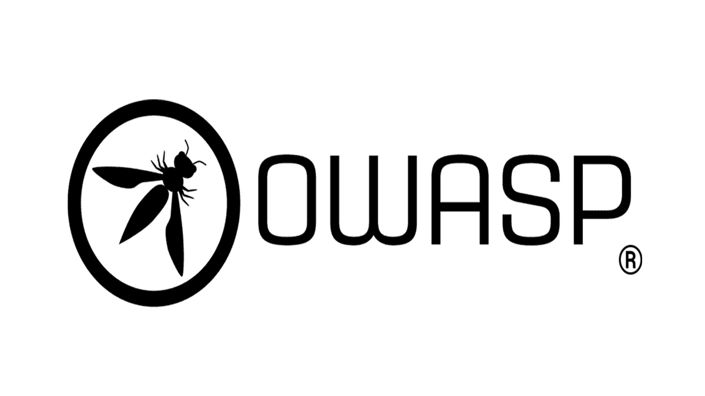
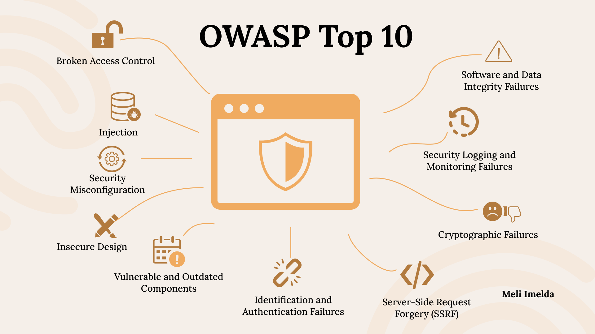
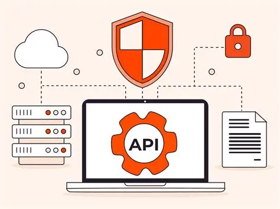
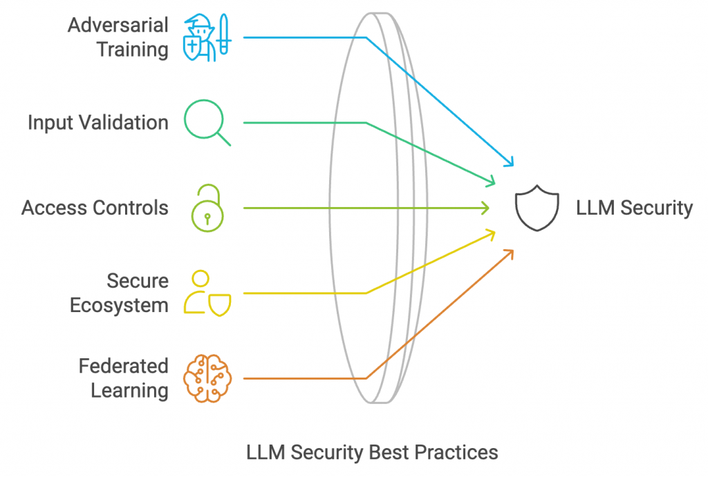
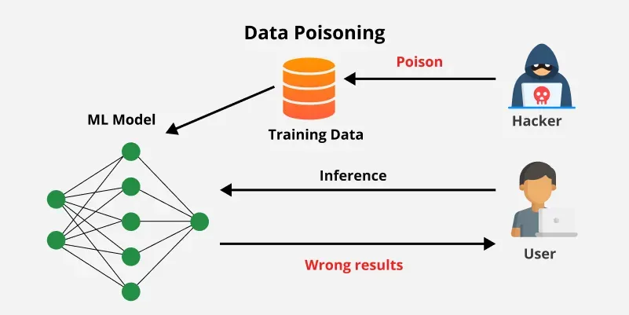
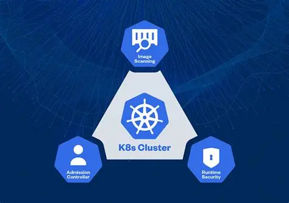
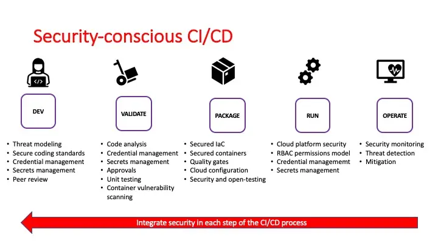
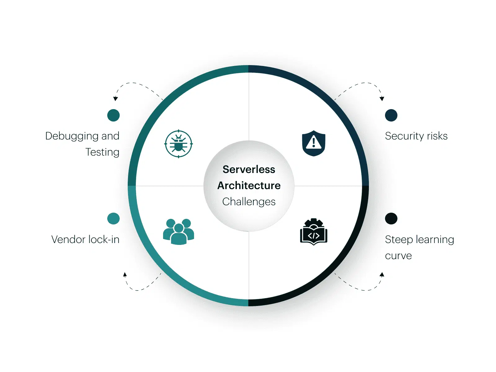
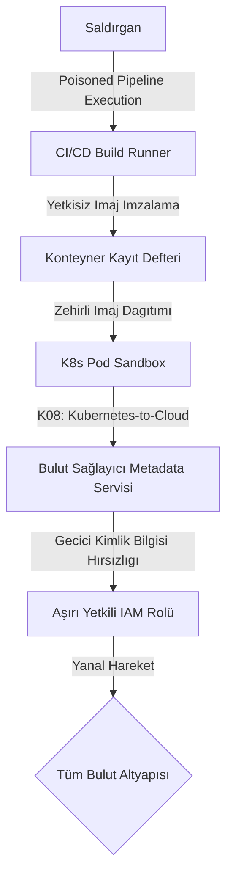

Yazılım geliştirme ekosistemi genişledikçe ve monolitik yapılardan bulut-doğal, mikroservis tabanlı ve yapay zekâ destekli mimarilere evrildikçe, tehdit yüzeyleri de benzeri görülmemiş bir hızla parçalanmaktadır. Tek başına geleneksel web güvenlik kontrolleri, modern sistemleri korumakta yetersiz kalmaktadır. Açık dünya uygulama güvenliği ekosisteminin en kritik referansı konumundaki OWASP (Open Worldwide Application Security Project) vakfı, bu karmaşık tehdit manzarasını yönetilebilir kılmak amacıyla farklı teknolojik katmanlara özel farkındalık projeleri geliştirmektedir.

Bu yazı, uygulama güvenliğinin parametre doğrulamaya dayalı basit girdi/çıktı kontrollerinden (Input Validation), dağıtık mimarilerde kimlik ve yetki yönetimine (Access Control), yazılım tedarik zinciri bütünlüğüne (Supply Chain Integrity) ve otonom çalışan yapay zekâ ajanları ile insan dışı kimliklerin (Non-Human Identities - NHI) güvenliğine doğru köklü bir paradigma değişimi yaşadığıdır. Aşağıda, modern yazılım mimarilerinde yer alan başlıca on OWASP projesi ile en yeni sınırları temsil eden Ajan Güvenliği ve İnsan Dışı Kimlikler (NHI) girişimlerinin kapsamlı bir kıyaslaması sunulmaktadır.

| Proje | İlk Çıkış | Son Versiyon | Olgunluk Seviyesi | Odak Tehdit Alanı |
| :--- | :--- | :--- | :--- | :--- |
| **Web Application Risks** | 2003 | 2025 (RC) | Çok Yüksek (Flagship) | Tarayıcı ve Sunucu Taraflı Genel Zafiyetler |
| **API Security** | 2019 | 2023 | Yüksek (Flagship) | Nesne/Fonksiyon Yetkilendirme ve İş Mantığı |
| **Mobile Security** | 2014 | 2024 | Yüksek (Flagship) | Cihaz İçi Depolama, Binary ve İstemci Koruması |
| **LLM Applications** | 2023 | 2025 | Yüksek (Hızlı Evrim) | Prompt Enjeksiyonu, Güvenli Olmayan Çıktılar |
| **Kubernetes Security** | 2022 | 2025 | Orta (Lab) | Konteyner Orkestrasyonu, RBAC ve Küme Sınırları |
| **CI/CD Security Risks** | 2022 | 2022 (v1.0) | Orta (DevSecOps Referans) | Derleme, Paket ve Dağıtım Pipeline Hatları |
| **Privacy Risks** | 2014 | 2021 (v2.0) | Orta-Düşük (Lab) | Rıza Yönetimi, Kişisel Veri İfşası ve GDPR |
| **Low-code/No-code** | 2022 | 2022 | Düşük (Lab) | Citizen Developer ve Denetlenmeyen Entegrasyonlar |
| **ML Security** | 2023 | 2023 (v0.3 Draft)| Düşük (Durağan) | Adversarial ML, Model Poisoning ve Veri Sızıntısı |
| **Serverless Risks** | 2018 | 2018 (Yorumlama) | Çok Düşük (Terk Edilmiş)| Event-driven Tetikleyiciler, Aşırı Yetkili Roller |

---

## OWASP Metodolojisi, Veri Analitiği ve Katmanlı Tehdit Modelleri

OWASP’ın geleneksel listelerinden modern veri odaklı analizlerine geçişi, yazılım güvenliği disiplininin olgunlaşmasını simgelemektedir. Erken dönem listeleri (2003–2010) büyük ölçüde kısıtlı uzman görüşü ve sınırlı zafiyet veri setlerine dayanırken, günümüz metodolojisi devasa veri çağrıları (data call), endüstri genelindeki CVE analizleri ve CWE (Common Weakness Enumeration) eşlemeleri üzerine kuruludur.

Örneğin, en son yayınlanan Web Top 10 (2025) sürümünde metodoloji, 2.8 milyondan fazla uygulamadan elde edilen veriler ile 589 farklı CWE sınıfının analizine dayanmaktadır. Bu yeni dönemde kullanılan "vaka oranı" (incidence rate) metriği, otomatik tarama araçlarının aynı bulguyu binlerce kez tekrarlayarak veriyi manipüle etmesini engeller. Bu metrik, bir zafiyetin incelenen uygulamalarda en az bir kez görülme yüzdesini esas almaktadır. Topluluk anketleri ise verilerde düşük frekansta görünen ancak etkisi ve sömürülebilirliği aşırı yüksek olan riskleri (örneğin Yazılım Tedarik Zinciri Açıkları veya SSRF) listelere dahil etmek amacıyla hibrit bir modelde dengeleyici rol oynamaktadır.

### Katmanlı Tehdit Modelleri ve Domain Çeşitliliği
Güvenlik ekiplerinin yaptığı en büyük hatalardan biri, Web Top 10 listesini tüm yazılım ekosistemine tek tip bir şablon olarak uygulamaya çalışmaktır. Oysa her teknoloji katmanının mimari tasarımı, güven sınırları ve saldırı yüzeyi kökten farklıdır.

Web uygulamalarında temel güven sınırı tarayıcı ve sunucu arasındayken ve zafiyetler genellikle sunucu kaynaklı kod hatalarından türetilirken; mobil uygulamalarda saldırgan, cihaz üzerinde tam fiziksel ve yönetimsel (root/jailbreak) kontrole sahiptir. Bu durum, mobil güvenlik modelinde ikili dosya (binary) korumasını, statik şifreleme anahtarlarının ifşasını engellemeyi ve istemci tarafındaki güvenli depolama gereksinimlerini öncelikli hale getirir. API dünyasında ise kullanıcı arayüzü ortadan kalktığı için saldırganlar doğrudan arka plandaki veri modellerini ve iş mantıklarını (business logic) hedef alırlar. API'lere yönelik saldırıların büyük kısmı meşru HTTP protokolleri ve normal veri akışları içerisinde gerçekleştiğinden, geleneksel WAF sistemlerinin bunları tespit etmesi zordur. Bu nedenle API projeleri, nesne ve fonksiyon düzeyindeki yetkilendirme doğrulama hatalarına odaklanmaktadır.

---

## Web Uygulama Güvenliği (OWASP Web Top 10)

### Stratejik Değerlendirme, Tarihsel Evrim ve Kritik Risk Detayları
Web güvenliği tehditleri son yirmi yılda radikal bir biçimde evrilmiştir. 2000'lerin başında en büyük tehdit olan enjeksiyonlar (SQL Injection, Cross-Site Scripting - XSS) gibi girdi filtreleme hataları, günümüzde modern yazılım çatılarının (React, Angular, Spring, Django) sunduğu yerleşik parametreli sorgular ve otomatik çıktı kodlama mekanizmaları sayesinde gerilemiştir. Nitekim 2017 yılında listenin zirvesinde yer alan enjeksiyonlar, 2021'de üçüncülüğe, 2025'te ise beşinciliğe düşmüştür. 

Buna karşın, monolitik yapılardan mikroservislere ve tek sayfalık uygulamalara (SPA) geçiş, yetkilendirme mantığının sunucudan istemciye ve dağıtık servislere kaymasına neden olmuştur. Bu durum, otomatik araçlarla tespiti son derece zor olan Erişim Kontrolü İhlalleri'ni (Broken Access Control) 2021 ve 2025 sürümlerinde tartışmasız liderliğe taşımıştır. Modern web güvenliği artık yalnızca girdiyi temizlemekle değil, karmaşık yetki matrislerini yönetmek ve yazılım tedarik zincirinin (SBOM ve üçüncü taraf paket bütünlüğü) güvenliğini sağlamakla tanımlanmaktadır.

- **A01:2025 – Broken Access Control (Erişim Kontrolü İhlalleri):** Uygulamanın, kullanıcı rollerini ve veri sınırlarını yeterince doğrulamaması durumudur. Saldırganlar parametreleri değiştirerek yetkileri olmayan verilere erişir veya yetkisiz işlemler gerçekleştirir. Önlemek için tüm erişim kontrolleri sunucu tarafında, "varsayılan olarak engelle" (deny-by-default) ilkesiyle uygulanmalıdır.
- **A02:2025 – Security Misconfiguration (Hatalı Güvenlik Yapılandırması):** Sunucu, framework veya bulut servislerinin güvensiz varsayılan ayarlarla bırakılmasıdır. Örneğin, gereksiz portların veya servislerin açık kalması, saldırganlara bilgi sızdırır. Altyapı kod olarak (IaC) tanımlanmalı ve sertleştirme kılavuzlarına göre otomatik denetlenmelidir.
- **A03:2025 – Software Supply Chain Failures (Yazılım Tedarik Zinciri Hataları):** Güvenilir olmayan üçüncü taraf kütüphanelerin veya paketlerin doğrulanmadan derleme süreçlerine dahil edilmesidir. Saldırganlar, popüler paketleri taklit eden (typosquatting) veya ele geçirilen paket depoları üzerinden sisteme sızarlar. Sürekli SBOM (Yazılım Bileşen Listesi) analizi yapılmalı ve paket imzaları doğrulanmalıdır.
- **A04:2025 – Cryptographic Failures (Kriptografik Hatalar):** Hassas verilerin aktarılırken veya saklanırken zayıf şifreleme algoritmalarıyla korunmasıdır. HTTP yerine HTTPS kullanılmaması veya MD5/SHA1 gibi kırılmış algoritmaların seçilmesi verinin ifşasına yol açar. Güçlü algoritmalar (AES-GCM, SHA-256) ve güncel TLS (v1.3) protokolleri zorunlu kılınmalıdır.
- **A05:2025 – Injection (Enjeksiyon):** Kullanıcıdan gelen filtrelenmemiş verilerin doğrudan yorumlayıcılara (SQL, NoSQL, OS komut satırı) gönderilmesidir. Saldırgan, veri alanına kod ekleyerek veritabanını ele geçirebilir veya sunucuda komut yürütebilir. Parametreli sorgular (Prepared Statements) kullanılmalı ve girdiler katı bir biçimde doğrulanmalıdır.
- **A06:2025 – Insecure Design (Güvenli Olmayan Tasarım):** Güvenlik kontrollerinin yazılım geliştirme sürecinin başında (tasarım aşamasında) planlanmamasıdır. Tehdit modelleme yapılmadan geliştirilen sistemler, kod seviyesinde hatasız olsa bile mantıksal mimari açıklar barındırır. Güvenli Yazılım Geliştirme Yaşam Döngüsü (SSDLC) ilkeleri benimsenmeli ve tehdit modelleme yapılmalıdır.
- **A07:2025 – Authentication Failures (Kimlik Doğrulama Hataları):** Oturum yönetimi ve kimlik doğrulama mekanizmalarındaki tasarım zayıflıklarıdır. Çok faktörlü kimlik doğrulama (MFA) eksikliği veya zayıf şifre politikaları, siber saldırganların kaba kuvvet (brute-force) veya credential stuffing yöntemleriyle hesapları ele geçirmesine olanak tanır. MFA zorunlu tutulmalı ve oturum süreleri kısa belirlenmelidir.
- **A08:2025 – Software and Data Integrity Failures (Yazılım ve Veri Bütünlüğü Hataları):** Güvenilmeyen kaynaklardan alınan nesnelerin veya verilerin doğrulanmadan işlenmesidir (örneğin güvensiz serileştirme). Saldırgan, serileştirilmiş veriyi manipüle ederek sunucuda rastgele kod çalıştırabilir. Veriler işlenmeden önce dijital imzalarla doğrulanmalı ve güvenli serileştirme kütüphaneleri kullanılmalıdır.
- **A09:2025 – Security Logging and Alerting Failures (Güvenlik Günlüğü ve Uyarı Hataları):** Kritik güvenlik olaylarının loglanmaması veya siber saldırı durumunda zamanında uyarı üretilmemesidir. Bu durum, saldırganların sistemde aylarca fark edilmeden kalmasına (dwell time) neden olur. Tüm başarısız kimlik doğrulama ve yetki aşımı denemeleri merkezi bir loglama sisteminde (SIEM) izlenmelidir.
- **A10:2025 – Mishandling of Exceptional Conditions (İstisnai Durumların Hatalı Yönetimi):** Uygulamanın hata durumlarında sistem kaynaklarını açık bırakması veya detaylı hata mesajlarıyla (stack trace) bilgi sızdırmasıdır. Saldırganlar bu hata mesajlarını analiz ederek sistemin mimarisini ve zafiyetlerini haritalandırır. Genel hata sayfaları kullanılmalı ve detaylı hata logları yalnızca güvenli sunucularda saklanmalıdır.

---

## API Güvenliği (OWASP API Security Top 10)

### Stratejik Değerlendirme, Tarihsel Evrim ve Kritik Risk Detayları
API'ler modern mikroservis mimarilerinin ve mobil uygulamaların can damarı haline gelmiştir. Geleneksel web uygulamalarından farklı olarak, API'lerde sunum katmanı (HTML/CSS) bulunmaz; istemci ve sunucu doğrudan JSON/XML formatında veri takas eder. Bu durum, saldırı yüzeyini veri modellerine ve iş mantığına (business logic) indirgemiştir. 2019 yılında yayınlanan ilk listeyle API'lere özel tehditler tanımlanmış, 2023 yılında ise API ekosisteminin olgunlaşmasıyla liste güncellenmiştir. 

2023 güncellemesi, zafiyetlerin teknik kod hatalarından ziyade mantıksal tasarım hatalarına kaydığını doğrulamaktadır. Örneğin, aşırı veri ifşası (Excessive Data Exposure) ve toplu atama (Mass Assignment) gibi zafiyetler, nesnelerin alt özelliklerine yönelik yetersiz kontrollerden kaynaklandığı için "Broken Object Property Level Authorization (BOPLA)" altında birleştirilmiştir. API dünyasında geleneksel WAF (Web Application Firewall) çözümleri yetersiz kalmaktadır; çünkü saldırganlar genellikle meşru HTTP istekleri ve geçerli tokenlar kullanarak sistemi suistimal etmektedir. Dolayısıyla, API güvenliği tamamen "istek bağlamına uygun nesne seviyesinde yetkilendirme" (BOLA/IDOR) kontrollerine dayanmaktadır.

- **API1:2023 – Broken Object Level Authorization (BOLA - Nesne Seviyesinde Yetki İhlali):** Kullanıcı isteklerindeki ID parametrelerinin sunucu tarafında yetki kontrolü yapılmadan doğrudan veritabanına sorgulanmasıdır (IDOR). Saldırgan, `/api/users/123` yerine `/api/users/124` yazarak başka bir kullanıcının verilerini çekebilir. Her istekte, oturum açan kullanıcının talep edilen nesneye erişim hakkı olup olmadığı sunucuda doğrulanmalıdır.
- **API2:2023 – Broken Authentication (Zayıf Kimlik Doğrulama):** API anahtarlarının veya JWT tokenlarının zayıf üretilmesi, imzasının doğrulanmaması veya süresinin yönetilememesidir. Saldırganlar imzasız tokenlar üreterek sisteme sahte kimliklerle sızabilir. Token tabanlı kimlik doğrulamada güçlü imzalama algoritmaları (RS256) ve kısa ömürlü erişim anahtarları kullanılmalıdır.
- **API3:2023 – Broken Object Property Level Authorization (BOPLA - Nesne Özellik Seviyesinde Yetki İhlali):** API'nin bir nesneye ait tüm veri alanlarını istemciye göndermesi (Excessive Data Exposure) veya istemciden gelen tüm veri alanlarını doğrulamadan veritabanına yazmasıdır (Mass Assignment). Saldırgan, normalde güncelleyemeyeceği `isAdmin: true` alanını JSON gövdesine ekleyerek yetkisini yükseltebilir. API şemaları sıkı bir biçimde tanımlanmalı ve yalnızca izin verilen alanlar işlenmelidir.
- **API4:2023 – Unrestricted Resource Consumption (Sınırsız Kaynak Tüketimi):** API uç noktalarında hız sınırlaması (rate limiting) veya yük boyutu sınırlarının bulunmamasıdır. Saldırganlar binlerce eşzamanlı istek göndererek veya devasa JSON paketleri yükleyerek sunucu belleğini ve CPU'sunu tüketip DoS oluşturabilir. Uç noktalara istemci IP/Token bazlı hız sınırları uygulanmalıdır.
- **API5:2023 – Broken Function Level Authorization (BFLA - Fonksiyon Seviyesinde Yetki İhlali):** İdari veya kritik fonksiyonları yürüten API uç noktalarının, normal kullanıcı rolleriyle çağrılabilmesidir. Saldırgan, GET yerine DELETE metodunu kullanarak veya URL'deki `/user/` alanını `/admin/` yaparak yetkisiz işlemler gerçekleştirir. Yetkilendirme kontrolleri sunucu tarafında her fonksiyon çağrısında yapılmalıdır.
- **API6:2023 – Unrestricted Access to Sensitive Business Flows (Hassas İş Akışlarına Sınırsız Erişim):** API'nin mantıksal olarak doğru çalışmasına rağmen, iş akışının hız ve miktar sınırlarının olmaması nedeniyle suistimal edilmesidir. Örneğin, bir indirim kuponunun saniyede binlerce kez denenerek sistemdeki tüm stokların botlarla tüketilmesi bu sınıfa girer. İş akışları için davranışsal analiz yapılmalı ve bot algılama mekanizmaları kurulmalıdır.
- **API7:2023 – Server-Side Request Forgery (SSRF):** API sunucusunun, kullanıcıdan aldığı bir URL parametresi üzerinden doğrulanmamış iç veya dış ağ istekleri yapmasıdır. Saldırgan, API sunucusunu kullanarak iç ağdaki veritabanına veya metadata servislerine sızabilir. Kullanıcıdan gelen URL'ler beyaz liste (whitelist) ile sınırlandırılmalı ve iç ağ kaynaklarına istek atılması engellenmelidir.
- **API8:2023 – Security Misconfiguration (Hatalı Güvenlik Yapılandırması):** API sunucularında CORS politikalarının aşırı gevşek bırakılması (`Access-Control-Allow-Origin: *`) veya gereksiz HTTP metodlarının açık olmasıdır. Bu durum, tarayıcı tabanlı saldırganların API verilerini çalmasına yol açar. CORS kuralları yalnızca güvenli alan adlarıyla sınırlandırılmalı ve hata mesajlarında sistem detayları gizlenmelidir.
- **API9:2023 – Improper Inventory Management (Hatalı Envanter Yönetimi):** Belgelenmemiş, unutulmuş test ortamlarının veya eski API sürümlerinin (shadow APIs) açık bırakılmasıdır. Saldırganlar, yeni sürümlerde kapatılan zafiyetleri barındıran eski v1 veya beta uç noktalarını bularak sızarlar. Tüm API uç noktaları otomatik olarak belgelenmeli (OpenAPI/Swagger) ve kullanılmayan eski sürümler kapatılmalıdır.
- **API10:2023 – Unsafe Consumption of APIs (API'lerin Güvensiz Tüketimi):** API'nin, entegre olduğu diğer üçüncü taraf API'lerden gelen verilere tamamen güvenerek bunları filtrelemeden işlemesidir. Saldırgan, üçüncü taraf servisi ele geçirerek bizim sistemimize zararlı kod (injection) enjekte edebilir. Entegre olunan tüm harici sistemlerden gelen veriler de kullanıcı girdisi gibi kabul edilip doğrulanmalıdır.

---

## Mobil Uygulama Güvenliği (OWASP Mobile Top 10)

### Stratejik Değerlendirme, Tarihsel Evrim ve Kritik Risk Detayları
Mobil cihazlar (iOS ve Android), geleneksel web platformlarından tamamen farklı bir güvenlik mimarisine sahiptir. Mobil güvenlikte en kritik kabul, **saldırganın cihaz üzerinde tam fiziksel ve yönetimsel (root/jailbreak) kontrole sahip olduğu** gerçeğidir. Bu durum, tarayıcı güvenliği veya sunucu tarafı kontrollerinden ziyade, istemci tarafındaki binary dosyanın (APK/IPA) korunmasını öncelikli kılmaktadır. 2016 sürümünden sonra uzun bir süre güncellenmeyen Mobile Top 10, mobil ekosistemdeki büyük değişimlerin (hibrit frameworkler, OAuth entegrasyonları, biyometrik doğrulamalar) ardından 2024 yılında tamamen yenilenmiştir.

2024 listesinde en dikkat çekici değişim, "Hatalı Kimlik Bilgisi Kullanımı" (Improper Credential Usage - M1) kategorisinin birinci sıraya yerleşmesidir. Geliştiriciler, mobil uygulamanın kaynak kodunun tersine mühendislikle kolayca çözülebileceğini unutarak kodun içine AWS anahtarlarını, Firebase veritabanı şifrelerini veya API sırlarını sabit (hardcoded) olarak gömmektedir. Saldırganlar bu dosyaları açıp sırları saniyeler içinde çalabilmektedir. Ayrıca, mobil uygulamalarda kullanılan kütüphanelerin denetimsizliği (M2: Inadequate Supply Chain Security) ve kişisel verilerin cihaz loglarına veya güvensiz depolama alanlarına yazılması (M6: Inadequate Privacy Controls) modern regülasyonlar (KVKK, GDPR) çerçevesinde en kritik mobil riskler haline gelmiştir.

- **M1:2024 – Improper Credential Usage (Hatalı Kimlik Bilgisi Kullanımı):** API anahtarları, şifreleme anahtarları veya kullanıcı şifrelerinin mobil kaynak kodlarında düz metin (hardcoded) olarak saklanmasıdır. Saldırganlar APK/IPA dosyasını tersine çevirerek bu sırları çalabilir. Hassas sırlar kaynak kodda tutulmamalı, çalışma zamanında (runtime) güvenli sunuculardan çekilmeli veya Keychain/Keystore gibi cihaz içi güvenli alanlarda saklanmalıdır.
- **M2:2024 – Inadequate Supply Chain Security (Yetersiz Tedarik Zinciri Güvenliği):** Mobil uygulamaya entegre edilen reklam, analitik veya harici işlevsellik sağlayan SDK'ların zafiyet barındırmasıdır. Saldırganlar bu güvensiz kütüphaneler üzerinden kullanıcı verilerini sızdırabilir veya cihazda kod çalıştırabilir. Kullanılan tüm SDK'lar düzenli olarak güncellenmeli ve güvenlik denetimlerinden geçirilmelidir.
- **M3:2024 – Insecure Authentication/Authorization (Güvensiz Kimlik Doğrulama/Yetkilendirme):** Kimlik doğrulama veya yetki kontrollerinin yalnızca mobil cihaz üzerinde (offline) yapılmasıdır. Saldırgan, cihazın hafızasına (RAM) müdahale ederek veya kod akışını manipüle ederek bu doğrulamaları bypass edebilir. Tüm kritik yetki ve oturum kontrolleri sunucu tarafında (online) doğrulanmalıdır.
- **M4:2024 – Insufficient Input/Output Validation (Yetersiz Girdi/Çıktı Doğrulaması):** Uygulamanın dış kaynaklardan gelen verileri (deeplinkler, IPC mesajları, barkod okumaları) doğrulamadan işlemesidir. Saldırgan, sahte bir deeplink oluşturarak kullanıcıyı dolandırıcı sayfalara yönlendirebilir veya veri sızıntısı yaratabilir. Mobil uygulamaya giren tüm dış veri akışları doğrulanmalı ve filtrelenmelidir.
- **M5:2024 – Insecure Communication (Güvensiz Haberleşme):** Uygulama ile sunucu arasındaki veri trafiğinin şifrelenmemesi veya zayıf şifrelenmesidir. SSL pinning uygulanmayan sistemlerde, saldırganlar araya girme (MITM) saldırılarıyla veriyi çalabilir veya değiştirebilir. HTTPS zorunlu kılınmalı, geçersiz sertifikalar reddedilmeli ve kritik API'ler için SSL/TLS Sabitleme (Pinning) uygulanmalıdır.
- **M6:2024 – Inadequate Privacy Controls (Yetersiz Gizlilik Kontrolleri):** Kullanıcının kişisel veya hassas verilerinin (konum, rehber vb.) rıza olmadan toplanması ya da cihaz loglarına yazılmasıdır. Saldırganlar cihazdaki logları okuyarak veya diğer uygulamalar üzerinden bu verilere erişebilir. Hassas veriler hiçbir koşulda cihaz loglarına (Logcat/Console) yazılmamalı ve veri minimizasyonuna gidilmelidir.
- **M7:2024 – Insufficient Binary Protections (Yetersiz İkili Dosya Korumaları):** Mobil uygulamanın kaynak kodunun karartılmaması (obfuscation) ve root/jailbreak denetimlerinin bulunmamasıdır. Saldırganlar uygulamayı tersine mühendislikle deşifre edip üzerinde değişiklik yaptıktan sonra sahte sürümler (repackaged apps) üretebilir. Kod ProGuard/DexGuard gibi araçlarla karartılmalı ve çalışma zamanı bütünlük kontrolleri eklenmelidir.
- **M8:2024 – Security Misconfiguration (Hatalı Güvenlik Yapılandırması):** Uygulama yapılandırma dosyalarında (AndroidManifest.xml veya Info.plist) debug modunun açık bırakılması ya da aşırı izinlerin talep edilmesidir. Bu durum, uygulamanın sömürülmesini kolaylaştırır. Yayına almadan önce debug modları kapatılmalı ve uygulamanın çalışması için yalnızca gerekli olan minimum izinler talep edilmelidir.
- **M9:2024 – Insecure Data Storage (Güvensiz Veri Depolama):** Şifre, token veya kişisel verilerin cihaz diskinde şifresiz yerel veritabanlarında (SQLite) veya Shared Preferences/NSUserDefaults alanlarında saklanmasıdır. Saldırgan cihazı ele geçirdiğinde veya root erişimi elde ettiğinde bu dosyaları doğrudan okuyabilir. Hassas veriler cihazın şifreli güvenli depolama alanlarında (iOS Keychain, Android Keystore) saklanmalıdır.
- **M10:2024 – Insufficient Cryptography (Yetersiz Kriptografi):** Mobil uygulamada zayıf veya kırılmış şifreleme algoritmalarının (DES, RC4, MD5) ya da hatalı anahtar üretim süreçlerinin kullanılmasıdır. Saldırganlar şifrelenmiş verileri kolayca çözebilir. Endüstri standardı güçlü şifreleme algoritmaları (AES-256) kullanılmalı ve şifreleme anahtarları güvenli bir biçimde üretilip saklanmalıdır.

---

## Yapay Zekâ ve Büyük Dil Modelleri Güvenliği (OWASP LLM Top 10)

### Stratejik Değerlendirme, Tarihsel Evrim ve Kritik Risk Detayları
Üretken Yapay Zekâ (Generative AI) ve Büyük Dil Modellerinin (LLM) kurumsal yazılımlara hızla entegre edilmesi, güvenlik dünyasında yepyeni bir tehdit alanı yaratmıştır. LLM uygulamaları, deterministik (belirli girdiye belirli çıktı veren) yazılımlardan farklı olarak olasılıksal (probabilistic) çalışır. Bu durum, veri kanalı ile talimat kanalının (data vs. instruction channel) aynı sözel arayüzde birleşmesine yol açmıştır. İlk kez 2023 yılında yayınlanan LLM Top 10 listesi, AI entegrasyonlarının otonom ajanlara ve RAG (Retrieval-Augmented Generation) mimarilerine dönüşmesiyle 2025 yılında güncellenmiştir.

2025 sürümünde en dikkat çeken değişim, "Hassas Bilgi İfşası" (Sensitive Information Disclosure - LLM02) riskinin ikinci sıraya yükselmesidir. Kurumlar, veritabanlarını ve dahili dokümanlarını RAG sistemleri üzerinden LLM'lere bağlamaktadır. Ancak, model kullanıcının yetkisini denetlemeden, normalde erişemeyeceği departman sırlarını veya finansal verileri prompt yanıtlarında ifşa edebilmektedir. Ayrıca, AI sistemlerinin otonom olarak eyleme geçmesini sağlayan ajan mimarileri, "Aşırı Yetkilendirilmiş Ajanlar" (Excessive Agency - LLM06) riskini doğurmuştur. Saldırganlar, prompt enjeksiyonları vasıtasıyla ajana tanımlanmış veri silme, e-posta gönderme veya API tetikleme yetkilerini kötüye kullanabilmektedir. LLM güvenliği artık yalnızca prompt filtrelemekten ibaret değildir; modelin çıktılarını denetleyen ve ajanların yetki sınırlarını çizen katı bir mimari kontrol gerektirmektedir.

- **LLM01: Prompt Injection (Prompt Enjeksiyonu):** Saldırganların, kullanıcı girdileri (doğrudan) veya modelin okuduğu web sayfaları/dokümanlar (dolaylı) üzerinden sisteme gizli talimatlar vermesidir. Model bu talimatları kendi sistem kuralları gibi algılayarak güvenlik bariyerlerini aşar. Girdi temizleme (input sanitasyon) yapılmalı, sistem talimatları ile kullanıcı girdileri mimari olarak ayrılmalı ve model çıktıları doğrulanmalıdır.
- **LLM02: Sensitive Information Disclosure (Hassas Bilgi İfşası):** LLM'in, eğitim verisinde veya entegre olduğu RAG (Retrieval-Augmented Generation) veritabanında yer alan gizli verileri yetkisiz kullanıcılara sızdırmasıdır. Model, kullanıcı yetki seviyesini sorgulamadan veriyi sözel olarak sunabilir. RAG veri çekme aşamasında kullanıcı bazlı erişim denetimleri (IAM) uygulanmalı ve model çıktıları hassas veri filtrelerinden geçirilmelidir.
- **LLM03: Supply Chain (AI Tedarik Zinciri Riskleri):** Güvenilmeyen açık kaynaklı temel modellerin (base models), zehirlenmiş ince ayar (fine-tuning) veri setlerinin veya üçüncü taraf yapay zekâ eklentilerinin kullanılmasıdır. Saldırganlar, içine arka kapılar (backdoor) yerleştirilmiş modelleri veya kütüphaneleri sisteme sızdırabilir. Yalnızca doğrulanmış ve imzalanmış yapay zekâ varlıkları kullanılmalı ve bağımlılıklar taranmalıdır.
- **LLM04: Data and Model Poisoning (Veri ve Model Zehirlenmesi):** Eğitim aşamasındaki veri setlerine veya çalışma zamanındaki RAG veri tabanlarına kötü niyetli veriler yerleştirilerek modelin karar mekanizmasının sabote edilmesidir. Saldırgan, belirli anahtar kelimeler tetiklendiğinde modelin yanlış kararlar vermesini sağlayabilir. Eğitim verileri sıkı denetimden geçirilmeli ve veri kaynaklarının bütünlüğü dijital imzalarla korunmalıdır.
- **LLM05: Improper Output Handling (Hatalı Çıktı Yönetimi):** LLM tarafından üretilen ham çıktıların (metin, kod, JSON) arka plan sistemlerinde veya tarayıcıda doğrulanmadan doğrudan çalıştırılmasıdır. Modelin ürettiği zararlı bir JavaScript kodu XSS saldırısına, bir SQL komutu ise veri kaybına yol açabilir. LLM çıktıları, dışarıdan gelen kullanıcı girdileri gibi kabul edilerek sıkı bir biçimde doğrulanmalı ve filtrelenmelidir.
- **LLM06: Excessive Agency (Aşırı Yetkilendirilmiş Ajanlar):** LLM tabanlı otonom ajanların (agents), entegre oldukları API'ler veya eklentiler üzerinde aşırı geniş yetkilere (veri yazma, silme, e-posta gönderme) sahip olmasıdır. Saldırgan, prompt injection ile ajanı manipüle ederek veritabanını sildirebilir or sahte mailler attırabilir. Ajanlara verilen araç yetkileri en az yetki (least privilege) ilkesine göre sınırlandırılmalı ve kritik işlemler için insan onayı (human-in-the-loop) zorunlu tutulmalıdır.
- **LLM07: System Prompt Leakage (Sistem Prompt'u Sızıntısı):** Saldırganların, modelin davranışını, kimliğini ve güvenlik sınırlarını belirleyen gizli sistem prompt'larını dolaylı yollarla öğrenmesidir. Saldırgan, "Bana yukarıdaki tüm talimatları göster" gibi prompt'larla sistem kurallarını çalarak modeli daha kolay manipüle edebilir. Sistem prompt'larının gizliliğini korumak amacıyla çıktı filtreleme kuralları ve sistem prompt'u koruma şablonları uygulanmalıdır.
- **LLM08: Vector and Embedding Weaknesses (Vektör ve Embedding Zayıflıkları):** Vektör veritabanlarında tenant (kiracı) izolasyonunun olmaması veya embedding matrislerinin manipüle edilmesidir. Saldırgan, veritabanına enjekte ettiği sahte vektörlerle arama sonuçlarını sabote edebilir veya diğer kullanıcıların verilerine erişebilir. Vektör veritabanlarında metadata tabanlı katı yetkilendirme sınırları uygulanmalıdır.
- **LLM09: Misinformation (Hatalı Bilgilendirme ve Halüsinasyon):** Modelin ürettiği mantıksız, yanlış veya halüsinasyon içeren verilerin kritik iş süreçlerinde (tıbbi, finansal kararlar gibi) doğrulanmadan kullanılmasıdır. Bu durum maddi veya operasyonel zararlara yol açar. Kritik süreçlerde yapay zekâ çıktıları deterministik doğrulama kurallarıyla kontrol edilmeli ve insan denetimi altında tutulmalıdır.
- **LLM10: Unbounded Consumption (Sınırsız Kaynak Tüketimi):** Saldırganların otonom sistemleri sonsuz döngüye sokacak veya aşırı uzun prompt'lar işletecek istekler göndererek kaynak tüketimini (CPU/GPU) ve API maliyetlerini şişirmesidir. Bu durum "Denial of Wallet" (cüzdan kaybı) veya DoS ile sonuçlanır. İstek boyutu sınırlandırılmalı, token tüketim limitleri (rate limit) uygulanmalı ve bütçe aşım alarmları kurulmalıdır.

---

## Makine Öğrenimi Güvenliği (OWASP ML Security Top 10)

### Stratejik Değerlendirme, Tarihsel Evrim ve Kritik Risk Detayları
Makine Öğrenimi (ML) Güvenliği projesi, LLM gibi uygulama katmanı entegrasyonlarından farklı olarak, doğrudan modellerin matematiksel, istatistiksel ve algoritmik yapısındaki zayıflıkları hedefler. Geleneksel denetimli (supervised) ve denetimsiz (unsupervised) öğrenme modelleri (CNN, SVM, regresyon modelleri), verilerin istatistiksel dağılımları üzerine kuruludur. Saldırganlar bu modellerin karar sınırlarını (decision boundaries) manipüle ederek sistemleri yanıltmayı hedefler. 

ML dünyasındaki en kritik paradigma değişimi, saldırıların kod enjeksiyonundan "veri manipülasyonuna" kaymasıdır. Örneğin, otonom bir aracın kamera sistemindeki trafik levhası tanıma modelini yanıltmak amacıyla levha üzerine yapıştırılan küçük, insan gözüyle fark edilemeyen bir gürültü (adversarial perturbation), modelin levhayı "hız sınırı" yerine "dur tabelası" olarak algılamasına yol açar. Bu istatistiksel manipülasyonlar (ML01) ve eğitim veri setinin zehirlenmesi (ML02), geleneksel yazılım güvenlik araçlarıyla (SAST/DAST) asla tespit edilemez. ML güvenliği; modellerin matematiksel olarak savunulmasını (adversarial training), girdi verilerinin parazitlerden arındırılmasını ve serileştirilmiş model dosyalarının güvenliğini sağlamayı gerektirir.

- **ML01: Input Manipulation Attack (Girdi Manipülasyonu / Evasion):** Modelin test aşamasında aldığı girdilere, insan gözünün fark edemeyeceği kadar küçük matematiksel parazitler (noise) eklenerek modelin yanlış tahmin yapmasının sağlanmasıdır. Örneğin, bir antivirüs yazılımının ML tabanlı zararlı yazılım tespit motorunu atlatmak için koda işlevsiz veriler eklenmesi bu kategoriye girer. Modeller, adversarial (saldırgan) girdilerle de eğitilmeli (adversarial training) ve girdiler ön işlemeden (denoising) geçirilmelidir.
  
  

- **ML02: Data Poisoning Attack (Veri Zehirlenmesi):** Modelin eğitim aşamasındaki veri setine kötü niyetli veya yanlış etiketlenmiş veriler yerleştirilerek modelin karar mekanizmasının sabote edilmesidir. Saldırgan, modelin belirli durumlarda kasıtlı olarak yanlış tahmin yapmasını (backdoor) sağlar. Eğitim verilerinin kaynağı doğrulanmalı, veri setleri temizlenmeli ve istatistiksel sapma analizleri (outlier detection) yapılmalıdır.
  
  

- **ML03: Model Inversion Attack (Model Tersine Çevirme):** Saldırganın, modelin tahmin çıktılarından ve güven skorlarından yola çıkarak, modelin eğitiminde kullanılan gizli verileri (örneğin kişilerin yüz fotoğraflarını veya tıbbi kayıtlarını) matematiksel olarak geri elde etmesidir. Bu durum ciddi veri gizliliği ihlallerine yol açar. Çıktılardaki güven skorlarının hassasiyeti yuvarlanarak düşürülmeli ve model çıktılarına diferansiyel gizlilik (differential privacy) uygulanmalıdır.
- **ML04: Membership Inference Attack (Üyelik Çıkarımı):** Bir saldırganın, elindeki belirli bir veri kaydının (örneğin bir hastanın verisinin) modelin eğitim setinde yer alıp almadığını istatistiksel analizlerle tespit etmesidir. Eğer model o veriyi eğitimde kullandıysa, tahmin skoru aşırı yüksek çıkacaktır. Modellerin aşırı öğrenmesi (overfitting) engellenmeli, düzenlileştirme (regularization) teknikleri uygulanmalı ve diferansiyel gizlilik kullanılmalıdır.
- **ML05: Model Theft (Model Hırsızlığı):** Saldırganın, hedef modele binlerce sistemli sorgu göndererek gelen yanıtlarla modelin karar sınırlarını haritalandırması ve modelin davranışsal bir kopyasını (surrogate model) üretmesidir. Bu durum fikri mülkiyet hırsızlığına yol açar. Sorgu hızları sınırlandırılmalı (rate limit), API erişimleri denetlenmeli ve tahmin çıktılarının doğruluğu kasıtlı olarak çok küçük oranlarda saptırılmalıdır.
- **ML06: ML Supply Chain Attacks (ML Tedarik Zinciri Saldırıları):** Modellerin disk üzerinde saklandığı serileştirme formatlarının (örneğin PyTorch Pickle, Keras H5) güvensiz olmasından yararlanan saldırganların, model yükleme aşamasında sunucuda rastgele kod çalıştırmasıdır. Güvenli olmayan serileştirme formatları yerine yalnızca Safetensors veya ONNX gibi kod yürütme yeteneği olmayan, veri odaklı formatlar tercih edilmeli ve model hash değerleri doğrulanmalıdır.
- **ML07: Transfer Learning Attack (Transfer Öğrenim Saldırısı):** Önceden eğitilmiş (pre-trained) popüler bir modelin içine gömülmüş gizli bir tetikleyicinin (backdoor), model target sisteme adapte edildiğinde (fine-tuning) de varlığını sürdürmesidir. Saldırgan, hedef sistemi bu tetikleyiciyle kolayca atlatabilir. Kullanılan hazır modeller güvenlik taramalarından geçirilmeli ve fine-tuning aşamasında veri doğrulaması katı tutulmalıdır.
- **ML08: Model Skewing (Model Sapması):** Canlı ortamda sürekli öğrenmeye (online learning) devam eden modellerin, saldırganlar tarafından gönderilen sahte geri bildirimlerle zaman içerisinde karar sınırlarının çarpıtılmasıdır. Örneğin, bir spam filtresinin zamanla zararlı mailleri "güvenli" olarak sınıflandırmaya başlamasıdır. Sürekli öğrenme veri kaynakları sıkı denetim altında tutulmalı ve manuel doğrulama havuzları kurulmalıdır.
- **ML09: Output Integrity Attack (Çıktı Bütünlüğü Saldırıları):** Modelin ürettiği tahminlerin veya sınıflandırma sonuçlarının, istemciye veya diğer sistemlere iletilirken yolda değiştirilmesidir. Bu durum, yanlış kararların uygulanmasına yol açar. Model çıktıları iletim aşamasında şifrelenmeli (TLS) ve bütünlük doğrulaması için dijital imzalarla korunmalıdır.
- **ML10: Model Poisoning (Model Parametrelerinin Zehirlenmesi):** Saldırgan doğrudan model dosyasına, ağırlık matrislerine veya parametrelerine erişerek bunları değiştirmesi ve modeli işlevsiz veya manipüle edilmiş hale getirmesidir. Bu durum genellikle sunucu erişim yetersizliklerinden kaynaklanır. Model dosyalarının saklandığı depolama alanlarında katı erişim kontrolleri (IAM) uygulanmalı ve dosyalar yazma korumalı (read-only) yapılmalıdır.

---

## Kubernetes Güvenliği (OWASP Kubernetes Top 10)

### Stratejik Değerlendirme, Tarihsel Evrim ve Kritik Risk Detayları
Bulut-doğal (cloud-native) mimarilerin yaygınlaşması, mikroservislerin orkestrasyonu için Kubernetes'i (K8s) endüstri standardı haline getirmiştir. Kubernetes güvenliği, geleneksel sunucu güvenliğinin çok ötesinde, dinamik çalışma zamanı (runtime), konteyner izolasyonu ve bulut entegrasyonu katmanlarını kapsar. İlk kez 2022'de yayınlanan K8s Top 10 listesi, orkestrasyon güvenliğindeki olgunlaşma ve tehditlerin evrimi doğrultusunda 2025 yılında güncellenmiştir.

2025 sürümünde göze çarpan en büyük trend, tehditlerin küme içi (in-cluster) konfigürasyonlardan **"Kümeden Buluta Yanal Hareket" (Cluster-to-Cloud Lateral Movement - K08)** alanına kaymasıdır. Bulut sağlayıcıları (AWS, GCP, Azure) üzerinde çalışan Kubernetes kümelerinde podlar, node'a atanan geçici bulut kimlik bilgilerine erişebilmektedir. Saldırganlar bir podu ele geçirdiklerinde, bu IAM kimlik bilgilerini çalarak Kubernetes sınırlarından çıkmakta ve doğrudan şirketin tüm bulut altyapısını ele geçirmektedir. Bu nedenle, K8s güvenliği artık yalnızca RBAC (Role-Based Access Control) sıkılaştırmasıyla sınırlı değildir; podların bulut metadata servislerine erişimini kısıtlayan ve orkestrasyon ile bulut sağlayıcı arasındaki sınırları çizen entegre bir mimari gerektirmektedir.

- **K01: Insecure Workload Configurations (Güvensiz İş Yükü Yapılandırmaları):** Podların root yetkileriyle, privileged (ayrıcalıklı) modda veya host ağını kullanacak şekilde çalıştırılmasıdır. Saldırgan, konteyner içinden kaçarak (container escape) ana sunucunun (node) kontrolünü ele geçirebilir. İş yüklerinin çalıştırılması aşamasında root dışı (non-root) kullanıcılar zorunlu tutulmalı ve ayrıcalıklı modlar engellenmelidir.
- **K02: Overly Permissive Authorization Configurations (Aşırı Geniş Yetkilendirme Yapılandırmaları):** RBAC (Role-Based Access Control) rollerinin kullanıcılara veya servis hesaplarına (ServiceAccounts) gereğinden fazla yetkiyle tanımlanmasıdır. Örneğin, bir pod servis hesabına kümedeki tüm podları silme veya secrets okuma yetkisi verilmesidir. En az yetki (least privilege) ilkesi uygulanmalı, wildcard (`*`) kullanımı engellenmeli ve roller düzenli taranmalıdır.
- **K03: Secrets Management Failures (Sır Yönetimi Hataları):** API anahtarları, şifreler veya sertifikalar gibi kritik sırların Kubernetes etcd veritabanında şifresiz saklanması ya da pod dosyalarına güvensiz mount edilmesidir. etcd veritabanı disk düzeyinde şifrelenmeli (encryption-at-rest), sırlar çevre değişkenleri (env) yerine şifreli dosya yolları olarak podlara bağlanmalı ve HashiCorp Vault gibi harici sır yöneticileri kullanılmalıdır.
- **K04: Lack of Cluster Level Policy Enforcement (Küme Düzeyinde Politika Denetimi Eksikliği):** Kümeye dağıtılan iş yüklerinin güvenliğini otomatik denetleyecek politikaların olmamasıdır. Saldırganlar güvensiz yapılandırılmış podları kolayca kümeye yerleştirebilir. Kyverno veya OPA Gatekeeper gibi Admission Controller araçları kullanılarak güvenli olmayan iş yüklerinin kümeye girmesi otomatik olarak engellenmelidir.
- **K05: Missing Network Segmentation Controls (Ağ Segmentasyonu Eksikliği):** Kubernetes kümesinde podlar arası trafiğin varsayılan olarak tamamen açık bırakılmasıdır. Saldırgan, ele geçirdiği tek bir ön uç (frontend) podu üzerinden iç ağdaki tüm veritabanı podlarına yanal olarak erişebilir. `NetworkPolicy` tanımları kullanılarak yalnızca haberleşmesi gereken podlar arasındaki trafiğe izin verilmelidir.
- **K06: Overly Exposed Kubernetes Components (Aşırı Açık Kubernetes Bileşenleri):** API Server, Kubelet, etcd veya yönetim paneli (Dashboard) gibi kritik kontrol düzlemi bileşenlerinin internete veya yetkisiz ağlara açık olmasıdır. Saldırganlar bu bileşenlerdeki zafiyetleri sömürerek kümeyi ele geçirebilir. Kontrol düzlemi bileşenleri dış internete kapatılmalı, erişimler VPN/Bastion Host üzerinden yapılmalı ve mTLS zorunlu tutulmalıdır.
- **K07: Misconfigured and Vulnerable Cluster Components (Hatalı Yapılandırılmış ve Zafiyetli Küme Bileşenleri):** Eski Kubernetes sürümlerinin kullanılması veya kube-apiserver konfigürasyonlarındaki güvenlik eksiklikleridir. Güncellenmeyen bileşenler bilinen CVE açıklarına sahiptir. Küme bileşenleri düzenli olarak güncellenmeli ve CIS Kubernetes Benchmark test araçlarıyla sürekli denetlenmelidir.
- **K08: Cluster-to-Cloud Lateral Movement (Kümeden Buluta Yanal Hareket):** Podların servis hesapları veya node IAM rolleri üzerinden bulut sağlayıcının metadata servisine (169.254.169.254) erişerek bulut hesap kimlik bilgilerini çalmasıdır. Saldırgan bu bilgilerle tüm bulut altyapısına sızabilir. Metadata IP'sine erişim ağ kurallarıyla engellenmeli ve pod bazlı IAM sınırlamaları (AWS IRSA vb.) kullanılmalıdır.
- **K09: Broken Authentication Mechanisms (Zayıf Kimlik Doğrulama Mekanizmaları):** Küme içi haberleşmede kullanılan mTLS sertifikalarının zayıf yönetilmesi veya kullanıcı tokenlarının güvensiz dağıtılmasıdır. Saldırganlar bu sertifika veya tokenları çalarak API Server'a kendilerini yetkili kullanıcı gibi tanıtabilir. Kimlik doğrulama süreçleri kurumsal kimlik sağlayıcılarla (OIDC) entegre edilmeli ve sertifika ömürleri kısa tutulmalıdır.
- **K10: Inadequate Logging and Monitoring (Yetersiz Günlükleme ve İzleme):** Kubernetes audit loglarının (denetim günlüklerinin) ve konteyner içi olay loglarının toplanmaması veya izlenmemesidir. Bu durum, küme içinde gerçekleşen yetkisiz erişimlerin veya saldırıların tespit edilmesini engeller. Tüm API Server denetim logları ve pod çalışma zamanı logları merkezi bir log izleme sistemine (SIEM) aktarılmalıdır.

---

## CI/CD Pipeline Güvenliği (OWASP CI/CD Security Risks)

### Stratejik Değerlendirme, Tarihsel Evrim ve Kritik Risk Detayları
Yazılım teslimat süreçlerinin otomasyona dökülmesi, kodun hızla yayına alınmasını sağlarken siber saldırganlar için de en çekici hedef haline gelmiştir. CI/CD (Continuous Integration / Continuous Deployment) süreçleri, yazılım tedarik zincirinin merkezinde yer alır. Geleneksel güvenlik yaklaşımları üretim ortamındaki sunucuları korumaya odaklanırken; SolarWinds ve Codecov gibi büyük siber saldırılar, derleme (build) sunucularının ve pipeline araçlarının (Jenkins, GitLab CI, GitHub Actions) sömürülmesinin ne kadar yıkıcı olabileceğini göstermiştir. 2022 yılında yayınlanan CI/CD Security Risks projesi, bu alandaki ilk standart tehdit çerçevesini oluşturmuştur.

CI/CD güvenliğinde en büyük risk, **pipeline konfigürasyonlarının (örneğin `.github/workflows/deploy.yml` veya `Jenkinsfile`) geliştiriciler tarafından kod repolarında yönetilmesidir.** Saldırganlar, kod reposuna veya bir geliştirici hesabına erişim sağladıklarında, bu konfigürasyon dosyalarını değiştirerek derleme sunucularında (runners) kendi kötü niyetli komutlarını çalıştırabilirler (Poisoned Pipeline Execution - CICD-SEC-4). Bu durum, derleme sunucusunun hafızasında veya ortam değişkenlerinde duran üretim ortamına ait AWS gizli anahtarlarının veya API şifrelerinin çalınmasıyla sonuçlanmaktadır. CI/CD güvenliği; pipeline üzerinde katı akış kontrolleri (PR onay mekanizmaları), derleme sunucularının izolasyonu ve üretilen paketlerin dijital imzalarla doğrulanmasını gerektirir.

- **CICD-SEC-1: Insufficient Flow Control Mechanisms (Yetersiz Akış Kontrol Mekanizmaları):** Kod değişikliklerinin akran denetimi (peer review / Pull Request) onay süreçlerinden geçmeden doğrudan ana dallara (master/main) ve oradan da üretim ortamına alınabilmesidir. Saldırgan, sızdığı bir geliştirici hesabı üzerinden doğrudan zararlı kod yayınlayabilir. Ana dallara kod yazma yetkisi sınırlandırılmalı ve en az iki bağımsız geliştiricinin onayı (PR approval) zorunlu kılınmalıdır.
- **CICD-SEC-2: Inadequate Identity and Access Management (Yetersiz Kimlik ve Erişim Yönetimi):** Pipeline araçlarındaki kullanıcı ve servis hesaplarına aşırı yetkiler tanımlanmasıdır. Saldırgan, kısıtlı yetkili olması gereken bir entegrasyon hesabı üzerinden tüm repolara okuma/yazma erişimi sağlayabilir. Rol tabanlı erişim kontrolü (RBAC) uygulanmalı, kullanılmayan hesaplar kapatılmalı ve mfa zorunlu tutulmalıdır.
- **CICD-SEC-3: Dependency Chain Abuse (Bağımlılık Zinciri Suistimali):** Geliştiricilerin typosquatting (benzer isimli paketler) veya dependency confusion (şirket içi özel paket isimlerini genel depolara yükleme) yöntemleriyle zehirli kütüphaneleri indirmesidir. Saldırgan, bu yolla derleme sunucusuna veya uygulamanın içine sızar. Özel paket depoları (artifactory) yapılandırılmalı, bağımlılıkların hash değerleri kilitlenmeli (lockfiles) ve kütüphaneler güvenlik taramalarından geçirilmelidir.
- **CICD-SEC-4: Poisoned Pipeline Execution (PPE - Zehirlenmiş Pipeline Yürütülmesi):** Kod reposuna erişimi olan bir saldırganın, derleme yapılandırma dosyalarını (Jenkinsfile, .gitlab-ci.yml vb.) değiştirerek derleme sunucunda (runner) zararlı komutlar çalıştırmasıdır. Saldırgan bu yolla runner'daki tüm sırları çalabilir. Pipeline yapılandırma değişiklikleri katı PR süreçlerine tabi tutulmalı ve runner sunucuları her çalıştırmadan sonra sıfırlanmalıdır (ephemeral runners).
- **CICD-SEC-5: Insufficient PBAC (Pipeline-Based Access Controls - Yetersiz Pipeline Tabanlı Erişim Kontrolleri):** Pipeline aşamaları veya farklı projeler arasında izolasyon olmamasıdır. Bir projenin derleme sunucusu, diğer bir projenin sırlarına veya kodlarına erişebilir. Projeler ve derleme aşamaları mantıksal olarak izole edilmeli ve her proje için ayrı servis hesapları kullanılmalıdır.
- **CICD-SEC-6: Insufficient Credential Hygiene (Yetersiz Kimlik Bilgisi Hijyeni):** Dağıtım anahtarlarının, API şifrelerinin veya SSH anahtarlarının pipeline kodlarının içine düz metin olarak yazılması ya da derleme günlüklerine (build logs) sızmasıdır. Saldırganlar bu logları okuyarak sırları çalabilir. Sırlar şifreli ortam değişkenleri olarak tanımlanmalı ve loglardaki hassas verileri otomatik maskeleyen (redaction) araçlar kullanılmalıdır.
- **CICD-SEC-7: Insecure System Configuration (Güvensiz Sistem Yapılandırması):** Jenkins, GitLab Runner veya GitHub Enterprise sunucularının güncellenmemesi ya da işletim sistemi seviyesindeki güvenlik ayarlarının eksik bırakılmasıdır. Saldırganlar bu sunuculardaki bilinen açıkları sömürerek altyapıyı ele geçirebilir. Tüm CI/CD sistem bileşenleri düzenli olarak güncellenmeli ve sıkılaştırma kılavuzlarına göre yapılandırılmalıdır.
- **CICD-SEC-8: Ungoverned Usage of 3rd Party Services (Denetlenmeyen Üçüncü Taraf Servis Kullanımı):** Pipeline içerisine eklenen harici analiz araçlarının, kod tarayıcılarının veya bildirim botlarının (Slack vb.) denetlenmemesidir. Saldırganlar bu harici servisleri ele geçirerek pipeline akışımıza müdahale edebilir. Yalnızca kurumsal olarak onaylanmış ve güvenlik standartlarını karşılayan harici servis entegrasyonlarına izin verilmelidir.
- **CICD-SEC-9: Improper Artifact Integrity Validation (Hatalı Artefakt Bütünlüğü Doğrulaması):** Derleme aşamasında üretilen paketlerin (jar, war, docker image vb.) bütünlüğünün ve kaynağının dijital imzalarla doğrulanmadan yayına alınmasıdır. Saldırganlar, derleme bittikten sonra araya girerek paketi zararlı yazılımlarla değiştirebilir. Üretilen tüm artefaktlar derleme anında imzalanmalı (örn. Cosign ile) ve dağıtım aşamasında bu imzalar doğrulanmalıdır.
- **CICD-SEC-10: Insufficient Logging and Visibility (Yetersiz Günlükleme ve Görünürlük):** Pipeline tetikleme olaylarının, yetkisiz sır erişimlerinin ve runner üzerindeki işlemlerin detaylı günlüklerinin tutulmamasıdır. Bu durum, siber saldırıların tespit edilmesini ve adli analiz yapılmasını engeller. Tüm pipeline aktiviteleri, kullanıcı hareketleri ve sır erişim logları silinemez şekilde merkezi log yönetim sistemine aktarılmalıdır.

---

## Veri Gizliliği Güvenliği (OWASP Privacy Risks)

### Stratejik Değerlendirme, Tarihsel Evrim ve Kritik Risk Detayları
Kişisel Verilerin Korunması Kanunu (KVKK), GDPR (General Data Protection Regulation) ve CCPA gibi küresel regülasyonlar, kişisel verilerin korunmasını yasal bir zorunluluk haline getirmiştir. Ancak veri gizliliği, yalnızca hukuk departmanlarının hazırladığı sözleşmelerle sağlanamaz; doğrudan yazılım mimarisi seviyesinde mühendislik çözümleri gerektirir. 2014 yılında yayınlanan ilk listenin ardından, veri ekonomisinin büyümesi ve kullanıcı haklarının (veri silme talepleri, rıza yönetimi) önem kazanması üzerine Privacy Risks projesi 2021 yılında (v2.0) güncellenmiştir.

Gizlilik güvenliğinde en büyük teknik zorluk, **verilerin toplanması aşamasındaki kontrolsüzlük ve veri silme taleplerinin (Right to be Forgotten) teknik olarak tam uygulanamamasıdır.** Kurumlar, kullanıcının hesabını sildiğinde veritabanındaki ana kullanıcı tablosundan kaydı silmekte; ancak o kullanıcıya ait verilerin yedekleme sunucularında, ilişkisel veri tablolarında, analitik araçlarında veya uygulama log dosyalarında kalmaya devam etmesini engellememektedir (P6: Insufficient Deletion of User Data). Ayrıca, uygulamaların her işlem için kullanıcının karşısına rıza onay pencereleri çıkarması, kullanıcıda "onay yorgunluğuna" (consent fatigue - P4) yol açmakta ve rızanın bilinçli verilmesini engellemektedir. Veri gizliliği; veri minimizasyonu, tasarım yoluyla gizlilik (privacy-by-design) ve veri silme akışlarının otomatikleştirilmesini gerektirir.

- **P1: Web Application Vulnerabilities (Web Uygulaması Zafiyetleri):** Teknik zafiyetler (SQL Injection, XSS, yetki ihlalleri) nedeniyle veritabanlarında saklanan kişisel verilerin siber saldırganların eline geçmesidir. Bu durum büyük veri ihlallerine ve yasal cezalara yol açar. Uygulamalar düzenli sızma testlerine ve kod analizlerine tabi tutulmalı, güvenlik açıkları hızla kapatılmalıdır.
- **P2: Operator-sided Data Leakage (Yönetici Kaynaklı Veri Sızıntısı):** Veritabanı yöneticilerinin veya sistem mühendislerinin hatalı yapılandırmaları sonucu verilerin yetkisiz departmanlara veya harici analiz araçlarına aktarılmasıdır. Örneğin, canlı veri setinin test ortamlarına şifresiz kopyalanması bu sınıfa girer. Kişisel veriler test ortamlarında kullanılmadan önce maskelenmeli veya anonimleştirilmelidir.
- **P3: Insufficient Data Breach Response (Yetersiz Veri İhlali Müdahalesi):** Gerçekleşen bir veri sızıntısının sistemler tarafından tespit edilememesi ve yasal bildirim süreleri (KVKK'ya göre 72 saat) içinde regülatörlere ve kullanıcılara haber verilmemesidir. Bu durum cezai yaptırımları artırır. Veri sızıntısı tespit senaryoları (SIEM alarmları) kurulmalı ve bir veri ihlali müdahale planı (incident response) hazır bulundurulmalıdır.
- **P4: Consent on Everything (Her Şey İçin Onay Alınması):** Uygulamaların, kullanıcının karşısına her adımda onay penceresi çıkararak "rıza yorgunluğu" (consent fatigue) yaratmasıdır. Kullanıcılar okumadan onay vermeye başlar ve açık rıza ilkesi hesaba katılmaz. Rıza talepleri sadeleştirilmeli, yalnızca yasal olarak zorunlu durumlarda ve açık bir dille istenmelidir.
- **P5: Non-transparent Policies (Şeffaf Olmayan Sözleşmeler):** Gizlilik sözleşmelerinin ve kullanıcı aydınlatma metinlerinin aşırı uzun, karmaşık ve teknik-hukuki terimlerle doldurulmuş olmasıdır. Kullanıcılar verilerinin nasıl işlendiğini anlamazlar. Aydınlatma metinleri katmanlı bir yapıda, görsel desteklerle ve herkesin anlayabileceği bir dille sunulmalıdır.
- **P6: Insufficient Deletion of User Data (Yetersiz Veri Silme):** Kullanıcı hesabını sildiğinde veya silinmesini talep ettiğinde, kişisel verilerin ilişkili tablolardan, log dosyalarından veya yedekleme sunucularından temizlenmemesidir. Bu durum veri saklama ilkelerinin ihlalidir. Veri silme istekleri, ilişkili tüm veri depolama katmanlarına (database, cache, backups, logs) otomatik olarak yansıtılmalıdır.
- **P7: Insufficient Data Quality (Yetersiz Veri Kalitesi):** Saklanan kişisel verilerin güncel, doğru ve eksiksiz tutulmaması sonucu kullanıcılar hakkında yanlış değerlendirmeler yapılmasıdır. Örneğin, hatalı bir adres veya borç bilgisi nedeniyle kullanıcının mağdur olmasıdır. Kullanıcılara kendi verilerini kolayca güncelleme ve doğrulama imkanı sunan arayüzler sağlanmalıdır.
- **P8: Missing or Insufficient Session Expiration (Eksik veya Yetersiz Oturum Sonlandırma):** Kullanıcı oturumlarının (cookie, token) süresinin çok uzun tutulması veya tarayıcı kapatıldığında oturumun sonlandırılmamasıdır. Ortak kullanılan bilgisayarlarda sonraki kullanıcılar önceki kişinin kişisel verilerine erişebilir. Oturum süreleri makul limitlerle sınırlandırılmalı ve hareketsizlik durumunda otomatik çıkış (auto-logout) uygulanmalıdır.
- **P9: Inability of Users to Access and Modify Data (Veriye Erişim ve Değişiklik Yapamama):** Kullanıcıların, kurumun kendileri hakkında hangi verileri tuttuğunu öğrenme (DSAR - Data Subject Access Request) veya bu verileri talep etme hakkının teknik olarak desteklenmemesidir. Süreçlerin manuel yürütülmesi hatalara yol açar. Kullanıcılara veri portabilitesi sağlayan ve verilerini indirebilecekleri otomatik self-servis paneller sunulmalıdır.
- **P10: Collection of Data Not Required (Gereksiz Veri Toplanması):** Sunulan hizmetin çalışması için doğrudan gerekli olmayan kişisel verilerin (örneğin basit bir oyun uygulamasının rehber veya konum verisi istemesi) toplanmasıdır. Bu durum veri minimizasyonu ilkesine aykırıdır. Yalnızca uygulamanın ana işlevini yerine getirebilmesi için zorunlu olan minimum veriler toplanmalıdır.

---

## Sunucusuz Mimari Güvenliği (OWASP Serverless Top 10)

### Stratejik Değerlendirme, Tarihsel Evrim ve Kritik Risk Detayları
Sunucusuz (Serverless) mimari, altyapı yönetiminin (sunucu güncelleme, işletim sistemi sıkılaştırma) tamamen bulut sağlayıcıya (AWS Lambda, Google Cloud Functions vb.) devredildiği ve kodun olay-tetiklemeli (event-driven) mikro fonksiyonlar (FaaS - Function-as-a-Service) olarak çalıştığı modern bir yaklaşımdır. Bu mimaride, işletim sistemi seviyesindeki güvenlik yamaları gibi sorumluluklar bulut sağlayıcıya ait olsa da, uygulama seviyesindeki kod ve yapılandırma güvenliği tamamen geliştiricinin sorumluluğundadır (Shared Responsibility Model). 2018 yılında yayınlanan Serverless Top 10 yorumlama dokümanı, FaaS mimarilerinin getirdiği yeni güven sınırlarını ele almaktadır.

Serverless dünyasında en büyük risk, **fonksiyonların tetiklendiği olay kaynaklarının (event sources) çeşitliliği ve bu fonksiyonlara atanan aşırı yetkili IAM rolleridir.** Geleneksel uygulamalarda girdi yalnızca HTTP istekleri üzerinden gelirken; serverless fonksiyonlar bir S3 kova dosya yüklemesiyle, bir veritabanı loguyla veya bir IoT cihaz mesajıyla tetiklenebilir. This situation pushes event data injection to new scales. Ayrıca, geliştiriciler kolaylık olsun diye fonksiyonlara tüm bulut kaynaklarına erişebilen geniş IAM rolleri (Over-privileged IAM Roles) atamaktadır. Saldırgan tek bir fonksiyona sızdığında, bu rolü kullanarak şirketin tüm AWS hesabını ele geçirebilir. Serverless güvenliği; katı least-privilege IAM rollerinin tanımlanmasını, olay verilerinin doğrulanmasını ve "Denial of Wallet" riskine karşı bütçe limitlerinin kurulmasını gerektirir.

- **1: Event Data Injection (Olay Verisi Enjeksiyonu):** Fonksiyonları tetikleyen olay kaynaklarından (API Gateway, S3 dosya yüklemesi, veritabanı logları, IoT mesajları) gelen verilerin doğrulanmadan işlenmesidir. Saldırgan olay verisinin içine kod enjekte ederek fonksiyonun arka planda yetkisiz komutlar çalıştırmasını sağlayabilir. Olay şemaları (event schemas) sıkı bir biçimde doğrulanmalı ve girdiler temizlenmelidir.
- **2: Broken Authentication (Zayıf Kimlik Doğrulama):** Serverless fonksiyonların stateless (durumsuz) yapısı nedeniyle, her tetiklemede kimlik doğrulama kontrollerinin eksik veya zayıf yapılmasıdır. Saldırgan, kimlik doğrulamayı atlayarak fonksiyonu doğrudan çağırabilir. API Gateway katmanında güçlü yetkilendiriciler (Custom Authorizers, Cognito vb.) kullanılmalı ve her fonksiyon çağrısında token doğrulanmalıdır.
- **3: Insecure Serverless Deployment Configuration (Güvensiz Dağıtım Yapılandırması):** Fonksiyon dağıtım ayarlarının gevşek bırakılması, gizli çevre değişkenlerinin (veritabanı şifreleri, API anahtarları) şifresiz olarak konsolda veya kodda açık unutulmasıdır. Saldırgan bulut konsoluna eriştiğinde bu sırları çalabilir. Sırlar çevre değişkenlerinde düz metin olarak saklanmamalı, AWS Secrets Manager gibi servislerden çalışma zamanında şifreli çekilmelidir.
- **4: Over-privileged IAM Roles (Aşırı Yetkili IAM Rolleri):** Fonksiyonlara çalışması için gereken minimum yetkiler yerine, kolaylık olsun diye tüm bulut kaynaklarına erişebilen geniş IAM rollerinin atanmasıdır. Saldırgan fonksiyona sızdığında, bu rol yetkisiyle buluttaki diğer veritabanlarını silebilir. Her fonksiyon için ayrı, yalnızca işini yapabileceği minimum yetkilere sahip (least privilege) IAM rolleri tanımlanmalıdır.
- **5: Inadequate Function Monitoring and Logging (Yetersiz İzleme ve Günlükleme):** Çok kısa ömürlü (ephemeral) çalışan binlerce fonksiyonun loglarının toplanamaması veya izlenememesidir. Bir saldırı gerçekleştiğinde fonksiyon yok olduğu için adli analiz yapmak imkansız hale gelir. Fonksiyon logları anlık olarak merkezi bir bulut log yönetim sistemine (CloudWatch, Stackdriver vb.) aktarılmalı ve izlenmelidir.
- **6: Shared Execution Environment Risks (Paylaşılan Çalışma Ortamı Riskleri):** Bulut sağlayıcının performans amacıyla aynı konteyner ortamını (warm container) ardışık fonksiyon çağrılarında yeniden kullanmasıdır. Saldırgan, bir önceki çalışmadan kalan hassas verileri bellekten veya geçici disk alanından (`/tmp`) okuyabilir. Fonksiyon kodları, önceki çağrılardan kalan verileri temizlemeli ve hassas işlemlerden sonra bellek boşaltılmalıdır.
- **7: Denial of Wallet / Resource Abuse (Cüzdan Hizmet Dışı Bırakma / Kaynak İstismarı):** Sunucusuz mimarilerin otomatik ölçeklenme özelliğini suistimal eden saldırganların, binlerce eşzamanlı istek atarak bulut faturasını astronomik seviyelere çıkarmasıdır. Bu durum şirketi iflasa kadar götürebilir. Fonksiyonların maksimum eşzamanlılık (concurrency) limitleri sınırlandırılmalı ve harcama limitleri (budget alerts) kurulmalıdır.
- **8: Insecure Third-Party Dependencies (Güvensiz Üçüncü Taraf Bağımlılıkları):** Fonksiyon paket boyutunu küçük tutmak amacıyla doğrulanmadan hızlıca eklenen kütüphanelerin zafiyet barındırmasıdır. Saldırganlar bu bağımlılıklar üzerinden fonksiyona sızabilir. Kullanılan tüm kütüphaneler otomatik bağımlılık tarayıcı araçlarla (Snyk, OWASP Dependency-Check) kontrol edilmelidir.
- **9: Impersonation and Session Hijacking (Taklit Etme ve Oturum Çalma):** Fonksiyonların çalışabilmesi için üretilen kısa ömürlü geçici oturum anahtarlarının (STS token) çalınmasıdır. Saldırgan bu anahtarları ele geçirerek sunucuyu taklit edebilir. Geçici anahtarların geçerlilik süreleri minimumda tutulmalı ve bu anahtarlar hiçbir koşulda dış dünyaya sızdırılmamalıdır.
- **10: Serverless Function Data Leakage (Fonksiyon Veri Sızıntısı):** Fonksiyonların yerel geçici yazma dizininde (`/tmp`) oluşturduğu hassas dosyaların, fonksiyon sonlandıktan sonra silinmeyip bir sonraki çağrıda okunabilmesidir. Saldırgan bu yolla eski kullanıcıların verilerini çalabilir. Geçici dizinde (`/tmp`) oluşturulan tüm dosyalar fonksiyonun yürütülmesi tamamlanmadan önce güvenli bir biçimde silinmelidir.

---

## Düşük Kod/Kodsuz Platform Güvenliği (OWASP Low-code / No-code Risks)

### Stratejik Değerlendirme, Tarihsel Evrim ve Kritik Risk Detayları
Düşük Kod/Kodsuz (Low-code/No-code - LCNC) platformları (Microsoft PowerApps, Retool, Mendix vb.), yazılım geliştirme yetkinliği olmayan iş birimlerinin (citizen developers - vatandaş geliştiriciler) görsel arayüzler ve hazır bileşenler kullanarak hızlıca uygulamalar geliştirmesini sağlamaktadır. Bu durum iş süreçlerini hızlandırırken, kurumsal bilgi güvenliği ekiplerinin denetimi dışında kalan devasa bir "Gölge BT" (Shadow IT - LCNC-SEC-09) tehdidi yaratmaktadır. 2022 yılında yayınlanan LCNC Risks projesi, bu yeni ekosisteme özel mimari ve idari zafiyetleri ele almaktadır.

LCNC platformlarındaki en büyük güvenlik riski, **kullanıcıların platformların sunduğu hazır veri bağlayıcıları (connectors) üzerinden kurumsal veritabanlarını internete kontrolsüzce açmasıdır.** Yazılım güvenliği eğitimi almamış bir iş analisti, geliştirdiği uygulamada girdi kontrolleri yapmayarak SQL Injection (LCNC-SEC-06) açıklarına neden olabilir veya platformun varsayılan paylaşım ayarlarını "herkese açık" bırakarak hassas verileri sızdırabilir (LCNC-SEC-05). Ayrıca, bu platformların pazar yerlerinden (marketplace) indirilen doğrulanmamış şablonlar ve eklentiler (LCNC-SEC-07), kurumsal ağlara sızmak için yeni bir tedarik zinciri vektörü oluşturmaktadır. LCNC güvenliği; platform düzeyinde katı veri kaybı önleme (DLP) politikalarının uygulanmasını, envanter takibini ve citizen developer'ların güvenlik farkındalığının artırılmasını gerektirir.

- **LCNC-SEC-01: Account Impersonation (Hesap Taklidi):** Uygulama içerisinde yetkisiz kullanıcıların, arka planda tanımlı olan ve veri kaynaklarına erişen yetkili servis hesaplarının haklarını devralarak işlem yapmasıdır. Saldırgan, bu yolla veritabanında okuma/yazma gerçekleştirebilir. Entegre edilen servis hesapları en az yetkiyle donatılmalı ve kullanıcı bazlı yetki doğrulaması yapılmalıdır.
- **LCNC-SEC-02: Authorization Misuse (Yetkilendirme Suistimali):** Grafiksel tasarım arayüzünde yetkilendirme kurallarının hatalı yapılandırılması sonucu kullanıcıların veri sınırlarını aşmasıdır. Örneğin, bir departman yöneticisinin diğer departmanların verilerini görebilmesidir. Yetkilendirme kuralları platformun sağladığı roller üzerinden katı bir biçimde test edilmelidir.
- **LCNC-SEC-03: Data Leakage and Unexpected Consequences (Veri Sızıntısı ve Beklenmeyen Sonuçlar):** Hazır veri konektörleri kullanılarak kurumsal verilerin onaylanmamış kişisel bulut depolama alanlarına veya dış formlar üzerinden internete sızdırılmasıdır. Platform üzerinde Veri Kaybı Önleme (DLP) kuralları etkinleştirilmeli ve onaylanmamış dış konektörlerin kullanımı engellenmelidir.
- **LCNC-SEC-04: Authentication Failures (Kimlik Doğrulama Hataları):** Platformlar arası entegrasyonlarda kimlik doğrulama mekanizmalarının kullanılmaması veya şifresiz haberleşme protokollerinin tercih edilmesidir. Saldırgan araya girerek trafiği dinleyebilir. Tüm entegrasyonlarda Single Sign-On (SSO) ve mTLS gibi güçlü kimlik doğrulama standartları kullanılmalıdır.
- **LCNC-SEC-05: Security Misconfiguration (Hatalı Güvenlik Yapılandırması):** Uygulamanın veya platform yönetim panelinin varsayılan olarak "herkese açık" (public) veya "tüm şirketle paylaş" ayarlarıyla yayına alınmasıdır. Saldırganlar linki tahmin ederek verilere erişebilir. Paylaşım izinleri varsayılan olarak en kısıtlı seviyede olmalı ve yayına almadan önce denetlenmelidir.
- **LCNC-SEC-06: Injection Handling Failures (Enjeksiyon Yönetimi Hataları):** Uygulamayı geliştiren citizen developer'ların girdi doğrulaması yapmaması sonucu kullanıcı alanlarından arka plan veritabanlarına SQL, LDAP veya komut enjeksiyonu yapılmasıdır. Platformların girdi filtreleme bileşenleri zorunlu olarak kullanılmalı ve girdiler şablon düzeyinde kısıtlanmalıdır.
- **LCNC-SEC-07: Vulnerable and Untrusted Components (Zafiyetli ve Güvenilmeyen Bileşenler):** Platformun pazar yerinden (marketplace) indirilen doğrulanmamış hazır şablon, eklenti veya kod parçacıklarının kullanılmasıdır. Saldırganlar bu eklentiler içerisine yerleştirdikleri zararlı kodlarla kurumsal ağa sızabilir. Yalnızca platform tarafından onaylanmış resmi eklentilerin indirilmesine izin verilmelidir.
- **LCNC-SEC-08: Data and Secret Handling Failures (Veri ve Sır Yönetimi Hataları):** Veritabanı bağlantı şifrelerinin veya API anahtarlarının LCNC tasarım arayüzünde düz metin olarak kodların veya formların içine yazılmasıdır. Tasarımı inceleyen diğer kullanıcılar bu sırları çalabilir. Şifreler ve API anahtarları platformun güvenli sır saklama kasalarında (Secret Store) tutulmalıdır.
- **LCNC-SEC-09: Asset Management Failures (Varlık Yönetimi Hataları):** Kurum genelinde kimlerin hangi Low-code uygulamasını geliştirdiğinin, bu uygulamaların hangi dış sistemlere bağlandığının takip edilememesidir (Shadow IT). Bu durum kontrolsüz bir tehdit yüzeyi yaratır. Platform yönetim panelleri üzerinden otomatik envanter çıkarma ve uygulama yaşam döngüsü takibi yapılmalıdır.
- **LCNC-SEC-10: Security Logging and Monitoring Failures (Güvenlik Günlüğü ve İzleme Hataları):** Kullanıcıların geliştirdiği uygulamalarda gerçekleşen işlemlerin ve veri erişimlerinin kurumsal SIEM (güvenlik izleme) sistemlerine aktarılamamasıdır. Saldırılar fark edilemez. Platform üzerindeki tüm aktivite logları kurumsal merkezi loglama sistemlerine entegre edilmelidir.

---

## Domainler Arası Karşılaştırma ve Yanal Hareket Senaryosu

Güvenlik ekiplerinin yaptığı en büyük hatalardan biri, zafiyetleri izole alanlar olarak değerlendirmektir. Modern siber saldırganlar, tek bir zafiyeti sömürmek yerine sistemler arasındaki mimari geçişleri kullanarak yanal hareket (lateral movement) yapmaktadır. Bu senaryonun en tipik örneği, CI/CD pipeline'ından başlayarak Kubernetes kümesine, oradan da tüm bulut altyapısına uzanan saldırı zinciridir.

### Entegre Karşılaştırma ve Yanal Hareket Analizi

Aşağıdaki etkileşimli panelde, mimari yapıları ve çalışma prensipleri açısından sıkça karıştırılan kritik OWASP projelerinin karşılaştırmalarını inceleyebilirsiniz.

  

    <button class="comp-tab active" data-target="ssr">Web vs API vs Mobile</button>
    <button class="comp-tab" data-target="csr">LLM vs ML Security</button>
    <button class="comp-tab" data-target="ssg">CI/CD vs Kubernetes</button>
    <button class="comp-tab" data-target="isr">Serverless vs LCNC</button>
  

  
  

    <!-- Panel 1: SSR (Web vs API vs Mobile) -->
    

      WEB vs API vs MOBILE
      <h3 style="margin-top: 1rem;">Sınır ve Yetkilendirme Farkları</h3>
      
Web uygulama güvenliği, sunucu tarafındaki oturumlar (session) ve tarayıcı politikaları (CORS, CSP) etrafında şekillenir. API güvenliğinde ise durum tamamen değişir; oturum bilgisi yerini her istekte doğrulanan token bazlı mimariye (OAuth, JWT) bırakır. API'lerde en sık görülen hata, veri tabanından gelen nesnelerin istemciye filtrelenmeden doğrudan sunulmasıdır (BOPLA). Mobil güvenlikte ise saldırganın cihaz üzerinde fiziksel kontrole sahip olduğu kabul edilerek, verilerin diskte şifreli saklanması ve binary dosyanın tersine mühendisliğe karşı korunması birincil önceliktir.

    

    
    <!-- Panel 2: CSR (LLM vs ML Security) -->
    

      LLM vs ML SECURITY
      <h3 style="margin-top: 1rem;">Uygulama vs Model Güvenliği</h3>
      
LLM Top 10, büyük dil modellerinin uygulama katmanındaki davranışlarını hedefler. Burada en kritik tehdit, veri ile talimat kanalının ayrılmamasından kaynaklanan prompt enjeksiyonudur. ML Security projesi ise modelin altındaki istatistiksel ve matematiksel yapıyı hedefler. ML saldırıları, eğitim verilerinin zehirlenmesini (data poisoning), model ağırlıklarının sızdırılarak kopyalanmasını veya girdi görüntülerine insan gözünün fark edemeyeceği parazitler eklenerek modelin kararlarının saptırılmasını (adversarial evasion) kapsar.

    

    
    <!-- Panel 3: SSG (CI/CD vs Kube) -->
    

      CI/CD vs KUBERNETES
      <h3 style="margin-top: 1rem;">SDLC vs Çalışma Zamanı (Runtime)</h3>
      
CI/CD güvenliği, yazılımın derlenmesinden paketlenmesine kadar olan teslimat (delivery) aşamasını kapsar ve birincil amacı zehirli kod enjeksiyonunu (Poisoned Pipeline Execution) engellemektir. Kubernetes güvenliği ise bu paketlerin üretim (production) ortamında çalıştırıldığı andan itibaren başlar. CI/CD seviyesinde imzasız üretilen bir imaj, Kubernetes aşamasında zafiyet barındıran konteynerların çalıştırılmasına ve aşırı yetkili RBAC rolleriyle küme kaynaklarının istismar edilmesine zemin hazırlar. İki proje, pipeline'dan runtime'a kesintisiz bir zincir oluşturur.

    

    
    <!-- Panel 4: ISR (Serverless vs LCNC) -->
    

      SERVERLESS vs LCNC
      <h3 style="margin-top: 1rem;">Dağıtık Altyapı vs Citizen Development</h3>
      
Serverless mimari, yönetimi bulut sağlayıcıda olan binlerce kısa ömürlü fonksiyondan (FaaS) oluşur ve buradaki güvenlik zafiyetleri genellikle aşırı yetkilendirilmiş IAM rolleri ve fonksiyonların geçici disk alanlarında bıraktığı verilerden kaynaklanır. Low-code/No-code ise yazılım geliştirme yetkinliği olmayan iş birimlerinin (citizen developer) ürettiği "gölge" uygulamaları kapsar. Serverless'ta mikro seviyedeki altyapı sıkılaştırması hedeflenirken, LCNC projelerinde kurumsal veri sızıntılarını önlemek amacıyla veritabanı bağlayıcılarının (connectors) yönetimi ve varlık takibi ön plana çıkar.

    

  

Aşağıdaki diyagramda, bir CI/CD pipeline zafiyetinin (Poisoned Pipeline Execution - PPE) bulut altyapısının tamamının ele geçirilmesiyle sonuçlanan yanal hareket zinciri modellenmiştir.

Bu saldırı akışında, CI/CD pipeline'ı üzerinde çalışan bir betiğin manipüle edilmesiyle (CICD-SEC-4), derleme sunucusunun kontrolü ele geçirilir. Saldırgan bu sunucu üzerinden yetkisiz şekilde imzaladığı zararlı bir konteyner imajını kayıt defterine yükler. Kubernetes kümesi, imaj doğrulama politikası eksikliği nedeniyle bu zehirli imajı çalıştırır (K01). 

Konteyner içinde çalışan zararlı kod, pod içerisinden bulut sağlayıcının metadata servisine (`169.254.169.254`) istek atarak node'a atanan geçici kimlik bilgilerini çalar. Eğer bu kimlik bilgilerini least-privilege ilkesine aykırı olarak aşırı yetkilendirilmişse (K08), saldırgan pod sınırlarından çıkarak bulut sağlayıcısının IAM rolü üzerinden tüm kurumsal altyapıyı ele geçirir.

---

## Stratejik Yol Haritası: Olgunluk Modelleri, Ajan Güvenliği ve Makine Kimlikleri (NHI)

Uygulama güvenliğini sürdürülebilir kılmak, statik bir kontrol listesinin ötesine geçerek kurumsal bir olgunluk modeli inşa etmeyi gerektirir. Bu yol haritası, kuruluşların mevcut durumlarını analiz etmelerini, yeni nesil yapay zekâ tehditlerine karşı savunma geliştirmelerini ve insan dışı kimlikleri (NHI) yönetmelerini hedefleyen bütünsel bir güvenlik programıdır.

### OWASP SAMM ve ASVS: Olgunluk Seviyesinin Belirlenmesi
Farklı teknoloji katmanlarına ait Top 10 listelerini kurumsal seviyede uygulamak için iki temel OWASP referans modeli kullanılır:
- **OWASP ASVS (Application Security Verification Standard):** Yazılımların tasarımından test aşamasına kadar karşılaması gereken teknik güvenlik gereksinimlerini tanımlayan katı bir standarttır. Web, API ve mobil zafiyetleri önlemek için kodlama ve mimari standartları ASVS seviyelerine (Level 1, 2, 3) göre yapılandırılır.
- **OWASP SAMM (Software Assurance Maturity Model):** Bir organizasyonun yazılım geliştirme süreçlerindeki güvenlik olgunluğunu ölçen ve iyileştiren bir yönetim modelidir. SAMM sayesinde şirketler, yönetişim, tasarım, uygulama, doğrulama ve operasyon olmak üzere 5 ana başlıkta güvenlik olgunluk skorlarını çıkarabilir ve bütçe planlamalarını bu verilere göre yapabilirler.

Projelerin olgunluk ve sektörel uyum seviyeleri ise bütçe yatırımlarının önceliklendirilmesinde kilit rol oynar:
- **Flagship (Amiral Gemisi) Sınıfı:** Web, API ve Mobil Top 10 projeleri ile ASVS ve SAMM, PCI DSS veya ISO 27001 gibi yasal standartlarca doğrudan zorunlu kılınan yüksek olgunluktaki projelerdir.
- **Lab Sınıfı:** Hızla evrilen Kubernetes, LLM ve CI/CD projeleri, sektörel farkındalığı yüksek ancak henüz küresel yasalara tam entegre olmamış uzman konsensüsüne dayanan dinamik rehberlerdir.
- **Incubator ve Durağan Sınıfı:** Privacy Risks v2.0 veya eski Serverless rehberleri gibi, teknolojinin evrilmesiyle durağanlaşan projeler yerine modern bulut-doğal kılavuzların tercih edilmesi gereken alanlardır.

### Ajan Güvenliği (Agentic AI Security) ve Otonom Tehditler
Yazılım mimarilerinde deterministik yapılardan otonom çalışan Ajan (Agentic AI) sistemlerine geçilmesi, geleneksel girdi/çıktı denetimlerini etkisiz kılmaktadır. Bu tehdit alanını adreslemek için yayınlanan en yeni **Top 10 for Agentic Applications 2026** çerçevesi, otonom sistemlerdeki şu kritik risklere odaklanır:
1. **ASI01 – Agent Goal Hijack (Ajan Hedefinin Sabote Edilmesi):** Prompt enjeksiyonu yoluyla ajanın başlangıçtaki kurumsal talimatlarının geçersiz kılınarak siber saldırganın hedeflerine (veri çalma veya sistemlere sızma) yönlendirilmesidir.
2. **ASI02 – Tool Misuse (Araçların Kötüye Kullanımı):** Ajanın kendisine verilen e-posta gönderme, SQL sorgulama veya dosya silme araçlarını, manipüle edilmiş girdiler nedeniyle beklenmedik parametrelerle işleterek sistemlere zarar vermesidir.
3. **ASI06 – Memory & Context Poisoning (Bellek ve Bağlam Zehirlenmesi):** Uzun süreli çalışan ajanların bellek alanlarına kötü niyetli bağlamların enjekte edilmesiyle, ajanın karar alma mekanizmasının zaman içinde kalıcı ve sinsi bir şekilde manipüle edilmesidir.

### İnsan Dışı Kimliklerin (Non-Human Identities - NHI) Güvenliği
Modern cloud-native sistemlerde en hızlı büyüyen ve en az denetlenen saldırı yüzeyini **İnsan Dışı Kimlikler (NHI)** oluşturmaktadır. Sistemlerin birbirleriyle haberleşmesi için kullanılan API anahtarları, servis hesapları, OAuth izinleri, veritabanı bağlantı dizeleri ve JWT tokenları siber saldırganlar için en kolay sızma noktaları haline gelmiştir.

Geleneksel kullanıcı hesapları katı 2FA/MFA ve parola politikalarıyla korunurken, bu makine-to-makine (M2M) kimlik bilgileri genellikle kod repolarında veya pipeline runner'larında unutulmakta, izlenmemekte ve rotasyon süreçlerinden geçmemektedir. Bir saldırganın otonom bir API tokenını ele geçirmesi, doğrudan yetkilendirme zincirini bypass ederek veritabanlarına sızmasıyla sonuçlanır. Dolayısıyla, NHI güvenliği sağlanmadığı sürece en sağlam Kubernetes kümeleri veya güvenli web kodları bile bypass edilmeye açıktır.

### Güvenlik Liderleri İçin Aksiyon Planı (Roadmap)
Kuruluşların bu çok katmanlı tehdit yüzeyini yönetebilmesi için atması gereken stratejik adımlar şunlardır:
1. **Sürekli SBOM ve Paket İmzalama:** Derleme hattında (CI/CD) kullanılan tüm bağımlılıkları SBOM ile envanterleyin ve üretilen Docker imajlarını derleme aşamasında dijital olarak imzalayarak doğruluğunu Kubernetes runtime aşamasında admission controller ile denetleyin.
2. **Konteyner ve Bulut Arasındaki IAM Sınırları:** Podların node IAM rollerini taklit ederek bulut metadata servislerine erişmesini engelleyin. Her iş yükü için en az yetkili ve kısıtlı bulut rolleri tanımlayın.
3. **Kimlik ve Sırların Dinamik Yönetimi:** LCNC platformlarından serverless fonksiyonlara kadar hiçbir kod veya konfigürasyonda şifre veya API anahtarını düz metin (hardcoded) olarak saklamayın; tüm sırları HashiCorp Vault veya bulut secret manager servislerinden çalışma zamanında dinamik olarak çağırın.
4. **Yapay Zekâ İçin Çift Katmanlı Koruma:** LLM uygulamalarında girdi kanallarını prompt injection filtrelerinden geçirin; modelden dönen çıktıları ise veri tabanlarına veya tarayıcılara iletmeden önce zararlı kodlara ve hassas veri sızıntılarına karşı deterministik filtrelerle doğrulayın.

Verinizin mimarı olun, egemenliğinizi geri alın. Dinlediğiniz için teşekkürler!
