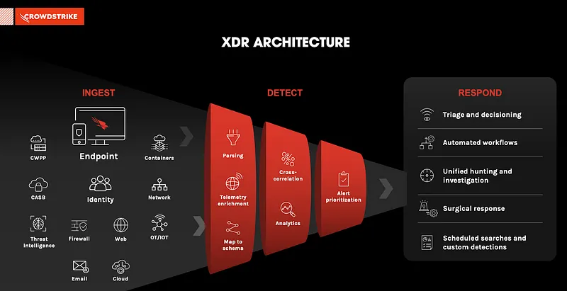
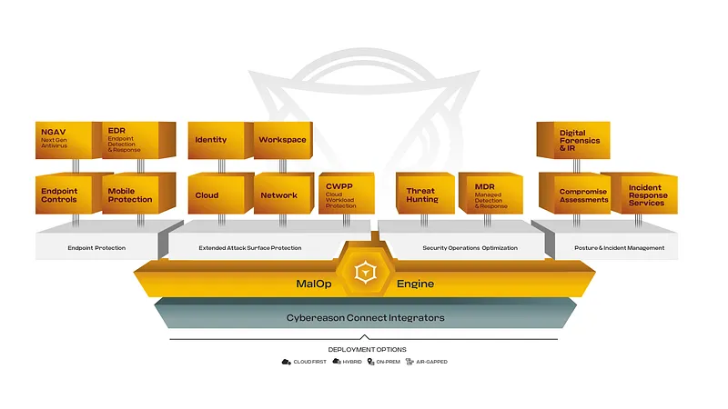
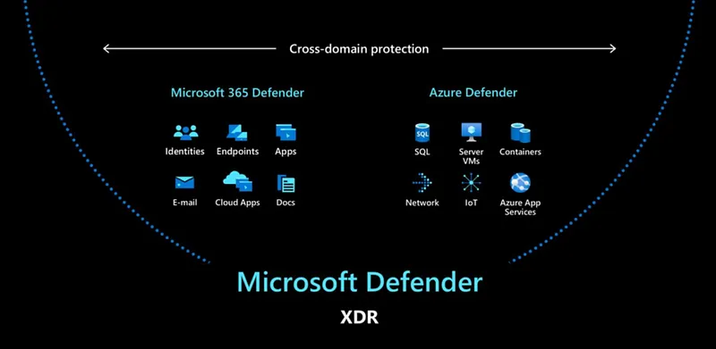
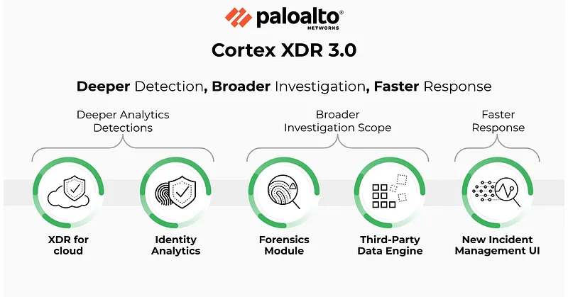
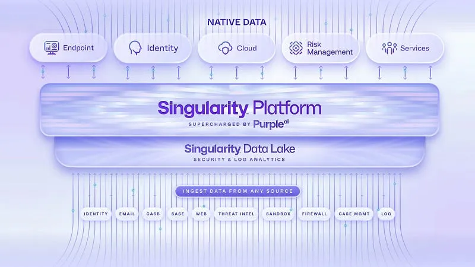
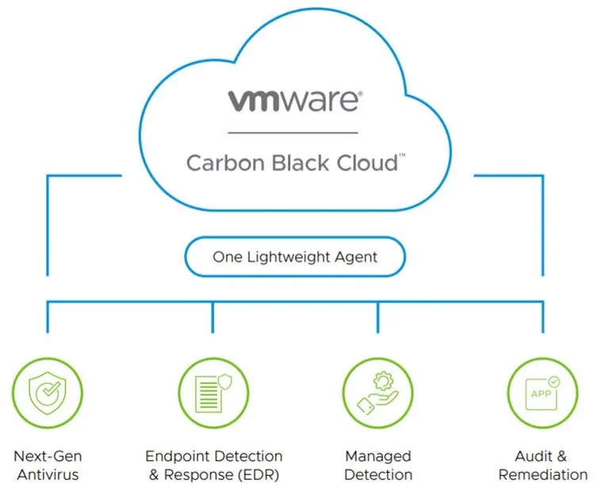
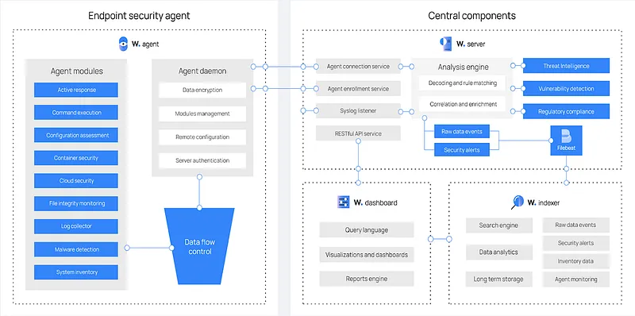
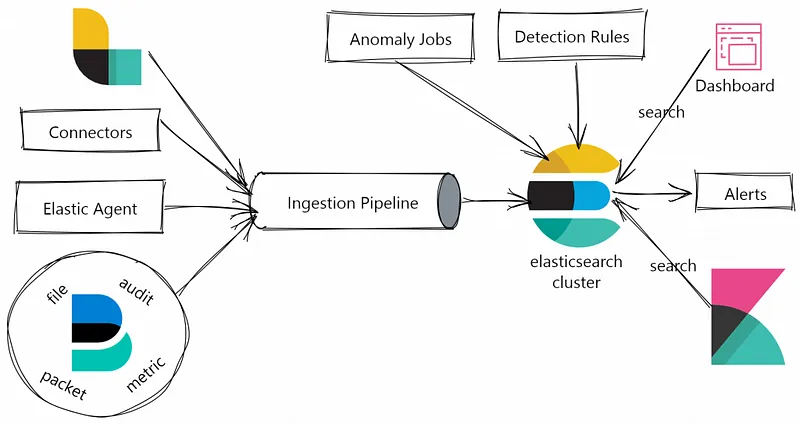

Bu yazımda, dünya genelinde popüler olarak kullanılan uç nokta güvenliği çözümlerine göz atacağız. Bu çözümleri özellikler, artıları ve eksileri ile ele alacağız.

Dijitalleşen dünyada bilgi güvenliği artık sadece kurumsal sınırları korumaktan ibaret değil. Bu sınırların ötesindeki tehditleri de tespit etmek, değerlendirmek ve bunlara yanıt vermek gerekiyor. Bu bağlamda, Endpoint Detection and Response (EDR) ve eXtended Detection and Response (XDR) sistemleri, siber güvenlik tehditlerine karşı savunma ve bunlara yanıt verme konusunda en gelişmiş sistemlerden biri olarak ön plana çıkıyor.

## EPP, EDR ve XDR Arasındaki Farklar

Güvenlik çözümlerini kıyaslarken sadece veri toplama (telemetri) girdilerine değil, yönetim modellerine ve işletme maliyetine (TCO) odaklanmak gerekir. Modern uç nokta güvenlik katmanları şu şekilde ayrışmaktadır:

| Özellik | EPP (Endpoint Protection) | EDR (Endpoint Detection & Response) | XDR (Extended Detection & Response) |
| :--- | :--- | :--- | :--- |
| **Yönetim Tarzı** | Pasif / Kuralcı ("Kur ve Unut"). Politikalar merkezden basılır. | Aktif / Analitik. Sürekli veri takibi ve tehdit avcılığı (Hunting) gerektirir. | Hibrit / Otomatize. Farklı sistemlerin merkezi yönetim orkestrasyonudur. |
| **Alarm Tipi** | Binary (0/1). Tehdit ya vardır ya yoktur. Genellikle "Temizlendi" bilgisidir. | Konseptsel / Bağlamsal. Davranışın neden şüpheli olduğunu kanıtlarla sunar. | Bütünsel (Storyline). Saldırı zincirinin (Kill Chain) tamamını tek hikaye gibi sunar. |
| **Alarm Yönetimi** | Az sayıda alarm üretir ancak False Negative (kaçırma) oranı yüksektir. | Küçük şüpheli hareketleri de raporlar. "Alarm Yorgunluğu" (Alert Fatigue) yaratabilir. | Akıllı algoritmalarla farklı logları birleştirir, alarm sayısını %50-70 azaltır. |
| **Müdahale (Response)** | Dosya karantinası, USB engelleme, sistem taraması. | Cihaz izole etme, süreci (process) öldürme, RAM dökümü alma, komut çalıştırma. | EDR aksiyonlarına ek olarak; ağda IP engelleme, bulut oturumunu kapatma, e-posta temizleme. |
| **İhtiyaç Duyulan Kaynak** | IT veya Sistem Yöneticisi tarafından kolayca yönetilebilir. | Uzman SOC analisti veya güvenlik ekibi gerektirir. | Üst seviye güvenlik mimarı veya MDR (Yönetilen Hizmet) desteği gerektirir. |

---

## CrowdStrike Falcon

CrowdStrike Falcon, bulut tabanlı bir uç nokta algılama ve yanıt (EDR) platformudur. Aynı zamanda XDR özellikleri de sunar. Tamemen bulut odaklı yapısı sayesinde hızlı dağıtım ve ölçeklenebilirlik avantajları sunar. Tek bir hafif istemci yazılımı (agent) üzerinden çalışarak kapsamlı koruma sağlar, bu da uç nokta performansı üzerindeki etkiyi en aza indirir. Özellikle proaktif tehdit avcılığı yetenekleri ve kapsamlı tehdit istihbarat ağı ile biliniyor. "Falcon Discover" modülü ile uygulama envanteri, hesap hijyeni ve lisans yönetimi sağlarken, "Falcon for IT" modülü osquery altyapısı sayesinde sistemler üzerinde SQL benzeri sorgularla gerçek zamanlı BT operasyon verisi çekmeyi mümkün kılar.

*   **Artıları:** Son derece hafif ajan mimarisi, yapay zeka tabanlı Charlotte AI doğal dil desteği, zengin tehdit istihbaratı ve pazar liderliği.
*   **Eksileri:** Modüler lisanslama yapısı nedeniyle toplam sahip olma maliyetinin (TCO) yüksek olması; zafiyet tespiti yapsa da doğrudan fiziksel yama dağıtım yeteneğinin bulunmaması.

<https://www.crowdstrike.com/cybersecurity-101/what-is-xdr/>

## Cybereason

Cybereason, siber güvenlik endüstrisinde önemli bir oyuncudur ve özellikle uç nokta tespit ve yanıt (EDR) yetenekleriyle bilinir. Cybereason, EDR ve EPP yeteneklerini şirket içinde (on-premise) sunabilen nadir çözümlerden biridir. XDR yetenekleri ise sadece bulut platformunda mevcut.

Platformun en belirgin özelliği olan "Malop" (Malicious Operation - Kötü Amaçlı Operasyon), tehditleri otomatik olarak tespit etmek, kötü niyetli bir operasyonun veya saldırının tüm bileşenlerini ve etkilerini görselleştirmek ve analiz etmek için tasarlanmıştır. Güvenlik uzmanlarının olayları daha geniş bir bağlamda değerlendirmelerini ve kötü niyetli faaliyetlerin tüm hikayesini görmelerini sağlar.

*   **Artıları:** Saldırı hikayesini tek ekranda sunan başarılı "Malop" arayüzü, şirket içi (on-premise) kurulum esnekliği.
*   **Eksileri:** Gelişmiş XDR özelliklerinin buluta bağımlı olması, rakiplerine kıyasla daha dar bir entegrasyon ekosistemi.

<https://www.cybereason.com/platform>

## Microsoft Defender for Endpoint

Eskiden Microsoft Defender Advanced Threat Protection (ATP) olarak bilinen bu çözüm, Windows işletim sistemine tamamen entegre ve yerleşik olarak çalışan kapsamlı bir EDR ve XDR platformudur. Microsoft, Defender platformunu diğer 365 güvenlik ürünleriyle entegre ederek Microsoft 365 Defender adı altında genişletilmiş bir XDR çözümüne dönüştürmüştür.

Gelişmiş algoritmalar ve yapay zeka tabanlı analizler kullanarak karmaşık saldırıları tespit eder ve olaylara hızlı yanıt verir. Windows ekosistemi üzerinde ek bir ajan kurulumuna ihtiyaç duymaması, kurumsal yapılarda operasyonel yükü ciddi oranda azaltır.

*   **Artıları:** Windows işletim sistemine gömülü olması (ajan kurulumu gerektirmez), Microsoft 365 ekosistemiyle kusursuz entegrasyon.
*   **Eksileri:** Windows dışı (Linux/macOS) işletim sistemlerinde yönetim zorluğu, en yüksek güvenlik özelliklerinin yalnızca pahalı lisans paketlerinde (E5/G5) sunulması.

<https://www.infusedinnovations.com/blog/secure-intelligent-workplace/budgeting-for-microsoft-defender-xdr-and-zero-trust-security>

## Palo Alto Cortex XDR

Palo Alto Cortex XDR, ağ, uç nokta ve bulut verilerini birleştirerek siber tehditleri tespit eden ve analiz eden genişletilmiş bir algılama ve yanıt (XDR) çözümüdür. Sadece uç nokta telemetrisine odaklanmak yerine Palo Alto'nun yeni nesil güvenlik duvarlarından (NGFW) ve bulut bileşenlerinden gelen verileri ilişkilendirir.

"Pathfinder" teknolojisi sayesinde ajan yüklenemeyen IoT ve tıbbi cihazların ağ davranışlarını analiz edebilir. Ayrıca otomatik tehdit avcılığı ve olay müdahalesi gibi güçlü SOAR yetenekleri barındırır.

*   **Artıları:** Ağ ve uç nokta telemetrisi arasında sektördeki en güçlü korelasyon yeteneği, NGFW entegrasyonuyla otomatik ağ seviyesi izolasyon.
*   **Eksileri:** En iyi verimi alabilmek için Palo Alto ağ cihazlarına bağımlılık gerektirmesi, yüksek lisans ve veri depolama maliyetleri.

<https://www.xcitium.com/palo-alto-cortex-xdr/>

## SentinelOne

SentinelOne Singularity, siber güvenlik dünyasında yapay zeka odaklı otonom yapısıyla öne çıkan lider bir XDR platformudur. Ajan seviyesinde çalışan yerel davranışsal motoru sayesinde ağ bağlantısı olmasa bile tehditleri tespit edebilir ve engelleyebilir.

Platformun "Storyline" teknolojisi, süreçlerin tüm yaşam döngüsünü benzersiz bir kimlikle takip eder. "Singularity Ranger" modülü, her ajanı birer ağ sensörüne dönüştürerek alt ağlardaki yönetilmeyen cihazları aktif ve pasif yöntemlerle haritalandırır. Ayrıca, "Remote Script Orchestration (RSO)" ile tüm filoda toplu olarak PowerShell/Bash betikleri çalıştırarak otonom BT operasyonları yürütebilir.

*   **Artıları:** Windows Shadow Copy (VSS) servisinden bağımsız çalışan tahrif edilemez (Tamperproof) geri yükleme (Rollback) mekanizması, Ranger ile otonom ağ keşfi, internet bağlantısı olmadan da çalışabilen otonom ajan motoru.
*   **Eksileri:** Gelişmiş özelliklerin (Ranger, RSO, zafiyet yönetimi) ek lisanslara (Add-on) tabi olması ve yönetim paneli paket yapısının karmaşıklığı.

<https://www.sentinelone.com/platform/>

## VMware Carbon Black

VMware Carbon Black, hem bulut tabanlı hem de yerel kurulum (on-premise) seçenekleri sunan güçlü bir EDR/XDR platformudur. Özellikle sanallaştırma altyapılarıyla (VMware vSphere/vCenter) hipervizör seviyesinde derin entegrasyon sağlayarak sanal sunucu ve iş yüklerinin güvenliğini optimize eder.

Davranışsal analizler ve makine öğrenimi kullanarak gelişmiş tehditlere karşı koruma sağlar. Şirket içi (on-premise) kurulum seçeneği, regülasyona tabi sektörlerdeki veri egemenliği gereksinimlerini karşılamak için kritik bir avantaj sunar.

*   **Artıları:** Sanallaştırma katmanıyla benzersiz entegrasyon (hipervizör tabanlı güvenlik), on-premise veri merkezleri için kararlı yapı.
*   **Eksileri:** Broadcom satın alımı sonrasında ortaya çıkan lisanslama belirsizlikleri, eski sistemlerde görece yüksek kaynak tüketimi.

<https://www.vmware.com/docs/vmw-datasheet-carbon-black-hosted-edr>

## Wazuh

Wazuh; uç nokta koruma, log yönetimi, tehdit avcılığı, zafiyet analizi ve uyumluluk denetimlerini tek bir çatıda birleştiren popüler bir açık kaynaklı güvenlik platformudur. Dosya bütünlüğü izleme (FIM) ve log analizi yetenekleriyle SIEM benzeri bir deneyim sunar.

Küçük ve orta ölçekli işletmeler için maliyet etkin bir çözüm sunan Wazuh, PCI DSS, GDPR ve HIPAA gibi regülasyonlar için hazır uyumluluk panelleri içerir.

*   **Artıları:** Tamamen açık kaynaklı ve ücretsiz olması, yüksek özelleştirilebilirlik, log toplama ve dosya izleme yeteneklerinin gücü.
*   **Eksileri:** Kurulum ve ince ayarların teknik uzmanlık gerektirmesi, profesyonel teknik destek ekosisteminin ticari rakipleri kadar yaygın olmaması.

<https://documentation.wazuh.com/current/getting-started/components/index.html>

## Elastic Security

Elastic Security, açık kaynaklı Elastic Stack (ELK) altyapısı üzerine inşa edilmiş güçlü bir SIEM ve uç nokta güvenlik çözümüdür. Bulut, yerel ve hibrit ortamlarda gerçek zamanlı tehdit analizi yapabilir.

Büyük miktarda veriyi indekslemeden arayabilen esnek mimarisi sayesinde, tehdit avcılarına hızlı analiz imkanı sağlar. Yapay zeka destekli davranış analiz modülleriyle anormal durumları tespit eder.

*   **Artıları:** Çok büyük ölçekli log verilerini saniyeler içinde arama ve analiz etme gücü, esnek dashboard tasarımları.
*   **Eksileri:** Log hacmi arttıkça donanım ve depolama maliyetlerinin hızla büyümesi, Elastic arama sorgu dillerini (ESQL/KQL) öğrenme gereksinimi.

<https://dzlab.github.io/2023/04/26/elastic-cybersecurity/>

## Bitdefender GravityZone

Bitdefender GravityZone, sanallaştırma katmanlarındaki derin tecrübesiyle bilinen hibrit ve on-premise uyumlu bir uç nokta koruma (EPP/EDR) platformudur. Docker tabanlı mikro servis mimarisi sayesinde Linux tabanlı sanal cihazlar (Virtual Appliance) olarak kolayca kurulabilir ve Windows Server lisans maliyetini ortadan kaldırır.

"BEST" (Bitdefender Endpoint Security Tools) adı verilen tek bir modüler ajan üzerinden çalışır. "Ransomware Mitigation" modülü, şüpheli şifreleme faaliyeti algılandığı anda hedef dosyaların tahrif edilemez (tamper-proof) yedeklerini alır ve saldırı engellendikten sonra dosyaları otomatik olarak geri yükler. Ayrıca ağ paylaşımları üzerinden gelen uzaktan şifreleme saldırılarını (Remote Encryption) da IP seviyesinde engelleyebilir.

*   **Artıları:** Entegre fiziksel yama yönetimi (Patch Management), sanal sunucular için düşük kaynak tüketimi (Security Server / central scanning), ağ üzerinden gelen fidye yazılımlarını engelleme yeteneği.
*   **Eksileri:** Zafiyet ve yama yönetiminin ek lisans gerektirmesi, modern EDR özelliklerinin eski işletim sistemi (legacy) sürümlerinde desteklenmemesi.

<https://www.bitdefender.com/business/support/en/77212-376327-endpoint-protection.html>

## Trend Micro Apex One

Trend Micro Apex One, kurumsal on-premise mimarilerde "Sanal Yamalama" (Virtual Patching) teknolojisiyle ayrışan bir uç nokta güvenlik çözümüdür. Apex One Server ve Apex Central bileşenleri üzerinden Windows IIS ve SQL Server tabanlı bir mimariyle yönetilir.

Sanal Yamalama teknolojisi, bir zafiyet açıklandığı andan itibaren fiziksel yama uygulanana kadar geçen sürede, zafiyeti hedef alan exploit paketlerini ağ seviyesindeki HIPS motoruyla engeller. Bu özellik, sistemlerin yeniden başlatılmasını gerektirmediği için endüstriyel kontrol sistemleri (OT/ICS) ve kritik sunucularda operasyonel kesintiyi önler.

*   **Artıları:** Windows XP/7 ve Server 2008 gibi eski (Legacy) sistemler için mükemmel genişletilmiş destek, sistem yeniden başlatma gerektirmeyen ağ seviyesinde koruma.
*   **Eksileri:** On-premise yönetim sunucusunun Windows Server ve MSSQL bağımlılığı, HIPS kurallarının eski donanımlarda ağ trafiğini kısmen yavaşlatabilmesi.

<https://docs.trendmicro.com/en-us/documentation/article/trend-micro-apex-central-2019-online-help-syslog-mapping-cef>

## Kaspersky Endpoint Security for Business

Kaspersky Endpoint Security (KES), yerel kurulum (on-premise) pazarında sunduğu kapsamlı sistem yönetim yetenekleriyle öne çıkan bir platformdur. Kaspersky Security Center (KSC) aracılığıyla hiyerarşik (Master/Slave) sunucu yapısıyla coğrafi olarak dağınık ağları başarıyla yönetir.

Saldırı anında devreye giren "System Watcher" ve "Remediation Engine" modülleri, Windows VSS servisinden bağımsız olarak çalışarak kayıt defteri değişikliklerini temizler ve şifrelenmiş dosyaları korumalı yerel yedeklerden geri yükler. "Systems Management" modülü ise Windows Update (WSUS) alternatifi olarak çalışarak işletim sistemi imaj dağıtımı ve üçüncü parti uygulama yamalamasını tek konsoldan yürütür.

*   **Artıları:** Çok güçlü yerel sistem kurtarma (VSS bağımsız), zengin IT operasyon ve yama yönetim araçları, eski sistemler için hafifletilmiş "Embedded Systems Security" ajanı.
*   **Eksileri:** Bazı batı pazarlarında maruz kaldığı jeopolitik kısıtlamalar ve regülatif engeller, yönetim ajanı (Network Agent) ile güvenlik uygulamasının ayrı ayrı güncellenme gereksinimi.

<https://support.kaspersky.com/KESB/14.2/en-US/181954.htm>

## ESET PROTECT

ESET PROTECT On-Prem, siber güvenlik dünyasında "hafiflik" ve düşük kaynak tüketimi felsefesini koruyarak modern XDR özelliklerini entegre eden bir platformdur. ESET PROTECT Server hem Windows hem Linux platformlarına kurulabildiği gibi hazır sanal cihaz (appliance) olarak da dağıtılabilir.

Fidye yazılımlarına karşı "Ransomware Remediation" modülü ile geçici yedeklerden otomatik geri dönme imkanı sunar. Intel TDT (Threat Detection Technology) entegrasyonu sayesinde, fidye yazılımı şifreleme yaparken donanım seviyesinde (CPU PMU telemetrisiyle) tespiti gerçekleştirir. Bu sayede bellek içi (in-memory) gizlenen gelişmiş zararlılar bile performans kaybı yaşanmadan engellenir.

*   **Artıları:** Son derece düşük CPU ve RAM kullanımı (VDI ortamları ve eski donanımlar için ideal), donanım tabanlı (Intel TDT) gelişmiş fidye yazılımı analizi.
*   **Eksileri:** Linux platformları için yama yönetim yeteneklerinin henüz gelişim aşamasında olması, en kapsamlı koruma özellikleri için üst düzey lisans paketlerine ihtiyaç duyulması.

<https://help.eset.com/protect_admin/11.0/en-US/admin_server_settings_syslog.html>

## Tanium

Tanium XEM (Converged Endpoint Management), geleneksel merkezi veritabanı yapılarının aksine tescilli "Doğrusal Zincir" (Linear Chain) mimarisiyle çalışan bütünleşik bir uç nokta ve operasyon yönetim platformudur. Bu mimaride sorgular sunucudan tek tek cihazlara gitmez; ajanlar ağ üzerinde bir zincir oluşturarak sorguyu birbirine aktarır.

"Tanium Performance" modülü sayesinde cihazların CPU, RAM, disk ve ağ geçmişini saniye saniye kaydederek "dün yavaş çalışan süreçlerin hangileri olduğunu" görselleştirir. "Tanium Patch" ve "Tanium Asset" modülleri, milyonlarca uç noktada 15 saniye içinde gerçek zamanlı varlık envanteri çıkarmayı ve yama dağıtmayı sağlar. Yama dosyaları P2P (peer-to-peer) teknolojisiyle WAN hattını yormadan şubeler arasında paylaşılır.

*   **Artıları:** Eşi benzeri olmayan gerçek zamanlı sorgu hızı (saniyeler içinde binlerce cihazdan yanıt), WAN bant genişliğinde %98'e varan tasarruf sağlayan yama dağıtımı, detaylı performans sorun giderme geçmişi.
*   **Eksileri:** Çok yüksek ilk yatırım maliyeti, küçük ve orta ölçekli işletmeler (KOBİ) için aşırı karmaşık ve büyük bir altyapı gerektirmesi.

<https://www.tanium.com/products/tanium-performance/>

## Sophos Intercept X

Sophos Intercept X, "Synchronized Security" (Senkronize Güvenlik) felsefesiyle tasarlanmış, uç nokta ile ağ katmanını doğrudan konuşturan bir güvenlik çözümüdür. Uç nokta ajanı ile Sophos Firewall cihazları arasında kurulan "Security Heartbeat" (Güvenlik Kalp Atışı) kanalı sayesinde durum bilgisi sürekli paylaşılır.

Bir uç noktada fidye yazılımı veya zararlı aktivite tespit edildiğinde (cihazın durumu kırmızıya döndüğünde), firewall bu bilgiyi anında alarak cihazı ağ seviyesinde izole eder ve diğer VLAN'lara veya internete erişimini keser. "Synchronized Application Control" özelliği ise ağda tanımlanamayan şifreli bir trafik algılandığında uç noktaya sorarak trafiği üreten uygulamanın adını ve yolunu öğrenir, böylece ağ yöneticilerine tam görünürlük sağlar.

*   **Artıları:** Uç nokta ve güvenlik duvarı arasında otomatik ve otonom izolasyon zinciri, bilinmeyen ağ uygulamalarını kaynağında tespit etme gücü.
*   **Eksileri:** En yenilikçi özelliklerinin çalışabilmesi için tüm altyapının Sophos donanımlarıyla (Sophos Firewall) donatılması gerekliliği.

<https://www.sophos.com/en-us/products/intercept-x>

## Fortinet FortiEDR

Fortinet FortiEDR, ağ güvenliği devi Fortinet'in "Security Fabric" ekosistemine entegre ettiği, patentli gerçek zamanlı enfeksiyon sonrası koruma (post-infection protection) teknolojisine sahip bir EDR/XDR çözümüdür.

Cihazlar üzerinde zararlı yazılım çalışsa ve şifreleme eylemine başlasa bile, FortiEDR eylemin gerçekleşmesini (dosyaların değiştirilmesini veya ağa sızmasını) çekirdek seviyesinde bloke eder. "FortiTelemetry" protokolü ile FortiGate güvenlik duvarlarıyla entegre çalışarak, SD-WAN veya SaaS uygulama performans ölçümlerini (Gecikme, Paket Kaybı vb.) uç noktadan ölçerek NOC ekiplerinin kullanımına sunar.

*   **Artıları:** Saldırı başladıktan sonra bile veri sızıntısını ve şifrelemeyi durdurabilen otonom çekirdek koruması, Fortinet Fabric ekosistemiyle kusursuz uyum.
*   **Eksileri:** Yönetim konsolu arayüzünün diğer bağımsız (pure-play) EDR çözümlerine göre daha az sezgisel olması, Fortinet dışı ağlarda entegrasyon gücünün sınırlanması.

<https://www.fortinet.com/products/endpoint-security/fortiedr>

---

## NOC ve SOC Yakınsaması (Bütünleşik BT Operasyonları)

Siber güvenlik (SOC) ve BT altyapı yönetimi (NOC) ekiplerinin farklı veri kaynakları, farklı yazılımlar ve farklı terminolojiler kullanması, operasyonel kör noktalara ve bir olay anında kök neden (RCA) tespit süresinin uzamasına neden olur. 

Modern XDR ve XEM (Converged Endpoint Management) ajanları, çekirdek (kernel) seviyesindeki derin erişimleri sayesinde artık geleneksel RMM (Remote Monitoring) ve NMS (Network Monitoring) sistemlerinin rollerini de üstlenmektedir:

1.  **Tek Ajan Mimarisi (Agent Consolidation):** Uç noktalara performans izleme için ayrı, yama dağıtımı için ayrı, antivirüs için ayrı ajanlar kurmak "Ajan Yorgunluğu"na ve kaynak israfına yol açar. Modern ajanlar (örn. SentinelOne, CrowdStrike, Tanium) tek bir hafif servis üzerinden hem güvenlik hem de IT operasyon verilerini toplar.
2.  **Otonom Varlık Keşfi (Asset Discovery):** SentinelOne Ranger veya Tanium Discover gibi modüller, her uç noktayı aktif/pasif bir ağ tarayıcısına dönüştürür. Alt ağlarda şirket ağına izinsiz dahil edilen (Shadow IT) veya ajansız çalışan tüm cihazları, ağ trafiği yaratmadan tespit eder ve güvenlik duvarı seviyesinde otonom izole edebilir.
3.  **Performans ve Çalışan Deneyimi İzleme (DEX):** Tanium Performance veya CrowdStrike Falcon for IT (osquery altyapılı) gibi modüller, bir kullanıcının bilgisayarı yavaşladığında veya çöktüğünde "o esnada hangi uygulamanın ne kadar CPU/Disk tükettiğini" geçmişe dönük saniye çözünürlüğünde göstererek IT yardım masasının sorun çözme süresini (MTTR) radikal biçimde düşürür.
4.  **Uzaktan Yönetim ve Betik Çalıştırma (RSO & RTR):** SentinelOne Remote Script Orchestration (RSO) veya CrowdStrike Real Time Response (RTR), sistem yöneticilerinin binlerce cihazda saniyeler içinde SYSTEM yetkileriyle PowerShell/Bash scriptleri çalıştırmasını, disk temizlemesini, duran servisleri tetiklemesini sağlar. Bu yetenekler SOAR (Workflow) motorlarıyla birleşerek "disk dolduğunda otomatik temizleme betiğini çalıştır" şeklinde kendi kendini iyileştiren (Self-Healing) BT altyapılarını mümkün kılar.