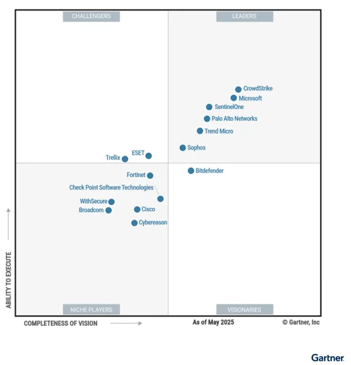
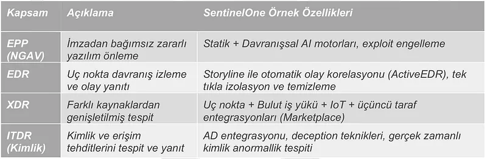
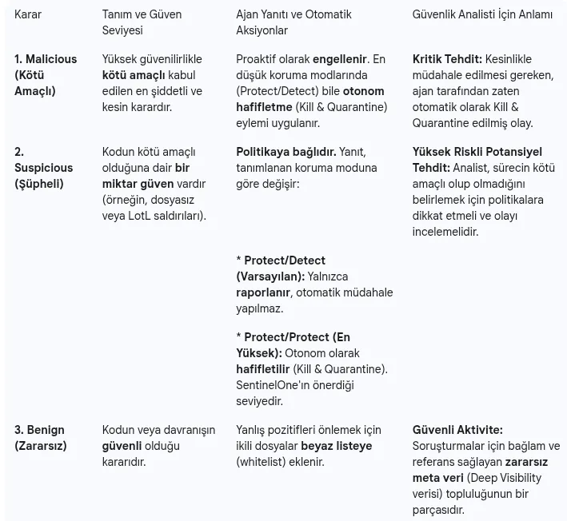
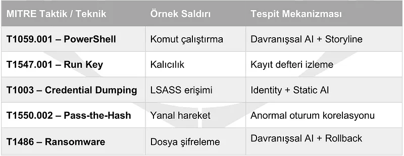
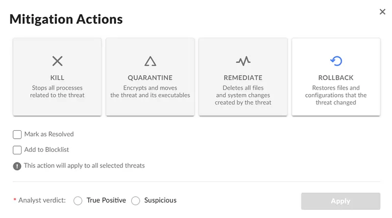
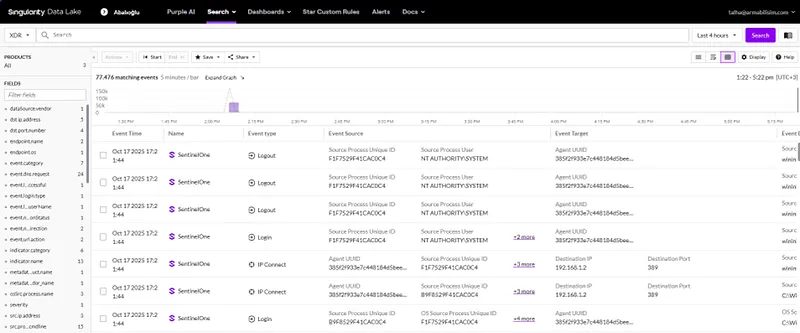
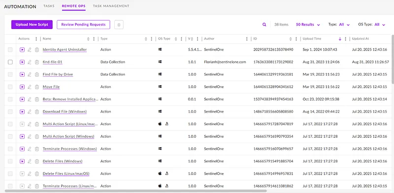
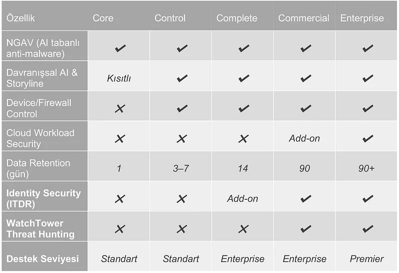
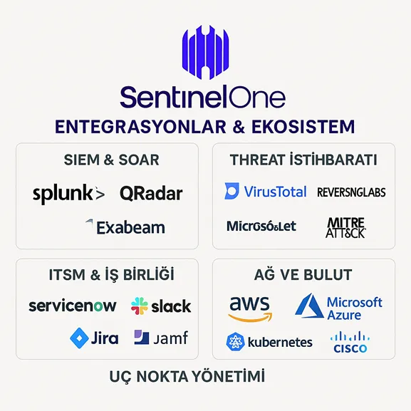
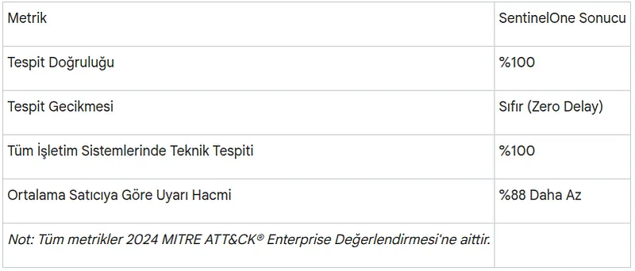

**A Comprehensive Technical Guide from Architecture to AI-Powered XDR**

<div class="audio-narration">
  <p><strong>🎙️ Audio narration of the blog post:</strong> This article will be available to listen to from the player above once the audio file is ready. Continue reading for technical details.</p>
</div>


## Quick Summary

- **Autonomous Architecture:** Local AI capable of making decisions at the endpoint even without cloud connectivity.
- **Storyline™:** Patented technology that distills a meaningful attack story from thousands of events.
- **1-Click Rollback:** VSS-based recovery that reverses ransomware damage in seconds.
- **Broad Coverage:** Integration of EPP, EDR, XDR, and Identity Security (ITDR) in a single agent.
- **Performance:** 100% detection and zero latency score in MITRE 2024 evaluations.

## Introduction: The New Paradigm of Autonomous Security

In today's cybersecurity landscape, organizations face complex threats targeting multiple attack surfaces such as endpoints, cloud, and identity. The SentinelOne Singularity Platform is a **Gartner 2024 Magic Quadrant** leader that unifies all these layers under a single autonomous platform.

The platform provides advanced endpoint protection (EPP), endpoint detection and response (EDR), extended detection and response (XDR), and identity-based threat detection and response (ITDR) capabilities in a unified architecture.



---

## 1. Platform Architecture and Single Agent Power

SentinelOne's architecture is designed on the principle of **"Single Agent, Multiple Engines."** This lightweight agent operates at the operating system kernel level, monitoring file systems, processes, and memory activities in real-time.

### 1.1. Resource Efficiency
The SentinelOne agent is optimized to ensure zero impact on endpoint performance:
*   **CPU Usage:** 0–4% (Slight increase only during active scans)
*   **Memory Usage:** ~20MB
*   **Disk Space:** ~200MB



### 1.2. Autonomous Decision Mechanism
The most critical architectural feature is the local execution of detection and response logic. The agent can block threats using built-in AI models even without a cloud connection (offline). This feature is vital for isolated networks or OT/ICS systems.



---

## 2. Multi-Layered Threat Detection Flow

SentinelOne monitors the entire lifecycle of a file—from its arrival on the system to its execution—through two main phases:

### Phase 1: Pre-Execution - Static AI
Triggers as soon as a file is written to disk (On-Write). It analyzes the file structure using machine learning models without requiring signatures or hashes, blocking known malware and ransomware variants before they can ever run.

### Phase 2: On-Execution - Behavioral AI
Triggers as soon as a file is executed. It monitors API calls, network connections, and system changes. It specifically detects **fileless attacks**, **Living off the Land (LotL)** techniques, and **zero-day (0-day)** exploits.



<div class="render-cards">
<article class="render-card render-card-static reveal-on-scroll">
<div class="render-card-head">
<span class="render-badge">PRE-EXECUTION</span>
<h3>Static AI</h3>
</div>
<p>Triggers before a file is executed. Analyzes file structure without requiring signatures.</p>
<ul>
<li><strong>Detection:</strong> Known malware and Trojans.</li>
<li><strong>Advantage:</strong> Zero latency, proactive blocking.</li>
<li><strong>Technology:</strong> Deep learning-based file scanning.</li>
</ul>
</article>

<article class="render-card render-card-behavioral reveal-on-scroll">
<div class="render-card-head">
<span class="render-badge">ON-EXECUTION</span>
<h3>Behavioral AI</h3>
</div>
<p>Triggers the moment a process starts. Monitors application behaviors in real-time.</p>
<ul>
<li><strong>Detection:</strong> Fileless and 0-day attacks.</li>
<li><strong>Advantage:</strong> Intent-focused detection, signatureless protection.</li>
<li><strong>Technology:</strong> API and memory activity monitoring.</li>
</ul>
</article>

<article class="render-card render-card-storyline reveal-on-scroll">
<div class="render-card-head">
<span class="render-badge">CONTEXT</span>
<h3>Storyline™</h3>
</div>
<p>Automatically correlates scattered EDR events to create a single attack story.</p>
<ul>
<li><strong>RCA:</strong> Reduces root cause analysis to seconds.</li>
<li><strong>Visibility:</strong> Visually presents the attack chain.</li>
<li><strong>Efficiency:</strong> Reduces analyst workload by 80%.</li>
</ul>
</article>

<article class="render-card render-card-rollback reveal-on-scroll">
<div class="render-card-head">
<span class="render-badge">RECOVERY</span>
<h3>Rollback</h3>
</div>
<p>Returns systems to a clean state, especially after ransomware attacks.</p>
<ul>
<li><strong>Mechanism:</strong> Uses Windows VSS infrastructure.</li>
<li><strong>Speed:</strong> Data recovery within seconds.</li>
<li><strong>Security:</strong> Eliminates the need to pay ransoms.</li>
</ul>
</article>
</div>

---

## 3. Patented Technologies: Storyline™ and ActiveEDR

SentinelOne's most significant differentiator is the **Storyline™** technology.

*   **Automatic Correlation:** Every event is tagged with a unique "Storyline ID." For example, a Word document triggering PowerShell, which then loads a DLL, is unified into a single event story.
*   **Root Cause Analysis (RCA):** Analysts can view the entire attack chain from beginning to end in a single visual interface, rather than getting lost in thousands of raw logs. This reduces investigation time to seconds.

---

## 4. Incident Response: Rollback and Remediation

SentinelOne offers a unique capability to return systems to a clean state following an attack:

*   **One-Click Rollback:** Specifically designed for ransomware attacks. Using the Windows **Volume Shadow Copy Service (VSS)** infrastructure, it returns encrypted files to their clean, pre-attack state with a single click.
*   **Tamper Protection:** To prevent advanced attackers from disabling the EDR agent, agent services are password-protected and resistant to kernel-level interference.



---

## 5. Extended Visibility: Ranger and Deep Visibility

### 5.1. Ranger® (Network Discovery)
The Ranger module turns agents into sensors, discovering and providing visibility into unmanaged devices (IoT, printers, guest devices) on the network. It can also trigger automatic agent deployment to these devices.

### 5.2. Deep Visibility and S1QL
Telemetry data is stored in the cloud and can be queried using the **S1QL** language. For example, to hunt for processes that ran a specific command in the last 180 days:

```sql
SELECT Timestamp, DeviceName, ProcessName, CommandLine  
FROM ProcessActivities  
WHERE LOWER(CommandLine) LIKE '%net user%' AND Timestamp > NOW()-180d;
```



---

## 6. Autonomous SOC: Purple AI and STAR

*   **Purple AI:** A generative AI (GenAI) powered security assistant. It responds to natural language queries ("Summarize suspicious PowerShell activity in the last 24 hours") and performs automatic triage.
*   **STAR (Storyline Active Response) Rules:** Allows analysts to turn custom queries into autonomous detectors. Actions such as automatic device isolation can be assigned when a specific rule is triggered.



---

## 7. Licensing and Package Comparison

SentinelOne offers five main packages tailored to corporate needs:

| Feature / Package | Core | Control | Complete | Commercial | Enterprise |
| :--- | :---: | :---: | :---: | :---: | :---: |
| **NGAV (Static AI)** | Yes | Yes | Yes | Yes | Yes |
| **Behavioral AI** | Yes | Yes | Yes | Yes | Yes |
| **Rollback & Remediation** | Yes | Yes | Yes | Yes | Yes |
| **Firewall & Device Control** | No | Yes | Yes | Yes | Yes |
| **Deep Visibility (EDR)** | No | No | Yes | Yes | Yes |
| **STAR Rules** | No | No | Yes | Yes | Yes |
| **Identity Protection (ITDR)** | No | No | Partial | Yes | Yes |
| **Purple AI** | Optional | Optional | Optional | Yes | Yes |
| **Data Retention (DV)** | 14 Days | 14 Days | 14 Days | 90 Days | 90-365+ Days |



---

## 8. Deployment and Management

*   **Flexible Deployment:** SaaS (Cloud), On-Prem, or Hybrid deployment options are available.
*   **Automation:** Fully automated deployment is supported through tools like Microsoft Intune, SCCM, and GPO.
*   **Singularity Marketplace:** Offers one-click integration with 3rd-party solutions like ServiceNow, Splunk, Okta, and QRadar via over 340 API functions.



---

## Conclusion: Strategic Value



In the **MITRE ATT&CK 2024** evaluations, SentinelOne proved its technological leadership with a 100% detection rate and zero latency. By producing **88% less noise (alarms)** than the industry average, it enables SOC teams to focus on actual threats.

Choosing SentinelOne is not just an antivirus replacement; it is a transition to an autonomous defense architecture at the speed of AI.
